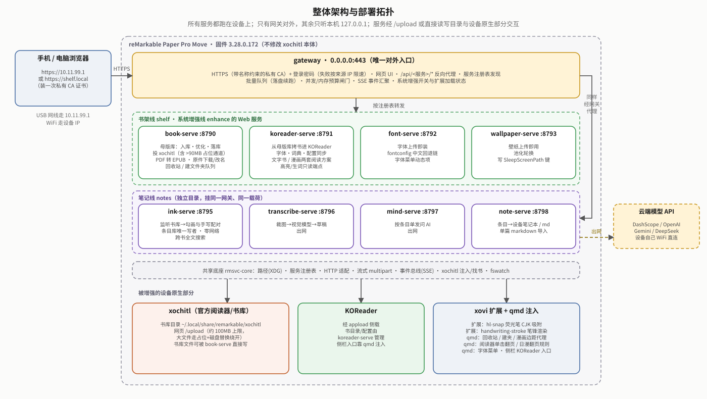

# cang-jie

**[English](docs/README.en.md)**

reMarkable Paper Pro Move 的设备增强套件——**不修改 xochitl（设备官方阅读/笔记应用）本体**，
靠 [xovi](https://github.com/asivery/xovi)（第三方扩展加载框架）加载的小插件，加上一组跑在设备上的
独立 Web 服务，给设备补上书籍管理、笔记增强和系统优化。

> **这个页面回答**：这是什么、能干什么、怎么装/卸、去哪看细节。
> 想 10 分钟看懂全貌读 [`docs/OVERVIEW.md`](docs/OVERVIEW.md)；最近改了什么读 [`docs/CHANGELOG.md`](docs/CHANGELOG.md)。
>
> 这是带完整开发历史的**私有**仓库；对外分享的是精简的公开发行版 [`rm-tweak`](https://github.com/bbq191/rm-tweak)
> （无开发历史，Apache-2.0；据 2026-09-22 查看其 GitHub 目录，含 shelf / notes / enhance / gateway / rmsvc-core / packaging，
> 未见 `defw/`）。

## 能做什么

| 你想要 | 对应的功能 | 在哪 |
|---|---|---|
| 把书弄进设备，而且在墨水屏上好读 | 网页上传/抓网文 → 母版库 → 一键"优化"（排版、目录、封面、脚注）→ 加入原生阅读器或 KOReader；超过 xochitl 约 100MB 上传上限的大书也能进；漫画专门优化 | [`shelf/`](shelf/README.md) |
| 荧光笔勾画 + 旁边手写批注，变成能整理的笔记 | 合上书自动摄取 → 手机页面校对转写、选 AI 模型问答 → 投回设备笔记本或导出 Obsidian markdown | [`notes/`](notes/README.md) |
| 系统层面的小改进 | 荧光笔划中文"划哪吸哪"、手写笔锋渲染、电池诊断、字体/壁纸上传即用 | [`enhance/`](enhance/README.md) |
| 在手机/电脑上统一操作以上功能 | 一个 HTTPS 网页入口（登录密码 + 反向代理各服务） | [`gateway/`](gateway/README.md) |
| 全新设备一条命令装完 | 含固件兼容性校验；对称的一键卸载 | [`packaging/`](packaging/README.md) |

另有两个"幕后"目录：[`rmsvc-core/`](rmsvc-core/README.md)（各 Web 服务共用的基础库，无业务逻辑）和
[`defw/`](defw/README.md)（xochitl 3.28.0.172 的 Ghidra 逆向工程产物，给 xovi 扩展定位 hook 用）。

所有功能都跑在设备**官方系统**之上，不重打包 `xochitl`。整体架构见 [`docs/OVERVIEW.md`](docs/OVERVIEW.md)：



## 快速开始

**只支持 reMarkable Paper Pro Move，固件 3.28.0.172**（目前唯一验证过的版本；安装脚本会校验，不符默认拒装）。

1. 设备上先手动装好生态基础设施：`vellum add xovi`、`vellum add qt-resource-rebuilder`、`vellum add appload`（≥ 0.6.0）、经 appload 侧载 KOReader。这些不属于本项目，安装器不代装。
2. 电脑用 USB 线连上设备，然后：

   ```sh
   git clone https://github.com/bbq191/rm-tweak.git   # 公开发行版；私有开发仓库 cang-jie 只有维护者能 clone
   cd rm-tweak/packaging
   sh install-all.sh 10.11.99.1
   ```
3. 浏览器打开 `https://10.11.99.1/`，默认密码 `shelf`，首次登录强制改密。

想卸载：`sh uninstall-all.sh 10.11.99.1`。完整的前置条件、推荐顺序、风险项、固件升级（OTA）后怎么恢复，见 **[docs/INSTALL.md](docs/INSTALL.md)**。

## 文档导航

| 想了解 | 读 |
|---|---|
| 10 分钟看懂全貌（架构图、一本书的旅程、术语表） | [docs/OVERVIEW.md](docs/OVERVIEW.md) |
| 怎么装 / 卸 / 固件升级后恢复 | [docs/INSTALL.md](docs/INSTALL.md) |
| 安装脚本的结构与本机测试（开发者） | [packaging/README.md](packaging/README.md) |
| 最近改了什么 | [docs/CHANGELOG.md](docs/CHANGELOG.md) |
| 各条线的细节与决策记录 | 上表各线 README 及其 `docs/` 白皮书 |
| 打赏 | [docs/DONATE.md](docs/DONATE.md) |

## 历史与范围

项目最早从"reMarkable 中文输入法"起步（仓库名 `cang-jie` 即"仓颉"，中国传说中造字的人），后来长出了阅读增强、
PKM 知识管理、手写识别等方向。2026-09-11 做过一次大规模仓库整理：中文输入法、完整阅读管线、PKM/手写识别
这几条早期功能线连同它们的逆向基座，整体移出了这个 git 仓库（搬到维护者本机的另一个目录，不是删除）。
**这些功能在设备上仍是现役、仍在运行**，只是源码不再是本仓库的一部分，也不再活跃开发。当前仓库维护的是上表这些线，
架构比早期保守：独立 Web 服务 + 尽量小的 xovi 扩展面，跟官方系统耦合更浅。

## 打赏

如果这个项目帮到了你，欢迎请作者喝杯咖啡——纯自愿，打不打赏都不影响任何功能。收款码等见 **[DONATE.md](docs/DONATE.md)**。

## 协议 / 免责

个人自用项目，不对外分发预编译产物。涉及第三方许可证的地方（词典数据、字体等）以代码内注释的实测记录为准，
不构成法律意见。跟 reMarkable、[xovi](https://github.com/asivery/xovi)、vellum、KOReader 等第三方项目/商标没有
从属关系，均为独立第三方工具/商标。
