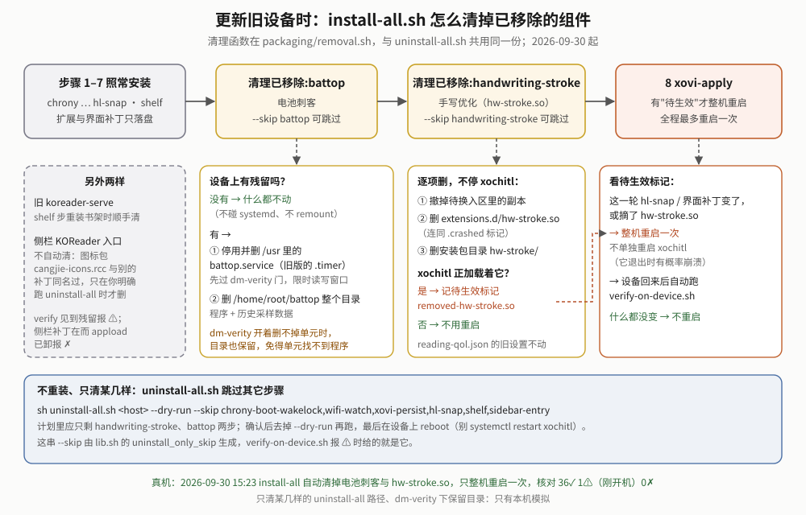
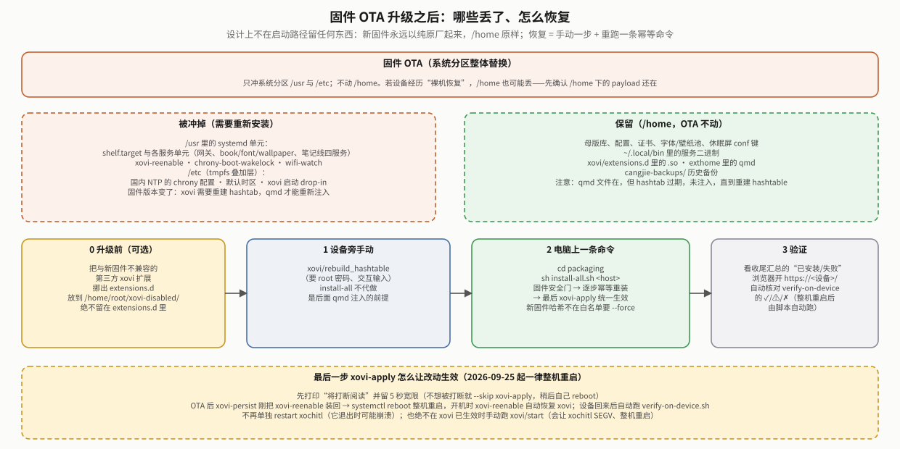

# Installation Guide

**[中文](INSTALL.md)** · back to [README](README.en.md)

> **Who this is for**: anyone installing this suite on a reMarkable Paper Pro Move for the first time, uninstalling it, or restoring it after a firmware update (OTA).
> - **First install**: read "Scope → Before you install → Install → After installing" in order.
> - **Installed before, updating now**: just re-run `install-all.sh` (see "Install"); removed components are cleaned up automatically, see "Upgrading: cleaning up removed components".
> - **Uninstall**: read "Uninstall". **Updated the firmware**: read "After a firmware update (OTA)". **Problems**: see "Troubleshooting".
>
> To learn what the whole thing is, read [`OVERVIEW.md`](OVERVIEW.md) (Chinese). How the scripts are written, every parameter and environment variable, what each check means, and how to test them locally are in [`../packaging/README.md`](../packaging/README.md) (Chinese, developer-oriented; not repeated here).

**Terms used throughout**:

| Term | Meaning |
|---|---|
| xochitl | The device's stock reading/notes app. This project doesn't modify it; it only adds things alongside |
| xovi / extension | A third-party extension loader: when xochitl starts, it also loads the `.so` plugins in `extensions.d/`. This project now has two extensions: `hl-snap` (highlighter snapping) and `ui-font` (UI font) |
| qmd / UI patch | A patch to xochitl's UI description files (QML), applied by qt-resource-rebuilder when xochitl starts |
| files only / take effect | Extensions and UI patches are only read when xochitl starts, so once the files are in place the **whole device has to reboot once** for them to take effect |
| OTA | Over-the-air firmware update. It replaces the system partitions `/usr` and `/etc` wholesale and leaves `/home` (your data) alone |
| dm-verity | Read-only verification of the system partition. While it is on, the scripts never write `/usr` |

## Scope

**reMarkable Paper Pro Move (imx93-chiappa), firmware 3.28.0.172**. It is the only version verified on real hardware so far,
and the installer checks it before doing anything (see "Firmware safety gate"). Other firmware versions and other reMarkable
models are unverified; forcing an install there may misplace the UI patches — best case a feature doesn't work, worst case it
affects normal device use.

## Before you install

### On the device: 2 things to install by hand

They belong to the third-party reMarkable ecosystem, not to this repository, and `install-all.sh` will **not** install them.
If one is missing, the related step fails or skips and tells you what to run. For how to install vellum (the on-device package
manager) itself, follow vellum's own documentation.

| # | Run on the device | What it is | If missing |
|---|---|---|---|
| 1 | `vellum add xovi` | [xovi](https://github.com/asivery/xovi): the extension loader | All plugin-type features depend on it; those steps fail outright |
| 2 | `vellum add qt-resource-rebuilder` | Loader for UI patches (qmd) | No UI patch is installed (not a failure): the font menu, UI font tokens, trash/new-folder proxies, comic-margin proxy, reading-position proxy, and reader tap-to-turn. Everything else is unaffected (for how the summary shows this, see issue ②) |

Since 2026-09-29 **appload and KOReader are no longer needed** (the device only uses its built-in reader). If the device ever had them, or had the battery sampler or handwriting stroke tuning, see "[Upgrading: cleaning up removed components](#upgrading-cleaning-up-removed-components)".

### On your computer: build tools and ssh

The scripts build the programs on your computer and install them on the device over ssh, so the computer needs:

| What | Used for | If missing |
|---|---|---|
| Rust (`cargo`) + `rustup target add aarch64-unknown-linux-musl` + `aarch64-linux-gnu-gcc` | Cross-compiling the eight web services (`shelf/build.sh`) | The `shelf` step fails |
| Optional: a clone of [asivery/xovi](https://github.com/asivery/xovi) (point `XOVI_DIR` at it) | Rebuilding the `hl-snap` / `ui-font` plugins | No effect: prebuilt `.so` files are committed and used when a rebuild isn't possible |
| **Passwordless ssh login to the device as root** | Every step (the scripts never stop to ask for a password) | Fails before touching anything, with troubleshooting steps. If you haven't set it up, run `ssh-copy-id root@10.11.99.1` first |

## Install


### Recommended order

1. **Check the firmware version** in Settings; only 3.28.0.172 is verified so far.
2. **Install the 2 device prerequisites by hand, in order** (xovi → qt-resource-rebuilder). To make them take effect, reboot the whole device (`reboot`) rather than `systemctl restart xochitl` (see issue ③).
3. **Rehearse first** (runs only on your computer, never touches the device):
   ```sh
   git clone https://github.com/bbq191/cang-jie.git
   cd cang-jie/packaging
   sh install-all.sh --dry-run          # prints which steps would run; add --skip to preview a partial install
   ```
   The rehearsal does **not** check the firmware or the device; it only proves your command line is right.
4. **Install** (computer connected over USB; the device is `10.11.99.1` by default):
   ```sh
   sh install-all.sh 10.11.99.1
   ```
   The script first confirms ssh works, the firmware is on the allowlist and the device is in good shape (see "Automatic pre-install checks"), then runs the steps below. The first run compiles everything, so it takes a while.
5. **Read the closing summary**: four lines — "installed", "skipped (--skip)", "skipped (prerequisite not met, not a failure)" and "failed". The third line gives the reason (for example dm-verity is on, so nothing can go into `/usr`). "Skipped" is not "failed" and is easy to miss (see issue ②). Fix any failure as its message says; everything else is already installed. Re-running the whole thing is safe (every script is idempotent, and unchanged content won't reboot the device again).
6. **Log in, change the password, install the certificate**: see "After installing".

### What each step installs

Every **step name** below can be used with `--skip`; the matching script `packaging/deploy-<step>.sh <host>` (for `shelf` it is `deploy.sh`) can also be run on its own.

| Step | What it does | Needs |
|---|---|---|
| `chrony-cn` | Switches time servers to ones reachable from mainland China (Alibaba Cloud, Tencent Cloud, etc.). Counts as done once the config is written; if the device can't sync yet (no network), it only prints a warning and syncs by itself once online | — |
| `chrony-boot-wakelock` | Keeps the device from auto-suspending for a short while after boot (released once synced, at most 120 s) so the first time sync isn't interrupted | — |
| `timezone-cn` | Sets the default time zone to Asia/Shanghai | — |
| `wifi-watch` | WiFi stall watchdog: reconnects when the link dies; pins the 2.4 GHz band only when the access point sits on a 5 GHz channel the device may not use (5150–5350 MHz); turns WiFi power saving on (since 2026-09-28; measured about 37% lower idle current). Override in `~/.config/wifi-watch.conf` on the device (`BAND=`, `POWERSAVE=`) | — |
| `xovi-persist` | Re-activates xovi automatically after boot, so you don't have to after a restart | xovi |
| `hl-snap` | The highlighter snaps precisely to Chinese text instead of "a short stroke grabs the whole line"; files only | xovi |
| `ui-font` | UI font plugin: xochitl's interface (library, settings, dialogs, titles) uses the font you pick on the web page, while the reader's fonts stay as they are (since 2026-10-07); files only | xovi |
| `清理已移除:battop`, `清理已移除:handwriting-stroke` | Not install steps: clean up what the battery sampler and handwriting stroke tuning left on older devices (both removed on 2026-09-30, see "[Upgrading](#upgrading-cleaning-up-removed-components)"); nothing to clean means nothing is touched. They run just before `xovi-apply`; `--skip battop` / `--skip handwriting-stroke` skips them | — |
| `shelf` | Eight web services: the gateway, books (book), fonts and wallpapers (font / wallpaper), and the four notes services (ink / transcribe / mind / note); its seven UI patches (font menu, UI font tokens, trash proxy, new-folder proxy, comic-margin proxy, reading-position proxy [returns you to where you were after a book is replaced in place, 2026-10-09], reader tap-to-turn) are files only | The patches need qt-resource-rebuilder; without it only the patches are skipped, the services still install |
| `xovi-apply` | Once all "files only" content is in place, **reboots the whole device once, only if something changed (or xovi isn't active yet)**, so it takes effect (about 20–60 seconds, interrupts reading; nothing changed means no reboot). After the reboot it runs `verify-on-device.sh` automatically | — |

"Files only" means the files are put in place but don't take effect yet; `xovi-apply` reboots the device once at the end. This avoids several restarts in a short time.
Failed steps are not retried automatically and are never silently skipped.

## After installing

**Check the verification result first**: after the final reboot the script waits for the device to come back and runs `verify-on-device.sh` automatically (`CJ_APPLY_VERIFY=0` turns this off). It is a read-only check in 9 sections (firmware and boot, xochitl and extensions, UI patches, resident services, this boot's alerts, flight recorder, ports, `/usr` units, disk), reported item by item as ✓/⚠/✗; it exits non-zero if anything is ✗. A fully installed device has about 40 items: on real hardware on 2026-10-09, after the reading-position proxy was added, it was 39✓ 1⚠ 0✗, the ⚠ being "booted less than 10 minutes ago", which is normal right after a reboot. If no reboot happened, or after deploying a single step later, run `sh verify-on-device.sh <host>` from `packaging/` yourself. If removed components are still on the device it flags them with ⚠ and prints the cleanup command (see "[Upgrading](#upgrading-cleaning-up-removed-components)"). What each item means: [`packaging/README.md`](../packaging/README.md#部署后核对verify-on-devicesh2026-09-25) (Chinese).

Open `https://10.11.99.1/` in a browser (on the same WiFi you can also use `https://shelf.local/`; Android doesn't resolve `.local`, so use the device's IP there).

- **Change the password**: the default is `shelf`, and the first login forces you to the change-password page.
- **Login rate limit**: an IP that gets the password wrong 5 times within 60 seconds is locked out for a while; other devices (other IPs) are not affected.
- **Install the certificate**: the browser warns that the certificate isn't trusted, because the device signed it itself. The login page has a "download CA certificate" link (`https://<device>/ca.crt`). Install it into your phone's or computer's trust store once and the warning goes away. On iOS you also need to enable full trust under "Settings → General → About → Certificate Trust Settings". For a quick one-off you can click "Advanced → Proceed".
- **If you are upgrading from a version before 2026-09-24**: the gateway replaces its CA automatically on first start (the new CA can only sign LAN names and private IPs; the old files are renamed to `*.bak-<time>` on the device, not deleted). **Reinstall the new certificate on every phone and computer, and delete the old one** — the old CA has no such restriction, so installing the new one without removing the old one leaves the risk in place. Once the new certificate works, you can delete the `*.bak-*` files in `~/.config/shelf/tls/` on the device.
  - Known limitation: addresses outside the allowed range (for example a carrier-assigned 100.64.x.x, a public IP, or an mDNS name you changed yourself) won't match the certificate, and the browser will show an error.

## Common options

### Command reference

Run inside `packaging/`; `<host>` defaults to `10.11.99.1`. Every script supports `-h`; a wrong parameter always exits with code 2 without contacting the device. All parameters and environment variables are listed in [`packaging/README.md`](../packaging/README.md#参数与环境变量) (Chinese).

| Command | Parameters | Effect |
|---|---|---|
| `sh install-all.sh [host]` | `--dry-run` | Print the plan only; don't contact the device |
| | `--skip a,b` | Skip the named steps (a wrong name only warns and lists the known names) |
| | `--force` | Install even if the firmware isn't on the allowlist (see "Firmware safety gate") |
| | `--force-apply` | Reboot the device once at the end whether or not anything changed |
| `sh uninstall-all.sh [host]` | `--dry-run` / `--skip a,b` / `--purge` | See "Uninstall" |
| `sh deploy.sh [host]` | `--only a,b` · `--password NEW` · `--no-systemd` | Install or update only the web services (see "Installing only part of it") |
| `sh deploy-xovi-apply.sh [host]` | `--force` | Make the "files only" content take effect on its own |
| other `deploy-<step>.sh [host]` | `-h` | Run one step on its own |
| `sh verify-on-device.sh [host]` | `--json` · `--dump` · `--from FILE` | Read-only check of the device (see "After installing") |

### Automatic pre-install checks

Before doing anything, `install-all.sh` (except with `--dry-run`) checks three things; if any fails, **no step runs** and nothing on the device changes:

1. **Can it ssh in**: if not, it prints troubleshooting steps (device asleep or USB unplugged; wrong IP; the device's host key changed; no passwordless login). This is checked once per run; the steps after it don't repeat it.
2. **Firmware safety gate**: see below.
3. **Device preflight** (read-only): must be root and `/home` must be writable; **less than 50MB free on `/home` refuses, less than 200MB warns**; it also reports whether xovi and qt-resource-rebuilder are installed and whether xovi is active in xochitl. Missing pieces are only reported early; the matching steps fail or skip on their own.

Once the checks pass, three more safeguards cover the whole install (since 2026-10-09; the normal path ran in that day's two real-hardware deploys, failure cases such as a dropped connection are only simulated locally): the device holds a wake lock with a timeout (released automatically after 20 minutes, so it can't fall asleep between steps; `CJ_AWAKE=0` turns it off); a dropped ssh connection is detected in about 15 seconds instead of hanging forever; and a script sent to the device only runs once it has arrived in full, so a transfer cut halfway runs nothing at all.

### Firmware safety gate

Before installing, the script reads the sha256 of `/usr/bin/xochitl` on the device and compares it with `packaging/firmware-allowlist.txt` in the repository and `firmware-allowlist.local.txt` on your computer. It continues only on a match; otherwise it refuses by default. A hash is used rather than a version number because the UI patches locate things byte by byte, and a hotfix with the same version number can still move internal layouts.

If you're sure this device's firmware is the one you want and the hash just isn't recorded, add `--force`. The current hash is appended to `firmware-allowlist.local.txt` **on your computer** (not tracked by git), so the same firmware won't need `--force` again.

```sh
sh install-all.sh 10.11.99.1 --force
```

### Re-running: when does it reboot

Re-running `install-all.sh` is safe and doesn't flash the screen every time. Only when new content is actually written does the script leave a "pending-apply marker" on the device (in the in-memory `/run/cangjie-pending-apply/`, cleared on reboot); the last step decides whether to restart based on it.

| Situation | What the last step `xovi-apply` does |
|---|---|
| Something changed this run (first install, updated plugin or UI patch) | **Reboots the device once** (prints "will interrupt reading" and waits 5 seconds first; back in about 20–60 seconds, then verified automatically). Since 2026-09-25 it no longer restarts xochitl on its own: xochitl may crash while exiting and the system then reboots anyway, so a clean reboot is more predictable |
| A plugin `.so` was updated while xochitl is using the old one | The new one waits in a staging area and is swapped in right before the reboot (see the diagram below; even if the computer disconnects or you press Ctrl-C in between, the swap and the reboot still happen) |
| Nothing changed, xovi is active | No reboot |
| Nothing changed, but the device just rebooted and xovi isn't active yet | With xovi persistence installed: reboot (it is restored at boot); without it: runs `xovi/start` |
| A new plugin was waiting in the staging area and you rebooted the device yourself | At boot `xovi-reenable` swaps it in first; nothing else to run |
| `--force-apply` given | Always reboots once |
| The previous run used `--skip xovi-apply` | The marker is still there; just run `sh deploy-xovi-apply.sh <host>` |


**The same applies when running a step on its own**: `deploy-hl-snap.sh` or `deploy-ui-font.sh` run alone reboots the device once if something changed; when the files are byte-identical to what's installed, nothing else is pending and xovi is active, there is **no** reboot. It uses the same check as the final `xovi-apply` step.

### Installing only part of it

```sh
sh install-all.sh 10.11.99.1 --skip chrony-cn,timezone-cn,xovi-persist    # skip the named steps
sh deploy.sh 10.11.99.1 --only book,font --password 'new-password'          # only the book and font services, and set the gateway password
```

Names allowed in `--only`: `gateway book font wallpaper ink transcribe mind note`. The gateway is always installed; any other name is an error.
`--password` is sent over ssh standard input into a temporary file on the device and deleted after use, so it never appears on a command line or in the process list (only when passed through `deploy.sh`; see "Known limitations").
Before pushing, `deploy.sh` checks that the programs to install have been built; if not, it stops and tells you to run `sh shelf/build.sh` from the repository root first.
When you install only part with `--only`, the device's uninstaller `shelf-uninstall` and its manifest are refreshed too (since 2026-09-30; before, only a full install refreshed them, so a later uninstall could miss newly added UI patches). On repeat deploys, files whose content hasn't changed are not uploaded again.

## Uninstall

`uninstall-all.sh` uses the same step table as the installer and runs it in **reverse order** (last installed, first removed), then cleans up leftovers of removed components (see "[Upgrading](#upgrading-cleaning-up-removed-components)"). Rehearse first:

```sh
cd packaging
sh uninstall-all.sh 10.11.99.1 --dry-run          # print the plan only; no device contact, nothing deleted
sh uninstall-all.sh 10.11.99.1                    # remove everything
sh uninstall-all.sh 10.11.99.1 --skip shelf       # skip a step
sh uninstall-all.sh 10.11.99.1 --purge            # kept for compatibility; currently affects no step
```

**What it does**: stops and removes the installed services, plugins and UI patches, plus the package directories pushed to the device during install (only known files are deleted; a directory with anything else in it is kept). Removing a plugin also removes a newer version still waiting in the staging area (before 2026-09-24 it wasn't, so the next deploy put the removed plugin straight back).

**Kept by default**: the master library, configuration, certificates, font/wallpaper pools, and the backups in `cangjie-backups/`. `--purge` currently affects no step and leaves book data alone; to remove book data too, first `--skip shelf`, then run `shelf-uninstall --purge` on the device.

**What it doesn't do**:
- `chrony-cn` and `timezone-cn` are configuration changes and `xovi-apply` is just an action; none of them is undone. Backups from before the change are in `cangjie-backups/` on the device if you want to restore them yourself.
- vellum, xovi and qt-resource-rebuilder were not installed by this project and are not removed.
- It does **not** reboot the device. Plugins and UI patches already loaded stop only after the next reboot. To stop them now, run `reboot` on the device. **Don't** `systemctl restart xochitl`: xochitl may crash while exiting, and the system then takes the emergency path and reboots anyway (seen several times on real hardware on 2026-09-25); a clean reboot is better.

**When the system partition's read-only verification (dm-verity) is on**: service units under `/usr` cannot be removed (the scripts never write `/usr` under verity; writing `/usr` once caused a rollback that bricked the device). The uninstaller says so and **keeps** the programs those units need, so they don't fail over and over after a reboot. Once the device is writable, run `uninstall-all.sh` again to finish.

The full uninstall was run end to end on real hardware on 2026-09-25: all 8 steps succeeded in reverse order, book/notes data and configuration were kept, and xochitl wasn't restarted during the uninstall. The dm-verity "keep the programs" branch and `--purge` are still only simulated locally.

## Upgrading: cleaning up removed components

Some features were dropped later. Their source and install steps are gone, but devices that had them still carry the files.

| Component | Removed | What may be left on the device | How to clean up |
|---|---|---|---|
| Battery sampler ("Battery Assassin", `battop`) | 2026-09-30 | `battop.service` in `/usr` (older versions also `battop.timer`), the whole `/home/root/battop/` directory (program and sampling history) | **Re-running `install-all.sh` cleans it automatically** |
| Handwriting stroke tuning (`handwriting-stroke`, plugin `hw-stroke.so`) | 2026-09-30 | `extensions.d/hw-stroke.so`, its copy in the staging area, the package directory `/home/root/hw-stroke/` | **Re-running `install-all.sh` cleans it automatically** |
| The shelf's `koreader-serve` service | 2026-09-29 | Its service unit and program | Cleaned when `install-all.sh` (or `deploy.sh`) redeploys the shelf |
| KOReader sidebar entry (`sidebar-entry`) | 2026-09-29 | The UI patch `koreader-sidebar-entry.qmd` and icon pack `cangjie-icons.rcc` | **Not automatic**; run `uninstall-all.sh` once (command below) |



**How the automatic cleanup works**: just before the last step `xovi-apply`, `install-all.sh` runs a cleanup for the battery sampler and for handwriting stroke tuning (shown in the summary as `清理已移除:battop` and `清理已移除:handwriting-stroke`). It uses the same functions as `uninstall-all.sh` (in `packaging/removal.sh`). With nothing left on the device it touches nothing; if xochitl still has `hw-stroke.so` loaded, it leaves a "pending apply" marker, so the last step **reboots the whole device once** to really unload it (xochitl is never restarted on its own). To skip it, `--skip battop` / `--skip handwriting-stroke`. Old `hwStroke*` settings in `reading-qol.json` are left as they are; nothing reads them, so they're harmless.

The sidebar entry isn't cleaned automatically because its icon pack's file name, `cangjie-icons.rcc`, was once used by other UI patches too; it is only deleted when you explicitly ask.

**Clean up only some of them, without reinstalling**: run `uninstall-all.sh` skipping every other step. Rehearse with `--dry-run` first; the plan should list only the steps you want:

```sh
cd packaging
# Only the battery sampler and handwriting stroke tuning (the plan should list only handwriting-stroke and battop)
sh uninstall-all.sh 10.11.99.1 --dry-run --skip chrony-boot-wakelock,wifi-watch,xovi-persist,hl-snap,ui-font,shelf,sidebar-entry
sh uninstall-all.sh 10.11.99.1 --skip chrony-boot-wakelock,wifi-watch,xovi-persist,hl-snap,ui-font,shelf,sidebar-entry
# Only the sidebar entry
sh uninstall-all.sh 10.11.99.1 --skip chrony-boot-wakelock,wifi-watch,xovi-persist,hl-snap,ui-font,shelf,battop,handwriting-stroke
```

Then reboot the whole device once (`reboot`, not `systemctl restart xochitl`).

**Checking**: `verify-on-device.sh` flags these leftovers — the battery sampler, `hw-stroke.so` and an old `koreader-serve` as ⚠; a leftover sidebar-entry patch as ⚠, or ✗ if appload has already been removed (the patch then breaks the sidebar patching). The cleanup command it prints is one of the commands above.

**On real hardware**: on 2026-09-30 at 15:23 `install-all.sh` automatically removed the battery sampler (unit and `/home/root/battop`) and `hw-stroke.so`, rebooted only once, and the check afterwards was 36✓ 0✗ with `hw-stroke.so` no longer loaded in xochitl. The "clean up only some" `uninstall-all.sh` commands above have only been simulated locally.

## After a firmware update (OTA)

This is the **authoritative** OTA recovery guide; the other documents link here.



**The update itself doesn't lose any data in `/home`, but you have to re-run the installer afterwards to get the features back.** This project deliberately leaves nothing in the boot path (xovi's loader configuration lives in `/etc`'s in-memory layer, the service units in `/usr`), so new firmware always boots in a pure stock state.

### Recommended procedure

1. (Before updating, optional) Move xovi plugins that aren't compatible with the new firmware (e.g. an old third-party plugin) out of `extensions.d/` into `/home/root/xovi-disabled/`. **Never leave them in `extensions.d/`**: xovi loads every file in that directory as a plugin.
2. After the update, **at the device**, run `xovi/rebuild_hashtable` by hand (it asks for the root password; the scripts don't do this). It rebuilds an index of UI resources for the new firmware, which the UI patches use to find their targets, so the patches depend on it.
3. On your computer: `cd packaging && sh install-all.sh <device IP>`. The new firmware's hash usually isn't on the allowlist; once you've confirmed the version, add `--force`. After an OTA xovi isn't active, so the last step reboots the device once; at boot the just-reinstalled `xovi-reenable` restores xovi, and the result is verified automatically.
4. Read the closing summary and open the gateway in a browser.

### Item by item

| Content | Location | After OTA | How to recover |
|---|---|---|---|
| Master library, font and wallpaper pools, certificates, gateway password, sleep-screen setting, `cangjie-backups/` | `/home` | Kept | Nothing to do |
| The web services' programs (`~/.local/bin`) | `/home` | Kept | Nothing to do |
| `hl-snap` and `ui-font` plugins; UI patches for the font menu, UI font tokens, trash, new folder, comic margins, reading position and reader tap-to-turn | `/home` (`extensions.d/`, `exthome/`) | Files remain, but need a hashtable rebuild to take effect | Step 2, then run `install-all.sh` |
| Service units for the web services and `shelf.target` | `/usr` | **Wiped** | `shelf` step (or alone: `SHELF_NO_BUILD=1 sh deploy.sh <device IP>`) |
| `xovi-reenable.service` (re-activates xovi at boot) | `/usr` | **Wiped** | `xovi-persist` step |
| `chrony-boot-wakelock.service` | `/usr` | **Wiped** | `chrony-boot-wakelock` step |
| `wifi-watch.service` (script lives in `/home`) | `/usr` | Unit **wiped** | `wifi-watch` step |
| China time servers, default time zone | `/etc` | **Wiped** | `chrony-cn` / `timezone-cn` steps |

**Risk layers**: the book layer only uses xochitl's web upload endpoint and standard system components, so reinstalling after a firmware change brings it back; UI patches like the font menu depend on xochitl's internal QML and often need rework on a major version.

**After a "bare-metal restore", check one more thing**: an OTA doesn't delete `/home`, but a more thorough reset can wipe the plugins and programs there too (seen on real hardware on 2026-09-09). Confirm they're still present before re-running `install-all.sh`.

## Troubleshooting

These are known issues with specific triggers, not random faults. The numbers are referenced above; ① and ⑥ were about removed components (the KOReader sidebar entry, the battery sampler), so those entries are gone and the numbers aren't reused.

| # | Symptom | Cause | What to do |
|---|---|---|---|
| ② | Font menu, trash/new-folder, comic margins, reading-position recovery and reader tap-to-turn are **all** missing (and the UI font only partly applies) | They share one prerequisite, qt-resource-rebuilder. Without it, they are patches bundled in the `shelf` step and are **not listed separately** — `shelf` still counts as "installed", and only that step's output has a line saying the font-menu/UI-font/trash/new-folder/comic-margin/reading-position/page-turn qmd were skipped because there is no qt-resource-rebuilder directory | `vellum add qt-resource-rebuilder`, then re-run `install-all.sh` |
| ③ | After several xochitl stops/starts in a short time, the whole device rebooted once | The xochitl service allows at most 4 restarts in 10 minutes, no matter who triggers them: a manual `systemctl restart xochitl`, installing or removing xochitl plugins with `vellum add/del` (formerly also appload, and WeRead launches and exits). On 2026-09-11 two restarts in a row were enough to trigger a full reboot — **the device recovered on its own; it was not bricked** | Since 2026-09-25 the deploy scripts reboot the device instead, so they no longer count towards this limit. When installing or removing plugins by hand, wait a few minutes between each |
| ④ | The firmware safety gate refuses | By design: the same version number doesn't guarantee the same internal layout | Confirm the device firmware is the one you verified, then use `--force` |
| ⑤ | The device rebooted at the end of the install | `xovi-apply` makes the changes take effect: since 2026-09-25 always by **rebooting the whole device** (back in about 20–60 seconds) rather than restarting xochitl alone, because xochitl may crash while exiting and the system then reboots anyway. It only reboots when something actually changed or xovi isn't active yet | Normal; don't use the device during install. The script waits for the device and runs `verify-on-device.sh` automatically. To avoid the interruption, `--skip xovi-apply` and run `sh deploy-xovi-apply.sh <host>` later. **To apply by hand**: just `reboot`; **never** run `xovi/start` by hand (when xovi is already active it crashes xochitl and the device reboots itself — real-hardware incident, 2026-09-20) |
| ⑦ | It exits with an error before installing: `cannot connect to root@…` / `only N MB free` / `needs root` / `firmware not on the allowlist` | The automatic pre-install checks stopped it; nothing on the device changed | Can't connect: follow the steps in the message (asleep/USB → IP → host key → passwordless); not enough space: clean up `/home/root` and `cangjie-backups/` and retry; firmware: see ④ |
| ⑧ | The last step reports that the device couldn't schedule the reboot and the changes aren't in effect yet; the step counts as failed | The `systemctl reboot` command on the device itself failed. The files are already swapped in, but xochitl is still running the old ones; the script has put the "pending apply" marker back (since 2026-09-25; before that it waited for a reboot that never came and then reported success). This path has only been simulated locally | Run `reboot` on the device, then `sh verify-on-device.sh <host>` once it's back; or re-run `sh deploy-xovi-apply.sh <host>` later, which tries again |
| ⑨ | The last step reports "no xovi in xochitl, and no xovi/start on the device", and the step counts as failed | xovi isn't installed on the device (or vellum removed it): a reboot couldn't make the plugins and UI patches take effect anyway, so the script stops with an error instead of rebooting (since 2026-10-09; before, it rebooted for nothing). Only simulated locally | Run `vellum add xovi` on the device, then re-run `install-all.sh` |
| ⑩ | ssh drops partway through (e.g. `Timeout, server … not responding`) | The device went to sleep, the cable was unplugged or WiFi dropped. ssh has keep-alives and detects this in about 15 seconds (since 2026-10-09; before, it hung forever). Scripts sent to the device only run once they arrive in full, so the step that was cut off ran nothing | Wake the device, check the connection, and re-run `install-all.sh` (idempotent; what's already installed isn't touched again) |

### Other troubleshooting

- Start with the closing summary of `install-all.sh` to find the failing step; the header comment of the matching `packaging/deploy-*.sh` explains what the step does and common failures.
- The web page's "Manage" section shows whether each plugin is actually loaded into xochitl ("loaded / not loaded"). A switch that is on but shows "not loaded" means the plugin isn't installed or the device hasn't been rebooted since. "Manage → Device health" shows a fuller picture (services, extensions, the previous boot's log).
- To check the scripts without touching a device: `bash packaging/tests/run_sim_tests.sh` (local simulation, 371 assertions, all passing when run on 2026-10-09). It is no substitute for testing on real hardware.

### Backups and idempotence (short version)

Every install script can be re-run; before overwriting an existing file on the device it is backed up to `/home/root/cangjie-backups/` (**never** into `extensions.d/`), keeping the latest 5; unchanged content is neither backed up nor touched; before writing `/usr` the scripts check dm-verity and skip if it's on. Details in [`packaging/README.md`](../packaging/README.md#备份与幂等) (Chinese).

## Known limitations

- **What has and hasn't run on real hardware**:
  - **Run end to end on real hardware**: `install-all.sh` (once each on 2026-09-22, 09-24, 09-25 and 09-30, twice on 10-09) and `uninstall-all.sh` (2026-09-25); "swap in the new `.so` → reboot → xovi restored at boot → check" was re-verified on real hardware on 2026-09-25 (43✓).
  - **Two real-hardware deploys on 2026-09-30**: at 14:10 `deploy.sh` deployed the fifth-audit version; after a reboot the check was 38✓ 1⚠ (just booted) 0✗. At 15:23 `install-all.sh` deployed, **automatically removed the battery sampler and `hw-stroke.so` and rebooted only once**; the check was 36✓ 1⚠ (just booted) 0✗, `/usr` units 12/12, no restarts among the 9 resident services. The installer changes from the fourth and fifth audits (checking connectivity only once per `install-all` run, batched pushes, not re-uploading unchanged files, and so on) all ran in that round, which passed. This only proves "installed and healthy"; the new shelf and notes features haven't been tried one by one on the device yet (list in [CHANGELOG 09-30](CHANGELOG.md#09-30), Chinese).
  - **Only simulated locally, never on real hardware**: keeping programs under dm-verity during uninstall, clearing the staging area on uninstall, the "nothing changed, so no reboot" path (including standalone deploys), ignoring disconnect signals in the swap-in critical section, handling a failed reboot command, the summary's "prerequisite not met" line, the uninstall changes from the fifth audit (not aborting on non-empty directories, `--only` refreshing the uninstall manifest, and so on), and using `uninstall-all.sh` to clean up only removed components.
  - **Two real-hardware deploys on 2026-10-09**: `install-all.sh` at 13:48 over WiFi and at 15:53 over USB; after the reboot the checks were 38✓ 1⚠ and 39✓ 1⚠ (both ⚠ = just booted) 0✗. The normal path of the sixth-audit installer changes (whole-script transfer, ssh keep-alives, the wake lock) ran in those two rounds; the failure branches — detecting a dropped connection, a half-transferred script running nothing, erroring out instead of rebooting when there is no xovi — are **only simulated locally**.
  - Full record: [`packaging/README.md` "验证现状"](../packaging/README.md#验证现状如实说明不夸大) (Chinese). When trying them on a device, go one step at a time: `--dry-run` first, then single steps or `--skip`.
- **Writing `/usr` still relies on two safeguards, "check dm-verity first + a time-limited read-write window"**, rather than never touching `/usr`; writing `/usr` once triggered a rollback that bricked the device (2026-08-16).
- **Running `shelf/install.sh --password <plaintext>` directly on the device briefly exposes the password in the device's process list**; passing it through `deploy.sh --password` on your computer doesn't.
- Uninstalling doesn't revert `chrony-cn` / `timezone-cn`; there's no "one click back to before".

## What this installer doesn't do

- **Doesn't install vellum / xovi / qt-resource-rebuilder**: see "Before you install".
- **Doesn't install the Chinese input method**: that feature line's source has been moved out of this repository (see [README](README.en.md#history-and-scope)) and isn't distributed by this installer.
