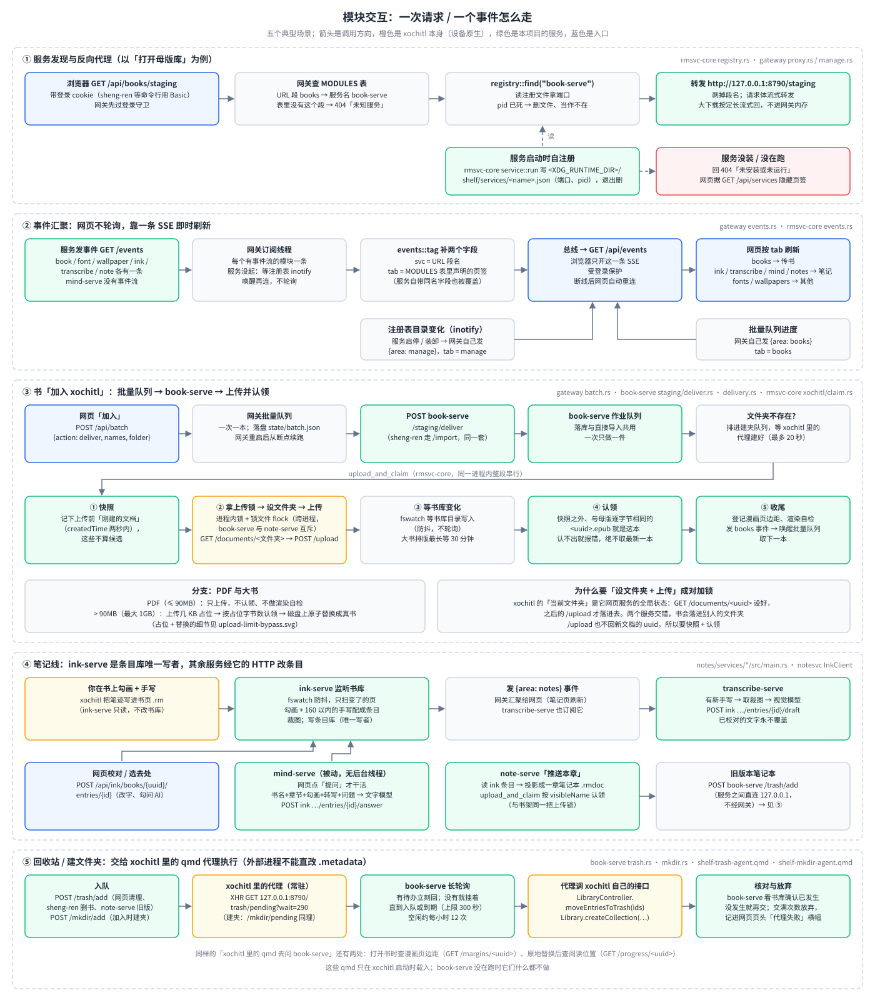

# 全貌：这套系统由什么组成、怎么协作

> **读者与用途**：第一次接触这个仓库的人（使用者、贡献者、接手维护的人）。读完你应该能回答：
> 这套东西解决什么问题、由哪几块组成、一次请求和一个事件怎么在各块之间走、东西装在设备的哪里、哪些在真机上验证过、去哪里找细节。
> 只想装：直接看 [`INSTALL.md`](INSTALL.md)；最近改了什么：[`CHANGELOG.md`](CHANGELOG.md)。

**30 秒版**：设备上常驻 8 个网页服务（网关、书架、字体、壁纸、笔记线四个），网关 `https://10.11.99.1/` 是唯一对外入口；
另有 2 个 xovi 扩展（`hl-snap`、`ui-font`）和 7 个 qmd 界面补丁在 xochitl 启动时载入，改了要整机重启才生效；
电脑只在安装、卸载、更新时用到（`packaging/install-all.sh`）。第 3 节的架构图把这些画在一张图上，第 4 节的交互图讲它们怎么配合。

## 1. 它解决什么问题

reMarkable Paper Pro Move 是一台彩色墨水屏平板，官方的阅读 / 笔记 / 书库主程序叫 **xochitl**。日常用起来有几处不顺手：

- **书难弄进去**：网页上传约 100MB 封顶；传进去之后建文件夹、清理重复副本都不方便；漫画留白多。
- **勾画和手写批注是"死"的**：书上划的线、旁边写的字没法变成能整理、能搜索、能导出的笔记。
- **中文与系统层面的小痛点**：荧光笔划中文会"吸一整行"；阅读字体、休眠壁纸、界面字体不能自己换；时区与校时不合国内环境。

书本身的排版优化不在这里做：2026-10-07 起交给姊妹项目 [sheng-ren](https://github.com/bbq191/sheng-ren) 在电脑上完成，本仓库只负责把优化好的书原样投进 xochitl。

## 2. 组成部分

本项目**不修改 xochitl 本体**，而是用三种"旁路"手段增强它：

- **网页服务**：常驻在设备上的小程序，通过网页操作；需要时借 xochitl 自己的网页上传接口（`/upload`）、直接读它的书库目录。
- **xovi 扩展**：xovi 是第三方的扩展加载框架，在 xochitl 启动时把 `.so` 插件加载进它的进程；扩展用 hook（把某个函数的入口改成先跳到自己的代码）改变行为。
- **qmd 界面补丁**：对 xochitl 界面描述文件（QML）的补丁，由第三方组件 qt-resource-rebuilder 在启动时套上，用来加少量入口，以及"在 xochitl 进程里替我们执行操作"的代理。

按目录看，每块以什么形态跑在设备上：

| 目录 | 一句话 | 运行形态 |
|---|---|---|
| [`shelf/`](../shelf/README.md) 书架 | 优化好的书（EPUB / PDF）进母版库 → 原样加入 xochitl | 1 个服务（`book-serve`）+ 5 个 qmd（回收站代理、建文件夹代理、漫画页边距代理、阅读位置代理、阅读器单击翻页） |
| [`notes/`](../notes/README.md) 笔记线 | 勾画 + 手写批注 → 条目库 → 转写 / 问 AI → 设备笔记本或 Obsidian | 4 个服务（`ink-serve`、`transcribe-serve`、`mind-serve`、`note-serve`） |
| [`enhance/`](../enhance/README.md) 系统增强 | 荧光笔中文吸附、界面字体、阅读字体与壁纸上传即用 | 2 个 xovi 扩展（`hl-snap`、`ui-font`）+ 2 个服务（`font-serve`、`wallpaper-serve`）+ 2 个 qmd（字体菜单、界面字体令牌，随 font 服务装）+ `lo-alias.sh`（随网关装） |
| [`gateway/`](../gateway/README.md) 网关 | 三条线共用的唯一对外入口：HTTPS、登录、反向代理、事件汇聚、批量队列、管理台、托管网页 | 1 个服务（`0.0.0.0:443`） |
| [`rmsvc-core/`](../rmsvc-core/README.md) 服务基座 | 网关和各服务共用的基础库，不含业务逻辑 | Rust 库（编进每个服务，不单独运行） |
| [`defw/`](../defw/README.md) 固件逆向 | xochitl 3.28.0.172 的 Ghidra 逆向资料，给扩展定位 hook 点 | 资料（不上设备） |
| [`packaging/`](../packaging/README.md) 安装器 | 全新设备一条命令装完（含固件校验），以及对称的卸载 | 电脑上的 shell 脚本，经 ssh 装到设备 |

## 3. 核心架构

- **所有服务都跑在设备上**。浏览器访问 `https://10.11.99.1/`（USB 连接时）或 `https://shelf.local/`（同一 WiFi；安卓不解析 `.local`）。
- **只有网关对外**（`0.0.0.0:443`）。它用设备自己生成的私有 CA 签 HTTPS 证书，再加登录密码（默认 `shelf`，首次登录强制改）。
  其余服务只听 `127.0.0.1`，由网关按服务注册表转发（命令行工具可以用 HTTP Basic 带密码，免登录页）。例外是电脑上的 sheng-ren：它经 SSH 端口转发（`ssh -L`）直连 `127.0.0.1:8790` 调 book-serve 的 `/import`，不经网关。
- **安全上的两条限制**：私有 CA 带名称约束，只能给局域网名字和内网 / 回环 IP 签证书，即使 CA 私钥泄露也伪造不了别的网站；
  登录输错按来源 IP 分别限速（每个 IP 60 秒内错 5 次就锁这个 IP）。
- **出网的只有笔记线的两个服务**：`transcribe-serve`（视觉模型转写手写）和 `mind-serve`（文字模型回答提问），经设备自己的 WiFi 直连云端，
  可选 DashScope、OpenAI、Gemini、DeepSeek 的 OpenAI 兼容接口。
- **xochitl 的上传口只绑 USB 网卡的 `10.11.99.1:80`**。网关启动前跑 `lo-alias.sh` 给 `lo` 和 `usb1` 补挂这个地址，拔掉 USB 时本机服务照样能往 xochitl 传书。
- **扩展和 qmd 只在 xochitl 启动时载入**。改动先落盘，再**整机重启一次**（约 20–60 秒）生效；不单独重启 xochitl，因为它退出时有概率崩溃
  （xochitl 自身的问题，2026-09-25 查清）。安装脚本会自动做这件事，细节见 [`INSTALL.md`](INSTALL.md)。网页「管理」页在每个扩展开关旁显示
  "已加载 / 未加载"，数据直接读运行中 xochitl 进程加载了哪些文件——**开关开了不等于生效**。

**服务与端口一览**（设备上 `/usr/lib/systemd/system/` 里共 **12 个**本项目的 systemd 单元；端口以各单元的 `--bind` 为准）：

| 单元 | 形态 | 端口 / 作用 | 网关上的路径 |
|---|---|---|---|
| `gateway` | 常驻服务 | `0.0.0.0:443`，唯一对外入口 | — |
| `book-serve` | 常驻服务 | `127.0.0.1:8790` 书架 | `/api/books/*` |
| `font-serve` | 常驻服务 | `127.0.0.1:8792` 字体 | `/api/fonts/*` |
| `wallpaper-serve` | 常驻服务 | `127.0.0.1:8793` 壁纸 | `/api/wallpapers/*` |
| `ink-serve` | 常驻服务 | `127.0.0.1:8795` 条目库 | `/api/ink/*` |
| `transcribe-serve` | 常驻服务 | `127.0.0.1:8796` 手写转写 | `/api/transcribe/*` |
| `mind-serve` | 常驻服务 | `127.0.0.1:8797` 问 AI | `/api/mind/*` |
| `note-serve` | 常驻服务 | `127.0.0.1:8798` 笔记本 / 导出 | `/api/notes/*` |
| `shelf.target` | 分组 | 上面 8 个服务一起启停 | — |
| `wifi-watch` | 常驻脚本 | WiFi 假死看护，不听端口 | — |
| `xovi-reenable` | 开机跑一次 | 开机让 xovi 重新生效（不用手动 `xovi/start`） | — |
| `chrony-boot-wakelock` | 开机跑一次 | 开机头一小段不让设备休眠，等校时完成 | — |

8791、8794 空着（8791 原属已退役的 `koreader-serve`）。各服务有内存上限（网关、书架、字体、壁纸 192MB，笔记线 128MB）。
开机时谁先谁后（xochitl 永远不等我们；常驻服务排在 xovi 恢复之后、不等网络）见
[`packaging/README.md`「开机启动顺序」](../packaging/README.md#开机启动顺序2026-09-24)。

## 4. 模块之间怎么配合

图里五个场景，文字版如下（代码位置写在图里每个面板的右上角）：

1. **服务发现与反向代理**。每个服务启动时由 rmsvc-core 写一份注册文件 `<XDG_RUNTIME_DIR>/shelf/services/<服务名>.json`（端口、pid），退出时删；
   设备上运行时目录在 tmpfs，重启即清。网关收到 `/api/<段名>/…` 时，先查自己的模块表 `MODULES`（段名 → 服务名，例如 `books` → `book-serve`），
   再读注册文件拿端口，剥掉段名转发到 `127.0.0.1:<端口>`。服务没装或没在跑就回 404，网页据 `GET /api/services` 隐藏对应页签。
   装 / 卸一个服务 = 一个二进制 + 一个 systemd 单元，网关不用改配置。
2. **事件汇聚**。网页不轮询。有事件流的服务各自提供 `GET /events`（SSE，服务器推送事件），网关为每个服务起一条订阅线程，
   给事件补上 `svc`（段名）和 `tab`（由 `MODULES` 表声明归哪个页签：传书 / 笔记 / 其他），再从一条 `GET /api/events` 推给浏览器。
   服务启停时注册表目录变化（inotify）由网关自己发 `manage` 事件；批量队列进度也走这条总线。`mind-serve` 是纯被动服务，没有事件流。
3. **书「加入 xochitl」**。网页勾选后提交到网关的批量队列（`POST /api/batch`，状态落盘 `state/batch.json`，网关重启后续跑），
   队列一次交一本给 `book-serve`；`book-serve` 把网页加入和 sheng-ren 的直接导入排进同一个作业队列，一次一件。
   投书走 rmsvc-core 的 `upload_and_claim`：上传前拍快照 → 拿上传锁（进程内锁 + 锁文件 `flock`，跨进程，`note-serve` 投笔记本也用同一把）
   → `GET /documents/<文件夹>` 设 xochitl 的"当前文件夹" → `POST /upload` → 等书库目录变化 → 在快照之外找与母版**逐字节相同**的那本，
   认出它的 uuid；**认不出就报错，绝不取最新一本**。认出后登记漫画页边距、做渲染自检，发 `books` 事件唤醒批量队列取下一本。
   PDF（≤ 90MB）只上传不认领；超过 90MB 走下面的"占位 + 替换"。
4. **笔记线**。`ink-serve` 监听书库，书页 `.rm` 变了就只扫变化的页，把荧光笔勾画和 160 以内的手写配成条目、裁图，写进条目库——
   它是条目库的**唯一写者**。`transcribe-serve` 订阅 `ink-serve` 的事件，有新手写就调视觉模型，把草稿经 `ink-serve` 的 HTTP 写回；
   `mind-serve` 只在网页点「提问」时调文字模型，回答同样经 `ink-serve` 写回；`note-serve` 只读条目，按章投影成设备笔记本，
   用同一个 `upload_and_claim`（按笔记本名认领）推进书所在的文件夹，旧版本交给 `book-serve` 的回收站队列。服务之间直连 `127.0.0.1`，不经网关。
5. **回收站 / 建文件夹交给 xochitl 自己做**。外部进程直改书库的 `.metadata` 会被运行中的 xochitl 覆写回去，所以 `book-serve` 只管排队；
   xochitl 里常驻的 qmd 代理用长轮询（`GET 127.0.0.1:8790/trash/pending?wait=290`，建文件夹同理）取任务，调 xochitl 自己的接口
   （`moveEntriesToTrash`、`createCollection`）去做，几秒内生效。交满次数仍没发生就放弃，网页页头显示"代理失败"横幅。
   漫画页边距和阅读位置是同一种做法：书打开时 qmd 去问 `book-serve`。

### 占位 + 替换：绕开约 100MB 的上传上限

`book-serve` 跑在设备上，能直接写 xochitl 的书库目录：先用网页接口传一个几 KB 的"替身"（带真书名和封面）让 xochitl 建好条目，
再在磁盘上把那个文件原子替换成真书。真机验证过 PDF 154MB、EPUB 153MB（2026-09-20）。上限 1GB；超过或造不出占位时整本拒绝。

### 一本书的旅程与笔记线全景

两条线各有一张自己的全景图，细节在各线文档里：

- 书架：[一本书的旅程](../shelf/docs/diagrams/book-journey.svg)，详见 [`shelf/README.md`](../shelf/README.md) 与 [传书线架构](../shelf/docs/传书EPUB线架构.md)；
  批量队列的状态机见 [`batch-queue.svg`](../gateway/docs/diagrams/batch-queue.svg)。
- 笔记线：[笔记线一图读懂](../notes/docs/diagrams/overview.svg)，详见 [`notes/README.md`](../notes/README.md)。

## 5. 设计原则

这些是反复验证过、新代码也要遵守的取舍：

| 原则 | 具体做法 | 为什么 |
|---|---|---|
| **不改 xochitl 本体** | 只用网页服务、xovi 扩展、qmd 补丁；不重新打包 xochitl，不改它的文件 | 官方固件升级照常进行；出问题时卸掉我们的东西就回到原样 |
| **设备自足** | 所有服务跑在设备上，云端模型由设备自己的 WiFi 直连；电脑只在安装时用 | 不依赖一台常开的电脑，拔掉 USB 也能用 |
| **只有网关对外** | 网关 HTTPS + 登录；领域服务只听 `127.0.0.1` | 只有一个口子要守；加服务不用碰安全配置 |
| **服务可插拔** | 注册表自发现，网关的 `MODULES` 表是段名 / 服务名 / 页签的唯一事实源 | 装卸一个服务不改网关配置，缺了就隐藏页签 |
| **xochitl 不等我们** | 本项目的单元只给自己加 `After=` 排序（排在 xovi 恢复之后），不加 `Requires=`；xochitl 的单元不依赖我们的任何东西 | 我们的服务坏了也不会拖住 xochitl 开机 |
| **不碰危险分区** | 数据和扩展放 `/home`；`/usr` 只放 systemd 单元，`/etc` 只放 NTP 与时区；写之前查 dm-verity | 早期往 `/usr` 写启动配置触发过 A/B 回滚变砖 |
| **生效靠整机重启** | 扩展、qmd 换了以后整机重启一次，不单独重启 xochitl | xochitl 退出时概率性崩溃（2026-09-25 查清），整机重启最稳 |
| **事件驱动，不轮询** | 书库、注册表、收件箱都用 inotify；网页靠 SSE；qmd 代理长轮询 | 墨水屏设备上省电 |
| **认不出就不认** | 上传后认领新文档只看快照之外、判据完全吻合的那份 | 认错一本（把边距、进度登记到别人的书上）比认不出更糟 |
| **防复制风暴** | 大书 `/upload` 超时或 408 时绝不重试 | xochitl 处理慢时书其实已经建好，重试会多出副本 |
| **真机验证再宣称完成** | 改变设备行为的改动必须在真机上跑通才算完成；CI 和本机模拟只证明电脑上行为正确 | 真机行为多次和电脑上不一致 |

## 6. 东西装在设备的哪里

| 内容 | 位置 | 固件 OTA 后 |
|---|---|---|
| 各服务的二进制（`gateway`、`book-serve` …） | `/home/root/.local/bin/` | 保留 |
| 书架、网关、字体、壁纸的数据 / 配置 / 状态（母版库、证书、密码、字体壁纸池…） | `~/.local/share/shelf`、`~/.config/shelf`、`~/.local/state/shelf`；母版库在 `~/.local/state/shelf/books/staging/`，收件箱在 `.../books/inbox/` | 保留 |
| 笔记线的数据（条目库、裁图、模型配置） | `~/.local/state/notes`、`~/.local/share/notes`、`~/.config/notes` | 保留 |
| 服务注册表、上传锁文件 | `$XDG_RUNTIME_DIR/shelf/`（设备上缺省 `/tmp/shelf-0/shelf/`，tmpfs，重启即清） | — |
| 字体、壁纸上传途中的暂存文件 | `~/.local/state/shelf/upload/`（放在 `/home`、装好时直接改名；服务启动时清掉上次中断的半成品） | 保留 |
| xovi 扩展 `.so`（`hl-snap`、`ui-font`） | `/home/root/xovi/extensions.d/`（**只放扩展，备份绝不能放这里**：xovi 会把目录里每个文件都当扩展加载） | 文件保留，重跑安装后生效 |
| 等着换入的新版扩展 `.so` | `/home/root/.cangjie-stage/so-pending/`（xochitl 正在用旧版时先放这里，整机重启前由部署脚本、或开机时由 `xovi-reenable` 换进去） | 保留 |
| qmd 界面补丁（7 份） | `/home/root/xovi/exthome/qt-resource-rebuilder/` | 文件保留，要先在设备上重建 hashtable 再重跑安装 |
| systemd 单元（12 个，见第 3 节） | `/usr/lib/systemd/system/` | **被冲掉**，重跑安装 |
| 国内 NTP、默认时区 | `/etc` | **被冲掉**，重跑安装 |
| 安装前的旧文件备份（每类保留最近 5 份） | `/home/root/cangjie-backups/` | 保留 |
| 扩展共享开关文件（荧光笔吸附、单击翻页） | `~/.local/share/cangjie-ime/reading-qol.json`（沿用旧目录名，历史原因） | 保留 |

只支持 **reMarkable Paper Pro Move、固件 3.28.0.172**；`/home` 在固件升级后保留，`/usr`、`/etc` 里的东西会被冲掉，要重新安装（见 [`INSTALL.md`](INSTALL.md)）。

## 7. 验证现状

"已部署、部署自检通过"不等于"功能在真机上验证过"，下表分开写。安装脚本逐项的真机记录见
[`packaging/README.md`「验证现状」](../packaging/README.md#验证现状如实说明不夸大)，各条线的完整记录在各自白皮书里。

| 事项 | 状态 | 日期 |
|---|---|---|
| 占位 + 替换（PDF 154MB / 349 页、EPUB 153MB 能打开） | 真机验证 | 2026-09-20 |
| 阅读器单击翻页 | 真机验证 | 2026-09-24 |
| 设备健康页 | 已部署，用真实登录看过页面；「清理」按钮没在真机点过 | 2026-09-25 |
| 9 个常驻进程开机后 7–9 秒起齐，各占 1–4.5MB 内存 | 真机实测 | 2026-09-30 |
| xochitl 界面字体（书库、设置、对话框换成所选字体，阅读字体不变） | 真机目测 | 2026-10-07 |
| 原地替换后跳回阅读位置 | 真机验证一次（替换前后该章排版没变）；内容有变动、书里插过笔记页的情形没测 | 2026-10-09 |
| hl-snap 改写后代码页恢复只读可执行 | 真机 `/proc/<pid>/maps` 确认 | 2026-10-09 |
| 第七轮审计与全线重构（上传并认领、跨进程上传锁、事件按 `MODULES` 归页签等） | 已合入 master；**未部署、未在真机上验证** | 2026-10-10 |
| 安装 / 卸载脚本加固（断线即停、有失败不重启、载荷不重传等） | 已合入 master；**只有本机模拟**，未在真机上验证 | 2026-10-10 |

## 8. 已移除的功能

以下做过、后来砍掉，正文不再讲；翻旧文档时对得上号即可，经过见 [`CHANGELOG.md`](CHANGELOG.md)：
KOReader 相关（服务、侧栏入口、批注导入，2026-09-29/30）、第三方 WeRead 与 appload（2026-09-29）、耗电诊断「电池刺客」与手写笔画优化（2026-09-30）、
按卷拆分大书（2026-09-30）、设备端的书籍优化 / PDF 转换 / 抓网文 / 补封面（2026-10-07）、日漫翻页规则（2026-10-07）、网关并发闸门（2026-10-07）、
电脑端旧命令行工具（2026-09-18）。

## 9. 术语表

| 术语 | 一句话解释 |
|---|---|
| xochitl | reMarkable 官方主程序（阅读器 + 笔记 + 书库 + 界面）；本项目不改它 |
| xovi / 扩展 | 第三方的扩展加载框架；`hl-snap`、`ui-font` 是它加载的 `.so` 插件 |
| hook | 在 xochitl 某个函数入口"插一脚"：先跑我们的代码，再决定是否调用原函数（`hl-snap` 这样做；`ui-font` 换的是 xochitl 导入表里 `setFont` 那一格，效果类似） |
| qmd / qmldiff | 对 xochitl 界面 QML 的补丁语言 / 文件，由 qt-resource-rebuilder 在启动时套上 |
| vellum | 设备上的包管理器，用来装 xovi、qt-resource-rebuilder 等第三方组件 |
| rmsvc-core | 本项目各服务共用的 Rust 基座库：服务注册表、HTTP、事件总线、与 xochitl 打交道的那一层 |
| 注册表 | 每个服务启动时写的一份 JSON（端口、pid），网关据此转发、显示页签 |
| `MODULES` | 网关里的模块表：URL 段名、服务名、安装令牌、事件归哪个页签，全部从这一处派生 |
| SSE | 服务器推送事件；网页靠它即时刷新，不用轮询 |
| 母版库 | 书架里的暂存池：入库的书原样保存在这里，加入 xochitl 都从它出发，可反复加入 |
| 边车（sidecar） | 母版库里每本书旁边的小文件，记录"什么时候加入过 xochitl、加入结果、渲染自检结果" |
| 认领 | xochitl 的 `/upload` 不回新文档的 uuid，上传后要自己在书库里把它认出来 |
| 占位文档 | 为绕开上传上限先传的几 KB 替身，之后在磁盘上被替换成真书 |
| 条目库 | 笔记线的数据：一书一个 JSON，每条是"一处勾画 + 它的手写批注 + 转写 / 回答"，只有 `ink-serve` 写 |
| 私有 CA | 设备自己生成的证书颁发机构，给网关签 HTTPS 证书；手机 / 电脑装一次它的证书，浏览器就不再报"不安全" |
| OTA | 固件在线升级；会整体替换 `/usr`、`/etc`，不动 `/home` |

## 10. 接下来读什么

| 想了解 | 去读 |
|---|---|
| 怎么装 / 卸 / 升级后恢复 | [`INSTALL.md`](INSTALL.md)（脚本内部结构见 [`../packaging/README.md`](../packaging/README.md)） |
| 书架细节 | [`../shelf/README.md`](../shelf/README.md) → [传书线架构](../shelf/docs/传书EPUB线架构.md) → [书架白皮书](../shelf/docs/reMarkable书架白皮书.md) |
| 书怎么被优化 | 不归本仓库：[sheng-ren](https://github.com/bbq191/sheng-ren) 的 `docs/typesetting.md`（排版规则）与 `docs/xochitl.md`（xochitl 阅读器的实测踩坑） |
| 网关、批量队列、网页 | [`../gateway/README.md`](../gateway/README.md) · [网关白皮书](../gateway/docs/reMarkable网关白皮书.md) |
| 服务基座 | [`../rmsvc-core/README.md`](../rmsvc-core/README.md) · [基座白皮书](../rmsvc-core/docs/reMarkable设备端Web服务基座白皮书.md) |
| 笔记线 | [`../notes/README.md`](../notes/README.md) · [笔记白皮书](../notes/docs/reMarkable笔记白皮书.md) |
| 系统增强 | [`../enhance/README.md`](../enhance/README.md) · [系统增强线白皮书](../enhance/docs/reMarkable系统增强线白皮书.md) |
| 最近改了什么 | [`CHANGELOG.md`](CHANGELOG.md) |
| 自动检查（CI） | `.github/workflows/ci.yml`：shellcheck、安装脚本沙箱模拟、网页脚本检查与 node 测试、enhance 的 C 单测、Rust `cargo test`、cargo audit、aarch64 交叉编译；只证明代码在电脑上行为正确，不代替真机 |
