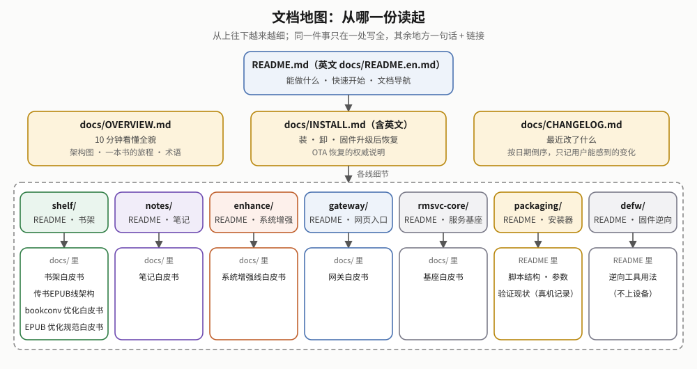

# cang-jie

**[中文](../README.md)**

A device-enhancement suite for the reMarkable Paper Pro Move: manage the books on the device from a phone or computer browser,
turn your highlights and handwritten margin notes into organizable notes, plus a few small system-level improvements.

It **does not modify `xochitl`** (the device's stock reading / notes / library app). Instead it adds features in three "side-channel" ways:

- **Web services on the device**: small resident programs that talk to xochitl through its own web upload endpoint and its library directory;
- **xovi extensions**: xovi is a third-party extension loader that loads our `.so` plugins into the xochitl process when it starts;
- **qmd UI patches**: patches to xochitl's UI description files (QML), applied at startup by the third-party component qt-resource-rebuilder, used to add a few entry points and agents.

> This repository is public since 2026-10-09 (Apache-2.0). The earlier public release [`rm-tweak`](https://github.com/bbq191/rm-tweak) was a
> history-less snapshot exported from here; it is archived and all updates happen here.

## What it does

| You want | How | Code |
|---|---|---|
| **Get books into xochitl** | Optimize the book on your computer with the sister project [sheng-ren](https://github.com/bbq191/sheng-ren) (booklib, `xochitl` reading mode) first, then upload it on the web page or scp it into the device's `~/.local/state/shelf/books/inbox/`. The book lands in the **master library** (a staging pool on the device that keeps books byte-for-byte); tick it and press "Add", optionally into a folder (xochitl creates it if missing). The shelf accepts EPUB / PDF only and delivers books as-is, never modifying them; books in the master library can be downloaded as the original file or renamed | [`shelf/`](../shelf/README.md) |
| Books over 100MB | xochitl's web upload stops at about 100MB; books over 90MB automatically go through "placeholder + on-disk replacement", whole, up to 1GB | `shelf/` |
| Add in bulk | Tick several books; the gateway works through them one by one in the background, even after you close the browser | [`gateway/`](../gateway/README.md) |
| Minimal comic margins | Comics optimized by sheng-ren get their page margin set to the minimum the first time you open them | `shelf/` |
| Replace a book without losing your place | sheng-ren on your computer can import directly (skipping the master library) or replace an existing book in place; after replacing a book you are reading, reopening it jumps back to where you were | `shelf/` |
| **Turn highlights and handwritten notes into notes** | When you close a book, highlighter marks and the handwriting beside them are collected into an entry store automatically. On your phone: review the handwriting transcription (vision model), search across books, ask AI about a single entry; then push a chapter back into a device notebook (headings, lists and checkboxes use the device's own styles) or export Obsidian Markdown | [`notes/`](../notes/README.md) |
| Highlighter that snaps precisely on Chinese text | xochitl splits words on spaces, so highlighting Chinese grabs the whole line; the `hl-snap` extension fixes that | [`enhance/`](../enhance/README.md) |
| Tap to turn pages in the reader | Tap the left / right edge to turn the page (off by default) | `enhance/` (the patch ships with `shelf/`) |
| A different xochitl UI font | Library, settings and dialogs use a font you upload; fonts inside the reader stay the same | `enhance/` |
| Reading fonts, sleep-screen wallpapers | Upload and use; the wallpaper can stay fixed or change on every sleep (in order or at random) | `enhance/` |
| Device health | "Manage → Device health" on the web page shows service status, memory, whether extensions are really loaded, and the last boot's log; when a firmware update wipes components, a banner at the top tells you how to recover | `gateway/` |

Everything is done from one web page: open `https://10.11.99.1/` (USB) or `https://shelf.local/` (same WiFi; Android doesn't resolve `.local`)
and enter the login password. The web UI is available in Chinese and English.

## Architecture


In short: every service runs on the device; **only the `gateway` faces the network** (`0.0.0.0:443`, HTTPS + login password); the other
services listen on `127.0.0.1` only and the gateway forwards to them via a service registry; a computer is needed only to install, uninstall
or update. How a request or an event actually flows is shown in the module-interaction diagram in [`OVERVIEW.md`](OVERVIEW.md) (Chinese).

## Install

Only the **reMarkable Paper Pro Move on firmware 3.28.0.172** is supported (the only version verified so far; the installer checks and refuses otherwise by default).

1. Install two third-party base components on the device by hand: `vellum add xovi` and `vellum add qt-resource-rebuilder` (vellum is the device's package manager). The installer won't install them.
2. Your computer needs a Rust cross-compilation setup and passwordless ssh to the device's root (list in [`INSTALL.en.md`](INSTALL.en.md)). Connect the device over USB, then:

   ```sh
   git clone https://github.com/bbq191/cang-jie.git
   cd cang-jie/packaging
   sh install-all.sh --dry-run        # rehearse first: prints the plan, never touches the device
   sh install-all.sh 10.11.99.1
   ```

   The last step reboots the device once (about a minute); when it is back, the script runs a read-only check and marks each item ✓ / ⚠ / ✗. If any step failed it does not reboot; fix it and re-run the same command.
3. Open `https://10.11.99.1/` in a browser. The default password is `shelf`, and you must change it on first login. To stop the browser warning, download the CA certificate from "CA cert" in the page header (labelled "CA 证书" in the Chinese UI) and install it once.

To update, re-run `sh install-all.sh 10.11.99.1`; it doesn't reboot when nothing changed. To uninstall: `sh uninstall-all.sh 10.11.99.1`.
Prerequisites, risks and how to recover after a firmware update (OTA) are all in **[INSTALL.en.md](INSTALL.en.md)**.

## Repository layout

| Directory | In one line |
|---|---|
| [`shelf/`](../shelf/README.md) | The shelf: master library, add / import into xochitl, the large-file channel, and the 5 qmd patches installed with it (trash agent, folder-creation agent, comic margins, reading position, tap-to-turn) |
| [`notes/`](../notes/README.md) | The notes line: highlights + handwriting → entry store → transcription / ask AI → device notebook or Obsidian (4 services: ink, transcribe, mind, note) |
| [`enhance/`](../enhance/README.md) | System enhancements: xovi extensions `hl-snap` (CJK highlighter snapping) and `ui-font` (UI font), the `font-serve` and `wallpaper-serve` services, and `lo-alias` (keeps xochitl's upload endpoint reachable after you unplug USB) |
| [`gateway/`](../gateway/README.md) | The gateway: the only network-facing entry; HTTPS, login, reverse proxy, event fan-in, bulk queue, management and device health; serves the whole web UI |
| [`rmsvc-core/`](../rmsvc-core/README.md) | The service base: a Rust library shared by the gateway and every service (service registry, HTTP, event bus, the layer that talks to xochitl); no business logic, never runs on its own |
| [`defw/`](../defw/README.md) | Reverse-engineering material for xochitl 3.28.0.172, used to find hook points for the xovi extensions; never goes on the device |
| [`packaging/`](../packaging/README.md) | The installer: runs on your computer and installs all of the above over ssh, with a firmware check, a post-install check, and a symmetric uninstall |

For contributors: on every push / PR, GitHub Actions runs shellcheck, the installer's sandboxed simulation tests, a syntax check and node
tests for the web scripts, C unit tests for enhance, `cargo test` for each Rust crate, a dependency advisory check (cargo audit) and an aarch64
cross-compile (`.github/workflows/ci.yml`). These only prove the code behaves correctly on a computer; **changes to device behavior still have
to be verified on real hardware**.

## Documentation map



| To learn about | Read |
|---|---|
| The whole system, the two core diagrams, design principles, verification status, glossary | [OVERVIEW.md](OVERVIEW.md) (Chinese) |
| Install, uninstall, update, recover after a firmware update | [INSTALL.en.md](INSTALL.en.md) |
| How the install scripts are structured and tested locally (developers) | [packaging/README.md](../packaging/README.md) (Chinese) |
| What changed recently | [CHANGELOG.md](CHANGELOG.md) (Chinese) |
| Per-line details, design decisions, on-device verification records | each directory's README and its `docs/` white paper (Chinese) |
| How books get optimized | Not in this repository: [sheng-ren](https://github.com/bbq191/sheng-ren)'s `docs/typesetting.md` and `docs/xochitl.md` |

## History and scope

The project started as a "reMarkable Chinese input method" (the repo name `cang-jie` / 仓颉 refers to the mythical inventor of Chinese
characters), then grew reading enhancements, knowledge management and handwriting recognition. On 2026-09-11 the repository was
reorganized: the Chinese input method, the early full reading pipeline, knowledge management and handwriting recognition, together with
their reverse-engineering material, were moved out. **Their source is not here, and this repository's installer does not distribute them.**
Several features were removed later (everything KOReader-related, the battery drain diagnostics "battop", handwriting stroke tuning,
on-device book optimization and format conversion, and more); see the [CHANGELOG](CHANGELOG.md) (Chinese).

What is maintained here today is the seven directories above. The architecture is more conservative than before: mostly standalone web
services, only two xovi extensions, touching the stock system's internals as little as possible.

## Sponsor

If this project has been useful to you, feel free to buy the author a coffee. It is entirely optional and has no effect on any feature. QR codes are on **[DONATE.en.md](DONATE.en.md)**.

## License / disclaimer

The code in this repository is open source under the **[Apache License 2.0](../LICENSE)**: you may use, modify and distribute it
(including commercially) as long as you keep the copyright notice; the license also includes a patent grant. It started as a personal
tool and is provided as-is, without any warranty.

Where third-party licensing is relevant (fonts, etc.), the in-code comments record what was actually verified. This is not legal advice.
Not affiliated with reMarkable, [xovi](https://github.com/asivery/xovi), vellum, or any other third-party project or trademark mentioned here.
