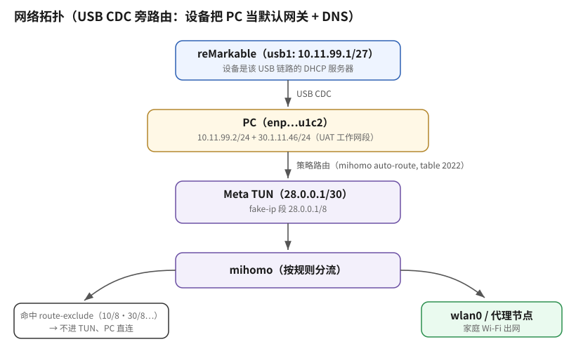
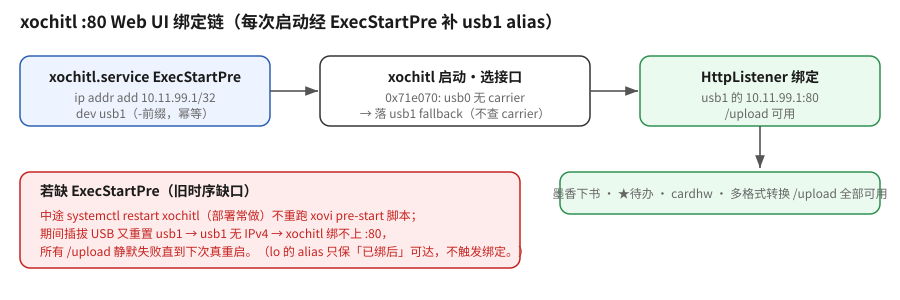

# reMarkable USB 共享 mihomo 上网

> imx93-chiappa（reMarkable Paper Pro 家族）· USB CDC 网络 · mihomo TUN · 自愈式推送
>
> 最后更新：2026-08-15

---

## 目录

- [背景与结论](#背景与结论)
- [网络拓扑](#网络拓扑)
- [设备 :80 Web UI 绑定与 usb1 alias](#设备-80-web-ui-绑定与-usb1-alias)
- [PC 端配置](#pc-端配置)
- [设备端事实（为什么不能在设备上持久化）](#设备端事实为什么不能在设备上持久化)
- [自愈推送机制](#自愈推送机制)
- [DNS 分层设计](#dns-分层设计)
- [行为速查](#行为速查)
- [排障手册](#排障手册)
- [已知问题与未解之谜](#已知问题与未解之谜)

---

## 背景与结论

目标：让 USB 直连的 reMarkable 设备（`10.11.99.1`）通过 PC 上的 mihomo（TUN 模式）上网，
即"旁路由"模式——设备把 PC 当默认网关和 DNS。

最终架构一句话：**设备端零持久化，PC 端一个 systemd 用户定时器每 45 秒守护，
设备在线且未配置时自动 SSH 推送全套配置**。设备无论重启、A/B 换槽还是恢复出厂，
插上 USB 最多 45 秒自动恢复。

---

## 网络拓扑



- 设备侧发出的流量 → PC 转发 → 策略规则 `not iif lo lookup 2022` → 进 Meta TUN → mihomo 按规则分流。
- 目的地址命中 `inet4-route-exclude-address`（10/8、30/8、40/8、172.16/12 等工作网段）的流量不进
  TUN，从 PC 直连出去——设备访问 UAT 内网正好走直连。

---

## 设备 :80 Web UI 绑定与 usb1 alias

与上面「设备上网」正交的另一件设备网络事实：**xochitl 的 Web UI（`:80`，`/upload` 免重启导书用）只绑到 USB gadget 接口的 IP**——WiFi IP、`127.0.0.1` 都不听。反编译 `xochitl_3.28.0.169.bin` 的接口选择函数 `0x71e070`：先看 `usb0`，**无 carrier 就落 `usb1` fallback 且不再查 carrier**，绑到该接口 `addressEntries()` 的 IP。本项目一大票功能（墨香下书 / ★待办 / cardhw / 多格式转换）都靠 `POST http://10.11.99.1:80/upload` 导书，故 `:80` 必须绑得上。



**无 USB 冷启动也要能绑**：拔 USB 时 usb0/usb1 掉 IPv4、`10.11.99.1` 从接口消失。喂饱 fallback 的办法 = pre-start 给 `usb1` 挂 `10.11.99.1/32`（`lo` 上也挂一份，但 lo 只保「已绑之后」本机可达、**不触发**绑定；真正让冷启动绑起来的是 usb1 这份）。

**时序缺口（2026-08-31 多格式真机踩到）**：给 usb1 挂 alias 的脚本 `cangjie-lo-alias.sh` **只在 xovi pre-start（开机）跑**——中途 `systemctl restart xochitl`（部署常做：cardhw/packaging/多格式）不重跑它；期间插拔 USB 又会重置 usb1、丢掉手挂的 alias。→ xochitl 中途重启时 usb1 无 IPv4 → `:80` 绑不上 → **所有 `/upload` 静默失败直到下次真重启**。

**治本 = ExecStartPre**（`chinese-ime/langhook/deploy/zz-cangjie-usb1-alias.conf`）：把 usb1 alias 挂载做成 `xochitl.service` 的 `ExecStartPre`，**每次 xochitl 启动都跑**（不只开机 pre-start）：

```ini
[Service]
ExecStartPre=-/usr/sbin/ip link set usb1 up
ExecStartPre=-/usr/sbin/ip addr add 10.11.99.1/32 dev usb1
```

`-` 前缀让命令失败（usb1 不存在、地址已存在）被忽略、绝不阻塞 xochitl 启动；命令内联走 rootfs 的 `/usr/sbin/ip`，**不引入任何 `/home` 依赖**（守「绝不给 xochitl 加 /home 依赖」铁律）。drop-in 放 `/usr/lib/systemd/system/xochitl.service.d/`（rootfs 持久、普通重启不丢；OTA 冲后重跑 `install.sh` 恢复）。**真机验证**：删掉 usb1 的 alias → 裸 `systemctl restart xochitl` → ExecStartPre 自动挂回 → `:80` ~45s 自动绑上、`GET /documents/` 返回 200。

> **诊断口诀**：`/upload` 报 `Connection refused (os error 111)` + `grep :0050 /proc/net/tcp` 里无 `0A`（LISTEN 态）= `:80` 没绑；查 `ip addr show usb1` 有没有 `10.11.99.1`。

---

## PC 端配置

### mihomo（/etc/mihomo/config.yaml，root）

| 配置项 | 值 | 原因 |
|---|---|---|
| `tun.auto-redirect` | **false** | 为 true 时 nftables 会把局域网来的 53 端口流量 DNAT 后丢进 FORWARD 黑洞（上游 [Discussion #2491](https://github.com/MetaCubeX/mihomo/discussions/2491)），设备 DNS 必死 |
| `dns.listen` | **0.0.0.0:1053** | 设备直查 mihomo DNS 拿 fake-ip；TUN 的 `dns-hijack any:53` 实测只劫持本机流量、不管转发流量，指望不上 |

⚠️ 改回任何一项都会弄断设备 DNS。`auto-redirect: false` 的代价只是本机 TCP 少一个
nftables 快路径优化，对 `nmcli device wifi hotspot` 共享出的热点无影响。

### NetworkManager

UAT 连接（enp128s20f0u1c2）静态地址包含 **`10.11.99.2/24`**（`nmcli con mod UAT +ipv4.addresses 10.11.99.2/24`）。
设备的 DHCP 服务器是"隔离网络"配置（EmitDNS/EmitRouter=no、60 秒租约），不能依赖它给 PC 发地址——
这个静态地址曾经是手工 `ip addr add` 的临时值，连接一重激活就丢，导致设备完全失联。

### 自愈推送（用户级，无需 root）

| 文件 | 作用 |
|---|---|
| `~/.local/bin/remarkable-usb-share.sh` | 幂等推送脚本（探测→检查标记→推送） |
| `~/.config/systemd/user/remarkable-usb-share.service` | oneshot 执行脚本 |
| `~/.config/systemd/user/remarkable-usb-share.timer` | 开机 30s 后首跑，之后每 45s |

```sh
systemctl --user enable --now remarkable-usb-share.timer   # 启用
journalctl --user -u remarkable-usb-share.service          # 查看推送日志
```

定时器跑在用户会话里（greetd 自动登录，日常无感）。想在未登录时也生效：
`sudo loginctl enable-linger afu`。

---

## 设备端事实（为什么不能在设备上持久化）

- **`/etc` 是内存 overlay**：`upperdir=/var/volatile/etc`（tmpfs），一切写入重启即蒸发。
- **根分区是 A/B 双槽**（p2/p3，ext4 只读挂载）：曾实验过 `mount -o remount,rw /` + bind-mount
  写入真实 `/etc`——写入成功，但下次启动切换了槽位，全部落空。**不要再走这条路**。
- 持久的只有 `/home`（加密盘）及厂商指定的几个 bind（`/etc/dropbear`、`/var/lib/NetworkManager` 等），
  但没有任何厂商机制会在启动时执行 `/home` 里的东西。
- 设备是 systemd 系统（networkd 管 usb\*，NetworkManager 管 wlan0，resolved 做解析），
  root SSH 免密可达 `10.11.99.1`。
- busybox 是**极简裁剪版**：`nc` 不支持 `-w`/UDP、无 `timeout`/`tcpdump`/`python`/`iptables`/`nft`、
  `head -3` 短写法不可用（要 `head -n 3`）。**命令"失败"先怀疑命令本身**。
- 设备闲置会自动挂起，SSH 会话直接冻结——命令挂死 ≠ 网络故障，ping 一下确认。

---

## 自愈推送机制

脚本每次执行的逻辑：

1. `ping 10.11.99.1` 不通 → 静默退出（设备不在）。
2. SSH 检查三个标记：networkd drop-in 含 `Domains=~.`、`ignore_routes_with_linkdown=1`、
   `resolv.conf` 指向 stub → 全满足则退出（已配置）。
3. 否则推送：

| 设备端文件/操作 | 内容 |
|---|---|
| `/etc/systemd/network/10-usb.network.d/pc-gateway.conf` | `[Network] DNS=10.11.99.2:1053, Domains=~., DNSDefaultRoute=yes, DNSOverTLS=no` + `[Route] Gateway=10.11.99.2, Metric=500` |
| `/etc/systemd/resolved.conf.d/pc-gateway-dns.conf` | `[Resolve] DNS=223.5.5.5#dns.alidns.com 119.29.29.29#dot.pub, DNSOverTLS=opportunistic` |
| sysctl（运行时逐个写 /proc） | `ignore_routes_with_linkdown=1`（v4+v6 全接口） |
| `/etc/resolv.conf` | → `/run/systemd/resolve/stub-resolv.conf`（原厂指向 `/etc/resolv-conf.systemd`，即 uplink 模式，会绕过 resolved） |
| 服务 | `systemctl restart systemd-resolved` + `networkctl reload && networkctl reconfigure usb1` |

---

## DNS 分层设计

| 场景 | 生效 DNS | 说明 |
|---|---|---|
| USB 在线 | **mihomo `10.11.99.2:1053`**（usb1 链路级，`Domains=~.` 独占优先） | 返回 fake-ip（28.0.0.0/8），mihomo 域名规则完整生效；`DNSOverTLS=no` 避免对明文端口做 TLS 探测卡顿 |
| 仅 Wi-Fi | **公共 DoT**（阿里/腾讯，TCP 853） | usb1 断链后其链路级 DNS 自动消失，全局 DoT 接管；绕开"我是猫"对该设备 53 端口的黑洞 |

设计要点：

- `Domains=~.` 是 systemd-resolved 的"VPN 优先"机制——该链路存在时独占全部域名解析，
  断链即失效，无需任何清理逻辑。
- **境内 DoT 解析国外域名会拿到污染结果**（如 `www.google.com → 2001::1`）。这正是 USB 在线时
  必须 mihomo 优先的原因；仅 Wi-Fi 时国外域名解析质量受限，属已知取舍。
- `ignore_routes_with_linkdown=1` 让无载波接口的路由退出选路：拔 USB 瞬间回落 Wi-Fi，
  Wi-Fi 断开时其死路由也不会压住 USB（此内核默认行为曾双向坑过我们各一次）。

路由优先级：usb1 默认路由 metric **500** < wlan0 的 600 —— **插着 USB 就走 PC 的 mihomo**，
拔掉即回落设备自身 Wi-Fi。

---

## 行为速查

| 动作 | 结果 |
|---|---|
| 插上 USB | ≤45s 内自动配置，全流量走 mihomo（fake-ip + 域名规则） |
| 拔掉 USB | 路由/链路级 DNS 随载波消失，回落自身 Wi-Fi + DoT |
| 设备重启 / 换槽 / 恢复出厂 | 配置清零→插 USB 自动重推 |
| 设备访问 10/8、30/8 等工作网段 | 不进代理，从 PC 直连 |
| PC 开 Wi-Fi 热点 | 不受影响（热点走 NM dnsmasq + 本机劫持路径） |

---

## 排障手册

按层检查（全部可免 root）：

```sh
# 0. 设备在吗?没睡吧?
ping -c1 10.11.99.1

# 1. 推送到位了吗?
ssh root@10.11.99.1 'cat /proc/sys/net/ipv4/conf/usb1/ignore_routes_with_linkdown; readlink /etc/resolv.conf; ip route | head -n 3'
systemctl --user list-timers remarkable-usb-share.timer

# 2. mihomo DNS 活着吗?(应返回 fake-ip 28.x)
ssh root@10.11.99.1 'resolvectl flush-caches; resolvectl query www.google.com'
ss -uln | grep 1053        # PC 侧监听

# 3. 转发路径通吗?
ssh root@10.11.99.1 'wget -T 8 -q -O /dev/null http://captive.apple.com && echo OK'
ip rule                    # 应有 not iif lo lookup 2022(mihomo auto-route)

# 4. 深挖:mihomo 连接表/调试日志(API 免 root)
curl -s -H 'Authorization: Bearer <secret>' http://127.0.0.1:9090/connections | python3 -m json.tool | grep -A2 10.11.99.1
curl -s -X PATCH -H 'Authorization: Bearer <secret>' -d '{"log-level":"debug"}' http://127.0.0.1:9090/configs
journalctl -u mihomo -f    # 看完记得改回 warning

# 5. 内核转发决策模拟
ip route get 8.8.8.8 from 10.11.99.1 iif enp128s20f0u1c2
```

典型症状对照：

| 症状 | 大概率原因 |
|---|---|
| 设备 DNS 秒回 fake-ip 但网页打不开 | usb1 默认路由丢了（推送未跑/被 networkd 重置） |
| 设备 DNS 拿到真实 IP / 污染 IP | resolved 没用上 mihomo（usb1 链路级 DNS 丢失，退到 DoT 了） |
| ping 通、TCP 通、唯独 DNS 死 | 53 端口路径问题：查 mihomo `auto-redirect` 是否被改回 true、`dns.listen` 是否还是 0.0.0.0:1053 |
| SSH 命令永久挂死但 ping 通 | busybox 工具误导或设备挂起，换 resolvectl/wget 复测 |
| 设备完全失联 | PC 的 UAT 连接丢了 10.11.99.2/24 静态地址 |

---

## 已知问题与未解之谜

1. **"我是猫"对设备的 53 端口 UDP 精准黑洞**：同一路由器对 PC 的明文 DNS 查询正常应答，
   对设备发往**任何地址**:53 的 UDP 一律无回应（ICMP/TCP/高位 UDP 均正常）。根因未查明，
   疑路由器"上网管控/防蹭网"类功能针对该设备。已用 DoT 绕过，不影响使用；
   若在路由器后台找到元凶，可考虑简化 DoT 兜底。
2. **设备系统升级**可能带来新固件行为（如 overlay 结构变化），推送脚本的标记检查失效时
   表现为每 45s 重复推送——看 `journalctl --user -u remarkable-usb-share.service` 即可发现。
3. p3 槽的真实 `/etc` 里残留着早期实验写入的配置文件（内容与 v1 版本相同）。无害：
   若设备从 p3 启动，推送脚本的 v2 标记检查不通过，会自动覆盖为最新配置。
