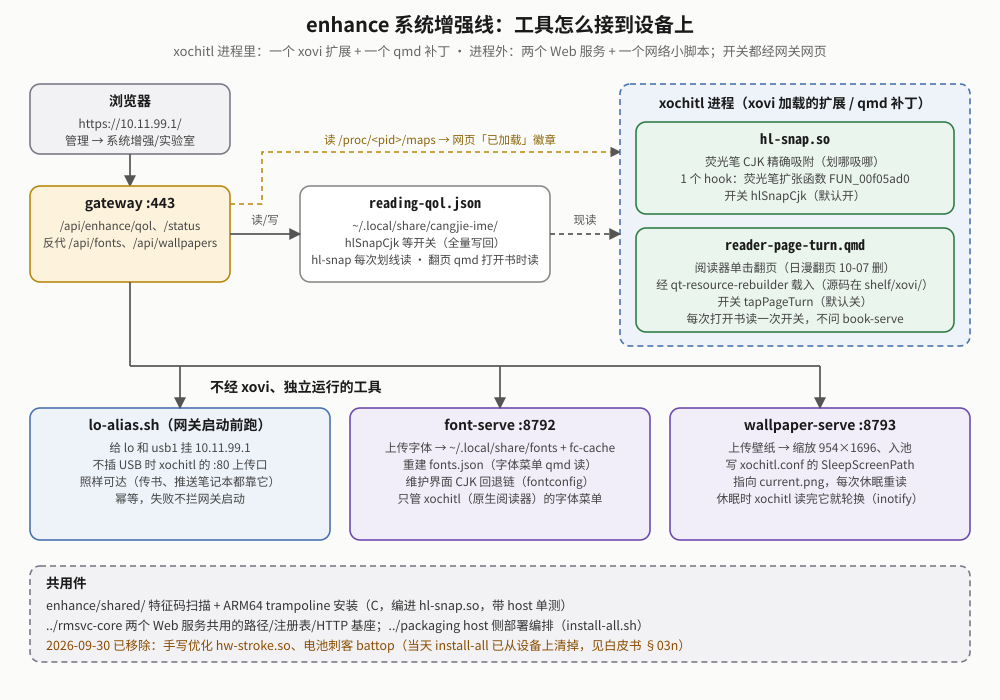

# enhance —— 系统增强线

**一句话**：一组互相独立的小工具，让 reMarkable 更顺手——划中文精确吸附、手写笔锋、耗电排查、字体和壁纸上传即用。它们都**不修改 xochitl**（reMarkable 自带的阅读/笔记程序）本身。

- 整个仓库里的位置见 [`../docs/OVERVIEW.md`](../docs/OVERVIEW.md)。
- 原理、决策、真机验证、踩坑见 [白皮书](docs/reMarkable系统增强线白皮书.md)（先读 §00b 现状）。



## 组件一览

| 组件 | 是什么 | 状态 | 在网页哪里开关 |
|---|---|---|---|
| [`hl-snap/`](hl-snap/README.md) | xovi 扩展：荧光笔划中文时划哪吸哪，不再吸整行 | ✅ 真机通 | 管理 → 系统增强，默认开 |
| [`shelf/xovi/reader-page-turn.qmd`](../shelf/xovi/reader-page-turn.qmd) | qmd 补丁：xochitl 阅读器单击翻页、日漫翻页规则 | ✅ 真机通（09-24） | 管理 → 系统增强，默认关 |
| [`handwriting-stroke/`](handwriting-stroke/README.md) | xovi 扩展：按笔尖角度 + 运笔速度调整手写笔画粗细 | ✅ 书法笔和钢笔/铅笔/马克笔等真机通；最常用的一档钢笔/铅笔还摸不到 | 管理 → 实验室，默认关 |
| [`battop/`](battop/README.md) | 采样服务「电池刺客」：按进程/应用/唤醒源统计耗电 | ✅ 真机通；**有意不开机自启** | 管理 → 系统增强；开着时出现「电池刺客」数据页 |
| [`wallpaper-serve/`](wallpaper-serve/README.md) | Web 服务（8793）：休眠壁纸上传即用、每次休眠后轮换 | ✅ 真机通 | 其他 → 壁纸 |
| [`font-serve/`](font-serve/font-serve.service) | Web 服务（8792）：xochitl 字体上传即装、中文回退链 | ✅ 真机通 | 其他 → xochitl |
| [`shared/`](shared/PROVENANCE.md) | 两个 xovi 扩展共用的特征码扫描 + trampoline 代码（带 host 单测） | — | 不单独部署 |
| [`lo-alias/`](lo-alias/README.md) | 让 `10.11.99.1` 在不插 USB 时也可达的小脚本 | — | 不单独部署（网关启动前调用） |

**xovi 扩展**是什么：xovi 是第三方扩展加载框架，xochitl 启动时把 `~/xovi/extensions.d/` 下的 `.so` 加载进进程；扩展用 hook（把某个函数入口改成先跳到自己的代码）改变行为。换固件后找不到目标函数，扩展会自动不加载、退回原生行为。完整流程图见白皮书 §02。

**开关 ≠ 已生效**：两个扩展的网页开关旁有「已加载 / 未加载」徽章，表示 `.so` 是否真的在 xochitl 进程里；「管理 → 基石」也列出了 xochitl 里实际生效的扩展。

`font-serve` 没有自己的 README：路由、字体目录、`fonts.json` 索引写在 `font-serve/src/main.rs` 头注，原理在 [`../shelf/docs/reMarkable书架白皮书.md`](../shelf/docs/reMarkable书架白皮书.md) 的字体章节（第 F 章、§03k、§03bd）。

## 构建与部署

一般用整包安装：`sh packaging/install-all.sh <host>` 会按顺序装好全部组件，xovi 扩展只落盘、最后统一重启 xochitl 一次（见 [`../docs/INSTALL.md`](../docs/INSTALL.md)）。`wallpaper-serve` / `font-serve` / `lo-alias` 随其中的 shelf 步安装。

单独更新某个工具，用 [`../packaging/`](../packaging/README.md) 里的一键脚本（构建 → 推送并 md5 校验 → 设备端安装）：

```sh
cd packaging
sh deploy-hl-snap.sh <host>
sh deploy-handwriting-stroke.sh <host>
sh deploy-battop.sh <host>
```

单独跑时，内容没变、也没有别的待生效改动就不重启 xochitl。各工具的设备端 `install.sh` 也能脱离编排单独跑，但需要同目录的 `devlib.sh` 等文件，见各自 README。

两个 xovi 扩展的 `.so` 已提交进仓库；构建用的 xovi 胶水 `xovi_glue.{c,h}` 也已提交，平时 `make aarch64` 不需要 asivery/xovi clone，只有改了 `.xovi` 才要 `make glue XOVI_DIR=<clone>` 重新生成。

⚠ 更新 xovi 扩展时，如果运行中的 xochitl 正在用旧版 `.so`，必须 **stop xochitl → 换文件 → start**，不能换完再 `restart`（会整机重启）。部署脚本已经这样做，手动操作时要注意。

## 跟其它目录的关系

- [`../gateway/src/enhance/`](../gateway/src/enhance/) 是本线的**网页控制面**：只调 `systemctl`、读写 `~/.local/share/cangjie-ime/reading-qol.json`（两个 `.so` 读的是同一份文件）、读 xochitl 的 `/proc/<pid>/maps`，和本目录源码没有代码依赖。
- `wallpaper-serve/`、`font-serve/` 依赖 [`../rmsvc-core`](../rmsvc-core/README.md)，由网关反向代理。
- [`../defw/`](../defw/README.md)（xochitl 3.28.0.172 逆向产物）**不属于**本线，是共享的逆向基座；`handwriting-stroke/` 的研究用它。
- 迁移、改名的历史见白皮书附录「迁移沿革」；设备上谁在定时唤醒 CPU 见白皮书 §03j；2026-09-24 第三轮审计的改动（只在 host 验证）见白皮书 §03k。
