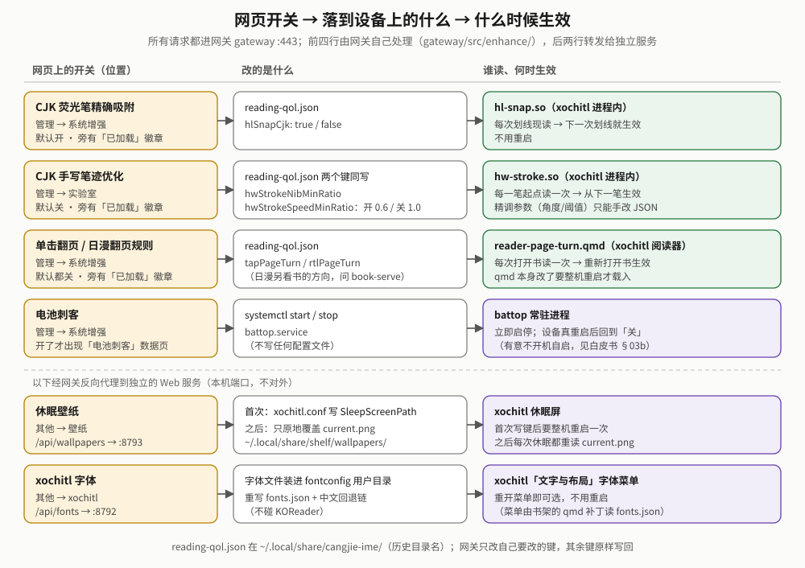
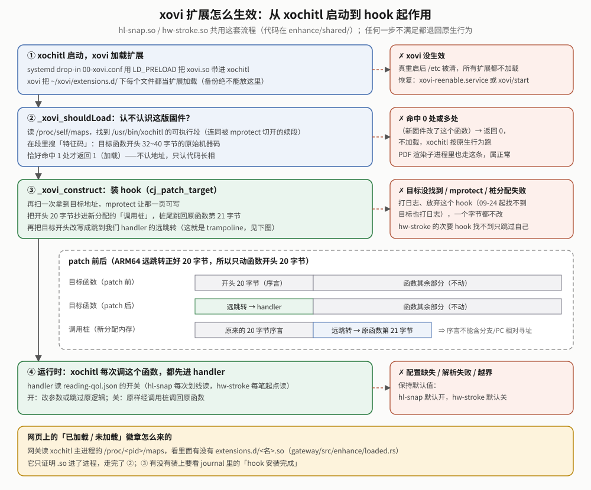
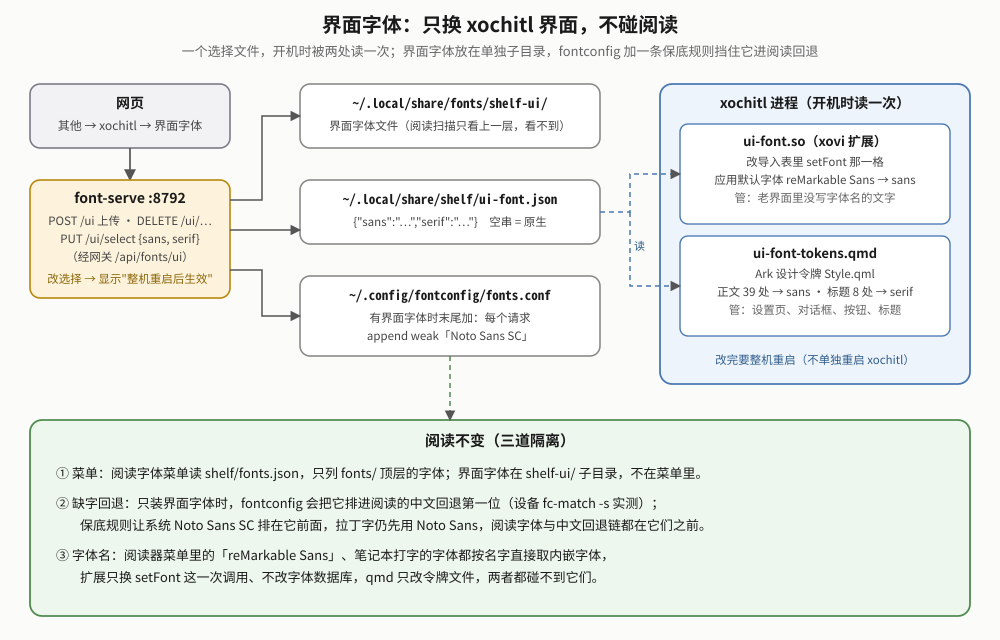
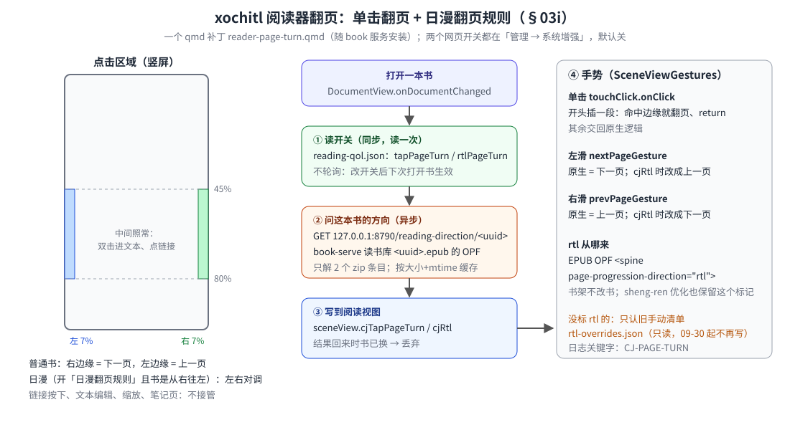
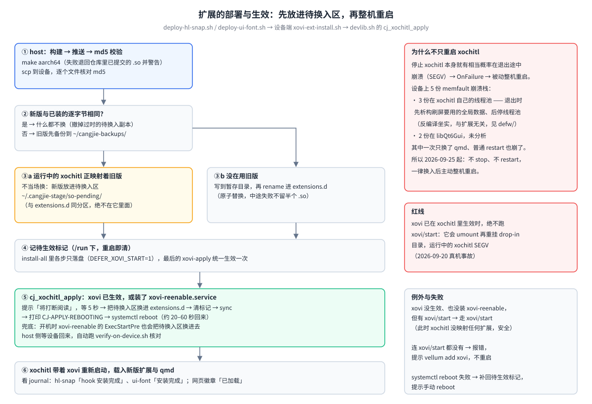
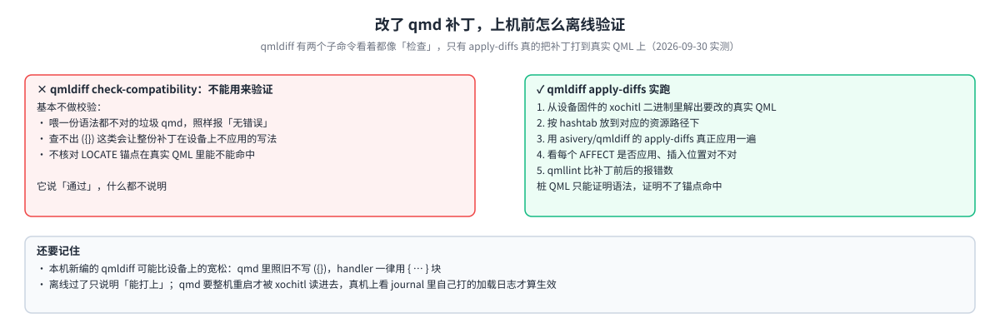

# reMarkable 系统增强线（enhance）白皮书

> **一句话**：一组互相独立的小工具，在**不修改 xochitl 本身**的前提下，让 reMarkable Paper Pro Move（固件 3.28.0.172）更顺手——荧光笔划中文精确吸附、xochitl 界面字体、阅读器单击翻页、阅读字体和休眠壁纸上传即用。
>
> **怎么读**：只想用 → 第 1、2 章；要改代码 → 第 3、5 章；遇到问题 → 第 6 章；想知道哪些在真机上验证过 → 第 7 章；为什么这样设计、以前做过什么 → 附录 A。每个工具的命令细节在各自 README（[hl-snap](../hl-snap/README.md)、[ui-font](../ui-font/README.md)、[wallpaper-serve](../wallpaper-serve/README.md)、[lo-alias](../lo-alias/README.md)；font-serve 没有单独 README，见[本线 README](../README.md)）。
>
> **验证程度的写法**：「真机」= 在设备上跑过、看到了效果；「已部署」= 装上设备、部署自检通过，但功能本身没手测；「开发机」= 只有 host 测试或离线验证；「未部署」= 代码已合并，还没上设备。
>
> **章节号**：2026-10-10 按新手阅读顺序重组过，旧的 `§00b`、`§03a`…`§05` 编号（代码注释和别的文档里还在用）对应到哪一节，见[附录 C「旧章节号对照表」](#附录-c旧章节号对照表)。

## 1. 五分钟读懂

### 1.1 能做什么

| 工具 | 用户看到的效果 | 在网页哪里开关 | 什么时候生效 |
|---|---|---|---|
| **hl-snap** 荧光笔汉字吸附 | 用荧光笔划一小段中文，只高亮划过的字，不再"划一小段吸整行" | 管理 → 系统增强，**缺省开** | 下一次划线 |
| **ui-font** 界面字体 | xochitl 的菜单、设置、对话框、标题换成你上传的字体；读书时书里的字体不变 | 其他 → xochitl → 界面字体 | 整机重启后 |
| **reader-page-turn** 单击翻页 | 阅读时点屏幕左右边缘翻页 | 管理 → 系统增强，**缺省关** | 下次打开书 |
| **font-serve** 阅读字体 | 网页上传字体，xochitl 阅读器的字体菜单里就能选；中文缺字自动回退 | 其他 → xochitl | 重开字体菜单 |
| **wallpaper-serve** 休眠壁纸 | 网页上传图片当休眠屏；传多张就每次休眠后轮换 | 其他 → 壁纸 | 首次整机重启一次，之后下次休眠 |
| **lo-alias** | 不插 USB 时，设备上的服务照样能往 xochitl 传书（用户不直接接触） | 无 | 开机自动 |

### 1.2 组成部分


- **xochitl 进程里**：两个 xovi 扩展 `hl-snap.so`、`ui-font.so`（C 写的），两个 qmd 补丁 `ui-font-tokens.qmd`、`reader-page-turn.qmd`（源码在 `shelf/xovi/`，随书架的 font / book 服务安装）。
- **xochitl 进程外**：两个 Rust Web 服务 `font-serve`（`127.0.0.1:8792`）、`wallpaper-serve`（`127.0.0.1:8793`），一个 shell 脚本 `lo-alias.sh`。
- **共用件**：[`enhance/shared/`](../shared/PROVENANCE.md)（C：特征码扫描、远跳转跳板、PC 相对指令检查、极简 JSON 读取 `minijson`）；[`rmsvc-core`](../../rmsvc-core/README.md)（两个服务共用的 HTTP、路径、目录监听基座）。
- **网页控制面**在网关 [`gateway/src/enhance/`](../../gateway/src/enhance/)：网关只读写配置文件、读 xochitl 的 `/proc/<pid>/maps`，与本目录源码没有代码依赖。
- **不属于本线**：[`defw/`](../../defw/README.md)（xochitl 3.28.0.172 逆向工具与方法）是全仓库共享的逆向基座。

### 1.3 术语

| 术语 | 意思 |
|---|---|
| xochitl | reMarkable 自带的主程序（书库、阅读器、笔记本都是它）。本线**不改它的文件** |
| xovi | 第三方扩展加载框架（用 `vellum add xovi` 装）。靠 systemd drop-in 用 `LD_PRELOAD` 把 `xovi.so` 带进 xochitl，再加载 `~/xovi/extensions.d/` 下的**每个文件** |
| xovi 扩展 | xovi 加载的 `.so`，导出 `_xovi_shouldLoad`（要不要加载）和 `_xovi_construct`（加载后做什么） |
| qmd / qt-resource-rebuilder | qmd 是 QML 补丁文件，由 xovi 扩展 qt-resource-rebuilder 在 xochitl **启动时**读一次、打到界面 QML 上 |
| hook | 把某个函数的入口改成先跳到我们自己的代码（handler），再决定调不调原函数 |
| 特征码 | 目标函数开头的一串原始机器码。按"代码长什么样"找函数，不写死地址；换固件后找不到就自动不加载 |
| 调用桩（trampoline） | 被覆盖的原函数开头字节 + 一条跳回原函数的指令，放在新分配的内存里，让 handler 还能调原函数 |
| `reading-qol.json` | `~/.local/share/cangjie-ime/reading-qol.json`，几个开关共用的配置文件（`cangjie-ime` 是历史目录名） |
| 待换入区 | `~/.cangjie-stage/so-pending/`。部署时 xochitl 正在用旧版 `.so`，新版先放这里，整机重启前换进 `extensions.d/` |
| 整机重启 | 让扩展和 qmd 生效的唯一方式（2026-09-25 起）。原因见 [3.8](#38-扩展怎么换入为什么一律整机重启) |
| `FUN_00xxxxxx` | Ghidra（逆向工具）给无符号函数起的名字，数字是地址 |

## 2. 怎么用

### 2.1 安装

前置：设备上已 `vellum add xovi`、`vellum add qt-resource-rebuilder`。

```sh
sh packaging/install-all.sh <设备IP>      # 整包：本线全部组件都在里面
```

`install-all.sh` 里与本线有关的步骤：`hl-snap`、`ui-font`（只落盘）→ `shelf`（装 font-serve、wallpaper-serve、`lo-alias.sh` 和两个 qmd）→ 最后 `xovi-apply` 统一整机重启一次。完整流程见 [`docs/INSTALL.md`](../../docs/INSTALL.md) 与 [`packaging/README.md`](../../packaging/README.md)。

单独更新某一样：

```sh
cd packaging
sh deploy-hl-snap.sh <host>          # 构建 → 推送并逐个 md5 校验 → 设备端安装 → 需要时整机重启
sh deploy-ui-font.sh <host>
sh deploy.sh <host> --only font      # font-serve + 网页 + 字体相关 qmd
sh deploy.sh <host> --only wallpaper
```

内容没变、也没有别的待生效改动时不重启。卸载：`uninstall-all.sh` 的 `hl-snap` / `ui-font` 步只摘 `.so`，不碰字体文件和选择文件。

### 2.2 网页开关一览



`管理 → 系统增强` / `管理 → 实验室` 里的开关登记在网关 [`gateway/src/enhance/mod.rs`](../../gateway/src/enhance/mod.rs) 的 **`TOGGLES` 表**（2026-10-10 起）：每行是键名、缺省值、在 xochitl 里靠什么生效。读、写、`GET /api/enhance/status` 的应答都从这张表派生；加一个开关 = 表里加一行 + 网页 `gateway/ui/manage.js` 的 `TOGGLE_UI` 加一行文案。

| 键（`reading-qol.json`） | 缺省 | 承载它的产物 | 网页位置 |
|---|---|---|---|
| `hlSnapCjk` | 开 | 扩展 `hl-snap.so` | 管理 → 系统增强 |
| `tapPageTurn` | 关 | 补丁 `reader-page-turn.qmd` | 管理 → 系统增强 |
| `notesImportMdEnabled` | 关 | 纯网页功能（笔记线「导入 md」子标签） | 管理 → 实验室 |

缺省值必须与读这个键的一方（C 扩展 / qmd）一致。旧文件里的 `rtlPageTurn`（日漫翻页，10-07 删）、`comicMinMargin`（漫画页边距开关，10-07 删）、`hwStroke*`（手写优化，09-30 删）无人再读，原样留着无害。

**全量写回**：`reading-qol.json` 多方共享（网关、旧原生设置页、C 扩展、qmd 都读，前两者会写）。网关 `gateway/src/enhance/qol.rs` 把整份文件当不透明 JSON 读进来，只改要改的键，不认识的键原样写回，并在进程内串行化。

**开关 ≠ 已生效**：开关只写配置，产物没加载时开了也没用。开关旁的徽章由网关判定（见 [3.9](#39-网页已加载徽章怎么判)）：「已加载 / 未加载 / 待重启 / 未知 / 网页功能」。

字体、壁纸页由网关反代给 font-serve、wallpaper-serve，接口见 [4.2](#42-http-接口)。

### 2.3 改了之后什么时候生效

| 改了什么 | 怎么生效 |
|---|---|
| `hlSnapCjk` 开关 | 下一次划线（扩展每次划线现读文件） |
| `tapPageTurn` 开关 | 下次打开书（qmd 每次开书读一次，不轮询） |
| 界面字体选择 | 整机重启（扩展与 qmd 都只在 xochitl 启动时读） |
| 上传 / 删除阅读字体 | 重开阅读器字体菜单 |
| 第一次启用壁纸 | 整机重启一次（让 xochitl 读进 `SleepScreenPath` 键）；之后上传、切换都不用重启 |
| 换了 `.so` 或 qmd 文件本身 | 整机重启（部署脚本自动做）。**不要**单独 `systemctl restart xochitl`，**绝不**在 xovi 已生效时跑 `xovi/start` |

## 3. 怎么工作

### 3.1 xovi 扩展怎么生效



hl-snap 走完整的四步，代码在 [`shared/`](../shared/PROVENANCE.md)：

1. **加载**：xovi 在 xochitl 启动时加载 `extensions.d/` 下的每个文件——所以**备份绝不能留在这个目录**（同名扩展重复注册是致命错误，xochitl 会起不来）。
2. **`_xovi_shouldLoad`**：`cj_find_exec_module` 读 `/proc/self/maps` 找 `/usr/bin/xochitl` 的可执行段（连同被 `mprotect` 切开的续段，见 [5.4](#54-加新-hook-前的检查清单)）；`cj_find_unique_pattern` 在段里搜特征码，**恰好命中 1 处**才加载。换了固件、函数变了就不加载，xochitl 按原生行为跑——这是主要的 fail-safe。
3. **`_xovi_construct` → `cj_patch_target`**：再搜一次拿地址，然后：记下目标页原权限 → `mprotect` 成可读写执行 → **逐条检查要被覆盖的 5 条指令**（`cj_insn_pc_relative`，见下）→ 把开头 20 字节抄进新分配的调用桩、桩尾接一条跳回原函数第 21 字节的远跳转 → 把目标开头改写成跳到 handler → 刷指令缓存 → 原本是 `r-x` 的页恢复成 `r-x`。任何一步失败都打日志、放弃这个 hook、不改任何字节、页权限恢复原样。
4. **运行时**：xochitl 每次调这个函数都先进 handler，handler 读开关决定改不改。

**三道代码层防线**（都在 `shared/`）：

| 防线 | 防什么 | 从何时 |
|---|---|---|
| 特征码必须唯一命中 | 固件变了、或目标已被别的扩展改过时乱 patch | 一开始 |
| `cj_insn_pc_relative`：被覆盖的指令里有 PC 相对寻址（`adr`/`adrp`、`b`/`bl`、`b.cond`/`bc.cond`、`cbz`/`cbnz`、`tbz`/`tbnz`、`cb<cc>`、`ldr`/`ldrsw`/`prfm` literal）就放弃 hook | 这类指令搬进调用桩后，算出来的地址是相对调用桩的，调原函数时会跳飞。以前只靠人工逐条反汇编核对，漏一条就出事；宁可误判放弃，不漏判（`br`/`blr`/`ret` 不算：结果正确） | 2026-10-10（未部署） |
| 改完把代码页从 RWX 恢复成原来的 `r-x` | 一直留着可写可执行的代码页。原本就可写（例如别的扩展先改过）、跨两页权限不一致或查不到时保持 RWX；调用桩分配失败、PC 相对检查放弃时同样恢复 | 2026-10-09 |

**`minijson`**（2026-10-10，未部署）：两个扩展读配置用同一份极简 JSON 读取 `cj_json_get_bool` / `cj_json_get_string`：只认**顶层对象里后面跟冒号的字符串**为键，符号设为 hidden（两个 `.so` 在同一进程，不导出免得互相调到对方的同名函数）。旧实现用 `strstr` 找 `"键名"`，某个值恰好等于键名（`{"last":"hlSnapCjk","hlSnapCjk":false}`）、或嵌套对象里有同名键时会读错。网关和 font-serve 写出的都是扁平对象，结果与旧版相同。

ui-font 不走第 2、3 步的特征码与跳板，见 [3.3](#33-ui-font界面字体)。

### 3.2 hl-snap：荧光笔汉字吸附

**病根**：xochitl 划线后调一个"扩张选区"函数 `FUN_00f05ad0`（3.28.0.172 上在 `0xf03670`），按空格分词把选区向两边扩到整个"词"；中文没有空格，于是一小段扩成整行。

**修法**：hook 这个函数。handler 每次划线现读 `reading-qol.json` 的 `hlSnapCjk`；开着并且选区第一个字是 CJK（统一表意 `4E00–9FFF`、扩展 A `3400–4DBF`、兼容表意 `F900–FAFF`、CJK 标点 `3000–303F`）时**不调原函数**，否则经调用桩调原函数。逻辑逐字节来自旧中文化扩展 langhook 里 2026-08-23 真机验证过的代码段。

- **特征码**：目标函数开头 40 字节；被覆盖的前 20 字节是 `paciasp`/`stp`/`mov`/`str`/`mov`，没有分支和 PC 相对寻址（2026-10-10 用 3.28.0.172 的 xochitl objdump 再核过，新的 PC 相对检查不会误判它）。
- **读字**：glyph 数组是 Qt 6 的 QList，`scene+8` 是元素基址、`scene+0x10` 是元素个数，每个元素 0x38 字节、字符在 `+0x30`。下标 ≥ 个数时按"不是汉字"处理、交回原生扩张（2026-10-09 加的上界，依据是兄弟函数 `0xf03750` 开头 `ldp x5, x3, [x21, #8]`；xochitl 自己也不查上界，这只是多一层保险）。
- **配置读不到**（文件缺失、键缺失、不是布尔）：保持上一次读到的值，初始为开。
- **加载判据只看自己的目标函数**：旧 langhook 里所有 hook 先看 `setLanguageCode` 的特征码在不在（"总闸"），对只管吸附的扩展不合理。
- **不要与旧中文化扩展 `cangjie-langhook.so` 同时装**：两者 patch 同一个函数。按代码推断是"先到先得"：两边在 `_xovi_shouldLoad` 都看到原始机器码、都同意加载；先装 hook 的那个改写了函数开头，后一个再扫时特征码对不上，打一行"特征码不再唯一命中…hook 未安装"后放弃（langhook 一侧源码已不在仓库，未核对，也没真机测过）。langhook 自带同样的修复。

### 3.3 ui-font：界面字体



**xochitl 的界面字体从哪来**（从设备 3.28.0.172 的 xochitl 解出全部 505 个 QML 核对）：

- **Ark 设计令牌** `/ark-imports/ark/tokens/Style.qml`：单例，36 个 QML 经 `root.typography.fontFamily` 取字体——正文 39 处写死 `"reMarkable Sans"`，标题 8 处 `"reMarkable Serif Small"`。
- **应用默认字体**：老界面的文字不写字体名，用 `QGuiApplication::font()`。xochitl 启动时调一次 `QGuiApplication::setFont`，字体本身在 qrc 里（`addApplicationFont` 注册，fontconfig 看不见）。
- **阅读器**：EPUB 的字体由阅读器菜单选（`epubProperties.fontName`），不读令牌。

**做法**：三块读同一个选择文件 `~/.local/share/shelf/ui-font.json`（`{"version":1,"sans":"…","serif":"…"}`，空串 = 原生），都只在 xochitl 启动时读一次。

| 部件 | 怎么改 |
|---|---|
| `shelf/xovi/ui-font-tokens.qmd` | `AFFECT REBUILD` 整份令牌文件：两个字面量换成 `root.shelfUiSans` / `root.shelfUiSerif`，在 `id: root` 后插入这两个属性（缺省原生名）和一次同步 XHR 读选择文件 |
| `enhance/ui-font`（xovi 扩展） | 改 xochitl 导入表（`.got.plt`）里 `QGuiApplication::setFont` 那一格：收到的家族名是 `reMarkable Sans` 且选了 `sans` 时，拷一份 QFont、`setFamily` 后再调原函数（字重字号保留），否则原样放行 |
| font-serve 界面字体仓库 | 字体放 `fonts/shelf-ui/` 子目录，清单 `shelf/ui-fonts.json`；`GET/POST /ui`、`DELETE /ui/{family}`、`PUT /ui/select`；只能选已装的界面字体；回执带"是否待整机重启" |

**为什么不 patch setFont 本体**：它开头第 3 条就是 PC 相对的 `adrp`（`libQt6Gui.so.6` 6.10.3 反汇编），搬进跳板地址会算错。改导入表一格不搬指令；槽位运行时按符号名从 `.rela.plt` 找（3.28.0.172 上在 `0x1a60b68`，不在 RELRO 里，xochitl 没开 BIND_NOW）。原函数用 `dlsym` 地址调，不能用槽里的旧值：懒绑定时那是 PLT 解析桩，调一次就会被解析器写回真实地址、把我们挤掉。

**C 调 Qt 的 C++ 函数**：QFont 16 字节，在栈上留 64 字节；QString 24 字节返回值走 x8（AAPCS64 对超 16 字节结构体与 C++ 非平凡返回值同样走 x8）；`QString::fromUtf8(QByteArrayView)` 的 `{m_size, m_data}` 按值放 x0/x1。

**防递归检查**（2026-10-09）：**非 PIE** 的主程序如果取过 setFont 的地址，`dlsym` 拿到的是主程序自己的"规范 PLT 桩"，调它又经改过的导入槽回到 handler，无限递归。3.28.0.172 的 xochitl 确实是非 PIE（`ELF Type: EXEC`），但 `.dynsym` 里 setFont 的 `st_value` 是 0（没取过地址），当前不会触发。现在 `_xovi_shouldLoad` / `_xovi_construct` 检查 dlsym 结果是否落在主程序的加载段里，落在就拒绝加载。

**`_xovi_shouldLoad` 的判据**：本进程导入 setFont、所需 Qt 符号齐、dlsym 结果不落在主程序里。xochitl 拉起的短命子进程也会被 xovi 加载扩展，ui-font 在这里打"本进程不导入 QGuiApplication::setFont…→ 拒绝加载"，属正常。

**阅读为什么不受影响**——三道隔离：

1. **菜单**：阅读字体扫描只看 `fonts/` 顶层，界面字体在 `shelf-ui/` 子目录，不进阅读器菜单 `fonts.json`。
2. **缺字回退**：界面字体放在 fontconfig 扫得到的位置 xochitl 才能按名字用它；但设备上用独立的临时 fontconfig 配置实测，只多一个 Sarasa UI SC 时，`fc-match -s "reMarkable Serif Small:lang=zh-cn"` 与 `:charset=4e2d` 都把它排第一——等于成了阅读的中文字体。所以 font-serve 在界面字体目录里有字体时，往 `fonts.conf` 末尾加一条 `<match target="pattern"><edit name="family" mode="append" binding="weak">Noto Sans SC</edit></match>`：有 zh-cn 或汉字字符集时 Noto Sans SC 排第一，明确点名 Sarasa UI SC 时仍是它；append 不动已有顺序。删光界面字体就撤掉。顺带的变化：没传 lang 的汉字回退原来排在 Noto Sans JP 前面，现在是 Noto Sans SC。
3. **字体名**：阅读器菜单里的「reMarkable Sans」、笔记本里打字的字体都按名字直接取内嵌字体；扩展只换 setFont 这一次调用、不改字体数据库，qmd 只改令牌文件。

**界面字体文件**：更纱黑体发行包是 TTC（每个字重一个约 85MB 的集合）；用 fontTools 从 Regular / SemiBold / Bold 三个 TTC 里取出 `Sarasa UI SC` 存成三个 TTF，各约 45MB。令牌里的 `Font.Medium` 由 Qt 就近选字重。

### 3.4 reader-page-turn：单击翻页



一个 qmd（源码 `shelf/xovi/reader-page-turn.qmd`，随 book 服务安装）改三个 QML，锚点都从设备 3.28.0.172 的 xochitl 二进制里解出的真实 QML 核对过：

- `DeviceSceneView.qml` 的 `FocusScope#root` 加 `cjTapPageTurn` 属性（这个对象就是手势文件里的 `view`）。
- `DocumentView.qml`：书一换，300 ms 后同步读 `reading-qol.json` 取 `tapPageTurn`。**每次打开书只读一次**，不轮询（08 月旧版每 1.5 秒轮询一次配置，费电），代价是改开关要重新打开书；关书时不读。
- `SceneViewGestures.qml`：在单击 `touchClick.onClick` 函数体开头插入翻页分支；守卫：链接按下、文本编辑、缩放、笔记页不接管。

**区域**（用户定）：左右各 7% 宽，纵向只在屏幕高度 45%–80% 之间，避开顶部工具栏、底部进度条和握持的四角。右边缘下一页，左边缘上一页。滑动翻页不改。

**日志**：`journalctl -u xochitl | grep CJ-PAGE-TURN` → `loaded`（qmd 载入）、`cfg tap=…`（开书读到的开关）。单击 / 滑动命中时**不打日志**：每写一行 journal 都会唤醒日志读者。

xochitl 不看 EPUB OPF 的 `page-progression-direction`，所以日漫在 xochitl 里一律从左往右翻（2026-10-07 起，用户已知悉；之前的"日漫翻页规则"见附录 A.4）。

### 3.5 font-serve：阅读字体与界面字体

`127.0.0.1:8792`，网关前缀 `/api/fonts`，网页「其他 → xochitl」。原理细节记在书架白皮书的字体章节（[`../../shelf/docs/reMarkable书架白皮书.md`](../../shelf/docs/reMarkable书架白皮书.md) 第 F 章、§03k、§03bd）；2026-09-11 才归入本线，运行时行为不变。

- **上传** → 字体装进 fontconfig 用户字体目录 `~/.local/share/fonts/` → 一批上传后跑**一次** `fc-cache -f ~/.local/share/fonts`（只扫用户字体目录，递归含 `shelf-ui/`）→ 重写 `~/.local/share/shelf/fonts.json`（字体菜单 qmd `font-menu-dynamic.qmd` 读）。
- **中文回退链**：`~/.config/fontconfig/fonts.conf` 由它生成，把中文回退动态指向当前已装的中文字体（按 CJK 覆盖率降序），全部 `append` + `binding="weak"`，所以你在阅读器选的字体永远排在最前，只有它缺的字才回退。`PUT /config {emboldenCjkFallback}` 给回退字体加粗。
- **开机**：`fonts.json` 与字体目录一致（文件集合相同、目录与各文件都不比索引新）就直接复用，不再逐个 `fc-scan`；`fonts.conf` 内容不变不重写。单元 `ExecStartPre=-/usr/bin/fc-cache` 补建 tmpfs 里丢掉的缓存。
- **超时**：`fc-scan` 30 秒（超时退回自己解析 TTF `name` 表，`src/ttf.rs`）、`fc-cache` 120 秒。
- **文件**：`src/main.rs` 路由、`store.rs` 扫描与 fc-cache、`fontconfig.rs` 生成 `fonts.conf`、`ttf.rs` TTF/OTF 家族名与 CJK 覆盖率（2026-10-10 从 rmsvc-core 搬来）、`ui.rs` 界面字体选择。

### 3.6 wallpaper-serve：休眠壁纸

`127.0.0.1:8793`，网关前缀 `/api/wallpapers`，网页「其他 → 壁纸」。机制与接口的权威描述在 [wallpaper-serve README](../wallpaper-serve/README.md)，这里讲要点。

- **靠 xochitl 隐藏配置键**：`~/.config/remarkable/xochitl.conf` 的 `[General] SleepScreenPath=<png>` 指向 `~/.local/share/shelf/wallpapers/current.png` 后，休眠屏原生满屏显示这张图、自动隐藏插画卡，而且**每次休眠都重读文件**。所以键只写一次（激活第一张时自动写），换图永远是原地覆盖 `current.png`。键名常量在本服务 `native.rs`；读写 `xochitl.conf` 的通用代码在 `rmsvc_core::xochitl_conf`：只动 `[General]` 这一个键，临时文件 + rename，首次改前留 `xochitl.conf.shelf-bak`，**绝不打印行内容**（文件里有 DeveloperPassword、UserToken）。
- **入池**：等比放大到盖满 954×1696 再居中裁（cover）；2026-10-09 起先在原图上裁出会落在屏幕里的那块，再一次缩放。超过 1600 万像素的源图直接拒收。
- **轮换触发**：xochitl 每次进休眠都读一遍 `current.png`（2026-09-24 真机 inotify 观察：读完约 120 ms 后它才写 `Normal to DeepSleep`）。服务只监听壁纸目录的 `IN_CLOSE_NOWRITE`，读完就按模式（`sequential` / `random` / `fixed`）换下一张——**下次休眠**显示新图。自己写 `current.png` 产生的是 `IN_CLOSE_WRITE`，不会自己触发自己；10 秒内重复读只算一次，按含休眠的开机时长 `/proc/uptime` 计。
- **监听实现**（2026-10-10，未部署）：交给基座 `rmsvc_core::fswatch::watch_with(dir, &WatchSpec{mask: CLOSE_NOWRITE, debounce: None}, …)`，删掉了自己那份 inotify + 退避重挂。壁纸目录被删 / 被挪走时，fswatch 按 1 秒起翻倍、5 分钟封顶的间隔等目录回来再挂上；目录由上传入池或服务重启时建回来（目录不在时池是空的，本来没东西可轮换）。一开始挂不上监听时先建目录，再按 5 秒到 5 分钟退避重试。开发机实测空闲时监听线程 0 次上下文切换。
- 不写 `/usr`、不做 bind-mount、没有开机单元和 sleep 钩子，也不起 `journalctl` 子进程。旧的 bind-mount 方案存档在 [`wallpaper-serve/legacy-bind-mount/`](../wallpaper-serve/legacy-bind-mount/README.md)，已退役。

### 3.7 lo-alias：让 10.11.99.1 常驻可达

xochitl 的网页上传口（`:80`，`POST /upload`）只绑 USB 网卡的 `10.11.99.1`。`lo-alias.sh` 给 `lo` 挂 `10.11.99.1/32`（已绑好 :80 后拔 USB 本机仍可达），再给 `usb1` 挂同一地址（不插 USB 冷启动时 xochitl 选接口落到 `usb1` 且不查 carrier，反编译 `0x71e070` 坐实）。由网关单元 `ExecStartPre=-/bin/sh /home/root/.local/bin/lo-alias.sh` 调用，失败不拦网关启动。详见 [lo-alias README](../lo-alias/README.md)。

### 3.8 扩展怎么换入、为什么一律整机重启



设备端安装流程在 `packaging/xovi-ext-install.sh`（hl-snap、ui-font 的 `deploy/install.sh` 只放数据：扩展名、配置键），生效逻辑在 `packaging/devlib.sh` 的 `cj_xochitl_apply`：

1. 新版与已装的逐字节相同 → 什么都不换。否则旧版备份进 `~/cangjie-backups/`（**绝不留在 `extensions.d/`**）。
2. 运行中的 xochitl **正映射着旧版** → 不当场换，新版放进**待换入区** `~/.cangjie-stage/so-pending/`；否则先写暂存目录再 rename 进 `extensions.d`（原子替换）。
3. 记待生效标记（`/run/cangjie-pending-apply`，重启即清）。
4. 生效：xovi 已生效或装了 `xovi-reenable.service` → 提示并等 5 秒 → 换入待换入区 → 清标记 → `sync` → `systemctl reboot`。开机时 `xovi-reenable` 的 `ExecStartPre` 也会把待换入区换进去（兜底）。xovi 没生效、也没装 `xovi-reenable`、但有 `xovi/start` 时走 `xovi/start`（此时 xochitl 没映射任何扩展）；连 `xovi/start` 都没有就报错提示 `vellum add xovi`，不重启。

**为什么不只重启 xochitl**——这是事故换来的设计：

- 09-21（换 appload）、09-24（换 hw-stroke 后 restart）两次"换了正在用的 `.so` 再 restart → 整机重启"，当时以为原因是换了已映射的 `.so`，改成 stop → 换 → start。
- **09-25 被推翻**：同日一次只换了 qmd 的普通 restart 也崩了。设备上 memfault 的 5 份崩溃栈里 3 份在 xochitl 自己的线程池：xochitl 退出时 `atexit` 先析构墨水屏刷新任务要用的全局数据、后停线程池，退出那一刻屏幕恰好在刷新就崩（反编译坐实，与扩展无关，见 [`defw/README.md`「调查记录」](../../defw/README.md#调查记录xochitl-退出时崩溃2026-09-25)）；另 2 份在 `libQt6Gui`，未分析。崩了就 `OnFailure=emergency` → 被动整机重启。
- 所以停止 xochitl 本身就有相当概率崩溃，与换没换 `.so` 无关。与其走一趟崩溃 + 应急路径，不如直接干净地整机重启。代价是每次打断约 20–60 秒。
- **红线**：xovi 已在 xochitl 里生效时**绝不跑 `xovi/start`**——它会 umount 再重挂 drop-in 目录，运行中的 xochitl SEGV（2026-09-20 真机事故）。

完整说明（host 侧怎么等设备回来、自动核对）见 [`packaging/README.md`「怎么让改动生效」](../../packaging/README.md#怎么让改动生效2026-09-25-起一律整机重启)。

### 3.9 网页"已加载"徽章怎么判

由网关 `gateway/src/enhance/loaded.rs` 判定（2026-10-10 起从网页挪到网关）：

- **找 xochitl 主进程**：`comm == xochitl` 且父进程是 1（排除渲染 PDF 时 fork 出的同名子进程）。找不到 → 「未知」。
- **扩展**（`Artifact::Extension`）：主进程 `/proc/<pid>/maps` 映射了 `extensions.d/<名>.so` → 「已加载」，否则「未加载」。映射了 `xovi.so` 说明 xovi 生效。
- **qmd 补丁**（`Artifact::Patch`）：qt-resource-rebuilder.so 在主进程里、补丁文件在它的目录里、且修改时间不晚于 xochitl 启动时间（`/proc/<pid>/stat` 的 starttime + `/proc/stat` 的 btime）→ 「已加载」；文件比进程新 → 「待重启」。这是按加载机制推断，看不到补丁里的 LOCATE 是否全部命中。
- **纯网页功能**（`Artifact::Web`）：不判，显示「网页功能」。
- **边界**：徽章只证明 `.so` 进了进程（走完 `_xovi_shouldLoad`），不证明 hook 装上了；后者看 journal（[4.3](#43-日志关键字)）。

## 4. 接口与配置参考

### 4.1 设备上的文件

| 内容 | 位置 | 谁写 / 谁读 |
|---|---|---|
| 扩展 | `~/xovi/extensions.d/hl-snap.so`、`ui-font.so` | 安装器写 / xovi 加载 |
| 待换入区 | `~/.cangjie-stage/so-pending/` | 安装器写 / `cj_xochitl_apply`、`xovi-reenable` 换入 |
| 扩展备份 | `~/cangjie-backups/` | 安装器（内容没变不备份，只留最近几份） |
| 开关 | `~/.local/share/cangjie-ime/reading-qol.json` | 网关写 / hl-snap、reader-page-turn.qmd 读 |
| 界面字体选择 | `~/.local/share/shelf/ui-font.json` | font-serve 写 / ui-font.so、ui-font-tokens.qmd 读 |
| 阅读字体 | `~/.local/share/fonts/`；索引 `~/.local/share/shelf/fonts.json` | font-serve |
| 界面字体 | `~/.local/share/fonts/shelf-ui/`；清单 `~/.local/share/shelf/ui-fonts.json` | font-serve |
| fontconfig 配置 | `~/.config/fontconfig/fonts.conf`（首行带 `shelf font-serve 自动生成` 标记） | font-serve |
| 壁纸池 / 当前壁纸 | `~/.local/share/shelf/wallpapers/pool/*.png`、`…/wallpapers/current.png` | wallpaper-serve；xochitl 休眠时读 `current.png` |
| 壁纸状态 | `~/.local/state/shelf/wallpaper-state.json` | wallpaper-serve |
| 休眠屏配置键 | `~/.config/remarkable/xochitl.conf` 的 `[General] SleepScreenPath` | wallpaper-serve（首次改前留 `.shelf-bak`） |
| 上传暂存 | `~/.local/state/shelf/upload/`（两个服务共用，启动时清 `.part`） | font-serve、wallpaper-serve |
| lo-alias | `~/.local/bin/lo-alias.sh` | 网关单元 `ExecStartPre` |

两个服务都是 `MemoryMax=192M`、`CPUWeight=20`、`Nice=5`，`After=home.mount xovi-reenable.service`（只是单方面的顺序，xochitl 不等它们），`PartOf=shelf.target`。

### 4.2 HTTP 接口

| 服务（网关前缀） | 路由 | 说明 |
|---|---|---|
| 网关 `/api/enhance` | `GET /status` | `toggles`（每项 `key`/`on`/`kind`/`loaded`）+ `loaded`（主进程、xovi、扩展与 qmd 列表）；另有 `hlSnapCjk`/`notesImportMdEnabled`/`tapPageTurn` 三个顶层布尔（旧形状，笔记页还在读） |
| | `PUT /qol` | body 里出现 `TOGGLES` 里哪个键就改哪个（布尔）；改完回同一份状态 |
| font-serve `/api/fonts` | `GET /` · `POST /`（multipart，多文件）· `DELETE /{family}` | 阅读字体清单（按家族归组）/ 上传 / 删整个家族 |
| | `GET /status` · `PUT /config {emboldenCjkFallback}` · `GET /events` | 状态 / 回退字体加粗 / 事件流 |
| | `GET /ui` · `POST /ui` · `DELETE /ui/{family}` · `PUT /ui/select {sans, serif}` | 界面字体 |
| wallpaper-serve `/api/wallpapers` | `GET /` · `GET /status` · `POST /`（multipart，`?activate=1`） | 池 / 状态（含 `native.restartPending`）/ 上传 |
| | `PUT /current {name}` · `PUT /mode {mode}` · `DELETE /{name}` · `GET /{name}` · `GET /events` | 切换 / 轮换模式 / 删 / 预览 / 事件流 |

**错误码**（2026-10-10 起，未部署；此前一律 400）：

- font-serve：没有这个字体家族 404、选没装的界面字体 400、删字体文件 / 重写索引 / 存选择失败 500。
- wallpaper-serve：名字不合法 400、池里没有 404、删正在用的那张 409、写 `current.png` / 状态文件 / `xochitl.conf` 失败 500。
- 两者上传：请求体不是合法 multipart 400、暂存目录建不起来 500（基座 `asset::FlowError`）；单个文件装不上记在回执里逐项列出。
- 网页只显示 `message`、不按状态码分支，提示文字不变。

wallpaper-serve 另有命令行子命令：`wallpaper-serve enable | disable | roll | activate <名字>`。

### 4.3 日志关键字

`journalctl -u xochitl | grep -E 'hl-snap|ui-font|SHELF-UI-FONT|CJ-PAGE-TURN'`：

| 看到 | 意思 |
|---|---|
| `[hl-snap] _xovi_shouldLoad: 固件兼容(FUN_00f05ad0@0xf03670) → 加载` | 特征码命中 |
| `[hl-snap] 荧光笔EXPAND hook 安装完成 @ 0xf03670（neuter=1）` | hook 装上；`neuter=1` 表示当时开关是开 |
| `[hl-snap] _xovi_construct: 特征码不再唯一命中…hook 未安装` | `.so` 进了进程但 hook 没装（多半别的扩展先改了同一个函数），网页徽章仍显示"已加载" |
| `[hl-snap] … 找不到 xochitl 映射 → 拒绝加载` | xochitl 拉起的子进程（常带 `rm.worker.unix`）也走一遍 `_xovi_shouldLoad`，正常 |
| `[ui-font] 安装完成（setFont 导入槽 0x…）` | 导入槽改好 |
| `[ui-font] setFont(reMarkable Sans) → <字体>` / `…没选界面字体，原样放行` | 启动时那次 setFont 被替换 / 放行 |
| `SHELF-UI-FONT: sans=… serif=…` | 令牌 qmd 读到的选择 |
| `CJ-PAGE-TURN: loaded` / `cfg tap=…` | 翻页 qmd 载入 / 开书读到的开关 |
| `PC 相对寻址，…放弃 hook（safe mode）` | 2026-10-10 起的新防线拦下了一个不能安全搬运的目标（现有 hl-snap 目标不会出现） |

wallpaper-serve 的日志在 `journalctl -u wallpaper-serve`：每次休眠轮换打 `休眠屏已读 → 轮换到 …`。

## 5. 开发与测试

### 5.1 构建

```sh
cd enhance/hl-snap && make aarch64     # 产物 hl-snap.so（已提交进仓库）
cd enhance/ui-font && make aarch64     # 产物 ui-font.so（已提交进仓库）
```

- 只需要 aarch64 交叉编译器（`aarch64-linux-gnu-gcc`）。xovi 胶水 `xovi_glue.{c,h}` 已提交进仓库，平常不需要 asivery/xovi clone；改了 `.xovi` 才 `make glue XOVI_DIR=<clone>` 重新生成（hl-snap 的 Makefile 只在胶水缺失时生成，不看 `.xovi` 的修改时间；`make clean` 只删 `.so`）。ui-font 的胶水与 hl-snap 逐字节相同。
- `-ffile-prefix-map=$(CURDIR)=.`：调试信息里不带开发机路径，同一份源码在哪编 md5 都一样，核对"设备上的 `.so` 是不是仓库这份"才可信。
- CI 交叉编译时传 `EXTRA_CFLAGS=-Werror`（零警告门槛）。
- **动态符号的 glibc 版本上限**：`aarch64-linux-gnu-objdump -T x.so` 看，hl-snap 最高 `GLIBC_2.17`、ui-font 最高 `GLIBC_2.34`。交叉工具链比设备新，链接进更高版本的符号（例如 `atan2f` 被打上 `GLIBC_2.43`）会让 `.so` 在符号解析这步**静默加载失败**，还会连累同一次扫描里的别的扩展。规避：能内联的用 `__builtin_xxx` + `-fno-math-errno`。
- 部署脚本构建失败时会退回仓库里已提交的 `.so` 并打警告——看到警告要当真，可能部署了旧源码编出的产物。

### 5.2 测试

| 组件 | 命令 | 内容 | 2026-10-10 实跑 |
|---|---|---|---|
| `shared` | `cd enhance/shared && make test` | 切段合并（真内核 `mprotect`）、特征码唯一性、跳板编码、`cj_patch_target` 页内 / 跨页 / 原本 RWX / 调用桩分配失败（链接时包一层 `mmap`）、PC 相对指令 21 条正例 + 17 条反例（由 GNU as 2.47 汇编得到）、minijson | 全部通过 |
| `ui-font` | `cd enhance/ui-font && make test` | 导入表改写在懒绑定 / BIND_NOW × PIE / 非 PIE（`-fno-pie`）四种链接下各跑一遍、防递归判定、配置解析；本机有 Qt6Gui 开发包时再在真实 Qt 6 上走一遍 setFont 替换 | 全部通过（含真实 Qt） |
| font-serve | `cd enhance/font-serve && cargo test --locked` | 扫描、复用索引、fonts.conf 生成、界面字体隔离与保底规则、路由级错误码 | 21 项通过 |
| wallpaper-serve | `cd enhance/wallpaper-serve && cargo test --locked` | 缩放取景、单图池、真 inotify 监听（删目录后重挂、开局目录不在、按名筛事件）、路由级错误码 | 16 项通过 |

两个服务的测试用 `Paths::sandbox`，不会落到开发机真实 XDG 目录。设备行为不进 CI，按第 7 章人工验证。

### 5.3 改 qmd 怎么离线验证



- **`qmldiff check-compatibility` 不能用来验证 qmd**（2026-09-30 实测）：给它一份语法都不对的垃圾 qmd 也报"无错误"，查不出 `({})` 对象字面量这类会让整份补丁在设备上不应用的错误，也不核对 LOCATE 锚点能不能命中。
- **要用 `apply-diffs` 实跑**：从设备固件的 xochitl 二进制里解出真实 QML（找 zstd 帧解压），按 hashtab 放到对应的资源路径下，用 `asivery/qmldiff` 的 `apply-diffs` 真正应用一遍，看每个 AFFECT 是否应用、插入位置对不对，再用 `qmllint` 比补丁前后报错数。**桩 QML 只能证明语法，证明不了锚点在真实 QML 上命中**。
- 本机新版 qmldiff 可能比设备上的宽松，qmd 里照旧**不写 `({})`、handler 一律用 `{ … }` 块**。
- qmd 的 `INSERT{}` 块内是 QML，注释只能用 `//`。

### 5.4 加新 hook 前的检查清单

**逆向方法**（工具与命令见 [`defw/README.md`](../../defw/README.md)）：

- **反编译要交叉核实原始汇编**。反编译结果"干净利落"时尤其要留心：曾有一个函数被简化成一行线性缩放，实际多了两个入参和一个返回值，而且整个二进制里没有真实调用者（零调用者早该是暂停信号）。产出多个值的方法只有一行，往往是反编译器漏看了寄存器。
- **`undefined2*` 指针的偏移是"2 字节单位"**：`param_3 + 2` 实际是字节偏移 4。核对偏移先确认指针类型宽度。
- **RTTI 存在 ≠ 有 vtable；反查找不到 vtable ≠ 没有 vtable**：内联组合成员的 vtable 指针是容器的构造函数按值写入的，反查天生走不通，要从容器的构造函数正向找。
- **stripped 二进制里指向字符串的指针不会自动有 xref**：退回按字节搜内存，但命中的指针不一定在你期望的结构体字段里，要验证内容合理。
- **Qt 编译进二进制的调试 / 异常字符串比符号表可靠**（源码路径、方法名、日志文案），是确认"这是哪个类"最快的办法。

**hook 安全性**：

- **"前 20 字节可安全 patch"必须逐个候选验证**：签名相同的函数，序言里第 3 条可能就是条件分支。现在 `cj_patch_target` 会自动拦 PC 相对指令，但仍应先用 `defw/scripts/CheckFuncSizes.java` 或 objdump 看一眼，免得部署后才发现"放弃 hook"。
- **只信 hook 目标自己直接读写的字段**：多条调用路径汇到同一函数时，"参数在路径 A 里是什么"不能套到路径 B；借用上游解读的字段曾读到随机数据。
- **"A 调用 B"不等于"所有对 B 的调用都来自 A"**：除非引用或运行时数据证明 B 只有唯一入口。
- **两个扩展抢同一个目标：先到先得，后到的放弃**。拆出功能子集时检查新旧产物会不会同时部署、目标有无重叠，并在部署文档里写清互斥关系。
- **多个改代码段的扩展**：每装一个 hook，`mprotect` 都会把那一页从代码段里切出去。`cj_find_exec_module` 原先只返回第一个可执行段，后装的扩展找不到更高地址的目标（09-24 真机 maps 里代码段被切成 7 段）；现在把紧随其后、同文件、首尾相接、可读可执行的续段一并算进来（host 单测用真内核复现了切段）。现装的 hl-snap（改代码段）与 ui-font（只改导入表一格）互不读写对方改动的内存，**没有加载顺序依赖**（2026-10-09 按代码核实）。以后再加**改代码段**的扩展，要把两个 `.so` 改名调换加载顺序在真机上验一次。
- **新扩展的 `_xovi_construct` 找不到映射或特征码时要打日志**，否则网页徽章显示"已加载"却没有 hook。
- **热路径不做 IO**：handler 每次调用都 `fopen` 配置、逐点写 stderr（进 journal，又被别的进程逐行读），开销会被放大。hl-snap 只在划线时读一次配置，非热路径。

## 6. 已知限制与排错

### 6.1 已知限制

- **固件绑定**：hl-snap 的特征码、ui-font 的符号与 Qt ABI 都按 3.28.0.172 核对。换固件后 hl-snap 找不到特征码会自动不加载；ui-font 只要导入 setFont 就会加载，Qt 6 的 QFont / QString 布局变了才会出问题（目前未遇到）。
- **单击翻页**：改开关要重新打开书；只影响 xochitl；日漫不会从右往左翻。
- **界面字体**：改选择要整机重启；只换 `reMarkable Sans` / `reMarkable Serif Small` 两个家族，写死了别的字体名的界面文字不变。
- **壁纸**：充电状态（按电源键内核不挂起）下是否照常轮换没单独试过；目录被删后要等上传或服务重启才建回来。
- **lo-alias**：脚本挂在网关启动前，不保证先于 xochitl 运行；xochitl 冷启动到绑 :80 约 3 分钟，地址一般来得及，开机头几分钟 :80 缺失属正常。
- **徽章**：只证明 `.so` 进了进程 / qmd 早于进程启动，不证明 hook 装上或 LOCATE 全部命中。

### 6.2 排错

| 症状 | 先查 | 可能原因 |
|---|---|---|
| 开关开着，划中文仍吸整行 | 网页徽章；`journalctl -u xochitl \| grep hl-snap` | 扩展没加载（徽章「未加载」：`extensions.d` 里没有 `hl-snap.so`、xovi 没生效、glibc 符号版本过高）；或进了进程但 hook 没装（日志"特征码不再唯一命中"，多半与 langhook 同时装了） |
| journal 里 `hl-snap` / `cangjie` 一行都没有 | `ls ~/xovi/extensions.d/`；`find / -name '*.so' -path '*extensions.d*'` | 扩展文件根本不在设备上（2026-09-09 真机遇到过：裸机恢复类重置后 langhook 与词典整个消失，见附录 A.1） |
| 徽章全是「未知」 | `systemctl status xochitl` | 网关找不到 xochitl 主进程 |
| 徽章「未加载」，但文件在 | `tr '\0' '\n' < /proc/$(systemctl show xochitl -p MainPID --value)/environ \| grep LD_PRELOAD` | xovi 没生效（真重启后 `/etc` tmpfs 被清、`xovi-reenable` 没装）；或 `.so` 动态符号版本过高静默加载失败（`objdump -T` 看） |
| 翻页开关徽章「待重启」 | — | qmd 文件比 xochitl 进程新：整机重启一次 |
| 界面字体没变 | 日志里 `[ui-font]` 与 `SHELF-UI-FONT` 两行 | 没整机重启；没选界面字体（"原样放行"）；选的字体被删了 |
| 读书时中文字体变成了界面字体 | `fc-match -s "reMarkable Serif Small:lang=zh-cn"`；`fonts.conf` 末尾有没有 Noto Sans SC 那条规则 | 保底规则没写上（例如手动把字体拷进了 `shelf-ui/`，font-serve 没重写 fonts.conf） |
| 壁纸不轮换 | `journalctl -u wallpaper-serve`；网页「壁纸」的 `restartPending` | 首次启用后还没整机重启；模式是 `fixed`；池里只有一张 |
| 不插 USB 时传书报 `Network unreachable` | `ip addr show lo`、`ip addr show usb1` | `lo-alias.sh` 没跑（看网关单元日志） |
| 渲染 PDF 时日志里有"拒绝加载" | — | 正常：xochitl 拉起的子进程也走 `_xovi_shouldLoad` |
| Ghidra GUI 整窗口空白 | `$XDG_SESSION_TYPE` | Wayland 平铺合成器下 Java Swing 的老问题：设 `_JAVA_AWT_WM_NONREPARENTING=1` |

### 6.3 耗电：设备空闲时谁叫醒 CPU


范围是**整套设备端组件**（不只本线），数字取自代码常量，**没有在真机上实测唤醒次数**；用户态定时器用单调时钟，设备休眠时不走，所以都是"醒着时"的频率。

| 来源 | 属于 | 空闲时怎么醒 | 代码出处 |
|---|---|---|---|
| wifi-watch | packaging | 每 15 秒看一次链路；链路好只读 sysfs、不 fork，每 40 轮（10 分钟）兜底复查一次频段 / 省电；连上新网络后探一次外网，不通时每 10 分钟再探 | `packaging/wifi-watch/wifi-watch.sh` `INTERVAL` / `RECHECK` / `PROBE_URL` |
| 服务间事件流心跳 | rmsvc-core | 网关订阅 6 个有 `/events` 的服务（`gateway/src/manage.rs` 的 `MODULES` 里 `events: true`：book、font、wallpaper、ink、transcribe、note），transcribe 再订阅 ink，共 7 条 loopback 流，各 120 秒一次心跳 | `rmsvc-core/src/events.rs` `FOLLOW_KEEPALIVE_SECS` |
| mkdir-agent / trash-agent 两个 qmd | shelf | 长轮询 `wait=290`，空闲各约 12 次/时（book-serve 上限 300 秒）；book-serve 不在时出错退避 15→30→60→120 秒封顶 | `shelf/xovi/shelf-mkdir-agent.qmd`、`shelf-trash-agent.qmd` |
| 网关 mDNS | rmsvc-core | 听内核 netlink 地址变化，地址增删才重扫；netlink 打不开才退回每 60 秒 | `rmsvc-core/src/mdns.rs` `AddrWatch` / `RESCAN_INTERVAL` |
| wallpaper-serve | 本线 | inotify：空闲零唤醒，每次休眠醒一次 | `enhance/wallpaper-serve/src/wake.rs` |
| hl-snap | 本线 | 没有定时器，只在划线时进 handler | `enhance/hl-snap/src/hl_snap.c` |
| reader-page-turn.qmd | 本线（源码在 shelf） | 打开书时单发 300 ms 读一次开关 | `shelf/xovi/reader-page-turn.qmd` |
| 其余 qmd 与服务 | shelf / notes | comic-margins 换文档单发 1.5 秒；keep-progress 开书 / 页数变化时单发 2 秒；book-serve / ink-serve inotify 防抖（8 秒 / 4 秒）；浏览器事件流 20 秒心跳只在网页开着时有 | 各自源码 |

**结论**：空闲时的定时唤醒主要是 wifi-watch（约 240 次/时）和 7 条事件流心跳（约 210 次/时）；两个长轮询各约 12 次/时。飞行记录仪不在设备上（跑在宿主机，经 ssh 抓设备日志），但本线仍尽量压低 xochitl 日志量。

**mkdir-agent 敢等 290 秒的依据**（2026-09-24）：设备 Qt 6.10.3；qtdeclarative 6.10 的 `qqmlxmlhttprequest.cpp` 不设传输超时、XHR 也没有 timeout 属性；`QNetworkAccessManager` 缺省超时为 0（禁用）。qmd 仍加了兜底：请求在 28–33 秒之间失败就当作客户端超时，退回 `wait=25` 并打 `SHELF-MKDIR: transfer timeout`。

## 7. 验证现状

设备固件 3.28.0.172。截至 2026-10-10，设备上的 `extensions.d/` 是 `hl-snap.so`、`ui-font.so`、`qt-resource-rebuilder.so`（10-09 16:33 `ls` 核对），**没有** `cangjie-langhook.so`；设备上 `hl-snap.so` 的 md5 是 `f7261e7f…`（10-09 16:32 部署，整机重启后核对、已载入、hook 安装日志正常），`ui-font.so` 是 `21cda291…`（10-09 13:48 部署）。仓库里 10-10 重编的 `hl-snap.so` `261606f0…`、`ui-font.so` `c294752f…` **还没部署**。

### 7.1 真机验证过的

| 项 | 怎么验的 | 日期 |
|---|---|---|
| hl-snap 精确吸附 | 备份 → 移除第一版残留的 langhook → scp + md5 → 重启 → journal 有 `固件兼容(FUN_00f05ad0@0xf03670)` 与 `hook 安装完成 @ 0xf03670`；maps 里 `hl-snap` 出现、`cangjie-langhook` 消失；`is-active` / `NRestarts` / `MainPID` 健康检查（含延迟复查）通过；之后日常在用 | 2026-09-09；09-24 只读复核同一地址、hook 装上 |
| `-ffile-prefix-map` 后的构建 | 部署后设备 md5 与仓库一致，hook 装上 | 2026-09-25 |
| 网页「已加载」徽章 | 当时记为真机闭环（核对细节没留记录）；10-10 判定逻辑从网页挪到网关后未上机，见 7.3 | 2026-09-24 |
| 单击翻页 | 离线 `apply-diffs` + 真机：journal 有 `CJ-PAGE-TURN: loaded`、开书读到开关、单击左右边缘翻页命中 | 2026-09-24 |
| 界面字体 ui-font | 部署后日志 `[ui-font] 安装完成（setFont 导入槽 0x1a60b68）`、`setFont(reMarkable Sans) → Sarasa UI SC`、`SHELF-UI-FONT: sans=Sarasa UI SC serif=Sarasa UI SC`，xochitl `NRestarts=0`；用户目测书库、设置、对话框、标题都是更纱黑体，书里的中文字体不变；真实配置下 `fc-match -s "reMarkable Serif Small:lang=zh-cn"` 第一是 Noto Sans SC | 2026-10-07 |
| 壁纸 SleepScreenPath 方案 | 满屏显示、插画卡隐藏、每次休眠重读 | 2026-09-05 / 09-06 定稿 |
| 壁纸"监听休眠读图"轮换 | 休眠那一刻轮换、只轮换一次 | 2026-09-24（充电状态下没试） |
| 阅读字体 font-serve | 真机通，记录在书架白皮书字体章节（第 F 章、§03k、§03bd） | 见书架白皮书 |
| lo-alias | 08-31 usb0/usb1 都无 carrier 冷启动 → xochitl 绑 `10.11.99.1:80`；09-25 两次不插 USB 整机重启后核对：地址同时挂在 `lo` 与 `usb1`，:80 已绑定 | 2026-08-31、09-25 |
| 换入后整机重启的部署流程 | 首次走通有变化的 `.so` | 2026-09-25 |
| 移除 hw-stroke / battop 的旧设备清理 | `install-all` 自动清掉 battop 单元与目录、`hw-stroke.so`，只整机重启一次；`verify-on-device.sh` 36✓ 1⚠（刚开机）0✗；maps 里已无 hw-stroke | 2026-09-30 15:23 |
| 代码页恢复 `r-x`（10-09 隐患 #2） | 部署后 xochitl 的 maps 里 hl-snap 改过的那页 `0xf03000` 是 `r-xp`；代码段被切成 3 段，扫描照常合并 | 2026-10-09 |
| mkdir-agent 290 秒长轮询 | 部署后与整机重启后各跑数分钟，journal 无 `transfer timeout` | 2026-09-24 |

### 7.2 已部署、部署自检通过，但功能没手测

| 项 | 部署 | 部署后要确认 |
|---|---|---|
| 第六轮审计（10-09）：壁纸先裁再缩放、池只认普通文件、找主进程改读 `/proc`；font-serve `fc-cache` 只扫用户目录、一批只跑一次、`fc-scan`/`fc-cache` 超时、只认普通文件 | 10-09 13:48 `install-all`，38✓ 1⚠（刚开机）0✗ | 传一张横图，休眠屏取景正常、上传明显变快；一次上传两三个字体，回执很快、菜单出现新字体 |
| 10-09 两处 C 隐患修复（glyph 上界 #1、ui-font 非 PIE 拒加载 #3）与调用桩分配失败时恢复页权限 | 10-09 13:48 / 16:32 | 这两处加上失败路径在当前固件上都走不到，**只有离线反汇编、ELF 头核对和 host 单测**；部署后两个扩展照常加载。还要划几段中文确认吸附照常 |
| 删日漫翻页规则 | 10-07 整机重启，自检通过；journal 有 `CJ-PAGE-TURN: loaded`、无 qmd 解析报错；离线 `apply-diffs` 三个 AFFECT 都应用，新旧输出差异正好是删掉的代码 | 「系统增强」只剩单击翻页；单击左右边缘照常翻页；`cfg tap=…` 正常 |
| 第五轮审计（09-30）：壁纸收到 `IN_IGNORED` 重建监听、`shelf-mkdir-agent.qmd` 失败打日志 | 09-30 14:10，38✓ | 壁纸照常轮换；建文件夹失败时 journal 有 `SHELF-MKDIR: failed` |
| 第四轮审计（09-25）：font-serve 开机复用索引、上传暂存移到 `/home`；壁纸去重改用 `/proc/uptime`；mkdir / trash 代理出错退避 | 随 09-25 / 09-30 部署上机 | `systemctl restart font-serve` 后"索引 N 个家族"秒回、`fonts.conf` mtime 不变；停掉 book-serve 时代理不再每 15 秒重试。代理 qmd 的 `apply-diffs` **只在带同名锚点的桩 QML 上跑过** |

### 7.3 只在开发机验证、还没部署（2026-10-10）

| 项 | 开发机验证 | 部署后要确认 |
|---|---|---|
| 两个扩展的 `minijson`、`cj_insn_pc_relative` 防线（两个 `.so` 都重编） | `shared` 单测新增 PC 相对 21+17 例与 JSON 用例；把旧 hl-snap 函数逐字复制跑出三种错法；交叉编译零警告，符号上限不变 | journal 仍有 `荧光笔EXPAND hook 安装完成` 与 `[ui-font] 安装完成`、没有 `PC 相对寻址，…放弃 hook`；网页关掉再打开吸附开关，各划一段中文看效果跟着变；界面字体照常 |
| 两个服务迁到基座新接口：壁纸监听改 `fswatch::watch_with`、`UploadTarget`、错误码分级、`/events` 改 `sse_reply_for`；font-serve 的 `ttf` 模块搬回本服务 | font-serve 21 项、wallpaper-serve 16 项 `cargo test --locked`，clippy 零告警；沙箱里空闲 30 秒监听线程 0 次上下文切换 | 壁纸上传 / 切换 / 删除照常；休眠一次后 journal 有 `休眠屏已读 → 轮换到 …`；字体上传 / 删除、改界面字体照常；网页事件流照常推送 |
| 网关徽章判定挪到网关（`TOGGLES` + `load_state`） | 网关单测 | 「系统增强」两张卡片的徽章与 maps / qmd 时间一致 |

### 7.4 没验证、也暂不跟进

- 两个**都改代码段**的扩展反序加载（现在只有一个改代码段的扩展，不受影响）；xovi 的加载顺序依据也没核实。
- hl-snap 与 langhook 同时装的实际行为（只按代码推断）。
- 壁纸在充电状态下轮换；壁纸目录被删 / 挪走后的恢复路径。

## 附录 A　设计决策与历史演进

### A.1 为什么单独成一条线

**起因**（2026-09-09）：用户反馈"划线没有按 CJK 精确吸附"。`journalctl -u xochitl` 搜 `cangjie` **零命中**——正常加载会打一串初始化日志，一行都没有说明扩展压根没被加载；`find` 全设备也找不到 `cangjie-langhook.so`，`~/.local/share/cangjie-ime/` 下的词典也没了，只剩 `reading-qol.json`（"裸机恢复"类重置的典型后果）。

第一版修复在老项目 `chinese-ime/langhook` 里加运行期开关 `CANGJIE_IME_HOOKS=0`（真机通），用户纠正了三轮：不动老项目、另起一个能装下这类单点工具的顶层项目线、定名 `enhance/`，与 `shelf/`、`notes/` 并列。形成三条原则：

1. **单点工具不塞进已有大项目**：哪怕只有几十行，只要能独立部署、有独立生命周期，就独立成目录。
2. **不对接已移走的旧路径**：需要老项目的代码就拷贝一份独立维护（`shared/`、`lo-alias/` 都是这样来的）。
3. **一份产物两种用法，别搞两份构建**：要功能子集优先用运行期开关，不用编译期 `#ifdef` 或构建变体。

顺带发现一条危险的过期记录：当时的项目说明还写着往 `/usr/lib/systemd/system/xochitl.service.d/` 放 drop-in，而这条路早在 2026-08-16 因两次 dm-verity A/B 回滚变砖放弃了。**过期文档可能指向已经放弃的危险方案，要立刻改，不能当一般文档债。**

### A.2 关键决策

| 决策 | 为什么 |
|---|---|
| hl-snap 整个独立，不给 langhook 加开关 | langhook 源码是 4800 多行、混着拼音输入法等一堆 hook 的文件，改它随时可能波及吸附这个独立诉求 |
| hl-snap 用自己的特征码当加载判据 | 扩展能不能装只该取决于它要 patch 的函数还在不在，不借用输入法的"总闸" |
| ui-font 改导入表一格，不 patch 函数体 | setFont 开头有 PC 相对指令，跳板会搬错 |
| 让扩展生效一律整机重启（09-25） | 停止 xochitl 本身有概率崩溃（[3.8](#38-扩展怎么换入为什么一律整机重启)） |
| 壁纸用 `SleepScreenPath` 隐藏键，不 bind-mount | 原生满屏、自动隐藏插画卡、零 `/usr` 写入（09-05 发现） |
| 壁纸轮换改为监听"休眠时读图"（09-24） | 不再常驻 `journalctl -f`（xochitl 每写一行日志就醒一次）；不用 systemd-sleep 钩子（充电时按电源键内核不挂起，钩子不可靠，09-03 真机） |
| 翻页 qmd 开书读一次、不轮询 | 08 月旧版每 1.5 秒轮询，费电 |
| 字体、壁纸服务归本线（09-11） | 概念上都是"跨块的单点增强工具"，历史上先在 `shelf/services/`；搬家不改运行时行为 |
| 旧 `xovi-extensions/`（reading-qol / font-menu）不并入 | 已移出仓库，与本线没有从属关系；若以后捞回来，设想"它管 QML/UI 层、`enhance/` 管更底层的单点工具"——只是设想，动这条边界要先问用户 |

### A.3 历轮审计给本线的改动（摘要）

| 日期 | 改动要点 | 状态 |
|---|---|---|
| 09-24 第三轮 | `scan.c` 合并被 `mprotect` 切开的代码段；`_xovi_construct` 找不到目标时打日志；特征码精确匹配先 `memchr` 找首字节（16 MB 扫描 39.6 → 3.2 ms，与逐字节循环 400 组差分对拍）；Makefile 胶水只在缺失时生成；壁纸单图池不重写 `current.png`；翻页 qmd 去掉命中日志 | 当天部署、真机验证 |
| 09-25 第四轮 | font-serve 开机复用索引、`fonts.conf` 不变不重写；上传暂存移到 `~/.local/state/shelf/upload`；壁纸去重改用 `/proc/uptime`；代理 qmd 出错退避 | 已上机，功能未逐项手测 |
| 09-30 第五轮 | 壁纸收到 `IN_IGNORED` 重建监听；hl-snap `make clean` 不删已提交的胶水；font-serve 回执去掉 KOReader 提示；mkdir 代理失败打日志；发现 `check-compatibility` 不做校验 | 09-30 14:10 部署 |
| 10-07 | 删日漫翻页规则；新增界面字体 ui-font | 已部署；ui-font 真机目测通过 |
| 10-09 第六轮 | 壁纸先裁再缩放（12MP 横图 1.72s → 1.01s，中间图 15MB → 6.5MB）；font-serve `fc-cache` 只扫用户目录（开发机 CPU 0.7s → 0.006s）、一批一次、加超时；两个服务的通用代码迁到 rmsvc-core。**三处 C 隐患**：#1 glyph 上界、#2 代码页恢复 `r-x`（同日又补了调用桩分配失败时的恢复）、#3 ui-font 非 PIE 防递归 | 13:48 / 16:32 部署；#2 真机确认，#1 #3 只有离线证据 |
| 10-10 第七轮 | `minijson` 合并、`cj_insn_pc_relative` 防线（审计 EN-2） | 未部署 |
| 10-10 重构第二阶段 | 壁纸监听迁 `fswatch::watch_with`（CORE-7）、`UploadTarget`（CORE-6）、错误分级（CORE-1）、`sse_reply_for`（CORE-5）；`ttf` 模块与 `SleepScreenPath` 常量从基座搬回服务（CORE-3）；上传整体错误类型化（multipart 400 / 暂存 500） | 未部署 |

审计报告编号（EN-2、CORE-1 等）见 [`docs/AUDIT-2026-10-10.md`](../../docs/AUDIT-2026-10-10.md)；逐日的用户可见变化见 [`docs/CHANGELOG.md`](../../docs/CHANGELOG.md)。

### A.4 已移除的功能

**2026-09-30 按用户要求移除手写优化 hw-stroke（xovi 扩展，按笔尖角度和运笔速度调笔画粗细）与电池刺客 battop（按进程 / 唤醒源统计耗电的采样服务），别再加回。** 源码、部署脚本、网页开关和数据页一并删除，想看旧代码去 git 历史里找 2026-09-30 删除之前的版本。重跑 `install-all.sh` 会自动清掉旧设备上的残留（`packaging/removal.sh`，实现见 [`packaging/README.md`](../../packaging/README.md)「已退役 / 已移除的步骤」；只清这两样的手动命令由 `lib.sh` 的 `uninstall_only_skip battop handwriting-stroke` 生成，`verify-on-device.sh` 报 ⚠ 时会给出）。`shared/` 没删任何文件（hl-snap 仍在用）；源码里提到 `hw_stroke.c` 的注释也没动——扩展带 `-g` 编译，动注释会改变调试行号，进而改变 `.so` 的 md5。

它们留下的教训：

- **battop：诊断工具自己也会出事**。08-29 第一次冻机（屏幕冻住、ping/SSH 不通、USB 链路仍在，长按电源 25–30 秒恢复）：systemd 启动它的 oneshot 服务时把进程写进 cgroup，撞上内核 RCU stall 连 PID 1 一起卡死；timer 每 10 分钟拉起一次 = 每天 144 次 cgroup 迁移，把罕见 stall 的暴露面放大了。改常驻后 09-23 第二次冻机，时间与它每小时 fork 一次 `journalctl` 精确重合（只有时间吻合，没有内核栈证据）。RCU stall 的内核根因至今没有排除。常驻、周期性、在 cgroup / fork 这类内核敏感路径附近的操作要尽量去掉；"重启后自然关闭"这种安全态要写成明确设计。
- **hw-stroke：交叉工具链的 glibc 比设备新**，`atan2f` / `sqrtf` 被打上 `GLIBC_2.43`，整个 `.so` 静默加载失败，还连累同一次扫描里的 `hl-snap.so`（[5.1](#51-构建)）。它的逆向结论见附录 B。

**日漫翻页规则（2026-09-24～10-07）**：`reader-page-turn.qmd` 曾按 EPUB OPF 的 `<spine page-progression-direction="rtl">` 或手动清单 `~/.local/state/shelf/books/rtl-overrides.json` 判"从右往左"，开书时问 book-serve `GET /reading-direction/<uuid>`，对调左滑 / 右滑并让单击左边缘算下一页（09-24 真机通过，09-25《乱马》11 卷日志 `CJ-PAGE-TURN: rtl book`）。calibre 转出的漫画大多不写这个标记，所以加了手动清单。10-07 用户定书架只管入库、方向交给书本身，整段删除（qmd 分支、book-serve 接口、shelf-conv 的 `epub_is_rtl`、网关开关，单独传 `rtlPageTurn` 回 400）。删除前核对过：清单里 15 个 uuid 都已不在书库里；文件还在设备上，无人再读。

### A.5 迁移沿革

| 时间 | 事件 |
|---|---|
| 2026-09-09 | `hl-snap/` 新建；`battop/` 从旧 `misc/battery-audit/battop/` 搬进本线 |
| 2026-09-10 | `defw/` 由 `ghidra-project-328` 改名而来（共享逆向基座，不属于本线） |
| 2026-09-11 | 旧 `chinese-ime/` 移出仓库 → `shared/`（扫描 + 跳板）、`lo-alias/` 由路径引用改成独立副本；`wallpaper-serve/`、`font-serve/` 从 `shelf/services/` 挪进本线，bind-mount 壁纸脚本归档进 `wallpaper-serve/legacy-bind-mount/`；`packaging/` 成为 host 侧编排方；网关搬到顶层 `gateway/` |
| 2026-09-15 | 两个扩展各约 50 行逐字节重复的跳板安装代码收进 `shared/trampoline_patch.c` |
| 2026-09-20 | 扩展的设备端安装流程收进 `packaging/xovi-ext-install.sh`（数据驱动） |
| 2026-09-24 | 网页"已加载"徽章；第三轮审计（当天部署） |
| 2026-09-25 | 部署生效一律整机重启；`-ffile-prefix-map`；lo-alias 无 USB 冷启动真机核对；第四轮审计 |
| 2026-09-29 | 设备上卸载 KOReader、第三方 WeRead、appload 和侧栏入口（本线各工具只服务 xochitl） |
| 2026-09-30 | 第五轮审计（14:10 部署）；移除 hw-stroke 与 battop（15:23 部署，自动清残留） |
| 2026-10-07 | 删日漫翻页规则；界面字体 ui-font（`packaging` 加 `ui-font` 步） |
| 2026-10-09 | 第六轮审计与三处 C 隐患修复（13:48 部署）；调用桩失败路径补口子（16:32 部署）；仓库公开 |
| 2026-10-10 | 第七轮审计与重构第二阶段（未部署）；白皮书按新手阅读顺序重组 |

## 附录 B　xochitl 笔画渲染链（逆向笔记）

> 2026-09-09～09-10 为已移除的 hw-stroke 做的纯静态分析（固件 3.28.0.172，真实类名来自 Qt 编译进二进制的调试字符串，与 Ghidra 反编译交叉验证）。**结论本身仍然成立**，以后要改笔画渲染可以直接用。工具与命令见 [`defw/README.md`](../../defw/README.md)。

**渲染链**：

- 入口 `ShapesOverlay`（继承 `QQuickPaintedItem`，源码路径字符串 `.../src/xofm/libs/sceneview/src/shapesoverlay.cpp`）的 `updateImage`（`FUN_008bbb80`）真正画像素；`paint()` 只是把内部 `QImage` 整张贴上屏。
- `updateImage` 把笔迹用 `QPainterPath::toFillPolygon()` 重采样，每个点打包成 14 字节点结构，交给 `StrokeRenderer`（构造函数 `FUN_00f3dcf0`，把 `CoverageBuffer`、`IVaryingsGenerator`、`LerpRaster<Fill*>` 等十几个多态成员**内联组合**进自己）。
- `FUN_00f3f9d0` 逐点分派：按笔型标签 `bVar16` 分支各算宽度 → 变宽几何生成器（`FUN_00f47530` 等：上一点半宽 + 当前点半宽 + 连线的垂直单位向量 → 梯形四角点）→ 四级 Sutherland-Hodgman 多边形裁剪（`FUN_00f37d30 → 00f378e0 → 00f376b0 → 00f374f0`）→ 经虚函数 `vtable+0x10` 交给多态像素消费者（`CoverageBuffer` / `Fill*`）。
- 结论：整条链是"固定几何算法（宽度插值 + 变宽四边形 + 裁剪，全部非虚函数）+ 最后一步虚函数分发给可插拔的像素填充策略"。宽度公式只和距离、压感、一条固定缓动曲线有关，没有"笔画方向"权重。

**14 字节点结构**（`FUN_00f36be0` 反解；和 `.rm` 文件里的点字段**没做过对拍**）：`0x0`/`0x4` float x/y；`0x8`/`0xA` u16 ×0.25 两个宽度 / 速度定点字段；`0xC` u8 ×2π/255 方向角；`0xD` u8 ÷255 压感。

**hook 点的经验**（hw-stroke 实现时得到）：

- `FUN_00f47530` 只有书法笔会走到；钢笔、铅笔、马克笔分别走 `bVar16==3/5/6` 分支。`FUN_00f4c8d0`（6 直接调、5 间接调）前 20 字节纯栈操作，能 patch；`FUN_00f4f430`（3）第 3 条指令是条件分支，不能安全 patch；最常用的一档（`bVar16<4`，走虚函数动态分发）到移除时也没摸到。
- 压感字节是真数据，但 `FUN_00f3f9d0` 有 6 个调用点，实时预览和提交走不同路径，跨函数传值拿不到（诊断样本 2/3449 对得上）；当时改用相邻两点距离当运笔速度代理。
- 曾把 `FUN_00f401f0`（`VaryingGenerator_WidthLength` 的业务方法）当"最具体候选"，按原始汇编补查发现它签名是 3 个 float 入参 + 1 个对象指针、产出一对 float，且**整个二进制里没有真实调用者**，断言收回（[5.4](#54-加新-hook-前的检查清单) 第一条的来历）。
- 第 2 轮 Ghidra 脚本反查 vtable 失败（解出来是 ASCII 文本），曾误判"没有虚函数"：内联组合成员的 vtable 指针是构造时按值写入的，反查天生走不通（[5.4](#54-加新-hook-前的检查清单) 第三条的来历）。

**Ghidra 环境**：改用发行版包（`paru -S ghidra --assume-installed java-environment=21`），每次调用用 `JAVA_HOME` 指定 JDK 21；`/opt/ghidra` 归 root，改不了 `launch.properties`。详见 `defw/README.md`。

## 附录 C　旧章节号对照表

代码注释、别的文档、更新记录里还在用 2026-10-10 重组前的编号。按下表找新位置：

| 旧编号 | 旧标题 | 新位置 |
|---|---|---|
| §00b | 现状总览（含术语速查、设备现状） | [1. 五分钟读懂](#1-五分钟读懂)；设备现状在 [7. 验证现状](#7-验证现状) |
| §00 | 定位与原则 | [A.1 为什么单独成一条线](#a1-为什么单独成一条线) |
| §01 | 架构决策 | [A.2 关键决策](#a2-关键决策) |
| §02 | 网页开关、xovi 加载机制与"开关≠已生效"（含"全量写回"） | [2.2 网页开关一览](#22-网页开关一览)、[3.1 xovi 扩展怎么生效](#31-xovi-扩展怎么生效)、[3.9 网页"已加载"徽章怎么判](#39-网页已加载徽章怎么判) |
| §03a | hl-snap：荧光笔 CJK 精确吸附 | [3.2 hl-snap](#32-hl-snap荧光笔汉字吸附)；起因与排查在 [A.1](#a1-为什么单独成一条线)，真机记录在 [7.1](#71-真机验证过的) |
| §03b | （历史）battop 电池刺客 | [A.4 已移除的功能](#a4-已移除的功能) |
| §03c | （历史）hw-stroke 逆向：xochitl 怎么画笔画 | [附录 B](#附录-bxochitl-笔画渲染链逆向笔记) |
| §03d | Ghidra 环境 | 附录 B 末尾；[`defw/README.md`](../../defw/README.md) |
| §03e、§03f、§03g | （历史）hw-stroke 第一版 / 压感与第二个 hook / 降负载 | 附录 B「hook 点的经验」；§03g 的"换 .so 后 restart → 整机重启"见 [3.8](#38-扩展怎么换入为什么一律整机重启) |
| §03h | 字体、壁纸服务与 lo-alias（概要） | [3.5](#35-font-serve阅读字体与界面字体)、[3.6](#36-wallpaper-serve休眠壁纸)、[3.7](#37-lo-alias让-1011991-常驻可达) |
| §03i | reader-page-turn：单击翻页（含日漫翻页规则） | [3.4](#34-reader-page-turn单击翻页)；日漫翻页规则在 [A.4](#a4-已移除的功能)，离线 / 真机验证在 [7.1](#71-真机验证过的)、[7.2](#72-已部署部署自检通过但功能没手测) |
| §03j | 设备常驻唤醒源一览 | [6.3 耗电](#63-耗电设备空闲时谁叫醒-cpu) |
| §03k | 第三轮审计（09-24） | [A.3](#a3-历轮审计给本线的改动摘要) |
| §03l | 第四轮审计（09-25） | [A.3](#a3-历轮审计给本线的改动摘要)；部署后确认项在 [7.2](#72-已部署部署自检通过但功能没手测) |
| §03m | 第五轮审计（09-30） | 同上 |
| §03n | 移除手写优化与电池刺客 | [A.4](#a4-已移除的功能)；清理实现见 `packaging/README.md` |
| §03o | 界面字体 ui-font | [3.3 ui-font](#33-ui-font界面字体)；真机记录在 [7.1](#71-真机验证过的) |
| §03p | 第六轮审计与已知风险（三处 C 隐患 #1–#3） | 机制在 [3.1](#31-xovi-扩展怎么生效)（页权限恢复）、[3.2](#32-hl-snap荧光笔汉字吸附)（glyph 上界）、[3.3](#33-ui-font界面字体)（防递归）；改动摘要在 [A.3](#a3-历轮审计给本线的改动摘要)；验证状态在 [7.1](#71-真机验证过的)、[7.2](#72-已部署部署自检通过但功能没手测) |
| §03q | 第七轮审计（10-10：minijson、PC 相对检查） | [3.1](#31-xovi-扩展怎么生效)；验证状态 [7.3](#73-只在开发机验证还没部署2026-10-10) |
| §03r | 重构第二阶段给两个服务的改动（10-10） | [3.6](#36-wallpaper-serve休眠壁纸)、[4.2](#42-http-接口)；验证状态 [7.3](#73-只在开发机验证还没部署2026-10-10) |
| §04 | 踩坑（逆向方法论 / hook 安全性 / qmd 离线验证 / 构建与环境） | [5.4 加新 hook 前的检查清单](#54-加新-hook-前的检查清单)、[5.3 改 qmd 怎么离线验证](#53-改-qmd-怎么离线验证)、[5.1 构建](#51-构建)、[6.2 排错](#62-排错)；"hook 安全性"末条（整机重启）在 [3.8](#38-扩展怎么换入为什么一律整机重启) |
| §05 | 真机待办 | [7. 验证现状](#7-验证现状) |
| 附录「迁移沿革」 | | [A.5 迁移沿革](#a5-迁移沿革) |
