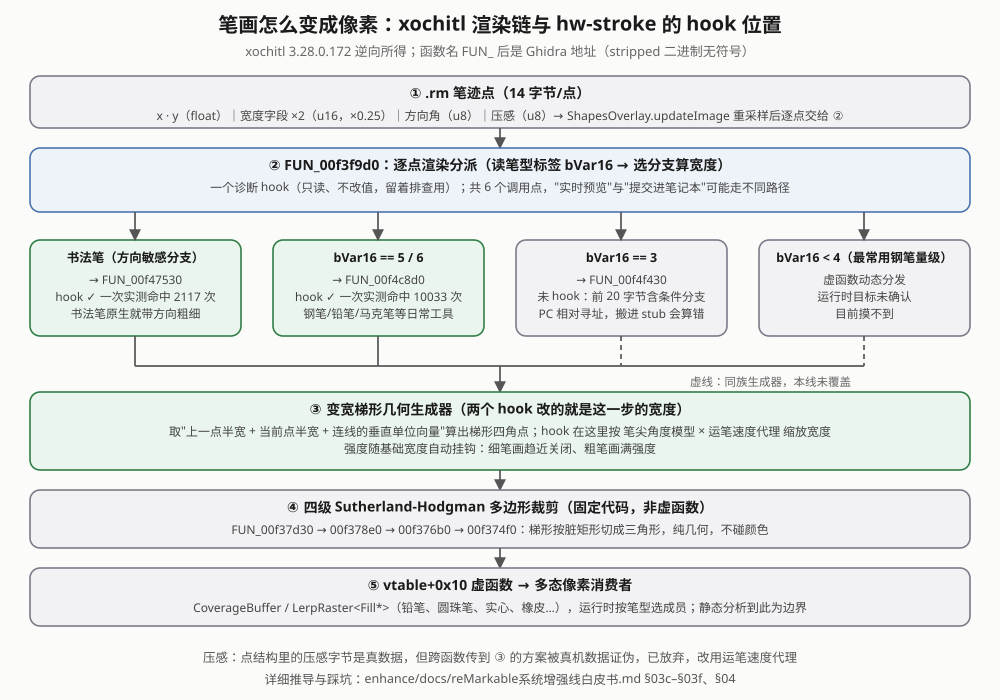
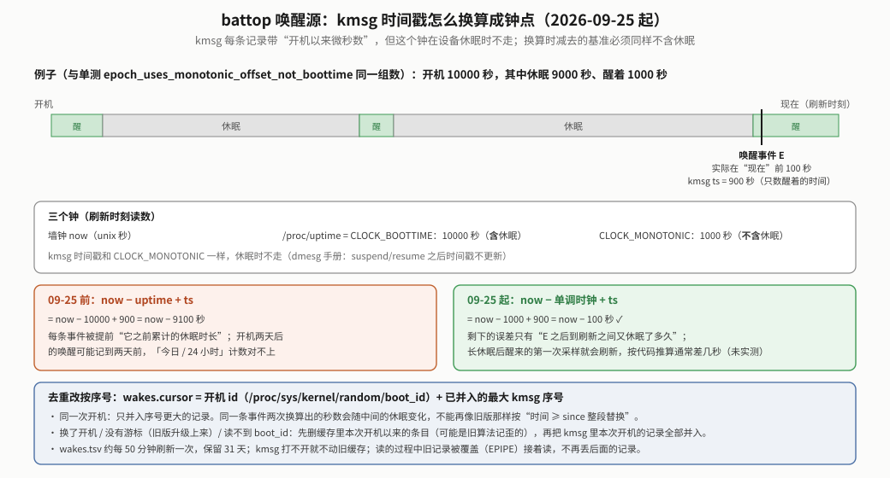

# reMarkable 系统增强线（enhance）白皮书

> 这篇讲**原理、决策、真机验证和踩坑**；每个工具怎么装、怎么用，看各自的 README。
> **§ 编号固定不变**（代码注释和别的文档按编号引用），所以章节顺序和编号不完全一致：先读 §00b 现状，原理从 §02 起，踩坑 §04，待办 §05。
>
> **给谁看、先看哪几节**：只想知道"有哪些工具、怎么开关"——§00b 一节就够；要改 xovi 扩展或 qmd 补丁——§02、§04（尤其「qmd 补丁怎么离线验证」）；要查耗电——§03j（§03b 的电池刺客已移除，只剩历史）；要知道最近改了什么、哪些还没上真机——§03m、§03n（最新）和 §05。
>
> **2026-09-30 起，手写优化（hw-stroke）和电池刺客（battop）已移除**（用户要求，§03n）。§03b、§03c、§03e–§03g 以及其它章节里关于它们的内容保留为历史记录，不再代表现状。

## 读这篇你能得到什么

| 你想知道 | 读 |
|---|---|
| 这条线有哪些工具、各自现在什么状态、怎么开关 | §00b |
| 几个术语（xovi、hook、特征码、trampoline…）是什么意思 | §00b 末尾「术语速查」 |
| 网页开关写到哪里、怎么确认扩展真的生效了 | §02 |
| xovi 扩展从加载到 hook 生效的完整流程 | §02 流程图 |
| 荧光笔"划哪吸哪"怎么修的 | §03a |
| 电池刺客、手写优化为什么没了，旧设备怎么清 | §03n |
| （历史）电池刺客为什么不开机自启、两次冻机怎么回事 | §03b |
| （历史）手写笔锋：xochitl 怎么画笔画、hook 在哪、做过什么又撤回了什么 | §03c（逆向）→ §03e（第一版）→ §03f（速度代理 + 第二个 hook）→ §03g（降负载） |
| 字体、壁纸服务和 lo-alias 在这条线里的位置 | §03h |
| 设备空闲时谁在定时把 CPU 叫醒（整套设备，不只本线） | §03j |
| 2026-09-24 第三轮审计给本线改了什么（当天已部署） | §03k |
| 2026-09-25 第四轮审计给本线改了什么、battop 唤醒时间怎么换算 | §03l |
| 2026-09-30 第五轮审计给本线改了什么（未部署、未上真机） | §03m |
| 2026-09-30 移除手写优化与电池刺客：删了什么、旧设备怎么清 | §03n |
| 改 qmd 补丁后怎么离线验证（为什么不能用 `check-compatibility`） | §04「qmd 补丁怎么离线验证」 |
| 改了扩展为什么要整机重启、不能只重启 xochitl | §04「hook 安全性」末条 |
| 为什么单点工具要单独成线 | §00、§01 |
| 踩过的坑 / 还没做完的事 | §04 / §05 |

## 00b｜现状总览（先读这个）


这条线是一组**互相独立的单点增强工具**，都不修改 xochitl（reMarkable 自带的阅读/笔记程序）本身。设备固件 3.28.0.172。

**hl-snap —— 荧光笔 CJK 精确吸附**（[README](../hl-snap/README.md)）
用荧光笔划中文时，划哪就高亮哪，不再整行吸附。是 xovi 扩展 `hl-snap.so`，hook 一个函数。**✅ 真机通，日常在用**。开关：网页「管理 → 系统增强」，写 `hlSnapCjk`，**默认开**，下一次划线即生效。

**~~handwriting-stroke（hw-stroke）—— CJK 手写笔锋~~：2026-09-30 已移除**（§03n）
曾经是 xovi 扩展 `hw-stroke.so`，按笔尖角度和运笔速度调整笔画粗细（书法笔和钢笔/铅笔/马克笔等真机通，最常用的一档钢笔/铅笔 `bVar16<4` 一直摸不到）。源码 `enhance/handwriting-stroke/`、部署脚本、网页「实验室」开关都已删除；历史见 §03c、§03e–§03g。

**~~battop —— 电池刺客~~：2026-09-30 已移除**（§03n）
曾经是按进程/应用/唤醒源统计耗电的采样服务，有意不开机自启（和两次整机冻死有关，§03b）。源码 `enhance/battop/`（含 `FINDINGS.md` 电池审计与冻机内核证据）、部署脚本、网页开关与「电池刺客」数据页都已删除；想看旧的审计报告，去 git 历史里找删除提交之前的版本。

**reader-page-turn —— xochitl 阅读器翻页**（§03i）
两个功能：**单击翻页**（点屏幕左右各 7% 边缘、纵向 45%–80% 的区域翻页）和**日漫翻页规则**（从右往左的书，左右滑和点边缘都对调）。是 qmd 补丁 `reader-page-turn.qmd`（源码在 `shelf/xovi/`，随 book 服务安装，因为要问 book-serve 这本书的方向）。开关：网页「管理 → 系统增强」，写 `tapPageTurn` / `rtlPageTurn`，**默认都关**，每次打开书读一次，改了开关要重新打开书。**离线（qmldiff 在 .172 真实 QML 上全部命中）和真机都验证过**。方向只看书里自带的 OPF 标记和旧的只读手动清单（09-25 加的母版库按书设方向 09-30 已移除）。

**wallpaper-serve —— 休眠壁纸**（[README](../wallpaper-serve/README.md)）
网页上传即用、唤醒自动轮换，靠 xochitl 的隐藏配置键 `SleepScreenPath`。**✅ 真机通**。入口「其他 → 壁纸」。

**font-serve —— xochitl 字体**（`../font-serve/src/main.rs` 头注；原理在书架白皮书）
网页上传字体即装进 fontconfig，维护中文回退链。**✅ 真机通**。入口「其他 → xochitl」，重开字体菜单即可选。

**共用件**：[`shared/`](../shared/PROVENANCE.md) 是 xovi 扩展用的特征码扫描 + trampoline 代码（原先 hl-snap、hw-stroke 两个扩展共用，现在只有 hl-snap）；[`lo-alias/`](../lo-alias/README.md) 是让 `10.11.99.1` 在不插 USB 时也可达的小脚本（网关启动前调用）。

**当前设备状态**：2026-09-29 按用户要求卸载了 appload、KOReader、第三方 WeRead 和侧栏入口，按卸载记录 `extensions.d/` 现在应只剩 `hl-snap.so`、`hw-stroke.so`、`qt-resource-rebuilder.so`（卸载后本文没有再做只读核对）；**没有** `cangjie-langhook.so`。此前的记录：09-24 只读核对时还有 `appload.so`，第三轮审计重编的两个 `.so` 当天换入，journal 里三个 hook 都"安装完成"；battop 已装、停着。09-25 整轮卸载后重装，`verify-on-device.sh` 43✓ 0✗；同日 13:10 又部署了加 `-ffile-prefix-map` 重编的两个 `.so`（§04「构建与环境」）：设备上 md5 与仓库一致（hl-snap `7ca1985b…`、hw-stroke `6e5b4a3d…`），三个 hook「安装完成」，`verify-on-device.sh` 43✓ 1⚠（刚开机）0✗，xochitl `NRestarts` 0。09-30 第五轮审计没改两个 `.so` 的源码（md5 不变）。**09-30 移除 hw-stroke / battop 之后**：仓库里只剩 `hl-snap.so`（md5 仍是 `7ca1985b…`，重编核对过）；设备上的 `hw-stroke.so`、battop 单元和 `/home/root/battop` 要等下一次跑 `install-all.sh` 自动清（或手动清，§03n）——截至本文写成**没有部署、没有上真机**。

**未闭环**（详见 §05）：2026-09-30 第五轮审计的改动（§03m）和同日移除 hw-stroke / battop 的清理流程（§03n）只在开发机测过，没部署、没上真机。（`hw-stroke` 的 `bVar16<4` 分支、两个扩展的反序加载随 hw-stroke 移除不再跟进。）

### 术语速查

| 术语 | 意思 |
|---|---|
| xovi | 第三方扩展加载框架。靠 systemd drop-in 用 `LD_PRELOAD` 把 `xovi.so` 带进 xochitl，再加载 `~/xovi/extensions.d/` 下的每个文件 |
| xovi 扩展 | xovi 加载的 `.so`，导出 `_xovi_shouldLoad`（要不要加载）和 `_xovi_construct`（加载后做什么） |
| hook | 把某个函数的入口改成先跳到我们自己的代码（handler），再决定调不调原函数 |
| 特征码 | 目标函数开头的一串原始机器码。按"代码长什么样"找函数，而不是写死地址；换固件后找不到就自动不加载 |
| trampoline / 调用桩 | 被覆盖的原函数开头字节 + 一条跳回原函数的指令，放在新分配的内存里，让 handler 还能调用原函数 |
| `FUN_00xxxxxx` | Ghidra（逆向工具）给无符号函数起的名字，数字是地址 |
| qmd | qt-resource-rebuilder 的 QML 补丁文件，xochitl 启动时读一次，用来改界面 |
| `reading-qol.json` | `~/.local/share/cangjie-ime/reading-qol.json`，几个开关共用的配置文件（目录名是历史遗留） |
| 待换入区 | `~/.cangjie-stage/so-pending/`。部署时 xochitl 正在用旧版 `.so`，新版先放这里，整机重启时换进 `extensions.d/` |
| 整机重启 | 让扩展和 qmd 生效的唯一方式（2026-09-25 起）；单独重启 xochitl 有概率在它退出时崩溃（§04） |

## 00｜定位与原则

**起因**：2026-09-09 用户反馈"划线没有按 CJK 精确吸附"，查下去是完整中文化扩展 `cangjie-langhook.so` 整个从设备上消失了（§03a）。第一版修复在老项目 `chinese-ime/langhook` 里加运行期开关；用户纠正了三轮：不动老项目、另起一个能装下"笔锋、电池刺客等等"这类工具的顶层项目线、定名 `enhance/`，和 `shelf/`、`notes/` 并列。

**三条原则**（在纠正过程中形成）：

1. **单点工具不塞进已有大项目**：哪怕只有几十行，只要能独立部署、有独立生命周期，就独立成目录。
2. **不对接已移走的旧路径**：需要老项目的代码就拷贝一份独立维护（`shared/`、`lo-alias/` 都是这样来的）。
3. **一份产物两种用法，别搞两份构建**：要功能子集优先用运行期开关，而不是编译期 `#ifdef` 或构建变体。

## 01｜架构决策

**为什么 hl-snap 整个独立，而不是给 langhook 加开关？** 加开关技术上可行、也真机验证过，但源码仍绑在一个 4800 多行、混着拼音输入法等一堆 hook 的文件里，改老项目随时可能波及吸附这个独立诉求。`hl-snap/` 现在是独立的 `.c` + 元数据 + `Makefile` + 部署脚本，产物名和加载判据都不同。

**为什么 hl-snap 用自己的特征码当加载判据？** langhook 里所有 hook 能不能装，先看 `setLanguageCode` 的特征码在不在（"总闸"）。这对输入法合理，对只管吸附的扩展不合理：`hl-snap.so` 装不装只该取决于它要 patch 的 `FUN_00f05ad0` 还在不在。

**为什么 battop（2026-09-30 已移除）、字体、壁纸服务也归这里？** 概念上都是"跨块的单点增强工具"，只是历史上先存在于别处（`misc/`、`shelf/services/`）。搬家不改运行时行为，见附录。

**命名遗留**：旧 `xovi-extensions/`（设备端 QML/UI 增强，reading-qol / font-menu）已移出仓库，和本线没有从属关系。若以后捞回来，设想按"它管 QML/UI 层、`enhance/` 管更底层的单点工具"分工——这只是设想，没拍板，动这条边界要先问用户。

## 02｜网页开关、xovi 加载机制与"开关≠已生效"


**分工**：`enhance/` 管工具本身怎么实现、怎么部署；[`gateway/src/enhance/`](../../gateway/src/enhance/) 管网页上怎么远程控制它们。两边没有代码依赖，只靠约定的文件路径和 systemd 单元名对接：

| 开关 | 网页位置 | 落到哪里 |
|---|---|---|
| CJK 荧光笔精确吸附 | 管理 → 系统增强 | `reading-qol.json` 的 `hlSnapCjk`（默认开） |
| ~~电池刺客~~（2026-09-30 已移除） | 原在管理 → 系统增强；开着才出现「电池刺客」数据页 | 原为 `systemctl start/stop battop` |
| 单击翻页 / 日漫翻页规则 | 管理 → 系统增强 | `reading-qol.json` 的 `tapPageTurn` / `rtlPageTurn`（默认都关），`reader-page-turn.qmd` 每次打开书读一次（§03i） |
| ~~CJK 手写笔迹优化~~（2026-09-30 已移除） | 原在管理 → 实验室 | 原为网页层派生开关：开写 `hwStrokeNibMinRatio` = `hwStrokeSpeedMinRatio` = 0.6，关写 1.0。旧设备 `reading-qol.json` 里这些键会原样留着（全量写回，不认识的键不删），没有程序再读它们 |

网页 UI 的演进细节见书架白皮书 §03aj–§03an（纯网页层变化）。

**全量写回**：`reading-qol.json` 是多方共享的文件（网关、旧原生设置页、C 扩展、qmd 都读，前三者会写）。`gateway/src/enhance/qol.rs` 把整份文件当不透明 JSON 读进来、只改要改的键，不认识的键原样写回，并在进程内串行化，避免冲掉别处写的开关。（`qol.rs` 头注说的"系统增强白皮书 §08「全量防覆盖」"是已移出仓库的旧系统增强白皮书，规则就是这一段。）

### xovi 扩展怎么生效


扩展都走这套流程（现在只有 hl-snap；已移除的 hw-stroke 也是），代码在 `shared/`：

1. xovi 在 xochitl 启动时加载 `extensions.d/` 下的每个文件——所以备份绝不能留在这个目录。
2. `_xovi_shouldLoad` 在 xochitl 代码段里搜特征码，恰好命中 1 处才加载；换了固件、函数变了，就不加载，xochitl 按原生行为跑。这是主要的 fail-safe。
3. `_xovi_construct` 再搜一次拿地址，用 trampoline 改写目标函数开头 20 字节。改写的前提是这 20 字节里没有分支和 PC 相对寻址（搬进调用桩后会算错），每个候选都要逐条反汇编核对（§04）。
4. 运行时每次调用先进 handler，读开关决定改不改；配置缺失或越界就用默认值。

### 开关≠已生效（2026-09-24 加）

开关只写配置；扩展根本没加载时，开了也没用。历史上两次"开关看着开了、其实没生效"：09-09 langhook 整个从设备上消失（§03a），hw-stroke 因 GLIBC 版本不符静默加载失败（§04）。现在网页直接显示：

- 扩展开关旁有「已加载 / 未加载」徽章（现在只有 hl-snap；hw-stroke 的开关 09-30 随它移除）；「管理 → 基石」另列一行"xochitl 里生效的扩展"。
- 数据来自 `gateway/src/enhance/loaded.rs`：找 `comm == xochitl` 且父进程是 1 的主进程（排除渲染 PDF 时 fork 出的同名子进程），读它的 `/proc/<pid>/maps`，映射了哪个 `extensions.d/*.so` 就算已加载；映射了 `xovi.so` 说明 xovi 生效。
- **徽章的边界**：它只证明 `.so` 进了进程（走完了 `_xovi_shouldLoad`），不证明 hook 装上了；后者看 journal 里的"hook 安装完成"。§04 记了一种"已加载但 hook 没装上"的可能情形。
- 「漫画页边距最小化」靠 qmd 补丁 `shelf-comic-margins.qmd`，不是 `.so`。判定：qt-resource-rebuilder.so 在主进程里、补丁文件在它的 exthome、且修改时间早于 xochitl 启动时间（`/proc/<pid>/stat` 第 22 列 + `/proc/stat` 的 btime）算已载入；文件比进程新报「待重启」。这是按加载机制推断，看不到补丁里的 LOCATE 是否全部命中。
- 「导入 md 文档」只控制网页子标签，标「网页功能」，没有加载这回事。

## 03a｜hl-snap：荧光笔 CJK 精确吸附（2026-09-09，真机通）

**病根**：xochitl 划线后调 `FUN_00f05ad0`（3.28.0.172 上在 `0xf03670`）把选区向两边扩张到整个"词"，分词靠空格；中文没有空格，于是一小段扩成整行。修法：hook 这个函数，选区第一个字是 CJK 时不调原函数。逻辑逐字节来自 langhook 里 2026-08-23 真机验证过的那段代码。

**怎么查出来的**：`journalctl -u xochitl` 搜 `cangjie` **零命中**——正常加载会打一串初始化日志，一行都没有说明扩展压根没被加载，而不是"装了但 hook 没生效"。`find` 全设备也找不到 `cangjie-langhook.so`，`~/.local/share/cangjie-ime/` 下 5 个词典也没了，只剩 `reading-qol.json`（"裸机恢复"类重置的典型后果，见 [`../../docs/INSTALL.md`](../../docs/INSTALL.md) OTA 一节）。

**顺带发现一条危险的过期记录**：当时的项目说明还写着往 `/usr/lib/systemd/system/xochitl.service.d/` 放 drop-in 做持久化，而这条路早在 2026-08-16 因两次 dm-verity A/B 回滚变砖放弃了。现行机制：持久源放 `~/xovi/services/xochitl.service/*.conf`，`xovi/start` 把它们拷进 `/etc` 下的 tmpfs 再重启 unit，全程不碰 `/usr`。

**方案两版**：第一版在 langhook 加 `CANGJIE_IME_HOOKS=0` 开关（真机通，但用户要求不动老项目，整段撤回）；第二版是现在的独立扩展（§01）。

**真机验证**（第二版）：备份 → 移除设备上第一版残留的 langhook（两者抢同一个目标）→ scp + md5 → 重启 → journal 出现 `_xovi_shouldLoad: 固件兼容(FUN_00f05ad0@0xf03670)` 与 `荧光笔EXPAND hook 安装完成 @ 0xf03670`；`/proc/<pid>/maps` 里 `hl-snap` 出现、`cangjie-langhook` 消失；`is-active` / `NRestarts` / `MainPID` 健康检查（含延迟复查）通过。地址与第一版一致，说明特征码在 3.28.0.172 上唯一命中。2026-09-24 只读复核：仍是同一地址、hook 装上。

**和 langhook 同时装会怎样**：旧文档写"行为未定义"，按代码看其实是"先到先得"：两个扩展在 `_xovi_shouldLoad` 阶段都看到原始机器码、都同意加载；先执行 `_xovi_construct` 的那个改写了函数开头，后一个再扫时特征码对不上，静默放弃这个 hook。langhook 一侧源码已不在仓库，这一半**未核对**；两者同时装也没有真机测过。结论不变：两者不要同时装（langhook 自带同样的修复）。

## 03b｜battop：搬迁、两次冻机与现状（2026-09-30 已移除，本节为历史）

> 2026-09-30 电池刺客整体移除（§03n）。下面是它移除前的记录，"现状"指的是当时。

battop 早于这条线存在，2026-09-09 从 `misc/battery-audit/battop/` 搬进来，设备路径 `/home/root/battop` 不变。它的故事主要是"一个诊断工具怎么差点变成故障源"：

| 时间 | 事件 | 结论 / 改动 |
|---|---|---|
| 08-27 | 电池审计（`enhance/battop/FINDINGS.md` 前半；该文件 09-30 随 battop 删除，看 git 历史） | 无"电池刺客"：休眠健康、无自旋进程；最大非核心 CPU 是 `memfaultd`。由此建 battop 做长期追踪 |
| 08-29 | **第一次冻机**：屏幕冻住、ping/SSH 全不通、USB 链路仍在，长按电源 25–30 秒才恢复 | 内核日志坐实：systemd 启动 battop 的 oneshot 服务时把进程写进 cgroup，`synchronize_rcu` 撞上内核 RCU stall，连 PID 1 一起卡死。不是 battop 逻辑 bug，但 timer 每 10 分钟拉起一次 = 每天 144 次 cgroup 迁移，把罕见 stall 的暴露面放大了 144 倍。**改成常驻服务**，每次开机只迁一次（内核证据见 FINDINGS 后半） |
| 09-20 | 安装器定案 | **只 start、不 enable**：原先 enable 链接在 `/etc` tmpfs、重启即清，"重启后不自启"一直是事实上的缓解，现在写成明确设计 |
| 09-22 | 代码审计 | 拆成 procs / store / summary / wake / util 五个模块；summary 改流式聚合；时区改用 libc `localtime_r`，去掉每轮 fork 一次 `date` |
| 09-23 | **第二次冻机**（常驻模型下） | 冻结前最后一条日志与 battop 刷新唤醒源缓存（当时每小时 fork 一次 `journalctl`）的时间精确重合到秒。不是 08-29 那条路径（fork 出的子进程直接继承父进程 cgroup），只有时间吻合、没有内核栈证据。**唤醒源改读 `/dev/kmsg`**，采样循环里最后一次创建子进程也去掉了；commit 记真机确认零子进程、唤醒源数据与 `dmesg` 一致、跨一次真实休眠后采样间隔正确 |
| 09-24 | 第三轮审计 | summary 按文件缓存整文件聚合（凭大小 + mtime 失效，只重读被时间窗起点切开或变过的文件）：host 实测每轮 34.7 → 4.0 ms，输出逐字节不变（黄金文件 + 60 轮对拍）。**只在 host 验证** |
| 09-25 | 第四轮审计 | 唤醒源时间改按单调时钟换算、按 kmsg 序号增量去重（新文件 `wakes.cursor`），修掉「今日 / 24 小时」唤醒数被系统性算错的问题；安装器在 dm-verity 下也会重启在跑的旧进程（§03l）。**只在 host 验证** |

**现状**：采样循环只读 `/proc`、sysfs 和 `/dev/kmsg`，不创建子进程；代价是唤醒源只能看到本次开机以来的记录（旧版能跨开机查 31 天）。两次冻机的内核根因（RCU stall）没有被排除，所以**仍不开机自启**，要用时在网页打开。09-23 的修改效果还需要更长时间观察（battop 平时关着，积累的运行时长有限）。

**教训**：诊断工具自己也要当成"可能出事的代码"看——常驻、周期性、在内核敏感路径附近（cgroup、fork）的操作要尽量去掉；"重启后自然关闭"这种安全态要写成明确设计，而不是依赖 tmpfs 碰巧被清。

## 03c｜hw-stroke 逆向：xochitl 怎么画笔画（2026-09-09，纯静态分析；hw-stroke 2026-09-30 已移除）

> §03c、§03e–§03g 记的是手写优化扩展 hw-stroke 的研究与实现；它 2026-09-30 已移除（§03n），这几节保留为历史。逆向得到的渲染链结论本身仍然成立（固件 3.28.0.172）。

**目标**：让笔锋按中文书写习惯（粗细、顿挫）渲染。**和 AI 手写识别完全无关**，用户第一轮就澄清过。全仓库搜索确认是全新功能；唯一沾边的先例（笔记页背景滤镜）是判死的。

**渲染链**（五层；真实类名来自 Qt 编译进二进制的调试字符串，与 Ghidra 反编译交叉验证）：



- 入口：`ShapesOverlay`（继承 `QQuickPaintedItem`，源码路径字符串 `.../src/xofm/libs/sceneview/src/shapesoverlay.cpp`）的 `updateImage`（`FUN_008bbb80`）才真正画像素；`paint()` 只是把内部 `QImage` 整张贴上屏。
- `updateImage` 把手写笔迹用 `QPainterPath::toFillPolygon()` 重采样，每个点重新打包成 14 字节点结构，交给 `StrokeRenderer`（构造函数 `FUN_00f3dcf0`，把 `CoverageBuffer`、`IVaryingsGenerator`、`LerpRaster<Fill*>` 等十几个多态成员**内联组合**进自己）。
- `FUN_00f3f9d0` 逐点分派：按笔型标签 `bVar16` 分支各算宽度；再交给变宽几何生成器（`FUN_00f47530` 等：上一点半宽 + 当前点半宽 + 连线的垂直单位向量 → 梯形四角点）；然后四级 Sutherland-Hodgman 多边形裁剪（`FUN_00f37d30 → 00f378e0 → 00f376b0 → 00f374f0`）；最后经虚函数 `vtable+0x10` 交给多态像素消费者（`CoverageBuffer` / `Fill*`）。

**14 字节点结构**（`FUN_00f36be0` 反解，独立验证过；和 `.rm` 文件里的点字段**没做过对拍**）：

| 偏移 | 类型 | 换算 | 字段 |
|---|---|---|---|
| `0x0` / `0x4` | float | 原样 | x / y |
| `0x8` / `0xA` | u16 | ×0.25 | 两个同类宽度/速度定点字段 |
| `0xC` | u8 | ×2π/255 | 方向角 |
| `0xD` | u8 | ÷255 | 压感（0~1） |

**五轮排查**：

| 轮 | 手段 | 结论 |
|---|---|---|
| 1 | `strings` 侦察 | 真机 xochitl 有整套 `Quill::strokev2` 的 RTTI：按笔型分的光栅化策略类（`FillPencil` / `FillBallpoint[AA]` / `FillSolid_*_AA` / …），判断是"宽度沿路径插值"的实现层 |
| 2 | Ghidra 脚本反查 vtable | 失败：反查到的"vtable"槽位解出来是 ASCII 文本。当时误判"没有虚函数"，被第 3 轮推翻（§04） |
| 3 | Ghidra GUI 人工交互（用户截图回传） | 从 RTTI 字符串的真实引用追到 `saveStroke` / `ShapesOverlay` → `updateImage` → `StrokeRenderer` 构造函数。第 2 轮失败的原因：内联组合成员的 vtable 指针是构造时按值写入的，反查天生走不通 |
| 4 | headless 脚本接力 | 定位逐点分派 `FUN_00f3f9d0` 和变宽几何生成器 `FUN_00f47530`——**变宽笔画的几何能力本来就存在**。排除岔路：`FUN_00f33180` 只是通用 `QVector` 插入 |
| 5 | 挖到像素层 | 四级裁剪是固定代码，最后一级改虚函数调用交给像素消费者。静态分析到此为边界 |

**结论**：整条链是"固定几何算法（宽度插值 + 变宽四边形 + 裁剪，全部非虚函数）+ 最后一步虚函数分发给可插拔的像素填充策略"。宽度公式只和距离、压感、一条固定缓动曲线有关，没有"笔画方向"权重，需要新写；改动点全在 `FUN_00f3f9d0` 这一层及其下游几何生成器。

**勘误（09-09 晚）**：第 3 轮曾把 `FUN_00f401f0`（`VaryingGenerator_WidthLength` 的业务方法）当"最具体候选"，反编译显示它只是一行线性缩放。按"反编译要交叉核实原始汇编"纪律补查：真实签名是 3 个 float 入参 + 1 个对象指针、产出一对 float；更关键的是它**在整个二进制里没有真实调用者**。断言收回，改用确认在调用链上的 `FUN_00f47530`（§03e）。

## 03d｜Ghidra 环境（2026-09-09）

装法、`JAVA_HOME`（Ghidra 12.x 要 JDK 21）、怎么拉 xochitl 二进制、headless 怎么调，都在 [`../../defw/README.md`](../../defw/README.md)。取舍留一条：改用发行版包（`paru -S ghidra --assume-installed java-environment=21`，避免多装一份系统 JDK），每次调用用 `JAVA_HOME` 指定（`/opt/ghidra` 是 root 拥有，改不了 `launch.properties`）。Wayland 下 GUI 空白见 §04。

## 03e｜hw-stroke 第一版：真机验证（2026-09-10；已移除，历史）

hook 目标 `FUN_00f47530`：两个 float（s0/s1）+ 一个指针（x0），标准调用约定，入口第一件事就读"当前点宽度"（`ctx+4`）算半宽，在这里改值最简单可靠。

- **先证明机制可行**：先部署只读日志的诊断 hook，真机手写时宽度 `w` 合理且随笔压连续变化；再加 `hwStrokeWidthFactor`，改成 2.5 / 0.5 后截图确认笔画明显变粗/变细。
- **笔尖角度模型**：用户反馈"CJK 顿挫不是单纯粗细问题"，采用 Illustrator/Inkscape 书法笔刷同款公式 `宽度 ×= min_ratio + (1-min_ratio)×|sin(运笔方向角−笔尖角度)|`。运笔方向不读点结构的方向字节（日常钢笔走的分支根本不碰它），改用 `FUN_00f47530` 自己维护的"上一点坐标"（`ctx+0x48/0x4c`）现算。GLIBC 符号版本坑见 §04。
- **效果强度跟基础宽度挂钩**：真机反馈"钢笔效果不好、毛笔还行"，诊断发现两者走同一分支同一公式，只是基础宽度不同导致观感不同——改成细笔画趋近关闭、粗笔画满强度。
- **撤回一次**：尝试读点结构的笔型标签（`ctx+0x70`）排除钢笔，真机测大号画笔时读出的"笔型"在 0~255 随机跳而坐标正常，说明这个偏移在这条路径上读的是无关内存（§04）。退回纯宽度渐变。

## 03f｜压感撤回、运笔速度代理、第二个 hook（2026-09-10；已移除，历史）

**压感**：点结构 `0xD` 的压感字节被读出转成 0~1 浮点，但存进的是另一个对象（`plVar6+0x74`），不是 hook 收到的 `ctx`。改用不依赖它们的算法（`当前点地址 = param_2[3] + (param_2[4]*0xe − 0xe)`）在 `FUN_00f3f9d0` 入口读，两轮真机证实压感字节是真数据（正常书写很快饱和到 255，专测轻重才有 3~255 的分布）。但**跨函数传给宽度 hook 失败**：诊断样本里只有 2/3449 落在会调用 `FUN_00f47530` 的分支，而它自己被调了 686 次——`FUN_00f3f9d0` 有 6 个调用点，"实时预览"和"提交进笔记本"很可能走不同路径。放弃真实压感，改用 hook 内部就能算的**运笔速度代理**：相邻两点距离短（慢、顿笔）→ 粗，长（快、带过）→ 细，与笔尖角度模型共用"强度随基础宽度挂钩"。

**第二个 hook**：真机发现 `FUN_00f47530` **只有书法笔会走到**，而书法笔原生就有方向粗细（平头笔尖，两个效果全关也存在），在它上面叠加是重复造轮子；钢笔、铅笔、马克笔完全摸不到（之前"钢笔效果不好"很可能是根本没生效）。用户拍板另找钢笔/铅笔的写入点。反编译 `bVar16==3/5/6` 三个分支各自调用的绘制原语：

- **`FUN_00f4c8d0`**（`bVar16==6` 直接调、`5` 经 `FUN_00f4d190` 间接调）：`(x, y, ctx)`，宽度在 `ctx+4`，与主 hook 同一调用约定；前 20 字节纯栈操作 → **采用**。
- **`FUN_00f4f430`**（`bVar16==3`）：签名一样，但前 20 字节第 3 条指令是条件分支 `cbz`（PC 相对寻址）→ **不能安全 patch**，留作候选。

部署后真机命中 **10033 次**（`FUN_00f47530` 仅 2117 次），宽度范围 3~36，覆盖面近 5 倍。按真机数据重新校准，两个效果开到中等强度（`min_ratio=0.6`），用户反馈"看上去还行"。当时写进配置的校准值是宽度阈值 5/20、速度阈值 1~10；代码默认值见 hw-stroke README。

## 03g｜hw-stroke 降负载：每笔读一次配置、日志默认关（2026-09-24，真机通；已移除，历史）

**问题**：hook 每个点都 `fopen` 读一次 `reading-qol.json`、往 stderr 写一行日志，效果关着也照样执行；§03f 一次采样就上万次。stderr 进 xochitl 的 journal，又被 wallpaper-serve（`journalctl -f -u xochitl`）和飞行记录仪逐行读，负载被放大。纯诊断的 `FUN_00f3f9d0` hook 对行为零贡献，却在生产环境多 patch 一个函数。

**改法**：配置只在每一笔起点（`ctx+0x5a` 的"已有上一点"标志为 0）读，另每 1024 个点兜底读一次，改参数从下一笔生效；逐点日志和诊断 hook 由新键 `hwStrokeDebug`（默认 false）控制，诊断 hook 只在加载时看这个键。交叉编译零警告，动态符号最高仍是 `GLIBC_2.17`。

**真机**：用户手写后 journal 里 `[hw-stroke:` 和 `hw-stroke-dispatch` 都是 0 行，两个几何 hook 正常装上。

**部署时第二次踩到"换 .so 后 restart → 整机重启"**（第一次是 09-21 appload）：运行中的 xochitl 映射着旧 `.so`，换完文件再 `restart`，旧进程退出时 SEGV，`OnFailure=emergency` 触发整机重启；先写暂存再 rename 换新 inode 也照样复现。部署脚本当时改为：xochitl 正在用旧版就先放进待换入区，重启时 **stop → 换 → start**（`packaging/devlib.sh` 头注 H3），同日真机走通一次。**09-25 又推翻**：停止 xochitl 本身就可能崩，与换没换 `.so` 无关，现在一律换入后整机重启（§04「hook 安全性」末条）。

## 03h｜字体、壁纸服务与 lo-alias（概要）

这三样 2026-09-11 才归入本线（概念归类，运行时行为不变），原理主要记在别处：

| 组件 | 是什么 | 详细记录 |
|---|---|---|
| `font-serve`（8792） | 上传字体装进 fontconfig 用户目录，重写 `fonts.json` 给字体菜单 qmd 读，动态维护中文回退链（全 `weak`，所选字体永远优先）；09-25 起开机时索引与字体目录一致就直接复用、`fonts.conf` 内容不变不重写（§03l） | 书架白皮书第 F 章、§03k、§03bd |
| `wallpaper-serve`（8793） | 写 xochitl 隐藏键 `SleepScreenPath` 指向 `current.png`；xochitl 休眠时读完它就轮换（09-24 起 inotify，此前跟 journal 在唤醒时轮换；池里只有一张时不再每次重写同一个文件；09-25 起“同一次休眠只轮换一次”的 10 秒去重按含休眠的开机时长计，§03l）；旧 bind-mount 方案已退役 | [wallpaper-serve README](../wallpaper-serve/README.md)；书架白皮书 §03w / §03x / §03ab |
| `lo-alias.sh` | 给 `lo` 和 `usb1` 挂 `10.11.99.1`，让不插 USB 时 xochitl 的 :80 上传口仍可达；网关 `ExecStartPre` 调用 | [lo-alias README](../lo-alias/README.md) |

两个服务都依赖 [`../../rmsvc-core`](../../rmsvc-core/README.md)，由网关反向代理，随 `install-all.sh` 的 shelf 步安装。

## 03i｜reader-page-turn：单击翻页 + 日漫翻页规则（2026-09-24）


**需求**：用户要"单击翻页"回来（08-14 做过 `tap-page-turn.qmd` 并真机验证，09-11 随 `xovi-extensions/reading-qol/` 移出仓库，设备上的 qmd 也已不在，只剩 `reading-qol.json` 里一个 `tapPageTurn`）；另外问漫画能不能"从左往右滑是下一页"——指 **xochitl**（当时 KOReader 的漫画方案已经是这样，见书架白皮书 §03bt；KOReader 已于 2026-09-29 从设备卸载，现在只剩 xochitl 一个阅读器）。

**做法**：一个 qmd 改三个 QML，锚点全部从设备 .172 的 xochitl 二进制里解出真实 QML 核对过：
- `DeviceSceneView.qml` 的 `FocusScope#root` 加 `cjTapPageTurn`、`cjRtl` 两个属性（这个对象就是手势文件里的 `view`，`view: root` 实例化）。
- `DocumentView.qml`：书一换就先把 `cjRtl` 清掉，300 ms 后同步读 `reading-qol.json` 取两个开关；开了日漫就异步问 book-serve `GET /reading-direction/<uuid>`，结果回来时书没换才生效。**每次打开书只读一次**——08 月旧版每 1.5 秒轮询一次配置，费电，这次不再轮询，代价是改开关要重新打开书。
- `SceneViewGestures.qml`：在单击 `touchClick.onClick` 函数体开头插入翻页分支（守卫沿用旧版：链接按下、文本编辑、缩放、笔记页不接管）；在左滑 `nextPageGesture` / 右滑 `prevPageGesture` 的 `onActiveChanged` 开头插入"`cjRtl` 时反向翻页并 return"。

**区域**（用户定）：左右各 7% 宽，纵向只在屏幕高度 45%–80% 之间；比 08 月旧版（10%、25%–85%）更窄更低，进一步避开顶部工具栏、底部进度条和握持的四角。

**怎么判断"从右往左"**：只看 EPUB OPF 的 `<spine page-progression-direction="rtl">`。book-serve 用 `bookconv::placeholder::epub_is_rtl` 读书库里 `<uuid>.epub` 的 container.xml 和 OPF 两个 zip 条目（一卷漫画数百 MB，不能整本读），按（大小, mtime）缓存。09-24 设备书库 58 本 EPUB 里 7 本带这个标记（6 卷《死亡筆記》、1 卷《火影》），说明书架优化会保留它（2026-09-30 起优化只保留、不写这个属性）；按卷拆分的分卷原先会丢掉这个属性，当时改为从原书继承（`AssembleOpts.rtl`）；分卷投递 2026-09-30 已移除，`AssembleOpts.rtl` 一并删掉。

**离线验证**：本机重编 qmldiff（`asivery/qmldiff`），把解出的三份 .172 QML 放到 hashtab 里的真实资源路径下跑 `apply-diffs`（不能用 `check-compatibility` 代替，见 §04「qmd 补丁怎么离线验证」）：三个 AFFECT 都应用，四处插入位置核对正确；`qmllint` 补丁前后报错数一致（DocumentView 原版就有 9 条"找不到设备私有模块"类报错）。

**手动指定清单**：calibre 转出的漫画大多不写这个标记。同日真机核对：《亂馬½ 典藏版》4–9 卷、《镖人》2–5 卷、東立版《火影》8–10 卷的 OPF 都只有 `<spine toc="ncx">`，而 Kmoe 版都写了。用户定"这次先手动指定，以后新传的书还是看书里自带的标记"，所以加了 `~/.local/state/shelf/books/rtl-overrides.json`（xochitl 文档 uuid 数组，每次查询现读），当时没有网页入口；当天把这 13 本写进去了。**2026-09-30 起这份清单只读**：book-serve 不再写，已有条目照旧生效，要撤就手动删文件或删条目。

**母版库按书指定方向（2026-09-25 加，2026-09-30 已移除）**：用户定翻页方向只保留原书自带的，下面是当时的做法，留作历史。母版库页勾选 EPUB →「阅读方向」（自动 / 从右往左 / 从左往右，可多选批量），「优化」时写进 OPF 的 spine（已优化过的书只改 OPF、不重新处理图片）；这本书若已加入过 xochitl，设置时顺手把那个 uuid 写进/移出上面的手动清单，重新打开书即生效，不必重投。规则见书架 EPUB 优化规范白皮书 §4.6，数据流见传书线架构 §2.6。只做手动：漫画识别分不出日漫与国漫/美漫。**09-25 真机**：《乱马》11/12 卷完整优化后 OPF 带上 `rtl`，加入 xochitl 后新 uuid 自动进手动清单，日漫翻页生效；只改 OPF 的轻量路径、PDF 转来的 EPUB 还没真机走过。

**已知限制**：没在 OPF 里标 rtl、也不在手动清单里的日漫不会反转——09-25～09-29 可在母版库里按书设「从右往左」缓解，09-30 这个入口已撤，现在只能手改 `rtl-overrides.json` 或自己改书，不会自动认日漫；书本身写着 rtl 的副本不能改成"从左往右"（清单只能加不能反向覆盖书里的标记）；改开关要重新打开书；只影响 xochitl。

**真机验证（09-24）**：部署后 journal 有 `CJ-PAGE-TURN: loaded`；打开书读到开关（`cfg tap=… rtl=…`）；《亂馬》《镖人》、Kmoe《火影》被识别为从右往左（`rtl book <uuid>`），普通书不识别；单击左右边缘翻页命中。之后（第三轮审计）去掉了单击/滑动命中时的日志——每写一行 journal 都会唤醒 wallpaper-serve 的 `journalctl -f` 和飞行记录仪；关书时不再读配置。

## 03j｜设备常驻唤醒源一览（2026-09-24，按代码核对）


用户关心整机耗电，所以把"设备空闲、不开网页时，谁会定时把 CPU 叫醒"集中列在这里。范围是**整套设备端组件**（不只本线），数字都取自代码常量，**没有在真机上实测唤醒次数**；用户态的 sleep/定时器用单调时钟，设备休眠时不走，所以下面都是"醒着时"的频率。

| 来源 | 属于 | 空闲时怎么醒 | 代码出处 |
|---|---|---|---|
| wifi-watch | packaging | 每 15 秒 `sleep` 一次看链路；链路好只读 sysfs、不 fork，每 40 轮（10 分钟）兜底复查一次频段/省电设置；09-28 起连上新网络后探一次外网，通了不再探，不通时每 10 分钟再探 | `packaging/wifi-watch/wifi-watch.sh` `INTERVAL`/`RECHECK`/`PROBE_URL` |
| 服务间事件流心跳 | rmsvc-core | 网关订阅 6 个有 `/events` 的服务（book、font、wallpaper、ink、transcribe、note；`gateway/src/manage.rs` 的 `MODULES` 里 `events: true` 的项），transcribe 再订阅 ink，共 7 条 loopback 流，各 120 秒一次心跳。2026-09-30 前还订阅 koreader-serve，共 8 条（KOReader 09-29 已卸，该服务退役） | `rmsvc-core/src/events.rs` `FOLLOW_KEEPALIVE_SECS` |
| shelf-mkdir-agent.qmd | shelf | 长轮询 `GET /mkdir/pending?wait=290`：空闲约 290 秒一次往返（book-serve 上限 300 秒；09-24 前 25 秒）；若真遇到 30 秒客户端超时自动退回 25 秒 | `shelf/xovi/shelf-mkdir-agent.qmd`；`book-serve` `MKDIR_WAIT_MAX_SECS` |
| 网关 mDNS | rmsvc-core | 09-25 起空闲零定时唤醒：改听内核 netlink 地址变化，地址增删才重扫（此前 socket 读超时 = 重扫间隔 60 秒）；netlink 打不开才退回 60 秒；局域网别的设备发 mDNS 查询另算 | `rmsvc-core/src/mdns.rs` `AddrWatch` / `RESCAN_INTERVAL` |
| wallpaper-serve | 本线 | inotify 等 xochitl 休眠时读完 `current.png`：空闲零唤醒，每次休眠醒一次（09-24 前常驻 `journalctl -f -u xochitl`，xochitl 每写一行日志就醒一次） | `enhance/wallpaper-serve/src/wake.rs` |
| ~~battop~~ | 本线（2026-09-30 已移除） | 原为默认不跑、开着时醒着每 600 秒采样一次；移除后不再有这一项 | （源码已删） |
| hl-snap | 本线 | 没有定时器，只在划线时进 handler（已移除的 hw-stroke 同样只在写字时进） | `enhance/hl-snap/src/hl_snap.c` |
| reader-page-turn.qmd | 本线（源码在 shelf） | 打开书时单发 300 ms 读一次开关，不轮询（08 月旧版每 1.5 秒轮询） | `shelf/xovi/reader-page-turn.qmd` |
| 其余 qmd 与服务 | shelf / notes | comic-margins 换文档单发 1.5 秒；trash-agent 与 mkdir-agent 同为 290 秒长轮询（09-25 起，各约 12 次/小时；book-serve 不在时出错重试 15→30→60→120 秒封顶，此前固定 15 秒 = 240 次/小时）；book-serve / ink-serve 用 inotify 防抖（8 秒 / 4 秒）；浏览器事件流 20 秒心跳只在网页开着时有 | 各自源码 |

**结论**：空闲时的定时唤醒主要是 wifi-watch（约 240 次/时）和 7 条事件流心跳（约 210 次/时，09-30 前 8 条约 240 次）；mkdir-agent、trash-agent 两个长轮询各约 12 次/时（mkdir-agent 原约 144 次）；wallpaper-serve 09-24 起不再跟日志（改监听休眠读图）。飞行记录仪不在设备上：它跑在宿主机，循环经 ssh 抓设备日志（接着电脑时才有），所以本线仍尽量压低 xochitl 日志量（§03g 逐点日志默认关、§03i 去掉命中日志）。

**mkdir-agent 放宽的依据**（09-24）：设备 Qt 6.10.3；qtdeclarative 6.10 的 `qqmlxmlhttprequest.cpp` 不设传输超时、XHR 也没有 timeout 属性；`QNetworkAccessManager` 缺省超时为 0（禁用）。xochitl 导入了 `setTransferTimeout`，但没有证据表明它作用在 QML 引擎的 NAM 上，所以 qmd 加了兜底：请求在 28–33 秒之间失败就当作客户端超时，退回 wait=25 并打一行 `SHELF-MKDIR: transfer timeout` 日志。**09-24 真机**：部署后与整机重启后各跑了数分钟，journal 里都没有这行，即不存在 30 秒客户端超时，290 秒长等待生效。

## 03k｜第三轮审计给本线的改动（2026-09-24，当天部署）

同日已部署并真机验证：两个 `.so` 走 stop → 换 → start 换入成功（未整机重启、三个 hook 装上；这套换入方式 09-25 已改为整机重启，见 §04）；壁纸改监听休眠读图后，休眠那一刻即轮换。下表"验证"列是 host 侧；真机结果见 §05。

| 改动 | 为什么 | 验证 |
|---|---|---|
| `shared/scan.c` 合并被 `mprotect` 切开的代码段 | 消除两个扩展的加载顺序依赖（§04） | host 真内核单测复现切段 |
| hl-snap / hw-stroke 的 `_xovi_construct` 找不到映射或特征码时打日志 | 以前静默返回，网页徽章显示"已加载"却没 hook | 交叉编译零警告 |
| `shared/pattern.c` 精确匹配先 `memchr` 找首字节 | 扩展按 `-O0` 编译，加载时要扫整个代码段多遍（hl-snap 2 遍、hw-stroke 最多 5 遍）；16 MB 扫描 39.6 → 3.2 ms | 与逐字节循环 400 组差分对拍，ASan/UBSan 通过；`memchr` 是 `GLIBC_2.17` 符号，不抬高 glibc 需求 |
| 两个扩展的 Makefile：胶水只在缺失时生成，`make glue` 显式重生成 | 没有 xovi clone 也能编，不再悄悄退回旧 `.so`（§04） | 重编两个 `.so`，动态符号最高仍 `GLIBC_2.17` |
| battop summary 按文件缓存 | 每轮重读 40 天约 9 MB 样本，battop 自己挤进耗电排行 | 34.7 → 4.0 ms/轮，输出逐字节不变（§03b） |
| wallpaper-serve 单图池唤醒不重写 `current.png` | 只传过一张是常态，每次唤醒白写 1–3 MB 闪存 | 新增单图池用例，8 个测试全过；`wallpaper-serve roll` 此时打印"不轮换" |
| reader-page-turn.qmd 去掉单击/滑动命中日志、关书时不读配置 | 每行 journal 都唤醒 wallpaper-serve 和飞行记录仪（§03j） | 没有单独再做离线/真机验证（只删日志、加一处提前返回）；加载 / 开关 / rtl 三类日志保留 |
| hw-stroke 安装器提示改为检查两行"hook 安装完成" | 逐点日志 09-24 起默认关，旧提示让人 grep 一个必然为空的结果 | — |

## 03l｜第四轮审计给本线的改动（2026-09-25）

写这节时全部只在 host 上测过（battop 32 项 + 1 项默认忽略、font-serve 10 项、wallpaper-serve 10 项 `cargo test` 通过；`shared` `make test` 通过），**未在真机验证**。之后这批代码是否随后续部署上了设备，本文没有留下核对记录；下面「部署后确认」各项也还没有逐项做过。两个扩展 `.so` 的源码**没有改**：本机按 Makefile 同参数交叉编译零警告，产物 md5 与仓库里的 `.so` 一致（hl-snap `7ca1985b…`、hw-stroke `6e5b4a3d…`，构建可复现）；hl-snap 安装脚本只改了头注里过时的"restart xochitl"说法。

| 改动 | 为什么 | 验证 |
|---|---|---|
| battop 唤醒源时间改用"墙钟 − 单调时钟 + kmsg 时间戳"换算，按 kmsg 序号增量并入（新文件 `wakes.cursor` 记开机 id 与序号） | kmsg 时间戳不含休眠，旧版用含休眠的 `/proc/uptime` 反推，每条唤醒被提前"开机以来累计休眠时长"，开机两天后的唤醒可能被记到两天前，面板「今日 / 24 小时」唤醒数不准；另外旧的"按时间整段替换"在换开机后会丢一条边界事件、且没有新唤醒时每轮都当成读取失败重读。见下图 | 新增换算 / 同开机只并新序号 / 换开机重建 / 时间钳到当前 / 游标读写 5 组测试；读 kmsg 遇 `EPIPE`（记录被覆盖）改为继续读 |
| battop 安装器在 dm-verity 激活时：以前装过单元 → 沿用它，二进制变了且在跑照常重启；从没装过 → 退出码 10（"前置条件不满足"，host 侧 `deploy-battop.sh` 记进汇总） | 旧版 verity 下直接 `exit 0`：二进制已换，在跑的 battop 却一直用旧 inode；从没装上也报成功 | shellcheck；未在 verity 激活的设备上跑过 |
| font-serve 开机时 `fonts.json` 与字体目录一致（文件集合相同、目录与各文件都不比索引新）就直接用，不再全量重扫；`fonts.conf` 内容不变不重写 | 此前每次开机把每个字体整文件读一遍、各 fork 一次 `fc-scan`（中文字体十几到几十 MB），正赶上 xochitl 起界面；无条件重写 `fonts.conf` 还会让 fontconfig 使用方重载配置 | 新增用例：复用 / 目录多文件 / 删文件 / 索引损坏各走对分支，`fonts.conf` 不变时 mtime 不动 |
| font-serve / wallpaper-serve 的上传暂存从运行时目录改到 `~/.local/state/shelf/upload`（/home），启动时清掉上次中途被杀留下的 `.part`；字体安装直接改名，不再拷贝 | 运行时目录在单元没设 `XDG_RUNTIME_DIR` 时落到 `/tmp`（tmpfs），几十 MB 的字体整份占内存、计入服务 cgroup 配额，装的时候还要再拷一遍（改动在 `rmsvc-core`，见基座白皮书 §02） | rmsvc-core 单测（暂存在 HOME 下、只清 `.part`） |
| wallpaper-serve 同一次休眠去重改按含休眠的开机时长（`/proc/uptime`） | 原用单调时钟：休眠几小时后唤醒、10 秒内又休眠，单调时钟只走了几秒，这次读图被当成重复读跳过，下次休眠还是同一张 | 单测；监听出错的 5 秒→5 分钟退避在一次监听正常跑满 5 分钟后复位（此前只增不减） |
| mkdir / trash 两个代理 qmd 出错指数退避（15→30→60→120 秒封顶，成功即复位）；comic-margins 建出 `EpubProperties` 后立即排 5 秒销毁 | book-serve 不在时此前固定 15 秒重试，每个代理每小时白醒 240 次（§03j）；后者防异常时对象常驻 | 最新 `asivery/qmldiff` 在带同名锚点的**桩 QML** 上 `apply-diffs` 全部应用、`qmllint` 无语法错误；**不是**真实 .172 QML，设备端 qmldiff 版本可能更旧（本机新版对 `({})` 已不报错，旧设备版会） |



**部署后确认**：~~打开「管理 → 电池刺客」看唤醒源「今日」计数是否与当天实际休眠 / 唤醒次数量级相符（`data/wakes.cursor` 应出现）~~（battop 09-30 已移除，这条作废）；`systemctl restart font-serve` 后 journal 里"索引 N 个家族"秒回、`~/.config/fontconfig/fonts.conf` 的 mtime 不变、`~/.local/state/shelf/upload/` 存在且上传字体后不留文件；xochitl 日志里 `SHELF-MKDIR` / `SHELF-TRASH` 行为照常（停掉 book-serve 时代理不再每 15 秒重试）。

## 03m｜第五轮审计给本线的改动（2026-09-30，未部署）

**全部只在开发机上测过，没部署、没上真机。** host 测试：battop 32 项（+1 项默认忽略）、font-serve 10 项、wallpaper-serve 11 项 `cargo test` 通过；两个扩展 `.so` 的源码没改，md5 不变，部署时不用换 `.so`。

| 改动 | 为什么 | 验证 |
|---|---|---|
| wallpaper-serve：监听到 `IN_IGNORED` 就返回错误，交给已有的退避重试循环重建目录和监听（`wake.rs::watch_once`） | 壁纸目录被删或所在文件系统被卸载时，内核自动撤掉监听、只发一条 `IN_IGNORED`，之后再无事件；旧代码照常 `continue`，轮换线程永远卡在一个死掉的监听上，之后再也不换壁纸，也不报错 | 新增真 inotify 用例：删掉目录后 `watch_once` 5 秒内返回"已失效"（第 11 个测试） |
| battop「应用」视图：现役服务（gateway、book/font/wallpaper/note/ink/mind/transcribe-serve、wifi-watch、battop）归进 `cang-jie` 组；退役旧单元名（wr-serve 等）照旧归组，40 天样本里的历史行不乱 | 旧映射只认已退役的微读/PKM 单元，现役服务在「应用」视图里各自单列，`cang-jie` 组只剩 battop 一项，看不出本项目合计耗电 | `friendly_names` 用例补了现役单元名 |
| hl-snap / hw-stroke 的 `make clean` 只删 `.so`，不再删已提交的 `xovi_glue.{c,h}` | 删了之后本机没有 asivery/xovi clone 就再也编不出来（和 §04「提交进仓库的生成文件」同一类坑） | 读 Makefile 核对 |
| font-serve 上传回执去掉"KOReader 请到 KOReader 页单独上传"，头注改为记录 KOReader 09-29 已卸 | KOReader 与 koreader-serve 已退役，网页里也没有 KOReader 页了 | — |
| `shelf-mkdir-agent.qmd` 的 `catch` 打一行 `SHELF-MKDIR: failed <错误>`；它和 `font-menu-dynamic.qmd` 的头注去掉退役引用（**选择器没改**） | 此前回复不是合法 JSON 或 `createCollection` 抛错时静默吞掉，journal 里看不出建文件夹为什么没成 | 只改注释和一行日志，没有另跑 qmldiff |
| 发现：`qmldiff check-compatibility` 基本不做校验 | 见 §04「qmd 补丁怎么离线验证」 | 开发机实测 |

**部署后确认**（还没做）：壁纸照常在休眠时轮换；xochitl 里建文件夹失败时 journal 能看到 `SHELF-MKDIR: failed`。（原有一条"battop「应用」视图出现 `cang-jie` 组"随 battop 移除作废；表里 battop、hw-stroke 两行的改动也随源码一起删了。）

## 03n｜移除手写优化与电池刺客（2026-09-30，未部署）

**起因**：用户要求"移除电池刺客/手写优化及其开关相关功能和模块"。

**删了什么**：

| 层 | 手写优化（hw-stroke） | 电池刺客（battop） |
|---|---|---|
| 源码 | `enhance/handwriting-stroke/`（`hw_stroke.c`、`hw-stroke.so`、xovi 胶水、安装包装） | `enhance/battop/`（Rust 采样服务、测试、`FINDINGS.md`、`history/` 旧脚本） |
| 网关 / 网页 | 实验室「CJK 手写笔迹优化」开关；`PUT /api/enhance/qol` 不再认 `hwStrokeEnabled`，`/api/enhance/status` 不再返回它 | `gateway/src/enhance/battop.rs`、`/api/enhance/battop/*`；「系统增强」里的开关卡、运行时才出现的「电池刺客」数据页；中英语言包各 30 个键 |
| 安装 | `deploy-handwriting-stroke.sh`；步骤移出 `STEP_ORDER`，进 `STEP_RETIRED` | `deploy-battop.sh`；同左；`shelf/build.sh` 不再编它；CI 不再跑它的 `cargo test` |
| 核对 | `verify-on-device.sh` 不再当在位项；残留报 ⚠ 并给清理命令 | 同左（去掉只给它用的 `opt` 单元类型） |

**没删的**：`shared/` 仍被 hl-snap 编进 `hl-snap.so`，没有只给 hw-stroke 用的文件；源码里提到 `hw_stroke.c` 的注释也不改——扩展带 `-g` 编译，动注释会改变调试行号，进而改变 `hl-snap.so` 的 md5（改完重编核对过：`7ca1985b…` 不变）。`reading-qol.json` 里的 `hwStroke*` 键不清：网关"全量写回、不认识的键原样保留"的规则不变，留着无害。§03b–§03g 的历史记录保留。

**旧设备怎么清**：

- **自动**：重跑 `sh packaging/install-all.sh <host>`。在最后一步 `xovi-apply` 之前，它对两样各跑一次清理（`packaging/removal.sh`，与 `uninstall-all.sh` 同一份代码）：电池刺客删 `/usr` 的 `battop.service` 和旧版 `battop.timer`（走 devlib 的 dm-verity 门 + 限时读写窗口）、删 `/home/root/battop` 整个目录；手写优化从 `extensions.d/` 摘掉 `hw-stroke.so` 和 `.crashed` 标记、撤掉待换入区里的副本、清安装包目录 `/home/root/hw-stroke/`。xochitl 当时还加载着 `hw-stroke.so` 就记一个待生效标记，`xovi-apply` 因此整机重启一次；全程不 stop / restart xochitl、xovi 已生效时不跑 `xovi/start`、不往 `extensions.d` 放备份。没有残留时什么都不动（不碰 systemd、不 remount）。`--skip battop` / `--skip handwriting-stroke` 可跳过。
- **手动（只清这两样）**：

  ```sh
  cd packaging
  sh uninstall-all.sh <host> --dry-run --skip chrony-boot-wakelock,wifi-watch,xovi-persist,hl-snap,shelf,sidebar-entry   # 计划里应只有 handwriting-stroke、battop
  sh uninstall-all.sh <host> --skip chrony-boot-wakelock,wifi-watch,xovi-persist,hl-snap,shelf,sidebar-entry
  ```

  然后在设备上整机重启一次（`reboot`）。这个 `--skip` 列表由 `lib.sh` 的 `uninstall_only_skip battop handwriting-stroke` 生成，`verify-on-device.sh` 报 ⚠ 时给的就是它。
- dm-verity 开着时：battop 单元删不掉，它的目录也保留（单元指向其中的程序；battop 从不开机自启），等可写后再跑一次；hw-stroke 只在 `/home`，照常清。

**为什么选"重新部署时自动清"**：两样的清理都复用了已有、已真机走过的机制（卸 `/usr` 单元的读写窗口、摘 `.so` + 待生效标记 + 整机重启），没有新的高风险动作；让用户记得单独跑一条卸载命令，残留更可能一直留在设备上（hw-stroke 还会每次开机被加载）。sidebar-entry 没有并进自动清理：它会删 `cangjie-icons.rcc`，历史上别的 qmd 也用过这个文件名。

**一个留意点**：`--skip handwriting-stroke` 时，待换入区里如果还有旧的 `hw-stroke.so` 副本，最后的 `xovi-apply` 会照常把它换进 `extensions.d`（跳过就是整样不碰）。只有 09-24 前后部署过 hw-stroke、之后一直没重启过的设备才会有这个副本。

**验证**：只在开发机上——网关 `cargo test`、clippy、前端 node 测试与浏览器冒烟通过；`hl-snap.so` 重编 md5 不变；`packaging/tests/run_sim_tests.sh` 356 项全过（新增旧设备手动卸载、`install-all` 自动清并只整机重启一次、`--skip`、xovi 未生效、dm-verity、目录是符号链接、verify 报 ⚠ 等用例）。**没部署、没上真机。**

**部署后确认**（还没做）：`install-all.sh` 输出里两步「清理已移除」报了删除内容；设备回来后 `verify-on-device.sh` 不再有 battop / hw-stroke 相关 ⚠；`/proc/<xochitl pid>/maps` 里没有 `hw-stroke.so`；`systemctl status battop` 报找不到单元。

## 04｜踩坑

**逆向方法论**

- **RTTI 存在 ≠ 有 vtable；"反查找不到 vtable" ≠ "没有 vtable"**。类被 `typeid()` 用到就会生成 RTTI，不代表多态；反过来，内联组合成员的 vtable 指针是容器对象构造函数里按值写入的，没有地方存指向它 typeinfo 的指针，反查天生走不通。§03c 第 2 轮两头都错过。反查走不通时，先判断目标是"独立堆对象"（能反查）还是"别的对象的组合成员"（从容器的构造函数正向找）。
- **stripped 二进制里，指向字符串的指针不会自动有 xref**：Ghidra `Show References To` 为空不代表没人引用，退回 `Search → Memory` 按字节搜。但搜到一个指针值不等于它在你期望的结构体字段里，`.data.rel.ro` 里紧挨着的对象会命中无关邻居，**要验证内容合理**（这次靠"槽位能不能解出人话"戳破了错误假设）。
- **Qt 编译进二进制的调试/异常字符串比符号表可靠**：沿已知函数读下去常能撞见写死的源码路径、方法名、日志文案（`shapesoverlay.cpp` / `saveStroke` / `updateImage` / `"New StrokeRenderer,"`），是确认"这是哪个类"最快的办法，应优先找。
- **反编译结果"干净利落"要留心眼，关键结论交叉核实原始汇编**：`FUN_00f401f0` 被简化成一行线性缩放，实际多了两个入参和一个返回值；更严重的是信了简化结论就宣称"最具体候选"，没先查它有没有被调用（零调用者早该是暂停信号）。产出多个值的方法只有一行，往往是反编译器漏看了寄存器。
- **反编译里 `undefined2*` 指针的偏移是"2 字节单位"**：`FUN_00f4c8d0` 的 `param_3 + 2` 实际是字节偏移 4。核对关键偏移先确认指针类型宽度。
- 一旦有了具体地址，headless 脚本（[`../../defw/scripts/`](../../defw/README.md)）就能接手反编译、查引用、按字节搜内存，不必再靠 GUI 截图；前提是 GUI 已关闭工程，否则抢 `.lock`。

**hook 安全性**

- **多条调用路径汇到同一函数时，"参数在路径 A 里是什么"不能套到路径 B**：钢笔走虚函数调用，没验证过它传给 `FUN_00f47530` 的 `ctx` 就是 `FUN_00f3f9d0` 自己的对象，照抄得到的 `ctx+0x70` 是随机数据。hook 目标**自己**直接读写的字段（`ctx+4/+0x48/+0x4c/+0x5a`）安全，借用上游解读的字段不安全。
- **"A 调用 B"不等于"所有对 B 的调用都来自 A"**：`FUN_00f3f9d0` 有 6 个调用点，从它入口设全局变量再传给下游，真机证明下游绝大多数调用不经过这一份。除非引用或运行时数据证明 B 只有唯一入口。
- **"前 20 字节可安全 patch"必须逐个候选验证**：`FUN_00f4f430` 签名和已验证的两个完全一样，但第 3 条指令是条件分支，搬进调用桩会跳错地方——靠 `CheckFuncSizes.java` 逐条反汇编提前拦下。签名相似不代表二进制布局相似。
- **两个扩展抢同一个 hook 目标：先到先得，后到的静默放弃**。`hl-snap.so` 与 `cangjie-langhook.so` 都 patch `FUN_00f05ad0`（§03a）。凡是"从老项目拆出功能子集"，都要检查新旧产物会不会同时部署、目标有无重叠，并在部署文档里写清互斥关系。
- **多扩展共存曾依赖加载顺序（已修、已部署；反序加载未专门验证）**：`shared/scan.c` 的 `cj_find_exec_module` 原先只返回 xochitl **第一个**可执行段。每装一个 hook，`mprotect` 都会把那一页切成独立的段，之后"第一段"只到最低的已 patch 页为止，后装的扩展找不到更高地址的目标。2026-09-24 真机 maps 里 xochitl 代码段确实被切成了 7 段（`0xf03000`、`0xf47000`、`0xf4c000` 三页各自独立），两个扩展能都装上，是因为这次顺序恰好是 hw-stroke（高地址目标）先、hl-snap（`0xf03670`）后；反过来 hw-stroke 会静默装不上 hook，网页徽章却仍显示"已加载"。**修法**（09-24 第三轮审计）：把紧接其后的同文件、首尾相接、可读可执行的续段一并算进扫描范围；`_xovi_construct` 找不到映射或特征码时改为打日志。host 单测用真内核 `mprotect` 复现了切段（旧实现只返回第一段、新实现返回整段）。xovi 实际按什么顺序加载没有核实，反序加载的真机验证见 §05。
- **换了运行中 xochitl 正映射着的 `.so` 再 restart → 整机重启**（09-21 appload、09-24 hw-stroke 两次）：09-24 改为 stop → 换 → start（§03g）。**09-25 更正**：真正的问题是停止 xochitl 本身有概率崩溃（同日一次只换 qmd 的普通 restart 也崩了，memfault 栈与 09-21 同一处），与换没换 `.so` 无关；现在部署生效一律主动整机重启，见 `packaging/README.md`「怎么让改动生效」。同日反编译坐实线程池那 3 份的机制：xochitl 退出时 `atexit` 先析构墨水屏刷新任务用的全局数据、后停线程池（`defw/README.md`「调查记录」），跟 hl-snap / hw-stroke 无关。

**qmd 补丁怎么离线验证**


- **`qmldiff check-compatibility` 不能用来验证 qmd**（2026-09-30 第五轮审计发现）：这个子命令基本不做校验，给它一份语法都不对的垃圾 qmd 也报"无错误"，查不出 `({})` 对象字面量这类会让整份补丁在设备上不应用的错误，也不核对 LOCATE 锚点能不能命中。它过了什么都不说明。
- **要用 `apply-diffs` 实跑**：把从固件解出的真实 QML 放到 hashtab 里对应的资源路径下，用 `asivery/qmldiff` 的 `apply-diffs` 把 qmd 真正应用一遍，看每个 AFFECT 是否应用、插入位置对不对，再用 `qmllint` 比补丁前后报错数（§03i 就是这么验的）。它能一比一复现设备端的解析错误。桩 QML 只能证明语法，证明不了锚点在真实 QML 上命中（§03l 的教训）。
- 本机新版 qmldiff 可能比设备上的宽松（例如新版对 `({})` 不再报错、旧设备版会），所以 qmd 里照旧**不写 `({})`、handler 一律用 `{ … }` 块**。

**构建与环境**

- **交叉工具链的 glibc 比设备新，`.so` 会在符号解析这步静默加载失败**：`atan2f` / `sqrtf` 在本地链接时被打上 `GLIBC_2.43`，设备的 `libm` 没这么新，整个 `hw-stroke.so` 加载失败，还连累同一次扫描里的 `hl-snap.so`。用 `objdump -T` 检查，最高应是 `GLIBC_2.17`。规避：能内联的用 `__builtin_xxx` + `-fno-math-errno`，不能的用三角恒等式改写。多扩展场景下要确认**所有**扩展都正常，不能只看目标扩展的日志（现在网页徽章能直接看到）。
- **提交进仓库的生成文件，Makefile 规则别依赖它的 mtime，`clean` 也别删它**：`xovi_glue.{c,h}` 已提交，但旧规则依赖 `.xovi` 的修改时间——checkout 后 `.xovi` 恰好较新就会去跑 xovigen，本机没有 asivery/xovi clone 时构建失败，部署脚本随即退回仓库里已提交的（可能是旧源码编出的）`.so`，悄悄部署了旧版。现在胶水只在缺失时生成，改了 `.xovi` 用 `make glue XOVI_DIR=<clone>` 显式重生成（09-24）。同一类坑：`make clean` 原先连 `xovi_glue.{c,h}` 一起删，删完没有 clone 就编不出来，09-30 改为只删 `.so`。
- **构建产物里带开发机绝对路径**：`-g` 的调试信息记着编译目录，09-24 同一份源码在两处编出不同 md5，核对"设备上的 `.so` 是不是仓库这份"时容易误判。09-25 两个 `Makefile` 加 `-ffile-prefix-map=$(CURDIR)=.`，反汇编不变；09-25 已部署真机，设备上 md5 与仓库一致、三个 hook 装上。
- **Java Swing 在 Wayland 平铺合成器下整窗口空白**：设 `_JAVA_AWT_WM_NONREPARENTING=1`；先查 `$XDG_SESSION_TYPE`，别怀疑程序或工程坏了。Ghidra headless 建的 `.gpr` 是 0 字节也正常（元数据在 `.rep/`）。
- **过期文档可能指向"已经放弃的危险方案"**（§03a 的 `/usr` drop-in）：这类要立刻改，不能当一般文档债。
- **诊断工具自己也会出事**（§03b）：常驻、周期性、在 cgroup/fork 这类内核敏感路径附近的操作要尽量去掉。
- **PDF 渲染子进程里的"拒绝加载"日志是正常的**：xochitl 渲染 PDF 时 fork 出的子进程（journal 里常带 `rm.worker.unix` 字样）也会走一遍 `_xovi_shouldLoad`，因为找不到 `/usr/bin/xochitl` 映射而打"拒绝加载"，不代表主进程没装上。

## 05｜真机待办

**未闭环**

| 项 | 现状 | 下一步思路 |
|---|---|---|
| ~~hw-stroke：`bVar16<4`（最常用的钢笔/铅笔量级）摸不到~~（09-30 随 hw-stroke 移除，下面四行 hw-stroke 待办同样不再跟进） | 走虚函数动态分发 `(**(code**)(*plVar6+0x10))(x,y,width,plVar6,…)`，宽度直接当第 3 个参数传，运行时目标没确认 | 扩展诊断 hook 打印 `*(void**)(*plVar6+0x10)` 的函数地址，再拿地址反编译确认签名 |
| hw-stroke：`FUN_00f4f430`（`bVar16==3`） | 前 20 字节含条件分支，不能安全 patch | 做指令级搬移/重定位，或找更靠后的安全 patch 点 |
| hw-stroke：像素消费者（`vtable+0x10`）的真实目标、smoothstep 曲线的下游用途 | 静态分析到边界 | 需要动态分析 |
| hw-stroke：参数调优 | 一轮真机校准的起点，"看上去还行" | 按用户反馈再调 |
| hw-stroke：真实压感 | 放弃 | 先搞清 `FUN_00f47530` / `FUN_00f4c8d0` 各有哪些调用路径 |
| 多扩展共存依赖加载顺序（§04） | 已修并部署：09-24 部署后与整机重启后三个 hook 都"安装完成"、没有"hook 未安装"。09-30 hw-stroke 移除后只剩 hl-snap 一个扩展，眼下没有反序场景 | 以后再加扩展时，把两个 `.so` 改名调换加载顺序验一次 |
| wallpaper-serve 改监听休眠读图（§03j） | 09-24 已改并真机验证：临时放第二张图后休眠一次，`Normal to DeepSleep` 同一刻（115.79s）轮换到下一张、只轮换一次；进程列表里没有 journalctl | 充电状态（内核不挂起）下还没试 |
| ~~lo-alias：不插 USB 冷启动~~ | ✅ 09-25 两次无 USB 整机重启后核对：`10.11.99.1` 同时挂上 `lo` 与 `usb1`，xochitl :80 已绑定 | — |
| ~~battop：两次冻机的内核根因~~ | 09-30 battop 移除，不再跟进（内核 RCU stall 本身仍未排除） | — |
| 第四轮审计改动（§03l） | 代码已合入；部署后确认各项还没逐项核对 | 按 §03l「部署后确认」逐项核对 |
| 第五轮审计改动（§03m） | 只在开发机测过，未部署、未上真机 | 部署后按 §03m「部署后确认」核对 |
| 移除 hw-stroke / battop 的旧设备清理（§03n） | 只在开发机模拟测过，未部署、未上真机 | 重跑 `install-all.sh` 后按 §03n「部署后确认」核对 |

**已闭环（真机）**：hl-snap 精确吸附（§03a）；（以下 battop、hw-stroke 各项 09-30 已随功能移除，留作历史）battop 常驻化（§03b）与唤醒源改读 `/dev/kmsg`（§03b，commit 记真机确认）；hw-stroke 两个 hook 目标、笔尖角度 + 运笔速度（§03e / §03f）；hw-stroke 降负载（§03g）；网页"已加载"徽章（§02）；xochitl 单击翻页 + 日漫翻页规则（§03i）；扩展 `.so` 的 stop → 换 → start 部署流程（§03g，09-24 真机走通；09-25 起被整机重启取代）；换入后整机重启的新流程（§04，09-25 13:10 带 `-ffile-prefix-map` 的新 `.so` 经 WiFi 部署，自动整机重启、开机从待换入区换入，第一次真机走通有变化的 `.so`）；wallpaper-serve 监听休眠读图轮换（§03j）；mkdir-agent 290 秒长轮询（§03j）。

**已放弃**：按笔型标签精确排除钢笔（§03e，真机数据证伪了 `ctx` 同一性假设）；真实压感跨函数传值（§03f）。

## 附录｜迁移沿革

| 时间 | 事件 |
|---|---|
| 2026-09-09 | `battop/` 从旧 `misc/battery-audit/battop/` 搬进本线；`hl-snap/` 新建 |
| 2026-09-10 | `defw/`（3.28.0.172 固件逆向产物）由 `ghidra-project-328` 改名而来；**不属于**本线，是共享的逆向基座，hw-stroke 的研究用它 |
| 2026-09-11 | 旧 `chinese-ime/` 移出仓库 → `shared/`（扫描 + trampoline）、`lo-alias/` 由路径引用改成独立副本 |
| 2026-09-11 | `misc/battery-audit/` 剩下的诊断脚本归档进 `battop/history/`，`misc/` 删空 |
| 2026-09-11 | `wallpaper-serve/`、`font-serve/` 从 `shelf/services/` 挪进本线（运行时行为不变）；bind-mount 壁纸脚本归档进 `wallpaper-serve/legacy-bind-mount/` |
| 2026-09-11 | `packaging/` 成为三个工具的 host 侧编排方（`deploy-<name>.sh`），设备端 `install.sh` 仍可单独跑 |
| 2026-09-11 | 网关由 `shelf/services/shelf-gateway` 搬到顶层 `gateway/`，`gateway/src/enhance/` 是本线的网页控制面 |
| 2026-09-15 | 代码审查：两个扩展各约 50 行逐字节重复的 trampoline 安装代码收进 `shared/trampoline_patch.c` |
| 2026-09-20 | 两个扩展的设备端安装流程收进 `packaging/xovi-ext-install.sh`（数据驱动）；battop 安装器改为不 enable |
| 2026-09-22 | battop 拆模块、流式聚合；wallpaper-serve 加像素上限和重连退避；font-serve 探测缓存 |
| 2026-09-23 | battop 唤醒源改读 `/dev/kmsg` |
| 2026-09-24 | hw-stroke 降负载（§03g）；网页"已加载"徽章（§02）；扩展部署改 stop → 换 → start；第三轮审计（§03k，当天部署） |
| 2026-09-25 | 部署生效一律整机重启（§04）；两个 `Makefile` 加 `-ffile-prefix-map`，新 `.so` 当天部署并真机走通"待换入区 → 整机重启换入"；母版库按书设阅读方向（§03i）；lo-alias 无 USB 冷启动真机通过；第四轮审计（§03l，未部署） |
| 2026-09-29 | 设备上卸载 KOReader、第三方 WeRead、appload 和侧栏入口（按用户要求，已在设备上执行） |
| 2026-09-30 | **移除手写优化（`handwriting-stroke/`）与电池刺客（`battop/`）**：源码、部署脚本、网页开关与数据页一并删除，旧设备残留由 `install-all.sh` 自动清（§03n，未部署） |
| 2026-09-30 | 撤掉母版库按书设阅读方向，`rtl-overrides.json` 改为只读（§03i；书架侧改动，只在 host 测过，未部署）；第五轮审计（§03m，未部署），其中网关不再订阅 koreader-serve 事件流（§03j） |
