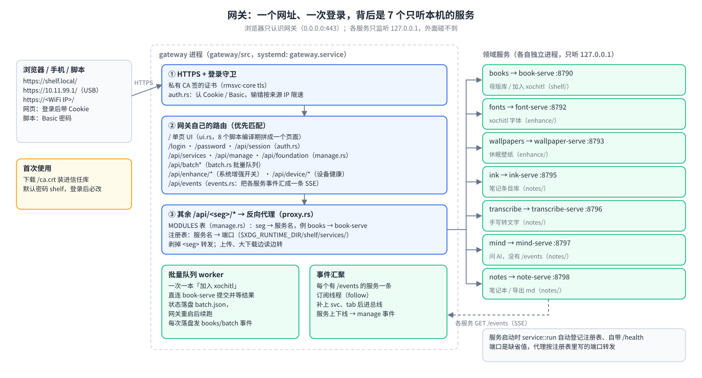

# gateway —— 设备端 Web 网关

> **读者与用途**：想知道“浏览器里那个网页是谁提供的、请求怎么走到各个服务、怎么构建部署”的人。
> 设计与踩坑见 [`docs/reMarkable网关白皮书.md`](docs/reMarkable网关白皮书.md)；整体位置见 [`../docs/OVERVIEW.md`](../docs/OVERVIEW.md)。

## 它是什么

设备上有好几个各管一摊的小服务（书架、KOReader、字体、壁纸、笔记四件套），它们都只听本机 `127.0.0.1`，外面直接碰不到。
网关是站在最前面的“前台”：**浏览器只需要认识它——一个网址（`https://shelf.local/`）、一次登录**，转发、排队、限流它来管。它自己不做“书 / 笔记 / 字体”的业务。
它是 `shelf/`、`notes/`、`enhance/` 三条线共用的唯一对外入口。



| 职责 | 代码 | 一句话 |
|---|---|---|
| 托管单页 UI | `ui/`、`ui.rs` | 页面文件编译期打进二进制，零外链；中英文语言包在 `ui/locales/` |
| HTTPS 与登录 | `auth.rs`、`config.rs` | 私有 CA 签的证书 + 只要密码的登录页；命令行用 Basic；输错按来源 IP 限速 |
| 服务发现 + 反向代理 | `manage.rs`、`proxy.rs` | `/api/<seg>/*` 剥掉 `<seg>` 转给对应服务；上传边读边转，有长度的下载/大应答（>256KB）边读边发；服务没起 → 404，网页隐藏对应标签 |
| 事件汇聚 | `events.rs` | 各服务的 `GET /events` 汇成一条 SSE `/api/events`，网页不轮询 |
| 并发/内存闸门 | `budget.rs` | 设备约 2GB 内存：>90MB 的书同时只处理 1 本，其余同时 3 本，排队最长 30 分钟 |
| 批量队列 | `batch.rs` | 勾选多本后由网关后台一次一本地处理，状态落盘、重启续跑、可全部中止 |
| 管理台 | `manage.rs` | 各服务“未装 / 已装未开 / 已开”三态、启停、卸载；探测 xovi/appload/KOReader/WeRead |
| 系统增强开关 | `enhance/` | 荧光笔汉字吸附、阅读器单击翻页 / 日漫翻页规则、手写笔迹优化、导入 md、漫画页边距、电池刺客；并显示扩展是否真的加载进 xochitl |
| 设备健康 / OTA 提示 / 清理 | `device/` | 「管理 → 设备健康」只读体检（服务状态、内存、启动耗时、xovi 与扩展映射、上次开机最后几行日志）；OTA 后页头提示重装；清理早期遗留文件与 xochitl 书库重复副本（后者走 xochitl 回收站） |

## 对外接口

**不用登录**：`GET /login` · `POST /login` · `POST /logout` · `GET /ca.crt`（下载私有 CA 装信任）· `GET /health`

**登录后（Cookie 或 Basic）**：

| 类别 | 接口 |
|---|---|
| 页面 | `GET /` · `GET /ui/locales/{lang}` · `GET/POST /password` · `GET /api/session` |
| 服务发现 / 管理 | `GET /api/services` · `GET /api/manage` · `GET /api/foundation` · `POST /api/manage/{seg}/{start\|stop\|uninstall}` |
| 事件 | `GET /api/events`（SSE） |
| 系统增强 | `GET /api/enhance/status` · `PUT /api/enhance/qol`（`hlSnapCjk` / `hwStrokeEnabled` / `notesImportMdEnabled` / `comicMinMargin` / `tapPageTurn` / `rtlPageTurn`）· `POST /api/enhance/battop/{start\|stop}` · `GET /api/enhance/battop/summary` |
| 设备健康 | `GET /api/device/health[?fresh=1]` · `GET /api/device/ota` · `GET /api/device/cleanup` · `POST /api/device/cleanup/delete {area, names}` |
| 批量队列 | `POST /api/batch {action: optimize\|deliver\|koreader, names? \| all:true, folder?}` → `{queued, skipped}` · `GET /api/batch/status` · `POST /api/batch/stop` |
| 闸门 | `GET /api/budget/status` → `{pending, active}` · `POST /api/budget/cancel {name}`（只对还在排队的生效） |
| 反向代理 | `GET/POST/PUT/DELETE /api/<seg>/*`，`<seg>` ∈ `books` `koreader` `fonts` `wallpapers` `ink` `transcribe` `mind` `notes` |

登录规则一句话：默认密码 `shelf`，首次登录必须改（≥6 位）；同一 IP 60 秒内输错 5 次锁这个 IP，登录口回 429、Basic 请求回 401。详见白皮书 §01。

子命令：`gateway serve [--bind]`（部署固定 `0.0.0.0:443`）· `passwd <新密码>` · `reset-password`（回默认密码并强制改）· `regen-tls`（只重签服务器证书，CA 不变）。改密码类命令要重启网关生效。

## 接入一个新服务

1. 服务用 `rmsvc_core::service::run` 启动（自动注册、自带 `/health`）。
2. 在 `src/manage.rs` 的 `MODULES` 加一行（URL 段、服务名、安装令牌、显示名、有没有 `/events`）。

代理只认服务名，不关心源码在哪条线的目录里。

## 构建、部署、测试

- **依赖**：只依赖 [`../rmsvc-core`](../rmsvc-core/README.md)；独立 Cargo 项目，不在任何 workspace 里。
- **构建/部署**：没有自己的脚本，由 `shelf/build.sh`（顺手编译本目录）和 `shelf/deploy.sh`（打包二进制 + `systemd/gateway.service`）代管。单独交叉编译：`cargo build --release --target aarch64-unknown-linux-musl`（用本目录 `.cargo/config.toml` 的 CC/AR 覆盖）。
- **测试**：`cargo test --manifest-path gateway/Cargo.toml`（68 个）；前端 `node --check ui/app.js` 与 `node --test ui/test/*.test.mjs`（6 项）；浏览器冒烟 `ui/test/smoke.puppeteer.mjs` 手动跑；可视走查见 [`tools/screenshot-walkthrough/`](tools/screenshot-walkthrough/README.md)。
- **设备上的文件**：二进制 `~/.local/bin/gateway`；配置 `~/.config/shelf/gateway.json`；证书 `~/.config/shelf/tls/`；批量队列 `~/.local/state/shelf/batch.json`。

## 目录

```
src/
  main.rs      入口、子命令、路由注册
  auth.rs      登录守卫（Cookie/Basic）、首登必改、按 IP 限速
  config.rs    gateway.json：HTTPS 开关、密码哈希、mDNS 名、额外证书名、会话天数
  proxy.rs     /api/<seg>/* 反向代理 + 四个吃内存操作的闸门拦截（优化/加入 xochitl/加入 KOReader/勾了同步优化的抓网文）
  manage.rs    MODULES 服务表（唯一事实源）、管理台、基石探测
  events.rs    事件汇聚 Hub
  budget.rs    并发/内存闸门
  batch.rs     批量队列
  ui.rs        拼装单页 UI、登录页、改密页
  enhance/     系统增强开关（qol / battop / loaded）
  device/      设备健康（health）、OTA 横幅（ota）、遗留清理（cleanup）
ui/            index.html、style.css、app.js、auth.css、locales/、test/（前端取数时机与界面规则见白皮书 §05）
systemd/gateway.service
tools/screenshot-walkthrough/   前端截图走查工具
```

## 命名遗留（刻意不动）

`~/.config/shelf/`、`$XDG_RUNTIME_DIR/shelf/`、`shelf.target`、默认密码 `shelf`、mDNS 名 `shelf.local` 仍叫 “shelf”：它们是已部署设备上的真实路径和配置，改名需要专门的迁移方案。2026-09-11 起网关本身从 `shelf/services/shelf-gateway` 正名搬到顶层，来历见白皮书末尾。
