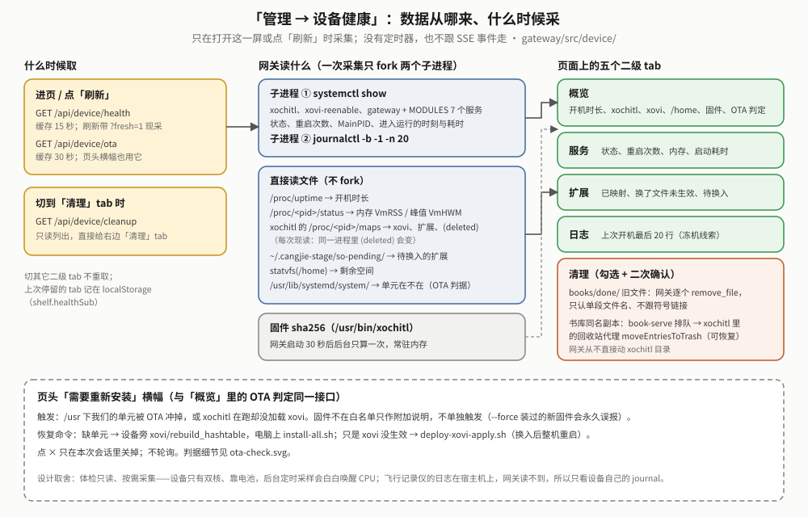

# reMarkable 设备端网关（gateway）白皮书

> **读者与用途**：维护网关，或想弄清“登录怎么判、请求怎么转、批量怎么排队续跑、网页什么时候取数”的人。入口文档（构建、部署、接口速查）见 [`../README.md`](../README.md)；共用基座（HTTP、TLS、鉴权原语）见 [`rmsvc-core` 白皮书](../../rmsvc-core/docs/reMarkable设备端Web服务基座白皮书.md)；整体位置见 [`../../docs/OVERVIEW.md`](../../docs/OVERVIEW.md)。
> 所有数字和行为以 **2026-10-10** 的代码为准（`gateway/src`、`gateway/ui`、`rmsvc-core/src`）。

## 给新读者

**这是什么**：设备上有好几个各管一摊的小网页服务（书架、字体、壁纸、笔记四件套），它们都只听本机 `127.0.0.1`。网关是站在最前面的“前台”：浏览器只认它一个地址（`https://shelf.local/`），登录一次；它把请求转给后面的服务，批量「加入 xochitl」也由它排队、一本处理完再下一本。它自己不做“书 / 笔记 / 字体”的业务。

**一个请求怎么走**：先过 HTTPS 和登录守卫 → 网关自己的路由（批量、系统增强开关、设备健康等）优先 → 剩下的 `/api/<seg>/*` 按服务表转给对应服务。网页打开时先取 `/api/services` 知道哪些服务在跑（每项带 URL 段 `seg`），据此决定显示哪些标签页。

**现在能做什么**

| 能力 | 一句话 | 详见 |
|---|---|---|
| HTTPS + 登录 | 私有 CA 签证书；只要密码；首登必改；输错按来源 IP 限速 | §01 |
| 服务发现 + 反向代理 | 注册表知道谁在跑；`/api/<seg>/*` 剥掉 `<seg>` 转发；大上传、大下载边读边转 | §02 |
| 事件汇聚 | 各服务 `GET /events` 汇成一条 SSE，网页不轮询 | §03 |
| 批量队列 | 勾选多本「加入 xochitl」，网关后台逐本做、落盘续跑、可全部中止 | §04 |
| 网页 UI | 单文件页面编译进二进制，中英文；传书 / 笔记 / 其他 / 管理四个标签页 | §05 |
| 系统增强开关 | 荧光笔汉字吸附、单击翻页、导入 md；显示扩展是否真的加载进 xochitl | §06 |
| 设备健康 / OTA 横幅 / 清理 | 打开时才采集一次的体检页；OTA 后提示重装；清理早期遗留 | §06b |

**怎么读**：要改登录 → §01；加服务或查“请求为什么到不了” → §02；网页不刷新 → §03、§5.1；批量 → §04；改网页 → §05；系统增强开关与设备健康 → §06、§06b；踩坑 → §08；待办 → §09。每章写现行设计，被推翻的做法只留结论和教训（完整经过在 git 历史）。

**验证程度的写法**：「真机通」= 在设备上实际操作过这个功能；「已部署」= 代码装上设备、部署自检（`verify-on-device.sh`、服务状态、接口健康检查）通过，但功能本身还没人手测；「host 验证」= 只有单元测试或开发机上的测试。

**已经没有的东西**（别再找）：KOReader 相关的代理段、批量动作与网页入口（2026-09-29 设备卸载 KOReader、WeRead、appload，09-30 撤）；电池刺客与手写优化开关（09-30）；设备端「优化」、抓网文、原 PDF 备份（2026-10-07 书架不再优化书，书在电脑上用 [sheng-ren](https://github.com/bbq191/sheng-ren) 优化好再传）；并发/内存闸门 `budget.rs` 与 `/api/budget/*`、日漫翻页开关（10-07 稍后）；`/api/manage` 里没人读的 `installable`/`hasWeb`（10-09）。下文提到它们时都带日期、标“已移除”。

## 现状（2026-10-10）

**术语**

| 词 | 意思 |
|---|---|
| 反向代理 | 网关替浏览器去访问后端服务，再把结果带回来 |
| 注册表 | 每个服务启动时在 `$XDG_RUNTIME_DIR/shelf/services/<名>.json` 写下自己的端口；网关读这个目录就知道谁活着 |
| seg（URL 段） | `/api/books/...` 里的 `books`；`manage.rs` 的 `MODULES` 表把它对应到服务名 `book-serve`；`/api/services` 每项也带回它 |
| SSE | 服务器单向推送的长连接；网页靠它“被通知”刷新，而不是定时去问 |
| 批量队列（batch） | 网关自己的后台队列，一次处理一本，关掉浏览器照跑 |
| 整机重启 | 让 xovi 扩展、界面补丁（qmd）生效的唯一方式（2026-09-25 起）。单独重启 xochitl 有概率在它退出时崩溃，所以网页里的提示一律写“整机重启” |
| 私有 CA | 设备首次启动时自己生成的根证书；装进手机/电脑一次，浏览器就不再报“不安全” |

**关键数字**

| 项 | 值 | 出处 |
|---|---|---|
| 对外监听 | `0.0.0.0:443`（HTTPS） | `systemd/gateway.service`；`main.rs` 里的 `0.0.0.0:8778` 只是本地手动跑时的兜底 |
| 访问地址 | `https://shelf.local/`（mDNS）、`https://10.11.99.1/`（USB）、`https://<WiFi IP>/`；安卓不解析 `.local`，走热点 dnsmasq 别名 `shelf.rm` | `config.rs`、`rmsvc-core/src/mdns.rs` |
| 代理的服务 | 7 个：`books` `fonts` `wallpapers` `ink` `transcribe` `mind` `notes` | `manage.rs::MODULES` |
| 同时处理的请求上限 | 64（含 SSE 长连接），超了回 503 | `rmsvc-core/src/http/server.rs` |
| 登录限速 | 同一 IP 60 秒内输错 5 次锁这个 IP（最多 60 秒）；表最多记 256 个 IP | `auth.rs` |
| Basic 认证缓存 | 验过的密码缓存 10 分钟、最多 8 条、只缓存“通过”，改密码清空 | `auth.rs`（`rmsvc_core::auth::VerifyCache`） |
| 会话 | 30 天（`sessionDays`）、只存内存、最多 64 个 | `main.rs`、`config.rs` |
| 代理超时 | 只有空闲超时：连接 3 秒、读 900 秒、写 120 秒，不设总时长；进程内共用一个 ureq Agent | `proxy.rs::agent` |
| 代理应答流式转发 | 200 且带长度，又是下载（带 `Content-Disposition`）或 > 256KB → 边读边发；其余读完再回 | `proxy.rs::STREAM_MIN_BYTES` |
| systemd | `CPUWeight=20`、`MemoryMax=192M`、`Nice=5` | `systemd/gateway.service` |
| 测试 | Rust 73 个（`cargo test`，含各自有接口的线上格式快照）；前端 6 个 node 测试文件共 19 项（core 4 / locales 4 / lowspace 2 / net 4 / scripts 2 / xss 3，`node --test gateway/ui/test/*.test.mjs`）+ 1 个手动跑的浏览器冒烟（`smoke.puppeteer.mjs`，要设 `PUPPETEER_NODE_MODULES`） | 2026-10-10 开发机实跑；clippy 无告警 |
| 语言包 | `zh-CN.json` / `en-US.json` 各 483 个 key；`locales.test.mjs` 钉住中英键集合与 `{占位符}` 一致、页面脚本里字面量 `T()` 键都在、没有死键；动态拼接的键（`ota.reason.<码>` 等）由 Rust 测试 `ui::tests::dynamic_i18n_keys_cover_every_backend_value` 遍历后端取值集合核对（§5.3） | `ui/locales/`、`ui/test/locales.test.mjs`、`src/ui.rs` |

**真机验证状态**（按批次；每批要手测什么见 §09）

| 批次 | 状态 |
|---|---|
| 网关部署运行（`active`、`NRestarts=0`） | 真机通：09-24 只读核对；09-25 整轮卸载后重装 43✓ 0✗；09-30、10-07 几次部署后 `verify-on-device.sh` 全部 0✗，9 个常驻服务 `NRestarts` 0 |
| 批量「加入 xochitl」 | 真机通（2026-09-25 用户在网页操作：两本 >90MB《乱马》，队列 `done 2 / failed 0`）；批量中途停止、网关重启后续跑 09-20 真机通 |
| 私有 CA 自动迁移到带名称约束的新 CA | 设备端已发生（2026-09-24 09:38，日志与 `.bak-*` 文件可见）；**各手机/电脑是否已重装新 CA、删掉旧 CA：未核实** |
| 09-24 第三轮审计（代理大应答流式、`/api/enhance/status` 缓存、按 IP 限速、`next` 校验、按 tab 懒加载） | 已部署；09-25 真实登录只读走查 108 屏无溢出、无报错。安全改动没在真实手机/电脑上专门试过 |
| 09-25 设备健康 / OTA 横幅 / 清理（§06b）与第四轮审计（按事件来源减少重取、上传器/笔记保存修复、对话框骨架） | 已部署；页面经真实登录只读走查。真 OTA 后横幅、两类清理的删除按钮没在真机上做过 |
| 09-30 第五轮审计（撤 KOReader/WeRead/appload、Basic 认证缓存、全部中止补漏、事件流断线退避）与移除电池刺客 / 手写优化 | 已部署（09-30 14:10、15:23），部署自检通过；功能待手测 |
| 10-07 书架不再优化书、稍后的清理（删闸门、批量队列旧兼容、日漫翻页）、代码审查修复（代理空闲超时、批量只认 `ok`、`waitingService`、`registry_wake`、`parse_maps` 共用） | 已部署（10-07 13:02；15:54 并整机重启），部署自检 36✓ 1⚠（刚开机）0✗；功能未真机手测 |
| **10-10 重构第一阶段**（网页脚本拆成 8 个源文件、编译期拼回；接口 DTO 化 + 线上格式快照；系统增强开关表驱动 + `toggles`；母版库/笔记改用后端下发的 `title`/`series`/`done`/`live`；清理接口失败项 `{name,message}` + `partial`；`format:"other"` 不再显示成 EPUB；事件 area/kind 常量表；笔记页 `refreshGate`、`liveStream`） | host：`cargo test` 73 个、node 19 项、浏览器冒烟通过，clippy 无告警；**未部署**（依赖 book-serve 的 `title`/`series`/`done` 与 ink-serve 的 `live` 一起上机，见 §09） |
| **10-09 第六轮审计**（确认框 Enter 误判、认证配置锁 poison、`/api/services` 带 `seg`、`/api/manage` 删冗余键、`lowSpace` 优先读后端、页面隐藏不取数、搜索“已撤销”跳回收站、清空回收站后的 `/books/undefined`、卸载失败提示被整页重载冲掉、待换入不列半成品；后端改用 rmsvc-core 的 proc/config/http 工具）及同日审计后续（批量 `names` 改用 `opt_str_list`、网页发单价用 `inputPer1k`/`outputPer1k`） | host：`cargo test` 62 个、node 13 项、浏览器冒烟通过，clippy 无告警；**已部署**（第六轮 10-09 13:48 `install-all`，整机重启后部署自检 38✓ 1⚠ 0✗；审计后续随下一次部署上机）；**功能未在真机手测** |

## 01｜登录与安全

### 1.1 HTTPS 与私有 CA

- 首次启动在 `~/.config/shelf/tls/` 生成私有 CA（`ca.pem`/`ca.key`，10 年）和服务器证书（`cert.pem`/`key.pem`，800 天；Apple 平台拒绝超过 825 天的证书）。
- **什么时候换服务器证书**：证书里的名字列表变了（比如换了 WiFi、IP 变了），或者签发满 700 天。换的时候 CA 不变，已装 CA 的手机/电脑不受影响。手工换：`gateway regen-tls`（只删服务器证书，下次启动用同一个 CA 重签）。
- **名称约束（2026-09-24 起）**：CA 只准签 `shelf`、`shelf.local`、`shelf.rm`、`localhost`、`remarkable`、`remarkable.local`（及子域）和 `10/8`、`172.16/12`、`192.168/16`、`127/8` 这几段 IP，而且不能再派生下级 CA。原因：CA 装进了手机/电脑的系统信任库，不加约束的话，设备上的 `ca.key` 一旦泄露就能给任何网站签出被信任的证书。约束外的名字/IP 在签发时被剔除并打日志（否则浏览器会拒绝整张证书）。
- **旧 CA 迁移**：网关启动时如果发现 `ca.pem` 没有约束，就把 5 个文件改名为 `<名>.bak-<秒>`（不删），重新生成 CA 和服务器证书。**用户要做的**：每台手机/电脑重新打开 `https://<设备>/ca.crt` 安装新 CA（iOS 还要在“证书信任设置”里打开完全信任），**并删掉旧的那张**——新旧两张都叫“shelf 书架私有 CA”，按签发日期区分；旧 CA 没有约束，私钥还在设备的 `ca.key.bak-*` 里，只装新的不删旧的，风险没有消除。所有终端确认能用后，可以删掉设备上的 `*.bak-*`。
- **已知限制**：把 `mdnsName`/`extraSans` 改成别的名字，或设备拿到 CGNAT(`100.64/10`)、链路本地、公网 IP 时，这些不会进证书，用它们访问会报证书错误；约束内容以后再改的话，迁移逻辑只看“有没有约束”，不会自动重签。

### 1.2 密码、会话与首登必改

- **登录方式**：网页登录页只要密码（没有用户名），成功后拿 Cookie `shelf_session`（HttpOnly；HTTPS 下 Secure；SameSite=Strict）；命令行用 `Authorization: Basic`，用户名随便填，只认密码。
- **公开路径**（不用登录）：`GET/POST /login`、`POST /logout`、`GET /ca.crt`、`GET /health`、`GET /favicon.ico`。其余请求没认出身份时：浏览器（`Accept` 含 `text/html`）303 到 `/login?next=<原路径>`，其它 401。
- **会话**：令牌 32 字节随机、只存内存（重启网关全部要重新登录）、最多 64 个（满了淘汰最早到期的）、有效期 `sessionDays`（缺省 30 天）。改密码后踢掉其它设备的会话，本会话保留。
- **首登必改**：首次启动写入默认密码 `shelf` 的哈希并置 `mustChangePassword`。改之前只放行 `/password` 和 `GET /api/session`：网页 303 到 `/password`，API 回 403。用 Basic 可以直接 `POST /password`（已证明持有当前密码，不用再填 `current`）。新密码至少 6 位（`config::MIN_PASSWORD_LEN`，登录页提示从这个常量插值）且不能是 `shelf`。
- **哈希**：`pbkdf2$<轮数>$<盐>$<摘要>`，PBKDF2-HMAC-SHA256 60 万轮、16 字节随机盐。旧版单轮 SHA-256 哈希仍能校验，改密后自动升级。PBKDF2 一律在配置锁外面算（登录、Basic 校验、改密码时核对当前密码都是；改密码这一处 09-24 才挪出来），不会让一次慢校验卡住其它请求。校验只有一处实现（`GatewayConfig::verify_hash`）。
- **Basic 认证缓存**（09-30）：带 Basic 头的脚本每个请求都要校验一次密码，此前每次都是 60 万轮 PBKDF2。现在用基座的 `rmsvc_core::auth::VerifyCache` 记住最近验过的密码：10 分钟、最多 8 条、**只缓存“通过”**（猜错照样现算、照样被限速），键是 `SHA-256(进程随机密钥‖存储的哈希‖密码)`，内存里不留明文；改密码时整表清空。网关原先自己写的一份缓存已并入基座这一份。
- **登录后跳转**：`next` 只接受本站路径——必须以单个 `/` 开头，不能是 `//`，不能含 `\` 或控制字符（09-24 前 `/\evil.com` 能跳外站）。
- **配置锁容忍 poison**（2026-10-09）：密码哈希与“首登必改”标记放在一把进程内锁里。此前某个处理函数持锁时 panic，锁被“毒化”后取哈希落到空串、校验一律失败、谁都登不进，`must_change` 读成假、首登强制改密被跳过，改密码直接报错；现在统一走 `rmsvc_core::sync::lock`，毒化后照常取到数据（单测 `poisoned_cfg_lock_keeps_auth_working`；10-09 已部署，毒化路径真机没触发过）。
- **忘记密码**：在设备上跑 `gateway reset-password`（回到 `shelf` 并强制改）或 `gateway passwd <新密码>`，都要重启网关生效。

### 1.3 失败限速（按来源 IP）

- **规则**：同一个 IP 在 60 秒内输错 5 次，就锁这个 IP，直到最早那次失败满 60 秒（所以最多锁 60 秒）。锁定期内不做 PBKDF2 校验（防止被并发猜密码烧 CPU），也不再累计（不会被无限续锁）。每次输错另外固定延时 500ms。成功一次清零该 IP；重启网关全部清零。
- **不同入口的回应不一样**：`POST /login`、`POST /password` 被锁时回 **429** + `Retry-After`；带 Basic 头的普通请求被锁时回 **401**（守卫在锁定期直接当“没认出身份”）。已登录会话不受影响。
- **为什么按 IP**：09-24 之前是全局计数，同一 WiFi 下任何人连续输错，主人新开会话也登不进。现在别人输错只锁他自己的地址。
- **表的容量**：最多记 256 个 IP。满了先清过期的，再淘汰“没被锁的里最久没出错的”，全都被锁时才淘汰最旧的——否则攻击者换一批地址各错一次，就能把自己被锁的 IP 挤出表外。
- **不豁免任何网段**：USB 网段 `10.11.99.0/24` 和 `127.0.0.1` 也限速，因为设备自己的 lo 别名就是 `10.11.99.1`，豁免等于给一整类请求开口子。
- **对端 IP 从哪来**：基座的 HTTP 服务器取 TCP 对端地址，写进内部头 `X-Rmsvc-Remote-Ip` 交给处理函数（`Request::remote_ip()`）；客户端自己发的同名头在头白名单那一步就被丢掉，伪造不了。细节见基座白皮书 §01。

## 02｜反向代理与服务发现

### 2.1 服务表（`manage.rs::MODULES`）

`MODULES` 是 URL 段 ↔ 服务名 ↔ 安装令牌 ↔ 显示名的**唯一事实源**：代理、管理台三态、事件订阅都从它派生，不许别处再写一份映射。

| seg | 服务 | 缺省端口 | 有 `/events` | 所属线 |
|---|---|---|---|---|
| `books` | book-serve | 8790 | 是 | shelf（母版库 / 落原生） |
| `fonts` | font-serve | 8792 | 是 | enhance |
| `wallpapers` | wallpaper-serve | 8793 | 是 | enhance |
| `ink` | ink-serve | 8795 | 是 | notes（条目库） |
| `transcribe` | transcribe-serve | 8796 | 是 | notes（手写转文字） |
| `mind` | mind-serve | 8797 | **否** | notes（问 AI，纯被动） |
| `notes` | note-serve | 8798 | 是 | notes（笔记本 / 导出） |

端口是各服务的缺省值，代理实际按注册表里写的转发。原来还有一行 `koreader` → koreader-serve（8791），2026-09-30 随设备卸载 KOReader 撤掉，`/api/koreader/*` 现在回 404“未知服务”。新服务接入两步：服务用 `rmsvc_core::service::run` 启动（自动注册、自带 `/health`），再在 `MODULES` 加一行。

### 2.2 路由与代理行为

- **路由优先级**：基座的 `Router` 按“最具体优先”分发（字面段多的胜、精确匹配胜尾部通配）。所以 `/api/batch`、`/api/enhance/...` 这些网关自有路由不会被 `/api/{svc}/*` 代理通配抢走，跟注册顺序无关（09-20 起；此前靠“先注册先匹配”的纪律。`main.rs` 里的注释已同步更正）。
- **转发**：`/api/<seg>/<rest>` → 剥掉 `<seg>` → `http://127.0.0.1:<端口>/<rest>`，查询串原样带上。后端直连（SSH 调试）和经网关走的是同一套路由。
- **出错**：seg 不认识 → 404“未知服务”；服务没起 → 404“`<服务>` 未安装或未运行”（网页据 `/api/services` 隐藏对应 tab）；后端连不上 → 502。
- **请求体**：边读边转发（上传大文件不占网关内存），一律不解析（2026-10-07 稍后起；此前闸门拦的 POST 会先读一次小 JSON〔上限 1MB〕拿书名再原样转发，闸门删除后这个分支也删了）。GET/DELETE 不转发请求体，也就**不带客户端的 `Content-Length`**（09-25）：此前照抄，客户端发了带 body 的 DELETE 时，后端会一直等那几个永远不来的字节，直到读超时。
- **响应体**（规则只有一条：**有长度的大应答边读边发，其余读完再回**）：
  - 状态 200、后端给了 `Content-Length`，并且是下载（带 `Content-Disposition`：母版库原件、导出等，可达上百 MB）或体积超过 256KB（壁纸原图、裁图等）→ **按定长边读边发**，浏览器能显示下载进度。host 实测代理一个 60MB 应答，网关峰值内存 62.4MB → 5.0MB，输出逐字节一致。
  - 其余（JSON 等小应答、错误应答、**没有长度的应答**）→ 读完再回。
  - 只带回 `Content-Type`、`Content-Disposition`，以及**状态 200 时**的 `Cache-Control`（2026-10-07 审查修复起；给 ink-serve 带哈希名的裁图用，见笔记白皮书），其余一律丢弃，不给后端夹带 `Set-Cookie` 之类的口子。
- **超时与连接**（2026-10-07 审查修复）：进程内共用一个 ureq Agent（此前每个请求新建一个，网页一次刷新十几个请求各自新建 TCP 连接、留下一串 TIME_WAIT）。只设空闲超时——连接 3 秒、读 900 秒、写 120 秒；**不设总时长**。此前的 900 秒是 ureq 的整请求时长（含发完请求体、读完应答体），慢网下传一本几百 MB 的书超过 15 分钟就会被拦腰截断。
- **为什么没有长度的就不流式**：没有长度的流在基座里只有一条路——SSE 用的“接管裸 socket、读到连接关闭为止”。09-24 第一版流式下载就是借了这条路，结果后端读完并不关连接，真机上原件下载永远收不完；随后改成带长度的走 tiny_http 定长响应（并把 chunked 阈值调到最大，否则超过 32KB 会改 chunked、丢掉长度），这一步有真机修复记录。第三轮审计（09-24，当天部署）又把“有长度的大图片”也纳入流式，并让“没有长度的下载”退回读完再回，不再走那条通道。教训：SSE 通道和文件下载通道语义不同，不能混用。

### 2.3 管理台与基石探测（`manage.rs`）

- **`GET /api/services`**（2026-10-09 起每项带 `seg`）：列注册表里在跑的服务，每项补上 `MODULES` 表里的 URL 段 `seg`（网关自己不在表里，为 `null`）。网页靠它决定显示哪些标签页、拼 `/api/<seg>/…` 地址，打开页面不用再为这层映射多取一次 `/api/manage`。
- **`GET /api/manage`**：每个模块回 `seg`、`service`、`only`（安装令牌）、`label`、`installed`、`running` 等；原来恒为 true 的 `installable` 与跟 `installed` 恒等的 `hasWeb` 没人读，2026-10-09 删掉。
- **三态**：未装（`~/.local/bin/<服务>` 不在）/ 已装未开 / 已开（注册表里有）。开关 = `systemctl start/stop`（只省后台占用，不是省电）；卸载 = 调设备上的 `shelf-uninstall --only <令牌>`。**安装不走网页**（不让网页去 remount `/usr` 装系统单元），未装的模块只给引导。网关自己不能从网页关或卸。
- **外部命令有超时**：`systemctl` 30 秒、卸载脚本 180 秒；超时就 kill，输出用单独线程排空（防止输出太多把子进程写阻塞）。
- **基石探测** `GET /api/foundation` → `{xovi, qrr}`：只读检查 xovi 与 qt-resource-rebuilder 装没装。09-30 前还探测 appload、KOReader、WeRead（第三方 app），设备 09-29 卸掉它们后撤掉——再列出来只会是三枚永远“未安装”的红徽章。

## 03｜事件推送

- **原则**（用户 2026-09-06 定）：不轮询、不监听全盘、日志写入不触发。事件只来自服务代码里的变更点，加上注册表目录的 inotify。
- **汇聚**：`events::spawn` 为 `MODULES` 里有 `/events` 的每个服务起一条线程，跑基座的 `events::follow`（服务没起就等注册表 inotify；连上用 `?ka=120`，两分钟一次心跳；断线 3 秒→60 秒指数退避；对方回 404 就长等 10 分钟），返回总线（2026-10-07 审查修复删了只包一层的 `Hub` 结构）。收到的事件补上 `"svc":"<seg>"` 和 `"tab":"<MODULES 里声明的 tab>"` 后发进网关总线（`events::tag`）。另一条线程阻塞在基座的 `events::registry_wake` 上（订阅线程等服务上线用的同一条 inotify 监听，防抖 300ms），服务上下线时发 `{"area":"manage","kind":"services","tab":"manage"}`；此前网关自己另起一条 inotify 监听同一个目录（防抖 500ms），每次注册表变化唤醒两个线程。
- **网关自己也发**：`batch.rs` 每次落盘都经 `events::notify_books()` 发 `{"area":"books","kind":"batch","tab":"books"}`（不带 `svc`，以此和 book-serve 自己的事件区分）。网页收到这类事件只重取 `/api/batch/status` 一个接口（2026-10-07 稍后起；此前闸门还发 `budget`，网页多取 `/api/budget/status`）；book-serve 的 `staging` 事件 09-25 起也不再全量刷新，前端各 tab 按事件来源取多少见 §5.1。批量运行时也不再每 3 秒轮询。
- **反过来驱动批量队列**：book-serve 发来的 `books` 事件还会唤醒批量 worker 里“等这本书处理完再取下一本”的等待（`books_wake`，见 §4.3；2026-10-07 稍后前唤醒的是闸门里等着还名额的线程）。“哪个服务的事件要叫醒谁”写在 `MODULES` 的 `wake` 字段里（目前只有 book-serve 一行）；2026-10-10 前是汇聚循环里写死 `seg == "books"`。
- **浏览器侧**：`new EventSource('/api/events?ka=60')`，60 秒一次心跳。收到事件只刷新对应区域；不在前台的 tab 只记“待刷”。页面隐藏超过 60 秒就主动断开 SSE（锁屏的手机不再让设备为它保活），重新可见时重连，重连成功后补刷当前 tab，断开期间的事件不会漏掉效果。前端完整的取数时机见 §5.1 的图。
- **事件 area/kind 总表**（2026-10-10 全仓 `rg 'publish(' ` 收集；网页所有事件分支只认 `ui/core.js` 的 `EV` 常量表，网关自己发的两种在 `events.rs` 是常量，`ui.rs` 的测试核对 `EV` 表里有它们；**各服务侧仍是字符串字面量**，改名时两边都要动，第二阶段再收）：

  | area | kind | 谁发（file:line） | 什么时候 | 网页怎么处理 |
  |---|---|---|---|---|
  | `books` | `staging` | book-serve `api.rs:57,70,162,174`、`service_state.rs:178`、`staging/deliver.rs:202` | 母版库条目变了（入库、忙态开始/结束、落库结果） | 传书：`LEVEL.LIST`（母版库列表 + 批量状态） |
  | `books` | `render` | book-serve `render_check.rs:38`（`publish_with`，带 `name`/`status`/`pages`） | 渲染自检出结果 | 传书：`LEVEL.LIST` |
  | `books` | `mkdir` / `trash` | book-serve `api.rs:119,127` / `api.rs:103,109` | 建文件夹队列、回收站队列变化 | 传书：`LEVEL.FULL` |
  | `books` | `inbox` / `import` | book-serve `service_state.rs:176` / `api.rs:225` | inbox 有新文件 / 直接导入完成 | 传书：`LEVEL.FULL` |
  | `books` | `agent-failed` | book-serve `agent_failures.rs:45,58` | 设备端代理连试 5 次仍没做成 | 全站：重取 `/api/books/agent-failures` 更新横幅（与哪个 tab 无关） |
  | `books` | `batch`（**不带** `svc`） | 网关 `batch.rs::persist` → `events::notify_books` | 批量队列状态每变一次 | 传书：`LEVEL.QUEUE`（只取 `/api/batch/status`） |
  | `manage` | `services`（不带 `svc`） | 网关 `events.rs::spawn`（注册表 inotify） | 服务上下线 | 查 `/api/services`，tab 集合变了整页重载；否则刷管理台 |
  | `notes` | `entries` | ink-serve `main.rs:67,85,226` | 条目库变了（摄取、改字、浏览态动作、恢复、清空回收站） | 笔记：整页刷新；自己刚重取过（`refreshGate` 闸门 ②）则不理 |
  | `notes` | `transcribe` | transcribe-serve `main.rs:66,145` | 一轮转写结果变了 / 改了配置 | 笔记：整页刷新 |
  | `notes` | `notebooks` | note-serve `main.rs:132` | 生成笔记本 / 导出 md 后同步状态变了 | 笔记：只重取同步状态（`syncOnly`） |
  | `fonts` | `fonts` / `ui` / `config` | font-serve `main.rs:85,121` / `96,106,115` / `127` | 阅读字体池 / 界面字体 / 加粗开关变化 | 其他：只刷字体子面板 |
  | `wallpapers` | `pool` | wallpaper-serve `main.rs:114,122,129,134`、`wake.rs:79` | 壁纸池或当前壁纸变化（含每次休眠轮换） | 其他：只刷壁纸子面板 |

  网页按事件的 **`tab`** 找顶层 tab（`secByTab`，取值 `books`/`notes`/`other`/`manage`，即传书/笔记/其他/管理；`core.js` 的 `EV.tab`）。
  服务事件的 `tab` 由 `manage.rs::MODULES` 每行的 `tab` 字段声明（book-serve → `books`；ink/transcribe/mind/note-serve → `notes`；
  font/wallpaper-serve → `other`），网关汇聚时补上、覆盖服务自带的同名字段；网关自己的两种事件在发出处写定（`batch` → `books`，
  `services` → `manage`）。「其他」tab 再按 `svc` 分到字体/壁纸子面板。`area` 字段照旧保留，网页只用它判 `manage` 与传书的刷新档位。
  2026-10-10 前按 **area** 找 tab（`secByArea`）：ink-serve 与 transcribe-serve 都发 `area:"notes"`，能落到「笔记」tab 只因为
  note-serve 的 seg 恰好也叫 `notes`（审计 FE-6）；新增服务时 area 与 seg 对不上，事件会静默丢掉。`ui.rs` 的测试核对
  `EV.tab` 覆盖网关会发的每个 tab 值，`events.rs` 的测试钉住各服务的归属。
- **浏览器放弃重连时**（09-30）：WiFi 掉线这类断开 EventSource 会自己重连；但连上时回的不是 200（网关重启后内存里的会话全没了 → 401，并发满 → 503），它会直接进 `CLOSED`、再也不重试——此前页面就此静默失去实时刷新。现在进 `CLOSED` 时先查一次 `/api/session`（401 由 `j()` 带去登录页），其余情况按 5 秒起、翻倍、封顶 5 分钟退避重开；页面隐藏时不重试，重新可见时照常重连。

## 04｜批量队列（闸门 2026-10-07 删除）

### 4.1 为什么放在网关

漫画优化做完后真机测出：优化、超限分卷投递的内存峰值约等于文件体积本身（245MB 的书优化峰值 206MB）。`book-serve` 的忙锁按书名分别加，点不同的书互不阻塞；设备只有约 2GB 内存，`systemd MemoryMax` 又没真正生效，同时点几本大部头会线性叠加，是真实的 OOM 风险。用户要求按内存用量限流，而不是按操作个数。

〔2026-10-07：吃内存的大头「优化」随书架不再优化书删掉（优化改在电脑上用 sheng-ren 做），闸门当时只拦「加入 xochitl」。加入是流式上传、大文件通道是本机拷贝，单本内存很小（书架白皮书 §5），闸门留着当并发上限：一次只投一本 >90MB 的大书，也避免同时往 xochitl 塞太多本。〕
〔2026-10-07 稍后：**闸门整个删除**（10-07 15:54 已部署）。网页的「加入 xochitl」只走批量队列，队列本来就一本处理完才取下一本；加入是流式上传，book-serve 只多占几 MB；闸门"内存峰值≈文件体积"的前提来自设备上优化大书，已经拦不到任何东西。下面 §4.2 只留历史。批量队列放网关的理由不变。〕

各服务是独立进程，进程内的锁天然不跨进程；而网关是这些操作**物理上唯一必经**的转发关口，放在这里用一把进程内的锁就够，不需要跨进程锁、共享内存或 IPC。批量队列放网关是同一个理由。

### 4.2 闸门（`budget.rs`，2026-09-19～2026-10-07，已删除）

当时的设计（完整代码用 `git log -- gateway/src/budget.rs` 找到删除它的提交，看它的上一版）：只拦 `book-serve` 的 `POST staging/deliver`（09-25～10-06 还拦优化与勾了「同步优化」的抓网文，09-30 前还拦加入 KOReader）；按母版库里的文件体积分档，**大于 90MB** 同时最多 1 本、其余同时最多 3 本，排队最长 30 分钟（503），同名书已在排队或处理中回 409；`GET /api/budget/status`、`POST /api/budget/cancel` 跨会话可看、可取消，网页行内有"取消排队"、页头有"⏳ 排队 N 本 · 处理中 M 本"。加入是异步的，名额要等 `GET /staging` 里这本 `busy=false` 才还（事件唤醒、30 秒兜底、两次查询至少隔 5 秒、连续失败 6 次才放、最长 60 分钟）。

删掉时这段"等这本书处理完"的逻辑原样挪进了 `batch.rs`（§4.3 的 `poll_until_settled`），所以 09-24 修的"一次查询失败就提前放行"那条教训（§08）现在落在批量队列上：连续 6 次失败才放弃等待。闸门那条待办"两本大书真的串行"从未真机验证，随删除作废。

### 4.3 批量队列（`batch.rs`）

- **接口**：`POST /api/batch {action: deliver, names?: [...], all?: true, folder?}` → `{queued, skipped}`；`GET /api/batch/status`（`running`、`waitingService`、`action`、`total`、`done`、`current`、`queued`〔前 200 个〕、`failed[]`）；`POST /api/batch/stop` → `{cleared}`。
  - `waitingService`（2026-10-07 审查修复新增）：网关重启后恢复出来的队列正在等 book-serve 起来，网页据此显示“等 book-serve 就绪”，而不是像已完成或卡住。
  - `action` 由当前那本 / 队首那本推出；都没有但有上一轮结果时是 `deliver`，从没跑过是 `null`。原来单独存的 `action` 与 `queuedCount` 删了（动作只剩一种；`queuedCount` 网页不读），旧 `batch.json` 里的 `action` 字段读回时忽略。
- **资格**（和界面底部栏按钮同一套）：加入 xochitl = `rmsvc_core::formats::NATIVE_EXTS`（EPUB/PDF；2026-10-10 前在这里另写一份）。`action` 只认 `deliver`：`koreader` 09-30 移除、`optimize` 2026-10-07 移除，再传都回 400“action 只能是 deliver”。不适用的和重复入队的计入 `skipped`（`all:true` 时不适用的是预期筛选，不计）。
- **一轮的计数**：从空闲开始的一次入队开新一轮，`done`/`failed` 清零，`total` 按队列里**实际有多少本**算——`resume` 等不到 book-serve 放弃时，旧队列留在内存里没有 worker，下一次入队会连它们一起跑（09-25；此前 `total` 只算这次入队的数量，进度会显示成“5/2”）。已经在跑时再入队，累加进同一轮。
- **执行**：后台 worker 线程**一次一本**。每本直连 book-serve 的 `POST /staging/deliver`（2026-10-07 稍后前要先过闸门）；再 `poll_until_settled` 等到这本 `busy=false`（事件驱动：`books_wake` 唤醒，至多 30 秒兜底查一次；两次 `GET /staging` 至少隔 5 秒〔`MIN_REQUERY`〕；**连续** 6 次查询失败才放弃等待〔`MAX_POLL_FAILURES`〕，失败之间隔 5 秒；最长 1 小时），然后从**判定处理完的那份列表**里读这本的 `delivered.deliver` 判成败，不再另取一次。网页的「加入 xochitl」只走这条队列，所以同一时刻最多一本书在投。每本书只建一个 book-serve 客户端（提交与查询共用）。
- **成败只认 `ok`**（2026-10-07 审查修复）：`delivered.deliver.status` 是 `ok` 才记成功；是 `failed` 记失败、带 book-serve 写的原因；其余情况——等满 1 小时、连续 6 次查不到 book-serve、条目途中消失（被删或改名）、状态还是 `pending`——**一律记失败**，原因写“没等到结果（书架服务超时、不可达，或这本书已不在母版库），请到 xochitl 书库里核对”。此前只认 `failed`，这几种结果不明的都被记成成功。代价：书其实加进去了、只是网关没看到结果时，会多一条“失败”，所以提示让人去书库里核对，而不是让人重加。worker 用 `catch_unwind` 兜住 panic，只让这一本失败（release 是 `panic="unwind"`）。
- **落盘与续跑**：每次状态变化原子写 `~/.local/state/shelf/batch.json`（序列化与写盘在同一把锁里，防止旧快照后写把队列回退）。网关启动时 `resume`：先把队列装进内存，后台等 book-serve 就绪（最长 30 分钟；等的是注册表变化——book-serve 起来会注册——30 秒没动静兜底探一次；2026-10-07 审查修复前是前 30 秒每 2 秒、之后每 30 秒定时探测），这期间 `waitingService=true`；再按最新母版库重新校验（已经不在母版库的不再做）；超时也**保留**队列，等下次入队一起跑。读回按当前格式严格反序列化，文件损坏或格式不对＝当作没有未完成的队列（下次落盘覆盖）。（09-30～10-07 有 `parse_saved`：旧文件里残留已撤的 `koreader`/`optimize` 任务时只剔除这几项；2026-10-07 稍后删掉，这类旧任务早已跑完或被剔除。）
- **被打断的那本**：网关重启时正在处理的那本**一律放回队首**重放。（2026-10-07 稍后前每项记 `attempts`，连续两次开始都没走完就记失败跳过，防"某本书稳定触发崩溃 → systemd 拉起 → 无限重放"；网关不读书的内容，加入也不在设备上解书，崩溃元凶不会在网关这边，计数删掉。已不会出现的 `cancelled` 状态分支同日删除。）
- **全部中止**：清空还没开始的（10-07 稍后前，正在处理的那本如果还在等闸门就取消排队）；已经交给 book-serve 的会跑完（整本上传、大文件通道都没有安全的中断点）。还有一个窗口（09-30 补）：这本已经出队，但还没交给 book-serve——`stop` 同时打一个“中止当前”标记，worker 提交前看到就不提交（记失败“已全部中止”）。历史：2026-10-07 前已进 book-serve 的会再发 `POST /staging/cancel`，EPUB 优化每处理完一个条目检查一次、终态记 `cancelled`；这个接口随「优化」一起删掉。

## 05｜网页 UI

### 5.1 怎么打包、怎么组织

- `ui/index.html`、`style.css`、脚本、`auth.css` 在编译期 `include_str!` 进二进制，拼成**一个零外链的单文件页面**；格式白名单从 `rmsvc_core::formats` 注入（母版库现在只收 EPUB/PDF），网页 `accept`、格式徽章、格式筛选项和服务端上传门同源。
- **脚本拆成 8 个源文件**（2026-10-10，原来是 1516 行的 `app.js` 一个文件）：`ui.rs` 的 `APP_JS` 用 `concat!(include_str!(…))` 按固定顺序首尾相接拼回**同一个** `<script>`——页面仍是单文件、不多一个请求，运行时与拆分前只差顶层定义的先后（拆分那次提交核过：拼接产物与原文件的非空行多重集合相同，只多了 `onUsb`、`toastHost` 两处为"加载时不碰 DOM"做的改动）。都是经典脚本、共用一个全局作用域，不是 ES 模块。

  | 顺序 | 文件 | 内容 | 加载时 |
  |---|---|---|---|
  | 1 | `core.js` | 纯逻辑：`esc`/格式化、`T()` 与语言包、`EXT`（`__EXTS__` 占位）、`j()`/`sendT()` 取数、`coalesce`、事件常量表 `EV`、笔记页刷新闸门 `refreshGate` | 只定义；调用时也不碰 DOM，node 测试整文件加载 |
  | 2 | `dom.js` | `el`/`btn`/toast/对话框/上传器/二级标签、SSE 连接管理 `liveStream` | 只定义 |
  | 3–7 | `transfer.js` `notes.js` `assets.js` `manage.js` `health.js` | 传书 / 笔记 / 其他（字体、壁纸）/ 管理（含模型卡片、系统增强开关）/ 设备健康与页头横幅 | 只定义 |
  | 8 | `app.js` | 启动代码：取语言包、建 tab、开 SSE | **唯一有副作用的文件**，必须最后 |

  约束：顶层 `const` 只能引用排在前面的文件里的名字（函数声明会提升，不受限）。`ui/test/scripts.test.mjs` 兜住两条：拼接产物整体能解析（含两文件重复定义同名顶层 `const`）、前 7 个文件在没有 `document`/`location` 的环境里加载不抛错；`ui.rs` 的测试核对拆分前的全部顶层名字在拼接产物里恰好定义一次。CI 的 `node --check gateway/ui/app.js` 现在只查启动文件，其余靠前一条测试。将来要改成真正的 ES 模块（`<script type="module">` + `/ui/js/*.js`），文件已经按"只定义不执行"写好，代价是首开多 7 个请求（设备每次都要唤醒 CPU），暂不做。
- **顶层标签**：传书（入库 / 母版库）· 笔记（浏览 / 整理 / 回收站 / 导入 md〔实验室开关打开才显示〕）· 其他（xochitl 字体 / 壁纸，按注册表里有哪些服务动态出现；KOReader 子标签〔字体/词典上传〕09-30 已移除）· 管理（基石与模块 / 设备健康〔09-25〕/ 模型管理 / 系统增强 / 实验室；「电池刺客」子标签〔battop 在跑才显示〕09-30 随 battop 移除）。
- **i18n**：`ui/locales/{zh-CN,en-US}.json` 各 480 个 key（2026-10-09；09-30 为 513，10-07 删优化/闸门相关后到 468），`GET /ui/locales/{lang}` 下发，不认识的语言落中文。英文界面不混全角标点：括号、“名称：值”、列表分隔符分别走 `common.paren`/`common.labelValue`/`common.listSep`（2026-10-07 审查修复）；`<html lang>` 跟着界面语言切换。后端直接吐给前端的字符串（如 `MODULES.label`）绕过了翻译管线，前端优先查 `manage.modules.label.<seg>`，语言包里没有才用后端的中文（注意 `T()` 缺 key 时返回 key 本身，不能写成 `T(k)||兜底`，09-24 修过这个永远不生效的兜底）。
- **安全**：外部数据（文件名、书名、转写、AI 回答、服务端错误）插入 `innerHTML` 前统一经 `esc()` 转义（09-20 修存储型 XSS；09-30 又补了笔记页两处服务端字段，`xss.test.mjs` 扫全部 `ui/*.js` 里插进 HTML 的 `${…}` 是否都过了 `esc()`）。
- **什么时候取数**：各 tab **第一次切过去才渲染**（渲染本身取一次数据），之后切回来只刷新；打开页面的请求从 33 个降到 7 个，逛完四个 tab 从 69 降到 35（09-24 第三轮审计）。管理页一次刷新并行取三个接口，`/api/enhance/status` 只取一次，结果也传给系统增强/实验室的各开关。每个区块（顶层 tab、「其他」里的子面板）的刷新都经 `refreshSec` 按区块各自 `coalesce`，同一区块同一时刻最多一个刷新在飞。

  

- **事件到了取多少**（09-25 第四轮审计，当天已部署，没在真机上专门核）：先按 `area` 找到 tab（不在前台只记“待刷”），前台 tab 再由自己的 `onEvent` 按事件来源决定：

  | tab | 事件 | 重取 | 此前 |
  |---|---|---|---|
  | 传书（母版库） | 网关自己的 `batch`（不带 `svc`） | `/api/batch/status` 1 个 | 2 个（09-24 起，多一个闸门 `/api/budget/status`；2026-10-07 稍后随闸门删） |
  | 传书（母版库） | book-serve 的 `staging`（入库、忙态开始/结束、落库结果；2026-10-07 前还有优化进度，大书时约每秒一条）与 `render`（渲染自检结果） | 母版库列表 + 批量状态，共 2 个 | 3 个；更早全量（当时 6 个）；`render` 2026-10-07 审查修复前走全量 |
  | 传书（母版库） | 其余 `books` 事件（`mkdir`/`trash`/`inbox`）、切 tab、重连、操作后 | 全量 3 个：母版库列表、批量、book-serve 状态（`xochitlFolders`） | 4 个（含闸门）；09-30 前 6 个 |
  | 其他 | 字体 / 壁纸任一服务 | 只刷发事件那个服务的子面板（各 2～3 个）；认不出来源退回整块刷新 | 当时连 KOReader 三块一起刷，约 7 个 |
  | 笔记 | 笔记四服务的事件 | 照常重取，但不再查 `/api/enhance/status`（切回 tab 时才查「导入 md」开关）；**焦点在本 tab 的输入框里时先不重画**，失焦后补一次；「整理」页切章节/导出标签不再每次查转写失败清单（09-30）。2026-10-07 审查修复：自己的动作刚重取过整本书时，紧跟着的 `entries` 事件不再重复整页刷新；`notebooks` 事件只重取同步状态 | 每条事件都查一次 enhance 状态；重画会把光标连同输入框换掉 |

  母版库三档（`transfer.js` 的 `LEVEL.QUEUE`/`LIST`/`FULL`，2026-10-10 前是裸数字 1/2/3）走同一个 `coalesce`，`need` 记“下一轮至少取到哪一档”、取最大值，不会出现旧的全量结果盖掉新的排队状态。

- **笔记页的刷新闸门 `refreshGate`**（2026-10-10，`core.js`）：原来 `renderNotes` 闭包里六组互相影响的时序标志（`holdRefreshUntil/HOLD_BUSY/lingerThen`、`selfQuietUntil`、`wantImport/wantList/wantForce`、`deferred`…）收成一个对象，**机制与条件都没变**，只是显式化：① **hold**——推送本章 / 重新转写 / 提问的请求在跑（挡 10 分钟兜底）或结果提示停留中（再挡 3 秒），SSE 触发的刷新（含只刷同步状态的那条）一律挡掉，用户自己换书、清空回收站是 force 不挡；被挡的那轮 force 消耗、`list`/`checkImport` 留给下一轮。② **quiet**——自己的动作刚重取过整本书，重取期间与之后 1 秒内的 `entries` 事件不理。③ **editing**——焦点在本 tab 的输入框里时事件只记一笔，失焦补一次。`gate.st` 记着各道闸的状态与最近一次判定（`last`，如 `hold:busy`），出问题时在浏览器控制台看它。时长常量在 `NOTE_GATE`；`core.test.mjs` 用注入的时钟逐条钉住。
- **事件流 `liveStream({url,onEvent,onReopen,onVisible,onState})`**（2026-10-10，`dom.js`）：原来启动代码里七个变量表达"连接中/已打开/隐藏/退避"，收成一个函数，行为照旧（§03 最后两条）；启动代码只管"重连/变可见后补查服务集合、补刷当前 tab"和事件分发。

- **界面规则**（09-24 截图走查后定下，改样式时别破坏）：
  - 触屏设备（`@media (pointer:coarse)`）上按钮、页头链接、语言下拉、开关的可点区域撑到约 40px（原来 29～32px，勾选框只有 17px）；只撑热区不放大字号，桌面鼠标不受影响。
  - 标签栏吸顶位置跟着页头实际高度走：`app.js` 用 `ResizeObserver` 把页头高度写进 CSS 变量 `--hdr-h`（英文界面在手机上页头会折两行，原来写死的 2.9em 会让标签栏钻到页头底下）。只在尺寸变化时回调，不轮询。
  - `search`/`number`/`password` 输入框也套站内输入框样式（原来显示成浏览器默认小框，暗色下尤其难看）。
  - 列表行右侧按钮组放不下时整组换行靠右，不把名字挤成竖排；回收站条目的徽章单独一行。
  - 新建 DOM 统一用 `el()` 帮手，不再手写 `createElement` 样板；按钮用 `btn()`、“发请求 + 失败提示”用 `sendT()`、页头横幅用 `banner()`（09-30 去重）。
  - 确认 / 输入 / 单选三种对话框共用 `modal(cancelValue, build, onKey)` 骨架（09-25 抽出，行为不变）：点遮罩或 Esc = 取消，Enter 确认/提交——但焦点在某个按钮上时 Enter 只按那个按钮（10-09 修，见下），关闭后摘掉键盘监听。
- **09-25 修的几处前端状态 bug**（浏览器冒烟里没有针对它们的断言；已部署，没在真机上专门核）：
  - 上传器：上传进行中删一行或再拖入文件会整表重画，正在传的那项进度挂在旧节点上不再更新 → 上传中禁用删除、新文件只追加行；401 带上 `next` 回到原页面、403 跳改密页（与 `j()` 一致）；非 JSON 应答的错误走语言包 `common.httpErr`，不再是裸“HTTP 502”。
  - 笔记：失焦保存不等回应，紧跟的重画可能先拿到旧文本 → 记下在途的保存，重取前先等它们落地；保存失败只弹一条提示（此前两条）；取书失败时按“没选书”画，不再拼出 `/books/undefined`。
  - 母版库底部栏的批量按钮与「全部中止」补防连点（`guardClick`）。
- **10-07 审查修复的前端 bug**（host：浏览器冒烟通过；10-07 已部署，功能未在真机上手测）：
  - 笔记页：事件刷新不再把正在看的章跳回第一章（只有换书才清选中章节）；`loadBook` 先取到局部变量再换掉当前书，刷新途中失焦保存不再报错丢字；文本存上了才从待存列表摘掉；切 tab、事件、换书、搜索跳转走同一个合并器，不再并发跑两份刷新。
  - 笔记页「推送本章」导出的 md 改成提示里给链接（原来在 `await` 之后才 `window.open`，被浏览器当弹窗拦掉）；请求进行中一直挡住重画（原来固定挡 15 秒）。
  - 退出登录接住网络错误；模块列表不再看恒为 true 的 `installable`（后端这个键 10-09 也删了）。
- **10-09 第六轮审计的前端修复**（host：node 13 项、浏览器冒烟通过；10-09 已部署，功能未在真机手测）：
  - **确认框按 Enter 误执行**：焦点 Tab 到「否」再按 Enter，文档级的“Enter = 确认”先触发，删除、卸载、清空回收站就被当成“是”执行了。现在焦点在对话框里的按钮上时，Enter 交给那个按钮自己（`modal()` 的键盘处理）。
  - 笔记全文搜索点「已撤销」的命中跳到「回收站」（原来跳「整理」，那里不列它；ink-serve 的搜索本来就不返回已撤销条目，这条是前端兜底）；清空回收站后重取失败不再拼出 `/books/undefined`（改走一次完整刷新，失败时保留原来的书）。
  - 页面隐藏时 `manage` 事件不再去取 `/api/services`，只记一笔，重新可见或事件流重连成功时补查一次（此前隐藏超 60 秒断开 SSE 期间漏掉的事件没人补，装/卸服务后标签页停在旧集合上）。
  - 管理台卸载模块失败时，错误提示不再被 0.8 秒后的整页重载冲掉。
  - 母版库“剩余空间不足”优先读 book-serve 给的 `lowSpace`（剩余 <300MiB，阈值由后端定），旧后端没有这个字段时退回前端按 `freeBytes` 判（`lowspace.test.mjs`）。
  - 去重：401/403 去向抽成 `authRedirect()`（`j()` 与上传器共用）、笔记条目接口 `entryApi()`/`entryAct()`、“重新转写/提问”合成 `callModel()`、`xoviBadge()`、`statusName()`；管理页刷新走 `coalesce`。
- **断网兜底**（09-24）：`fetch` 在设备休眠、WiFi 断开、网关重启时会直接抛 `TypeError`，之前没接住，开关一直灰着、按钮没反应。现在统一的 `j()` 把它转成“网络连接失败”提示；401 跳登录、403 跳改密码。
- **测试**：2026-10-10 起 node 测试经 `ui/test/load.mjs` **整文件加载**源文件（按 `ui.rs` 的拼接顺序，在 vm 上下文里跑），不再用正则从 `app.js` 里抠单个函数再 `new Function`（函数换个排版测试就坏）。`ui/test/core.test.mjs`（格式徽章、`refreshGate`，10-10）、`scripts.test.mjs`（拼接产物可解析、非启动文件无加载期副作用，10-10）、`net.test.mjs`（断网兜底、401/403 去向）、`xss.test.mjs`（转义）、`locales.test.mjs`（语言包一致，09-30）、`lowspace.test.mjs`（低空间判据，10-09）、`smoke.puppeteer.mjs`（冒烟：SSE 断开/重连、搜索防抖、不再请求 `/api/koreader/*` 等）；CI 跑 `node --check gateway/ui/app.js` 和全部 `*.test.mjs`（node 内置测试，零 npm 依赖，共 19 项）；浏览器冒烟不进 CI，本地手跑：`PUPPETEER_NODE_MODULES=<含 puppeteer 的 node_modules 目录> node gateway/ui/test/smoke.puppeteer.mjs`（09-24 起覆盖“排队事件不触发全量刷新”，09-25 补了按事件来源重取、笔记输入中不重画、「其他」只刷发事件的子面板、对话框键盘/点击行为等断言；10-10 补了 `format:"other"` 徽章、`title`/`series`/`done` 显示与筛选计数、底栏按钮动词、系统增强开关按 `toggles` 渲染、清理部分失败提示；冒烟里的假数据同步带上了 `title`/`series`/`done`/`live`）。人眼走查工具见 [`../tools/screenshot-walkthrough/README.md`](../tools/screenshot-walkthrough/README.md)。

### 5.2 母版库页（`transfer.js` 的 `renderTransfer`/`stgRow`，`style.css` 的 `.stg-*`）

09-20 按用户汇总的要求重做（推翻了“每行一个主按钮 + ⋯ 菜单、PC 两列”的第一版），之后别加回单条按钮：

1. **加入位置**：一个常驻的 xochitl 文件夹下拉，带“＋ 新建文件夹…”（09-29 前旁边还有一个 KOReader 下拉，已移除）。选了“＋ 新建文件夹…”却没点创建就点加入，会先提示，不再悄悄落到书库根；新建框开着时刷新不会把下拉跳回旧值（2026-10-07 审查修复）。新建走 book-serve 的建文件夹队列：xochitl 里的 QML 代理 `shelf-mkdir-agent.qmd` 用长轮询 `GET /mkdir/pending?wait=290` 等着（09-24 前 25 秒；09-22 前是 8 秒一次定时拉），有人入队就立刻建。界面**不等它建好**（09-30）：记住的名字先补进下拉，加入 xochitl 时 book-serve 自己会等文件夹出现（`deliver.rs::ensure_folder`），建好后的 `mkdir` 事件把它换成真实列表里的那一项；此前前端每 2 秒查一次、最多 12 次，按钮跟着卡 24 秒。
2. **搜书名**：输入框带建议（系列名）。行内显示清爽书名（去掉扩展名与下载站 `-- 作者 -- hash` 尾巴），完整名在提示里。显示名 `title`、搜索建议分组名 `series`（title 再取第一个 "-" 之前，用户 2026-09-20 指定）都由 book-serve 在每个母版库条目上给出（2026-10-10 起；此前前端 `stgClean`/`stgTitle` 各写一份规则）。批量底栏里“正在处理 / 失败”的书名只有文件名，在当前列表里查得到就显示它的 `title`，查不到（已删或改名）显示原文件名。
3. **行内只显示**书名、类型（白名单格式按 `EXT.book` 显示；book-serve 对格式收窄前留下的旧文件报 `format:"other"`，徽章显示文件真实扩展名——2026-10-10 前这里写死“不是 PDF 就是 EPUB”，残留的 CBZ 也标成 EPUB）、大小、状态、进度，**没有任何按钮**（2026-10-07 稍后删了只在闸门排队时出现的“取消排队”，它随闸门一起没了；页头“⏳ 排队 N 本 · 处理中 M 本”同日删）。已经在加入的书没有能中途停的步骤，不给“停止”（2026-10-07 前处理中的优化可以停）。徽章：格式、大小、落库记录（晚于母版修改时间标“旧”）、渲染自检（只显示页数；10-07 稍后删了“⚠ 只渲染 N 页 / 预期≈M”，旧的 warn 记录也按页数显示）、失败或“被重启打断”；优化等级与“PDF 来源”徽章 2026-10-07 删除。处理中的进度条只有不确定态（`renderBusy`，百分比分支 10-07 稍后删）。
4. **所有操作在勾选后的底部操作栏**，分三行（09-24 排布）：第一行“已选 N 本 / 清除选择”；第二行主操作“加入 xochitl”（“加入 KOReader”09-30 移除、“优化”2026-10-07 移除），按钮上的小角标是“可处理数”，0 就置灰；第三行“下载原件 / 改名 / 删除”（多选时只剩删除，靠右一格）。窄屏（≤34em）去掉“加入”前缀（动词与宾语是两个语言包键 `stg.bar.deliverVerb`/`stg.bar.deliverObject`，2026-10-10 前用正则从整句译文里切 `加入 |Add to `，改文案或加语言即失效），≤22.5em 再缩字号；按钮不折行、等高。批量运行时底部栏显示进度 + 全部中止，**同时**照样能对勾选的书操作（2026-10-07 审查修复；此前运行中只剩进度）；上一轮结果点「收起」后记在本机浏览器（服务端会一直保存上一轮结果，不记的话每次打开都弹回来）；网关重启后队列在等 book-serve 时显示“等 book-serve 就绪”（`waitingService`），不再显示成已完成。选中的书全在处理中时删除按钮置灰并说明原因。
5. **PC 和手机同一套单列布局**；真分页（每页 25/50/100，PC 页码，手机上一页/下一页）；“全选当前筛选”。筛选：全部 / 未加入 / 已加入，各带数量，**默认「未加入」**；「未加入」是「已加入」的补集（2026-10-07 审查修复起，正在处理、加入失败的书也归「未加入」，此前两头都不算，三个计数加不拢），外加格式过滤（选项由 `EXT.book` 生成，即 EPUB / PDF；10-07 稍后删了永远为空的「其它」）（2026-10-07 起；此前是 全部 / 待优化 / 已优化 / 已完成 + “隐藏已完成”开关，那个开关跟「未加入」重复，删掉；浏览器里记着的旧“已优化”筛选回落到「未加入」）。
6. **验证方式**：无头浏览器在 320/360/390/414/1024/1280 宽下逐状态量 `scrollWidth`，无横向溢出、无截字。真实触屏交互未验证。

7. **“已完成”只认加入过 xochitl**（09-30）：「已加入」筛选（10-07 前叫「已完成」，另有同判据的“隐藏已完成”开关，10-07 删）看 book-serve 给的 `done`（2026-10-10 起由后端算：不在处理中、最近一次加入没失败、`delivered.native` 有值；此前前端 `isBookDone` 镜像同一规则）；10-07 前 EPUB 还要“优化过”才算完成。设备卸掉 KOReader 后，以前只加入过 KOReader 的书不在任何阅读器里，会回到“待处理”；徽章也只显示“已加入 xochitl”，不再有“已加入KO”。

原件下载、改名、笔记全文搜索这些 09-23/24 新功能，业务逻辑在 book-serve / note-serve，网关只是页面宿主，细节见书架与笔记白皮书（同期的“原 PDF 备份”面板 2026-10-07 随 PDF 转换一起删除）。（同期的“导入 KOReader 批注”按钮 09-30 已从网页移除；ink 侧接口同日也已从仓库删除，见笔记白皮书第 9 章。）

### 5.3 前后端契约（2026-10-10 重构第一阶段）

- **网关自有接口一律 DTO**：`batch::Status`/`Enqueued`、`manage` 的 `ManageStatus`/`Services`/`Foundation`/`ActionDone`、`enhance::Status`、`device::health::Health`、`device` 的 `CleanupList`/`CleanupDeleted`、`auth` 的 `Session`/`LoggedIn`/`PasswordChanged` 都是 `#[derive(Serialize)] #[serde(rename_all="camelCase")]` 结构体（照 `ota::Check` 的写法），不再 `json!` 现拼。改之前先给每个接口写了线上格式快照测试（`wire_snapshot_*`），改完逐字段相同。唯一的可见差异是**键序**：`json!` 按字母序输出，结构体按字段声明序，JSON 语义相同、网页不看键序。留着 `json!` 的只有不是网关应答的地方：转发给 book-serve 的请求体（`batch.rs::run_one`）、`/api/device/wifi`（原样转发 wifi-watch 写的文件，字段由那个脚本定）、事件补 `svc` 失败时的兜底、页面注入的格式白名单。
- **"失败项"形状**：批量队列 `failed[]` 与清理接口 `failed[]` 都是 `{name, message}`（`failed::Failed`，原名 `wire::Failed`，2026-10-10 改名；跨服务共享的落库/渲染状态值用 `rmsvc_core::wire`）。清理接口 2026-10-10 前是 `{name, error}`，并用 200 应答里的 `ok:false` 表示部分失败——与基座错误信封 `{ok:false, message}` 撞名；现在 200 应答不带 `ok`，部分失败（含全部失败）标 `partial:true`，`ok:false` 只来自错误信封（请求本身被拒）。笔记"推送本章"的 `Failed{error}` 在 note-serve，第二阶段再统一。
- **后端下发派生字段，前端不再镜像规则**：母版库条目的 `title`/`series`/`done`（book-serve）、笔记条目的 `live`（ink-serve，`= Status::is_live_for_projection()`，只在 HTTP 应答里、不写进条目库文件）、系统增强开关的 `toggles[].loaded`（网关，§06）。网页直接用，删掉了 `stgClean`/`stgTitle`/`isBookDone` 和"活条目"状态名单；不写兼容旧后端的回退（各服务总是一起部署）。
- **动态 i18n 键有测试**：网页里拼接出来的键（`ota.reason.<码>`、`ota.recovery.<值>`、`stg.batch.<动作>`、`wifi.banner.<状态>`、`agentfail.<种类>`、`manage.modules.label.<seg>`）由 `src/ui.rs` 的 `dynamic_i18n_keys_cover_every_backend_value` 遍历后端取值集合、断言两份语言包都有。取值直接来自 Rust 常量：OTA 判据与恢复方式 2026-10-10 收成枚举 `ota::Reason`/`Recovery`（线上值不变，`""` 仍表示不需要恢复）、批量动作 `batch::Action::ALL`、`MODULES`。网关里没有源头的两组就地列出并注明出处：WiFi 横幅状态 `portal`/`none`（`packaging/wifi-watch/wifi-watch.sh` 的 `probe()`）、代理失败种类 `trash`/`mkdir`（book-serve `trash.rs:96`、`mkdir.rs:151`）——book-serve 把种类收成枚举后应改为直接引用。同一个测试还核对网页 `TOGGLE_UI` 给 `TOGGLES` 的每个键都配了文案、`EV` 表含网关自发事件的取值。
- **条目字段读蛇形、写驼峰（现状，不改）**：笔记条目 `notecore::model::Entry` 既是 HTTP 应答也是**条目库的落盘格式**，字段按 Rust 默认的蛇形序列化（`page_index`、`chapter_title`、`ask_ai`），网页读的就是这些名字（`notes.js` 里 `e.page_index`）；改名会让设备上已有的条目库读不回来（要加 `serde(alias)` 并迁移），收益只是命名统一，所以不动。而网页**写**条目走 ink-serve 的 `POST …/entries/{id}`，那是手解的请求体，收驼峰（`askAi`、`destination`、`text`，`ink-serve/src/main.rs` 的字段补丁处），与网关其余接口的驼峰约定一致。全文搜索的 `Hit`（`ink-serve/src/search.rs`）是纯应答 DTO，按惯例驼峰（`pageIndex`、`chapterTitle`）——所以同一页面里 `e.page_index` 与 `h.pageIndex` 并存是有意的：前者是落盘格式的原样转出，后者是专门的应答结构。新增条目字段时沿用蛇形；新增纯应答结构用驼峰。

## 06｜系统增强接口（`src/enhance/`）

网关自己的固定能力，不经注册表、不代理。刻意不升成独立服务：它们只是“网页开关薄薄一层”（同机文件读写 + `systemctl`），没有独立进程边界的必要。

| 接口 | 作用 |
|---|---|
| `GET /api/enhance/status` | `toggles:[{key, on, kind, loaded}]`（2026-10-10 起，见下）；保留原来的三个顶层布尔 `hlSnapCjk`、`notesImportMdEnabled`（笔记页还在读）、`tapPageTurn`，以及 `loaded`（扩展映射与 qmd 载入的原始扫描结果，「基石」一行用它列"生效的扩展"）。09-30 前还返回 `hwStrokeEnabled` 与 battop 状态，10-07 前还有 `comicMinMargin`，10-07 稍后删了 `rtlPageTurn` |
| `PUT /api/enhance/qol` | body 里出现 `TOGGLES` 里哪个键的布尔值就改哪个；一个都没有回 400（已移除的 `hwStrokeEnabled`、`comicMinMargin`、`rtlPageTurn` 单独传也回 400）。应答同 `GET /api/enhance/status` |
| ~~`POST /api/enhance/battop/{start\|stop}`~~、~~`GET /api/enhance/battop/summary`~~ | 电池刺客的启停与数据，**2026-09-30 随 battop 一起移除**（`src/enhance/battop.rs` 已删） |

- **开关表 `TOGGLES`**（2026-10-10，`enhance/mod.rs`）：每行 = `reading-qol.json` 里的键名、缺省值、承载产物（`Extension("hl-snap.so")` / `Patch("reader-page-turn.qmd")` / `Web`）。读（`Qol::on`）、写（`set_qol` 认哪些键）、`toggles` 都从它派生；加一个开关 = 表里一行 + 网页 `manage.js` 的 `TOGGLE_UI` 一行文案（键 → 所在子标签与 i18n 键），网页**不再认识任何 `.so`/`.qmd` 文件名**（此前写死在前端徽章判定里，后端的三个键名分散在 6 处）。

  | key | 缺省 | 产物 | `kind` |
  |---|---|---|---|
  | `hlSnapCjk` | 开 | `hl-snap.so`（xovi 扩展） | `extension` |
  | `tapPageTurn` | 关 | `reader-page-turn.qmd`（qmd 补丁） | `patch` |
  | `notesImportMdEnabled` | 关 | 无（只影响网页） | `web` |

  `loaded` 由网关判定（`enhance::load_state`，语义逐字移植自原来网页里的徽章逻辑，单测逐条钉住）：找不到 xochitl 主进程 → `unknown`；扩展映射了 → `on`，否则 `off`；补丁已载入 → `on`，文件比进程新 → `pending`（待整机重启），否则 `off`；`web` 为 `null`。网页按 `kind` 选徽章说明文字、按 `loaded` 选徽章；卡片由 `TOGGLE_UI` 循环生成（单击翻页的“已加载”徽章从标题旁挪到了开关旁，与另外两张卡一致）。
- **开关存哪**：`~/.local/share/cangjie-ime/reading-qol.json`（与设备原生设置页、langhook C hook 共用）。写法是“整份读进来、只覆盖要改的键、其余原样写回”，进程内串行化，所以不认识的键不会丢。
- **缺省值**：`hlSnapCjk` 缺省开（荧光笔汉字吸附）；`notesImportMdEnabled` 缺省关（新功能要手动去实验室打开）；漫画页边距开关 `comicMinMargin` 2026-10-07 删除（带 sheng-ren 页边距标记的漫画一律设页边距 1），旧文件里的这个键原样保留、无人再读；`tapPageTurn`（单击翻页）缺省关 = xochitl 原生行为，由 `reader-page-turn.qmd` 每次打开书时读，切换后下次打开书生效（细节见系统增强线白皮书 §03i）。`rtlPageTurn`（日漫翻页规则）2026-10-07 稍后删除（书架不管翻页方向，xochitl 里日漫一律从左往右），旧键原样留在文件里、无人再读。已移除的手写优化（09-30）原有派生开关 `hwStrokeEnabled`（`hwStrokeNibMinRatio < 1.0` 就算开）；旧设备文件里的 `hwStroke*` 键按上一条规则原样保留，无害。
- **页面位置**：荧光笔吸附、阅读器单击翻页在「管理 → 系统增强」（「日漫翻页规则」开关 2026-10-07 稍后删除）；导入 md 在「管理 → 实验室」（「漫画页边距最小化」卡片 2026-10-07 删除）。2026-09-30 移除：「系统增强」里的电池刺客开关卡片、battop 在跑时才出现的「电池刺客」子标签、实验室里的手写笔迹优化开关。
- **扩展加载检测**（09-24，`enhance/loaded.rs`）：开关只反映配置，看不出 `.so` 到底有没有进 xochitl——历史上两次“开关开着其实没生效”（09-09 langhook 整个从设备上消失；GLIBC 版本不符让 hw-stroke 静默加载失败）。现在直接读 xochitl 主进程（`comm==xochitl` 且父进程是 1，排除渲染用的同名子进程）的 `/proc/<pid>/maps`：映射了哪个 `extensions.d/*.so` 就是真加载了。maps 的解析和 §06b 设备健康共用一份 `device::health::parse_maps`（2026-10-07 审查修复）：行尾带 ` (deleted)` 的映射照样算已加载——此前这里自己解析、不认带后缀的行，运行中换掉 `xovi.so` 后会误判成 xovi 未加载、误报 OTA 横幅。网页显示“已加载 / 未加载 / xochitl 未运行”。qmd 补丁（如 `shelf-comic-margins.qmd`）不是 `.so`，按“qt-resource-rebuilder 在进程里 + 补丁文件早于 xochitl 启动”推断为已载入，文件比进程新则显示“待重启”（指整机重启，悬停提示里写明）——这是按加载机制推断，看不到 qmd 里的定位是否全部命中（阅读器翻页的 `reader-page-turn.qmd` 同理）。导入 md 只标“网页功能”（不需要往 xochitl 里加载东西）。
- **这个接口很常被调**（管理页每次刷新、每个 manage 事件、笔记页每次刷新），所以 09-24 第三轮审计给它做了缓存（已部署；下面的耗时是 host 合成数据）：`reading-qol.json` 一次请求只读一次（原来六个开关各读一遍）；xochitl 扩展扫描按 **(pid, 进程启动时刻)** 缓存——同一个 xochitl 进程只全量扫一次 `/proc` 和它的 `maps`，之后每次只读一次 `/proc/<pid>/stat` 核对还是不是同一个进程（host 合成数据 253µs → 1.7µs）。启动不到 30 秒的 xochitl 不缓存，因为 xovi 还在逐个加载扩展、映射可能不全；qmd 状态看的是文件修改时间，照旧每次现算。
- **电池刺客（battop）已移除**（09-30）：它的启停与数据接口、`systemctl is-active` 缓存一并删了；它和两次冻机的关系见[系统增强线白皮书](../../enhance/docs/reMarkable系统增强线白皮书.md) §03b。

## 06b｜设备健康、OTA 横幅与遗留清理（`src/device/`，2026-09-25）

跟 §06 一样是网关自身固定能力。已部署，页面经真实登录只读走查；真 OTA 后的横幅、两类清理的删除还没在真机上做过（见“现状”的验证表）。

**页面结构**：「管理 → 设备健康」顶部一张卡（标题、刷新按钮、采集时刻），下面分五个二级 tab（同日用户反馈整页太长后拆分，复用 `subtabs()`）：**概览**（开机时长、xochitl、xovi、`/home` 空间、固件、OTA 判定——与页头横幅同一接口，横幅关掉后这里仍可看）/ **服务**（各单元状态、重启次数、内存、启动耗时）/ **扩展**（映射的扩展、`(deleted)`、待换入区）/ **日志**（上次开机 journal 尾部，拿不到时说明原因）/ **清理**（遗留文件、书库同名副本）。进页或刷新时一次取 `health`+`ota` 分发给前四个 tab，切 tab 不重取；`cleanup` 是单独接口，只在清理 tab 在前台时取，否则等第一次切过去。上次停留的二级 tab 记在 `localStorage`（`shelf.healthSub`）。

| 接口 | 作用 |
|---|---|
| `GET /api/device/health[?fresh=1]` | 「管理 → 设备健康」卡片的数据；结果缓存 15 秒，刷新按钮带 `fresh=1` 现采 |
| `GET /api/device/ota[?fresh=1]` | 页头横幅：`{needsReinstall, reasons, missingUnits, recovery, firmware}`；缓存 30 秒 |
| `GET /api/device/wifi` | 页头"WiFi 上不了外网"横幅（2026-09-28）：读 `wifi-watch` 连上新网络时探测写下的 `$XDG_STATE_HOME/shelf/wifi-connectivity.json`，`{ssid, state: ok\|portal\|none, code, at}`；文件不在（WiFi 关着 / 没探过）→ `{state:"unknown"}`。只读一个小文件，不缓存 |
| `GET /api/device/cleanup` | 可清理的遗留文件 + xochitl 书库里的 EPUB/PDF（只读） |
| `POST /api/device/cleanup/delete {area, names}` | 逐个删除遗留文件，逐项回报：`{deleted, failed:[{name,message}], partial}`（2026-10-10 起；此前失败项是 `{name,error}`、部分失败用 200 里的 `ok:false`，见 §5.3） |

**设备健康（`health.rs`）**：只在用户切到这个子标签、或点「刷新」时采集，不跟管理页的 SSE 刷新走，也没有任何定时器。一次采集只 fork **两个**子进程——一个 `systemctl show -p … <全部单元>`（xochitl、`xovi-reenable`、gateway 加 `MODULES` 里的 7 个服务），一个 `journalctl -b -1`——其余都是读 `/proc` 和 `stat`：

- 开机时长（`/proc/uptime`）；各单元 `ActiveState`/`NRestarts`/`MainPID`，MainPID 的 `VmRSS`/`VmHWM`（`/proc/<pid>/status`）；
- 最近一次启动的时刻与耗时：`ActiveEnterTimestampMonotonic`（开机后第几秒进入运行）减 `InactiveExitTimestampMonotonic`（含 `ExecStartPre`，oneshot 含整个 `ExecStart`）。服务开机后被重启过，显示的是重启那次；
- xochitl 主进程（取 systemd 的 MainPID，按单元名找 xochitl 那一块；2026-10-07 审查修复前靠它在单元列表里的顺序）的 `maps`：有没有 `xovi.so`、映射着哪些 `extensions.d/*.so`，以及行尾带 ` (deleted)` 的扩展——换了文件还没重启 xochitl。这里**每次现读 maps**，不用 §06 那份按进程缓存的扫描结果，因为 `(deleted)` 会在同一个进程的生命期里变化；
- 待换入区 `~/.cangjie-stage/so-pending/` 里的文件（与 `packaging/devlib.sh` 的 `CJ_SO_PENDING_DIR` 缺省同一路径）；换入途中的半成品 `.<名>.new.<pid>` 不列（2026-10-09）；
- 上次开机的最后 20 行 journal（`journalctl -b -1 -n 20 --no-pager`，超时 10 秒）：设备冻死或意外重启后，这是设备自己能拿到的线索；journal 没持久化时拿不到，整块不显示。飞行记录仪日志在宿主机上、不在设备上，网关读不到，所以不看它；
- `/home` 剩余/总空间（基座的 `rmsvc_core::fs::fs_space`，即 `statvfs`，不 fork `df`；book-serve 母版库的剩余空间用同一份）；固件哈希（见下）。

**OTA 横幅（`ota.rs`）**：OTA 冲掉 `/usr/lib/systemd/system/` 下我们的单元和 `/etc` 里的 xovi 加载配置，`/home` 保留，所以"网关能打开"不代表装好了（二进制在 `/home`，可能是被手动拉起的）。

| 判据 | 怎么查 | 触发横幅 |
|---|---|---|
| 单元文件缺失 | `gateway.service`、`shelf.target`，加上二进制已装的每个服务的单元，在 `/usr/lib/systemd/system/` 里不在 | 是 |
| xovi 未生效 | xochitl 主进程在跑、`maps` 里没有 `xovi.so`（复用 §06 的扫描缓存）；xochitl 没在跑就不下结论 | 是 |
| 固件不在白名单 | `/usr/bin/xochitl` 的 sha256 不在构建时 `include_str!` 进来的 `packaging/firmware-allowlist.txt` | 否，只在横幅已显示时附一条"安装要加 `--force`" |

- **固件哈希单独不触发**：用 `install-all.sh --force` 装在新固件上之后，新哈希只追加进 host 的 `firmware-allowlist.local.txt`，网关构建时看不到；这时再弹横幅就是永久误报。
- **什么时候算**：哈希由启动后的后台线程**只算一次**（先等 30 秒避开开机高峰，64KB 缓冲流式读）；OTA 一定伴随整机重启，网关随之重启，不用再算。另两条是几次 `stat` 加已缓存的扫描，打开页面时现查（缓存 30 秒）。任务原本要求"启动时算一次"，没照做的原因：OTA 后照横幅重装，`install-all.sh` 只重启有变化的服务，网关多半不重启，启动时定死的结果会让恢复完横幅还挂着。
- **恢复命令**（按 `docs/INSTALL.md`「固件升级（OTA）之后」）：缺单元 → 设备旁 `xovi/rebuild_hashtable`，电脑上 `cd packaging && sh install-all.sh <设备>`（固件也不在白名单时带 `--force`）；只是 xovi 没生效 → `sh deploy-xovi-apply.sh <设备>`：装了 `xovi-reenable` 时它换入待生效的文件并**整机重启**，没装才跑 `xovi/start`。横幅不直接给 `xovi/start`，因为 xovi 已生效时跑它会让 xochitl 崩溃、整机重启。
- 页面打开时取一次，可以点 × 在本次会话里关掉；不轮询。
- **已知误报面**：dm-verity 激活、单元从没装进 `/usr` 的设备（`deploy-usr-unit.sh` 会跳过写入）会一直显示"缺单元"。在 host 上跑网关也会显示（没有这些单元）。

**遗留清理（`cleanup.rs`）**：

- **`~/.local/state/shelf/books/done/`**：09-03 早期直投流程的遗留目录。全仓 grep 过 `rs/sh/qmd/js/py/lua`，没有任何代码读写 `books/done`。网关列出里面的普通文件（不递归，符号链接和子目录不列），用户勾选、二次确认后逐个删除。
- **删除的安全规则**（仓库出过清理时 `rm -rf` 掉用户漫画目录的事故）：前端只能传清理区代码（`books-done`）和文件名，不能传路径；名字必须是单段（拒绝空、`.`、`..`、含 `/` `\` NUL；有意不用基座的 `fs::plain_name`——它拒绝 `.` 开头的名字，而这里要清的就包括早期直投留下的边车 `.<书名>.delivered`）；清理目录本身不能是符号链接；目标不能是符号链接、必须是普通文件；两边 `canonicalize` 后目标的父目录必须恰好是清理目录；只用 `remove_file`，从不整目录删。测试覆盖了 `..`、`../兄弟文件`、子目录里的文件、绝对路径、指向外面的符号链接、被换成符号链接的清理目录、未知清理区，全部拒绝且文件原样还在；删除类测试把 HOME 和全部 XDG 变量指到临时目录，并断言真实 HOME 下同名目录前后一致。
- **xochitl 书库里的旧版重复副本**（书架白皮书真机待办第 8 条）：以前按卷拆分投进去的分卷（分卷投递 2026-09-30 已移除，不会再产生新的），书名来自原书目录（如"第01卷"），跟新版整本的书名对不上，**没有精确的识别规则**，所以不自动挑、不预先勾。网关只读列出书库里活的 EPUB/PDF（手写笔记本不列），标出"同名 ×N"供人工核对；勾选后前端逐本调 book-serve 已有的 `POST /api/books/trash/add {uuid,name}` 排进队列；xochitl 里常驻的回收站代理 `shelf-trash-agent.qmd`（注入 `MainView`，长轮询 `GET /trash/pending?wait=290`）取走后按 id 调 xochitl 自己的 `LibraryController.moveEntriesToTrash`，几秒内进回收站、可恢复（09-25 重写；旧版用 `selectionMoveToTrash`，要等书库视图变化、只认当前文件夹，网页入队后不执行）。**网关不直接删、不改 xochitl 目录里的任何文件**。回收站代理没载入 xochitl 或 xochitl 没在跑时，页面会提示"排进队列要等它生效"。

## 07｜构建、部署与 systemd

- **依赖**：只依赖顶层 `../rmsvc-core`；不依赖 `shelf/` 和 `notes/` 的任何 crate；不在任何 workspace 里，是独立 Cargo 项目，自带一份 `.cargo/config.toml`（交叉编译的 CC/AR 覆盖，原因见基座白皮书 §06）。
- **构建/部署由别人代管**：没有自己的 `build.sh`/`deploy.sh`。`shelf/build.sh` 顺手 `cd ../gateway && cargo build`，`packaging/deploy.sh` 把二进制和 `systemd/gateway.service` 打进同一个部署包。单独重编：`cargo build --release --target aarch64-unknown-linux-musl`。
- **release profile**：`panic="unwind"`（abort 下 `catch_unwind` 完全无效，一次 panic 就摔掉整个进程；代价是 aarch64 二进制大约 8%）。
- **systemd 单元**：`PartOf=shelf.target`；`After=home.mount NetworkManager.service xovi-reenable.service`——只排顺序、不拉起，**不牵连 xochitl 本体**。排在 `xovi-reenable` 后面是让 xochitl 开机先把界面拉起来（09-24）；不再依赖 `network-online.target`，否则没 WiFi 时开机要等 `NetworkManager-wait-online` 超时。`ExecStartPre` 先跑 `lo-alias.sh`（让 `10.11.99.1` 常驻可达，xochitl 的 `/upload` 只绑 USB 网口；源在 `enhance/lo-alias/`），失败不阻断启动；`fc-cache` 09-24 起挪到 font-serve 的单元里。`Restart=on-failure`；`CPUWeight=20`、`MemoryMax=192M`、`Nice=5`（只降权不硬顶，交互式重活需要突发）。

## 08｜踩坑与教训

| 坑 | 根因 | 教训 / 修法 |
|---|---|---|
| 闸门在大书时提前放行（09-24） | 等异步任务完成时，一次查询失败就放名额，而大书优化时最容易查询超时 | 连续 6 次失败才放；“侦测失败”和“任务结束”要分开对待（闸门 2026-10-07 稍后删除，这段等待逻辑挪进批量队列，规则照旧） |
| 原件下载永远收不完（09-24） | 文件下载复用了 SSE 的“读到连接关闭”通道 | 只有带长度的应答才流式、走定长响应；没长度的读完再回。两种流语义不同，不能混用 |
| 后台 tab 全部渲染取数（09-24 前） | 页面一打开就渲染所有 tab，首个 tab 还被“点击刷新”再取一遍 | tab 第一次切到才渲染；网关自己的排队事件只重取两个状态接口 |
| 排队/取消状态关页就丢（09-19） | 状态存在浏览器标签页的 JS 里，网关里排队的书照样等 | 状态放网关进程，任何会话都能看、能取消 |
| 批量第一版三个 UI 缺陷（09-19） | 前端停在兄弟分支合并前的“PDF 不能拆”假设；运行中其它按钮仍可点 | 合并兄弟分支后要回头核对前端假设；后来整个被服务端批量队列取代 |
| 开机时批量队列被覆盖（09-20） | `resume` 等不到 book-serve 就直接返回，随后一次入队把磁盘上的旧队列覆盖 | 先装进内存再等；超时也保留 |
| 同名书并存互相抹记录（09-20） | 排队表以书名为键 | 入口直接 409 |
| 「管理」页 8 个服务名漏翻译（09-11） | `MODULES.label` 是后端硬编码中文，绕过 `T()`；读代码/grep 查不出，真切一次英文才看见 | i18n 审计要扫“后端直接吐字符串”的路径，并真切语言看每页 |
| 改 `ServiceSpec.name` 担心连累别人（09-11） | 排查确认没人按这个字符串反查网关 | 改名前先 grep 反向依赖；顺手查测试假数据有没有抄旧值 |
| 独立顶层 crate 交叉编译失败（09-11） | 不继承调用方目录的 `.cargo/config.toml` | 每个独立顶层项目各带一份，详见基座白皮书 §06 |
| WeRead 装上后侧边栏没入口（09-13；侧栏入口 09-29 已退役，WeRead/appload 已卸） | 本项目的 `koreader-sidebar-entry.qmd` 把原生“AppLoad”一级菜单项隐藏了，只拷 app 包进不去 | 当时在同一个 INSERT 块里加同构的 `SidebarItem`。教训仍适用：**下结论前要反向确认“隐藏了原生入口后，新装的第三方 app 还有没有路进去”** |
| 网页提示让用户“重启 xochitl”或“跑 `xovi/start`”（09-25 前 7 处） | 停止 xochitl 本身有概率在退出途中崩溃（xochitl 自身的静态析构顺序问题）；xovi 已生效时跑 `xovi/start` 必崩 | 网页、服务回执、文档里一律改成“整机重启”；新增提示照此写 |
| 带 body 的 DELETE 让后端干等（09-25） | 代理不转发 GET/DELETE 的请求体，却照抄了客户端的 `Content-Length` | 只在真的转发请求体时带长度，长度以实际发出的字节为准；假后端单测钉住 |
| 批量进度显示“5/2”（09-25） | `resume` 放弃后遗留的队列项仍会跑，新一轮 `total` 只算这次入队的 | 重置时 `total` 取队列实际长度 |
| 大书处理时母版库每秒全量重取 6 个接口（09-25） | book-serve 的进度事件被当成“一切都可能变了” | 按事件来源分档：进度事件只取母版库列表 + 两个状态 |
| 上传进度条停住不动 / 笔记改字被冲掉（09-25） | 异步操作还挂在旧 DOM 节点或旧数据上时整段重画 | 进行中不整表重画、只追加；重取前先等在途保存落地；用户正在输入时推迟事件重画 |
| 网关重启后网页不再实时刷新（09-30 修） | 连上时回 401/503，`EventSource` 直接进 `CLOSED`、永不重试 | `CLOSED` 时先查会话，其余退避重开；别以为 EventSource 会无条件自动重连 |
| 旧 `batch.json` 里一项已撤的动作毁掉整个队列（09-30 修） | 动作枚举删了一项，整份反序列化失败 | 删枚举值时要想到落盘的旧数据：读回时逐项剔除，不整份失败 |
| 「全部中止」拦不住当前这本（09-30 修） | 取消落在“已出队、未提交”窗口，对 book-serve 是空操作 | 中止标记 + 提交前检查 + 提交后补发；“取消”要覆盖每一个交接窗口 |
| 慢网下传大书被截断（10-07 审查发现） | 代理给 ureq 设的 900 秒是整请求时长，含发完请求体、读完应答体 | 大文件转发只设连接/读/写空闲超时，不设总时长 |
| 批量把“没等到结果”记成成功（10-07 审查发现） | 结论只认 `failed`，超时、查不到、条目消失、还在 `pending` 都落进“成功” | 只认明确的 `ok`；结果不明一律记失败并让人去 xochitl 书库核对 |
| 换了 `xovi.so` 后误报 OTA 横幅（10-07 审查发现） | 扩展加载判定自己解析 maps，不认行尾 ` (deleted)` | 同一种解析只留一份（`parse_maps`），两处共用 |
| 确认框里 Tab 到「否」按 Enter，删除照样执行（10-09 审计发现） | 文档级 keydown 把 Enter 一律当“确认”，比按钮自己的默认动作先触发 | 焦点在按钮上时 Enter 交给按钮；键盘快捷键别抢可聚焦控件的默认行为 |
| 一次 panic 之后谁都登不进（10-09 审计发现） | 认证配置锁被毒化后，`lock().map(..).unwrap_or_default()` 取到空哈希（校验恒假）、`unwrap_or(false)` 让首登必改恒假、改密码回 500 | 长期持有的进程内锁用容忍 poison 的取法（`rmsvc_core::sync::lock`），并写“先毒化再校验”的单测 |
| 想用 `/usr/bin/screenshot` 截图 | 它给 xochitl 发 `SIGUSR2`，这版固件没接这个信号，等于杀进程（连崩两次，逼近 `StartLimitBurst`） | **别再走这条路** |

## 09｜命名遗留与待办

**命名遗留（刻意不动）**：XDG 命名空间仍叫 `shelf`（`~/.config/shelf/`、`~/.local/state/shelf/`、`$XDG_RUNTIME_DIR/shelf/services/`）、systemd `shelf.target`、默认密码 `shelf`、mDNS 名 `shelf.local`、Cookie 名 `shelf_session`。它们牵连已部署设备的真实路径和已装的证书/书签，改名需要专门的迁移方案。

**待办**（逐批手测清单；书架那边对应的条目在书架白皮书附录 §05）

- **10-10 重构第一阶段（未部署；须与 book-serve 的 `title`/`series`/`done`、ink-serve 的 `live` 同批上机，否则母版库书名会显示成完整文件名、搜索建议为空、「已加入」计数为 0，笔记「整理」为空）**：母版库书名、搜索建议、三个筛选计数与部署前一致；残留的非 EPUB/PDF 文件徽章显示真实扩展名；勾一本书后底栏「加入 xochitl」按钮在手机窄屏去掉“加入”；「管理 → 系统增强/实验室」三张开关卡片齐全、勾选状态正确、“已加载 / 待重启 / 网页功能”徽章与整机重启前后一致；「设备健康 → 清理」删除部分失败时提示列出原因；笔记页推送本章 / 重新转写 / 提问的结果提示仍停留约 3 秒不被冲掉、打字时后台事件不打断、失焦后补刷；页面切到后台 60 秒以上再切回，实时刷新恢复（页头圆点转绿）；`GET /api/enhance/status` 带 `toggles`。
- **10-09 第六轮审计与审计后续（已部署，功能未手测）**：确认框里 Tab 到「否」按 Enter 不执行；清空回收站后笔记页正常；「模型管理」改单价保存后刷新数值不变；页面切到后台再切回、期间装/卸一个服务，标签页集合跟着变；管理台卸载失败时错误提示留得住；母版库剩余空间告急时标红；设备健康“待换入”不列半成品；`GET /api/services` 每项带 `seg`。
- **10-07 三批（书架不再优化书、清理、代码审查修复；已部署，功能未手测）**：母版库只剩「加入 xochitl」、行内没有按钮、筛选 全部 / 未加入 / 已加入 计数加得拢、格式筛选只有 EPUB/PDF；批量多本照常一本本跑、结果不明记失败并提示去书库核对、网关重启后底部栏显示“等 book-serve 就绪”并续跑；`/api/budget/*` 回 404；「系统增强」只剩「单击翻页」一个翻页开关，单独 `PUT {"rtlPageTurn":true}` 回 400；笔记页事件刷新不跳章、编辑中不丢字、「推送本章」链接能打开；慢网下大文件超过 15 分钟不被截断；换 `xovi.so` 后不误报 OTA 横幅。书架白皮书附录 §05 #22、#23。
- **09-30 第五轮审计（已部署，功能待手测）**：网关重启后开着的网页能自己回登录页或恢复实时刷新；「全部中止」点在一本刚开始时这本确实不跑；带 Basic 头的脚本连续请求时网关 CPU 不再每次尖峰；母版库全量刷新为 3 个请求。
- **09-25 第四轮审计**：「其他」tab 壁纸轮换只刷壁纸块；笔记输入框里打字时后台事件不打断；上传中删行按钮置灰。
- **09-24 的安全改动在真实手机/电脑上走一遍**：按 IP 限速、`next` 校验、断网提示；确认每台终端已装新 CA 并删掉旧 CA，之后删设备上的 `tls/*.bak-*`。
- **第三轮审计的剩余核对**：下载大原件时网关 `VmHWM`；管理页“已加载”徽章在整机重启前后是否正确刷新；真实手机上的触屏热区与英文页头吸顶。
- **设备健康 / 清理**：真 OTA 后横幅是否出现、恢复后是否消失；两类清理的删除按钮在真机上点一次。采集依赖的设备格式 09-25 已只读核过（多单元 `systemctl show` 按空行分块、以 `Id` 为键；journal 已持久化、`-b -1` 可读；`/usr/bin/xochitl` 算 sha256 用 0.54 秒；书库 `createdTime` 是字符串形式的毫秒）。
- 命名遗留要不要处理，没有排期。

**已办（留一行备查）**：Basic 认证每请求 60 万轮 PBKDF2 → 09-30 加缓存（§1.2）；批量“加入 xochitl / KOReader”09-25 真机通（KOReader 一项 09-30 已移除）（书架白皮书真机待办第 4 条）；tiny_http 读超时 09-24 由 rmsvc-core 补上（每条连接 60 秒读空闲超时）；xochitl“新建文件夹”09-19 真机端到端通过、09-24 验证 290 秒长轮询（书架白皮书 §03be）；09-25 真实登录走查（无头 Chromium 登录真机，只点一至三级标签、不点会改数据的按钮；中文亮/暗 390、中文 1280、英文 390 共 108 屏）无横向溢出、无控制台报错、无失败请求，并据此修了设备健康页四处显示。

## 附｜来历

- **2026-09-11 正名搬顶层**：原名 `shelf-gateway`，在 `shelf/services/` 下。它托管的网页早不只是“书架”（笔记 tab、系统增强开关都挂在这里，网页标题 09-10 已改“秘密花园”）。用户拍板改名 `gateway`、搬到仓库顶层——“谁托管网页 UI”不等于“UI 里的功能归哪条线”。名字选 `gateway` 而不是 `hub`/`panel`：直白，也和 `*-serve` 领域服务区分开。代码里 `SPEC.name`、日志前缀、CLI 帮助都已改；上面的命名遗留没动。
- **反向代理 / 注册表 / 事件汇聚的最初决策**是在 `shelf-gateway` 时代定的，记在 `shelf/docs/reMarkable书架白皮书.md` §01（三种拆法）、§03z（事件推送）等历史节。
- **旧章节号对照**（给其他文档里的旧链接）：旧 §00b 现状总览 → 现状 + §01～§03；旧 §03b 批量/闸门/母版库页 → §04、§05.2；旧 §03c 09-24 审查 → §01.1、§01.3、§02.2、§05.1、§06；旧 §04 踩坑 → §08；旧 §05 待办 → §09。
