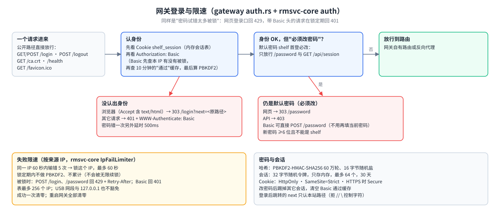
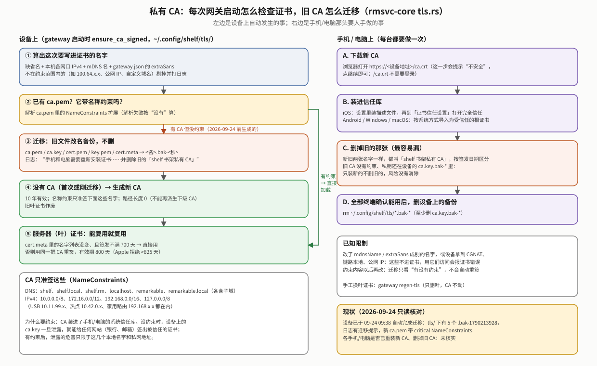
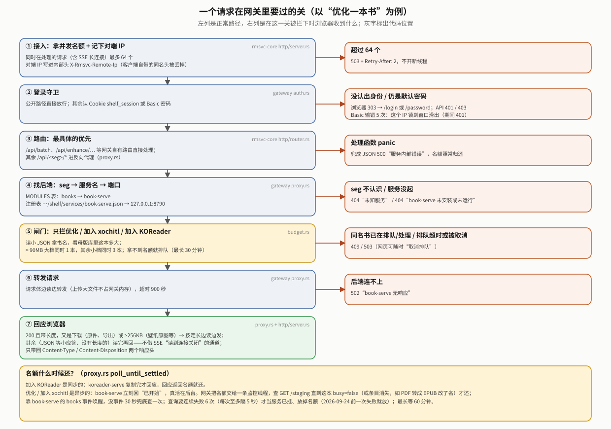
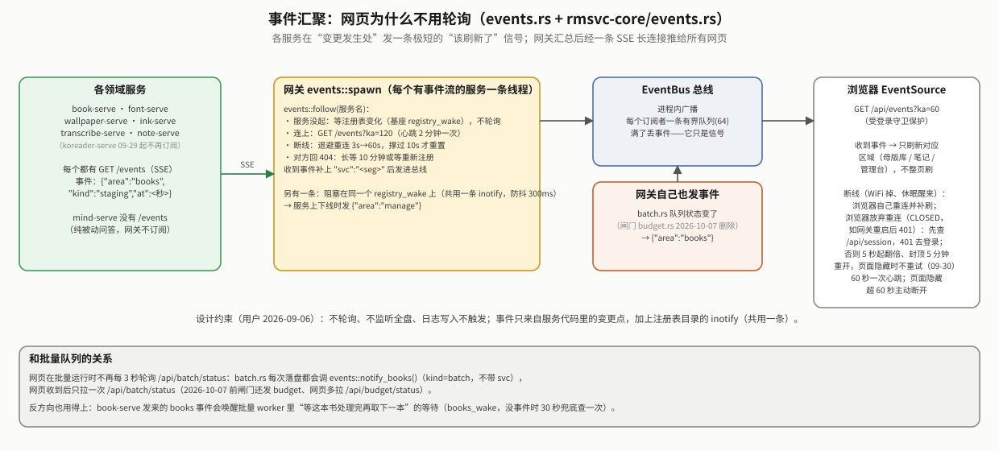
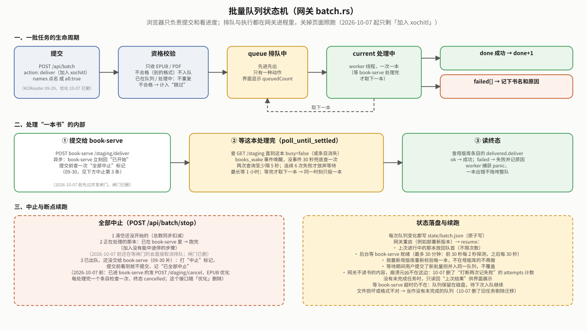
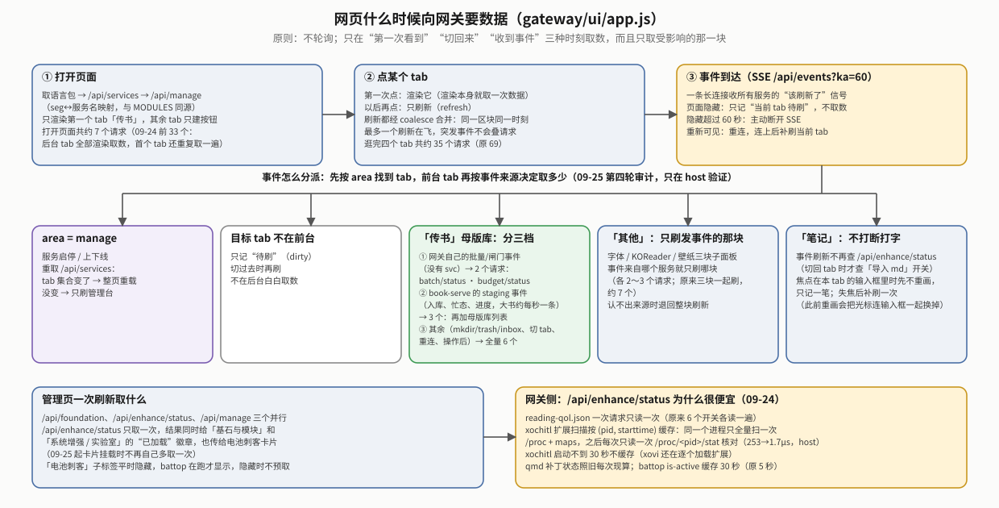
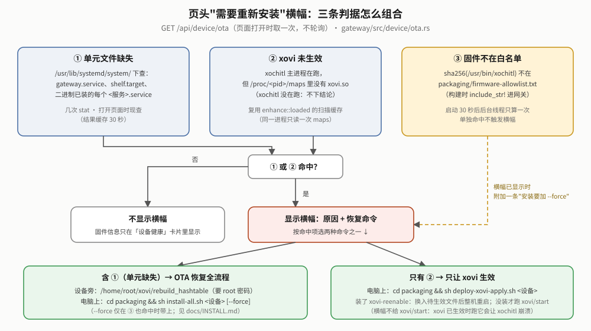

# reMarkable 设备端网关（gateway）白皮书

> **读者与用途**：维护网关，或想弄清“登录怎么判、请求怎么转、为什么要排队、批量怎么续跑”的人。
> 先读“现状”一节就知道网关现在是什么样；后面每章讲一个主题的现行设计，被推翻的做法只留结论和教训（完整经过在 git 历史）。
> 入口文档（构建、部署、接口速查）见 [`../README.md`](../README.md)；共用基座（HTTP、TLS、鉴权原语）见 [`rmsvc-core` 白皮书](../../rmsvc-core/docs/reMarkable设备端Web服务基座白皮书.md)；整体位置见 [`../../docs/OVERVIEW.md`](../../docs/OVERVIEW.md)。
> 所有数字和行为以 2026-09-24 的代码为准（`gateway/src`、`gateway/ui`、`rmsvc-core/src`）。

## 现状（2026-09-24）

**一句话**：网关是设备上所有网页服务的“前台”。浏览器只认它一个地址（`https://shelf.local/`），登录一次；它把请求转给后面只听本机的小服务，同时替它们排队，免得几本大书一起处理把 2GB 内存挤爆。它自己不做“书 / 笔记 / 字体”的业务。

**术语**

| 词 | 意思 |
|---|---|
| 反向代理 | 网关替浏览器去访问后端服务，再把结果带回来 |
| 注册表 | 每个服务启动时在 `$XDG_RUNTIME_DIR/shelf/services/<名>.json` 写下自己的端口；网关读这个目录就知道谁活着 |
| seg（URL 段） | `/api/books/...` 里的 `books`；`manage.rs` 的 `MODULES` 表把它对应到服务名 `book-serve` |
| SSE | 服务器单向推送的长连接；网页靠它“被通知”刷新，而不是定时去问 |
| 闸门（budget） | 按文件体积给“吃内存的操作”排队：大档同时 1 本、小档同时 3 本 |
| 批量队列（batch） | 网关自己的后台队列，一次处理一本，关掉浏览器照跑 |
| 私有 CA | 设备首次启动时自己生成的根证书；装进手机/电脑一次，浏览器就不再报“不安全” |

**关键数字**

| 项 | 值 | 出处 |
|---|---|---|
| 对外监听 | `0.0.0.0:443`（HTTPS） | `systemd/gateway.service`；`main.rs` 里的 `0.0.0.0:8778` 只是本地手动跑时的兜底 |
| 访问地址 | `https://shelf.local/`（mDNS）、`https://10.11.99.1/`（USB）、`https://<WiFi IP>/`；安卓不解析 `.local`，走热点 dnsmasq 别名 `shelf.rm` | `config.rs`、`rmsvc-core/src/mdns.rs` |
| 代理的服务 | 8 个：`books` `koreader` `fonts` `wallpapers` `ink` `transcribe` `mind` `notes` | `manage.rs::MODULES` |
| 同时处理的请求上限 | 64（含 SSE 长连接），超了回 503 | `rmsvc-core/src/http/server.rs` |
| 闸门 | > 90MB 大档同时 1 本；其余小档同时 3 本；排队最长 30 分钟 | `budget.rs` |
| 登录限速 | 同一 IP 60 秒内输错 5 次锁这个 IP（最多 60 秒）；表最多记 256 个 IP | `auth.rs` |
| 会话 | 30 天（`sessionDays`）、只存内存、最多 64 个 | `main.rs`、`config.rs` |
| 代理超时 | 900 秒 | `proxy.rs` |
| 代理应答流式转发 | 200 且带长度，又是下载（带 `Content-Disposition`）或 > 256KB → 边读边发；其余读完再回 | `proxy.rs::STREAM_MIN_BYTES` |
| systemd | `CPUWeight=20`、`MemoryMax=192M`、`Nice=5` | `systemd/gateway.service` |
| 测试 | Rust 55 个（`cargo test`）；前端 2 个 node 测试文件共 6 项 + 1 个手动跑的浏览器冒烟（`ui/test/`） | 2026-09-24 实跑 |
| 语言包 | `zh-CN.json` / `en-US.json` 各 570 个 key（09-25），单测钉住两份一致 | `ui.rs` |

**真机验证状态**

| 项 | 状态 |
|---|---|
| 网关部署运行（`active`、`NRestarts=0`） | 真机通（2026-09-24 只读核对） |
| 私有 CA 自动迁移到带名称约束的新 CA | 设备端已发生（2026-09-24 09:38，日志与 `.bak-*` 文件可见）；**各手机/电脑是否已重装新 CA、删掉旧 CA：未核实** |
| 批量优化、中途停止、网关重启后续跑 | 真机通（2026-09-20） |
| 批量“加入 xochitl / 加入 KOReader” | **未在设备上跑**（代码路径与批量优化相同，只是端点不同） |
| 闸门“两本大书真的串行、内存峰值不叠加” | **从未在真机验证**。09-24 修掉了“查询失败一次就提前放名额”，但那只有单元测试覆盖 |
| 09-24 的按 IP 限速、`next` 校验、流式下载、断网兜底、扩展加载检测 | 单元测试通过；流式下载有真机修复记录（见 §02）；**其余未在真实手机/电脑浏览器上验证** |
| 母版库新界面的真实触屏交互、暗色模式 | **未在真机/真手机验证**（09-24 用 mock 后端在 390/1280 宽 × 亮暗 × 中英截图走查过） |
| 09-24 第三轮审计：代理大应答流式、`/api/enhance/status` 缓存、改密码 PBKDF2 挪锁外、前端按 tab 懒加载与一批界面修复 | **只在 host 验证**（单元测试 + mock 后端截图走查），未部署到设备 |

## 01｜登录与安全

### 1.1 HTTPS 与私有 CA

- 首次启动在 `~/.config/shelf/tls/` 生成私有 CA（`ca.pem`/`ca.key`，10 年）和服务器证书（`cert.pem`/`key.pem`，800 天；Apple 平台拒绝超过 825 天的证书）。
- **什么时候换服务器证书**：证书里的名字列表变了（比如换了 WiFi、IP 变了），或者签发满 700 天。换的时候 CA 不变，已装 CA 的手机/电脑不受影响。手工换：`gateway regen-tls`（只删服务器证书，下次启动用同一个 CA 重签）。
- **名称约束（2026-09-24 起）**：CA 只准签 `shelf`、`shelf.local`、`shelf.rm`、`localhost`、`remarkable`、`remarkable.local`（及子域）和 `10/8`、`172.16/12`、`192.168/16`、`127/8` 这几段 IP，而且不能再派生下级 CA。原因：CA 装进了手机/电脑的系统信任库，不加约束的话，设备上的 `ca.key` 一旦泄露就能给任何网站签出被信任的证书。约束外的名字/IP 在签发时被剔除并打日志（否则浏览器会拒绝整张证书）。
- **旧 CA 迁移**：网关启动时如果发现 `ca.pem` 没有约束，就把 5 个文件改名为 `<名>.bak-<秒>`（不删），重新生成 CA 和服务器证书。**用户要做的**：每台手机/电脑重新打开 `https://<设备>/ca.crt` 安装新 CA（iOS 还要在“证书信任设置”里打开完全信任），**并删掉旧的那张**——新旧两张都叫“shelf 书架私有 CA”，按签发日期区分；旧 CA 没有约束，私钥还在设备的 `ca.key.bak-*` 里，只装新的不删旧的，风险没有消除。所有终端确认能用后，可以删掉设备上的 `*.bak-*`。
- **已知限制**：把 `mdnsName`/`extraSans` 改成别的名字，或设备拿到 CGNAT(`100.64/10`)、链路本地、公网 IP 时，这些不会进证书，用它们访问会报证书错误；约束内容以后再改的话，迁移逻辑只看“有没有约束”，不会自动重签。

### 1.2 密码、会话与首登必改

- **登录方式**：网页登录页只要密码（没有用户名），成功后拿 Cookie `shelf_session`（HttpOnly；HTTPS 下 Secure；SameSite=Strict）；命令行用 `Authorization: Basic`，用户名随便填，只认密码。
- **公开路径**（不用登录）：`GET/POST /login`、`POST /logout`、`GET /ca.crt`、`GET /health`、`GET /favicon.ico`。其余请求没认出身份时：浏览器（`Accept` 含 `text/html`）303 到 `/login?next=<原路径>`，其它 401。
- **会话**：令牌 32 字节随机、只存内存（重启网关全部要重新登录）、最多 64 个（满了淘汰最早到期的）、有效期 `sessionDays`（缺省 30 天）。改密码后踢掉其它设备的会话，本会话保留。
- **首登必改**：首次启动写入默认密码 `shelf` 的哈希并置 `mustChangePassword`。改之前只放行 `/password` 和 `GET /api/session`：网页 303 到 `/password`，API 回 403。用 Basic 可以直接 `POST /password`（已证明持有当前密码，不用再填 `current`）。新密码至少 6 位（`config::MIN_PASSWORD_LEN`，登录页提示从这个常量插值）且不能是 `shelf`。
- **哈希**：`pbkdf2$<轮数>$<盐>$<摘要>`，PBKDF2-HMAC-SHA256 60 万轮、16 字节随机盐。旧版单轮 SHA-256 哈希仍能校验，改密后自动升级。PBKDF2 一律在配置锁外面算（登录、Basic 校验、改密码时核对当前密码都是；改密码这一处 09-24 才挪出来），不会让一次慢校验卡住其它请求。校验只有一处实现（`GatewayConfig::verify_hash`）。
- **登录后跳转**：`next` 只接受本站路径——必须以单个 `/` 开头，不能是 `//`，不能含 `\` 或控制字符（09-24 前 `/\evil.com` 能跳外站）。
- **忘记密码**：在设备上跑 `gateway reset-password`（回到 `shelf` 并强制改）或 `gateway passwd <新密码>`，都要重启网关生效。

### 1.3 失败限速（按来源 IP）

- **规则**：同一个 IP 在 60 秒内输错 5 次，就锁这个 IP，直到最早那次失败满 60 秒（所以最多锁 60 秒）。锁定期内不做 PBKDF2 校验（防止被并发猜密码烧 CPU），也不再累计（不会被无限续锁）。每次输错另外固定延时 500ms。成功一次清零该 IP；重启网关全部清零。
- **不同入口的回应不一样**：`POST /login`、`POST /password` 被锁时回 **429** + `Retry-After`；带 Basic 头的普通请求被锁时回 **401**（守卫在锁定期直接当“没认出身份”）。已登录会话不受影响。
- **为什么按 IP**：09-24 之前是全局计数，同一 WiFi 下任何人连续输错，主人新开会话也登不进。现在别人输错只锁他自己的地址。
- **表的容量**：最多记 256 个 IP。满了先清过期的，再淘汰“没被锁的里最久没出错的”，全都被锁时才淘汰最旧的——否则攻击者换一批地址各错一次，就能把自己被锁的 IP 挤出表外。
- **不豁免任何网段**：USB 网段 `10.11.99.0/24` 和 `127.0.0.1` 也限速，因为设备自己的 lo 别名就是 `10.11.99.1`，豁免等于给一整类请求开口子。
- **对端 IP 从哪来**：基座的 HTTP 服务器取 TCP 对端地址，写进内部头 `X-Rmsvc-Remote-Ip` 交给处理函数（`Request::remote_ip()`）；客户端自己发的同名头在头白名单那一步就被丢掉，伪造不了。细节见基座白皮书 §01。

## 02｜反向代理与服务发现

### 2.1 服务表（`manage.rs::MODULES`）

`MODULES` 是 URL 段 ↔ 服务名 ↔ 安装令牌 ↔ 显示名的**唯一事实源**：代理、管理台三态、事件订阅都从它派生，不许别处再写一份映射。

| seg | 服务 | 缺省端口 | 有 `/events` | 所属线 |
|---|---|---|---|---|
| `books` | book-serve | 8790 | 是 | shelf（母版库 / 落原生） |
| `koreader` | koreader-serve | 8791 | 是 | shelf |
| `fonts` | font-serve | 8792 | 是 | enhance |
| `wallpapers` | wallpaper-serve | 8793 | 是 | enhance |
| `ink` | ink-serve | 8795 | 是 | notes（条目库） |
| `transcribe` | transcribe-serve | 8796 | 是 | notes（手写转文字） |
| `mind` | mind-serve | 8797 | **否** | notes（问 AI，纯被动） |
| `notes` | note-serve | 8798 | 是 | notes（笔记本 / 导出） |

端口是各服务的缺省值，代理实际按注册表里写的转发。新服务接入两步：服务用 `rmsvc_core::service::run` 启动（自动注册、自带 `/health`），再在 `MODULES` 加一行。

### 2.2 路由与代理行为

- **路由优先级**：基座的 `Router` 按“最具体优先”分发（字面段多的胜、精确匹配胜尾部通配）。所以 `/api/batch`、`/api/enhance/...` 这些网关自有路由不会被 `/api/{svc}/*` 代理通配抢走，跟注册顺序无关（09-20 起；此前靠“先注册先匹配”的纪律。`main.rs` 里的注释已同步更正）。
- **转发**：`/api/<seg>/<rest>` → 剥掉 `<seg>` → `http://127.0.0.1:<端口>/<rest>`，查询串原样带上。后端直连（SSH 调试）和经网关走的是同一套路由。
- **出错**：seg 不认识 → 404“未知服务”；服务没起 → 404“`<服务>` 未安装或未运行”（网页据 `/api/services` 隐藏对应 tab）；后端连不上 → 502。
- **请求体**：边读边转发（上传大文件不占网关内存）。只有闸门拦的三个 POST 会先读一次小 JSON（上限 1MB）拿书名，再原样转发。
- **响应体**（规则只有一条：**有长度的大应答边读边发，其余读完再回**）：
  - 状态 200、后端给了 `Content-Length`，并且是下载（带 `Content-Disposition`：母版库原件、导出等，可达上百 MB）或体积超过 256KB（壁纸原图、裁图等）→ **按定长边读边发**，浏览器能显示下载进度。host 实测代理一个 60MB 应答，网关峰值内存 62.4MB → 5.0MB，输出逐字节一致。
  - 其余（JSON 等小应答、错误应答、**没有长度的应答**）→ 读完再回。
  - 只带回 `Content-Type`、`Content-Disposition` 两个响应头，其余一律丢弃，不给后端夹带 `Set-Cookie` 之类的口子。
- **为什么没有长度的就不流式**：没有长度的流在基座里只有一条路——SSE 用的“接管裸 socket、读到连接关闭为止”。09-24 第一版流式下载就是借了这条路，结果后端读完并不关连接，真机上原件下载永远收不完；随后改成带长度的走 tiny_http 定长响应（并把 chunked 阈值调到最大，否则超过 32KB 会改 chunked、丢掉长度），这一步有真机修复记录。第三轮审计（09-24，只在 host 验证）又把“有长度的大图片”也纳入流式，并让“没有长度的下载”退回读完再回，不再走那条通道。教训：SSE 通道和文件下载通道语义不同，不能混用。

### 2.3 管理台与基石探测（`manage.rs`）

- **三态**：未装（`~/.local/bin/<服务>` 不在）/ 已装未开 / 已开（注册表里有）。开关 = `systemctl start/stop`（只省后台占用，不是省电）；卸载 = 调设备上的 `shelf-uninstall --only <令牌>`。**安装不走网页**（不让网页去 remount `/usr` 装系统单元），未装的模块只给引导。网关自己不能从网页关或卸。
- **外部命令有超时**：`systemctl` 30 秒、卸载脚本 180 秒；超时就 kill，输出用单独线程排空（防止输出太多把子进程写阻塞）。
- **基石探测** `GET /api/foundation`：只读检查 xovi、appload、qt-resource-rebuilder、KOReader、WeRead（外部第三方 app，`SHELF_WEREAD_ROOT` 可覆盖路径）装没装。WeRead 不进 `MODULES`（没有服务，只探测）。

## 03｜事件推送

- **原则**（用户 2026-09-06 定）：不轮询、不监听全盘、日志写入不触发。事件只来自服务代码里的变更点，加上注册表目录的 inotify。
- **汇聚**：`Hub::spawn` 为 `MODULES` 里有 `/events` 的每个服务起一条线程，跑基座的 `events::follow`（服务没起就等注册表 inotify；连上用 `?ka=120`，两分钟一次心跳；断线 3 秒→60 秒指数退避；对方回 404 就长等 10 分钟）。收到的事件补上 `"svc":"<seg>"` 后发进网关总线。另一条线程监听注册表目录（防抖 500ms），服务上下线时发 `{"area":"manage"}`。
- **网关自己也发**：`batch.rs` 每次落盘、`budget.rs` 每次排队状态变化，都经 `events::notify_books()` 发 `{"area":"books","kind":"batch"|"budget"}`（不带 `svc`，以此和 book-serve 自己的事件区分）。网页收到这类事件**只重取** `/api/batch/status` 和 `/api/budget/status` 两个接口，不整页刷新母版库（09-24 起；此前每条都全量刷新，5 条事件 12 个请求，现在 4 个）。批量运行时也不再每 3 秒轮询。
- **反过来驱动闸门**：book-serve 发来的 `books` 事件还会唤醒闸门里“等这本书处理完再还名额”的线程（见 §04）。
- **浏览器侧**：`new EventSource('/api/events?ka=60')`，60 秒一次心跳。收到事件只刷新对应区域；不在前台的 tab 只记“待刷”。页面隐藏超过 60 秒就主动断开 SSE（锁屏的手机不再让设备为它保活），重新可见时重连，重连成功后补刷当前 tab，断开期间的事件不会漏掉效果。前端完整的取数时机见 §5.1 的图。

## 04｜闸门与批量队列

### 4.1 为什么放在网关

漫画优化做完后真机测出：优化、超限分卷投递的内存峰值约等于文件体积本身（245MB 的书优化峰值 206MB）。`book-serve`/`koreader-serve` 的忙锁按书名分别加，点不同的书互不阻塞；设备只有约 2GB 内存，`systemd MemoryMax` 又没真正生效，同时点几本大部头会线性叠加，是真实的 OOM 风险。用户要求按内存用量限流，而不是按操作个数。

三个服务是独立进程，进程内的锁天然不跨进程；而网关是这三个操作**物理上唯一必经**的转发关口，放在这里用一把进程内的锁就够，不需要跨进程锁、共享内存或 IPC。批量队列放网关是同一个理由，而且批量里每一本也要过同一道闸。

### 4.2 闸门（`budget.rs`）

- **拦哪些**：只拦三个 POST——`book-serve` 的 `staging/optimize`（优化）、`staging/deliver`（加入 xochitl）和 `koreader-serve` 的 `books/adopt`（加入 KOReader）。其余请求（包括大文件上传）照常纯流式转发。
- **怎么分档**：看母版库里这本书的文件体积。**大于 90MB** 是大档，同时最多 1 本；其余小档，同时最多 3 本。两档各自计数、互不占对方名额（所以最坏是 1 本大的 + 3 本小的同时跑）。90MB 和 book-serve 的 xochitl 上传硬限恰好相同，是巧合，语义不同，不做同步。不做“按字节精算”，因为没有足够数据给出各操作的内存倍率，量化是假精确。
- **等名额的三种结局**：拿到名额放行；等满 30 分钟超时（503）；被取消（503）。同名书已在排队或处理中 → 直接 **409**（排队表以书名为键，同名并存会互相抹掉记录，第二个还取消不掉）。
- **跨会话可见、可取消**：`GET /api/budget/status → {pending, active}`；`POST /api/budget/cancel {name}` 只对还在排队的生效，已经在跑的救不回来（如实返回 `cancelled:false`）。状态在网关进程里，关掉浏览器、换设备都看得到（09-19 前这些是标签页里的 JS 状态，关页就丢）。
- **名额什么时候还**（最容易出错的地方）：
  - 加入 KOReader 是同步的（复制完才回应），回应返回名额就还。
  - 优化 / 加入 xochitl 是异步的：book-serve 立刻回“已开始”，真活在后台。网关把名额交给一条监控线程，查 `GET /staging` 直到这本 `busy=false`（或条目已消失，比如 PDF 转 EPUB 改了名）才还，最长 60 分钟。平时靠 book-serve 的事件唤醒，没事件 30 秒兜底查一次。
  - **查询要连续失败 6 次**（每次至多隔 5 秒）才当服务真挂了、放掉名额。09-24 前一次失败就放，而大书优化时 book-serve 正忙、10 秒查询超时最容易撞上，于是第二本大书被提前放进来——闸门在最该起作用的时候失效。

### 4.3 批量队列（`batch.rs`）

- **接口**：`POST /api/batch {action: optimize|deliver|koreader, names?: [...], all?: true, folder?}` → `{queued, skipped}`；`GET /api/batch/status`（`running`、`action`、`total`、`done`、`current`、`queued`〔前 200 个〕、`queuedCount`、`failed[]`）；`POST /api/batch/stop` → `{cleared}`。
- **资格**（和界面底部栏按钮同一套）：优化 = EPUB/PDF 且还没优化；加入 xochitl = EPUB/PDF；加入 KOReader = KOReader 已装。不适用的和重复入队的计入 `skipped`（`all:true` 时不适用的是预期筛选，不计）。
- **执行**：后台 worker 线程**一次一本**（设备双核，优化内部已经在并行处理图片）。一个队列里可以混合三种动作。每本先过闸门，再直连对应服务；异步的等到 `busy=false`，再读母版库条目的 `delivered.<kind>` 判成败（`failed`/`cancelled` 记入 `failed[]`）；加入 KOReader 成功后替 book-serve 记一笔 `staging/mark`。worker 用 `catch_unwind` 兜住 panic，只让这一本失败（release 是 `panic="unwind"`）。
- **落盘与续跑**：每次状态变化原子写 `~/.local/state/shelf/batch.json`（序列化与写盘在同一把锁里，防止旧快照后写把队列回退）。网关启动时 `resume`：先把队列装进内存，后台等 book-serve 就绪（最长 30 分钟，前 30 秒每 2 秒探测、之后每 30 秒），再按最新母版库重新校验（已优化的不重做）；超时也**保留**队列，等下次入队一起跑。
- **防崩溃循环**：每项记 `attempts`，处理途中网关崩了最多重放 1 次；第二次还没走完就记失败跳过，免得某本书稳定触发崩溃时被 systemd 拉起后无限重放。
- **全部中止**：清空还没开始的；正在处理的那本如果还在等闸门就取消排队，已进 book-serve 就发 `POST /staging/cancel`。EPUB 优化每处理完一个条目检查一次、按卷拆分投递每份之间检查一次，终态记 `cancelled`；单文件上传、PDF 优化没有安全中断点，只能跑完。

## 05｜网页 UI

### 5.1 怎么打包、怎么组织

- `ui/index.html`、`style.css`、`app.js`、`auth.css` 在编译期 `include_str!` 进二进制，拼成**一个零外链的单文件页面**；格式白名单从 `rmsvc_core::formats` 注入（母版库现在只收 EPUB/PDF），网页 `accept` 和服务端上传门同源。
- **顶层标签**：传书（入库 / 母版库）· 笔记（浏览 / 整理 / 回收站 / 导入 md〔实验室开关打开才显示〕）· 其他（xochitl 字体 / KOReader / 壁纸，按注册表里有哪些服务动态出现）· 管理（基石与模块 / 设备健康〔09-25〕/ 模型管理 / 系统增强 / 电池刺客〔battop 在跑才显示〕/ 实验室）。
- **i18n**：`ui/locales/{zh-CN,en-US}.json` 各 570 个 key（09-25），`GET /ui/locales/{lang}` 下发，不认识的语言落中文。后端直接吐给前端的字符串（如 `MODULES.label`）绕过了翻译管线，前端优先查 `manage.modules.label.<seg>`，语言包里没有才用后端的中文（注意 `T()` 缺 key 时返回 key 本身，不能写成 `T(k)||兜底`，09-24 修过这个永远不生效的兜底）。
- **安全**：外部数据（文件名、书名、转写、AI 回答、服务端错误）插入 `innerHTML` 前统一经 `esc()` 转义（09-20 修存储型 XSS）。
- **什么时候取数**（09-24 第三轮审计，只在 host 验证）：各 tab **第一次切过去才渲染**（渲染本身取一次数据），之后切回来只刷新；打开页面的请求从 33 个降到 7 个，逛完四个 tab 从 69 降到 35。管理页一次刷新并行取三个接口，`/api/enhance/status` 只取一次。事件怎么分派到各 tab 见下图和 §03。

  

- **界面规则**（09-24 截图走查后定下，改样式时别破坏）：
  - 触屏设备（`@media (pointer:coarse)`）上按钮、页头链接、语言下拉、开关的可点区域撑到约 40px（原来 29～32px，勾选框只有 17px）；只撑热区不放大字号，桌面鼠标不受影响。
  - 标签栏吸顶位置跟着页头实际高度走：`app.js` 用 `ResizeObserver` 把页头高度写进 CSS 变量 `--hdr-h`（英文界面在手机上页头会折两行，原来写死的 2.9em 会让标签栏钻到页头底下）。只在尺寸变化时回调，不轮询。
  - `search`/`number`/`password` 输入框也套站内输入框样式（原来显示成浏览器默认小框，暗色下尤其难看）。
  - 列表行右侧按钮组放不下时整组换行靠右，不把名字挤成竖排；回收站条目的徽章单独一行。
  - 新建 DOM 统一用 `el()` 帮手，不再手写 `createElement` 样板。
- **断网兜底**（09-24）：`fetch` 在设备休眠、WiFi 断开、网关重启时会直接抛 `TypeError`，之前没接住，开关一直灰着、按钮没反应。现在统一的 `j()` 把它转成“网络连接失败”提示；401 跳登录、403 跳改密码。
- **测试**：`ui/test/net.test.mjs`（断网兜底）、`xss.test.mjs`（转义）、`smoke.puppeteer.mjs`（冒烟：SSE 断开/重连、搜索防抖等）；CI 跑 `node --check` 和两个 `*.test.mjs`（node 内置测试，零 npm 依赖，共 6 项）；浏览器冒烟不进 CI，本地手跑（puppeteer 或 playwright 都行，09-24 起覆盖“排队事件不触发全量刷新”）。人眼走查工具见 [`../tools/screenshot-walkthrough/README.md`](../tools/screenshot-walkthrough/README.md)。

### 5.2 母版库页（`app.js` 的 `renderTransfer`/`stgRow`，`style.css` 的 `.stg-*`）

09-20 按用户汇总的要求重做（推翻了“每行一个主按钮 + ⋯ 菜单、PC 两列”的第一版），之后别加回单条按钮：

1. **加入位置**：xochitl / KOReader 两个常驻下拉在同一行，带“＋ 新建文件夹…”。xochitl 新建走 book-serve 的建文件夹队列（xochitl 里的 QML 代理 `shelf-mkdir-agent.qmd` 用长轮询 `GET /mkdir/pending?wait=290` 等着（09-24 前 25 秒），有人入队就立刻建；09-22 前是 8 秒一次定时拉。界面等文件夹出现再选中）；KOReader 走 `POST /books/mkdir`（幂等）。
2. **搜书名**：输入框带建议（系列名 + 每本书名）。清爽书名去掉下载站 `-- 作者 -- hash` 尾巴，完整名在提示里。
3. **行内只显示**书名、类型、大小、状态、进度；只有处理中/排队时才有一个“停止 / 取消排队”按钮（手机上放在书名下面一行，09-24）。
4. **所有操作在勾选后的底部操作栏**，分三行（09-24 排布）：第一行“已选 N 本 / 清除选择”；第二行主操作“优化 / 加入 xochitl / 加入 KOReader”等分一行，按钮上的小角标是“可处理数”，0 就置灰；第三行“下载原件 / 改名 / 删除”（多选时只剩删除，靠右一格）。窄屏（≤34em）去掉“加入”前缀，≤22.5em 再缩字号；按钮不折行、等高。运行中底部栏变成进度 + 全部中止。
5. **PC 和手机同一套单列布局**；真分页（每页 25/50/100，PC 页码，手机上一页/下一页）；“全选当前筛选”“优化全部待优化（N）”。
6. **验证方式**：无头浏览器在 320/360/390/414/1024/1280 宽下逐状态量 `scrollWidth`，无横向溢出、无截字。真实触屏交互未验证。

原件下载、改名、原 PDF 恢复、笔记全文搜索、导入 KOReader 批注这些 09-23/24 新功能，业务逻辑在 book-serve / note-serve，网关只是页面宿主，细节见书架与笔记白皮书。

## 06｜系统增强接口（`src/enhance/`）

网关自己的固定能力，不经注册表、不代理。刻意不升成独立服务：它们只是“网页开关薄薄一层”（同机文件读写 + `systemctl`），没有独立进程边界的必要。

| 接口 | 作用 |
|---|---|
| `GET /api/enhance/status` | 返回下面六个开关、battop 状态，以及 `loaded`（扩展是否真的加载进 xochitl） |
| `PUT /api/enhance/qol` | body 里出现哪个布尔键就改哪个：`hlSnapCjk`、`hwStrokeEnabled`、`notesImportMdEnabled`、`comicMinMargin`、`tapPageTurn`、`rtlPageTurn`；一个都没有回 400 |
| `POST /api/enhance/battop/{start\|stop}` | 启停电池刺客（`systemctl`） |
| `GET /api/enhance/battop/summary` | 原样返回 battop 的 `summary.json`；还没数据时 `available:false` |

- **开关存哪**：`~/.local/share/cangjie-ime/reading-qol.json`（与设备原生设置页、langhook C hook 共用）。写法是“整份读进来、只覆盖要改的键、其余原样写回”，进程内串行化，所以不认识的键不会丢。
- **缺省值**：`hlSnapCjk` 缺省开（荧光笔汉字吸附）；`notesImportMdEnabled`、`comicMinMargin` 缺省关（新功能要手动去实验室打开）；`tapPageTurn`（单击翻页）、`rtlPageTurn`（日漫翻页规则）缺省关 = xochitl 原生行为，由 `reader-page-turn.qmd` 每次打开书时读，切换后下次打开书生效（细节见系统增强线白皮书）；`hwStrokeEnabled` 是派生开关——`hwStrokeNibMinRatio < 1.0` 就算开，网页写入时两个 ratio 同步写 `0.6`（开）或 `1.0`（关），精调字段留给手改文件。
- **页面位置**：荧光笔吸附、阅读器翻页（单击翻页 + 日漫翻页规则）和电池刺客开关卡片在「管理 → 系统增强」；battop 在跑时多出一个「电池刺客」子标签放详细数据；手写笔迹优化、漫画页边距最小化、导入 md 在「管理 → 实验室」。
- **扩展加载检测**（09-24，`enhance/loaded.rs`）：开关只反映配置，看不出 `.so` 到底有没有进 xochitl——历史上两次“开关开着其实没生效”（09-09 langhook 整个从设备上消失；GLIBC 版本不符让 hw-stroke 静默加载失败）。现在直接读 xochitl 主进程（`comm==xochitl` 且父进程是 1，排除渲染用的同名子进程）的 `/proc/<pid>/maps`：映射了哪个 `extensions.d/*.so` 就是真加载了，网页显示“已加载 / 未加载 / xochitl 未运行”。qmd 补丁（如 `shelf-comic-margins.qmd`）不是 `.so`，按“qt-resource-rebuilder 在进程里 + 补丁文件早于 xochitl 启动”推断为已载入，文件比进程新则显示“待重启”——这是按加载机制推断，看不到 qmd 里的定位是否全部命中（阅读器翻页的 `reader-page-turn.qmd` 同理）。导入 md 只标“网页功能”（不需要往 xochitl 里加载东西）。
- **这个接口很常被调**（管理页每次刷新、每个 manage 事件、笔记页每次刷新），所以 09-24 第三轮审计给它做了缓存（只在 host 验证）：`reading-qol.json` 一次请求只读一次（原来六个开关各读一遍）；xochitl 扩展扫描按 **(pid, 进程启动时刻)** 缓存——同一个 xochitl 进程只全量扫一次 `/proc` 和它的 `maps`，之后每次只读一次 `/proc/<pid>/stat` 核对还是不是同一个进程（host 合成数据 253µs → 1.7µs）。启动不到 30 秒的 xochitl 不缓存，因为 xovi 还在逐个加载扩展、映射可能不全；qmd 状态看的是文件修改时间，照旧每次现算。
- **battop 的边界**：battop 已改成常驻进程，把“每次启动都做一次 cgroup 迁移”从每天 144 次降到“用户手点几次”；但每次 `systemctl start` 仍是同类操作，网页没做防连点，短时间反复启停理论上会复现旧事故的触发条件（事故见 `enhance/battop/FINDINGS.md`）。`systemctl is-active` 结果缓存 30 秒（09-24 前 5 秒；网页启停会主动清缓存，只有 battop 自己崩掉时网页最多晚 30 秒显示“已停”）。

## 06b｜设备健康、OTA 横幅与遗留清理（`src/device/`，2026-09-25）

跟 §06 一样是网关自身固定能力。**全部只在 host 上验证过（单元测试 + 无头浏览器截图），没有上真机。**

| 接口 | 作用 |
|---|---|
| `GET /api/device/health[?fresh=1]` | 「管理 → 设备健康」卡片的数据；结果缓存 15 秒，刷新按钮带 `fresh=1` 现采 |
| `GET /api/device/ota[?fresh=1]` | 页头横幅：`{needsReinstall, reasons, missingUnits, recovery, firmware}`；缓存 30 秒 |
| `GET /api/device/cleanup` | 可清理的遗留文件 + xochitl 书库里的 EPUB/PDF（只读） |
| `POST /api/device/cleanup/delete {area, names}` | 逐个删除遗留文件，逐项回报成败 |

**设备健康（`health.rs`）**：只在用户切到这个子标签、或点「刷新」时采集，不跟管理页的 SSE 刷新走，也没有任何定时器。一次采集只 fork **两个**子进程——一个 `systemctl show -p … <全部单元>`（xochitl、`xovi-reenable`、gateway 加 `MODULES` 里的 8 个服务），一个 `journalctl -b -1`——其余都是读 `/proc` 和 `stat`：

- 开机时长（`/proc/uptime`）；各单元 `ActiveState`/`NRestarts`/`MainPID`，MainPID 的 `VmRSS`/`VmHWM`（`/proc/<pid>/status`）；
- 最近一次启动的时刻与耗时：`ActiveEnterTimestampMonotonic`（开机后第几秒进入运行）减 `InactiveExitTimestampMonotonic`（含 `ExecStartPre`，oneshot 含整个 `ExecStart`）。服务开机后被重启过，显示的是重启那次；
- xochitl 主进程（取 systemd 的 MainPID）的 `maps`：有没有 `xovi.so`、映射着哪些 `extensions.d/*.so`，以及行尾带 ` (deleted)` 的扩展——换了文件还没重启 xochitl。这里**每次现读 maps**，不用 §06 那份按进程缓存的扫描结果，因为 `(deleted)` 会在同一个进程的生命期里变化；
- 待换入区 `~/.cangjie-stage/so-pending/` 里的文件（与 `packaging/devlib.sh` 的 `CJ_SO_PENDING_DIR` 缺省同一路径）；
- 上次开机的最后 20 行 journal（`journalctl -b -1 -n 20 --no-pager`，超时 10 秒）：设备冻死或意外重启后，这是设备自己能拿到的线索；journal 没持久化时拿不到，整块不显示。飞行记录仪日志在宿主机上、不在设备上，网关读不到，所以不看它；
- `/home` 剩余/总空间（`statvfs`，不 fork `df`）；固件哈希（见下）。

**OTA 横幅（`ota.rs`）**：OTA 冲掉 `/usr/lib/systemd/system/` 下我们的单元和 `/etc` 里的 xovi 加载配置，`/home` 保留，所以"网关能打开"不代表装好了（二进制在 `/home`，可能是被手动拉起的）。

| 判据 | 怎么查 | 触发横幅 |
|---|---|---|
| 单元文件缺失 | `gateway.service`、`shelf.target`，加上二进制已装的每个服务的单元，在 `/usr/lib/systemd/system/` 里不在 | 是 |
| xovi 未生效 | xochitl 主进程在跑、`maps` 里没有 `xovi.so`（复用 §06 的扫描缓存）；xochitl 没在跑就不下结论 | 是 |
| 固件不在白名单 | `/usr/bin/xochitl` 的 sha256 不在构建时 `include_str!` 进来的 `packaging/firmware-allowlist.txt` | 否，只在横幅已显示时附一条"安装要加 `--force`" |

- **固件哈希单独不触发**：用 `install-all.sh --force` 装在新固件上之后，新哈希只追加进 host 的 `firmware-allowlist.local.txt`，网关构建时看不到；这时再弹横幅就是永久误报。
- **什么时候算**：哈希由启动后的后台线程**只算一次**（先等 30 秒避开开机高峰，64KB 缓冲流式读）；OTA 一定伴随整机重启，网关随之重启，不用再算。另两条是几次 `stat` 加已缓存的扫描，打开页面时现查（缓存 30 秒）。任务原本要求"启动时算一次"，没照做的原因：OTA 后照横幅重装，`install-all.sh` 只重启有变化的服务，网关多半不重启，启动时定死的结果会让恢复完横幅还挂着。
- **恢复命令**（按 `docs/INSTALL.md`「固件升级（OTA）之后」）：缺单元 → 设备旁 `xovi/rebuild_hashtable`，电脑上 `cd packaging && sh install-all.sh <设备>`（固件也不在白名单时带 `--force`）；只是 xovi 没生效 → `sh deploy-xovi-apply.sh <设备>`，由它判断该 `xovi/start` 还是 `systemctl restart xochitl`（xovi 已生效时跑 `xovi/start` 会让整机重启，所以横幅不直接给这条命令）。
- 页面打开时取一次，可以点 × 在本次会话里关掉；不轮询。
- **已知误报面**：dm-verity 激活、单元从没装进 `/usr` 的设备（`deploy-usr-unit.sh` 会跳过写入）会一直显示"缺单元"。在 host 上跑网关也会显示（没有这些单元）。

**遗留清理（`cleanup.rs`）**：

- **`~/.local/state/shelf/books/done/`**：09-03 早期直投流程的遗留目录。全仓 grep 过 `rs/sh/qmd/js/py/lua`，没有任何代码读写 `books/done`。网关列出里面的普通文件（不递归，符号链接和子目录不列），用户勾选、二次确认后逐个删除。
- **删除的安全规则**（仓库出过清理时 `rm -rf` 掉用户漫画目录的事故）：前端只能传清理区代码（`books-done`）和文件名，不能传路径；名字必须是单段（拒绝空、`.`、`..`、含 `/` `\` NUL）；清理目录本身不能是符号链接；目标不能是符号链接、必须是普通文件；两边 `canonicalize` 后目标的父目录必须恰好是清理目录；只用 `remove_file`，从不整目录删。测试覆盖了 `..`、`../兄弟文件`、子目录里的文件、绝对路径、指向外面的符号链接、被换成符号链接的清理目录、未知清理区，全部拒绝且文件原样还在；删除类测试把 HOME 和全部 XDG 变量指到临时目录，并断言真实 HOME 下同名目录前后一致。
- **xochitl 书库里的旧版重复副本**（书架白皮书真机待办第 8 条）：以前按卷拆分投进去的分卷，书名来自原书目录（如"第01卷"），跟新版整本的书名对不上，**没有精确的识别规则**，所以不自动挑、不预先勾。网关只读列出书库里活的 EPUB/PDF（手写笔记本不列），标出"同名 ×N"供人工核对；勾选后前端逐本调 book-serve 已有的 `POST /api/books/trash/add {uuid,name}`，走 `shelf-trash-agent.qmd` 里 xochitl 自己的 `selectionMoveToTrash`（进回收站、可恢复）。**网关不直接删、不改 xochitl 目录里的任何文件**。回收站代理没载入 xochitl 或 xochitl 没在跑时，页面会提示"排进队列要等它生效"。

## 07｜构建、部署与 systemd

- **依赖**：只依赖顶层 `../rmsvc-core`；不依赖 `shelf/crates/bookconv`、`notes/` 的任何 crate；不在任何 workspace 里，是独立 Cargo 项目，自带一份 `.cargo/config.toml`（交叉编译的 CC/AR 覆盖，原因见基座白皮书 §06）。
- **构建/部署由 shelf 代管**：没有自己的 `build.sh`/`deploy.sh`。`shelf/build.sh` 顺手 `cd ../gateway && cargo build`，`shelf/deploy.sh` 把二进制和 `systemd/gateway.service` 打进同一个部署包。单独重编：`cargo build --release --target aarch64-unknown-linux-musl`。
- **release profile**：`panic="unwind"`（abort 下 `catch_unwind` 完全无效，一次 panic 就摔掉整个进程；代价是 aarch64 二进制大约 8%）。
- **systemd 单元**：`PartOf=shelf.target`；`After=home.mount network-online.target`（这是网关自己的依赖，**不牵连 xochitl 本体**）；`ExecStartPre` 先跑 `lo-alias.sh`（让 `10.11.99.1` 常驻可达，xochitl 的 `/upload` 只绑 USB 网口；源在 `enhance/lo-alias/`）和 `fc-cache`（字体索引在 tmpfs，真重启后丢），两者失败都不阻断启动；`Restart=on-failure`；`CPUWeight=20`、`MemoryMax=192M`、`Nice=5`（只降权不硬顶，交互式重活需要突发）。

## 08｜踩坑与教训

| 坑 | 根因 | 教训 / 修法 |
|---|---|---|
| 闸门在大书时提前放行（09-24） | 等异步任务完成时，一次查询失败就放名额，而大书优化时最容易查询超时 | 连续 6 次失败才放；“侦测失败”和“任务结束”要分开对待 |
| 原件下载永远收不完（09-24） | 文件下载复用了 SSE 的“读到连接关闭”通道 | 只有带长度的应答才流式、走定长响应；没长度的读完再回。两种流语义不同，不能混用 |
| 后台 tab 全部渲染取数（09-24 前） | 页面一打开就渲染所有 tab，首个 tab 还被“点击刷新”再取一遍 | tab 第一次切到才渲染；网关自己的排队事件只重取两个状态接口 |
| 排队/取消状态关页就丢（09-19） | 状态存在浏览器标签页的 JS 里，网关里排队的书照样等 | 状态放网关进程，任何会话都能看、能取消 |
| 批量第一版三个 UI 缺陷（09-19） | 前端停在兄弟分支合并前的“PDF 不能拆”假设；运行中其它按钮仍可点 | 合并兄弟分支后要回头核对前端假设；后来整个被服务端批量队列取代 |
| 开机时批量队列被覆盖（09-20） | `resume` 等不到 book-serve 就直接返回，随后一次入队把磁盘上的旧队列覆盖 | 先装进内存再等；超时也保留 |
| 同名书并存互相抹记录（09-20） | 排队表以书名为键 | 入口直接 409 |
| 「管理」页 8 个服务名漏翻译（09-11） | `MODULES.label` 是后端硬编码中文，绕过 `T()`；读代码/grep 查不出，真切一次英文才看见 | i18n 审计要扫“后端直接吐字符串”的路径，并真切语言看每页 |
| 改 `ServiceSpec.name` 担心连累别人（09-11） | 排查确认没人按这个字符串反查网关 | 改名前先 grep 反向依赖；顺手查测试假数据有没有抄旧值 |
| 独立顶层 crate 交叉编译失败（09-11） | 不继承调用方目录的 `.cargo/config.toml` | 每个独立顶层项目各带一份，详见基座白皮书 §06 |
| WeRead 装上后侧边栏没入口（09-13） | 本项目的 `koreader-sidebar-entry.qmd` 把原生“AppLoad”一级菜单项隐藏了，只拷 app 包进不去 | 在同一个 INSERT 块里加同构的 `SidebarItem`；**下结论前要反向确认“隐藏了原生入口后，新装的第三方 app 还有没有路进去”**。该 qmd 源码在 `oldbak/` |
| 想用 `/usr/bin/screenshot` 截图 | 它给 xochitl 发 `SIGUSR2`，这版固件没接这个信号，等于杀进程（连崩两次，逼近 `StartLimitBurst`） | **别再走这条路** |

## 09｜命名遗留与待办

**命名遗留（刻意不动）**：XDG 命名空间仍叫 `shelf`（`~/.config/shelf/`、`~/.local/state/shelf/`、`$XDG_RUNTIME_DIR/shelf/services/`）、systemd `shelf.target`、默认密码 `shelf`、mDNS 名 `shelf.local`、Cookie 名 `shelf_session`。它们牵连已部署设备的真实路径和已装的证书/书签，改名需要专门的迁移方案。

**待办**

- **闸门核心仍未真机验证**：两本 >90MB 的书同时点优化，看是否真的串行、`VmHWM` 不叠加。09-24 修掉了“查询一失败就提前放行”，但只有单元测试覆盖。
- 批量“加入 xochitl / 加入 KOReader”在设备上跑一遍。
- 09-24 的安全改动在真实手机/电脑上走一遍：按 IP 限速、`next` 校验、断网提示；确认每台终端已装新 CA 并删掉旧 CA，之后删设备上的 `tls/*.bak-*`。
- 母版库新界面的真实触屏、暗色模式。（xochitl“新建文件夹”：09-20 验证表记为未验证，另有 09-19 记录称已真机端到端通，两者冲突，以书架白皮书为准。）
- 09-24 第三轮审计的改动（代理大应答流式、`/api/enhance/status` 缓存、改密码锁外算、前端懒加载与界面修复）部署到设备后，核一次：下载大原件时网关 `VmHWM`、管理页“已加载”徽章在 xochitl 重启前后是否正确刷新、真实手机上的触屏热区与英文页头吸顶。
- Basic 认证每个请求都跑一次 60 万轮 PBKDF2（PC CLI 已退役，影响小，没动）。
- ~~网关直面局域网的 tiny_http 没有读超时~~：09-24 起 rmsvc-core 给每条连接设 60 秒读空闲超时（见基座白皮书 http 一节），半开/慢连接不再永久占线程。
- 命名遗留要不要处理，没有排期。

## 附｜来历

- **2026-09-11 正名搬顶层**：原名 `shelf-gateway`，在 `shelf/services/` 下。它托管的网页早不只是“书架”（笔记 tab、系统增强开关都挂在这里，网页标题 09-10 已改“秘密花园”）。用户拍板改名 `gateway`、搬到仓库顶层——“谁托管网页 UI”不等于“UI 里的功能归哪条线”。名字选 `gateway` 而不是 `hub`/`panel`：直白，也和 `*-serve` 领域服务区分开。代码里 `SPEC.name`、日志前缀、CLI 帮助都已改；上面的命名遗留没动。
- **反向代理 / 注册表 / 事件汇聚的最初决策**是在 `shelf-gateway` 时代定的，记在 `shelf/docs/reMarkable书架白皮书.md` §01（三种拆法）、§03z（事件推送）等历史节。
- **旧章节号对照**（给其他文档里的旧链接）：旧 §00b 现状总览 → 现状 + §01～§03；旧 §03b 批量/闸门/母版库页 → §04、§05.2；旧 §03c 09-24 审查 → §01.1、§01.3、§02.2、§05.1、§06；旧 §04 踩坑 → §08；旧 §05 待办 → §09。
