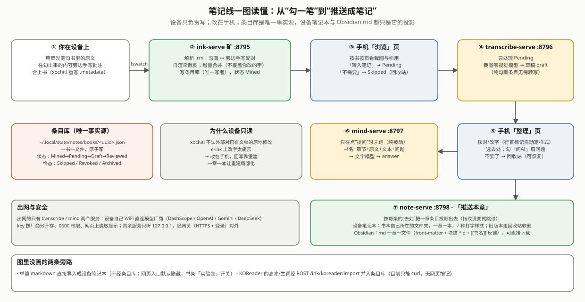

# notes —— reMarkable 笔记线

**一句话**：合上书后，把你在 xochitl（reMarkable 自带的阅读器）里用荧光笔勾的原文和旁边的手写批注自动收进一个"条目库"；你在手机网页上挑选、改字、问 AI，再推送成设备上的笔记本或 Obsidian 用的 md。

- **给谁用**：用 reMarkable 读 EPUB、习惯边勾边写的人；以及要改这四个服务的开发者。
- **怎么开始**：整包安装 `sh packaging/install-all.sh <设备IP>` 后，打开网关网页的「笔记」标签；要转写手写、问 AI，先在「管理 → 模型管理」填一把模型厂商的 key。
- **想弄懂原理**：设计决策、真机验证记录和踩坑都在 [`docs/reMarkable笔记白皮书.md`](docs/reMarkable笔记白皮书.md)（开头有"5 分钟读懂"和"现状总览"）；整个系统的位置见 [`../docs/OVERVIEW.md`](../docs/OVERVIEW.md)。

## 能做什么

reMarkable 的强项是**荧光笔勾书，再在勾出来的地方旁边手写**。笔记线在你合上书后，把这些勾画和手写自动收进一个**条目库**；你在手机网页上挑选、改字、按条目问 AI，然后按每条的“去处”推送成设备上的笔记本、Obsidian 用的 md，或两处都要。

原则：**设备只负责写，不负责改；改在手机上做；条目库是唯一事实源，设备笔记本和 md 都是从它重新生成的投影。**



- **摄取**：勾画与旁边手写自动配对；没写字的纯勾画也算一条；手写画成灰度裁图；按书的目录归章。
- **浏览**：逐条决定「转入笔记」还是「不需要」（已有定稿 / 草稿的条目转入时保留原来的进度）。
- **转写**：转入笔记的手写自动交给视觉模型识别，结果作为草稿，你在手机上改定。
- **整理**：改字、选去处、问 AI、「不要了」进回收站（可恢复）。行首写 `##` / `###` / `1.` / `-` / `- [ ]`（或手写 `口`），推送后分别变成设备笔记本内置的大标题 / 加粗小标题 / 编号列表 / 圆点列表 / 复选框，导出 md 时是对应的 markdown（对照图见白皮书第 4 章）。
- **推送**：每章一个「推送本章」，生成设备笔记本（一章一本，放进书本自己所在的文件夹；书的小节变化处自动插小标题）和 md（提示里给下载链接，点一下由浏览器下载）。内容没变就跳过；旧版笔记本几秒内自动进 xochitl 回收站。⚠ 书在文件夹里时，笔记本从 2026-09-09 起其实一直落在书库根，**10-09 才修好，未部署、未真机验证**（白皮书 8.3）。
- **全文搜索**：跨所有书搜原文、转写、AI 回答。
- **导入 md 文档**（默认隐藏）：选一个 `.md` 文件直接生成一份设备笔记本，不经条目库。

## 四个服务

都是挂在网关（[`../gateway`](../gateway/README.md)）下、只监听 `127.0.0.1` 的服务；网关 `manage::MODULES` 里登记了四行。服务之间只经 HTTP 通信，**条目库只有 ink-serve 能写**。

| 服务 | 网关前缀 / 端口 | 职责 | 出网 |
|---|---|---|---|
| `ink-serve`（矿） | `/api/ink` · 8795 | 监听书库 → 解析变更页 → 配对 → 裁图 → 写条目库；全文搜索 | 否 |
| `transcribe-serve`（转写） | `/api/transcribe` · 8796 | 订阅 ink 事件，只转写 `Pending` 条目，草稿写回 | 是 |
| `mind-serve`（脑） | `/api/mind` · 8797 | 点「提问」时调文字模型，回答写回；没有后台任务 | 是 |
| `note-serve`（本） | `/api/notes` · 8798 | 注册「笔记」tab；生成设备笔记本、导出 md、单篇 md 导入 | 否 |

**模型**：在网关「管理」tab 的“模型管理”卡片里选，视觉和文字各一张。预置了 DashScope / OpenAI / Gemini / DeepSeek 四家，key 按厂商分开存，用量按模型分账；配置不变时复用同一个调用端和 HTTPS 连接（闲置 45 秒以上重建，10-09）；限流、5xx、连不上这类瞬时故障等一下重试一次（10-09）。只有 DashScope 真机调用过，其余三家只验证了配置层。详见白皮书第 6 章。


## 主要 API（经网关前缀 `/api/<seg>`）

| 服务 | 路由 |
|---|---|
| ink | `GET /books`（只列还有活条目的书）· `GET /books/{uuid}` · `GET /books/{uuid}/crops/{file}` · `POST /books/{uuid}/entries/{id}`（改 `text` / `style` / `destination` / `draft` / `answer` / `askAi` / `question`；终态条目拒改）· `POST …/entries/{id}/request`（转入笔记）· `…/skip`（不需要）· `…/archive`（不要了）· `…/restore`（恢复）· `POST /books/{uuid}/purge`（清空回收站，不可恢复）· `POST /books/{uuid}/rescan` · `GET /search?q=&limit=` · `GET /events`；原 `POST /koreader/import` 已从仓库删除（2026-09-30），见 git 历史（KOReader 09-29 从设备卸载），以前导入的 KOReader 条目照常可用 |
| transcribe | `GET /status` · `GET /config` · `PUT /config`（`preset` / `backend` / `apiKey`（只写）/ `clearKey` / `price` / 自定义 `model`+`baseUrl` / `auto` / `maxPerRun` / `pauseMs` / `timeoutSecs` / `maxAttempts` / `prompt`）· `POST /run` · `POST /books/{uuid}/entries/{id}`（强制转写一条，返回 token 用量）· `POST /retry` · `GET /events` |
| mind | `GET /status` · `GET /config` · `PUT /config`（同上，只有 `timeoutSecs` / `prompt`，没有 `auto` / `maxPerRun` / `pauseMs` / `maxAttempts` 这些节流字段）· `POST /books/{uuid}/entries/{id}/ask`（要求已勾「问 AI」且问题非空）|
| notes | `GET /status` · `GET /books/{uuid}/sync`（每章两个去处的同步状态）· `POST /books/{uuid}/chapters/{idx}/generate` · `POST /books/{uuid}/chapters/{idx}/export` · `GET /books/{uuid}/chapters/{idx}/export.md`（浏览器下载）· `POST /books/{uuid}/import-md {title, markdown}` · `GET /events`；网页从没用过的整本生成/导出、列表、`vault.json` 等 6 个端点 2026-10-09 删掉 |

事件区域都是 `notes`：ink 发 `entries`，transcribe 发 `transcribe`（空跑且与上一轮相同的轮次不发），note-serve 发 `notebooks`；网页据此自动刷新。

## 目录

```
notes/
├── crates/rmv6/          .rm v6 解析 + 写入（解析部分剥离移植自 remarkable_lines 0.1.3，MIT，见 PROVENANCE.md）
├── crates/epubmap/       .epubindex + 目录（按 OPF 声明找 nav/NCX；OPF 与 href 解码用 ../rmsvc-core/epubpkg）→ 页号对应的章/小节
├── crates/notecore/      领域核心（纯函数）：条目模型、聚簇配对、增量合并、行首标记、投影、md 导出/导入（KOReader 合并 2026-09-30 已删，只留旧数据兼容）
├── crates/vendorcfg/     两个 AI 服务共用：预置表、key 分厂商、配置迁移、用量账本、OpenAI 兼容调用端 ChatClient + ClientCache
├── services/             ink-serve · transcribe-serve · mind-serve · note-serve
├── systemd/              四个 .service（PartOf=shelf.target）
├── testdata/             真机样本（renggu 墓碑页 / renggu_marks 勾画+手写 / seven_styles 七种打字样式）
└── docs/                 白皮书 + diagrams/（overview · architecture · data-flow · entry-status · marker-styles · model-config · organize-page · push-notebook · robustness）
```

网页在网关里：[`../gateway/ui/app.js`](../gateway/ui/app.js) 的 `renderNotes`（浏览 / 整理 / 回收站 / 导入 md 文档四个子视图，顶部是选书、重扫和搜索框）与 `mountModelPanel`（模型管理卡片）。

## 设备上的路径（XDG，HOME=/home/root）

| 用途 | 路径 |
|---|---|
| 二进制 | `~/.local/bin/{ink-serve,transcribe-serve,mind-serve,note-serve}` |
| 配置 | `~/.config/notes/{ink,transcribe,mind,note}.json`（含 key 的两份权限 0600） |
| 数据 | `~/.local/share/notes/crops/`（裁图）· `~/.local/share/notes/vault/`（md 导出） |
| 状态 | `~/.local/state/notes/books/<uuid>.json`（**条目库**）· `notebooks/`、`exports/`（每章推送记录）· 用量账本；任何一份 JSON 解析失败时，旁边另存 `*.json.corrupt`（只留第一份坏内容） |
| 只读 | xochitl 书库 `~/.local/share/remarkable/xochitl/`——**绝不写** |

## 构建与部署

与书架共用交叉编译环境（`rustup target add aarch64-unknown-linux-musl` + aarch64 交叉 gcc），见 [`../shelf/README.md`](../shelf/README.md)「构建 · 部署 · 卸载」。

```sh
cd notes && cargo test --workspace      # host：241 过 + 1 忽略（rmv6 29 · epubmap 11 · notecore 67 · vendorcfg 24 · ink 30 · transcribe 25 · mind 22 · note 33 另 1 个 ignored；2026-10-09 实跑）
cd ../shelf && sh build.sh               # host 测试 + 交叉编译（notes/ 在就一起编）
cd ../packaging && sh deploy.sh <设备IP> --only ink,transcribe,mind,note   # 只装/更新笔记线（网关总会一起装）；不加 --only 就全装
```

卸载走书架 `uninstall.sh`；条目库不在 `--purge` 范围内。

## 还没做的

完整清单见白皮书第 13 章，要点：

- 网页渲染和交互没有人眼确认过（后端链路都真机走通了）；
- 转写准确率：汉字数字常被认成阿拉伯数字，手写 `##` 标记还没有一次被正确识别的真机例子；
- OpenAI / Gemini / DeepSeek 没用真实 key 调用过；
- 全文搜索没用真实数据核对；
- 书的小节名插行只有单测（真机验证用的书目录是平铺的）；
- 2026-09-24 第三轮审计的改动，摄取这半边 09-25 真机核过；转写记账、>100 MB 大书、推送串行化已部署但没在真机上专门核，见白皮书第 2 章「可靠性要点」；
- 2026-09-25 第四轮审计的改动（擦掉又回来的笔迹复活原条目、`.metadata` 读不了不当成书被删、章判据统一、小数不当编号等）09-25 已部署，但没在真机上逐项核，见白皮书第 13 章 7d；
- 2026-09-30 第五轮审计的改动（epubmap 按 OPF 声明找目录、启动重扫没章的条目、灰度裁图 + 像素封顶、「转入笔记」继承定稿、正被写的 `.rm` 跳过、删没人用的裁图、调用端复用）**09-30 已部署**，部署自检通过，但功能还没手测（包括"旧条目重启后归上章"），见白皮书第 13 章 7e；
- 2026-10-09 第六轮审计的改动（笔记本落进书所在文件夹、调云重试一次与闲置连接重建、epubmap 解 XML 实体、认领改等 inotify 等）**未部署、未真机验证**，见白皮书第 13 章 7g。

用户已决定不改的：编号列表被〔原文〕/〔AI〕段打断会从 1 重来；没转写的条目写“（待转写）”占位。
