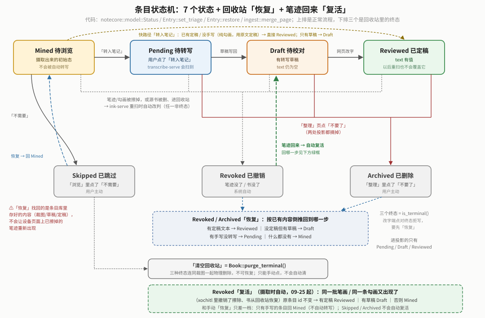

# notes —— reMarkable 笔记线

书架（`shelf/`）补读书短板，笔记线做强 reMarkable 的强项：**荧光笔勾书 + 在勾出来的内容旁边直接手写**。合上书自动摄取成条目（浏览页里挑要转笔记的、不要的直接跳过），手机整理页里修正转写、勾选按条目问 AI；每条内容可以选去哪——设备笔记本、Obsidian、或者干脆不要了；设备笔记本与 md 都由条目库投影生成。**不引入任何旧 `knowledge/pkm` 代码**，只借鉴功能与踩坑。决策/真机/踩坑见 `docs/reMarkable笔记白皮书.md`（开头「现状总览」§00b）。

## 现状（2026-09-08，三期完成）

| 服务 | seg / 端口 | 职责 | 状态 |
|---|---|---|---|
| `ink-serve` 矿 | `ink` / 8795 | 监听书库 → 只扫变更页 → 勾画 ↔ 旁边手写配对（含无手写的纯勾画） → **自渲染裁图**（笔画矢量数据画折线，不依赖缩略图）→ **条目库（唯一写者）**；零网络 | ✅ 真机 active，浏览态状态机 + 纯勾画条目 + 自渲染裁图 + 归档/清空回收站/**恢复**全部真机验证 |
| `transcribe-serve` 转写 | `transcribe` / 8796 | 订阅矿的事件 → 裁图喂视觉模型（预置下拉选，横跨 DashScope/OpenAI/Gemini/DeepSeek 四厂商，key 按厂商分开存）→ 草稿写回（行首标记自动定样式）；只处理 `Pending`（用户点了「转入笔记」的）；唯一出网之一 | ✅ 真机 active、DashScope key 已配置真调过；OpenAI/Gemini/DeepSeek 三家只验证了配置层，没有真实 key 走过调用；转写准确率还在打磨 |
| `mind-serve` 脑 | `mind` / 8797 | 按条目单发：勾选「问AI」+ 输入问题 → 拼书名+章节+勾画原文+转写文本+问题 → 文字模型（同样四厂商预置表）→ `answer` 写回；**没有批量循环/事件订阅**，纯被动等 HTTP，比 transcribe-serve 还轻 | ✅ 真机 active，端到端问答真机验证通过（DashScope） |
| `note-serve` 本 | `notes` / 8798 | 注册「笔记」tab；打包 `.rmdoc`（全部 7 种打字样式）+ 上传 + 条目→文档生成编排（网页按钮已接线）；**md 导出**（落设备 vault + 直接触发浏览器下载） | ✅ 三件套+编排+导出全部真机验证通过 |

## 三期定案：去处三选一 + 砍掉分区（2026-09-08）

用户提出：转写/校对/问答做完之后，内容最终该由用户决定去哪——落设备笔记本、落 Obsidian、还是不要了。落地：

- **`Entry.destination`**（`Notebook`/`Obsidian`/`Both`，缺省 `Both`——两处都要，不设置就是老行为）：设备笔记本投影只收 `Notebook`/`Both`，Obsidian 导出只收 `Obsidian`/`Both`。
- **`Status::Archived`**（"不要了"，软删终态，跟 `Revoked` 同类但用户主动触发）+ **`Book::purge_terminal()`**（物理清 `Archived`/`Revoked`/`Skipped`，手动触发不自动跑，回答"软删数据会不会无限扩充"——跟书级回收站"不自动清空"同一条纪律）。网页「回收站」子视图**真列出**这三种终态条目的实际内容（页码/原文/转写文本），不是一个盲清的按钮。
- **~~分区~~ 整个概念砍掉**：`Section`/`Book.sections`/`Entry.section`/`Book::section_id_for_name()` 全删——AI 触发早就是 `Entry.ask_ai`/`question` 的事（二期已做），分区兼职的"笔记本排版分组"这半也不要了，条目一律按页序平铺，格式差异全靠 `Entry.style`。手写标记 `## 文字`/`### 文字`两个都覆盖 `Entry.subhead`（不分层级，`##` 曾被误删又按用户要求恢复识别）。

## 模型管理：预置下拉横跨四厂商，key 按厂商分开存（2026-09-08 第二轮重做）

`transcribe-serve`/`mind-serve` 的 `config.rs` 各维护一张 `Preset` 表（视觉/文字分开，每条带 `provider`）：`PUT /config` 传 `preset` id，服务端查表原子设置 `model`+`base_url`，未知预置名直接拒绝；`"custom"` 是转义阀，留给真要接非预置表内厂商的 OpenAI 兼容口。预置表横跨 **DashScope/OpenAI/Gemini/DeepSeek** 四家（模型 id/baseUrl 经 WebSearch/WebFetch 核实官方文档，核实日期见 `config.rs` 模块文档；**豆包没收进预置表**——它的"模型"是账号自建的推理接入点 ID，不是通用字符串，走"自定义"接）。key **按厂商分开存**（`keys: provider→key`），切换预置不会互相冲掉、同厂商换模型不用重新粘贴；老配置文件（单一 `model`/`baseUrl`/`apiKey`）通过 `migrate()` 无损搬进新形状，真机验证过已保存的 key 升级后还在。`GET /config`/`/status` 带 `presets`+`activePreset`+`price`（当前模型单价，用户自填）+ `usageByModel`（按模型分账的用量，含花费估算——没填单价是 `null` 不是 `0`，因为**不做官方定价表**，第三方定价常变，写死一份容易把预估花费做错）。key 脱敏显示后**只剩删除按钮**，不能直接改写——要换 key 先删再填。网页入口在**「管理」tab 的"模型管理"卡片**（不在笔记专属的「整理」区）。

## 「整理」区第二轮反馈：批量勾选 + 样式自动识别 + 回收站可恢复（2026-09-08）

- **删掉转写折叠层**：「浏览」页已经决定要不要转笔记，转成 `Pending` 就该自动转写，不需要单独的"立即转写待转写条目"/"重试失败"批量按钮；`auto`（合书自动转写）开关挪进「管理」tab 的模型面板。失败的条目直接在「整理」列表里标红、按钮文案变"重转失败"，下方列表每条独立重试。
- **样式/去处两个下拉去掉**：样式改成行首标记（`-`/`1.`/`口`/`##`/`### `）自动识别——`Entry::apply_marked_text` 把转写草稿早就在用的 `notecore::marker::split_leading_marker` 规则也接到用户手动改字（`PATCH text`）上，打字跟手写是同一套约定，不用另选。去处（设备笔记本/Obsidian/都要）换成条目卡片上的紧凑图标循环按钮，点一下切下一态。
- **批量工具栏**：只留重转/不要了两个真正逐条起作用的动作——「整理」每条卡片一个勾选框，顶部固定工具栏勾选后操作；章头留「全选本章」快捷链接。
- **回收站可恢复**：`Entry::restore()`——`Skipped`/`Revoked`/`Archived` 都能恢复，按条目已有内容倒推落点（校对文本在→已校对，只有草稿→待校对，只有手写→待转写，没内容→回浏览）。书里笔画已经被擦的条目也能恢复，找回的是条目库存档（裁图/文本），不代表设备原页面笔迹重现——网页文案写清楚这条限制。每条一个「恢复」按钮 + 一个「全部恢复」批量按钮，跟「清空回收站」并排。

## 「整理」区第三轮反馈：生成/导出去重复 + 同步状态追踪 + 回收站显示去处（2026-09-08）

- **生成笔记本/导出 md 合并成一个「同步本章」按钮**：这两个操作本来就是整章一起投影，勾选条目对它们不起过滤作用，先勾选再点是绕远路；紧接着又被指出这两个按钮本身跟条目已有的「去处」字段重复——去处早就决定了该不该落笔记本、该不该落 Obsidian，合并成一个按钮内部按去处该做哪样做哪样（不动后端接口，两个端点本来就各自基于 destination 过滤）。批量工具栏收窄成只留重转/不要了。
- **同步状态追踪**：`notecore::export::fingerprint_chapter`（对齐 `project::fingerprint_chapter`，只是收 `wants_obsidian()`）+ `note-serve::export_state.rs`（`ExportState`，照抄现成的 `NotebookState`）——导出 md 现在也有"指纹没变就跳过重写"的纪律，顺带记账。`GET /books/{uuid}/sync` 给出每章设备笔记本/Obsidian md 是否跟当前条目内容同步。
- **同步后自动收起**：「整理」章头显示 📓/Obsidian 同步徽章，全同步的章节默认从列表收起（改字/新条目会让指纹变，自然又出现）。~~配「显示已同步的章节」开关随时翻出来~~——这个复选框在第四轮反馈里被双层 tab 取代，见下。
- **回收站显示去处**：每条显示去处徽章（复用「整理」区已有的图标）+ 所在章节当前的同步徽章（章节维度的参考信息，不是这条自己确认被收进去了没）。
- Obsidian 相关图标从占位 🔗 换成简化多面体 SVG（不是精确描摹官方 logo，形状+配色够认出来就行）。
- **章节默认折叠**：光收起已同步章节还不够——还没处理完的章节条目一多，照样长得划不到底（"1章10条，10章就100条"）。~~每章卡片默认只露头…点章头展开~~——这套折叠机制在第四轮反馈里也被双层 tab 取代，见下。

## 「整理」区第四轮反馈：导出状态双层 tab 取代复选框 + 按钮改名去歧义（2026-09-08）

- **顶层「未导出/已导出」双 tab + 章节第二层可点标签**：复用 `fullySynced` 判据（`notebookSynced && obsidianSynced`，没有条目要那个去处时恒真，因此两个 tab 互斥且穷尽）把章节分组，点哪个 tab、点哪个章节标签，只显示那一章的内容。比"章节默认折叠"更彻底——折叠只是不用看见内容，滚动那条轴还在；这样任意时刻屏幕上最多一章的内容，滚动本身消失。旧的「显示已同步的章节」复选框和章节折叠机制（`expandedChapters`）都被这两个新状态（`exportTab`/`selectedChapter`）取代。
- 推送完一章、它从「未导出」tab 消失后，自动跳到下一个待处理章节——不是额外写的特性，只是"选中章节必须在当前 tab 可见列表里"这条校验的副产物，正好顺手支持"一章一章处理完"的工作流。
- 每条笔记的 `.entry-head` 也贴一份章节级同步徽章（不止章头有）——受限于同步状态目前只精确到整章（不到单条），这是退而求其次的方案。
- **按钮改名去歧义**：「同步本章」→「推送本章」（"同步"暗示双向，这个按钮其实只单向推）；「重转」/「重转失败」→「重新转写」/「转写失败」（跟「浏览」视图里完全不同的另一个动作「转入笔记」共享"转"字，容易混）。

**上线后真机反馈两个真 bug（同一天，已修）**：① 选中章节校验对"编辑动作"和"推送完成"两种触发一视同仁，点条目自己的去处按钮就画面跳到别的章节——改成默认"跟随"，只有显式点 tab / 推送完成才换章；② 条目行的同步徽章直接复用整章聚合状态，导致跟条目自己去处无关的徽章也显示出来——`syncBadges` 加 `only` 参数按条目自己的 `destination` 过滤。详见白皮书 §03ab。

## 代码质量重构：vendorcfg 共享 crate + note-serve 的 ChapterStore\<T\>（2026-09-08）

用户要求"合理使用设计模式消除重复代码、合理抽象解耦"。逐文件比对后两处达到值得抽象的重复规模：

- **`transcribe-serve`/`mind-serve` 的 `config.rs`（~85% 重叠）+ `ledger.rs`（~90% 重叠）**：预置模型表选择、key 按厂商分格存取（baseUrl 兜底认厂商）、老配置迁移、PATCH 语义、对外 JSON 整形、用量按模型分账，两边逐行相同，只有各自预置表数据和 transcribe 独有的节流参数/`RunReport` 不同。新增 `notes/crates/vendorcfg`（`preset`/`usage` 两个模块）承接共享逻辑——**只抽行为不抽数据结构**，两边的 `Config`/`Usage` 结构体和落盘 JSON 形状逐字节不变。
- **`note-serve` 的 `notebooks.rs` + `export_state.rs`**：同一个"按书一文件、按章存一条记录"骨架，抽成泛型 `ChapterStore<T>`，两个原文件现在只剩记录类型定义 + 一行类型别名。

磁盘格式零风险是这次重构的第一优先级：每处改动都拿真机 2026-09-08 实测采样的真实文件形状（脱敏）写成回归测试。真机验证不止"老数据读得出来"，还真实调用了一次强制单条转写，走完整条重构后的链路（key 解析→模型调用→用量记账），用量数字正确累加。详见白皮书 §03ac。

## 「整理」区第七轮反馈：去掉批量勾选层 + 已导出改判"存在性"（2026-09-08）

- **删批量勾选**：重新转写/不要了两个操作每条已经有独立按钮，`#npickbar` 顶部工具栏、每条复选框、章头「全选本章」是纯粹的重复入口，整段删除。
- **已导出改判"是否被推送过"**：原来 tab 归属靠 `notebookSynced && obsidianSynced` 组合判断，编辑任意一条笔记的内容/落点都可能让整章指纹对不上，已导出的章节会因为一次小编辑弹回未导出。改成 `everExported`（只看 `notebookGeneratedAt`/`obsidianExportedAt` 是否非空）——推送过就稳定留在「已导出」，不再随内容编辑跳来跳去。**没有丢信息**：`fullySynced`/同步徽章还在，继续显示"这一章有没有新改动待推送"，只是从"决定进哪个 tab"降级成"已导出 tab 内的一个提示"——直接照用户原话改成"存在过就不再提示"会让这条追踪能力彻底失效，跟用户核实过方案分叉后选了保留提示这版。详见白皮书 §03ad。

## 四步闭环

```
① 合上书  ──事件驱动──►  ink-serve 矿     解析书页 .rm：勾画(GlyphRange 原文+矩形) ↔ 旁边手写(笔画簇) 几何配对（含无手写的纯勾画）→ 条目库(Mined) + 自渲染裁图
① .5 浏览 ──手机网页──►  「浏览」视图  按书→按页看裁图/引用，点「转入笔记」（Mined→Pending，纯勾画直接定稿）或「不需要」（→Skipped）
② 整理    ──手机网页──►  书架网关「笔记」tab   核对转写、选去处（设备/Obsidian/两处都要）、选样式、勾「问AI」填问题、「不要了」归档（e-ink 上改字太痛苦，设备只负责写）
③ 智能    ──按条目────►  transcribe-serve 转写手写（只处理 Pending）；mind-serve 按条目单发「问AI」问题跑文字模型
④ 投影    ──note-serve──►  书本自己所在的设备文件夹一章一本（xochitl 7 种打字样式，去处含 Notebook/Both 才投）· vault/书名/第N章.md（反链，去处含 Obsidian/Both 才投；导出既落设备盘也直接触发浏览器下载）
```


一句话原则：**设备只负责写，不负责改；改在手机，回写靠重建；条目库是唯一事实源，笔记本与 md 都是投影。**

## 架构：挂书架网关的 loopback 服务

```
浏览器 ──► shelf-gateway :8778 ──/api/<seg>/*──┬── ink-serve 127.0.0.1:8795 ──fswatch──► ~/.local/share/remarkable/xochitl（只读）
                 「笔记」tab（note-serve 注册）  ├── transcribe-serve :8796 ──订阅 ink /events──► DashScope（设备 WiFi 直连）
                 「管理」tab 模型管理卡片        ├── mind-serve :8797（纯被动，无订阅）──► DashScope（设备 WiFi 直连）
                 /api/events（area=notes）      ├── note-serve :8798 ──► xochitl /upload + vault/ 落盘
```


- 注册表 / 反向代理 / 事件汇聚 / 管理台三态全是书架的机制（`shelf/README.md`）；网关 `manage::MODULES` 加四行即接入。
- 依赖方向单向无环：`services/* → shelf-core + crates/*`；**不依赖** `bookconv` / `device-core` / `knowledge/pkm` / `reading`。
- **零 xovi 依赖**：没有 qmd、没有 .so（2026-09-09 起彻底：note-serve 不再新建/确保任何文件夹，笔记本直接复用书本自己已经在的设备文件夹，`shelf-mkdir-agent.qmd` 不再是这条线的依赖，见 §03ae）。
- 服务间只经 HTTP：条目库只有 ink-serve 写，转写/脑/本都 `POST /api/ink/books/{uuid}/entries/{id}` 改字段。

### 主要 API（经网关前缀 `/api/<seg>`）

| 服务 | 路由 |
|---|---|
| ink | `GET /books` → `{items:[{uuid,title,chapters,entries,pending}]}`（`list_active`，只列还有活条目的书）· `GET /books/{uuid}`（整份条目库：chapters/entries，**没有 sections 了**）· `GET /books/{uuid}/crops/{file}` · `POST /books/{uuid}/entries/{id} {text?|style?|destination?|draft?|answer?|askAi?|question?|subheadHint?}`（`text` 走 `Entry::apply_marked_text`——行首标记自动定样式/覆盖 subhead 并剥掉标记，不再需要网页手动传 `style`；`draft` 追加最新在前；`destination` 三期新增）· `POST /books/{uuid}/entries/{id}/request`（浏览态"转入笔记"：`Mined→Pending`，纯勾画条目直接 `Reviewed`）· `POST /books/{uuid}/entries/{id}/skip`（"不需要"：`Mined→Skipped`）· `POST /books/{uuid}/entries/{id}/archive`（三期"不要了"：`→Archived`）· `POST /books/{uuid}/entries/{id}/restore`（**第二轮反馈新增**：`Skipped`/`Revoked`/`Archived` 按已有内容倒推恢复，非终态条目拒绝）· `POST /books/{uuid}/purge`（清空回收站：物理删 `Archived`/`Revoked`/`Skipped`，不可恢复）· `POST /books/{uuid}/rescan` · `GET /events` |
| transcribe | `GET /status` → `{config(无 key), usage, usageByModel, failures, inkReachable, pending}` · `GET /config`（带 `presets`/`activePreset`/`price`）· `PUT /config {preset?, apiKey?（只写，存进当前厂商）, clearKey?, price?{input,output}, model?, baseUrl?（仅 preset="custom" 生效）, auto?, maxPerRun?, pauseMs?, timeoutSecs?, maxAttempts?, prompt?}` · `POST /run`（同步跑一轮，回 `{scanned,done,failed,skipped,left,note}`）· `POST /books/{uuid}/entries/{id}`（强制转写一条）· `POST /retry`（清失败记录再跑）· `GET /events` |
| mind | `GET /status` → `{config(无 key), usage, usageByModel}` · `GET /config`（带 `presets`/`activePreset`/`price`）· `PUT /config {preset?, apiKey?（只写，存进当前厂商）, clearKey?, price?{input,output}, model?, baseUrl?（仅 preset="custom" 生效）, timeoutSecs?, prompt?}` · `POST /books/{uuid}/entries/{id}/ask`（回答这一条，要求已勾 `askAi` 且填了 `question`，否则 400）——**没有 `/events`**，纯被动，没有需要推送的状态 |
| notes | `GET /status` · `GET /books`（各书章节生成状态）· `GET /books/{uuid}/notebooks` · `GET /books/{uuid}/exports`（各章导出状态，同上但对应 md）· `GET /books/{uuid}/sync`（每章设备笔记本/Obsidian md 是否跟当前条目同步，第三轮反馈新增）· `POST /books/{uuid}/generate`（全书按需重投影+上传）· `POST /books/{uuid}/chapters/{idx}/generate`（单章，网页已接线）· `POST /books/{uuid}/export`（全书导出 md，落设备 vault，指纹没变自动跳过）· `POST /books/{uuid}/chapters/{idx}/export`（单章，网页已接线，附带触发浏览器下载，响应带 `status`：written/unchanged/empty）· `GET /books/{uuid}/chapters/{idx}/export.md`（同一份内容当下载吐给浏览器，`Content-Disposition` + RFC 5987 文件名）· `GET /events` |

事件：`{"svc":"ink","area":"notes","kind":"entries"}`、`{"svc":"transcribe","area":"notes","kind":"transcribe"}` → 网页「笔记」tab 自动刷新。

## 目录

```
notes/
├── Cargo.toml · .cargo/               内部 workspace（与 shelf 同款 musl 全静态；`opt-level=z` + lto + strip）
├── crates/rmv6/                       .rm v6 解析+写入（剥离移植 remarkable_lines 0.1.3，MIT，PROVENANCE.md 留痕；page::Page = 笔画 + 勾画 + 打字文本，墓碑剔除；write.rs 编 RootTextBlock，模板替换拼 .rm，全部 7 种打字样式真机验证过）
├── crates/epubmap/                    .epubindex 起始页（两张表取首现）+ nav/ncx 目录 → 页号→章/小节
├── crates/notecore/                   领域核心（纯函数）：model 条目/样式/状态/去处（**没有分区了**）· hash FNV 簇指纹 · geom 聚簇+配对（**没有 has_underline 了**）· ingest 增量合并（含纯勾画路径） · marker 行首标记 OCR 兜底（`##`/`### ` 都覆盖 subhead） · project 条目库→段落列表投影（按页平铺，不分组） · export 条目库→Markdown 导出
├── crates/vendorcfg/                  **新增**（合理使用设计模式消重复）：AI 厂商预置模型表/key 按厂商分格存取/迁移/PATCH/对外 JSON 整形（preset）+ 泛型用量账本 UsageBook\<Extra\>/Ledger\<Extra\>（usage），transcribe-serve/mind-serve 共用；只抽行为不抽数据结构，两边各自的 Config/Usage 结构体+落盘格式不变
├── services/ink-serve/                矿：doc(书库只读视图) · ingest(变更页编排) · crop(**自渲染裁图**，笔画矢量数据画折线，不吃缩略图) · bookdb(Repository) · config · main(路由+监听，接 askAi/question/destination + archive/purge 动作)
├── services/transcribe-serve/         转写：config/ledger(vendorcfg 薄封装：自己的视觉预置表+节流四件套+RunReport) · backend(Vision Strategy + OpenAiCompat) · prompt · ink(EntryStore 客户端) · worker(一轮编排) · main(SSE 订阅+防抖)
├── services/mind-serve/               脑：config/ledger(vendorcfg 薄封装：自己的文字预置表，Ledger\<Extra=()\> 没有 lastRun) · backend(TextModel Strategy + OpenAiCompat，纯文本消息) · prompt(拼书名+章节+原文+文本+问题) · ink(EntryStore 客户端，book/post_answer) · worker::ask_entry(单条问答) · main(**无后台线程**，纯被动路由)
├── services/note-serve/               本：注册「笔记」tab；rmdoc.rs 打包 .rmdoc（上传复用 shelf-core::xochitl）；export.rs 落盘 vault + 浏览器下载的 content_disposition()；chapter_store.rs 通用"每书每章一条记录"泛型（notebooks/export_state 现在是类型别名）；config/ink/trash/publish 生成编排（不建文件夹，复用书本自己的设备文件夹，撞名 shelf-core::xochitl::unique_document_name 加后缀）；publish::import_markdown（单篇 markdown→新笔记本文档，独立于条目库，不经章节投影，见 notecore::mdimport）
├── systemd/                           四个 .service（PartOf=shelf.target；随书架 install.sh 装，令牌 ink/transcribe/mind/note）
├── host/                              待建：CLI `notes pull`（把设备 vault/ 拉到本机 Obsidian vault；三期只做了"导出到设备"这一半）
├── testdata/renggu/                   真机 fixture（《人骨拼圖》墓碑页 .rm，测"解析成功零条目"）· renggu_marks/（同书真实勾画+手写）· seven_styles/（笔记本一页七样式，rmv6::write 模板）
└── docs/reMarkable笔记白皮书.md          决策 / 真机 / 踩坑（开头「现状总览」§00b）
```

网页部分在书架：`shelf/services/shelf-gateway/ui/app.js` 的 `renderNotes`（「浏览」/「整理」/「回收站」三个子视图）+ `renderManage` 里的"模型管理"卡片（`mountModelPanel()`）。

## 路径（XDG，设备 HOME=/home/root）

| 用途 | 路径 |
|---|---|
| 二进制 | `~/.local/bin/{ink-serve,transcribe-serve,mind-serve,note-serve}` |
| 配置 | `~/.config/notes/ink.json`（clusterGap 40 / pairGap 120 真机验证有效未改；cropMargin 24 / debounceSecs 4）· `~/.config/notes/transcribe.json`（**0600**，`preset`+`keys`（厂商→key）+`prices`（预置→单价），老配置的 `apiKey`/`model`/`baseUrl` 只作迁移兼容字段）· `~/.config/notes/mind.json`（**0600**，同上，字段比 transcribe.json 少——没有 maxPerRun/pauseMs/auto/maxAttempts） |
| 数据 | `~/.local/share/notes/crops/`（裁片 PNG，自渲染）· `~/.local/share/notes/vault/`（md 导出，§03r 已落地） |
| 状态 | `~/.local/state/notes/books/<uuid>.json`（**条目库**）· `~/.local/state/notes/transcribe.json`（转写用量账本）· `~/.local/state/notes/mind.json`（问 AI 用量账本） |
| 只读外部 | xochitl 书库 `~/.local/share/remarkable/xochitl/`——**绝不写** |

## 转写（transcribe-serve）

- 触发：订阅 ink-serve `/events`，`entries` 事件防抖 3 s 后跑一轮；启动追平一次；单条「转写/重新转写」强制跑（批量"立即转写"按钮在第二轮反馈里已删，见上）。
- 一轮：列书 → 只看 `pending>0` 的书 → 条目 `needs_transcribe()`（簇指纹没有对应草稿）→ 取裁图 → 提示词（内置：只转写不发挥、汉字数字按原字符抄不转阿拉伯数字、+ 勾画原文作语境）→ 模型 → `POST ink /books/{uuid}/entries/{id}` 写 `draft{text,backend,at,hash}`。
  已校对 `text` 由 ink-serve 保证不被覆盖。行首标记兜底：条目样式仍是正文时，转写文本开头 `-`/`1.`/`口`/`##`/`### ` → 样式或小节标题并剥掉标记（`notecore::marker`）。
- 节制：每轮最多 `maxPerRun`（20）条、请求间歇 `pauseMs`（300）；同一条同指纹失败 `maxAttempts`（3）次后不再自动试（网页「重试失败」清）；一轮连续失败 3 次零成功即停（key 错/断网不一条条撞）。
- key：文件 → 环境 `DASHSCOPE_API_KEY`；`GET /config` 只报 `hasKey/keySource/keyMasked` **不回显**整串。模型选预置下拉（网关「管理」tab），不用自己填 baseUrl。用量账本只记次数/token/最近错误，不存内容。

## 问 AI（mind-serve）

- 触发：**只有网页点「提问」按钮**——不像 transcribe-serve 订阅事件自动跑，`mind-serve` 没有后台线程、没有 `/events`，纯被动等 HTTP 请求，空闲零 CPU。
- 前提：条目要先勾「问AI」+ 填了问题（两者都是 `ink-serve` 存的字段，`askAi`/`question`）——`POST /entries/{id}/ask` 会先查这两条，没满足直接 400，不会误触。
- 一次问答：拼提示词（书名 + 章节 + 勾画原文 + 已校对/转写文本 + 问题，字段可选、超长截断）→ 文字模型 → 写回 `answer{text,backend,at,brief}`（`brief` 存的是问题原文）。
- key/模型选择跟 transcribe-serve 同一套模式（各自独立的 `mind.json`/账本/预置表），但**没有节流字段**（没有批量循环可节流）。

## 去处、删除与回收站

条目校对/问答完之后，`destination` 决定它出现在哪：`Notebook`（只留设备笔记本）/ `Obsidian`（只导出）/ `Both`（缺省，两处都要）。不想要了点「不要了」→ `Archived`（软删，两处投影都摘掉，但条目库里还留着）。「回收站」子视图列出 `Skipped`/`Revoked`/`Archived` 三种终态条目的实际内容（不是纯按钮），每条一个「恢复」按钮（`Entry::restore()`，按条目已有内容倒推落点，第二轮反馈新增）+ 一个「全部恢复」批量按钮；确认无误后点「清空回收站」才是真删（`Book::purge_terminal()`，不可恢复，手动触发不自动跑）。恢复找回的是条目库存档（裁图/文本），不代表设备原页面笔迹重现——`Revoked` 条目本来就是"笔画在设备上被擦掉"触发的。三处写入口（通用改字端点、强制重转写、问 AI）都对终态条目（`is_terminal()`）加了守卫，不会被绕开悄悄拉回活跃态（2026-09-09 审计补）。

`Entry.status` 全部 7 态 + `restore()` 落点规则是这条线复杂度最高的状态迁移，图示见下（此前只有散落在几处的文字描述）：



## 增量规则（回答"二次识别会不会把改好的字覆盖回去"）

条目库是事实源，笔记本与 md 只是投影。每片手写按笔画集合算指纹：指纹不变 → 不重识别、不动校对文本；补了几笔 → 同一条目、新草稿只作建议；
笔画全擦 → 标「已撤销」不删。校对过的字永远不会被覆盖。条目 id 创建时按 (书, 页, 首笔 id) 一次算定，之后永不重算。

## 构建 · 部署

**前置依赖**：跟书架共用同一套交叉编译环境（`rustup target add aarch64-unknown-linux-musl` + aarch64 交叉 gcc/ar），见 `../shelf/README.md`「构建」一节，不用单独装第二遍。改代码前先看工程纪律，日常提交分支是 `dev` 不是 `master`。

```sh
cd notes && cargo build --workspace && cargo test --workspace     # host：181 个测试（rmv6 27 · epubmap 5 · notecore 56 · vendorcfg 13 · ink 11 · transcribe 22 · mind 21 · note 26，含 1 ignored；claim 重试相关两条测试真吃约 1.5-4.5s）
cd ../shelf && ./build.sh && ./deploy.sh <设备IP>                  # 随书架一起交叉编译/打包/装机（NOTES_BINS；设备在 WiFi 上时给 WiFi IP）
ssh root@<设备IP> sh /home/root/shelf-pkg/shelf/install.sh --only ink,transcribe,mind,note   # 只装/更新笔记线
```
卸载走书架 `uninstall.sh`（笔记线四令牌同在；条目库不在 `--purge` 范围）。

## 还没做的

- host `notes/host/bin/notes pull`：把设备 `vault/` 拉到本机 Obsidian vault——三期只做了"导出到设备+浏览器下载"这一半。
- 前端可视渲染人眼确认：浏览页/回收站/模型管理面板/条目卡片重设计，后端数据链路都真机走通，但没有浏览器渲染工具，实际排版效果没人看过。
- `### `/`## ` 小节标记真机复验：后端已接线、离线单测全绿，两轮真机复验卡在手写行草连笔的 OCR 准确率，不是代码问题。
- transcribe 转写质量持续打磨（汉字数字误认、裁图边界样本）。
- `archive`/`purge` 两个端点没有对真实历史数据实测过（一次性不可逆动作，底层逻辑单测覆盖充分，没事先问用户不该拿真实数据练手；`restore` 是反方向的可逆操作，已经真机验证过）。
- OpenAI/Gemini/DeepSeek 三家新模型预置只验证了配置层（预置表匹配、key 按厂商隔离、老配置迁移），没有真实 key 走过一次实际调用——等有 key 再补。
- "改条目 destination 后对应导出指纹立刻变"这条只有离线单测干净覆盖（真机测试书状态太活跃，没能单独复现，见白皮书 §03x）。
- `notebooks.rs`（生成笔记本）在章节内容变空时不清记录，`export_state.rs`（导出 md）会清——`ChapterStore<T>` 泛型化时把 `clear()` 提到了两边共用的层，`notebooks.rs` 现在**有这个方法可以调**，但 `publish.rs` 还没接上，行为跟之前一样没变，是个小不一致，不影响数据正确性，顺手发现留着没修。

演进记录、每一步的真机验证细节、踩过的坑，见 `docs/reMarkable笔记白皮书.md`。
