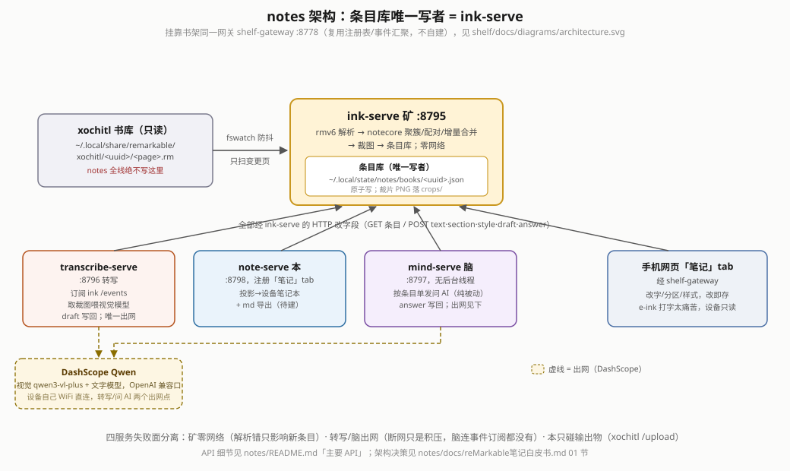
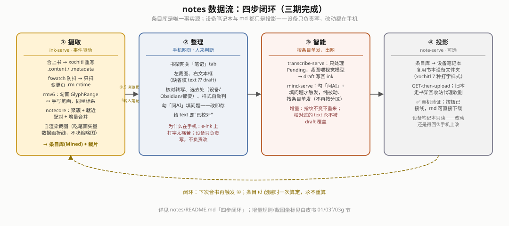

# reMarkable 笔记线（notes）白皮书

> 记"怎么决定、真机怎么验、踩了什么坑"。读现状先看 §00b；待办/已闭环/明确不做看 §05；踩坑看 §04。总计划 未入库的计划文件。
> 笔记线**挂在书架网关下**：网关 / 注册表 / 事件汇聚 / 部署链 / 原生回收站代理都是书架的（`shelf/docs/reMarkable书架白皮书.md`），本文只记笔记线自己的决策、服务、真机轮次。

## 00｜定位与原则（2026-09-06 用户定）

书架（`shelf/`）补 reMarkable 读书短板；笔记线做强它的强项：**荧光笔勾书 + 在勾出来的内容旁边直接手写**。文学书勾作者名写"查作者"，学术书勾公式写"?/没听懂"或"!/背诵"——凡是勾了、写了的都该汇入笔记。旧 `knowledge/pkm`（画星待办、六色槽卡片、跨书汇编、复盘队列、仪表）判"太花哨"（颜色即路由的产物），**全部退役；新建 `notes/`，不引入任何旧代码，只借鉴功能与踩坑**（`.rm` 解析、`.epubindex` 页→章按书架惯例"剥离移植"成新 crate）。

四步闭环：① 合上书自动摄取（事件驱动）→ ② **手机上修正**（e-ink 打字太痛苦；不再引入中文化/输入法）→ ③ 按分区调智能（**分区 = 名字 + 简述 + 是否调模型，简述就是给 AI 的要求**；"背诵"不调）→ ④ 可选导出 md，一章一文件，与设备笔记本同构，反链。

工程原则同书架四条（XDG · 设计模式去重解耦 · 专项专用可插拔 · 不引旧 crate 不对接旧路径），外加笔记线自己的一句话：**设备只负责写，不负责改；改在手机，回写靠重建；条目库是唯一事实源，笔记本与 md 都是投影**。用户另定：四个服务（转写与智能分开）；设备笔记本一章一本、放《书名》文件夹、只读；分区自定义；首期只 EPUB；**后续全部提交 `dev` 分支**。

## 00b｜现状总览（2026-09-06 晚，读其余历史节前先看这里）

**架构**：书架网关 `manage::MODULES` 加三行（`ink`/`transcribe`/`notes`）；三个 loopback 服务已上机——**ink-serve 矿 8795**（书库监听 → 条目库唯一写者，零网络）· **transcribe-serve 转写 8796**（订阅矿的事件 → 裁图喂视觉模型 → 草稿写回，唯一出网）· **note-serve 本 8798**（注册「笔记」tab；投影/导出待建）；**mind-serve 脑 8797 待建**。网页只多一个「笔记」tab（前端组合 `/api/ink` `/api/transcribe` `/api/notes`），事件区域 `notes`（矿发 `entries`/`sections`，转写发 `transcribe`）经网关 `Hub` 汇聚到 `/api/events`，页面零轮询。**笔记线零 xovi 依赖**（无 qmd、无 .so；将来建《书名》文件夹走书架的 Sidebar 代理 qmd，依赖仍留在书架那一份）。

**数据流**：合上书 → xochitl 重写 `<uuid>.content/.metadata` → ink `fswatch`（书库目录非递归、4 s 防抖）→ 只扫页 `.rm` mtime 变了的页 → `rmv6` 解析（勾画 GlyphRange + 手写笔画，同一坐标系，墓碑剔除）→ `notecore` 并查集聚簇 + 就近配对 + 增量合并 → 从缩略图裁片 → `~/.local/state/notes/books/<uuid>.json` + `~/.local/share/notes/crops/` → 事件 → transcribe 防抖 3 s 取待转写条目 → DashScope `qwen3-vl-plus`（OpenAI 兼容口，改配置即换厂）→ `POST ink /books/{uuid}/entries/{id}` 写 `draft` → 手机网页改字/分区/样式（改即存）→〔待建〕note 投影为《书名》文件夹一章一本 + md 导出。

**真机（3.28.0.172，2026-09-06 晚，设备在 WiFi `192.168.1.22`，USB 网卡当时没起来）**：三服务 `active`，注册表 8 项（书架 5 + 笔记 3）；ink 扫到《人骨拼圖》38 章、0 条（唯一有 `.rm` 的页 23 笔全是墓碑）；transcribe 配置 `transcribe.json` 权限 `0600`、启动追平一轮记 `note="未配置 API key"`、`inkReachable=true`、`pending=0`；`GET /status` 不含 key 字段。**未目视**：手机网页笔记页/转写区（用户看）。

**代码落点**：`crates/rmv6`（`lib.rs` 低层 `RmFile::read` / `page.rs` 高层 `Page{strokes,highlights,text}` + `BBox` / `write.rs` 写 `RootTextBlock` + 模板替换拼 `.rm`，§03h）· `crates/epubmap`（`index.rs` 两张表取首现 / `toc.rs` nav→ncx 两策略 / `lib.rs` `BookMap::chapter_of`）· `crates/notecore`（`model` 条目/分区/样式/状态 · `hash` FNV 簇指纹与条目 id · `geom` 聚簇/配对 · `ingest` 增量合并 · `marker` 行首标记 OCR 兜底）· `services/ink-serve`（`doc.rs` 书库只读视图 / `ingest.rs` 变更页编排 / `crop.rs` 页坐标→缩略图像素 / `bookdb.rs` Repository / `config.rs` 阈值与几何 / `main.rs` 路由+监听）· `services/transcribe-serve`（`config` key 与节制参数 / `backend` `Vision` Strategy + `OpenAiCompat` / `prompt` / `ledger` 用量账本 / `ink` `EntryStore` 客户端 / `worker` 一轮编排 / `main.rs` SSE 订阅 + 防抖工作线程）· `services/note-serve`（`rmdoc.rs` 打包 `.rmdoc`（`.metadata`+`.content`+`.rm`），投影编排待建；上传直接复用 `shelf_core::xochitl::Xochitl::upload`）· 网关 `ui/app.js` `renderNotes` · `shelf/{build,deploy,install,uninstall}.sh` 的 `NOTES_BINS`/令牌。

**离线门槛**：`cargo test --workspace` 41 个（rmv6 7 · epubmap 5 · notecore 11 · ink-serve 9 · transcribe-serve 8 · note-serve 1）零警告；网关 `node --check app.js`；shell 过 shellcheck。

**未闭环**：transcribe 转写质量再打磨（重转复验：坐标已对、结构读对，但汉字数字"一/二/三"被认成阿拉伯数字"1/2/3"，1 条仍混印刷体，见 §03g；提示词已补一条规则，待真机复验）· note-serve 投影（`rmv6::write` 编 `RootTextBlock`、`note-serve::rmdoc` 打包 `.rmdoc`，都已双实现交叉验证过，见 §03h；**还没让真的 xochitl 摸过**，真机小范围验证是下一步、通过前不接自动管线；NumberedList 写入前还差一份多行样本，见 §03f）· mind-serve · md 导出 + `notes pull`（§05）。步骤 0 真机样本已于 2026-09-07 采回、验证、且真机复验通过（§03f/§03g）。

## 01｜架构决策

- **四个服务而不是一个 `note-serve`**（用户驳回单服务方案）：失败面分离——矿零网络（解析错只影响新条目）、转写/脑出网（断网只是积压）、本只碰输出物（xochitl `/upload`）；**转写与智能分开**是用户明确要求（转写是 OCR 边界问题，智能是提示词问题，节奏与费用都不同）。
- **不自建网关，挂书架现成的**：笔记线是独立仓库（`notes/`），但没有自己的 HTTPS/密码/证书/mDNS——那些是重复劳动（书架已经踩全了这些坑）；也没有塞进书架任何一个现成服务（`book-serve` 等），失败面与依赖方向都不同，硬塞会把两条线的故障域绑在一起。折中：复用书架的网关/注册表/事件汇聚/部署链这套**机制**（书架那边只加 `manage::MODULES` 几行映射，机制本身早就是通用的），但架构决策、服务划分、数据模型这些**笔记线自己的设计**完全在本文档，书架白皮书只记"它那边为了接住我们、改了什么"（见 `shelf/docs/reMarkable书架白皮书.md` §03ac）。代价：`shelf-gateway` 的 `MODULES` 成了跨两个仓库的单一事实源，笔记线加新服务除了自己这边的代码，还得去书架那个文件登记一行。
- **条目库唯一写者 = ink-serve**：转写/脑/本一律经它的 HTTP 改字段（`POST /books/{uuid}/entries/{id}`，缺省底座无 PATCH）。多进程各自读改写同一份 JSON 迟早互相覆盖（书架落库边车早期踩过同类）。
- **设备只写不改，改在手机**：xochitl 不认外部对已有文档的原地修改（书架/PKM 两线都判死），且 e-ink 上改字太痛苦。所以设备笔记本**只读**，由条目库投影生成；一章一本使重建局部化（只重建变过的章），旧本走书架回收站代理软删（`selectionMoveToTrash` 是唯一可靠路，直改 metadata 会被运行中 xochitl 覆写）。
- **事件驱动、零轮询**：ink 只在书库目录上挂非递归 inotify（合上书时 xochitl 重写 `.content/.metadata`，页 `.rm` 的写入不监听——文件多且是 xochitl 内部节奏），触发后按页 `.rm` mtime 只扫变更页；转写订阅矿的 `/events`；网页订阅网关 `/api/events`。
- **增量在数据层**（回答用户"二次识别会不会把改好的您好覆盖回你好"）：簇指纹 = 笔画 id 集合 + 点数 + 量化包围盒的 FNV-1a；指纹不变 → 不重转写不动 `text`；共享笔画但指纹变（补了几笔）→ 同一条目、新 `draft` 只作建议；笔画全没 → `Revoked` 留痕；条目 id 按 (书, 页, 最小笔画 id) 创建时一次算定永不重算。投影永远取 `text ?? draft`。
- **分区 = {名字, 简述, 是否调模型, 触发词}**：简述就是提示词，"背诵"分区空简述不调模型；缺省四区（查询 / 解释 / 背诵 / 其他），按书可改；行首触发词（`?` `查` `!` `背`）给缺省归属。
- **样式判定：几何优先，OCR 兜底**：`-`/实心点/`口`/下划线分区头由几何认（ink-serve；`cluster_gap=40`/`pair_gap=120` 已用真机样本验证，见 §03f，`has_underline` 判据已实现）；`1.` 数字形状不定走 OCR（transcribe 侧 `notecore::marker`，只在条目仍为正文时认，并把标记从正文剥掉——笔记本样式自带编号/符号）。
- **裁图来源 = xochitl 现成缩略图**（384×512，3:4）：零渲染成本、与 de-risk 结论一致（工整 ≈100% / 快写 ~60–91%）；精度不够再换高分辨率自渲染，`crop.rs` 只暴露"给我这片的 PNG"可替换。页坐标 → 像素按 `page_width/height` 等比、`x_origin_center` 可配，**EPUB 页真机测得 960×1280、x 原点居中，见 §03g**（不是 1404×1872 物理屏——真机踩过、改过、验证过）。
- **视觉后端 Strategy**：`Vision` trait 一个方法；`OpenAiCompat` 走 `POST {baseUrl}/chat/completions` + `image_url` data URI，DashScope Qwen 缺省（国内直连、设备自己 WiFi 不经 host 代理——host clash fake-ip 会挡），任何 OpenAI 兼容口只改配置。编排 `worker::run_once` 全 trait 注入，内存桩单测。
- **rmv6 剥离移植而非依赖 device-core**：vendored `remarkable_lines` 0.1.3（MIT）只留 v6，保留两处兼容补丁（未知 PenColor/ParagraphStyle/Tool 码兜底、块尾多余字节跳过），补 CHECKBOX(6/7) 码；`PROVENANCE.md` 留痕。notes 不依赖 `bookconv`/`device-core`/`knowledge/pkm`/`reading`。
- **体积/内存**：musl 全静态 ink 2.5 MB · transcribe 2.1 MB · note 1.2 MB；单元 `MemoryMax=128M` `CPUWeight=20` `Nice=5`。

**手写约定 ↔ xochitl 3.28 七种打字样式**（格式菜单 qml_00db4610：Title / Subheading 1 / Subheading 2 / Body / Bulletpoint / NumberedList / CheckboxUnchecked；.rm 段落样式码 2026-09-07 真机样本全部坐实，见 §03f）：

| 样式 | 码 | 笔记本用途 | 手写约定 | 判法 |
|---|---|---|---|---|
| Title | 2 (HEADING) | 页标题 = 章名 | 无 | epubmap |
| Subheading 1 | 3 (BOLD) | 分区头（名 + 简述 = AI 要求） | 一行字 + 下面长横 | 几何（`has_underline`） |
| Subheading 2 | 3 (BOLD)⚠️同 Subheading 1 | 勾画所在小节 | 无 | epubmap |
| Body | 1 (PLAIN) | 转写正文 / AI 回答 | 普通书写 | OCR |
| Bulletpoint | 4 (BULLET) | 无序 | 行首短横 / 实心点 | 几何（OCR 兜底 `- `/`• `） |
| NumberedList | 10 ⚠️格式子块多 7 字节未解码 | 有序 | 行首 `1.` | OCR（`marker`） |
| Checkbox（未勾选） | 6 (CHECKBOX) | 待办 | 行首空心小方框 | 几何（OCR 兜底 `□`/`口 `） |
| Checkbox（勾上号） | 7，**未验证**：打字打不出，要点方框 | — | — | — |

## 02｜XDG 路径表（设备 HOME=/home/root，`Paths::app_{config,data,state}_dir("notes")`）

| 用途 | 路径 |
|---|---|
| 二进制 | `~/.local/bin/{ink-serve,transcribe-serve,note-serve}`（随书架 `install.sh`，令牌 `ink`/`transcribe`/`note`） |
| 配置 | `~/.config/notes/ink.json`（聚簇/配对阈值、页几何、防抖；首启写出缺省）· `~/.config/notes/transcribe.json`（**0600**，含 apiKey；backend/baseUrl/model/timeoutSecs/maxPerRun/pauseMs/auto/maxAttempts/prompt） |
| 数据 | `~/.local/share/notes/crops/`（手写裁片 PNG）· `~/.local/share/notes/vault/`（md 导出，待建） |
| 状态 | `~/.local/state/notes/books/<uuid>.json`（**条目库**，一书一文件，原子写）· `~/.local/state/notes/transcribe.json`（用量账本：次数/token/最近错误/上轮报告，不存内容） |
| 运行时 | 与书架共用注册表 `$XDG_RUNTIME_DIR/shelf/services/`（缺省回落 `/tmp/shelf-0/shelf/services`） |
| 只读外部 | xochitl 书库 `~/.local/share/remarkable/xochitl/`（`<uuid>.{metadata,content,epub,epubindex}`、`<uuid>/<page>.rm`、`<uuid>.thumbnails/<page>.png`）——**绝不写** |

## 03｜systemd

三个单元 `notes/systemd/*.service`，随书架载荷一起装：`PartOf=shelf.target` + `WantedBy=shelf.target`，`After=home.mount`（transcribe 另 `Wants/After=network-online.target`）；`Restart=on-failure`。**不给 xochitl 加任何依赖**（红线）。装/卸：`shelf/install.sh --only ink,transcribe,note`、`shelf/uninstall.sh`（条目库不在 `--purge` 范围，绝不删用户笔记）。

## 03b｜地基三 crate（2026-09-06，离线）

- **rmv6**：`RmFile::read` 只认 `reMarkable .lines file, version=6`；高层 `Page::parse` 给 `strokes`（`SceneLineItem`，未删）/ `highlights`（`SceneGlyphItem` = GlyphRange：原文 + 页文本偏移 + 每行矩形）/ `text`（打字文本）。真机事实：**勾画与手写笔画同一坐标系**，几何配对不需换算（2026-09-07 真机样本坐实，见 §03f）；擦掉的项是墓碑，两种形态——独立 `SceneTombstoneItemBlock`，或 `SceneLineItem`/`SceneGlyphItem` 本身 `item.value` 为空（同块内软删，数量可能不小：真机样本 105 个 `SceneLineItem` 块里 17 个是后者）。fixture `testdata/renggu/page.rm`（《人骨拼圖》c65fa2ae 页，1049 B）23 笔全墓碑——只测"解析成功零条目"；`testdata/renggu_marks/`（同页，2026-09-07 重画）测真实勾画+手写；`testdata/seven_styles/`（笔记本一页七样式）测段落样式码。
- **epubmap**：`.epubindex` 两张表（每条 `u32 长度 + UTF-16BE 路径 + 3×u32`），第一张第一个 u32 = 起始页（0-based），第二张第三个 u32 也是（前两个是字符偏移/长度）；取每个 basename **首现**的第一个 u32；路径非 ASCII 不认（防误配）。目录 `nav.xhtml`（嵌套 `<ol>`）优先、`toc.ncx`（嵌套 `navPoint`）退回，标签事件流 + 深度栈解析（不带完整 XML 解析器，省体积）。`chapter_of(page)` = 1 级祖先为章、本条 ≥2 级为小节。`.content` `pages` 是页 id 顺序表，下标 = 页号，与起始页对齐（真机 523 项核过）。
- **notecore**：纯函数零 I/O。`geom::cluster` 并查集（任意两笔包围盒间距 ≤ `cluster_gap` 连通，不看笔序/时间——用户会回头补笔）、`pair` 每簇最近勾画（≤ `pair_gap`，否则本页批注）、`has_underline`（簇内某笔宽≈簇宽、矮、贴底 → 分区头候选，§03f 新增）；`is_handwriting` 排除荧光笔/橡皮/选区；缺省 `cluster_gap=40`/`pair_gap=120` 页坐标单位，**2026-09-07 真机样本验证有效、未改**（§03f）。`model::Style::wire_code` 给出 .rm 段落样式码（Body=1/Bullet=4/Numbered=10/Checkbox=6）。`ingest::merge_page` 实现 §01 增量四规则。`marker::split_leading_marker` OCR 兜底（`口渴了`/`-3 度`/`2024 年` 不误判）。

## 03c｜ink-serve 矿（2026-09-06，真机首轮）

- 路由（经网关 `/api/ink`）：`GET /books`（每本 `{uuid,title,chapters,entries,pending}`）· `GET /books/{uuid}`（整份条目库）· `GET /books/{uuid}/crops/{file}` · `POST /books/{uuid}/entries/{id}`（`text`/`section`/`style`/`draft`/`answer` 逐字段；给 `text` 即 `Reviewed`，清空回 `Draft`/`Pending`）· `PUT /books/{uuid}/sections` · `POST /books/{uuid}/rescan`（清页 mtime 记录整本重扫）· `GET /events`。
- 摄取：只处理活的 EPUB（`DocumentType` 且非回收站/非 deleted，`fileType=epub`）且有手写页的文档；启动追平一遍，之后 `watch_debounced`（`debounceSecs` 4）按事件文件名认 uuid 只扫涉及的文档；页 mtime 记在条目库 `page_mtimes`。裁图：页包围盒 + `cropMargin` 24 → 缩略图像素（`PageGeom::to_pixels`，夹在图内），文件名带簇指纹，指纹不变不重裁。
- 真机：`active`、注册；追平扫到《人骨拼圖》38 章、0 条（墓碑页）；`ink.json` 首启写出缺省。**真样本待步骤 0**。

## 03d｜网关「笔记」tab + note-serve 骨架（2026-09-06）

- 书架侧：`MODULES` 加行、`AREA['note-serve']='notes'`、`TABS['note-serve']`；`build.sh/deploy.sh` `NOTES_BINS`、`install.sh` `ALL` 令牌。note-serve `ServiceSpec.tab=("笔记",25)` 注册 tab；`GET /status`（vault 路径）· `GET /events`。
- 网页（`renderNotes`）：选书 → 按章分卡片 → 每条：左裁图（`/api/ink/.../crops/`）、右文本框（缺省填 `text ?? draft`，改即 `POST entries` 存）、分区下拉、样式下拉、状态徽章、勾画原文引用、智能回答折叠；分区编辑（名 / 简述 / 调模型 / 增删 / 保存）；「重扫」。真机：tab 出现、两服务 active（用户手机端目视待补）。

## 03e｜transcribe-serve 转写（2026-09-06 夜，真机 WiFi 部署）

**触发**：订阅 ink-serve `/events`（与网关 Hub 同套路：注册表找 → 长连接 → 断线 3 s 重连），`area=notes,kind=entries` 且 `auto=true` → 踢工作线程 → 防抖 3 s 合并 → 跑一轮；启动追平一次；`POST /run` 同步跑一轮（网页「转写」）；`POST /books/{uuid}/entries/{id}` 强制转写一条（网页每条「转写/重转」，忽略指纹与失败上限）；`POST /retry` 清失败记录再踢。自动与手动共用 `run_lock` 互斥。

**一轮**（`worker::run_once`）：`GET /books` 只看 `pending>0` 的书 → 条目 `needs_transcribe()`（`ink.hash` 没有对应草稿且非 Revoked）→ 取裁图 → 提示词（内置：只转写不发挥、保留换行与行首符号、认不出用「？」、无字输出空；**勾画原文截 300 字作语境**帮人名/术语，但明说别抄进来；`temperature=0`）→ 模型 → 样式仍为正文时 `marker` 兜底 → `POST ink entries` 写 `draft{text,backend,at,hash}`（+ `style`）→ 账本记 token。

**节制**（用户费用/限流关切）：每轮 `maxPerRun` 20、请求间歇 `pauseMs` 300；同一条同指纹失败 `maxAttempts` 3 次后不再自动试（指纹变了计数归零）；**一轮连续 3 次失败零成功即停**（key 错/断网别一条条撞 60 s 超时）；账本只记数不记内容。

**key**：`GET /config`/`/status` 只报 `hasKey`/`keySource`（config/env/none）**不回显**；`PUT /config` 的 `apiKey` 非空才改、`clearKey` 清；文件 `0600`；环境 `DASHSCOPE_API_KEY` 兜底。网页转写区：key 输入框（`type=password`，保存后清空）、模型/baseUrl、合书自动开关、跑一轮/重试失败、失败清单、用量与上轮报告。

**真机（WiFi `192.168.1.22`，`SHELF_NO_BUILD=1 ./deploy.sh 192.168.1.22`）**：`active`、注册表见 `transcribe-serve`；日志 `后端 qwen qwen3-vl-plus；key None`；`/status`：`hasKey=false keySource=none inkReachable=true pending=0`，`lastRun.note="未配置 API key（…）"`；`transcribe.json` `-rw-------`。**待验**：粘 key 后真调一次模型（等步骤 0 样本产生 pending 条目）、事件链 ink→transcribe→网页刷新。

**取舍**：为什么不直写条目库（§01 唯一写者）；为什么限量 + 即停（一次合书几十条，key 错时不该烧完超时）；为什么行首标记在转写侧兜底（`1.` 几何认不出，表里本就写 OCR 判；几何判出的不覆盖）；为什么勾画原文进提示词（旧 cardhw 经验：上下文救人名/术语，代价是 token 略增）。

## 03f｜步骤 0 真机样本标定（2026-09-07）

用户在设备上按 §05 步骤 0 清单采回两份样本，用 `rmscene` 0.8.0（host venv 已有，反解交叉验证）+ rmv6 自身单测双路核验，**全部并入 `cargo test --workspace` 常驻回归**（不是一次性脚本）：

- **样本一**（`testdata/renggu_marks/`）：《人骨拼圖》同一页（沿用 c65fa2ae，旧墓碑样本换成真内容）勾三段原文，每段旁写一行（首字分别 `-`/`1、`/`口`），另写一行字+ 下面一条长横。
- **样本二**（`testdata/seven_styles/`）：新建笔记本一页，格式菜单逐行打 Title/Subheading 1/Subheading 2/Body/Bulletpoint/NumberedList/Checkbox（含"Checkbox"与"Checkbox finished"两行）。

**坐实（聚簇/配对不用改代码缺省值；页坐标画布尺寸要改，见 §03g）**：
- **x 原点居中**：三条高亮矩形 `x` 全为负（落在左半页），自己拿笔画/矩形原始坐标重渲染一遍、跟真机截图核对布局完全吻合——**方向**判对了；`ink.json` 的 `xOriginCenter=true` 不用改。但当时以为"宽 1404"也一并验证了，其实只验了"x 为负=左半页"这个粗粒度方向，没有验精确画布尺寸——真实尺寸是 960×1280，不是 1404×1872，是后来跑真机转写发现草稿全错、倒查裁图坐标才挖出来的（§03g）。这条错误结论在本节最初版本里存在过，特此更正。
- **聚簇/配对阈值**：`cluster_gap=40`、`pair_gap=120` 拿真实笔画包围盒验证——3 处批注簇与对应勾画间距均为 **0.0**（紧贴甚至压线），到次近勾画都在 148pt 以上；第四簇（字+下划线）离最近勾画 305pt，正确判"本页批注"。阈值卡在两类间距中间，安全边界宽，**不用改**（`notecore::geom::real_device_sample_clusters_and_pairs_correctly`）。
- **荧光笔自留一条笔画**：`SceneGlyphItem`（语义高亮矩形）之外，画高亮的笔本身还留一条 `SceneLineItem`（工具 `Highlighterv2`）。`is_handwriting` 已按 `Tool::Highlighter` 排除，真机样本验证有效——**没有二次踩这个坑**。
- **`has_underline` 判据成立**：下划线是单独一笔，宽度≈簇全宽（本样本 487.7 实测）、高约簇高 1/6（18 vs 113）、贴簇底部；三条批注簇上该判据均为假，第四簇为真——几何足够稳，不必等 OCR。

**新发现（改了代码/文档）**：
- **NumberedList 真实码 = 10**（写进 `rmv6::v6::scene_item::text::ParagraphStyle::NUMBERED`，`notecore::model::Style::wire_code`）。⚠️ 它的格式子块比其余样式**多 7 字节未解码载荷**（`c: u8=17` + `format_code: u8` 之后还有 7 字节，rmv6 靠 `validate_size` 的"少读则跳过"容错过去，没崩但也没读懂）——猜是编号计数/起始值，因为有序列表天然需要一个可能不从位置隐式推算的显式序号状态；本样本只打了一行，没法差分出编码规则。**note-serve 写入器落这码之前必须再采一份多行有序列表样本**（至少 3 行，最好中途删一行看编号是否重排）把这段字节差出来，否则写出去的编号可能不对，甚至被 xochitl 判非法丢弃。
- **Subheading 1 与 Subheading 2 共用同一个 .rm 码（3=BOLD）**——原计划设想的"7 个不同样式码各管一种"不成立，原生靠某种不在 `RootTextBlock.styles` 里的机制区分两级大小（大概率是渲染时按段落在文档大纲里的层级动态决定，而不是逐段落存一个"是几级标题"的位——这块本项目不打算深挖，因为投影只需要**产出**正确样式，不需要**读回**原生渲染算法）。**影响设计**：note-serve 写"分区头"（Subheading 1 语义）和"小节标题"（Subheading 2 语义）时，两者在 .rm 层会是同一个样式码，渲染出来大小完全一样——不奢求还原原生两级视觉差异，靠缩进/前缀文字区分即可。
- **Checkbox 勾上号（7）未验证**：格式菜单把两行都打成"Checkbox"样式（其中一行文字打的是"Checkbox finished"），.rm 里两行的码都是 6——说明**打字模式给不出 7**，勾上号是对已渲染方框的一次点击手势，不是段落样式菜单的选项。设备只读设计下用不上（不用回读用户是否勾选了原生笔记本的复选框），但写入器也别指望能直接"生成一个已勾选的待办"。
- **`SceneLineItem` 的软删有两种写法**：既有独立的 `SceneTombstoneItemBlock`（旧样本 23 笔全是这个），也有 `SceneLineItem`/`SceneGlyphItem` 自身 `item.value` 为空（真机新样本 105 个 `SceneLineItem` 块里 17 个是这样）。两条路径 `Page::from_file` 已经都在处理（`if let Some(...) = &it.item.value`），只是这次才第一次在同一个真实文件里看到两种形态并存，记一笔防止以后只测了一种就以为够了。

**产物**：`testdata/renggu_marks/`（`page.rm`/`page.png`/`book.content`/`book.epubindex`/`toc.ncx`/`content.opf`）、`testdata/seven_styles/`（`page.rm`/`page.png`/`book.content`）；新增 4 个测试（rmv6 2 个真机样本解析 + notecore 2 个：聚簇配对回归 + `has_underline`），`cargo test --workspace` 从 31 涨到 35。

## 03g｜真机转写首轮翻车 → 挖出裁图画布尺寸错（2026-09-07）

样本落地当天顺手让 transcribe-serve 在真机上真跑了一轮（key 已配置，非本文档动作），4 条条目全部产出 `draft`。**核对内容发现全错**——没有一条是用户实际写的 `-第一段`/`1. 第二段`/`口 第三段`/`这是一段话并画线`，而是分别抄了页面别处的**印刷体原文**（如"如此強烈"≈epigraph 里的"如此強勢"、"：30P.M."≈时间范围行、"領取行李\n也已錯過"/"，但她只想著一件事：\n分，好想換上睡衣，倒"≈相邻印刷段落原句）。四条草稿没有一条随机——都是"沿页面往下大致对应位置"的印刷体，说明**裁图本身裁偏了**，不是模型瞎编。

**定位**：把 4 条 `entries[].ink.crop` 从设备现场拉回来肉眼看，确认裁图内容确实是印刷体/空白，不是手写——问题在 ink-serve 生成裁图这一步，不在转写侧。用真机缩略图（`highlight_page_thumb.png`）程序化扫像素（高亮的橙色底色 `r>230,170<g<230,100<b<190`）反推三条高亮真实落在缩略图的第几行第几列，跟 `crop.rs::PageGeom::to_pixels` 用配置里 `pageWidth=1404/pageHeight=1872` 算出来的框一比——**完全对不上**（真实行比算出来的行靠后一大截，且越往页面下方偏差越大，是线性缩放系数错，不是平移量错）。

**定量**：三条高亮真实像素行/列 vs. 页坐标做最小二乘线性拟合（`numpy.polyfit`），y 轴 `real_row = 0.4019×page_y − 0.36`、x 轴 `real_col = 0.3997×page_x + 191.4`——两轴缩放系数几乎相等（≈0.40，本该相等，验证了拟合没错）；反推等效画布 `page_h = 512/0.4019 ≈ 1274`、`page_w = 384/0.3997 ≈ 961`，x 偏移 `191.4/0.3997 ≈ 479`，跟 `page_w/2 ≈ 480` 吻合（**x 原点居中的方向判定本身没错**，见 §03f 更正）。1274×961 极接近整数 **1280×960**（3:4，跟缩略图同比例）——取整后代入验证，误差在真机缩略图 384px 分辨率的量化噪声内。

**根因**：EPUB 页的 `.rm` 坐标系是 xochitl **EPUB 排版引擎自己的虚拟画布**，不是设备物理屏像素——物理屏（笔记本/PDF 用的坐标系）才是 1404×1872，EPUB 重排文本另开一个更小的虚拟画布（960×1280，仍是 3:4）来排版、再整体缩放贴合物理屏显示。`ink.json` 抄了"经典 1404×1872"这个物理屏数字，从一开始就没对——§03f 当时验证"x 原点居中"时只看了正负号方向，没量精确尺寸，误以为验证完整了。

**影响面与修法**：
- **`notecore::geom`（聚簇 `cluster`/配对 `pair`/`has_underline`）完全不受影响**——这几步只在 `.rm` 原始坐标系内比较相对距离（间距、宽度占比），不需要换算成像素，§03f 的验证结论站得住。
- **`ink-serve::crop`（页坐标 → 缩略图像素）是唯一受影响的地方**——已改 `IngestConfig` 缺省 `page_width: 1404.0→960.0`、`page_height: 1872.0→1280.0`；新增回归测试 `crop::tests::real_page_geometry_lands_on_the_real_highlight`（拿高亮 1 的真实 rect 跑 `to_pixels`，断言落在真机测得的行 264–281／列 51–138 附近，用 1404×1872 会跑到行 179–192／列 96–156，测试会红）。
- **只验过 EPUB 页**：笔记本（typed text/手写自己的画布）没有独立测过，`page_width/page_height` 目前只对 ink-serve 唯一处理的 EPUB 页有意义；以后 note-serve 读/写笔记本坐标系时**不能想当然套用这组数**，得单独测。

**教训**：`.rm` 坐标"看起来像页面尺寸"不代表就是设备物理分辨率——EPUB/PDF/笔记本三种文档各自的排版画布可能不同，下结论前拿"同一份数据里已知语义的东西反推"（这次是拿高亮矩形该出现的印刷段落位置去比对缩略图真实像素）比"读一个数字直接信"可靠得多。这条经验后续采样（比如笔记本画布、PDF 定稿画布）要重复用。

**当场真机复验（同一天完成，不是留待办）**：改完配置又发现一个衍生问题——第 4 条批注（长句+下划线，无勾画配对）真实 y 落在 1507–1620，超出 960×1280 画布之外，说明**这条批注写在了这页可滚动内容里、缩略图视口截不到的地方**（缩略图只固定截这页物理一屏，页面比一屏长时下面部分不进缩略图）；`to_pixels` 硬夹到图边缘后裁出宽/高仅 1px 的废图，喂给 Qwen 被直接拒收（`InternalError.Algo.InvalidParameter: height:1 ... must be larger than 10`）。加了 `crop_png::MIN_CROP_PX`（8px）守卫：裁剪区域小于这个数直接判"裁不到"返回清楚的错误，不再真送废图去烧一次 API 调用（新增回归测试 `crop_png_rejects_offscreen_bbox`）。

重编译部署（`shelf/build.sh` + `deploy.sh --only ink,transcribe,note`）、手改设备上已落盘的 `ink.json`（`pageWidth`/`pageHeight` 1404/1872→960/1280，新装的二进制不会覆盖已存在的配置文件）、清掉 4 张旧裁图缓存（裁图按"指纹不变文件已存在就跳过"复用，光换配置不删缓存不会重裁）、`POST rescan` 触发重裁 + 强制重转三条有勾画的：

| 条目 | 真实手写（用户核对更正） | 修复前草稿（抄印刷体） | 修复后草稿 |
|---|---|---|---|
| 高亮 1 旁 | `-第一段` | "如此強烈"（≈epigraph"如此強勢"） | "：30P.M.主△ \n～第1段"（结构对："第□段"识别出来了；**但"一"被认成阿拉伯数字"1"**，上方还混进裁图边缘一点印刷体） |
| 高亮 2 旁 | `1. 第二段` | "：30P.M."（原样抄了页面别处的印刷体） | "只能叫計程\n**1. 第2段**\n手提雲膠的"（同上：结构对，**"二"被认成"2"**，上下各混进一点印刷体） |
| 高亮 3 旁 | `口 第三段` | "領取行李\n也已錯過"（抄了页面别处） | "常？穂\n？車 這些顏"（完全没读对，跟"口 第三段"毫无关系——分辨率/裁图边界还需再调，留作后续质量项） |
| 无勾画批注 | `这是一段话并画线` | "，但她只想著一件事：…"（抄了页面别处） | 裁图裁不到（视口外），`MIN_CROP_PX` 守卫生效跳过；这条**草稿字段仍是修复前的错误旧值**（drafts 只增不删，没有"清空"接口）——手机网页上看到会是这条旧值，用户手动一改（或留空）即可，不是数据损坏 |

**结论**：坐标根因坐实且真机验证有效——3 条有勾画的条目，裁图现在都对准了真实手写所在的位置（不再是印刷体或空白），这个层面的 bug 确认修复。但**转写准确率不能算"读对"**：2 条只对了"第□段"的结构，汉字数字"一/二"被模型认成阿拉伯数字"1/2"（连笔手写的"一"确实容易跟"1"混，"二"跟"2"形近，但这仍是错读，不是四舍五入的小瑕疵）；第 3 条（"口 第三段"）完全没读对，混进了裁图边距外的印刷体。这些都是**转写质量问题（分辨率/边距/OCR），跟本节修的坐标 bug 是两回事**，坐标修复不能反过来当成"转写现在准了"的证据。1 条无勾画批注遇到裁图覆盖范围的新边界情况，已优雅降级而非报废调用。

**产物**：`ink-serve` 缺省配置改字段 2 处、`crop.rs` 新增 `MIN_CROP_PX` 守卫、`crop.rs`/`config.rs`/`geom.rs`（notecore）文档注释同步更正、新增 2 个测试（`cargo test --workspace` 35→**37**）；真机重编译部署两轮、`ink.json` 手改、清缓存、重裁、强制重转三条，全部当场验证。**遗留待办**：转写质量两项——① 汉字数字"一/二/三"被认成"1/2/3"（entry1/2）；② 裁图边距混进相邻印刷行导致整条读错（entry3）。下一步该把裁图边距按行高动态收紧、或换自渲染高分辨率裁图（白皮书早留的口子），顺带看能不能在提示词里强调"数字用汉字原样抄、不要转阿拉伯数字"；entry4 的旧错误草稿留给手机网页人工清。

## 03h｜rmv6 补写能力：`RootTextBlock` 编码器（2026-09-07）

note-serve 投影要往设备写打字文本，rmv6 之前是纯只读解析。评估后判定**只值得自己写 `RootTextBlock` 这一个块**：`AuthorIdsBlock`/`MigrationInfoBlock`/`PageInfoBlock`/`SceneInfo`（真机样本自带一段没解出来的不透明字节）/`SceneTreeBlock`/`TreeNodeBlock`/`SceneGroupItemBlock` 这些和"页面上打了什么字"无关，从零精确重建风险高、收益低——改用**模板替换**：拿一份真机产出、已知能被 xochitl 正常打开的 `.rm` 文件当模板，扫它的顶层块序列（`u32 长度+u8 0+u8 min_version+u8 current_version+u8 block_type`，找 `block_type=7`）定位 `RootTextBlock` 的字节区间，只重新生成这一块，其余原样拼接。

**写入器**（`rmv6::write`，5 个测试）：给一组 `(样式, 文本)` 段落，编码出合法的 `RootTextBlock`。关键事实（这几轮真机样本 + 2026-09-07 用独立的 Python `rmscene` 交叉验证坐实，不只是"我们自己的解析器认"）：
- 全新文档没有编辑历史，`deleted_length` 恒 0、CRDT id 不用留空隙——真机活文档里那些"隔一个 id"的缝是打字/删改历史的产物，从零生成不需要模拟。
- 每段一个 wire 条目，`item_id` 指向本段第一个字符，后续字符隐式 +1；`left_id` = 上一段最后一个字符的 id（首段用 `(0,0)`）；`right_id` 恒 `(0,0)`。
- 样式表的 key = "结束上一段的换行符"的 id（等于本段的 `left_id`），value 是 `{固定字节 17, 样式码}`。
- **⚠ 真机大坑，独立验证抓出来的**：文本条目里那个叫 `is_ascii` 的字段，真机样本对**含中文的段落也写 1**——按字面意思、老实按内容判断（ASCII 写 1 非 ASCII 写 0）会通过我们自己宽松的 rmv6 解析器，但喂给 `rmscene`（它对这个字段有 `assert is_ascii == 1`）直接炸；这说明真实设备/规范要求恒为 1，字段名具有误导性。这正是"先拿独立实现交叉验证、别只信自己写的解析器"救回来的一个真实 bug——如果没交叉验证，这份文件大概率传到真机也会被拒或崩，而我们自己的往返测试完全测不出来。
- 目前只支持 5 种确认安全的样式（PLAIN/HEADING/BOLD/BULLET/CHECKBOX）；`NUMBERED` 因为格式子块还有 7 字节没解码（§03f/§03g）故意不支持，调用会报错而不是蒙一个错的编码上去。

**验证方式与边界**：`cargo test -p rmv6` 全绿（往返：写入→用 rmv6 自己的 `Page::parse` 读回，断言条目数/文本/样式对得上）+ 额外用独立的 `rmscene`（Python，MIT，已在本仓库 venv）交叉解析生成的文件、正确读出全部 5 段文字与样式。**⚠ 尚未真机验证**——这只证明"两个独立的读取实现都认为这份文件合法、内容对"，不等于 xochitl 真的会正常打开渲染。

**上传这条路不是新领域，是本项目已经踩过、真机验证过的坑**：查了一遍才发现 `reading/protocol/inject.py`（2026-08-16 真机验证批注）+ Rust 版 `device-core/src/inject.rs` + `knowledge/pkm/src/cardnote.rs` 早就摸清楚了——xochitl 的 `POST /upload` 除 EPUB/PDF 外**也吃 `.rmdoc`**（reMarkable 官方文档包 zip：`<uuid>.metadata` + `<uuid>.content`[+`.pagedata`] + `<uuid>/<page>.rm`，**不含** `.local`，导入端自建）；multipart 字段名 `file`，`.rmdoc` 用 `application/zip`。真机行为：201 "Upload successful"、免重启出现在书库、**导入端会重新分配设备 UUID**（不是包里写的那个）——调用方按 `visibleName` 事后认领（跟书架 `render_check.rs` 的"按 createdTime 圈候选"是同一类模式）。`cardnote.rs` 甚至已经是"纯 `.rm` 组装成笔记本再传"的先例，不是 EPUB 派生的笔记。**按"不引入任何旧代码到 notes/"的红线，这些实现不能直接搬——但摸清楚的格式/字段名/UUID 重分配这几条事实可以借鉴**，note-serve 要写的 rmdoc 打包器是参照这些事实全新写的。唯一没坐实的一点：xochitl 到底是按文件名后缀（`.rmdoc`）还是按 zip 内容本身分流——现有结论全是黑盒试出来的，不是反编译坐实的，notes 线接入前该用最小样本（比如同一份 zip 换几种文件名）自己再核一遍，不能直接照搬旧结论当真理。

**打包器已经写了**（`note-serve::rmdoc`，1 测）：给一页 `.rm` 字节 + 书名 + 父文件夹，拼出 `<uuid>.metadata`+`<uuid>.content`（`fileType:"notebook"`，`formatVersion 2`/`cPages` 结构，参照真机样本 `testdata/seven_styles/book.content` 与上述旧代码印证过的最小字段集——`extraMetadata` 空对象就够，不用填一堆画笔工具状态）+`<uuid>/<page>.rm`，STORED 不压缩（zip crate，workspace 里 `epubmap` 已经在用，不是新依赖）。上传本身**直接复用 `shelf_core::xochitl::Xochitl::upload`**（共享底座、非"旧代码"，笔记线本来就已经间接依赖 shelf-core）。落地文件用 Python `zipfile` + `rmscene` 交叉核过一遍：zip 结构对、`.metadata`/`.content` JSON 合法、内嵌 `.rm` 独立解析出正确文字与样式——**跟 §03h 前半的 `RootTextBlock` 编码器一样，仍然只是"两个独立读取实现都认可"，还没让真的 xochitl 摸过**。

## 04｜踩坑

- **外部进程直改 `.metadata` `parent="trash"` 会被运行中 xochitl 覆写**（阅读线判死）；软删/建夹只能走 QML 代理（书架 `shelf-trash-agent.qmd`）。
- **真机样本页可能全是墓碑**：《人骨拼圖》c65fa2ae 页 23 笔全被擦过，`Page` 剔除后零条目——采样前先 `rmv6` 解析看非墓碑数，别拿它标阈值。
- **ureq 2 默认特性没有 `json`**：`Response::into_json` 不存在，用 `serde_json::from_reader(resp.into_reader())`；TLS 根用 webpki-roots（锁文件已有），出网设备直连不经 host 代理。
- **设备可能只在 WiFi 上**：USB 网卡没起来时 `10.11.99.1` 不通、mDNS 也没有；局域网扫 `8778` 找到 IP 后 `deploy.sh <ip>`（host 参数）。
- busybox：`head -1` 不认（要 `-n 1`）、无 `timeout`、`ls` 中文名显示 `?`（验名 `find | hexdump -C`）；`grep -c` 零匹配退出码 1 会断 `&&` 链。
- 书架规则沿用：**别跑 `cargo fmt --all`**（仓库非 rustfmt 风格，2026-09-06 混进 64 文件重排回滚重放）；qmd 先离线 `qmldiff apply-diffs`；重启 xochitl 只用 `xovi/start`；shell 里 cwd 会在 `cang-jie/`、`shelf/`、`notes/` 间漂移，路径写绝对。
- 会话里 python 改文件时留了个尾逗号把表达式变 tuple、测试文件括号未闭合各踩一次——改完立刻 `cargo test`/`node --check`。

## 05｜真机待办（2026-09-07 刷新）

**未闭环（按依赖顺序）**：
1. **转写质量两项**：① entry3（高亮 3 旁 `口 第三段`）重转后仍没读对，裁图上下混进了相邻印刷行——把 `cropMargin` 从固定 24 改成按簇高度动态收紧，或者干脆换自渲染高分辨率裁图（§01 早留的口子）；② ~~entry1/2 把手写的汉字数字"一/二"认成阿拉伯数字"1/2"~~ 提示词已加规则（2026-09-07），待真机重转复验是否真的不再转数字。entry4 那条旧的错误草稿是裁图坐标错时期的遗留数据，手机网页上人工清一下（一改字段就覆盖）。
2. **NumberedList 补样本**：再打一份多行有序列表（≥3 行，中途删一行看编号是否重排），差出格式子块那 7 字节未解码载荷的编码规则——不补这步，note-serve 写入器落 NumberedList 就是蒙的（§03f）。
3. **rmdoc 打包器 + 真机小范围验证**：`.rmdoc` 上传格式已经不是未知数（§03h：`reading/protocol/inject.py`/`device-core/inject.rs`/`knowledge/pkm/cardnote.rs` 都验证过，zip 装 `.metadata`+`.content`+`<uuid>/<page>.rm`，字段名 `file`，导入后设备重分配 UUID 按 `visibleName` 认领）——但代码不能抄，note-serve 得照着这些事实全新写一个打包器；写完先拿一份最小测试文档（1 页、几种样式）传一次真机，肉眼确认 xochitl 打开正常、样式渲染对，再往下接自动管线。
4. note-serve 投影：`rmv6::write` 已能编 5 种样式的 `RootTextBlock` 且双实现交叉验证过（§03h），上一步真机验证过后接上；`《书名》/第N章 章名` 一章一本、旧本 `POST /api/books/trash/add`、只重建变过的章；NumberedList 等 2 补完样本再接。
4. 书库动作代理扩展：`shelf-trash-agent.qmd` → 通用 `{action: trash|mkdir}` 队列，`Library.createCollection` 建《书名》夹；先离线 `apply-diffs` 再上机。
5. mind-serve：按分区跑文本模型（简述 = 提示词，`ai=false` 跳过），`answer` 写回再投影。
6. md 导出 `vault/<书名>/第N章.md`（front-matter、`^id` 块锚、`[[书名]]` 反链、索引页）+ host `notes/host/bin/notes pull`。
7. 文档收尾、旧 PKM 白皮书加"已退役、由 notes/ 取代"头注、`dev` 以 `--no-ff` 合入 `feature/shelf-p1`。

**已闭环（真机）**：§03c ink-serve 首轮（active/注册/追平 38 章）· §03d 「笔记」tab 注册 · §03e transcribe-serve 部署（active/注册/0600/追平记 note）· §03f 步骤 0 样本标定（聚簇/配对阈值验证通过，NumberedList/Subheading 碰撞/Checkbox 勾选三项新发现）· §03g 揪出裁图画布尺寸错（960×1280）并修复部署复验（3 条有勾画的条目裁图都对准了手写位置，但转写准确率另计——2 条数字被认错、1 条完全读错；1 条裁不到已优雅降级）。离线：五 crate+服务 **41** 测（§03h 新增 rmv6::write 5 测 + note-serve::rmdoc 1 测）。

**明确不做（本期）**：扫描件 PDF、定稿 PDF（等步骤 0 ④）、笔记本手写批注回读（设备只读）、颜色语义（只进 tags）、自动清空回收站（网页按钮走 `emptyTrash()` 用户显式点）、Anki/Todoist/Readwise 外发（有 md 与稳定 id 之后再谈）、KOReader 高亮回流（书架砍下来留给笔记线，排在导出之后）。
