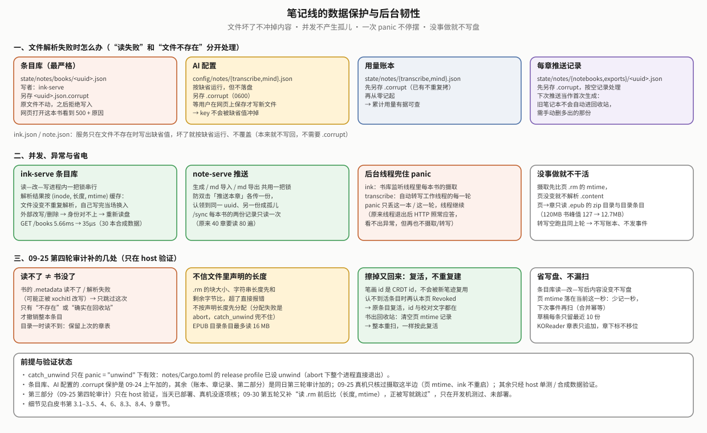
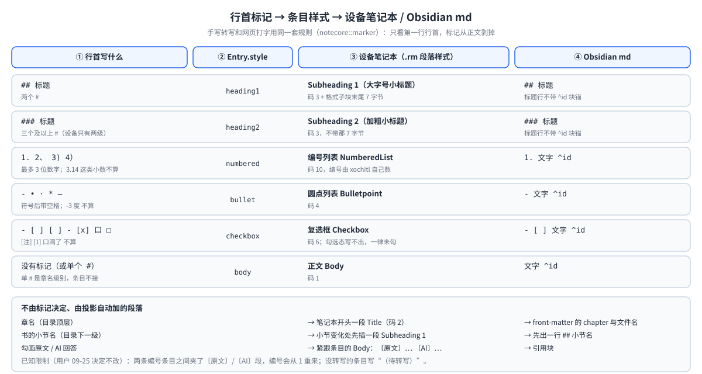
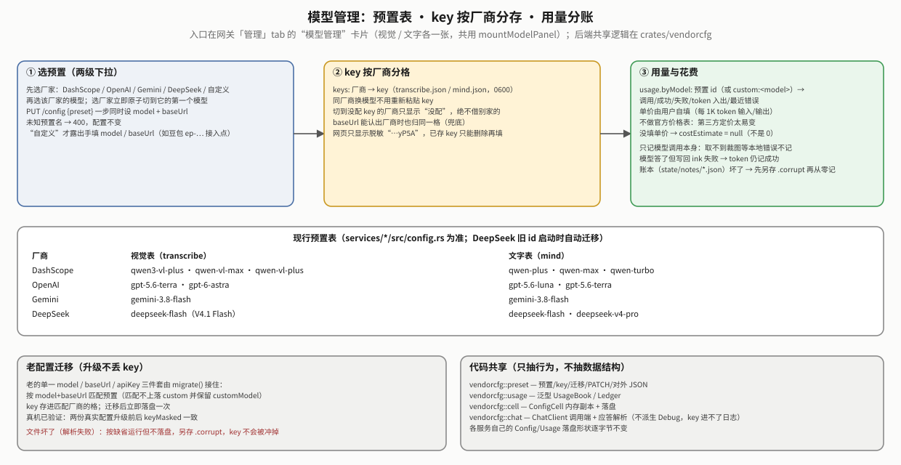
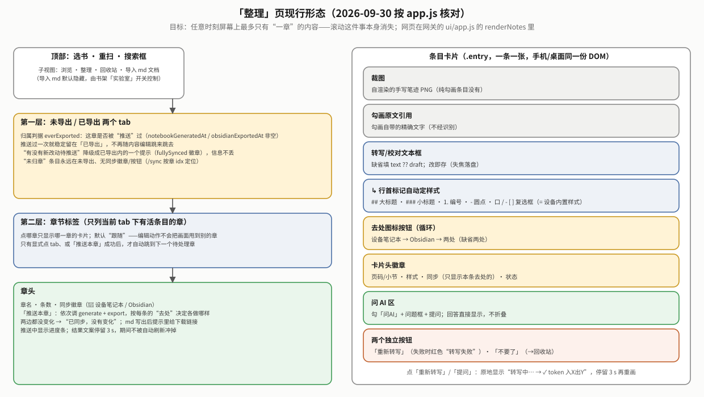
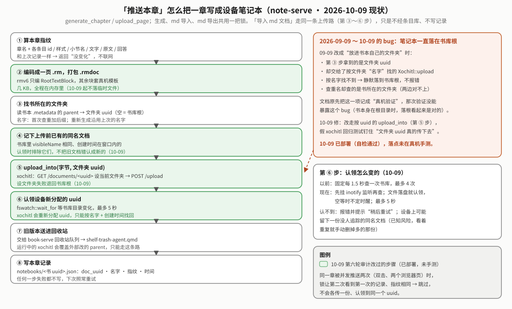

# reMarkable 笔记线（notes）白皮书

> **读者与用途**：维护笔记线、或想弄清“为什么这样设计、真机验证过什么、踩过什么坑”的人。只想知道能做什么、怎么装，看 [`../README.md`](../README.md)；整个系统的位置见 [`../../docs/OVERVIEW.md`](../../docs/OVERVIEW.md)。
>
> **怎么读**：先看「5 分钟读懂」和「现状总览」，这两节讲的就是现在的样子，不用翻历史；最近一轮（2026-10-09 第六轮审计，当天已部署、功能未手测）的改动汇总在现状总览能力表的最后一行。按需要再挑章：想知道条目怎么来 → 第 3 章；改转写 / 问 AI / 模型 → 第 4–6 章；改网页 → 第 7 章；改推送 → 第 8 章；上真机前 → 第 13 章待办。第 1–11 章每章开头先给**现状结论**，再讲设计，最后列**被推翻的做法与教训**。第 9 章（KOReader 回流）已随 2026-09-29 设备卸载 KOReader 退役，代码 2026-09-30 已从仓库删除，只作历史。第 12 章是踩坑表。旧版本按日期写的 §03b–§03an 已经拆进各章；代码注释里写的“见白皮书 §03u”这类旧节号，到**附录 A** 查它现在在哪一章。
>
> **验证程度的写法**：「真机」= 在设备上跑过真实数据；「离线」= 只有单测或 host 上的端到端；「已部署」= 代码已装上设备、部署自检（`verify-on-device.sh`、服务状态）通过，但这个功能本身还没人在真机上手测；「未验证」= 以上都没有。
>
> 笔记线挂在书架网关下面。网关、服务注册表、事件汇聚、部署脚本、原生回收站代理都属于书架与网关（[`../../gateway/README.md`](../../gateway/README.md)、`shelf/docs/reMarkable书架白皮书.md`），本文只写笔记线自己的东西。

## 5 分钟读懂

**一句话**：reMarkable 的强项是“荧光笔勾书，再在勾出来的地方旁边手写”。笔记线把这些勾画和手写**自动收进一个条目库**，你在手机网页上挑选、改字、问 AI，最后把它们推送成设备上的笔记本或 Obsidian 用的 md 文件。

**一条原则**：设备只负责写，不负责改；改在手机上做，设备上的笔记本靠重新生成来更新。**条目库是唯一事实源**，设备笔记本和 md 都只是从它生成出来的“投影”。

**四个服务**（都挂在网关下，只监听 `127.0.0.1`）

| 服务 | 端口 | 一句话 | 出网？ |
|---|---|---|---|
| ink-serve（矿） | 8795 | 合上书后解析书页，把“勾画 + 旁边手写”配成条目；**唯一能写条目库的服务**；另管全文搜索 | 否 |
| transcribe-serve（转写） | 8796 | 把手写裁图交给视觉模型，识别结果作为草稿写回 | 是 |
| mind-serve（脑） | 8797 | 用户点「提问」时，把这条的上下文和问题交给文字模型 | 是 |
| note-serve（本） | 8798 | 把条目库生成设备笔记本和 md；另有单篇 md 导入 | 否（只调 xochitl 的 `/upload`） |

**术语**

| 词 | 意思 |
|---|---|
| `.rm` | xochitl 存书页笔迹的文件，本线只读 v6 格式 |
| 勾画 / GlyphRange | 荧光笔划出的原文。`.rm` 里直接存着原文文字和位置矩形，不用识别 |
| 条目（Entry） | 一处“勾画，加上旁边的手写（可以没有）”。条目库里的最小单位，有 7 种状态 |
| 条目库 | 设备上 `~/.local/state/notes/books/<uuid>.json`，一本书一个文件 |
| 投影 | 从条目库重新生成的产物：设备笔记本（一章一本）和 Obsidian md（一章一个文件） |
| 去处（destination） | 每条内容去哪：设备笔记本 / Obsidian / 两处都要（默认两处） |
| 预置（preset） | 模型下拉菜单里的一项，包含“厂商 + 模型名 + 接口地址” |
| 行首标记 | 一行开头的 `##`、`1.`、`-`、`口` 这类符号，决定这条在设备笔记本里用哪种内置样式（大标题、编号、圆点、复选框…），见第 4 章 |
| 小节名（subhead） | 勾画所在位置在 EPUB 目录里的二级（或更深）标题，由 epubmap 自动填；投影在小节变化处插一行小标题 |

**已经不存在的东西**（在旧文档或代码注释里看到时别当成现役）：“分区”（2026-09-08 砍掉）、自动新建《书名》文件夹（09-09 改成放进书本自己的文件夹——但直到 10-09 修好之前，书在文件夹里时笔记本其实落在书库根，见 8.3）、host 命令 `shelf notes pull`（09-18 随 host CLI 一起砍掉）、「整理」页的批量勾选工具栏（09-08 删）、`subheadHint` 字段与“`##`/`###` 改卡片小节名”（09-25 改成设备内置样式）、「KOReader 回流」网页按钮（09-29 随设备卸载 KOReader 撤掉；ink-serve 的 `POST /koreader/import` 接口和 `notecore::koreader` 09-30 也已从仓库删除，见 git 历史；拉进来的旧条目照常可用，见第 9 章）、`ink.json` 的 `pageWidth` / `pageHeight` / `xOriginCenter`（09-30 删，从来没人读；旧配置文件里留着也会被忽略）。

## 现状总览（2026-10-09 按代码复核）

**一条内容从头到尾怎么走**：

1. **摄取**：合上书时 xochitl 会重写 `<uuid>.content/.metadata`。ink-serve 监听书库目录，4 秒防抖后先比各页 `.rm` 的修改时间，只扫变了的页（页都没变就连 `.content` 都不解析；正被 xochitl 写到一半的页这次跳过），把勾画和旁边的手写配成条目，状态为 `Mined`，同时把手写画成灰度裁图 PNG。
2. **浏览**：手机「浏览」页只列 `Mined`。点「转入笔记」→ `Pending`（没有手写的直接用原文定稿为 `Reviewed`；已有定稿文字的回 `Reviewed`、只有草稿的回 `Draft`）；点「不需要」→ `Skipped`，进回收站。
3. **转写**：transcribe-serve 收到事件后，只处理 `Pending`，把裁图交给视觉模型，结果作为草稿写回，状态变 `Draft`。
4. **整理**：手机「整理」页改字（改完即保存，状态变 `Reviewed`）、选去处、勾「问 AI」填问题再点「提问」（mind-serve 生成回答写回），不要的点「不要了」（`Archived`，进回收站）。
5. **推送**：每章一个「推送本章」按钮，note-serve 按每条的去处，生成设备笔记本（放进书本所在的文件夹）、导出 md，并在提示里给 md 的下载链接。内容没变就跳过；这章的旧版笔记本经书架的回收站代理几秒内挪进 xochitl 回收站。过程图见 8.3。

**各项能力的现状与验证程度**

| 能力 | 现状 | 验证 | 详见 |
|---|---|---|---|
| 合书自动摄取；勾画与手写配对；没手写的纯勾画也成条目 | 在用 | 真机 | 第 3 章 |
| 从笔迹矢量自渲染裁图（09-30 起 8 位灰度、约 400 万像素封顶） | 在用 | 真机（“写在页面很靠下”的边界没有专门造样本；灰度与封顶 09-30 已部署、待手测） | 第 3 章 |
| 「浏览」页：转入笔记 / 不需要 | 在用 | 真机 | 第 7 章 |
| 自动转写 | 在用 | 真机只调过 DashScope；OpenAI / Gemini / DeepSeek 只验证了配置层 | 第 4、6 章 |
| 问 AI | 在用 | 真机（DashScope） | 第 5 章 |
| 行首标记与设备内置样式一一对应（`##` `###` `1.` `-` `- [ ]`/`口`） | 在用（09-25 起） | 网页打字 → 推送 → 设备渲染真机验证（09-25）；手写的 `##` 至今没有一次被正确识别出来的真机例子；“书的小节名插行”只有单测 | 第 4 章、8.2 |
| 模型管理：两级下拉、key 按厂商分存、用量分账 | 在用 | 真机（含老配置迁移不丢 key） | 第 6 章 |
| 设备笔记本：生成、增量重传、旧版本自动进回收站、没变化跳过 | 在用 | 真机 | 第 8 章 |
| 笔记本放进书本自己所在的文件夹，首次生成时重名加后缀 | **10-09 才真正生效**：09-09 起书在文件夹里时笔记本一直落在书库根（文件夹 uuid 被当成名字查），10-09 修 | 开发机（假 xochitl 回归测试）；**10-09 已部署，落点未在真机手测**。此前这一行写的“真机”有误，以代码为准更正 | 8.3 |
| Obsidian md 导出 + 浏览器下载 | 在用 | 真机 | 第 8 章 |
| 「整理」页未导出 / 已导出双层 tab、同步徽章 | 在用 | 接口数据真机核对；网页交互没人眼确认 | 第 7 章 |
| 回收站：看内容、恢复、全部恢复、清空 | 在用 | 真机（「不要了」+「清空回收站」09-25 在真实数据上走通） | 第 3、7 章 |
| KOReader 高亮 / 生词回流 | **已退役**（09-29 设备卸载 KOReader，网页按钮删除；后端代码 09-30 从仓库删除，旧条目照常可用） | 退役前：后端 09-16 真机端到端（curl） | 第 9 章 |
| 单篇 md 导入 | 默认隐藏 | 后端真机逐段核对；网页入口没人眼确认 | 第 8 章 |
| 全文搜索 | 在用 | 离线测试；09-24 已部署，但设备当时没有活条目，没能用真实数据核对；网页没真机点过 | 第 3 章 |
| 条目库、AI 配置文件损坏时不被覆盖 | 在用 | 离线测试；真机没触发过损坏路径 | 第 3、6 章 |
| 第三轮审计（09-24）：用量账本 / 章记录损坏留 `.corrupt`、条目库解析缓存、推送串行化、后台线程兜 panic、转写空跑不写盘、大书页→章不整本读入 | 在用 | 摄取这半边 09-25 真机核过；转写记账、>100 MB 大书、推送串行化只在 host 验证 | 第 2 章「可靠性要点」、第 13 章 7b |
| 第四轮审计（09-25）：擦掉又回来的笔迹复活原条目、`.metadata` 读不了不再当成书被删、章判据统一为顶层条目、KOReader 章表只追加、秒级 mtime 防漏扫、小数不当编号、草稿只留 10 份、没改动不写盘、畸形 `.rm` 不先分配内存 | 09-25 已部署 | host 验证（当时 240 过 + 1 忽略）；真机没逐项核 | 3.1–3.5、第 4、9 章、第 13 章 7d |
| 第五轮审计（09-30）：epubmap 按 OPF 声明找目录、启动追平重扫没章的活条目、裁图灰度 + 像素封顶 + 坏坐标报错、「转入笔记」继承定稿 / 草稿、读 `.rm` 时正被改写就跳过、补笔 / 清空回收站删掉没人用的裁图、模型调用端复用（`ClientCache`）、删 `ink.json` 三个死键 | **09-30 已部署**，部署自检通过，功能待手测 | host 250 过 + 1 忽略（当时还含 KOReader 导入的测试） | 3.1–3.3、第 6 章、第 13 章 7e |
| 重构第一阶段（10-10）：条目状态转移收进 `Entry` 方法，修“再转写草稿留 `- `、导出 `- - 查作者`”；改字 / 草稿 / 回答请求体改成 `notecore::api` 类型，形状不对 400、不再清空回答；条目应答带 `live`；草稿 / 回答记真实模型标识；三份 ink 客户端合成 `notesvc::InkClient`；账本一轮合并落盘；条目库写紧凑 JSON | **未部署** | host 257 过 + 1 忽略 | 3.3、3.5、第 4–6 章、第 10 章 |
| 第六轮审计（10-09）：笔记本落进书所在文件夹、内存直传、认领改等 inotify 并排除上传前已有的同名文档；调云瞬时故障重试一次、闲置 45 秒的连接重建；epubmap 解 XML 实体与百分号编码；`.content` 没有 `pages` 时按 `cPages` 取页序；坏文件留证只留第一份；四个服务改用 rmsvc-core 共享实现。同日稍后的审计后续：单价 `PUT` 字段名与 `GET` 统一、EPUB 容器/OPF 解析并进 `rmsvc-core/epubpkg`、zip 去掉用不到的 zopfli | **10-09 已部署（部署自检 38✓），功能未手测**；审计后续随下一次部署（10-09，39✓）上机，也没单独手测 | host 246 过 + 1 忽略（审计时） | 3.1、第 2 章、第 4、6 章、8.1、8.3、第 13 章 7g |

**离线门槛**：`cd notes && cargo test --workspace`，2026-10-10 实跑 **257 过 + 1 忽略**（rmv6 29 · epubmap 10 · notecore 75 · notesvc 2 · vendorcfg 28 · ink-serve 32 · transcribe-serve 27 · mind-serve 23 · note-serve 31，另有 note-serve 1 个 `#[ignore]`；零警告、clippy 零告警）；共享的 `rmsvc-core/epubpkg` 另跑 `cargo test --manifest-path ../rmsvc-core/epubpkg/Cargo.toml`；网关另跑 `node --check ui/app.js`；脚本过 shellcheck。测试数会变，改了就同步这里和 README。note-serve 里几条认领测试会真的等书库目录变化（整组约 5 秒）。

**已知小问题**：`Entry::set_triage` 不拒绝 `Skipped`（接口上能对已跳过的条目直接调 `/request` / `/archive`）——10-10 已修：终态一律拒绝，重复点同一个终态动作算无改动。

## 第 1 章 定位与原则

**现状结论**：2026-09-06 用户定下的定位和原则至今没变；原计划里“按分区调 AI”那一步已经改成按条目提问。

- **定位**：书架线（`shelf/`）补 reMarkable 读书的短板；笔记线加强它的长处，也就是“荧光笔勾书 + 旁边手写”。文学书勾作者名写“查作者”，学术书勾公式写“？没听懂”——凡是勾了、写了的，都应该进笔记。
- **不继承旧代码**：旧的 `knowledge/pkm`（画星待办、六色卡片、跨书汇编等）被判“太花哨”，整体退役。新建 `notes/`，不引用任何旧代码，只借鉴功能与踩坑经验；`.rm` 解析和 `.epubindex` 解析按书架惯例“剥离移植”成新 crate（复制过来改，不依赖原 crate）。
- **工程原则**：与书架相同的四条（遵守 XDG 路径规范；用设计模式去重解耦；专项专用、可插拔；不引旧 crate、不对接旧路径），外加笔记线自己的一条：**设备只写不改，改在手机，回写靠重建，条目库是唯一事实源**。
- **用户的其他定案**：四个服务，转写和问 AI 分开；设备笔记本一章一本、只读；只支持 EPUB；开发在 feature 分支上做（`dev` 分支已于 2026-09-16 删除）。

## 第 2 章 架构决策

**现状结论**：四服务拆分、单一写者、设备只读、事件驱动这几条从一开始就定了，没被推翻。

| 决策 | 为什么 |
|---|---|
| **拆成四个服务，不做成一个** | 故障面分开：矿不出网，解析出错只影响新条目；转写和问 AI 出网，断网只是积压；本只碰输出物。转写与问 AI 分开是用户明确要求——转写是识别准确率问题，问 AI 是提示词问题，节奏和费用都不同。 |
| **不自建网关，挂在书架网关下** | HTTPS、密码、证书、mDNS 都是现成的，重做是重复劳动。代价是网关 `manage::MODULES` 成了跨目录的登记表，加新服务要去网关登记一行。笔记线也没有塞进书架现有的服务里，因为故障面与依赖方向都不同。 |
| **条目库只有 ink-serve 能写** | 多个进程各自“读—改—写”同一个 JSON 迟早互相覆盖（书架早期踩过同类问题）。网页改字调 `POST /api/ink/books/{uuid}/entries/{id}`，转写写草稿调 `…/draft`，问 AI 写回答调 `…/answer`（10-10 拆开）；请求/应答类型在 `notecore::api`，收发两端共用一份，形状不对回 400。 |
| **设备笔记本只读，由条目库生成** | xochitl 不接受外部程序原地修改已有文档（书架与旧 PKM 两条线都验证过），而且在墨水屏上改字太痛苦。一章一本，让重新生成只影响变过的那章。 |
| **事件驱动，不轮询** | ink 只在书库目录上挂非递归 inotify；transcribe 订阅 ink 的 `/events`；网页订阅网关的 `/api/events`。 |
| **增量合并放在数据层** | 保证“你改好的字永远不会被重新识别覆盖”，规则见第 3 章。 |
| **模型后端用 Strategy 模式** | `Vision`/`TextModel` 各一个 trait；传输走 OpenAI 兼容的 `POST {baseUrl}/chat/completions`，换厂商只改配置；编排逻辑全部注入 trait，用内存桩单测。 |
| **不依赖其他项目线的 crate** | 不依赖 `bookconv`、`device-core`、`knowledge/pkm`、`reading`。依赖方向单向：`services/* → rmsvc-core + crates/*`。 |
| **零 xovi 依赖** | 没有 qmd 补丁，没有 `.so`。旧版本回收借用书架已有的回收站代理。 |

**可靠性要点**（下图汇总。前两部分主要来自 09-24 两轮修补，摄取相关的 09-25 真机核过；第三部分是 09-25 第四轮审计补的；下面列表里 09-30 第五轮补的一条。除注明真机核过的，其余都已部署、但没在真机上专门触发过）：

- **读失败 ≠ 不存在**：条目库、两份 AI 配置、两份用量账本、两类“每章推送记录”解析失败时，都先另存一份同目录的 `*.json.corrupt`（**只留第一份**：已有就不再覆盖。10-09 起四处统一用 rmsvc-core 的 `config::backup_corrupt`；此前 AI 配置那一处每次启动都覆盖副本，最早的坏内容会丢），再按各自规则处理——条目库最严格，拒绝一切写入；配置按缺省运行但不落盘；账本从零记起；章记录按空记录处理（下次推送会当首次生成，旧笔记本不会自动进回收站）。`ink.json` / `note.json` 服务本来就只在文件不存在时写缺省值，坏了只是按缺省运行、不覆盖。
- **串行化**：条目库的读—改—写在 ink-serve 进程内一把锁；note-serve 的生成、md 导入、md 导出共用一把锁（见 8.3）。
- **后台线程兜 panic**：ink-serve 书库监听线程里每本书的摄取、transcribe-serve 工作线程的每一轮都套了 `catch_unwind`，一次 panic 只丢这一本 / 这一轮。此前线程会直接退出，HTTP 照常应答，从外面看不出后台已经停了。这依赖 `notes/Cargo.toml` 的 release profile 设 `panic = "unwind"`。
- **没事做就不写盘、不发事件**：摄取先比页 mtime（3.1）；条目库读—改—写之后内容没变就不重写（3.5，09-25）；转写空跑不写账本、不发事件（第 4 章）——网页每收到一条 `notes` 事件都会整页重拉。
- **读不了 ≠ 书没了**（09-25 第四轮审计）：书的 `.metadata` 只有“文件不存在”或“读出来确实在回收站 / 标了删除”才算书没了；读不了或解析失败（可能正被 xochitl 改写）只跳过这一次，不撤销条目（3.4）。目录一时读不到时也保留上次的章表和条目的章（3.1）。
- **不拿写到一半的文件当真**（09-30 第五轮审计，已部署、待手测）：读一页 `.rm` 前后各取一次同一个文件描述符的（长度, mtime），对不上、或读到的字节数和长度对不上，就当“正在写入”跳过这页、不记 mtime，下次事件再扫。v6 是一串块，截在块边界上的半截文件照样能解析，只是少了后面的笔画——当真会把那些条目撤销，复活时 `Pending` 只回 `Mined`，用户“转入笔记”的决定就丢了。
- **不信文件里声明的长度**（09-25）：`.rm` 的块大小、字符串长度先和剩余字节比，超了直接报错，不按它分配内存；EPUB 目录文件最多读 16 MB（3.1）。内存分配失败是 abort，`catch_unwind` 兜不住，所以只能在分配前拦。

**资源**：musl 全静态二进制，2026-09-24 设备上 ink 3.6 MB、transcribe 2.5 MB、mind 2.4 MB、note 2.6 MB；每个 systemd 单元 `MemoryMax=128M`、`CPUWeight=20`、`Nice=5`。

## 第 3 章 摄取与条目库（ink-serve）

**现状结论**：合上书自动摄取、纯勾画条目、自渲染裁图、书删了或笔迹擦了自动撤销、全文搜索、条目库防覆盖，都在用。前四项真机验证过；搜索与防覆盖只有离线测试。

### 3.1 从 `.rm` 到条目

| 步骤 | 做什么 | 关键事实 |
|---|---|---|
| 触发 | inotify 监听书库目录（非递归），`debounceSecs` 默认 4 秒；启动时先把所有有 `.rm` 页的 EPUB 和条目库里已知的书追平一遍（候选先看有没有 `.rm`，再读 `.metadata`；`.content` 只取 `fileType`）。追平前，**还活着却没有章的 xochitl 条目**所在页的 mtime 记录会被忘掉，让这次追平重扫、按最新规则归章（09-30：页→章规则 09-29 变过，而摄取只扫 mtime 变了的页，旧条目不这样做就永远没有章、两处投影都不收） | 页 `.rm` 的写入不监听（文件多，而且是 xochitl 内部节奏），只靠合书时 `.content/.metadata` 被重写来触发。每本书的摄取套 `catch_unwind`，解析器遇到畸形文件 panic 只跳过这本这一次 |
| 选页 | 先列出有 `.rm` 的页，和条目库里记的 `page_mtimes` 比，只扫修改时间变了的页；一页都没变就直接返回，连 `.content` 都不解析（读书时 xochitl 会反复改写 `.content`，大多数触发其实没事可做）。页号取 `.content` 的 `pages` 数组下标；没有 `pages`、只有 `cPages` 的新形状按 `cPages` 的序号排、去掉已删页（10-09 防御性补上：此前这种书每页都落到页号 0，整本没有章；目前真机 EPUB 样本都是旧形状，结果不变）。mtime 只到秒：页的修改时间落在“当前这一秒”时少记一秒，下次事件再扫一遍，防同一秒里的第二次写入被漏掉（09-25 第四轮审计） | 只处理活的 EPUB：不在回收站、没标 deleted、`fileType=epub`（`fileType` 在确认有页变了之后才看） |
| 解析 | `rmv6::page::Page` 取出三样：手写笔画、勾画（GlyphRange：原文 + 每行矩形）、打字文本。读文件前后比对（长度, mtime），正被改写就跳过这页（09-30，见第 2 章「可靠性要点」） | 勾画与手写在**同一坐标系**，配对不用换算。擦掉的项有两种写法（独立墓碑块，或 item 自身值为空），都已剔除。文件里的长度字段（块大小、字符串长度）先和剩余字节比，超了直接报错、不按它分配内存（09-25 第四轮审计：写到一半的 `.rm` 可声明上 GB 长度，分配失败是 abort、`catch_unwind` 兜不住） |
| 聚簇 | `notecore::geom::cluster`：任意两笔包围盒间距 ≤ `clusterGap`（默认 40）就归一簇 | 不看笔序和时间，因为用户会回头补几笔。荧光笔自己也留一条笔画，按工具类型排除 |
| 配对 | 每簇配最近的勾画，距离 ≤ `pairGap`（默认 160），否则算“本页批注” | 2026-09-07 用真机样本标定为 40 / 120：批注簇到对应勾画距离为 0，到次近勾画 ≥148。2026-09-25 真机样本：用户在勾画右上方隔几个字处写批注，距离约 138，被判成本页批注 → `pairGap` 放宽到 160（用户拍板）。配对取**最近**的勾画，所以旧样本结果不变；代价是两条勾画相距较近时，夹在中间的手写更可能挂到另一条上 |
| 纯勾画 | 没被任何手写簇配上的勾画，单独生成一条 `ink: None` 的条目 | 点「转入笔记」直接用原文定稿（见 3.3） |
| 章节 | `epubmap`：`.epubindex` 给出每个章节文件的起始页，EPUB 目录（nav 文档，没有就用 NCX）给出目录层级，得到“页号 → 章 / 小节”。**目录文件怎么找**（09-30）：先按 `META-INF/container.xml` → OPF → manifest 里声明的（`properties` 含 `nav` 的条目、NCX 媒体类型的条目）；没声明再按文件名猜，正好叫 `nav.xhtml` 的优先于“名字里含 nav”的；目录属性认单引号。此前只按文件名猜，nav 不叫 `nav.xhtml`、又没有 NCX 的书整本没有章。**href 先解码再用**（10-09，已部署、未手测）：OPF、container、nav、NCX 里的 href 先解 XML 实体（`a&amp;b.xhtml` → `a&b.xhtml`）再解百分号编码（`a%20b.xhtml`）；此前不用 XML 解析器、正则取出的属性值原样当路径，OPF 声明的目录找不到（退回按名猜，可能拿错文件），目录条目的文件名也跟 `.epubindex` 对不上，这章的页都没有章。章标题同样解实体（不再显示 `&amp;`）。**container.xml → OPF → manifest 与 href 解码跟书架共用 `epubpkg`**（`rmsvc-core/epubpkg`，10-09 与书架 shelf-conv 的同类代码合并，随 10-09 下午的部署上机、未手测）：合并时取两边更严格的写法——注释里的 `<rootfile>`/`<item>` 不算、属性认无引号写法和任意命名空间前缀、OPF 路径也做 `./`/`../` 归一；目录文件解压超过 16 MB 当读不到（此前截断到 16 MB 照样解析），不是合法 UTF-8 的字节按替换字符读（此前整份丢掉）。含 `&` 或 `%xx` 文件名的书，章划分会变对，相关章的笔记本指纹随之变化、下次推送会重新生成一次。**不在目录里的 spine 文件**（书架章节分页拆出来的正文份、Calibre 按大小切的 `index_split_NNN`）归到前面最近一个在目录里的文件那一章（09-29）；封面等第一个目录条目之前的页仍然没有章。章 = 目录里没有父条目的顶层条目（通常就是一级）；小节名 = 顶层以下各级的标题，写进 `Entry.subhead`（投影用法见 8.2）。09-25 第四轮审计前章表只收一级、章号却按顶层祖先算，分组项是 ``（没有链接）的目录两者对不上，这类书的条目永远生成/导出不出来；现在两处同一判据，标准嵌套目录结果不变。目录一时读不到时保留上次的章表和条目的章。同一页重新摄取时，认领到的旧条目跟着刷新页序号、章、小节（不改 id 和内容） | `.content` 的 `pages` 数组下标就是页号。`.epub` 以文件读端打开，只读 zip 中央目录和目录那一两个条目，不整本读进内存（见 3.6）；目录条目最多读 16 MB（`epubpkg::MAX_TEXT_BYTES`，按实际解出的字节数截，zip 里声明的解压大小不可信；超限当读不到） |
| 裁图 | `GET /books/{uuid}/crops/{file}` 回 `Cache-Control: private, max-age=31536000, immutable`（2026-10-07 代码审查起，网关只在 200 时透传这个头；裁图名带笔迹哈希，内容永不变，笔记页每次重画不再重新下载；**10-07 已部署，功能未手测**）。`crop::render_ink` 按条目自己的笔画 id 挑出笔画，在包围盒加 `cropMargin`（24）范围内按 2 倍缩放画白底黑线 PNG；09-30 起是 **8 位灰度**（内存和上传给模型的字节约为原来 RGBA 的 1/4） | 不再用 xochitl 缩略图（见 3.6）。宽或高小于 8 像素就拒绝，不把废图发给模型；一张最多约 400 万像素（`MAX_CROP_PIXELS`，超了按比例降缩放——手写可以写满一页，坐标坏了更是无上限，分配失败是 abort）；包围盒坐标不是有限数直接报错。补了几笔、裁图换了名字后删掉旧的那张（09-30，此前裁图目录只增不减） |

### 3.2 增量规则：改好的字不会被覆盖

- 每片手写按“笔画 id 集合 + 点数 + 量化后的包围盒”算 FNV-1a 指纹。
- 指纹没变：不重新转写，不动你改过的文字。
- 补了几笔（笔画有重叠但指纹变了）：还是同一条目，新识别结果只作为新草稿，不碰定稿文字。
- 勾画旁边后来补了手写，或者把旁边的手写擦掉只剩勾画：按勾画自己的 id 认回**原条目**，id、状态、定稿文字、样式、问答都保留，只换手写部分；补上的手写照常转写、只作建议（同“补了几笔”）。只认没处理掉的条目：「不需要」或已归档的勾画后来补了手写，算新意图，另起一条（09-25 用户要求；此前会另建新条目、把定稿的那条撤销，定稿状态和文字留在撤销的那条里）。**09-25 真机验证通过**（用户在已定稿的纯勾画旁补手写，仍是原条目、定稿文字在）。
- 笔画全没了：条目标 `Revoked`，不删除。
- 笔画又回来了（xochitl 里撤销了擦除、书从回收站恢复）：认领不到活条目时再找本页的 `Revoked` 条目，同指纹 / 共享笔画 / 同勾画 id 就**复活原条目**——有定稿回 `Reviewed`、有草稿回 `Draft`、否则回 `Mined`（不自动进转写队列）。笔画 id 是 CRDT id，新笔迹不会复用，能对上只可能是原来那批。09-25 第四轮审计前这种情况会再建一条**同 id** 的新条目，网页按 id 改字永远落到已撤销的旧条目上。
- 条目 id 按（书、页、最小笔画 id）在创建时算一次，以后永不重算；纯勾画条目用勾画自己的 id。万一撞上已有条目（旧版本造出的重复）就加序号，一本书里 id 唯一。
- 随草稿写回的样式（转写结果的行首标记）只是建议：条目已有定稿文字时不采纳，补几笔触发的再转写不会把定稿那条改成圆点/编号。草稿只留最近 10 份。
- 投影永远取“定稿文字，没有就用最新草稿”。

### 3.3 条目状态机

- 正常流程：`Mined → Pending → Draft → Reviewed`。**状态只经 `Entry` 的方法改**（10-10 收拢）：`set_triage`、`restore`、`apply_marked_text`、`accept_draft`（转写写草稿）、`accept_answer`、`revoke`（笔迹没了 / 书没了，终态不动）、`revive`（笔迹回来）；服务代码里不再直接给 `status` 赋值。
- **「转入笔记」的落点**（`Entry::set_triage`）：
  - 已有定稿文字 → `Reviewed`；只有草稿 → `Draft`（09-30 第五轮审计，已部署、待手测）。此前一律降成 `Pending`：「不需要」→ 回收站恢复（回 `Mined`，文字还在）→ 再「转入笔记」，会得到一条带定稿文字却标着“待转写”的条目，草稿指纹对得上时转写也不会再来，永远卡住。
  - **快路径**：没有手写的条目（纯勾画；以及 09-29 前拉进来的 KOReader 高亮和生词）直接把原文写成定稿，跳到 `Reviewed`。因为 `needs_transcribe()` 要求有手写，卡在 `Pending` 会永远等不到转写。
  - 其余 → `Pending`，等转写。
- 三个终态（`Skipped` / `Revoked` / `Archived`）合称 `is_terminal()`，都在回收站里。改字、写草稿、写回答、浏览/整理动作对终态一律拒绝，要先「恢复」（`set_triage` 10-10 前漏拒 `Skipped`）。
- ink-serve 给网页的每条条目带 `live`（＝`is_live_for_projection()`），只在 HTTP 应答里，不写进条目库文件；网页据此判断，不再自己抄一份状态表。
- 「恢复」（`Entry::restore`）不额外保存“删除前的状态”，而是按已有内容倒推：`Skipped` 固定回 `Mined`；另两种有定稿回 `Reviewed`、有草稿回 `Draft`、有手写回 `Pending`、否则回 `Mined`。恢复的是条目库里存着的内容，**设备页面上已擦掉的笔迹不会重新出现**。
- **自动复活**（09-25 第四轮审计）：`Revoked` 条目的笔画或勾画又回来了（xochitl 里撤销了擦除、书从回收站恢复），摄取时直接复活原条目，规则见 3.2。和手动「恢复」的区别只在最后一档：只有手写、没转写过的条目复活后回 `Mined` 而不是 `Pending`——自动复活不代表你要转写，留在「浏览」里重新决定。`Skipped` / `Archived` 是你主动处理的，不会自动复活。
- 进投影的只有 `Pending` / `Draft` / `Reviewed`（`Status::is_live_for_projection()`，全项目唯一的判据）。
- 「清空回收站」（`Book::purge_terminal()`）才是真删除，被清条目的裁图一并删（09-30），只能手动点，不会自动清。回收站按“章”存记录，不会随点击次数膨胀。

### 3.4 书删了、笔迹擦了

- 书进了回收站、被彻底删除、或文件不见了：`ingest::revoke_stale()` 把这本书所有**非终态**条目标成 `Revoked`，已经是终态的不动（2026-09-09 修过一次误判，见 3.6）。已生成的笔记本和 md 是独立文件，不会被删。同时清空这本书的页 mtime 记录：书从回收站恢复时页文件原样没变，不清的话“页没变”早退，条目永远停在 `Revoked`；清了之后恢复时整本重扫，按 3.2 的复活规则认回原条目（09-25 第四轮审计，host 验证）。
- “书没了”只认两种：`.metadata` 不存在，或读出来确实在回收站 / 标了删除。`.metadata` 读不了或解析失败（可能正被 xochitl 改写）只跳过这一次，不撤销（09-25 前两者不分，一次读到半截就会把整本书的活条目全标撤销）。
- `GET /books` 只列“至少还有一条非终态条目”的书，清空了的书自动从下拉菜单里消失。
- 两处都真机验证过（《人骨拼圖》清空后消失，《Gulliver's Travels》进回收站后条目变 `revoked`）。

### 3.5 条目库存储与全文搜索

- **存储**：一本书一个 JSON，原子写入。**解析缓存**（09-24 第三轮审计；10-09 起改用 rmsvc-core 的 `StampCache`，容量 512 条）：按文件的 (inode, 长度, mtime) 记住上次解析结果，文件没变就直接复用；本进程写完当场换入新值；外部改写、改坏或删除会让文件身份对不上，自动回到读盘。网页每收到一条事件都要刷新 `GET /books`，transcribe-serve 被踢醒也要读一遍，原来一次改字会连带三四遍“读全部 JSON 再解析”（host 合成 30 本 / 3.6 MB：`GET /books` 5.66 ms → 35 µs）。**损坏处理**（09-24 上午）：读文件时区分三种情况：文件不存在 → 当新书；读不了或解析失败 → 报错，另存一份 `<uuid>.json.corrupt`（已存在就不重复拷），原文件不动，之后对这本书的写入一律拒绝，网页打开会看到 500 和原因。此前解析失败会被当成空书，随后的写入会把校对文字和 AI 回答整个冲掉。`.corrupt` 已存在时不再重复打日志（列表刷新会反复路过坏文件）。离线测试覆盖，真机没触发过。**没改动不写盘**（09-25 第四轮审计）：读—改—写之后内容和原来一样就不重写（回收站里的书每次事件路过 `revoke_stale`、清空回收站 0 条等，此前都整本重写）；落盘文件名以请求的 uuid 为准，不按书里的 `uuid` 字段。**紧凑 JSON**（10-10）：每次改字 / 写草稿都整本重写，300 条的合成书 pretty 585 KB → 紧凑 314 KB（−46%，序列化 0.94 → 0.51 ms，host 实测）；只差空白，新旧版本互读，人工看用 `jq .`。
- **全文搜索**：`GET /api/ink/search?q=&limit=`（`limit` 默认 50，上限 200）。跨所有书，搜勾画原文、定稿文字、草稿、问题、AI 回答和书名，不区分大小写；排除 `Revoked`，但 `Skipped` / `Archived` 会被搜到；每条只报第一处命中，片段前后各留 30 个字；没有定稿时才搜草稿，且只搜最新一份（09-24 前误取了最早一份，已修）。个人笔记量级，每次全扫条目库、不建索引（走上面的解析缓存）；查询词和每个字段各转一次小写再做子串查找（09-24 第三轮审计，3000 条全扫未命中 7.3 → 4.3 ms，结果逐字节不变）。网页在「笔记」页顶部放了搜索框，点结果按条目状态跳：`mined`→浏览、`skipped`/`archived`→回收站、其余→整理（09-24 前一律跳浏览，已修；两处修复只在 host 验证）。

### 3.6 被推翻的做法与教训

| 旧做法 | 结论 | 教训 |
|---|---|---|
| 裁图直接截 xochitl 的 384×512 缩略图 | 2026-09-07 换成从笔迹矢量自渲染：缩略图只画当时视口内的部分，写在页面靠下的手写截不到；手写贴近印刷行时还会混进印刷体，模型照抄印刷体 | 能从源数据生成的就别依赖别人的渲染结果 |
| 页坐标按物理屏 1404×1872 换算 | EPUB 页 `.rm` 的坐标是排版引擎的**虚拟画布 960×1280**，原点在 x 中间。用错尺寸导致首轮真机转写四条全部抄了印刷体。笔记本、PDF 的画布没单独测过，不能套用这组数 | “看起来像页面尺寸”的数字不一定是物理分辨率。用同一份数据里已知含义的东西反推（高亮应落在哪段印刷文字 vs 缩略图实际像素）更可靠 |
| 新条目初始态直接是 `Pending`（写了就自动转写） | 2026-09-07 二期拆出 `Mined`：只是整理思路的笔迹不该自动转写、白花调用费 | — |
| 用 `!= Revoked` 判断“该标撤销的条目” | `Skipped` / `Archived` 被误改成 `Revoked`，恢复时走错分支，用户否决过的内容又被拉回转写队列。改成 `!is_terminal()`。但 `merge_page` 里“是不是原地同一份内容”的匹配判据**有意保留** `!= Revoked`，否则会给已跳过的内容重复建条目。09-25 起匹配分两轮：先认非 `Revoked`，认不到再认本页的 `Revoked` 并复活（3.2） | 见第 12 章“排除法”一条；审计建议照单全收可能引入新问题 |
| 用 `.rm` 文件是否存在判断书有没有批注 | 笔画擦光后文件不会被删，书一直赖在列表里 | 改成按条目状态判断 |
| 页→章映射前 `fs::read` 整本 `.epub` | 2026-09-24 第三轮审计改成文件读端只读 zip 目录：绕过 100 MB 上传限制的大书（已有 150 MB 级样本）整本读入会顶破 `MemoryMax=128M`，OOM 时页 mtime 还没落盘，重启追平又撞同一本 → 崩溃循环。120 MB 合成书峰值 RSS 127 → 12.7 MB，章表一致（host 验证） | 只需要文件一小部分时别整本读；服务有内存上限时尤其如此 |
| 几何判断“下划线 = 分区头”（`has_underline`） | 函数写了也在真机样本上验证过，但从来没被接进摄取流程；随“分区”一起删了 | 写完的函数要确认真的被调用 |

## 第 4 章 转写（transcribe-serve）

**现状结论**：事件驱动自动转写 + 单条手动重新转写，在用。真机只跑过 DashScope 的 `qwen3-vl-plus`。识别准确率是现在最大的短板：工整字基本能认，连笔快写容易整段错；手写的 `##` 标记至今没有一次被正确认出来的真机例子。

**触发**：订阅 ink 的 `/events`，收到 `entries` 事件且开着“自动转写”（`auto`，默认开）时，防抖 3 秒后跑一轮；启动时也跑一轮。每轮套 `catch_unwind`，panic 只丢这一轮。**空跑不留痕**（09-24 第三轮审计）：这一轮没调模型、而且和上一轮除时间外完全一样（最常见是被 `entries` 事件踢醒却没有待转写条目，或没配 key 时每轮同一句提示），就不写 `transcribe.json` 账本、也不发 `transcribe` 事件——此前每轮都写一次闪存，还让网页整页重拉。网页卡片上的「重新转写」调 `POST /books/{uuid}/entries/{id}`，强制转写这一条，忽略指纹和失败次数上限。自动与手动互斥。

**一轮做什么**（`worker::run_once`）：只看还有待转写条目的书 → 挑出 `needs_transcribe()` 的条目（状态是 `Pending`/`Draft`/`Reviewed`、有手写、且当前指纹还没有对应草稿）→ 取裁图 → 组提示词 → 调模型 → 把**原文**写回 ink（`POST …/draft`）→ 记账。剥行首标记、样式采不采纳都在 ink-serve 的 `Entry::accept_draft`：标记一律剥；样式只是建议，条目已有定稿文字就不采纳，补几笔触发的再转写不会把定稿那条改成圆点 / 编号；每条最多留最近 10 份草稿（09-25 第四轮审计）。草稿的 `backend` 记真实模型标识（预置 id 或 `custom:<模型名>`，与用量账本同一个键；10-10 前恒为配置里的 `"qwen"`）。
**10-10 修的 bug**：此前剥标记由 transcribe 决定、且只在样式还是正文时剥——没定稿的条目首次转写得 `- 查作者` 后样式变圆点，补笔再转写就不剥了，草稿成了 `- 查作者`，设备笔记本出现“圆点 + `- `”、导出 md 为 `- - 查作者`（逻辑推演 + 测试复现，真机未见过实例）。规则拆在两个服务里是根因，现在只在 `Entry` 一处。

**提示词要点**（`prompt.rs`）：只转写不发挥；保留换行和行首符号；手写的汉字数字必须照写成汉字（专门针对“一”被认成“1”加的规则，加了之后还没真机复验）；认不出的字用“？”；勾画原文截取 300 字作为参考语境，帮助认人名术语，但明确要求别抄原文；`temperature=0`。

**节流**（用户关心费用和限流）：每轮最多 `maxPerRun` 20 条，每次请求间隔 `pauseMs` 300 ms；同一条同一指纹失败 `maxAttempts` 3 次后不再自动试（指纹变了清零）；**一轮里失败满 3 次且一条都没成功就停**，避免 key 错或断网时一条条撞 `timeoutSecs`（默认 60 秒）超时。**瞬时故障先原地重试一次**（10-09，见第 6 章“调用端”）：限流、5xx、连不上这类错误不再一次就记成失败——此前偶发一次就白记一次失败，同一条三次就不再自动重试。

**一轮合并落盘**（10-10）：一轮里逐条记账只改内存，一轮结束一次写 `transcribe.json`（`vendorcfg::Ledger::hold`）：一轮 N 条从 N+1 次写闪存降到 1 次（缺省上限 20 条：21 → 1）。代价：一轮中途进程被杀或掉电，这一轮的用量计数丢失；账本只用于看用量 / 估算花费，可以接受。写盘失败打日志、下次再试（此前静默吞掉）。
**记账规则**（09-24 第三轮审计）：用量账本只记模型调用本身。模型调用失败记一次失败；调用成功就记 token（钱已经花了），即使随后写回 ink-serve 失败也照记成功、不另记失败；取不到裁图这类没调模型的本地错误不进账本（但仍进失败清单，按 `maxAttempts` 重试）。此前写回失败会被记成一次模型失败、把已花的 token 丢掉。

**点完有反馈**：「重新转写」和「提问」会在原地显示“转写中… → ✓ 本次 token 入 X 出 Y”或失败原因，停留 3 秒再刷新；这 3 秒里 SSE 触发的自动刷新会被挡住（否则文案一闪就被冲掉，1.5 秒的旧版本真机反馈“看不清”）。失败的条目卡片标红，按钮文字变成“转写失败”。

**行首标记**（`notecore::marker`，手写转写和网页打字用同一套）：**2026-09-25 用户定案，标记与设备笔记本的内置样式一一对应**，导出 Obsidian 时落成对应的 markdown。此前 `##`/`###` 只改卡片头的小节名、两条投影里都看不到，手写的标题等于白写。

- 只看第一行的行首；标记从正文剥掉（设备样式自带圆点、编号、方框）。
- 复选框要在“无序 `-`”之前判；方括号里是别的字（`[注]`、`[1]`）不算；`口渴了`、`-3 度`、`2024 年` 这类不会误判。编号后面紧跟数字的是小数或版本号（`3.14 是圆周率`、`1.5倍速`），不当编号、原样保留（09-25 第四轮审计：此前会被剥成编号条目“14 是圆周率”，网页手打的正文也走这条规则，等于改了用户的字）；`2.背诵` 这种编号后不带空格的仍认。勾选态写不出，`- [x]` 也落成未勾选。
- 单个 `#` 不接：Title 是整章级别的（章名），条目级不落。四个及以上 `#` 也落 Subheading 2，因为设备只有两级小标题。
- 样式判定只靠识别出来的文字，没有几何判定（早期文档和 `marker.rs` 模块头写过“几何优先”，代码里从来没有；模块头 09-25 已改正）。
- md 导入（8.5）对应到同一套设备样式，但按规范 markdown 解析（标题要求 `#` 后有空格，不认 `口`），另把单 `#` 当 Title、`+` 当圆点。

**被推翻的做法与教训**

- 转写区原有“立即转写 / 重试失败”两个批量按钮：用户指出「浏览」页点「转入笔记」就该自动转，批量按钮会让人以为不点就不转。已删，自动转写开关挪进「管理」的模型卡片。
- key、模型、接口地址原来在「整理」页的转写折叠块里编辑：挪到「管理」tab（第 6 章）。

## 第 5 章 问 AI（mind-serve）

**现状结论**：按条目单发，在用，真机端到端通过（DashScope）。

- **用法**：「整理」卡片勾「问 AI」、填问题、点「提问」。服务端要求条目已勾选且问题非空，否则返回 400，防止误触。
- **提示词**：书名 + 章节 + 勾画原文 + 旁边批注（定稿或草稿）+ 问题，长度各有截断。回答经 `POST …/answer` 写回为 `Answer{text, backend, at, brief}`，`brief` 存当时问的问题，`backend` 记真实模型标识（10-10 前恒为 `"qwen"`）。回答形状不对直接 400，不会碰已有回答（此前通用端点把形状错误的 `answer` 当成清空）。
- **记账**：模型报错记一次失败；模型答了就先记 token 再写回 ink，写回失败也不丢这笔用量（09-24 第三轮审计调换了顺序）。
- **纯被动**：没有后台线程、不订阅事件、不批量跑，空闲时零 CPU。网关登记里它的 `events` 是 `false`。
- **默认模型**：代码默认 `qwen-plus`。真机测试时那把 DashScope key 只开了视觉模型权限，文字模型返回 403，于是设备上手动改成了 `qwen3-vl-plus`（视觉模型也能处理纯文字）。没有为一把受限的测试 key 改全局默认值。

**被推翻的做法**：一期设想“按分区调 AI”——分区的简述就是提示词。二期（2026-09-07）改成按条目提问，三期连分区一起砍掉。

## 第 6 章 模型管理（vendorcfg）

**现状结论**：网关「管理」tab 的“模型管理”卡片，视觉（转写）和文字（问 AI）各一张。两级下拉选厂商和模型，key 按厂商分开存，用量按模型分账。只有 DashScope 真调过。

- **选模型**：先选厂商（DashScope / OpenAI / Gemini / DeepSeek / 自定义），再选该厂商的模型；选厂商时立即切到它的第一个模型。`PUT /config {preset}` 一次同时改好模型名和接口地址，不会出现“换了模型忘了换地址”；不认识的预置名返回 400，配置不变。“自定义”才露出手填框。
- **key**：`keys` 是“厂商 → key”的表，同厂商换模型不用重新粘贴；切到没配 key 的厂商就显示“没配”，不会借用别家的 key。当前预置在表里查不到时，按接口地址认厂商（`provider_for_base_url` 兜底，查 `PROVIDERS` 表；10-10 由 if 链改表驱动，测试保证每条预置的厂商与它地址认出的一致）。网页只显示脱敏后四位，已存的 key 只能删除再填，不能直接改写。环境变量 `DASHSCOPE_API_KEY` 只对 DashScope 兜底。配置文件权限 0600，2026-09-24 起创建时就是 0600（不再先按默认权限写出再改）。
- **用量与花费**：按预置 id（自定义模型为 `custom:<模型名>`）分账：调用次数、成功失败、输入输出 token、最近错误。不内置官方价格表（第三方定价比模型名还容易变），用户自己填每千 token 单价（`PUT /config` 写 `price:{inputPer1k,outputPer1k}`，与 `GET /config` 回的字段同名；老写法 `price:{input,output}` 继续兼容，10-09 统一）；没填时花费显示为空（`null`），和“填了 0 元”区分开。记哪些调用见第 4 章“记账规则”。账本在 `~/.local/state/notes/{transcribe,mind}.json`，解析失败时先另存 `.corrupt` 再从零记起（09-24 第三轮审计；此前会被静默清零）。
- **老配置迁移**：旧版单一 `model` / `baseUrl` / `apiKey` 启动时由 `migrate()` 搬进新结构，匹配不到预置就落到“自定义”并保留模型名。真机两份真实配置迁移前后脱敏 key 一致。DeepSeek 的两个旧 id 启动时经 `remap_retired_preset` 自动改成 `deepseek-flash`，自填单价一起搬。
- **`backend` 配置键**（10-10）：恒为 `"qwen"`、网页从不改，却被写进草稿 / 回答，用别家模型时也记成 qwen。已删：读到忽略、不再写出；启动日志改报 `usage_key`、模型名和地址。
- **配置文件损坏**（2026-09-24）：启动时如果解析失败，按默认值运行但**不写回**，另存一份 `.corrupt`，等用户在网页上主动保存才写新文件。此前会无条件写回，把 key 冲掉。离线测试覆盖。
- **调用端**：两个服务都用 `vendorcfg::ChatClient`（后端标识 + 接口地址 + 模型 + key + 带超时的 HTTP agent）发 `POST {baseUrl}/chat/completions`，各服务只拼自己的请求体（转写带 `image_url`、`temperature` 0；问 AI 纯文字、0.3）。`ChatClient` 故意不派生 `Debug`，避免 key 被 `{:?}` 打进日志。**调用端复用**（09-30，`vendorcfg::ClientCache`）：配置（后端 / 地址 / 模型 / key / 超时）没变就复用上一次建的 `ChatClient`，连同还活着的 HTTPS 连接；此前转写每一轮、问 AI 每问一次都新建，每次都重做 DNS + TCP + TLS 握手，设备走 WiFi 时就是几次实打实的射频唤醒。改了配置，下一次调用自然换新的。
- **闲置连接重建与瞬时故障重试**（10-09，`vendorcfg::chat`，已部署、未在真机上手测）：
  - 复用的调用端如果闲置超过 45 秒（按墙钟算，含设备休眠）就重建。休眠或换 WiFi 后旧连接会悄悄死掉，HTTP 库看不出来、POST 又不自动重发，结果要么立刻报连接被重置，要么干等满一整个超时——休眠后第一次提问 / 转写就是这样卡住的。
  - 遇到 429、5xx、DNS 解析失败、连不上、连接被掐断时，等 `Retry-After`（缺省 2 秒，最多 10 秒）再试**一次**；只在第一次失败得快（15 秒内）时重试，超时不重试（免得一次请求拖成两倍超时）。其余错误（如 401 key 错）照旧直接报。
- **豆包**：它的“模型”是账号自建的接入点 id（`ep-xxxx`），没有通用名字，不进预置表；用“自定义”，接口地址填 `https://ark.cn-beijing.volces.com/api/v3`。

**现行预置表**（以 `services/*/src/config.rs` 为准）

| 厂商 | 视觉（transcribe） | 文字（mind） |
|---|---|---|
| DashScope | `qwen3-vl-plus`（默认）· `qwen-vl-max` · `qwen-vl-plus` | `qwen-plus`（默认）· `qwen-max` · `qwen-turbo` |
| OpenAI | `gpt-5.6-terra` · `gpt-6-astra` | `gpt-5.6-luna` · `gpt-5.6-terra` |
| Gemini | `gemini-3.8-flash` | `gemini-3.8-flash` |
| DeepSeek | `deepseek-flash` | `deepseek-flash` · `deepseek-v4-pro` |

> 模型名是易变信息。2026-09-22 按官方页面复核过：DeepSeek 现行名是 `deepseek-flash`（V4.1 Flash，原生多模态）和 `deepseek-v4-pro`，自 09-14 起后者暂由 V4.1 Flash 承接；旧名 `deepseek-v4-flash` / `deepseek-v4-flash-vision-exp` 仍被接受但已下线。`gpt-6-astra` 09-03 发布，先向 Trusted Access 企业开放，普通 key 可能用不了。OpenAI / Gemini / DeepSeek 都**没有用真实 key 调用过**；DeepSeek 视觉输入沿用 `image_url` 请求形状是否可行也没验证。

**被推翻的做法与教训**

| 旧做法 | 结论 | 教训 |
|---|---|---|
| 视觉 / 文字两栏并排放在「整理」页里，手填模型名和地址 | 用户：模型不该待在笔记专属页，也不该让人自己填地址。挪到「管理」，改成下拉 | — |
| 一个下拉里塞七八个跨厂商模型 | 改成两级下拉 | — |
| 全局只有一个 `api_key` | 四家共用一个槽会把 A 家的 key 发给 B 家。改成按厂商分格 | — |
| key 归属只看“当前型号在不在预置表里” | 老配置里的 `qwen3-vl-plus` 不在文字表，key 被存进“自定义”格；切到同厂商的 `qwen-plus` 就找不到 key。加了按接口地址认厂商的兜底 | 一把厂商 key 对它旗下所有模型都通用，归属不该绑在具体型号上 |

## 第 7 章 网页：「笔记」tab

**现状结论**：「笔记」tab 顶部是选书、「重扫」和搜索框（「KOReader 回流」按钮 09-29 删），下面四个子视图：浏览 / 整理 / 回收站 / 导入 md 文档（最后一个默认隐藏）。「整理」页的现行形态在 2026-09-08 第七轮反馈后定型，之后只做了小修。页面代码在 `gateway/ui/app.js` 的 `renderNotes`，文案有中英两套（`notes.*` 命名空间）。**纯前端的渲染和交互一直没有人眼确认过**，只确认了代码已部署、接口数据对得上。

**浏览**：只列 `Mined`，按页分组、最近变动的页在前；每条显示裁图和原文，两个按钮「转入笔记」「不需要」。

**整理**：

- 只列 `Pending` / `Draft` / `Reviewed`。
- 顶层两个 tab：「未导出」「已导出」。一章归哪边**只看这章有没有推送过**（`everExported`：`/sync` 返回的 `notebookGeneratedAt` 或 `obsidianExportedAt` 非空）。推送过一次就稳定留在「已导出」，之后改了内容，章头徽章会从 ✓ 变成 …，提示有新改动没推送。
- 第二层是章节标签，只列当前 tab 下有条目的章，点哪章只显示哪章。编辑动作不会把画面甩到别的章；只有点 tab 或「推送本章」成功后，才自动跳到下一个待处理的章。
- 没有章节归属的条目（“未归章”）永远在「未导出」，没有推送按钮，因为推送接口按章定位。
- 章头：章名、条数、同步徽章（📓 设备笔记本 / Obsidian 图标，✓ 表示与当前内容一致）、「推送本章」。
- 条目卡片：卡片头（页码 · 小节 · 样式 · 本条去处的同步徽章 · 状态）、裁图、原文、文本框（显示“定稿，没有就用最新草稿”，失焦即保存）、去处循环按钮（设备 → Obsidian → 两处）、「重新转写」、「不要了」、问 AI 区。
- 文本框改完没失焦就去点别的按钮时，未确认的文字先记在 `pendingText`，任何会重新拉数据的动作之前先保存一遍，避免被旧数据盖回去；文字确实存上了才从 `pendingText` 摘掉。
- **2026-10-07 代码审查修的几处**（host：浏览器冒烟通过；**10-07 已部署（`deploy.sh --only book,ink` + 整机重启），部署自检通过，功能未在真机上手测**）：事件刷新不再把正在看的章跳回第一章（只有换书才清选中章节）；`loadBook` 先把新数据取到局部变量再换掉当前书，刷新途中失焦保存不再报错丢字；切 tab、事件、换书、搜索跳转走同一个合并器，不再并发跑两份刷新；自己的动作刚重取过整本书时，紧跟着的 `entries` 事件不再重复整页刷新，`notebooks` 事件只重取同步状态；「推送本章」的 md 改成在提示里给链接（原来 `await` 之后才 `window.open`，被浏览器当弹窗拦掉），请求进行中一直挡住重画（原来固定挡 15 秒）。

**回收站**：列出三种终态条目的实际内容，每条显示状态、去处和所在章的同步状态；每条「恢复」，另有「全部恢复」「清空回收站」，两个整体操作都要确认。回收站里显示的同步状态是**整章**的，无法反推“这条当初有没有被推送进去”。

**导入 md 文档**：见第 8 章 8.5。可见性由书架「管理 → 实验室」的 `notesImportMdEnabled` 开关控制；用 `hidden` 属性隐藏而不是删掉节点，因为子视图切换按位置下标配对。

**被推翻的做法与教训**（2026-09-08 一天内七轮反馈，按顺序）

| 旧做法 | 为什么改 |
|---|---|
| 每条一个样式下拉 | 改成行首标记自动识别，与手写同一套约定（第 4 章） |
| 每条一个去处下拉 | 改成图标循环按钮，手机上更好点 |
| 每条勾选框 + 顶部批量工具栏 | 每条已有独立按钮，批量入口是重复的，删 |
| 章头分开的「生成笔记本」「导出 md」 | 去处字段已经决定了该做哪样，合并成一个按钮；名字从「同步本章」改成「推送本章」，因为“同步”暗示双向 |
| 已同步章节自动收起 → 章节默认折叠 | 折叠只是把内容藏起来，滚动轴还在；换成双层 tab，屏幕上最多一章 |
| 按“两边都同步”决定章节进哪个 tab | 改一个字就让整章从「已导出」跳回「未导出」。改成只看是否推送过；是否有新改动降级成徽章 |
| 点去处按钮后画面跳到别的章 | “选中的章必须在可见列表里”的校验对所有动作都生效。改成默认跟随，只有显式动作才换章 |
| 条目行的徽章直接用整章聚合状态 | 同章有的条目只去 Obsidian，也会显示笔记本徽章。改成按本条去处过滤 |
| 「重转」 | 改名「重新转写」，避免和「转入笔记」混淆 |

教训：`await` 之后的整页重画会冲掉刚显示的状态文字和没确认的编辑；清空容器要紧挨着同步重建，中间别夹网络请求（否则列表会闪空）。

## 第 8 章 推送：设备笔记本与 Obsidian md（note-serve）

**现状结论**：「推送本章」按去处生成设备笔记本和 md，在用，真机验证过首次生成、增量重传、旧版本自动进回收站、没变化跳过、md 下载。

### 8.1 往设备写笔记本（rmv6 写入 + .rmdoc 上传）

- **写 `.rm`**：只自己编码 `RootTextBlock`（正文文字块），其余块用一份真机产出的 `.rm` 当模板原样拼回（模板替换）。全新文档没有编辑历史，CRDT id 连续分配。
- **打包上传**：`.metadata` + `.content`（`fileType: notebook`）+ 一页 `.rm`，STORED 不压缩，经 xochitl 的 `POST /upload` 上传（它也接受 `.rmdoc`）。xochitl 会**重新分配文档 uuid**，所以上传后按 `visibleName` + 创建时间窗回查认领新 uuid。**认领**（10-09 起，已部署、未手测）：上传前先记下书库里已有的同名文档，认领时排除它们（不把旧文档错认成这次生成的）；然后用 `fswatch::wait_for` 先挂书库目录监听再查，文件落盘就认领，最多等 5 秒（此前固定每 1.5 秒查一次、最多 4 次）。仍失败的话，设备上可能留下一份没人追踪的同名文档，错误文案会提示用户手动删掉多的那份。完整事务化判定为复杂度不值得。
- **内存直传**（10-09）：几 KB 的 `.rmdoc` 直接从内存经 `Xochitl::upload_into` 上传，不再先写临时文件再传、传完删。
- **七种打字样式都能写**（xochitl 3.28 格式菜单），真机渲染逐一核对过：

| 样式 | `.rm` 码 | 投影里用在哪 |
|---|---|---|
| Title | 2 | 章名（每本笔记本一个） |
| Subheading 1 | 3 + 格式子块末尾 7 字节 `21023403000000` | 书的小节名（小节变化时插一行）；条目 `##`；md 导入 `##` |
| Subheading 2（加粗小标题） | 3（`ParagraphStyle::BOLD`），不带那 7 字节 | 条目 `###`；md 导入 `###` 及以下 |
| Body | 1 | 正文条目、〔原文〕、〔AI〕 |
| Bulletpoint | 4 | 无序条目 |
| NumberedList | 10 | 有序条目，编号 xochitl 自动数 |
| Checkbox | 6 | 待办条目；“已勾选”（码 7）只能在设备上点出来，写不出 |

### 8.2 投影规则

两条投影的对应关系汇总在第 4 章的图里。**2026-09-25 起书的小节名（`Entry.subhead`）进两条投影**：同一章里条目的小节名一变，设备笔记本先插一段 Subheading 1、md 先出一行 `## 小节名`，同一小节不重复；此前 `subhead` 只显示在网页卡片头。

- **设备笔记本**（`notecore::project`）：Title = 章名；本章活条目按页序平铺，小节名变化处插 Subheading 1，样式取条目样式（`##`/`###` 条目落 Subheading 1/2），文字取“定稿，没有就用最新草稿”，都没有就写“（待转写）”；每条下面跟一段 Body 的 `〔原文〕…` 和 `〔AI〕…`（有才写）。只收去处是“设备”或“两处”的条目。
- **Obsidian md**（`notecore::export`）：一章一个 `第N章 章名.md`，外加书索引页 `书名.md`。front-matter 有 `book` / `author` / `chapter` / `pages` / `status`（全部定稿才是 `reviewed`）/ `tags`，然后是 `[[书名]]` 反链，小节名变化处出 `## 小节名`，条目按样式渲染成列表、复选框（`- [ ]`）、标题（`##`/`###`，标题行不带块锚——Obsidian 的块引用不作用在标题上）或段落，其余每条末尾带 `^<条目id>` 块锚（稳定 id，改字段只覆盖同一行），原文和回答以引用块跟在下面。只收去处是“Obsidian”或“两处”的条目。
- **已知限制（用户 09-25 决定不改）**：xochitl 按“连续的 NumberedList 段”自动编号，两条有序条目之间夹了原文或回答段，编号会从 1 重来；原文 / 回答继续紧跟各自条目，不为连续编号改排版。“（待转写）”占位也保持。

### 8.3 生成编排

`note-serve::publish::generate_chapter`，所有外部依赖（上传、回收站、读条目库）都是 trait，测试用内存桩。**生成、md 导入、md 导出共用一把锁**（09-24 第三轮审计）：同一章被并发推送两次（双击、两个浏览器页）时，两边都会看到指纹变了、各传一份，再按同一个名字认领到同一个 uuid，另一份就成了没人追踪的孤儿笔记本；导入撞名去重同理。

1. 算本章指纹（章名 + 各条目 id / 样式 / 小节名 / 文字 / 原文 / 回答；两条投影共用 `project::fingerprint_entries`，只是各自的条目集合按去处过滤），和上次记录一样 → 返回“没变化”，不联网。
2. 变了 → 编码、打包、上传、认领新 uuid。
3. **放在哪、叫什么**：放进**书本自己所在的设备文件夹**（读书本 `.metadata` 的 `parent`，得到文件夹 uuid），经按 uuid 的 `Xochitl::upload_into` 上传；名字是章名，首次生成时在同一文件夹内查重、重名加数字后缀；**重新生成沿用上次记下的名字**（此时旧文档还占着这个名字，重新查重会把自己判成重名，“楔子”变“楔子 2”）。
   - **2026-09-09～10-09 的 bug**（10-09 修，当天已部署，落点未在真机手测）：09-09 改成“复用书本文件夹”时，拿到的文件夹 uuid 被交给了按文件夹**名字**查找的 `Xochitl::upload`，按名字找不到就静默落到书库根——书在文件夹里时，笔记本其实一直生成在书库根，查重名却查的是书所在的文件夹。本文此前把这一项记成“真机验证”，那次验证没能暴露这个问题（书本身在根目录时落根看起来是对的），以代码为准更正。修法加了假 xochitl 回归测试，钉住“文件夹 uuid 真的传下去”。基座这两套参数的区别见[基座白皮书 §03](../../rmsvc-core/docs/reMarkable设备端Web服务基座白皮书.md)。
4. 这章以前生成过 → 旧文档交给书架 book-serve 的回收站队列（用生成时记下的旧名字，book-serve 按名字核对 uuid 防错删），由设备上的 `shelf-trash-agent.qmd` 移进回收站（09-25 起长轮询、按 id 执行，入队后几秒内生效，不再依赖设备上正打开书库）。直接改 `.metadata` 的 `parent` 会被运行中的 xochitl 覆盖，只能走这条路。
5. 记下 `{doc_uuid, visible_name, fingerprint, generated_at}`（`~/.local/state/notes/notebooks/<uuid>.json`）。任何一步失败都不写记录，下次照常重试；旧版本入队失败不算本章失败。记录文件解析失败时先另存 `.corrupt`、按空记录处理（09-24 第三轮审计）——`doc_uuid` 是把旧版本送进回收站的唯一线索，丢了会在设备上多出一份旧笔记本，要手动删。

**章里没有要投影的条目时**：只有这章**一个活条目都没有了**才清掉历史记录；如果条目还在、只是去处改到了另一边，记录保留（`Book::chapter_has_live_entries`）。2026-09-17 真机 bug：用户把唯一一条从“设备”切到“Obsidian”再推送，笔记本的“已推送”状态凭空消失——后端把仍然有效的历史记录清掉了。第一轮只改了前端判据，用单次快照核对就以为修好了；按用户描述的两步操作走一遍才发现真根因在后端。

### 8.4 同步状态与 md 下载

- `GET /books/{uuid}/sync`：每章给出 `notebookNeeded` / `notebookSynced` / `notebookGeneratedAt` 和对应的 `obsidian*` 三项。`*Needed` = 现在有没有条目要这个去处；`*Synced` = 当前内容指纹与上次推送一致；`*GeneratedAt` / `*ExportedAt` = 历史上推送过的时间。两条投影各算各的指纹。每次请求每本书的两份记录各只读一次（09-24 第三轮审计；原来逐章读，40 章的书一次刷新要读 80 遍）。
- md 导出（`POST …/chapters/{idx}/export`；只有按章的入口，但内部按整本重导、内容没变的章跳过，书的索引页要看全书才算得对）落到设备 `~/.local/share/notes/vault/<书名>/`（书名里的 `/`、`\` 换成 `_`；整个书名是空串、`.` 或 `..` 时目录名用 `_`，防止写到 vault 之外——09-24 第三轮审计），指纹没变跳过；「推送本章」写出后在提示里给 `GET …/chapters/{idx}/export.md` 的链接，用户点了浏览器才下载（当场生成，不读盘；文件名按 RFC 5987 编码；2026-10-07 代码审查前是 `await` 之后自动 `window.open`，会被浏览器当弹窗拦掉；10-07 已改并部署）。为此网关代理额外转发 `Content-Disposition` 响应头（2026-10-07 起还转发 200 时的 `Cache-Control`，给裁图用）。
- `GET /books/{uuid}/vault.json`（把已落盘的 md 原样读回，原本给 2026-09-18 已砍的 host `shelf notes pull` 用）和网页从没调过的 note-serve `GET /books`（ink-serve 的同名接口还在）、`GET …/notebooks`、`GET …/exports`、整本的 `POST …/generate`、`POST …/export`，2026-10-09 一并删掉；网页只用按章的生成/导出/下载、`/sync` 和 `import-md`。

### 8.5 单篇 md 导入

「导入 md 文档」选一个 `.md` 文件，直接生成一份新的设备笔记本，**不经条目库**、不写生成记录（重复导入会生成多份，靠重名后缀区分）。落在当前所选书本的文件夹里（和推送同一条上传路，所以同样受 8.3 那个 bug 影响，10-09 一起修好并部署，未手测）。映射：`#` → Title，`##` → Subheading 1，`###` 及以下 → Subheading 2，`-`/`*`/`+` → 无序，`1.`/`1)` → 有序，`- [ ]`/`- [x]` → 待办（已勾选降级为未勾选），其余 → Body。行内加粗、斜体、代码只剥掉**成对**的符号（样式是按段落的，做不到半句加粗）。后端 2026-09-09 真机逐段核对 9 段全对；前端入口（选文件上传）没人眼确认。用户明确要求这个入口不放进「整理」，也不做 Obsidian 双向同步（规模不对）。

### 8.6 被推翻的做法与教训

| 旧做法 | 结论 |
|---|---|
| 自动新建《书名》文件夹（book-serve 队列 + qmd 每 8 秒轮询建夹） | 2026-09-09 废弃：fire-and-forget，没有重名保护。改为复用书本所在文件夹；书架侧的建夹代码 09-15 确认无人使用后物理删除 |
| 笔记本名“第N章 章名” | 09-09 起新生成的笔记本名是章名本身；md 文件名仍是“第N章 章名”（`crates/notecore/src/export.rs` 里 `chapter_stem` 的注释曾说两者“完全一致”，09-25 已改正） |
| 投影按“分区”分组，每个分区一个 Subheading 1 | 三期砍分区，按页序平铺 |
| 投影判据 `!= Revoked` | `Mined` / `Skipped` 一直混进两条投影，三期真机导 md 才看到一条“不需要”的条目。改成允许列表 |
| 写入器对含中文的段落把 `is_ascii` 写 0 | 真机样本对中文也写 1，`rmscene` 有断言会炸，自己宽松的解析器测不出来 |
| 以为 NumberedList 有 7 字节没解码的载荷 | 那 7 字节属于 Subheading 1，是区分大小标题的开关，与段落位置无关 |

## 第 9 章 KOReader 回流（已退役）

**现状结论**：**已退役**。2026-09-29 设备卸载 KOReader 后，网页「KOReader 回流」按钮删除；**2026-09-30 导入代码也从仓库删除**（ink-serve 的 `POST /koreader/import`、`koreader.rs`、`notecore::koreader`，连同书架的 koreader-serve；看代码去 git 历史里 2026-09-30 删除之前的版本）。

**为兼容旧数据保留的两处**（别当成死代码删掉）：

- `model::Source` 的 `KoreaderHighlight` / `KoreaderVocab` 变体：删了的话，条目库里已有的 KOReader 条目反序列化失败，整本书读不出来。
- `ingest_doc` 对 `koreader:*` / `koreader-vocab` 这两类书的早退：去掉的话，启动追平会在 xochitl 书库里找不到这些"书"，把它们当成"书已删除"整批撤销（有回归测试钉住）。

以前拉进来的 KOReader 条目照常浏览、整理、推送：它们没有笔迹，走“没有手写直接定稿”的快路径（3.3）。

**它在用时的样子**（09-16 上线，后端真机端到端通过；09-23 加网页按钮），只留要点：

- **分工**：原始数据归书架的 koreader-serve（:8791），它提供两个只读端点 `/annotations`、`/vocabulary`；ink-serve 拉这两个端点合并进条目库，仍然只有 ink-serve 一个写者。
- **高亮**：读每本书的 `<book>.sdr/metadata.<ext>.lua`，交给 KOReader 自带的 `luajit` 转成 JSON（不在 Rust 里写 Lua 解析器）。一本 KOReader 书对应一个条目库 Book，uuid 用相对路径的哈希 `koreader:<hex>`。**章表只追加不重排**（09-25）：条目的 `chapter` 是章表下标，重排会让别的章的笔记本被当成旧版本送进回收站。
- **生词**：读 `settings/vocabulary_builder.sqlite3`，全部放进一个 `koreader-vocab` 合集 Book，按来源书名分章。
- **SQLite 读取**：`rusqlite` 的 C 源码交叉编译到 musl 时链接失败，用户选了手写纯 Rust 只读解析器（只实现读表需要的最小子集），`rusqlite` 只作测试依赖生成对拍数据。

## 第 10 章 代码结构

**现状结论**：四个 crate + 四个服务，全部在 `notes/` 这个独立 workspace 里。2026-09-08 起做过几轮去重，原则是“只抽行为，不抽数据结构”，保证设备上已有文件的格式一个字节都不变。

| 位置 | 内容 |
|---|---|
| `crates/rmv6` | `.rm` v6 解析 + 写入。解析部分剥离移植自 `remarkable_lines` 0.1.3（MIT，见 `PROVENANCE.md`），写入 `write.rs` 是本项目原创。`CrdtId` 的 `"part1:part2"` 字符串形式是条目库里 id 的唯一定义处 |
| `crates/epubmap` | `.epubindex` 起始页 + nav/ncx 目录 → 页号对应的章和小节；找目录文件用的 container.xml → OPF、manifest、href 解码，以及 `.epubindex` 起始页表的解析（10-09 下沉），都来自 `rmsvc-core/epubpkg`（与书架 shelf-conv 共用的独立小 crate，不依赖 rmsvc-core 本体） |
| `crates/notecore` | 纯函数领域核心：`model`（条目、状态、样式、去处、来源；状态转移只经 `Entry` 方法；`Source` 里的两个 KOReader 变体只为读旧数据）· `api`（ink-serve HTTP 契约类型：`EntryPatch` / `DraftPost` / `AnswerPost` / `BookBrief` / 带 `live` 的 `BookView`）· `hash` · `geom`（聚簇、配对）· `ingest`（增量合并）· `marker`（行首标记）· `project`（→ 笔记本段落）· `export`（→ md）· `mdimport`（md → 段落） |
| `crates/notesvc` | 三个服务共用的 `InkClient`（访问 ink-serve，10-10 由三份 `InkHttp` 合成；各服务仍保留自己的窄 `EntryStore` trait 作测试接缝）· `load_or_seed_logged`（ink/note 配置损坏时打日志、留 `.corrupt`） |
| `crates/vendorcfg` | 两个 AI 服务共用：`preset`（预置、key 分格、迁移、PATCH、对外 JSON、`VendorConfig` trait）· `usage`（泛型用量账本）· `cell`（`ConfigCell`：配置的内存副本 + 落盘）· `chat`（`ChatClient` 调用端、`ClientCache` 调用端复用、OpenAI 兼容传输与应答解析）· `truncate_chars` |
| `services/ink-serve` | `doc`（书库只读视图）· `ingest` · `crop` · `bookdb` · `config` · `search` · `main`（`koreader.rs` 09-30 已删，见第 9 章） |
| `services/transcribe-serve` | `config`/`ledger`（vendorcfg 薄封装）· `backend`（`Vision`）· `prompt` · `ink`（`EntryStore` trait，生产实现 `notesvc::InkClient`）· `worker` · `main` |
| `services/mind-serve` | 同上，换成 `TextModel`；`worker` 只处理调用方指定的那一条，没有后台线程 |
| `services/note-serve` | `rmdoc`（打包）· `chapter_store`（泛型“每书每章一条记录”，`notebooks`/`export_state` 是它的类型别名）· `publish`（上传 + 生成编排 + md 导入）· `export`（vault 落盘；下载用的 md 正文与文件名在 `notecore::export`，`Content-Disposition` 在 `rmsvc_core::multipart`）· `ink`/`trash`（跨服务客户端）· `config` · `main` |
| 仓库其他位置 | `shelf/build.sh` 的 `NOTES_BINS` · `shelf/manifest.sh` 的安装令牌 `ink transcribe mind note`（install / uninstall / `packaging/deploy.sh` 共用）· `gateway/src/manage.rs::MODULES` 四行 · `gateway/ui/app.js` 的 `renderNotes` 与 `mountModelPanel` |

**去重记录**：`transcribe`/`mind` 的 `config.rs`（约 85% 重复）和 `ledger.rs`（约 90%）收进 `vendorcfg`，两边的配置结构和落盘形状保持各自定义；note-serve 两份“按章记录”收成泛型 `ChapterStore<T>`；四处访问其他服务的 HTTP 客户端样板收成 `rmsvc_core::registry::SvcClient`，各自的业务 trait 不合并；2026-09-20 两个服务的 OpenAI 兼容传输收进 `vendorcfg::chat`（之前判断“几十行胶水不值得抽”，后来翻案）；09-24 第三轮审计把两边逐行相同的 `OpenAiCompat` 壳也合成 `vendorcfg::ChatClient`，并清掉 `rmv6` / `epubmap` 的 46 条 clippy 告警（纯机械，不改解析语义）。前几轮每次都用真机采样的真实配置文件形状写回归测试，并在真机上确认已存的 key 和累计用量原样读出、新用量能正确记账；09-24 第三轮审计的改动只跑了 host 测试。

## 第 11 章 路径、systemd 与部署

**路径**（XDG，设备 HOME=/home/root）

| 用途 | 路径 |
|---|---|
| 二进制 | `~/.local/bin/{ink-serve,transcribe-serve,mind-serve,note-serve}` |
| 配置 | `~/.config/notes/ink.json`（`clusterGap` 40 / `pairGap` 160（09-25 前 120）/ `cropMargin` 24 / `debounceSecs` 4，首次启动写出默认值，新版本不会覆盖已有文件；旧文件里的 `pageWidth` / `pageHeight` / `xOriginCenter` 从来没人读，09-30 从代码里删掉，留着也被忽略）· `transcribe.json` / `mind.json`（0600；`preset`、`keys`、`prices`、自定义模型与地址、`timeoutSecs`、`prompt`；transcribe 另有 `auto` / `maxPerRun` / `pauseMs` / `maxAttempts` 节流字段）· `note.json` |
| 数据 | `~/.local/share/notes/crops/`（裁图 PNG）· `~/.local/share/notes/vault/`（md 导出） |
| 状态 | `~/.local/state/notes/books/<uuid>.json`（**条目库**）· `notebooks/`、`exports/`（每章生成/导出记录）· `transcribe.json`、`mind.json`（用量账本，只记数不记内容）。以上任何 JSON 解析失败时的副本 `*.json.corrupt` 放在原文件旁边（见第 2 章「可靠性要点」） |
| 运行时 | 与书架共用注册表 `$XDG_RUNTIME_DIR/shelf/services/` |
| 只读外部 | xochitl 书库 `~/.local/share/remarkable/xochitl/`——**绝不写** |

**systemd**：`notes/systemd/*.service` 四个单元，`PartOf=shelf.target`、`WantedBy=shelf.target`、`Restart=on-failure`；都只监听 `127.0.0.1:<端口>`。启动顺序 `After=home.mount xovi-reenable.service`（2026-09-24 起：开机时先让带 xovi 的 xochitl 把界面拉起来再启动，免得抢 CPU；只是本单元单方面的顺序约束，xochitl 不等它）。出网的 transcribe / mind **不再**依赖 `network-online.target`——调云按需发、失败重试，挂上它反而让开机专门等 NetworkManager 上线（没 WiFi 时等到超时）。**不给 xochitl 加任何依赖**（红线）。

**构建部署**：与书架共用交叉编译环境。`cd shelf && sh build.sh`（host 测试 + 交叉编译，`notes/` 在就一起编），再 `cd ../packaging && sh deploy.sh <设备IP> --only ink,transcribe,mind,note` 只装/更新笔记线（网关总会一起装）。服务令牌清单在 `shelf/manifest.sh` 的 `SHELF_ALL`。卸载走书架 `uninstall.sh`，条目库不在 `--purge` 范围内。笔记线本身没有 qmd / `.so`；它借用的回收站代理 `shelf-trash-agent.qmd` 属于书架，那边改了要**整机重启**才生效（2026-09-25 起不再 `systemctl restart xochitl`，停 xochitl 本身会概率性崩）。

**事件**：`{"area":"notes","kind":"entries"}`（ink）、`"transcribe"`（transcribe，空跑且与上一轮相同的轮次不发）、`"notebooks"`（note-serve 生成后），经网关汇聚到 `/api/events`，网页据此自动刷新。

## 第 12 章 踩坑

**设计与代码**

| 坑 | 教训 / 做法 | 详见 |
|---|---|---|
| 状态过滤写成排除法（`!= X`） | 新增状态会默认漏过去。三期 `Mined`/`Skipped` 混进投影；2026-09-09 同一反模式在摄取路径又复发一次。改任何状态判据时先问“是不是又在用 `!= X`”，统一用 `is_live_for_projection()` / `is_terminal()` | 3.6、8.6 |
| 字段从必有改成可选（`Entry.ink` 因纯勾画变 `Option`） | 前端排序裸访问 `a.ink.bbox[1]`，整个「浏览」变空白且无报错。改可选字段时 grep 全部引用点 | — |
| `.rm` 坐标“看起来像页面尺寸” | EPUB 页是 960×1280 虚拟画布，不是物理屏。用已知含义的数据反推 | 3.6 |
| wire 格式里多出来的字节 | 要绑定到具体段落记录再判断归属 | 8.6 |
| 自己写的编解码器 | 要拿独立实现（`rmscene`）交叉验证，往返测试测不出规范偏差 | 8.6 |
| “某状态在操作后消失”类 bug | 按用户描述的步骤真走一遍再宣称修好，单次快照不够 | 8.3 |
| 删数据结构时顺手删了触发它的手写语法 | 砍分区时把 `## 文字` 标记也删了，用户当场纠正；两者要分开看 | 第 4 章 |
| 真机验证时往真实条目库里填用户描述的原文 | 2026-09-07 数据事故：为了截图好看，把用户口述的原文反复写进条目库，把“已撤销”翻回“已定稿”。以后用一眼能看出是占位的假文本；改字段前先读懂接口对状态的副作用 | — |
| 前端 `await` 后重画 | 会冲掉刚设的状态和没确认的编辑。用 `pendingText`、结果停留 3 秒并挡住 SSE 刷新、清空与重建紧挨着 | 第 7 章 |
| `await` 之后 `window.open()` | 不在用户点击的同一轮事件里，浏览器就当弹窗拦（连续开的第二个起必拦，2026-10-07 发现「推送本章」单开一个也会被拦）。改成提示里给链接、由用户点击 | 第 7 章 |
| 一把厂商 key 的归属 | 不该绑在具体型号上，按接口地址兜底认厂商 | 第 6 章 |
| 文件夹“名字”和“uuid”两种参数混用 | 笔记本 09-09～10-09 一直落在书库根、不报错。拿到 uuid 就用按 uuid 的接口；“真机验证”要核对落点本身，而不是只看东西生成了 | 8.3 |
| 复用的 HTTPS 连接在休眠后悄悄死掉 | 闲置超过 45 秒就重建；瞬时故障只重试一次、只在失败得快时重试 | 第 6 章 |
| 用正则取 XML 属性值直接当路径 | `&amp;`、`%20` 这类编码不解就对不上真实文件名。取出来先解 XML 实体、再解百分号 | 3.1 |
| 解析失败当成“没有” | 条目库和配置文件都曾因此被缺省值覆盖。读失败要和“不存在”区分，坏文件另存 `.corrupt`；09-24 第三轮审计把用量账本和章记录也补上；09-25 又在书的 `.metadata` 上犯过同样的错——读到半截就当“书没了”，整本活条目被标撤销 | 3.4、3.5、第 2 章、第 6 章 |
| 读到写了一半的文件 | `.rm` 截在块边界上照样能解析，只是少了后面的笔画，会把条目误撤销。读前读后比同一个 fd 的（长度, mtime），对不上就跳过、下次再扫（09-30） | 第 2 章 |
| 按文件里声明的长度分配内存 | 写到一半的 `.rm` 能声明上 GB 长度，分配失败是 abort、`catch_unwind` 兜不住，重启追平又撞同一页 → 崩溃循环。先比剩余字节 | 第 2 章 |
| 秒级 mtime 当“有没有变”的依据 | 同一秒里读完之后又写了一次，mtime 不变，下次就漏扫。落在当前这一秒的 mtime 少记一秒，下次再扫一遍（合并幂等） | 3.1 |
| 一个概念两处各算各的 | epubmap 的章号按“顶层祖先”算、章表却只收一级条目，目录分组项没有链接时两边对不上，条目永远导不出；KOReader 章表每次重排，已有条目的章下标整体移位。同一个概念只留一个判据；下标一旦给出去就只追加不重排 | 3.1、第 9 章 |
| 后台线程里的 panic | 线程静默退出，HTTP 照常应答，看起来一切正常但再也不摄取 / 转写。后台循环的每一项套 `catch_unwind`，且 release profile 必须是 `panic = "unwind"` | 第 2 章 |
| 只为读一小块就整本读入大文件 | 服务有 `MemoryMax=128M`，大书会 OOM；若失败时进度没落盘，重启追平会反复撞同一本 → 崩溃循环 | 3.6 |
| 没事做也写盘 / 发事件 | 事件会触发网页整页重拉，写盘磨闪存。空跑轮次先和上一轮比，没变就什么都不做 | 第 4 章 |

**环境与工具**

| 坑 | 做法 |
|---|---|
| 外部进程直接改 `.metadata` 的 `parent="trash"` 会被运行中的 xochitl 覆盖 | 软删只能走书架的 QML 回收站代理 |
| 真机样本页可能全是墓碑（《人骨拼圖》那页 23 笔全被擦过） | 采样前先解析看非墓碑数量，别拿它标阈值 |
| ureq 2 默认没有 `json` 特性 | 用 `serde_json::from_reader(resp.into_reader())` |
| 设备只在 WiFi 上时 `10.11.99.1` 不通 | 局域网扫 443 找 IP，再 `deploy.sh <ip>` |
| busybox：`head` 不认 `-1` / `-c`、没有 `timeout`、`ls` 中文名显示 `?`、`grep -c` 零匹配退出码 1 | 写设备端命令时避开；验证中文名用 `find | hexdump -C` |
| SQLite C 源码交叉编译到 musl 链接失败 | 手写纯 Rust 只读解析器（第 9 章） |
| `cargo fmt --all` | 别跑（仓库不是 rustfmt 风格） |
| xovi 已生效时手动跑 `xovi/start`；`systemctl restart xochitl` | 前者会让 xochitl 崩溃、整机重启（09-20）；后者停 xochitl 时也会概率性崩（09-25 坐实）。让 qmd / `.so` 改动生效一律**整机重启**；只有刚开机或 OTA 后 xovi 没生效才跑 `xovi/start`，跑完看新进程环境里有没有 `LD_PRELOAD`，只看 `is-active` 不够 |
| 用脚本改文件留下尾逗号、括号没闭合 | 改完立刻 `cargo test` / `node --check` |
| 设备调云被 host 的 clash fake-ip 挡 | 设备走自己的 WiFi 直连模型厂商，不经 host 代理 |

## 第 13 章 真机待办

### 未闭环（按重要性）

| # | 事项 | 现状 |
|---|---|---|
| 1 | **网页渲染与交互没有人眼确认** | 浏览页、模型管理卡片、条目卡片、「整理」双层 tab、「导入 md 文档」、搜索框。后端数据链路都真机走通了。`gateway/tools/screenshot-walkthrough/` 能自动截图，但只覆盖顶层导航和一层子 tab |
| 2 | **转写质量** | 汉字数字被认成阿拉伯数字（提示词已加规则，待真机重转复验）；手写 `##`/`###` 没有一次被正确识别的真机例子（卡在连笔识别准确率，找工整样本再试） |
| 3 | **OpenAI / Gemini / DeepSeek 没真调过** | 只验证了配置层；`gpt-6-astra` 普通 key 可能用不了 |
| 4 | **全文搜索** | 真机上没用真实数据核对过；09-24 修的两个问题（见 3.5）只在 host 验证 |
| 5 | ~~KOReader 回流~~ | 09-29 随设备卸载 KOReader 退役，不再需要真机验证 |
| 7 | **被动触发的修复没在真机上复现** | 终态不再被误判撤销（需要真擦掉已跳过条目的笔迹）、认领失败重试（低概率时序）、条目库与配置文件损坏保护 |
| 7b | **09-24 第三轮审计改动：真机核过摄取这半边（09-25）** | 合书后勾画约 4 秒入库、手写自渲染裁图正确、页面再改动时重新配对（旧条目标撤销不重复）、ink-serve 不重启、峰值 3.3 MB。**没核**：转写与用量（设备配置 `auto:false`，没手动点转写）、>100 MB 大书、推送串行化 |
| 7c | 配对距离 `pairGap` 120 → 160（09-25，用户拍板） | 真机样本（距离约 138）重新配对成功；更宽的阈值在"两条勾画靠得近"时挂错的概率没有样本 |
| 7d | **09-25 第四轮审计改动：已部署、未逐项真机核** | 可核：在 xochitl 里擦掉一处带批注的笔迹、合书，再撤销擦除、合书，条目应回到原状态且没有重复（ink-serve 日志的“复活”计数）；书进回收站再恢复，条目复活；目录分组项是 `` 的书，条目能推送；（KOReader 章表只追加一项随 09-29 退役不再核）；网页打 `3.14 …` 不变成编号；已定稿的纯勾画旁补一句手写、合书，仍是原条目（定稿文字在、多了待转写的手写），再擦掉手写，回到纯勾画且定稿不丢 |
| 7e | **09-30 第五轮审计改动：09-30 14:10 已部署，部署自检通过，功能待手测** | 可核：nav 不叫 `nav.xhtml` 的书条目有章；09-29 前摄取、至今没章的条目在服务重启后归上章；裁图是灰度 PNG、转写照常；「不需要」→ 恢复 → 「转入笔记」一条已定稿的条目，落 `Reviewed` 不是待转写；补几笔后 `crops/` 里旧图消失、清空回收站后被清条目的裁图消失；边写边合书不产生误撤销 |
| 7f | **10-07 代码审查改动：10-07 已部署并整机重启，部署自检通过，功能未手测** | 可核：「整理」页开着时后台事件刷新不跳回第一章；改字途中来事件不丢字；「推送本章」后提示里的链接能下载 md；笔记页重画时裁图走浏览器缓存（开发者工具看不再重新请求）。部署要换 ink-serve 与网关，见书架白皮书附录 §05 #23 |
| 7g | **10-09 第六轮审计改动：10-09 已部署（自检 38✓；审计后续随下一次部署上机），功能未手测** | 可核：书放在某个文件夹里，「推送本章」后笔记本出现在**同一个文件夹**（不是书库根）；「导入 md 文档」同样落进所选书的文件夹；设备休眠几小时后第一次「提问」/「重新转写」不再卡满超时；文件名含 `&` 的 EPUB 条目能归上章；同名旧笔记本存在时推送，认领到的是新的那份；「模型管理」改单价保存后刷新，数值不变 |
| 7h | **10-10 重构第一阶段：未部署**（四个服务 + 网关须一起部署：草稿 / 回答改走新端点，网页改用 `live`） | 可核：一条没定稿、手写 `- 查作者` 的条目转写后是圆点 + “查作者”，补几笔再转写仍无 `- `，推送的笔记本和导出 md 没有 `- - `；改字 / 去处 / 问 AI 勾选 / 问题照常保存；提问后回答显示，草稿 / 回答的 `backend` 是所选预置 id（`GET /api/ink/books/<uuid>` 看）；`~/.local/state/notes/books/*.json` 改字后是单行紧凑 JSON 且没有 `live` 字段；一轮自动转写后 `transcribe.json` 只改一次（`stat` 看 mtime / inode） |
| 8 | “改去处后对应导出指纹立刻变”只有离线单测 | 当时测试书状态在漂移，真机没能单变量复现 |
| 9 | **书的小节名插行** | 09-25 真机验证用的《13 級階梯》目录是平铺的，条目 `subhead` 全空，这一项只有单测覆盖；找一本目录有二级小节的书再验 |

### 已闭环（真机）

| 事项 | 在哪章 |
|---|---|
| 聚簇 / 配对阈值标定（40 / 120；09-25 配对放宽到 160） | 3.1 |
| 裁图画布尺寸错误（960×1280），后改为自渲染裁图 | 3.6 |
| `rmv6` 写入 + `.rmdoc` 打包上传；七种样式全部渲染 | 8.1 |
| 生成编排：首次生成、增量重传、旧版本自动进回收站、没变化跳过 | 8.3 |
| 二期：浏览态、纯勾画条目、自渲染裁图、mind-serve、模型面板 | 第 3–7 章 |
| 三期：md 导出、去处三选一、回收站可恢复、砍分区 | 第 3、7、8 章 |
| 「整理」页七轮反馈 | 第 7 章 |
| 去重重构：`vendorcfg`、`ChapterStore<T>`、`SvcClient`（真实配置与用量零丢失） | 第 10 章 |
| ~~复用书本自己的文件夹~~（此前记为真机闭环有误：09-09～10-09 书在文件夹里时实际落在书库根，10-09 修并部署、未手测，见 13 章 7g） | 8.3 |
| 单篇 md 导入（后端） | 8.5 |
| KOReader 高亮 / 生词回流（后端；09-29 已退役） | 第 9 章 |
| 切换去处后另一去处“已推送”状态消失 | 8.3 |
| 章节内容清空时同步清掉生成记录，且不误清 | 8.3 |
| 「不要了」+「清空回收站」（09-25，《13 級階梯》两条真实条目：该书 `entries` 清空、`GET /books` 不再列出，网页显示“还没有勾画过的书”） | 3.3 |
| 行首标记与设备样式一一对应（09-25：网页打 `## 标题1` / `### 2` / `- [ ] 代办` / `- 圆点` / `1. 第一` / `1. 第2` 推送后，xochitl 依次渲染成大字号小标题、加粗小标题、复选框、圆点、编号列表；`.rm` 里 Subheading 1 的 7 字节标记恰 1 处；同一份条目导出 md 也对，标题行无块锚） | 第 4 章、8.2 |

### 明确不做（本期）

有序列表被原文 / 回答段打断后编号从 1 重来、“（待转写）”占位（09-25 用户决定不改排版，真机上见过《13 級階梯》“1. 第一 / 1. 第2”）；扫描件 PDF、定稿 PDF；设备笔记本上的手写批注读回（设备只读）；颜色语义；自动清空回收站；Anki / Todoist / Readwise 外发；回收站长列表的折叠或按时间过滤（用户明确要求暂不加）；与 Obsidian 双向同步；从设备拉 md 到本机的自动化（host CLI 已砍，`vault.json` 10-09 也删了；需要时在网页按章下载 md）。

## 附录 A 旧节号对照（演进表）

代码注释和其他文档里引用的旧节号，按这张表找到现在的位置。日期均为 2026 年。

| 旧节 | 日期 | 当时做了什么 / 结论 | 现在在哪 |
|---|---|---|---|
| §00 / §00b | 09-06 | 定位与原则；现状总览 | 第 1 章、现状总览 |
| §01 | 09-06 | 架构决策、状态机、七样式表 | 第 2 章、3.3、8.1 |
| §02 / §03 | 09-06 | XDG 路径表；systemd | 第 11 章 |
| §03b | 09-06 | 地基三 crate：rmv6 / epubmap / notecore（离线） | 3.1、第 10 章 |
| §03c | 09-06 | ink-serve 首轮上机（当时吃缩略图裁图） | 3.1、3.6 |
| §03d | 09-06 | 网关「笔记」tab + note-serve 骨架（分区控件已删） | 第 7 章 |
| §03e | 09-06 | transcribe-serve 上机：触发、节流、key 不回显 | 第 4 章 |
| §03f | 09-07 | 真机样本标定阈值和七样式码 | 3.1、8.1 |
| §03g | 09-07 | 首轮转写翻车 → 画布是 960×1280；汉字数字被转阿拉伯数字 | 3.6、第 4 章 |
| §03h | 09-07 | rmv6 写入 `RootTextBlock` + `.rmdoc` 上传，首次真机渲染 | 8.1 |
| §03i | 09-07 | 更正：7 字节属于 Subheading 1，NumberedList 无隐藏载荷 | 8.1、8.6 |
| §03j / §03k | 09-07 | 生成编排写完；当晚真机全通（旧本自动进回收站） | 8.3 |
| §03l | 09-07 | 自动建《书名》文件夹（09-09 废弃） | 8.6 |
| §03m | 09-07 | 数据事故；清空的书赖在列表；`##`/`###` 标记 | 第 12 章、3.4、第 4 章 |
| §03n | 09-07 | 二期立项：浏览态、按条目问 AI | 3.3、第 5 章 |
| §03o | 09-07 | 浏览页真机通；书进回收站的撤销 | 第 7 章、3.4 |
| §03p | 09-07 | 纯勾画条目、自渲染裁图、mind-serve；前端 `ink` 为 null 崩溃 | 3.1、第 5 章、第 12 章 |
| §03q | 09-08 | 模型统一面板（布局已过时） | 第 6 章 |
| §03r | 09-08 | md 导出、去处、`Archived`、浏览器下载；投影误含 `Skipped` | 第 8 章、3.3 |
| §03s | 09-08 | 砍掉分区 | 第 1、8 章 |
| §03t | 09-08 | 模型挪进「管理」、回收站显内容、卡片重设计；`##` 误删纠正 | 第 6、7、4 章 |
| §03u | 09-08 | 四厂商预置、key 分厂商、用量分账、老配置迁移、恢复 | 第 6 章、3.3 |
| §03v | 09-08 | 改字竞态、列表闪烁、两级下拉 | 第 7、6 章 |
| §03w | 09-08 | 点完弹状态和 token；按接口地址认厂商 | 第 4、6 章 |
| §03x | 09-08 | `/sync` 同步状态；回收站显去处 | 8.4、第 7 章 |
| §03y / §03z / §03aa / §03ab / §03ad | 09-08 | 「推送本章」合并、折叠、双层 tab、跟随不跳章、已导出只看是否推送过 | 第 7 章 |
| §03ac | 09-08 | vendorcfg + `ChapterStore<T>` 去重 | 第 10 章 |
| §03ae | 09-09 | 复用书本文件夹，首次生成才查重 | 8.3 |
| §03af | 09-09 | 单篇 md 导入 | 8.5 |
| §03ag | 09-09 | 摄取路径排除法复发 | 3.6、第 12 章 |
| §03ah | 09-09 | 认领失败重试 | 8.1 |
| §03ai / §03aj | 09-09 | `SvcClient`、`truncate_chars` 去重；有意跳过的项 | 第 10 章 |
| §03ak | 09-16 | host `shelf notes pull`（09-18 已砍） | 8.4 |
| §03al | 09-16 | KOReader 回流 | 第 9 章 |
| §03am | 09-17 | 切换去处后“已推送”消失，前后端两层修复 | 8.3 |
| §03an | 09-24 | 条目库防覆盖、配置防覆盖、全文搜索 | 3.5、第 6 章 |
| §04 / §05 | — | 踩坑；真机待办 | 第 12、13 章 |
