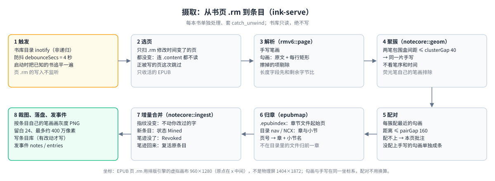

# reMarkable 笔记线（notes）白皮书

> **这是什么**：笔记线把你在 reMarkable 上用荧光笔勾的原文和旁边的手写批注，自动收进一个“条目库”；你在手机网页上挑选、改字、问 AI，再推送成设备上的笔记本或 Obsidian 用的 Markdown（md）文件。
>
> **读者**：想弄懂笔记线怎么工作、要改它、或要核对“哪些在真机上验证过”的人。只想装好用起来，看 [`../README.md`](../README.md)；整个系统的位置见 [`../../docs/OVERVIEW.md`](../../docs/OVERVIEW.md)。
>
> **怎么读**：第 1–3 节讲“是什么、怎么用”，新手读到这里就够；第 4 节讲内部怎么工作；第 5–6 节是查表用的参考；第 7 节是限制与排错；第 8 节集中列出**哪些在真机上验证过、哪些没有**。为什么这样设计、走过哪些弯路放在附录 A、B。代码注释里写的“白皮书 §03u”“第 13 章 7h”这类旧编号，到**附录 C 旧章节号对照表**查现在的位置。
>
> **验证程度的写法**：「真机」= 在设备上跑过真实数据；「离线」= 只有单测或开发机上的端到端；「已部署」= 代码已装上设备、部署自检（`verify-on-device.sh`、服务状态）通过，但这个功能本身还没人在真机上手测；「未部署」= 只在开发机上；「未验证」= 以上都没有。
>
> 笔记线挂在书架网关下面。网关、服务注册表、事件汇聚、部署脚本、原生回收站代理属于网关与书架（[`../../gateway/README.md`](../../gateway/README.md)、[`../../shelf/docs/reMarkable书架白皮书.md`](../../shelf/docs/reMarkable书架白皮书.md)），共用的 HTTP、上传认领等底层实现属于基座 rmsvc-core（[`../../rmsvc-core/docs/reMarkable设备端Web服务基座白皮书.md`](../../rmsvc-core/docs/reMarkable设备端Web服务基座白皮书.md)）。本文只写笔记线自己的东西。

## 1 5 分钟读懂

### 1.1 能做什么

reMarkable 的强项是“荧光笔勾书，再在勾出来的地方旁边手写”。文学书勾作者名写“查作者”，学术书勾公式写“？没听懂”——凡是勾了、写了的，都应该进笔记。笔记线做的事：

- **自动收集**：合上书后，勾画和旁边的手写自动配成一条“条目”；没写字的纯勾画也算一条。
- **手机上整理**：逐条决定要不要；要的手写交给视觉模型识别成文字，你改定；可以针对某一条问 AI。
- **推送**：每章一个按钮，生成设备上的笔记本（一章一本）和 Obsidian 用的 md（浏览器下载）。
- **全文搜索**：跨所有书搜原文、转写、AI 回答。
- **导入 md 文档**（默认隐藏）：选一个 `.md` 文件直接生成一份设备笔记本。

**一条原则**：设备只负责写，不负责改；改在手机上做，设备笔记本靠重新生成来更新。**条目库是唯一事实源**，设备笔记本和 md 都只是从它生成出来的“投影”。

### 1.2 由哪些部分组成


**四个服务**（都挂在网关下，只监听 `127.0.0.1`；网关 `gateway/src/manage.rs` 的 `MODULES` 登记了这四行）

| 服务 | 网关前缀 · 端口 | 一句话 | 出网？ |
|---|---|---|---|
| ink-serve（矿） | `/api/ink` · 8795 | 合上书后解析书页，把“勾画 + 旁边手写”配成条目；**唯一能写条目库的服务**；另管全文搜索 | 否 |
| transcribe-serve（转写） | `/api/transcribe` · 8796 | 订阅 ink 的条目事件，把手写裁图交给视觉模型，识别结果作为草稿写回 | 是 |
| mind-serve（脑） | `/api/mind` · 8797 | 用户点「提问」时，把这条的上下文和问题交给文字模型；没有后台任务 | 是 |
| note-serve（本） | `/api/notes` · 8798 | 注册网页的「笔记」tab；把条目库生成设备笔记本和 md；单篇 md 导入 | 否（只调 xochitl 的 `/upload`） |

**五个库**（`notes/crates/`）

| 库 | 做什么 | 谁用 |
|---|---|---|
| `rmv6` | `.rm` v6 笔迹文件的解析与写入（解析部分剥离移植自 `remarkable_lines` 0.1.3，MIT，见 `crates/rmv6/PROVENANCE.md`） | ink（读页）、note（写页）、notecore |
| `epubmap` | `.epubindex` + EPUB 目录 → “页号对应哪一章、哪一小节” | ink |
| `notecore` | 纯函数的领域核心：条目模型与状态转移、聚簇配对、增量合并、行首标记、投影、md 导出 / 导入、ink-serve 的 HTTP 契约类型（`api`） | 四个服务 |
| `vendorcfg` | 两个 AI 服务共用：模型预置表、key 按厂商分存、老配置迁移、用量账本、OpenAI 兼容调用端 | transcribe、mind |
| `notesvc` | `InkClient`：访问 ink-serve 条目库的唯一 HTTP 客户端 | transcribe、mind、note |

另外依赖基座 `rmsvc-core`（HTTP 服务框架、服务注册表、事件、XDG 路径、配置读写、xochitl 上传与认领）和它旁边的独立小库 `rmsvc-core/epubpkg`（EPUB 容器 / OPF 解析，与书架共用）。依赖方向单向：`services/* → rmsvc-core + crates/*`；不依赖其他项目线的任何 crate。

### 1.3 术语

| 词 | 意思 |
|---|---|
| xochitl | reMarkable 自带的阅读 / 笔记程序。本线只读它的书库目录，往里加东西只经它自己的 `/upload` 接口 |
| 网关（gateway） | 设备上唯一对外的 HTTPS 入口，负责登录和把 `/api/<前缀>` 转给各服务，见 [`../../gateway/README.md`](../../gateway/README.md) |
| rmsvc-core | 设备上各个小网页服务共用的基座库 |
| `.rm` | xochitl 存书页笔迹的文件，本线只读 v6 格式 |
| 勾画 / GlyphRange | 荧光笔划出的原文。`.rm` 里直接存着原文文字和位置矩形，不用识别 |
| 条目（Entry） | 一处“勾画，加上旁边的手写（可以没有）”。条目库里的最小单位，有 7 种状态（4.4） |
| 条目库 | 设备上 `~/.local/state/notes/books/<书 uuid>.json`，一本书一个文件 |
| 投影 | 从条目库重新生成的产物：设备笔记本（一章一本）和 Obsidian md（一章一个文件） |
| 去处（destination） | 每条内容去哪：设备笔记本 / Obsidian / 两处都要（默认两处） |
| 定稿 / 草稿 | 定稿 = 你确认过的文字（`text`）；草稿 = 模型识别结果（`drafts`，最新在前）。投影永远取“定稿，没有就用最新草稿” |
| 行首标记 | 一行开头的 `##`、`1.`、`-`、`口` 这类符号，决定这条在设备笔记本里用哪种内置样式（3.3） |
| 小节名（subhead） | 勾画所在位置在 EPUB 目录里顶层以下的标题，由 epubmap 自动填；投影在小节变化处插一行小标题 |
| 预置（preset） | 模型下拉菜单里的一项，包含“厂商 + 模型名 + 接口地址” |
| 回收站（笔记线的） | 网页「笔记 → 回收站」，放三种终态条目，可恢复；和 xochitl 自己的回收站是两回事 |

## 2 一条笔记的完整旅程


1. **在设备上**：用荧光笔勾一段原文，在旁边手写（可以不写），合上书。合书时 xochitl 会重写这本书的 `<uuid>.content` / `.metadata`。
2. **摄取（ink-serve）**：ink-serve 监听书库目录，4 秒防抖后只扫修改时间变了的页，把勾画和旁边的手写配成条目，画出手写的灰度裁图，按书的目录归章，状态 `Mined`（待浏览）。细节 4.2。
3. **浏览**：手机打开网关网页的「笔记 → 浏览」，只列 `Mined`。点「转入笔记」→ `Pending`（待转写）；没有手写的纯勾画直接用原文定稿为 `Reviewed`；点「不需要」→ `Skipped`，进回收站。
4. **转写（transcribe-serve）**：收到 ink 的事件后，只处理 `Pending`（以及补过笔、指纹变了的条目），把裁图交给视觉模型，原文经 ink-serve 写回成草稿，状态变 `Draft`。细节 4.7。
5. **整理**：「整理」页改字（失焦即保存，状态变 `Reviewed`；行首标记决定样式）、选去处；不要的点「不要了」（`Archived`，进回收站）。
6. **问 AI（mind-serve，可选）**：勾「问 AI」、填问题、点「提问」，文字模型的回答写回这一条。细节 4.8。
7. **推送（note-serve）**：每章一个「推送本章」，按每条的去处生成设备笔记本（放进书本所在的文件夹）、导出 md（提示里给下载链接）。内容没变就跳过；这章的旧版笔记本经书架的回收站代理几秒内挪进 xochitl 回收站。细节 4.10、4.11。
8. **得到**：设备上一章一本的只读笔记本，和一章一个 `.md` 文件（另有一个书的索引页）。

步骤 2–6 改的都是条目库里同一条记录；只有 ink-serve 能写它，其他服务和网页都经 ink-serve 的 HTTP 接口改（4.1）。

## 3 怎么用

### 3.1 装好、配好 key

1. 整包安装：在电脑上 `sh packaging/install-all.sh <设备IP>`（不写 IP 默认 USB 的 `10.11.99.1`），四个笔记服务随书架一起装好；只更新笔记线见 6.2。
2. 浏览器打开网关（见 [`../../gateway/README.md`](../../gateway/README.md)），进「笔记」tab。
3. 要转写手写、问 AI，先在「管理 → 模型管理」选厂商和模型、粘贴 key（3.4）。不配 key 也能用：纯勾画条目、手动打字、推送都不需要模型。

### 3.2 「笔记」页


页面代码在 [`../../gateway/ui/notes.js`](../../gateway/ui/notes.js) 的 `renderNotes`（模型管理卡片在 `gateway/ui/manage.js` 的 `mountModelPanel`），文案有中英两套（`notes.*` 命名空间）。顶部是选书、「重扫」和搜索框，下面四个子视图：

- **浏览**：只列 `Mined`，按页分组、最近变动的页在前；每条显示裁图和原文，两个按钮「转入笔记」「不需要」。
- **整理**：只列 `Pending` / `Draft` / `Reviewed`。
  - 第一层两个 tab「未导出」「已导出」：一章归哪边**只看这章有没有推送过**（`everExported`：`/sync` 返回的 `notebookGeneratedAt` 或 `obsidianExportedAt` 非空）。推送过就稳定留在「已导出」，之后又改了，章头徽章从 ✓ 变成 …。
  - 第二层是章节标签，只列当前 tab 下有条目的章，点哪章只显示哪章。编辑不会把画面甩到别的章；只有点 tab 或「推送本章」成功后，才跳到下一个待处理的章。没有章的条目（“未归章”）永远在「未导出」，没有推送按钮（推送接口按章定位）。
  - 章头：章名、条数、同步徽章（📓 设备笔记本 / Obsidian 图标，✓ = 与当前内容一致）、「推送本章」。md 的下载链接在提示里给，由你点击下载。
  - 条目卡片：卡片头（页码 · 小节 · 样式 · 本条去处的同步徽章 · 状态）、裁图、原文、文本框（显示“定稿，没有就用最新草稿”，失焦即保存）、去处循环按钮（设备 → Obsidian → 两处）、「转写」/「重新转写」、「不要了」、问 AI 区。转写失败的卡片标红，按钮文字变成“转写失败”。
  - 「重新转写」和「提问」会原地显示“转写中… → ✓ 本次 token 入 X 出 Y”或失败原因，停留 3 秒再刷新，这 3 秒里事件触发的自动刷新被挡住。
- **回收站**：列出三种终态条目的实际内容，每条显示状态、去处和所在章的同步状态（是**整章**的，无法反推“这条当初有没有被推送进去”）；每条「恢复」，另有「全部恢复」「清空回收站」，两个整体操作都要确认。「清空回收站」是真删除，不可恢复。
- **导入 md 文档**：见 4.12。可见性由「管理 → 实验室」的 `notesImportMdEnabled` 开关控制（用 `hidden` 属性隐藏而不是删节点，因为子视图切换按位置下标配对）。
- **搜索框**：点结果按条目状态跳：`mined` → 浏览、`skipped` / `archived` → 回收站、其余 → 整理。

### 3.3 行首标记：用写法决定样式


手写转写出来的文字和网页里打的字用同一套规则（`notecore::marker`，2026-09-25 用户定案：标记与设备笔记本的内置样式一一对应，导出 md 时落成对应的 markdown）：

- 只看第一行的行首；标记从正文剥掉（设备样式自带圆点、编号、方框）。
- `##` → 大字号小标题（Subheading 1）；`###` 及以上 → 加粗小标题（Subheading 2，设备只有两级）；单个 `#` 不接（Title 是章名级别）。
- `1.` `2、` `3)` `4）` → 编号列表；编号后面紧跟数字的是小数或版本号（`3.14 是圆周率`、`1.5倍速`），不当编号；`2.背诵` 这种编号后不带空格的仍认。
- `- ` `• ` `· ` `* ` `—` → 圆点列表（`-3 度` 不算）。
- `- [ ]` `[ ]` `- [x]` `口` `□` → 复选框；复选框在“无序 `-`”之前判；方括号里是别的字（`[注]`、`[1]`）不算，`口渴了` 不算；勾选态写不出，`- [x]` 也落成未勾选。
- 样式判定只靠识别出来的文字，没有几何判定。
- md 导入（4.12）对应到同一套设备样式，但按规范 markdown 解析（标题要求 `#` 后有空格，不认 `口`），另把单 `#` 当 Title、`+` 当圆点。

### 3.4 模型管理


网关「管理」tab 的“模型管理”卡片，视觉（转写）和文字（问 AI）各一张：

- **选模型**：先选厂商（DashScope / OpenAI / Gemini / DeepSeek / 自定义），再选该厂商的模型；选厂商时立即切到它的第一个模型。`PUT /config {preset}` 一次同时改好模型名和接口地址；不认识的预置名返回 400、配置不变。“自定义”才露出手填模型名和接口地址。
- **key**：按厂商分格存，同厂商换模型不用重新粘贴；切到没配 key 的厂商就显示“没配”，不会借用别家的 key。网页只显示脱敏后四位，已存的 key 只能删除再填。环境变量 `DASHSCOPE_API_KEY` 只对 DashScope 兜底。
- **用量与花费**：按模型分账（次数、成功失败、输入输出 token、最近错误）。不内置官方价格表，单价自己填（每千 token，输入、输出各一档）；没填时花费显示为空，和“填了 0 元”区分开。
- **自动转写开关**：视觉卡片上的“自动转写”（`auto`，默认开）。
- **豆包**：它的“模型”是账号自建的接入点 id（`ep-xxxx`），没有通用名字，不进预置表；用“自定义”，接口地址填 `https://ark.cn-beijing.volces.com/api/v3`。

现行预置表见 5.6。只有 DashScope 在真机上真调过（8.1）。

## 4 怎么工作

### 4.1 服务之间怎么交互


- **单一写者**：多个进程各自“读—改—写”同一个 JSON 迟早互相覆盖，所以条目库只有 ink-serve 写。网页改字调 `POST /api/ink/books/{uuid}/entries/{id}`，转写写草稿调 `…/draft`，问 AI 写回答调 `…/answer`，浏览 / 整理 / 回收站动作是 `…/request` `…/skip` `…/archive` `…/restore`（完整列表 5.1）。
- **契约类型共用**：请求 / 应答类型在 `notecore::api`，收发两端用同一份：网页改字用 `EntryPatch`（只认 `text` / `destination` / `askAi` / `question` 四个字段），草稿用 `DraftPost {text, backend, hash}`，回答用 `AnswerPost {text, backend, brief}`。请求体一律拒收未知字段，形状不对直接 400（2026-10-10 起；此前接收端逐字段“能读就读”，形状写错照样 200，`answer` 形状不对甚至会把已有回答清空）。
- **状态只在一处改**：条目状态转移全部收在 `notecore::model::Entry` 的方法里（4.4），服务代码里不直接给 `status` 赋值。转写服务写回的是模型给的**原文**，剥行首标记、要不要采纳样式都由 ink-serve 的 `Entry::accept_draft` 决定。
- **应答带 `live`**：`GET /books/{uuid}` 给每条条目多一个 `live`（＝`is_live_for_projection()`），只在 HTTP 应答里，不写进条目库文件；网页据此判断，不再自己抄一份状态表。
- **InkClient**：transcribe / mind / note 三个服务都用 `notesvc::InkClient` 访问 ink-serve（2026-10-10 由三份各写各的客户端合成）。各服务仍保留自己的窄 `EntryStore` trait 作为单测换内存桩的接缝。读操作用基座的 `try_get_typed`，错误带对方状态码：ink-serve 回 404 就原样 404，ink-serve 没运行 / 连不上 → 503。
- **事件驱动，不轮询**：ink 只在书库目录上挂非递归 inotify；transcribe 订阅 ink 的 `/events`；网页订阅网关汇聚后的 `/api/events`。事件区域都是 `notes`：ink 发 `entries`，transcribe 发 `transcribe`，note-serve 生成笔记本后发 `notebooks`（5.2）。mind-serve 不发事件、网关也不给它起订阅。

### 4.2 摄取：从 `.rm` 到条目（ink-serve）



| 步骤 | 做什么 | 关键事实 |
|---|---|---|
| 触发 | inotify 监听书库目录（非递归），`debounceSecs` 默认 4 秒。启动时先把所有有 `.rm` 页的 EPUB 和条目库里已知的书追平一遍；追平前，**还活着却没有章的条目**所在页的 mtime 记录会被忘掉，让这次追平重扫、按最新规则归章（2026-09-30） | 页 `.rm` 的写入不监听（文件多，而且是 xochitl 内部节奏），只靠合书时 `.content/.metadata` 被重写来触发。每本书的摄取套 `catch_unwind`，解析器 panic 只跳过这本这一次 |
| 选页 | 先列出有 `.rm` 的页，和条目库里记的 `page_mtimes` 比，只扫修改时间变了的页；一页都没变就直接返回，连 `.content` 都不解析（读书时 xochitl 会反复改写 `.content`，大多数触发其实没事可做）。mtime 只到秒：页的修改时间落在“当前这一秒”时少记一秒，下次事件再扫一遍 | 只处理活的 EPUB：不在回收站、没标 deleted、`fileType=epub`。页号取 `.content` 的页表（基座 `PageTable`，2026-10-10 起与书架共用）：有 `pages` 用它的下标；只有 `cPages` 的新形状按序号排、去掉已删页 |
| 解析 | `rmv6::page::Page` 取出三样：手写笔画、勾画（GlyphRange：原文 + 每行矩形）、打字文本。读文件前后比对同一个文件描述符的（长度, mtime, inode），对不上就当“正在写入”跳过这页、不记 mtime | 勾画与手写在**同一坐标系**，配对不用换算。擦掉的项有两种写法（独立墓碑块，或 item 自身值为空），都已剔除。文件里的长度字段先和剩余字节比，超了直接报错、不按它分配内存 |
| 聚簇 | `notecore::geom::cluster`：任意两笔包围盒间距 ≤ `clusterGap`（默认 40）就归一簇 | 不看笔序和时间（用户会回头补几笔）。荧光笔自己也留一条笔画，按工具类型排除 |
| 配对 | 每簇配最近的勾画，距离 ≤ `pairGap`（默认 160），否则算“本页批注”；没被任何手写簇配上的勾画单独生成一条 `ink: None` 的条目 | 阈值由真机样本标定：批注簇到对应勾画距离为 0、到次近勾画 ≥148（09-07 定 40 / 120）；09-25 用户在勾画右上方隔几个字写批注，距离约 138，`pairGap` 放宽到 160（用户拍板）。代价：两条勾画靠得近时，夹在中间的手写更可能挂到另一条上 |
| 归章 | `epubmap`：`.epubindex` 给出每个章节文件的起始页，EPUB 目录（nav 文档，没有就用 NCX）给出层级，得到“页号 → 章 / 小节”。章 = 目录里的顶层条目；小节名 = 顶层以下各级的标题，写进 `Entry.subhead` | **找目录文件**：先按 `META-INF/container.xml` → OPF → manifest 里声明的（`properties` 含 `nav`、NCX 媒体类型）；没声明再按文件名猜（正好叫 `nav.xhtml` 的优先）。**href 先解 XML 实体再解百分号编码**（`a&amp;b.xhtml`、`a%20b.xhtml`）。container / OPF / manifest / href 解码和 `.epubindex` 起始页表的解析都在共享的 `rmsvc-core/epubpkg`（与书架共用）；注释里的 `<rootfile>`/`<item>` 不算，目录文件解压超过 16 MB 当读不到。**不在目录里的 spine 文件**（拆分出来的正文份、Calibre 的 `index_split_NNN`）归到前面最近一个在目录里的文件那一章；封面等第一个目录条目之前的页没有章。目录一时读不到时保留上次的章表和条目的章。`.epub` 以文件读端打开，只读 zip 中央目录和目录那一两个条目，不整本读进内存 |
| 合并 | `notecore::ingest::merge_page`，规则见 4.3；同一页重新摄取时，认领到的旧条目跟着刷新页序号、章、小节（不改 id 和内容） | 读—改—写之后内容没变就不重写条目库 |
| 裁图 | `crop::render_ink` 按条目自己的笔画 id 挑出笔画，在包围盒加 `cropMargin`（24）范围内按 2 倍缩放画白底黑线的 **8 位灰度** PNG | 宽或高小于 8 像素就拒绝，不把废图发给模型；一张最多约 400 万像素（`MAX_CROP_PIXELS`，超了按比例降缩放）；包围盒坐标不是有限数直接报错。补了几笔、裁图换了名字后删掉旧的那张。`GET …/crops/{file}` 回 `Cache-Control: private, max-age=31536000, immutable`（裁图名带笔迹哈希，内容永不变；网关只在 200 时透传这个头） |

**坐标系**：EPUB 页 `.rm` 的坐标是排版引擎的**虚拟画布 960×1280**，原点在 x 中间，不是物理屏 1404×1872。笔记本、PDF 的画布没单独测过，不能套用这组数。

### 4.3 增量规则：改好的字不会被覆盖

- 每片手写按“笔画 id 集合 + 点数 + 量化后的包围盒”算 FNV-1a 指纹。
- 指纹没变：不重新转写，不动你改过的文字。
- 补了几笔（笔画有重叠但指纹变了）：还是同一条目，新识别结果只作为新草稿，不碰定稿文字；随草稿来的样式也只是建议，条目已有定稿文字时不采纳。
- 勾画旁边后来补了手写，或者把旁边的手写擦掉只剩勾画：按勾画自己的 id 认回**原条目**，id、状态、定稿文字、样式、问答都保留，只换手写部分。只认没处理掉的条目：「不需要」或已归档的勾画后来补了手写，算新意图，另起一条。
- 笔画全没了：条目标 `Revoked`，不删除。
- 笔画又回来了（xochitl 里撤销了擦除、书从回收站恢复）：认领不到活条目时再找本页的 `Revoked` 条目，同指纹 / 共享笔画 / 同勾画 id 就**复活原条目**（`Entry::revive`，落点见 4.4）。笔画 id 是 CRDT id，新笔迹不会复用，能对上只可能是原来那批。
- 条目 id 按（书、页、最小笔画 id）在创建时算一次，以后永不重算；纯勾画条目用勾画自己的 id。万一撞上已有条目（旧版本造出的重复）就加序号，一本书里 id 唯一。
- 草稿只留最近 10 份。
- 投影永远取“定稿文字，没有就用最新草稿”。

### 4.4 条目状态机


状态只经 `Entry` 的方法改（2026-10-10 收拢）：

| 方法 | 谁调 | 做什么 |
|---|---|---|
| `set_triage` | 「转入笔记」`/request`、「不需要」`/skip`、「不要了」`/archive` | 转入笔记的落点：已有定稿 → `Reviewed`；没有手写（纯勾画、以及以前拉进来的 KOReader 条目）→ 用原文定稿、`Reviewed`；只有草稿 → `Draft`；其余 → `Pending`。终态一律拒绝（对同一个终态重复点算无改动） |
| `accept_draft` | 转写写回 `…/draft` | 行首标记一律剥掉；还没定稿时采纳识别出的样式、状态落 `Draft`；已有定稿时样式和状态都不动、草稿只作建议；草稿只留 10 份 |
| `accept_answer` | 问 AI 写回 `…/answer` | 写 `Answer{text, backend, at, brief}`，不改状态 |
| `apply_marked_text` | 网页改字 | 认行首标记定样式并剥掉；非空 → `Reviewed`；清空 → 有草稿回 `Draft`，否则 `Pending` |
| `restore` | 回收站「恢复」 | `Skipped` 固定回 `Mined`；另两种按已有内容倒推：有定稿 → `Reviewed`、有草稿 → `Draft`、有手写 → `Pending`、否则 `Mined`。恢复的是条目库里的内容，**设备页面上已擦掉的笔迹不会重新出现** |
| `revoke` | 摄取：笔迹没了 / 书没了 | 非终态 → `Revoked`；终态不动 |
| `revive` | 摄取：笔迹回来 | 只对 `Revoked`：有定稿 → `Reviewed`、有草稿 → `Draft`、否则 `Mined`。和「恢复」只差最后一档：只有手写的条目回 `Mined` 而不是 `Pending`，自动复活不代表你要转写 |

- 三个终态（`Skipped` / `Revoked` / `Archived`）合称 `is_terminal()`，都在回收站里。改字、写草稿、写回答、浏览 / 整理动作对终态一律拒绝，要先「恢复」。`Skipped` / `Archived` 是你主动处理的，不会自动复活。
- 进投影的只有 `Pending` / `Draft` / `Reviewed`（`Status::is_live_for_projection()`，全项目唯一的判据）。
- 「清空回收站」（`Book::purge_terminal()`）才是真删除，被清条目的裁图一并删；只能手动点，不会自动清。

### 4.5 书删了、笔迹擦了

- 书进了 xochitl 回收站、被彻底删除、或文件不见了：`ingest::revoke_stale()` 把这本书所有**非终态**条目标成 `Revoked`，已经是终态的不动。已生成的笔记本和 md 是独立文件，不会被删。同时清空这本书的页 mtime 记录：书从回收站恢复时页文件原样没变，不清的话“页没变”早退、条目永远停在 `Revoked`；清了之后恢复时整本重扫，按 4.3 认回原条目。
- “书没了”只认两种：`.metadata` 不存在，或读出来确实在回收站 / 标了删除。`.metadata` 读不了或解析失败（可能正被 xochitl 改写）只跳过这一次，不撤销。
- `GET /books` 只列“至少还有一条非终态条目”的书，清空了的书自动从下拉菜单里消失。

### 4.6 条目库存储与全文搜索

- **存储**：一本书一个 JSON，原子写入，**紧凑格式**（2026-10-10 起；每次改字 / 写草稿都整本重写，300 条的合成书 pretty 585 KB → 紧凑 314 KB，序列化 0.94 → 0.51 ms，开发机实测；新旧版本互读，人工看用 `jq .`）。读—改—写在 ink-serve 进程内一把锁；内容没变就不写盘；落盘文件名以请求的 uuid 为准。
- **解析缓存**：基座 `StampCache`（容量 512）按文件的 (inode, 长度, mtime) 记住上次解析结果，文件没变就直接复用；外部改写、改坏或删除会让文件身份对不上，自动回到读盘（开发机合成 30 本 / 3.6 MB：`GET /books` 5.66 ms → 35 µs）。
- **损坏处理**：文件不存在 → 当新书；读不了或解析失败 → 报错，另存一份 `<uuid>.json.corrupt`（已存在就不重复拷），原文件不动，之后对这本书的写入一律拒绝，网页打开会看到 500 和原因。
- **全文搜索**：`GET /api/ink/search?q=&limit=`（`limit` 默认 50，上限 200）。跨所有书，搜勾画原文、定稿文字、草稿、问题、AI 回答和书名，不区分大小写；排除 `Revoked`，但 `Skipped` / `Archived` 会被搜到；每条只报第一处命中，片段前后各留 30 个字；没有定稿时才搜草稿，且只搜最新一份。个人笔记量级，每次全扫条目库、不建索引（走上面的解析缓存；3000 条全扫未命中约 4.3 ms）。

### 4.7 转写（transcribe-serve）

- **触发**：订阅 ink 的 `/events`，收到 `entries` 事件且开着“自动转写”（`auto`，默认开）时，防抖 3 秒后跑一轮；启动时也跑一轮。每轮套 `catch_unwind`，panic 只丢这一轮。网页卡片上的「重新转写」调 `POST /books/{uuid}/entries/{id}`，强制转写这一条，忽略指纹和失败次数上限；自动与手动互斥。
- **一轮做什么**（`worker::run_once`）：只看还有待转写条目的书 → 挑出 `needs_transcribe()` 的条目（状态是 `Pending` / `Draft` / `Reviewed`、有手写、且当前指纹还没有对应草稿）→ 取裁图 → 组提示词 → 调模型 → 把**原文**写回 ink（`POST …/draft`）→ 记账。草稿的 `backend` 记真实模型标识（预置 id 或 `custom:<模型名>`，与用量账本同一个键）。
- **提示词要点**（`prompt.rs`）：只转写不发挥；保留换行和行首符号；手写的汉字数字必须照写成汉字（针对“一”被认成“1”加的规则）；认不出的字用“？”；勾画原文截取 300 字作为参考语境（帮助认人名术语，但明确要求别抄原文）；`temperature=0`。
- **节流**：每轮最多 `maxPerRun` 20 条，请求间隔 `pauseMs` 300 ms；同一条同一指纹失败 `maxAttempts` 3 次后不再自动试（指纹变了清零）；一轮里失败满 3 次且一条都没成功就停，避免 key 错或断网时一条条撞 `timeoutSecs`（默认 60 秒）超时。瞬时故障先原地重试一次（4.9）。
- **空跑不留痕**：这一轮没调模型、而且和上一轮除时间外完全一样，就不写账本、也不发 `transcribe` 事件（网页每收到一条事件都会整页重拉）。
- **记账**：账本只记模型调用本身。模型失败记一次失败；调用成功就记 token（钱已经花了），即使随后写回 ink-serve 失败也照记成功；取不到裁图这类没调模型的本地错误不进账本（但仍进失败清单，按 `maxAttempts` 重试）。一轮里逐条记账只改内存、一轮结束一次写盘（`vendorcfg::Ledger::hold`，2026-10-10；缺省上限 20 条时一轮写闪存 21 次 → 1 次）；代价是一轮中途掉电会丢这一轮的计数，账本只用来看用量，可以接受。写盘失败打日志、下次再试。
- **强制转写一条的回执**：成功回这次调用的 token 数；真调了模型却失败（取裁图 / 模型 / 写回）→ 502；没这条、没手写、终态、没配 key → 400。

### 4.8 问 AI（mind-serve）

- **用法**：「整理」卡片勾「问 AI」、填问题、点「提问」→ `POST /books/{uuid}/entries/{id}/ask`。服务端要求条目已勾选且问题非空，否则 400（防误触）；没配 key → 400；书不在条目库 → 透传 ink-serve 的 404，ink-serve 没运行 → 503；模型调用或写回失败 → 502。
- **提示词**：书名 + 章节 + 勾画原文 + 旁边批注（定稿或草稿）+ 问题，长度各有截断；`temperature` 0.3。回答经 `POST …/answer` 写回为 `Answer{text, backend, at, brief}`，`brief` 存当时问的问题，`backend` 记真实模型标识。
- **记账**：模型报错记一次失败；模型答了就先记 token 再写回 ink，写回失败也不丢这笔用量。
- **纯被动**：没有后台线程、不订阅事件、不批量跑，空闲时零 CPU；网关登记里它的 `events` 是 `false`。
- **默认模型**：代码默认 `qwen-plus`。真机测试时那把 DashScope key 只开了视觉模型权限，文字模型返回 403，设备上手动改成了 `qwen3-vl-plus`（视觉模型也能处理纯文字）；没有为一把受限的测试 key 改全局默认值。

### 4.9 模型调用端（vendorcfg）

- 两个服务都用 `vendorcfg::ChatClient`（后端标识 + 接口地址 + 模型 + key + 带超时的 HTTP agent）发 OpenAI 兼容的 `POST {baseUrl}/chat/completions`，各服务只拼自己的请求体（转写带 `image_url`）。编排逻辑注入 `Vision` / `TextModel` trait，用内存桩单测。`ChatClient` 故意不派生 `Debug`，避免 key 被 `{:?}` 打进日志。
- **复用**（`ClientCache`）：配置（后端 / 地址 / 模型 / key / 超时）没变就复用上一次建的调用端，连同还活着的 HTTPS 连接；改了配置，下一次调用自然换新的。
- **闲置重建**：复用的调用端闲置超过 45 秒（按墙钟，含设备休眠）就重建。休眠或换 WiFi 后旧连接会悄悄死掉，HTTP 库看不出来、POST 又不自动重发，结果要么立刻报连接被重置，要么干等满一整个超时。
- **瞬时故障重试一次**：遇到 429、5xx、DNS 解析失败、连不上、连接被掐断时，等 `Retry-After`（缺省 2 秒，最多 10 秒）再试一次；只在第一次失败得快（15 秒内）时重试，超时不重试。其余错误（如 401 key 错）照旧直接报。
- **key 归属**：预置在表里查不到时，按接口地址认厂商（`provider_for_base_url` 查 `PROVIDERS` 表；测试保证每条预置的厂商与它地址认出的一致）。
- **老配置迁移**：旧版单一 `model` / `baseUrl` / `apiKey` 启动时由 `migrate()` 搬进新结构，匹配不到预置就落到“自定义”并保留模型名；DeepSeek 两个已下线的旧 id 启动时经 `remap_retired_preset` 自动改成 `deepseek-flash`，自填单价一起搬。配置文件权限 0600，创建时就是 0600。
- **配置文件坏了**：按缺省运行但**不写回**，另存一份 `.corrupt`，等用户在网页上主动保存才写新文件。

### 4.10 推送设备笔记本（note-serve）


**写 `.rm`**：`rmv6::write` 只自己编码 `RootTextBlock`（正文文字块），其余块用一份真机产出的 `.rm` 当模板原样拼回。全新文档没有编辑历史，CRDT id 连续分配。打包成 `.metadata` + `.content`（`fileType: notebook`）+ 一页 `.rm` 的 `.rmdoc`（STORED 不压缩，几 KB，全程在内存里），经 xochitl 的 `POST /upload` 上传。七种打字样式都能写（xochitl 3.28 格式菜单），真机渲染逐一核对过：

| 样式 | `.rm` 码 | 投影里用在哪 |
|---|---|---|
| Title | 2 | 章名（每本笔记本一个） |
| Subheading 1 | 3 + 格式子块末尾 7 字节 `21023403000000` | 书的小节名（小节变化时插一行）；条目 `##`；md 导入 `##` |
| Subheading 2（加粗小标题） | 3（`ParagraphStyle::BOLD`），不带那 7 字节 | 条目 `###`；md 导入 `###` 及以下 |
| Body | 1 | 正文条目、〔原文〕、〔AI〕 |
| Bulletpoint | 4 | 无序条目 |
| NumberedList | 10 | 有序条目，编号 xochitl 自动数 |
| Checkbox | 6 | 待办条目；“已勾选”（码 7）只能在设备上点出来，写不出 |

**投影规则**（`notecore::project`）：Title = 章名；本章活条目按页序平铺，同一章里小节名一变先插一段 Subheading 1（同一小节不重复）；样式取条目样式；文字取“定稿，没有就用最新草稿”，都没有就写“（待转写）”；每条下面跟一段 Body 的 `〔原文〕…` 和 `〔AI〕…`（有才写）。只收去处是“设备”或“两处”的条目。

**生成编排**（`publish::generate_chapter`；上传、回收站、读条目库都是 trait，测试用内存桩）：

1. **加锁**：生成、md 导入、md 导出共用一把锁。同一章被并发推送两次（双击、两个浏览器页）时，否则两边都会看到指纹变了、各传一份，再按同一个名字认领到同一个 uuid，另一份成了没人追踪的孤儿笔记本。
2. **算本章指纹**（章名 + 各条目 id / 样式 / 小节名 / 文字 / 原文 / 回答；两条投影共用 `project::fingerprint_entries`，只是各自的条目集合按去处过滤），和上次记录一样 → `unchanged`，不联网。
3. **放在哪、叫什么**：`folder_of_document` 读书本 `.metadata` 的 `parent`，得到 `Folder`（根或某个文件夹；查不到落根）；按 `Folder` 上传，类型上就传不进文件夹名字。名字是章名，首次生成时在同一文件夹内查重、重名加数字后缀；**重新生成沿用上次记下的名字**（此时旧文档还占着这个名字，重新查重会把自己判成重名，“楔子”变“楔子 2”）。
4. **上传并认领**：调基座 `Xochitl::upload_and_claim(UploadBody::Bytes, …, ClaimBy::VisibleName(名字), ClaimWait::new(5 秒))`（2026-10-10 起整段交给基座）：上传前快照最近两秒内新建的文档；“设当前文件夹 + `/upload`”在跨进程上传锁里做（和书架投书互斥，免得落进对方的文件夹）；认领时只在快照之外的新文档里找同名的（多于一份取最早建的），用 `fswatch::wait_for` 挂书库目录监听，文件落盘就认领，最多等 5 秒，**绝不“取最新一本”兜底**。xochitl 会重新分配文档 uuid、把 `.rmdoc` 解包成页面，书库里没有与上传字节相同的文件，所以判据只能是名字。仍认领不到时，设备上可能留下一份没人追踪的同名文档，错误文案会提示手动删掉多的那份（完整事务化判定为不值得）。
5. **旧版本进回收站**：这章以前生成过 → 旧文档交给书架 book-serve 的回收站队列（用生成时记下的旧名字，book-serve 按名字核对 uuid 防错删），由设备上的 `shelf-trash-agent.qmd` 移进 xochitl 回收站（长轮询、按 id 执行，入队后几秒内生效）。直接改 `.metadata` 的 `parent` 会被运行中的 xochitl 覆盖，只能走这条路。入队失败不算本章失败。
6. **记录**：写 `{doc_uuid, visible_name, fingerprint, generated_at}` 到 `~/.local/state/notes/notebooks/<书 uuid>.json` → `generated`。任何一步失败都不写记录，下次照常重试。记录文件解析失败时先另存 `.corrupt`、按空记录处理（`doc_uuid` 是把旧版本送进回收站的唯一线索，丢了会在设备上多出一份旧笔记本，要手动删）。

**章里没有要投影的条目时**：只有这章**一个活条目都没有了**才清掉历史记录；条目还在、只是去处改到了另一边，记录保留（`Book::chapter_has_live_entries`）。

**回执**：`POST /books/{uuid}/chapters/{idx}/generate` 回 `{chapters:[{chapter, title, status, …}]}`，`status` 为 `generated`（带 `doc_uuid`）/ `unchanged` / `empty` / `failed`；失败原因字段叫 `message`（与网关批量、清理的失败项同名；2026-10-10 前叫 `error`，网页同步改读 `message`）。取书失败不进这张表，直接是 HTTP 错误（ink-serve 404 原样、没运行 503）。

**一次生成读多少次书库**：`folder_of_document` 读书本那一份 `.metadata`；首次生成时 `unique_name` 整库读一遍 `.metadata`（重新生成不调）；认领是“快照列一次 + 等待中每次目录变化列一次”，每次列都先用目录项的 mtime 挡掉 7 秒前没改过的文件，只打开刚改过的几份。

### 4.11 Obsidian md 导出与同步状态

- **md 投影**（`notecore::export`）：一章一个 `第N章 章名.md`，外加书索引页 `书名.md`。front-matter 有 `book` / `author` / `chapter` / `pages` / `status`（全部定稿才是 `reviewed`）/ `tags`，然后是 `[[书名]]` 反链；小节名变化处出 `## 小节名`；条目按样式渲染成列表、复选框（`- [ ]`）、标题（`##` / `###`，标题行不带块锚——Obsidian 的块引用不作用在标题上）或段落，其余每条末尾带 `^<条目id>` 块锚（稳定 id），原文和回答以引用块跟在下面。只收去处是“Obsidian”或“两处”的条目。
- **落盘**：`POST …/chapters/{idx}/export`（只有按章的入口，但内部按整本重导、内容没变的章跳过——书的索引页要看全书才算得对）写到设备 `~/.local/share/notes/vault/<书名>/`（书名里的 `/`、`\` 换成 `_`；整个书名是空串、`.` 或 `..` 时目录名用 `_`，防止写到 vault 之外）。
- **下载**：「推送本章」写出后在提示里给 `GET …/chapters/{idx}/export.md` 的链接，点了由浏览器下载（当场生成，不读盘；文件名按 RFC 5987 编码）。网关代理为此额外转发 `Content-Disposition` 响应头。
- **同步状态**：`GET /books/{uuid}/sync` 每章给出 `notebookNeeded` / `notebookSynced` / `notebookGeneratedAt` 和对应的 `obsidianNeeded` / `obsidianSynced` / `obsidianExportedAt`。`*Needed` = 现在有没有条目要这个去处；`*Synced` = 当前内容指纹与上次推送一致；`*GeneratedAt` / `*ExportedAt` = 历史上推送过的时间。两条投影各算各的指纹；每次请求每本书的两份记录各只读一次。

### 4.12 单篇 md 导入

「导入 md 文档」选一个 `.md` 文件，直接生成一份新的设备笔记本，**不经条目库**、不写生成记录（重复导入会生成多份，靠重名后缀区分）。落在当前所选书本的文件夹里，和推送走同一条上传路（`upload_page`）。处理函数先从条目库取书：书不在条目库回 404（透传 ink-serve），上传 / 认领失败回 500。返回实际用上的名字（可能带去重后缀）。

映射：`#` → Title，`##` → Subheading 1，`###` 及以下 → Subheading 2，`-` / `*` / `+` → 无序，`1.` / `1)` → 有序，`- [ ]` / `- [x]` → 待办（已勾选降级为未勾选），其余 → Body。行内加粗、斜体、代码只剥掉**成对**的符号（样式是按段落的，做不到半句加粗）。用户明确要求这个入口不放进「整理」，也不做 Obsidian 双向同步。

### 4.13 数据保护与后台韧性

- **读失败 ≠ 不存在**：条目库、两份 AI 配置、两份用量账本、两类“每章推送记录”解析失败时，都先在同目录另存一份 `*.json.corrupt`（**只留第一份**：已有就不再覆盖；用 rmsvc-core 的 `config::backup_corrupt`），再按各自规则处理——条目库最严格，拒绝一切写入；AI 配置按缺省运行但不落盘；账本从零记起；章记录按空记录处理（下次推送会当首次生成，旧笔记本不会自动进回收站）。`ink.json` / `note.json` 经基座 `config::load_or_seed` 读：只在文件不存在时写缺省值，坏了按缺省运行、不覆盖原文件，并打日志、留 `.corrupt`（2026-10-10 起，此前坏了不留痕）。
- **读不了 ≠ 书没了**：见 4.5。
- **不拿写到一半的文件当真**：读一页 `.rm` 前后比同一个文件描述符的（长度, mtime, inode），对不上就跳过这页、下次再扫（4.2）。v6 是一串块，截在块边界上的半截文件照样能解析，只是少了后面的笔画——当真会把那些条目撤销。
- **不信文件里声明的长度**：`.rm` 的块大小、字符串长度先和剩余字节比，超了直接报错；EPUB 目录文件最多解出 16 MB。内存分配失败是 abort，`catch_unwind` 兜不住，只能在分配前拦。
- **串行化**：条目库的读—改—写在 ink-serve 进程内一把锁；note-serve 的生成、md 导入、md 导出共用一把锁；“设当前文件夹 + 上传”在基座的跨进程锁里（4.10）。
- **后台线程兜 panic**：ink-serve 书库监听线程里每本书的摄取、transcribe-serve 工作线程的每一轮都套了 `catch_unwind`，一次 panic 只丢这一本 / 这一轮；否则线程会静默退出，HTTP 照常应答，从外面看不出后台已经停了。这依赖 `notes/Cargo.toml` 的 release profile 设 `panic = "unwind"`。
- **没事做就不写盘、不发事件**：摄取先比页 mtime；条目库内容没变就不重写；转写空跑不写账本、不发事件。
- **大书不整本读**：页 → 章映射只读 zip 目录和目录条目（120 MB 合成书峰值 RSS 127 → 12.7 MB，开发机验证），否则绕过 100 MB 上传限制的大书会顶破 `MemoryMax=128M`。

## 5 接口与配置参考

### 5.1 HTTP 接口

都经网关前缀 `/api/<前缀>` 访问；请求 / 应答类型见 `notecore::api`。

| 服务 | 路由 |
|---|---|
| ink（`/api/ink`） | `GET /books`（只列还有活条目的书；每项 `{uuid,title,chapters,entries,pending}`）· `GET /books/{uuid}`（整本书，每条条目带 `live`）· `GET /books/{uuid}/crops/{file}` · `POST /books/{uuid}/entries/{id}`（网页改 `text` / `destination` / `askAi` / `question`；未知字段、形状不对回 400；终态条目拒改）· `POST …/entries/{id}/draft`（transcribe 写草稿：`{text,backend,hash}`，原文）· `POST …/entries/{id}/answer`（mind 写回答：`{text,backend,brief}`）· `POST …/entries/{id}/request`（转入笔记）· `…/skip`（不需要）· `…/archive`（不要了）· `…/restore`（恢复）· `POST /books/{uuid}/purge`（清空回收站，不可恢复）· `POST /books/{uuid}/rescan`（清掉页 mtime 记录再摄取；只对条目库里已有的书）· `GET /search?q=&limit=` · `GET /events` |
| transcribe（`/api/transcribe`） | `GET /status`（配置、按模型用量、失败清单、ink 是否可达、待转写数）· `GET /config` · `PUT /config`（`preset` / `apiKey`（只写）/ `clearKey` / `price`（`{inputPer1k,outputPer1k}`，老写法 `{input,output}` 也认）/ 自定义 `model` + `baseUrl` / `auto` / `maxPerRun` / `pauseMs` / `timeoutSecs` / `maxAttempts` / `prompt`）· `POST /books/{uuid}/entries/{id}`（强制转写一条，返回 token 用量）· `GET /events` |
| mind（`/api/mind`） | `GET /status` · `GET /config` · `PUT /config`（同上，但只有 `timeoutSecs` / `prompt`，没有节流字段）· `POST /books/{uuid}/entries/{id}/ask`（要求已勾「问 AI」且问题非空） |
| notes（`/api/notes`） | `GET /status` · `GET /books/{uuid}/sync` · `POST /books/{uuid}/chapters/{idx}/generate` · `POST /books/{uuid}/chapters/{idx}/export`（`status`：`written` / `unchanged` / `empty`）· `GET /books/{uuid}/chapters/{idx}/export.md` · `POST /books/{uuid}/import-md {title, markdown}`（两者必填）· `GET /events` |

**错误码约定**（2026-10-10 统一）：请求体不合法 400；书 / 条目不存在 404（经 InkClient 透传 ink-serve 的 404）；ink-serve 没运行 503；调模型失败、写回 ink 失败 502；上传 / 认领失败、存盘失败 500；请求体超限 413。

已删除的接口（看到旧文档别当现役）：ink-serve `POST /koreader/import`（2026-09-30）；transcribe `POST /run`、`POST /retry`（2026-10-10，网页早已不用）；note-serve `GET /books`、`GET …/notebooks`、`GET …/exports`、整本 `POST …/generate`、整本 `POST …/export`、`GET …/vault.json`（2026-10-09）。

### 5.2 事件

| 事件（`area` / `kind`） | 谁发 | 什么时候 |
|---|---|---|
| `notes` / `entries` | ink-serve | 条目库变了（摄取有改动、改字段、清空回收站） |
| `notes` / `transcribe` | transcribe-serve | 一轮转写有变化、改了配置（空跑且与上一轮相同的轮次不发） |
| `notes` / `notebooks` | note-serve | 「推送本章」的生成请求处理完后（md 导出、导入不发） |

经网关汇聚到 `/api/events`，网页据此刷新。值是线上约定，前端和 transcribe-serve 按字面量认，服务内收成常量。

### 5.3 配置文件

都在 `~/.config/notes/`，首次启动写出缺省值，新版本不会覆盖已有文件。

| 文件 | 字段（缺省） |
|---|---|
| `ink.json` | `clusterGap` 40 · `pairGap` 160 · `cropMargin` 24 · `debounceSecs` 4（旧文件里的 `pageWidth` / `pageHeight` / `xOriginCenter` 从来没人读，读到忽略） |
| `transcribe.json`（0600） | `preset`（缺省 `qwen3-vl-plus`）· `keys`（厂商 → key）· `prices`（预置 id → 单价）· `customModel` / `customBaseUrl` · `timeoutSecs` 60 · `auto` true · `maxPerRun` 20 · `pauseMs` 300 · `maxAttempts` 3 · `prompt`（空 = 用内置）。旧的 `backend` 键读到忽略、不再写出（2026-10-10） |
| `mind.json`（0600） | `preset`（缺省 `qwen-plus`）· `keys` · `prices` · `customModel` / `customBaseUrl` · `timeoutSecs` 60 · `prompt` |
| `note.json` | `xochitlHost`（基座缺省的 xochitl web 地址）· `uploadTimeoutSecs` 60 |

### 5.4 设备上的路径

XDG 规范，设备 HOME=/home/root。

| 用途 | 路径 |
|---|---|
| 二进制 | `~/.local/bin/{ink-serve,transcribe-serve,mind-serve,note-serve}` |
| 配置 | `~/.config/notes/{ink,transcribe,mind,note}.json`（5.3） |
| 数据 | `~/.local/share/notes/crops/`（裁图 PNG）· `~/.local/share/notes/vault/`（md 导出） |
| 状态 | `~/.local/state/notes/books/<uuid>.json`（**条目库**）· `notebooks/`、`exports/`（每章生成 / 导出记录）· `transcribe.json`、`mind.json`（用量账本，只记数不记内容）。任何一份 JSON 解析失败时的副本 `*.json.corrupt` 放在原文件旁边 |
| 运行时 | 与书架共用注册表 `$XDG_RUNTIME_DIR/shelf/services/` |
| 只读外部 | xochitl 书库 `~/.local/share/remarkable/xochitl/`——**绝不写** |

### 5.5 systemd 与资源

- `notes/systemd/*.service` 四个单元，`PartOf=shelf.target`、`WantedBy=shelf.target`、`Restart=on-failure`；都只监听 `127.0.0.1:<端口>`；`MemoryMax=128M`、`CPUWeight=20`、`Nice=5`。
- 启动顺序 `After=home.mount xovi-reenable.service`：开机时先让带 xovi 的 xochitl 把界面拉起来再启动，免得抢 CPU；只是本单元单方面的顺序约束，xochitl 不等它。出网的 transcribe / mind **不**依赖 `network-online.target`（调云按需发、失败重试，挂上它反而让开机专门等 NetworkManager 上线）。**不给 xochitl 加任何依赖**（红线）。
- musl 全静态二进制；2026-09-24 设备上 ink 3.6 MB、transcribe 2.5 MB、mind 2.4 MB、note 2.6 MB（2026-10-10 基座把 HTTPS 服务端收进网关专用 feature 后，ink-serve 的 aarch64 release 小了约 24%，设备上的新尺寸未量）。
- 笔记线本身没有 qmd / `.so`，零 xovi 依赖；它借用的回收站代理 `shelf-trash-agent.qmd` 属于书架。

### 5.6 现行模型预置表

以 `services/transcribe-serve/src/config.rs`、`services/mind-serve/src/config.rs` 为准，第一项是缺省：

| 厂商 | 视觉（transcribe） | 文字（mind） |
|---|---|---|
| DashScope | `qwen3-vl-plus`（缺省）· `qwen-vl-max` · `qwen-vl-plus` | `qwen-plus`（缺省）· `qwen-max` · `qwen-turbo` |
| OpenAI | `gpt-5.6-terra` · `gpt-6-astra` | `gpt-5.6-luna` · `gpt-5.6-terra` |
| Gemini | `gemini-3.8-flash` | `gemini-3.8-flash` |
| DeepSeek | `deepseek-flash` | `deepseek-flash` · `deepseek-v4-pro` |

> 模型名是易变信息。2026-09-22 按官方页面复核过：DeepSeek 现行名是 `deepseek-flash`（V4.1 Flash，原生多模态）和 `deepseek-v4-pro`，自 09-14 起后者暂由 V4.1 Flash 承接；旧名 `deepseek-v4-flash` / `deepseek-v4-flash-vision-exp` 已下线。`gpt-6-astra` 09-03 发布，先向 Trusted Access 企业开放，普通 key 可能用不了。OpenAI / Gemini / DeepSeek 都**没有用真实 key 调用过**；DeepSeek 视觉输入沿用 `image_url` 请求形状是否可行也没验证。

## 6 开发与测试

### 6.1 代码结构

`notes/` 是一个独立的 Cargo workspace。去重原则是“只抽行为，不抽数据结构”，保证设备上已有文件的格式一个字节都不变。

| 位置 | 内容 |
|---|---|
| `crates/rmv6` | `.rm` v6 解析 + 写入。解析部分剥离移植自 `remarkable_lines` 0.1.3（MIT，见 `PROVENANCE.md`），写入 `write.rs` 是本项目原创。`CrdtId` 的 `"part1:part2"` 字符串形式是条目库里 id 的唯一定义处 |
| `crates/epubmap` | `.epubindex` 起始页 + nav / NCX 目录 → 页号对应的章和小节；EPUB 容器 / OPF / href 解码与 `.epubindex` 解析来自 `rmsvc-core/epubpkg`（与书架共用的独立小 crate，不依赖 rmsvc-core 本体） |
| `crates/notecore` | `model`（条目、状态、样式、去处、来源；状态转移只经 `Entry` 方法；`Source` 里的两个 KOReader 变体只为读旧数据）· `api`（ink-serve HTTP 契约：`EntryPatch` / `DraftPost` / `AnswerPost` / `BookBrief` / `BookList` / 带 `live` 的 `BookView`）· `hash` · `geom`（聚簇、配对）· `ingest`（增量合并）· `marker`（行首标记）· `project`（→ 笔记本段落）· `export`（→ md）· `mdimport`（md → 段落） |
| `crates/notesvc` | `InkClient`（transcribe / mind / note 共用） |
| `crates/vendorcfg` | `preset`（预置、`PROVIDERS` 表、key 分格、迁移、PATCH、对外 JSON、`VendorConfig` trait）· `usage`（泛型用量账本 `Ledger`，含 `hold` 合并落盘）· `cell`（`ConfigCell`：配置的内存副本 + 落盘）· `chat`（`ChatClient`、`ClientCache`、OpenAI 兼容传输与应答解析）· `truncate_chars` |
| `services/ink-serve` | `doc`（书库只读视图）· `ingest` · `crop` · `bookdb` · `config` · `search` · `main` |
| `services/transcribe-serve` | `config` / `ledger`（vendorcfg 薄封装）· `backend`（`Vision`）· `prompt` · `ink`（`EntryStore` trait，生产实现 `InkClient`）· `worker` · `main` |
| `services/mind-serve` | 同上，换成 `TextModel`；`worker` 只处理调用方指定的那一条 |
| `services/note-serve` | `rmdoc`（打包）· `chapter_store`（泛型“每书每章一条记录”，`notebooks` / `export_state` 是它的类型别名）· `publish`（生成编排、md 导入、`Uploader` trait 与生产实现 `XochitlUploader`）· `export`（vault 落盘）· `ink` / `trash`（跨服务接缝）· `config` · `main` |
| 仓库其他位置 | `shelf/manifest.sh`：服务令牌 `ink transcribe mind note`（`SHELF_ALL`）和它们的源码目录（`shelf_svc_home`），`shelf/build.sh`、`packaging/deploy.sh`、设备端 install / uninstall 都从这里推导 · `gateway/src/manage.rs::MODULES` 四行 · `gateway/ui/notes.js` 的 `renderNotes` · `gateway/ui/manage.js` 的 `mountModelPanel` |

### 6.2 构建与部署

与书架共用交叉编译环境（`rustup target add aarch64-unknown-linux-musl` + aarch64 交叉 gcc），见 [`../../shelf/README.md`](../../shelf/README.md)。

```sh
cd shelf && sh build.sh                     # 书架、网关、笔记线、enhance 各项目：host 测试 + aarch64 交叉编译
cd ../packaging && sh deploy.sh <设备IP> --only ink,transcribe,mind,note   # 只装 / 更新笔记线（网关总会一起装）
```

整包安装 / 卸载走 `packaging/install-all.sh`、`packaging/uninstall-all.sh`；书架 `uninstall.sh --purge` 只删书架自己的数据，**条目库不在范围内**。书架的回收站代理 qmd 改了要**整机重启**才生效（2026-09-25 起不再 `systemctl restart xochitl`，停 xochitl 本身会概率性崩）。

### 6.3 离线门槛

```sh
cd notes && cargo test --workspace
```

2026-10-10 实跑 **264 过 + 1 忽略**：rmv6 29 · epubmap 10 · notecore 75 · notesvc 3 · vendorcfg 29 · ink-serve 32 · transcribe-serve 28 · mind-serve 25 · note-serve 33（另有 1 个 `#[ignore]`）。note-serve 里几条认领测试会真的等书库目录变化（整组约 6 秒）。另外：共享的 `rmsvc-core/epubpkg` 跑 `cargo test --manifest-path ../rmsvc-core/epubpkg/Cargo.toml`；网关前端跑 `node --check gateway/ui/*.js` 与 `node --test gateway/ui/test/*.test.mjs`；交叉编译零警告、clippy 零告警；脚本过 shellcheck。**别跑 `cargo fmt --all`**（仓库不是 rustfmt 风格）。测试数会变，改了就同步这里和 README。

## 7 已知限制与排错

### 7.1 已知限制与明确不做

- **用户决定不改**（09-25）：xochitl 按“连续的 NumberedList 段”自动编号，两条有序条目之间夹了〔原文〕或〔AI〕段，编号会从 1 重来（真机见过《13 級階梯》“1. 第一 / 1. 第2”）；没转写的条目写“（待转写）”占位。
- 只支持 EPUB；设备笔记本是只读投影，在设备上改了它不会回流。
- 转写准确率是最大的短板：工整字基本能认，连笔快写容易整段错；汉字数字常被认成阿拉伯数字；手写的 `##` 标记至今没有一次被正确认出来的真机例子。
- 自动复活、恢复都只找回条目库里的内容，设备上擦掉的笔迹不会回来。
- 回收站里的同步状态是整章的，看不出某一条当初有没有被推送进去。
- 认领极端情况下失败时，设备上可能多一份同名笔记本，要手动删。
- **明确不做（本期）**：扫描件 PDF、定稿 PDF；设备笔记本上的手写批注读回；颜色语义；自动清空回收站；Anki / Todoist / Readwise 外发；回收站长列表的折叠或按时间过滤（用户明确要求暂不加）；与 Obsidian 双向同步；从设备拉 md 到本机的自动化（需要时在网页按章下载 md）。

### 7.2 排错

| 症状 | 先看哪里 |
|---|---|
| 合上书后「浏览」里没有新条目 | `journalctl -u ink-serve`：有没有“摄取告警”；书是不是 EPUB、是不是在回收站；手写离勾画是否超过 `pairGap`（会成“本页批注”）；也可以在网页点「重扫」 |
| 条目一直“待转写” | 「管理 → 模型管理」有没有配 key、“自动转写”开没开；`GET /api/transcribe/status` 的 `failures`、`inkReachable`；同一条失败 3 次后不再自动试，点「重新转写」强制 |
| 网页提示 ink-serve 未运行（503） | `systemctl status ink-serve`；条目库坏了时打开那本书会是 500，原因在应答里，旁边有 `.json.corrupt` |
| 推送后笔记本不在书的文件夹里 | 书本 `.metadata` 的 `parent`；认领失败会在提示里说明，设备上可能多一份同名文档 |
| 提问 / 转写休眠后第一次卡住 | 调用端闲置 45 秒会重建（4.9）；仍卡看是不是网络本身不通 |
| 配置改了不生效 / key 不见了 | 配置文件是不是坏了：旁边有没有 `.corrupt`，日志里会有“读不出，按缺省运行” |

### 7.3 踩坑

**设计与代码**

| 坑 | 教训 / 做法 | 详见 |
|---|---|---|
| 状态过滤写成排除法（`!= X`） | 新增状态会默认漏过去：`Mined` / `Skipped` 混进过投影；同一反模式在摄取路径复发过一次。统一用 `is_live_for_projection()` / `is_terminal()` | 附录 B.2 |
| 字段从必有改成可选（`Entry.ink` 因纯勾画变 `Option`） | 前端排序裸访问 `a.ink.bbox[1]`，整个「浏览」变空白且无报错。改可选字段时 grep 全部引用点 | — |
| `.rm` 坐标“看起来像页面尺寸” | EPUB 页是 960×1280 虚拟画布，不是物理屏。用已知含义的数据反推 | 4.2 |
| wire 格式里多出来的字节 | 要绑定到具体段落记录再判断归属（那 7 字节属于 Subheading 1） | 4.10 |
| 自己写的编解码器 | 要拿独立实现（Python `rmscene`）交叉验证，往返测试测不出规范偏差 | 附录 B.2 |
| “某状态在操作后消失”类 bug | 按用户描述的步骤真走一遍再宣称修好，单次快照不够 | 4.10 |
| 删数据结构时顺手删了触发它的手写语法 | 砍分区时把 `## 文字` 标记也删了，用户当场纠正；两者要分开看 | 3.3 |
| 真机验证时往真实条目库里填用户描述的原文 | 2026-09-07 数据事故：为了截图好看，把口述原文反复写进条目库，把“已撤销”翻回“已定稿”。以后用一眼能看出是占位的假文本；改字段前先读懂接口对状态的副作用 | — |
| 前端 `await` 后重画 | 会冲掉刚设的状态和没确认的编辑。用 `pendingText`、结果停留 3 秒并挡住事件刷新、清空容器与重建紧挨着 | 3.2 |
| `await` 之后 `window.open()` | 不在用户点击的同一轮事件里，浏览器当弹窗拦。改成提示里给链接、由用户点击 | 4.11 |
| 一把厂商 key 的归属 | 不该绑在具体型号上，按接口地址兜底认厂商 | 4.9 |
| 文件夹“名字”和“uuid”两种参数混用 | 笔记本 09-09～10-09 一直落在书库根、不报错。拿到 uuid 就用按 uuid 的接口（现在类型化为 `Folder`）；“真机验证”要核对落点本身 | 附录 B.1 |
| 规则拆在两个服务里 | 剥行首标记由 transcribe 决定、采不采纳样式由 ink 决定，补笔再转写出了 `- - 查作者`。状态和规则只留一处（`Entry`） | 4.4 |
| 接收端“能读就读” | 形状写错照样 200，`answer` 形状不对会清空已有回答。请求体拒收未知字段、形状不对 400 | 4.1 |
| 复用的 HTTPS 连接在休眠后悄悄死掉 | 闲置超过 45 秒就重建；瞬时故障只重试一次、只在失败得快时重试 | 4.9 |
| 用正则取 XML 属性值直接当路径 | `&amp;`、`%20` 不解就对不上真实文件名。先解 XML 实体、再解百分号 | 4.2 |
| 解析失败当成“没有” | 条目库、配置、账本、章记录、书的 `.metadata` 都犯过：读失败要和“不存在”区分，坏文件另存 `.corrupt` | 4.13 |
| 读到写了一半的文件 / 按文件里声明的长度分配内存 | 见 4.13；后者分配失败是 abort，重启追平又撞同一页 → 崩溃循环 | 4.13 |
| 秒级 mtime 当“有没有变”的依据 | 同一秒里读完之后又写了一次就漏扫。落在当前这一秒的 mtime 少记一秒 | 4.2 |
| 一个概念两处各算各的 | epubmap 的章号按“顶层祖先”算、章表却只收一级条目，目录分组项没有链接时对不上，条目永远导不出。同一个概念只留一个判据；下标一旦给出去就只追加不重排 | 4.2 |
| 后台线程里的 panic | 线程静默退出、HTTP 照常应答。后台循环每一项套 `catch_unwind`，release profile 必须 `panic = "unwind"` | 4.13 |
| 只为读一小块就整本读入大文件 | 服务有 `MemoryMax=128M`，大书会 OOM，重启追平反复撞同一本 → 崩溃循环 | 4.13 |
| 没事做也写盘 / 发事件 | 事件触发网页整页重拉，写盘磨闪存。空跑轮次先和上一轮比 | 4.7 |

**环境与工具**

| 坑 | 做法 |
|---|---|
| 外部进程直接改 `.metadata` 的 `parent="trash"` 会被运行中的 xochitl 覆盖 | 软删只能走书架的 QML 回收站代理 |
| 真机样本页可能全是墓碑（《人骨拼圖》那页 23 笔全被擦过） | 采样前先解析看非墓碑数量，别拿它标阈值 |
| ureq 2 默认没有 `json` 特性 | 用 `serde_json::from_reader(resp.into_reader())` |
| 设备只在 WiFi 上时 `10.11.99.1` 不通 | 局域网扫 443 找 IP，再 `deploy.sh <ip>` |
| busybox：`head` 不认 `-1` / `-c`、没有 `timeout`、`ls` 中文名显示 `?`、`grep -c` 零匹配退出码 1 | 写设备端命令时避开；验证中文名用 `find | hexdump -C` |
| xovi 已生效时手动跑 `xovi/start`；`systemctl restart xochitl` | 前者会让 xochitl 崩溃、整机重启（09-20）；后者停 xochitl 时也会概率性崩（09-25 坐实）。让 qmd / `.so` 改动生效一律**整机重启** |
| 用脚本改文件留下尾逗号、括号没闭合 | 改完立刻 `cargo test` / `node --check` |
| 设备调云被开发机的 clash fake-ip 挡 | 设备走自己的 WiFi 直连模型厂商，不经开发机代理 |

## 8 验证现状

### 8.1 能力与验证程度

| 能力 | 现状 | 验证 | 详见 |
|---|---|---|---|
| 合书自动摄取；勾画与手写配对；没手写的纯勾画也成条目 | 在用 | 真机 | 4.2 |
| 从笔迹矢量自渲染裁图 | 在用 | 真机（“写在页面很靠下”的边界没有专门造样本）；09-30 起的 8 位灰度与约 400 万像素封顶已部署、待手测 | 4.2 |
| 「浏览」页：转入笔记 / 不需要 | 在用 | 真机 | 3.2 |
| 自动转写 | 在用 | 真机只调过 DashScope `qwen3-vl-plus`；OpenAI / Gemini / DeepSeek 只验证了配置层 | 4.7 |
| 问 AI | 在用 | 真机（DashScope） | 4.8 |
| 行首标记与设备内置样式一一对应 | 在用（09-25 起） | 网页打字 → 推送 → 设备渲染真机验证（09-25）；手写的 `##` 没有一次被正确识别的真机例子；“书的小节名插行”只有单测 | 3.3、4.10 |
| 模型管理：两级下拉、key 按厂商分存、用量分账 | 在用 | 真机（含老配置迁移不丢 key：两份真实配置迁移前后脱敏 key 一致） | 3.4 |
| 设备笔记本：生成、增量重传、旧版本自动进回收站、没变化跳过 | 在用 | 真机 | 4.10 |
| 笔记本放进书本自己所在的文件夹，首次生成时重名加后缀 | **10-09 才真正生效**：09-09 起书在文件夹里时笔记本一直落在书库根，10-09 修 | 开发机（假 xochitl 回归测试）；**10-09 已部署，落点未在真机手测**。此前文档写的“真机”有误，以代码为准更正 | 附录 B.1 |
| Obsidian md 导出 + 浏览器下载 | 在用 | 真机 | 4.11 |
| 「整理」页双层 tab、同步徽章 | 在用 | 接口数据真机核对；网页交互没人眼确认 | 3.2 |
| 回收站：看内容、恢复、全部恢复、清空 | 在用 | 真机（「不要了」+「清空回收站」09-25 在真实数据上走通） | 3.2、4.4 |
| 单篇 md 导入 | 默认隐藏 | 后端 09-09 真机逐段核对 9 段全对；网页入口没人眼确认 | 4.12 |
| 全文搜索 | 在用 | 离线测试；09-24 已部署，但设备当时没有活条目，没能用真实数据核对；网页没真机点过 | 4.6 |
| 条目库、配置文件损坏时不被覆盖 | 在用 | 离线测试；真机没触发过损坏路径 | 4.13 |
| 第三轮审计（09-24）：用量账本 / 章记录损坏留 `.corrupt`、条目库解析缓存、推送串行化、后台线程兜 panic、转写空跑不写盘、大书页→章不整本读入 | 在用 | 摄取这半边 09-25 真机核过；转写记账、>100 MB 大书、推送串行化只在开发机验证 | 8.2 #7b |
| 第四轮审计（09-25）：擦掉又回来的笔迹复活原条目、`.metadata` 读不了不再当成书被删、章判据统一为顶层条目、秒级 mtime 防漏扫、小数不当编号、草稿只留 10 份、没改动不写盘、畸形 `.rm` 不先分配内存 | 09-25 已部署 | 开发机（当时 240 过 + 1 忽略）；真机没逐项核（“已定稿纯勾画旁补手写仍是原条目”09-25 真机通过） | 8.2 #7d |
| 第五轮审计（09-30）：epubmap 按 OPF 声明找目录、启动追平重扫没章的活条目、裁图灰度 + 像素封顶 + 坏坐标报错、「转入笔记」继承定稿 / 草稿、正被改写的 `.rm` 跳过、删掉没人用的裁图、调用端复用、删 `ink.json` 三个死键 | **09-30 已部署**，部署自检通过，功能待手测 | 开发机 250 过 + 1 忽略（当时还含 KOReader 导入的测试） | 8.2 #7e |
| 10-07 代码审查（网页事件刷新不跳章、改字途中不丢字、刷新合并、md 链接改提示里给、裁图长期缓存） | 10-07 已部署并整机重启，部署自检通过 | 浏览器冒烟（开发机）；功能未在真机上手测 | 8.2 #7f |
| 第六轮审计（10-09）：笔记本落进书所在文件夹、内存直传、认领改等 inotify 并排除上传前已有的同名文档；调云瞬时故障重试一次、闲置 45 秒的连接重建；epubmap 解 XML 实体与百分号编码；`.content` 没有 `pages` 时按 `cPages` 取页序；坏文件留证只留第一份。同日审计后续：单价字段名统一、EPUB 解析并进 `rmsvc-core/epubpkg` | **10-09 已部署（部署自检 38✓），功能未手测**；审计后续随下一次部署（10-09，39✓）上机，也没单独手测 | 开发机 246 过 + 1 忽略（审计时） | 8.2 #7g |
| 10-10 重构第一阶段：状态转移收进 `Entry` 方法（修“再转写草稿留 `- `、导出 `- - 查作者`”）；改字 / 草稿 / 回答请求体改成 `notecore::api` 类型、形状不对 400、不再清空回答；条目应答带 `live`；草稿 / 回答记真实模型标识；三份 ink 客户端合成 `InkClient`；账本一轮合并落盘；条目库写紧凑 JSON | **未部署** | 开发机 257 过 + 1 忽略（当时） | 8.2 #7h |
| 10-10 重构第二阶段：笔记本上传认领改用基座 `upload_and_claim`（`ClaimBy::VisibleName`、`Folder`）；页表改用基座 `PageTable`；错误状态码（404 透传、没运行 503、模型 / 写回失败 502、上传失败 500、请求体超限 413）；章节失败项 `error` → `message`；事件 area / kind 收成常量；ink / note 配置损坏改由基座 `load_or_seed` 打日志留证 | **未部署** | 开发机 264 过 + 1 忽略 | 8.2 #7i |
| KOReader 高亮 / 生词回流 | **已退役**（附录 B.3） | 退役前：后端 09-16 真机端到端（curl） | 附录 B.3 |

### 8.2 待真机核对

编号沿用 2026-10-10 前版本第 13 章的编号（代码注释和其他文档按这些号引用）。

| # | 事项 | 现状 / 怎么核 |
|---|---|---|
| 1 | **网页渲染与交互没有人眼确认** | 浏览页、模型管理卡片、条目卡片、「整理」双层 tab、「导入 md 文档」、搜索框。后端数据链路都真机走通了。`gateway/tools/screenshot-walkthrough/` 能自动截图，但只覆盖顶层导航和一层子 tab |
| 2 | **转写质量** | 汉字数字被认成阿拉伯数字（提示词已加规则，待真机重转复验）；手写 `##` / `###` 没有一次被正确识别（卡在连笔识别准确率，找工整样本再试） |
| 3 | **OpenAI / Gemini / DeepSeek 没真调过** | 只验证了配置层；`gpt-6-astra` 普通 key 可能用不了 |
| 4 | **全文搜索** | 真机上没用真实数据核对过；09-24 修的两个问题（草稿取最新一份、结果按状态跳转）只在开发机验证 |
| 5 | ~~KOReader 回流~~ | 09-29 随设备卸载 KOReader 退役，不再需要 |
| 7 | **被动触发的修复没在真机上复现** | 终态不再被误判撤销（需要真擦掉已跳过条目的笔迹）、认领失败重试（低概率时序）、条目库与配置文件损坏保护 |
| 7b | **09-24 第三轮审计：真机核过摄取这半边（09-25）** | 已核：合书后勾画约 4 秒入库、手写自渲染裁图正确、页面再改动时重新配对（旧条目标撤销不重复）、ink-serve 不重启、峰值 3.3 MB。**没核**：转写与用量（设备配置 `auto:false`，没手动点转写）、>100 MB 大书、推送串行化 |
| 7c | 配对距离 `pairGap` 120 → 160（09-25，用户拍板） | 真机样本（距离约 138）重新配对成功；更宽的阈值在“两条勾画靠得近”时挂错的概率没有样本 |
| 7d | **09-25 第四轮审计：已部署、未逐项真机核** | 可核：在 xochitl 里擦掉一处带批注的笔迹、合书，再撤销擦除、合书，条目应回到原状态且没有重复（ink-serve 日志的“复活”计数）；书进回收站再恢复，条目复活；目录分组项是 `<span>` 的书，条目能推送；网页打 `3.14 …` 不变成编号；已定稿的纯勾画旁补一句手写再擦掉，回到纯勾画且定稿不丢（补手写仍是原条目这一半 09-25 已真机通过） |
| 7e | **09-30 第五轮审计：09-30 14:10 已部署，部署自检通过，功能待手测** | 可核：nav 不叫 `nav.xhtml` 的书条目有章；09-29 前摄取、至今没章的条目在服务重启后归上章；裁图是灰度 PNG、转写照常；「不需要」→ 恢复 → 「转入笔记」一条已定稿的条目，落 `Reviewed` 不是待转写；补几笔后 `crops/` 里旧图消失、清空回收站后被清条目的裁图消失；边写边合书不产生误撤销 |
| 7f | **10-07 代码审查：10-07 已部署并整机重启，部署自检通过，功能未手测** | 可核：「整理」页开着时后台事件刷新不跳回第一章；改字途中来事件不丢字；「推送本章」后提示里的链接能下载 md；笔记页重画时裁图走浏览器缓存（开发者工具看不再重新请求） |
| 7g | **10-09 第六轮审计：10-09 已部署（自检 38✓；审计后续随下一次部署上机），功能未手测** | 可核：书放在某个文件夹里，「推送本章」后笔记本出现在**同一个文件夹**（不是书库根）；「导入 md 文档」同样落进所选书的文件夹；设备休眠几小时后第一次「提问」/「重新转写」不再卡满超时；文件名含 `&` 的 EPUB 条目能归上章；同名旧笔记本存在时推送，认领到的是新的那份；「模型管理」改单价保存后刷新，数值不变 |
| 7h | **10-10 重构第一阶段：未部署**（四个服务 + 网关须一起部署：草稿 / 回答改走新端点，网页改用 `live`） | 可核：一条没定稿、手写 `- 查作者` 的条目转写后是圆点 + “查作者”，补几笔再转写仍无 `- `，推送的笔记本和导出 md 没有 `- - `；改字 / 去处 / 问 AI 勾选 / 问题照常保存；提问后回答显示，草稿 / 回答的 `backend` 是所选预置 id（`GET /api/ink/books/<uuid>` 看）；`~/.local/state/notes/books/*.json` 改字后是单行紧凑 JSON 且没有 `live` 字段；一轮自动转写后 `transcribe.json` 只改一次（`stat` 看 mtime / inode） |
| 7i | **10-10 重构第二阶段：未部署**（与第一阶段一起，四个服务 + 网关须一起部署：章节失败项字段改名，网页同步读 `message`） | 可核：书在某个文件夹里，「推送本章」后笔记本仍落进同一个文件夹、网页显示 ✓；同名旧笔记本在时推送，认领到新的那份、旧的进回收站；「导入 md 文档」落进书的文件夹、返回的名字带去重后缀；停掉 ink-serve（`systemctl stop`）后在笔记页推送 / 提问，提示“ink-serve 未运行”（浏览器开发者工具看 503，不是 400）；断网时提问提示模型调用失败（502）；推送失败时提示里有原因（不是 `undefined`）；ink 摄取照常（合书后勾画入库、页号对得上）；把 `ink.json` 改坏后重启 ink-serve，日志有一行“读不出”、旁边多一份 `.corrupt` |
| 8 | “改去处后对应导出指纹立刻变”只有离线单测 | 当时测试书状态在漂移，真机没能单变量复现 |
| 9 | **书的小节名插行** | 09-25 真机验证用的《13 級階梯》目录是平铺的，条目 `subhead` 全空，这一项只有单测；找一本目录有二级小节的书再验 |

### 8.3 已在真机闭环

| 事项 | 在哪节 |
|---|---|
| 聚簇 / 配对阈值标定（40 / 120；09-25 配对放宽到 160） | 4.2 |
| 裁图画布尺寸（960×1280），后改为自渲染裁图 | 4.2、附录 B.2 |
| `rmv6` 写入 + `.rmdoc` 打包上传；七种样式全部渲染 | 4.10 |
| 生成编排：首次生成、增量重传、旧版本自动进回收站、没变化跳过 | 4.10 |
| 二期：浏览态、纯勾画条目、自渲染裁图、mind-serve、模型面板 | 第 3、4 节 |
| 三期：md 导出、去处三选一、回收站可恢复、砍分区 | 3.2、4.11 |
| 「整理」页七轮反馈（09-08） | 3.2 |
| 去重重构：`vendorcfg`、`ChapterStore<T>`、`SvcClient`（真实配置与用量零丢失；09-24 那轮只跑了开发机测试） | 6.1 |
| 单篇 md 导入（后端，09-09） | 4.12 |
| KOReader 高亮 / 生词回流（后端；09-29 已退役） | 附录 B.3 |
| 切换去处后另一去处“已推送”状态消失（09-17 真机 bug，前后端两层修复） | 4.10 |
| 章节内容清空时同步清掉生成记录，且不误清 | 4.10 |
| 「不要了」+「清空回收站」（09-25，《13 級階梯》两条真实条目：该书 `entries` 清空、`GET /books` 不再列出，网页显示“还没有勾画过的书”） | 4.4 |
| 书删了 / 清空后从列表消失（《人骨拼圖》清空后消失，《Gulliver's Travels》进回收站后条目变 `revoked`） | 4.5 |
| 已定稿的纯勾画旁补手写，仍是原条目、定稿文字在（09-25） | 4.3 |
| 行首标记与设备样式一一对应（09-25：网页打 `## 标题1` / `### 2` / `- [ ] 代办` / `- 圆点` / `1. 第一` / `1. 第2` 推送后，xochitl 依次渲染成大字号小标题、加粗小标题、复选框、圆点、编号列表；`.rm` 里 Subheading 1 的 7 字节标记恰 1 处；同一份条目导出 md 也对，标题行无块锚） | 3.3、4.10 |
| ~~复用书本自己的文件夹~~（此前记为真机闭环有误：09-09～10-09 书在文件夹里时实际落在书库根，10-09 修并部署、未手测，见 8.2 #7g） | 附录 B.1 |

## 附录 A 设计原则与架构决策

**定位**（2026-09-06 用户定，至今没变）：书架线（`shelf/`）补 reMarkable 读书的短板；笔记线加强它的长处，也就是“荧光笔勾书 + 旁边手写”。

**原则**：与书架相同的四条（遵守 XDG 路径规范；用设计模式去重解耦；专项专用、可插拔；不引旧 crate、不对接旧路径），外加笔记线自己的一条：**设备只写不改，改在手机，回写靠重建，条目库是唯一事实源**。旧的 `knowledge/pkm`（画星待办、六色卡片、跨书汇编等）被判“太花哨”整体退役；`notes/` 不引用任何旧代码，只借鉴功能与踩坑经验，`.rm` 和 `.epubindex` 解析按书架惯例“剥离移植”。

**用户的其他定案**：四个服务，转写和问 AI 分开；设备笔记本一章一本、只读；只支持 EPUB。

| 决策 | 为什么 |
|---|---|
| **拆成四个服务，不做成一个** | 故障面分开：矿不出网，解析出错只影响新条目；转写和问 AI 出网，断网只是积压；本只碰输出物。转写与问 AI 分开是用户明确要求——转写是识别准确率问题，问 AI 是提示词问题，节奏和费用都不同 |
| **不自建网关，挂在书架网关下** | HTTPS、密码、证书、mDNS 都是现成的。代价是网关 `MODULES` 成了跨目录的登记表，加新服务要去网关登记一行。笔记线也没有塞进书架现有的服务里，因为故障面与依赖方向都不同 |
| **条目库只有 ink-serve 能写** | 多个进程各自“读—改—写”同一个 JSON 迟早互相覆盖（书架早期踩过同类问题） |
| **设备笔记本只读，由条目库生成** | xochitl 不接受外部程序原地修改已有文档（书架与旧 PKM 两条线都验证过），而且在墨水屏上改字太痛苦。一章一本，让重新生成只影响变过的那章 |
| **事件驱动，不轮询** | 空闲时零唤醒，省电 |
| **增量合并放在数据层** | 保证“你改好的字永远不会被重新识别覆盖” |
| **状态转移只在 `Entry` 一处、HTTP 契约类型两端共用** | 规则拆在两个服务里、接收端“能读就读”都出过 bug（附录 B.1 的 10-10 一条） |
| **模型后端用 Strategy 模式** | `Vision` / `TextModel` 各一个 trait；传输走 OpenAI 兼容接口，换厂商只改配置；编排逻辑全部注入 trait，用内存桩单测 |
| **不依赖其他项目线的 crate、零 xovi 依赖** | 依赖方向单向；没有 qmd 补丁、没有 `.so`，旧版本回收借用书架已有的回收站代理 |

## 附录 B 历史演进

### B.1 时间线（压缩）

日期均为 2026 年。

| 时间 | 发生了什么 |
|---|---|
| 09-06 | 立项：定位、原则、四服务架构；地基三 crate（rmv6 / epubmap / notecore）离线完成；ink-serve 首轮上机（当时裁 xochitl 缩略图） |
| 09-07 | 真机样本标定聚簇 / 配对阈值与七样式码；首轮转写翻车 → 发现画布是 960×1280；rmv6 写入 + `.rmdoc` 上传首次真机渲染；生成编排当晚真机全通；二期立项（浏览态、按条目问 AI）：纯勾画条目、自渲染裁图、mind-serve |
| 09-08 | 三期：md 导出、去处三选一、`Archived`、浏览器下载；砍掉“分区”；模型挪进「管理」、四厂商预置、key 分厂商、用量分账、老配置迁移；「整理」页一天七轮反馈定型；`vendorcfg` + `ChapterStore<T>` 去重 |
| 09-09 | 笔记本改为复用书本所在文件夹（后来发现这一步引入了“落书库根”的 bug，10-09 才修）；单篇 md 导入；摄取路径排除法复发并修；认领失败短暂重试；`SvcClient` 去重 |
| 09-16 | KOReader 高亮 / 生词回流上线（后端真机端到端）；host `shelf notes pull`（09-18 随 host CLI 砍掉） |
| 09-17 | 切换去处后“已推送”状态消失：第一轮只改前端判据、用单次快照核对就以为修好；按用户两步操作走一遍才发现根因在后端（`chapter_has_live_entries`） |
| 09-24 | 第三轮审计：条目库 / 配置 / 账本 / 章记录防覆盖、全文搜索、解析缓存、推送串行化、后台线程兜 panic、大书不整本读 |
| 09-25 | 行首标记与设备样式一一对应（`subheadHint` 与“`##` 改卡片小节名”废弃，小节名进两条投影）；第四轮审计（复活原条目、`.metadata` 读不了不当书没了、章判据统一、小数不当编号等）；`pairGap` 120 → 160 |
| 09-29 / 30 | 设备卸载 KOReader，网页按钮撤掉，导入代码 09-30 从仓库删除（B.3）；第五轮审计（OPF 声明找目录、灰度裁图、转入笔记继承定稿等） |
| 10-07 | 代码审查：网页刷新合并、不跳章、md 链接改提示、裁图长期缓存 |
| 10-09 | 第六轮审计。**修正一处错误记录**：09-09 改成“复用书本文件夹”时，拿到的文件夹 uuid 被交给了按文件夹**名字**查找的旧上传接口，找不到就静默落到书库根——书在文件夹里时笔记本其实一直生成在书库根，查重名却查的是书所在的文件夹。此前文档把这一项记成“真机验证”，那次验证没能暴露问题（书本身在根目录时落根看起来是对的）。修法加了假 xochitl 回归测试；同日调云重试与闲置重建、epubmap 解实体、删掉网页从没用过的 note-serve 接口 |
| 10-10 | 第七轮审计 + 重构两阶段：状态转移收进 `Entry`（修 `- - 查作者`）、`notecore::api` 契约类型、命令端点 `…/draft` / `…/answer`、应答带 `live`、`InkClient`、账本合并落盘、紧凑 JSON、厂商 `PROVIDERS` 表、`backend` 配置键删除；第二阶段迁到基座 `upload_and_claim` / `PageTable` / `Folder`、错误状态码、失败字段 `message`、配置损坏留证下沉基座 `load_or_seed`。**未部署** |

### B.2 被推翻的做法

| 旧做法 | 结论 / 教训 |
|---|---|
| 裁图直接截 xochitl 的 384×512 缩略图 | 09-07 换成从笔迹矢量自渲染：缩略图只画当时视口内的部分，写在页面靠下的手写截不到；手写贴近印刷行时还会混进印刷体，模型照抄印刷体。能从源数据生成的就别依赖别人的渲染结果 |
| 页坐标按物理屏 1404×1872 换算 | 首轮真机转写四条全部抄了印刷体。用同一份数据里已知含义的东西反推（高亮应落在哪段印刷文字 vs 缩略图实际像素）更可靠 |
| 新条目初始态直接是 `Pending` | 09-07 二期拆出 `Mined`：只是整理思路的笔迹不该自动转写、白花调用费 |
| 用 `!= Revoked` 判断“该标撤销的条目” / 投影判据 `!= Revoked` | `Skipped` / `Archived` 被误改成 `Revoked`，恢复走错分支；`Mined` / `Skipped` 混进两条投影（三期真机导 md 才看到）。改成 `is_terminal()` / 允许列表。`merge_page` 里“是不是原地同一份内容”的匹配**有意保留** `!= Revoked`，否则会给已跳过的内容重复建条目 |
| 用 `.rm` 文件是否存在判断书有没有批注 | 笔画擦光后文件不会被删，书一直赖在列表里；改成按条目状态判断 |
| 页→章映射前整本读 `.epub` | 大书顶破 `MemoryMax=128M` → 崩溃循环；改成只读 zip 目录 |
| 几何判断“下划线 = 分区头”（`has_underline`） | 写了也在真机样本上验证过，但从没被接进摄取流程；随“分区”一起删了。写完的函数要确认真的被调用 |
| 一期“按分区调 AI” | 二期改成按条目提问，三期连分区一起砍掉 |
| 转写区“立即转写 / 重试失败”批量按钮 | 「转入笔记」就该自动转，批量按钮会让人以为不点就不转；删，自动转写开关挪进模型卡片 |
| 模型配置放在「整理」页、手填模型名和地址、一个下拉塞七八个模型、全局只有一个 `api_key`、key 归属只看当前型号 | 挪到「管理」、两级下拉、按厂商分格、按接口地址兜底认厂商 |
| 「整理」页：每条样式下拉、去处下拉、勾选框 + 批量工具栏、章头分开的「生成笔记本」「导出 md」、已同步章节自动收起 / 默认折叠、按“两边都同步”决定章节进哪个 tab、点去处后跳到别的章、条目徽章用整章聚合状态、按钮叫「重转」 | 09-08 一天七轮反馈依次改成：行首标记、图标循环按钮、每条独立按钮、一个「推送本章」（“同步”暗示双向）、双层 tab、只看是否推送过、默认跟随不跳章、按本条去处过滤徽章、「重新转写」 |
| 自动新建《书名》文件夹（book-serve 队列 + qmd 每 8 秒轮询建夹） | 09-09 废弃：fire-and-forget，没有重名保护；改为复用书本所在文件夹 |
| 笔记本名“第N章 章名” | 09-09 起笔记本名是章名本身；md 文件名仍是“第N章 章名” |
| 写入器对含中文的段落把 `is_ascii` 写 0 | 真机样本对中文也写 1，`rmscene` 有断言会炸，自己宽松的解析器测不出来 |
| 以为 NumberedList 有 7 字节没解码的载荷 | 那 7 字节属于 Subheading 1，是区分大小标题的开关 |
| 剥行首标记由 transcribe 决定（只在样式还是正文时剥）、样式采纳由 ink 决定 | 补笔再转写出 `- - 查作者`；10-10 收进 `Entry::accept_draft` |
| 认领：记下已有同名 → 上传 → 每 1.5 秒查一次、共 4 次 | 10-09 改等 inotify、排除上传前已有的同名文档；10-10 整段交给基座 `upload_and_claim` |

### B.3 KOReader 回流（已退役）

2026-09-16 上线（后端真机端到端），09-23 加网页按钮；09-29 设备卸载 KOReader 后按钮删除，**09-30 导入代码也从仓库删除**（ink-serve 的 `POST /koreader/import`、`koreader.rs`、`notecore::koreader`，连同书架的 koreader-serve；看代码去 git 历史）。

在用时：原始数据归书架的 koreader-serve（:8791）提供两个只读端点 `/annotations`、`/vocabulary`，ink-serve 拉来合并进条目库（仍只有 ink-serve 一个写者）；高亮交给 KOReader 自带的 `luajit` 转 JSON；生词读 `vocabulary_builder.sqlite3`（`rusqlite` 交叉编译到 musl 链接失败，手写了纯 Rust 只读解析器）；章表只追加不重排。

**为兼容旧数据保留的两处**（别当成死代码删掉）：

- `model::Source` 的 `KoreaderHighlight` / `KoreaderVocab` 变体：删了的话，条目库里已有的 KOReader 条目反序列化失败，整本书读不出来。
- `ingest_doc` 对 `koreader:*` / `koreader-vocab` 这两类书的早退：去掉的话，启动追平会在 xochitl 书库里找不到这些“书”，把它们当成“书已删除”整批撤销（有回归测试钉住）。

以前拉进来的 KOReader 条目照常浏览、整理、推送：它们没有笔迹，走“没有手写直接定稿”的快路径（4.4）。

### B.4 已经不存在的东西

在旧文档或代码注释里看到时别当成现役：“分区”（09-08 砍）；自动新建《书名》文件夹（09-09 废弃）；host 命令 `shelf notes pull`（09-18 随 host CLI 砍）；「整理」页的批量勾选工具栏（09-08 删）；`subheadHint` 字段与“`##` / `###` 改卡片小节名”（09-25 改成设备内置样式）；「KOReader 回流」网页按钮与后端（09-29 / 30）；`ink.json` 的 `pageWidth` / `pageHeight` / `xOriginCenter`（09-30 删）；note-serve 的整本生成 / 导出与 `vault.json` 等接口（10-09 删）；transcribe 的 `POST /run`、`/retry` 和配置键 `backend`（10-10 删）；`notesvc::load_or_seed_logged`（10-10 下沉为基座 `config::load_or_seed`）；网页源文件 `app.js` 里的笔记页代码（10-10 网关前端拆文件，现在在 `notes.js` / `manage.js`）；`dev` 分支（09-16 删）。

## 附录 C 旧章节号对照表

### C.1 2026-10-10 前版本的编号

本文 2026-10-10 按“新手先读用法、再读原理”重组。代码注释、README、CHANGELOG 和其他白皮书里引用的旧编号这样对应：

| 旧编号 | 旧标题 | 现在在哪 |
|---|---|---|
| 「5 分钟读懂」 | — | 第 1 节、第 2 节 |
| 「现状总览」 | 能力表、离线门槛、已知小问题 | 第 2 节（流程）、8.1（能力表）、6.3（离线门槛） |
| 第 1 章 | 定位与原则 | 附录 A |
| 第 2 章 | 架构决策 | 附录 A；「可靠性要点」→ 4.13；资源 → 5.5 |
| 第 3 章 | 摄取与条目库（ink-serve） | 4.2–4.6 |
| 3.1 | 从 `.rm` 到条目 | 4.2 |
| 3.2 | 增量规则 | 4.3 |
| 3.3 | 条目状态机 | 4.4 |
| 3.4 | 书删了、笔迹擦了 | 4.5 |
| 3.5 | 条目库存储与全文搜索 | 4.6 |
| 3.6 | 被推翻的做法与教训 | 附录 B.2 |
| 第 4 章 | 转写（transcribe-serve）；行首标记 | 4.7；行首标记 → 3.3 |
| 第 5 章 | 问 AI（mind-serve） | 4.8 |
| 第 6 章 | 模型管理（vendorcfg） | 3.4（用法）、4.9（调用端、迁移、坏文件）、5.6（预置表） |
| 第 7 章 | 网页：「笔记」tab | 3.2；被推翻的做法 → 附录 B.2 |
| 第 8 章 | 推送：设备笔记本与 Obsidian md | 4.10–4.12 |
| 8.1 | 往设备写笔记本（rmv6 写入 + .rmdoc 上传、认领、七样式表） | 4.10 |
| 8.2 | 投影规则 | 4.10（设备笔记本）、4.11（md） |
| 8.3 | 生成编排（含 09-09～10-09 落根 bug） | 4.10；bug 经过 → 附录 B.1 的 10-09 一条 |
| 8.4 | 同步状态与 md 下载 | 4.11 |
| 8.5 | 单篇 md 导入 | 4.12 |
| 8.6 | 被推翻的做法与教训 | 附录 B.2 |
| 第 9 章 | KOReader 回流（已退役） | 附录 B.3 |
| 第 10 章 | 代码结构 | 6.1 |
| 第 11 章 | 路径、systemd 与部署 | 5.3–5.5、6.2 |
| 第 12 章 | 踩坑 | 7.3 |
| 第 13 章 | 真机待办 | 第 8 节；「明确不做」→ 7.1 |
| 第 13 章 #1–#9、7b、7c、7d、7e、7f、7g、7h、7i（如 CHANGELOG 的“笔记 §13 7h/7i”） | 各项待核事项 | 8.2 同编号 |
| 第 13 章「已闭环（真机）」 | — | 8.3 |
| 旧「附录 A 旧节号对照」 | — | 本附录 C.2 |

### C.2 更早的 § 编号（按日期写的 §03b–§03an 等）

| 旧节 | 日期 | 当时做了什么 / 结论 | 现在在哪 |
|---|---|---|---|
| §00 / §00b | 09-06 | 定位与原则；现状总览 | 附录 A、8.1 |
| §01 | 09-06 | 架构决策、状态机、七样式表 | 附录 A、4.4、4.10 |
| §02 / §03 | 09-06 | XDG 路径表；systemd | 5.4、5.5 |
| §03b | 09-06 | 地基三 crate：rmv6 / epubmap / notecore（离线） | 4.2、6.1 |
| §03c | 09-06 | ink-serve 首轮上机（当时吃缩略图裁图） | 4.2、附录 B.2 |
| §03d | 09-06 | 网关「笔记」tab + note-serve 骨架（分区控件已删） | 3.2 |
| §03e | 09-06 | transcribe-serve 上机：触发、节流、key 不回显 | 4.7 |
| §03f | 09-07 | 真机样本标定阈值和七样式码 | 4.2、4.10 |
| §03g | 09-07 | 首轮转写翻车 → 画布是 960×1280；汉字数字被转阿拉伯数字 | 4.2「坐标系」、4.7、附录 B.2 |
| §03h | 09-07 | rmv6 写入 `RootTextBlock` + `.rmdoc` 上传，首次真机渲染 | 4.10 |
| §03i | 09-07 | 更正：7 字节属于 Subheading 1，NumberedList 无隐藏载荷 | 4.10、附录 B.2 |
| §03j / §03k | 09-07 | 生成编排写完；当晚真机全通（旧本自动进回收站） | 4.10 |
| §03l | 09-07 | 自动建《书名》文件夹（09-09 废弃） | 附录 B.2 |
| §03m | 09-07 | 数据事故；清空的书赖在列表；`##`/`###` 标记 | 7.3、4.5、3.3 |
| §03n | 09-07 | 二期立项：浏览态、按条目问 AI | 4.4、4.8、3.2 |
| §03o | 09-07 | 浏览页真机通；书进回收站的撤销；纯勾画卡在 Pending 的缺口；缩略图裁图的两个坑 | 3.2、4.4、4.5、附录 B.2 |
| §03p | 09-07 | 纯勾画条目、自渲染裁图、mind-serve；前端 `ink` 为 null 崩溃 | 4.2、4.8、7.3 |
| §03q | 09-08 | 模型统一面板（布局已过时） | 3.4 |
| §03r | 09-08 | md 导出、去处、`Archived`、浏览器下载；投影误含 `Skipped` | 4.11、4.4、附录 B.2 |
| §03s | 09-08 | 砍掉分区 | 附录 B.2、B.4 |
| §03t | 09-08 | 模型挪进「管理」、回收站显内容、卡片重设计；`##` 误删纠正 | 3.4、3.2、3.3 |
| §03u | 09-08 | 四厂商预置、key 分厂商、用量分账、老配置迁移、恢复 | 3.4、4.9、4.4 |
| §03v | 09-08 | 改字竞态、列表闪烁、两级下拉 | 3.2、3.4 |
| §03w | 09-08 | 点完弹状态和 token；按接口地址认厂商 | 3.2、4.9 |
| §03x | 09-08 | `/sync` 同步状态；回收站显去处 | 4.11、3.2 |
| §03y / §03z / §03aa / §03ab / §03ad | 09-08 | 「推送本章」合并、改名「重新转写」、双层 tab、跟随不跳章、已导出只看是否推送过、徽章按本条去处过滤 | 3.2、附录 B.2 |
| §03ac | 09-08 | vendorcfg + `ChapterStore<T>` 去重 | 6.1 |
| §03ae | 09-09 | 复用书本文件夹，首次生成才查重 | 4.10、附录 B.1 |
| §03af | 09-09 | 单篇 md 导入 | 4.12 |
| §03ag | 09-09 | 摄取路径排除法复发 | 7.3、附录 B.2 |
| §03ah | 09-09 | 认领失败重试 | 4.10 |
| §03ai / §03aj | 09-09 | `SvcClient`、`truncate_chars` 去重；有意跳过的项 | 6.1 |
| §03ak | 09-16 | host `shelf notes pull`（09-18 已砍） | 附录 B.4 |
| §03al | 09-16 | KOReader 回流 | 附录 B.3 |
| §03am | 09-17 | 切换去处后“已推送”消失，前后端两层修复 | 4.10、附录 B.1 |
| §03an | 09-24 | 条目库防覆盖、配置防覆盖、全文搜索 | 4.6、4.13、4.9 |
| §04 | — | 踩坑（含“排除法”反模式、畸形 / 超长 varuint 样本） | 7.3、4.13 |
| §05 | — | 真机待办；“明确不做”清单（如“不自动清空回收站”） | 第 8 节；明确不做 → 7.1 |
