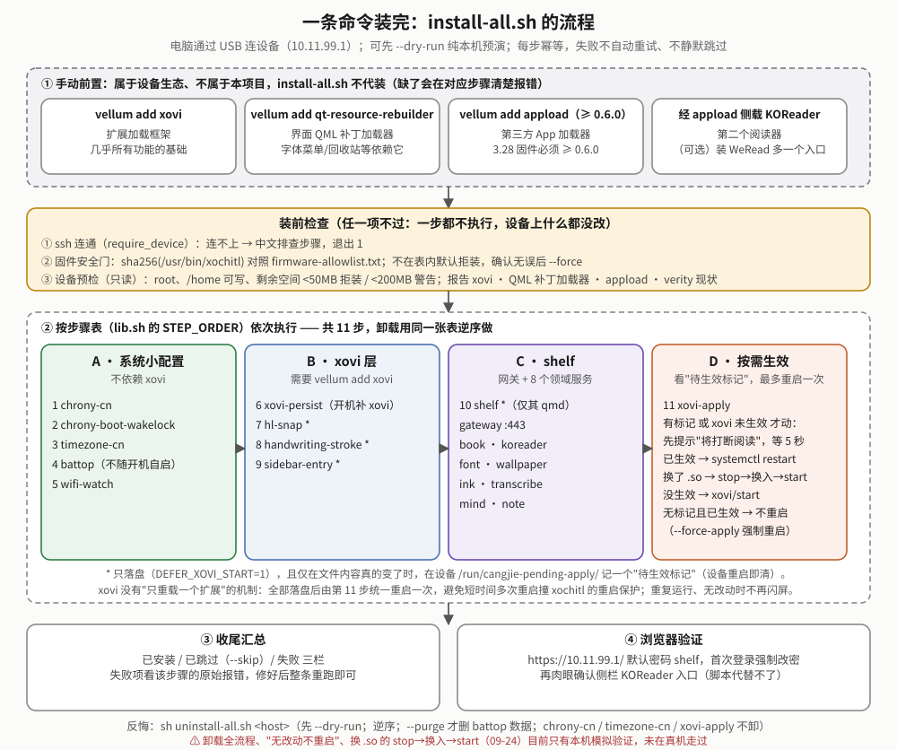
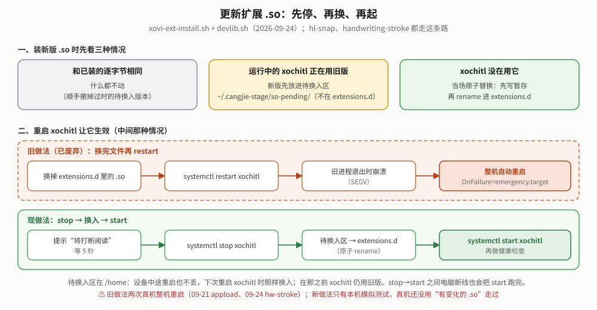
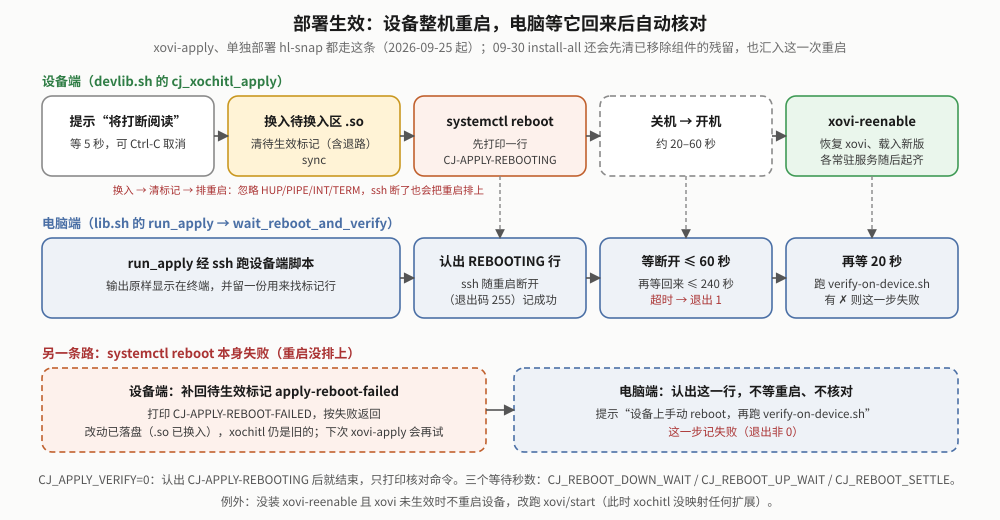
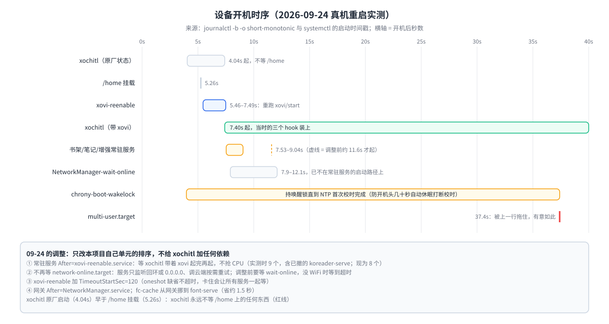

# packaging —— 全新设备统一安装器

> **读者与用途**：要给设备装/卸/更新这套增强的人，以及要改这些脚本的维护者。
> 本文讲**脚本结构、每一步做什么、各文件职责、怎么本机测试**。"第一次怎么装、有什么风险、固件升级后怎么恢复"这类面向使用者的说明在 [`../docs/INSTALL.md`](../docs/INSTALL.md)（中文）/ [`INSTALL.en.md`](../docs/INSTALL.en.md)，本文不重复。
> 文末「验证现状」汇总了哪些在真机上验证过、哪些只有本机模拟。

## 一分钟上手

这是 **host 侧编排层**：脚本在你的电脑上跑，经 ssh 装到设备。设备固件在 `firmware-allowlist.txt` 白名单里时，一条命令装完当前仓库能装的一切：

```sh
cd packaging
sh install-all.sh --dry-run                    # 先预演：纯本机，只打印计划，不连设备
sh install-all.sh <host>                       # 装全部
sh install-all.sh <host> --skip a,b            # 跳过某些步骤（名字写错会警告，不会静默忽略）
sh install-all.sh <host> --force               # 固件不在白名单也装（哈希记进本机 firmware-allowlist.local.txt）
sh install-all.sh <host> --force-apply         # 没有待生效改动也整机重启一次让它生效

sh verify-on-device.sh <host>                  # 装完（或任何一次单独部署后）只读核对，逐项 ✓/⚠/✗

sh uninstall-all.sh <host> --dry-run           # 卸载预演
sh uninstall-all.sh <host>                     # 卸全部（chrony-cn / timezone-cn / xovi-apply 没有卸载语义，见「卸载」）
sh uninstall-all.sh <host> --skip chrony-boot-wakelock,wifi-watch,xovi-persist,hl-snap,shelf,sidebar-entry   # 只清已移除的电池刺客/手写优化（09-30）
```

`<host>` 默认 `10.11.99.1`（USB 网段），WiFi 下给设备 IP 或 `shelf.local`。所有脚本 `-h` 看用法；参数写错一律退出码 2 且不连设备。全部参数见「参数与环境变量」。

**最重要的一条行为**：扩展（`.so`）和界面补丁（qmd）落盘后，要让 xochitl 重新启动才会载入。**2026-09-25 起这一步一律是整机重启**（约 20–60 秒回来），不再单独重启 xochitl——原因见「怎么让改动生效」。装完后脚本会自动等设备回来并跑一遍核对。

## 前置条件（需手动，本脚本不代装）

`vellum add xovi`、`vellum add qt-resource-rebuilder`。缺了各会怎样、装的顺序见 [`INSTALL.md`「装之前」](../docs/INSTALL.md#装之前)。

2026-09-29 起**不再需要 appload 和 KOReader**（设备上 KOReader、WeRead、appload 都已卸载）：
- `sidebar-entry` 退役，记在 lib.sh 的 `STEP_RETIRED`：`install-all` 不再装，`uninstall-all` 照样卸（只按文件名删设备上的残留）。它的安装件——`deploy-sidebar-entry.sh`、两份 `sidebar-entry-*.qmd`、图标 png 与 `.qrc`、测试桩 `rcc`——2026-09-30 已从仓库删除。
- `koreader-serve` 从 `shelf/manifest.sh` 的 `SHELF_ALL` 撤掉、列进遗留清单 `SHELF_LEGACY_*`，装过的设备重新部署书架时顺手清掉；`verify-on-device.sh` 见到它还在报 ⚠。源码 `shelf/services/koreader-serve` 还在仓库（workspace 照常编译），网关里的 KOReader 代理与网页入口 09-30 已删。

2026-09-30 起**电池刺客（`battop`）和手写优化（`handwriting-stroke`）已移除**（用户要求）：
- 两步移出 `STEP_ORDER`、进 `STEP_RETIRED`；`deploy-battop.sh`、`deploy-handwriting-stroke.sh` 与源码 `enhance/battop`、`enhance/handwriting-stroke` 已删。
- **重新部署自动清**：`lib.sh` 的 `STEP_RETIRED_AUTOCLEAN` 列出这两步。`install-all` 在 `xovi-apply` 之前对它们各跑一次 `removal.sh` 里的 `uninstall_<步骤>`（与 `uninstall-all` 同一份函数），步骤名显示为 `清理已移除:battop` / `清理已移除:handwriting-stroke`；没有残留就什么都不动（不碰 systemd、不 remount）。`--skip battop` / `--skip handwriting-stroke` 跳过。
- 清什么：battop → `battop.service` 与旧版 `battop.timer`（`cj_remove_usr_unit`：dm-verity 门 + 带 trap 的 rw 窗口）、`/home/root/battop` 整个目录（路径与符号链接守卫；dm-verity 下单元删不掉时保留目录）；handwriting-stroke → `extensions.d/hw-stroke.so` 与 `.crashed`、待换入区副本、载荷目录 `hw-stroke/`。xochitl 正加载着 `hw-stroke.so` 时记待生效标记 `removed-hw-stroke.so`，`xovi-apply` 据此**整机重启**一次（不 stop/restart xochitl，xovi 已生效时不 `xovi/start`）。
- 只清这两样：`sh uninstall-all.sh <host> --skip chrony-boot-wakelock,wifi-watch,xovi-persist,hl-snap,shelf,sidebar-entry`，然后整机重启。这串 `--skip` 由 `lib.sh` 的 `uninstall_only_skip battop handwriting-stroke` 生成，`verify-on-device.sh` 报 ⚠ 时给的就是它。
- 为什么 `sidebar-entry` 不自动清：它会删 `cangjie-icons.rcc`，历史上别的 qmd 也用过这个文件名，只在用户明确跑 `uninstall-all` 时清。
- **只在本机模拟测过**（见「测试」），没部署、没上真机。

## 装什么、按什么顺序



`install-all.sh` 只负责编排，不重新实现构建或传输：先做装前检查，再按 `lib.sh` 的**步骤表 `STEP_ORDER`** 依次调用 8 个部署脚本（09-30 前是 10 个：`battop`、`handwriting-stroke` 两步已移除，在第 7 步之后、第 8 步之前自动清它们的残留）。`uninstall-all.sh` 用同一张表逆序卸载，所以安装与卸载清单天然对称。

| 顺序 | 步骤名 | 脚本 | 装什么 | 前置 |
|---|---|---|---|---|
| 1 | `chrony-cn` | `deploy-chrony-cn.sh` | 国内 NTP 服务器（阿里云/腾讯云等） | 无 |
| 2 | `chrony-boot-wakelock` | `deploy-chrony-boot-wakelock.sh` | 开机头一小段持 wakelock，防自动休眠打断首次校时（根因见文末「踩过的坑」） | 无；设备缺 `/sys/power/wake_lock` 时开机自动跳过 |
| 3 | `timezone-cn` | `deploy-timezone-cn.sh` | 默认时区 Asia/Shanghai | 无；缺 zoneinfo 时警告后退出 0 |
| 4 | `wifi-watch` | `deploy-wifi-watch.sh` | WiFi 载波假死看护；链路正常时只读 sysfs、零 fork | 无 |
| 5 | `xovi-persist` | `deploy-xovi-persist.sh` | xovi 开机自动恢复（`xovi-reenable.service`） | 已 `vellum add xovi` |
| 6 | `hl-snap` | `deploy-hl-snap.sh` | 荧光笔 CJK 精确吸附（xovi 扩展），**只落盘** | 同上 |
| 7 | `shelf` | `deploy.sh` | 网关 + book/font/wallpaper + 笔记线 ink/transcribe/mind/note，共 8 个服务；随服务带的 qmd（字体菜单、回收站代理、建文件夹代理、漫画页边距、单击翻页）**只落盘** | 无；没装 qt-resource-rebuilder 时只跳过 qmd，服务照装 |
| — | `清理已移除:battop`、`清理已移除:handwriting-stroke` | `removal.sh`（函数，不是脚本） | 清旧设备上已移除功能的残留（见上「前置条件」末段）；摘了正加载着的 `hw-stroke.so` 会记待生效标记 | 无 |
| 8 | `xovi-apply` | `deploy-xovi-apply.sh` | 让上面落盘的扩展/qmd 统一生效：**有待生效改动（或 xovi 未生效）才**整机重启一次；`--force` 无条件 | 同 5–6 |

每个脚本都能单独跑（如 `sh deploy-wifi-watch.sh <host>`）。任何一步失败：打印是哪一步、原始错误，**不自动重试、不静默跳过**，退出非零。

**为什么 6–7 只落盘、最后由 8 统一生效**：xovi 没有"只重载一个扩展"的机制，每步各自重启会在短时间内多次打断设备（2026-09-11 连续两次重启 xochitl 撞上 watchdog + StartLimit，意外整机重启过）。所以 `install-all.sh` 给 6（`STEP_DEFER`）传 `DEFER_XOVI_START=1`（设备端 `install.sh --no-restart`），7 shelf 的 qmd 本来就只落盘，最后由 `xovi-apply` 统一生效一次。

### 装前检查（任何一项不过，一个步骤都不执行）

1. **`require_device`**：`ssh true` 能否连通（`BatchMode`，`CJ_SSH_TIMEOUT` 秒超时）。不通就打印 ssh 原始报错 + 中文排查步骤（休眠/没插 USB、IP 不对、host key 变了、没配免密），退出 1。单独跑各 `deploy-*.sh` 也先过这一关；在 `install-all.sh` 里只查一次，通过后导出 `CJ_DEVICE_OK=<host>`，后面各步骤见到它就不再重复连（2026-09-25 起，省约 10 次 ssh）。
2. **`fw_gate` 固件安全门**：见「固件安全门」。
3. **`preflight_device`**（只读）：必须是 root、`/home/root` 可写；`/home` 剩余空间 < 50MB（`CJ_MIN_FREE_KB`）拒装、< 200MB（`CJ_WARN_FREE_KB`）警告。另外**只报告不拦截**：xovi / qt-resource-rebuilder 有无、dm-verity 是否激活、xovi 是否已在 xochitl 里生效——缺了由对应步骤自己报错或跳过。

`--dry-run` 不做以上任何检查，只在本机走一遍步骤表，每步打印 `[dry-run] 将执行：<命令>`。

### 收尾汇总（四栏）

| 栏 | 什么时候进这一栏 |
|---|---|
| 已安装 | 步骤脚本退出 0 |
| 已跳过（--skip） | 命令行点名跳过，根本没跑 |
| 已跳过（前置条件不满足，非失败） | 步骤脚本调了 `step_skipped "<原因>"` 后退出 0，汇总写明原因。目前有一处：`deploy-usr-unit.sh`（dm-verity 激活且该 `/usr` 单元**从没装过**，涉及 2、4、5 三步）。09-30 前还有 `battop`（已移除） |
| 失败 | 步骤脚本退出非 0 |

注意：**"步骤内部跳过一部分"仍记"已安装"**——shelf 缺 qt-resource-rebuilder 只跳过 qmd、`timezone-cn` 缺 zoneinfo、`xovi-apply` 设备没装 xovi 且无待生效改动。这些要看步骤自己打印的那一行。

## 怎么让改动生效（2026-09-25 起一律整机重启）



**结论**：扩展 `.so` 和 qmd 都只在 xochitl 启动时载入。让它们生效的做法是**主动整机重启**，不停止、不重启 xochitl 本身。代价是每次打断约 20–60 秒（以前 restart 顺利时只要几秒）。

**为什么不能只重启 xochitl**：停止 xochitl 本身就有相当概率在退出途中崩溃（SEGV），随后 `OnFailure` → `rm-emergency` → 系统被动整机重启。设备上 memfault 存的 5 份崩溃栈（`~/.memfault/mar/*/stacktrace.json.gz`）：

- 3 份崩在 xochitl 自己的线程池（崩点 `xochitl+0x6467b8` / `+0x649fc8`）：09-21 换 appload 后、09-25 卸载后重装、09-25 **只换了 qmd** 的普通 restart。反编译查清了机制：xochitl 的静态析构顺序有问题——`atexit` 先析构墨水屏刷新任务要用的全局数据、后停线程池，退出那一刻屏幕恰好在刷新就崩。与我们的扩展无关。详见 [`../defw/README.md`「调查记录」](../defw/README.md#调查记录xochitl-退出时崩溃2026-09-25)。
- 2 份崩在 `libQt6Gui+0x495098`（09-20 在已生效的 xochitl 上跑 `xovi/start`、09-24 换 hw-stroke 后 restart），未分析。

早先的两个归因——09-24 的"换了已映射的 `.so` 再 restart 才崩，改 stop → 换 → start 就好"、09-25 上午的"映射的扩展被删过才崩"——都被后来的崩溃推翻。**`restart` 与 `stop → 换 → start` 都已废弃。**

### 设备端：`devlib.sh` 的 `cj_xochitl_apply`

| 设备状态 | 做法 |
|---|---|
| xovi 已在运行的 xochitl 里生效，**或**装了 `xovi-reenable.service` | 提示"将打断阅读"并等 `CJ_APPLY_GRACE`（5）秒 → 把待换入区的 `.so` 换进 `extensions.d` → 清待生效标记（含 `/home` 下的退路目录，否则设备回来又判"待生效"→ 重启循环）→ `sync` → 打印 `CJ-APPLY-REBOOTING` → `systemctl reboot --no-block`。开机后 `xovi-reenable` 恢复 xovi、载入新版。**`systemctl reboot` 本身失败**时：补回待生效标记 `apply-reboot-failed`（下次 `xovi-apply` 还会判"需要生效"），打印 `CJ-APPLY-REBOOT-FAILED` 并按失败返回 |
| 两者都没有（没装 xovi-persist，重启后 xovi 不会自己回来） | 走 `xovi/start`：此时 xochitl 不带 xovi、没映射任何扩展，`.so` 可直接换入；没有 `xovi/start` 就报错、什么都不换 |

"换入 → 清标记 → 排重启"是关键区，忽略 HUP/PIPE/INT/TERM：ssh 中途断了也要把重启排上。**红线不变：绝不在 xovi 已生效时跑 `xovi/start`**（它会 umount 再重挂 drop-in 目录，2026-09-20 让运行中的 xochitl SEGV 过）。不想被打断就 `--skip xovi-apply`，之后自己找时间 `sh deploy-xovi-apply.sh <host>`。

### host 端：`lib.sh` 的 `run_apply` 与部署后自动核对



`deploy-xovi-apply.sh`、`deploy-xovi-ext.sh`（hl-snap；handwriting-stroke 09-30 已移除）都经 `run_apply` 调设备端。它先找 `CJ-APPLY-REBOOT-FAILED`：有就不等重启、不跑核对，提示"设备上手动 `reboot` 后跑 `verify-on-device.sh`"，这一步记失败（2026-09-25 前这种情况会白等 60 秒，再把核对结果当成本步结果）。否则看到 `CJ-APPLY-REBOOTING` 就把随重启断开的 ssh（退出码 255）当成功，然后 `wait_reboot_and_verify`：

1. 等设备**断开**（最多 `CJ_REBOOT_DOWN_WAIT`=60 秒，免得关机前就连上、误判"回来了"）；
2. 等设备**回来**（最多 `CJ_REBOOT_UP_WAIT`=240 秒，超时退出 1 并给出手动核对命令）；
3. 再等 `CJ_REBOOT_SETTLE`=20 秒，让 `xovi-reenable` 与各服务起齐；
4. 跑 `verify-on-device.sh`，它的退出码就是这一步的结果（有 ✗ 为失败）。

不想等：设 `CJ_APPLY_VERIFY=0`（只打印核对命令），或直接 Ctrl-C。设备端脚本此时会跳过自己的重启后健康检查（`CJ_APPLY_REBOOTED=1`），交给回来后的核对。

### 待生效标记：重复运行不再每次重启

**问题**：旧版 `xovi-apply` 每次都重启，重跑 `install-all.sh` 必打断设备。现在只在"真有东西要生效"时才重启。

- **记**：`hl-snap`（`xovi-ext-install.sh`）、摘掉 xochitl 正加载着的扩展（`removal.sh` 的 `remove_xovi_extension`，标记名 `removed-<文件名>`，09-30 起）、shelf 的 qmd（标记名 `shelf-qmd`）在**真的写入了与设备上不同的内容**时调 `cj_pending_mark <名字>`，在 `/run/cangjie-pending-apply/<名字>` 建一个空文件。`/run` 是 tmpfs，重启即清（重启后一切本来就是新载入的）；`/run` 写不了时退到 `~/.cangjie-stage/pending-apply/`——宁可多重启也不漏。
- **判**：`cj_apply_needed` = "有标记，或待换入区里有 `.so`，或 xovi 还没在 xochitl 里生效"。`cj_pending_list` 会把待换入区的每个 `.so` 列成 `so-pending:<文件名>`：标记在 `/run` 重启即清，待换入区在 `/home` 不清，这样设备中途重启过也不会漏掉。
- **`deploy-xovi-apply.sh` 不带 `--force` 时**：无需生效 → 不重启；无标记、xovi 未生效、且设备根本没装 xovi → 跳过；其余 → `cj_xochitl_apply`。`--force`（`install-all.sh` 的 `--force-apply`）无视标记强制生效。
- **单独跑** `deploy-hl-snap.sh` 等（不带 `DEFER_XOVI_START`）：落盘后直接走 `cj_xochitl_apply`；但若没有任何东西要生效（hl-snap 还要求本扩展没变且已在运行中的 xochitl 里加载）就不重启。
- `uninstall-all.sh` 摘掉扩展后**不清标记**（卸掉的东西也要等重启才停止生效）。

### 扩展 `.so` 的待换入区

运行中的 xochitl 正映射着旧版 `.so` 时，不在它脚下替换文件，而是：

- `xovi-ext-install.sh` 把新版放进**待换入区** `~/.cangjie-stage/so-pending/`（与 `extensions.d` 同分区、绝不在其中；可用 `CJ_SO_PENDING_DIR` 覆盖），由 `cj_xochitl_apply` 在整机重启前换入。同一个新版已在待换入区时不再重复备份、重放。
- 与已装版本逐字节相同 → 什么都不动，顺手撤掉过时的待换入版本；xochitl 没在用它 → 当场原子替换（先写暂存再 rename），**同样撤掉过时的待换入版本**——否则接下来的生效步骤或开机 `xovi-reenable` 会拿它把刚装好的新版盖回旧版（2026-09-25 审计补上，此前只有"逐字节相同"这一支会撤）。
- **你自己 `reboot` 也会换入**：`xovi-reenable.service` 的 `ExecStartPre` 在跑 `xovi/start` 之前把待换入区的普通文件挪进 `extensions.d`（此刻 `ExecCondition` 已确认 xochitl 没带 xovi、没映射扩展，换文件安全）。
- 卸载 `hl-snap`（以及清理已移除的 `handwriting-stroke`）时一并撤掉待换入区里的同名版本，否则下次开机会被装回来。

## 部署后核对：`verify-on-device.sh`（2026-09-25）

以前每次部署后该核的东西靠人记、临场敲命令。现在一条命令：

```sh
sh verify-on-device.sh                     # 默认 10.11.99.1（USB）
sh verify-on-device.sh 192.168.1.22        # WiFi 下给设备 IP（或 shelf.local）
sh verify-on-device.sh <host> --json       # 只输出一个 JSON 对象（计数 + 逐项）
sh verify-on-device.sh <host> --dump > d.txt   # 只存设备端采集的原始文本
sh verify-on-device.sh --from d.txt        # 不连设备，离线重判存下的文本
```

- **只读**：设备上不重启、不写、不删、不 mount，连临时文件都不建；只读 `/proc`、`systemctl show`/`is-active`、`journalctl`、`dmesg`、`ls`/`stat`/`df`/`sha256sum`。
- **一次 ssh 采集，判定全在本机**：设备端输出结构化文本（每行 `键<TAB>字段…`），本机逐项判 ✓/⚠/✗——所以 `--from` 能离线重判，模拟测试也直接喂构造好的文本。
- **退出码**：没有 ✗ 为 0（可以有 ⚠）；有 ✗ 或连不上为 1；参数错误为 2。文本模式最后一行固定是 `VERIFY-SUMMARY host=… ok=N warn=N fail=N result=PASS|WARN|FAIL`。
- 真机上按装了多少东西大约 40 多项（09-25 装着 KOReader 时是 44 项；09-29 撤掉 koreader-serve 和侧栏入口后少了几项，没在真机上重新数过）。
- **退役遗留报警**（2026-09-30）：已退役或旧命名的单元（manifest 的 `SHELF_LEGACY_UNITS`：`koreader-serve`、`shelf-gateway`）单元或二进制还在报 ⚠；qrr 目录里还有侧栏入口 `koreader-sidebar-entry.qmd` 报 ⚠，如果 appload 已不在则报 ✗（它 IMPORT 的 AppLoad 模块找不到，Sidebar 补丁失效）。清法见 [`INSTALL.md`「装之前」](../docs/INSTALL.md#装之前)。
- **已移除功能的残留报警**（2026-09-30）：`battop.service`/`battop.timer` 单元或 `/home/root/battop/battop` 还在（节 8，不计入在位统计）、`extensions.d/hw-stroke.so` 还在（节 2，不再当正常扩展判）、待换入区里有 `hw-stroke.so`（节 2），都报 ⚠，并给出清理命令：重跑 `install-all.sh`，或 `uninstall-all.sh --skip <uninstall_only_skip 的结果>` 后整机重启。

| 节 | 核什么 | ✗ | ⚠ |
|---|---|---|---|
| 1 固件与开机 | 开机时长；`/usr/bin/xochitl` 的 sha256 对白名单 + `IMG_VERSION` | 哈希不在任何白名单（OTA 了？） | 开机不足 `CJ_VERIFY_UPTIME_WARN`（600）秒——不是你重启的就看告警与飞行记录仪；哈希只在本机 `--force` 名单里 |
| 2 xochitl 与 xovi 扩展 | `is-active`/`MainPID`/`NRestarts`；`maps` 里有没有 `xovi.so`；`extensions.d` 下每个文件是否被映射；本进程日志里各扩展"安装完成"次数；待换入区与待生效标记 | xochitl 不是 active；xovi 装了但没生效；扩展在 `maps` 里是 `(deleted)`（换了文件没重启——整机重启，别 restart xochitl）；日志有「hook 未安装」；`extensions.d` 里有非 `.so` 文件（xovi 会当扩展加载） | `NRestarts>0`；设备没装 xovi；扩展没被映射；`.crashed` 标记；待换入区非空；有待生效标记 |
| 3 界面补丁 qmd | 期望清单 = `shelf/manifest.sh` 里已装服务的 qmd（侧栏 qmd/rcc 09-29 退役，不再期望）；文件修改时间对比 xochitl 启动时刻；能找到加载标记（如 `CJ-PAGE-TURN: loaded`，各 qmd 的标记按 manifest 取）就附注 | 期望的 qmd 缺失；侧栏入口 qmd 残留且 appload 已不在 | 没装 qt-resource-rebuilder；qmd 比 xochitl 进程新（待生效）；旧命名遗留；侧栏入口 qmd 残留（appload 还在时）。日志标记没见到**不算异常**，多数要打开相关界面才打印 |
| 4 常驻服务 | `manifest.sh` 的 8 个服务 + `wifi-watch`（`battop` 09-30 移除，连同只给它用的"有意不开机自启"类型）：`is-active`、`NRestarts`、`MainPID`、`VmRSS`/`VmHWM`、开机后第几秒启动 | 单元在但不是 active | `NRestarts>0`；峰值内存超 `CJ_VERIFY_HWM_WARN_KB`（512MB，经验值） |
| 5 本次开机的关键告警 | `journalctl -b` + `dmesg`：panic（排除 `Kernel command line` 行，内核参数 `panic=2` 曾误报）、OOM、「hook 未安装」、`processed more than once`、`SHELF-MKDIR: transfer timeout` | 前四类任一出现 | `SHELF-MKDIR` 超时（会自动延长等待，只提示） |
| 6 飞行记录仪 | **宿主机**上的 `~/.local/state/cang-jie-flight/flight.log`（记录仪在宿主机循环 ssh 抓设备日志；`CJ_FLIGHT_LOG` 可改路径）最后 `--flight-lines`（8）行 | — | —（不存在记 ✓：它不由本仓库安装） |
| 7 端口监听 | 读 `/proc/net/tcp{,6}`：网关 443、已装领域服务的端口（单元 `--bind` 优先，否则按 [`OVERVIEW.md`](../docs/OVERVIEW.md) 端口表 8790–8798） | 已装服务的端口没人听 | 领域服务听在 `0.0.0.0`（应只听回环）；网关只听回环 |
| 8 `/usr` 下的单元 | `shelf.target`、8 个服务单元（另查退役单元是否残留，见节 4 下方说明）、`xovi-reenable`、`wifi-watch`、`chrony-boot-wakelock`（`battop.service`/`battop.timer` 09-30 起只查残留，见下） | 单元不在但载荷还在 `/home`——OTA 冲掉了，重跑 `install-all.sh` | 单元与载荷都不在（装时 `--skip` 过可忽略） |
| 9 磁盘 | `/home` 剩余空间，阈值同装前预检 | < 50MB | < 200MB |

采集缺结尾的 `END` 行（ssh 中途断了或设备端脚本出错）单独记一条 ✗，其余结论照出但可能缺项。

## 本目录文件导览

| 文件 | 职责 |
|---|---|
| `removal.sh` | 摘除 xovi 扩展（`remove_xovi_extension`）与已移除功能的清理（`uninstall_battop`、`uninstall_handwriting_stroke`），`install-all` 的自动清理与 `uninstall-all` 共用（2026-09-30 起） |
| `install-all.sh` / `uninstall-all.sh` | 统一安装/卸载编排；步骤表来自 `lib.sh`。卸载对每个非"配置覆写/纯动作"步骤都必须有 `uninstall_<步骤名>` 函数（测试会核对），按步骤表逆序执行 |
| `lib.sh` | **host 侧**共用库：`rssh`/`rssh_in`/`rscp`（统一 `BatchMode` + `ConnectTimeout`，设备休眠时快速失败而不是卡死）、`shquote`（安全拼远端命令行）、`dev_script`（把 `devlib.sh` + 脚本体经 `ssh sh -s` 送上设备执行）、`push_verified`（一批文件 scp 到暂存路径后逐个 md5 对拍，不对就删那个暂存文件并失败；一次 ssh 建目录并取暂存路径上已有文件的 md5 → 只 scp 内容变了的文件 → 有上传才再一次 ssh 复核 md5。2026-09-30 起相同文件不重传）、载荷清单 `step_payload`/`step_payload_dir`（部署推送与卸载清理共用）、步骤表 `STEP_ORDER`/`STEP_DEFER`/`STEP_RETIRED`/`STEP_RETIRED_AUTOCLEAN`/`STEP_CONFIG_ONLY`、`uninstall_only_skip`、参数解析 `parse_step_args`/`host_arg`、`require_device`、`fw_gate`、`preflight_device`、`run_step`（含 `--dry-run` 与四栏记账）、`step_skipped`、`run_apply`/`wait_reboot_and_verify` |
| `devlib.sh` | **设备侧**共用库（POSIX sh，兼容 busybox）：rootfs 读写窗口（remount rw 后无论成败、被信号打断都恢复 ro，含 ssh 断连的 SIGPIPE）、`cj_safe_replace` 原子替换（不在运行中进程已映射的 inode 上原地写）、备份与轮转、`cj_backup_if_differs`、`/usr` 单元的安装/删除（先过 dm-verity 门）、待生效标记 `cj_pending_mark`/`_list`/`_clear` 与 `cj_apply_needed`、待换入区 `cj_so_stage`/`_unstage`/`_commit`、`cj_xochitl_apply`/`cj_xochitl_health` |
| `deploy-usr-unit.sh` | 把一个 systemd 单元装进设备 `/usr` 的统一部署器；`deploy-chrony-boot-wakelock.sh` / `deploy-xovi-persist.sh` / `deploy-wifi-watch.sh` 是它的薄包装 |
| `deploy-xovi-ext.sh` + `xovi-ext-install.sh` | 装一个独立 xovi 扩展：host 侧构建+推送 / 设备侧安装流程。`deploy-hl-snap.sh` 是薄包装（`deploy-handwriting-stroke.sh` 09-30 随扩展删除；`deploy-xovi-ext.sh hw-stroke` 报"已移除"退出 2）；各扩展的 `deploy/install.sh` 只剩数据（名字、配置键）并 source `xovi-ext-install.sh` |
| `deploy.sh` | shelf 整包部署：组载荷 → 本地打 tar → 推到设备 `shelf-pkg.new`，确认有 `install.sh` 才换掉 `shelf-pkg` → 设备端 `install.sh`。`--password` 经标准输入走 0600 临时文件，不上命令行，装完无论成败都清掉；`--only` 的选服务规则与设备端共用 `shelf/manifest.sh` 的 `shelf_select`；载荷只带要装的服务的二进制与单元，推送前核对都在（缺了指路 `sh shelf/build.sh`） |
| `deploy-xovi-apply.sh` / `deploy-chrony-cn.sh` / `deploy-timezone-cn.sh` | 各自的部署脚本（都支持 `-h`，未知/多余参数退出 2，ssh 不通中文报错退出 1） |
| `verify-on-device.sh` | 部署后只读核对（见上） |
| `firmware-allowlist.txt` / `firmware-allowlist.local.txt` | 固件白名单：仓库里被 git 跟踪的一份 + 本机一份（`--force` 追加到后者，已 gitignore） |
| `wifi-watch/`、`xovi-reenable.service`、`chrony-boot-wakelock.service`、`chrony-cn.sh`、`timezone-cn.sh` | 各步骤的载荷 |
| `diagrams/` | 本文专用的图；与使用者文档共用的图在 `../docs/diagrams/` |
| `tests/` | 本机模拟测试，见「测试」 |

**脱离编排、手动跑设备端 `install.sh` 时的文件依赖**（只拷单个 `install.sh` 不够，会清楚报错）：`shelf/install.sh` 要同目录的 `manifest.sh` 与 `devlib.sh`；`hl-snap` 的 `deploy/install.sh` 要同目录的 `xovi-ext-install.sh` 与 `devlib.sh`。部署脚本都会一起推送。shelf 的 `manifest.sh` 与 `devlib.sh` 会装到设备 `~/.local/lib/shelf/`，供 `shelf-uninstall` 运行时 source；每次安装都刷新它们和 `shelf-uninstall`，**`--only` 也刷**（2026-09-30 起；以前只有整包装才刷，`--only` 部署后卸载会拿旧清单漏删新加的 qmd）。

## 参数与环境变量

**命令行参数**（`-h` 看用法；未知参数退出码 2，且不会连设备）：

| 脚本 | 参数 | 说明 |
|---|---|---|
| `install-all.sh` | `[host]` | 默认 `10.11.99.1` |
| | `--dry-run` | 纯本机只打印计划；不 ssh、不做固件门/预检 |
| | `--skip a,b`（或 `--skip=a,b`） | 跳过步骤；名字不在 `STEP_ORDER` 里只警告 |
| | `--force` | 固件不在白名单也装，哈希追加进本机白名单 |
| | `--force-apply` | 转给 `xovi-apply` 的 `--force`：无待生效改动也整机重启一次 |
| `uninstall-all.sh` | `[host]` `--dry-run` `--skip` | 同上语义；`--force`/`--force-apply` 会被拒绝 |
| | `--purge` | 保留兼容，目前不影响任何步骤（09-30 前只管 battop 的数据；battop 移除后清理时总是连数据删）；不影响 shelf 用户数据 |
| `deploy-xovi-apply.sh` | `[host]` `--force` | 无待生效改动也生效一次 |
| `deploy.sh` | `[host] [--only a,b] [--no-systemd] [--password PW]` | 后三项原样转给设备端 `shelf/install.sh` |
| 其余 `deploy-*.sh` | `[host]` | — |
| `verify-on-device.sh` | `[host]` `--json` `--dump` `--from FILE` `--flight-lines N` | 只读；`--json` 与 `--dump` 互斥 |
| `shelf/install.sh`（设备端） | `--only` `--no-systemd` `--src` `--password`/`--password-file` | 直接用 `--password` 明文时密码会短暂出现在设备 `ps` 里；`deploy.sh` 走的是 `--password-file` |
| `shelf/uninstall.sh`（设备端，装成 `shelf-uninstall`） | `--only` `--purge` `--dry-run` | `--dry-run` 只列出将删除的现存路径 |

**环境变量**：

| 变量 | 默认 | 在哪生效 | 说明 |
|---|---|---|---|
| `CJ_SSH_TIMEOUT` | 8 | host | ssh `ConnectTimeout` 秒数 |
| `CJ_MIN_FREE_KB` / `CJ_WARN_FREE_KB` | 51200 / 204800 | host（预检与核对共用） | `/home` 剩余空间低于前者拒装、低于后者警告 |
| `CJ_ALLOWLIST` / `CJ_ALLOWLIST_LOCAL` | 仓库 / 本机白名单文件 | host | 改固件白名单路径（核对脚本同样用） |
| `CJ_APPLY_VERIFY` | 1 | host | 设 0：部署触发整机重启后不等设备回来，只打印核对命令 |
| `CJ_REBOOT_DOWN_WAIT` / `CJ_REBOOT_UP_WAIT` / `CJ_REBOOT_SETTLE` | 60 / 240 / 20 | host | 等设备断开 / 等设备回来 / 回来后再等多久才核对（秒） |
| `CJ_VERIFY_HWM_WARN_KB` / `CJ_VERIFY_UPTIME_WARN` | 524288 / 600 | host（核对） | 服务峰值内存超此值记 ⚠ / 开机不足此秒数记 ⚠ |
| `CJ_FLIGHT_LOG` | `~/.local/state/cang-jie-flight/flight.log` | host（核对） | 宿主机上飞行记录仪日志的路径 |
| `DEFER_XOVI_START=1` | — | host（`install-all` 自动设） | hl-snap 只落盘不生效 |
| `CJ_DEVICE_OK` | — | host（`install-all` 自动设） | 已通过连通检查的 host；各步骤脚本的 `require_device` 见到同一 host 就直接放行。手动别设 |
| `SHELF_NO_BUILD=1` · `CJ_SKIP_BUILD=1` · `XOVI_DIR` | — | host | 跳过或指定构建产物（见各脚本 `-h`） |
| `CJ_PENDING_DIR` / `CJ_PENDING_FALLBACK` | `/run/cangjie-pending-apply` / `~/.cangjie-stage/pending-apply` | 设备 | 待生效标记目录 / `/run` 写不了时的退路 |
| `CJ_SO_PENDING_DIR` | `~/.cangjie-stage/so-pending` | 设备 | 待换入的扩展 `.so` |
| `CJ_APPLY_GRACE` / `CJ_HEALTH_SLEEP` | 5 / 5 | 设备 | 生效前宽限秒数 / 走 `xovi/start` 后等多久再做健康检查 |
| `CJ_BACKUP_KEEP` / `CJ_BACKUP_MAXBYTES` | 5 / 64MB | 设备 | 备份保留份数 / 单文件超此大小不自动删 |
| `CJ_HOME` `CJ_SYSD` `CJ_XOVI` `CJ_PROC` `CJ_BACKUP_DIR` `CJ_STAGE_DIR` | 设备真实路径 | 设备 | `devlib.sh` 的路径，仅供模拟测试重定向 |
| `CJ_CHRONY_CONF` `CJ_LOCALTIME` `CJ_ZONEINFO` `CJ_MOUNTS` `CJ_TMPDIR` | `/etc/chrony.conf` 等 | 设备 | `chrony-cn.sh` / `timezone-cn.sh` 的目标路径，**仅供模拟测试，真机别设** |

## 固件安全门

装前 ssh 读设备上 `/usr/bin/xochitl` 的 sha256，跟两份白名单比对：仓库里的 `firmware-allowlist.txt`（每行 `sha256  <人读标签>`）+ 本机的 `firmware-allowlist.local.txt`，命中任一份才继续，否则拒装。确认要装用 `--force`：当前哈希追加进**本机**文件（已 gitignore，避免"没验证过的哈希"被误提交）。为什么用 sha256 而不用版本号，见 `firmware-allowlist.txt` 内注释。当前白名单：3.28.0.172（现役）与 3.28.0.169（历史）。

## 备份与幂等

这是备份规则的权威说明（使用者文档只放一句话版）：

- 设备上被覆盖的旧文件统一备份进 `/home/root/cangjie-backups/`。**绝不留在 `extensions.d/` 里**——xovi 把该目录下任意文件当扩展加载，同名重复注册是致命错误（2026-08-15 踩过）。单文件备份名 `<basename>.bak.pre-<时间戳>`，目录型（shelf）`shelf-<时间戳>/`。
- 只保留最近 5 份（`CJ_BACKUP_KEEP`），只轮转脚本自己生成的严格时间戳命名备份；单文件超过 64MB（`CJ_BACKUP_MAXBYTES`）不自动删；手工命名的备份与用户数据一律不碰；全程无 `rm -rf`。
- **内容没变就不备份、不重启服务**（`cj_backup_if_differs` 用 `cmp` 对拍）。否则重复部署 5 次，就会把真正有价值的旧版本挤出"最近 5 份"。
- **写 `/usr` 前先过 dm-verity 门**（`deploy-usr-unit.sh`；09-30 前 `battop` 的设备端 `install.sh` 同一规则，battop 已移除）。verity 激活时：该单元**从没装过** → 什么都不写，汇总记"前置条件不满足"；**以前装过** → `/usr` 里的单元不动，`/home` 下的脚本或二进制照常更新，内容真有变化、且该单元应在运行（`wifi-watch`）或正在运行（`battop`）时 `systemctl restart` 它，让它用上新版。`battop` 这一支 2026-09-25 前直接退出，在跑的服务一直用旧二进制。

## 开机启动顺序（2026-09-24）



真机重启实测（`journalctl -b -o short-monotonic`）：

| 时刻 | 发生什么 |
|---|---|
| 4.04s | xochitl 以原厂状态启动——早于 `/home` 挂载，**不等 `/home` 上的任何东西**（红线，见 `xovi-reenable.service` 头注） |
| 5.26s | `/home` 挂载 |
| 5.46–7.49s | `xovi-reenable`：先换入待换入区的 `.so`，再跑 `xovi/start`，xochitl 带着 xovi 重新启动（7.40s 起），三个 hook 装上 |
| 7.53–9.04s | 书架/笔记/增强常驻服务依次起来（当时 9 个，含 09-29 已撤的 koreader-serve；调整前约 11.6s） |
| 37.4s | `multi-user.target`：被 `chrony-boot-wakelock` 持锁等 NTP 校时拖住，**有意如此** |

09-24 的调整只改我们自己单元的排序，不给 xochitl 加任何依赖：

- **各常驻服务 `After=xovi-reenable.service`**：等 xochitl 带 xovi 起完再起，不跟它抢 CPU。没装 `xovi-reenable` 时这条自动失效。
- **不再等 `network-online.target`**：服务只监听回环或 `0.0.0.0`，调云端按需发、失败重试；原来开机要专门等 `NetworkManager-wait-online`（没 WiFi 时等到超时）。
- **`xovi-reenable` 加 `TimeoutStartSec=120`**：oneshot 缺省启动超时是无限，它一卡住所有服务都跟着等。平时 2 秒左右跑完。
- **网关 `After=NetworkManager.service`**：启动前 `lo-alias.sh` 要给 `usb1` 挂地址、mDNS 要枚举接口。
- **`fc-cache` 从网关挪到 `font-serve`**：原来网关每次启动都要同步等它（约 1.5s）。

`xovi-reenable.service` 有 `ExecCondition` 守卫：xochitl 已映射 `xovi.so` 就跳过（systemd 视为"跳过"而非"失败"），不会对已生效的 xochitl 跑 `xovi/start`。

**它为什么放在 `packaging/`，不放 `shelf/`**：xovi 持久化是整个 xovi 层通用的（重跑 `xovi/start` 会重注入全部扩展，不分 shelf / enhance），shelf 耦合它会破坏"网关+领域服务独立可插拔"的原则。2026-09-03 曾把它装进 `shelf/install.sh`，被撤回（`shelf/docs/reMarkable书架白皮书.md` §03o）。

## 卸载（`uninstall-all.sh`）

与安装共用步骤表、**逆序**执行：`shelf → hl-snap → xovi-persist → wifi-watch → chrony-boot-wakelock`，最后是已退役/已移除的 `handwriting-stroke → battop → sidebar-entry`（`STEP_RETIRED`，装过的设备也能清干净）。`--dry-run` 只在本机打印这个计划。

| 步骤 | 卸载动作 |
|---|---|
| `shelf` | 优先调设备上的 `~/.local/bin/shelf-uninstall`（每次安装都会更新它，含 `--only`），没有才退回 `shelf-pkg/shelf/uninstall.sh`；清单与安装共用 `manifest.sh`；默认保留用户数据（`--purge` 不作用于 shelf）；书架二进制确实清掉后才删 `shelf-pkg`/`shelf-pkg.new` |
| `sidebar-entry`（已退役） | 从 qt-resource-rebuilder `exthome` 按文件名删 `koreader-sidebar-entry.qmd` 与 `cangjie-icons.rcc`（不需要安装件）；中转目录里中断部署留下的同名暂存件一并清 |
| `hl-snap` / `handwriting-stroke`（已移除） | 从 `extensions.d` 摘除 `.so`（含 `.crashed` 标记），并撤掉待换入区里的同名版本；xochitl 还加载着它时记待生效标记并提示"要立刻停用请整机重启"；不碰共用的 `reading-qol.json` 和 `cangjie-backups/` |
| `xovi-persist` / `chrony-boot-wakelock` | 停用并删 `/usr` 单元（同一套 dm-verity 门 + rw 窗口） |
| `wifi-watch` | 同上；单元删掉后才删 `~/.local/bin/wifi-watch.sh`，并删联网状态文件 `~/.local/state/shelf/wifi-connectivity.json`（2026-09-30 起；否则网页"上不了外网"横幅一直挂着） |
| `battop`（已移除） | 停用并删单元（旧设备上的 `battop.timer` 也清），并删 `/home/root/battop` 整个目录（09-30 起不再需要 `--purge`；dm-verity 下单元删不掉时保留目录）；什么都没有时不碰 systemd |
| `chrony-cn` / `timezone-cn` / `xovi-apply` | 配置覆写与纯动作，**有意不卸**（改前的备份在 `cangjie-backups/`，要还原自己取） |

- **载荷目录**：每步清掉部署时推到设备的载荷（`/home/root/pkg-<名>/`、`hl-snap/`、`hw-stroke/`、`shelf-pkg/`）。清单取 `lib.sh` 的 `step_payload`，与部署推送是同一份。只 `rm` 已知文件再 `rmdir`，目录里有别的东西就留着（2026-09-30 前这一步在 `set -e` 下遇到非空目录会让整段卸载退出，已修）；旧命名只剩悬空 `.wants` 链接的也清；最后清 `~/.cangjie-stage` 里本项目的中转文件。
- **dm-verity 激活时**：`/usr` 单元删不掉，如实跳过、不算失败，同时**保留**这些单元依赖的东西（`wifi-watch.sh`、shelf 二进制与 `shelf-pkg`、待生效标记），否则单元开机后会反复失败重启。设备可写后**重跑一次 `uninstall-all.sh`** 即收敛。
- **卸载不主动重启**：运行中的 xochitl 仍是旧映射，要等下次启动才真正停止生效。**要立刻停用，一律整机重启**（`reboot`），不管摘的是扩展 `.so` 还是只有 qmd——理由同「怎么让改动生效」（`uninstall-all.sh` 的收尾提示 2026-09-25 已改成同样的说法）。紧接着重装也没问题：`install-all` 最后一步会换入新版后主动整机重启。

## 测试：不碰真机验证脚本

```sh
bash packaging/tests/run_sim_tests.sh      # 2026-09-30 移除 battop/hw-stroke 后实跑 356 项断言全过（第五轮审计后是 343 项）；也由 tests/test_install_scripts_sim.py 经 pytest 调用
```

**做法**：`tests/stubs/` 下放假的 `ssh`/`scp`/`systemctl`/`mount`/`dmsetup`/`id`/`sleep`/`curl`/`journalctl`/`dmesg`/`timedatectl` 塞进 `PATH`，用临时目录当"设备"。假 `ssh` 把远端命令直接在本机沙箱里执行，所以设备端脚本（`devlib.sh`、`shelf/install.sh`、各 heredoc）跑的是**真代码**，只是 rootfs/systemd/mount 被桩住并写日志，可以断言"有没有 remount rw、最后一次 mount 是不是 ro、有没有 `xovi/start`、有没有 `systemctl reboot`"。**拒绝以 root 运行**（设 `CJ_SIM_ALLOW_ROOT=1` 才强行跑），并在最后核对没碰真实 HOME（2026-09-30 起按路径 + mtime 核：无新增、无删除、原有文件的 mtime 不变）。

**覆盖面**（按主题）：

- `devlib` 各函数：待生效标记与退路、备份去重、待换入区、`cj_xochitl_apply` 的三条分支（xovi 已生效 → 整机重启、未生效但有 `xovi-reenable` → 整机重启、两者都没有 → `xovi/start`）及"整机重启前清退路标记"。
- 扩展部署：原子落位、备份不进 `extensions.d`、xochitl 正映射旧版时进待换入区、同一新版重复部署不重复备份、设备重启后待换入区仍算待生效。
- 生效判定：`xovi-apply` 无改动不重启、`--force`/`--force-apply`、单独部署无变化不重启；所有路径"绝不停/重启 xochitl、xovi 已生效时绝不 `xovi/start`"；host 侧认 `CJ-APPLY-REBOOTING` 后等设备回来并跑核对。
- shelf：安装幂等、缺载荷不留半成品、rw 窗口失败恢复 ro、只重启有变化的服务、verity 下的两种分支；卸载与安装清单对称；`deploy.sh` 的密码特殊字符、换位、推送前核对、密码文件兜底清理；`shelf_select`。
- 编排：整轮 `install-all` → `uninstall-all` 对称；参数解析、`--dry-run`、`-h`、设备不可达、磁盘预检、四栏汇总；卸载载荷清理的保守性。
- `chrony-cn` / `timezone-cn`：非 overlay 与 verity 路径；overlay 路径只测"写底层失败 → 报错退出、不说已改、最后恢复 ro"（改写成功那一支只能真机验证）。`chrony-boot-wakelock` 收到 TERM 后几秒内退出并放锁。`xovi-reenable` 的 `ExecCondition` 三种情形。
- ssh 往返次数：`hl-snap` 首次部署 4 次 ssh + 4 次 scp（旧版 13 次 ssh），载荷没变的重复部署 3 次 ssh + 0 次 scp（2026-09-30）；整轮 `install-all` 只一次 `ssh true`；合批推送时只删 md5 对不上的那个暂存文件。
- 移除 battop / hw-stroke（09-30）：旧设备上两样的残留经 `uninstall-all`（只留这两步）清干净、`hl-snap` 与 `reading-qol.json` 不动、不停/不重启 xochitl、记待生效标记；`install-all` 自动清并只整机重启一次、再部署不再动；`--skip handwriting-stroke`；xovi 未生效时不记标记；dm-verity 下保留 battop 目录；battop 目录是符号链接时拒绝删；verify 报 ⚠ 并给清理命令；退役步骤都有卸载函数、不再有安装脚本映射。
- 第五轮审计补的分支（09-30）：卸载遇到非空载荷目录不中断、`wifi-watch` 状态文件与 `battop.timer` 清理、`--purge` 不谎报、`--skip sidebar-entry` 不误报、verify 的退役遗留 ⚠/✗。
- 第四轮审计补的分支：`systemctl reboot` 失败（不空等、补回标记）、`battop` 在 dm-verity 下的两支、直接装扩展时撤掉过时的待换入版本。
- `verify-on-device.sh`：用 `--from` 喂构造的采集文本逐项断言 ✓/⚠/✗ 与退出码；采集脚本经假 ssh 真跑一遍，断言只读（文件树前后一致、无 start/stop/restart/mount/scp、一次连通检查 + 一次采集，不逐项连）、`panic=2` 不误报。
- 静态守卫：`remount,rw` / `xovi/start` 只许出现在库里。

这些是本机模拟，**不能代替真机验证**。

**CI 现状**：`.github/workflows/ci.yml` 会跑 shellcheck、这套模拟测试、各 Rust crate 的 `cargo test` 与交叉编译冒烟。但 GitHub Actions 从 2026-09-20 起因账户扣费失败，每次几秒内就失败、**没有执行任何检查**（`gh run list` 可见，2026-09-25 仍如此）。这段时间靠本地在干净 checkout 里跑同样的检查；别把"push 了没报错"当成"测过了"。

## 固件升级（OTA）之后

恢复流程、逐项对照表与流程图统一放在 [`../docs/INSTALL.md`](../docs/INSTALL.md#固件升级ota之后)，本文不另写。要点：先在设备旁手动 `xovi/rebuild_hashtable`，再在电脑上重跑 `sh install-all.sh <host>`（新固件哈希不在白名单要 `--force`），最后 `verify-on-device.sh` 核对。

## 明确不做的事与已知限制（已知缺口，别当成已经解决）

**不做的事**：

- **不装 vellum / xovi / qt-resource-rebuilder 本体**——手动前置条件，缺了子脚本清楚报错，收尾汇总再提醒一次。
- **不装中文化**（输入法/候选栏/词典/UI 汉化）：那条链路（`chinese-ime/langhook/`）随 2026-09-11 的仓库整理挪出了 git 仓库（2026-09-24 只读查看设备：`extensions.d/` 里没有 `cangjie-langhook.so`）。
- **`chrony-cn` / `timezone-cn` 没有卸载语义**（配置覆写）。
- 旧的 `packaging/package.sh`（打 `cangjie-full-*.tar.gz` 单体包）**没有**恢复：它按旧目录结构找载荷；本目录只编排现有的独立脚本。

**已知限制**：

- **`/usr` 下单元的写入仍靠"dm-verity 门 + 带 trap 的 rw 窗口"**，不是彻底不碰 `/usr`；历史上写 `/usr` 触发过 A/B 回滚变砖（2026-08-16）。
- **待生效标记只覆盖已接入的几处**（hl-snap 部署、摘除正加载着的扩展、shelf qmd）。手工替换 `.so` 或 qmd 不会留标记——用 `--force-apply` / `--force`。`/run` 与退路目录都写不了时只警告，此时 `xovi-apply` 可能误判"无需生效"，按提示手动整机重启。
- **每次生效都整机重启**，打断约 20–60 秒；不想被打断就 `--skip xovi-apply`，稍后自己跑。
- **直接在设备上用 `shelf/install.sh --password` 明文**时密码会短暂出现在设备 `ps` 里（经 `deploy.sh` 不受影响）。
- **只在本机模拟、真机没走过的分支**见下节。

---

## 验证现状（如实说明，不夸大）

> 2026-09-11 起的真机验证整理。2026-09-20 脚本重构（共用 `lib.sh`/`devlib.sh`、原子替换、备份轮转）和 2026-09-25 "生效一律整机重启"之后，早期记录里的个别做法已被取代，**以前面各节为准**。

### 真机验证过

| 主题 | 日期 | 结论 |
|---|---|---|
| 整轮 `install-all.sh` | 09-11（当时八步）、09-22、09-24、09-25（先整轮卸载再全新安装，途中踩到"停 xochitl 会崩"，改为整机重启后复核） | 通过：9 个服务健康、`NRestarts` 0、hook 全部"安装完成" |
| 整轮 `uninstall-all.sh` | 09-25 | 通过：8 步逆序全部成功；`/usr` 单元、服务二进制、两个扩展、qmd 全部清掉，端口释放，书架/笔记数据保留；卸载期间 xochitl 不重启，被删的 `.so` 在 maps 里变成 `(deleted)`——**删掉正被映射的 `.so` 本身不崩**。小尾巴：09-20 之前的手工备份 `*.bak.pre-*` 卸载器不认识、没动；`SleepScreenPath` 被运行中的 xochitl 写回 |
| 生效方式：换入后整机重启 | 09-25 | 通过：只卸 `hl-snap` → `deploy-hl-snap.sh` 换入、打印 `CJ-APPLY-REBOOTING`、`systemctl reboot`；约 20 秒回来，上次关机无 SEGV / core dump / 应急服务，hook "安装完成"，`verify-on-device.sh` 43 ✓。同一次顺带核了 lo-alias：没插 USB 冷启动，`10.11.99.1` 挂上 `lo` 与 `usb1`，xochitl :80 已绑定 |
| 部署后自动核对 | 09-25 | `verify-on-device.sh` 首次真机（busybox）：44 项全部采集到、判定正确，`panic=2` 误报已排除。**`run_apply` 自动等重启并核对**这一段只有本机模拟 |
| 固件安全门 | 09-11 | 通过：3.28.0.172 的 sha256 命中白名单 |
| 单个扩展部署 | 09-11、09-15 | 通过：构建 → 推送 → 安装 → hook 已加载；部署前备份的 md5 精确匹配旧版本；trampoline 通用代码收进 `enhance/shared/` 后日志逐字节一致 |
| `sidebar-entry`（09-29 已退役） | 09-13/14、09-21 | 通过：两项版/单项版 qmd、`DEFER_XOVI_START` 只落盘、缺 qt-resource-rebuilder / appload 时跳过；appload 0.6.0 md5 与官方包一致、入口正常 |
| `xovi-persist` | 09-11 起、09-24 | 通过：真机重启后 `xovi-reenable` 自动恢复 xovi，无需手动 `xovi/start`；带 `ExecCondition` 的新版已部署，设备上的单元与仓库一致。`systemctl status` 显示 `disabled` 是手写 `.wants/` 软链的显示怪癖，不影响开机激活 |
| 开机顺序 | 09-24 | 通过：见「开机启动顺序」的实测表 |
| `chrony-cn` / `timezone-cn` / `chrony-boot-wakelock` | 09-14 | 通过：改写分支 + 重启后持久化；缺 zoneinfo 优雅跳过；重启后零 "Forward time jump"、34 秒内持锁→放锁、`System clock synchronized: yes` |

### 没有真机验证（只有本机模拟或代码审查）

- **生效判定的"不重启"一侧**：`xovi-apply` 无标记时跳过、`--force-apply` / `--force`、单独部署无变化不重启。
- **关键区忽略信号**：换入 → 清标记 → 排重启途中 ssh 断连仍会把重启排上。
- **待换入区的边角**：设备中途重启后仍算待生效；`xovi-reenable` 开机时的 `ExecStartPre` 换入（09-25 新增）；`xovi-reenable` 在 xovi 已生效时被 `ExecCondition` 跳过。
- **卸载的边角**：dm-verity 保留分支、`--purge`、撤掉待换入 `.so`。
- **其它**：汇总第四栏"前置条件不满足"；rw 窗口补 SIGPIPE；verity 下 `wifi-watch` 脚本更新后重启服务；`cj_backup_if_differs`；`deploy.sh` 推送前核对与密码文件兜底清理；`battop.new` 原子 rename 的新部署流程。
- **2026-09-25 下午第四轮审计的全部脚本改动**：推送合批、`install-all` 只查一次连通（`CJ_DEVICE_OK`）、`systemctl reboot` 失败分支、`battop` 在 dm-verity 下的两支、直接装扩展时撤掉过时的待换入版本、`chrony-boot-wakelock` 收到 TERM 即退出、`chrony-cn`/`timezone-cn` 写底层失败即报错、`step_payload` 共用清单。都只有本机模拟（314 项）与代码审查。
- **2026-09-30 移除 battop / hw-stroke 的全部脚本改动**（`removal.sh`、`install-all` 自动清理、verify 残留报警）：只有本机模拟（356 项）与代码审查，**没部署、没上真机**。
- **2026-09-30 第五轮审计的全部脚本改动**：推送只传有变化的文件、书架载荷只带要装的服务、`shelf/install.sh --only` 刷新卸载清单、卸载非空目录不中断、`wifi-watch` 状态文件/`battop.timer`/悬空旧链接清理、verify 的退役遗留报警，以及删掉 `sidebar-entry` 安装件后 `uninstall-all` 仍能清旧设备。只有本机模拟（343 项）与代码审查，**没部署、没上真机**。
- **enhance 两个扩展的构建改动**（09-25）：`hl-snap` / `handwriting-stroke` 的 Makefile 加了 `-ffile-prefix-map`（去掉 `.so` 调试信息里的本机路径），反汇编与旧版一致；09-25 已真机部署（这也是"有变化的 `.so` → 待换入区 → 整机重启换入"第一次真机走通，3 个 hook 安装完成，verify 43✓ 0✗）。

### 踩过的坑（已修）

- **停止 xochitl 会崩 → 整机重启**（09-21、09-24、09-25 ×2 真机）：先后归因为"换了已映射的 `.so` 再 restart"（09-24 改 stop → 换 → start）、"映射的扩展被删过"，同日一次只换 qmd 的普通 restart 也崩了，两个归因都不成立。→ 09-25 起生效一律主动整机重启，见「怎么让改动生效」。
- **连续重启撞 StartLimit**（09-11）：两个扩展各自在设备端跑 `xovi/start`，短时间重启 xochitl 两次触发意外整机重启，下一步 `ssh: Connection refused`。→ 设备端 `install.sh` 加 `--no-restart`，`xovi-apply` 成为唯一生效点、放最后。
- **`chrony-boot-wakelock` 的根因**（09-14）：重启后 `System clock synchronized` 卡在 `no` 超过 10 分钟。chronyd 日志 `Forward time jump detected!` 的时刻与内核 `PM: suspend entry/exit` 完全对上：官方 `remarkable-enable-slumber.service` 开机几十秒就打开自动休眠，设备恰好在 chronyd 准备校时时挂起，被误判为"系统钟被外部动了"（chrony-users 邮件列表 [2020-10 帖](https://listengine.tuxfamily.org/chrony.tuxfamily.org/chrony-users/2020/10/msg00019.html) 维护者确认过这类触发条件）。→ 独立单元开机持 wakelock，轮询 `NTPSynchronized` 最多 120 秒、同步即放锁；`Before=remarkable-enable-slumber.service` 只是排序，**不碰官方单元**，自身失败不拖累任何单元。
- **第四轮审计（09-25 下午）读代码发现、已修，未上真机**：
  - `systemctl reboot` 本身失败时，设备端已换入并清了标记，host 却照样等"设备重启"再把核对结果当本步结果，下次 `xovi-apply` 还判"无需生效"。→ 补回标记、打印 `CJ-APPLY-REBOOT-FAILED`，host 认到就按失败返回。
  - xochitl 没在用旧版、扩展被直接原子替换时，没撤掉待换入区里更早一轮的旧版，随后的生效会把新版盖回旧版。→ 两支都撤。
  - `battop` 在 dm-verity 下（单元以前装过）换了二进制就直接退出，在跑的服务一直用旧版。→ 照常按"变了且在跑就重启"。
  - `chrony-boot-wakelock` 把放锁命令直接挂在 TERM 上，处理完信号 shell 还接着轮询，没网时关机/重启要被拖到 systemd 停止超时（缺省 90 秒）。→ TERM/INT 只 `exit`，放锁交给 EXIT trap。
  - `chrony-cn` / `timezone-cn` 改 rootfs 底层时不看返回值，写失败也打印"已改"。→ 失败即报错退出（trap 照样卸 bind、恢复 ro）。
- **`timezone-cn.sh` 幂等分支被判失败**：末条语句 `[ … ] && echo` 在不需要改时返回非零。→ 显式 `if` + `exit 0`。
- **（battop 09-30 已移除，历史）`deploy-battop.sh` 找不到 `.cargo/config.toml`**：Cargo 按**当前工作目录**找配置、不看 `--manifest-path`，吃不到交叉编译覆盖。→ 先 `cd enhance/battop/` 再构建。
- **构建前 `make clean` 删掉了仓库里已提交的产物**：本机没有 xovi clone 时编不出新的，可用产物反被删。→ 不清；构建失败时退回已提交版本并提示。
- **shelf 健康检查太急**：网关首次启动要签发证书，固定 `sleep 1` 不够。→ 轮询最多 10 秒。
- **（battop 09-30 已移除，历史）battop 重装 ETXTBSY**：`scp` 覆盖正在执行的二进制被内核拒绝。→ 推 `battop.new` 再原子 rename。
