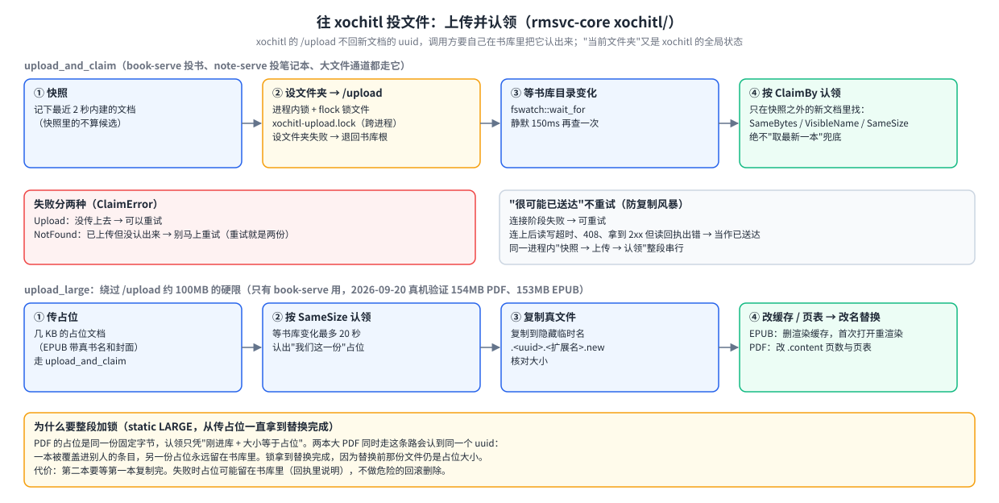

# reMarkable 设备端 Web 服务基座（rmsvc-core）白皮书

> **读者**：要改 `rmsvc-core`，或在 `shelf/`、`notes/`、`enhance/`、`gateway/` 里写 Web 服务、想知道基座提供什么、有哪些约定的人。
> **相关文档**：模块速查与"一个服务的骨架"见 [`../README.md`](../README.md)；网关怎么用这些模块（登录、代理、批量队列）见[网关白皮书](../../gateway/docs/reMarkable网关白皮书.md)；vendored tiny_http 的补丁见 [`../vendor/README.md`](../vendor/README.md)。
> **以 2026-10-10 的代码为准**（`rmsvc-core/src`）。2026-10-10 重组过章节，旧章节号（§01～§07）在文末[附录 B](#附录-b旧章节号对照表) 有对照。

## 目录

1. [一句话与术语](#1-一句话与术语)
2. [五分钟读懂](#2-五分钟读懂)
3. [怎么用：写一个新服务](#3-怎么用写一个新服务)
4. [怎么工作（按模块）](#4-怎么工作按模块)
5. [接口参考](#5-接口参考)
6. [开发、构建与测试](#6-开发构建与测试)
7. [已知限制与踩坑](#7-已知限制与踩坑)
8. [验证现状](#8-验证现状)
9. 附录：[A 设计决策与历史](#附录-a设计决策与历史演进) · [B 旧章节号对照表](#附录-b旧章节号对照表)

## 1 一句话与术语

**一句话**：设备上 8 个小 Web 服务（书架 1 个、系统增强 2 个、笔记 4 个、网关 1 个）都要做同样的杂活——读 XDG 路径、向注册表登记、收 HTTP 请求回 JSON、接大文件上传、往 xochitl 书库塞书、广播"该刷新了"、登录和 TLS。这些杂活只写一份，就是 `rmsvc-core`。它是 Rust 库，**没有自己的端口**，也不含任何"书 / 笔记 / 字体"业务。

| 词 | 意思 |
|---|---|
| xochitl | reMarkable 自带的书库 / 阅读 / 笔记程序。它有一个只绑 USB 网口的网页上传口 `/upload`，书库文件在 `~/.local/share/remarkable/xochitl/` |
| 注册表 | 每个服务启动时在 `$XDG_RUNTIME_DIR/shelf/services/<名>.json` 写下端口和 pid；网关读这个目录就知道谁在跑 |
| path 依赖 | 消费方在 `Cargo.toml` 里直接写相对路径 `rmsvc-core = { path = "…/rmsvc-core" }`，不经 workspace |
| feature | Cargo 的可选编译开关。本 crate 的 `gateway` feature 收着只有网关用的模块，默认不编 |
| 剥离移植 | 需要旧项目某项能力时不依赖旧 crate，而是把验证过的结论独立重写一份 |
| inotify | Linux 内核的文件变化通知；空闲时进程睡死、零唤醒，比定时轮询省电 |
| SSE | 服务器单向推送的长连接；服务用它告诉网关（再由网关告诉网页）"该刷新了" |

## 2 五分钟读懂

### 2.1 能做什么

一个新服务用 `service::run_or_exit` 一行起来（自带 `/health`、自动登记、网关自动发现），用 `http::Router` 写接口，用 `asset` 接上传，用 `xochitl` 往原生书库投文件并认出新文档，用 `fswatch` / `events` 等变化而不轮询。

### 2.2 组成部分


| 项 | 值 |
|---|---|
| 模块 | 22 个公开模块（`lib.rs`），其中 `auth`/`tls`/`mdns`/`netinfo` 只在 **`gateway` feature** 下编；另有 crate 内部的 `sys`（`poll` 小工具，`fswatch` 与 `mdns` 共用） |
| 消费方 | `shelf/services/book-serve` · `notes/services/{ink,transcribe,mind,note}-serve` + `notes/crates/{vendorcfg,notesvc}` · `enhance/{font,wallpaper}-serve` · `gateway/`（唯一打开 `gateway` feature 的） |
| 依赖方向 | 单向：消费方 → 本 crate；本 crate 不知道任何消费方，不引用旧项目 crate（`device-core` / `weread-device`） |
| workspace | 不建根 workspace，各项目各管各的 `target/` |
| 同目录小 crate | `epubpkg/`：EPUB 容器 / OPF 只读解析 + xochitl `.epubindex` 起始页表；**不依赖 rmsvc-core**，也不是它的模块（4.5） |
| 第三方副本 | `vendor/tiny_http`：tiny_http 0.12.0 的本地副本，打了三处补丁（每连接读空闲超时、accept 暂时性错误不退出、rustls 0.23.45），见 [`../vendor/README.md`](../vendor/README.md) |

**三条要记住**：① 这里出问题，理论上 4 个独立顶层项目（shelf、notes、enhance、gateway）一起受影响，改任何模块前先查谁在用（第 4 章每节都列了）；② 公开结构体（如 `http::Request`）被各服务直接构造，加字段会波及全部调用方，宁可走内部头或新函数（测试构造请求用 `http::TestRequest`）；③ XDG 路径仍叫 `shelf`（已部署设备的真实路径，改名要迁移）。

## 3 怎么用：写一个新服务

最小的完整例子是 `enhance/wallpaper-serve/src/main.rs`（约 250 行，含壁纸业务）。骨架：

```rust
const SPEC: ServiceSpec = ServiceSpec { name: "foo-serve", label: "示例", version: env!("CARGO_PKG_VERSION"),
                                         default_bind: "127.0.0.1:8799", tab_order: None };
let args: Vec<String> = std::env::args().skip(1).collect();
let bind_addr = service::parse_bind(&args, SPEC.default_bind);  // --bind，缺省用 SPEC 里的
let paths = Paths::from_env();                                   // 所有路径从这里取
let router = Router::new().get("/status", bind(&st, |s, _| Ok(Reply::ok(&s.status()))));
service::run_or_exit(&SPEC, &bind_addr, &paths, router, ServeOpts::default());
// ↑ 建目录 → 写注册表 → 起 HTTP（自带 GET /health）；出错打日志并非零退出，交给 systemd 拉起
```

1. `Cargo.toml` 写 path 依赖，`..` 的个数按自己的目录深度：`gateway/` 写 `../rmsvc-core`，`enhance/*-serve/` 写 `../../rmsvc-core`，`shelf/services/*/`、`notes/services/*/`、`notes/crates/*/` 写 `../../../rmsvc-core`。写错时 `cargo build` 会说它去哪找过。
2. 接口里出错用 `ApiError::{bad, not_found, conflict, too_large, internal, bad_gateway, unavailable, new}` 显式选状态码，或让带种类的领域错误 `From` 过来（没有 `From<String>`）。
3. 状态变了就 `bus.publish(area, kind)`，`/events` 路由写 `|s, r| Ok(s.bus.sse_reply_for(r))`；网关会把事件推给网页。
4. 要调别的服务用 `registry::SvcClient`；要投书用 `xochitl::Xochitl`；要等目录变化用 `fswatch`。
5. 网关那边在 `MODULES` 加一行（见网关白皮书 3.4）。
6. 测试用 `Paths::sandbox(临时目录)`、`http::TestRequest`；起 HTTP 服务一律绑 0 端口后把监听交给服务器（见第 6 章）。

## 4 怎么工作（按模块）

### 4.1 服务骨架：service / registry / http / events / proc

#### service —— 启动模板（8 个服务都用）

`service::run(&SPEC, bind, &paths, router)`：解析 `--bind` → 建齐 XDG 目录 → 写注册表 → 起 HTTP 服务器，自动挂 `GET /health`（返回 `{ok, service, version}`）。`run_with` 多一个 `ServeOpts`（TLS、登录守卫、并发上限），只有网关传非缺省值。`run_or_exit` 是各服务 `main` 收尾的统一写法：出错打日志并以非零码退出，交给 systemd 的 `Restart=on-failure` 拉起。`ServiceSpec.tab_order` 给出网页顶层标签的顺序（font-serve 10、note-serve 25、wallpaper-serve 40；标签名来自网页语言包；带旧 `title` 字段的注册文件照常能读）。

#### registry —— 服务注册与发现（网关、mind-serve、note-serve、notesvc 用）

- 文件 `$XDG_RUNTIME_DIR/shelf/services/<name>.json`：`{name, port, label, version, pid, ui?}`，原子写；进程退出时 `Registration` 的 Drop 删掉它。运行时目录重启即清，再加上按 `/proc/<pid>` 清理陈旧条目，崩溃残留不会误报。
- **同名且 pid 还活着的条目拒绝覆盖**（真机踩过：调试时起了个 `--bind 127.0.0.1:1` 的第二实例，把正在服务的 wallpaper-serve 的注册顶没了）。
- `find(name)` 直接读 `<name>.json`（O(1)）；`list` 列全部。
- `SvcClient`：服务之间互相调用的 HTTP 客户端，每次按注册表解析地址（对方重启换端口也能找到）。`try_get_json` / `try_get_typed`（直接反序列化成调用方的类型）/ `try_post_json` 返回结构化的 `SvcError`（带对方状态码），经 `From<SvcError> for ApiError` 直接 `?`：对方 4xx 透传、5xx/坏应答 502、未运行/连不上 503。另有 `get_bytes(path, max)`（带大小上限，transcribe-serve 取裁图用）、`post_json`、`post_json_value`。

#### http —— tiny_http 唯一适配层（所有服务都用）

领域模块不碰 HTTP 类型，这里是唯一适配层（`http/` 下分 `mod.rs`、`router.rs`、`server.rs`、`encoding.rs`、`test_request.rs`）。

| 约定 | 说明 |
|---|---|
| 路由 | 路径模式：尾部 `/*` 前缀匹配、单段 `{param}`（参数用 `percent_decode_path` 解码，`+` 不当空格）。**最具体的优先**：字面段多的胜、精确匹配胜尾部通配，跟注册顺序无关 |
| 每请求一线程 + 并发上限 | 缺省同时 64 个请求（`DEFAULT_MAX_CONCURRENT`，含 SSE 长连接），超了回 503 + `Retry-After: 2`，不再开线程。合法并发约 30（浏览器每源 6 条 × 几个标签页 + 网关到各服务的订阅），64 留一倍余量。`ServeOpts.max_concurrent` 可改，`None` 不限 |
| 连接读空闲超时 | 每条连接 60 秒（`READ_IDLE_TIMEOUT`）没收到一个字节就断开，防慢客户端、半个请求头/TLS 握手、手机休眠留下的半开连接永久占住线程。是空闲超时不是总时长：上传只要有字节在流不受影响。靠 `vendor/tiny_http` 的补丁实现——**不能**把 `SO_RCVTIMEO` 设在监听 socket 上（accept 也会跟着超时，上游 accept 循环遇错就退出） |
| accept 出错 | 暂时性错误（`ECONNABORTED`/`ECONNRESET`/`EINTR`，`EMFILE`/`ENFILE`/`ENOBUFS`/`ENOMEM`/`EPROTO` 先歇 100 ms）跳过这一条接着 accept（vendor 补丁）；其余错误 accept 线程退出，`serve_with` 返回 `Err`，服务非零退出、交给 systemd 拉起 |
| 请求头白名单 | 处理函数只看得到 `Cookie`、`Authorization`、`Accept`、`Host`、`X-Forwarded-Proto`、`User-Agent`（外加 `Content-Type`/`Content-Length`） |
| 对端 IP | 服务器取 TCP 对端地址（HTTPS 下同样取自底层 TcpStream），写进内部头 `X-Rmsvc-Remote-Ip`（`REMOTE_IP_HEADER`），处理函数用 `Request::remote_ip()`、守卫用 `GuardRequest.remote` 读。客户端自带的同名头在白名单那步就被丢掉，伪造不了 |
| 守卫 | `Guard`：分发前先问一次，`None` 放行、`Some(reply)` 直接回。登录策略由服务自己定义（只有网关用） |
| panic | 处理函数和守卫 panic 都兜成 JSON 500"服务内部错误"，并发名额照常归还。需要消费方 release 是 `panic="unwind"` |
| 回执 `Reply` 与 `Body` | `Reply::ok/json/error/html/bytes/redirect/with_bytes/not_found`，`with_header`/`with_status`。回执体是 `http::Body` 三选一：`Bytes`（整块内存）、`Sized{reader, len}`（`Reply::sized_stream`，文件下载：带 `Content-Length` 按定长边读边发，发完即结束）、`EventStream`（`Reply::event_stream`，SSE：接管裸 socket、一帧一 flush、读到连接关闭为止）。服务器按变体分派，**不看头**，类型上写不出"带长度的事件流" |
| 错误 `ApiError` | 由调用方显式选状态码，或由带种类的领域错误 `From` 过来（`SvcError`、`asset::FlowError`、各服务自己的错误枚举）。**没有 `From<String>`**（`compile_fail` 文档测试钉住）——否则字符串错误 `?` 上来一律 500，领域校验错误也报成服务端故障。错误回执是 `{ok:false, message}` |
| 请求体与取值 | `small_body`（1MB 上限 `SMALL_BODY_MAX`，超限 413、读失败 400）、`json_value`、`json()` → `JsonBody`（`str`/`str_or`/`bool`/`bool_or`/`opt_str`/`opt_bool`/`opt_u64`/`opt_f64`/`opt_obj`/`str_list`/`opt_str_list`，后者区分"没给"与"给了空数组"）、`form`、`multipart_boundary`；查询串 `q`/`q_flag`/`q_required`/`q_parse`；`encode_query` 与 `parse_query` 成对；`html_escape`；`Method::as_str` |
| 编码 `encoding.rs` | `percent_decode`（查询串语义，`+` = 空格）、`percent_decode_path`（路径段与 `filename*=`，`+` 原样）、`percent_encode` |
| HTTPS | `ServeOpts.tls: Option<TlsPem>`（证书链 + 私钥 PEM）；tiny_http 的 rustls 适配层只在 `gateway` feature 下编——不带 feature 却给了证书，`serve_with` 直接报错，不会悄悄退回明文 |
| 测试 | `TestRequest`：测试用 Request 构造器（方法、路径、查询、参数、头、对端 IP、请求体），`.with(|r| handler(r))` 或 `.dispatch(&router)` |

#### events —— 事件总线（除 mind-serve 外的 6 个服务 + 网关用）

- **格式**：一行 JSON `{"area":"books","kind":"staging","at":<unix秒>}`，只是"该刷新了"的信号，不带状态。服务在**变更发生处**调 `EventBus::publish`（要带附加字段用 `publish_with`），网关汇聚后推给网页。收方用 `Event::parse(line)?.is(area, kind)` 判断。
- **`EventBus`**：进程内广播，每个订阅者一条有界队列（64 条），满了丢事件。
- **心跳**：`GET /events` 缺省 20 秒一次注释心跳；请求可带 `?ka=<秒>` 要求别的间隔（夹到 5～600 秒）。各服务的 `/events` 路由一律 `|s, r| Ok(s.bus.sse_reply_for(r))`，心跳直接读传进来的请求。
- **`follow(paths, svc, on_json)`**：订阅另一个服务的 `/events`，阻塞不返回，放线程里跑。服务没注册就等注册表目录变化（`registry_wake`，兜底 5 分钟）；连上用 `?ka=120`；断线 3 秒→60 秒指数退避，一条流撑过 10 秒才重置；对方回 404 就长等 10 分钟或等它重新注册。网关的事件汇聚和 transcribe-serve 订阅 ink-serve 都用它。
- **`Wake` 与 `registry_wake(paths)`**：`Wake` 是"代数 + 条件变量"的唤醒器——变化方 `bump()`，等待方先记 `generation()` 再 `wait_change(seen, 超时)`，记下之后发生的变化不会漏，多次变化合并成一次醒来。`registry_wake` 给每个注册表目录在进程内起**一条**监听（建在 `fswatch::watch_debounced` 上，防抖 300ms，空闲零唤醒）；同一进程里 `follow` 等服务上线、网关发 `manage` 事件、网关批量队列重启后等 book-serve，都挂在这一条上；注册表目录被删后监听会自己重挂。

#### proc —— 子进程与 /proc（网关、font-serve、wallpaper-serve 用）

- `run_timeout(cmd, args, timeout)`：带超时的子进程，超时 kill；stdout/stderr 各自排空（防输出太多把子进程写阻塞）；stderr 为空时报退出码。font-serve 用它给 `fc-scan`（30 秒）/`fc-cache`（120 秒）加超时。
- `uptime_secs(proc_root)`：读 `/proc/uptime`（含休眠的开机秒数）。
- `parse_stat` / `find_process(proc_root, comm, ppid)`：不 fork 地按名字找进程（如父进程是 1 的 `xochitl` 主进程）。

### 4.2 文件与数据

| 模块 | 谁在用 | 关键约定 |
|---|---|---|
| `paths` | 全部消费方 | XDG 基目录的**唯一路径表**，所有文件路径从这里取。设备 HOME 是 `/home/root`；配置 `~/.config/shelf/<服务>.json`（`service_config`），数据 `~/.local/share/shelf/`，状态 `~/.local/state/shelf/`，运行时 `$XDG_RUNTIME_DIR/shelf/`（注册表，重启即清），二进制 `~/.local/bin`，xochitl 书库 `xochitl_dir()`。**上传暂存** `upload_tmp_dir()` = `~/.local/state/shelf/upload`（与目标同在 `/home` 分区；放运行时目录会落到 tmpfs、吃服务的内存配额）。`app_config_dir("notes")` 这类接口给非 `shelf` 命名空间的消费方。**`Paths::sandbox(dir)`**：测试用，HOME 与全部 XDG 目录都落在临时目录（只设 HOME 时 `XDG_RUNTIME_DIR` 会落到真实的 `/tmp/shelf-<uid>`） |
| `fs` | book-serve、ink-serve、note-serve、font-serve、wallpaper-serve、网关、vendorcfg | `write_atomic`：先写同目录临时文件再 rename；临时名 `<目标名>.<pid>.<序号>.tmp`，多线程/多进程同时写同一目标不会互相截断；目标名超过 200 字节时按字符边界截短再拼后缀。`write_atomic_mode`：临时文件**创建时**就带指定权限，含密钥的文件没有"先宽后紧"的窗口。`write_atomic_if_changed`：内容没变就不写。`plain_name` 校验单段文件名；`unique_path` 同名不覆盖（`1_x`、`2_x`…）。`move_unique` / `move_into`：同分区直接改名，跨分区先复制到**目标目录里的临时名**再改名（不露半截文件）。`ScratchFile`：自动删除的临时文件。`list_files` / `clean_dir`。`same_content`。`fs_space(path)` → `(可用字节, 总字节)`（`statvfs`，不 fork `df`） |
| `config` | book-serve、ink-serve、note-serve、vendorcfg、font-serve、wallpaper-serve、网关 | JSON 配置模板：`load_or_default`；`load_or_seed`（首启写出缺省；**文件在但读不出 / 解析不了时打一行日志、另存 `.corrupt` 副本**，原文件不动、按缺省运行）；`load_or_seed_checked(path, 副本权限)`（另外回报"是否损坏"，`vendorcfg::ConfigCell` 据此跳过启动落盘）；`save`（原子写，可选 0600）；`is_corrupt`；`backup_corrupt(path, mode)`（只留第一份 `.corrupt`，已有就不覆盖） |
| `multipart` | book-serve、note-serve | 流式 multipart/form-data 解析，每个 part 以 `Read` 交出、边读边落盘，多文件一次 POST 也不把请求体读进内存；分隔符按首字节跳查（200MB 上传体解析 1245ms → 46ms）。头参数按 `;` 切分时**引号内的 `;` 不切**。`content_disposition(filename)` 生成下载头（ASCII 兜底名 + RFC 5987 UTF-8 名） |
| `asset` | book-serve、font-serve、wallpaper-serve | 上传流程模板：`UploadTarget`（上传目标：`kind`/`allowed_ext`/`validate`/`install`，拒收/成功文案可覆盖；列表、删除是各仓库自己的方法）+ `AssetUploadFlow`（multipart 逐文件流式落暂存 → 扩展名门 → validate → install，逐项独立成败）。`run` 整体失败回 `FlowError`：`BadRequest`（multipart 不合法 → 400）/ `Io`（暂存目录或文件建不了 → 500），调用方直接 `?`；逐个文件的失败记在回执逐项里（回执仍 200）。暂存目录：`new(&paths)` 用 `upload_tmp_dir()`，`in_dir(dir)` 由调用方指定（book-serve 用母版库同分区的 `.work/`）。半成品名 `.<uuid>.<kind>.part`，`clean_stale()` 在服务启动时清掉。`all_ok` / `any_ok` / `receipt` 汇总一批结果 |
| `formats` | 书架、笔记、enhance、网关 | 文件格式白名单的**唯一事实源**：书籍只收 `epub`/`pdf`（`NATIVE_EXTS` = `BOOK_EXTS`），字体 `ttf/otf/ttc`，图片 `jpg/jpeg/png`。网页 `accept`（网关注入）和服务端上传门同源。`ext_of`/`has_ext`/`stem_of`；`mime_of`（扩展名 → MIME 唯一表，`.rmdoc` 按 `application/zip`）；`sniff`（按文件头魔数认格式，不信扩展名；EPUB/CBZ/DOCX 都只答 `zip`） |
| `wire` | book-serve、网关 | 跨服务 / 前后端共用的线上取值枚举，JSON 仍是小写字符串：`DeliverStatus`（`pending`/`ok`/`failed`）与 `RenderStatus`（`pending`/`ok`/`onopen`/`timeout`/`warn`）都带 `#[serde(other)] Unknown` 兜底——设备上旧边车里的历史值（如 `cancelled`）不让整份解析失败；`FailureKind`（代理放弃记录的种类 `trash`/`mkdir`，附 `ALL` 给网关语言包测试遍历） |
| `cache` | `TtlCache`：book-serve、网关；`StampCache`：book-serve、ink-serve、font-serve | **`TtlCache`**：单值 TTL 缓存，给每次刷新都会打、但算一次很重的接口；操作完成时 `invalidate`。计算期间持锁，并发请求等同一份结果。**`StampCache` + `FileStamp`**：按文件戳失效的键值缓存，给"每次都要开文件判一遍、但文件很少变"的查询用。戳 = (长度, mtime, inode)：带 inode 是因为同一时钟节拍里原子写成等长内容只看 (长度, mtime) 会误判没变。计算**不持锁**（同键并发只是多算一次）；到上限整表清空重来。`FileStamp::len()` 取戳里的长度 |
| `clock` | 多数消费方 | unix 时间戳唯一出处（秒/毫秒/纳秒、文件 mtime 换算）；取不到时间回 0 |
| `sync` | 7 个服务 + 笔记 crates + 本 crate 自身 | `sync::lock`：容忍 poison 的取锁。release 是 `panic="unwind"`，线程 panic 后它持有的锁被标 poison，别处再 `.lock().unwrap()` 就会让之后每个请求都跟着 panic；这里保护的都是半途中断也自洽的状态，接着用即可。条件变量 `wait*` 的 poison 处理它管不到，仍是手写 |

### 4.3 和 xochitl 打交道：xochitl / xochitl_conf / fswatch

#### xochitl —— 往原生书库塞文件（book-serve、note-serve 上传；ink-serve 与网关用只读查询）

剥离移植自旧项目的真机结论。代码在 `xochitl/`：`mod.rs`（上传口、大文件通道）、`claim.rs`（上传并认领、跨进程锁）、`folder.rs`（`Folder`/`FolderId`）、`library.rs`（书库只读查询）、`content.rs`（`PageTable`）。



- **上传口**：`POST http://10.11.99.1/upload`（`DEFAULT_HOST`；xochitl 的网页接口只绑 USB 网口，设备端靠 lo/usb1 别名让这个地址常驻可达，见 [`../../enhance/lo-alias/README.md`](../../enhance/lo-alias/README.md)）。连接 10 秒判"未送达"。
- **"设文件夹 → 上传"**：先 `GET /documents/<文件夹 uuid>` 把 xochitl 的"当前文件夹"设好（全局状态），再上传，文件就落进该文件夹；`.metadata` 里的 parent 会被忽略。因为是全局状态，这一对动作由进程内锁（所有 `Xochitl` 实例共用）加**跨进程 `flock`**（运行时目录下 `xochitl-upload.lock`，`LOCK_FILE_NAME`）串起来，book-serve 投书与 note-serve 投笔记本不会交错；锁文件只在书库目录就是本机真实 xochitl 书库时启用（单测的临时书库不碰真实运行时目录，`with_upload_lock` 可改），打不开时退回只有进程内锁。只锁上传本身。**设文件夹失败时退回书库根**——否则"当前文件夹"还是上一次投递设的那个，这本书会落进别人的文件夹。
- **目标文件夹只收 `Folder`**：`Folder::Root` 或 `Folder::Id(FolderId)`；`FolderId` 只能经 `FolderId::parse`（校验 uuid 形状，挡住 `trash`、`../` 与名字）或书库查询得到。按名字解析由调用方先做：`folder_by_name`（全库按名找，多级同名有歧义）、`child_folder(&上级, 名字)`（按层找）、`folder_of_document(uuid)`（文档所在文件夹）。基座不替调用方猜哪种语义对，所以不提供"传名字进来、里面找"的入口。
- **上传入口只有三个**：`upload_to(UploadBody::{File, Bytes}, 文件名, MIME, &Folder)`（只传不认领）、`upload_and_claim`（传并认领）、`upload_large`（大文件通道）。`UploadBody::File` 流式上传磁盘文件，不整本读进内存。
- **multipart 头里的文件名**：`"` 换成 `'`、CR/LF 换成空格，其余字节原样（中文照旧直传）。带引号的书名原样拼进 `filename="…"` 时，xochitl 读到第一个 `"` 就截断。
- **防复制风暴**：大书上传慢时会 408 或读超时，但文档其实已建好——这类错误**绝不重试**。按 ureq 错误种类判：连接阶段失败 → 可重试；连上后读写超时、408、已拿到 2xx 但读回执出错 → `Delivery::LikelyDelivered`（很可能已送达）。
- **上传并认领 `upload_and_claim`**：`/upload` 不回 uuid。上传前快照最近两秒内建的文档，上传后等书库目录变化（`fswatch::wait_for`，`ClaimWait` 给等待上限与防抖），按调用方给的判据 `ClaimBy::{SameBytes, VisibleName(名字), SameSize}` 在**快照之外的新文档**里找；**绝不取"最新一本"兜底**——认错一本比认不出糟得多。找不到报 `ClaimError::NotFound`（"已上传但没认出来，别马上重试"），与 `ClaimError::Upload`（没传上去，可重试）分开。同一进程内"快照 → 上传 → 认领"整段串行（跨进程的调用方判据互不相交，不需要把认领等待也做成跨进程互斥）。
- **大文件通道 `upload_large`**：绕过网页上传约 100MB 的硬限——先用 `upload_and_claim` 传几 KB 的占位文档（EPUB 要带真书名和封面）并按 `SameSize` 认领（等书库变化，最多 20 秒，防抖 150ms），再把磁盘上的文件复制到隐藏临时名、核对大小、原子替换成真文件。EPUB 删掉占位的渲染缓存（`.pdf`/`.epubindex`），首次打开时重渲染；PDF 一并改 `.content` 里的页数、逐页表和 `sizeInBytes`。只能在设备上用（要本机可写书库目录）。失败时占位可能留在书库里（回执说明），不做危险的回滚删除。**整段串行**：进程内锁从"传占位"一直拿到"替换完成"——PDF 占位是同一份固定字节，两本大 PDF 同时走会认领到同一个 uuid。
- **书库只读查询**（`xochitl::library`，纯文件读取，不碰 HTTP）：
  - `Metadata`：`.metadata` 的强类型视图，只取各服务真用到的字段（`visibleName`、`type` → `kind: EntryKind`、`parent`、`deleted`、`createdTime`、`lastOpenedPage`），带 `is_live`/`is_document`/`is_folder`/`is_live_document`/`created_ms`。字段写成 JSON `null` 时按缺省值处理；`EntryKind` 是 `Document`/`Folder`/`Other`，缺、`null`、非字符串都按 `Other`，一个怪值不会让整份解析失败。本模块只读不写 `.metadata`。
  - `read_meta(dir, uuid)`：**区分"没有"与"读不了"**——文件不在 → `Ok(None)`（书被彻底删了）；读失败/解析失败 → `Err`（可能正被 xochitl 改写，调用方应跳过这次，别当成书没了）。
  - `live_entries`（非回收站、未删除的条目，给 `(uuid, Metadata)`）、`find_documents_since`、`file_type`（流式只取 `.content` 的 `fileType`）、`page_count`、`folder_path_of(&Folder)`、`unique_document_name(&Folder, …)`、`list_folders`、`is_uuid_shape`。
  - `content::PageTable`：`.content` 的页 id 顺序与文档页 ↔ PDF 页映射（v1 `pages`/`redirectionPageMap`，v2 `cPages.pages` 按 `idx` 排序去删除页），book-serve 与 ink-serve 共用；"两种形状同时出现""v2 页对象缺 id"的边界语义用测试钉住。
  - 书库扫描不加缓存：host 上 2050 份 `.metadata` 整库扫描约 3ms/次，各调用点都不在空闲轮询里（`xochitl::library::bench` 手动跑）。

#### xochitl_conf —— 改 xochitl.conf 的单键（wallpaper-serve）

改 `~/.config/remarkable/xochitl.conf` 的 `[General]` 单键（wallpaper-serve 写休眠屏 `SleepScreenPath`；键名常量在 wallpaper-serve，基座不认识具体的键）。文件里有 `DeveloperPassword` 等凭证，本模块**绝不返回、绝不打印任何行内容**；整文件读入、只动目标行、原子覆盖，首次改前留一份 `.shelf-bak`。**保留原文件权限**：原子覆盖得到的是新 inode，按默认 umask 会落成 0644，原件若是 0600 就成了人人可读；所以临时文件创建时就带原权限，改名后再精确设一次。新值要等 xochitl 下次启动才生效。

#### fswatch —— inotify 防抖目录监听

单层目录监听，事件：`CLOSE_WRITE`/`MOVED_TO`/`CREATE`/`DELETE`/`MOVED_FROM`/`MOVE_SELF`。空闲时阻塞等事件、零唤醒；有写入后在防抖窗口内静默才回调一次，带上受影响的文件名集合。


| 形态 | 返回 | 调用方 |
|---|---|---|
| `watch_debounced(dir, 防抖, 回调)` | 永不返回（inotify 起不来才返回） | 注册表唤醒（`registry_wake`）、book-serve inbox、ink-serve 书库 |
| `watch_until(dir, 防抖, 超时, 回调)` | 回调说"完了"返回 `true`；到点 `false` | 有头有尾的等待，不给书库目录留常驻监听（2026-10-10 时只有测试在用） |
| `wait_for(dir, 防抖, 超时, check)` | `check` 返回 `Some` 即交回结果；到点 `None` | "等某个条件成立"：先挂监听**再**查一次，之后每次目录变化静默后再查，到点再查最后一次，不漏"查完到挂上监听之间"的变化；inotify 起不来时退化成每秒轮询。调用方：`upload_and_claim` 认领、book-serve 渲染自检、建文件夹等待、大文件占位页数等待 |

- **`WatchSpec`**：可参数化掩码与防抖的版本 `watch_with` / `watch_until_with` / `wait_for_with`（上面三个是 `WatchSpec::files(防抖)` 的简写）。wallpaper-serve 用它只收壁纸目录的 `CLOSE_NOWRITE`、不防抖（xochitl 休眠时读 `current.png` 就是轮换信号）。
- **单线程 `poll`**：每个监听只占调用方这一条线程——`poll` inotify 描述符（带超时）再非阻塞读，返回即释放；超时按毫秒向上取整，不会变成 `poll(0)` 忙等。
- **目录被删/挪走后重挂**：inotify 在目录被删（`IN_IGNORED`）或挪走（`IN_MOVE_SELF`）后再也没有事件。常驻形态按 1 秒起、翻倍到 5 分钟的退避重挂，挂上后以**空集合**回调一次让调用方自己追平；限时形态直接交回调用方。

### 4.4 只有网关用的：auth / tls / mdns / netinfo（`gateway` feature）

用户可见的行为、流程图、真机状态写在[网关白皮书 4.2](../../gateway/docs/reMarkable网关白皮书.md#42-登录与安全)，这里只记模块层面的约定。

**`gateway` feature**：这四个模块、它们的依赖（rcgen、x509-parser、pbkdf2、sha2、base64、time、socket2）和 HTTPS 服务端（vendored tiny_http 的 `ssl-rustls`）收在 `gateway` feature 后面，默认关；网关在自己的 `Cargo.toml` 里写 `features = ["gateway"]`。其余服务不编它们：书架、笔记线、font-serve、wallpaper-serve 四个 lockfile 各少 29～41 个包，aarch64 release 的 ink-serve 小了 23.9%（二进制里不再有 rustls）、book-serve 小 2.8%（它还经 ureq 带着 HTTPS 客户端），网关基本不变（数字记自拆分那次提交，本次未重测）。本 crate 自己的单测经自指 dev-dependency（`rmsvc-core = { path = ".", features = ["gateway"] }`）带 feature 跑，所以 CI 里不带 feature 的 `cargo test` 也覆盖这四个模块；dev-dependency 不传给消费方。没把它们搬进网关，是因为 TLS 握手、名称约束链校验这些测试要配合 `http` 的服务器一起跑。

- **`auth`**：`hash_password`/`verify_password`（`pbkdf2$<轮数>$<盐>$<摘要>`，PBKDF2-HMAC-SHA256 60 万轮、16 字节盐；旧版单轮 SHA-256 仍可校验）。`VerifyCache`：**只缓存"通过"**，猜错的每次照样现算，暴力破解成本不变；键 = SHA-256(进程随机密钥 ‖ 存储的哈希 ‖ 密码)，内存里不留明文，随机密钥每次启动从 `/dev/urandom` 取、不落盘；改密后旧缓存自然失效。另有 `parse_basic`、`parse_cookie`；`SessionStore`（32 字节随机令牌、绝对过期、容量上限）；`IpFailLimiter`（按来源 IP 的滑动窗口失败计数，IPv4 映射的 IPv6 与纯 IPv4 算同一来源）。
- **`tls`**：`ensure_ca_signed(dir, extra_sans)` 读取或生成私有 CA（10 年）+ 服务器证书（800 天；名字列表变化或签发满 700 天重签）；CA 带名称约束（`PERMITTED_DNS`、`PERMITTED_V4`，路径长度 0），约束外的 SAN 剔除并打日志；旧的无约束 CA 自动备份为 `.bak-<秒>` 后重建。证书和私钥全部走 `fs::write_atomic(_mode)`，私钥临时文件创建即 0600（首启生成途中断电不会留下读不出的半截 `ca.key`）；换叶证书前先删 `cert.meta`、最后写新 meta，中途打断下次必定重签。测试用 `rustls-webpki` 做完整链校验，包括"用同一把 CA 私钥硬签 `evil.com` 会被拒"的反证。`ca_pem` 给网关的 `/ca.crt`。
- **`mdns`**：极简 mDNS 应答器（让局域网里能用 `shelf.local` 找到设备），只回答本机名的 A 查询，应答地址选和提问者同子网的本机 IPv4（USB 网段问就答 `10.11.99.1`）。绑不上 5353 只打日志，不影响网关。订阅 netlink `RTMGRP_IPV4_IFADDR`，和 5353 套接字一起 `poll` 无限期等待，只有内核报地址增删才重扫接口、加入新地址的多播组——空闲零定时唤醒，WiFi 后连拿到地址立刻能被解析；netlink 打不开时退回 60 秒读超时顺带重扫。安卓系统解析器不查 mDNS，安卓浏览器走热点 dnsmasq 别名。
- **`netinfo`**：本机 IPv4 表（证书 SAN、mDNS 选址用），读 `/proc/net/fib_trie` + `/proc/net/route`，不 fork；读不到才回落到 `ip -4 -o addr`。`Iface::contains` 遇到前缀 >32 时夹到 32（不再移位溢出）。

### 4.5 epubpkg —— 同目录下的独立小 crate（书架 shelf-conv 与 book-serve、笔记 epubmap 用）

`rmsvc-core/epubpkg/`，消费方 path 依赖 `../../../rmsvc-core/epubpkg`。

- `escape`（href 解 XML 实体 → 去 `#片段` → 百分号，只认 XML 预定义实体和数字引用）、`xml`（正则标签扫描：去注释、三种引号、任意命名空间前缀；`plain_text` 另把 `&nbsp;` 当空格）、`resolve`/`posix_norm`/`dir_of`、`read_entry`/`read_text`（按实际解出的字节数设上限，文本 16MB `MAX_TEXT_BYTES`，超限当读不到、不截断）、`Package::read`（container.xml 第一个带 `full-path` 的 rootfile → OPF）与 `manifest`/`spine`/`meta_contents`/`dc`。
- `epubindex`：解析 xochitl `<uuid>.epubindex`（各 spine 文件起始页，格式是逆向结论），book-serve 原地替换后找回阅读位置要用；真机样本在 `epubpkg/testdata/`。
- **为什么不做成 rmsvc-core 的模块**：shelf-conv 是纯库，原本不依赖 rmsvc-core；ureq、inotify、tiny_http 仍是本 crate 的必需依赖，纯解析库不该连带编进它们。独立小 crate 只依赖 regex、zip、flate2（书架、笔记线的依赖树里本来就有）。业务（封面挑选、页边距标记、写 EPUB、目录结构）留在各自 crate。

## 5 接口参考

| 入口 | 用途 |
|---|---|
| `service::{ServiceSpec, run, run_or_exit, run_with, parse_bind}` | 起服务 |
| `http::{Router, bind, Request, Reply, Body, JsonBody, ApiError, ApiResult, Guard, GuardRequest, ServeOpts, TlsPem, TestRequest}` | 写路由与回执、测试 |
| `http::{percent_decode, percent_decode_path, percent_encode, encode_query, parse_query, html_escape}` | 编解码 |
| `registry::{register, find, list, ServiceInfo, SvcClient, SvcError}` | 注册、发现、调另一个服务 |
| `events::{EventBus, follow, Wake, registry_wake, Event}` | 发事件 / 订阅事件 / 等变化 |
| `asset::{UploadTarget, AssetUploadFlow, FlowError, UploadOutcome}` | 实现"上传 → 校验 → 安装" |
| `xochitl::{Xochitl, Folder, FolderId, UploadBody, ClaimBy, ClaimWait, ClaimError, Delivery, Metadata, EntryKind, read_meta, live_entries, PageTable}` | 往原生书库上传并认领、读书库条目与页表 |
| `fswatch::{watch_debounced, watch_until, wait_for, WatchSpec, watch_with}` | 等目录变化 |
| `config::{load_or_default, load_or_seed, load_or_seed_checked, save}` | 读写 JSON 配置 |
| `wire::{DeliverStatus, RenderStatus, FailureKind}` | 跨服务线上取值 |
| `paths::Paths` | 所有文件路径的来源（测试用 `Paths::sandbox`） |

**关键常量**

| 常量 | 值 | 位置 |
|---|---|---|
| `DEFAULT_MAX_CONCURRENT` | 64 | `http/server.rs` |
| `READ_IDLE_TIMEOUT` | 60 秒 | `http/server.rs` |
| `SMALL_BODY_MAX` | 1MB | `http/mod.rs` |
| `REMOTE_IP_HEADER` | `X-Rmsvc-Remote-Ip` | `http/mod.rs` |
| `events::KEEPALIVE` / `FOLLOW_KEEPALIVE_SECS` | 20 秒 / 120 秒；`?ka=` 夹到 5～600 | `events.rs` |
| 每订阅者事件队列 | 64 条 | `events.rs` |
| `xochitl::DEFAULT_HOST` / `LOCK_FILE_NAME` | `10.11.99.1` / `xochitl-upload.lock` | `xochitl/` |
| 大文件通道认领 | 最多 20 秒、防抖 150ms | `xochitl/mod.rs` |
| `NATIVE_EXTS` = `BOOK_EXTS` | `epub`、`pdf` | `formats.rs` |

## 6 开发、构建与测试

- **构建**：`cargo build --manifest-path rmsvc-core/Cargo.toml`；独立 crate，各消费方编译时一起编。
- **测试**（2026-10-10 文档更新时实跑）：

  | 命令 | 结果 |
  |---|---|
  | `cargo test --locked --manifest-path rmsvc-core/Cargo.toml` | 155 个单测通过、3 个默认忽略（mDNS 网络命名空间端到端、由另一测试在子进程里调起的 TLS close_notify 探针、书库扫描性能测量）；2 个文档测试通过（含一个 `compile_fail`）、1 个默认忽略 |
  | `cargo test --locked --manifest-path rmsvc-core/epubpkg/Cargo.toml` | 11 个（含 `epubindex` 的真机样本用例） |
  | `cargo test --manifest-path rmsvc-core/vendor/tiny_http/Cargo.toml --lib` | 10 个（含补丁的 `transient_accept_errors_are_retried`） |

  HTTP 服务器、TLS 握手取对端 IP、名称约束链校验、真 inotify 的目录删除重挂都有真起服务器 / 真内核的测试。CI（`.github/workflows/ci.yml`）的 `rust` job 跑前两项，`cargo audit` 查 `rmsvc-core` 与 `epubpkg` 的 lockfile。
- **维护纪律**：
  - **改之前先查谁在用**（第 4 章每节都列了）。只有一个服务用的东西不放这里（2026-10-10 审计 CORE-3 把 `ttf`、`Paths::staging_dir`、休眠屏键名搬回了各服务）；只有网关用的放 `gateway` feature 后面。
  - **能下沉就下沉，但只抽行为**：两个以上服务各写一份、逐行相同的通用代码收进基座；带业务语义的数据结构留在各服务。先在基座加 API（不改调用方），再逐个服务迁移、删私有副本，两步分开提交；旧 API 全仓库零调用后再删。
  - **公开结构体不随便加字段**：`http::Request` 等被各服务直接构造，加字段会波及全部调用方（对端 IP 就是为此走了内部头）。
  - **测试别碰开发机真实目录**：用 `Paths::sandbox(临时目录)`，不要只设 HOME。
  - **测试起 HTTP 服务一律绑 0 端口**后把监听直接交给 `serve_listener`，不要"取号 → 放掉 → 按号重绑"（并行测试会抢走这个端口）。
  - **每个独立顶层项目各带一份 `.cargo/config.toml`**（交叉编译的 CC/AR 覆盖，原因见第 7 章）。
  - **release profile**：`gateway`、`shelf`、`notes` 是 `panic="unwind"`，基座的 panic 兜底和各服务的 `catch_unwind` 才真正生效；`enhance/{font,wallpaper}-serve` 仍是 `abort`（没有依赖 `catch_unwind` 的后台线程）。
  - 不引用旧项目的 crate（`device-core` / `weread-device`）；`xochitl`、`fswatch` 是"剥离移植"的独立实现。
- **vendored tiny_http**：升级上游版本时，按 [`../vendor/README.md`](../vendor/README.md) 末尾的清单重新打三处补丁。

## 7 已知限制与踩坑

**已知限制**

- `fswatch` 读事件出错时固定歇 5 秒再读，没有退避（09-30 记下，未改）。
- 条件变量 `wait*` 的 poison 处理仍是手写（`sync::lock` 管不到）。
- **命名遗留（刻意不动）**：XDG 命名空间 `shelf`（`~/.config/shelf/`、`~/.local/share/shelf/`、`~/.local/state/shelf/`、`$XDG_RUNTIME_DIR/shelf/services/`）、`shelf.target`、默认密码 `shelf`、mDNS 名 `shelf.local`。这些是已部署设备的真实路径和配置，改名要给已有安装写兼容读取或一次性搬家脚本，没有排期。

**踩坑**

| 坑 | 教训 |
|---|---|
| 独立顶层 crate 不继承调用方目录的 cargo 配置（2026-09-11） | `gateway/`、`enhance/*-serve/` 独立成顶层项目后，第一次交叉编译在 `ring` 这步报找不到 `aarch64-linux-musl-gcc`：`shelf/.cargo/config.toml` 的 CC 覆盖只在从 `shelf/` 发起 `cargo build` 时生效。每个独立项目各带一份物理副本（Cargo 没有"引用别处配置"的机制）。这个坑只在交叉编译时炸，host 上 `cargo test` 全绿会让人误以为验证充分 |
| `version.workspace = true` 离开 workspace 就报错 | 挪出 workspace 的 crate 要把 `version`/`edition`/`license` 改成字面量，`[profile.release]` 也要各自复制一份 |
| `panic="abort"` 让 `catch_unwind` 失效（2026-09-19，真机） | 一次 panic 摔掉整个进程、卡住所有在途操作；`gateway`/`shelf`/`notes` 改 `unwind`，二进制约大 8% |
| SSE 通道拿去发文件下载（2026-09-24） | reader 读完连接却不关，真机上下载永远收不完。SSE 和定长下载是两种语义；10-10 起由 `Body` 变体区分，类型上写不出"带长度的事件流" |
| accept 线程悄悄退出（2026-09-25） | 上游遇到任何 accept 错误都退出 accept 线程，`serve_with` 又返回 `Ok`，服务以退出码 0 结束，`Restart=on-failure` 不拉起。两层都要修：暂时性错误不退出（vendor 补丁），真退出时报错让 systemd 接手 |
| 原子写换了 inode，权限跟着丢（2026-09-25） | tmp + rename 得到的是新文件，权限按 umask 来。改别人家的配置文件（尤其含凭证的 `xochitl.conf`）要显式保留原权限；自己生成的密钥要创建时就带 0600 |
| 暂存放在 tmpfs 上会吃服务的内存配额（2026-09-25） | `/tmp`、运行时目录都是内存；几十 MB 的上传暂存计入 cgroup `MemoryMax`，还要跨分区再拷一遍。暂存要和最终目标放在同一分区 |
| 通配路由抢字面路由 | 旧的"先注册先匹配"下 `GET /{name}` 抢过 `/health`（wallpaper-serve 真机踩过）。现在按具体程度分发 |
| 临时文件名 = 目标名 + 后缀会超长（2026-09-30） | Linux 单段文件名上限 255 字节，中文一个字 3 字节，80 来个字的书名加后缀就超了。凡是"在目标名后面拼后缀"的地方都要先截短 |
| "名字"和"uuid"两种文件夹参数混用会静默落错（2026-10-09 发现，09-09 起就在） | note-serve 把 uuid 交给按名字找文件夹的旧接口，找不到就落书库根、不报错，笔记本投错地方一个月。现在上传只收 `Folder`，名字传不进来 |
| 认领新文档时"都不符就取最新一本"（2026-10-10 审计 X-1） | 最弱的那套判据会把漫画页边距登记到别人刚投的书上。认不出就报错，绝不兜底 |
| 监听的目录没了，监听就死了（2026-10-09） | inotify 只在目录被删时发一条 `IN_IGNORED`，之后永远安静；常驻监听要识别它并重挂 |
| "查一次再挂监听"会漏事件（2026-10-09） | 查完、还没挂上监听的那一瞬间发生的变化谁也看不见。要先挂监听再查（`wait_for`） |
| 字符串错误一律 500（2026-10-10） | `From<String> for ApiError` 让领域校验错误也报成服务端故障；删掉，调用方显式选状态码 |

## 8 验证现状

写法：「真机」= 在设备上跑过这个行为；「已部署」= 代码装上了设备、部署自检通过，但这个行为本身没在真机上专门触发过；「开发机」= 只有 host 测试。

| 批次 | 状态 |
|---|---|
| 基座整体（所有消费方都建在它上面） | **真机**：2026-09-11 起 `install-all.sh` 真机跑通，之后多次整轮重装；各服务在设备上常驻运行 |
| 大文件通道（占位 + 磁盘替换） | **真机**：2026-09-20 154MB PDF、153MB EPUB 都能打开；09-25 加的整段串行只有 host 单测（3 本并发各认领到自己的条目），未在真机上并发投递过 |
| `epubpkg::epubindex` | **真机**：书架"原地替换后找回阅读位置"10-09 真机跑通一次 |
| 09-24～10-07 历轮改动（读空闲超时、accept 暂时性错误、权限保留、暂存移出 tmpfs、`Wake`/`registry_wake`、mDNS 地址变化驱动等） | 已部署；多数行为没在真机上专门触发（mDNS 地址变化重扫只有 host 单测与网络命名空间端到端；accept 暂时性错误没在真机上触发过） |
| 10-09 第六轮审计（`proc`、fswatch 单线程 poll 与目录重挂、`wait_for`、大文件认领改等 inotify、设文件夹失败退根、TLS 原子写与换叶顺序、`epubpkg` 等） | 已部署（13:48 自检 38✓；同日审计后续随 15:53 那次部署上机，39✓）；除 `epubindex` 外，这些行为没在真机上专门触发过 |
| **10-10 重构两阶段**（rustls 0.23.45、`Folder`/`FolderId` 与 `upload_and_claim`、跨进程 flock、`PageTable`、`EntryKind`、`wire` 枚举、`http::Body`、`FlowError`、删 `From<String>`、`gateway` feature、`load_or_seed` 损坏留证、模块归位） | **开发机**：单测 155 个 + 文档测试 2 个通过（本次实跑；10-10 重构时连跑 10 次无偶发失败）、clippy 全过、aarch64 全量交叉编译通过；**未部署、未在真机上验证** |

**待真机确认**

- **10-10 重构上机后**：网页下载母版库原件仍有进度条、能下完（`Body::Sized`）；网页事件仍即时刷新（`Body::EventStream`）；网关 HTTPS 登录与 `shelf.local` 解析照常（`gateway` feature、rustls 0.23）；建多级文件夹的直接导入、笔记本落进书所在文件夹（`Folder` 接口）；book-serve 与 note-serve 同时投递不交错（跨进程 flock）；书架 `book.json`、字体 `font.json` 改坏后服务照常起来、同目录出现 `.corrupt`。
- **10-09 改动**：网关重启后证书照常（原子写不该改变已有证书）；投书到刚删掉的文件夹落在书库根；大于 100MB 的书走大文件通道仍能认领；把注册表目录删掉再建，网关仍能发现服务（开发机测试已覆盖，不必真机做）。

## 附录 A　设计决策与历史演进

只留结论和"为什么"；完整经过在 git 历史与 [CHANGELOG](../../docs/CHANGELOG.md)。

- **2026-09-11 正名搬顶层**：原名 `shelf-core`，在 `shelf/crates/` 下。用户问"wallpaper/font 能不能挪进 `enhance/`"→ 排查发现这两个服务**建在** shelf-core 的整套框架之上，要么复刻一份框架（两份分别维护），要么让 `enhance/` 反向依赖 `shelf/`（方向倒挂）→ 追问下去发现 shelf-core 早就是事实上的共享基座（`notes/` 四个服务一开始就依赖它），只是名分没跟上。正名搬顶层一次解决两个问题。
- **命名**：选 `rmsvc-core`（reMarkable service core），延续 `<领域>-core` 风格；没选 `hub-core`/`panel-core`，因为它们暗示"网关附属物"，而本 crate 和网关是平级的消费关系。目录摊平放顶层，不建"基座"父目录。
- **Repository / Template Method / Registry / Facade 这些设计取舍**是 shelf-core 时代定的，记在书架白皮书 9.1 节。
- **09-24～10-07**：每连接读空闲超时（vendor 补丁一）；`multipart` 引号内 `;` 不切；对端 IP 走内部头；accept 暂时性错误不退出（vendor 补丁二）；`xochitl_conf` 保留原权限；上传暂存移出 tmpfs；大文件通道整段串行；`VerifyCache`；`StampCache`；临时文件名截短；`Wake`/`registry_wake`、`fs_space`。
- **10-09 第六轮审计**：新增 `proc` 模块；把各服务各写一份的代码收进基座（`fs::{ScratchFile, move_into, list_files, clean_dir, write_atomic_if_changed}`、`formats::{mime_of, sniff, stem_of}`、`config::backup_corrupt`、`Paths::sandbox`、`EventBus::publish_with`、`Event::parse`、`service::run_or_exit`、`xochitl::{Metadata, read_meta, file_type}` 等）；fswatch 改单线程 `poll` 并在目录被删后重挂，新增 `wait_for`；大文件认领从每 200ms 扫书库改成等 inotify；设文件夹失败退回书库根；TLS 原子写；同日新增 `epubpkg`（笔记线与书架两份 EPUB 容器/OPF 解析合成一份，稍后又收进 `.epubindex` 解析）。
- **10-10 第一阶段**（只新增 + 内部重构，旧 API 保留）：vendored tiny_http 的 rustls 0.20 → 0.23.45（RUSTSEC-2024-0336：握手中收到 close_notify 时死循环；0.23.45 同时避开 RUSTSEC-2026-0285），每个 lockfile 少一整套 TLS 栈；`Folder`/`FolderId`、`upload_and_claim`（收编四套认领逻辑）、跨进程 flock、`PageTable`、`EntryKind`；`/upload` 失败按 ureq 错误种类判；`ApiError` 新构造器、`TestRequest`、`SvcClient::try_*`；`wire::{DeliverStatus, RenderStatus}`；`EventBus::sse_reply_for`；`asset::UploadTarget`；`fswatch::WatchSpec`。
- **10-10 第二阶段**（删旧 API、模块归位）：`Reply` 的并列 `body`/`stream` 收成 `http::Body` 枚举；`asset::FlowError`；删 `From<String> for ApiError`；`load_or_seed` 自己处理损坏文件（从笔记线下沉）、新增 `load_or_seed_checked`；`wire::FailureKind` 从 book-serve 搬来；`ServiceSpec` 的标签标题换成 `tab_order`；`auth`/`tls`/`mdns`/`netinfo` 与 HTTPS 服务端收进 `gateway` feature，`ttf`、`Paths::staging_dir`、休眠屏键名搬回各服务；测试起服务改为直接交出监听。随之删除的旧 API（全仓库零调用后才删）：按名字 / 按 `&str` uuid 的两套上传与查文件夹入口、`AssetStore`、`Request::{read_small_body, json_body, form_body}`、`SvcClient::{get_json, get_typed}`、`EventBus::sse_reply()` 与线程局部心跳钩子、`multipart` 的编码再导出等，清单见 CHANGELOG 10-10。

## 附录 B　旧章节号对照表

其他文档和代码注释里还写着 2026-10-10 重组前的章节号，按下表找新位置。

| 旧编号 | 旧标题 | 新位置 |
|---|---|---|
| 给新读者 / 现状 | 导读、术语、关键事实、10-10 / 10-09 改了什么 | 1、2、8；各轮改动 → 附录 A（「10-10 第一阶段」「10-10 第二阶段」「10-09 第六轮审计」） |
| §01 | 服务骨架：service / registry / http / events / proc | 4.1 |
| §02 | 文件与数据（paths / fs / config / multipart / asset / formats / cache / clock / sync） | 4.2；同节末尾的 epubpkg → 4.5 |
| §03 | 和 xochitl 打交道：xochitl / xochitl_conf / fswatch | 4.3 |
| §04 | 对外与安全：auth / tls / mdns / netinfo | 4.4 |
| §05 | 维护纪律、构建与测试 | 6 |
| §06 | 踩坑 | 7「踩坑」 |
| §07 | 命名遗留与待办 | 7「已知限制」、8「待真机确认」 |
| 附｜来历 | 正名搬顶层 | 附录 A |
| 更早的 §00b / §02 / §03 / §03b / §04 / §05 | 2026-09 的编号 | §00b 模块一览 → 2、4；旧 §02 路径深度、旧 §03 维护纪律 → 3、6；§03b 09-24 新增能力 → 4.1 http、4.2、4.4；旧 §04 踩坑 → 7；旧 §05 待办 → 8 |
