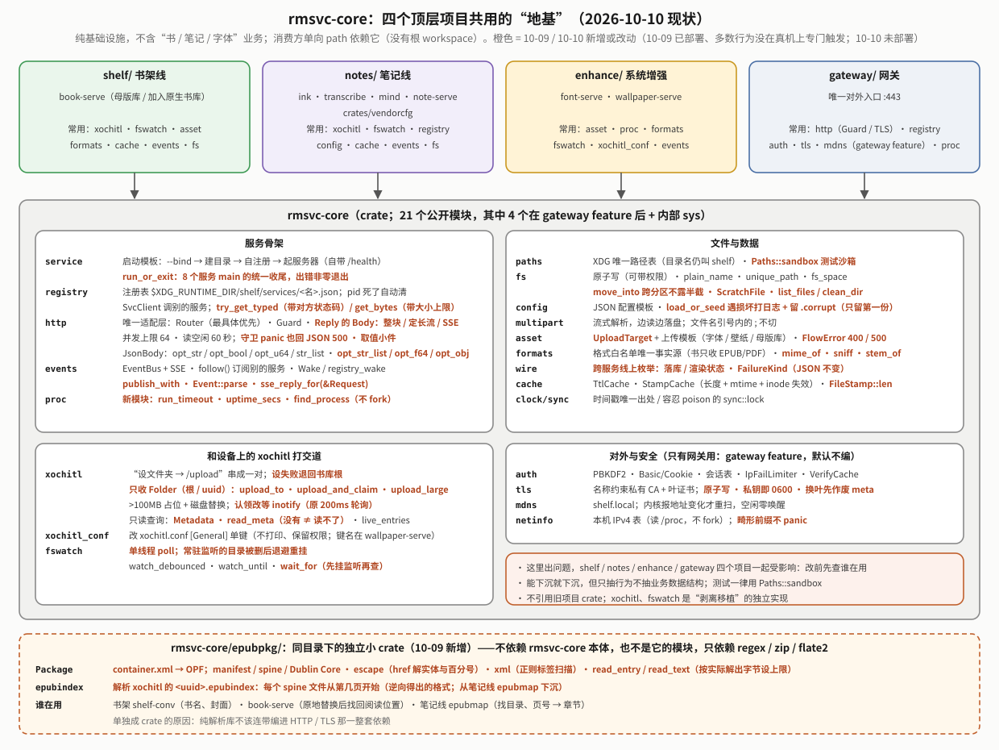
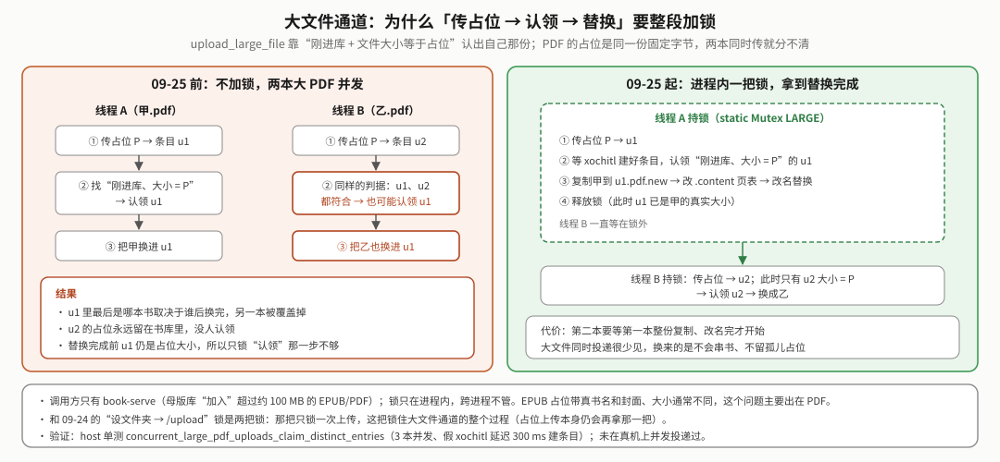
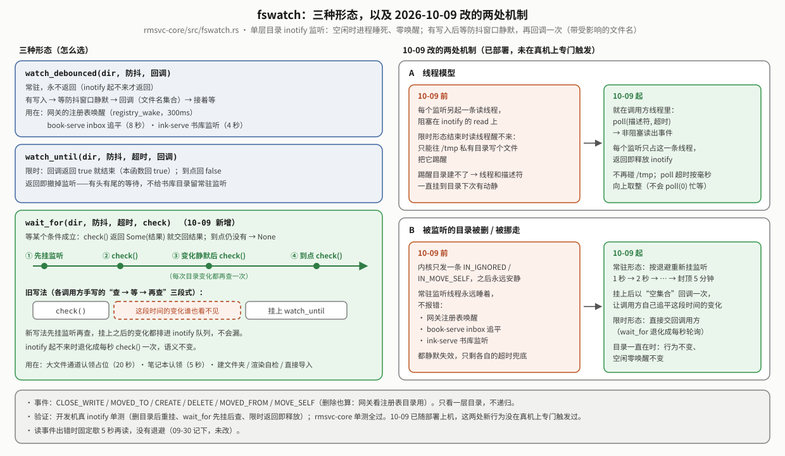
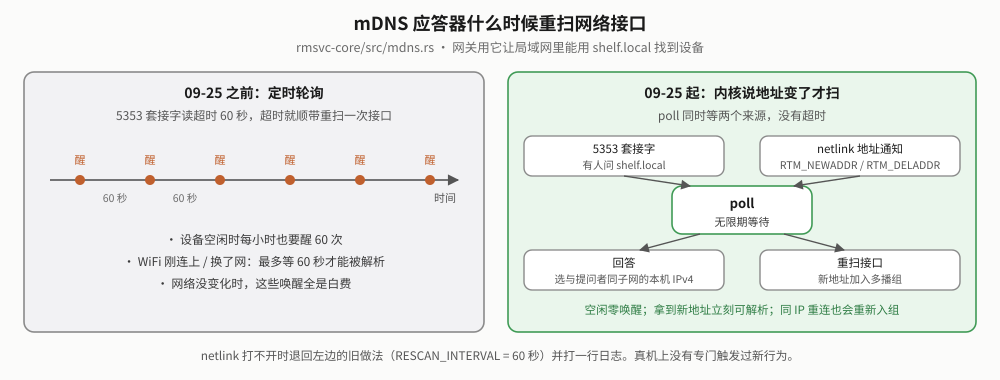

# reMarkable 设备端 Web 服务基座（rmsvc-core）白皮书

> **读者与用途**：要改 `rmsvc-core`，或在 `shelf/`、`notes/`、`enhance/`、`gateway/` 里写 Web 服务、想知道基座提供什么、有哪些约定的人。
> 入口文档（模块速查、Rust API 入口、一个服务的骨架）见 [`../README.md`](../README.md)；网关怎么用这些模块（登录、代理、批量队列）见 [网关白皮书](../../gateway/docs/reMarkable网关白皮书.md)。
> **怎么读**：先读"给新读者"和"现状"；后面按模块分组（§01～§04），每个模块写"谁在用"和"关键约定"；§05 维护纪律，§06 踩坑，§07 待办。被推翻的做法只留结论和教训。所有数字以 2026-10-09 的代码为准（`rmsvc-core/src`）。
> **验证程度的写法**：「真机」= 在设备上跑过；「已部署」= 代码装上了设备、部署自检通过，但这个行为本身没在真机上专门触发过；「开发机」= 只有 host 测试。

## 给新读者

**这是什么**：设备上 8 个小 Web 服务（书架 1 个、系统增强 2 个、笔记 4 个、网关 1 个）都要做同样的杂活——读 XDG 路径、向注册表登记、收 HTTP 请求回 JSON、接大文件上传、往 xochitl（reMarkable 自带的书库/阅读/笔记程序）塞书、广播"该刷新了"、登录和 TLS。这些杂活只写一份，就是 `rmsvc-core`。它是纯基础设施，不含任何"书 / 笔记 / 字体"业务语义。

**能做什么**：一个新服务用 `service::run_or_exit` 一行起来（自带 `/health`、自动登记、网关自动发现），用 `http::Router` 写接口，用 `asset` 接上传，用 `xochitl` 往原生书库投文件，用 `fswatch` / `events` 等变化而不轮询。

**怎么开始**：读 [`../README.md`](../README.md) 的"一个服务的骨架"，照着 `enhance/wallpaper-serve/src/main.rs`（最小的完整例子，约 150 行）改。

**术语**

| 词 | 意思 |
|---|---|
| 注册表 | 每个服务启动时在 `$XDG_RUNTIME_DIR/shelf/services/<名>.json` 写下端口和 pid；网关读目录就知道谁活着 |
| path 依赖 | 消费方在 `Cargo.toml` 里直接写相对路径 `rmsvc-core = { path = "…/rmsvc-core" }`，不经 workspace |
| 剥离移植 | 需要旧项目某项能力时不依赖旧 crate，而是把验证过的结论独立重写一份 |
| inotify | Linux 内核的文件变化通知；空闲时进程睡死、零唤醒，比定时轮询省电 |
| Repository / Template Method | `asset` 把"上传→暂存→查扩展名→校验→安装→回执"流程写一次，各仓库只实现差异 |

## 现状（2026-10-09）

**关键事实**

| 项 | 值 |
|---|---|
| 模块数 | 22 个公开模块（`lib.rs`；10-09 新增 `proc`）+ crate 内部的 `sys`（`poll` 小工具） |
| 消费方 | `shelf/services/book-serve` · `enhance/{font,wallpaper}-serve` · `notes/services/{ink,transcribe,mind,note}-serve` + `notes/crates/vendorcfg` · `gateway/`（2026-09-29 退役的 koreader-serve 源码 09-30 已从仓库删除，不再是消费方） |
| 依赖方向 | 单向：消费方 → 本 crate；本 crate 不知道任何消费方，不引用旧项目 crate（`device-core` / `weread-device`） |
| workspace | 不建根 workspace，各项目各管各的 `target/` |
| 同目录小 crate | `epubpkg/`（10-09）：EPUB 容器 / OPF 只读解析 + xochitl `.epubindex` 起始页表，笔记线 `epubmap` 与书架 `shelf-conv` / `book-serve` 共用；**不依赖 rmsvc-core 本体**，也不是它的模块，见 §02 末尾 |
| 测试 | 133 个单测通过、1 个默认忽略（需要网络命名空间的 mDNS 端到端测试），另有 1 个文档示例默认忽略（2026-10-09 实跑）。`vendor/tiny_http` 的补丁另有单测（在 vendored crate 里，不计入）。CI `rust` job 单列一步；仓库 10-09 公开后 CI 恢复执行 |
| 真机 | 所有消费方已部署在设备上运行（2026-09-11 起 `install-all.sh` 真机跑通，之后多次整轮重装）。10-09 第六轮审计 13:48 已部署（部署自检 38✓）；同日的审计后续（小接口、`epubpkg`）随 15:53 那次部署上机（39✓）。**部署自检只说明服务起来了**：本页标 10-09 的行为大多没在真机上专门触发过，唯一专门验证过的是 `epubpkg::epubindex`（书架"原地替换后找回阅读位置"真机跑通一次）。09-24～10-07 历轮改动同理，各节分别注明 |

**10-10 改了什么**（重构第一阶段：只新增 API + 内部重构，旧 API 全保留、签名不变；**未部署、未在真机上验证**；开发机单测通过）：

- **安全**：vendored tiny_http 的 rustls 0.20 → 0.23.45（RUSTSEC-2024-0336：握手中收到 close_notify 时 `complete_io` 死循环；0.23.45 同时避开 RUSTSEC-2026-0285），每个 lockfile 少一整套 TLS 栈（rustls 0.20 + ring 0.16 + webpki 0.22 等 11 个包）。回归测试在独立子进程里量 CPU（0.20 时 1.5 秒窗口吃满 1.50 秒 CPU）。见 [`../vendor/README.md`](../vendor/README.md)。
- **xochitl**：`Folder`/`FolderId`（根 / 校验过形状的 uuid，名字传不进来）；`Xochitl::upload_and_claim`（上传前快照 → 上传 → 按 `ClaimBy::{SameBytes, VisibleName, SameSize}` 在快照之外的新文档里认领，**绝不取最新一本兜底**）；`upload_to`、`folder_by_name`、`child_folder`、`folder_of_document`、`upload_large`；"设文件夹 → /upload"加跨进程锁（运行时目录下 `xochitl-upload.lock` 的 flock）；大文件通道认领改走 `upload_and_claim`；`content::PageTable`（`.content` v1/v2 页表，合并 book-serve 与 ink-serve 两份解析）；`Metadata::last_opened_page`、`EntryKind`；`/upload` 失败按 ureq 错误种类判"很可能已送达"（不再子串匹配）。删了无调用方的 `read_metadata`（原始 JSON 版）、`created_ms(&Value)`；`upload_likely_delivered` 改为内部。
- **http / registry**：`ApiError::{new, conflict, too_large, bad_gateway, unavailable}`；`Request::{small_body, json_value, form}`（超限 413；`json()` 超限也由 400 改为 413）；`TestRequest`（测试用 Request 构造器）；`percent_*` 搬到 `http`（`multipart` 再导出）；`SvcClient::{try_get_json, try_get_typed}` 与 `From<SvcError> for ApiError`（对方 4xx 透传、5xx/坏应答 502、未运行/连不上 503）。
- **其它**：`wire::{DeliverStatus, RenderStatus}`（线上状态枚举，JSON 不变）；`EventBus::sse_reply_for(&Request)`（显式读 `?ka=`）；`asset::UploadTarget`（`AssetStore` 经 blanket impl 自动满足）；`fswatch::WatchSpec` 与 `watch_with`/`watch_until_with`/`wait_for_with`（可参数化掩码/防抖）。
- **没改**：书库扫描不加缓存——host 上 2050 份 `.metadata` 整库扫描约 3ms/次，各调用点都不在空闲轮询里（`xochitl::library::bench` 手动跑）。

**10-09 改了什么**（第六轮审计 + 同日审计后续；已部署，行为除注明外未在真机上专门触发；开发机 133 个单测通过）：

- **新共享 API**（把各服务各写一份的代码收进基座，服务已迁过去、删掉私有副本）：`proc`（新模块）、`fs::{ScratchFile, move_into, list_files, clean_dir, write_atomic_if_changed}`、`formats::{mime_of, sniff, stem_of}`、`http` 取值小件、`asset::any_ok`、`config::backup_corrupt`、`Paths::sandbox`、`SvcClient::{get_typed, get_bytes}`、`EventBus::publish_with` / `Event::parse`、`service::run_or_exit`、`xochitl::{Metadata, read_meta, file_type}`、`Xochitl::upload_into`。见 §01～§03。
- **fswatch 改机制**：单线程 `poll`，不再每个监听多开一条读线程、不再往 `/tmp` 写文件踢醒；常驻监听的目录被删/挪走后退避重挂（原来永远失效）；新增 `wait_for`（§03）。
- **大文件通道认领**从每 200ms 扫一遍书库（最多 100 轮）改成等 inotify（§03）。
- **设文件夹失败退回书库根**：书投到刚被删的文件夹时落根，原来会落进上一次投递设的文件夹（§03）。
- **TLS 证书/私钥原子写**，私钥创建即 0600；换叶证书先作废 meta（§04）。
- 修小隐患：`move_unique` 跨分区不再露半截文件；字体 cmap format 4 逐码位总数设上限；守卫 panic 也回 JSON 500；`Iface::contains` 前缀 >32 不 panic；`Metadata` 字段遇 JSON `null` 按缺省值。
- **审计后续补的小接口**（调用方已迁移）：`JsonBody::{opt_str_list, opt_f64, opt_obj}`、`FileStamp::len()`、`live_entries` 直接返回 `(uuid, Metadata)`；`content_disposition` 的行为测试从 note-serve 挪进 `multipart`。
- **新的同目录小 crate `epubpkg`**：笔记线与书架两份 EPUB 容器/OPF 解析合成一份，稍后又收进 `.epubindex` 解析（§02 末尾）。

更早几轮（09-24 第三轮、09-25 第四轮、09-30 第五轮、10-07 代码审查）的改动已经写进各节，按日期标注；CHANGELOG 有按时间的完整记录（[`../../docs/CHANGELOG.md`](../../docs/CHANGELOG.md)）。

**三条要记住**：① 这里出问题，理论上 4 个独立顶层项目（shelf、notes、enhance、gateway）一起受影响，改任何模块前先查谁在用（下面每节都列了）；② 公开结构体（如 `http::Request`）被各服务直接构造，加字段会波及全部调用方，宁可走内部头或新函数；③ XDG 路径仍叫 `shelf`（已部署设备的真实路径，改名要迁移）。

## 01｜服务骨架：service / registry / http / events / proc

### service —— 启动模板（8 个服务都用）

`service::run(&SPEC, bind, &paths, router)`：解析 `--bind` → 建齐 XDG 目录 → 写注册表 → 起 HTTP 服务器，自动挂 `GET /health`（返回 `{ok, service, version}`）。`run_with` 多一个 `ServeOpts`（TLS、登录守卫、并发上限），只有网关传非缺省值。`run_or_exit`（10-09）是 8 个服务 `main` 收尾的统一写法：出错打日志并以非零码退出，交给 systemd 的 `Restart=on-failure` 拉起。`ServiceSpec.tab` 给出网页标签名和顺序（font-serve、wallpaper-serve、note-serve 注册了；网关前端再把前两个收进"其他"标签）。

### registry —— 服务注册与发现（网关、笔记三个服务用）

- 文件 `$XDG_RUNTIME_DIR/shelf/services/<name>.json`：`{name, port, label, version, pid, ui?}`，原子写；进程退出时 `Registration` 的 Drop 删掉它。运行时目录重启即清，再加上按 `/proc/<pid>` 清理陈旧条目，崩溃残留不会误报。
- **同名且 pid 还活着的条目拒绝覆盖**：真机踩过——调试时起了个 `--bind 127.0.0.1:1` 的第二实例，把正在服务的 wallpaper-serve 的注册顶没了。
- `find(name)` 直接读 `<name>.json`（O(1)）。
- `SvcClient`：服务之间互相调用的 HTTP 客户端，每次按注册表解析地址（对方重启换端口也能找到）；非 2xx 时保留对方错误体里的原因。`get_json` / `get_typed`（直接反序列化成调用方的类型，10-09）/ `get_bytes(path, max)`（带大小上限，10-09；transcribe-serve 取裁图用，上限 24MB）/ `post_json` / `post_json_value` / `try_post_json`（返回结构化的 `SvcError`）。

### http —— tiny_http 适配层（所有服务都用）

领域模块不碰 HTTP 类型，这里是唯一适配层。

| 约定 | 说明 |
|---|---|
| 路由 | 路径模式：尾部 `/*` 前缀匹配、单段 `{param}`（参数用 `percent_decode_path` 解码，`+` 不当空格）。**最具体的优先**：字面段多的胜、精确匹配胜尾部通配，跟注册顺序无关（09-20 起；此前"先注册先匹配"，通配路由曾抢走字面路由） |
| 每请求一线程 + 并发上限 | 缺省同时 64 个请求（含 SSE 长连接），超了回 503 + `Retry-After: 2`，不再开线程。取值：合法并发约 30（浏览器每源 6 条 × 几个标签页 + 网关到各服务的订阅），64 留一倍余量；每条线程常驻只有几十 KB。`ServeOpts.max_concurrent` 可改，`None` 不限 |
| 连接读空闲超时 | 每条连接 60 秒（`READ_IDLE_TIMEOUT`）没收到一个字节就断开，防慢客户端、半个请求头/TLS 握手、手机休眠留下的半开连接永久占住线程（09-24）。是空闲超时不是总时长：上传只要有字节在流不受影响。实现靠 `vendor/tiny_http` 的一处补丁（见 [`../vendor/README.md`](../vendor/README.md)）——**不能**把 `SO_RCVTIMEO` 设在监听 socket 上：accept 也会跟着超时，上游 accept 循环遇错就退出，服务停摆（先试过，测试抓到） |
| accept 出错 | 上游遇到**任何** accept 错误都退出 accept 线程，之后服务再也收不到连接、进程却还活着。`vendor/tiny_http` 的第二处补丁（09-25）：暂时性错误（`ECONNABORTED`/`ECONNRESET`/`EINTR`，`EMFILE`/`ENFILE`/`ENOBUFS`/`ENOMEM`/`EPROTO` 先歇 100 ms）跳过这一条接着 accept；其余错误照旧退出。配套：`serve_with` 在 accept 线程退出后返回 `Err`，服务非零退出、交给 systemd 拉起 |
| 请求头白名单 | 处理函数只看得到 `Cookie`、`Authorization`、`Accept`、`Host`、`X-Forwarded-Proto`、`User-Agent`（外加 `Content-Type`/`Content-Length`） |
| 对端 IP | 服务器取 TCP 对端地址（HTTPS 下同样取自底层 TcpStream），写进内部头 `X-Rmsvc-Remote-Ip`（常量 `REMOTE_IP_HEADER`），处理函数用 `Request::remote_ip()`、守卫用 `GuardRequest.remote` 读。客户端自带的同名头在白名单那步就被丢掉，伪造不了。没给 `Request` 加字段，是因为它被各服务直接构造 |
| 守卫 | `Guard`：分发前先问一次，`None` 放行、`Some(reply)` 直接回。登录策略由服务自己定义（只有网关用） |
| panic | 处理函数 panic 兜成 JSON 500"服务内部错误"，并发名额照常归还；**守卫 panic 也一样**（10-09：此前守卫在 `catch_unwind` 之外，panic 时客户端拿到 tiny_http 的空 500）。需要消费方 release 是 `panic="unwind"`，见 §05 |
| 回执 | `Reply::ok/json/error/html/bytes/redirect`；两种流：`Reply::stream`（SSE 用：接管裸 socket、一帧一 flush、读到连接关闭为止）和 `Reply::sized_stream`（文件下载用：已知长度，按定长响应边读边发，发完即结束） |
| 请求体与取值 | `read_small_body`（1MB 上限 `SMALL_BODY_MAX`，超限**报错**）、`json()` → `JsonBody`（`str`/`str_or`/`bool`/`bool_or`，10-09 补 `opt_str`/`opt_bool`/`opt_u64`/`str_list`，之后又补 `opt_f64`、`opt_str_list`（区分"没给"与"给了空数组"）、`opt_obj`（嵌套对象接着用同一套取法））、`form_body`、`multipart_boundary`；查询串 `q`/`q_flag`，10-09 补 `q_required`/`q_parse`；`encode_query` 与 `parse_query` 成对；`html_escape`；`Method::as_str` |

**09-24 教训**：文件下载第一版用了 `Reply::stream`，reader 读完连接却不关，真机上下载永远收不完。SSE 和定长下载是两种语义，各用各的。

### events —— 事件总线（除 mind-serve 外的 6 个服务 + 网关用）

- **格式**：一行 JSON `{"area":"books","kind":"staging","at":<unix秒>}`，只是"该刷新了"的信号，不带状态。服务在**变更发生处**调 `EventBus::publish`（要带附加字段用 `publish_with`，10-09），网关汇聚后推给网页（原则：不轮询、不监听全盘、日志写入不触发）。收方用 `Event::parse(line)?.is(area, kind)` 判断（10-09，此前各服务各写一份解析）。
- **`EventBus`**：进程内广播，每个订阅者一条有界队列（64 条），满了丢事件。
- **心跳**：`GET /events` 缺省 20 秒一次注释心跳；请求可带 `?ka=<秒>` 要求别的间隔（夹到 5～600 秒）。网关给浏览器用 `?ka=60`。
- **`follow(paths, svc, on_json)`**：订阅另一个服务的 `/events`，阻塞不返回，放线程里跑。服务没注册就等注册表目录变化（`registry_wake`，兜底 5 分钟）；连上用 `?ka=120`；断线 3 秒→60 秒指数退避，一条流撑过 10 秒才重置；对方回 404 就长等 10 分钟或等它重新注册。网关的事件汇聚和 transcribe-serve 订阅 ink-serve 都用它。
- **`Wake` 与 `registry_wake(paths)`**（10-07）：`Wake` 是"代数 + 条件变量"的唤醒器——变化方 `bump()`，等待方先记 `generation()` 再 `wait_change(seen, 超时)`，记下之后发生的变化不会漏，多次变化合并成一次醒来。`registry_wake` 给每个注册表目录在进程内起**一条**监听（建在 `fswatch::watch_debounced` 上，防抖 300ms，空闲零唤醒）；同一进程里 `follow` 等服务上线、网关发 `{"area":"manage"}`、网关批量队列重启后等 book-serve，都挂在这一条上。10-09 起注册表目录被删后监听会自己重挂（§03 fswatch），此前只剩各自的超时兜底。

### proc —— 子进程与 /proc（网关、font-serve、wallpaper-serve 用；10-09 新增）

- `run_timeout(cmd, args, timeout)`：带超时的子进程（从网关下沉）。stderr 为空时报退出码，不再回空错误串。font-serve 用它给 `fc-scan`（30 秒）/`fc-cache`（120 秒）加超时。
- `uptime_secs(proc_root)`：读 `/proc/uptime`（含休眠的开机秒数）。
- `parse_stat` / `find_process(proc_root, comm, ppid)`：不 fork 地按名字找进程（如父进程是 1 的 `xochitl` 主进程）。wallpaper-serve 原来每次查状态都 fork 一个 `systemctl show xochitl -p MainPID`，现在读 `/proc`。

## 02｜文件与数据

| 模块 | 谁在用 | 关键约定 |
|---|---|---|
| `paths` | 8 个服务 | XDG 基目录的**唯一路径表**，所有文件路径从这里取。设备 HOME 是 `/home/root`；配置 `~/.config/shelf/<服务>.json`，数据 `~/.local/share/shelf/`，状态 `~/.local/state/shelf/`，运行时 `$XDG_RUNTIME_DIR/shelf/`（注册表，重启即清），二进制 `~/.local/bin`。**上传暂存** `upload_tmp_dir()` = `~/.local/state/shelf/upload`（09-25 起；此前在运行时目录——单元没设 `XDG_RUNTIME_DIR` 时落到 `/tmp`，是 tmpfs：几十 MB 的字体整份占内存、计入服务 cgroup 的 `MemoryMax`）。`app_config_dir("notes")` 这类接口给非 `shelf` 命名空间的消费方。**`Paths::sandbox(dir)`**（10-09）：测试用，HOME 与全部 XDG 目录都落在临时目录——只设 HOME 的旧写法里 `XDG_RUNTIME_DIR` 会落到真实的 `/tmp/shelf-<uid>`；book-serve、网关、font-serve、wallpaper-serve 的测试都已改用它 |
| `fs` | 8 个 | `write_atomic`：先写同目录临时文件再 rename；临时名 `<目标名>.<pid>.<序号>.tmp`，多线程/多进程同时写同一目标不会互相截断；目标名超过 200 字节（`TMP_BASE_MAX`）时按字符边界截短再拼后缀（09-30，见 §06）。`write_atomic_mode`：临时文件**创建时**就带指定权限，含密钥的文件没有"先宽后紧"的窗口。`write_atomic_if_changed`：内容没变就不写（10-09）。`plain_name` 校验单段文件名；`unique_path` 同名不覆盖（`1_x`、`2_x`…）。`move_unique` / `move_into`：同分区直接改名；跨分区先复制到**目标目录里的临时名**再改名（10-09：此前直接复制到正式名，复制途中正式名下是半截文件，失败还会把半截文件留下）。`ScratchFile`：自动删除的临时文件（从 book-serve 下沉）。`list_files` / `clean_dir`：列/清目录里符合条件的普通文件。`fs_space(path)` → `(可用字节, 总字节)`（`statvfs`，不 fork `df`） |
| `config` | 7 个 | JSON 配置模板：`load_or_default`、`load_or_seed`（首启写出缺省）、`save`（原子写，可选 0600）。`is_corrupt` 判断"文件在但解析不了"，给启动时要落盘的调用方决定是否跳过，免得把损坏的配置覆盖成缺省。`backup_corrupt(path, mode)`（10-09）：坏文件另存一份 `.corrupt`，**只留第一份**（已有就不覆盖，凭返回值只打一次日志）——笔记线四处各写一份的"留证"收编到这里 |
| `multipart` | book-serve、note-serve、网关 | 流式 multipart/form-data 解析，每个 part 以 `Read` 交出、边读边落盘，多文件一次 POST 也不把请求体读进内存；分隔符扫描按首字节跳查（200MB 上传体解析 1245ms → 46ms）。头参数按 `;` 切分时**引号内的 `;` 不切**（09-25：此前 `filename="甲; 乙.epub"` 被截成 `甲`）。`percent_decode`（查询串语义，`+`=空格）与 `percent_decode_path`（路径段与 `filename*=`，`+` 原样）；`content_disposition(filename)` 生成下载头（ASCII 兜底名 + RFC 5987 UTF-8 名） |
| `asset` | book-serve、font-serve、wallpaper-serve | `AssetStore`（仓库：`validate`/`install`/`list`/`remove`）+ `AssetUploadFlow`（上传流程写一次）。拒收/成功文案由各仓库覆盖。暂存目录：`new(&paths)` 用 `upload_tmp_dir()`（font-serve、wallpaper-serve），`in_dir(dir)` 由调用方指定（book-serve 用母版库同分区的 `.work/`）。半成品名 `.<uuid>.<kind>.part`，`clean_stale()` 在服务启动时清掉上次中途被杀留下的。`all_ok` / `any_ok`（10-09）汇总一批上传结果 |
| `formats` | 5 个 + 网关 | 文件格式白名单的**单一事实源**：书籍只收 `epub`/`pdf`（09-18 起），字体 `ttf/otf/ttc`，图片 `jpg/jpeg/png`。网页 `accept`（网关注入）和服务端上传门同源。10-09 新增：`mime_of`（扩展名 → MIME 唯一表：投 xochitl、下载回执、EPUB manifest 共用；`.rmdoc` 按 `application/zip`）、`sniff`（按文件头魔数认格式，不信扩展名；EPUB/CBZ/DOCX 都只答 `zip`）、`stem_of`（去扩展名的主干，切分规则与 `ext_of` 一致） |
| `ttf` | font-serve | TTF/OTF 家族名（nameID 16 优先）、魔数校验、CJK 覆盖率。三道防畸形字体：汉字覆盖数钳到区内总码位、够数即停（09-22）；format-12 里 `startCharCode > endCharCode` 的损坏组跳过（09-25）；**format-4 逐码位走过的总数超过区内总码位（20992）即停**（10-09：畸形字体堆几千个都盖满汉字区、却全映射到 glyph 0 的段时覆盖数不涨，原来要走"段数 × 2 万"次循环，8000 段在开发机 debug 下约 1.8 秒） |
| `cache` | `TtlCache`：book-serve、网关；`StampCache`：book-serve、ink-serve、font-serve | **`TtlCache`**：单值 TTL 缓存，给每次刷新都会打、但算一次很重的 `/status`；本服务操作完成时 `invalidate`。计算期间持锁，并发请求等同一份结果。**`StampCache` + `FileStamp`**（09-30）：按文件戳失效的键值缓存，给"每次都要开文件判一遍、但文件很少变"的查询用。戳 = (长度, mtime, inode)：带 inode 是因为同一时钟节拍里原子写成等长内容只看 (长度, mtime) 会误判没变。计算**不持锁**（同键并发只是多算一次）；条目到上限整表清空重来。10-09 起 ink-serve 的条目库解析缓存也改用它（容量 512）；`FileStamp::len()` 取戳里的长度，ink-serve 读 `.rm` 时拿读前读后两个戳加读到的字节数判"读的过程中被改写没有" |
| `clock` | 8 个 | unix 时间戳唯一出处；取不到时间回 0 |
| `sync` | book-serve、网关、笔记线四个服务与 vendorcfg、font-serve、wallpaper-serve、本 crate 自身 | `sync::lock`：容忍 poison 的取锁。release 是 `panic="unwind"`，线程 panic 后它持有的锁被标 poison，别处再 `.lock().unwrap()` 就会让之后每个请求都跟着 panic；这里保护的都是半途中断也自洽的状态，接着用即可。10-09 网关认证配置锁也改用它（此前锁被毒化后谁都登不进）。条件变量 `wait*` 的 poison 处理它管不到，仍是手写 |

### epubpkg —— 同目录下的独立小 crate（epubmap、shelf-conv、book-serve 用；10-09 新增，已部署）

`rmsvc-core/epubpkg/`，消费方 path 依赖 `../../../rmsvc-core/epubpkg`。笔记线 `notes/crates/epubmap`（按 OPF 声明找 nav/NCX）和书架 `shelf/crates/shelf-conv`（书名、封面）此前各写一份 container.xml → OPF 解析，10-09 合成这一份：`escape`（href 解 XML 实体 → 去 `#片段` → 百分号，只认 XML 预定义实体和数字引用）、`xml`（正则标签扫描：去注释、三种引号、任意命名空间前缀；`plain_text` 另把 `&nbsp;` 当空格）、`resolve`/`posix_norm`/`dir_of`、`read_entry`/`read_text`（按实际解出的字节数设上限，文本 16MB `MAX_TEXT_BYTES`，超限当读不到、不截断）、`Package::read`（container.xml 第一个带 `full-path` 的 rootfile → OPF，去注释后存）与 `manifest`/`spine`/`meta_contents`/`dc`。10-09 稍后又从 epubmap 下沉了 `epubindex`（xochitl `<uuid>.epubindex` 的各 spine 文件起始页，格式是逆向结论；book-serve 原地替换后找回阅读位置要用，书架不该依赖笔记线目录），epubmap 的 `index` 模块改成转出，真机样本复制到 `epubpkg/testdata/`。

**为什么不做成 rmsvc-core 的 feature 模块**：shelf-conv 是纯库，原本不依赖 rmsvc-core；rmsvc-core 的依赖（tiny_http + rustls/ring、rcgen、x509-parser、ureq、inotify…）都不是 optional，要 feature 门控就得把它们全改成可选、再让四个顶层项目的消费方都显式开 feature，改动面远大于收益。独立小 crate 只依赖 regex、zip、flate2（书架、笔记线的依赖树里本来就有，不新增包）；aarch64 release 产物 book-serve +2.7KB、ink-serve +3.9KB（container.xml/manifest 改用更宽容的标签扫描，多了几条正则），其余不变。业务（封面挑选、页边距标记、写 EPUB、目录结构）留在各自 crate。测试：`cargo test --manifest-path rmsvc-core/epubpkg/Cargo.toml`，11 个。

## 03｜和 xochitl 打交道：xochitl / xochitl_conf / fswatch

### xochitl —— 往原生书库塞文件（book-serve、note-serve；ink-serve 与网关用只读查询）

剥离移植自旧项目的真机结论。

- **上传口**：`POST http://10.11.99.1/upload`（xochitl 的网页接口只绑 USB 网口，设备端靠 lo/usb1 别名让这个地址常驻可达，见 [`../../enhance/lo-alias/README.md`](../../enhance/lo-alias/README.md)）。
- **"设文件夹 → 上传"**：先 `GET /documents/<文件夹 uuid>` 把"当前文件夹"设好（这是 xochitl 的全局状态），再上传，文件就落进该文件夹；`.metadata` 里的 parent 会被忽略。因为是全局状态，"设文件夹 → 上传"由一把进程内 static 锁串成一对（09-24）；10-10 起再加运行时目录下锁文件 `xochitl-upload.lock` 的 `flock` 管跨进程（book-serve 投书与 note-serve 投笔记本此前会交错）——只在书库目录就是本机真实 xochitl 书库时启用（单测的临时书库不碰真实运行时目录），设备上在 `/tmp/shelf-0/shelf/`（tmpfs，重启即清），打不开时退回只有进程内锁。只锁上传本身。**设文件夹失败时退回书库根**（10-09，已部署，未在真机上专门触发）：此前 GET 的结果被忽略，文件夹刚被删或 xochitl 回错时，当前文件夹仍是上一次投递设的那个，这本书就落进别人的文件夹。
- **两套入口，参数不一样**（10-09 在文档注释里写醒目）：

  | 入口 | 文件夹参数 | 用途 |
  |---|---|---|
  | `upload` / `upload_file` / `upload_large_file` | 文件夹**名字**（visibleName），按名字在整个书库里找，找不到落根 | 母版库"加入"到下拉选的文件夹 |
  | `upload_into` / `upload_file_into` / `upload_large_file_into` | 文件夹 **uuid**（空串 = 根） | 多级文件夹（不同上级下可能有同名子文件夹）、笔记本落进书所在文件夹 |

  `parent_folder` / `find_folder` 返回的都是 uuid，拿 uuid 传给按名字的入口会静默落根——note-serve 从 2026-09-09 起就踩了这个坑，笔记本一直落在书库根（见笔记白皮书第 8 章）。`upload_into`（10-09）是按 uuid 的内存上传口，note-serve 的笔记本 zip（几 KB）用它，不必先落临时文件。
- **multipart 头里的文件名**：`"` 换成 `'`、CR/LF 换成空格，其余字节原样（中文照旧直传）。带引号的书名此前原样拼进 `filename="…"`，xochitl 读到第一个 `"` 就截断；带换行会被当成新的头（09-24）。
- **防复制风暴**：大书上传慢时会 408 或读超时，但文档其实已建好——这类错误**绝不重试**。10-10 起按 ureq 错误种类判（连接阶段失败 → 可重试；连上后读写超时、408、已拿到 2xx 但读回执出错 → 很可能已送达），此前把错误拼成字符串再找 `408`/`timeout` 子串，xochitl 回 5xx 且响应体带 timeout 字样会被误判成已送达。
- **上传并认领** `upload_and_claim`（10-10）：`/upload` 不回 uuid。上传前快照最近两秒内建的文档，上传后等书库目录变化，按调用方给的判据（字节相同 / visibleName 相同 / 大小相同）在快照之外的新文档里找；找不到报 `ClaimError::NotFound`（"已上传但没认出来，别马上重试"），与 `ClaimError::Upload`（没传上去，可重试）分开。同一进程内整段串行。各服务的四套旧认领逻辑第二阶段迁过来。
- `upload_file` 流式上传磁盘文件，不整本读进内存（09-19 OOM 审计：旧路径峰值能到原文件 2 倍多）。
- **大文件通道** `upload_large_file`：绕过网页上传约 100MB 的硬限——先传几 KB 的占位文档（EPUB 要带真书名和封面）让 xochitl 建好条目，再把磁盘上的文件原子替换成真文件。EPUB 删掉占位的渲染缓存，首次打开时重渲染；PDF 要一并改 `.content` 里的逐页表和页数。2026-09-20 真机验证：154MB PDF、153MB EPUB 都能打开。失败时占位可能留在书库里，不做危险的回滚删除。
  - **认领占位条目**：10-09 起用 `fswatch::wait_for` 等书库目录变化（防抖 150ms，最多 20 秒），此前每 200ms 扫一遍整个书库目录、最多 100 轮。
  - **整段串行**（09-25）：认领只凭"刚进库 + 大小等于占位"，PDF 占位是同一份固定字节，两本大 PDF 同时走这条路会认领到同一个 uuid。现在一把进程内 static 锁从"传占位"一直拿到"替换完成"。代价是第二本要等第一本复制完。host 单测 3 本并发各认领到自己的条目；未在真机并发投递过。

    

- **书库只读查询**（`xochitl::library`，纯文件读取，不碰 HTTP）：找文件夹、去重命名 `unique_document_name`、按创建时间找"刚进库的那本"、渲染页数。
  - `Metadata`（10-09）：`.metadata` 的强类型视图，只取各服务真用到的字段（`visibleName`、`type`、`parent`、`deleted`、`createdTime`），带 `is_live` / `is_document` / `is_folder` / `is_live_document` / `created_ms`。字段写成 JSON `null` 时按缺省值处理（否则一个 `"parent": null` 会让整条解析失败）。
  - `read_meta(dir, uuid)`（10-09）：**区分"没有"与"读不了"**——文件不在 → `Ok(None)`（书被彻底删了）；读失败/解析失败 → `Err`（可能正被 xochitl 改写，调用方应跳过这次，别当成书没了）。book-serve 回收站代理靠这个区分不再丢待办。
  - `file_type(dir, uuid)`：流式只取 `.content` 的 `fileType`，不整份解析。
  - 10-10 起库内查询全部走强类型 `Metadata`（此前一半按原始 JSON 取字段），原始 JSON 版的 `read_metadata`、`created_ms(&Value)` 无调用方已删；`Metadata` 新增 `last_opened_page`（数字或数字字符串，怪值给 `None`）与 `entry_kind()`（`EntryKind`）。
  - `content::PageTable`（10-10）：`.content` 的页 id 顺序与文档页 ↔ PDF 页映射（v1 `pages`/`redirectionPageMap`，v2 `cPages.pages` 按 `idx` 排序去删除页）；两份旧实现在"两种形状同时出现""v2 页对象缺 id"时语义不同，合并时各自保留并用测试钉住。
  - `live_entries`（非回收站、未删除的条目，直接给 `(uuid, Metadata)`，解析不了的跳过；网关清理页、book-serve 直接导入查重用）、`created_ms`、`is_uuid_shape`（10-07）。

### xochitl_conf —— 改 xochitl.conf 的单键（wallpaper-serve）

改 `~/.config/remarkable/xochitl.conf` 的 `[General]` 单键，目前只用于休眠屏 `SleepScreenPath`。文件里有 `DeveloperPassword` 等凭证，本模块**绝不返回、绝不打印任何行内容**；整文件读入、只动目标行、原子覆盖，首次改前留一份 `.shelf-bak`。**保留原文件权限**（09-25）：原子覆盖是"写临时文件 → rename"，新 inode 按默认 umask 落成 0644，原件若是 0600，含凭证的文件就变成人人可读；现在临时文件创建时就带原权限，改名后再精确设一次。新值要等 xochitl 下次启动才生效。

### fswatch —— inotify 防抖目录监听（book-serve、ink-serve、note-serve、网关经 `registry_wake`）

单层目录监听，事件：`CLOSE_WRITE`/`MOVED_TO`/`CREATE`/`DELETE`/`MOVED_FROM`/`MOVE_SELF`。空闲时阻塞等事件、零唤醒；有写入后在防抖窗口内静默结束才回调一次，带上受影响的文件名集合。

| 形态 | 返回 | 用途 |
|---|---|---|
| `watch_debounced(dir, 防抖, 回调)` | 永不返回（inotify 起不来才返回） | 常驻追平：注册表唤醒、book-serve inbox、ink-serve 书库 |
| `watch_until(dir, 防抖, 超时, 回调)` | 回调说"完了"返回 `true`；到点 `false` | 有头有尾的等待，不给书库目录留常驻监听 |
| `wait_for(dir, 防抖, 超时, check)`（10-09） | `check` 返回 `Some` 即交回结果；到点 `None` | "等某个条件成立"：先挂监听**再**查一次，之后每次目录变化静默后再查，到点再查最后一次——收编了各调用方手写的"查 → 等 → 再查"三段式，并补上"查完到挂上监听之间"会漏事件的窗口。inotify 起不来时退化成每秒轮询。调用方：大文件通道认领、book-serve 渲染自检与建文件夹等待、直接导入、note-serve 笔记本认领 |

**10-09 改机制**（已部署，未在真机上专门触发）：

- **单线程 `poll`**：调用方线程 `poll` inotify 描述符（带超时）再非阻塞读，每个监听只占调用方这一条线程、返回即释放。此前每个监听另起一条读线程阻塞在 inotify 上；限时形态结束时读线程醒不来，只能往 `/tmp` 下一个私有目录写文件把它踢醒，建不了踢醒目录时读线程和描述符一直挂到书库目录下次有动静。`poll` 小工具从 `mdns` 挪进内部 `sys` 模块两边共用，超时按毫秒向上取整（亚毫秒剩余不会变成 `poll(0)` 忙等）。
- **目录被删/挪走后重挂**：inotify 监听在目录被删（`IN_IGNORED`）或挪走（`IN_MOVE_SELF`）后再也没有事件。常驻形态现在按 1 秒起、翻倍到 5 分钟的退避重挂，挂上后以**空集合**回调一次让调用方自己追平；限时形态直接交回调用方（`wait_for` 退化成轮询）。此前常驻线程会永远睡着：网关注册表唤醒、book-serve inbox 追平、ink-serve 书库监听都会静默失效。目录一直在时行为不变、空闲零唤醒不变。
- inotify 读事件出错时固定歇 5 秒再读（没有退避；09-30 审计记下、未改）。

## 04｜对外与安全：auth / tls / mdns / netinfo（只有网关用）

这四个模块只有网关在用；**用户可见的行为、流程图、真机状态都写在网关白皮书 §01**，这里只记模块层面的约定。

- **`auth`**：`hash_password`/`verify_password`（`pbkdf2$<轮数>$<盐>$<摘要>`，PBKDF2-HMAC-SHA256 60 万轮、16 字节盐；旧版单轮 SHA-256 仍可校验）。`VerifyCache`（09-30）：每个请求都带 `Authorization: Basic` 时，此前每次都现算一遍 60 万轮（设备上数百毫秒 CPU）。**只缓存"通过"**，猜错的每次照样现算，暴力破解成本不变；键 = SHA-256(进程随机密钥 ‖ 存储的哈希 ‖ 密码)，内存里不留明文，随机密钥每次启动从 `/dev/urandom` 取、不落盘；改密后旧缓存自然失效。网关取 10 分钟、8 条。另有 `parse_basic`、`parse_cookie`；`SessionStore`（32 字节随机令牌、绝对过期、容量上限）；`IpFailLimiter`（按来源 IP 的滑动窗口失败计数，IPv4 映射的 IPv6 与纯 IPv4 算同一来源）。
- **`tls`**：`ensure_ca_signed(dir, extra_sans)` 读取或生成私有 CA（10 年）+ 服务器证书（800 天；名字列表变化或签发满 700 天重签）；CA 带名称约束（`PERMITTED_DNS`、`PERMITTED_V4`，路径长度 0），约束外的 SAN 剔除并打日志；旧的无约束 CA 自动备份为 `.bak-<秒>` 后重建。测试用 `rustls-webpki` 做完整链校验，包括"用同一把 CA 私钥硬签 `evil.com` 会被拒"的反证。流程图见网关白皮书的 [`ca-migration.svg`](../../gateway/docs/diagrams/ca-migration.svg)。
  - **原子写与权限**（10-09，已部署）：`ca.key`/`key.pem` 此前用普通写先按 0644 落出来再 chmod，中间有一段私钥人人可读；而且非原子：首启生成 CA 途中断电/被杀会留下半截 `ca.key`，之后每次启动都读不出私钥、网关起不来，只能手工删文件。现在证书和私钥全部走 `fs::write_atomic(_mode)`，私钥临时文件创建即 0600。
  - **换叶顺序**（10-09）：`cert.pem`、`key.pem`、`cert.meta` 分三次写，若只换了证书就被打断，旧 meta 仍声称可复用，会把不匹配的证书/私钥交给 TLS。现在换叶前先删 meta、最后写新 meta，中途打断下次必定重签。
- **`mdns`**：极简 mDNS 应答器（让局域网里能用 `shelf.local` 找到设备），只回答本机名的 A 查询，应答地址选和提问者同子网的本机 IPv4（USB 网段问就答 `10.11.99.1`）。绑不上 5353（别的 mDNS 服务在跑）只打日志，不影响网关。
  - **内核说地址变了才重扫接口**（09-25）：订阅 netlink（内核把网络变化通知给用户程序的通道）`NETLINK_ROUTE` 的 `RTMGRP_IPV4_IFADDR` 组，和 5353 套接字一起 `poll` 无限期等待；只有收到 `RTM_NEWADDR`/`RTM_DELADDR` 才重扫接口、加入新地址的多播组。空闲时零定时唤醒（此前每 60 秒醒一次）；WiFi 后连或换网拿到地址立刻能被解析。netlink 打不开时退回 60 秒读超时顺带重扫（`RESCAN_INTERVAL`）。报文解析有 host 单测；真实加/删地址的端到端测试（默认忽略）在 `unshare -rn` 的网络命名空间里跑通。**真机上没有专门触发过**。

  

- **`netinfo`**：本机 IPv4 表（证书 SAN、mDNS 选址用），读 `/proc/net/fib_trie` + `/proc/net/route`，不 fork 进程；读不到才回落到 `ip -4 -o addr`。`Iface::contains` 遇到前缀 >32（解析到畸形输出）时夹到 32（10-09：此前移位溢出，debug 下 panic，调用方 mDNS 线程会无声停掉）。

## 05｜维护纪律、构建与测试

- **改之前先查谁在用**：上面每节都列了消费方。`shelf-conv`（书架的读书工具库）出问题只影响书架；这里出问题理论上 4 个顶层项目全受影响。
- **公开结构体不随便加字段**：`http::Request` 等被各服务直接构造（包括测试），加字段会波及全部调用方。09-24 的对端 IP 就是为此走了内部头。
- **能下沉就下沉，但只抽行为**：两个以上服务各写一份、逐行相同的通用代码收进基座（10-09 一轮收了十几个）；带业务语义的数据结构留在各服务。下沉时先在基座加 API（不改调用方），再逐个服务迁移、删私有副本，两步分开提交。
- **测试别碰开发机真实目录**：用 `Paths::sandbox(临时目录)`，不要只设 HOME（`XDG_RUNTIME_DIR` 会落到真实 `/tmp`）。
- **path 依赖的深度**：`..` 的个数取决于消费方自己的目录深度——`gateway/` 写 `../rmsvc-core`，`enhance/*-serve/` 写 `../../rmsvc-core`，`shelf/services/*/`、`notes/services/*/`、`notes/crates/vendorcfg/` 写 `../../../rmsvc-core`。写错时 `cargo build` 会直接说它去哪找过，照着改。
- **每个独立顶层项目各带一份 `.cargo/config.toml`**（交叉编译的 CC/AR 覆盖），原因见 §06。
- **release profile**：`gateway`、`shelf`、`notes` 是 `panic="unwind"`，基座的 panic 兜底和各服务的 `catch_unwind` 才真正生效；`enhance/{font,wallpaper}-serve` 仍是 `abort`（没有依赖 `catch_unwind` 的后台线程）。
- **测试**：`cargo test --manifest-path rmsvc-core/Cargo.toml`，133 个单测通过 + 1 个默认忽略（2026-10-09 实跑）；同目录的 `epubpkg` 另跑 `--manifest-path rmsvc-core/epubpkg/Cargo.toml`（11 个）；HTTP 服务器、TLS 握手取对端 IP、名称约束链校验、真 inotify 的目录删除重挂都有真起服务器 / 真内核的测试。

## 06｜踩坑

- **独立顶层 crate 不继承调用方目录的 cargo 配置**（2026-09-11，搬迁当天）：`gateway/`、`enhance/{wallpaper,font}-serve/` 独立成顶层项目后，第一次交叉编译在 `ring` 这步报 `failed to find tool "aarch64-linux-musl-gcc"`。原因：`shelf/.cargo/config.toml` 的 CC 覆盖只在从 `shelf/` 发起 `cargo build` 时生效，跨目录调用吃不到。修法：每个独立项目各带一份内容相同的物理副本（Cargo 没有"引用别处配置"的机制）。这个坑只在交叉编译时炸，host 上 `cargo test` 全绿会让人误以为验证充分。
- **`version.workspace = true` 离开 workspace 就报错**：挪出 `shelf` workspace 的 crate 要把 `version`/`edition`/`license` 改成字面量，`[profile.release]` 也要各自复制一份。
- **`panic="abort"` 让 `catch_unwind` 失效**（2026-09-19，真机）：一次 panic 摔掉整个进程、卡住所有在途操作。`gateway`/`shelf`/`notes` 已改 `unwind`，二进制约大 8%。
- **SSE 通道拿去发文件下载**（2026-09-24）：见 §01 http。
- **accept 线程悄悄退出**（2026-09-25）：上游遇到任何 accept 错误都退出 accept 线程，`serve_with` 又返回 `Ok`，服务以退出码 0 结束——`Restart=on-failure` 只拉起非零退出，于是服务"正常"消失。两层都要修：暂时性错误不退出（vendor 补丁），真退出时报错让 systemd 接手。
- **原子写换了 inode，权限跟着丢**（2026-09-25）：tmp + rename 得到的是新文件，权限按 umask 来，不继承原文件。改别人家的配置文件（尤其含凭证的 `xochitl.conf`）要显式保留原权限（§03）；自己生成的密钥要创建时就带 0600（10-09 tls）。
- **暂存放在 tmpfs 上会吃服务的内存配额**（2026-09-25）：`/tmp`、运行时目录都是内存；几十 MB 的上传暂存计入 cgroup `MemoryMax`，还要跨分区再拷一遍。暂存要和最终目标放在同一分区（§02 paths）。
- **通配路由抢字面路由**：旧的"先注册先匹配"下，`GET /{name}` 抢过 `/health`（wallpaper-serve 真机踩过）。现在按具体程度分发。
- **临时文件名 = 目标名 + 后缀会超长**（2026-09-30）：Linux 单段文件名上限 255 字节，中文一个字 3 字节，80 来个字的书名加上 `.<pid>.<序号>.tmp` 就超了。凡是"在目标名后面拼后缀"的地方都要先截短（§02 fs）。
- **"名字"和"uuid"两种文件夹参数混用会静默落错**（2026-10-09 发现，09-09 起就在）：note-serve 把 `parent_folder` 返回的 uuid 交给按名字找文件夹的 `upload`，找不到就落书库根，不报错。两套参数的接口在文档注释里写醒目，手里是 uuid 一律用 `*_into`（§03）。
- **监听的目录没了，监听就死了**（2026-10-09）：inotify 只在目录被删时发一条 `IN_IGNORED`，之后永远安静；常驻监听要识别它并重挂（§03 fswatch）。wallpaper-serve 09-30 在自己的监听里修过同一个坑，这次基座也补上。
- **"查一次再挂监听"会漏事件**（2026-10-09）：查完、还没挂上监听的那一瞬间发生的变化谁也看不见。要先挂监听再查（`wait_for`）。

## 07｜命名遗留与待办

**命名遗留（刻意不动）**：XDG 命名空间 `shelf`（`~/.config/shelf/`、`~/.local/share/shelf/`、`~/.local/state/shelf/`、`$XDG_RUNTIME_DIR/shelf/services/`）、`shelf.target`、默认密码 `shelf`、mDNS 名 `shelf.local`。这些是已部署设备的真实路径和配置，改名要给已有安装写兼容读取或一次性搬家脚本。

**待办**

- **10-09 改动在真机上专门看一遍**：已部署（自检 38✓ / 39✓），但下面这些行为还没专门触发过：网关重启后证书照常（原子写不该改变已有证书）；投书到刚删掉的文件夹落在书库根；大于 100MB 的书走大文件通道仍能认领；笔记本落进书所在文件夹（笔记线）；把注册表目录删掉再建，网关仍能发现服务（不必真机做，开发机测试已覆盖）。
- 命名遗留要不要处理，没有排期；要动时先设计迁移方案，不是简单改字符串。
- `fswatch` 读事件出错的固定 5 秒重试没有退避（09-30 记下，未改）。
- 条件变量 `wait*` 的 poison 处理仍是手写（`sync::lock` 管不到）。

## 附｜来历

- **2026-09-11 正名搬顶层**：原名 `shelf-core`，在 `shelf/crates/` 下。起因是一次连锁判断：用户问"wallpaper/font 能不能挪进 `enhance/`"→ 排查发现这两个服务**建在** shelf-core 的整套框架之上，要么复刻一份框架（两份分别维护），要么让 `enhance/` 反向依赖 `shelf/`（方向倒挂）→ 追问下去发现 shelf-core 早就是事实上的共享基座（`notes/` 四个服务一开始就依赖它），只是名分没跟上。正名搬顶层一次解决两个问题。
- **命名**：选 `rmsvc-core`（reMarkable service core），延续 `device-core` 的 `<领域>-core` 风格；没选 `hub-core`/`panel-core`，因为它们暗示"网关附属物"，而本 crate 和网关是平级的消费关系。目录摊平放顶层，不建"基座"父目录。
- **Repository / Template Method / Registry / Facade 这些设计取舍**是 shelf-core 时代定的，记在 `shelf/docs/reMarkable书架白皮书.md` §01（三种拆法）。
- **旧章节号对照**：旧 §00b 模块一览 → §01～§04；旧 §02 路径深度 → §05；旧 §03 维护纪律 → §05；旧 §03b 09-24 新增能力 → 分散到 §01 http、§02 fs/config/multipart、§04 auth/tls；旧 §04 踩坑 → §06；旧 §05 待办 → §07。`proc` 10-09 新增，写在 §01。
