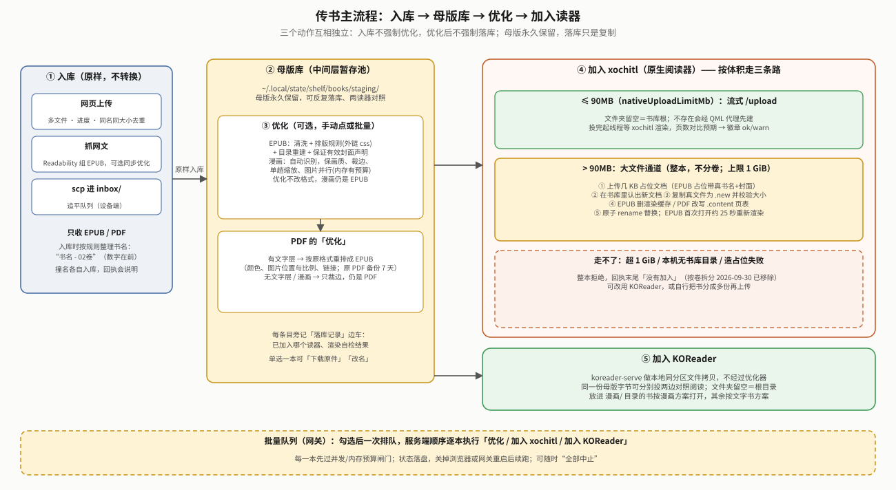

# shelf · 书架

> **读者与用途**：想弄清"书架是什么、怎么把一本书从手机弄到 reMarkable 上、代码/服务在哪"的人。
> 先看下面「它是什么」和数据流图；要看全项目全貌读 [`../docs/OVERVIEW.md`](../docs/OVERVIEW.md)；
> 决策依据与真机记录在 [`docs/reMarkable书架白皮书.md`](docs/reMarkable书架白皮书.md)（按主题分章，每章开头有"现状结论"）；
> 用户可见的更新历史在 [`../docs/CHANGELOG.md`](../docs/CHANGELOG.md)。

## 它是什么

reMarkable Paper Pro Move 的**读书与阅读质量层**：一个网页，把书（EPUB/PDF）弄进设备、按需"优化"（让书在墨水屏上排版更好看）、再选去哪个读器——官方阅读器 xochitl 或 KOReader；同时把字体、壁纸做成"上传即可用"，并把 KOReader 的调优配置固化成可一键恢复的代码。**不修改 xochitl 本体**，按服务可插拔、独立于其它功能安装。

> 工程原则（2026-09-03 用户定）：XDG 基目录规范 · 设计模式去重解耦 · 专项专用可插拔多服务 · **不引用旧项目任何 crate**（能力只许剥离移植）· 不与旧运行期路径对接（不读写 `/home/root/weread/**`）。

## 读书线：三层 · 三个正交动作



- **入库**：只有三条来源——网页上传（多文件、进度；上传前核对"同名同大小=已落地"则跳过）、抓网文（Readability 抽正文组成 EPUB，可选同步优化）、scp 进设备 `inbox/`。**所有书只落母版库**，网页和 inbox 都没有直投读器的路径；母版永久保留。
- **格式**：只收 **EPUB / PDF**（`rmsvc_core::formats` 单一事实源）。其它格式一律拒收——这是 2026-09-17/18 用户明确的策略收紧，不是技术判断；已在库里的旧格式条目仍可加入 KOReader。书名入库时规范成 `书名 - 02卷`（数字在前）。
- **优化**（可选，手动点或批量）：只有「完整清洗 + 优化」一档；EPUB 走清洗/排版/目录/封面保证，漫画自动识别、保画质、裁边、优化不改格式（仍是 EPUB）；PDF 有文字层转 EPUB、无文字层/漫画只裁边。
- **落库**：**加入 xochitl**（≤90MB 流式 `/upload`；>90MB 优先"占位+磁盘替换"不分卷，上限 1GiB；不可用才回退按卷拆分）／**加入 KOReader**（本地同分区拷贝）。落库记录、渲染自检徽章、剩余空间都在母版库页显示。
- **批量与并发**：勾选后一次排队，由网关顺序逐本执行（落盘续跑、可全部中止）；每一本先过并发/内存闸门。详见 [`../gateway/README.md`](../gateway/README.md)。
- **已移除**：电脑端 `shelf` 命令行（含 Calibre 深洗、`doctor --render`、`notes pull`）2026-09-18 整体砍除，没有网页等价物；格式转换请先在电脑上自行处理成 EPUB/PDF 再上传。清单见白皮书附录 B。

**网页 tab**（固定四段）：「传书」（入库两卡：上传｜抓网文；母版库）· 「笔记」（笔记线 note-serve 注册）· 「其他」（xochitl 字体 / KOReader / 壁纸，只列真装了的）· 「管理」（基石与模块 / 模型管理 / 系统增强 / 电池刺客 / 实验室）。

## 架构：网关 + 领域服务


| 服务 | 端口（仅本机） | 职责 | 源码 |
|---|---|---|---|
| gateway | `0.0.0.0:443` 对外 | HTTPS+登录、单页 UI、反向代理、批量队列、并发闸门 | `../gateway` |
| book-serve | 8790 | 母版库（入库/优化/落库）、投 xochitl、回收站与建文件夹队列 | `services/book-serve` |
| koreader-serve | 8791 | 落书进 KOReader、字体/词典/配置同步、高亮/生词只读端点 | `services/koreader-serve` |
| font-serve | 8792 | 原生字体上传即装（fontconfig 中文回退链） | `../enhance/font-serve` |
| wallpaper-serve | 8793 | 壁纸上传即用（原生 `SleepScreenPath` 键） | `../enhance/wallpaper-serve` |
| 笔记线四服务 | 8795–8798 | ink / transcribe / mind / note，见 [`../notes/README.md`](../notes/README.md) | `../notes` |

- **注册表**：服务启动写 `$XDG_RUNTIME_DIR/shelf/services/<name>.json`（含 pid、端口、UI tab），退出即删；网关按它出 tab、缺席回 404「未安装」。装/卸一个服务 = 一个二进制 + 一个 systemd 单元。
- **URL 段 ↔ 服务**（`../gateway/src/manage.rs` 的 `MODULES` 单一事实源）：`books→book-serve`、`koreader→koreader-serve`、`fonts→font-serve`、`wallpapers→wallpaper-serve`。经网关 `GET /api/fonts/health` = 后端直连 `GET 127.0.0.1:8792/health`。
- **systemd**：`shelf.target`（挂 multi-user）+ 各服务 `PartOf=shelf.target`；`systemctl disable --now font-serve` 即拔掉字体服务。所有单元都 `After=home.mount`、`PartOf=shelf.target`、`WantedBy=shelf.target`；纯本地的 `ink-serve`、`note-serve` 之外，其余单元还带 `After`+`Wants=network-online.target`；**绝不给 xochitl 加依赖**（改核心服务启动依赖曾导致变砖）。

### 主要 API（经网关前缀 `/api/<seg>`）

**books**（book-serve）
- 母版库：`GET /status` · `GET /staging` → `{items, freeBytes}`（条目含 `delivered.render` 渲染自检、`busy`、处理进度）· `POST /staging`（multipart 原样入库）· `POST /staging/optimize {name}` · `POST /staging/deliver {name, folder?}`（folder 空＝书库根；不存在会先经 mkdir 队列建）· `POST /staging/cancel {name}`（中途停止，EPUB 优化与按卷拆分支持）· `POST /staging/mark {name, target}` · `POST /staging/fetch-article {url, optimize?}` · `POST /staging/delete {name}`
- 漫画页边距待办（给 qmd 代理用）：`GET /margins/{uuid}`（有待设的边距则返回，否则 404）· `POST /margins/applied {uuid}`（销账）；仅「实验室→漫画页边距」开关开着时生效，白皮书 §20（`bookconv优化白皮书.md`）
- 设备端代理队列：原生回收站 `POST /trash/add` · `GET /trash/pending` · `GET /trash`；原生建文件夹 `POST /mkdir/add` · `GET /mkdir/pending` · `GET /mkdir`
- 追平队列：`GET /inbox` · `POST /inbox/{retry,delete}`；事件 `GET /events`（SSE）

**koreader**：`GET /status` · `GET /books[?folder=]` · `POST /books/adopt {name, folder}` · `POST /books/mkdir`（幂等建目录）· `GET|POST /fonts` · `DELETE /fonts/{file}` · `GET|POST /dicts[?name=]` · `GET|POST /config/{settings|defaults|gestures}[?dry_run=1]` · 只读原始数据 `GET /annotations`（每本书的高亮）· `GET /vocabulary`（生词本），供笔记线拉取

**fonts**：`GET /` · `POST /` · `DELETE /{family}` · `PUT /config {emboldenCjkFallback}` · `GET /status`　**wallpapers**：`GET /` · `POST /[?activate=1]` · `PUT /current {name}` · `PUT /mode {mode}` · `DELETE /{name}` · `GET /{name}` · `GET /status`

**网关自身**：`GET /api/services` · `GET /api/manage` · `GET /api/foundation` · `POST /api/manage/{seg}/{start|stop|uninstall}` · `GET /api/events`（SSE，各服务事件汇聚）· **`POST /api/batch` · `GET /api/batch/status` · `POST /api/batch/stop`**（批量队列）· **`GET /api/budget/status` · `POST /api/budget/cancel`**（并发闸门排队/取消）· `GET /ui/locales/{lang}` · 系统增强开关 `GET /api/enhance/status` · `PUT /api/enhance/qol` · `POST /api/enhance/battop/{start|stop}` · `GET /api/enhance/battop/summary` · `/login` `/logout` `/password` `/ca.crt`。笔记线服务 API 见 `../notes/README.md`。

上传回执统一 `{ok, items:[{name, ok, message, item?}], …}`（`rmsvc_core::asset::receipt`）；成功项 `name` 是落地名。

## 目录（结构与一句话职责）

```
shelf/
├── Cargo.toml · build.sh · .cargo/   内部 workspace（仓库根仍无 workspace）；musl 全静态交叉编译
├── crates/bookconv/                  通用内容层：EPUB 优化器+清洗层+质量门、图片处理、漫画（识别/拆分/补白 `comic_*.rs`）、PDF 入库、EPUB 组装、网文抽取、命名规则、占位文档；`src/bin/` 是几个开发期/诊断小工具（`epub-optimize`、`cover-fix` 等）
├── services/book-serve/              母版库服务：staging/(领域，含落库 `deliver.rs`) · sidecar.rs(落库记录边车) · ops.rs(忙锁/取消登记簿) · render_check.rs · pending_queue.rs · trash.rs / mkdir.rs / comic_margins.rs(设备端代理队列) · spool.rs(inbox) · config.rs · api.rs(纯 HTTP 适配)
├── services/koreader-serve/          KOReader 目录模型 · 配置同步 · 高亮/生词只读（纯 Rust 只读 SQLite 解析器）
├── systemd/                          shelf.target + book/koreader-serve 单元（font/wallpaper 的单元在 ../enhance/<name>/）
├── xovi/                             qmd 注入：字体菜单动态项（`font-menu-dynamic*.qmd`）· 回收站代理 · 建文件夹代理 · 漫画页边距代理 `shelf-comic-margins.qmd`（改 qmd 先用 qmldiff CLI 离线实跑）
├── koreader/                         配置即代码：profile 补丁 + fonts/dicts 备忘清单 + merge.lua（经 koreader-serve `/config/*` 应用，见其 README）
├── install.sh · uninstall.sh · manifest.sh   设备端安装/卸载与两者共用的清单（--only 按服务，未知令牌退出 2；写 /usr 前实检 dm-verity）。install.sh 依赖同目录的 manifest.sh 与 packaging/devlib.sh（deploy.sh 打包时已带上）
└── docs/                             白皮书 · 传书EPUB线架构 · bookconv优化白皮书 · diagrams/
```

共享基座 `../rmsvc-core`（三条线共用）；网关 `../gateway`；host 侧编排 `../packaging/deploy.sh`（构建→tar-over-ssh→设备 install.sh，自动备份）。每个文件的来历见白皮书附录 C。
依赖方向（单向无环）：`services/* → ../rmsvc-core`；`book-serve → bookconv`；shelf 不依赖 device-core / weread-device；koreader-serve 不依赖 bookconv。

## 路径（XDG，设备 HOME=/home/root）

| 用途 | 路径 |
|---|---|
| 二进制 | `~/.local/bin/{gateway,*-serve,shelf-uninstall,lo-alias.sh}` |
| 库（供 `shelf-uninstall` source） | `~/.local/lib/shelf/{manifest.sh,devlib.sh}`（整包安装才装；`--only` 不动它们） |
| 备份 | `~/cangjie-backups/shelf-<时间戳>/`（旧二进制/单元/qmd，保留最近 5 份） |
| 配置 | `~/.config/shelf/<service>.json`（book：书库文件夹/xochitl 主机/超时/**`nativeUploadLimitMb` 加入原生体积门，缺省 90（超过则走占位+磁盘替换通道，§03bn）**；90 是 2026-09-19 真机测出 xochitl `/upload` 硬上限约 100MB 后留的安全余量，见 `config.rs`；font；gateway）· `~/.config/shelf/tls/`（CA+叶证书） |
| 数据 | `~/.local/share/shelf/`（fonts.json、壁纸池）· `~/.local/share/fonts/`（用户字体，fontconfig 标准位） |
| 状态 | `~/.local/state/shelf/books/staging/`（**母版库**，不淘汰）· `books/{inbox,.work,failed}`（追平队列）· `books/comic-margins.json`（漫画页边距待办）· `wallpaper-state.json` · `koreader-backups/` |
| 运行时 | `/tmp/shelf-0/shelf/{services,upload,koreader}`（`XDG_RUNTIME_DIR` 缺省回落；重启即清） |
| 笔记线 | 自成一套 `notes` XDG 路径，与书架的 `shelf` 命名空间互不相干，详见 `../notes/README.md` |
| 外部约定 | KOReader 根 `SHELF_KOREADER_ROOT`（缺省 `~/xovi/exthome/appload/koreader`；appload ≥ 0.6.0 起原生支持 3.28，见 koreader/README）；xochitl 书库 `~/.local/share/remarkable/xochitl` |

## 访问与密码

- 地址：`https://<设备IP>/`，或伪域名 **`https://shelf.local/`**（网关自带 mDNS 应答；iOS/macOS/Windows/Linux 直接可用，
  **安卓系统不解析 .local**——安卓手机走 host 热点时在 host 加 dnsmasq 别名，见白皮书 §03j）。**传大书走 USB `https://10.11.99.1`**（不占 WiFi，白皮书 §03l）。2026-09-10 起绑标准 443 端口，网址不用带端口号。
- 登录页只要密码、无用户名：**首次默认 `shelf`，登录后强制改**（≥6 位、不能是默认）。改密：网页右上「改密码」；
  设备上 `gateway passwd <新密码>`；忘记：`gateway reset-password`（回默认并再次强制改）。改密后其它设备会话失效。
  （host `shelf passwd` 已随 host CLI 一并砍掉，2026-09-18）
- 证书：私有 CA 签发（`~/.config/shelf/tls/ca.pem`）。登录页「下载 CA 证书」装进手机/电脑信任库**一次**，此后不再有"不安全"提示
  （叶证书 800 天自动续签、CA 不变）；不装就点「高级 → 继续访问」。
- 只有网关对外；领域服务只绑 127.0.0.1，无需认证。

## 构建 · 部署 · 卸载

**前置依赖**（一次性）：`rustup target add aarch64-unknown-linux-musl` + 装 aarch64 交叉 gcc/ar（Arch：`pacman -S aarch64-linux-gnu-gcc`；只用来编 `ring` 的 C 部分，产物本身是 musl 全静态、跟设备 libc 版本无关）。链接器/CC/AR 配置在 `.cargo/config.toml`，不用手改。改代码前先看工程纪律（真机验证、分支策略、离线门槛等）——两条线（shelf/notes）都遵守同一份；2026-09-16 起 `dev` 分支已删除，日常开发直接在 `master` 上开 feature 分支。

```sh
cd shelf && sh build.sh                                # host 测试 + aarch64 musl 全静态（书架 2 个二进制；../gateway/../enhance/{wallpaper,font}-serve/../notes 存在时顺带编它们）
cd ../packaging && sh deploy.sh 10.11.99.1             # 组载荷 → 设备 /home/root/shelf-pkg → install.sh（先备份旧二进制/单元）；设备只在 WiFi 上时给 WiFi IP
sh deploy.sh 10.11.99.1 --only font,wallpaper          # 只装/更新部分服务（令牌见下）；SHELF_NO_BUILD=1 跳过编译
sh deploy.sh 10.11.99.1 --password '新密码'             # 同时设网关密码（值经 ssh 标准输入写进设备 0600 临时文件，install.sh --password-file 读后即删，不上命令行）
ssh root@10.11.99.1 '~/.local/bin/shelf-uninstall' [--only font] [--purge]   # 设备上已装的卸载脚本（~/.local/bin，install.sh 每次更新）；也可 sh ~/shelf-pkg/shelf/uninstall.sh
cargo build --release -p bookconv --bin epub-optimize   # 手动跑一遍清洗+优化器的开发期小工具（shelf/target/release/），不再有任何 CLI 调用它
```
`--only` 可选令牌：`gateway book koreader font wallpaper ink transcribe mind note`（网关总会装；写了别的令牌设备端 `install.sh` 报错退出，退出码 2）。`install.sh` 需要同目录的 `manifest.sh` 与 `devlib.sh`（`deploy.sh` 已把它们一起打进载荷，**手拷单个 `install.sh` 到设备不够**）。安装是幂等的：先校验载荷（缺任何东西一个字节都不写），旧文件备份进 `~/cangjie-backups/shelf-<时间戳>/`（保留最近 5 份），二进制/qmd 原子替换，`/usr` 写入在带 trap 的 rw 窗口里，只重启内容有变化或没在跑的服务。

整包路径：`packaging/install-all.sh <host>`——统一编排固件安全门 + `wifi-watch`/`battop` 等系统项 + `enhance/` 的 xovi 扩展 + `packaging/deploy.sh`（shelf 本体+网关+笔记线+两个领域服务）+ 最后统一重启 xochitl，见 `../packaging/README.md`。旧的单体打包脚本 `package.sh` 已随 2026-09-11 大归档挪出仓库，不是 `install-all.sh` 的设计参照。

⚠ **重启 xochitl 的判定**：xovi 已在运行的 xochitl 里生效时，**用 `systemctl restart xochitl`，不要跑 `xovi/start`**（后者会让运行中的 xochitl SEGV，整机自动重启，2026-09-20 事故）；只有 xovi 没生效（刚开机/OTA 之后）才用 `xovi/start`。`packaging/` 的脚本已内建这条判定（`devlib.sh` 的 `cj_xochitl_apply`），且重启前会提示"将打断阅读"并留 5 秒宽限。

## 固件升级（OTA）与恢复

**权威说明（恢复流程、逐项对照表、流程图）统一在 [`../docs/INSTALL.md`](../docs/INSTALL.md)「固件升级（OTA）之后」**，这里不再另写一份表。一句话：升级不丢 `/home` 数据；升完先设备旁手动 `xovi/rebuild_hashtable`，再在电脑上重跑 `cd ../packaging && sh install-all.sh <host>`（幂等，缺什么补什么；也可只重装书架：`SHELF_NO_BUILD=1 sh deploy.sh <host>`）。3.27.3.0 → 3.28.0.172 的实录见白皮书 §03v；2026-09-20 前的旧版 OTA 表已压缩成附录 D 的差异要点。

## 文档索引

| 文档 | 内容 |
|---|---|
| [`docs/传书EPUB线架构.md`](docs/传书EPUB线架构.md) | 传书线**当前状态**参考（非时间顺序）：架构、数据流、优化管线、内存安全、大文件通道、API |
| [`docs/reMarkable书架白皮书.md`](docs/reMarkable书架白皮书.md) | 文首「5 分钟读懂」+ 决策依据与真机记录，按主题分章（每章有大白话导语与坑位表）；附录含踩坑总表、演进记录表、已移除能力 |
| [`docs/bookconv优化白皮书.md`](docs/bookconv优化白皮书.md) | 书籍优化引擎：清洗/优化遍/脚注/图片/★xochitl 渲染硬规则/版本演进 |
| [`../docs/CHANGELOG.md`](../docs/CHANGELOG.md) | 用户可见的更新历史 |
