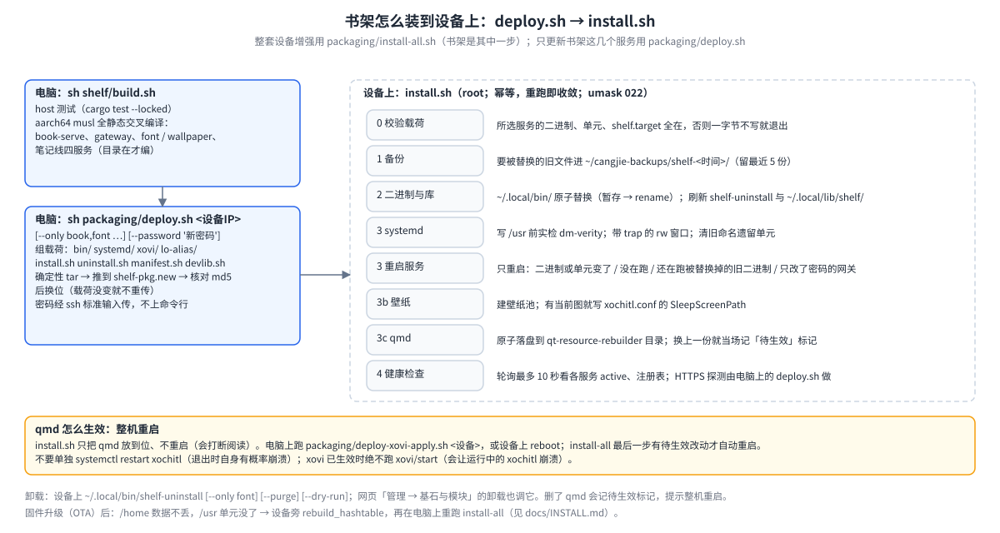

# shelf · 书架

reMarkable Paper Pro Move 的**传书工具**：跑在设备上的一组网页服务，用手机或电脑浏览器把书（EPUB / PDF）传进设备，再加入设备自带的阅读器 xochitl；字体和休眠壁纸也做成"上传即可用"。**不修改 xochitl 本体，也不改书。**

- **给谁用**：想用浏览器往 reMarkable 里传书、装字体、换休眠壁纸的人，以及维护这些服务的人。
- **怎么开始**：整套设备增强一条命令装好（`packaging/install-all.sh <设备IP>`，见 [`../docs/INSTALL.md`](../docs/INSTALL.md)），然后浏览器打开 `https://shelf.local/`（或 USB 下的 `https://10.11.99.1/`），默认密码 `shelf`，首次登录必须改。
- **书先在电脑上优化**：用 [sheng-ren](https://github.com/bbq191/sheng-ren) 的 booklib，按 `xochitl` 阅读模式把书优化成 EPUB，再传上来。书架原样投书（2026-10-07 起设备上不再优化书）。
- **第一次来**：先看[书架白皮书](docs/reMarkable书架白皮书.md)第 1–3 节（是什么、能做什么、怎么用）；全项目概览看 [`../docs/OVERVIEW.md`](../docs/OVERVIEW.md)。

> **状态**（2026-10-10）：本目录是 10-10 重构后的代码（投递层统一、按字节认书、错误分种类、跨进程上传锁、安装脚本加固），**还没部署到设备**，设备上跑的是 10-09 的版本。哪些功能在真机上验证过、哪些只有开发机测试，见白皮书第 8 节「验证现状」。

## 能做什么


用户视角三步：**电脑上用 sheng-ren 优化 → 网页上传（或 scp 进 inbox）→ 母版库里勾选「加入 xochitl」**。书**原样**进**母版库**（设备上永久保存原书的地方），之后可以反复加入。

| 动作 | 说明 |
|---|---|
| 入库 | 网页多文件上传（有进度）；或 scp 进设备 `inbox/`（文件静止 5 秒后才收）。只收 EPUB / PDF，字节原样；文件名规范成 `书名 - 02卷`；同名同内容不重复存 |
| 加入 xochitl | ≤90MB 网页上传；更大的走"占位 + 磁盘替换"，上限 1GiB；再大整本拒收。可选书库根下的文件夹（没有就请 xochitl 自己建）。批量加入由网关排队、一本一本做，可全部中止。母版不会因此删除 |
| 母版库管理 | 只勾一本时下载原件、改名；删除；筛选 全部 / 未加入 / 已加入；剩余空间不到 300MiB 标红 |
| 直接导入（给 sheng-ren 用） | 电脑上的 sheng-ren 经 SSH 端口转发直连 book-serve，书不进母版库、按多级文件夹放进 xochitl；也能按 uuid 原地替换一本已有的书，重开时自动跳回原来读到的地方 |
| 漫画页边距 | sheng-ren 优化的漫画带页边距标记，加入后首次打开自动把页边距设到最小；不带标记的书不碰 |
| 字体 / 壁纸 | xochitl 字体上传即装；休眠壁纸上传即用 |

网页有四个固定页签：**传书**（入库、母版库）· **笔记**（笔记线）· **其他**（xochitl 字体、壁纸）· **管理**（基石与模块、设备健康、模型、系统增强、实验室）。

**不做的事**：设备上的「优化」、PDF 转 EPUB、抓网文、联网补封面（2026-10-07 删除，归 sheng-ren）；KOReader（2026-09-29 卸载）；按卷拆分、按书设翻页方向（2026-09-30）；日漫翻页（2026-10-07，xochitl 里日漫一律从左往右翻）；电脑端命令行（2026-09-18）。完整清单见白皮书 9.2。

## 服务与端口


| 服务 | 端口 | 职责 | 源码 |
|---|---|---|---|
| gateway | `0.0.0.0:443`，唯一对外 | HTTPS + 登录密码、网页、反向代理、批量队列 | [`../gateway`](../gateway/README.md) |
| book-serve | 127.0.0.1:8790 | 母版库、加入 xochitl、直接导入、四个 qmd 代理的待办队列 | `services/book-serve` |
| font-serve | 127.0.0.1:8792 | xochitl 字体上传即装 | `../enhance/font-serve` |
| wallpaper-serve | 127.0.0.1:8793 | 休眠壁纸上传即用（写 xochitl 的 `SleepScreenPath` 键） | `../enhance/wallpaper-serve` |
| 笔记线四服务 | 8795–8798 | 见 [`../notes/README.md`](../notes/README.md) | `../notes` |

- 服务启动时往 `$XDG_RUNTIME_DIR/shelf/services/` 写注册信息，网关据此出页签、按 `/api/<段>/*` 转发（段与服务的对应只在 `../gateway/src/manage.rs` 的 `MODULES` 表里写一次）。装 / 卸一个服务 = 一个二进制 + 一个 systemd 单元。
- 全部接口见 [`docs/传书EPUB线架构.md`](docs/传书EPUB线架构.md) §9。
- systemd：`shelf.target` + 各服务 `PartOf=shelf.target`。**绝不给 xochitl 加启动依赖**（曾因此变砖）。

## 访问与密码

- 地址 `https://shelf.local/`（网关自带 mDNS；安卓不解析 `.local`，用 IP）或 `https://<设备IP>/`。**传大书走 USB 的 `https://10.11.99.1/`**：WiFi 热点上行弱，xochitl 导入后还会同步到云。
- 登录只要密码：首次默认 `shelf`，登录后强制改（≥6 位）。网页右上「改密码」，或设备上 `gateway passwd <新密码>`；忘了用 `gateway reset-password`。
- 证书由私有 CA 签发：登录页「下载 CA 证书」装进手机 / 电脑信任库一次，此后没有"不安全"提示。

## 目录

```
shelf/
├── Cargo.toml · build.sh · .cargo/   workspace；aarch64 musl 全静态交叉编译
├── crates/shelf-conv/                只读不改书：读 EPUB（书名、封面、漫画页边距标记）、第三方 PDF 页数、大文件通道占位文档、文件名规范化
├── services/book-serve/              母版库服务
├── systemd/                          shelf.target + book-serve 单元
├── xovi/                             注入 xochitl 的 qmd：字体菜单（3.28 / 3.27 两版）、界面字体令牌、回收站 / 建文件夹 / 漫画页边距 / 阅读位置代理、阅读器单击翻页
├── install.sh · uninstall.sh · manifest.sh   设备端安装 / 卸载与共用清单
└── docs/                             白皮书、历史附录、传书链路技术细节 + diagrams/
```

依赖单向无环：`book-serve → shelf-conv → ../rmsvc-core/epubpkg`；`book-serve → ../rmsvc-core`。书架**不依赖 sheng-ren 的代码**，但有两处从它复制、**sheng-ren 改了这边要手动跟着改**：漫画页边距标记名 `READER_MARGINS_MARKER`（`META-INF/eink-reader-margins`）与书名规范化 `canonical_book_name`（`crates/shelf-conv/src/naming.rs`），没有自动检查（白皮书 6.7）。设备上的路径（母版库 `~/.local/state/shelf/books/staging/`、配置 `~/.config/shelf/<服务>.json` 等）见白皮书 5.3。

## 构建 · 测试 · 部署 · 卸载

一次性准备：`rustup target add aarch64-unknown-linux-musl`，再装 aarch64 交叉 gcc（Arch：`pacman -S aarch64-linux-gnu-gcc`，只用来编 `ring` 的 C 部分）。

```sh
cd shelf && sh build.sh                        # host 测试 + aarch64 交叉编译（gateway / enhance / notes 在的话一起编），cargo 一律 --locked
cargo test --workspace --locked                # 只跑测试：2026-10-10 实跑 book-serve 123 + shelf-conv 24 个通过
cd ../packaging && sh deploy.sh 10.11.99.1     # 打包 → 传到设备（载荷没变就不重传）→ install.sh；只有 WiFi 时给 WiFi IP
sh deploy.sh 10.11.99.1 --only font,wallpaper  # 只装部分服务；SHELF_NO_BUILD=1 跳过编译
sh deploy.sh 10.11.99.1 --password '新密码'     # 顺便设网关密码（经 ssh 标准输入传，不上命令行）
ssh root@10.11.99.1 '~/.local/bin/shelf-uninstall' [--only font] [--purge] [--dry-run]
```



- `--only` 令牌：`gateway book font wallpaper ink transcribe mind note`（网关总会装；未知令牌退出码 2）。清单的唯一事实源是 `manifest.sh` 的 `SHELF_ALL`。
- `install.sh` 依赖同目录的 `manifest.sh` 与 `devlib.sh`，`deploy.sh` 会一起打包，**只拷一个 install.sh 到设备不够**。安装幂等：先校验载荷，旧文件备份进 `~/cangjie-backups/shelf-<时间戳>/`（留 5 份），二进制 / qmd 原子替换，只重启有变化、没在跑或还在跑旧二进制的服务。旧设备上的退役件（`koreader-serve`、网关旧名 `shelf-gateway` 等）每次安装顺手清掉。
- ⚠ **qmd 改动怎么生效**：`install.sh` 只把 qmd 放到位、不重启（会打断阅读）；要生效就**整机重启**——电脑上 `packaging/deploy-xovi-apply.sh <设备>`，或设备上 `reboot`；`install-all.sh` 最后一步有待生效改动才自动重启。**不要单独 `systemctl restart xochitl`**（退出时自身有概率崩溃）；xovi 已生效时**绝不**跑 `xovi/start`。详见白皮书 6.4。
- 整套设备增强（固件安全门、wifi-watch、enhance 扩展、书架、笔记线）见 [`../packaging/README.md`](../packaging/README.md)。

**固件升级（OTA）之后**：`/home` 数据不丢，但要重装功能——设备旁手动 `xovi/rebuild_hashtable`，再在电脑上重跑 `packaging/install-all.sh <设备IP>`。权威步骤在 [`../docs/INSTALL.md`](../docs/INSTALL.md)「固件升级（OTA）之后」。

## 文档索引


| 文档 | 管什么 |
|---|---|
| [`docs/reMarkable书架白皮书.md`](docs/reMarkable书架白皮书.md) | **主文档**：是什么、怎么用、怎么工作、接口与配置、开发与维护、限制与排错、**验证现状**、旧章节号对照表 |
| [`docs/传书EPUB线架构.md`](docs/传书EPUB线架构.md) | **传书链路技术细节**：母版库字段、落库与认领、大文件通道、代理队列规则、锁表、全部 API 与配置 |
| [`docs/reMarkable书架白皮书-历史附录.md`](docs/reMarkable书架白皮书-历史附录.md) | **演进史**：按旧 § 编号保留的历史节（设备端优化、KOReader、各轮审计、10-10 重构的来由） |
| sheng-ren 仓库 `docs/typesetting.md`、`docs/xochitl.md` | 书该被优化成什么样；xochitl 阅读器的实测怪癖 |
| [`../rmsvc-core/README.md`](../rmsvc-core/README.md) | 书架、笔记、系统增强、网关共用的 Web 服务底座 |
| [`../docs/CHANGELOG.md`](../docs/CHANGELOG.md) | 用户可见的更新历史 |
