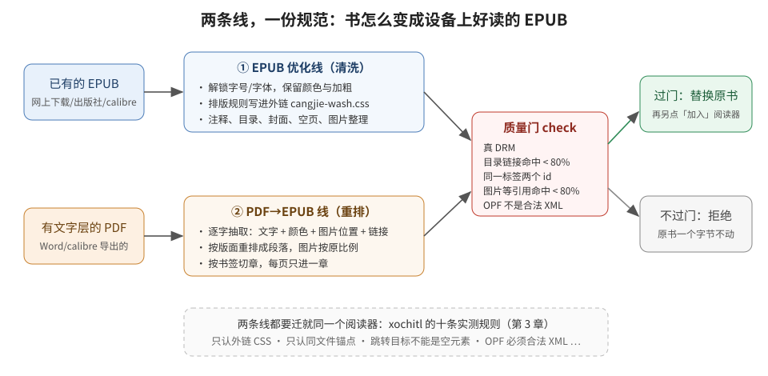
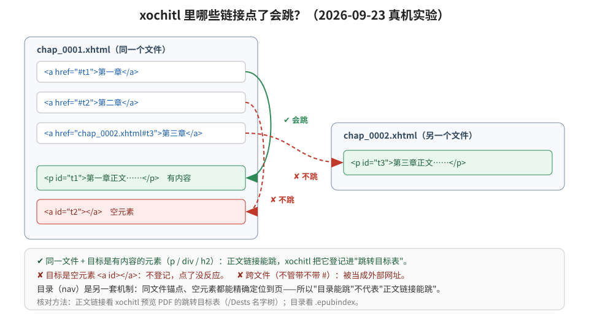
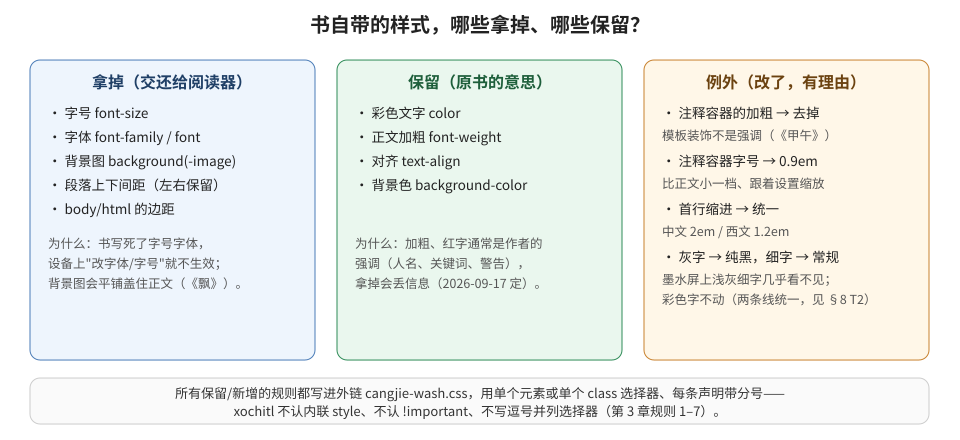
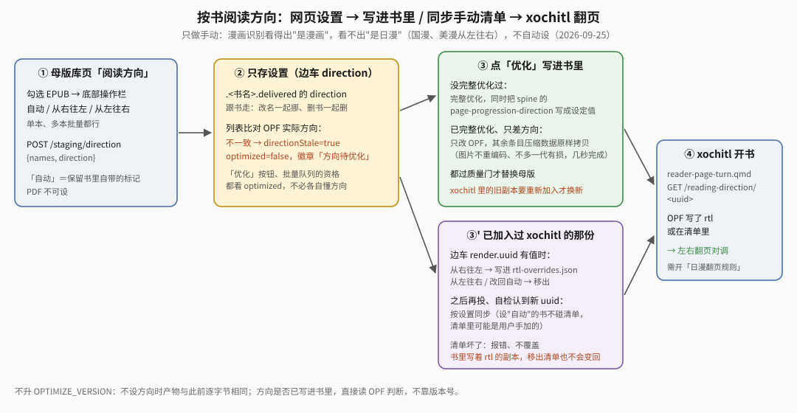
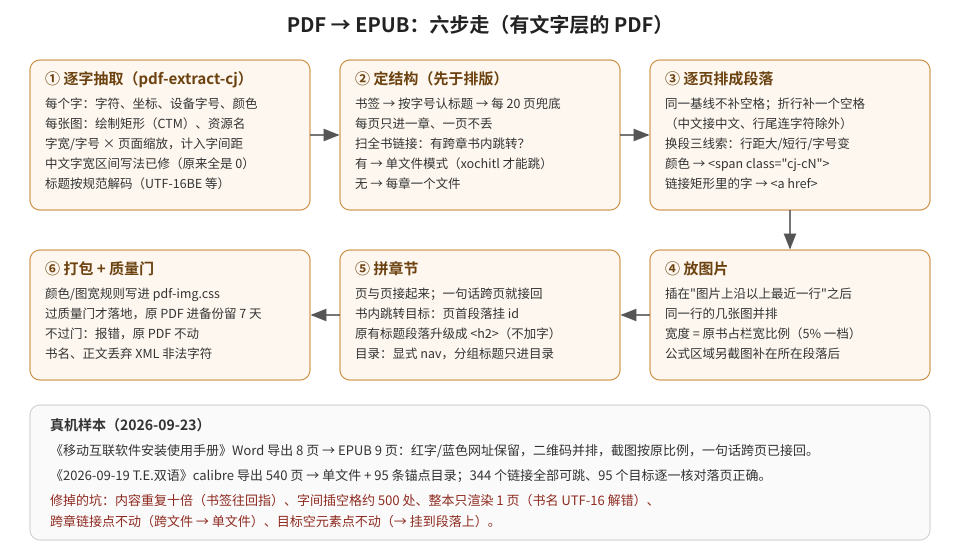
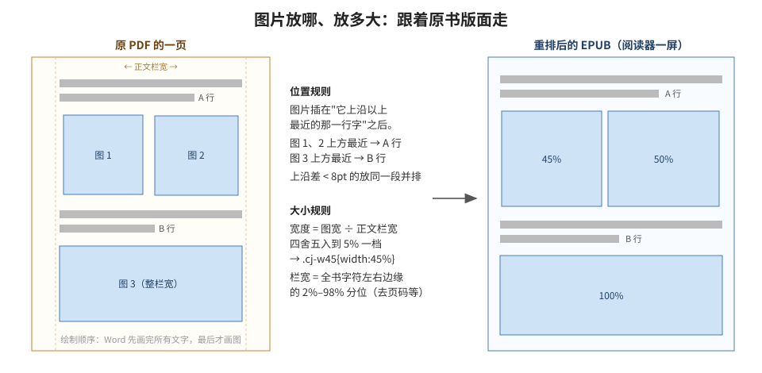
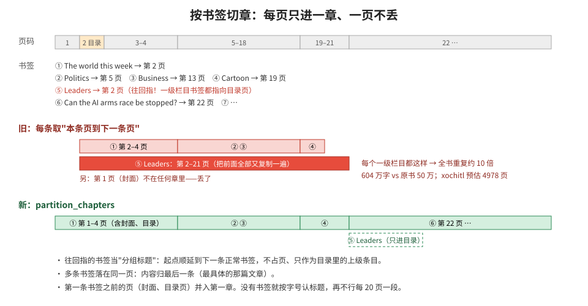
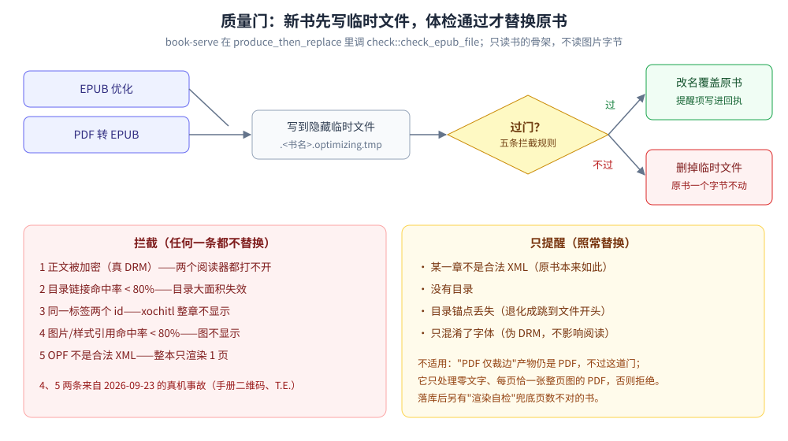

# EPUB 优化与 PDF→EPUB 转换规范白皮书

> **这是什么**：一份**规范**——回答"书该被改成什么样、为什么这样改、改到哪儿为止"。它不讲代码怎么写
> （见 [`bookconv优化白皮书.md`](bookconv优化白皮书.md)），也不讲模块怎么拼（见
> [`传书EPUB线架构.md`](传书EPUB线架构.md)），真机排查经过记在 [`reMarkable书架白皮书.md`](reMarkable书架白皮书.md)。
> 其它文档涉及规则时只写一句并指回这里。规则变了就地改，不堆历史版本（最近核对：2026-09-25，对照源码）。
>
> **怎么读**：只想知道"书会被怎么处理" → 看第 1、2 章和各章开头的大白话；要改规则 → 先看第 2 章三条底线
> 和第 3 章阅读器的脾气，再看对应线的章节；要验证某本书 → 看第 7 章。
>
> **术语**：**xochitl**＝reMarkable 自带的阅读器；**KOReader**＝设备上装的第二个阅读器；**OPF**＝EPUB 里
> 记录书名、文件清单、阅读顺序的那个文件；**nav**＝EPUB 的目录文件；**锚点**＝网页里 `#xxx` 指向的位置；
> **质量门**＝优化完成后、替换原书之前的一道自动检查。

---

## 1｜一张图看懂

书架里的书有两种来源：**已有的 EPUB**（走"优化线"：清洗、整理），和**有文字层的 PDF**（走"转换线"：
把 PDF 拆成字和图，按原版面重新排成 EPUB）。两条线最后都要过同一道**质量门**：过了才替换原书，不过就
原样退回、原书一个字节不动。两条线也都要迁就同一个阅读器 xochitl——它有不少"脾气"（第 3 章），规范里
大部分规则都是为了绕开这些脾气定下的。

## 2｜三条底线（任何规则都不能违反）

1. **不改动书的内容**。文字一个不多一个不少，图片还是那张图，作者的强调（颜色、加粗）要保留。能做的只是
   "排版适配"：让字号字体可调、边距合适、目录可用、图片不溢出。（2026-09-20 用户对 PDF 线明确过"不允许
   变动书籍内容"；2026-09-23 再次明确"字体颜色、链接、图片位置不能更改"。）
2. **真机验证才算数**。xochitl 不开源，行为经常出人意料，电脑上的单元测试只能证明代码逻辑对，证明不了
   阅读器里看起来对。改了规则要么在设备上看，要么用第 7 章的"免肉眼"方法量。
3. **拿不准就保守**。宁可不处理，也不冒把书弄坏的风险。例：判断不出 PDF 有没有文字层，就只裁边不转换
   （转换后原 PDF 只在隐藏备份里留 7 天，出错代价远大于"这本没转"）。

## 3｜xochitl 的脾气：十条实测规则

> 这些都是真机反复踩出来的，不是凭文档推测。**"规范允许"不等于"xochitl 能用"**——我们迁就阅读器的
> 实际行为，而不是 EPUB 规范文本。

**样式类（1–7）**——决定了所有排版规则只能写进外链 CSS 文件（EPUB 线是 `cangjie-wash.css`，PDF 线是
`pdf-img.css`），而且写法要"朴素"：

| # | 规则 | 后果/对策 |
|---|---|---|
| 1 | **只认外链 `.css` 文件**，不认 `<style>` 块、不认 `style=""` 属性 | 规则一律写外链文件；颜色、图宽也只能用 class |
| 2 | `!important` 无效 | 不能靠它压过书自带样式 |
| 3 | 单个元素、单个 class、"元素名+class"（如 `p.cj-tx`）都可靠；逗号并列 `.a, .b` 未复核，保守不写 | 一条规则一个选择器；要压过书自带的类规则时用"元素名+class"（漫画混排页 `p.cj-tx` 真机坐实，bookconv 白皮书 §20） |
| 4 | 同优先级"先出现者胜"（与标准相反） | 多份 CSS 改同一选择器时注意顺序 |
| 5 | 值为 `0` 会被当"没设" | "不缩进"写 `0.01em` |
| 6 | `text-indent` 会被子元素继承 | 顶格段落要剥掉继承来源的 class |
| 7 | 规则里最后一条声明缺分号会被丢 | 输出的每条声明都带分号 |

**跳转类（8–10）**——2026-09-23 用测试书 + 真书实验坐实：

| # | 规则 | 后果/对策 |
|---|---|---|
| 8 | **正文链接只有"同一个文件内的 `#锚点`"会跳**；跨文件（`chap_0002.xhtml#x`、`./…`、不带 `#` 的都算）一律被当外部网址 | 需要书内跳转时，链接和目标必须在同一个文件（PDF 线的"单文件模式"就是为此） |
| 9 | **目录（nav）支持文件内锚点**，能精确定位到页 | 单文件书的目录可以指向 `chap_0001.xhtml#pdf-p22` |
| 10 | **跳转目标必须是有内容的元素**（`
`、`
`、`<h2 id>`）；空元素 `` 不会被登记，指向它的链接点了没反应 | 锚点 id 挂在段落上，不用空 `<a>`。注意：目录不受此限，所以"目录能跳"不代表"正文链接能跳" |

**文件合法性**：OPF 只要不是合法 XML（哪怕书名里混进一个 `\0` 字符），**整本书只渲染出 1 页**，日志里也
看不出原因（只有 `Asked for unknown item ""`）。质量门专门拦这一条（第 6 章）。

## 4｜EPUB 优化线的规则

> **大白话**：书自带的样式里，"锁死字号字体"和"背景图"这类妨碍阅读的拿掉，作者的强调留下，再把注释、
> 目录、封面、图片整理成 xochitl 能正常用的样子。

### 4.1 样式：拿掉什么、保留什么

- **拿掉**：`font-size`、`font-family`、`font`、`background-image`、`background`（书写死了这些，设备上
  改字号字体就不生效；背景图在 xochitl 上会平铺盖住正文）；段落上下间距清零、左右保留；`body/html` 边距清零。
- **保留**：`color`、正文 `font-weight`、`text-align`、`background-color`。加粗和彩色字通常是作者的强调，
  拿掉会丢信息（2026-09-17 定）。
- **例外**：
  - **注释容器**（选择器含 `footnote`/`fnote`，如多看的 `duokan-footnote-item`、我们自建的 `.footnotes`/
    `.cj-fnote`）：去掉加粗、字号定为 `0.9em`（比正文小一档，随设置缩放）。模板里的加粗是装饰不是强调，
    《甲午》真机反馈"全书注释永远加粗"（2026-09-23 用户拍板）。
  - **首行缩进统一**：中文 `2em`、西文 `1.2em`，标题后首段顶格；保留"不缩进"与负缩进（悬挂）。
  - **墨水屏提对比**：无彩色的灰字提成纯黑、细于常规的字重提到 400；**彩色字不动**。浅灰细字在墨水屏上
    几乎看不见。PDF 线同样把灰字当黑字（第 8 章 T2，两线统一）。

### 4.2 注释（脚注/尾注）

- 默认"锚点模式"：注释集中到章末，正文标记是同章 `<a href="#注释id">`，点了跳过去，xochitl 的"返回"浮标
  （已延长到 20 秒）点回原处。弹窗注释做不到（阅读器不支持），"固定在页面底部"也做不到（流式排版没有
  固定的页）。
- 注释容器一律用 `
`，不用 `
`：注释原文里本身可能有 `
`，套进 `
` 会变成非法嵌套。
  （`
` 有内容，也满足规则 10。）
- 图片形式的注释标记（多看的小图标，class 可能在 `` 上也可能在外层 `<a>` 上）换成文字 `[N]`——图标在
  xochitl 里按原图像素显示，会巨大。

### 4.3 目录与封面

- **目录**：书没有目录才自动生成（按 h1–h6；纯图片书每 20 页一段）；"第 X 部 编号 章名"式扁平目录重建成
  两级；NCX 在清单里的 id 必须叫 `ncx`（xochitl 写死了）；`dtb:uid` 与书的标识同步；剥掉外部 DTD 引用。
- **封面**：OPF 里要同时有 `<meta name="cover">` 和 `properties="cover-image"`，且指向真实图片；缺了就从
  第一页找图补上。

### 4.4 图片与漫画

- 普通插图：放进 954×1696 的竖框（宽绝不超过 954，防止横幅溢出），只缩不放，已达标的不重新编码。
- 漫画（图 ≥20 张且每图平均文字 <40 字）：一次解码、裁白边（单边最多 35%）、一次缩放、补白到页框、一次
  编码，画质损失只有一代。
- 超过 900 万像素的图原样保留不处理（设备内存实测上限）。
- **漫画页边距最小化**（网页「管理→实验室」开关，默认关）：开着时漫画图补白到 xochitl 图片框比例 302.4:462.1、
  首次打开时把阅读器页边距设成 1，左右留白从约 20pt 降到 1pt 以内；纯文字页和图文混排页的文字另留 17.8pt 边。
  关着时一切照旧（补白到屏幕比例 954:1696）。
- 一张图具体怎么分流（文字书、漫画、超大图）有图见 `bookconv优化白皮书.md` §05；实现细节与真机数据见 §05、§20。

### 4.5 其它清洗

- **DRM**：只加密了字体的"伪 DRM"直接剥掉；正文被加密的真 DRM 报错拒绝，原书不动。
- **空页**：没有文字也没有图的页删掉，目录改指下一页。
- **死引用**：指向不存在文件的 ``（没有有意义替代文字的）和 `@font-face` 删掉。
- **同一标签两个 id**：先合并成一个（非法 XHTML 会让 xochitl 整章不显示，《消失的爱人》真机踩过）。
- **没有扩展名的章节文件**：按内容识别（文件开头是 `<?xml`/`<html`），不按扩展名——EPUB 规范认 OPF 里的
  类型声明、不认扩展名。此前《甲午》29 章里 4 章被整体漏洗。

### 4.6 阅读方向（按书手动指定，2026-09-25）

> **大白话**：日漫是从右往左翻的。书里有个标记告诉阅读器这一点，但 calibre 转出来的日漫大多没写。现在可以在
> 母版库里给每本书手动指定，「优化」时写进书里。

- **写什么**：OPF `<spine>` 上的 `page-progression-direction`，只有 `rtl`（从右往左）/ `ltr`（从左往右）两个值，
  插在或改在这一个属性上，OPF 其余字节原样——不改书的内容（底线 1）。「自动」＝不动，保留原书写的（或没写）。
- **只做手动**：漫画识别（图 ≥20 张且每图平均文字 <40 字）只看得出"是漫画"，看不出"是日漫"；国漫、美漫从左往右，
  自动设 rtl 会把它们翻反（底线 3）。
- **"要不要再优化"按内容判**：母版文件 OPF 里实际写的方向与设置不一致（按 xochitl 的判据只分"是不是 rtl"：设
  "从左往右"而书里没写，本来就是从左往右，算一致）→ 列表报"方向待优化"，「优化」按钮重新可点。
- **已优化过的书只改 OPF**：再跑一遍完整优化会让每张 JPEG 多一代有损（传书线架构 §3"别二次优化已优化产物"），
  所以这种情况只重写 OPF、其余条目压缩数据原样拷贝，照样过质量门（第 6 章）才替换。没优化过的书在完整优化里一并写。
- **不升 `OPTIMIZE_VERSION`**：不设方向时产物与此前逐字节相同（单测断言），升版只会让整个书库无故变"旧版优化"、
  诱导把几十本书白白重编码一遍；方向写没写进书里，直接读 OPF 判断，不靠版本号。（同一取舍的先例：v15 之后的
  漫画留边改动也没升版，见 bookconv 白皮书 §10。）
- **生效范围**：xochitl 的日漫翻页规则按"OPF 写了 rtl 或在手动清单里"判定（系统增强线白皮书 §03i）。书写进标记后，
  xochitl 里已有的那份要**重新加入**才换成新文件；为免重投，设置时若这本书加入过 xochitl（边车记着 uuid），会顺手
  把那个 uuid 写进/移出手动清单（`rtl-overrides.json`），重新打开书即按新方向翻。清单只能"加上从右往左"——那份
  副本书里本来就写着 `rtl` 时，改成"从左往右"必须重新加入。KOReader 有自己的翻页设置，不看这个标记（书架白皮书 §03bt）。
- **真机状态**（2026-09-25）：完整优化写进 `rtl`、加入 xochitl 后自动同步手动清单，已在《乱马》11/12 卷上走通
  （第一次打开即按日漫方向翻页）。"已优化、只改 OPF"的轻量路径和 PDF 转来的 EPUB 只有 host 单测，还没在设备上走过。

## 5｜PDF→EPUB 转换线的规则

> **大白话**：把 PDF 拆成一个个字（带位置、字号、颜色）、一张张图（带位置、大小）、一个个链接，再按原来
> 的版面顺序重新排成段落。目标是：字一个不差、颜色一样、图在原来的位置并保持原来的大小比例、链接能点。

适用范围：**有文字层**的 PDF（每页平均能抽出 ≥40 个字）。扫描件和漫画 PDF 只裁白边、仍是 PDF。转换成功
且过了质量门后，以 `<书名>.epub` 留在母版库，原 PDF 挪进母版库下的隐藏目录 `.pdf-originals/` 保留 7 天（2026-09-24 起；此前直接删除）。母版库已有同名 `<书名>.epub` 时停下报错，不覆盖。

### 5.1 文字：一个字都不能多、不能少

- **空格**：同一行里只在两个字之间真有缝隙时补空格（缝隙按真实字宽算，要乘页面缩放、加字间距）；中文接
  中文不补；折行处补一个空格，但中文接中文、行尾是连字符或斜杠时不补（复合词、网址不被截断）。
- **分段**：三条线索满足一条就换段——行距明显大于本页典型行距、上一行是短行（离右边界还差 4 个字宽以上）、
  上下两行字号明显不同。一句话跨 PDF 页边界时接回同一段。
- **不变量**：文字层每个字按顺序进正文，公式框里的字也不删；只把正文里原有的标题段落升级成 `<h2>`，找不到
  就不加，不往正文里塞原书没有的字。
- **书名**按 PDF 规范解码（`FE FF` 开头是 UTF-16BE）。此前一律当 UTF-8，T.E. 的书名解出一串 `\0`，整本只
  渲染 1 页。

### 5.2 颜色

- 每个字的填充色都取出来（灰度、RGB、CMYK；认不出的颜色空间如专色、图案，当"不确定"不填色——宁缺勿错）。
- 纯黑、"不确定"和**无彩色的灰**（与 EPUB 线同一判据，墨水屏提对比）不加标记，按黑字显示；其它颜色用 ``，全书同色共用一个 class，规则写进
  `pdf-img.css`（规则 1：xochitl 不认内联样式）。颜色变了才换 span，不是每个字包一层。
- 实测：手册的红色警告、Word 蓝色网址；T.E. 的经济学人红、链接蓝保留，灰色日期提成黑色。

### 5.3 图片：位置和大小跟着原书走

- **位置**：插在"图片上沿以上最近的那一行字"之后。不能按绘制顺序——Word 导出的 PDF 每页先画完所有文字、
  最后才画图，按顺序会把图全堆到页尾，甚至插进一句话中间（手册第 1 页二维码真机坐实）。
- **并排**：插在同一处、上沿相差不到 8pt 的几张图放进同一段并排（原书并排的二维码/截图）。
- **大小**：宽度 = 图在 PDF 上的宽度 ÷ 正文栏宽，取 5% 一档（`.cj-w45{width:45%;height:auto}`），跨栏大图
  封顶 100%，栏宽算不出就维持原像素大小。栏宽取全书字符左右边缘的 2%–98% 分位，排除页码等零星位置。
- 图片文件后缀按实际编码定（JPEG 用 `.jpg`），`src` 路径与压缩包里的真实位置一致——两者任一错了图都不显示
  （手册二维码曾因此消失）。

### 5.4 链接与"单文件模式"

- PDF 里的链接（`Link` 注释：外部网址、书内跳转，以及各种写法的跳转目标）都转成 `<a href>`：链接矩形框住的
  字包进去，颜色 span 在里层。外部网址原样保留（xochitl 没有浏览器，点了打不开，KOReader 可用）。
- **书内跳转**：目标页第一个有内容的段落挂 `id="pdf-pN"`（规则 10：不能用空元素）。
- **单文件模式**：只要有一个书内跳转跨了章，整本书合成一个 XHTML 文件，目录的每一条改指
  `chap_0001.xhtml#pdf-pN`（规则 8、9）。没有跨章跳转的书维持"一章一个文件"。
- 实测 T.E.：344 个链接全部解析到目标，95 个目标逐个核对落在原书对应内容所在页；用户在设备上点击验证通过。

### 5.5 切章：每页只进一章、一页不丢

- 章节来源优先级：PDF 书签 → 按字号认标题 → 每 20 页一段（如实标"第 N 部分"，不伪造标题）。
- 往回指的书签当分组标题（只进目录、不占页）；多条书签同页，内容归最后一条；第一条书签之前的页并入第一章。
- 此前的切法让 T.E. 内容重复约 10 倍（604 万字 vs 原书 50 万），渲染检查预估 4978 页；现在 600 页左右。

### 5.6 为什么 fork 了 pdf-extract

抽字用的第三方库 `pdf-extract` 0.12.1 满足不了"颜色/图片位置"，还有几处错误。我们在
`shelf/crates/pdf-extract-cj/`（MIT 许可，保留原作者版权）里只改了五处，字体解码这类最难、最容易出错的
部分原样保留：

1. 补上六个最常用的颜色指令（`g/G/rg/RG/k/K`，原库完全没处理）；
2. 把每个字的颜色传出来；
3. 图片不再被当成"子页面"错误解析，改为报告图片位置；
4. 修正中文字体宽度表"区间写法"的解析（原库三处全错，中文字宽全为 0）；
5. 嵌套表单（Form XObject）最多展开 16 层、同一对象不重复展开（2026-09-24）：自引用的表单以前能把 book-serve
   的栈打爆，整个进程崩掉，`catch_unwind` 也接不住。

## 6｜质量门：替换原书前的最后一道检查

优化或转换写出新文件后、替换原书之前自动运行；**任何一条"拦截"触发，原书一个字节都不动**。

适用范围：EPUB 优化、PDF 转 EPUB、只改阅读方向的轻量改写，三条都过这道门。"PDF 仅裁边"的产物还是 PDF，不过这道门；
它靠"只处理零文字、每页恰一张整页图的 PDF，否则拒绝"兜底（第 5 章开头）。

| 检查 | 结果 | 为什么 |
|---|---|---|
| 真 DRM（正文被加密） | 拦截 | 两个阅读器都打不开 |
| 目录链接命中率 < 80% | 拦截 | 目录大面积失效 |
| 同一标签两个 id | 拦截 | 非法 XHTML，xochitl 整章不显示 |
| 图片/样式等资源引用命中率 < 80% | 拦截 | 图不显示（手册二维码事故） |
| OPF 不是合法 XML | 拦截 | xochitl 整本只渲染 1 页（T.E. 事故） |
| 正文某章不是合法 XML | 提醒 | 那一章可能不显示；原书本来就这样，拦了也换不来更好的结果 |
| 没有目录 / 目录锚点丢失 / 只混淆了字体 | 提醒 | 可读，但体验打折 |

"OPF 合法"这条上线前，对设备书库 56 本真实 EPUB 扫过：只有两份出事的 T.E. 不合格，零误伤。

## 7｜怎么验证（不用逐页肉眼看）

| 想确认的事 | 方法 |
|---|---|
| 书能不能完整渲染 | 投递后看母版库"渲染检查"的页数；或读设备上 `<uuid>.content` 的 `pageCount` |
| 版面、图片、颜色 | xochitl 为每本 EPUB 生成预览 PDF `<uuid>.pdf`，拉回电脑渲染成图片看 |
| **正文链接能不能跳** | 读预览 PDF 的"跳转目标表"（catalog `/Dests` 名字树）：每个链接的目标名都要在表里；再比对目标页的文字 |
| 目录跳到哪页 | 读 `<uuid>.epubindex`（Qt 二进制：UTF-16 的 `文件#锚点` + 页码） |
| 文字有没有丢/多 | 正文去空白后的字符数与 `pdftotext` 对比（我们保留行尾真实连字符，pdftotext 会删） |
| XML 合不合法 | 用严格 XML 解析器过 OPF 和每章 |

⚠ 2026-09-23 的教训：曾经只用 `.epubindex`（目录）去核对正文链接，得出"能跳"，结果用户一点不跳——
两套机制不同，正文链接必须看跳转目标表。

## 8｜取舍记录

**T1（已决，2026-09-23）注释加粗 vs "保留原书加粗"**
《甲午》的注释模板写死了加粗，全书注释都是粗体。决议：只去掉注释容器的加粗、注释小一档，正文加粗不动。
理由：注释模板的加粗是装饰，正文加粗是强调，"保留加粗"要保护的是强调。

**T2（已决，2026-09-23）灰字要不要提黑**
此前 EPUB 线把无彩色灰字提成纯黑（墨水屏上浅灰难读），PDF 线按"颜色不能更改"保留原灰色，两线不一致。
决议（用户选"PDF 线也提黑"）：两条线统一——无彩色的灰字按黑字显示，彩色字一律保留。理由：墨水屏上
浅灰字的可读性损失大于"灰"这个颜色本身承载的信息；真正表达强调的是彩色，彩色不动。

**T3（已调研，结论：不做；2026-09-25）书里自带的"目录页"跨文件链接**
设备书库扫描（09-23）：7 本 EPUB 的书内目录页共 335 个链接是跨文件的（每章一个文件），在 xochitl 里点不动
（规则 8）；这些书用 xochitl 自己的目录菜单都能正常跳（规则 9）。09-25 曾考虑做成"按书可选开关、默认关"，
先调研了能不能在不合并文件的前提下让这些链接能跳：

| 方案 | 能不能跳 | 为什么 |
|---|---|---|
| 只改 href 写法（`./c3.xhtml#x`、补 `#`、改相对/绝对路径） | 不能 | 规则 8 实验已穷举这些写法，跨文件一律当外链 |
| 在目标章里补锚点（非空元素挂 id） | 不能 | 目标挂没挂锚点不是问题，链接和目标不在同一文件才是 |
| 把各章开头复制进目录页、改成同文件锚点 | 能跳，但不可取 | 往书里塞原书没有的内容（底线 1），且跳到的是副本不是正文 |
| 把目录页复制进每一章 | 同上 | 同上 |
| **目录页 + 全部正文合成一个文件** | 能 | PDF 线的"单文件模式"就是这样（第 5.4 节，T.E. 约 600 页、344 个链接用户点过） |

所以唯一有效的做法是整书合并。它对 PDF 线可行，是因为那些 EPUB 是我们自己排的：全书一份 CSS、`<body>` 不带类、
"章"本来就是人为切的。换到第三方 EPUB，风险逐条如下：

1. **样式会变，而且事先算不准**：各章 `<head>` 引的 CSS、`<body class>` 常常不同（Calibre 每章 `calibre1/2/…`），
   合并后只能留一个 `<body>`，章自己的 body 类只能降级成 `
`，`body.x{}` 这类规则就失效；而 xochitl 规则 4
   "同优先级先出现者胜"让多份 CSS 叠加的结果依赖顺序；body 类在 xochitl 上确实影响版面（bookconv 白皮书 §09⑩：
   页边距 1 时 Calibre body 类吃掉约 20pt）。违反底线 3（拿不准就保守）。
2. **章与章之间不再换页**：xochitl 里每个 spine 文件从新的一页开始；合并后要靠 `page-break-before` 之类的 CSS 换页，
   而 xochitl 认不认这类属性从没验证过（各白皮书无记录）。PDF 线单文件模式本来就是逐页接排，不需要换页，所以没踩到。
3. **笔记线的"按章归类"会整本失效**：笔记线 `notes/crates/epubmap` 用 `.epubindex` 里**每个 spine 文件的起始页**把
   勾画的页号映射到章（`BookMap::chapter_of`：页 → spine 文件 → 目录里 `file` 相同的第一条）。合成单文件后全书只有
   一个 spine 文件，所有勾画都会被标成第 1 章，"按章生成笔记本"随之失效——跨线回归，要一起改 epubmap 才能做。
4. **路径与锚点改写面很大**：各章可能在不同目录，图片/CSS 相对路径要逐个改基准；全书所有跨章链接（不止目录页）、
   nav/ncx 每一条都要改成 `单文件#锚点`，锚点还得挂在非空元素上（规则 10）。id 去重已有（`dedup_ids_in_chapter`），
   但这是一整套新的改写逻辑，出错就是整本跳转失效。
5. **大书渲染未验证**：单文件模式只在约 600 页的 T.E. 上验证过；小说常见 1–2MB 正文、上千页，单个 XHTML 的导入
   渲染耗时与内存没有数据。
6. **已加入的书要重投、阅读进度对不上**：结构变了，xochitl 里旧副本的进度与批注不会迁移。

收益一侧：只是"书内目录页那一页能点"，而目录菜单本来就能用。**结论：不值得做，不实现开关。** 真要做，前提是
先在设备上验证第 2 条（xochitl 认不认 CSS 换页）并改好第 3 条（epubmap 支持文件内锚点映射），再逐本对比第 1 条
的版面。

**T4（已决，2026-09-25）阅读方向：只手动、不升版本号**
见第 4.6 节。自动判"日漫"没有可靠依据（漫画识别分不出日漫与国漫/美漫），翻反比不翻更糟；不设方向时产物逐字节
不变，升版只会让整库无故变"旧版"。

**已排除的风险**：担心 calibre 书常用空 `<a id>` 当注释目标会跳不动（规则 10）——扫描书库 36 本，同文件
链接指向空目标的为 0。

## 9｜未完成与未验证

- PDF 线未验证：公式截图（两本样本都没有公式）、多栏排版、竖排。
- 按书阅读方向：只改 OPF 的轻量路径、PDF 转来的 EPUB 设方向，还没在设备上走过（4.6 节）。
- PDF 线已知局限：页面资源继承自上级节点的图片找不到时跳过；专色/图案等颜色空间不填色；外部网址在 xochitl
  上打不开。
