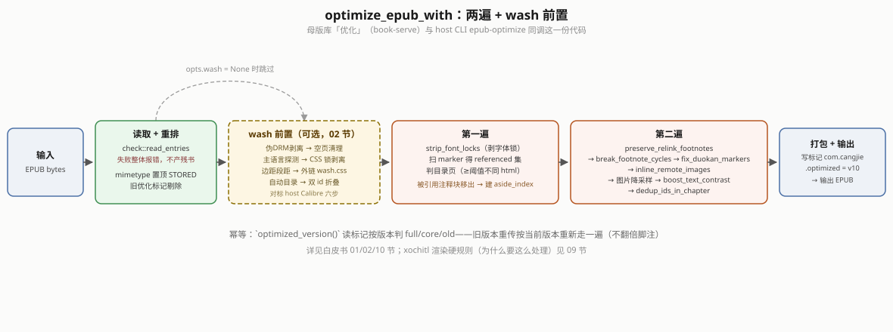
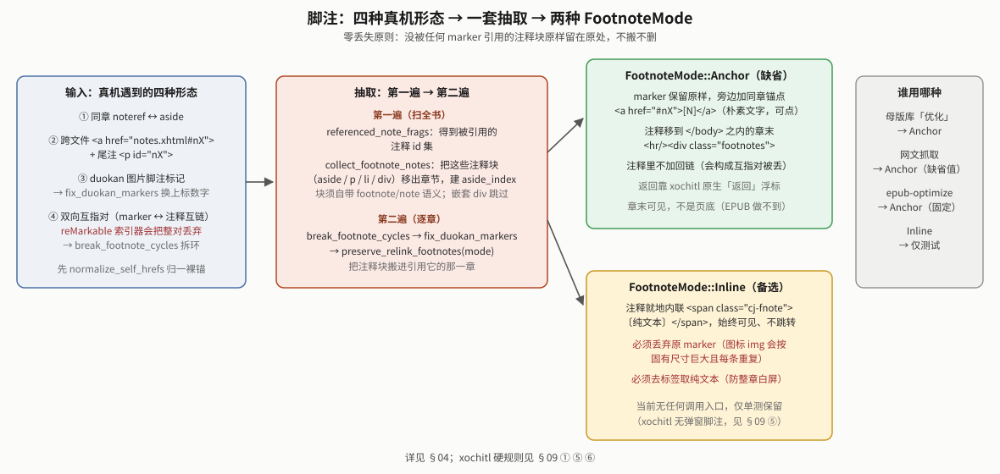

# bookconv 电子书优化白皮书

> `shelf/crates/bookconv` —— 通用电子书内容层：多格式转换 + EPUB 优化器 + 清洗层 + 质量门。记"为什么这么做、真机怎么验、踩了什么坑"，尤其 **xochitl（reMarkable EPUB 渲染器）的硬规则**（§09，本项目最贵的一批真机知识）。上层用法/服务见 `reMarkable书架白皮书.md`（book-serve 母版库「优化」、host `shelf push`；KOReader 只从母版库纯复制落书，不再单独优化）。

## 00｜定位与职责

块③ 阅读的**内容层**，2026-09-03 从 `weread-device` 抽成独立 crate（`git mv`，不复制）。四块职责：
1. **格式转换 `convert`**：AZW3/MOBI/FB2 → EPUB、CBZ → PDF，**纯 Rust clean-room、零 C 依赖**。
2. **EPUB 优化器 `optimize`**：吃任意结构 EPUB，就地改每个 (x)html（解字体锁 / 脚注 / 远程图 / 图片降采样 / 对比度 / 双 id），其余文件结构不动、重打包。
3. **清洗层 `wash`**：对标 host Calibre `wash_epub.sh` 的规则（伪 DRM / CSS 锁 / 边距段距 / 自动目录 / 空页 / 外链排版 css），由优化器可选前置调用。
4. **质量门 `check`**：只读体检（真 DRM / 目录命中率 / 双 id 非法），硬失败应拦下投递。

**一份代码两处共用**：设备 `book-serve` 母版库「优化」（`Staging::optimize`）与 host CLI `epub-optimize` 都调 `optimize::optimize_epub_with`；host `wash_epub.sh` 末步也叠加同一个 `epub-optimize` 二进制——**端 / host 优化同源**（书架白皮书 §03i / §03q）。〔koreader-serve 自 §03s 起不再优化——落库＝纯复制母版字节；漫画不经优化器，`comic2cbz.py` 出 CBZ 直接给 KOReader。〕

**零 C 依赖原则**：EPUB 组装（`epub.rs`）全条目走 STORED（不压缩，免 zlib C 依赖，设备空间充足）；漫画 PDF 手搓（`pdfwrite`：JPEG 直嵌 `/DCTDecode`、PNG 走 `png` crate + miniz_oxide `/FlateDecode`）；MOBI/KF8 解析不依赖 `mobi` crate（它在真机词典样本上把 `extra_data_flags` 尾字节判错、解压乱码，见 `palm.rs`）。

## 00b｜现状总览（2026-09-10 补，读其余节前先看这里）

**模块地图**（`shelf/crates/bookconv/src/`）：`convert/{palm,mobi,kf8,fb2,cbz,pdfwrite,common}.rs`（格式转换，纯 Rust 零 C）· `optimize.rs`（`optimize_epub_with` 两遍 + 幂等版本标记）· `wash.rs`（`wash_entries`，对标 Calibre 六步）· `check.rs`（质量门）· `imgopt.rs`（两个降采样盒 + `trim_margins` 裁边 + `header_dims` 只读头）· `htmlproc.rs`（脚注/字体锁等 HTML 处理原语）· `comic_detect.rs`（2026-09-17 新增，EPUB 漫画判定，移植自 host `comic.py`）· `netimg.rs`（远程图内联）· `article.rs`（网文抓取，2026-09-05 从 `reading/device-rs` 下沉）· `epub.rs`（最小合规 EPUB3 组装）· `stats.rs`；host CLI 见 `bin/epub_optimize.rs`。

**当前版本** `OPTIMIZE_VERSION = "10"`（首行缩进改外链 css 根治，§09④/§10）。

**谁在调用**：设备 `book-serve::Staging::optimize` + host CLI `epub-optimize` 都过 `optimize_epub_with`（同一份代码两处共用，§11）；`convert`（mobi/kf8/fb2/cbz 格式转换）现在只剩 `reading/device-rs` 在用——shelf 自己的杂格式转换统一走电脑 Calibre（书架白皮书 §03s），`epub.rs`/`article.rs`/`imgopt.rs`/`pdfwrite.rs` 这类共享底层各线仍在用。

**离线门槛**：`cargo test -p bookconv` 127 个零警告（2026-09-17：EPUB 线四原则 + `comic_detect` 新增后）。

**未闭环**：无阻塞项；§13 待办都是"打磨精度"级（学术论文多列/公式、公式图放大阈值）。**一条已排查清楚、确认不是 `optimize`/`wash` 层能解决的边界**（2026-09-10，§12）：图片密集的内容（尤其网文抓取，一篇里连续出现几张大图/画廊）在小尺寸墨水屏上分页时，图片块在页尾放不下会被渲染引擎整体推到下一页，当前页剩余空间不回填，视觉上是大片留白——真机 A/B 验证过跟外链样式表无关（`wash_css` 加了 `figure`/`figcaption` 边距归零，修复前后渲染像素级一致），这是分页引擎自身行为，本 crate 没有能调整它的杠杆，以后再有人问"能不能优化掉图片留白"，先看这条，不用重新排查一遍。

## 01｜架构：`optimize_epub_with` 两遍 + wash 前置

`optimize_epub_with(epub, &OptimizeOpts{wash, footnote})`：
- **读全条目**（`check::read_entries`，读失败整体报错——绝不静默跳过条目产出残缺 EPUB 破坏原书）。
- **wash 前置**（`opts.wash=Some` 时）：作用于解包后的**条目表**（`Vec<Entry>`），见 §02。
- **重排**：`mimetype` 首个 STORED（EPUB 规范），其余原序；旧优化标记剔除。
- **第一遍**（`first_pass_html`）：每个 (x)html → `strip_font_locks`；扫全书 marker 得**被引用**的尾注 frag 集（`referenced`）。后半：把被引用的注释块从各章移除、建全书 `aside_index`，交第二遍搬进引用章。~~判目录页（指向 ≥ 阈值个不同 html）~~ 2026-09-18 已删，见 §03。
- **第二遍**（`transform_html_chapter`/`transform_image_bytes`）：`preserve_relink_footnotes`（按 `FootnoteMode`）→ `break_footnote_cycles` → `fix_duokan_markers` → `inline_remote_images` → 图片降采样 → `boost_text_contrast` → `dedup_ids_in_chapter`（跨章 id 去重防撞车）→ 打包。
- **幂等标记**：产物写 `META-INF/com.cangjie.optimized` = `OPTIMIZE_VERSION`。`optimized_version()` 读标记判是否当前版本（母版库列表据此标 full / core / old）；旧版本重传**重优化升级**（`double_optimize_*` 测试坐实重优化不翻倍脚注）。
- **2026-09-19 起两条并行实现路径**：`optimize_epub_with(&[u8])`（整本内存进/出，测试/CLI 小书用）
  跟 `optimize_epub_file_streaming(路径, 路径)`（真机大书用，book-serve/CLI 默认路径，峰值内存
  不随书体积线性涨）共用 `first_pass_html`/`transform_html_chapter`/`transform_image_bytes` 三个
  函数，业务逻辑是同一份代码，不会两条路径分叉走样，见 §14 内存架构。

`FootnoteMode`：`Anchor`（缺省，注释移章末 + 同章锚点跳转 + 原生「返回」浮标；weread/pkm/第三方书历史行为，2026-09-17 起 native→xochitl 设备侧优化也统一用它）· `Inline`（就地内联 `〔…〕` 常显，第三方书历史行为）。⚠ 2026-09-17 当天曾短暂加过第三种 `ParagraphEnd`（注释移到引用它的段落末尾），真机用真实转换书验证后用户反馈"不是当前页最下面，是段末"——EPUB 流式重排做不到真正的页底部定位，撤回并整个删除，见 §04。

## 02｜清洗层 wash（`wash_entries`，对标 Calibre）

按序作用于条目表（`WashOpts{keep_para_spacing, auto_toc, filter_props, lang}`）：
1. **伪 DRM 剥离** `strip_pseudo_drm`：`META-INF/encryption.xml` 只加密样式/字体/脚本（字体混淆合法）→ 丢弃这些文件 + 删 OPF manifest 项。**加密了正文/图片 = 真 DRM → 报错停下**（不产残书）。
2. **空页清理** `remove_empty_pages`：无文字无图的页（Calibre MOBI 转出的 `mbppagebreak` 独占页）→ 从 spine / manifest / zip 删。
3. **主语言探测** `detect_dominant_script`：全书 CJK vs 拉丁字符占比 → `LangMode::{Cjk,Latin}`（`Auto` 在此解析）。
4. **CSS 锁剥离** `filter_css`：独立 `.css` / `<style>` / `style=` 三处剥 `DEFAULT_FILTER_PROPS` = `font-family, font-size, font, background-image, background`（2026-09-17 起不再剥 `color`/`background-color`/`text-align`——EPUB 线原则要求保留原书颜色/加粗等元素样式，只解锁字号；这三项此前只是照抄 Calibre `--filter-css` 通用参数，没有真机验证过是必须剥的行为）。`@font-face` 的 `src:url` 豁免。`@media{}` 嵌套从内向外匹配最内层规则。
5. **边距/段距** `wash_html`：`style=` 按标签名定策略（body/html 全删边距、p/div 上下归零左右保留——不伤 blockquote/列表缩进）。
6. **外链排版 css**（§09④ 治本）：`add_wash_css_entry` 写外链 `cangjie-wash.css`（`p{text-indent:2em;margin-top:0;…}`）+ 每章 `<link>` + OPF manifest 补 item。
7. **自动目录** `auto_toc`（§06）· **单标签双 id 折叠** `collapse_dup_id_attrs`（§09 双 id 白屏）。

`background`/`background-image` 进 `filter_props` 是 v8 真机《飘》修（§09②）。`keep_para_spacing` 给诗集/剧本（靠空行分节，不归零段距）。

## 03｜优化器核心遍（always-on，不依赖 wash）

- **字体解锁** `strip_font_locks`：第三方书常内联硬写死 `font-family`——设备字体设置改不动。剥内联/`<style>`/`.css` 的字体锁（与 wash 的 filter_css 互补，wash 关时仍剥）。
- **脚注** `preserve_relink_footnotes` / `inline_footnotes`（§04）。
- **远程图内联** `inline_remote_images`：微读等下载书内嵌 `res.weread.qq.com` 远程图，设备离线加载不到 → reMarkable 破图占位 = **大放大镜**。抓下降采样内联进 zip（与本章同目录、src 改本地名）；抓不到 → **删该 ``**（放大镜必消，图丢但离线本就是放大镜，删胜于留）。⚠ reMarkable 按 src 直渲图、**不查 manifest**（连不在 manifest 的远程 URL 都尝试渲染才有放大镜），故本地图同样不进 manifest 也直渲（真机验证）。
- **图片降采样** `imgopt`（§05）· **e-ink 提对比** `boost_text_contrast`（灰字→纯黑、细字重→400）· **双 id 去重** `dedup_ids_in_chapter`。
- ~~`remove_toc_from_spine`~~（**2026-09-18 已删，v11**）：早期版本会把"链到 ≥10 个不同 html 文件"
  的页面判定为跟原生 TOC 冗余的书内目录页，从 spine 摘掉。真书《疯探》坐实这个假设站不住——
  这类页面就是正文本身，摘掉直接违背 EPUB 线原则①"保留目录页"；而且原生 TOC 面板本身对任意
  `toc.ncx` 是否真的好用，这轮工作从头到尾没有真机肉眼验证过（见 §13 待办）。这段代码来自项目
  最早期骨架、从未被单测覆盖过，直到这次真书样本才第一次触发。修法就是整段删掉，不留任何
  "目录页特判"，回到模块头部注释本来写的"不重组目录/spine"。旧书需 `force:true` 重优化才能
  拿回被剥掉的页面。详见书架白皮书 §03ay。

## 04｜脚注：四形态 + 两引擎 + FootnoteMode

**四种脚注形态**（真机《13·67》《人骨拼图》混合）：① 同章 `noteref`↔`aside`；② 跨文件 `<a href="notes.xhtml#nX">` + `
` 尾注；③ duokan 图片脚注标记；④ 双向互指对（marker↔note 互链——reMarkable 索引器遇互指**整对丢弃**，`break_footnote_cycles` 拆环）。

**抽取管线**：第一遍 `referenced_note_frags` 扫出被引用的注释 id → `collect_footnote_notes` 把被引用的注释块（aside/p/li/div，嵌套 div 跳过零丢失）从各章移除、建 `aside_index` → 第二遍 `preserve_relink_footnotes(html, index, mode)` 搬进引用它的那一章。未被引用的块原样留原处（零丢失原则）。

**FootnoteMode**：
- `Anchor`：marker 改**同章朴素文字锚点** `<a href="#nX">1</a>`（xochitl 可点铁律：只有同章朴素文字锚点可点，`` 不可点，注释区必须在 `</body>` 内），注释移章末 `
`，原生浮标返回。
- `Inline`：注释文字就地内联 `〔纯文本〕` 始终可见、不跳转——xochitl **无弹窗脚注**（穷尽真机判死）。⚠ 必须**丢弃原 marker**（若 marker 是图标 `` 会按固有尺寸巨大重复，§09①）+ **去标签取纯文本**（防块级标签塞进 `
` 致严格 XML 整章白屏，§09 双 id）。第三方书历史行为在用，"始终可见"是靠塞进句子中间实现的，会打断阅读，不是设备侧默认。

**已删除的尝试：`ParagraphEnd`（2026-09-17，上线又下线，同一天内）**——注释移到"含有该引用的整段"结束后（`
` + 注释块，marker 改纯 `N`，不跳转不建反向锚点），编号/去重按段落内作用域。功能层面完全按设计跑通、host 单测 + 真机 API 级测试都过了（真机产物字节精确核对过位置对）。**但真机用真实转换书测试后，用户反馈"注释并未在当前页最下面，而是在注释标记的段末"**——这才发现设计初衷有个没对齐的地方：用户要的"当前页最下面"指的是**物理翻页后的那一页**，"段末"只是我这边对"就近可见"的一种近似实现，两者在用户预期里是不同的东西。核实后确认这不是能靠调整实现修好的——EPUB 是流式重排文本，"这段文字落在第几页"是阅读器翻页时才计算出来的运行时结果，做书阶段（也就是这个优化器能碰到的唯一阶段）根本不知道最终会落在哪页，没有办法把"这条注释属于第 N 页"这种信息预先写进源文件。真正能做到"注释卡死在某个物理页底部"的只有固定版式排版（每页内容和物理位置在制作时就定死，即 PDF 线的领地），不是 EPUB 格式的重排机制原生能表达的语义。用户确认后拍板"改回章末 Anchor 模式"，`FootnoteMode::ParagraphEnd`/`paragraph_end_footnotes`/`resolve_paragraph_note` 连同测试整个删除——不留作死代码，因为这不是"部分正确、以后也许还用得上"的方案，是已经证实不符合预期的方案。

`normalize_self_hrefs`：Calibre 写法 `part0004.html#x` 写在 `part0004.html` 里 → 先归一成裸锚 `#x`，否则被误当跨文件脚注。

## 05｜图片：按 Move 屏两个降采样盒

Move 屏 = **954×1696 px、7.3″、264 PPI、Gallery 3 彩色墨水屏**（host 侧曾有 `einkify_epub.py` 做同样的降采样+16 灰，无调用方已删，图片处理只此一处）。书常带 2000–4000px 高清图。常量 `MAX_EDGE=1696` / `MAX_SHORT_EDGE=954`、JPEG 质量 85、Lanczos3。**两个降采样函数**（v8 真机《飘》拆分）：
- `downscale_for_epub`（EPUB 内嵌图，**竖向框** 954×1696、宽绝不超 954）：防行内横幅图（`class="logo"` 1696×630）按固有 1696px 宽**溢出竖屏**（§09①）。
- `downscale_for_device`（CBZ 漫画整页，**朝向框**：横图 1696×954 / 竖图 954×1696）：漫画横读满宽。

真机探针：xochitl 块级 `` 缩到正文列宽、行内 `` 按**固有像素**渲染、**都不认 CSS em**（公式图偏小的根因）；长边 ≤1696 且短边 ≤954。彩图饱和度阈值 `COLOR_KEEP_CHROMA` 判是否保色（墨水屏波形按内容分档，彩重/灰中/1bit 轻）。

**取尺寸只读头**（2026-09-05）：`header_dims` 用 `ImageReader::into_dimensions` 只解 JPEG/PNG 头，达标页零解码零重编码（原先为判尺寸整张解码甚至两次，2473 页漫画 2m36s → 1m49s，产物字节不变）。

**1-bit 抖动的体积真相**：Floyd–Steinberg 位图对 Flate 是高熵噪点——927×1327 一页压后仍 ~90KB，只比 120KB JPEG 小 1/4；"~1/8"是相对 8-bit 灰 Flate 说的。要真省体积得换 CCITT G4 / JBIG2（待办）。〔shelf 已不再把漫画转 PDF（漫画不投原生），此段留给 reading 线的 CBZ→PDF 参考。〕

**EPUB 内嵌漫画的画质保留**（2026-09-17，EPUB 线原则④）：新增 `comic_detect::is_comic`（移植 host `comic.py::epub_image_stats()` 的算法——OPF spine 统计 ``/`<image>` 数与可见文字数，图 ≥20 张且平均每张图配的文字 <40 字判漫画），`optimize_epub_with` 内部判定一次。命中后两处跟普通插图路径不同：① `imgopt::trim_margins` 先裁四边纯色/近纯色留白（逐行/列像素两两 RGB 通道极差 ≤8 才算"纯色"，一遇到不满足就停，单边最多裁 15% 防误判裁没内容）；② 超限仍需缩进 954×1696 屏幕框时，用 `downscale_for_epub_comic`（quality 95）而非普通插图的 `downscale_for_epub`（quality 85）。跟 `dither_bilevel`（§05 上文"漫画省刷新"，CBZ 转换路径专用的有损灰阶抖动）方向相反——一个是"不允许压画质"，一个是"允许压画质换省刷新"，服务不同管线，别混用。

## 06｜自动目录（`auto_toc`，缺目录才建）

`AutoToc::IfMissing`（缺省）仅在无 nav/ncx 或零条目时生成。`heading_re` 从 h1/h2 **扩到 h1–h6**（v7：只用 h3 当章标题的书不再漏目录）；`dense_ranks` + level-stack 生成**多级嵌套** navPoint/`<li>`（`d = ranks[i].min(depth+1)` 钳制层级不跳级）。质量门 `check` 按目录锚点命中率告警（丢失则 xochitl 退化到文件级跳转）。

**2026-09-19 补充（已有扁平目录按"第X部"重建两级，见 §10）**：真机《雪人》坐实——书自带
`toc.ncx` 完整但扁平（"第一部　01　雪人"/"　02　卵石眼"，分部标题只在每部第一条出现、其余
条目隐式归属）。`wash::restructure_existing_toc_parts` 检测到分部前缀就重建：分部标题单独成
父级（沿用自己的跳转目标）、前缀后剩下的文本连同后续条目降一级当子级；一条前缀都没有的书原样
不动，避免误伤排版惯例不同的书。在 `auto_toc` 之前跑，被 `AutoToc::Off` 一并关掉。

**2026-09-19 补充（dtb:uid，见 §10 v12）**：`toc.ncx` 的 `<meta name="dtb:uid">` 必须跟 OPF
`dc:identifier` 一致（EPUB2 规范），第三方生成器常见 bug 是两者对不上（真书《疯探》，"番茄小说
EPUB Generator"产物）——navMap 结构再完整，reMarkable 原生目录面板遇到不一致也直接不显示
目录入口（不是空列表）。`wash::fix_ncx_uid` 无条件跑一遍修正，`build_ncx` 自己生成的 ncx 也
接真实标识符而不是硬编码占位值。

**2026-09-19 补充（manifest id 硬编码，真正根因，见 §10 v14）**：dtb:uid（v12）+ DOCTYPE（v13）
都修完，《疯探》原生目录入口真机复测依然不出现——反编译 xochitl 本体（ARM64 stripped 二进制，
方法见白皮书主线 §03bc）坐实真正根因：xochitl 定位 `toc.ncx` 不是走 EPUB 规范的
`<spine toc="IDREF">`，而是在代码里**硬编码死查 manifest 里 `id="ncx"` 这个字符串字面量**，
只有查不到才退回读 `<spine toc="...">`（后备分支实测没能救回《疯探》）。《疯探》完全合规的
`<item id="toc" .../>` + `<spine toc="toc">` 因此被当成"没有 toc.ncx"，navMap 标题提取
整体失败（书照常能翻页，渲染走另一条不依赖这个 id 的路径）。`wash::fix_ncx_manifest_id`
检测 NCX 条目的 manifest id，不是 "ncx" 就改（`<spine toc="...">` 同步改）；`auto_toc` 自己
生成的 NCX 条目原来写的是 `id="cj-ncx"`（同一个坑，之前没人意识到这个 id 字符串本身有讲究），
一并改成 `id="ncx"`。真机验证：拿真实 `content.opf` 只改这一行，`.epubindex` 从 7188 字节
（94 条标题全空）涨到 15558 字节（标题全部正确提取）；走真实 `/staging/optimize`+`/deliver`
全链路复测结果逐字节一致。

**2026-09-17 两处补充（EPUB 线原则①）**：① `split_numbered_title` 启发式——标题文本"标题+编号"结尾（如原书「第一章 1」，正则匹配空白/全角空格分隔的纯数字或中文数字编号）拆成父级标题 + 缩进子级编号两条目、同指一个锚点（`split_numbered_titles` 对 `collect_headings` 的结果做后处理，子级 `level = 父级+1`，天然兼容 `dense_ranks` 的嵌套机制）；编号 >99 判定是印刷页码残留（如「第一章 237」），不拆，避免误伤。② `fallback_spine_toc`：全书连 h1–h6 都没有（`headings.is_empty()`）时，退化到按 spine 文件边界逐条生成，条目文本取该文件正文首段（截断 24 字）、纯图片页/取不到文本用"正文 N"占位；多数 spine 文件没有可提取文本（疑似漫画/画册）时整个不生成，避免灌一堆无信息量条目——那种书更适合走 `comic_detect` 的漫画路径。

## 07｜格式转换 `convert`（纯 Rust，零 C）

xochitl 原生只开 EPUB/PDF：**文本类 → EPUB、漫画类 → PDF**，产物再走优化器 + `/upload`。
- **共享底座 `palm`**：MOBI6 与 KF8/AZW3 是同一 PalmDB + PalmDOC + EXTH 容器（记录表 / 解压 / `extra_data_flags` 尾字节剥离 / EXTH / 图片 / 封面统一在此）。
- **`mobi`**：PalmDOC 解压得整本 HTML（`<mbp:pagebreak>` 分页、`` 引图、`<a filepos>` 内链）→ `epub::Book`。
- **`kf8`**：AZW3 clean-room（依 KF8/MobileRead wiki，**不抄 GPL 的 KindleUnpack**）→ 预组装 XHTML 序列。
- **`fb2`**：quick-xml serde 反序列化 → `epub::{Book,Chapter,Resource}`（EPUB 组装 + 优化全交给 epub.rs/optimize.rs，同一 assemble→optimize 路）。
- **`cbz`**：解包 + 图片自然序排（`natural_cmp`）→ 每页 `downscale_for_device` → `pdfwrite` 手搓 PDF。
- 各格式的 EPUB 字节组装统一交 `epub.rs`（最小合规 EPUB3，移植自 protocol/epub.py）。
- **谁在用（2026-09-05）**：整个 `convert`（`cbz`/`mobi`/`kf8`/`fb2`、`is_ingestible`/`precheck`）现在只剩 `reading/device-rs`（ingest / 旧上传页）在用——shelf 里杂格式进原生统一走电脑 Calibre（书架白皮书 §03s），**漫画不投原生**（§03t 末：曾做 CBZ→PDF 投原生，用户否决后删，CBZ 只给 KOReader）。

许可：clean-room 依格式规范实现，不抄 GPL 代码；GPL 数据（词典等）不编译进产物。

## 08｜质量门 `check`（对标 host `check_output.py` EPUB 项）

只读、不改书。硬失败（`ok=false`）拦下投递：① 真 DRM（`encryption.xml` 加密非字体项）；② 目录命中率（`require_toc` 时无目录升为失败）；③ 单标签双 id 非法（会让 reMarkable 整章白屏，§09）。告警（不拦）：无 nav/ncx、目录锚点丢失。PDF 门（pymupdf）**不移植**——PDF 定稿只在 host 产出，门留 host。**现状（§03s 后）**：质量门只在 host `shelf push`（`_gate` → `check_output.py`）和 `epub-optimize --check` 跑；设备端母版库「优化」不跑门（优化器自身已折叠双 id）。

## 09｜★xochitl 渲染硬规则（真机坐实，做优化器必须绕开）

reMarkable 的 EPUB 渲染器闭源，行为多次跟 host / 常识不一致。以下全部真机坐实（多为《飘·上册》逐页核 + 缩进 7 版诊断书）：

**① 行内 `` 按固有像素尺寸渲染、不认 CSS**（块级 img 才适配列宽）。后果：图标脚注 marker（``）内联保留 = 巨大且每页重复；行内横幅（1696×630）固有宽 1696 > 954 → 溢出竖屏。修：`FootnoteMode::Inline` 丢弃 marker 只留纯文本；EPUB 图走竖向框 `downscale_for_epub`（宽 ≤954）。

**② 无视 CSS `background-repeat:no-repeat`/`background-size`，把 `background-image` 平铺满页盖正文**。《飘》分卷页 `body.fen{background:url() no-repeat}` 被铺成多幅风景盖住"第一卷"。修：`filter_props` 加 `background`/`background-image`（`@font-face src:url` 豁免、章头 `` 装饰不受影响）。

**③ 章头装饰 ``（每章一张 banner/logo）是要保留的正常内容**，不是"重复图"。曾误当"同图跨 ≥5 章重复 → 删其 img"，被用户照片（IMG_0447 判「对」）纠正、`git revert`。跨章重复的 `` ≠ 可删。

**④ ★只认外链 `.css` 文件里的规则，完全无视内联 `<style>` 块和元素 `style=` 属性**（v10 根因）。⟹ **v6–v9 注入的内联 `<style class="cj-wash">` 排版规则（边距归零 / 首行缩进）在 xochitl 从来没生效过**！能生效的只是"删改源文件"类（剥字体锁 / 去背景图）。活样本：《飘》自带外链 `p{text-indent:2em}` 显示缩进，我们内联注入都不显示。且 **css 解析器极脆**：**不认 `!important`**（带它整条失效）、**不认类/相邻/at-rule 选择器**（外链 css 里混一条 `.x{}` 就让整表失效）——**只吃裸元素选择器 `p{}`**。修：`wash` 写外链 `cangjie-wash.css`（`p{text-indent:2em;margin-top:0;…}` 裸选择器、无 `!important`）+ 每章 `<link>`（`relative_to` 算相对路径）+ manifest item。text-indent 用 em = **字体无关、精确 2 字**。

**⑤ 无弹窗脚注**（穷尽实测判死，正文点击不通知可注入的 QML 层）→ Inline 内联常显是唯一"自动呈现"。**⑥ 单标签双 id → 整章空白**（严格 XML 解析吞整章，`collapse_dup_id_attrs` 折叠）。**⑦ 无 PDF 重排**（固定版式）→ PDF 重排只在 host。

**缩进死路（v9 试尽已撤回，记录以免重走）**：段首 `&nbsp;`（宽随字体变 + 连续被折叠，做不到精确 2 字）、全角空格 U+3000 / em 空格 U+2003（被 xochitl 吞 = 前置空白折叠）、`inline-block` 占位（无视）。唯外链 css `text-indent` 可行。

**方法论**：**看不到屏幕别猜渲染**——让用户拍照（HEIC 用 `heif-convert` 转 jpg；模糊/倾斜时投影去斜量左边缘，但 e-ink 残影常测不准，不如让用户直接文字答）。**有真机上「有效」的活样本（如《飘》自带缩进）时，第一时间解剖它＞凭空造七版诊断**。诊断书投递用 `optimize=off` 保原始标记不被清洗。

## 10｜版本演进（`OPTIMIZE_VERSION`，bump 后旧书重传升级）

| v | 改了什么 |
|---|---|
| v2 | duokan 图片脚注标记修复 `fix_duokan_markers` |
| v3 | 按 Move 屏设备优化：图片降采样 1696 长边 + e-ink 提对比 |
| v4 | 远程图内联（微读书内嵌远程 img 离线破图→抓取降采样内联 / 抓不到删） |
| v5 | Calibre 洗书形态：`normalize_self_hrefs` 归一裸锚 + 真 img 版 duokan 换上标保 id + 图短边 ≤954 约束 |
| v6 | 清洗层 `wash` 可选前置（伪 DRM / CSS 锁 / 边距段距 / 空页 / 自动目录 / 双 id） |
| v7 | 做精做强：中英文各按习惯排版（`LangMode` 探测）+ 自动目录 h1/h2 扩到 h1–h6 多级嵌套 |
| v8 | 真机《飘》三修：内联脚注丢图标 marker（§09①）+ EPUB 图竖向框防溢出 + 剥 CSS 背景图（§09②） |
| v9 | 〔已撤回〕段首 nbsp 首行缩进——nbsp 宽随字体变 + 被折叠，做不到精确 2 字（§09 死路） |
| **v10** | **首行缩进根治：排版规则改外链 `cangjie-wash.css`**（xochitl 只认外链 / 不认内联 `!important` / 类选择器，§09④）。撤回 nbsp。 |
| **v11** | 删 `remove_toc_from_spine`——早期启发式会把书内 HTML 目录页当"跟原生 TOC 冗余"从 spine 摘掉，真书《疯探》坐实这违背原则①"保留目录页"（§03）。 |
| **v12** | `wash::fix_ncx_uid` 同步 `toc.ncx` 的 `dtb:uid` 跟 OPF `dc:identifier`——真机对照《疯探》（不一致，原生目录入口整个消失）vs《雪人》（一致，入口正常）坐实；`build_ncx` 也从硬编码 `"cj-wash"` 改接真实标识符（§06）。 |
| **v13** | `wash::strip_ncx_doctype` 剥 `toc.ncx` 外部 DTD 引用——dtb:uid 修一致后《疯探》目录入口真机复测仍不出现，跟《雪人》剩下唯一结构性差异是这个（daisy.org DTD 引用），真机隧道环境很可能因解析器联网取 DTD 失败让整份 NCX 被判不可用（§06）。 |
| **v14** | `wash::fix_ncx_manifest_id`——反编译 xochitl 坐实真正根因：硬编码死查 manifest `id="ncx"`，不走 `<spine toc="IDREF">`；`auto_toc` 自建 NCX 条目的 `id="cj-ncx"` 同源 bug 一并改掉（§06）。 |

（幂等门修：`is_optimized` 曾只看标记存在不看版本 → 旧版本重传被整步跳过、拿不到新改进；改按 `optimized_version()` 与 `OPTIMIZE_VERSION` 直接比对判断是否当前版本。⚠ 2026-09-06 代码体检删了当时封装这个比对的 `optimize::is_current_version`——它本身没调用方，真正在用的比对早已内联在 `book-serve::staging.rs` 判 full/core/old 那处，此处曾把这层薄封装错记成"关键改动"，特此更正。）

## 11｜host / 端一致 + CLI

**同源**：设备 `book-serve` 母版库「优化」与 host `epub-optimize` 二进制都调 `optimize_epub_with`；host `wash_epub.sh` 末步叠加同一 `epub-optimize`。host 只多一层 Calibre 级 CSS 拍平 + 非 EPUB/PDF 转码 + 质量门。

**CLI `epub-optimize`**（`cargo build --release -p bookconv --bin epub-optimize`）：`[--no-wash] [--keep-spacing] [--auto-toc] [--footnote-anchor] [--check] [--require-toc] 输入.epub 输出.epub`。缺省 = 清洗 + 优化 + 脚注 `Anchor`（2026-09-17 之前缺省是 `Inline`，同一天先改成 `ParagraphEnd` 又撤回改成 `Anchor`，见 §04 那段完整记录）；`--footnote-anchor` 现在是 no-op（缺省已经是它），继续留着只是不破坏已有脚本调用；`Inline` 目前没有 CLI 入口，只在测试里还在用。退出码 0 成功 / 1 用法 / 2 优化失败（输入不动）/ 3 质量门未过。

**目标脚注**：母版库「优化」（`book-serve::Staging::optimize`）与 host CLI `epub-optimize` 缺省都是 `Anchor`——2026-09-17 这天经历了 `Inline`→`ParagraphEnd`→`Anchor` 两次切换（§04 记录了完整的真机验证驱动决策过程），最终定案跟 weread/pkm 线保持一致。**2026-09-06 用 Standard Ebooks《Gulliver's Travels》（7 处 noteref）两器对照过 `Inline` 观感正常**（书架白皮书 §05 Phase E ④），但那是旧缺省；`Anchor` 在两个读器上的观感目前没有专门对照过，注释跳章末后"没法点回来、要手动翻回去"是已知限制（reMarkable 会吞互指锚点对），不是这次改动引入的新问题。

**格式收窄（2026-09-17，书架白皮书 §03av）**：`shelf push` 不再用 Calibre 把 AZW3/MOBI/AZW/PRC/FB2/TXT 自动转 EPUB——那条转换代码在 `host_prepare()` 里整段删除，这几个格式现在原样透传给母版库，被 `rmsvc_core::formats::BOOK_EXTS`（已不含它们）拒收。跟 `optimize_epub_with`/`wash`/`epub-optimize` 本身无关，是上游路由层的改动，纯 EPUB 输入的洗+优化行为不受影响。

**`shelf push --no-calibre`（2026-09-10，见书架白皮书 §03ao）**：`host_prepare`/`wash_epub.sh` 那条路线把"Calibre 深洗（`ebook-convert` 拍平 CSS/series 命名）"跟"`epub-optimize`"两步捆在一起，之前没有只要后者的入口——EPUB 输入要么两步都走（有 Calibre 时的默认路），要么两步都不走（`--no-optimize`）。`push.py` 新增 `plan()` 第三条路 `optimize-only`：`--no-calibre` 且输入是 `.epub` 时直接调 `calibre_bridge.optimize_only()`（新函数，跟 `epub_optimize_bin()` 一起加在 `calibre_bridge.py`），不经 `wash_epub.sh`、不需要装 Calibre——这条路径不是"降级"，是**跟设备端「母版库→优化」按钮完全同一个函数**，伪 DRM 剥离/CSS 锁剥离/边距段距归零全部在 `optimize_epub_with` 内部做完，不缺 `wash_epub.sh` 那部分（唯一缺的是 series 文件名重命名，那个专属读 `ebook-meta`，跟优化无关）。非 EPUB 输入没法只靠这条路径转格式，`--no-calibre` 对它们退化成 `raw`（原样传，不静默切回 Calibre）；漫画判断也在 `--no-calibre` 分支之前短路，避免"用户明确说不要 Calibre，代码却因为看起来像漫画又偷偷用了它"。

## 12｜踩坑

- **重优化跨版本脚注不得翻倍**：v6 产物（注释已移章末 + 同章锚点 marker）跑 v10 重优化——`double_optimize_inline_footnote_no_dup` / `reoptimize_relinked_footnote_no_dup` 测试坐实注释只出现一次。
- **非 ASCII 字符边界 panic**：`whole[..4].eq_ignore_ascii_case("<div")` 在中文字节边界 panic → 改 `as_bytes().get(..4)` 字节比对。
- **Rust 裸串**：`r#"...href="#fn1"..."#` 被 `"#` 提前闭合 → 用 `r##"..."##`。
- **读条目失败必须整体报错**：静默跳过条目 = 产残缺 EPUB 破坏原书。
- **wash 撞名**：PDF 重排产物 `<work>/X.epub` 被 wash 按同标题算出同名 → `ebook-convert` 报 in==out；`wash_epub.sh` 规范化路径比对，撞了换 `.washed.epub`。
- **`wash_css` 只管过 `p`，`figure`/`figcaption` 边距一直没清零（2026-09-10 用户真机复现）**：用户拿 aeon.co 一篇网文反馈"抓完优化后还是有大量留白，有图，夹在中间"。核实 `wash_css()` 源码，`p{margin-top:0;...}` 那条规则确实只覆盖 `
`，`article.rs` 网文管线产出的图片常包成 `<figure><figcaption>…</figcaption></figure>`，这两个元素从来没被清零过——**这是一个真实存在、独立于"留白"这个具体投诉的代码缺口**，已经修（`figure{margin:0;padding:0;}`/`figcaption{margin:0;padding:0;}`，两条裸元素规则分开写，`figure,figcaption{}` 逗号选择器 xochitl 解析器整条规则会失效，`lang_aware_indent` 测试早就断言过这条红线）。**但真机 A/B 验证（诊断EPUB→投原生→量 xochitl 渲染 PDF，修复前后同一篇文章逐页比对）证明这条修复对这篇文章的留白量零改善**——修复前后渲染出的 PDF 逐页视觉完全一致，说明"figure/figcaption 边距没清零"不是这次用户反馈的留白的真正成因，只是顺手堵上的一个真实但无关的缺口，继续保留（测试覆盖：`figure_and_figcaption_margin_zeroed_as_separate_bare_rules`）。
- **图片留白真正的成因：单张/多张图片块在页尾放不下时整体推到下一页，页尾剩余空间留空——这是分页引擎的固有行为，不是 CSS 能调的边距问题**：同一次真机诊断确认——page 1 结尾"chasing the future."后半页空白，紧接着 page 2 整页放第一张图；page 11 两张图占满后半页空白，紧接着下一页开始又是新的图片组。这类"块级图片/图片组在页边界放不下就整体挪到下页、上一页剩余空间不回填"的行为，在改了 wash CSS 前后渲染像素级一致，说明**跟外链样式表完全无关，是渲染引擎自己的分页决策**——没有找到能从 EPUB/CSS 层面调整这个行为的手段（不是没查，是查了没有杠杆）。图片密集的网文（尤其原站带"图片轮播/画廊"结构、一次抓出 3-4 张连续大图的）留白会更明显，本质上是"一篇图多的文章在小尺寸墨水屏上分页，总有几页排不满"，跟印刷排版里图文混排常见的"孤图另起一页"是同一类取舍，没有能兼顾"零改动/零留白/保留全部图片"的三全解法。
- **意外发现：aeon.co 这类站点的图片轮播/画廊组件会被整组抽出（非重复，是真的多张不同图），外加一条来源不明的"N of M"轮播页码文本混进正文**：aeon.co 原站用 JS 轮播只显示 1 张、点箭头切换，`readability_rust` + `article.rs` 白名单抽取时把轮播里全部 3-4 张不同图片连同各自 figcaption 原样展开（不是同一张图重复，逐张比对过 `src`），效果上相当于把"轮播"变成"依次全展示"——内容更完整但页数/留白也跟着涨；另外渲染结果里出现"1 of 4"/"1 of 3"这类轮播页码指示文本，**在原始抓取的 HTML 里直接文本搜索找不到这几个字符串**，来源没查清（不是 `article.rs` 自己拼的——搜过 `article.rs` 全文没有生成这类文案的代码，猜测是 `readability_rust` 内部对某种无障碍属性/隐藏计数元素的转写，没有验证清楚），**留作已知问题，这次没有动手修**（不影响能不能读，是正文里多出几个"1 of 4"这种看着突兀的短句）。

## 13｜真机待办

~~英文书拉丁排版（1.2em）真机观感；KOReader 里 Inline 内联脚注能否接受~~（两项 2026-09-06 均闭环：§03y 配方 + Gulliver 对照）；PDF 结构化重排（host `pdf_reflow_move.py`）杂志观感已通（财新 v3；v4 2026-09-06：署名/图注/链接分类、节题 h3、标题分档，非句末段 15%→2.7%，书架白皮书 §05）；清洗层同日：书 css 非零 text-indent 统一改本书缩进（KOReader 与 xochitl 同缩进）+ 拉丁首段顶格（终版：`
` 剥书类 + `.cj-flush{text-indent:0.01em;…;}`，xochitl 七条 CSS 规则见书架白皮书 §03y）+ 中文 br 分行书段落化/剥段首全角空格 + 所有 css 声明尾分号，学术论文多列/公式待验；公式图 intrinsic 放大阈值。诊断法：xochitl 导入渲染 `<uuid>.pdf` scp 回 host、pymupdf 量列宽/图尺寸/outline/内链 kind。

**2026-09-17 EPUB 线四原则（书架白皮书 §03av 详记）功能层真机验证已过**——四条原则各构造一本
测试 EPUB，真实 HTTP 上传+优化+解包核对产物字节，颜色保留/TOC 拆分/漫画裁边全部行为正确；
意外发现 `trim_margins` 在真机上明显慢（25 页 2200×3400 测试漫画耗时 2 分 19 秒），已记入
§05 待办。**脚注这一项后续又出过一轮真机反馈**：`ParagraphEnd` 段末块虽然功能层验证通过，但
用户拿真实转换书测试后发现不是想要的效果（要的是"当前页最下面"，段末块给的是"引用它的段落
后面"，EPUB 流式重排做不到前者），已撤回改回 `Anchor`，见 §04 完整记录——**不要照抄这条已经
被删除的历史结论**。**仍待用户拿真书在设备屏幕上肉眼确认视觉效果**（处理产物字节正确不等于
渲染出来观感正常），按 §03av 那条清单走。

**2026-09-18 真书《疯探》坐实 `remove_toc_from_spine` 违背原则①，已删（v11，§03 记录）**，
同批把「落库」也接进跟「优化」一样的异步+忙锁管线（书架白皮书 §03ay 完整记录）——两处改动都
走了真机 SSH 隧道直调 API 验证，不是只有 host 单测。副作用：设备原生书库里现在有新旧两份
《疯探》，旧的（未修复版，缺目录页）待用户自己删或明确授权后处理，见书架白皮书 §05。

**2026-09-19 真机对照《疯探》vs《雪人》坐实"原生目录入口消失"另有真因：dtb:uid 不匹配（v12，
§10）**，已修复+真机字节验证通。用户测试后反馈"依然没有 TOC"，一度以为修复没生效——实际原因
是设备上攒了 3 份同名《疯探》，用户测的是没修过的旧份；查清后经用户授权清理成 1 份。同一轮，
《雪人》"已有目录不拆两级"用户拍板要做，已实现 `wash::restructure_existing_toc_parts`（见 §03/
§06），真机字节验证通，**《雪人》已经用户肉眼确认正常**。

**2026-09-19 同一天：dtb:uid 修完《疯探》目录入口仍不出现，真机对照坐实第二根因是 toc.ncx 外部
DTD 引用（v13，§10/§14）**，已剥离+真机字节验证通，**视觉效果仍待用户确认**；期间顺带查出真机
拿用户自己的 552MB《镖人》全集跑内存版优化会把设备逼近系统级 OOM，已改两阶段流式架构，真机同一
本书复测优化成功、内存全程 8-53MB，见 §14。**当前真机待验证清单**：①《疯探》目录入口这轮（两处
根因都修完）是否真的出现；② 552MB《镖人》优化产物投原生阅读器后翻页/渲染是否正常——这个体积/
章节数远超此前任何测试样本，是全新的观感验证盲区。

**2026-09-19 同一天，①已解决**：dtb:uid/DOCTYPE 都修完仍不出现，用户明确表态"继续投入去
反编译"——反编译 xochitl 本体坐实真正根因是硬编码死查 manifest `id="ncx"`（v14，§06/§10/
书架白皮书 §03bc 完整方法论记录），`wash::fix_ncx_manifest_id` 修复，真机 94 条标题全部恢复。
②（552MB《镖人》投原生阅读器翻页/渲染是否正常）——2026-09-19 同一天后续用真实投递闭环：这本
书本来就超上传上限走的是按卷拆分路径（不是整本 785MB 单文件上传），投递本身反倒暴露出另一条
独立的真机 bug 链（见 §15），全部修完后 11 卷（含一卷再拆成两份）**真机全部投递成功**，"翻页/
渲染是否正常"这个问题因此从"没法验证"变成"不适用"——原始顾虑（整本大文件传输/渲染）已经被
"按卷拆分、每份都是正常大小的独立 EPUB"这个设计绕开，不再是需要单独验证的风险点。

## 14｜内存架构：流式 vs 整本内存（`optimize_epub_file_streaming`，2026-09-19）

**触发**：用户担心"超限书籍整本一起优化会不会 OOM"。真机拿 staging 里现成的用户自己上传的
552MB《镖人（套装共11卷）》EPUB 触发一次真实优化坐实——`VmRSS` 几十秒内冲到 1.4GB+，系统可用
内存从 ~950MB 探底到 ~25MB，抢在真 OOM 前手动重启 book-serve 叫停。顺带查出
`book-serve.service` 的 `MemoryMax=192M` 从未真正生效——这台设备的 systemd 没把 memory 控制器
代理进 `system.slice` 子树，`cgroup.subtree_control` 是空的，内核支持这个控制器但没人启用它。
这意味着当时那 1.4GB 完全没被拦住，继续涨下去大概率触发全系统级 OOM（内核挑内存最大的进程杀，
可能殃及 xochitl 本体），不是"book-serve 自己被杀、干净重启"这种可控失败。

**为什么不是简单"拆一章处理一章"**：跨文件脚注回链、自动目录、目录分部重建、dtb:uid 同步、
空页清理这些步骤都要先看完整本书结构才能决定怎么处理某一章，没法真的把章节互相独立地处理。但
内存占用的大头几乎全是图片字节（漫画尤其如此），文字类结构信息本来就小——这才是真正可以拆开的
维度。

**两阶段设计**：
- **阶段一**（轻量全扫）：非图片条目（html/css/opf/ncx/字体等）整份读进内存（本来就小，全书一起
  拿着无所谓）；图片条目只记文件名，字节留空占位。wash 层（空页清理/自动目录/分部重建/dtb:uid
  同步/DOCTYPE 剥离）跟漫画识别（`comic_detect::is_comic`）只看 html 文字内容和 `` 标签
  *引用*，从来不需要图片真实字节，占位不影响任何判断。
- **阶段二**（流式写出）：按阶段一处理好的顺序重新遍历——非图片条目直接用阶段一的处理结果；图片
  条目才从**源文件**按需重新 seek 读回这一张的真实字节、处理（trim/downscale）、立刻写进**直接
  落盘**的目标文件，读完这张就丢，不会有第二张图同时留在内存里。输出用 `ZipWriter` 包
  `BufWriter<File>`，不再攒一份完整产物在内存里。

峰值内存量级降到"一张图 + 全书文字部分"，不随书体积线性涨。

**避免两条路径分叉走样**：抽出 `first_pass_html`/`transform_html_chapter`/`transform_image_bytes`
三个函数，内存版 `optimize_epub_with`（继续保留，供测试/CLI 小书场景用，签名不变，100+ 既有单测
零改动）跟流式版 `optimize_epub_file_streaming`（`book-serve::Staging::optimize()`、CLI
`epub-optimize` 默认改走这条）共用同一份业务逻辑；新增对拍测试
`streaming_matches_in_memory_output_for_footnote_book`/`streaming_downscales_comic_images_same_as_in_memory`
证明两条路径产出逐字节一致，不是"抽了函数就当一样"。

**真机复测**：同一本 552MB《镖人》再跑一次，`VmRSS` 全程保持在 8-53MB 区间，从没冲高，173 章
全部处理完成，579MB→785MB（漫画路径高质量重编码，体积涨是预期行为）。从触发真机 OOM 到彻底
解决，同一天内。

**附带发现**：`Staging::optimize()` 的临时产物命名一开始没带点前缀（`....epub.optimizing.tmp`），
真机复现过一次它被 `GET /staging` 当成一条离谱的母版库条目列出（`format:"other"`）——因为流式
优化现在真的要跑到分钟级，不再是"同步写一次内存 buffer"那种毫秒级窗口，暴露了这条本来就该有、
以前从没被撞见过的过滤缺口。补点前缀（复用 sidecar 已有的隐藏命名约定：`list()` 本来就跳过
`.` 开头的文件），真机验证过。

## 15｜漫画超限按卷拆分（`comic_split.rs`）：从 panic 到真机全通的完整排查（2026-09-19）

触发：用户点《镖人（套装共11卷）》"投入原生书库"无反应。追出四层独立问题，逐层修完才真机全通——
记录完整链条，避免以后有人只修第一层就以为完事。

**① panic：多层嵌套 NCX 的边界计算是错的，不是"最后一个节点没钳"这么简单。** 旧版 `build_tree`
在递归建树时"就地"猜每个节点的 `end` 边界——只有当紧跟在自己后面的下一条 flat 记录恰好是"同深度
兄弟"才认，但**带子节点的条目后面紧跟的永远是它自己的第一个孩子**（深度更深），这个判据对任何
带子节点的条目都会落空、只能继承上一层传下来的占位值 `usize::MAX`。真机《镖人》11 卷 173 章
（卷→章两层嵌套）坐实：不止"最后一个顶层节点"这条链会拿到错误边界，**任何带子节点的顶层条目都
会**，只是具体数据决定错没错到触发 panic。`range_bytes` 传进 `spine[start..end]` 直接崩
（`range end index 18446744073709551615 out of range for slice of length 173`），
`book-serve` 进程被摔炸（`SIGABRT`，`comic_split.rs:95:20`），投递卡死在 `pending` 状态永不
恢复（`spawn_deliver` 的 `catch_unwind` 兜不住这类硬 abort，不是可捕获的 panic 展开）。《火影
忍者》当初验证这条拆分逻辑没暴露这个问题，因为它的 NCX 没有更深层级可递归。

**② 用户拍板简化：只按 NCX 第一层切，不再递归。** 查出①之后，与其把"边界计算"这套树形递归
逻辑修对（虽然后来确实设计出了一版数学上严格正确的解法——单调栈算法，`compute_ends`，扫描时
维护一个 depth 严格递增的栈，遇到 depth ≤ 栈顶就逐个出栈结算，O(n) 且被证明正确），用户当场
指出：合集漫画每卷体积本来就远低于上传上限（镖人 11 卷均摊 ~71MB、火影 7 卷均摊 ~40MB），"单卷
本身仍超预算需要再往下切"是真实存在但罕见的边界情况，为它保留一整套树形递归复杂度（以及随之
而来的这类 bug）不值得。**整个 `Node`/`build_tree`/`compute_ends`/`plan_node` 被删掉**，换成
一次线性扫描：只取 NCX 第一层 `(标题, spine 起始下标)` 列表，每条的 `end` 就是下一条的
`start`（最后一条钳到 spine 总长）——不建树，没有那类边界计算 bug 的存在空间。

**③ 没有 toc.ncx 时不再是"整本拒绝"，退化成按页贪心切。** 顺带补的一个真实缺口：原来的
`plan_splits` 只要拿不到可用 NCX 结构（书压根没目录，或目录目标一个都对不上 spine）就直接
`Err`，调用方据此整本拒绝投递——哪怕书本身是漫画。新增 `fixed_page_chunks_range_sized`：贪心
累加每页体积，快超预算（加上这一页会超）就切一刀，不依赖任何书本身的结构信息，任何超限漫画
都能切出方案。这个函数后来在④又被复用了一次（见下）。

**④ 落库拆分路径本身有跟今早 §14 一样的 OOM 风险，当时没顺带改。** `try_deliver_split` 原来是
`std::fs::read` 整本读 + `check::read_entries` 整本解压进 `Vec<Entry>`——真机《镖人》785MB
坐实 `VmRSS` 冲到 1.65GB/2GB（这次不是靠 OOM 撑死的，是①的 panic 先把进程摔了，但如果①没有
先炸，这条路径本身也是颗雷）。新增 `comic_split::deliver_split_streaming`：阶段一只读小文件
（`content.opf`/`toc.ncx`/全部 html 页面文本）进内存，图片条目留空占位；图片的真实体积从 zip
目录直接查表拿（`ZipFile::size()`，**不解压就知道**，靠 `range_bytes_sized`/`size_of` 这个
参数把"查表"和"量 `data.len()`"两种取值方式统一起来，内存版 `plan_splits` 跟流式版共用同一份
体积计算逻辑）。阶段二逐份处理：轮到某一份，才把它范围内真正引用到的图片从源文件按需读回真实
字节、组包、上传，传完立刻丢——峰值内存只有"一份的体积"（≤ `native_limit`），不随全书体积/卷数
线性涨。

**⑤ 真机投递复测：第8卷反复上传失败，两轮"猜时间"的尝试都错了。** ①②③④修完，真机重新投递
《镖人》：9/11 卷成功，第8卷两轮都失败——`Connection reset by peer`/`Broken pipe`，位置精确
一致，不是随机网络抖动。第一轮猜测是"xochitl 忙着给上一卷生成缩略图/建索引、连续上传把它冲
垮了"，给两份上传之间加 5 秒固定间隔——不够，`journalctl` 显示单卷这套处理实际耗时 15-30 秒
不等（`entryUploadTimer timed out` 反复出现）；改成 15 秒——**依然没有**。用户直接点破："这种
时间间隔不靠谱啊，不能拆完一卷通知一次吗"——固定延时本来就是在猜一个跟内容强相关、不该靠猜的
数字。改用书架白皮书 §03aw 那套渲染自检基础设施（`render_check::probe`+`fswatch::watch_until`）
的同一条机制：上传完一份后，不猜等多久，而是**真的等 xochitl 把这一份渲染出页数**（轮询
`.content` 的 `pageCount`）再放行下一份，单份限时 90 秒（超时不算失败，只是没等到确认，照常
投下一份）。部署后**依然没有第8卷**——证明前两轮"加间隔"的方向根本就是错的，问题不是时序/
负载，是别的东西。

**⑥ 真正根因：xochitl 自己的 `/upload` 有一个从没被真机验证过的硬性大小限制，且已配置的
150MB 上限是历史遗留的猜测值。** 用户提议"单独拆8试试"——写了个一次性诊断二进制
`comic_piece_extract`（交叉编译部署到设备本地跑，避免来回传 785MB），从真实母版库文件里单独
拆出第8卷（100,988,172 字节 ≈ 96.3MB，是这本书里唯一一份明显偏大的卷，其余 55-90MB）。scp
回 host 后用 `curl` **绕开 book-serve、直接打 xochitl 的 `/upload`**——瞬间拿到干净的
**`HTTP 413 entity too large`**（0.025 秒，说明是请求头/长度检查阶段就拒绝，不是处理过程中
崩溃）。这解释了为什么 book-serve 侧看到的是"连接重置"而不是干净的 413：`ureq` 的上传路径
没有走 `Expect: 100-continue`（先问服务器"body 太大吗"再决定发不发 body），是直接开始灌
body，xochitl 的 server 一旦确认 `Content-Length` 超限就中途掐断连接，客户端只能看到一次
粗暴的连接重置，看不到 413 这层信息。再用 `curl` 对一批已知大小的填充文件做二分查找，精确
测出边界：**Content-Length ≤ 99,999,000 字节能正常处理（返回 400，因为测试文件不是合法
EPUB，但size 检查过了），≥ 99,999,900 字节起必现 413**——即整数 **100,000,000 字节（100MB
十进制）**。回头看 `config.rs` 里 `native_upload_limit_mb` 的注释："真机 188MB 被拒、60MB
稳"——这两个点是真测过的，但中间这段（150 这个默认值所在的区间）从来没有真机验证过，是历史
遗留的"看着安全，实际会炸"的猜测。默认值改成 **90MB**（94,371,840 字节，留够安全余量）。

**⑦ 光改上限数字不够，得能真正切开超限的单卷。** ②的简化（只切第一层，不递归）意味着"单卷
本身仍超预算"这个此前被认为罕见的情况，现在因为上限从 150MB 修正到 90MB，实际概率变高了——
《镖人》这本书里第8卷正好撞上。给 `plan_pieces_sized` 补一层：某一卷切完自己还超预算，不再是
直接放弃，而是**复用③的 `fixed_page_chunks_range_sized`**（同一份已经测过的贪心按页切逻辑，
只是这次限定在该卷自己的 spine range 内），标题加 `（N/M）`后缀区分（如"镖人（第8卷）
（1/2）"）；切出 1 份说明单页本身已经超预算（罕见，如一张巨图），原样保留、如实标
`fits=false`，不强行拆出没有意义的子份。这不是走回①的树形递归老路——只有"第一层→按页"两层，
没有任意深度嵌套，`compute_ends` 那类边界计算复杂度从设计上就不存在。

**真机验证（最终）**：①②③④⑤⑥⑦全部修完、真机重新投递同一本《镖人》——**11 卷全部成功**
（第1-7、9-11卷各一份，第8卷拆成"（1/2）"+"（2/2）"两份），唯一"未投"的是 NCX 里"总目录"
这一条——它不对应任何正文页面，组包时如实报错跳过（不是内容丢失，是这条 NCX 条目本身就没有
可拆的正文）。

**教训**：①③④⑥都是各自独立、真实存在的 bug/缺口，不是同一个根因的不同表现——"点了投递没反应"
这类症状背后可能叠着好几层问题，每一层都要真机复测到"这层真的通了"才能排除，不能因为改了一处
就假设整条链路都通。②这次简化决策本身也值得记：**不是所有边界情况都值得用复杂度换掉，用户当场
拍板"删掉整套树形递归"是对的方向**，但简化之后要意识到它调低了"单卷本身超限"这类情况的门槛
（从"几乎不会发生"变成"上限一旦调低就可能撞上"），⑦是这条简化决策的必要配套，不能只做一半。
