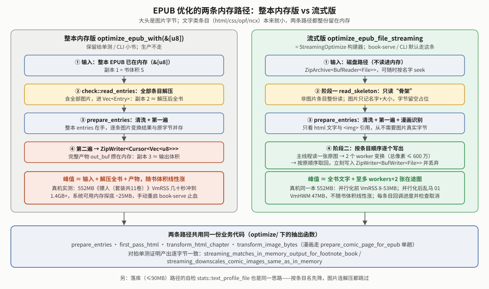
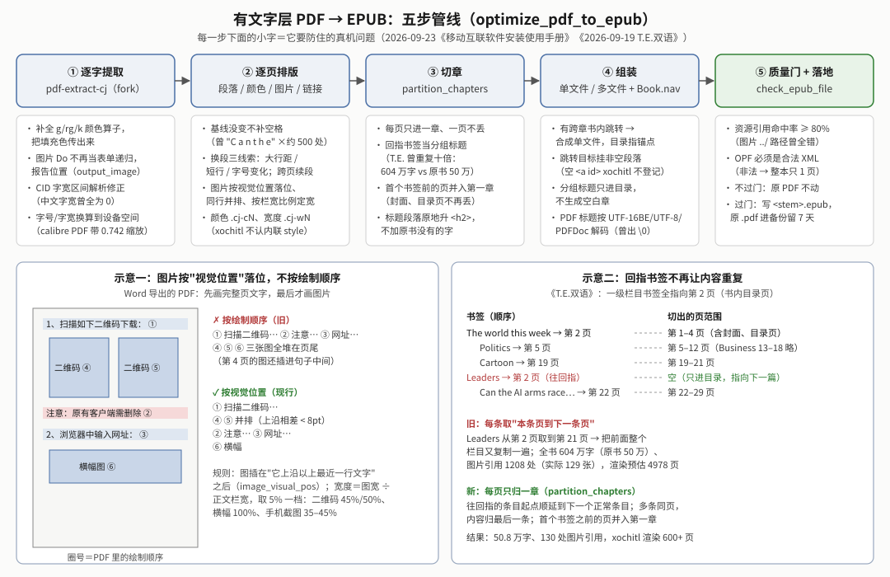
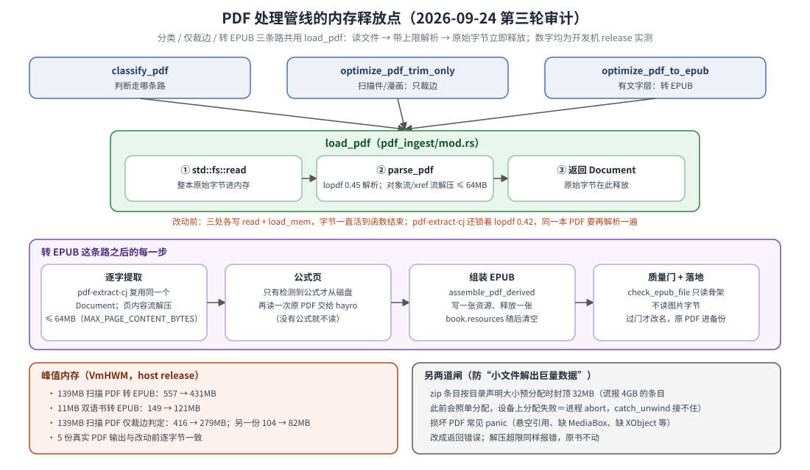
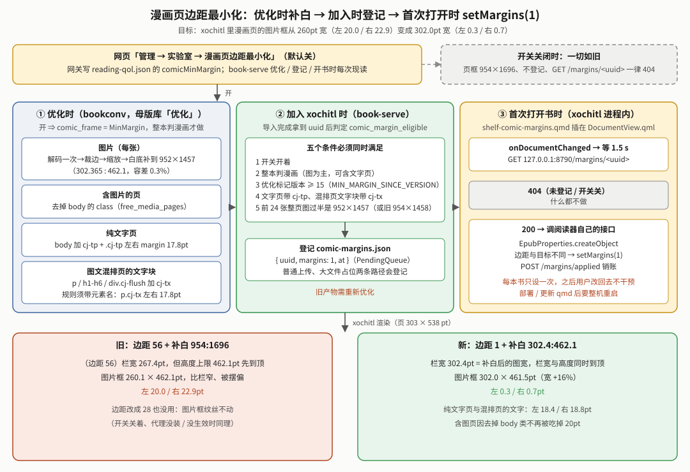

# bookconv 电子书优化白皮书

> **读者与用途**：要改 EPUB/PDF 优化逻辑、排查“某本书在 xochitl 里排版/目录/封面不对”的人。**本文管"代码怎么做到"**：函数、常量、版本号、实现层的坑；**规则**（书该被改成什么样）看规范白皮书，**数据流与服务分工**看传书线架构，**真机历史与跨服务的坑**看书架白皮书。xochitl = reMarkable 官方阅读器 / UI 进程（闭源）；`bookconv` 是 shelf 的**优化引擎**，被 `book-serve` 进程内调用的 Rust 库，**不是独立服务**。系统位置见 [`../../docs/OVERVIEW.md`](../../docs/OVERVIEW.md) 与 [`传书EPUB线架构.md`](传书EPUB线架构.md)；上层用法（母版库「优化」按钮等）见 `reMarkable书架白皮书.md`；KOReader 只从母版库纯复制落书，不再单独优化。本文记"引擎怎么实现、踩过什么坑"；**规则本身**（xochitl 十条实测渲染规则、两条优化线的现行规则、为什么这么定）以 [`EPUB优化规范白皮书.md`](EPUB优化规范白皮书.md) 为准，本文涉及规则处只写一句并指过去。
>
> **状态提示**
> 1. **看现状先看 §00b**；当前 `OPTIMIZE_VERSION = "15"`。2026-09-23：PDF 转 EPUB 整体重写并真机验证（§18）、质量门接进 `book-serve`（§08）、清洗/脚注几处修复（§01/§02/§04）、PDF 线灰字也提成黑字（§18）。2026-09-24：`pdf-extract-cj` 嵌套表单限深 16 并防环（§18）；PDF 转 EPUB 的落地改由 book-serve 把原 PDF 挪进 `.pdf-originals/` 备份 7 天、同名 EPUB 已在则不转（book-serve 侧，见传书线架构 §2.5）。**2026-09-24 第三轮审计**（只在 host 验证，未上真机）：`pdf-extract-cj` 升到与 bookconv 同一个 lopdf 0.45、PDF 只解析一遍，原始字节解析完即释放、各类流解压限 64MB（§18「内存释放点与解压上限」）；清洗/注释收集/占位文档去掉热点（§14 末）；zip 预分配封顶、`percent_decode("%+1")`、无扩展名图片落名三个 bug（§12）。
> 2. §16 / §19 里“漫画优化转 PDF”的**决策**已被 2026-09-20 取代（换回 EPUB），原位有横幅；EPUB 漫画留白的最新方案见 §20。
> 3. **2026-09-18 起电脑端 `shelf` 命令行整体被砍**（`shelf push` / `wash_epub.sh` / `comic.py` / `check_output.py` / Calibre 管线，源码留档 `oldbak/`，**无网页等价物**）。正文凡提到这些都是**已砍旧能力**，作历史依据；“host 单测”指开发机/CI 跑测试时仍准确。`bin/epub_optimize.rs` 没删，只是无自动化调用方。见书架白皮书附录 B。

### 3 分钟导读

**bookconv 是什么**：`shelf/crates/bookconv`，输入一本 EPUB（或 PDF），输出一本在 Paper Pro Move 的 xochitl 里排版/目录/封面/脚注都不出毛病的新书，原书内容全保留（“只改壳不改肉”）。调用方：`book-serve` 的「优化」按钮、网文抓取入库；另有开发期小工具（§11）。

**一本 EPUB 的 7 步**（细节见 §01）：读全部条目并保证封面声明 → wash 清洗（可选，缺省开：剥伪 DRM/字体锁/背景图、外链排版 css、缺目录才建、修 NCX；§02、§06）→ 重排 + 漫画识别（图 ≥20 张且每图文字 <40 字判漫画；§05）→ 第一遍（剥字体锁、找出被引用的脚注块移出章节；§03、§04）→ 第二遍（脚注重排、灰字变黑、远程图内联、id 去重）→ 图片缩进 Move 屏尺寸框（漫画走“裁边+缩放+补白”单趟；§05、§20）→ 打包并写幂等标记 `META-INF/com.cangjie.optimized` = 版本号（§10）。

| 想知道 | 去 |
|---|---|
| xochitl 为什么这样渲染 / 我的 CSS 为什么不生效 | **§09**（规则表） |
| 某个 `OPTIMIZE_VERSION` 改了什么、旧书要不要重优化 | §10 |
| 脚注呈现 / 为什么不能“注释放页底” | §04 |
| 目录没有 / 原生目录入口不出现 | §06 |
| 图片尺寸、内存上限、裁边比例 / 流式内存架构 | §05 / §14 |
| 漫画：超限拆卷 / 转 PDF 来龙去脉 / 边距与补白 | §15 / §16、§19 / §20 |
| PDF 入库 / 命令行工具 / 还没真机验证的项 | §18 / §11 / §13 |

**三条必记事实**：① 生产环境只有 `book-serve` 一个调用方；② 杂格式转换代码（AZW3/MOBI/FB2/CBZ）**仍在但没有调用方**（§07）；③ 质量门 `check` 在 `book-serve` 每次优化产物替换原书前都跑，不过门原书不动（§08）。

## 00｜定位与职责

书架线的**内容层**，2026-09-03 从旧 `weread-device` 抽成独立 crate（旧仓库分块里属"块③ 阅读"）。四块职责：
1. **格式转换 `convert`**：AZW3/MOBI/FB2 → EPUB、CBZ → PDF，纯 Rust clean-room。⚠ 代码保留，shelf 不接入（§07）。
2. **EPUB 优化器 `optimize`**：就地改每个 (x)html（解字体锁 / 脚注 / 远程图 / 图片降采样 / 对比度 / 双 id），其余文件结构不动、重打包。
3. **清洗层 `wash`**：对标已砍的 Calibre `wash_epub.sh` 规则（伪 DRM / CSS 锁 / 边距段距 / 自动目录 / 空页 / 外链排版 css），由优化器可选前置调用。
4. **质量门 `check`**：只读体检（真 DRM / 目录命中率 / 双 id / 资源引用命中率 / OPF 合法 XML），硬失败拦下替换（§08）。

**一份代码两处共用**：`book-serve` 母版库「优化」（`Staging::optimize`，生产走流式入口 `optimize_epub_file_streaming`）与开发期 `epub-optimize` 都调 `optimize` 模块，小书/测试走 `optimize_epub_with`，业务函数共用、逐字节对拍一致（书架白皮书 §03i / §03q）。koreader-serve 自 §03s 起不再优化（落库＝纯复制）。

**零 C 依赖**：EPUB 组装全条目 STORED（免 zlib）；漫画 PDF 手搓（`pdfwrite`：JPEG 直嵌 `/DCTDecode`、PNG 走 `png` + miniz_oxide）；MOBI/KF8 不依赖 `mobi` crate（真机词典样本上 `extra_data_flags` 尾字节判错、解压乱码，见 `palm.rs`）。

## 00b｜现状总览（2026-09-24 按代码核对，读其余节前先看这里）

**模块地图**（`shelf/crates/bookconv/src/`；2026-09-20 起 `optimize`/`wash`/`htmlproc`/`pdf_ingest` 拆成目录，`pub` 项 glob re-export，旧路径不变）：

| 模块 | 职责 | 状态 |
|---|---|---|
| `optimize/{mod,html_pass,streaming,marker}.rs` | `optimize_epub_with`（内存版）/ `StreamingOptimize`（流式版）+ 幂等标记 | 现役（生产走流式） |
| `wash/{mod,css,typeset,toc,ncx_fix,cover,drm,empty_pages,dead_refs,opf}.rs` | `wash_entries`；另含 `ensure_cover_declared`、`drop_dead_refs` | 现役 |
| `htmlproc/{basic,contrast,footnote,footnote_cycles}.rs` | 脚注 / 字体锁 / 对比度 / id 去重等 HTML 原语 | 现役 |
| `imgopt.rs` | 降采样盒、`trim_margins` 裁边、`prepare_comic_page_for_epub` 漫画单趟、`header_dims` 只读头 | 现役 |
| `comic_detect.rs` / `comic_pad.rs` / `comic_split.rs` / `comic_pdf.rs` | 漫画判定 / 文字页与混排页留边（§20）/ 超限按卷拆分（§15）/ 漫画 PDF 生成，现仅服务超限 PDF 分卷（§16） | 现役 |
| `pdf_ingest/*` | 入库 PDF：有文字层转 EPUB / 无文字层仅裁边（§18） | 现役 |
| `../pdf-extract-cj`（独立 crate） | 上游 pdf-extract 0.12.1 的本地 fork（MIT）：逐字给坐标/字号/**填充色**、报告图片位置；bookconv 用 Cargo `package =` 改名接入，代码里仍写 `pdf_extract::`（§18） | 现役 |
| `naming.rs` / `placeholder.rs` / `imgpool.rs` / `netimg.rs` / `epubzip.rs` / `epub.rs` / `stats.rs` / `util.rs` | 书名规范化 `书名 - 02卷` / 大文件占位文档（§19 末）/ 图片并行+像素预算 / 远程图抓取 / zip 条目读写（09-24 起写条目统一走 `put_entry`，读条目预分配封顶 32MB）/ 最小 EPUB3 组装 / 正文统计 / 杂项 | 现役 |
| `direction.rs` | OPF spine `page-progression-direction` 读/写（`PageDirection`）；`OptimizeOpts.page_direction` 在优化第二遍改 OPF，`rewrite_direction_file` 给"已优化只差方向"的书只改 OPF、其余条目 `raw_copy_file` 原样拷贝（2026-09-25，规则见规范白皮书 §4.6）；`placeholder::epub_is_rtl` 改为调它 | 现役 |
| `article.rs` | 网文抓取成 EPUB（09-05 从 `reading/device-rs` 下沉），`book-serve::fetch_article` 调用 | 现役 |
| `check.rs` | 质量门（五条硬规则） | 现役：`book-serve` 优化流程 + `epub-optimize --check`（§08） |
| `convert/{palm,mobi,kf8,fb2,cbz,common}.rs` | 杂格式 → EPUB/PDF | **保留、无调用方**（§07） |
| `convert/pdfwrite.rs`、`convert::direct_content_type` | PDF 读写 / 自产 PDF 识别 / 扩展名判 EPUB·PDF | 现役 |
| `bin/` | `epub_optimize`、`cover_fix`、`cbz2pdf`、`comic_piece_extract` | 开发期小工具（§11） |

**当前版本** `OPTIMIZE_VERSION = "15"`（`optimize/mod.rs`，§10）。**调用方**：`book-serve::Staging::optimize`（流式）、`fetch_article`（组装时过一遍默认 `optimize_epub` = 不清洗，标记 `15-core`；勾“同步优化”再跑完整优化）、开发期 `epub-optimize`。**离线门槛**：`cargo test -p bookconv` 零警告（2026-09-24 第三轮审计后实跑：299 个通过、1 个忽略；整个 shelf workspace 409 个通过 = bookconv 299 + book-serve 85 + koreader-serve 21 + pdf-extract-cj 4）。

**未闭环**：无阻塞项；§13 都是“打磨精度”级。**一条已查清、bookconv 无杠杆的边界**（09-10，§12/§09⑭）：图片密集内容（网文抓取）分页时图片块页尾放不下就整体推下页、不回填，视觉上大片留白，与样式表无关。有人问“能不能优化掉图片留白”先看这条。

## 01｜架构：`optimize_epub_with` 两遍 + wash 前置

> **大白话**：先把整本书的结构看一遍（封面、目录、哪些注释被引用、是不是漫画），再一个文件一个文件地改写、打包。

入口 `optimize_epub_with(epub, &OptimizeOpts{wash, footnote, comic_frame})`，分**阶段一**（`prepare_entries`，看整本书结构）和**阶段二**（逐条目变换 + 写出）：
- **读全条目**（`epubzip::read_entries`；读失败整体报错，绝不静默跳过产出残缺 EPUB）。哪些条目算正文章节由 `epubzip::is_html_entry` 判：先看扩展名，**没有扩展名的再嗅探内容**（`<?xml`/`<html` 开头）——真实书里有合法的无扩展名章节，此前纯按扩展名判断，《甲午》29 章里 4 章整章没被清洗（2026-09-23）。
- **封面声明**（`ensure_cover_declared`）：保证 OPF 有真正指向图片的封面，**必须在 wash 之前**（wash 会把只含 SVG 封面的 titlepage 当空页删掉）。
- **wash 前置**（`opts.wash=Some`）：作用于条目表 `Vec<Entry>`，见 §02。
- **重排 + 漫画识别**：`mimetype` 首个 STORED，其余原序，旧优化标记剔除；`comic_detect::is_comic` 判一次（图 ≥20 且每图文字 <40 字）。
- **第一遍**（`first_pass_html`）：每个 (x)html → `normalize_self_hrefs`（Calibre 写法 `part0004.html#x` 在本文件内 → 归一成 `#x`，否则被误当跨文件脚注）→ `strip_font_locks`；扫全书得**被引用**的尾注 frag 集，把被引用的注释块从各章移除、建全书 `aside_index`。（“判目录页”一步 2026-09-18 已删，§03。）漫画 + `MinMargin` 页框时再调 `comic_pad` 三个函数给文字页/混排页留边（§20）。
- **第二遍**（`transform_html_chapter`）：`break_footnote_cycles` → `fix_duokan_markers` → 封面 SVG 修复 → `preserve_relink_footnotes`（按 `FootnoteMode`）→ `boost_text_contrast` → `inline_remote_images` → `dedup_ids_in_chapter`（跨章 id 去重）。独立 `.css` 走 `boost_contrast_css`。**顺序不能换**：要用第一遍扫全书才有的 `aside_index`。
- **图片条目**（`transform_image_bytes`）：文字书 `downscale_for_epub`；漫画 `prepare_comic_page_for_epub`（§05）。
- **幂等标记**：产物写 `META-INF/com.cangjie.optimized` = `OPTIMIZE_VERSION`（含 wash）或 `<版本>-core`（`wash=None`）；`optimized_version()` 判是否当前版本（母版库据此标 full/core/old）；旧版本重传**重优化升级**（`double_optimize_*` 测试坐实不翻倍脚注）。
- **两条并行实现路径**（09-19 起）：`optimize_epub_with(&[u8])`（整本内存，测试/CLI 小书）与 `StreamingOptimize`（路径进路径出，真机大书，book-serve/CLI 默认，峰值内存不随书体积涨）共用 `prepare_entries` / `first_pass_html` / `transform_html_chapter` / `transform_image_bytes`，见 §14。

`FootnoteMode`：`Anchor`（缺省，注释移章末 + 同章锚点 + 原生「返回」浮标；2026-09-17 起母版库「优化」也统一用它）· `Inline`（就地内联 `〔…〕`，只剩单测在用）。曾短暂存在的第三种 `ParagraphEnd` 已撤回删除，见 §04。

## 02｜清洗层 wash（`wash_entries`，对标 Calibre）

> **大白话**：去掉书里"锁死字体字号"的样式、清掉空白页和坏引用、补外链排版表和目录——让 xochitl 的字号/字体设置对这本书真正生效。现行规则全表见规范白皮书 §4。

按序作用于条目表（`WashOpts{keep_para_spacing, auto_toc, filter_props, lang}`）：

| # | 步骤 | 做什么 |
|---|---|---|
| 1 | 伪 DRM 剥离 `strip_pseudo_drm` | `encryption.xml` 只加密样式/字体/脚本（字体混淆合法）→ 丢这些文件 + 删 OPF manifest 项；**加密了正文/图片 = 真 DRM → 报错停下**（不产残书） |
| 2 | 空页清理 `remove_empty_pages` | 无文字无图的页（Calibre MOBI 的 `mbppagebreak` 独占页）从 spine/manifest/zip 删，目录里指向它的条目改指下一篇 |
| 3 | 死引用清理 `drop_dead_refs` | 去 `src` 指向书内不存在文件的 ``（alt 有实际内容的留着）与字体全缺的 `@font-face`；外链/`data:`/纯锚点不算无效 |
| 4 | 主语言探测 `detect_dominant_script` | Han 字数 ≥ 拉丁字母数 = 中文（扫够 2 万字早停）→ `LangMode::{Cjk,Latin}`（`Auto` 在此解析） |
| 5 | CSS 锁剥离 `filter_css` | 独立 `.css` / `<style>` / `style=` 三处剥 `DEFAULT_FILTER_PROPS` = `font-family, font-size, font, background-image, background`；`@font-face src:url` 豁免；`@media{}` 从内向外匹配最内层规则；书 css 里非零 `text-indent` 统一改成本书缩进；输出声明尾带分号（§09④）；**注释容器类**（选择器含 `footnote`/`fnote`）额外去掉 `font-weight`、补 `font-size:0.9em`（2026-09-23《甲午》：原书模板让全书注释加粗，用户拍板只剥注释容器、不碰正文；`cangjie-wash.css` 另补 `.footnotes`/`.cj-fnote` 两条兜底） |
| 6 | 边距/段距 `wash_html` | `style=` 按标签名定策略（body/html 全删边距、p/div 上下归零左右保留，不伤 blockquote/列表缩进）。中文书 `cjk_paragraphize`（无 `
` 只有 ` ` 分行的按 ` ` 切段 + 剥段首全角空格）；拉丁书 `flush_first_para_after_heading`（标题/章首/场景切换后首段顶格） |
| 7 | 外链排版 css | `add_wash_css_entry` 写外链 `cangjie-wash.css`（`p{text-indent:2em;margin-top:0;…;}` + `.cj-flush{…}` + `figure`/`figcaption` 边距归零）+ 每章 `<link>` + manifest item（§09④ 治本） |
| 8 | NCX 与目录 | `fix_ncx_manifest_id`（v14）→ `restructure_existing_toc_parts`（“第X部”分两级）→ `auto_toc`（缺目录才建，§06）→ `fix_ncx_uid`（v12）→ `strip_ncx_doctype`（v13） |
| 9 | 单标签双 id 折叠 `collapse_dup_id_attrs` | 在 `wash_html` 内做（§09⑥） |

**2026-09-17 收窄**：`DEFAULT_FILTER_PROPS` 不再剥 `color`/`background-color`/`text-align`（EPUB 线原则：保留原书颜色/加粗，只解锁字号；这三项此前只是照抄 Calibre `--filter-css`，没验证过必须剥）。⚠ 彩色底纹书低对比场景可能更难读（`boost_text_contrast()` 不处理背景色），待专挑一本真机测。`background`/`background-image` 进 `filter_props` 是 v8 真机《飘》修（§09②）。`keep_para_spacing` 给诗集/剧本（靠空行分节）；book-serve 现只用 `WashOpts::default()`（2026-09-19 已砍优化档位）。

## 03｜优化器核心遍（always-on，不依赖 wash）

> **大白话**：不管开不开清洗都要做的几件事：解字体锁、搬脚注、修封面、离线图片内联、图片缩到屏幕尺寸。

- **字体解锁** `strip_font_locks`：剥内联/`<style>`/`.css` 的字体锁（第三方书硬写 `font-family`，设备字体设置改不动；与 wash 的 filter_css 互补，wash 关时仍剥）。
- **脚注** `preserve_relink_footnotes` / `inline_footnotes`（§04）。
- **封面页修复**：`fix_cover_aspect`（`preserveAspectRatio="none"` 改 `xMidYMid meet`）+ `svg_cover_to_img`（封面 SVG 换 ``，§09⑬）。
- **远程图内联** `inline_remote_images`：微读等下载书内嵌 `res.weread.qq.com` 远程图，设备离线加载不到 → 破图占位 = **大放大镜**。抓下降采样内联进 zip（与本章同目录）；抓不到 → **删该 ``**（放大镜必消）。reMarkable 按 src 直渲、**不查 manifest**，故本地图不进 manifest 也直渲（真机验证，§09⑮）。
- **图片降采样** `imgopt`（§05） · **e-ink 提对比** `boost_text_contrast`（灰字→纯黑、细字重→400） · **双 id 去重** `dedup_ids_in_chapter`。
- ~~`remove_toc_from_spine`~~（**09-18 已删，v11**）：早期把“链到 ≥10 个不同 html 文件”的页面判为冗余书内目录页、从 spine 摘掉；《疯探》证明这类页面就是正文本身，违背 EPUB 线原则①“保留目录页”，且这段最早期骨架代码从未被单测覆盖。整段删除、不留特判；旧书需 `force:true` 重优化拿回。见书架白皮书 §03ay。

## 04｜脚注：四形态 + 两引擎 + FootnoteMode

> **大白话**：各家电子书的注释写法五花八门，这里统一改成 xochitl 唯一会跳的形态——正文里一个 `[N]`，点了跳到本章末尾的注释，左下角"返回"回原处。

**四种脚注形态**（真机《13·67》《人骨拼图》混合）：① 同章 `noteref`↔`aside`；② 跨文件 `<a href="notes.xhtml#nX">` + `
` 尾注；③ duokan 图片脚注标记；④ 双向互指对（reMarkable 索引器遇互指**整对丢弃**，`break_footnote_cycles` 拆环）。

**2026-09-23 三处修复**（《甲午》真机）：① 注释块统一包成 `
`（`footnote_block`），不再用 `
`——源注释本身含 `
` 时会产出非法的 `

` 嵌套；② `fix_duokan_markers` 认 `duokan-footnote` 类时 `` 和外层 `<a>` 上都查（真书把类写在 `<a>` 上，此前漏判，图标按原尺寸巨大显示）；③ `Anchor` 模式下 `` 包着的图标 marker 直接换成 `[N]` 文字。

**抽取管线**：第一遍 `referenced_note_frags` 扫出被引用的注释 id → `collect_footnote_notes` 把被引用的注释块（aside/p/li/div，须自带 footnote/note 语义；嵌套 div 跳过）从各章移除、建 `aside_index` → 第二遍 `preserve_relink_footnotes(html, index, mode)` 搬进引用它的章。未被引用的块原样留原处（零丢失）。

| 模式 | marker | 注释放哪 | 要点 |
|---|---|---|---|
| `Anchor`（缺省） | 保留原样，旁边加同章朴素文字锚点 `<a href="#nX">[N]</a>`（图标 marker 包在 `` 里时，图标去链、`[N]` 独立可点） | 移到 `</body>` **之内**的章末 `

` | 只有同章朴素文字锚点可点，`` 不可点；注释区在 `</body>` 之外则不建锚点、marker 死链；注释里**不加回链**（互指被整对丢弃），返回靠原生「返回」浮标 |
| `Inline` | **丢弃**原 marker | 就地 `〔纯文本〕` 常显、不跳转 | xochitl **无弹窗脚注**（穷尽真机判死，§09⑤）；必须丢 marker（图标 `` 按固有尺寸巨大重复，§09①）并去标签取纯文本（块级标签塞进 `
` 致整章白屏，§09⑥）；塞进句子中间会打断阅读，目前无入口（仅单测） |

**已删除的尝试：`ParagraphEnd`（09-17，上线又下线，同日）**：注释移到含引用的整段之后，功能按设计跑通、测试都过；但用户看真书反馈“注释并未在当前页最下面，而是在段末”。**根因不是实现能修**：EPUB 是流式重排文本，“这段落在第几页”是阅读器翻页时的运行时结果，做书阶段（优化器唯一能碰的阶段）没法把“这条注释属于第 N 页”写进源文件；真正的页底注释只有固定版式（PDF 线）能表达。处置：改回 Anchor，`ParagraphEnd` 相关函数与测试整个删除，不留死代码。

## 05｜图片：按 Move 屏两个降采样盒

> **大白话**：书里常塞着几千像素的高清图，设备屏幕才 954×1696。按屏幕尺寸缩一次既省空间也省内存；漫画只裁白边、不压画质。

Move 屏 = **954×1696 px、7.3″、264 PPI、Gallery 3 彩色墨水屏**。书常带 2000–4000px 高清图。常量 `MAX_EDGE=1696` / `MAX_SHORT_EDGE=954`（`imgopt.rs:16-17`）、JPEG 质量 85（漫画 95）、Lanczos3。**两个降采样函数**（v8 真机《飘》拆分）：

| 函数 | 框 | 用在哪 |
|---|---|---|
| `downscale_for_epub`（EPUB 内嵌图） | **竖向框** 954×1696，宽绝不超 954 | 文字书 EPUB 图；防行内横幅图（`class="logo"` 1696×630）按固有宽**溢出竖屏**（§09①） |
| `downscale_for_device`（整页图） | **朝向框**：横图 1696×954 / 竖图 954×1696 | CBZ 漫画整页（`convert::cbz`）与远程图抓取（`netimg`） |

真机探针：xochitl 块级 `` 缩到正文列宽、行内 `` 按**固有像素**渲染、**都不认 CSS em**（公式图偏小的根因）。彩图饱和度阈值 `COLOR_KEEP_CHROMA=0.06` 判是否保色（墨水屏波形按内容分档：彩重/灰中/1bit 轻）。

**取尺寸只读头**（09-05）：`header_dims` 只解 JPEG/PNG 头，达标页零解码零重编码（2473 页漫画 2m36s → 1m49s，产物字节不变）。**1-bit 抖动的体积真相**：Floyd–Steinberg 位图对 Flate 是高熵噪点，927×1327 一页压后仍 ~90KB，只比 120KB JPEG 小 1/4；真省体积要换 CCITT G4 / JBIG2（待办）。`dither_bilevel` 现只被 `cbz2pdf --mono` 用。

### 漫画图片：不许压画质，只裁边/适配屏幕

EPUB 线原则④（09-17）：`comic_detect::is_comic`（`MIN_IMAGES=20`、`TEXT_PER_IMAGE=40.0`）在 `prepare_entries` 判一次。命中后图片走 `imgopt::prepare_comic_page_for_epub`（09-20 取代早期 `trim_margins` → `downscale_for_epub_comic` → `pad_to_device_aspect` 三道串联：各解码编码一遍、三代 JPEG 有损、灰度被转 RGB；见 §19）：

1. **解码一次** → 2. **裁边** `trim_margins`（逐行/列 RGB 通道极差 ≤8 才算纯色；单边最多裁 35%）→ 3. **一次缩放**进 EPUB 页框（缩小，或 JPEG 小图按 §19 A/B 预放大 ≤3 倍，q85；SIMD `fast_image_resize`）→ 4. **白底补到页框长宽比**（`Screen` 补到 954:1696、容差 2%；`MinMargin` 补到 302.4:462.1、画布 954×1458、容差 0.3%，§20）→ 5. **编码一次**（灰度保持单分量，q95）。小于设备短边 1/3 的装饰小图只裁边不缩放/补白；无事可做返回 `None`（原字节零损失）。

### 解码像素上限 `MAX_DECODE_PIXELS`：一次“估算翻车、实测重定”的教训（2026-09-19）

**症状**：投递《乱马1/2》第 9~16 卷时，一页超高分辨率扫描页解成未压缩 RGB8，把 `book-serve` 的 `VmHWM` 顶到 271MB；`trim_margins`/`downscale_into_q`/`dither_bilevel` 解码前只用 `header_dims` 判断，没设上限。

**第一版翻车**：按“3 字节/像素”理论估算定 `MAX_DECODE_PIXELS = 25_000_000`（约 5000×5000）；真机又撞《火影忍者》第17~21卷，`VmHWM` 262MB，几乎没修。**根因**：`image` 库解码 + `to_rgb8()` + resize 中间缓冲多份同时存活，真实开销约 **9–16MB/百万像素**，是 naive 估算的 3–5 倍。本地 release 复刻真实调用链实测：

| 像素数 | 400 万 | 870 万（A4 300dpi） | 1600 万 | 2500 万 |
|---|---|---|---|---|
| `VmHWM` | 62MB | 97–109MB | 164MB | 230–236MB |

**最终**：`MAX_DECODE_PIXELS = 9_000_000`（约 3000×3000，`imgopt.rs:35`），三处入口统一 `within_decode_budget(w,h)` guard，超限放弃处理、原样保留字节（调用方本就是“`None`＝原样保留”）。真机复现：25 页测试漫画一页故意 4000×4000，`VmHWM` 全程个位数 MB，超限页原封不动；回归测试 `imgopt::tests::oversized_image_skipped_by_all_decode_entries`。**教训**：内存阈值别拍脑袋按字节乘法定，定阈值前先本地/真机实测。

### 裁边比例 15% → 35%（2026-09-19）

用户反馈“没把留白裁完”。抽真机《镖人》11 卷合集 43 张页实测：多张版权页（CIP 页）单边留白 22%–29%，旧 `TRIM_MAX_FRACTION=0.15` 在 15% 停手。改 **0.35**（`imgopt.rs:247`，盖住实测最大 28.6%；两边合计至多裁 70%，仍留 30%，安全阀有效）。真机复验：同一版权页产物 720×1643，与离线模拟**逐像素尺寸一致**，文字完整。

### 拆分后目录丢失（同日，根因在 `comic_split`）

**症状**：大 EPUB 拆分后每份 `nav.xhtml` 一条目录都没有。**根因**：`comic_split::build_piece`（超限漫画按卷拆分，§15）把每页 `Chapter.title` 拍成空串，而 `epub::nav_body` 只收非空标题章。**修法**：范围内若原书 NCX 有更深层节点就接过来当章节标题；无论有无，第一页永远钉上自己的标题，保证至少一条可点目录项。真机复验（《镖人》785MB 产物切 12 份）：卷名 + “第一章 游侠”等子目录都在；`VmHWM` 峰值 482MB、0 次重启。既有行为（非回归）：NCX 顶层纯目录节点“总目录”范围内无图，`build_piece` 拒绝组包，结果标“1 未投：总目录”。

## 06｜自动目录（`auto_toc`，缺目录才建）

> **大白话**：没有目录的书自动补一个（按标题，没标题按文件，纯图片书按每 20 页）；目录入口不出现的书，多半是 NCX 写法踩了 xochitl 的硬编码。

`AutoToc::IfMissing`（缺省）仅在无 nav/ncx 或零条目时生成。`heading_re` 从 h1/h2 **扩到 h1–h6**（v7）；`dense_ranks` + level-stack 生成**多级嵌套** navPoint/`<li>`（`d = ranks[i].min(depth+1)` 钳制不跳级）。质量门 `check` 按目录锚点命中率告警（丢失则 xochitl 退化到文件级跳转）。

**三级兜底**：h1–h6 标题（`split_numbered_titles` 后处理）→ 无标题时 `fallback_spine_toc`（按 spine 文件逐条，取正文首段截 24 字，纯图片页“正文 N”；多数文件无文本则整个不生成，避免给漫画灌无信息量条目）→ 仍空（纯图片书）时 `page_chunk_toc`（每 20 页一条“第 N–M 页”，09-20 用户要求所有书都要有目录，乱马源书 NCX 为空）。

**目录相关修复一览**（`wash` 里，症状 → 根因 → 修法，各升一个 `OPTIMIZE_VERSION`，§10）：

| 版本 | 症状（真书） | 根因 | 修法 |
|---|---|---|---|
| —（09-17） | 标题“第一章 1”想拆两级 | 书把“标题+编号”写在一条里 | `split_numbered_title`：拆成父级标题 + 缩进子级编号，同指一个锚点；编号 >99 判为印刷页码残留（“第一章 237”）不拆 |
| —（09-19） | 《雪人》自带 `toc.ncx` 扁平（“第一部　01　雪人”，分部标题只在每部第一条出现） | 排版惯例把分部与章名塞同一条 | `restructure_existing_toc_parts`：“第X部/卷/篇/辑”前缀重建两级；无前缀的书不动；在 `auto_toc` 前跑，被 `AutoToc::Off` 一并关掉。**用户肉眼确认正常** |
| v12 | 《疯探》原生目录入口整个消失（对照《雪人》正常） | `toc.ncx` 的 `dtb:uid` 与 OPF `dc:identifier` 不一致（第三方生成器常见） | `fix_ncx_uid` 无条件修正；`build_ncx` 也接真实标识符 |
| v13 | v12 后入口仍不出现 | 唯一剩余结构差异是 `toc.ncx` 带外部 DTD 引用（daisy.org）；**只是推测** | `strip_ncx_doctype` 剥声明。⚠ 是否必需从未单独证实，v14 才是真根因 |
| **v14** | v12+v13 后仍不出现 | **反编译 xochitl（书架白皮书 §03bc）坐实**：定位 `toc.ncx` **硬编码死查 manifest 里 `id="ncx"` 字面量**，不走 `<spine toc>`（后备分支没救回《疯探》，原因未查清）；合规的 `<item id="toc"/>` + `<spine toc="toc">` 被当成没有 ncx，navMap 标题提取整体失败（书照常翻页） | `fix_ncx_manifest_id`：NCX manifest id 不是 `ncx` 就改（`<spine toc>` 同步）；`auto_toc` 自建 NCX 的 `id="cj-ncx"`（同坑）改 `ncx`。真机：`content.opf` 只改这一行，`.epubindex` 7188 字节（94 条标题全空）→ 15558 字节（全部提取） |

## 07｜格式转换 `convert`（纯 Rust，零 C）

> **现状（2026-09-18 起）：代码与单测保留，shelf 不接入。** 母版库只收 EPUB/PDF（`rmsvc_core::formats::BOOK_EXTS`，`rmsvc-core/src/formats.rs:15`），`book-serve` 入库门（`service_state.rs`）对其它扩展名回 `staging::reject_message()`。调用关系：
>
> | 部分 | 状态 |
> |---|---|
> | `palm` / `mobi` / `kf8` / `fb2` / `convert_file` / `is_convertible` / `is_ingestible` / `precheck` | 无调用方（仅自身单测；`kf8`/`fb2` 收尾调 `common::assemble_optimized`） |
> | `cbz::cbz_to_pdf` | 只剩开发期 `bin/cbz2pdf` |
> | `pdfwrite`（PDF 读写、`looks_like_own_bookconv_pdf`、页数/占位 PDF）、`direct_content_type` | **现役**：`book-serve` 落库/列表/门控、`placeholder`、`pdf_ingest`、`comic_pdf` |
> | `common::assemble_optimized`（组装 EPUB 再过 `optimize_epub` 默认档，标记 `15-core`） | **现役**：`article.rs` |
>
> 沿革：09-05 杂格式走电脑 Calibre、漫画只给 KOReader；09-17 Calibre 转换整段删、杂格式拒收；09-18 用户要求“入库只入 PDF 和 EPUB”，仅 KOReader 能读的 CBZ/HTML/RTF 也拒收——**策略收紧，不是技术能力判断**。⚠ `convert/mod.rs` 头注释“使用方只有 `reading/device-rs`”已过时。

设计（保留代码）：xochitl 只开 EPUB/PDF，**文本类 → EPUB、漫画类 → PDF**。
- **`palm`**：MOBI6 与 KF8/AZW3 共用的 PalmDB + PalmDOC + EXTH 底座；**`mobi`** 解压得整本 HTML → `epub::Book`；**`kf8`** clean-room（依 KF8/MobileRead wiki，**不抄 GPL 的 KindleUnpack**），HUFF/CDIC 压缩的 AZW3 明确拒绝；**`fb2`** quick-xml serde → `epub::{Book,Chapter,Resource}`；**`cbz`** 图片自然序排（`natural_cmp`）→ `downscale_for_device` → `pdfwrite` 手搓 PDF。EPUB 字节组装统一交 `epub.rs`（最小合规 EPUB3）。
- CBR：`unrar` 依赖 C++ + RARLAB 受限许可，撞零 C 与许可证铁律；原走 host `unar`/`7z`，host 已砍，现无此路。

## 08｜质量门 `check`（只读体检，替换原书前必过）

> **大白话**：优化出来的书在替换原书之前先"体检"，体检不过就不替换，原书保持原样。

只读、不改书。**硬失败**（`ok=false`）五条：① 真 DRM（`encryption.xml` 加密了非字体条目）；② 目录 href 命中率 <80%（`require_toc` 时无目录也升失败）；③ 单标签双 id（§09⑥）；④ 正文资源引用（`src`/`href` 指向的书内文件，跳过外链与 `data:`）命中率 <80%；⑤ OPF 不是合法 XML（`xml_problem`：先查 XML 1.0 不允许的字符，再用 quick-xml 查结构）。**告警不拦**：无 nav/ncx、目录锚点丢失、正文章节不是合法 XML。PDF 门（pymupdf）不移植。

**接线**：`book-serve` 在 `produce_then_replace` 的闭包里、写完临时文件之后改名之前调 `check::check_epub_file`（只读骨架，图片字节留空，不把整本读进内存），EPUB 优化与 PDF 转 EPUB 都过；不过门返回错误、原文件不动、临时文件清掉（单测 `optimize_rejects_and_leaves_original_untouched_when_quality_gate_fails`）。开发期 `epub-optimize --check` 走同一套规则。

**两条新规则的来历**（2026-09-23 真机）：④ PDF 转出的 EPUB 图片 `src` 多写一层 `../`，图片打包正确、标签也在，xochitl 却一张图都不显示，此前没有任何检查能发现；⑤《T.E.双语》PDF 标题 UTF-16BE 被当 UTF-8 解出 `\0` 写进 `dc:title`，整本只渲染 1 页。规则 ⑤ 上线前对设备上 56 本真实 EPUB 扫过，唯一不合法的就是那两份坏 T.E.。同日另加一层兜底：`util::xml_escape` 丢弃 XML 1.0 不允许的字符（全项目生成 XML 都走它）。

运行期"书是否渲染坏了"另由 `book-serve::render_check` 兜底（投原生后读 xochitl 写的 `pageCount` 与 `bookconv::stats` 期望页数比，低于 50% 告警）。

## 09｜★xochitl 渲染硬规则（真机坐实，做优化器必须绕开）

> **大白话**：xochitl 的 EPUB 渲染器闭源，很多行为跟常识和别的阅读器不一样。下表是每条"坑"对优化器代码的具体约束和当时的证据。

**规则本身的权威清单在规范白皮书 §3（十条）**；本表保留实现侧的约束与证据，编号 ①–⑧ 沿用旧编号（别处按编号引用），⑨ 起后补（§20 引用 ⑨）。CSS 引擎细则（④）的诊断方法与 60 个变体见书架白皮书 §03y。

| # | 规则 | 现象 | 对优化器的约束 | 证据 |
|---|---|---|---|---|
| ① | **行内 `` 按固有像素渲染、不认 CSS**（块级 img 才适配列宽） | 图标脚注 marker（``）内联 = 巨大且每页重复；行内横幅 1696×630 溢出竖屏 | `Inline` 丢 marker 只留纯文本；EPUB 图走竖向框 `downscale_for_epub`（宽 ≤954） | 真机《飘》（v8） |
| ② | **无视 `background-repeat:no-repeat`/`background-size`，`background-image` 平铺满页盖正文** | 《飘》分卷页 `body.fen{background:url() no-repeat}` 铺成多幅风景盖住“第一卷” | `filter_props` 含 `background`/`background-image`（`@font-face src:url` 豁免、章头 `` 不受影响） | 真机《飘》（v8） |
| ③ | **章头装饰 ``（每章 banner/logo）是要保留的正常内容** | 曾误当“同图跨 ≥5 章重复 → 删 img”，被用户照片（IMG_0447 判“对”）纠正、`git revert` | 跨章重复 `` ≠ 可删；不做图片去重 | 用户照片 |
| ④ | **CSS 引擎七条**（3.28.0.172，规则全表见 §03y）：只认外链 `.css`（无视 `<style>`/`style=`）；末尾无分号的声明被丢；`text-indent:0` 当“没设”；类选择器认且压元素规则、同类先出现者胜；`div{}` 不生效；`text-indent` 继承；不认 `!important` | 内联 `<style class="cj-wash">`（v6–v9）从未生效；`p{text-indent:2em}` 少分号整条失效 | 排版规则写**外链** `cangjie-wash.css` + 每章 `<link>` + manifest item；声明尾带 `;`；顶格 `text-indent:0.01em` + `
`（剥书的类与 style）；不用 `!important`；每条规则一个选择器 | 《飘》（v10）；`wash/typeset.rs::wash_css` |
| ⑤ | **无弹窗脚注**（穷尽实测，正文点击不通知可注入的 QML 层） | 脚注只能“跳转”或“内联” | `Inline` 常显是唯一“自动呈现”；缺省 `Anchor` 靠原生「返回」浮标 | 穷尽真机实测 |
| ⑥ | **单标签双 id → 整章空白**（严格 XML 解析吞整章） | 《消失的爱人》只渲出 7 页 | `collapse_dup_id_attrs`；质量门拦；`Inline` 注释必须去标签取纯文本 | 真机《消失的爱人》 |
| ⑦ | **无 PDF 重排**（固定版式） | PDF 不能改字号/换行 | 不碰 PDF 版式；有文字层的 PDF 转 EPUB 见 §18 | — |
| ⑧ | **左右留白是阅读器“页边距”设置本身**（`.content` 的 `margins`，界面三档 28/56/112，缺省 56，文字页与图片页共享）；**CSS 越界声明被钳制、外部改 `.content` 无效**（打开时用内存值写回） | 漫画左右留白 20.0/22.9pt 改不掉 | **唯一可行是 xochitl 进程内调 `EpubProperties.setMargins(任意值)`**——qmd 代理首次打开设 1 + 图片补白到 302.4:462.1（§20）。09-19 一度据此改产 PDF（§16），09-20 换回 EPUB | 外部改 `.content` 5 次仅 1 次成功（§20）；PDF 直传留白 0.00%（§16） |
| ⑨ | **图片框：宽撑满栏宽，`height` 相关声明一律不认；比栏窄时贴左**；垂直可用高度固定 462.1pt（页 303×538pt） | 五种候选 CSS（`width:100%;height:auto`、`max-*`、`vw`/`vh`、`display:table*`）逐像素对比，只有 `width` 生效 | 留白只能靠**图片像素本身**补白；容差要严（0.3%） | 09-19；§20 |
| ⑩ | **`<body class=…>`（Calibre 每页 `calibre2`）在页边距 1 下吃掉图片约 20pt**，改类里规则**无影响**，只有 body 不带类才 302.0 | 《镖人》图仅 281.7~291.8pt | `MinMargin` 含图页去 body class（`comic_pad::free_media_pages`） | §20 |
| ⑪ | **纯文字页水平留白：`padding-left/right` 无效；`margin` 用 pt/em 精确、`%` 怪异**；类选择器压不过书自带 `.calibreN`，须带元素名 `p.cj-tx` | 页边距 1 下版权页文字贴屏边 | `comic_pad` 给纯文字页 body 加 `cj-tp`、混排页文字块加 `cj-tx`，规则 `p.cj-tx{margin-left:17.8pt;…;}` | §20 |
| ⑫ | **定位 `toc.ncx` 硬编码死查 manifest `id="ncx"`**；`dtb:uid` 与 OPF 标识符不一致 → 原生目录入口消失 | 《疯探》合规 `id="toc"` 被当无 ncx | `fix_ncx_manifest_id` / `fix_ncx_uid` | 反编译 + `.epubindex` 7188→15558 字节（§06） |
| ⑬ | **封面页 SVG 被拉伸放大**，改 `preserveAspectRatio` 都不吃 | Calibre 封面页变形 | `svg_cover_to_img` 换 `` | 代码注释（无独立日期化证据） |
| ⑭ | **分页引擎：图片块页尾放不下就整体推下页，当前页剩余空间不回填** | 图多的网文（连续 3–4 张大图）大片留白 | 无杠杆（改 wash CSS 前后渲染像素级一致）；不要再排查 | §12，2026-09-10 真机 A/B |
| ⑮ | **远程 `` 离线 → 破图占位 = 大放大镜；按 src 直渲、不查 manifest** | 微读下载书满屏放大镜 | `inline_remote_images`：抓到内联、抓不到删 | 真机（v4） |
| ⑯ | **只有同一文件内的 `#锚点` 是书内跳转**，跨文件链接（带不带锚点、加不加 `./`）一律当外部网址 | 《T.E.双语》目录页 95 个跨章链接点了不跳 | PDF 转换有跨章跳转时合成单文件；目录（nav）支持文件内锚点、能精确定位到页 | 3 章测试书量预览 PDF 链接注释 + 读 `.epubindex`（2026-09-23，§18） |
| ⑰ | **跳转目标须挂在有内容的元素上**，空 `` 不进目标表（目录不受影响） | 预览 PDF 具名目标 0 个、用户点了不动 | 目标 id 挂页首非空段落 `
`；核对正文链接看预览 PDF catalog 的 `/Dests`，目录才看 `.epubindex` | 对照《甲午》331 个目标（2026-09-23，§18） |
| ⑱ | **OPF 不是合法 XML → 整本只渲染 1 页**，日志只见 `Asked for unknown item ""` | 《T.E.双语》标题里的 `\0` | 质量门规则 ⑤ + `xml_escape` 丢非法字符（§08） | 2026-09-23 真机 |

**④ 备注（旧结论已证伪）**：v10 注释“只吃裸元素选择器、类选择器让整表失效”是把“丢末尾无分号声明”**误读**了，已被 §03y 推翻。“每条规则一个选择器、不用逗号并列”作保守约束保留（`wash::tests` 守），逗号选择器是否同属该误读**未复核**。

**缩进死路（v9 试尽已撤回）**：段首 `&nbsp;`（宽随字体变、连续被折叠）、全角空格 U+3000 / em 空格 U+2003（被前置空白折叠吞掉）、`inline-block` 占位（无视）。唯外链 css `text-indent`（em，字体无关、精确 2 字）可行。

**方法论**：**看不到屏幕别猜渲染**。① 造单变量诊断 EPUB → 投原生 → 读 xochitl 写的 `<uuid>.pdf` 渲染缓存，PyMuPDF 量列宽/图尺寸/首行偏移（`page.get_image_info()[0]['bbox']` 比量非白像素准），不需肉眼；② 让用户拍照（HEIC 用 `heif-convert`；e-ink 残影常测不准，不如让用户文字答）；③ **有真机“有效”活样本（如《飘》自带缩进）时先解剖它 ＞ 凭空造七版诊断**；诊断书用 `optimize=off` 投递保原始标记。

## 10｜版本演进（`OPTIMIZE_VERSION`，bump 后旧书重传升级）

> **大白话**：优化后的书里埋一个版本号；改了优化行为就升版本号，网页据此把旧产物标成"旧版优化"、可以重新优化。PDF 转出的 EPUB 不走这套阶梯。

当前 `OPTIMIZE_VERSION = "15"`（`optimize/mod.rs`；v14 之后只有 v15，没有 v16）。

| v | 改了什么 |
|---|---|
| v2 | duokan 图片脚注标记修复 `fix_duokan_markers` |
| v3 | 按 Move 屏优化：图片降采样 1696 长边 + e-ink 提对比 |
| v4 | 远程图内联（抓取降采样内联 / 抓不到删） |
| v5 | Calibre 洗书形态：`normalize_self_hrefs` + 真 img 版 duokan 换上标保 id + 图短边 ≤954 |
| v6 | 清洗层 `wash` 可选前置（伪 DRM / CSS 锁 / 边距段距 / 空页 / 自动目录 / 双 id） |
| v7 | 中英文各按习惯排版（`LangMode`）+ 自动目录 h1/h2 扩到 h1–h6 多级嵌套 |
| v8 | 真机《飘》三修：内联脚注丢图标 marker（§09①）+ EPUB 图竖向框 + 剥 CSS 背景图（§09②） |
| v9 | 〔已撤回〕段首 nbsp 首行缩进（§09 缩进死路） |
| **v10** | **首行缩进根治：排版规则改外链 `cangjie-wash.css`**（§09④）。撤回 nbsp |
| **v11** | 删 `remove_toc_from_spine`——违背原则①“保留目录页”（§03，真书《疯探》） |
| **v12** | `fix_ncx_uid`：`dtb:uid` 同步 OPF `dc:identifier`；`build_ncx` 也接真实标识符（§06） |
| **v13** | `strip_ncx_doctype` 剥外部 DTD 引用；**推测性修复**，真根因是 v14（§06） |
| **v14** | `fix_ncx_manifest_id`：xochitl 硬编码死查 manifest `id="ncx"`；`auto_toc` 自建 NCX 的 `cj-ncx` 同源 bug 一并改（§06） |
| **v15** | **EPUB 漫画补白比例改成 xochitl 图片框比例**（`imgopt::EPUB_FRAME_ASPECT` = 302.365:462.1，简称 303:462.1；画布 954×`EPUB_COMIC_PAGE_H`=1458；容差 0.3%），配合阅读器页边距 1（book-serve + `shelf-comic-margins.qmd` 首次打开时设置）。真机同图 A/B：图宽 260→303pt（端到端 302.0），左右留白 20.0/22.9pt → ≈0.3/0.7pt（§20）。旧漫画需**从原始文件**重优化，别二次优化（多一代 JPEG 有损） |

**v15 起几个易误解点**：
1. **分两步演进**：285.2:462.2（画布 954×1546）→ 303:462.1（954×1455、页边距 0）→ 最终 302.4:462.1（954×1458、页边距 1；用户认为 0 贴边不合适）。`optimize/mod.rs` 头注释里“1455”是中间版本，代码常量已是 1458。
2. **新页框是“实验室”开关的可选项**：`OptimizeOpts.comic_frame` 缺省 `Screen`（954:1696）；仅网页「实验室→漫画页边距最小化」（`reading-qol.json` 的 `comicMinMargin`，默认关）开启才用 `MinMargin`。同一个“15”标记下的漫画可能是任一种页框——book-serve 靠读前 24 张整页图头部尺寸（`is_min_margin_framed_file`）判断，不看版本号。
3. **v15 之后的漫画改动没升版本**（文字页/混排页留边 cj-tp/cj-tx、含图页去 body class，§20）：升版会让整库变“旧版”、让已有 v15 纯图漫画失去登记页边距的资格；代价是“文字页没留边的旧产物”靠 `comic_margin_eligible` 单独判定、需从原始文件重优化。

4. **按书阅读方向（2026-09-25）也没升版本**：`OptimizeOpts.page_direction` 缺省 `None` 时产物逐字节不变（`page_direction_touches_only_opf_spine` 断言指定方向时也只有 OPF 不同）；方向写没写进书里，book-serve 直接读 OPF 判断（`directionStale`），不看版本号。规则与取舍见规范白皮书 §4.6、§8 T4。

**幂等门修**：`is_optimized` 曾只看标记存在不看版本 → 旧版本重传被跳过；改按 `optimized_version()` 与 `OPTIMIZE_VERSION` 比对（已内联在 `book-serve::staging` 判 full/core/old 处；09-06 删了无调用方的薄封装 `optimize::is_current_version`）。

## 11｜设备端与开发期小工具同源 + CLI（原“host / 端一致”）

> **2026-09-20 整理**：电脑端 `shelf` 命令行 + Calibre 已于 09-18 砍除，“host / 端一致”不再需维护——现只有设备 `book-serve` 与开发期 `epub-optimize` 两个调用方，共用同一份 `optimize` 代码。⚠ 已没有脚本/自动化调用 `epub-optimize`。

开发期小工具（`shelf/crates/bookconv/src/bin/`，无自动化调用方）：`epub-optimize`（同一 `optimize` 函数，清洗 + 优化）· `cover-fix 输入.epub 输出.epub [缩略图.png]`（无损补封面：只改 OPF，其余 zip raw copy；给第三参数则另写 552×981 缩略图，见 §19 封面）· `cbz2pdf [--mono] 输入.cbz 输出.pdf`（唯一还调 `convert::cbz` 的入口）· `comic_piece_extract`（2026-09-19《镖人》第 8 卷排查的一次性诊断，拆出某一卷）。

**CLI `epub-optimize`**（`cd shelf && cargo build --release -p bookconv --bin epub-optimize`）：`[--no-wash] [--keep-spacing] [--auto-toc] [--footnote-anchor] [--check] [--require-toc] [--comic-min-margin] 输入.epub 输出.epub`。走流式路径（同路径＝就地覆盖，先写 `.optimizing.tmp` 再改名）；缺省 = 清洗 + 优化 + `Anchor`（09-17 前是 `Inline`）；`--footnote-anchor` 现为 no-op；`Inline` 无 CLI 入口；`--check` 才把产物整本读回内存跑质量门。退出码 0 成功 / 1 用法 / 2 优化失败（输入不动）/ 3 质量门未过。

### 历史记录（host 时代，命令已不存在）

- 母版库「优化」与 CLI 缺省都是 `Anchor` 脚注（09-17 起；此前是 `Inline`）。`Anchor` 在 xochitl 与 KOReader 两读器上的观感**没专门对照过**。
- **可迁移教训**（`shelf push --no-calibre`，书架白皮书 §03ao）：用户说"缺功能"时，先查是"能力有、入口缺"还是真缺；"跳过某一层"的开关要在所有自动判断（如"像漫画"）**之前**短路，免得代码偷偷把用户关掉的那层又打开。

## 12｜踩坑

### 本章坑位表

| 坑 | 症状/判据 | 根因 | 教训/规避 | 见 § |
|---|---|---|---|---|
| 非 ASCII 字符边界 panic | 中文书里 `whole[..4].eq_ignore_ascii_case("<div")` panic | 字节切片落在 UTF-8 字符中间 | 改 `as_bytes().get(..4)` | — |
| Rust 裸串被提前闭合 | `r#"...href="#fn1"..."#` 编译错 | `"#` 提前结束裸串 | 含 `"#` 的用 `r##"..."##` | — |
| 读条目失败静默跳过 | 产出残缺 EPUB | 错误被吞 | 读失败**必须整体报错** | §01 |
| 重优化脚注翻倍（护栏） | 旧产物（注释已移章末）重优化是否重复 | 旧产物形态与新逻辑叠加 | `double_optimize_*` / `reoptimize_relinked_footnote_no_dup` 坐实只出现一次 | §04 |
| “figure/figcaption 边距没清零”不是留白成因 | aeon.co 网文优化后仍大量留白（09-10 用户真机） | `wash_css` 只管过 `p`，`<figure>`/`<figcaption>` 从未清零——**真实缺口但与投诉无关** | 补两条**分开写的裸规则**（逗号选择器有失效风险，§09④；测试 `figure_and_figcaption_margin_zeroed_as_separate_bare_rules`）；真机 A/B（逐页比对渲染 PDF）证明**零改善**——先 A/B 证伪再宣称修好 | §09⑭ |
| 图片留白是分页引擎行为 | 页后半页空白、下页整页一张图 | 图片块放不下整体推下页、不回填；无“零留白/全保留”三全解 | **无杠杆**（改 CSS 前后像素级一致）；别再排查 | §09⑭ |
| 图片轮播被整组展开 + “N of M” | aeon.co 抽出 3–4 张**不同**图，渲染出现“1 of 4” | JS 轮播被 `readability_rust` + `article.rs` 白名单整组展开；“N of M”原始 HTML 里搜不到，**来源没查清**（猜测是 readability 转写隐藏计数元素，未验证） | 已知问题、没修；不影响阅读 | — |
| zip 条目谎报大小让进程 abort（09-24 审计） | 构造的 EPUB 在 zip 目录里声明某条目 4GB | 按声明大小 `with_capacity`；zip crate 不校验声明与实际解压量，设备上分配失败＝abort，`catch_unwind` 接不住 | `epubzip::read_all` 预分配封顶 32MB（`PREALLOC_CAP`），实际多大读多大；`read_skeleton`/`read_entries`/`stats` 共用 | §14 |
| `percent_decode("%+1")` 被解成 0x01（09-24 审计） | 带 `%+1` 的 href 解错 | `from_str_radix` 接受 `+` 号 | 手写十六进制判断 | — |
| 无扩展名图片落名成 `images/0001.oebps/images/x`（09-24 审计） | 分卷与占位封面的文件名里混进整段路径 | `rsplit('.')` 在无扩展名时取到整段路径 | `util::image_ext_of` 只取文件名部分，`comic_split`/`placeholder` 共用 | §15、§19 |
| ~~wash 撞名~~（过时） | 已砍 host `wash_epub.sh` 管线的坑（`ebook-convert` 报 in==out） | — | 仅作历史 | §11 |

## 13｜真机待办

**已闭环**：《甲午》无扩展名章节漏洗与注释加粗（2026-09-23，§01/§02/§04）；PDF 转 EPUB 的颜色/图片位置与比例/链接/切章/目录（两本真实 PDF，2026-09-23，§18）；英文书拉丁排版观感、KOReader 里 Inline 脚注能否接受（09-06，§03y）；《疯探》目录入口（v14，94 条标题恢复，§06）；《雪人》两级目录（用户肉眼确认，§06）；552MB《镖人》全集优化内存（流式，8–53MB，§14）；《镖人》投原生（超限按卷拆分，11 卷真机全部投递成功，§15）。

**仍待验证 / 未闭环**：
- ⚠ **EPUB 线四原则（书架白皮书 §03av）的视觉效果**仍待用户拿真书肉眼确认——功能层（造测试 EPUB 真实上传+优化+核对字节：颜色保留 / TOC 拆分 / 漫画裁边）已通过，但“字节正确”不等于“观感正常”。脚注一项已推翻改回 `Anchor`（§04），**别照抄 `ParagraphEnd` 结论**。
- PDF 转 EPUB：公式裁图没有真机样本；竖排/多栏 PDF 未验证；嵌套表单限深只有合成测试、没有真机触发样本；09-24 第三轮审计的内存与解压上限改动只有 host 实测（§18）。
- 书里自带的"目录页"链接（每章一个文件，跨文件链接）在 xochitl 上点不动（§09⑯）：2026-09-23 扫设备书库 36 本，7 本共 335 个；xochitl 自己的目录菜单正常，暂不做整书合并。
- `Anchor` 在 xochitl 与 KOReader 两读器上的观感未专门对照（§11）。
- 颜色保留放开后（§02）彩色底纹书的低对比可读性，要专门挑一本测。
- v13 剥外部 DTD 是否必需（v14 才是真根因，§06）。
- ⚠ **未核实**：远程图内联走 `netimg::fetch_image` → `downscale_for_device`（朝向框，横图容许 1696 宽），而非竖向框 `downscale_for_epub`（宽 ≤954）；按 §09① 行内横图宽于 954 会溢出竖屏。未真机复现，仅记录。

## 14｜内存架构：流式 vs 整本内存（`optimize_epub_file_streaming`，2026-09-19）

> **大白话**：几百 MB 的书整本读进内存会把设备拖死。做法是先只读文字把结构想清楚，再一张一张地处理图片、处理完立刻写盘释放。

> **现状**：生产路径（`book-serve` 的 `Staging::optimize`、CLI `epub-optimize` 默认）走流式版 `optimize_epub_file_streaming`（现为 `StreamingOptimize` 构建器的薄封装）；整本内存版 `optimize_epub_with(&[u8])` 只留给单测和小书。两条路径共用同一份业务代码，产物逐字节一致。

### 触发：一次真机事故

真机对 staging 里 552MB 的《镖人（套装共11卷）》EPUB 跑一次优化：`VmRSS`（进程常驻内存）几十秒冲到 1.4GB+，系统可用内存探底 ~25MB，抢在真 OOM（内存耗尽被杀）前手动重启 book-serve。顺带查出 `book-serve.service` 的 `MemoryMax=192M` **从未生效**（设备 systemd 没把 memory 控制器代理进 `system.slice`，`cgroup.subtree_control` 为空），所以失控时是全系统级 OOM 而非 book-serve 自己被杀；该行至今仍在 unit 里，不要当有效防线。事故全貌与根因见书架白皮书 §03ba。

### 为什么不是简单"拆一章处理一章"

脚注回链、自动目录、目录分部重建、`dtb:uid` 同步、空页清理都要先看完整本书结构。但内存大头几乎全是**图片字节**（漫画尤甚），文字结构本来就小——图片才是可拆的维度。

### 两阶段设计

| 阶段 | 做什么 | 内存里有什么 |
|---|---|---|
| 阶段一（轻量全扫，`epubzip::read_skeleton`） | 非图片条目（html/css/opf/ncx/字体）整份读；图片条目只记文件名和 zip 目录里的大小，字节留空占位。清洗层与漫画识别（`comic_detect::is_comic`）只看 html 文字和 `` **引用**，不需要图片字节 | 全书文字 |
| 阶段二（流式写出） | 按阶段一处理好的顺序遍历：非图片条目直接用阶段一结果；图片条目从**源文件**按名 seek 读回，变换（裁边/降采样）后立刻写进直接落盘的目标文件（`ZipWriter` 包 `BufWriter<File>`） | 至多 `workers+2` 张在途图 |

峰值内存 = "全书文字 + 少量在途图片"，不随书体积线性涨。

> **后续演进（§19「优化提速」）**：阶段二加了 2 个 worker 并行（提前量 `workers+2`，`imgpool::PixelBudget` 限制同时在处理的图片总像素 ≤ 600 万，`imgpool.rs` 的 `PIXEL_BUDGET`），实测乱马 01 `VmHWM` 47MB（并行前 28MB）；另加每条目一次的取消检查（`optimize_epub_file_streaming_ctl` / `.cancel(..)`，返回 `CANCELLED_MSG`="已取消"）。

### 避免两条路径分叉走样

抽出 `prepare_entries`（清洗+第一遍）、`first_pass_html`、`transform_html_chapter`、`transform_image_bytes` 供两版共用；对拍测试 `streaming_matches_in_memory_output_for_footnote_book` / `streaming_downscales_comic_images_same_as_in_memory` 证明产出逐字节一致。

### 真机复测

同一本《镖人》：`VmRSS` 全程 **8–53MB**，173 章处理完，579MB→785MB（漫画高质量重编码，体积涨属预期）。触发到解决同一天内。

### 附带发现：临时产物被当成母版库条目

`Staging::optimize()` 的临时产物起初没带点前缀，真机复现被 `GET /staging` 当成 `format:"other"` 条目列出。现叫 `.{name}.optimizing.tmp`（`list()` 跳过 `.` 开头文件），真机验证过。

### 追记：补分步进度 ≠ 进一步省内存（2026-09-19）

结论：流式对**所有** EPUB 无条件生效，进度条原来不动只是没有"处理到第几个条目"的回调。加 `on_progress(done,total)` **不省内存**（图片本就读一张丢一张，两件正交的事）。理论上的下一个目标是阶段一整份读入的非图片条目，但它通常很小、从不是 OOM 触发点，不为未经真机验证的理论瓶颈搭更复杂的流水线。

回调只加在阶段二，`total`＝`entries.len()`；`spawn_optimize` 里节流（`OPTIMIZE_PROGRESS_STRIDE=5` 且间隔 ≥ `OPTIMIZE_PROGRESS_MIN_GAP=1s`，首尾必落；每次落盘＝一次原子写+SSE 广播）。真机《飘·上册》（10.6MB/35 章）走 `/staging/optimize` 看到 `36/56→41/56→46/56` 真实推进。

### 追记③：清洗与占位去热点（2026-09-24 第三轮审计，host 实测，未上真机）

只改实现、输出逐字节不变（7 本 EPUB × 5 入口 + 5 份 PDF 共 45 项对拍）：`collect_footnote_notes` 本章找不到被引用的 id 就直接返回（此前它是章节变换里最慢的一步）；`is_empty_page` 改成单次去标签 + 字节扫描；三处各编一份的 `<body>` 提取正则收成 `htmlproc::first_body_inner`；`collapse_dup_id_attrs` 先只读扫、没有双 id 就不重建全文；占位文档的 OPF 属性解析改走 `wash::opf` 共享 helper，不再每取一个属性现编一个正则。数字：端到端流式优化《白夜行》158→88ms、《偷書賊》101→61ms、《雪人》69→52ms；552 项 manifest 的漫画卷造占位 81→5ms。`stats::text_profile` 内存版与文件版合成一个 `Read+Seek` 泛型实现（内存版此前会把图片也解压一遍）。

### 追记②：落库自检不再解压图片（2026-09-19，OOM 审计）

`Staging::deliver()`（不拆分路径）的渲染自检 `stats::text_profile(&data)` 内部 `check::read_entries` 会把 zip **全部条目（含图片）**解压，自检却只用 OPF/HTML。新增 `stats::text_profile_file(path)`：按条目遍历，`wants_entry()` 先看条目名，非 OPF/HTML 连 `read_to_end` 都不做；逐字符统计抽成私有 `accumulate()` 与内存版共享，差分测试断言两入口结果相等。`deliver()` 改调新入口并配合 `rmsvc_core::xochitl::upload_file`（流式上传）。真机 `VmHWM` 数据见书架白皮书 §03bh。

## 15｜漫画超限按卷拆分（`comic_split.rs`）：从 panic 到真机全通的完整排查（2026-09-19）

> **大白话**：xochitl 网页上传有约 100MB 上限。现在优先走"占位 + 换文件"不用拆；本节是它不可用时的回退，也是一次"一个症状背后叠了四层 bug"的排查记录。

> **现状与定位**：`Staging::deliver` 遇到超过 `nativeUploadLimitMb`（book-serve 配置键，缺省 **90**）的书，**先走大文件通道**（占位文档 + 磁盘替换，不分卷、不限漫画，见 §19「突破 xochitl 上传体积上限」）；只有本机没有 xochitl 书库目录、书超过 1GiB 安全上限、或造占位失败时才退回本节的按卷拆分（EPUB 走 `comic_split::deliver_split_streaming`，PDF 走 `comic_pdf::deliver_split_pdf_streaming`），再拆不出方案才整本拒绝。所以本节是**回退路径**，但排查教训仍有效。现行流程图见 `diagrams/comic-split-deliver.svg`。

触发：用户点《镖人（套装共11卷）》"投入原生书库"无反应。追出**四层独立问题**，逐层修完才真机全通。

| 层 | 症状 | 根因 | 修法 |
|---|---|---|---|
| 1 panic | 投递卡死 `pending`，`book-serve` 被摔炸（`SIGABRT`，`comic_split.rs:95:20`，`range end index 18446744073709551615 out of range for slice of length 173`） | 多层嵌套 NCX 边界算错：旧 `build_tree` 递归"就地"猜每个节点的 `end`，只有紧跟的下一条恰好同深度兄弟才认；**带子节点的条目后面紧跟的永远是它自己的第一个孩子**，判据落空、继承占位值 `usize::MAX`，传进 `spine[start..end]` 崩。《火影忍者》NCX 无更深层级所以没暴露 | **只按 NCX 第一层切、不再递归**（见"简化决策"） |
| 2 无目录 | 书没有 `toc.ncx`（或目录目标都对不上 spine）就整本拒绝，哪怕是漫画 | 旧 `plan_splits` 拿不到 NCX 就直接 `Err` | 新增 `fixed_page_chunks_range_sized`：贪心累加每页体积，快超预算就切一刀，不依赖书自身结构 |
| 3 内存 | 785MB《镖人》拆分路径 `VmRSS` 冲到 1.65GB/2GB（层 1 panic 先摔了进程，否则也是颗雷） | 拆分路径 `std::fs::read` 整本 + `check::read_entries` 整本解压，与 §14 同类，当时没顺带改 | `deliver_split_streaming`：阶段一只读小文件（`content.opf`/`toc.ncx`/html），图片占位、体积从 zip 目录查表（`ZipFile::size()`，不解压；`size_of` 参数统一"查表"与"量 `data.len()`"，内存版 `plan_splits` 与流式版共用体积计算）；阶段二逐份读回范围内图片、组包、上传、立刻丢，峰值≈一份体积（≤预算） |
| 4 上传限制 | 真机重投 9/11 卷成功，**第 8 卷两轮都失败**（`Connection reset by peer`/`Broken pipe`，位置一致，非网络抖动） | xochitl `/upload` 有硬性大小限制；配置的 150MB 上限是没验证过的遗留猜测值 | 见下"层 4 的排查"；默认上限改 90MB + 单卷仍超限时按页细切 |

### 简化决策：删掉整套树形递归

查出层 1 后已设计出严格正确的单调栈解法 `compute_ends`（O(n)）。但用户指出：合集漫画每卷体积本就远低于上传上限（镖人 11 卷均摊 ~71MB、火影 7 卷 ~40MB），"单卷仍超预算要再往下切"罕见，不值得为它保留整套树形递归（及随之而来的这类 bug）。于是**整个 `Node`/`build_tree`/`compute_ends`/`plan_node` 被删**，换成一次线性扫描：只取 NCX 第一层 `(标题, spine 起始下标)`，每条的 `end`＝下一条的 `start`（最后一条钳到 spine 总长）。现行 `ncx_top_level` 还把第一层按 spine 起点稳定排序并去重（NCX 顶层可能逆序或两条指向同一页，否则会得到 `end<start` 切片 panic 或空份）。

### 层 4 的排查：两轮"猜时间"都错了

1. **猜间隔 5 秒 → 15 秒都无效。** 猜"xochitl 忙着建缩略图/索引、连续上传冲垮它"（`journalctl` 显示单卷处理 15–30 秒不等）。用户点破"时间间隔不靠谱"，改用 §03aw 的渲染自检基础设施（`render_check::probe` + `fswatch::watch_until`）真等 xochitl 渲染出页数再放行下一份，单份限时 `PIECE_RENDER_TIMEOUT`=90 秒（超时不算失败）。**部署后仍无第 8 卷**——方向根本错了，不是时序/负载问题。
2. **单独拆第 8 卷直打 xochitl。** 一次性诊断二进制 `comic_piece_extract`（`shelf/crates/bookconv/src/bin/`，设备本地跑避免传 785MB）拆出第 8 卷（100,988,172 字节≈96.3MB，全书唯一偏大，其余 55–90MB），`curl` 直打 `/upload`：0.025 秒得干净的 **`HTTP 413 entity too large`**（头检查阶段就拒）。
3. book-serve 只见"重置"的原因（当时解释，未验证）：`ureq` 上传没走 `Expect: 100-continue`，直接灌 body，xochitl 确认 `Content-Length` 超限后中途掐连接。
4. **二分定边界**：Content-Length ≤ 99,999,000 能过 size 检查（返回 400，因填充文件不是合法 EPUB），≥ 99,999,900 起必现 413 → 边界＝**100,000,000 字节（十进制 100MB）**。`config.rs` 旧注释"188MB 被拒、60MB 稳"是真测的，但 150 所在区间从没验证，是"看着安全实际会炸"。**默认值改 90MB（94,371,840 字节）**，现行值见 `services/book-serve/src/config.rs`。

### 光改上限不够：单卷仍超限时按页细切

上限调低后"单卷仍超预算"从罕见变成可能——《镖人》第 8 卷正好撞上。`plan_pieces_sized` 补一层：某卷自己仍超预算就**复用层 2 的 `fixed_page_chunks_range_sized`**（限定在该卷 spine range 内），标题加 `（N/M）`（如"镖人（第8卷）（1/2）"）；切出只有 1 份说明单页本身超预算（罕见，如一张巨图），原样保留并如实标 `fits=false`。仍只有"第一层→按页"两层，不是走回递归。

### 真机验证（最终）

层 1–4 修完，真机重投同一本《镖人》：**11 卷全部成功**（第 8 卷拆成"（1/2）"+"（2/2）"）。唯一未投的是 NCX 里"总目录"条目——它不对应任何正文页，组包时如实报错跳过，非内容丢失。

### 附带补的缺口：进度与报错可见（原 ⑧⑨）

用户问"能否显示优化及投书进度，报错时最下方显示原因"。诊断出网关徽章漏了"`pending` 但 `busy` 已 false"的孤儿状态（book-serve 重启清掉内存忙锁，sidecar 里的 `pending` 留在磁盘——层 1 的 panic 因此被误判成"没反应"很久）。

- **后端**：逐份上传成功后把进度写进 sidecar `deliver` 字段（status 仍 `pending`；`progress.{done,total}` 为结构化份数供网页画真进度条，`message` 只留"已加入：哪几卷"），每份 `bus.publish("books","staging")` 让网页 SSE 刷新。
- **前端**（`gateway/ui/`）：徽章新增"⚠ 上次处理被中断"（`pending` 但 `!busy`，locale 键 `transfer.staging.stalePending.*`）；进行中显示实时进度，失败显示"上次投递/优化失败：{原因}"（`--bad` 标红，不看 hover title 也能见）。
- **全站禁用 `alert()`**（用户明确要求）：新增全局 `toast(msg,kind)`（`gateway/ui/app.js`，`#toasthost` 惰性建，底部堆叠、定时淡出、点击提前关），原 26 处 `alert()` 全替换，按语义分 `bad`/`warn`/`ok`/`info`（徽章 title 解释，停留 6.5s）。
- `app.js`/locales 是 `include_str!` 编进 `gateway` 二进制的，改前端要重编 `gateway`。当时只验证到新二进制嵌了新代码、服务正常（md5 + `active`/`NRestarts=0`）；**UI 视觉效果没有过浏览器实机点击确认**（网关有登录墙，未有用户配合走一遍）——不要当成已验证。

### 教训

1. 层 1–4 是各自独立的 bug，不是同一根因的不同表现——"点了没反应"背后可能叠着好几层，每层都要真机复测到"这层通了"才能排除。
2. **别用固定延时猜跟内容强相关的数字**；要么等真信号（xochitl 渲染出页数），要么绕开中间层直接复现（`curl` 直打 `/upload` 一次拿到 413）。
3. 删递归的简化决策值得，但它调低了"单卷超限"门槛，按页细切是必要配套，不能只做一半。
4. 历史遗留的"安全上限"数字没有真机实测覆盖就等于猜测；判据类常量要写清"实测点在哪、没测的区间在哪"。

## 16｜漫画 EPUB → PDF：根治左右留白 + 四轮内存排查（2026-09-19）

> **⚠ 决策已被取代（2026-09-20）**：漫画「优化」改产出 PDF 的**决策**被用户推翻——漫画优化现保持 EPUB（见 §19「漫画换回 EPUB + 单趟图片管线 + 统一命名」）。原因：转 PDF 一图一页会丢漫画夹带的文字页；EPUB 固定内边距是 xochitl 硬限制，接受。`Staging::optimize` 里漫画→PDF 分发已删。
> **仍有效**：① EPUB 排版盒模型有消不掉的固定内边距、PDF 直接光栅化左右留白 0.00% 的实测；② 四轮内存排查数据与教训；③ `comic_pdf` 模块保留，现只服务**超限 PDF 分卷投递**（`deliver_split_pdf_streaming`，由 `Staging::try_deliver_split_pdf` 调用）。`optimize_comic_epub_to_pdf_streaming`（漫画 EPUB→整本 PDF）生产不调用、仅单测引用，且现会拒绝含可见文字的漫画（见 §19「内容保真核查」）。
> EPUB 漫画留白后来靠"阅读器内 qmd 代理调 `setMargins(1)` + 补白比例"压到 ≈0，见 §20。

### 仍有效的结论

- EPUB 漫画左右留白绕不开 CSS 和外部改 `.content`；PDF 直传左右留白 0.00%（PDF 走独立于 EPUB 盒模型的光栅化）。后来 §20 在 EPUB 内用 `setMargins(1)` 压到约 0.3pt，不再需要 PDF。
- 现役代码：`comic_pdf::deliver_split_pdf_streaming`（超限自产漫画 PDF 按书签拆卷）与 `pdfwrite` 的 `PdfPieceWriter`（单遍流式写 PDF）、`PdfFileReader`（按需 seek 读单对象）、`place_image`；`optimize_comic_epub_to_pdf_streaming` 只剩单测引用。

### 四轮内存排查（可迁移的关键数据）

同一份 600 页/245MB 合成大部头测 `VmHWM`（进程峰值常驻内存）：

| 轮次 | 改动 | optimize 峰值 | split 峰值 |
|---|---|---|---|
| 1 | 卡死 bug：对象查找每次从文件头线性扫，等效"页数×文件体积"，**卡 11 分钟**一份都没投上 | 595MB | 未测出 |
| 2 | 解一次自己写的经典 xref 表（固定 20 字节/条）得对象字节偏移，O(1) 定位；11+ 分钟→~21 秒，3 份全投上 | 595MB | 525MB |
| 3 | split 改流式，但 PDF 生成仍先攒 `Vec<PdfImage>`（且每对象先建一份 `Vec<u8>` 再拼进输出，图片字节同时活 2–3 份） | 595MB | 199.6MB（≈整份源文件，异常） |
| **4** | **`PdfPieceWriter` 单遍写，两处调用方逐页读、逐页喂，不再攒 `Vec<PdfImage>`** | **206.4MB**（≈输出文件 199.9MB，单文件输出物理下限） | **67.8MB**（≈单份分卷 63.6MB） |

### 教训（可迁移）

1. **内存/性能必须真机实测数字验证，不能凭代码"看起来是流式的"就假设到位**——连续两轮"看起来修好了"实测仍不达预期（与 §14、书架白皮书 §03bi 同一条纪律）。
2. **要问"同一批数据在内存里同时活着几份副本"，而不是"有没有整份读进内存"**——第 2 轮误判就是以为不整份 `std::fs::read` 就叫流式，忽略了中间层（`objects` 中间态、调用方攒的 `Vec<PdfImage>`）各持一份完整副本。

## 17｜分卷投递文件名超 255 字节文件系统上限，误诊为"文件系统错误"（2026-09-19）

> **状态**：修法仍在生效（`util::safe_piece_filename`，`shelf/crates/bookconv/src/util.rs`；不在 `naming.rs`，后者只管书名规范化，见 §19）。

**症状→根因→修法→教训**：

- **症状**：用户真机《乱马1/2 典藏版 19卷》按卷拆分投原生，两卷全部失败，错误都是 `"上传失败：HTTP 500: {"error":"Filesystem error"}"`。错误不提字节数/文件名——典型的"下游泛化错误掩盖上游真根因"。
- **根因**（手算字节数坐实）：分卷文件名 `"{stem} - {title}.{ext}"` 直接拼出。`stem`＝原书名（下载站长描述名常见，这本 96 字符/126 字节）；`title`＝分卷标题，优先取源文件目录/书签（外部不受控数据）。这本书整份 NCX 只有**一条**目录项，内容恰好是完整书名（扫描组常见的"懒省事"目录），两段拼出 **278 字节**，超 ext4 等单文件名 255 字节硬限，xochitl `/upload` 落盘失败，抛通用 `"Filesystem error"`。
- **修法**：`util::safe_piece_filename(stem, title, ext)`——两段**各自独立**截到 100 字节预算（`PIECE_NAME_STEM_MAX_BYTES`/`PIECE_NAME_TITLE_MAX_BYTES`）再拼（只截一段兜不住"两段都长"），按 UTF-8 字符边界截（CJK 整字保留或整字丢弃）。`comic_pdf.rs`（PDF 分卷）与 `comic_split.rs`（EPUB 分卷）都接入。
- **教训**：
  1. 文件名/路径长度是真实硬约束；源头数据（用户书名、源文件自带目录标题）不受控时，"看起来不会太长"会被打脸——长描述名 + 懒省事单条目录两种常见模式叠加才踩中。
  2. "Filesystem error" 这类泛化错误别先怀疑文件系统坏了，而是反推"落盘时经手的字符串（文件名/路径）有没有问题"；这条链路只能看到转发的 HTTP 状态码看不到设备端真实报错，靠手算字节数才坐实。遇到"某个特定文件稳定失败、换短名就正常"，先怀疑长度/编码限制。

## 18｜入库 PDF → EPUB（有文字层）/ 仅裁边（无文字层/漫画）

> **大白话**：带文字的 PDF 被"重排"成 EPUB：字号可调、目录可点，原书的文字、颜色、图片位置和大小比例、链接都尽量保持；扫描件和漫画 PDF 不转格式，只裁白边。规则与"为什么"见规范白皮书 §5，本节记实现与踩坑。

> **现状（2026-09-23）**：代码在 `shelf/crates/bookconv/src/pdf_ingest/`（`classify`/`text`/`headings`/`trim`/`to_epub`/`source`）+ 独立 crate `shelf/crates/pdf-extract-cj`；`book-serve` 入口 `Staging::optimize_pdf`。**真机验证通过**：《移动互联软件安装使用手册》（Word 导出，8 页 24 图，红字/蓝色网址/并排二维码）与《2026-09-19 T.E.双语》（calibre 导出的经济学人，540 页 130 图、365 个链接）逐项核对——颜色、图片位置与比例、外链、95 个书内跳转（逐个核对落页）、目录。**未验证**：公式裁图（两本都没公式）、竖排/多栏 PDF。

### 分类：`classify_pdf`

| 常量 | 值 | 含义 |
|---|---|---|
| `COMIC_PAGE_RATIO` | 0.9 | ≥ 90% 的页是"一张图基本铺满整页"才判 `Comic` |
| `COMIC_IMAGE_AREA_RATIO` | 0.85 | "铺满"判据＝图片宽高比与页面宽高比偏差 < 15%（粗判，不解析 `cm`） |
| `MIN_CHARS_PER_PAGE` | 40.0 | 每页平均可提取字符（不含空白）≥ 此值才算有文字层（`TextLayer`） |

**解析失败一律退到 `NoTextLayer`**（只裁边，不做破坏性转换）。

### 出路 A：仅裁边（`optimize_pdf_trim_only`，`Comic`/`NoTextLayer` 共用）

只处理"**零文字、每页恰好一张整页图**"的 PDF，否则拒绝并保持原文件不动（2026-09-20 用户要求"不许变动书籍内容"后收紧：此前会丢光书签、每页只留第一张图、把有文字的页改成一张图，且从未真的调用 `trim_margins`）。逐页取图 → `imgopt::prepare_comic_page_for_pdf`（裁边+按需缩放，单趟）→ `PdfPieceWriter` 写新 PDF；保留原书签（无则每 20 页分段）；`produce_then_replace` 成功才覆盖。代价：带水印/OCR 文字层的扫描 PDF 会被拒绝而不是处理。

### 出路 B：转 EPUB（`optimize_pdf_to_epub` → `epub::assemble_pdf_derived` → 质量门）

**① 逐字提取：为什么要 fork pdf-extract**。上游 0.12.1 的 `OutputDev` 只给字符+坐标+字号，拿不到颜色和图片位置，而且有三个缺陷：`g/G/rg/RG/k/K` 六个最常用的颜色算子完全不处理（只打日志）；`Do` 对所有 XObject 一律当 Form 递归解析（图片字节被当内容流解析）；CID 字体 `/W` 数组的区间写法 `c_first c_last w` 三处都写错（结束 CID 和宽度都取成 `w[i]`、区间半开），calibre 导出的微软雅黑子集 `DW` 又显式为 0 → **中文字宽全为 0**。字体/glyph 解码是真正难、易错的部分，不重写，只在 `pdf-extract-cj` 里改：补颜色算子、`output_character` 多传填充色（`resolve_fill_rgb`，Pattern/Separation/DeviceN/Lab 拿不准返回 `None` 不瞎猜）、图片走新钩子 `output_image(ctm, 资源名)`、修 `/W` 区间解析。依赖关系：fork 与 bookconv 同用 lopdf 0.45（2026-09-24 起；此前 fork 锁 0.42、类型不互传，每本 PDF 要解析两遍），逐字提取直接复用 bookconv 已解析的 `lopdf::Document`。

**2026-09-24 补一处防护**：嵌套表单（Form XObject）展开时维护一个 `form_stack`，深度到 `MAX_FORM_DEPTH`=16 或遇到正在展开中的同一对象就跳过。此前自引用的表单能无限递归、把 book-serve 的栈打爆（SIGSEGV），`catch_unwind` 接不住、整个进程一起崩。回归测试 `pdf-extract-cj/tests/form_recursion.rs`；真机没有触发样本。

`text.rs` 的 `TextCollector` 收集 `PageContent { chars, images }`；字号与前进量换算到设备空间（乘文本矩阵×CTM 的缩放，计入字间距 `Tc`）——calibre 导出的 PDF 整页带 0.742 缩放，不换算字间缝隙判定会失真；中文接中文不按缝隙补空格。

**② 逐页排版**（`to_epub.rs` 页循环）：

| 问题 | 做法 | 真机来历 |
|---|---|---|
| 字间被插满空格（"C a n  t h e"） | pdf-extract 的 `line` 是定位次数不是视觉行（calibre 每个字各一次 `Td`）；换行只看基线 `y` 是否真的变了 | 《T.E.》约 500 处 |
| 一段被拆成一行一段 / 标题粘进正文 | 换段三条线索任一成立：行距 > 本页典型行距×1.3（`page_line_stats`，样本不足退全书）、上一行离右边界差 4 个字宽以上（短行）、上下两行字号差 >15% | Word 1.5 倍行距的手册 |
| 一句话跨页被切成两段 | `join_pages`：上一页末段不以句末标点结尾、下一页首段是普通 `
` 时接起来；带跳转锚点的段落不接 | 手册"点击获取验 / 证码" |
| 行尾连字符被补空格 | 行尾是 `-`/`/` 时折行不补空格（原书的复合词、网址） | 《T.E.》 |
| 图片全堆页尾/插进句中 | **按视觉位置**：`image_visual_pos` 让图插在"它上沿以上最近一行文字"之后；上沿相差 < 8pt 的图同段并排（`image_rows`） | Word 导出的 PDF 先画文字后画图 |
| 图片大小与原书比例不一致 | 图在 PDF 上的宽 ÷ 全书正文栏宽（`text_column_width`：字符左右边缘 2%–98% 分位）→ 5% 一档的 `.cj-wN{width:N%}` | 用户要求（2026-09-23） |
| 颜色丢失 | 颜色变化才开/关 ``；纯黑与**无彩色灰**（`achromatic_dark`，与 EPUB 线提对比同一判据，2026-09-23 用户选"两线统一"）不包、按黑字显示；全书去重生成外链规则 | xochitl 不认内联 `style`；灰字在墨水屏上难读 |
| 链接丢失 | 读页面 `/Annots` 的 `Link`（`/A /URI`、`/A /GoTo /D`、`/Dest` 显式数组或具名目标，自写解析器——lopdf 的具名目标解析畸形输入会 panic），矩形内字符包 `<a>`（`<a>` 在外、颜色 span 在里，空白字符不开合） | 《T.E.》365 个 |

**③ 切章**（`partition_chapters`）：书签 → 字号标题（`HEADING_SIZE_RATIO`=1.2，最多 3 级）→ 每 20 页（`FALLBACK_CHUNK_PAGES`，如实标"第 N 部分"）。**每页只进一章、一页不丢**：往回指的书签当分组标题、起点顺延；多条同页内容归最后一条；首个书签前的页并入第一章。此前按"本条到下一条"取范围，《T.E.》一级栏目书签全指回第 2 页目录页，导致每个栏目重复复制一大段：产物 604 万字、1208 处图片引用（原书 50 万字、129 张图），渲染检查预估 4978 页。标题只把正文里原有的段落原地升级为 `<h2>`（带锚点 id 时 id 跟着走），找不到就不加。

**④ 组装**：`Book` 新增显式目录 `nav: Vec<NavEntry>`（空＝沿用"一章一条"）。有**跨章书内跳转**时整本合成单个 XHTML、目录条目指 `chap_0001.xhtml#pdf-pN`；没有时按非空范围分文件，分组标题只进目录（指向起点页所在文件），不再生成空白章。书内跳转目标 id 挂在目标页**第一个有内容的段落**上（`
`）。PDF 标题用 `decode_pdf_text_string` 按规范解码（`FE FF`＝UTF-16BE、`EF BB BF`＝UTF-8、否则 PDFDocEncoding）。

**链接三轮真机实验**（量 xochitl 生成的预览 PDF，免肉眼）：① 3 章测试书——只有同文件 `#锚点` 被转成书内跳转，跨文件写法全被当 `/URI` 外链（§09⑯）；② 单文件版——目录指文件内锚点，`.epubindex` 里逐条映射到正确页；③ 用户反馈"点了不跳"——目标用的是空 ``，预览 PDF 名字树里 0 个目标；对照能跳的《甲午》331 个；改挂非空段落后 95 个全部登记、逐个核对落页正确（§09⑰）。**教训**：`.epubindex` 只管目录，正文链接要看预览 PDF 的 `/Dests` 名字树，两者都过才算"能跳"。

**⑤ 质量门 + 落地**：见 §08；过门写 `<stem>.epub`，原 `.pdf` 挪进母版库隐藏备份 `.pdf-originals/` 保留 7 天；不过门原 PDF 不动；已有同名 `.epub` 则转换前就停下（落地与备份都在 book-serve 侧，见传书线架构 §2.5）。

### 内存释放点与解压上限（2026-09-24 第三轮审计，host 实测，未上真机）

- **只解析一遍**：`pdf-extract-cj` 升到与 bookconv 相同的 lopdf 0.45（只改了 `get_page_content` 签名一处），bookconv 新增 `extract_positioned_text_doc` 复用已解析的 `Document`；此前 fork 锁 0.42，分类/裁边/转 EPUB 每本 PDF 都要多解析一次，`Cargo.lock` 里还带着第二份 lopdf 及其旧依赖（二进制因此小了约 164KB）。
- **原始字节及早释放**：三条路统一走 `pdf_ingest::load_pdf`（读文件 → `parse_pdf` → 返回 `Document`，字节随即释放）；公式页需要 hayro 渲染时才再从磁盘读一次；`assemble_pdf_derived` 写一张资源释放一张。旧代码注释声称“解析后就释放”，实际因条件移动字节活到函数结束——**又一次“看起来是流式的”被实测推翻**（与 §16 教训 2 同类）。
- **解压上限**：载入时对象流/交叉引用流单条解压 ≤ 64MB（`MAX_LOAD_STREAM_BYTES`），页内容流 ≤ 64MB（`pdf-extract-cj` 的 `MAX_PAGE_CONTENT_BYTES`）；lopdf 缺省不设限，几 KB 的压缩流能解出几 GB。超限报错，原书不动。
- **损坏 PDF 不再 panic**：悬空引用按 null、数组元素类型/个数不对、缺页对象、缺/短 MediaBox、`Do` 引用缺失的 XObject 都改成返回错误（`pdf-extract-cj/tests/malformed.rs` 三条）。
- **实测**（VmHWM，host release）：139MB 扫描 PDF 转 EPUB 557→431MB、11MB 双语书 149→121MB；仅裁边判定 416→279MB / 104→82MB；5 份真实 PDF 输出与改动前逐字节一致。

### 更早踩过的坑（pdflatex 样本，2026-09-19/20）

| 坑 | 根因与修法 |
|---|---|
| 词内乱插空格（"In tro duction"） | kerning 把一个词拆成多个 `Tj` 片段，`end_word()` 不代表词边界；按几何间距判断（字符 x 与上一字符右边缘差 > 0.1 字号才补空格）。**PDF 词边界钩子不可信** |
| 图片每行多 1 字节 | `/FlateDecode` 常带 `/Predictor 10`（PNG 逐行预测器），裸 inflate 不处理；改用 `lopdf::Stream::decompressed_content()`，**不能对裸字节手动 inflate** |
| 公式框内正文被吞 | 原来公式外接框内字符整体丢弃（"the identity iπ e+1=0" 丢了 identity）；改为每个字都进文字流、公式图作为补充放段后；不变量测试 `epub_text_flow_equals_pdf_text_layer_exactly` |
| 图片不显示（真机手册，2026-09-23） | 文件后缀写死 `.png`（JPEG 透传字节）+ `src` 多一层 `../`；改按字节嗅探后缀（`image_ext_and_media_type`）、同级路径；质量门规则 ④ 由此而来 |

**来源标记**：`PdfPieceWriter::finish` 补写 `/Producer (cangjie-bookconv/1)`，`looks_like_own_bookconv_pdf` 识别自产 PDF；PDF 转出的 EPUB 靠 `dc:identifier` 的 `weread:pdf:` 前缀，`looks_like_pdf_derived_epub` 识别，母版库直接报 `level:"full"`、不进 full/core/old 阶梯（一次性产物，二次清洗有搞坏公式/图片的风险）。

## 19｜2026-09-20 一天的漫画改动：画质、提速、换回 EPUB、命名、大文件通道、封面

> **大白话**：这一天围绕"漫画"连做了七件事，下面每个小节一件；其中"漫画转 PDF"的方向当天就被放弃，其余都在生效。

> **状态（2026-09-22 核对）**：本节累积了 2026-09-20 一天的多个小节，标题只反映开头实验（"未部署"仅指 A/B 当时）。"漫画优化转 PDF"已被用户放弃。**被取代**：三处缺陷 + 真机 A/B（只留结论；`imgopt::prepare_comic_page_for_pdf` 仍用于分卷 PDF `comic_pdf` 与「PDF 仅裁边」`pdf_ingest/trim.rs`）。**现役**：`imgopt::resize_lanczos3`（SIMD 缩放）；"有文字的漫画不转 PDF"（`comic_detect::is_text_free_comic`，PDF 入库见 §18）；`imgopt::prepare_comic_page_for_epub`、`bookconv::naming`；占位+替换（权威：书架白皮书 §03bn、传书EPUB线架构 §6.1）；`imgpool.rs`、`wash::page_chunk_toc`、`wash::ensure_cover_declared`、`bin/cover_fix.rs`。

### 画质：三处缺陷 + 低分辨率源图预放大（结论）

- **三处确凿缺陷**（乱马 01、镖人 08 离线复现，已修，修法沿用到 EPUB 单趟管线）：有白边的页被解码编码两次（多一代有损）；灰度页被 `image` 0.25 的 `JpegEncoder` 悄悄升成 3 分量（改 `ExtendedColorType::L8`，`encode_jpeg_keep_gray`）；同一本书有的页缩、有的页不缩。
- **真机 A/B**：镖人 02 源图仅 566×800，由 xochitl 放大 1.65 倍偏糊；**先用 Lanczos 预放大再交给阅读器，用户判定明显更清晰**。落地规则（`imgopt.rs`）：JPEG 且放大 ≤ `MAX_PDF_UPSCALE`=3 倍才预放大，质量 85（q95 会 21MB→113MB）；PNG 不放大。代价：低分辨率漫画体积明显变大（镖人 02：19.7MB → 70.7MB）。
- 量化注意：poppler 72dpi 模拟设备**不可靠**（自己再插值一遍，仅约 19dB）。

### 画质优化五项排查结论 + 提速（2026-09-20）

**画质五项**量化后**均无实质收益，未实施**：横向跨页（33 卷 9969 张图仅 4 张）；白点拉伸（12 卷抽样 p99 中位数全是 255）；网点摩尔纹（Lanczos 低频误差仅 0.8/255）；无损裁边（放缩的页必须重采样）；按源图质量定编码质量（镖人 02～10 转出 61–83MB 均在 90MB 内，只省约 20%）。⚠ **只对这批样本成立**，纸发黄、跨页多的书前两项可能有价值。

**提速**（release，每页约 1000×1500）：缩放占 74–79%（145–218ms/页），编码 15–22%，其余可忽略。改用 `fast_image_resize` SIMD Lanczos3，缩放段快约 **20 倍**（7–11ms/页）；整卷本机镖人 02 44s→12s、乱马 01 约 111s→25s，体积不变。非逐位一致：与 `image` 库像素差均值 0.1–0.2 灰阶、最大约 30（仅高对比边缘），整卷新旧嵌入图相差约 47dB（同量级于一次 q95 编码误差）。`downscale_into_q` 等其它缩放点仍是 `image` 库实现；设备 NEON 仅验证交叉编译。

### 内容保真核查：文字不许变动 + 必须有目录（2026-09-20）

用户要求"核查原书文字不许变动、要有 TOC"。对会改内容的路径用真实样本核查，**发现 4 处违反并已修复**（另 1 处无需改）：

- **漫画 EPUB→PDF**：33 卷里仅《镖人(卷二)》简体版含 14 个纯文字页 477 字 + 图片页内 26 字，PDF 一图一页会**整页丢弃**（12 条目录项丢失）；其余 32 卷文字量为 0。修：有任何可见文字的漫画**不转 PDF**（`optimize_comic_epub_to_pdf_streaming` 也拒绝）；该书走 EPUB 优化后 503 字逐字相同、目录 13→13。
- **漫画 PDF 目录**：乱马、火影**源书 NCX 为空**，PDF 只有 1 条书名书签。修：每 20 页一条"第 N–M 页"（`comic_pdf::page_chunk_titles`）。
- **文字 EPUB 优化**：`疯探-空城.epub` 前后 463898 字**逐字相同**、目录 94→94，无需改动。
- **PDF→EPUB**（pdflatex 样本 vs `pdftotext`）：①公式外接框内**所有字符被整体丢弃**（吞掉紧贴公式的 51 个拉丁字母）；②章节标题输出两遍；③公式图片全堆页尾。修：文字层每字符都进文字流、公式图放所属段落后；标题只升级已有段落为 `<h2>`；新增不变量测试 `epub_text_flow_equals_pdf_text_layer_exactly`，修后 1105 字对 1105 字。
- **PDF 仅裁边**：①`finish(&[])` 丢光原书签；②每页只留第一张图；③有文字层/矢量页也被改写成一张图；④**从未真的调用 `trim_margins`**。修：只处理"零文字、每页恰一张整页图"的 PDF，否则拒绝并保持原文件；保留原书签（无则分段兜底）；改用 `prepare_comic_page_for_pdf` 真裁边。

**残留**：PDF→EPUB 公式区文字碎片仍留正文并另配公式图；漫画 PDF 书签层级被压平；带水印/OCR 文字层的扫描 PDF 被仅裁边**拒绝**（可放宽）。**均未在设备上验证**；PDF→EPUB 仅 1 份 pdflatex 样本。

### 漫画换回 EPUB + 单趟图片管线 + 统一命名（2026-09-20）

**决策（用户拍板）**：漫画「优化」**不再转 PDF**，统一"优化不改格式"。转 PDF 曾为拿约 0% 留白，但会丢夹带文字页；EPUB 固定内边距是 xochitl 硬限制（§16），接受它换"不变动内容"。`staging.optimize()` 里漫画→PDF 分发已删；`comic_pdf` 保留（超限 PDF 分卷仍用）。（⚠ 次日 §20 找到在 EPUB 内把左右留白压到约 0.3pt 的办法。）

**单趟管线**（`prepare_comic_page_for_epub(bytes, frame)`）：旧管线串联 `trim_margins`→`downscale_for_epub_comic`→`pad_to_device_aspect`（三代有损、灰度转 RGB）；现**解码一次→裁边→等比放进 954×`frame.page_h()` 框一次缩放**（JPEG 小图按 A/B 结论预放大 ≤3 倍）**→白底补到 `frame.aspect()`→编码一次**，灰度保持。`frame` 缺省 `Screen`（954×1696、补白到屏幕比例、容差 2%）；`MinMargin`（954×1458）见 §20。短边 <318px（设备短边 1/3）的装饰小图只裁边。
本机实测：乱马 01（151MB EPUB）**140s → 37s**，输出 168MB → 146MB；镖人 02 9s → 19s（新增预放大，49MB → 67.5MB，**换清晰度**）。**未验证**：EPUB 里预放大是否也比"阅读器自己放大"清晰（两份镖人 02 已传设备，无结论）；乱马 01 输出仍 >100MB，走大文件通道（下节）。

**命名规则**（`bookconv::naming`，权威见书架白皮书 §03bn）：EPUB 一律 `书名 - 卷/部/上/下`，**数字在前**：`卷02`→`02卷`、`第二卷`→`二卷`、`Vol.3`→`3卷`、`镖人(卷二)`→`镖人 - 二卷`；`上/中/下` 原样；去掉 Anna's Archive 的 ` -- 作者 -- … -- hash` 尾巴与 `[完]`；无卷标记原样保留；幂等；母版库 37 个真实文件名无重名冲突。入库用规范名，已有长名在「优化」完成时改名（边车 `.delivered` 一并移动，目标已存在则保持原名）。

### 突破 xochitl 上传体积上限：占位 + 替换（2026-09-20，真机已验证；写本节时新代码尚未部署，之后已部署并被实际使用，见下面「设备日志核查」）

> 权威描述：书架白皮书 §03bn、传书EPUB线架构 §6.1。此处只留**真机实验数据与踩坑**。

原理：xochitl 网页上传约 100MB 硬限；`book-serve` 在设备上可直接写书库目录，先传几 KB 占位文档建条目、再原子换成真文件（`bookconv::placeholder` + `Xochitl::upload_large_file`；`Staging::deliver` 超 `native_upload_limit_mb`=90 时优先走此通道，上限 `MAX_DIRECT_BYTES`=1GiB）。

**真机实验**（占位 → `scp` 换文件 → 用户打开）：**PDF**：占位 99KB → 乱马 01 的 154MB/349 页，**同时改写 `.content`**（`pageCount`/`originalPageCount`/逐页 UUID 表/`redirectionPageMap`/`sizeInBytes`），能打开、翻页正常，列表页数/大小点开后才刷新，**不需重启 xochitl**。**EPUB**：占位 1.7KB → 153MB，**删掉占位的渲染缓存 `.pdf`/`.epubindex`**，首次打开 xochitl 自己重渲（**约 25 秒**，351 页），之后走缓存。

**三个坑**：①显示名取占位 EPUB 的 `dc:title`（PDF 取上传文件名），替换后不改名 → 占位必须带真书名；②`cover.png` 按占位封面生成，替换后不补 → 占位必须带真封面；③导入后 xochitl 用 EPUB 自己的 `dc:title`（乱马原值甚至是 "Unknown"），故优化时对带卷标记的书把 `dc:title` 改成规范名。**仍未验证**：>153MB 文件首次渲染的内存/耗时；占位上传后进程崩溃会在书库留下占位文档（回执提示手动删除）。

### 优化提速：图片并行 + 内存预算（2026-09-20，真机已验证并部署）

用户要求"提速，但不能降画质、更不能 OOM"。设备（双核 A55）优化 350 页漫画原需 285 秒。

**做法**（`imgpool.rs` + `optimize/streaming.rs`）：主线程按序读原图、提交给 `worker_count()` 个 worker（CPU 核数、封顶 2）、按原顺序取回写 zip（提前量 `workers+2`）；`PixelBudget` 限制**同时处理的图片总像素 ≤ `PIXEL_BUDGET`=600 万**（按头部声明像素数申请，超大图独占），最坏峰值不高于原单线程处理一张大图；图片条目 deflate 级别 1（`Stored` 大 6%，级别 1 只大 0.7%，耗时相同）。**不换 JPEG 编码器**（`jpeg-encoder` 无 aarch64 SIMD）。
**画质**：每张图仍是同一纯函数——乱马 01 的 706 个条目，本机、设备并行前后产物**0 字节差异、顺序相同**。
**实测**（乱马 01，351 章）：本机 37s → 15.6s；**设备 285s → 148s（1.9×）**；`book-serve` 峰值 `VmHWM` 28MB → 47MB（第二个 worker 的工作内存），系统可用内存最低 763MB（基线 783MB），`book-serve`/xochitl 均无重启。
**未验证**：接近 900 万像素上限的大图并行内存无实测（设计保证）；多本同时优化（网关允许 3 本小书并发）时 6 线程抢 2 核，吞吐不涨，内存约叠加 3×47MB。

### 漫画 EPUB 缺目录（2026-09-20，同日真机发现并修复）

症状：设备上漫画没有目录。根因：乱马/火影源 NCX 为空，清洗层原本对纯图片书**故意**不生成兜底目录（设想漫画走 PDF），换回 EPUB 后成漏洞。修：无目录且无文字标题时按每 20 页一段生成"第 N–M 页"（`wash::page_chunk_toc`）。乱马 01 回执"自动目录 18 条"。

### 设备日志核查（2026-09-20，用户投入 9 本后要求核查）

设备 book-serve/gateway/xochitl 日志：**无崩溃/OOM/服务重启**（内核 `OOM killer enabled/disabled` 只是休眠唤醒开关记录；可用内存 786MB）。发现：

1. **封面缺失（已修，见下节）**：xochitl 日志 `failed extracting cover: got null cover image`。原因：OPF 没有 `<meta name="cover">`（火影）；或声明指向非图片条目（Calibre 产物 `content="cover.txt"`，《镖人(卷四)》封面图本身是 239 字节文本残片）。修：`wash::ensure_cover_declared` 在**清洗之前**保证 OPF 有有效封面图声明（取前 12 个 spine 页里第一张真实图，找不到不乱猜，不碰图片字节），`placeholder` 找封面也校验是图片。**已投旧书不自动补**（重新优化多一代有损）——用下节 `cover-fix`。
2. **渲染徽章不一致（已修）**：>90MB 大文件通道原先没有"渲染 N 页"记录，现 PDF 直接记 ok，EPUB 记 `onopen`（首次打开才渲染）、`list()` 后读 `.content` 的 pageCount 自动显示真页数。
3. **渲染自检对漫画无意义（已修界面）**：`expected` 由正文字数估，漫画只 2~4 页，`expected<20` 时界面改用中性文案。
4. 良性噪音不处理：`epubindex ... failed to open`、`documenttype telemetry reportActions failed`（xochitl 自身遥测）。
5. **未修、可讨论**：`native_upload_limit_mb` 缺省 90MB 而 xochitl 实际硬限约 100MB，90~100MB 的书本可走普通上传（有即时渲染验证），现走大文件通道。

### 封面：真机对照实验 + 无损补封面工具 + 一次事故（2026-09-20）

**更正**：初稿"9 本里 7 本没封面"不准确——实为 **9 本里仅 3 本**（镖人四卷、火影 09、火影 10）。

**根因实验**（同一张真封面图造 3 个最小 EPUB，只改封面声明写法）：A=封面条目 id 带点（`x00000001.jpg`）仅 `<meta name="cover">` → ❌ `null cover image`；B=同 id **加 `properties="cover-image"`** → ✅；C=id 简单（`cover`）仅 meta → ✅。结论：id 带点的仅 meta 声明取不到封面，`cover-image` 属性能救。故 `ensure_cover_declared` 要求 **meta 和 `properties="cover-image"` 同时有**（meta 有效缺属性也补），并在清洗之前调用（清洗会删只含 SVG 封面的 titlepage）。规则权威见书架白皮书 §03bo。

**无损补封面工具** `cover-fix in.epub out.epub [cover.png]`（`bookconv` bin，`src/bin/cover_fix.rs`）：只改 OPF，其余条目 zip raw copy（404 个条目仅 `content.opf` 不同，图片零重编码）；给第三参数时按 xochitl 缩略图规格（552×981 RGB PNG 白底居中）另写封面缩略图。已对设备上 3 本已投的书**原地**修补（设备 `.epub` + `thumbnails/cover.png` + 母版库副本；旧文件备份在设备 `/home/root/cangjie-backups/cover-fix/`）。

**事故与教训**：验证"直投未渲染的书重启后能否打开"时，在 xovi 已生效下跑了 `xovi/start`，xochitl 2 秒内 SEGV、整机自动重启（自恢复、无数据丢失）。**⚠ xovi 已生效时只能 `systemctl restart xochitl`，绝不手动跑 `xovi/start`**。副产物：重启后未打开过的镖人二/三/四卷已渲染完成（pageCount 2→268/274/277）；乱马 02/03 待验证。

## 20｜EPUB 漫画在 xochitl 里的真实图片框：页边距设 1 + 补白 302.4:462.1，左右留白 20.0/22.9pt → 0.3/0.7pt（2026-09-21，真机通；实验室开关）

> **现状结论**：EPUB 漫画每页被 xochitl（reMarkable 官方阅读器进程）画成一个固定"图片框"，图片被**栏宽**或**高度上限**中先到的那个卡住。旧方案（补白成屏幕比例 954:1696、页边距默认 56）图片只有 **260pt 宽（页宽 303pt）、左 20.0 / 右 22.9pt**。新方案两件事配套：
>
> 1. 图片补白到 **302.4:462.1**（`imgopt::EPUB_FRAME_ASPECT` = 302.365 / 462.1 ≈ 0.6543，画布 **954×1458**，`imgopt::EpubComicFrame::MinMargin`，容差 **0.3%**）。302.365 = 页宽 303 − 2×边距 1px（1px = 303/954 = 0.318pt），文中简写 302.4。
> 2. 用户**首次打开**这本书时，由 xochitl 里的 qmd 代理（qmd=对 xochitl QML 的补丁，`shelf/xovi/shelf-comic-margins.qmd`）调用阅读器自己的 `EpubProperties.setMargins(1)`。
>
> 真机端到端（开关开启，全流程用户零设置）：图片框 **302.0 × 461.5pt，左 0.3 / 右 0.7pt**，宽 +16%，无需 PDF。
>
> **用户开关**：网页「管理 → 实验室 → 漫画页边距最小化」（`reading-qol.json` 的 `comicMinMargin`，**默认关**，网关写、book-serve 读）。**关闭时一切与改动前完全一致**（补白到屏幕比例 954×1696、不登记、`GET /margins/<uuid>` 一律 404）。**只对漫画 EPUB 生效**（以图为主，可带版权页、前情提要等文字页——见「文字页留边」）：文字书、PDF 完全不碰（单测 + 真机）。
>
> **边距为什么是 1 不是 0**：0 也可行（`setMargins(0)` 图片 302.6×461.5、左 0.0/右 0.4），但用户认为图片贴屏幕边缘不合适。
>
> **前提**：只对**开关打开之后、用新页框优化并加入**的漫画生效（`Staging::comic_margin_eligible`：开关开 + 漫画 + 优化版本是当前版本（`OPTIMIZE_VERSION`="15"）+ **文字页已留边** + 页框 954×1458）；开关关着时优化的、或已在设备里的旧漫画不会登记——它们在最小边距下会贴左、右侧空一大块。旧漫画要受益：开开关后**从原始文件重新优化**再加入（别对已优化产物二次优化，多一代 JPEG 有损）。

### 怎么量、图片框的几何

**怎么量**：xochitl 把渲染结果写成 `<uuid>.pdf` 缓存（页 303×538pt，与屏幕同比例），用 PyMuPDF 读 `page.get_image_info()[0]['bbox']` 得图片实际位置（不量"非白像素"，会混进画面自己的留白）。全书各页最小留白恒等于同一个数才是固定边框。

**几何**（页 303×538pt）：

| 量 | 值 | 说明 |
|---|---|---|
| 栏宽 | 303 − 2×边距（边距 pt = 档位 px × 303/954）：**56 档 267.4pt，28 档 285.2pt，0 档 303pt** | `setMargins` 接受任意数值，**0 可行** |
| 垂直可用高度 | **462.1pt 固定**（上 35.5、下 40.3） | 与边距无关 |
| 图片框 | 宽度撑满栏宽、高度按原图比例；超高则按高度上限缩；**比栏窄时贴左对齐** | 任何 `height` 声明都不生效（另见 §09⑨） |

**实测对照**（同批原图）：

| 方案 | 边距 | 补白比例 | 图片显示 | 上 / 下 | 左 / 右 |
|---|---|---|---|---|---|
| 旧（火影 10、乱马 05 真书） | 56 或 28 | 0.5625 | 260.1 × 462.1 | 35.5 / 40.3 | **20.0 / 22.9** |
| 0.617 | 28 / 0 | 0.617 | 284.8 × 461.5 / 285.1 × 462.1（0 时**贴左**） | 35.5 / 41.0 | 8.9 / 9.3；0.0 / 17.9 |
| 0.6557（试过） | 0 | 0.6557 | 302.6 × 461.5 | 35.5 / 41.0 | 0.0 / 0.4 |
| **现方案** | **1** | **0.6543** | **302.0 × 461.5** | **35.5 / 41.0** | **0.3 / 0.7** |

**结论**：

1. 旧方案图片是**高度先到顶**，边距再小也无效（乱马 05 卷用户改成 28 后图片框纹丝不动），且图片比栏窄时被摆偏（左 20.0 / 右 22.9）。
2. 补白比例必须等于"栏宽:高度上限"：边距 0 时 303:462.1 = 0.6557，边距 1 时 302.4:462.1 = 0.6543（现方案）。补白必须做：不补白 xochitl 把图贴页顶、空当全堆底部（上 6.6% / 下 22.3%）。
3. 补白容差要严：一张比框窄 1.6% 的页被 2% 容差放过，图少 4.5pt 宽、左右 8.9 / 13.4 不对称，故 EPUB 路径收紧到 0.3%（`EPUB_PAD_TOLERANCE`）。
4. CSS 无效：外链 `body/html/div/img{margin:0.01pt;padding:0.01pt}`、`@page{margin:0.01pt}` 仅影响 0.6pt；这圈边框是阅读器"页边距"设置本身，不是 CSS 默认边距。

### 怎么让边距变成 0：外部改文件不行，必须在 xochitl 里调用它自己的 API

**外部写 `.content` 的 `margins`：不可靠，已放弃**（§09⑧ 的补测，5 次只成功 1 次）：探针 `sed` 原地改（距导入 +16 s）✅ 打开后 28；整份重新序列化（+0.7 ms、+2 s）、原地文本替换（+2 s）、与探针完全相同的 `sed`（+24 s）、再 `sed` + 让回收站队列在 xochitl 里执行一遍——**全部 ❌ 被写回 56**。失败表现一致：`.content` 在用户**打开**时被 xochitl 用**内存里的 56** 重写，渲染缓存不重生成。被否定的假设：写入格式、与 xochitl 写入同一秒、距导入时间、回收站队列触发重读；探针成功的原因未找到。

**从固件里提取 QML 源码找到正路**（2026-09-21）：Qt 6 的 rcc 是 **zstd 压缩**，扫 xochitl 二进制里的 zstd 魔数（`28 b5 2f fd`）逐块解压，含 `import Qt` 的即 QML 源，共 **553 个文件**（旧 `extract_qml.py` 随 `oldbak` 丢失，重写 20 行 Python）。要点：

- 页边距界面 `FormatMargins.qml`：三个选项 `epub.settings.marginPresets[0/1/2]`（=[28,56,112]），点击执行 `confirmLayoutChange(() => epub.setMargins(preset))`。右上角 **Save 只上报统计并关窗口，不写任何数据**——真正生效的是 `setMargins`。
- `EpubProperties`（`xofm.libs.epub`，需要 `document`/`documentController: DocumentController`/`settings: epubSettings`）有 `margins` 属性与 `setMargins(qreal)`，**接受任意数值，0 可行**（`margins` 立即变 0，`.content` 写入 0，渲染缓存立即重生成）。
- `DocumentView.qml`（2838 行）有 `document`（`document.id`）和 `epubSettings`，可在其中实例化 `EpubProperties`。

**最终方案**（`shelf/xovi/shelf-comic-margins.qmd` + `book-serve/src/comic_margins.rs` + 网关实验室开关），按时间顺序：

1. 用户在网页打开「实验室→漫画页边距最小化」（网关写 `reading-qol.json` 的 `comicMinMargin`，缺省 false）。
2. **优化**：book-serve 每次现读开关（`Staging::comic_frame`），开 → `OptimizeOpts.comic_frame = MinMargin`（纯图漫画页补白到 954×1458，另做文字留边与 body 类处理），关 → `Screen`（改动前行为）。
3. **加入 xochitl** 导入完成（拿到 uuid）后，若满足上面「前提」五条（页框判定 `is_min_margin_framed_file` 读前 24 张整页图头部尺寸，过半吻合；短边 <318px 的装饰小图不计），登记到 `comic-margins.json`（通用 `PendingQueue`，条目 `{uuid, margins:1, at}`，路径 `$XDG_STATE_HOME/shelf/books/comic-margins.json`）。**登记发生在三条投递路径中的两条**：普通上传（`render_check` 探到 uuid 后）、大文件占位（`try_deliver_direct`）；分卷回退路径不登记。book-serve 启动时清掉书已不在库里的待办。
4. qmd 代理插在 `DocumentView.qml`：`Connections.onDocumentChanged` → 1.5 s 后 `GET http://127.0.0.1:8790/margins/<uuid>`：404（没登记 / **开关关着**）什么都不做；200 → `EpubProperties.createObject` → 边距与目标不同才 `setMargins(1)` → `POST /margins/applied` 销账。**每本书只设一次**，之后用户在界面改回去不干预。
5. **真机踩的坑**：`document.id` 是**值类型**，拼接能显示但 `!==`/`===` 恒假，必须 `String(...)`；`EpubProperties` 只在命中时才 `createObject`；qmd 只在 xochitl 启动时加载，**部署/更新代理必须 `systemctl restart xochitl`**；改开关不用重启（book-serve 每次现读）。
6. 端到端（新测试漫画，开→关各一轮）：**关**：24 张图全是 954×1696、不登记、边距仍 56、接口 404；**开**：图 954×1458、日志「已登记首次打开时设页边距 1」、打开后 `CJ-COMIC-MARGIN … margins -> 1`、图片框 302.0×461.5、左 0.3/右 0.7、25 页统一、待办销账。

**代价与边界**：补白比例按边距 1 算——代理没装/没生效/开关关着（边距仍 56）时，图片按栏宽 267pt 顶部对齐、下留白偏大（约 55pt），故新页框只在开关开时用，`shelf-comic-margins.qmd` 必须一起装（`shelf/manifest.sh` 的 `book` 服务已带）；旧漫画不登记、需重新优化；垂直方向 35.5 / 40.3pt 是阅读器固定页面边，改不了，再要更大只有 PDF（§16），会推翻"优化不改格式"，未做。

### 文字页留边：带版权页/前情提要的漫画也能用（2026-09-21，真机通）

**问题**：最初登记条件是"整本可见文字为 0"（与"能转 PDF"同判据，`is_text_free_comic_epub_file`）——边距 1 时版权页、前情提要、章节标题页的**纯文字页**会贴屏幕边缘。用户的《镖人（卷二）》有 14 个纯文字页 + 3 个图文混排页（共 503 字），被静默排除、界面无提示。

**做法**（`bookconv::comic_pad`）：MinMargin 页框 + 整本判漫画时，给**没有图片/SVG 的纯文字页**的 `<body>` 加类 `cj-tp`（保留原 class），并往外链 `cangjie-wash.css` 追加 `.cj-tp{margin-left:17.8pt;margin-right:17.8pt;}`（17.8pt = 默认 56 档水平留白，56×303/954）。缺省页框（开关关）不做；幂等。登记条件改为 `comic_detect::is_min_margin_comic_file`：**漫画（图为主）且所有纯文字页都已带 `cj-tp`**——上一版优化、文字页没留边的产物不放行，需重新优化。**没有升 `OPTIMIZE_VERSION`**（升了整库变"旧版"，还让现有 v15 纯图漫画失去登记资格）。

**真机诊断**（诊断书 `zz-tp`，12 种写法各一页；默认 56 档基线文字左 17.8 / 右 18.2）：`padding-left/right`（类 / body 类 / 裸 body，%、pt 都试）**完全无效**；`margin-left/right` 用 **pt 或 em**（18pt / 1.5em）**精确生效**（文字左右各多 18pt）；用 **%**（6%）生效但换算怪异（只多约 1.9pt），不用；类选择器、body 类、裸 `p`/`body`/`blockquote` 上的 margin 都生效。

**真机端到端**（原始《镖人 02》，开关开）：14/14 纯文字页带类、3 个混排页不加、CSS 规则一条；**文字页左 18.4 / 右 18.8pt**。书自带的 `.calibre2{margin:0 5pt}` 被 `.cj-tp` 压过。

#### 图片页被吃掉约 20pt 的问题与修法（同日，真机三轮诊断）

**症状**：Calibre 转的书每页 `<body class="calibre2">`，边距 1 下图片仅 291.8pt 宽（左 5.4 / 右 5.8）；合成测试书没这个类，测得 302.0。

**三轮诊断书**（`zz-ip`/`zz-ip2`/`zz-ip3`）：类规则把 body margin 覆盖成 0 / 0.01 / 0.3 / 1 / -5pt → **无效**；去掉书样式表 body margin、改 `.calibre20{width:…}` 共 7 种写法**结果完全一致**（281.7）→ 不是规则内容的问题；嵌套 `div>div>img`、`.calibre17` 居中、`width:796px`（被无视）、裸 `img{width:100%}`、完整书样式表但 **body 不带类** → **全部 302.0**；`<body class="calibre2">`（哪怕规则里没有 margin）→ **281.7，被吃约 20pt**。

**根因与修法**：**只要 body 带这个类图片就被吃，与类里写什么无关，CSS 覆盖走不通；body 不带类就满宽。** 修法 `comic_pad::free_media_pages`：MinMargin + 漫画时，把**含图片/SVG 的页**的 body class 整个去掉（图片页无依赖 body 类的排版）。真机端到端（原始《镖人 02》）：**250 个纯图片页图宽全部 302.0、左 0.3 / 右 0.7pt**，文字页仍左 18.4 / 右 18.8。

#### 副作用与修法：混排页文字留边（同日两轮诊断 `zz-mx`/`zz-my`，真机通）

**症状**：图铺满整页高度后，"标题/说明 + 图"的混排页里文字被挤到单独一页，`
` 说明和靠左标题贴着 0.3pt 的边（3~15 页/卷，多为章节标题卡 `<h2>`+首图）。居中短标题离边 115pt，无需处理。

**修法** `comic_pad::pad_mixed_text_blocks`：给混排页每个文字块（`
`/`<h1-6>`，以及清洗层把"标题后首段"改写成的 `
`）追加类 `cj-tx`，wash css 追加**带元素名**的规则 `p.cj-tx{margin-left:17.8pt;margin-right:17.8pt;}`（`h1`~`h6`、`div` 同，共 8 条，每个标签单独一条、不用逗号并列——xochitl 的 css 解析器很脆）。普通结构 div 不能加（挤压图片）。

诊断（边距 1，页宽 303）：类 `p.cj-tx`（元素名+类，特异性更高）、外包 `
`、外包 `<blockquote>`+裸规则、`
` 只留 cj-tx 一个类 → ✅ 左 18.4 / 右 18.8；光写 `.cj-tx{…}`（压不过书自带 `.calibre7{margin:1em 0}`）、裸 `p{margin-left…}`、类顺序调换、简写 `margin:1em 17.8pt` → ❌ 仍 0.3 / 0.7。对比：body 上的 `.cj-tp` 不需带元素名（没有更高特异性的对手）；`padding` 任何写法都无效。登记条件同步：文字页带 `cj-tp` **且**混排页所有文字块带 `cj-tx`，否则不放行（`comic_pad::all_text_padded`；旧产物需重新优化）。

**真机端到端**（原始《镖人 02》）：此前贴边的混排页文字（"距离长安四千八百里。""阿塔……""特别附录…"）左 0.3 → **18.4**，图页仍 302.0、文字页 18.4/18.8。4 卷简体镖人（02–05）已从原始文件重新优化并加入，结构核对通过（图片页 body 类 0 残留；文字页 100% 带 cj-tp；混排页文字块 100% 带 cj-tx）。

#### 三类页面的处理一览

| 页面类型 | 判据（`comic_pad`） | 处理 | 边距 1 下的结果 |
|---|---|---|---|
| 含图片/SVG 的页（纯图 + 混排） | 有 ``/`<image>`/`<svg>`/`<video>`/`<object>`/`<canvas>` | `free_media_pages`：去掉 `<body>` 整个 class | 图宽 302.0，左 0.3 / 右 0.7 |
| 纯文字页 | 无媒体标签且有可见文字 | `pad_text_pages`：body 加 `cj-tp` | 文字左 18.4 / 右 18.8 |
| 混排页（图 + 字） | 有媒体标签且有可见文字 | 另加 `pad_mixed_text_blocks`：`p`/`h1-6`/`div.cj-flush` 加 `cj-tx` | 文字 18.4 / 18.8，图仍满宽 |

三者在 `optimize/mod.rs` 第一阶段末尾依次调用，仅当整本判漫画且 `comic_frame == MinMargin`，幂等。

### §20 排查方法论小结

每步结论都来自在真机上把变量逐个隔离，可复用做法：

1. **量对东西**：读图片真实框 `bbox`，不量非白像素（见「怎么量」）。
2. **诊断书（最小 EPUB）**：每个假设一页、一本书里并排测（`zz-tp`、`zz-ip*`、`zz-mx`/`zz-my`），量渲染缓存 `<uuid>.pdf`，不凭肉眼或 CSS 规范推断。
3. **结构隔离**：CSS 覆盖类假设连续失败（0 / 0.01pt / 1pt / -5pt 全无效、7 种写法结果一致）时别再换写法，改成**只动结构**（去掉 body 类）——立刻定位到"只要带这个类就被吃，与规则内容无关"。
4. **xochitl 的 CSS 要一条条测**：规则清单见本节诊断（`padding` 无效、`margin` 用 pt/em、带元素名、不并列选择器）。
5. **外部改文件不可靠就回进程内**：外部写 `.content` 只成功 1 次（运行中的 xochitl 用内存值盖回）；改为从固件 zstd 提取 QML 读源码，找到界面实际调用的 `setMargins`，让 qmd 代理走同一路径。
6. **值类型陷阱**：QML 里 `document.id` 拼接能显示但 `===` 恒假，必须 `String(...)`。
7. **开关默认关、关时如旧**：新行为（页框、登记、接口）全挂开关后，端到端开→关各验一轮。
8. **改登记条件先想旧产物**：新条件（`cj-tp`/`cj-tx`）会挡住上一版产物——故不升 `OPTIMIZE_VERSION`，让条件本身检测结构（`all_text_padded`）。
