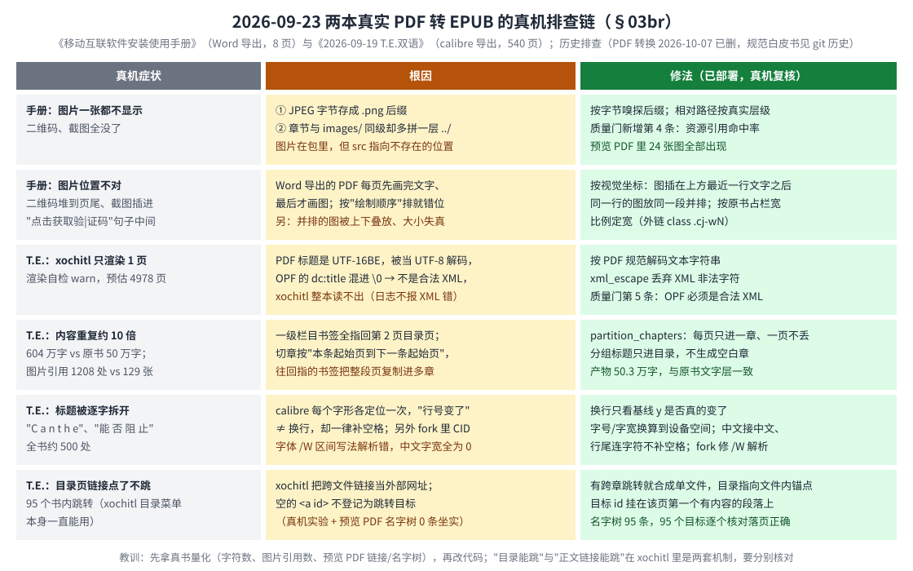

# reMarkable 书架（shelf）白皮书

> **读者与用途**：写给要维护、扩展或排查 shelf（书架：把书弄进设备、优化、再选去哪个阅读器）的人。本文管两件事：**现状总览**（开头一节 + 每章开头的「现状结论」）和**真机历史与坑**（当初为什么这么定、真机怎么验、踩过什么坑）。
> - 想 10 分钟看懂全项目：仓库根 [`docs/OVERVIEW.md`](../../docs/OVERVIEW.md)；想 5 分钟看懂书架：下面「5 分钟读懂」。
> - 同一主题只在一处写全，其余文档一句话 + 链接。四份文档怎么分工见下面「如何阅读本文」。
> - 每节标题里的 **§编号是稳定锚点**，别处写"见 §03bh"指的就是它，**编号不会变**；被后来决策取代的节已压缩成"结论 / 被取代 / 教训"，真机数据保留。


## 5 分钟读懂

**一句话**：shelf 是跑在 reMarkable Paper Pro Move 上的一组网页服务。你用手机/电脑浏览器把书（EPUB/PDF）传进设备的**母版库**（永久保存原书的暂存池），需要时点「优化」（让书在墨水屏上排版更好），再选「加入 xochitl」（官方阅读器）或「加入 KOReader」（第三方阅读器）。它**不修改 xochitl 本体**：只用 xochitl 自带的网页上传接口、直接写它的书库目录，以及注入少量 qmd 补丁。


**三个互相独立的动作**（全书最重要的心智模型）：

| 动作 | 做什么 | 关键约束 |
|---|---|---|
| ① 入库 | 网页上传 / 抓网文 / scp 进 `inbox/`，**原样**落进母版库 | 只收 EPUB/PDF；没有"直投读器"的路径 |
| ② 优化（可选） | EPUB：清洗 + 排版 + 目录 + 封面 + 质量门；漫画自动识别；PDF：有文字层按原格式转 EPUB，无文字层只裁边 | 不强制；产物仍在母版库，可重优化 |
| ③ 落库 | 复制母版字节进读器：xochitl（流式 / 占位替换 / 兜底拆卷）或 KOReader | 母版永久保留，可反复落库、两读器对照 |

**模块与端口**：网关 `gateway`（`0.0.0.0:443`，唯一对外）+ 两个书架领域服务 `book-serve`（8790，母版库）、`koreader-serve`（8791）+ 两个周边服务 `font-serve`（8792）、`wallpaper-serve`（8793，源码在 `../enhance/`）；优化引擎 `bookconv` 是被 book-serve 链接的库，不是服务；`pdf-extract-cj` 是它用来解析 PDF 的本地 fork。服务表与职责见 [`../README.md`](../README.md)「服务与端口」。


**名词小词典**（首次出现处也会再解释）：

| 词 | 意思 |
|---|---|
| xochitl | reMarkable 官方的界面 + 阅读器进程；书架不改它，只和它"握手" |
| qmd / qmldiff / xovi | 对 xochitl 界面（QML）打补丁的文件 / 工具；xovi 是加载这类补丁与扩展的机制 |
| 母版库 | `~/.local/state/shelf/books/staging/`，原书永久保存处（优化和落库都从它出发） |
| 边车（sidecar） | 每本书旁的隐藏小 JSON `.<书名>.delivered`，记"已落到哪、优化/渲染自检结果" |
| 占位 + 磁盘替换 | 绕开 xochitl 上传 100MB 上限：先传几 KB 占位让它建条目，再把磁盘上的文件换成真书（§03bn） |
| 渲染自检 / 预览 PDF | xochitl 导入 EPUB 时会渲染出 `<uuid>.pdf` 与页数；书架读它判断"渲染没坏"（§03aa），也用它免肉眼核对排版和链接 |
| SSE | 服务端事件推送；网页据此即时刷新，不轮询（§03z） |
| OOM / VmHWM | 内存耗尽被系统杀进程 / 进程启动以来的内存峰值；设备内存约 2GB，是第 E 章主线 |

## 如何阅读本文

**四份文档的分工**（2026-09-24 定；同一主题只在一处写全）：

| 主题 | 写全在哪 | 其它文档里 |
|---|---|---|
| 书该被改成什么样（EPUB 优化、PDF 转 EPUB、xochitl 渲染/跳转规则、质量门规则） | [`EPUB优化规范白皮书.md`](EPUB优化规范白皮书.md) | 一句话 + 链接 |
| 代码怎么做到（函数、常量、`OPTIMIZE_VERSION`、实现层的坑） | [`bookconv优化白皮书.md`](bookconv优化白皮书.md) | 一句话 + 链接 |
| 书在服务间怎么流动（母版库状态、落库通道、异步与进度、内存设计、**全部 API 与配置**） | [`传书EPUB线架构.md`](传书EPUB线架构.md) | 一句话 + 链接 |
| 现状总览、真机历史、事故与坑、待办、已砍能力、路径表 | 本文 | — |
| KOReader 配置方案与补丁接口 | [`../koreader/README.md`](../koreader/README.md) | 本文 §03bt 只记决策与真机反馈 |

**本文的章**：

| 章 | 主题 | 包含的 § 节 |
|---|---|---|
| 0 | 定位、原则与基础 | §00 · §01 · §02 · §03 |
| A | 入库与母版库 | §03b · §03r · §03s · §03u · §03ao · §03ap · §03as · §03br |
| B | 优化管线 | §03e · §03i · §03q · §03y · §03aq · §03av · §03aw · §03ay · §03az · §03bb · §03bc · §03bg · §03bo · §03bs |
| C | 落库、大文件、漫画与 KOReader | §03d · §03l · §03t · §03aa · §03ad · §03ar · §03bt · §03ax · §03be · §03bf · §03bk · §03bn |
| D | 网关与网页 UI | §03g · §03h · §03j · §03m · §03n · §03z · §03ac · §03ae · §03af · §03ah · §03aj · §03ak · §03al · §03am · §03an · §03au · §03bj · §03bl · §03bp |
| E | 稳定性、内存与耗电 | §03p · §03ab · §03ag · §03ai · §03ba · §03bh · §03bi · §03bm · §03bq |
| F | 设备、字体壁纸与固件 | §03c · §03f · §03k · §03o · §03v · §03w · §03x · §03at · §03bd |
| 附录 | 踩坑合集 · 旧版现状总览 · 待办 · 演进记录 · 已移除能力 · 目录与路径 · 旧 OTA 说明 | §04 · §00b · §05 · 附录 A–D |

读法：先看「现状总览」，再按主题跳到某章，先读章首「现状结论」和「坑位表」，需要来龙去脉再读 § 节。

## 现状总览（2026-09-24 刷新）

**服务与端口**：见上面「5 分钟读懂」与 [`../README.md`](../README.md)「服务与端口」（笔记线 8795–8798 挂同一网关）。

**读书线 = 三层 · 三个正交动作**：内容源 →（入库，原样）→ **母版库** →（可选「优化」）→（落库：加入 xochitl / 加入 KOReader）。全项目传书全貌图见 [`docs/diagrams/transfer-flow.svg`](../../docs/diagrams/transfer-flow.svg)。

**当前有效的关键规则**

| 项 | 现状 | 详见 |
|---|---|---|
| 收什么格式 | 只收 EPUB / PDF（`rmsvc_core::formats`）；其余一律拒收——策略收紧，不是技术判断 | 第 A 章 |
| 书名 | 入库/优化时规范成 `书名 - 02卷`（数字在前），无卷标记的原样保留 | §03bn |
| EPUB 优化 | 只有一档「完整清洗 + 优化」；`OPTIMIZE_VERSION`=15；产物过**质量门**（5 条硬规则）才替换母版，不过门原文件不动 | 第 B 章、§03bs |
| PDF 优化 | 有文字层→按原格式转 EPUB（颜色、图片位置与比例、链接、目录都按原书；灰字按黑字显示）；原 PDF 挪进 `.pdf-originals/` 留 7 天、网页可恢复；同名 EPUB 已在则不转。无文字层/漫画→只裁边仍是 PDF | §03br |
| 改名 / 下载原件 | 只勾一本时出现；改名只改文件名（扩展名、书内书名不变）；下载全程流式 | 传书线架构 §2.5 |
| 漫画 | 自动识别、保画质、裁边、仍是 EPUB；实验室开关 `comicMinMargin` 让左右留白≈0 | 第 C 章、bookconv §20 |
| 加入 xochitl | ≤90MB 流式 `/upload`；>90MB 优先"占位+磁盘替换"（≤1GiB，不分卷）；不可用才按卷拆分 | §03bn |
| 书内跳转 | xochitl 只认**同一文件内**、指向**非空元素**的 `#锚点`；跨文件链接一律当外链 | 规范白皮书 §03 规则 8–10 |
| 批量与并发 | 批量队列在网关（顺序逐本、落盘续跑、可全部中止）；重活过并发/内存闸门（>90MB 大档 1 个、小档 3 个） | §03bp |
| 稳定性 | `panic="unwind"`+`catch_unwind`、`OpRegistry`、启动时修正被中断的 `pending` | §03bq |
| 进程内并发 | 忙锁（按书名）、落名临界区（同名书不互相覆盖）、spool 锁（只管 inbox 追平）、边车写锁、xochitl 上传锁（“设文件夹 → 上传”成对）、KOReader 配置同步锁；两处已知缺口 | 传书线架构 §7.3 |
| KOReader 入口 | appload ≥ 0.6.0；配置补丁经 koreader-serve `/config/*`；高亮/生词可在网页笔记页一键导入 | §03v、§03ar |
| KOReader 阅读方案 | 全局 = 文字书；`books/漫画/` 新书自动从右往左、去边距、图片最佳缩放、隐藏状态栏；统计与生词本插件已启用 | §03bt |
| 测试 | `cd shelf && cargo test --workspace`：409 个通过、1 个忽略（2026-09-24 第三轮审计后实跑：bookconv 299 · book-serve 85 · koreader-serve 21 · pdf-extract-cj 4） | — |

**已砍/已被取代（别再找）**：电脑端 `shelf` 命令行（09-18，附录 B）；母版库"优化档位"与"投完自动删除"（09-19）；漫画"优化转 PDF"（09-19 做、09-20 换回 EPUB）；三档格式（09-17/18 收成一档）；微信读书内容源（09-05）；appload 补丁工具链（09-21）；bind-mount 壁纸（§03x）；`/inbox*` 与 `/staging/render/*` HTTP 接口（09-22 删，scp 进 `inbox/` 仍可用）。

**未闭环 / 未验证（如实）**：网页 i18n 与触屏交互没有真实浏览器人眼确认；图片密集网文的大片留白是分页引擎行为，CSS 层无杠杆（§03aq）；批量"加入 xochitl / 加入 KOReader"没有设备端到端实测；KOReader 运行中拒写配置（409）没有真机专门验证；原件下载的内存峰值没量；>153MB 占位通道的首次渲染内存/耗时未测；PDF 转 EPUB 的公式裁图未验证（两本样本都没有公式）；calibre 书常用空 `<a id>` 当注释目标，在 xochitl 上可能跳不动，**书库 36 本实扫未发现受影响的同文件链接**，但 7 本书的书内目录页是跨文件链接、在 xochitl 上点不动（xochitl 自己的目录菜单正常，暂不改）。

**2026-09-24 第三轮审计（只在 host 验证，未上真机）**：并发锁四处修正（传书线架构 §7.3）；优化进度上报加 1 秒最短间隔（快书 61→4 次事件）；建文件夹队列每次只扫一遍书库；`onopen` 升 `ok` 写回边车；PDF 只解析一遍、原始字节及早释放、解压限 64MB（bookconv §18）；小请求体超 1MB 报 400、路径参数 `+` 不当空格（rmsvc-core 白皮书 §01–§03）。

**OTA（固件升级）后怎么恢复**：权威说明在 [`docs/INSTALL.md`](../../docs/INSTALL.md)「固件升级（OTA）之后」。

## 第 0 章 定位、原则与基础

> **现状结论**
> - 四条硬原则至今有效：XDG 基目录规范；设计模式去重解耦；专项专用可插拔（按领域拆服务）；不引用旧项目 crate、不对接旧路径（能力只许剥离移植）。
> - 架构是"网关 + loopback 领域服务 + 运行时注册表"：装/卸一个服务 = 一个二进制 + 一个 systemd 单元；网关按注册表出 tab、按 URL 段转发。

### 00｜定位与原则

2026-09-03 用户提出"全面重构，补齐短板增强优势"（KOReader、微信读书、多格式、字体与屏保上传即用）。其中微读线已砍（§03u）、"上传时手选目标"被母版库取代（§03r）、电脑端命令行已砍（附录 B）、只收 EPUB/PDF（第 A 章）。

四条硬原则（用户两轮驳回后定）：
1. **XDG 基目录规范**：路径表单一事实源是 `rmsvc_core::paths`；shell / qmd 用同一张表的缺省展开值，env 可注入测试。
2. **设计模式去重解耦**：资产上传 `AssetStore`/`AssetUploadFlow`（Repository + Template Method，四家共用）；领域模块 + 纯适配层（book-serve `staging/` 是领域、`api.rs` 只取参回执）；服务启动模板 `ServiceSpec`；配置模板 `config::load_or_default/seed/save`；Registry · Facade（`manage::MODULES`）· 单一事实源（`formats`、`fs::plain_name`/`unique_path`）；共享原语 `fs::write_atomic`、`multipart::receive_part_to`。**旧 crate 只许剥离 + re-export**。已退役：投递 Strategy / Pipeline（§03s，规则统一后没了调用方）、CLI 相关模式。
3. **专项专用可插拔**：不做单体，按领域拆服务。
4. **不引用旧项目 crate、不对接旧路径**：不读写 `/home/root/weread/**`。

### 01｜架构决策

**选 B：网关 + loopback 服务 + 注册表**（弃 A 每服务独立对外端口、C 单二进制编译期插拔）。
- 注册表放 `$XDG_RUNTIME_DIR`（重启即清）+ 读时按 `/proc/<pid>` 清陈旧条目。
- 代理**剥掉服务段**（`/api/fonts/x` → 后端 `/x`），后端直连与经网关同一套路由。
- 每请求一线程；**请求体流式透传；带长度的下载或 >256KB 应答流式、其余小应答整体缓冲**（§03ah；09-24 加）。
- `bookconv` 从旧 weread-device `git mv` 成独立 crate（当时新旧 `epub-optimize` 输出 md5 一致）；现只被 book-serve 链接。

### 02｜XDG 路径表

见附录 C「设备路径」。qmd 的 XHR 只能写绝对路径（缺省值展开 `/home/root/.local/share/shelf/fonts.json`）。

### 03｜systemd

`shelf.target`（WantedBy=multi-user）；服务 `PartOf=`/`WantedBy=shelf.target`；网关 `ExecStartPre=-…/lo-alias.sh`（让 10.11.99.1 常驻可达以便 `/upload`；源在 `enhance/lo-alias/`）与 `ExecStartPre=-/usr/bin/fc-cache`（tmpfs 索引真重启后丢）。`install.sh` 写 /usr 前实检 dm-verity。**不给 xochitl 加任何依赖**（改核心服务启动依赖曾导致变砖）。

## 第 A 章 入库与母版库

> **大白话导语**：本章讲"一本书怎么进到设备书架"。书先**原样**放进**母版库**，之后优化、放进哪个阅读器都是另外的独立动作。术语：**book-serve** = 管母版库的设备后台服务；**落库** = 把母版复制进某阅读器的书库；**inbox** = "scp 丢文件就自动入库"的目录。§03b/§03r/§03s 是演进过程、§03ao/§03as/§03u 是历史，现役是 §03ap 与 §03br。

> **现状结论**
> - 所有书**只落母版库**；入库、优化、落库三个动作互相独立，母版永久保留。
> - 入库来源三条：网页上传（多文件、有进度；同名同大小=已落地，跳过）、抓网文（Readability 抽正文成 EPUB，「同步优化」缺省勾选）、scp 进 `inbox/`（fswatch 监听，8 秒防抖；失败项进 `failed/` 带 `.reason`，重试=人工拷回 `inbox/`，09-22 起无 HTTP 管理接口）。
> - 格式只收 **EPUB / PDF**（`BOOK_EXTS` = `NATIVE_EXTS`）——策略收紧，不是技术判断；已在库的旧条目仍可加入 KOReader。
> - EPUB 书名入库时规范成 `书名 - 02卷`；同名不覆盖、撞名各自入库（`unique_path` 加数字前缀）。
> - 优化与落库都**异步**：HTTP 立即回"已开始"，进度靠边车 + SSE。
> - PDF 也能「优化」：有文字层按原格式转 EPUB（原 PDF 挪进 `staging/.pdf-originals/` 保留 7 天，网页可恢复；同名 EPUB 已在则不转），无文字层/漫画只裁边（§03br）。
> - 只勾一本时可**下载原件**（全程流式）和**改名**（只改文件名，扩展名与书内书名不变）——2026-09-24 加，机制见传书线架构 §2.5。


#### 本章坑位表

| 坑 | 症状 / 根因 | 规避 | 见§ |
|---|---|---|---|
| "已优化"徽章说谎 | 无清洗的产物写了与完整优化同一标记 | 标记分层：`level`=full/core/old/none | §03r |
| inbox 绕过母版库 | `process_inbox` 是直投路遗留 | 规则审到**所有入口**；验证前先读防抖参数 | §03r |
| 剩余空间读错 | 早期解析 busybox `df -k`，设备名过长把数字换行 | 现改 `statvfs(2)` 一次系统调用，无子进程、无文本解析 | §03r |
| 网文正文大片留白 | 白名单不留 class/style；图片夹正文的留白另有成因 | 「同步优化」必要不充分 | §03ap、§03aq |
| 同名同大小去重快照过期 | 一次拖两份同名文件，第二份仍成 `1_x` | 每成功一项补进快照 | 附录 §04 |
| 上传超 100MB | xochitl `/upload` 硬上限 100,000,000 字节 | 缺省门 90MB + 占位替换通道 | §03bn |
| 转换后原 PDF 只留 7 天 | 有文字层 PDF 转 EPUB 成功后，原 PDF 挪进母版库隐藏目录 `.pdf-originals/`，7 天后自动清 | 母版库页底部「原 PDF 备份」里点「恢复」挪回母版库（同名已在则拒绝），也可提前删除 | §03br |

### 03b｜Phase 1 统一投递（2026-09-03，离线完成）

- **结论**：book-serve 多文件流式落 `.work/`、koreader-serve 直传、host `shelf push`，当时冒烟通过。仍有效：spool 目录结构（`inbox/`、`.work/`、`failed/` 封顶 50MB 带 `.reason`）与 `book.json` 三个配置键（`xochitlHost`/`uploadTimeoutSecs`/`nativeUploadLimitMb`）。
- **被取代**：09-05 母版库三层架构（§03r）；直投路（`POST /?target=`、Strategy/Pipeline）§03s 删除，现唯一入口 `/staging*`。
- **教训**：架构模式服务于当时的规则，规则变了就整块删，别留着当"以后可能用"。

### 03r｜读书线重构：中间层（母版库）三层架构（2026-09-05，用户"逻辑很乱"提出改造）

**问题**：一次背 3 维决策（读器×投递口×文件夹），"优化"与"落库"耦合。**方案**：入库 / 优化 / 落库三动作正交，中间夹**母版库**；所有源一律原样直传母版库。**关键设计：落库 = 纯复制原字节、不优化**，一本母版落两读器是同字节可对照。

- **真机端到端（09-05）**：上传→优化→投 xochitl→adopt KOReader（同字节）→母版保留；网文抓取（`bookconv::article`，scraper/html5ever musl 交叉编译通过）落母版库。
- **规则漏洞两处**：inbox 自动直投 → 改为原样落母版库；网文/格式转换产物"已优化"徽章说谎 → `marker_value` 分层，`StagingEntry.level` = full/core/old/none，非 full 仍给「优化」钮。
- **落库记录**：边车 `.<书>.delivered`（后扩 `render`/`optimize`/`source` 等字段）；`GET /staging` 带 `freeBytes`，<300MB 红字告警。
- **被取代**："收任意格式""优化档位""投完清除""电脑 shelf push""微读占位""清理已落库按钮"均已砍或被 §03bp 取代。
- **旧 PDF 重排教训（host 管线已砍）**：真机《财新周刊》整页空白的三根因＝每页一章、段落碎成行、图近整屏高；**先解剖产物再改**。

### 03s｜代码质量核查二轮：母版库领域化 · 直投路删除 · 上传模板统一（2026-09-05，用户"审视 shelf/ 合理用设计模式、去重、解耦"）

- **结论**：按"单一事实源 + 模板方法 + 门面"收：`rmsvc-core` 收 `formats`/`fs::plain_name`/`unique_path`/`http::bind`/`AssetUploadFlow`；book-serve 删 `target.rs`/`pipeline.rs`，母版库拆成 `staging/{mod,intake,library,optimizing,deliver}.rs`；koreader-serve 书只从母版库 adopt。真机通（jpg 拒收、adopt 同字节、旧路由 404/405）。
- **被取代**：当时的"格式三档"（原生/电脑可转/仅 KOReader）09-17/18 收成一档。
- **教训**：格式收紧是用户策略，"KOReader 技术上能读"不构成收的理由。

### 03u｜砍微读线（2026-09-05，用户"不做了，直接砍微读线"；范围只限书架）

- **结论**：微信读书官方网关只读没正文；正文要 web cookie（约 90 分钟过期）+ AGPL 派生解码；投入约两天、依赖第三方私有协议，用户决定不做。书架内容源现为三条：网页上传 / 抓网文 / scp inbox。
- **被取代**：`weread-serve` 槽位、入库页占位、目录表 weread 行都已删（`reading/` 下书栈已搬出仓库）。
- **教训**：协议脆弱是常量；若将来接"墨香管理"，先砍掉旧 `wr-serve` 内嵌在 `0.0.0.0:8778` 的上传页（与网关旧端口冲突只是巧合躲开）。

### 03ao｜`shelf push --no-calibre`：纯 EPUB 优化、跳过 Calibre（2026-09-10）

- **结论**：核心能力本来就有（`optimize_epub_with` 被网页「优化」与 `epub-optimize` 共用），缺的只是 CLI 入口。
- **被取代**：host CLI 09-18 整体砍除。
- **教训**：用户说"缺功能"时，先查是"能力有、入口缺"还是真缺。

### 03ap｜「抓网文」补「同步优化」复选框（2026-09-10，真机通）

**症状→根因**：网文在 xochitl 上大片留空 ← 抓取只走核心遍（`level:"core"`）、不注入外链 css ← xochitl 只认外链 `.css`。**实现**：`Staging::fetch_article(url, optimize)` 落库后可紧接调**同一个** `optimize`；失败不阻断抓取（`optimize_error` 带原因）；网页复选框缺省勾选。**真机**：同一篇带/不带同步优化分别得 `level:"full"`（3761 字节）/`"core"`（3488 字节）。
**追记**：对"图片夹正文"造成的留白**没有实质改善**（§03aq）；本节修的是正文样式缺失这个真实缺口。

### 03as｜`shelf notes pull` 补 `config.toml` 的 `notes_vault` 配置项（2026-09-16）

- **结论**：路径类配置优先级 = 命令行 > 用户配置 > 兜底缺省。
- **被取代**：`shelf notes pull` 随 CLI 09-18 砍除；md 导出现入口见 `notes/README.md`。
- **教训**：兜底缺省不该被当成"多数人的真实位置"。

### 03br｜入库 PDF 的「优化」：有文字层按原格式转 EPUB / 无文字层只裁边（2026-09-19 起，2026-09-23 重做）

> 规则正文（不改内容与颜色、图片视觉落位与比例、链接与锚点、分段与切章）以 [`EPUB优化规范白皮书.md`](EPUB优化规范白皮书.md) §05 为准；引擎实现见 `bookconv优化白皮书.md` §18。本节只记决策、取舍与真机结果。

**现行做法一句话**：有文字层（每页平均可提取字符 ≥ 40）→ 转 EPUB；漫画 / 扫描件 → 只裁边、格式不变（只处理"零文字、每页恰好一张整页图"的 PDF）；判不准一律退到只裁边——转 EPUB 是破坏性格式变更，选保守那条。分类表与数据流见传书线架构 §2.4，规则见规范白皮书 §5，实现见 bookconv 白皮书 §18。

**2026-09-23 用户拍板"按原格式生成"**（原话："移动互联软件安装使用手册，要按原格式（颜色，连接，图片位置）生成EPUB，TE也一样"；"图片可适当缩放，以保障显示效果与原 pdf 基本一致"）。关键取舍：

| 决策 | 取舍 |
|---|---|
| fork `pdf-extract` 而不是重写 | 字体/字形解码最难、最易出中文边界问题，不碰；只在 fork 的内容流解释器里补颜色算子、图片位置、CID 字宽 |
| 颜色只用外链 class | xochitl 不认内联 `style=` |
| 图片按**视觉坐标**落位、按占栏宽比例定宽 | Word 导出的 PDF 先画文字后画图，按绘制顺序会错位 |
| 有跨章跳转就**合成单文件** | xochitl 只认同文件锚点 |
| 每页只进一章 | 杂志类 PDF 的栏目书签常指回目录页 |
| 灰字按黑字显示（09-23 晚，规范白皮书 T2） | 用户选两线统一：墨水屏上浅灰难读，彩色才是强调 |

**真机排查链**（两本真书：Word 导出的《移动互联软件安装使用手册》8 页、calibre 导出的《2026-09-19 T.E.双语》540 页）：



**真机结果**：手册渲染 9 页（原 PDF 8 页），二维码与截图位置、并排、比例与原版一致，红字与蓝色网址保留；T.E. 渲染 600 页（此前 1 页），正文 50.3 万字与原书文字层吻合，130 张图各出现一次，95 个书内跳转目标全部被 xochitl 登记且逐个核对落页正确，用户真机点击确认"可以跳了"。
**未验证**：公式裁图（样本无公式）、竖排/多栏 PDF。
**教训**：① 核对跳转要分两套——目录看 `.epubindex`，正文链接看预览 PDF 的具名目标表；只看目录会误判"能跳"。② 先用真书量化（字符数、图片引用数、链接数）再改代码，"看起来对"在这条线上多次被数字推翻。

**2026-09-24 审查补三条保护**（前两条真机验证过）：① 母版库已有同名 `<书名>.epub` 时停下报错，不再 rename 覆盖那本书；② 原 PDF 不再直接删，挪进 `.pdf-originals/` 保留 7 天，网页可恢复或提前删除；③ `pdf-extract-cj` 嵌套表单限深 16 并防环——自引用的表单以前能把 book-serve 栈打爆（SIGSEGV，`catch_unwind` 接不住）。同日还加了原件下载与改名。机制都在传书线架构 §2.5。
**教训**：破坏性的格式转换，默认就该留一条回头路——"转成功才删原件"不够，转成功不等于转得让人满意（多栏、表格类 PDF 转出来可能能读但不好看）。

## 第 B 章 优化管线

> **大白话导语**：一本 EPUB 放进母版库后点「优化」，`book-serve` 调 `bookconv` 库完成清洗。值得读是因为 **xochitl 的 EPUB 渲染器闭源、行为反常识**，本章多是"真机量出来的规矩"和踩坑的来龙去脉。**规则本身以 `EPUB优化规范白皮书.md` 为准**；引擎逐模块细节见 `bookconv优化白皮书.md`。读法：现状结论 + 坑位表 → 决策来由读 §03q / §03av / §03bs → 《疯探》排查链是方法论样板。

> **现状结论**
> - 「优化」只有一档：完整清洗（wash）+ 优化器两遍 + 图片处理 + **质量门**；`OPTIMIZE_VERSION`=15。母版库按产物内版本标记显示 full / core / old / none，非当前版本可再点「优化」升级。
> - **质量门接入设备端优化流程（2026-09-23）**：产物写到临时文件后先过 `bookconv::check`（5 条硬规则：真 DRM、目录命中率、双 id、正文资源引用命中率、OPF 合法 XML），**不过门就放弃产物、原文件完全不动**（§03bs）。
> - **排版**：xochitl 只认外链 `.css`，规则写进 `cangjie-wash.css`；实测规则（尾分号、`0` 当没设、类规则等）见规范白皮书 §03。脚注缺省 `Anchor`（注释移章末、原生返回浮标兜底）；注释容器类只去加粗、字号比正文小一档。
> - **章节识别**：扩展名不是权威，无扩展名的章节按内容嗅探（`is_html_entry`），不再被清洗整体跳过。
> - **封面**：OPF 必须同时有 `<meta name="cover">` 和 `properties="cover-image"`（§03bo）。
> - **内存**：流式两阶段 + 图片并行（2 worker、像素预算 600 万）、单图超 900 万像素跳过（第 E 章）。
> - **已砍**：电脑端 Calibre 洗书链与 `check_output.py`；开发机只剩 `epub-optimize` 小工具（同一份代码）。

#### 本章坑位表（一）

| 坑 | 症状 / 根因 | 规避 | 见§ |
|---|---|---|---|
| 内联排版规则不生效 | xochitl 只认外链 `.css` | 规则写外链 `cangjie-wash.css`；一个真机活样本胜过七版凭空诊断 | §03q · §03y |
| 声明缺尾分号被吞 | 最后一个无分号声明被丢 | 输出一律带尾分号 | §03y |
| `text-indent:0` 无效/继承 | `0` 被当"没设" | 写 `0.01em` + `cj-flush` 并剥书的类 | §03y |
| 旧版本书升不了级 | 幂等门只看标记存在 | 标记版本与当前比对 | §03q |
| 图标脚注巨大 / 背景图平铺盖正文 | 行内图按固有像素；无视 `no-repeat` | 丢弃图标 marker；剥 `background*` | §03q · §03bs |
| 误诊：banner 当"重复图"删 | 真凶是 CSS 背景图 | 看不到屏幕别猜，让用户拍照 | §03q |
| 中文书零缩进 | 全书无 `<p>`，段首 U+3000 被折叠 | `cjk_paragraphize` | §03y |
| 修了 figure 边距留白没变 | 分页引擎把放不下的图块整体挪页 | 改前后逐页像素一致才是证据 | §03aq |
| 弹窗脚注做不成 | 闭源渲染器无弹窗 | "跳转+浮标"；KOReader 才有弹窗 | §03q |
| 放开 `background-color` 风险 | 深底浅字块在彩墨屏或更难读（未验证） | 挑带彩色底纹的书真机看 | §03av |

### 03e｜Phase 4 原生高质量门 · Phase 5 微读 spike 脚本（2026-09-03）

- **结论**：host 质量门 `check_output.py` 当时移植成 `bookconv::check`；微读 spike 脚本需设备旁执行。
- **被取代**：host 门与 spike 脚本都已不在仓库；**现 `bookconv::check` 已接入设备端「优化」**（09-23，§03bs），不再"只有 `epub-optimize --check` 可用"。
- **教训**：质量门不在真实流程里跑，就只是摆设——09-23 的 `../` 路径 bug 本可被门拦下。

### 03i｜host 优化 vs 设备端优化：对标现状与移植计划（2026-09-03 傍晚，用户问"对标一致吗"）

- **结论**：当时优化器两边同源，清洗层与质量门不对标；用户拍板把 Calibre 那层规则移植进 `bookconv::wash`。现行清洗规则（伪 DRM、CSS 锁、边距/段距、空页、自动目录、双 id）以规范白皮书 §04 与 bookconv 白皮书 §02 为准。
- **被取代**：host 洗书链 09-18 砍除；表中"设备端不跑门"已被 §03bs 推翻。当时数据留档：《飘·上册》（多看伪 DRM，10.6MB）设备端优化 90s，35 章、10631321→3183269 字节。
- **教训**：漫画几乎全是图，清洗层对它无意义，对照测试要换文字书。

### 03q｜书籍优化深层优化：做精做细做强（2026-09-04，用户"只做精做细做强"）

四诉求：格式仅留 EPUB+PDF；按 Move 屏参数优化；图片美观、中英文各按习惯、不锁字体、不缺目录、脚注自动呈现；xochitl≈KOReader。

- **两条判死**：xochitl 弹窗脚注（闭源渲染器不实现、正文点击不通知 QML）；端上 PDF 重排（当时无 musl 友好的纯 Rust 方案）。
- **Phase F 真机（《飘·上册》用户拍照逐页核，v8）**：图标 marker 按固有尺寸渲染→丢弃；内嵌横幅溢出竖屏→降采样到 954 宽；背景图平铺盖正文→剥 `background*`。
- **误诊教训**：把"分卷页多幅图"当成"章头 banner 重复"加了删图规则——错，已 `git revert`；真凶是 CSS 背景图。
- **幂等门只看标记存在、不看版本**（根因，波及全部 v7+ 改进）→ 按版本比对，旧书重优化升级；重优化注释不翻倍由两条测试守住。
- **首行缩进根因终结（v10）**：xochitl 只认外链 `.css`，v6–v9 注入的内联 `<style>` 从未生效 → 排版规则写外链 `cangjie-wash.css` + 每章 `<link>` + manifest 补项；中文 2em / 拉丁 1.2em。段首 `&nbsp;`、U+3000、`inline-block` 占位都是死路。

### 03y｜xochitl CSS 引擎实测规则（2026-09-06，八轮"诊断 EPUB"量渲染缓存，3.28.0.172）

> **规则正文已迁到 [`EPUB优化规范白皮书.md`](EPUB优化规范白皮书.md) §03**（权威版，含之后新增的跳转规则）；本节只留方法与配方的由来。


**方法**（可复用）：造只有一个变量的诊断 EPUB（每章一种写法 + 同章一个对照段落）→ 投原生 → 量 xochitl 渲染出的 `<uuid>.pdf` 里每段首行 x 偏移。不需肉眼，一轮 2 分钟，共 60 个变体。
**七条结论**：尾分号、`0` 当没设、类规则认且压元素、同类先出现者胜、不认内联 `style`、`text-indent` 继承、`!important` 不认（旧"不认类选择器"是尾分号规则的误读）。
**最终配方**：顶格段 → `<div class="cj-flush">`（剥书的类与 style）+ 外链 `.cj-flush{text-indent:0.01em;…;}`；真机章首/场景切换 0pt、续段 14.2pt。**中文书**：《人骨拼圖》全书没有 `<p>`（`<br/>` 分行 + 段首 U+3000）→ `cjk_paragraphize` 按 br 切段、剥全角空格；真机 278 个段首 24.1pt（=2em）。

### 03aq｜真机排查"抓完优化还是大量留白"：wash 补 figure/figcaption 边距 + 证伪 + 找到真正成因（2026-09-10，真机 A/B 验证）

- **结论**：补了真实缺口（`figure{}`、`figcaption{}` 两条**分开写**的边距清零），但**真机 A/B 25 页逐页像素一致**——不是留白成因。真因：图片块在页尾放不下时整体推到下一页、余下空间不回填，是分页引擎行为，EPUB/CSS 层无杠杆。
- **未修**：aeon.co 轮播被整组抽出（内容更全但更长，是取舍）；"1 of 4"页码混入正文（疑来自 readability 转写，未验证）。
- **教训**：结论是"改了一处真实缺口，但没解决用户的问题"，不能写成"已解决"。

### 03av｜书籍优化架构调整：拆 EPUB 线/PDF 线，EPUB 线四原则落地（2026-09-17，功能层真机验证）

用户拍板：设备端只收 EPUB/PDF；EPUB 优化全部在设备侧；EPUB 线四原则。

| 原则 | 落地 | 现状 |
|---|---|---|
| ① 保留目录并拆分章节序号 | `split_numbered_title`（"第一章 1"拆父子两级）；无标题时按 spine 首段兜底 | 沿用 |
| ② 解锁字号、保留原书颜色/加粗 | `DEFAULT_FILTER_PROPS` 收窄为 `font-family`/`font-size`/`font`/`background-image`/`background` | 沿用；09-23 加例外：注释容器类去加粗（§03bs） |
| ③ 注释位置 | 当天试 `ParagraphEnd`（段末插注释），用户要"翻到哪页注释在那页最下面"——流式重排做不到 → **改回 `Anchor`**，`ParagraphEnd` 整个删除 | `Anchor` |
| ④ 漫画自动识别 | `comic_detect`（图 ≥20 且每图文字 <40 字）+ 裁边（上限后调到 35%） | 沿用 |

- **格式收窄**：AZW3/MOBI/PRC 连带禁止——**主动放弃一条已验证可用的能力**，为规则一致性。
- **真机功能层验证**：四本构造书各验一条原则；25 页测试漫画优化 2 分 19 秒（后由异步 + 并行 + 单趟管线治理）。
- **仍未人眼确认**：彩色高亮块可读性、两级目录观感。
- **教训**："按设计跑通"与"设计是用户想要的"是两件事。

#### 本章坑位表（二）

> 术语：NCX = EPUB2 目录文件 `toc.ncx`；manifest = `content.opf` 里的文件清单；`.epubindex` = xochitl 给每本 EPUB 生成的内部索引（目录条目 → 页码）。

| 坑 | 症状 / 判据 | 根因 | 规避 | 见§ |
|---|---|---|---|---|
| 优化/落库是同步 HTTP | 大漫画请求卡死；处理中点删除会真删 | 同步阻塞 + 无"正被处理"状态 | 服务端忙锁 + 异步 + `busy` 字段 | §03aw · §03ay |
| 书内 HTML 目录页从 spine 消失 | 翻页翻不到目录页 | 早期启发式"链到 ≥10 个 html 就当冗余目录页" | 整段删除；目录页是作者放的正文 | §03ay |
| 原生目录入口整个不出现 | `.epubindex` 每条只有路径、没有标题 | xochitl **硬编码查** manifest `id="ncx"` | NCX 条目 id 必须叫 `ncx` | §03bc |
| 对照两本书就下"根因" | 修完字节全对，入口仍不出现 | 两书差异不止一项 | 逐项单变量隔离；"字节正确"≠"设备认" | §03az · §03bb |
| 优化进度条不动 | 所有阶段都无进度 | `OptimizeCheck` 没有 `progress` 字段 | 逐条目回调、每 5 条节流 | §03bg |
| 封面缩略图取不到 | `got null cover image` | 封面 id 带点且只有 meta；或 meta 指向非图片 | meta 与 `cover-image` 同时写，清洗前补 | §03bo |
| 注释源自带 `<p>` 得嵌套 `<p><p>` | 内容模型非法 | Anchor 分支固定包 `<p id>` | **已修（09-23）**：容器改 `<div id>` | §03aw · §03bs |
| 字体锁"清不掉" | 某几章字体始终锁死、脚注没处理 | 章节文件无扩展名，按扩展名判断整体跳过 | 按内容嗅探（`is_html_entry`） | §03bs |
| 优化产物有坏链接却照样替换母版 | 图片 src 指向不存在的文件，没人发现 | 质量门没接入设备端流程 | 门在替换前跑，不过就放弃产物 | §03bs |

#### 《疯探》"没有 TOC"排查链总览（§03ay → §03az → §03bb → §03bc）

同一本书（"番茄小说 EPUB Generator"产物，94 章）连续多轮反馈，前几轮归因都不对——这是整条线最值得复用的方法论样板。

| 轮次 | 假设 | 结果 |
|---|---|---|
| ① §03ay | 优化器把书内目录页摘出了 spine | **成立但是另一个 bug**：修后目录页保住，原生目录入口仍没有 |
| ② §03az | `dtb:uid` 与 OPF 标识符不一致 | **被证伪**（修复保留，规范要求） |
| ③ §03ba | `toc.ncx` 外部 DTD 让解析卡住 | **被证伪**（修复保留，无害） |
| ④ §03bb | 逆向 `.epubindex` 当判据，"真书重打包 + 单点替换"二分 20+ 轮 | 定位到 `content.opf`，没锁定字段 |
| ⑤ §03bc | 反编译 xochitl | **根因坐实**：硬编码查 manifest `id="ncx"`；只改这一行，94 条标题全出 |

**方法论**：① 先造可量化判据；② 二分覆盖"名字/格式/顺序/内容"所有维度（20+ 轮只测了内容、没测 id 命名）；③ 二分穷尽而黑盒不透明时，反编译比继续猜划算。

### 03aw｜真机反馈第二轮：脚注撤回复核+异步优化真机全链路验证+防双击（2026-09-18，真机通）

- **脚注**：`Anchor` 版真机重跑，marker 可点、注释回章末。顺手发现 Anchor 分支对自带 `<p>` 的注释源产出嵌套 `<p><p>`——**09-23 已修**（容器改 `<div id>`，§03bs）。
- **异步化**：忙锁进程内、不落盘，重启清零（现为 `OpRegistry`）；`spawn_optimize` 先同步校验再加锁起后台线程，`catch_unwind` 保证锁一定清；结果写边车 + SSE；`GET /staging` 每条带 `busy`。真机：优化期间删除被拒、约 2 分钟后 `status:ok`。
- **防双击**：十几处 `onclick=async` 统一 `guardClick(el,fn)`。
- **教训**：忙判断必须在服务端；前端禁用只挡同一标签页的同一按钮。

### 03ay｜第四轮真机反馈：落库改异步（补齐"投书按钮"防双击）、真书《疯探》坐实并修复"目录页被优化器吃掉"的老 bug（2026-09-18，真机通）

- **落库异步**：`spawn_deliver()` 照抄 `spawn_optimize`，渲染自检挪进后台线程；忙时再发 deliver/delete 回"正在处理中"。
- **《疯探》目录页消失**：`remove_toc_from_spine`（最早期启发式、从无单测）把书内目录页摘出 spine——违背"保留目录页"原则，整段删除，`OPTIMIZE_VERSION` 10→11；回归测试 `html_toc_page_kept_in_spine_not_stripped_as_redundant`。
- **教训**：这一轮修了真 bug，但**没解决用户要的原生目录入口**（见排查链）。

### 03az｜第五轮真机反馈：《疯探》"没有 TOC"根因是 dtb:uid 不匹配（真机对照《雪人》坐实），《雪人》暴露"已有目录不拆两级"的范围问题（2026-09-19，真机通/待决策）

- **结论**：`fix_ncx_uid` 让 `dtb:uid` 与 OPF 标识符一致（规范要求，保留）；自家 `build_ncx` 的 uid 硬编码也改接真实标识符。《雪人》扁平目录拆两级另由 `restructure_existing_toc_parts` 处理。
- **被取代**：标题里的"根因是 dtb:uid"已被 §03bb/§03bc 证伪。
- **教训**：对照两本书只挑最显眼的差异就下结论——《雪人》恰好 `id="ncx"`、无 DOCTYPE，共三处差异。

### 03bb｜《疯探》目录入口深度排查：dtb:uid/DOCTYPE 都不是根本原因，反编译式二分定位到 content.opf，未能锁定最终触发点（2026-09-19，真机通，⚠未解决）

- **结论**：逆向 `.epubindex`（`rM epub index` 魔数头的私有格式）得到判据——《疯探》94 章标题位全空；"真书重打包 + 单点替换"二分 20+ 轮，定位到 `content.opf`，没锁定字段。
- **被取代**：§03bc 反编译坐实。
- **教训**：二分只变了 OPF 的内容字段、没变 id 命名；"能用的样本"会掩盖隐含约定。

### 03bc｜《疯探》目录入口真正根因：反编译 xochitl 二进制坐实——硬编码死查 manifest `id="ncx"`，不走 `<spine toc="IDREF">`（2026-09-19，真机通，✅已解决）


- **工具链（可复用）**：Ghidra 12.1 + PyGhidra Python API（不依赖 `jep`）离线全量分析 23.6MB 的 xochitl；`strings` 必须**含 UTF-16LE**（Qt `QStringLiteral`）。
- **根因**：找 NCX 的代码用硬编码 `"ncx"` 查 manifest id 表；《疯探》合规的 `id="toc"` + `<spine toc="toc">` 查不到，标题提取整体失败，原生目录入口消失。
- **验证**：只改一行 `id="toc"`→`id="ncx"`，`.epubindex` 7188→15558 字节、94 条标题全对；`fix_ncx_manifest_id` 进 `wash`，端到端逐字节一致。同源活 bug：自动目录自己插的条目曾写 `id="cj-ncx"`，已改。
- `wash_entries` 现行目录修复顺序：`fix_ncx_manifest_id` → `restructure_existing_toc_parts` → `auto_toc` → `fix_ncx_uid` → `strip_ncx_doctype`。

### 03bg｜优化也补真实分步进度（不是漫画专属），顺带确认这不能"实质省内存"（2026-09-19，真机通，✅已解决）

- **前提纠正**：所有 EPUB 都走流式（不是只有漫画）；缺的是 `OptimizeCheck.progress`。
- **实现**：`StepProgress{done,total}` 共用；流式阶段二逐条目回调，每 5 条节流落盘/推 SSE。真机《飘·上册》`36/56 → 41/56 → 46/56 → ok`。
- **不能省内存**（置信度高）：进度回调不改数据存活时长；瓶颈是图片，已按张处理。

### 03bo｜封面声明规则与无损补封面工具（2026-09-20，真机对照实验）

**实验**（同一张封面图造 3 个最小 EPUB，只改声明写法）：封面 id 带点 + 只有 `<meta name="cover">` → 取不到；再加 `properties="cover-image"` → 正常；id 简单 + 只有 meta → 正常。
**规则**（`wash::ensure_cover_declared`）：两种声明同时写；必须在清洗**之前**调用；封面文件不是图片时兜底取前 12 个 spine 页里第一张真实图。
**工具**：`cover-fix in.epub out.epub [cover.png]`——只改 OPF、图片零重编码，已对设备上 3 本已投的书原地修补。

### 03bs｜2026-09-23 EPUB 优化线一轮真机修复：无扩展名章节、注释样式、质量门接入 book-serve

> 规则正文见 [`EPUB优化规范白皮书.md`](EPUB优化规范白皮书.md) §02、§04；本节记用户反馈、根因与验证。

用户用《甲午：摇摆的战争》反馈"注释有问题、无法改字体"，排查中逐步收窄：

| 反馈 | 根因 | 修法 |
|---|---|---|
| 某几章字体改不了、注释没处理 | 书里 4 章是**没有扩展名**的章节文件（manifest `media-type` 合法），清洗按扩展名判断，整章跳过 | `is_html_entry`：扩展名优先，无扩展名时嗅探内容；接入清洗/优化/质量门全部调用点。真机识别章数 8 → 29 |
| 注释图标巨大 | 多看脚注图标的 class 标在外层 `<a>` 上，识别只看 `` | 两处都判；图标 marker 一律换成上标数字 |
| "跳到注释页字体不对" | 用户澄清：不是字体变了，是**加粗** | 用户拍板："只剥注释容器类的 font-weight，不碰正文，注释容器类的 font 大小要小正文 1 个字号"——选择器含 `footnote`/`fnote` 的类去加粗、字号 `0.9em`（相对单位，随用户字号缩放）；正文加粗照旧保留（§03av 原则②不变） |
| 注释源自带 `<p>` | Anchor 分支包 `<p id>` 产生嵌套 | 容器改 `<div id>` |

**质量门接入**：同日 PDF 转 EPUB 的 `../` 路径 bug（§03br）让"门只在命令行工具里跑"的缺口暴露。现在 `Staging::optimize()` 与 PDF 转换在 `produce_then_replace` 的临时文件阶段跑 `check_epub_file`（只读骨架、不读图片字节），不过门就返回错误、原文件完全不动。新增两条硬规则：正文资源引用命中率 <80%、OPF 不是合法 XML（后者对设备上 56 本真实 EPUB 扫过，零误伤）。
**真机**：《甲午》重优化后 29 章全部处理、注释不加粗且小一号，用户确认"注释正常了"。

## 第 C 章 落库、大文件、漫画与 KOReader

> **大白话导语**：**落库**＝把母版库里的书放进某个阅读器：「加入 xochitl」走它的网页 `/upload` 接口，「加入 KOReader」直接把文件复制进 KOReader 书目录。本章回答：书怎么进 xochitl（含超 100MB 的大文件）、文件夹怎么建、落完怎么知道"渲染没坏"、漫画有哪些特殊处理。§03t、§03ad、§03bk 是被推翻的历史，只读结论。

> **现状结论**
> - **加入 xochitl**：≤ `nativeUploadLimitMb`（缺省 90MB）走流式 `/upload` + 渲染自检；超限**优先"占位 + 磁盘替换"**（≤1GiB，不分卷，§03bn）；只有本机无书库目录、超 1GiB 或造不出占位时才回退按卷拆分（漫画 EPUB / 带书签漫画 PDF）或拒绝。
> - **为什么是 90**：真机二分测出 xochitl `/upload` 硬上限是 **100,000,000 字节**；此前的 150MB 是没验证过的猜测。
> - 文件夹留空＝书库根；填了不存在的名字，经 `MkdirQueue` 由 qmd 代理调 xochitl 的 `Library.createCollection` 真建（最多等 20 秒）；名字带 `/` 合法。
> - **加入 KOReader**：`POST /books/adopt` 复制进书目录（先写 `.part` 再 rename），不经优化器、不限体积。放进 `books/漫画/` 的书按漫画方案打开（从右往左、去边距、隐藏状态栏），其余按文字书方案（§03bt）。
> - 漫画：09-19 一度改产 PDF（§03bk），09-20 换回 EPUB；PDF 代码只服务"超限 PDF 分卷"。


#### 本章坑位表

| 坑 | 症状 / 根因 | 规避 | 见§ |
|---|---|---|---|
| 传书 WiFi"卡死"，传字体不卡 | xochitl 每导入一本就同步到云（约 2–3MB/本），占满弱热点上行 | 大书走 USB（`https://10.11.99.1`） | §03l |
| 整章渲染失败无人察觉 | 同标签双 id → 严格 XML 吞整章 | 落库后比"实际/期望页数"，<50% 报 warn | §03aa |
| 外部进程改 `.metadata` / 建文件夹 | 被运行中 xochitl 内存态覆写 | 只走 xochitl 自己的代码路（qmd 注入调它的函数） | §03aa · §03be |
| 进度条不动要手动刷新 | 写了边车没推事件 | 状态落盘后紧跟一次事件推送 | §03be |
| 带斜杠文件夹名建不出 | 无依据的校验 + 静默放弃 | 校验要有技术依据；用户的失败样本先复现 | §03bf |
| 连传多份分卷冲垮 xochitl | 每卷渲染 15–30 秒 | 等真渲染出页数再传下一份 | §03ax |
| 拆出的漫画卷四周留白 | 拆分包无 CSS；`height` 类 CSS xochitl 一律不认 | 外链 `comic.css` + 补白图片像素 | §03ax |
| 占位替换后名字/封面不对 | xochitl 用占位的书名与封面，替换后不补生成 | 占位必须带真书名和真封面 | §03bn |
| 漫画降灰阶后体积反涨 | 抖动位图高熵，压不动 | 降灰阶省的是刷新闪烁，不是体积 | §03t · §03ad |
| 用渲染缓存验目录 | 缓存 `<uuid>.pdf` 从不带书签 | 目录从 EPUB 的 ncx/nav 或 `.epubindex` 验 | §03aa |
| 照网上模板改 KOReader 配置不生效 | 模板里的 `status_bar`、`eink_refresh_every` 等键 KOReader 根本没有 | 先在设备上的 KOReader 源码里核键名 | §03bt |
| KOReader 漫画设置对旧书无效 | 文件夹默认设置只在书第一次打开时写入 | 打开过的书在菜单里「重置设置」后重开 | §03bt |
| KOReader 状态栏剩余时间显示 N/A | 「统计」插件被禁用 | 启用统计插件 | §03bt |

### 03d｜Phase 3 KOReader 配置即代码（2026-09-03，离线完成）

**设计（现役）**：`shelf/koreader/merge.lua` 由 KOReader 自带 `luajit` 跑（标量覆盖、表递归、`"__DELETE__"` 删键、`--dry-run` 只出差异）。`ConfigSync::apply`：KOReader 在跑则 409（它退出时会回写配置）→ 备份 → 合并 → `dofile` 回读、失败自动还原。
**端点**：`GET|POST /config/{settings|defaults|gestures|directory|profiles}[?dry_run=1]`（后两个 09-24 加，§03bt）、`/dicts`、`/fonts`。补丁见 `shelf/koreader/profile/`。
**被取代**：`shelf koreader pull/diff/sync` 随 CLI 砍除。**已验**：09-24 真机经 `/config/*` 写入三份补丁（写前备份、回读校验）；二次应用零差异由回归测试覆盖。**真机待验**：KOReader 运行中拒写。

### 03l｜"传书就卡、传字体不卡"根因＝reMarkable 云同步（2026-09-04，用户报 + 真机复现坐实）

**坐实**（每秒读网卡收发字节 + 数远端 443 连接）：每导入一本书＝入站 100–460KB → 紧接出站 800–1900 KB/s 持续 2–3 秒——**xochitl 把书连同渲染缓存同步到云**，占满电脑热点（Intel AX 网卡跑 AP，约 5Mbit/s）的上行。字体不是文档、不同步，所以不卡。设备 ping 电脑不丢包＝设备与 shelf 无辜。
**修法（不改代码）**：传书走 USB（推荐）/ 换真路由器。

### 03t｜漫画通道：AZW3 漫画 → CBZ + 固定版式 PDF（2026-09-05，用户"AZW3 漫画该怎么转 / 镖人为何投不了原生"）

- **结论**：《镖人》投不进原生是撞 `/upload` 体积上限；漫画判据"图/字比"（图 ≥20 且每图配字 <40）后移植成现役 `comic_detect`。
- **被取代**：CBZ 通道随 host 砍除，漫画现在是 EPUB，超限走占位通道。
- **教训**：1-bit 抖动不省体积（297→223MB，位图高熵压不动）；文档脚本的切片锚点必须先确认只出现一次（曾切掉一整段，已恢复）。

### 03aa｜投原生后的渲染自检（2026-09-06，3.28.0.172 真机）

**依据**：xochitl 导入 EPUB 时**同步渲染**，`<uuid>.content` 里有 `pageCount`，旁边有渲染缓存 `<uuid>.pdf`。
**做法**（`render_check.rs`）：投书前流式算正文字符数，期望页数＝字符数 ÷ 每页字符数（中文 460、英文 960，两本真书 0.99 吻合）；按创建时间 + 书名认新文档；限时监听书库目录（3 秒防抖、10 分钟超时，结束即撤）；`pages < expected × 50%` → `warn`。结果写边车 + 推 SSE，网页徽章「渲染 N 页」/「⚠ 只渲染 N 页」。
**真机**：好探针 25/29 ok，坏探针（3 章双 id）10/29 warn。09-23 这套自检**第一次抓到真问题**：T.E. 只渲染 1 页（§03br）。
**原生回收站代理**（`shelf-trash-agent.qmd` + `trash.rs`）：软删只能走 xochitl 自己的代码路；入队按书名核对 uuid（错 uuid＝错删别的书）。调用方：笔记线旧版笔记本、网页「设备健康 → 清理」。**2026-09-25 重写**：旧版注入 Sidebar、等书库视图变化才拉队列、用当前文件夹的选择集执行——网页入队后不翻书库就不执行，书不在当前文件夹也加不进去（真机：《告白》《白夜行》在「好读精校」里一直没动）。现改为注入 MainView、长轮询 `GET /trash/pending?wait=290`、按 id 调 `LibraryController.moveEntriesToTrash(ids)`，与建文件夹代理同构。
**原生建文件夹代理**（`shelf-mkdir-agent.qmd` + `mkdir.rs`）：反编译得出建夹走裸全局单例 `Library.createCollection(parentId, name)`（不是 `LibraryController`）；锚点选 `MainView.qml`（Sidebar 没 import 该模块）；触发只能轮询，09-22 改长轮询（空闲往返约 2.4 次/分钟）。
**已砍 host 能力的结论**：`doctor --render` 实测缺省字号 12.05pt 下续段缩进 14.27pt＝1.184em；漫画 16 灰省刷新档让翻页明显少闪（171→108MB）。

### 03ad｜漫画跨页拆分 + 白边裁切放大 + 小体积漫画可选投原生（2026-09-08）

- **结论（判据留档）**：跨页识别＝宽高比 >1.05 且在 35%–65% 宽度找到内容最稀的竖直带当装订缝；白边裁切单轴超 20% 放弃；灰阶 CBZ ×1.5 估 PDF 体积。《火影忍者》卷 1 96 页全识别成跨页拆成 192 页。
- **被取代**：host Python 管线已砍；现役只有 `trim_margins`（白边裁切）与 `comic_split`（超限拆卷）；跨页拆分在 Rust 里**没有**对应实现。
- **教训**：体积涨（镖人 283→687MB）的根因同 §03t。

### 03ar｜koreader-serve 新增高亮/生词只读端点，绕开一个 SQLite 交叉编译坑（2026-09-16，host 侧真机通）

- `GET /annotations`：交给 KOReader 自带 `luajit` 跑 `annot.lua` 解析 `.sdr` 标注；`GET /vocabulary`：**手写零 C 依赖的纯 Rust 只读 SQLite 解析器**（`sqlite_min.rs`）。
- **判死**：`rusqlite` 交叉编译到 musl 链接失败（`sqlite3.c` 调 glibc LFS64 符号），用户选手写；`rusqlite` 降为仅测试依赖做差分。
- **真 bug**：生词本路径想当然写 `data/`，真机在 `settings/`。
- **消费方**：笔记线 `ink-serve` 的 `/koreader/import`；**2026-09-23 网页笔记页加「导入 KOReader 批注」按钮**，不再只能 curl 触发。

### 03bt｜KOReader 文字书 / 漫画两套阅读方案（2026-09-24，真机通）

**起因**：用户给了两份网上流传的 `settings.reader.lua` 模板（文字书一份、漫画一份），要求结合设备实际生成两套加载方案，并装必要插件、关掉非必要插件。

**先核键名，再动手**：设备上 KOReader（v2026.07.1）的 Lua 源码是现成的，整份拉回本机逐个核对。两份模板里的 `status_bar`、`cre_engine_controls`、`taps_and_gestures.tap_zones`、`eink_refresh_every`、`k2pdfopt_mode`、`default_profile`、`screen_dpi` 用法等**在 KOReader 里都不存在**，写进去会被忽略；能用的只是其中的思路（字重、行距、不用内嵌字体、漫画 RTL、去边距、隐藏状态栏）。最终方案全部换成真实键名。


**怎么拼**：KOReader 没有"按书类型整套切换配置"的单一开关，用三样自带机制——① 全局设置 = 文字书方案；② 按文件夹的单书设置（docsettingtweak 插件）让 `books/漫画/` 下的书第一次打开时套漫画设置；③ 配置档（profiles 插件）按书路径自动切状态栏预设。三层各设了什么见 [`../koreader/README.md`](../koreader/README.md)「文字书 / 漫画两套方案」。

核实过的事实：带图片的页 KOReader 缺省就每页全刷（`refresh_on_pages_with_images`），模板里的"漫画每页全刷"不用另设；KOReader 不读 OPF 的 `page-progression-direction`，从右往左必须设 `inverse_reading_order`；状态栏是全局设置，所以只能靠配置档随书切换。

**插件取舍**：启用「统计」（状态栏剩余阅读时间靠它，此前禁用时一直显示 N/A）和「生词本」（笔记线从它导入生词，§03ar）；另禁用 13 个与本机用法无关的插件，清单见 [`../koreader/README.md`](../koreader/README.md)。第三方插件查过一轮，没有称得上必装的；书库界面插件 Project: Title（v3.8.3 支持 2026.07.x）用户选择暂不装。

**落地**：koreader-serve 的 `/config/*` 新增 `directory`、`profiles` 两个目标文件（原来只有 settings/defaults/gestures）；三份补丁先 `dry_run` 看差异（24/1/2 项），再正式写入，写前自动备份、写后回读校验。新增回归测试：仓库 5 份补丁逐个应用到空 KOReader 目录，全部能写入且二次应用零改动——这条测试顺带查出 `merge.lua` 的真 bug：目标里原先没有的表整张落进去时，里面的 `"__DELETE__"` 删除标记会被当普通字符串写进配置（设备上那张表本来就存在，这次没触发），已修。

**真机**：用户在设备上确认两套方案都生效（漫画从右往左、四边铺满、状态栏隐藏；小说状态栏恢复）。唯一反馈是漫画"底部没铺满、有的长有的短"：量截图与原图，渲染比例与原图逐页一致（没有拉伸），是《死亡筆記》这版原图每页单独裁切、宽高比 0.61–0.78 不一，而屏幕是 0.56，按宽铺满后底部留白 100–470px 不等。原图四周也没有白边可裁。填满只能裁左右或拉伸，用户选择保持现状。
**已知限制**：② 只对第一次打开的书生效，打开过的书要在菜单里「重置设置」后重开；`漫画/` 一律从右往左，从左往右的国漫 / 美漫要放在别处；每次切状态栏预设会弹一条"已载入预设"。
**教训**：改 KOReader 配置先在设备源码里核键名——网上的模板看着专业，键名却可能是编的；源码就在设备上，`tar` 拉回来 grep 比凭印象可靠。

### 03ax｜第三轮真机反馈：脚注返回浮标已有解、裁边真机核实无误、超限漫画按卷拆分投原生（2026-09-18，真机通）

- **脚注返回**：原生"返回"浮标在内部链接跳转后都会出现（已延到 20 秒）——§03aw 写成"已知限制"不准确，更正。
- **《火影忍者》未裁边**：页面本来贴边，`trim_margins` 正确识别无可裁。
- **超限漫画按卷拆分**：`comic_split` + `try_deliver_split`；真机 281MB 7 卷合集拆 8 份全部上传。拆分卷四周留白＝拆分包无 CSS → 外链 `comic.css`；后逐像素证实 xochitl 对 `height`/`max-height` 一律不认，改为把图片像素补白成设备页面比例。
- **被取代**：拆分规则改为"只切第一层 + 单卷仍超按页再切"；超限现优先走占位通道。

### 03be｜落库进度条不刷新 + 「加入 xochitl → 文件夹」填名不建文件夹：两条独立反馈，一条补事件推送、一条复活死代码（2026-09-19，真机通，✅已解决）

- **进度冻结**：拆分投递写了边车没 `bus.publish` → 每完成一份推一次事件。
- **文件夹不建**：`strings` 坐实 xochitl 网页接口只有 `/documents/`、`/upload`、`/download`、`/thumbnail`，**没有建文件夹**；09-07 写过、09-15 被当死代码删的 `mkdir.rs` + qmd **原样捞回**；`ensure_folder` 同步等代理建好（20 秒超时则落书库根）。真机 8 秒内建出、测试文档 `parent` 指向它——`createCollection` 调用链第一次真机交叉验证。
- **教训**：从删除提交找回已完成反编译分析的死代码，比重来快且可信。

### 03bf｜§03be 跟进：《乱马1/2》文件夹名带斜杠被误拒，`ensure_folder` 静默放弃（2026-09-19，真机通，✅已解决）

- **根因**：`MkdirQueue::add()` 的"不能带路径分隔符"校验没有技术依据（名字全程只当 `visibleName` 字符串用），`ensure_folder` 对错误静默放弃。删掉校验，只留"非空"。用户同名重试"已正常"。
- **教训**："机制没问题"≠"用户这次操作没问题"；用户带具体失败样本回来时，先假设这个输入有特殊性。

### 03bk｜漫画 EPUB 优化改产出带书签 PDF，根治左右留白硬限制（2026-09-19，真机通，✅已解决）

- **结论**：PDF 直传左右留白可到 0%（EPUB 有 xochitl 固定内边距）。
- **被取代（09-20）**：用户拍板"优化不改格式"——转 PDF 会丢漫画夹带的文字页；后来另找到阅读器内 qmd 代理调 `setMargins(1)` 的路（实验室开关 `comicMinMargin`，bookconv §20）。`comic_pdf` 只服务超限 PDF 分卷。
- **教训**：四轮内存排查数据见 bookconv §16（optimize 595MB → 206MB、split 峰值 67.8MB）。

### 03bn｜大文件"占位 + 替换"通道与统一命名规则（2026-09-20，真机验证过 PDF 154MB / EPUB 153MB）

**做法**：`book-serve` 在设备上能直接写 xochitl 书库目录，所以只让网页接口传一个**占位文档**建好条目，再把磁盘文件原子替换成真书。六步流程与适用条件见传书线架构 §6.1，图见 [`upload-limit-bypass.svg`](../../docs/diagrams/upload-limit-bypass.svg)。

**关键决策**：超限**优先**走占位通道（≤1GiB，不分卷），不可用才按卷拆分或拒绝；**占位已上传后才出的错直接报错、不再退回分卷**（否则书库留重复）；EPUB 首次打开才渲染，徽章记 `onopen`，页数一变自动转正。
**真机坑**：xochitl 用占位的书名与封面、替换后不补生成 → 占位必须带真书名和真封面（真机数据见 bookconv 白皮书 §19）。
**未验证**：>153MB 的首次渲染内存与耗时。

**统一命名规则**（`bookconv::naming`，幂等）：`卷02`/`第二卷`/`Vol.3` → `02卷`/`二卷`/`3卷`；`镖人(卷二)` → `镖人 - 二卷`；上/中/下原样；下载站尾巴去掉；无卷标记原样保留。带卷标记的书优化时把 OPF `dc:title` 也改成规范名。

## 第 D 章 网关与网页 UI

> **大白话导语**：设备上的小服务都只听本机端口。**网关（gateway）** 是它们对外唯一的门：浏览器打开 `https://shelf.local/`，看到的"秘密花园"网页、登录、证书全由网关提供，点按钮再由网关转给对应服务。名词：**CA**＝自签的根证书，装进手机一次就不再报"不安全"；**mDNS**＝局域网设备自己回答"shelf.local 是谁"。网关**自身**设计（转发、批量队列、并发闸门）权威在 `gateway/docs/reMarkable网关白皮书.md`。本章历史节只留最终结构、被推翻的决策和可迁移的教训。

> **现状结论**
> - 网关对外 `0.0.0.0:443`：HTTPS（私有 CA，`/ca.crt` 可下载）+ 登录页密码（首次默认 `shelf`、登录后强制改；会话 30 天）+ mDNS `shelf.local`；标题"秘密花园"。
> - 首层四个固定 tab：**传书 / 笔记 / 其他 / 管理**；语言包中英文各 **500** 个 key（2026-09-24 数；登录/改密页仍只有中文）。
> - **网页零轮询**：服务变更 → 网关汇聚 `GET /api/events` → 只刷对应 tab。
> - 母版库页 09-20 重做（底部批量栏、常驻"加入位置"下拉、真分页）；09-24 底部栏改成三行不折行，只勾一本时多出「下载原件」「改名」，页底加「原 PDF 备份」面板。批量队列与并发闸门在网关（§03bp）。
> - 网关转发：请求体流式；**带 `Content-Length` 的下载或 >256KB 应答也流式**（09-24），其余小应答整体缓冲（§03ah）。「管理→系统增强」每项带加载徽章（已加载 / 待重启 / 未加载 / 网页功能），读 xochitl 主进程的内存映射判断扩展是否真的生效（09-24）。
> - 笔记页有「导入 KOReader 批注」按钮（09-23）。电池刺客（battop）常驻采集循环已不再 fork 任何子进程（09-23，唤醒源改读 `/dev/kmsg`，见系统增强线白皮书）。

**历史节旧名对照**：`shelf-gateway` → 顶层 `gateway/`；`shelf-core::*` → 顶层 `rmsvc-core`；`ui.rs` 大字符串 → `gateway/ui/{index.html,style.css,app.js}`；`shelf/deploy.sh` → `packaging/deploy.sh`；`shelf/services/{font,wallpaper}-serve` → `enhance/`。


#### 本章坑位表

| 坑 | 症状 / 根因 → 规避 | 见§ |
|---|---|---|
| 清理时 `rm -rf` 了用户原有的 KOReader `漫画/` | 未编码中文 URL 的 curl 失败后误判目录是自己建的 → 绝不 `rm -rf` 用户数据目录；中文 URL 必须百分号编码 | §03h |
| 浏览器 HTTPS"不安全" | 来自**信任链**，与地址形式无关 → 装私有 CA 一次；叶证书 ≤825 天 | §03j |
| 安卓打不开 `shelf.local` | 安卓不查 mDNS → 热点 dnsmasq 加别名 `shelf.rm` | §03j |
| 盲改 qmd 上机 | 打不中的选择器让**整个 qmd 不生效** → 解出真 QML，qmldiff 离线验 | §03m |
| SSE 小帧发不出去 | tiny_http 攒满 8KB 才发 → `Request::upgrade` 接管 socket，一帧一 flush | §03z |
| 关键解释只在 `title` 属性 | 触屏无 hover → 可见小字 + 点徽章弹 toast | §03af |
| 多层嵌套 tab 串台 | `querySelectorAll` 递归抓后代 → `:scope >` | §03al |
| `hidden` 与 `.on` class 并存 | class 压过 UA 的 `[hidden]` → 隐藏前先切走 | §03ak |
| 顶层 `const` 里写 `T('key')` | 语言包异步加载，常量被"烤死"成 key → 只在函数体内调 `T()` | §03an |
| 状态提示"一闪而过" | SSE 触发的整段重画抢跑，不是计时器太短 → `holdRefreshUntil` | §03au |
| 只改用户点到的那一处 | 全站 9 处原生 `confirm()` → 先 `grep` 一次修完 | §03bj |
| 批量状态放浏览器内存 | 关页看不到也停不掉 → 状态放网关进程并落盘 | §03bl · §03bp |
| 网关崩溃循环 | 同一本书稳定触发崩溃、每次重放 → 同一项最多重放一次 | §03bp |
| 搬功能时原样搬旧文案 | 路径早已改名 → 移动含路径/命令的文案当场核对 | §03ak |

### 03g｜用户反馈补齐（2026-09-03 傍晚）

- **结论**：KOReader 页可直接传字体；去掉"内建字体"概念（原是对旧中文化套件路径的耦合）——字体一视同仁、按家族归组、整家族删除。
- **被取代**：CLI 部分已砍；KOReader 页现只有「字体 / 词典」。
- **教训**：别把旧系统的路径约定抄成新系统的"内建"。

### 03h｜HTTPS + 密码 · 字体分开装 · KOReader 子目录（2026-09-03 晚，用户三条要求）

- **结论**：网关 HTTPS + 密码第一版；字体分开装（原生与 KOReader 各自装、不镜像）；KOReader `books/` 支持多级目录。
- **被取代**：登录与证书被 §03j 取代。
- **教训（事故）**：误删用户原有的 KOReader `漫画/`（含阅读进度）——清理前 `find` 核对，绝不 `rm -rf` 用户数据目录。

### 03j｜登录页密码 · 私有 CA · mDNS 伪域名（2026-09-03 深夜，用户："能用伪域名吗？尽量不要有安全提示，不需要用户名，新增页面输入密码正确即登入，首次默认，登录后必须改"）

- **登录**：只要密码；会话 Cookie（HttpOnly、SameSite=Strict、30 天，令牌只在内存）；首次默认 `shelf`、必改态只能到 `/password`；新密码 ≥6 位；忘记用 `gateway reset-password`。09-09 加固：PBKDF2 60 万轮 + 60 秒内连错 5 次锁 60 秒。
- **私有 CA**：CA 10 年 + 叶证书 800 天（Apple 拒绝 >825 天），SAN 变化或满 700 天自动**只换叶、CA 不变**；`/ca.crt` 公开下载。
- **mDNS**：只答本名 A 查询，回"与提问者同子网"的本机地址；安卓走热点时在电脑加 dnsmasq 别名：

```sh
sudo tee /etc/NetworkManager/dnsmasq-shared.d/shelf.conf <<'EOF'
address=/shelf.rm/10.42.0.224
EOF
sudo nmcli connection down Hotspot && sudo nmcli connection up Hotspot
```

- **真机**：装 CA 后访问 `shelf.local` 与 IP 都**零告警**。

### 03m｜网页改版 + 传书页重构 + 字体菜单长名截断（2026-09-04，用户三条要求）

- **结论**：网页深/浅色跟随系统、纯内嵌无 CDN；字体菜单长家族名溢出 → `FormatFont.qml` 的文字加右锚点 + `elide`（3.27 线的 qmd 有，3.28 线未移植、是否需要未核实）。
- **被取代**：当时的传书页结构与档位对比表。
- **方法（务必复用）**：从 xochitl 二进制解出真实 QML，用 `asivery/qmldiff` 的 `apply-diffs` **离线实跑**确认选择器命中；qmd 改动需重启 xochitl（按第 F 章速查表选命令）。

### 03n｜细节调整（2026-09-04，重构主体后的打磨，用户四项全做，分批部署验证）

- **结论（仍有效）**：上传器失败项永远跳过的真 bug（`if(f.st)continue` → 只跳过 `ok`）；上传队列逐项取消/清空/总进度；字体区列出"中文缺字回退链"；共享 `rmsvc_core::ttf`（家族名/中文覆盖率）；中文回退字体加粗（`emboldenCjkFallback`，后改默认开）。
- **被取代**：inbox 行显示失败原因（09-22 inbox HTTP 接口已删，失败原因只在 `failed/*.reason`）；CLI 批次已砍。
- **教训**：清测试文档走 UI 清空回收站，不直接删本地文件（xochitl 内存态与云同步会还原）。

### 03z｜事件推送：网页零轮询即时刷新（2026-09-06，用户"不喜欢轮询，要事件通知，包括 host"）

**设计**（不轮询、不监听全盘、日志写入不触发）：① 服务在变更发生处发事件，各挂 `GET /events`；② 网关 `Hub` 每服务一条 loopback 订阅，汇聚成受登录保护的 `GET /api/events`；③ 网页 `EventSource`，只刷对应 tab，隐藏时记脏、可见时补刷，断线自动重连。
**流式回执坑**：tiny_http chunked 编码器攒满 8KB 才发 → `Request::upgrade` 接管裸 socket、一帧一 flush（现 `rmsvc_core::http::respond_stream`，20 秒注释心跳）。
**耗电**：空闲零唤醒；比每 5 秒一个 HTTPS 轮询少两个数量级。

### 03ac｜可插拔机制验证：接住一条独立仓库线（2026-09-06 晚）

- **结论**：笔记线复用书架网关/注册表/事件/部署，书架这边只改了 `MODULES` 几行映射、构建脚本、安装令牌与一个新 tab；没有为它开专门口子。
- **教训**：`MODULES` 是跨仓库的单一事实源，独立线接进来必须先登记一行。

### 03ae｜网页 UI i18n 架子：主界面外壳 + 顶层导航（2026-09-09，部分真机验证）

- **结论（保留的设计）**：语言包 `gateway/ui/locales/{zh-CN,en-US}.json` 编译进二进制；不认识的语言落中文；`T(key)` 缺 key 显示 key 本身（不掩盖翻译缺口）；测试钉住两份 key 集一致。
- **被扩展**：§03an 全量迁移。
- **缺口**：没在真浏览器里看切换效果。

### 03af｜网页 UI 人性化/触屏可用性一批小修（2026-09-09，离线）

- **结论**：解释从 `title` 挪成可见小字；徽章点一下弹全文；窄屏去 `min-width`；销毁性按钮用 `.btn-bad`。
- **缺口**：仅离线检查，未做浏览器渲染核对。

### 03ah｜`shelf-gateway::proxy` 模块文档修正："body 流式透传"跟实现不符（2026-09-09，离线）

- **结论**：只有请求方向流式、响应方向整体缓冲；**只改注释不改行为**（改真流式要先厘清 Content-Length/chunked 语义，收益不值）。
- **后续（2026-09-24）**：原件下载要传上百 MB，才真正需要流式应答——网关对带 `Content-Length` 的 200 应答，凡是下载（带 `Content-Disposition`）或超过 256KB（壁纸原图等）就按定长边读边发（第三轮审计把 256KB 这档也纳入：60MB 下载网关峰值 RSS 62.4→5.0MB，未上真机）；没有长度的应答仍读完再回。第一版走 SSE 的裸 socket 通道、读完不关连接，浏览器下载一直不结束；改成 tiny_http 定长应答后正常（`b1856b3`）。**教训**：流式通道有两种语义（无限长的事件流 vs 已知长度的文件），不能共用一条路。
- **教训**：注释与实现不符时，先确认实现是不是"应该那样"，再决定改哪边。

### 03aj｜「管理」拆二级 tab + 系统增强开关上网页（2026-09-09，真机通）

- **结论**：「管理」拆二级 tab；系统增强开关（`hlSnapCjk`、battop）真开关上网页；`reading-qol.json` **全量写回铁律**（整份当不透明 Map、只改指定键）。能力多了也**不升独立服务**（同机文件 I/O，硬拆只多一层 IPC）。
- **被取代**：管理页布局此后多次调整，现状见结构图。
- **教训**：命令说明块不显眼的根因不是对比度，是借用了"安静引用"的视觉语言 → 新增 `.cmdblock`。

### 03ak｜「管理」加「实验室」二级 tab + 独立「电池刺客」标签页 + 「导入 md 文档」改文件上传（2026-09-10，真机通）

- **结论**：手写笔迹开关纯网页层（开＝两个 ratio 写 0.6、关＝1.0），零设备端改动，代价是关了再开会冲掉手动精调值；「导入 md」前端读成字符串走原 JSON 接口，后端一行没改。
- **被取代**：独立顶层「电池刺客」当天撤销；开关后移回「系统增强」。
- **battop 边界（用户追问）**：旧事故触发点是进程启动时的 cgroup 迁移撞上内核罕见 RCU 问题，**内核问题没修、是概率事件**；常驻架构只在启动那刻迁一次，频率降低不是归零，短时间连点启停理论上仍是旧高频条件（无防连点）。09-23 常驻循环内的最后一次 fork 也已去掉（唤醒源改读 `/dev/kmsg`）。
- **教训**：挪代码时顺手带走的文案要当场核对路径。

### 03al｜首层标签重排（传书/笔记/其他/管理）+「入库」拆三卡 + battop 真机装机验证 + 电池审计数据表接入（2026-09-10，真机通）

- **结论**：首层固定为传书/笔记/其他/管理，xochitl 字体/KOReader/壁纸降为「其他」的二级子标签（只列已装且在跑的）；battop 真机实装；电池审计网页版接入 `summary.json`（4 个时间窗 × 应用/进程/唤醒源 top15）。
- **坑**：三级嵌套时 `subtabs()` 递归抓到内层面板 → `:scope >`。
- **缺口**：多级 tab 切换没有用户肉眼确认。

### 03am｜电池刺客再拆分（二级 tab + 按进程）+ 总标题改「秘密花园」+ 端口改 443（2026-09-10，真机通）

- **结论**：电池刺客为「管理」下只在运行时出现的二级 tab（耗电情况/唤醒源，含按进程）；总标题"秘密花园"只改用户可见字符串；**网关端口 8778 → 443**（部署单元显式 `--bind`，本地 `cargo run` 缺省仍是 8778，不用 root）。
- **教训**：改端口这类常量要 `grep` 全仓库搜数字本身（电脑端 CLI 默认端口曾漏改三天）。

### 03an｜网页正文全量 i18n（传书/笔记/其他/管理四个 tab）+ 两处小样式修复（2026-09-10）

- **结论**：`T(key, vars)` 支持 `{name}` 插值；扁平点号 key 按区块分命名空间；登录/改密页不做（未登录态读不到语言选择）。
- **最大的隐藏坑**：模块顶层常量里写 `T()` 会被"烤死"成 key（语言包异步加载）→ 改零参函数或只存 key 名。
- **缺口**：真机只验了语言包与首页引用零缺失，没在浏览器里看英文排版。

### 03au｜「整理」区状态提示停留时间 1.5s→3s，⚠️ 只是标，真根因是 SSE 抢跑重画（2026-09-16/17，真机通）

- **结论**：冲掉文案的是 SSE `entries` 事件触发的整段重画，远快于点击函数自己的等待 → `holdRefreshUntil` 让 SSE 路径让位。
- **被取代**：延长计时器的误诊修法。
- **教训**：查"重画从哪条路径触发"，别只对着延时长短动手。

### 03bj｜母版库删除确认改自定义弹窗，全站 9 处原生 `confirm()` 一并换（2026-09-19，真机通，✅已解决）

- **结论**：`confirmDialog(msg)` 返回 Promise，交互对齐原生（遮罩/Esc 取消、Enter 确认），全站 9 处替换。
- **缺口**：弹窗真实交互未过浏览器人眼。
- **教训**：用户指出一处，先 `grep` 全文件一次修完。

### 03bl｜网关并发闸门分支合并 comic-pdf-optimize + 母版库批量 UI 三轮真机反馈修复 + 漫画 PDF 徽章补齐（2026-09-19）

- **结论**：两个兄弟分支互不知对方改动，导致前端对超限 PDF 一律灰按钮 → 先合并再修；漫画 PDF 徽章（判据后泛化，可能标在非漫画的裁边 PDF 上，存疑）。
- **被取代**：前端逐项批量被 §03bp 的服务端批量队列整体替换；漫画转 PDF 09-20 换回 EPUB。
- **教训**：分叉的兄弟分支先合并再调前端判断。

### 03bp｜批量队列、并发/内存闸门与母版库页重做（2026-09-20）

> 完整实现与真机反馈见 `gateway/docs/reMarkable网关白皮书.md` §04（闸门与批量队列）/ §08（踩坑）；各项数值（档位、名额、超时、落盘位置、重放上限）见传书线架构 §7.2。

- **为什么放网关**：`book-serve`、`koreader-serve`、`gateway` 是三个独立进程，`book-serve` 的忙锁只按书名；网关是所有跨服务请求唯一的转发关口，进程内锁即可，不用跨进程锁。
- **为什么是两档而不是"字节预算求和"**：真机测出优化峰值约等于文件体积本身、设备 `MemoryMax` 不生效，多本大书同时处理有真实 OOM 风险；但没有足够数据去精算，强行量化是假精确。09-20 真机：两本 300MB+ 书并发时只放行一本、内存峰值不叠加。
- **全部中止要如实**：EPUB 优化与按卷拆分可在检查点停；单文件上传与 PDF 优化没有安全中断点，如实回 `cancelled:false`，不假装停了。
- **同一本最多重放一次**：防某本书稳定触发崩溃、网关一重启就再撞一次的循环。
- **母版库页重做**（用户汇总要求）：行内只显示状态，操作统一在勾选后的底部栏；别再加回行内单条按钮。
- **没验证**：批量"加入 xochitl / 加入 KOReader"两条端到端；新界面触屏与暗色模式。

## 第 E 章 稳定性、内存与耗电

> **大白话导语**：本章讲书架服务怎么在约 2GB 内存、电池有限的设备上稳定跑。设备上真出过整机内存耗尽和耗电异常，所以大部分内容是"事故 → 根因 → 修法 → 教训"。术语：**VmHWM** = 进程启动以来的内存峰值（`/proc/<pid>/status`），比瞬时采样可信。读法：§03ba → §03bh → §03bi 三次内存事故一环扣一环；§03bm 耗电、§03bq 可靠性；§03p/§03ab/§03ag/§03ai 是重构记录。

> **现状结论**
> - `systemd` 的 `MemoryMax` 在设备上实测不生效，内存全靠代码约束：**流式优化**、**流式落库**、**单图像素上限 900 万**、**图片并行像素预算 600 万**、**网关并发闸门**。
> - 可靠性：`panic="unwind"` + `catch_unwind`、`OpRegistry`、启动恢复；耗电：列表按（大小, mtime）缓存、wifi-watch 链路正常时零 fork、优化进度上报至少隔 1 秒（09-24）。
> - 并发：锁只包住会撞的那一小段，哪条路径进哪把锁见传书线架构 §7.3（09-24 第三轮审计修了“上传攥 spool 锁”“同名书覆盖”“并发投递落错文件夹”“KOReader 配置并发互相覆盖”四处，只在 host 验证）。
> - 定阈值铁律：**先实测 VmHWM，不靠"字节数乘法"估算**。


#### 本章坑位表

| 坑 | 症状 / 根因 | 教训 / 规避 | 见§ |
|---|---|---|---|
| 内存版优化整本读入 | 552MB《镖人》VmRSS 冲到 1.4GB+ | 两阶段流式 | §03ba |
| `MemoryMax=192M` 不生效 | `cgroup.subtree_control` 为空 | 内存约束写进代码 | §03ba |
| 落库不拆分路径叠 3 份 | 整本读入 + 自检解压全部条目 + 上传再克隆 | 流式上传 + 自检跳过图片 | §03bh |
| 单图解码无像素上限 | 第一版阈值按估算，真实开销 3–5 倍 | 阈值按实测：900 万像素 | §03bi |
| 临时产物没点前缀 | 被列成 `format:"other"` 条目 | 半成品一律点前缀 | §03ba |
| 列表每次开 zip | 3 秒轮询 + 小读风暴 | `BufReader` + 缓存；新增轮询字段必缓存 | §03bm |
| wifi-watch 高频 fork | 一小时 16s CPU | 链路正常只读 sysfs | §03bm |
| 同名新书继承旧边车 | 外部清书后边车成孤儿 | 落地前清旧边车 + 启动 GC | §03bm · §03bq |
| `panic="abort"` 下 `catch_unwind` 无效 | 一次 panic 摔掉整个进程 | `panic="unwind"` | §03bq |
| 重启后永远"处理中" | 边车停在 `pending` | 启动 `recover_interrupted` | §03bq |
| `cargo fmt --all` | 64 个文件被重排进提交 | 本仓库不跑 fmt | §03ab |
| 网页慢上传卡住所有入库（09-24 审计） | 上传把 spool 锁攥到请求体收完 | 锁只包“挑名 + 改名”（落名临界区） | 传书线 §7.3 |
| 并发投递落错文件夹（09-24 审计） | xochitl“当前文件夹”是全局状态 | “设文件夹 → /upload”进程内成对加锁 | 传书线 §7.3 |
| 快书进度事件风暴（09-24 审计） | 只按条目数节流，一秒推十几条、网页每条都整页重拉 | 再加 1 秒最短间隔 | 传书线 §7 |
| 兜底静默把失败变成继续 | 旧分卷缺依赖时原样返回整本 | 失败必须显式报错 | §03p |

### 03p｜代码质量核查一轮：去重 / 复用 / 解耦（2026-09-04，用户"合理用设计式避免重复、复用、解耦"）

- **现有结构**：`rmsvc-core` 的 `config`（首启写缺省、损坏不覆盖、原子保存）、`fs::write_atomic`、`multipart::receive_part_to`、`asset::all_ok`；koreader-serve 的 `KoStore` 实现 `AssetStore`，三条上传路统一，`install` 先写 `.part` 再 rename。
- **评估后跳过**：强统一各服务 `status()`、三种语言路径表合一、systemd 单元模板化。
- **教训**（分卷静默失效）：兜底 fallback 不能静默把"失败"变成"原样继续"。

### 03ab｜代码体检与重构（2026-09-06，六项闭环后）

- **结论**：结构本身已对；新 `clock` 模块收编时间样板；边车读写拆成 `sidecar.rs`（Repository）；网关 UI 拆成 `gateway/ui/` 真文件、编译期拼单页，CI 加 `node --check`。
- **踩坑**：`cargo fmt --all` 重排 64 个文件——本仓库 Rust 从不走 rustfmt。

### 03ag｜消掉 book-serve 两个队列的重复：新增 `PendingQueue<T>`（2026-09-09，离线）

- **结论**：`PendingQueue<T>` 只抽持久化 + 入队去重 + 剔除这层外壳；使用者 `TrashQueue`、`MkdirQueue`、`ComicMargins`。领域校验不合并；查重与写入在同一把锁内。

### 03ai｜`shelf-core::registry` 新增 `SvcClient`/`enc`（2026-09-09，离线，代码改在这边、消费方全在 notes 那条线）

- **结论**：`SvcClient::new(paths, service, timeout)` 收编"按服务发现建 HTTP 客户端"样板；使用者为笔记线四服务与网关的 `proxy.rs`/`batch.rs`。只抽传输样板，各服务业务语义不合并。

### 03ba｜真机内存危机+《疯探》目录入口最终根因：流式优化 + 剥 toc.ncx 外部 DTD 引用（2026-09-19，真机通）

**症状**：552MB《镖人》优化时 VmRSS 几十秒冲到 **1.4GB+**，可用内存探底约 25MB，抢在全系统 OOM 前手动叫停。
**根因**：内存版优化整本读入（含图片）；`MemoryMax=192M` 从未生效（systemd 没把 memory 控制器代理进 `system.slice`），继续涨会触发**全系统** OOM、可能殃及 xochitl。
**修法**：`StreamingOptimize` 两阶段——阶段一只读非图片条目并清洗，阶段二按顺序写出、图片才按需读回处理写盘；内存版与流式版共用业务函数，对拍逐字节一致。**真机复测**：同书 VmRSS 全程 8–53MB。
**现状**：阶段二图片并行（至多 2 worker、像素预算 600 万），输出与顺序处理逐字节相同。
**"拆一章优化一章"字面做不到**：脚注回链、自动目录、空页清理都要看整本结构；但内存大头是图片，文字结构本来就小。
**《疯探》部分**：`strip_ncx_doctype` 保留为无害清洗，但不是根因（§03bc）。**教训**："字节层面看着对"≠"xochitl 真的认"。

### 03bh｜OOM 排查：`Staging::deliver()` 落库不拆分路径是唯一未修的真实风险；顺带 Rust/前端代码质量去重（2026-09-19，真机通，✅已解决）

- **结论**：`book-serve` 是唯一有实质 OOM 风险的服务；**不拆服务**（函数级问题，拆服务解决不了还多 IPC）。
- **唯一未修风险**：≤90MB 不拆分落库路径同时三份数据（整本读入 + 自检解压全部条目 + multipart 再克隆），估算峰值 180–270MB。**修**：`upload_file` 流式发送（线上字节与改动前逐字节相同）、`text_profile_file` 连图片解压都跳过。**真机**：80MB 书 VmHWM 全程约 3.4MB。
- **顺带去重**：`spawn_bg()` 收编后台线程外壳、`busy_err`；前端 `el()`、`renderStepProgress()`。
- **缺口**：前端 DOM 渲染观感未经浏览器核对。

### 03bi｜§03bh 顺带发现"没有真实触发样本"的 `imgopt` 无像素上限，几小时内真机撞上（2026-09-19，真机通，✅已解决）

- **第一轮**：《乱马1/2》VmHWM 271MB——单图解码前只读宽高判断"要不要处理"，没有"大到不该整个解出来"的上限 → 加 2500 万像素上限（按"3 字节/像素"估算）。
- **第二轮**：《火影忍者》再撞 262MB——实测约 **9–16MB/百万像素**，是估算的 3–5 倍；2500 万像素上限形同虚设 → 改 **900 万像素**（6 个解码入口统一守），真机无尖峰、超限页原样保留。
- **教训**：① "没有真实触发样本"的保质期很短；② 定内存阈值前必须先实测；③ 同类的裁边比例也按实测从 15% 改 35%。

### 03bm｜耗电与日志全面核查：列表轮询、wifi-watch、孤儿记录（2026-09-20，真机通，✅已解决）

- **book-serve 空闲不耗电**（夜间 0.2–0.5 秒/小时）；真问题是**列表每次开 zip** → `BufReader` + （大小, mtime）缓存，约快 70 倍。
- **wifi-watch 每 15 秒 fork 一串命令**（一小时 16 秒 CPU）→ 链路正常只读 sysfs `carrier`（零 fork），约 9 倍。顺带修 powersave 判据永不成立（`nmcli` 回 `disable` 不是 `2`）。
- **孤儿边车**（设备上 28 个，同名新书会继承旧记录）→ 落地前清 + 启动 GC。
- **清洗层去掉无效引用**：`` 指向不存在文件（有意义替代文字的保留）、`@font-face` 死 `url()`；真书正文逐字一致。
- **确认无需处理**：SoC 常见内核警告、原书自带损坏模板、云同步提示。

### 03bq｜book-serve 可靠性：panic=unwind、OpRegistry、启动恢复（2026-09-20）

- **结论**：`panic = "unwind"` 让后台线程的 `catch_unwind` 真能兜住损坏书触发的 panic（此前 `abort` 下一次 panic 摔掉整个进程）；忙锁、可取消、已请求取消合成一张 `OpRegistry`；边车读-改-写加全局锁；启动时 `recover_interrupted` 把停在 `pending` 的记录改成失败/超时并清半成品。状态机图与字段见传书线架构 §2.2。
- **设计取舍**：忙锁是**进程内存态、不落盘**——重启 ＝ 没有操作还在跑；落盘反而会"永久卡忙"。
- **边界**：`catch_unwind` 接不住栈溢出（SIGSEGV），所以 09-24 给 `pdf-extract-cj` 的嵌套表单补了限深（§03br）。

## 第 F 章 设备、字体壁纸与固件

> **大白话导语**：本章讲书架怎么和设备本身打交道：上传字体、换休眠壁纸、固件升级后怎么恢复、WiFi 为什么掉线。名词：**xovi** = 第三方扩展加载器；**qmd** = 对 xochitl 界面文件的补丁；**OTA** = 在线升级固件。读法：先看"现状结论"和"重启速查"，按症状查坑位表。

> **现状结论**
> - 只支持 Paper Pro Move、固件 **3.28.0.172**；换固件后需重装（`/home` 保留，`/usr` 与 `/etc` 被冲）。OTA 恢复**权威在 `docs/INSTALL.md`**。
> - 字体（8792）与壁纸（8793）"上传即可用"；壁纸写 xochitl 的 `SleepScreenPath` 隐藏键；字体菜单靠 qmd。
> - WiFi 连上恰好 60 秒必掉的真凶是 cfg80211 regdomain 宽限 → 连接锁 2.4G；`wifi-watch` 看护在 `packaging/wifi-watch/`。
> - 安装器已内建"清旧命名遗留单元"（§03at）；appload 要求 ≥ 0.6.0。

#### xochitl 怎么重启（速查）

**先判断 xovi 是否已在运行进程里生效**（`LD_PRELOAD` 含 `xovi.so`）：

| 情况 | 做法 | 为什么 |
|---|---|---|
| xovi 已生效 | `systemctl restart xochitl` | drop-in 保持 |
| xovi 没生效（刚开机、OTA 后） | `/home/root/xovi/start` | 现场写 `/etc` drop-in 再重启 |
| 已生效却跑了 `xovi/start` | **禁止** | 运行中的 xochitl SEGV，触发整机重启（09-20 真机事故） |

重启前先告知用户，短时间别连续重启（`StartLimitBurst=4`/10 分钟）。

#### 本章坑位表

| 坑 | 症状 / 判据 | 根因 | 规避 | 见§ |
|---|---|---|---|---|
| 字体删了菜单还在 | 删后菜单仍列出 | 3.28 qmd 用 `ListModel` 只 `append` | `cjSync()` 先删后加 | §03bd |
| 中文方框 + 所选字体不生效 | 回退落到 Noto Sans | 旧中文化写死 fontconfig + `strong` prepend | font-serve 接管，全 `weak` | §03k |
| 重启后 xovi 没了 / 反过来 SEGV | 见速查表 | `/etc` tmpfs 重启即清 | 按速查表先判状态 | §03f · §03bd |
| 安装器选错固件 qmd | 3.27 机装了 3.28 锚点 | `/etc/version` 是 build 号 | 读 `/usr/lib/os-release` 的 `IMG_VERSION` | §03f |
| qmd 整份不应用 | 一行 `Error while processing file tree` | qmldiff 不认 `({})` 与无花括号 `if (` | 改前离线 `apply-diffs` | §03v · §04 |
| 休眠壁纸"不轮换" | journal 无 `PM: suspend entry` | 充电时只画休眠屏、内核不 suspend | 按 xochitl 日志 `DeepSleep to Normal` 触发（09-24 改为 inotify 监听 xochitl 休眠时读 `current.png`，见系统增强白皮书 §03j） | §03f |
| 写了 `SleepScreenPath` 仍显示原图 | — | 只在启动时读 | 首次写键重启一次 | §03x |
| WiFi 连上恰 60 秒掉线 | `disconnected (local request)` | 精简 regdb 的 CN 无 5150–5350 | 锁 2.4G 或路由改 149–165 | §03w |
| "时不时连不上" | 不插 USB 空闲几秒就断 | 内核深度休眠 | 长时间可达就插 USB | §03w |
| 时钟不同步 | `synchronized: no` | chrony 默认 Google 服务器国内不通 | `packaging/chrony-cn.sh` | §03w |
| 两个网关单元并存跑旧二进制 | `NRestarts=4517`、`Address in use` | 改名后旧 `.wants` 链接没清 | 安装器内建清理；改名重构必写迁移 | §03at |
| 改 `xochitl.conf` 泄露凭证 | 文件含 token | — | 只动目标行、原子写、不打印行内容 | §03x |
| 备份留在 `extensions.d/` | 崩溃循环 | xovi 把目录下任意文件当扩展加载 | 备份放 `~/cangjie-backups/` | `docs/INSTALL.md` |

### 03c｜Phase 2 字体/壁纸上传即可用（2026-09-03，离线完成）

| | font-serve（8792） | wallpaper-serve（8793） |
|---|---|---|
| 存储 | `$XDG_DATA_HOME/fonts/` | 池 `~/.local/share/shelf/wallpapers/pool/` + `current.png` |
| 入库 | `fc-cache` → 取家族名 → 重写 `fonts.json` 与 fontconfig | 缩成 **954×1696** PNG；首张自动激活 |
| 删除 | 整家族删，所有字体都可删 | 删当前拒绝 |
| 其它 | 回退字体加粗开关；不碰 KOReader | 顺序/随机/固定轮换；原地写 `current.png` 保 inode |

**字体菜单 qmd**：3.28 版逐项 `append` 到 `ListModel`（§03bd 修成先删后加），3.27 版整体重赋值；受「阅读字体增强」开关门控；安装器按 `IMG_VERSION` 选版本、**不自动重启**。

### 03f｜真机首轮（2026-09-03，固件 3.27.3.0 build 20260612，全程 WiFi 10.42.0.224）

- **结论**：字体上传→菜单→渲染**全程免重启 xochitl**（只需 `fc-cache`），`restartNeeded=false` 定案；菜单差量追加成立。真机纠出 4 个 bug（`/health` 被通配路由抢先、按 `/etc/version` 选错 qmd、新旧字体菜单 qmd 并存、KOReader profile 臆测值）。
- **壁纸唤醒轮换根因**：充电/USB 连着时内核不挂起、sleep 钩子永不跑 → 读 `journalctl -f -u xochitl` 的 `DeepSleep to Normal` 触发；09-24 改为 inotify 监听 xochitl 休眠时读完 `current.png`（不再常驻 journalctl）。
- **事故教训**：`restart xochitl` 后 xovi 全没（`/etc` tmpfs 已清）→ 恢复用 `xovi/start`；重启前先核 `/proc/<pid>/maps`。

### 03k｜字体两 bug 根因与修复（2026-09-04 凌晨，用户报"第二次上传字体不生效 + 中文字体在书里是方框"）

**根因（同一个）**：旧中文化套件写死 `fonts.conf`——中文回退指向已删字体（→方框，回退落到无中文字形的 Noto Sans），且 `strong` 前置抢在所选字体前（→选了不生效）。
**修法**：font-serve 每次上传/删除**动态重写** `fonts.conf`：回退指向当前已装中文字体（覆盖率降序）、全 `weak`（所选字体永远最前，缺字才逐字回退）；覆盖率 <8% 不入回退链、<80% 上传回执警告；首次接管前备份原配置。
**注意**：不带字符集的 `fc-match sans-serif:lang=zh` 只是 pattern 顶配，带字符集（`:charset=4e2d`）才是逐字落点。

### 03o｜xovi 持久化架构修正 + embolden 默认开 + 管理台愿景（2026-09-04，用户驳回 batch4 耦合）

- **撤回耦合**：书架安装器不再装外层 `xovi-reenable`——xovi 是进程级全量加载、没有"只重载单个扩展"的机制，那是 xovi 层通用持久化，不是书架专属。
- **reenable 归位基石层**：`packaging/xovi-reenable.service`（开机跑一次 `xovi/start`，独立 oneshot 单元；**绝不给 xochitl.service 加依赖**），现为 `install-all.sh` 的 `xovi-persist` 步。
- **可插拔两层**：`install.sh --only` 决定放不放 qmd/起不起服务；注册表驱动网页 tab 显隐。书架共装 5 个 qmd（字体菜单 + 回收站/建文件夹/漫画页边距代理 + 阅读器翻页 `reader-page-turn.qmd`），清单见 `shelf/manifest.sh`。
- **中文回退字体加粗默认开**（用户目测更清楚）；实测常开服务不卡不费电（开机 23.4 小时累计约 1.8 CPU 秒）。
- **管理台**：`MODULES` 单一目录表；开关＝`systemctl`，卸载＝设备上 `shelf-uninstall --only`；**安装不走网页**（不让网页 remount /usr）。

### 03v｜固件升级 3.27.3.0 → 3.28.0.172 实录（2026-09-05，真机）

- **机制**：OTA 写进**备用槽**、重启切槽，旧槽完整保留；新槽 `/usr` 全新（书架单元全没）、`/home` 原样、`/etc` overlay 照旧 tmpfs。首次进新固件是纯原厂 xochitl、不载入任何扩展，**最坏是一次被迫重启，不会砖**。
- **恢复顺序**（实测约 8 分钟）：`rebuild_hashtable`（设备旁输密码）→ `xovi/start` → 重装书架 → chrony → wifi-watch；后三步现并入 `install-all.sh`。
- **可升级性的准确说法**：升级零风险、数据零丢失、随时可升；**升完要手工重装，不是"升了就能用"**。qmldiff 注入依赖 xochitl 内部 QML，大版本常要重适配。appload 现要求 ≥ 0.6.0。

### 03w｜原生自定义休眠屏 `SleepScreenPath` + WiFi 60 秒掉链根因（2026-09-05，3.28 真机）

- **原生休眠屏**：`xochitl.conf [General]` 的隐藏键 `SleepScreenPath=<png 绝对路径>`；自定义路径时图片铺满整屏、插画卡自动隐藏，**每次休眠按路径重读**。用户两次休眠对照确认轮换生效。
- **WiFi 60 秒必掉**：首判省电（次要因素）被推翻；真凶是连上后设国家码 CN、**恰好 60 秒**后内核 cfg80211 宽限到期，主动断开落在"新规则不允许的信道"上的连接——设备精简版 `regulatory.db` 的 CN 没有 5150–5350，路由 5G 用信道 36 → 断开 → 回滚 → 重连 → 无限循环。锁 2.4G 后 40/40 ping 零掉线；`regulatory.db` 带签名换不了。
- **常驻看护** `wifi-watch`：连着但连续两次 NO-CARRIER 才重连；补齐 `band=bg` 与 `powersave=2`；链路正常零 fork（§03bm）。
- **时钟**：chrony 默认 Google 服务器国内不通 → 改 rootfs 底层 `/etc/chrony.conf`（`chrony-cn.sh`；改底层 /etc 要先 `remount,rw` 再 bind，overlay 缓存要再 `cp` 一份）。
- **"时不时连不上"另一半**：不插 USB 空闲几秒就进深度休眠，WiFi 随之断——插 USB 供电。

### 03x｜退役 bind-mount 壁纸整套，改写 `SleepScreenPath`（2026-09-06，3.28.0.172 真机）

- **结论（壁纸现状）**：`rmsvc_core::xochitl_conf` 单键读写 `xochitl.conf`（只动目标行、原子写、首次留 `.shelf-bak`，**文件含凭证，任何路径都不打印行内容**）；wallpaper-serve 写键指向 `current.png`，首次需重启 xochitl 一次，之后换图只覆盖文件。
- **被取代**：bind-mount 覆盖 `suspended.png` + 插画卡 + 开机单元 + sleep 钩子整套删除（书架唯一写 `/usr` 且要 root 挂载的地方）。
- **真机**：休眠 3 次换 3 张池图。

### 03at｜真机重大发现+已修复：`gateway`/`shelf-gateway` 两个 systemd 单元并存，真机一直在跑 2026-09-10 的旧二进制（2026-09-16，真机通）

- **根因**：网关改名后旧单元的 `shelf.target.wants/` 链接没清，两单元抢 443，抢不到的每 5 秒重启（`NRestarts=4517`）。
- **操作失误**：把正常在跑的新网关误当"占端口孤儿"kill 了，真机一度倒退到旧二进制——**端口冲突先看 `systemctl` 哪个单元占着，别凭进程名 kill**。
- **根治**：`manifest.sh` 登记旧单元与旧二进制，安装/卸载时清理。**教训**：任何改名类重构必须同时写迁移清理，并核对设备真实单元列表。

### 03bd｜font-serve 字体菜单"换字体不生效/删除后仍显示存在"：同一根因，QML 列表只增不删（2026-09-19，真机通，✅已解决）

- **根因**：3.28 qmd 的 `cjSync()` 只 `append`、从不 `remove`，菜单挂着已删字体；"换字体不生效"是选中了已删的旧条目——`QFontDatabase` 不重扫的假设被真机推翻（新字体选中立即生效、不用重启）。
- **修法**：先删后加（只删我们自己加的条目）。真机上传→选中立即变体→删除→条目消失，全程未重启。
- **教训**：新增删除路径要单独测。

## 附录

### 04｜踩坑

> **分工**：各章末尾的「本章坑位表」是章内坑的权威；本节只留**不属于任何一章**的坑，末尾给一张**按症状查章**的索引。

#### 一、设备 / 工程流程通用坑

| 坑 | 症状 / 判据 | 根因 | 规避 |
|---|---|---|---|
| 磁盘 `.metadata` ≠ UI 实际状态 | 直接改 `parent=trash`，UI 回收站看不到 | xochitl 运行时内存态覆盖磁盘；云同步也会还原 | 以 UI 为准；清测试文档走正常删除流程 |
| qmd 语法比 QML 窄，解析错误整份不应用且不报错 | journal 只有一行 `Error while processing file tree` | `({})`、裸 `if (` handler | 改前 `qmldiff apply-diffs` 对真 QML 离线实跑；上机后查 journal |
| busybox 命令残缺 | `head 5` 报错、无 `timeout`/`pkill`、中文名显示 `?` | 精简 busybox | `head -n`；验中文名用 `find \| hexdump -C` |
| SSE 在设备上无法用 busybox 验证 | `wget` 缓冲到结束 | 不支持流式读取 | 电脑侧 `ssh -L` 隧道 + `curl -sN`；`pkill -f` 的模式别匹配自己 |
| multipart 流式解析变慢 | 测试 50 秒 | 每次 `resize` 清零，逐字节到达成 memset 风暴 | 读进栈上块再追加 → 0.8 秒 |
| 上传去重快照 | 同批次两份同名同大小仍各传一次 | 移植时漏了"成功后补进快照"一行 | 移植时追问每一行的理由；各触发分支各写测试 |
| 本机冒烟污染真实用户目录 | 测试数据写进电脑真实 `~/.local/state/shelf` | 桌面环境自带 `XDG_*` 变量 | 本机起服务/测试一律 `env -i` |
| 部署对象不是"当前对外进程" | 验证的其实是旧二进制 | 双单元并存 | 部署后核 `is-active`/`NRestarts`/起始时间；网关 UI 编译进二进制，改 JS 要重编译 |
| 挪代码时带走的文案过时 | 旧路径出现在新卡片 | 搬文案没核对 | 含路径/命令/版本号的文案当场核对 |

#### 二、按症状查章

| 症状 / 主题 | 一句话 | 去哪看 |
|---|---|---|
| 缩进/边距不生效 | xochitl CSS 实测规则 | 规范白皮书 §03；§03y |
| 书内链接点了不跳 / 只渲染 1 页 | 只认同文件、非空元素目标；OPF 非法 XML 整本读不出 | 规范白皮书 §03 规则 8–10；§03br |
| 目录入口消失 | 硬编码查 manifest `id="ncx"` | §03bc |
| 无封面 / 占位后封面书名不对 | 两种封面声明同时写；占位带真书名真封面 | §03bo、§03bn |
| 某几章字体改不了 | 无扩展名章节被跳过 | §03bs |
| PDF 转 EPUB 图片位置/大小/重复/空格异常 | 视觉坐标、每页只进一章、基线判换行 | §03br；规范白皮书 §05 |
| 图多网文留白 | 分页引擎行为，CSS 无杠杆 | §03aq |
| 漫画左右留白 | 实验室开关 `comicMinMargin` | bookconv §20 |
| 字体菜单删后仍显示 / 中文方框 | `ListModel` 只增不删；旧中文化写死回退 | §03bd、§03k |
| 传书就卡 | xochitl 云同步占满弱热点上行 | §03l |
| WiFi 60 秒掉线 / 不插 USB 连不上 | regdomain 宽限；深度休眠 | §03w |
| 内存冲高 / OOM | 流式 + 像素上限实测 + 闸门 | §03ba、§03bh、§03bi、§03bp |
| `/upload` 大文件被拒 | 上限 100,000,000 字节；占位替换 | §03bn |
| 状态提示一闪而过 | SSE 抢跑重画 | §03au |

### 00b｜现状总览（2026-09-10 刷新，读本文其余历史节前先看这里）

- **结论**：09-10 时的架构与读书线要点（网关 + 四服务 + 注册表 + 事件总线；三层三动作）至今成立。
- **被取代**：以文首「现状总览（2026-09-24 刷新）」为准；09-18 砍电脑端 CLI、格式收成一档；体积门 150→90MB；漫画不再转 CBZ；appload 补丁被 0.6.0 取代。
- **教训**：现状总览只留一份，旧版压成指针，避免两份"现状"互相矛盾。

### 05｜真机待办（滚动更新，2026-09-24）

| # | 事项 | 现状与缺口 | 见 |
|---|---|---|---|
| 1 | 图片密集网文大片留白 | 真成因是分页引擎，**无已知修法** | §03aq |
| 2 | 网页 i18n / 触屏 / 弹窗人眼确认 | 只验了数据链路 | §03ae、§03an、§03af、§03bj |
| 3 | ~~「书籍依然被锁字体」（《赎罪》）~~ | 09-25 想核对时这本书已不在设备书库和母版库里，没有样本，关闭；同类现象再出现时按 §03bs（无扩展名章节被跳过）先查 | §03aw、§03bs |
| 4 | 批量加入 xochitl / KOReader 端到端 | 未实测 | §03bp |
| 5 | >153MB 占位通道首次渲染 | 未测 | §03bn |
| 6 | PDF 转 EPUB 公式裁图、竖排/多栏 PDF | 未验证 | §03br |
| 7 | 书内目录页跨文件链接（7 本书，335 个） | xochitl 点不动；目录菜单正常；合成单文件对普通 EPUB 是结构性改动，暂不改 | 规范白皮书 §03 规则 8 |
| 8 | 设备上的旧版重复副本 | 09-25 起「管理 → 设备健康」底部有清理入口：`books/done/`（09-03 早期直投遗留，全仓已无代码读写）逐个勾选删除；xochitl 书库同名多份只列出、勾选后走回收站软删，**不自动识别**旧拆分卷（书名对不上新版，没有精确规则）。实际清不清由用户在网页上定；清理入口本身未真机点验 | §03ax、§03b |
| 9 | KOReader 运行中拒写配置（409） | 只有代码与单测，没专门上机验证 | §03d |
| 10 | 原件下载的内存峰值 | 两端都改成流式，没量 `VmHWM` | §03ah |
| 11 | `pdf-extract-cj` 嵌套表单防护 | 只有合成测试，没有真机触发样本 | §03br |
| 12 | 09-24 第三轮审计的书架/rmsvc-core/bookconv 改动 | 09-24 已随 `install-all` 部署上真机、服务健康；并发锁与内存上限这些改动靠的场景（同名并发落地、多本并发投递）没在真机专门触发过 | 现状总览 |
| 13 | ~~并发控制缺口~~ | ✅ 09-25 抓网文「同步优化」进忙锁 + 网关闸门（小档），host 回归测试覆盖；已部署，未在真机专门并发触发 | 传书线架构 §7.3 |
| 14 | ~~建文件夹代理的长轮询~~ | ✅ 09-24 放宽到 290 秒并真机验证（约 280 秒无 `transfer timeout`），约每 5 分钟醒一次 | 传书线架构 §4 |
| 15 | 按书设阅读方向（09-25） | 已部署；"OPF 写 rtl 后 xochitl 翻页反转"判据同 09-24 真机验证，但这条新路径（设方向 → 轻量改 OPF / 同步 `rtl-overrides.json`）没在真机上走过；PDF 转来的 EPUB 走轻量路径没有单独测试 | 传书线架构 §2.6 |

**已闭环（摘要）**：《疯探》目录入口（§03bc）；Anchor 脚注嵌套 `<p>`（§03bs）；T.E. 只渲染 1 页与内容重复（§03br）；字体菜单只增不删（§03bd）；文件夹不建与带斜杠名（§03be、§03bf）；三次内存事故（§03ba、§03bh、§03bi）；网关闸门并发串行化（§03bp）。

### 附录 A｜演进记录表（原 `shelf/README.md`「演进记录」，2026-09-20 迁入）

> **历史账本，不是现状**：每行"日期｜§｜一句话"，细节看对应 §；用户可见变化见 `docs/CHANGELOG.md`。

| 日期 | § | 一句话 |
|---|---|---|
| 09-03 | §00–§03、§03b–§03j | 骨架、bookconv 抽离、统一投递（后被取代）、字体/壁纸/KOReader 配置、HTTPS+密码+私有 CA+mDNS |
| 09-04 | §03k–§03q | 字体两 bug 根治、云同步致传书卡、网页改版、首行缩进根因（只认外链 css，v10） |
| 09-05 | §03r–§03x | **母版库三层架构**；直投路删除；砍微读；OTA 3.28；原生休眠屏；WiFi 60 秒掉线根因 |
| 09-06 | §03y–§03ab | xochitl CSS 七条规则；事件推送零轮询；渲染自检；可插拔接住笔记线 |
| 09-08～10 | §03ad–§03aq | 漫画跨页拆分（已取代）；i18n；管理页、实验室、电池刺客；端口 443；网文留白证伪 |
| 09-16 | §03ar–§03au | KOReader 高亮/生词端点；双网关单元并存修复 |
| 09-17/18 | §03av–§03ay | EPUB/PDF 线拆分与四原则；**电脑端 CLI 砍除、只收 EPUB/PDF**；异步优化/落库；超限漫画拆卷 |
| 09-19 | §03az–§03bl | 《疯探》目录入口反编译定案；三次内存事故治理；文件夹代理复活；进度推送 |
| 09-20 | §03bm–§03bq | 耗电核查；大文件占位替换与命名规则；封面声明规则；批量队列与闸门；可靠性 |
| 09-21/22 | — | 漫画页边距实验室开关（bookconv §20）；appload 0.6.0；第二轮全系统审计 |
| 09-23 | §03br、§03bs | **PDF 按原格式转 EPUB**（fork pdf-extract、颜色/图片/链接/切章）；T.E. 只渲染 1 页根因；EPUB 线无扩展名章节、注释样式、质量门接入 book-serve；规范白皮书成立 |
| 09-24 | §03br、§03ah、§03bt | 全系统审查两批修补：PDF 转 EPUB 同名不覆盖 + 原 PDF 备份 7 天可恢复、`pdf-extract-cj` 嵌套表单限深防环；原件下载（流式）与改名；底部操作栏三行不折行；**KOReader 文字书/漫画两套方案**，插件取舍，merge.lua 删除标记泄漏修复；书架四份文档按"规则 / 实现 / 数据流 / 现状与历史"重新分工；**第三轮全系统审计**（只在 host 验证）：并发锁四处修正、进度节流、PDF 只解析一遍并及早释放内存、小请求体超限报错 |

### 附录 B｜已移除的能力：电脑端 `shelf` 命令行（原 `shelf/README.md`，2026-09-18 砍除）

> **"已砍清单"的权威记录**。2026-09-18：`shelf/host/`（Python CLI + Calibre 管线）整个砍掉——用户表态不再用 PC 端。源码留档在仓库外，不维护。同日入库收紧为只收 EPUB/PDF。

**格式收紧两步**：09-17 取消"电脑可转"档（AZW3/MOBI/FB2/TXT 直接拒收）；09-18「仅 KOReader」档（CBZ/DjVu/HTML/RTF 等）整档砍。**策略收紧，不是技术能力判断**；旧条目仍可加入 KOReader。

| 被砍能力（原 host CLI） | 现替代 / 无替代 |
|---|---|
| Calibre 深洗；AZW3/MOBI/FB2/TXT 转 EPUB | **无替代**（直接拒收） |
| PDF k2pdfopt 结构化重排 | **无替代**；网页「优化」对 PDF 做"有文字层按原格式转 EPUB / 无文字层只裁边"（§03br），不是版面重排 |
| 漫画→CBZ、跨页拆分、16 灰省刷新档 | **无替代**；EPUB 漫画设备端优化有识别/保画质/裁边/超限拆卷 |
| `--wait` / `--no-calibre` | 无需；网页「优化」即纯优化 |
| `doctor --render`（排版回归探针） | **无替代**；设备端"渲染自检"是另一件事，仍在 |
| `notes pull` | 部分替代：note-serve md 导出 |
| `shelf font` / `wallpaper` | 网页「其他」tab |
| `koreader pull/diff/sync` | koreader-serve `/config/*`（`dry_run` 即旧 diff） |
| `shelf inbox` | scp 进 `inbox/` 仍自动入库；**HTTP 查看/重试接口 09-22 已删**，失败项看 `failed/*.reason`，重试＝拷回 `inbox/` |
| `shelf events` / `passwd` | 网页本身消费 SSE；设备上 `gateway passwd` 或网页「改密码」 |

### 附录 C｜目录注解与设备路径表

> 目录的一句话职责以 `shelf/README.md`「目录」为准；本附录只留来历、易踩细节和完整路径表（2026-09-24 对照代码核对）。

| 路径 | 来历与易踩细节 |
|---|---|
| `Cargo.toml`·`build.sh` | 内部 workspace，成员 `bookconv`、`pdf-extract-cj`、`book-serve`、`koreader-serve`；`panic=unwind`（§03bq） |
| `crates/bookconv/` | `optimize/`、`wash/`、`htmlproc/`、`check.rs`（质量门 5 条）、`imgopt`/`imgpool`、`pdf_ingest/`、`comic_*`、`naming.rs`、`placeholder.rs`、`article.rs`；`convert/` 里的杂格式转换仍在但设备端不再可达（只有 `pdfwrite` 与 `direct_content_type` 现役） |
| `bookconv/src/bin/` | 开发期工具：`epub_optimize`（与设备端同一优化代码）、`cbz2pdf`、`comic_piece_extract`、`cover_fix`（§03bo）；都没有自动化调用方 |
| `crates/pdf-extract-cj/` | `pdf-extract` 0.12.1 本地 fork（MIT，保留上游版权），改动见其 `src/lib.rs` 头注释（§03br） |
| `services/book-serve/` | `staging/`（intake/optimizing/deliver/library）、`sidecar.rs`、`render_check.rs`、`pending_queue.rs`、`trash.rs`、`mkdir.rs`、`comic_margins.rs`、`spool.rs`（inbox 追平）、`ops.rs` |
| `services/koreader-serve/` | `koreader.rs`、`config.rs`+`merge.lua`（5 个配置目标）、`annot.rs`、`vocab.rs`、`sqlite_min.rs`（§03ar） |
| `install.sh`·`uninstall.sh`·`manifest.sh` | 设备端安装/卸载（`--only`；写 `/usr` 前实检 dm-verity；清旧命名遗留单元，§03at）；新增一个服务/qmd = 只改 `manifest.sh` |
| `xovi/` | 6 个 qmd 文件：字体菜单（3.28 与 3.27 两版，设备上统一叫 `font-menu-dynamic.qmd`）、回收站代理、建文件夹代理、漫画页边距代理、阅读器单击翻页与日漫翻页规则 `reader-page-turn.qmd`（系统增强线白皮书 §03i） |
| `koreader/` | `profile/` 五份补丁（settings.reader / defaults.custom / gestures / directory_defaults / profiles）+ 字体词典清单、`merge.lua`、`annot.lua`、`README.md` |

**设备路径**（XDG，设备 HOME=/home/root；表的单一事实源是 `rmsvc_core::paths`）：

| 用途 | 路径 |
|---|---|
| 二进制 | `~/.local/bin/{gateway,*-serve,shelf-uninstall,lo-alias.sh}` |
| 卸载脚本用的库 | `~/.local/lib/shelf/{manifest.sh,devlib.sh}`（整包安装才装；`--only` 不动） |
| 安装备份 | `~/cangjie-backups/shelf-<时间戳>/`（旧二进制/单元/qmd，保留最近 5 份） |
| 配置 | `~/.config/shelf/<服务>.json`（book 的三个键见传书线架构 §9）· `~/.config/shelf/tls/`（CA + 叶证书） |
| 数据 | `~/.local/share/shelf/`（fonts.json、壁纸池）· `~/.local/share/fonts/`（用户字体）· 跨进程开关 `~/.local/share/cangjie-ime/reading-qol.json` |
| 状态 | `~/.local/state/shelf/books/staging/`（**母版库**，不淘汰；`.pdf-originals/` 原 PDF 备份 7 天）· `books/{inbox,.work,failed}`（追平队列）· `books/{mkdir,trash}-pending.json`、`books/comic-margins.json`（代理队列）· `batch.json`（网关批量队列）· `wallpaper-state.json` · `koreader-backups/` |
| 运行时 | `$XDG_RUNTIME_DIR/shelf/`（缺省 `/tmp/shelf-0/shelf/{services,upload,koreader}`；重启即清） |
| 外部约定 | KOReader 根 `SHELF_KOREADER_ROOT`（缺省 `~/xovi/exthome/appload/koreader`，appload ≥ 0.6.0）；xochitl 书库 `~/.local/share/remarkable/xochitl` |
| 笔记线 | 自成一套 `notes` 命名空间，见 `../../notes/README.md` |

**已搬走**：`font-serve`/`wallpaper-serve` → `enhance/`；`crates/shelf-core` → 顶层 `rmsvc-core/`；`services/shelf-gateway` → 顶层 `gateway/`；`shelf/deploy.sh` → `packaging/deploy.sh`；`wash_epub.sh` 随 host 砍除。
**依赖方向**（单向无环）：`services/* → ../rmsvc-core`；`book-serve → bookconv → pdf-extract-cj`；koreader-serve 与 `enhance/wallpaper-serve` 不依赖 bookconv。

### 附录 D｜原 `shelf/README.md`「固件升级（OTA）与恢复」（2026-09-20 前的旧版，已被 `docs/INSTALL.md` 的合并版取代）

- **结论**：升级零风险、数据零丢失；升完要重装一遍功能（`/home` 原样）。
- **被取代**：现为"设备旁手动 `rebuild_hashtable` → 电脑上 `packaging/install-all.sh <设备IP>` 一条命令补齐"，权威说明在 [`docs/INSTALL.md`](../../docs/INSTALL.md)；appload 要求 ≥ 0.6.0。
- **教训**：xovi 已生效时用 `systemctl restart xochitl`，**不要跑 `xovi/start`**；不兼容的扩展挪到 `/home/root/xovi-disabled/`，**绝不留在 `extensions.d/`**。
