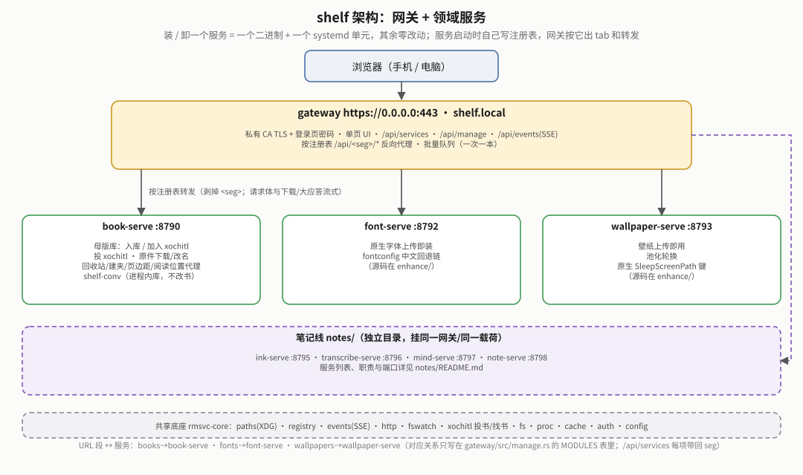
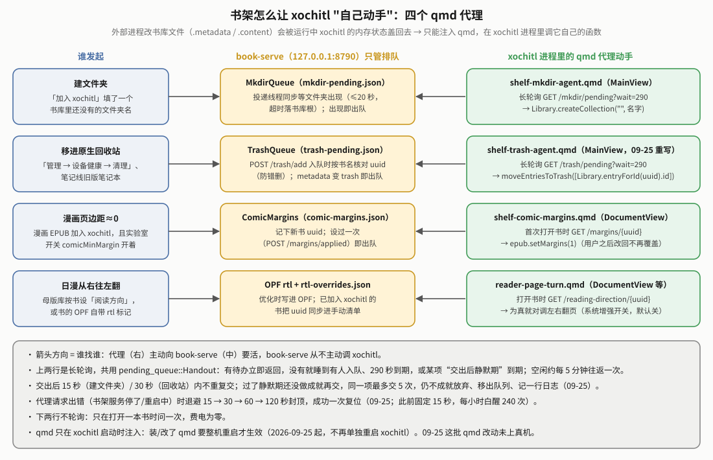
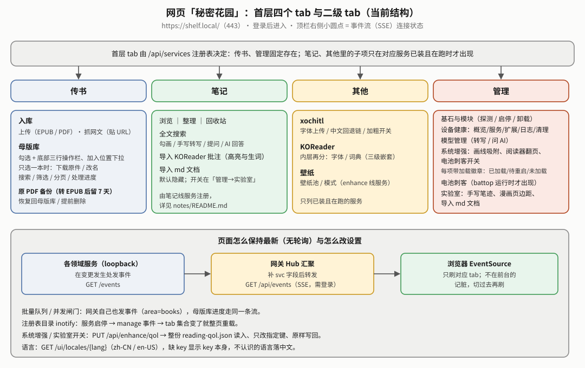
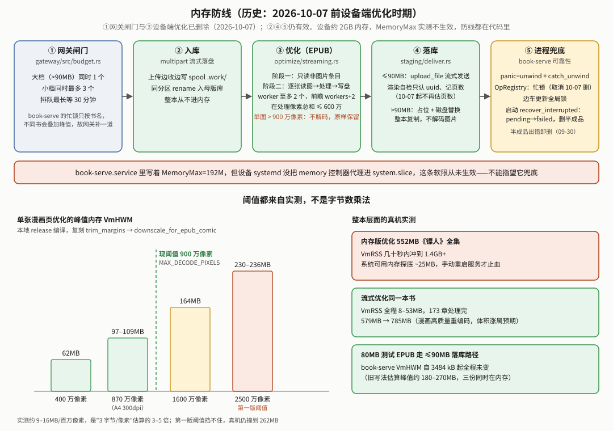

# reMarkable 书架（shelf）白皮书

> **读者与用途**：写给要维护、扩展或排查 shelf（书架：把书弄进设备、再加入设备自带的阅读器 xochitl）的人。本文管两件事：**现状**（开头「给新读者」「现状总览」+ 每章开头的「现状结论」）和**真机历史与坑**（当初为什么这么定、真机怎么验、踩过什么坑、哪些路判死了）。
> - 想 10 分钟看懂全项目：仓库根 [`docs/OVERVIEW.md`](../../docs/OVERVIEW.md)；想 5 分钟看懂书架：下面「给新读者」。
> - 每节标题里的 **§编号是稳定锚点**，别处写"见 §03bh"指的就是它，**编号不会变**；被后来决策取代的节已压缩成"结论 / 被取代 / 教训"，并进别节的只留一行"已并入 §xx"。
> - **"已部署"不等于"真机验证过"**：已部署＝装上设备、部署自检（`verify-on-device.sh`）通过、服务健康；真机验证＝那项功能在设备上实际走过一遍。文中两者分开写。
> - 文中引用的旧提交短哈希在 2026-10-09 仓库历史重写后已失效；要看已删代码或文档的旧版，用 `git log -- <路径>` 按路径找。

## 给新读者（5 分钟读懂）

**这是什么**：shelf 是跑在 reMarkable Paper Pro Move 上的一组网页服务。你用手机/电脑浏览器把书传进设备的**母版库**（永久保存原书的暂存池），再点「加入 xochitl」（设备自带阅读器）。字体和休眠壁纸也做成"上传即可用"。它**不修改 xochitl 本体，也不改书**：只用 xochitl 自带的网页上传接口、直接写它的书库目录，以及注入少量 qmd 界面补丁。书的优化（排版、注释、漫画处理）**不在这里做**：2026-10-07 起统一在电脑上用 [sheng-ren](https://github.com/bbq191/sheng-ren) 的 booklib 做。


**用户视角三步**（全书最重要的心智模型）：

| 步骤 | 做什么 | 关键约束 |
|---|---|---|
| ① 电脑上优化 | 用 sheng-ren 的 booklib 按 `xochitl` 阅读模式出 EPUB（不在本仓库） | 书架不检查书优化过没有，原样收 |
| ② 入库 | 网页上传 / scp 进 `inbox/`，**原样**落进母版库 | 只收 EPUB/PDF；没有"直投读器"的路径 |
| ③ 加入 xochitl | 复制母版字节进 xochitl（≤90MB 流式上传 / 更大的占位替换；走不了整本拒绝） | 母版永久保留，可反复加入 |

**现在能做什么**

| 能力 | 一句话 | 详见 |
|---|---|---|
| 入库 | 多文件上传带进度；scp 丢进 `inbox/` 写完自动收；同名同内容不重复存；文件名规范成 `书名 - 02卷` | 第 A 章 |
| 加入 xochitl | ≤90MB 普通上传；更大的走"占位 + 磁盘替换"，上限 1GiB；可选文件夹（不存在就请 xochitl 自己建）；记下渲染页数 | 第 C 章、§03bn |
| 批量 | 勾选多本，网关后台一本一本加、落盘续跑、可全部中止 | §03bp、网关白皮书 §04 |
| 母版库管理 | 只勾一本时下载原件、改名；删除；筛选 全部 / 未加入 / 已加入；剩余空间 <300MiB 标红 | 第 A 章、第 D 章 |
| 漫画页边距 | sheng-ren 优化的漫画带页边距标记，加入后首次打开自动把页边距设到最小 | 传书线架构 §3 |
| 直接导入 | 给电脑上的 sheng-ren 用：不进母版库，直接按多级文件夹放进 xochitl | 传书线架构 §9「直接导入」 |
| 字体 / 壁纸 | 上传即装的 xochitl 字体（改写中文回退链）；休眠壁纸池（写 xochitl 的 `SleepScreenPath` 键） | 第 F 章 |

**模块与端口**：网关 `gateway`（443，唯一对外）转发给只听本机端口的服务：`book-serve`（8790，母版库）、`font-serve`（8792）、`wallpaper-serve`（8793）；笔记线四个服务（8795–8798）挂在同一个网关上。book-serve 链接的读书工具库 `shelf/crates/shelf-conv`（读 EPUB 的书名 / 封面 / 漫画页边距标记、第三方 PDF 页数、占位文档、文件名规范化）只读不改书。服务表见 [`../README.md`](../README.md)「服务与端口」。



**名词小词典**（首次出现处也会再解释）：

| 词 | 意思 |
|---|---|
| xochitl | reMarkable 官方的界面 + 阅读器进程；书架不改它，只和它"握手" |
| qmd / qmldiff / xovi | 对 xochitl 界面（QML）打补丁的文件 / 工具；xovi 是加载这类补丁与扩展的机制 |
| 母版库 | `~/.local/state/shelf/books/staging/`，原书永久保存处（落库都从它出发） |
| 落库 | 把母版复制进阅读器的书库，现在只有「加入 xochitl」一种 |
| 边车（sidecar） | 每本书旁的隐藏小 JSON `.<书名>.delivered`，记"什么时候加入过、加入结果、渲染自检结果" |
| 占位 + 磁盘替换 | 绕开 xochitl 上传 100MB 上限：先传几 KB 占位让它建条目，再把磁盘上的文件换成真书（§03bn） |
| 渲染自检 / 预览 PDF | xochitl 导入 EPUB 时会渲染出 `<uuid>.pdf` 与页数；书架据此认出新文档、记页数（§03aa） |
| SSE | 服务端事件推送；网页据此即时刷新，不轮询（§03z） |
| OOM / VmHWM | 内存耗尽被系统杀进程 / 进程启动以来的内存峰值；设备内存约 2GB，是第 E 章主线（大头是当年设备上的优化） |

**同一件事只在一处写全**（书架文档之间的权威出处，别处只写一句并链过来）：

| 主题 | 权威出处 |
|---|---|
| 母版库状态、边车字段与文件名、锁、全部 API 与配置 | [`传书EPUB线架构.md`](传书EPUB线架构.md) §2.2、§7.3、§9 |
| 大文件"占位 + 磁盘替换"通道的机制 | 传书线架构 §6.1（真机数据在本文 §03bn） |
| 书该被优化成什么样（排版、注释、漫画）；xochitl 阅读器的实测踩坑 | **sheng-ren 仓库** `docs/typesetting.md`、`docs/xochitl.md`（不在本仓库） |
| 网关自身（登录、转发、批量队列、网页取数时机） | [`gateway/docs/reMarkable网关白皮书.md`](../../gateway/docs/reMarkable网关白皮书.md) |
| 以前设备上的优化与 PDF 转换（2026-10-07 删除）、KOReader 时期、第五轮审计清单 | [历史附录](reMarkable书架白皮书-历史附录.md)（原第 B 章各节、§03br、§03d、§03ar、§03bt、§03t、§03ad、§03bk、§03bu）；为什么不做了看本文 §03bw；代码与旧白皮书在 git 历史 |
| 已移除的能力（设备端优化、电脑端命令行、KOReader、按卷拆分、按书方向、漫画转 PDF） | 本文附录 B |
| 部署状态与真机待办 | 本文「现状总览 → 部署状态」与附录 §05 |


**本文的章**（§ 编号按时间分配，所以同一章里编号不连续）：

| 章 | 主题 | 包含的 § 节 |
|---|---|---|
| 0 | 定位、原则与基础 | §00 · §01 · §02 · §03 |
| A | 入库与母版库 | §03b · §03r · §03s · §03u · §03ao · §03ap · §03as · §03br |
| B | 优化管线（**历史**：2026-10-07 起书架不再优化书） | §03e · §03i · §03q · §03y · §03aq · §03av · §03aw · §03ay · §03az · §03bb · §03bc · §03bg · §03bo · §03bs · §03bv · §03bw · §03bx · §03by（后四节是 10-07 的决定、清理与代码审查修复，排在本章末尾） |
| C | 落库、大文件、漫画、xochitl 代理（含 KOReader 历史） | §03d · §03l · §03t · §03aa · §03ad · §03ar · §03bt · §03ax · §03be · §03bf · §03bk · §03bn |
| D | 网关与网页 UI | §03g · §03h · §03j · §03m · §03n · §03z · §03ac · §03ae · §03af · §03ah · §03aj · §03ak · §03al · §03am · §03an · §03au · §03bj · §03bl · §03bp |
| E | 稳定性、内存与耗电 | §03p · §03ab · §03ag · §03ai · §03ba · §03bh · §03bi · §03bm · §03bq · §03bu · §03bz |
| F | 设备、字体壁纸与固件 | §03c · §03f · §03k · §03o · §03v · §03w · §03x · §03at · §03bd |
| 附录 | 踩坑合集 · 旧版现状总览 · 待办 · 演进记录 · 已移除能力 · 目录与路径 · 旧 OTA 说明 | §04 · §00b · §05 · 附录 A–D |

读法：先看「现状总览」，再按主题跳到某章，先读章首「现状结论」和「坑位表」，需要来龙去脉再读 § 节。讲已移除能力的节（第 B 章 §03e–§03bv、§03br、§03d、§03ar、§03bt、§03t、§03ad、§03bk）和第五轮审计清单 §03bu 的正文在[历史附录](reMarkable书架白皮书-历史附录.md)，这里只留标题和一行链接；§03ao、§03as 并入附录 B，§03ap 只留结论。

## 现状总览（2026-10-09 刷新）

**服务与端口**：见上面「给新读者」与 [`../README.md`](../README.md)「服务与端口」。设备固件 **3.28.0.172**。**下表按 2026-10-09 的代码写**；和设备上现跑版本（10-07 部署）不同的地方在行内标"10-09，未部署"。

**当前有效的关键规则**

| 项 | 现状 | 详见 |
|---|---|---|
| 书从哪来 | 书在电脑上用 sheng-ren（booklib，`xochitl` 阅读模式）优化好再传；书架不检查、不改书 | §03bw |
| 收什么格式 | 只收 EPUB / PDF（`rmsvc_core::formats`）；其余一律拒收——策略收紧，不是技术判断 | 第 A 章 |
| 入库 | 网页上传、scp 进 `inbox/`；字节原样；同名同内容不重复存（09-28）；文件名规范成 `书名 - 02卷`（数字在前），**不改书里的 `dc:title`**；inbox 失败原因边车 `.reason` 原子写（10-09，未部署） | 第 A 章、§03bn |
| 改名 / 下载原件 | 只勾一本时出现；改名只改文件名（扩展名、书内书名不变）；下载全程流式 | 传书线架构 §2.4 |
| 剩余空间 | `GET /staging` 带 `freeBytes` 与 `lowSpace`（剩余 <300MiB；10-09 起由 book-serve 判，网页优先读它，未部署） | 传书线架构 §9 |
| 阅读方向 | **书架不管**（10-07 稍后，用户定，§03bx）：xochitl 不看 OPF 方向标记，日漫一律从左往右翻（用户接受） | 传书线架构 §2.5 |
| 加入 xochitl | ≤90MB 流式 `/upload` + 渲染自检（认出新文档的 uuid、记页数）；>90MB 走"占位+磁盘替换"（≤1GiB，整本；09-25 真机：156.5MB《乱马》首次打开约 74 秒渲染出 349 页）；走不了就整本拒绝。投到已被删的文件夹时落书库根（10-09 起；此前会落进上一本书的文件夹，未部署） | §03bn |
| 读 EPUB 的内存上限 | `shelf-conv::epub` 只读 container.xml、OPF、几页正文和一张封面；单条目解压上限按用途分开：文本 16MB、封面图 64MB（10-09；此前统一 256MB，超过 book-serve 自己的 192MB 内存上限，坏书会让它被 OOM 杀，未部署） | §03bz |
| 漫画页边距 | 书里带 sheng-ren 写的 `META-INF/eink-reader-margins` 时，加入后一律登记，首次打开由 qmd 代理设页边距 1（左右留白≈0）；不带标记的书不碰；没有开关 | 传书线架构 §3 |
| xochitl 代理 | 建文件夹、移进回收站、漫画页边距都靠注入 xochitl 的 qmd 代理完成（外部改文件会被盖回去）；前两个长轮询 `?wait=290`，同一项最多交 5 次、出错退避到 120 秒。回收站代理读不了 `.metadata`（比如 xochitl 正在改写）时不再把待删项当"已完成"移出队列，已 `deleted` 的条目入队被拒（10-09，未部署） | §03aa、§03bz |
| 建文件夹等待 | 落库前最多等 20 秒；10-09 起"先挂监听再查一次"（`fswatch::wait_for`），入队到挂上监听之间代理已经建好的不再白等满 20 秒（未部署） | 传书线架构 §4 |
| 批量与并发 | 批量队列在网关（只有「加入 xochitl」；顺序逐本、一本加完才取下一本、落盘续跑、可全部中止）；只有 book-serve 回报 `ok` 才算成功，结果不明一律记失败、提示去 xochitl 书库核对 | §03bp、网关白皮书 §04 |
| 中途停止 | 没有：剩下的投递没有安全中断点；批量「全部中止」只清还没开始的 | 传书线架构 §7.1 |
| 稳定性 | `panic="unwind"`+`catch_unwind`、`OpRegistry`（只剩忙锁，`try_guard` 返回离开作用域自动解锁的守卫）、启动时修正被中断的 `pending` | §03bq |
| 进程内并发 | 忙锁（按书名；加入、改名、删除互斥）、落名临界区（同名书不互相覆盖）、spool 锁（只管 inbox 追平）、边车写锁、xochitl 上传锁（"设文件夹 → 上传"成对）、大文件通道锁（"传占位 → 认领 → 替换"整段串行） | 传书线架构 §7.3 |
| 卸载 | `shelf-uninstall` 删了 qmd 时记"待生效"标记并提示整机重启（10-09；此前删了 qmd 却不提示，xochitl 里注入一直留到下次重启，未部署） | 第 F 章速查 |
| 让 qmd 改动生效 | **整机重启**（09-25 起）。不再单独 `systemctl restart xochitl`：xochitl 退出时自身有概率崩溃；xovi 已生效时**绝不**跑 `xovi/start` | 第 F 章速查 |
| 上传暂存与临时文件 | 书在 `books/.work/`；xochitl 字体/壁纸在 `~/.local/state/shelf/upload/`——都在 /home。母版库里的临时文件只剩跨分区入库中转 `.<pid>.<序号>.landing.tmp`，出错或 panic 当场删、启动再清一遍所有点前缀 `*.tmp` | 传书线架构 §2.2、§9 |
| 测试 | `cd shelf && cargo test --workspace`：2026-10-09 实跑 book-serve 98 + shelf-conv 27 个通过；`rmsvc-core` 131 个（另 1 个 ignored）、网关 62 个通过；网页 node 测试 13 项通过；浏览器冒烟通过；clippy 无告警 | §03bz |

**已砍/已被取代（别再找）**：网关并发闸门与行内"取消排队"、渲染自检的期望页数与 `warn`、sheng-ren `bookconv` 依赖、日漫翻页（10-07 稍后，§03bx）；`POST /staging/mark`、边车 `koreader` 字段、格式 `cbz` 单列（10-07 代码审查，§03by）；设备上的「优化」、入库 PDF 转换、原 PDF 备份、抓网文、联网补封面、旧产物兼容、中途取消、优化徽章与筛选（10-07，§03bw）；电脑端 `shelf` 命令行（09-18，附录 B）；KOReader 一切入口与 koreader-serve（09-29，附录 B）；超限书按卷拆分与按书设阅读方向（09-30，附录 B）；母版库"优化档位"与"投完自动删除"（09-19）；漫画"优化转 PDF"（09-19 做、09-20 换回 EPUB、09-30 代码删除）；三档格式（09-17/18 收成一档）；微信读书内容源（09-05）；bind-mount 壁纸（§03x）；`/inbox*` 与 `/staging/render/*` HTTP 接口（09-22 删，scp 进 `inbox/` 仍可用）；"restart xochitl 让改动生效"（09-25 改整机重启）。

**部署状态**（手测清单统一在附录 §05）

| 批次 | 部署 | 部署自检 | 功能手测 |
|---|---|---|---|
| 09-25 下午第四轮审计（半截书、丢页、二次转义、代理无限重试、大文件并发认领等二十多处） | 09-25 `install-all` | 43✓ 0✗ | 未逐项（§05 #17） |
| 09-30 三项减法（漫画 q95、撤按书方向、撤按卷拆分）、第五轮审计（§03bu）、KOReader 源码删除、第三方大 PDF 有界读页数、长书名边车短名 | 09-30 14:10 / 15:23，各整机重启一次 | 38✓ / 36✓，1⚠（刚开机）0✗ | 未（§05 #18、#19） |
| 10-07 书架不再优化书（§03bw）、稍后的清理（§03bx）、代码审查修复（§03by）、傍晚的直接导入多级文件夹 | 10-07 13:02、15:54、约 16:32（后两次整机重启） | 37✓；36✓ 1⚠ 0✗ | 未（§05 #22–#24） |
| **10-09 第六轮审计**（§03bz） | **未部署** | — | 未；只有开发机测试（§05 #25） |

**OTA（固件升级）后怎么恢复**：权威说明在 [`docs/INSTALL.md`](../../docs/INSTALL.md)「固件升级（OTA）之后」。

## 第 0 章 定位、原则与基础

> **现状结论**
> - 四条硬原则至今有效：XDG 基目录规范；设计模式去重解耦；专项专用可插拔（按领域拆服务）；不引用旧项目 crate、不对接旧路径（能力只许剥离移植）。
> - 架构是"网关 + loopback 领域服务 + 运行时注册表"：装/卸一个服务 = 一个二进制 + 一个 systemd 单元；网关按注册表出 tab、按 URL 段转发。

### 00｜定位与原则

2026-09-03 用户提出"全面重构，补齐短板增强优势"（KOReader、微信读书、多格式、字体与屏保上传即用）。其中微读线已砍（§03u）、"上传时手选目标"被母版库取代（§03r）、电脑端命令行已砍（附录 B）、只收 EPUB/PDF（第 A 章）。

四条硬原则（用户两轮驳回后定）：
1. **XDG 基目录规范**：路径表单一事实源是 `rmsvc_core::paths`；shell / qmd 用同一张表的缺省展开值，env 可注入测试。
2. **设计模式去重解耦**：资产上传 `AssetStore`/`AssetUploadFlow`（Repository + Template Method，四家共用）；领域模块 + 纯适配层（book-serve `staging/` 是领域、`api.rs` 只取参回执）；服务启动模板 `ServiceSpec`；配置模板 `config::load_or_default/seed/save`；Registry · Facade（`manage::MODULES`）· 单一事实源（`formats`、`fs::plain_name`/`unique_path`）；共享原语 `fs::write_atomic`、`multipart::receive_part_to`。**旧 crate 只许剥离 + re-export**。已退役：投递 Strategy / Pipeline（§03s，规则统一后没了调用方）、CLI 相关模式。
3. **专项专用可插拔**：不做单体，按领域拆服务。
4. **不引用旧项目 crate、不对接旧路径**：不读写 `/home/root/weread/**`。

### 01｜架构决策

**选 B：网关 + loopback 服务 + 注册表**（弃 A 每服务独立对外端口、C 单二进制编译期插拔）。
- 注册表放 `$XDG_RUNTIME_DIR`（重启即清）+ 读时按 `/proc/<pid>` 清陈旧条目。
- 代理**剥掉服务段**（`/api/fonts/x` → 后端 `/x`），后端直连与经网关同一套路由。
- 每请求一线程；**请求体流式透传；带长度的下载或 >256KB 应答流式、其余小应答整体缓冲**（§03ah；09-24 加）。
- （历史）`bookconv` 当年从旧 weread-device 抽成独立 crate；2026-10-07 随书架不再优化书删除（§03bw），同日稍后连 sheng-ren `bookconv` 的依赖也去掉，读 EPUB 改用 `shelf-conv::epub` 的最小实现（§03bx）。

### 02｜XDG 路径表

见附录 C「设备路径」。qmd 的 XHR 只能写绝对路径（缺省值展开 `/home/root/.local/share/shelf/fonts.json`）。

### 03｜systemd

`shelf.target`（WantedBy=multi-user）；服务 `PartOf=`/`WantedBy=shelf.target`；网关 `ExecStartPre=-…/lo-alias.sh`（让 10.11.99.1 常驻可达以便 `/upload`；源在 `enhance/lo-alias/`）；`ExecStartPre=-/usr/bin/fc-cache`（tmpfs 索引真重启后丢）2026-09-24 起挪到 font-serve 的单元里。`install.sh` 写 /usr 前实检 dm-verity。**不给 xochitl 加任何依赖**（改核心服务启动依赖曾导致变砖）。

## 第 A 章 入库与母版库

> **大白话导语**：本章讲"一本书怎么进到设备书架"。书先在电脑上用 sheng-ren 优化好，再**原样**放进**母版库**，之后加入 xochitl 是另外的独立动作。术语：**book-serve** = 管母版库的设备后台服务；**落库** = 把母版复制进阅读器的书库；**inbox** = "scp 丢文件就自动入库"的目录。§03b/§03r/§03s 是演进过程、§03ao/§03as/§03u 是历史，§03ap（抓网文）与 §03br（PDF 转换）2026-10-07 随设备端优化删除，也是历史。

> **现状结论**
> - 所有书**只落母版库**；入库与加入 xochitl 互相独立，母版永久保留。书架不改书（2026-10-07 起，§03bw）。
> - 入库来源两条：网页上传（多文件、有进度；同名同大小=已落地，跳过）、scp 进 `inbox/`（fswatch 监听，8 秒防抖；修改时间静止不足 5 秒的文件先不收，写完再收，09-25；失败项进 `failed/` 带 `.reason`，重试=人工拷回 `inbox/`，09-22 起无 HTTP 管理接口）。第三条「抓网文」2026-10-07 删除，网页链接用 sheng-ren 收书。
> - 格式只收 **EPUB / PDF**（`BOOK_EXTS` = `NATIVE_EXTS`）——策略收紧，不是技术判断。
> - 入库时文件名规范成 `书名 - 02卷`；同名同内容认已有那本（09-28），同名不同内容加数字前缀（`unique_path`），都不覆盖。
> - 加入 xochitl **异步**：HTTP 立即回"已开始"，结果靠边车 + SSE。
> - 只勾一本时可**下载原件**（全程流式）和**改名**（只改文件名，扩展名与书内书名不变）——2026-09-24 加，机制见传书线架构 §2.4。
> - 已删：PDF「优化」（有文字层转 EPUB、无文字层裁边、原 PDF 备份 7 天，§03br，10-07）；按书设阅读方向（09-30）。


#### 本章坑位表

| 坑 | 症状 / 根因 | 规避 | 见§ |
|---|---|---|---|
| （历史，优化 10-07 已删）"已优化"徽章说谎 | 无清洗的产物写了与完整优化同一标记 | 标记分层：`level`=full/core/old/none | §03r |
| inbox 绕过母版库 | `process_inbox` 是直投路遗留 | 规则审到**所有入口**；验证前先读防抖参数 | §03r |
| 剩余空间读错 | 早期解析 busybox `df -k`，设备名过长把数字换行 | 现改 `statvfs(2)` 一次系统调用，无子进程、无文本解析 | §03r |
| （历史，抓网文 10-07 已删）网文正文大片留白 | 白名单不留 class/style；图片夹正文的留白另有成因 | 「同步优化」必要不充分 | §03ap、§03aq |
| 上传超 100MB | xochitl `/upload` 硬上限 100,000,000 字节 | 缺省门 90MB + 占位替换通道 | §03bn |
| scp 大书传到一半就进了母版库（09-25） | scp 直接写最终文件名，8 秒防抖一到就被追平，写入方的文件句柄跟着 inode 继续写，母版库里是一本半截书 | 只收修改时间静止 ≥5 秒的文件，写完的事件再触发一轮（图见传书线架构 §2.1） | 传书线架构 §2.1 |
| 跨分区入库时列表里出现半截书（09-25） | 直接往最终名上拷贝，拷贝期间已可被操作 | 锁外先拷到点前缀临时文件，再同目录改名 | 传书线架构 §2.2 |
| （历史，10-07 已删）转换后原 PDF 只留 7 天 | 有文字层 PDF 转 EPUB 成功后，原 PDF 挪进母版库隐藏目录 `.pdf-originals/`，7 天后自动清 | 功能已删；旧设备上 `.pdf-originals/` 里剩下的文件不再自动清，需要时手动删 | §03br |

### 03b｜Phase 1 统一投递（2026-09-03，已被 §03r 取代）

仍有效的只有：spool 目录结构（`inbox/`、`.work/`、`failed/` 封顶 50MB 带 `.reason`）与 `book.json` 三个配置键（`xochitlHost`/`uploadTimeoutSecs`/`nativeUploadLimitMb`）。直投路（`POST /?target=`、Strategy/Pipeline）§03s 删除，现唯一入口 `/staging*`。**教训**：架构模式服务于当时的规则，规则变了就整块删，别留着当"以后可能用"。

### 03r｜读书线重构：中间层（母版库）三层架构（2026-09-05，用户"逻辑很乱"提出改造）

**问题**：一次背 3 维决策（读器×投递口×文件夹），"优化"与"落库"耦合。**方案**：入库 / 优化 / 落库三动作正交，中间夹**母版库**；所有源一律原样直传母版库。**关键设计：落库 = 纯复制原字节、不优化**，一本母版落两读器是同字节可对照（KOReader 09-29 卸载后只剩 xochitl）。

- **真机端到端（09-05）**：上传→优化→投 xochitl→（当时）adopt 进 KOReader（同字节）→母版保留；网文抓取（`bookconv::article`，scraper/html5ever musl 交叉编译通过）落母版库。
- **规则漏洞两处**：inbox 自动直投 → 改为原样落母版库；网文/格式转换产物"已优化"徽章说谎 → `marker_value` 分层，`StagingEntry.level` = full/core/old/none，非 full 仍给「优化」钮。
- **落库记录**：边车 `.<书>.delivered`（后扩 `render`/`optimize`/`source` 等字段）；`GET /staging` 带 `freeBytes`，<300MB 红字告警。
- **被取代**："收任意格式""优化档位""投完清除""电脑 shelf push""微读占位""清理已落库按钮"均已砍或被 §03bp 取代。
- **旧 PDF 重排教训（host 管线已砍）**：真机《财新周刊》整页空白的三根因＝每页一章、段落碎成行、图近整屏高；**先解剖产物再改**。

### 03s｜代码质量核查二轮：母版库领域化 · 直投路删除 · 上传模板统一（2026-09-05，用户"审视 shelf/ 合理用设计模式、去重、解耦"）

- **结论**：按"单一事实源 + 模板方法 + 门面"收：`rmsvc-core` 收 `formats`/`fs::plain_name`/`unique_path`/`http::bind`/`AssetUploadFlow`；book-serve 删 `target.rs`/`pipeline.rs`，母版库拆成 `staging/{mod,intake,library,optimizing,deliver}.rs`；koreader-serve 书只从母版库 adopt。真机通（jpg 拒收、adopt 同字节、旧路由 404/405）。
- **被取代**：当时的"格式三档"（原生/电脑可转/仅 KOReader）09-17/18 收成一档。
- **教训**：格式收紧是用户策略，"KOReader 技术上能读"不构成收的理由。

### 03u｜砍微读线（2026-09-05，用户"不做了，直接砍微读线"；范围只限书架）

- **结论**：微信读书官方网关只读没正文；正文要 web cookie（约 90 分钟过期）+ AGPL 派生解码；投入约两天、依赖第三方私有协议，用户决定不做。书架内容源现为三条：网页上传 / 抓网文 / scp inbox。
- **被取代**：`weread-serve` 槽位、入库页占位、目录表 weread 行都已删（`reading/` 下书栈已搬出仓库）。
- **教训**：协议脆弱是常量；若将来接"墨香管理"，先砍掉旧 `wr-serve` 内嵌在 `0.0.0.0:8778` 的上传页（与网关旧端口冲突只是巧合躲开）。

### 03ao｜`shelf push --no-calibre`：纯 EPUB 优化、跳过 Calibre（2026-09-10，已随 CLI 砍除，**已并入附录 B**）

### 03ap｜「抓网文」补「同步优化」复选框（2026-09-10，真机通；**已移除**：抓网文 2026-10-07 随设备端优化删除，§03bw）

当时网文在 xochitl 上大片留空，一部分原因是抓取只走核心遍、不注入外链 css（xochitl 只认外链 `.css`），于是加了"抓完紧接着跑同一个 `optimize`"的复选框；但"图片夹正文"造成的留白**没有实质改善**（真因是分页引擎，§03aq）。**教训**：修了一个真实缺口，不等于解决了用户的问题。网页链接现在用 sheng-ren 收书。

### 03as｜`shelf notes pull` 补 `config.toml` 的 `notes_vault` 配置项（2026-09-16，已随 CLI 砍除，**已并入附录 B**）

### 03br｜入库 PDF 的「优化」：有文字层按原格式转 EPUB / 无文字层只裁边（2026-09-19 起，2026-09-23 重做；**2026-10-07 删除**）

已移除或纯历史，细节见[历史附录](reMarkable书架白皮书-历史附录.md) §03br。

## 第 B 章 优化管线（历史：2026-10-07 起书架不再优化书）

> **大白话导语**：2026-09-03 到 2026-10-06，书放进母版库后可以点「优化」，`book-serve` 调 `bookconv` 库在设备上清洗、排版、处理图片。**2026-10-07 用户决定书的优化全部交给 sheng-ren 在电脑上做**（§03bw），本章因此整章是历史：留着是因为 xochitl 的 EPUB 渲染器闭源、行为反常识，这里记的"真机量出来的规矩"和排查方法仍有参考价值（规矩本身现在由 sheng-ren 的 `docs/xochitl.md` 维护）。读法：历史各节的正文都在[历史附录](reMarkable书架白皮书-历史附录.md)（《疯探》排查链是方法论样板）；本章只留 §03bw–§03by 三节现行决定与清理记录。

> **现状结论**
> - **书架不再优化书**（§03bw，10-07 已部署，功能未真机手测）：`POST /staging/optimize`、优化等级显示、联网补封面、旧产物兼容预处理、取消都删了；优化规则看 sheng-ren `docs/typesetting.md`，xochitl 阅读器踩坑看 sheng-ren `docs/xochitl.md`。
> - 同日早些时候的 §03bv（换成 sheng-ren 引擎、仍在设备上优化）没部署就被取代。
> - 母版库里以前被设备优化过（v16 及更早）的书照样能加入 xochitl，只是不再显示优化等级。
> - 当年的要点（留档）：只有一档"完整清洗 + 优化器两遍 + 图片处理 + 质量门（5 条硬规则，不过门原文件不动）"；排版规则写外链 `cangjie-wash.css`；脚注 `Anchor`；无扩展名章节按内容嗅探；封面两种声明同时写；内存靠流式两阶段 + 像素上限（第 E 章）。

#### 本章坑位表

两张坑位表与《疯探》排查链总览都是设备端优化时期的，已挪到[历史附录](reMarkable书架白皮书-历史附录.md)「第 B 章坑位表」与 §03av 之后；涉及 xochitl 行为的规矩现在记在 sheng-ren `docs/xochitl.md`。

### 03e｜Phase 4 原生高质量门 · Phase 5 微读 spike 脚本（2026-09-03，历史）

已移除或纯历史，细节见[历史附录](reMarkable书架白皮书-历史附录.md) §03e。

### 03i｜host 优化 vs 设备端优化：对标现状与移植计划（2026-09-03 傍晚，历史）

已移除或纯历史，细节见[历史附录](reMarkable书架白皮书-历史附录.md) §03i。

### 03q｜书籍优化深层优化：做精做细做强（2026-09-04，用户"只做精做细做强"）

已移除或纯历史，细节见[历史附录](reMarkable书架白皮书-历史附录.md) §03q。

### 03y｜xochitl CSS 引擎实测规则（2026-09-06，八轮"诊断 EPUB"量渲染缓存，3.28.0.172）

已移除或纯历史，细节见[历史附录](reMarkable书架白皮书-历史附录.md) §03y。

### 03aq｜真机排查"抓完优化还是大量留白"：wash 补 figure/figcaption 边距 + 证伪 + 找到真正成因（2026-09-10，真机 A/B 验证）

已移除或纯历史，细节见[历史附录](reMarkable书架白皮书-历史附录.md) §03aq。

### 03av｜书籍优化架构调整：拆 EPUB 线/PDF 线，EPUB 线四原则落地（2026-09-17，功能层真机验证）

已移除或纯历史，细节见[历史附录](reMarkable书架白皮书-历史附录.md) §03av。

### 03aw｜真机反馈第二轮：脚注撤回复核+异步优化真机全链路验证+防双击（2026-09-18，真机通）

已移除或纯历史，细节见[历史附录](reMarkable书架白皮书-历史附录.md) §03aw。

### 03ay｜第四轮真机反馈：落库改异步（补齐"投书按钮"防双击）、真书《疯探》坐实并修复"目录页被优化器吃掉"的老 bug（2026-09-18，真机通）

已移除或纯历史，细节见[历史附录](reMarkable书架白皮书-历史附录.md) §03ay。

### 03az｜第五轮真机反馈：《疯探》"没有 TOC"根因是 dtb:uid 不匹配……（2026-09-19，**标题结论已被 §03bc 证伪**，已并入上面「排查链总览」）

已移除或纯历史，细节见[历史附录](reMarkable书架白皮书-历史附录.md) §03az。

### 03bb｜《疯探》目录入口深度排查：二分定位到 content.opf，未锁定字段（2026-09-19，已并入上面「排查链总览」，终结于 §03bc）

已移除或纯历史，细节见[历史附录](reMarkable书架白皮书-历史附录.md) §03bb。

### 03bc｜《疯探》目录入口真正根因：反编译 xochitl 二进制坐实——硬编码死查 manifest `id="ncx"`，不走 `<spine toc="IDREF">`（2026-09-19，真机通，✅已解决）

已移除或纯历史，细节见[历史附录](reMarkable书架白皮书-历史附录.md) §03bc。

### 03bg｜优化也补真实分步进度（不是漫画专属），顺带确认这不能"实质省内存"（2026-09-19，真机通，✅已解决）

已移除或纯历史，细节见[历史附录](reMarkable书架白皮书-历史附录.md) §03bg。

### 03bo｜封面声明规则与无损补封面工具（2026-09-20，真机对照实验）

已移除或纯历史，细节见[历史附录](reMarkable书架白皮书-历史附录.md) §03bo。

### 03bs｜2026-09-23 EPUB 优化线一轮真机修复：无扩展名章节、注释样式、质量门接入 book-serve

已移除或纯历史，细节见[历史附录](reMarkable书架白皮书-历史附录.md) §03bs。

### 03bv｜2026-10-07 优化引擎换成 sheng-ren 的 bookconv（**未部署，同日被 §03bw 取代，已并入 §03bw**）

已移除或纯历史，细节见[历史附录](reMarkable书架白皮书-历史附录.md) §03bv。

### 03bw｜2026-10-07 书架不再优化书：只把 sheng-ren 优化好的书投进 xochitl（10-07 已部署、自检通过，功能未真机手测）

**决定**（用户，2026-10-07）：以后书的优化全部由 sheng-ren 做——电脑端工具 booklib，`xochitl` 阅读模式出 EPUB；它的 `docs/typesetting.md` 记排版规则，`docs/xochitl.md` 记 xochitl 阅读器踩坑。书架只负责把**已经优化好的书原样投进 xochitl**。


**删掉的**：

| 层 | 删掉 |
|---|---|
| book-serve 接口 | `POST /staging/optimize`、`POST /staging/cancel`、`POST /staging/fetch-article`、`POST /staging/originals/restore`、`…/delete`；列表的 `optimized`/`level`/`pdfSource` 与外层 `originals` |
| book-serve 内部 | `staging/optimizing.rs`、`cover_fetch/`（豆瓣 / Wikidata / 生成封面）、入库 PDF 转换、原 PDF 7 天备份、旧产物兼容预处理调用、`OpRegistry` 的取消标记、边车 `optimize` 字段（旧边车里的读时忽略） |
| shelf-conv | `pdf_ingest`、pdfwrite / pdfimg / pdf_epub、`legacy`；`profile` 依赖；整个 `pdf-extract-cj` crate |
| 网关 | 批量动作 `optimize`（旧 `batch.json` 里的读回时剔除）；闸门只拦 `staging/deliver` |
| 网页 | 「优化」按钮与优化等级 / PDF 来源徽章、「抓网文」卡片、「原 PDF 备份」面板、行内「停止」、"优化全部待优化"；筛选改成 全部 / 未加入 / 已加入（默认「未加入」，删"隐藏已完成"开关）；文案改成"书先在电脑上用 sheng-ren 优化好再传" |

**保留的**：上传 / scp inbox 入库（原样、同内容去重、规范文件名）、改名、删除、下载原件、加入 xochitl（含超 90MB 的占位 + 磁盘替换通道，最大 1GB）、建文件夹队列、渲染页数自检（`shelf_conv::stats`）、回收站代理、阅读方向接口、漫画页边距登记。shelf-conv 只剩 `pdfmeta`、`placeholder`（占位 PDF 改成手写的最小 PDF，不再依赖 pdfwrite）、`stats`、`naming`；依赖 sheng-ren `bookconv` 只为读 EPUB 的公开接口，不调用优化器。

**对用户的影响**：
- 漫画页边距只认 sheng-ren 产物里的 `META-INF/eink-reader-margins`，**并且不再有开关**：「实验室→漫画页边距」（`comicMinMargin`，默认关）删除，带标记的漫画加入后一律登记、首次打开设页边距 1，不带标记的书不碰；想要回 56 的首次打开后在阅读器里自己调回，每本只设一次；`reading-qol.json` 里旧键无人再读（用户追加拍板）。书架以前自己优化的漫画（v15/v16 的旧标记）不再认，要用 sheng-ren 重新优化后再上传、加入，才会自动设页边距。
- 母版库里设备上优化过的书照样能加入 xochitl，只是不再显示优化等级；网页母版库默认显示「未加入」，浏览器里记着的"已优化"筛选也回落到它；"隐藏已完成"开关与「未加入」重复，删掉。
- 普通上传时 xochitl 显示书里的 `dc:title`；以前「优化」会把带卷标记的书 `dc:title` 改成规范名，现在由 sheng-ren 决定（大文件通道的占位仍用规范名，传书线架构 §10）。〔同日稍后占位也改用书里的 `dc:title`，§03bx。〕
- 旧设备上 `staging/.pdf-originals/` 里剩下的备份不再自动清。

**验证**（开发机，2026-10-07）：book-serve 79、shelf-conv 24、gateway 75、rmsvc-core 108 个测试通过；网页 node 测试 10 项通过；clippy 0 告警；aarch64 交叉编译通过。浏览器冒烟（puppeteer）没跑——本机没装。〔之后：10-07 13:02 `deploy.sh --only book` 部署，部署自检 37✓ 0⚠ 0✗，功能未真机手测（附录 §05 #22）。上面"保留的"里的 `shelf_conv::stats`、`bookconv` 依赖与网关表里的"闸门只拦 `staging/deliver`"同日稍后也删了，§03bx。〕

**为什么这么定**（取舍）：
- 优势：优化规则只在 sheng-ren 一处维护，设备上不再解码、重编码大漫画（第 E 章那几次内存事故的根源整类消失），book-serve 少了取消协作、资源上限、兼容预处理、PDF 解析这些最复杂也最易出事的代码（这一步 shelf 目录净删约 1.6 万行；连同上午删掉本仓库 bookconv，整个分支 shelf 净删约 3.4 万行）。
- 劣势 / 风险：多了一步电脑操作，手机上没法直接"贴网址抓网文"或临时优化一本书；PDF 不再有"转 EPUB / 裁边"的选项；书架不检查书是否优化过，没处理的书照样投进去。
- 被取代的中间方案（§03bv，同日上午）：换成 sheng-ren 引擎、继续在设备上优化。换引擎后书架仍要维护设备资源上限、兼容预处理、PDF 转换、取消协作——与其适配，不如把优化整个交给 sheng-ren。

### 03bx｜2026-10-07 稍后：清理不再优化后剩下的东西（10-07 15:54 已部署并整机重启，部署自检 36✓ 1⚠ 0✗，功能未手测）

**起因**：§03bw 删掉设备端优化后，书架里还留着几样只为优化服务、或者已经没人读的东西：为了读 EPUB 借用 sheng-ren 的整个 `bookconv`、按字数估期望页数的渲染自检、网关的并发/内存闸门、几处旧数据迁移与网页上永远用不到的按钮和筛选。这一轮把它们清掉，不改加入 xochitl 本身的行为。最后用户又定：书架只管入库，翻页方向交给书本身，日漫翻页一并删掉。

**删掉 / 改掉的**：

| 层 | 内容 | 为什么 |
|---|---|---|
| 依赖 | 不再 git 依赖 sheng-ren `bookconv`；shelf-conv 新增 `epub` 模块（`shelf/crates/shelf-conv/src/epub.rs`）：读 container.xml/OPF、`dc:title`/作者/语言（`dc_text`、`title_of`）、封面图（声明的封面，没有就取前 12 个 spine 页里第一张图）、spine 翻页方向（`spine_is_rtl`）、sheng-ren 的漫画页边距标记（`READER_MARGINS_MARKER`、`reader_margins_of`），外加写占位 EPUB 的小 `EpubWriter` | 书架只用到这几样，`bookconv` 却连带拉进图片处理、网页正文抽取、HTTP 客户端等；`shelf/Cargo.lock` 309 → 214 个包，`cargo update -p bookconv` 不再有 |
| 书名规范化 | `canonical_book_name`（文件名规范成 `书名 - N卷`）连同测试从 sheng-ren `bookconv::naming` 复制进 `shelf_conv::naming` | 同上；代价见下面取舍 |
| 渲染自检 | 不再按正文字数估期望页数（中文每页 460 字、英文 960 字）、不再报 `warn`（`WARN_RATIO` 50%）；删 `shelf_conv::stats`；边车 `RenderCheck.expected` 字段删（旧边车里的读时忽略，旧 `warn` 记录网页按普通页数徽章显示）。状态只剩 `pending` / `ok` / `onopen`（大文件通道的 EPUB，首次打开才渲染）/ `timeout` | `warn` 主要抓的是设备上优化出错（如 §03aa 的双 id 吞整章）；书改在电脑上用 sheng-ren 优化，有它的质量门把关 |
| 大文件通道占位 | 显示名一律取书里的 `dc:title`，删 `has_volume_marker`（以前带卷标记时用规范名） | sheng-ren 已经写好规范书名，普通上传和大文件通道显示名从此一致 |
| 旧迁移 / 旧清单 | 删 `backfill_render_records`（每次启动都扫全库的一次性迁移）；不再读阅读方向旧手动清单 `rtl-overrides.json`（当时方向只看 OPF；随后日漫翻页整个删除，见下一行） | 迁移早已跑完；清单 09-30 起只读。删前核对设备上这份清单：15 个 uuid 都已不在 xochitl 书库里，删掉没影响任何现有的书；文件 10-07 当天已从设备删除 |
| 日漫翻页 | book-serve 删 `GET /reading-direction/{uuid}` 与 `reading_direction.rs`；shelf-conv 删 `epub_is_rtl` / `spine_is_rtl`；`shelf/xovi/reader-page-turn.qmd` 删日漫分支（`cjRtl`、开书查方向、`nextPageGesture`/`prevPageGesture` 里的滑动对调），**单击翻页 `tapPageTurn` 保留**；网关与网页删「日漫翻页规则」开关（`rtlPageTurn`，单独传它回 400，`/api/enhance/status` 不再返回）；`reading-qol.json` 里的旧 `rtlPageTurn` 键不清，无人再读 | 用户定：书架只管入库，翻页方向交给书本身。**后果（用户已知悉）**：xochitl 不看 OPF 的 `page-progression-direction`，日漫在 xochitl 里一律从左往右翻 |
| book-serve `GET /status` | 只回 `{ok, xochitlFolders}`；删 `uploadReachable`（xochitl 不在时每次刷新白等 3 秒）、`nativeUploadLimitBytes`、`spool`；状态缓存只在加入 / 直接导入后失效（文件夹会变），inbox 追平不再让它失效 | 网页从来不读这三项；rmsvc-core 的 `Xochitl::reachable` 随之没有调用方，删掉 |
| 网关闸门 | 删 `gateway/src/budget.rs`、`/api/budget/status`、`/api/budget/cancel`、`proxy.rs` 里的闸门分支、`budget` 事件；"等这本书处理完"的轮询（`poll_until_settled`，`books_wake` 事件驱动、`MIN_REQUERY` 5 秒、连续失败 6 次才放弃、上限 1 小时）从 `proxy.rs` 挪进 `batch.rs` | 网页的「加入 xochitl」只走批量队列，队列本来就一本处理完才取下一本；加入是流式上传，book-serve 只多占几 MB；闸门"内存峰值≈文件体积"的前提来自设备端优化 |
| 批量队列 | 删 `attempts`/`MAX_ATTEMPTS`（被打断的当前那本一律放回队首，不再"连续打断两次记失败"）；删 `parse_saved`（读回时剔除旧 optimize/koreader 任务的迁移，现在严格按当前格式读，文件坏了＝当作没有未完成的队列）；删不会再出现的 `cancelled` 分支 | 网关不读书的内容，不可能是崩溃元凶，防崩溃循环的计数没有意义 |
| 网页 | 删行内「取消排队」及两条提示、「排队等待并发名额…」、页头「⏳ 排队 N 本 · 处理中 M 本」（`#stgnotice`）、渲染徽章「⚠ 只渲染 N 页 / 预期≈M」、格式筛选「其它」（只有 EPUB/PDF）、cbz 残留、进度条的百分比分支（`renderBusy` 只剩不确定态）；母版库行内从此没有按钮；修正母版库说明 `transfer.staging.optNote`（还写着要开「实验室→漫画页边距」，开关同日早些时候已删）为"带标记的漫画加入后首次打开会自动把页边距设到最小"；语言包每种 474 → 465 个键（删 9 个；随后删日漫翻页再删 `manage.enhance.pageTurn.rtlToggle`、`rtlHint` 两个、`pageTurn.desc` 改成只说单击翻页，最终 463）；删没用的 CSS（`.crumb`、`.stg-actions`、`.stgbar-count`、`.stg-root`）；母版库三档刷新请求数 2/3/4 → 1/2/3 | 都只服务于已删的闸门、`warn` 或格式 |

**对拍**：本地 107 本 EPUB，新 `shelf-conv::epub` + `naming` 与 `bookconv` 对比书名、封面（扩展名与字节）、翻页方向、规范名，全部一致（翻页方向这部分代码随后随日漫翻页删除）。

**qmd 离线验证**（`reader-page-turn.qmd`，未上真机）：从设备 .172 的 xochitl 二进制解出真实 QML，`qmldiff apply-diffs` 三个 AFFECT 都应用上；新旧补丁的输出逐文件对比，差异正好是删掉的日漫代码；qmllint 无语法错误，告警数下降（DocumentView 602→599、SceneViewGestures 180→173、DeviceSceneView 92→92）。

**保留的**：渲染自检本身（普通上传 `/upload` 不回 uuid，只能靠它按 `dc:title` / 文件名 stem / 最新一本认出新文档，登记漫画页边距要 uuid）；批量队列的落盘续跑与「全部中止」；`OpRegistry` 忙锁；大文件通道的占位（`placeholder`）与第三方 PDF 页数（`pdfmeta`）。

**取舍：复制两处常量 / 规则，而不是继续依赖 sheng-ren**：
- 优势：`shelf/Cargo.lock` 少了 95 个包，编译和交叉编译都轻，不会因为 sheng-ren 加了图片 / 网络依赖而跟着变；书架用到的读 EPUB 逻辑只有几百行，自己维护得动。
- 劣势 / 风险：**两边会漂**。`READER_MARGINS_MARKER`（`META-INF/eink-reader-margins`）必须和 sheng-ren 的同名常量一致，sheng-ren 改名后书架就不再认漫画、不自动设页边距；`canonical_book_name` 的规则 sheng-ren 改了，书架入库的文件名规则就和它不一致。两处都没有自动检查，只在代码注释里写明"必须与 sheng-ren 一致"。对拍是一次性的，以后 sheng-ren 改了要重新对一次。

**验证**（开发机，2026-10-07，实跑；含删日漫翻页之后）：book-serve 81、shelf-conv 27、gateway 61、rmsvc-core 108（另 1 个 ignored）个测试通过；网页 node 测试 locales 4 / net 3 / xss 3 项通过；浏览器冒烟（`gateway/ui/test/smoke.puppeteer.mjs`）通过。之后 10-07 15:54 部署并整机重启，功能未手测，手测项见附录 §05 #23。

**已知没改的**：`shelf/xovi/shelf-comic-margins.qmd` 第 6 行注释还指向已删的"bookconv 白皮书 §20"。改 qmd 下次部署就要整机重启，只为一行注释不值得，留着。〔同日稍后的代码审查（§03by）已改掉：本分支反正要因 `reader-page-turn.qmd` 整机重启一次，顺手把这处和"实验室开关"两处过时注释改了；`qmldiff apply-diffs` 输出与改前逐字节相同。〕

### 03by｜2026-10-07 再稍后：代码审查修复（与 §03bx 同批 10-07 15:54 部署，功能未在真机上手测）

**起因**：§03bx 清理完后对书架、网关、基座、网页做了一轮代码审查，找出几处会出错的地方，顺手把重复代码合并。下面按"修的 bug → 效率 → 合并 / 删除"列，网关和网页那部分的细节在网关白皮书（§02、§04、§05、§06），这里只记书架这边要知道的。

**修的 bug**：

| 问题 | 以前 | 现在 | 代码 |
|---|---|---|---|
| 直接导入的原地替换留半成品 | 请求体直接写在书库里的 `<uuid>.epub.new`；进程被杀时最大 1GB 的半成品一直留在书库，启动清理只管 `import-tmp/` | 先落 `import-tmp/`（与书库同在 /home 分区）再 rename 进书库 | `import.rs` |
| 原地替换重设漫画页边距 | sheng-ren 每次同步替换都重新登记页边距，用户在阅读器里调过的被覆盖 | 替换不再登记，每本只在首次加入时设一次 | `import.rs` |
| 加入后改名卡在「渲染中」 | 渲染自检线程按旧名找书，改名后找不到，一直显示渲染中直到重启 | 改名时边车里还在 `pending` 的渲染自检直接收成 `timeout`（网页显示「未见渲染」） | `staging/library.rs` |
| 建文件夹白等 | 入队时文件夹刚好已经建出来（`mkdir.add` 回 0）也进 `watch_until`，没有新事件就白等满 20 秒 | 已出现就不等 | `staging/deliver.rs` |
| 批量把结果不明记成成功（网关） | 只认 `failed`；等满 1 小时、book-serve 连续查不到、条目途中消失、仍 `pending` 都记成功 | 只有 `delivered.deliver.status=ok` 算成功，其余记失败并提示"请到 xochitl 书库里核对" | `gateway/src/batch.rs` |
| 慢网大文件被截断（网关） | 代理设 900 秒整请求时长 | 只设空闲超时（连 3 秒 / 读 900 秒 / 写 120 秒） | `gateway/src/proxy.rs` |
| 母版库筛选计数加不拢（网页） | 正在处理、加入失败的书既不算「已加入」也不算「未加入」 | 「未加入」＝「已加入」的补集 | `gateway/ui/app.js` |

**效率**：直接导入认领新文档改成书库目录事件驱动（`fswatch::watch_until`，防抖 500ms；以前每 200ms 扫一遍书库，最长 120 秒）；shelf-conv 新增 `epub::Book`，一本书只解一次 zip，书名、封面、页边距标记都从它取（以前落库开 2 次、大文件通道开 3 次）。

**合并重复 / 删除**：

- `OpRegistry::try_guard` 返回 RAII 忙锁，改名、删除、落库、替换统一用它（以前各处手写加锁解锁，改名要配对解两把）。
- 临时文件守卫与取名合成 `scratch::ScratchFile`，母版库中转和直接导入共用。
- 大文件通道"造占位 → 上传 → 替换 → 登记页边距"合成 `Staging::upload_large`，落库和直接导入共用；漫画页边距登记不再写四遍。
- 读 `.metadata` 用基座的 `rmsvc_core::xochitl::read_metadata`（回收站代理、直接导入共用）；母版库剩余空间用基座的 `rmsvc_core::fs::fs_space`（与网关设备健康同一份 statvfs），book-serve 去掉 `libc` 直接依赖。
- 删无人调用的 `POST /staging/mark` 与边车 `koreader` 字段（旧边车里的当未知字段忽略）；格式 `cbz` 并入 `other`；`epub_placeholder` 不再收书名参数（一律取书里的 `dc:title`）；`GET /trash`、`GET /mkdir` 注明只供调试。
- `shelf-comic-margins.qmd` 只改注释（"实验室开关"与已删白皮书的引用），`qmldiff apply-diffs` 输出与改前逐字节相同，§03bx 记的"已知没改"就此了结。

**取舍**：

- 批量"只认 `ok`"——优势：网关没看到结果时不再报喜，用户不会以为书已经进去了；劣势：书其实加进去了、只是网关没等到结果（book-serve 重启、超时）时会多一条"失败"。所以失败原因写成"请到 xochitl 书库里核对"，不让人直接重加，免得书库里出现两本。
- 原地替换不重设页边距——优势：用户在阅读器里调回的页边距不被每次同步覆盖；劣势：如果 sheng-ren 的新版本改了页边距标记的值，已有的书不会跟着变，要删了重新导入。

**验证**（开发机，2026-10-07 实跑）：book-serve 81、shelf-conv 26、gateway 62、rmsvc-core 109（另 1 个 ignored）、笔记线 workspace 240、font-serve 10、wallpaper-serve 11 个测试通过；网页 node 测试 locales 4 / net 3 / xss 3 项通过；浏览器冒烟通过；clippy 无告警。aarch64 release：book-serve 3,580,056 字节、gateway 3,014,872 字节、ink-serve 2,768,912 字节。之后 10-07 15:54 部署（`deploy.sh --only book,ink` + 整机重启），部署自检 36✓ 1⚠（刚开机）0✗，功能未在真机上手测，手测项见附录 §05 #23。

## 第 C 章 落库、大文件、漫画、xochitl 代理（含 KOReader 历史）

> **大白话导语**：**落库**＝把母版库里的书放进阅读器，现在只有「加入 xochitl」一种，走它的网页 `/upload` 接口。本章回答：书怎么进 xochitl（含超 100MB 的大文件）、文件夹和回收站怎么操作（只能请 xochitl 自己动手）、落完怎么知道"渲染没坏"、漫画有哪些特殊处理。§03t、§03ad、§03bk 是被推翻的历史，只读结论；§03d、§03ar、§03bt 是 KOReader 卸载前的历史，只留教训。

> **现状结论**
> - **加入 xochitl**：≤ `nativeUploadLimitMb`（缺省 90MB）走流式 `/upload` + 渲染自检；超限走**"占位 + 磁盘替换"**（≤1GiB，整本，§03bn；09-25 真机 156.5MB 通过）；本机无书库目录、超 1GiB 或造不出占位时整本拒绝，回执末尾"没有加入"。按卷拆分（漫画 EPUB / 带书签漫画 PDF）**2026-09-30 已移除**（附录 B）。
> - **为什么是 90**：真机二分测出 xochitl `/upload` 硬上限是 **100,000,000 字节**；此前的 150MB 是没验证过的猜测。
> - **xochitl 代理**：外部进程改书库文件会被运行中的 xochitl 盖回去，所以建文件夹、移进回收站、漫画页边距都由注入 xochitl 的 qmd 代理动手（日漫翻页 10-07 稍后删除，§03bx），book-serve 只排队（下图，§03aa）。文件夹留空＝书库根；填了不存在的名字由代理调 `Library.createCollection` 真建（最多等 20 秒）；名字带 `/` 合法。同一项最多交给代理 5 次，还做不成就放弃，记日志并在网页页头横幅提示（点「知道了」清空）；代理请求出错时退避 15→120 秒（09-25 第四轮审计，当天已部署；放弃与退避路径平时难触发，没在真机专门走过）。
> - 「加入 KOReader」2026-09-29 随 KOReader 卸载撤掉（附录 B）；「已完成」现在只认加入过 xochitl，以前只加入过 KOReader 的书会回到「待处理」。
> - **批量加入**（09-25 真机）：网页一次勾两本《乱马》11/12 卷（156.5 / 157.1MB）加入 xochitl，网关队列 `done 2 / failed 0`，落进同一文件夹、字节与母版一致。
> - 漫画：书架不再处理漫画图片（2026-10-07，§03bw），漫画由 sheng-ren 优化成 EPUB；书架只在书里带 sheng-ren 的 `META-INF/eink-reader-margins` 标记时一律登记首次打开设页边距 1（没有开关，实验室开关 10-07 删除；传书线架构 §3）。历史：09-19 一度改产 PDF（§03bk），09-20 换回 EPUB；`comic_pdf.rs` 09-30 删除；PDF 仅裁边 10-07 随 PDF 转换删除。




#### 本章坑位表

| 坑 | 症状 / 根因 | 规避 | 见§ |
|---|---|---|---|
| 传书 WiFi"卡死"，传字体不卡 | xochitl 每导入一本就同步到云（约 2–3MB/本），占满弱热点上行 | 大书走 USB（`https://10.11.99.1`） | §03l |
| 整章渲染失败无人察觉 | 同标签双 id → 严格 XML 吞整章 | 当年：落库后比"实际/期望页数"，<50% 报 warn；10-07 稍后删除（书在电脑上由 sheng-ren 的质量门把关），现在只记页数 | §03aa、§03bx |
| 外部进程改 `.metadata` / 建文件夹 | 被运行中 xochitl 内存态覆写 | 只走 xochitl 自己的代码路（qmd 注入调它的函数） | §03aa · §03be |
| 网页"移到回收站"不执行 | 旧代理挂在当前文件夹视图上；第一版重写又把 uuid 字符串当 id 传（日志 `moving "" to trash`） | 注入 MainView + 长轮询；id 用 `Library.entryForId(uuid).id` | §03aa |
| 进度条不动要手动刷新 | 写了边车没推事件 | 状态落盘后紧跟一次事件推送 | §03be |
| 带斜杠文件夹名建不出 | 无依据的校验 + 静默放弃 | 校验要有技术依据；用户的失败样本先复现 | §03bf |
| 代理对做不成的项无限重交（09-25） | xochitl 拿不到条目但 `.metadata` 还在时，每个静默期交一次、代理每次失败写一行日志 | 同一项最多交 5 次；长轮询在静默期到期时就醒来重交 | 传书线架构 §4 |
| 两本大 PDF 同时投，一本写进了别人的条目（09-25） | 大文件通道按"新条目 + 大小等于占位"认领，PDF 占位字节都一样 | 传占位到替换完成整段串行 | 传书线架构 §6.1 |
| （历史，分卷 09-30 已移除）超限拆分后封面、扉页不见了（09-25） | 第一份从 NCX 第一条算起，目录前的页不属于任何一份；百分号编码的图片路径对不上条目，整页被丢 | 第一份从第 0 页算起；`src` 先解码再对条目名 | 当时的传书线架构 §6.2（随分卷删除，见 git 历史） |
| 连传多份分卷冲垮 xochitl（分卷 09-30 已移除） | 每卷渲染 15–30 秒 | 等真渲染出页数再传下一份 | §03ax |
| （历史，分卷 09-30 已移除）拆出的漫画卷四周留白 | 拆分包无 CSS；`height` 类 CSS xochitl 一律不认 | 外链 `comic.css` + 补白图片像素 | §03ax |
| 占位替换后名字/封面不对 | xochitl 用占位的书名与封面，替换后不补生成 | 占位必须带真书名和真封面 | §03bn |
| 日漫在 xochitl 里翻页方向反了 | xochitl 不看 OPF 的 `page-progression-direction`；calibre 转出的日漫 OPF 多半还没写 `rtl` | 09-24～10-07 靠 `reader-page-turn.qmd` 的日漫分支按 OPF 或手动清单对调；09-25～09-29 还能母版库按书设方向（09-30 移除）。**10-07 稍后日漫翻页整个删除**（用户定，§03bx）：日漫一律从左往右翻，已接受 | 传书线架构 §2.5 |
| 漫画降灰阶后体积反涨 | 抖动位图高熵，压不动 | 降灰阶省的是刷新闪烁，不是体积 | §03t · §03ad |
| 用渲染缓存验目录 | 缓存 `<uuid>.pdf` 从不带书签 | 目录从 EPUB 的 ncx/nav 或 `.epubindex` 验 | §03aa |
| （历史，KOReader 09-29 已卸载）照网上模板改配置不生效 / 漫画设置对旧书无效 / 剩余时间 N/A | 模板键名 KOReader 根本没有；文件夹默认只在首次打开写入；「统计」插件被禁用 | 先在设备上的 KOReader 源码里核键名（可迁移的教训）；「重置设置」后重开；启用统计插件 | §03bt |

### 03d｜Phase 3 KOReader 配置即代码（2026-09-03；2026-09-29 随 KOReader 卸载退役，源码 09-30 删除）

已移除或纯历史，细节见[历史附录](reMarkable书架白皮书-历史附录.md) §03d。

### 03l｜"传书就卡、传字体不卡"根因＝reMarkable 云同步（2026-09-04，用户报 + 真机复现坐实）

**坐实**（每秒读网卡收发字节 + 数远端 443 连接）：每导入一本书＝入站 100–460KB → 紧接出站 800–1900 KB/s 持续 2–3 秒——**xochitl 把书连同渲染缓存同步到云**，占满电脑热点（Intel AX 网卡跑 AP，约 5Mbit/s）的上行。字体不是文档、不同步，所以不卡。设备 ping 电脑不丢包＝设备与 shelf 无辜。
**修法（不改代码）**：传书走 USB（推荐）/ 换真路由器。

### 03t｜漫画通道：AZW3 漫画 → CBZ + 固定版式 PDF（2026-09-05，用户"AZW3 漫画该怎么转 / 镖人为何投不了原生"）

已移除或纯历史，细节见[历史附录](reMarkable书架白皮书-历史附录.md) §03t。

### 03aa｜投原生后的渲染自检（2026-09-06，3.28.0.172 真机）

**依据**：xochitl 导入 EPUB 时**同步渲染**，`<uuid>.content` 里有 `pageCount`，旁边有渲染缓存 `<uuid>.pdf`。
**做法**（`render_check.rs`）：投书前流式算正文字符数，期望页数＝字符数 ÷ 每页字符数（中文 460、英文 960，两本真书 0.99 吻合）；按创建时间 + 书名认新文档；限时监听书库目录（3 秒防抖、10 分钟超时，结束即撤）；`pages < expected × 50%` → `warn`。结果写边车 + 推 SSE，网页徽章「渲染 N 页」/「⚠ 只渲染 N 页」。
**真机**：好探针 25/29 ok，坏探针（3 章双 id）10/29 warn。09-23 这套自检**第一次抓到真问题**：T.E. 只渲染 1 页（§03br）。
〔2026-10-07 稍后：期望页数与 `warn` 删除，自检只认 uuid、记页数、登记漫画页边距（§03bx）。〕
**xochitl 代理**（四个，见章首图；队列表与接口见传书线架构 §4）：

- **原生回收站**（`shelf-trash-agent.qmd` + `trash.rs`）：软删只能走 xochitl 自己的代码路；入队按书名核对 uuid（错 uuid＝错删别的书）；只进回收站、可恢复。调用方：网页「管理 → 设备健康 → 清理」、笔记线挪走旧版笔记本。
  - **2026-09-25 重写**：旧版注入 Sidebar、等书库视图变化才拉队列、用当前文件夹的选择集执行——网页入队后不翻书库就不执行，书不在当前文件夹也加不进去（真机：《告白》《白夜行》在「好读精校」里一直没动）。现改为与建文件夹代理同构：注入 MainView、长轮询 `GET /trash/pending?wait=290`、调 `LibraryController.moveEntriesToTrash(ids)`。真机通。
  - **坑**：`ids` 必须是 `Library.entryForId(uuid).id`（真 `entry::Id`）。第一版直接传 uuid 字符串，xochitl 日志是 `moving "" to trash`——静默空操作，没删错也没删成。
- **原生建文件夹**（`shelf-mkdir-agent.qmd` + `mkdir.rs`）：反编译得出建夹走裸全局单例 `Library.createCollection(parentId, name)`（不是 `LibraryController`）；锚点选 `MainView.qml`（Sidebar 没 import 该模块）。触发方式从 8 秒定时轮询（09-22 前）→ 25 秒长轮询 → 09-24 放宽到 290 秒（真机约 280 秒无 `transfer timeout`），空闲约每 5 分钟往返一次。两条长轮询共用 `pending_queue::Handout`。
  - **09-25 第四轮审计（当天已部署；放弃与退避路径没在真机专门触发过）**：长轮询在某项"交出后静默期"到期时也醒来重交（此前要等满 290 秒，落库等建文件夹只等 20 秒，重试永远赶不上）；同一项最多交 5 次，交满仍没做成就移出队列、记日志（此前无终止条件，做不成的回收站项每 30 秒重交一次、永不停止）；两个 qmd 出错时退避 15→30→60→120 秒（此前固定 15 秒，书架服务不在时每小时白醒 240 次）。规则表见传书线架构 §4。
- **漫画页边距**（`shelf-comic-margins.qmd`）：不轮询，打开书时问一次 book-serve；见传书线架构 §3。（**日漫翻页**〔`reader-page-turn.qmd` 开书问 `GET /reading-direction`〕10-07 稍后删除，§03bx；同一 qmd 的单击翻页保留，系统增强线白皮书 §03i。）

**已砍 host 能力的结论**：`doctor --render` 实测缺省字号 12.05pt 下续段缩进 14.27pt＝1.184em；漫画 16 灰省刷新档让翻页明显少闪（171→108MB）。

### 03ad｜漫画跨页拆分 + 白边裁切放大 + 小体积漫画可选投原生（2026-09-08，host 管线已砍）

已移除或纯历史，细节见[历史附录](reMarkable书架白皮书-历史附录.md) §03ad。

### 03ar｜koreader-serve 高亮/生词只读端点与手写 SQLite 解析器（2026-09-16；2026-09-29 随 KOReader 卸载退役）

已移除或纯历史，细节见[历史附录](reMarkable书架白皮书-历史附录.md) §03ar。

### 03bt｜KOReader 文字书 / 漫画两套阅读方案（2026-09-24 真机通；2026-09-29 KOReader 卸载，本节只留教训）

已移除或纯历史，细节见[历史附录](reMarkable书架白皮书-历史附录.md) §03bt。

### 03ax｜第三轮真机反馈：脚注返回浮标已有解、裁边真机核实无误、超限漫画按卷拆分投原生（2026-09-18，真机通；分卷 2026-09-30 已移除）

- **脚注返回**：原生"返回"浮标在内部链接跳转后都会出现（已延到 20 秒）——§03aw 写成"已知限制"不准确，更正。
- **《火影忍者》未裁边**：页面本来贴边，`trim_margins` 正确识别无可裁。
- **超限漫画按卷拆分**（2026-09-30 已移除）：`comic_split` + `try_deliver_split`；真机 281MB 7 卷合集拆 8 份全部上传。拆分卷四周留白＝拆分包无 CSS → 外链 `comic.css`；后逐像素证实 xochitl 对 `height`/`max-height` 一律不认，改为把图片像素补白成设备页面比例。
- **被取代**：拆分规则后改为"只切第一层 + 单卷仍超按页再切"，09-20 起超限优先走占位通道，**09-30 按卷拆分整个移除**（`comic_split`、`try_deliver_split` 已删），超限只走占位通道。

### 03be｜落库进度条不刷新 + 「加入 xochitl → 文件夹」填名不建文件夹：两条独立反馈，一条补事件推送、一条复活死代码（2026-09-19，真机通，✅已解决）

- **进度冻结**：拆分投递写了边车没 `bus.publish` → 每完成一份推一次事件。
- **文件夹不建**：`strings` 坐实 xochitl 网页接口只有 `/documents/`、`/upload`、`/download`、`/thumbnail`，**没有建文件夹**；09-07 写过、09-15 被当死代码删的 `mkdir.rs` + qmd **原样捞回**；`ensure_folder` 同步等代理建好（20 秒超时则落书库根）。真机 8 秒内建出、测试文档 `parent` 指向它——`createCollection` 调用链第一次真机交叉验证。
- **教训**：从删除提交找回已完成反编译分析的死代码，比重来快且可信。

### 03bf｜§03be 跟进：《乱马1/2》文件夹名带斜杠被误拒，`ensure_folder` 静默放弃（2026-09-19，真机通，✅已解决）

- **根因**：`MkdirQueue::add()` 的"不能带路径分隔符"校验没有技术依据（名字全程只当 `visibleName` 字符串用），`ensure_folder` 对错误静默放弃。删掉校验，只留"非空"。用户同名重试"已正常"。
- **教训**："机制没问题"≠"用户这次操作没问题"；用户带具体失败样本回来时，先假设这个输入有特殊性。

### 03bk｜漫画 EPUB 优化改产出带书签 PDF，根治左右留白硬限制（2026-09-19，真机通，✅已解决）

已移除或纯历史，细节见[历史附录](reMarkable书架白皮书-历史附录.md) §03bk。

### 03bn｜大文件"占位 + 替换"通道与统一命名规则（2026-09-20，真机验证过 PDF 154MB / EPUB 153MB）

**做法**：`book-serve` 在设备上能直接写 xochitl 书库目录，所以只让网页接口传一个**占位文档**建好条目，再把磁盘文件原子替换成真书。六步流程与适用条件见传书线架构 §6.1，图见 [`upload-limit-bypass.svg`](../../docs/diagrams/upload-limit-bypass.svg)。

**关键决策**：超限走占位通道（≤1GiB，整本），走不了就整本拒绝（09-20～09-29 这里还会退回按卷拆分，09-30 移除）；PDF 要先读出真页数写进 `.content`，09-30 起第三方 PDF（交叉引用流、对象流）也读得出（当时在 `bookconv::convert::pdfmeta`，10-07 起是 `shelf_conv::pdfmeta`，传书线架构 §6.1）；**占位已上传后才出的错直接报错**（分卷还在时是为了不退回分卷、免得书库留重复）；EPUB 首次打开才渲染，徽章记 `onopen`，页数一变自动转正。
**真机坑**：xochitl 用占位的书名与封面、替换后不补生成 → 占位必须带真书名和真封面。
**>153MB 首次渲染（2026-09-25 真机）**：《乱马》11 卷（156.5MB）经占位通道投入后第一次打开，约 74 秒渲染完，`pageCount` 2→349、写出 `.epubindex`；同时日漫翻页（`CJ-PAGE-TURN: rtl book`）与漫画页边距（`CJ-COMIC-MARGIN: margins -> 1`）生效；xochitl 主进程 VmHWM 410MB、没有重启。**仍没量到**：渲染在 xochitl 另起的工作进程里做，它的内存峰值。

**统一命名规则**（当年在 `bookconv::naming`；现在是 `shelf_conv::naming` 的 `canonical_book_name` / `canonical_file_name`，从 sheng-ren 复制，幂等）：`卷02`/`第二卷`/`Vol.3` → `02卷`/`二卷`/`3卷`；`镖人(卷二)` → `镖人 - 二卷`；上/中/下原样；下载站尾巴去掉；无卷标记原样保留。带卷标记的书当时优化时把 OPF `dc:title` 也改成规范名；10-07 起书架不改书，只有大文件通道的占位仍用规范名。〔10-07 稍后：`canonical_book_name` 连同测试复制进 `shelf_conv::naming`、不再调 sheng-ren；占位显示名也一律改用书里的 `dc:title`（删 `has_volume_marker`），§03bx，未部署。〕

## 第 D 章 网关与网页 UI

> **大白话导语**：设备上的小服务都只听本机端口。**网关（gateway）** 是它们对外唯一的门：浏览器打开 `https://shelf.local/`，看到的"秘密花园"网页、登录、证书全由网关提供，点按钮再由网关转给对应服务。名词：**CA**＝自签的根证书，装进手机一次就不再报"不安全"；**mDNS**＝局域网设备自己回答"shelf.local 是谁"。网关**自身**设计（转发、批量队列；并发闸门 10-07 稍后删除）权威在 `gateway/docs/reMarkable网关白皮书.md`。本章历史节只留最终结构、被推翻的决策和可迁移的教训。

> **现状结论**
> - 网关对外 `0.0.0.0:443`：HTTPS（私有 CA，`/ca.crt` 可下载）+ 登录页密码（首次默认 `shelf`、登录后强制改；会话 30 天）+ mDNS `shelf.local`；标题"秘密花园"。
> - 首层四个固定 tab：**传书 / 笔记 / 其他 / 管理**；「管理」下依次是基石与模块、设备健康（09-25，概览/服务/扩展/日志/清理）、模型管理、系统增强、实验室（「电池刺客」运行时才出现的子标签 09-30 随 battop 移除）。语言包中英文各 **480** 个 key（2026-10-09 数；`gateway/ui/test/locales.test.mjs` 钉住中英键集合、`{占位符}` 一致、无死键；登录/改密页仍只有中文）。
> - **网页零轮询**：服务变更 → 网关汇聚 `GET /api/events` → 只刷对应 tab；09-25 起前台 tab 再按事件来源只重取受影响的接口（大书处理时母版库每秒的进度事件从 6 个请求降到 3 个；09-25 已部署，请求数没在真机上数过），见网关白皮书 §5.1。
> - 母版库页 09-20 重做（底部批量栏、常驻"加入位置"下拉、真分页）；09-24 底部栏改成三行不折行，只勾一本时多出「下载原件」「改名」（同期加的「原 PDF 备份」面板 10-07 删除）。10-07 随书架不再优化书：去掉「优化」按钮与优化徽章、「抓网文」卡片、行内「停止」，筛选改成 全部 / 未加入 / 已加入（§03bw）。批量队列在网关（§03bp）；10-07 稍后删网关并发闸门、行内"取消排队"、渲染 warn 徽章、格式筛选「其它」，母版库行内不再有任何按钮（§03bx）。
> - 网关转发：请求体流式；**带 `Content-Length` 的下载或 >256KB 应答也流式**（09-24），其余小应答整体缓冲（§03ah）。「管理→系统增强」每项带加载徽章（已加载 / 待重启 / 未加载 / 网页功能），读 xochitl 主进程的内存映射判断扩展是否真的生效（09-24）。
> - 网关重启后事件流 401 时，网页会查 `/api/session`（未登录跳登录页），否则 5 秒起翻倍退避重连、最多 5 分钟（09-30 已部署，待手测；此前 `EventSource` 关闭后永不重试，页面静默失去实时刷新）。
> - 10-09 第六轮审计（未部署）：确认框焦点在「否」时按 Enter 不再被当成「是」；`/api/services` 每项带 `seg`，网页打开少取一次 `/api/manage`；页面隐藏时不取数、可见或重连时补查；母版库低空间提示优先读 book-serve 的 `lowSpace`。细节见网关白皮书 §5.1。
> - 已删的入口：笔记页「导入 KOReader 批注」（09-29）；「管理」里的电池刺客（battop）与手写笔迹开关（09-30，系统增强线白皮书 §03n）。

**历史节旧名对照**（`shelf-gateway`、`shelf-core` 等）见附录 C 末尾。



#### 本章坑位表

| 坑 | 症状 / 根因 → 规避 | 见§ |
|---|---|---|
| 清理时 `rm -rf` 了用户原有的 KOReader `漫画/` | 未编码中文 URL 的 curl 失败后误判目录是自己建的 → 绝不 `rm -rf` 用户数据目录；中文 URL 必须百分号编码 | §03h |
| 浏览器 HTTPS"不安全" | 来自**信任链**，与地址形式无关 → 装私有 CA 一次；叶证书 ≤825 天 | §03j |
| 安卓打不开 `shelf.local` | 安卓不查 mDNS → 热点 dnsmasq 加别名 `shelf.rm` | §03j |
| 盲改 qmd 上机 | 打不中的选择器让**整个 qmd 不生效** → 解出真 QML，qmldiff 离线验 | §03m |
| SSE 小帧发不出去 | tiny_http 攒满 8KB 才发 → `Request::upgrade` 接管 socket，一帧一 flush | §03z |
| 关键解释只在 `title` 属性 | 触屏无 hover → 可见小字 + 点徽章弹 toast | §03an |
| 多层嵌套 tab 串台 | `querySelectorAll` 递归抓后代 → `:scope >` | §03aj |
| `hidden` 与 `.on` class 并存 | class 压过 UA 的 `[hidden]` → 隐藏前先切走 | §03aj |
| 顶层 `const` 里写 `T('key')` | 语言包异步加载，常量被"烤死"成 key → 只在函数体内调 `T()` | §03an |
| 状态提示"一闪而过" | SSE 触发的整段重画抢跑，不是计时器太短 → `holdRefreshUntil` | §03au |
| 只改用户点到的那一处 | 全站 9 处原生 `confirm()` → 先 `grep` 一次修完 | §03bj |
| 确认框 Tab 到「否」按 Enter 照样删除（10-09） | 文档级 Enter=确认先于按钮默认动作触发 → 焦点在按钮上时 Enter 交给按钮 | 网关白皮书 §5.1 |
| 批量状态放浏览器内存 | 关页看不到也停不掉 → 状态放网关进程并落盘 | §03bl · §03bp |
| （历史，10-07 稍后已删）网关崩溃循环 | 同一本书稳定触发崩溃、每次重放 → 当年同一项最多重放一次；网关不读书的内容，10-07 起被打断的那本一律放回队首 | §03bp、§03bx |
| 搬功能时原样搬旧文案 | 路径早已改名 → 移动含路径/命令的文案当场核对 | §03aj |

### 03g｜用户反馈补齐（2026-09-03 傍晚）

去掉"内建字体"概念（原是对旧中文化套件路径的耦合）——字体一视同仁、按家族归组、整家族删除；KOReader 页当时只有「字体 / 词典」（该子标签 09-29 随卸载删除）。**教训**：别把旧系统的路径约定抄成新系统的"内建"。

### 03h｜HTTPS + 密码 · 字体分开装 · KOReader 子目录（2026-09-03 晚）

当时的决定：字体分开装（原生与 KOReader 各自装、不镜像）；KOReader `books/` 支持多级目录（KOReader 部分 09-29 随卸载失效）。登录与证书被 §03j 取代。**事故教训**：误删用户原有的 KOReader `漫画/`（含阅读进度）——未编码中文 URL 的 curl 失败后误判目录是自己建的；清理前 `find` 核对，绝不 `rm -rf` 用户数据目录，中文 URL 必须百分号编码。

### 03j｜登录页密码 · 私有 CA · mDNS 伪域名（2026-09-03 深夜，用户："能用伪域名吗？尽量不要有安全提示，不需要用户名，新增页面输入密码正确即登入，首次默认，登录后必须改"）

- **登录**：只要密码；会话 Cookie（HttpOnly、SameSite=Strict、30 天，令牌只在内存）；首次默认 `shelf`、必改态只能到 `/password`；新密码 ≥6 位；忘记用 `gateway reset-password`。09-09 加固：PBKDF2 60 万轮 + 60 秒内连错 5 次锁 60 秒。
- **私有 CA**：CA 10 年 + 叶证书 800 天（Apple 拒绝 >825 天），SAN 变化或满 700 天自动**只换叶、CA 不变**；`/ca.crt` 公开下载。
- **mDNS**：只答本名 A 查询，回"与提问者同子网"的本机地址；安卓走热点时在电脑加 dnsmasq 别名：

```sh
sudo tee /etc/NetworkManager/dnsmasq-shared.d/shelf.conf <<'EOF'
address=/shelf.rm/10.42.0.224
EOF
sudo nmcli connection down Hotspot && sudo nmcli connection up Hotspot
```

- **真机**：装 CA 后访问 `shelf.local` 与 IP 都**零告警**。

### 03m｜网页改版 + 传书页重构 + 字体菜单长名截断（2026-09-04，用户三条要求）

- **结论**：网页深/浅色跟随系统、纯内嵌无 CDN；字体菜单长家族名溢出 → `FormatFont.qml` 的文字加右锚点 + `elide`（3.27 线的 qmd 有，3.28 线未移植、是否需要未核实）。
- **被取代**：当时的传书页结构与档位对比表。
- **方法（务必复用）**：从 xochitl 二进制解出真实 QML，用 `asivery/qmldiff` 的 `apply-diffs` **离线实跑**确认选择器命中；qmd 改动要 xochitl 重新启动才注入，2026-09-25 起一律整机重启（第 F 章速查）。

### 03n｜细节调整（2026-09-04，重构主体后的打磨，用户四项全做，分批部署验证）

- **结论（仍有效）**：上传器失败项永远跳过的真 bug（`if(f.st)continue` → 只跳过 `ok`）；上传队列逐项取消/清空/总进度；字体区列出"中文缺字回退链"；共享 `rmsvc_core::ttf`（家族名/中文覆盖率）；中文回退字体加粗（`emboldenCjkFallback`，后改默认开）。
- **被取代**：inbox 行显示失败原因（09-22 inbox HTTP 接口已删，失败原因只在 `failed/*.reason`）；CLI 批次已砍。
- **教训**：清测试文档走 UI 清空回收站，不直接删本地文件（xochitl 内存态与云同步会还原）。

### 03z｜事件推送：网页零轮询即时刷新（2026-09-06，用户"不喜欢轮询，要事件通知，包括 host"）

**设计**（不轮询、不监听全盘、日志写入不触发）：① 服务在变更发生处发事件，各挂 `GET /events`；② 网关 `Hub` 每服务一条 loopback 订阅，汇聚成受登录保护的 `GET /api/events`；③ 网页 `EventSource`，只刷对应 tab，隐藏时记脏、可见时补刷，断线自动重连。
**流式回执坑**：tiny_http chunked 编码器攒满 8KB 才发 → `Request::upgrade` 接管裸 socket、一帧一 flush（现 `rmsvc_core::http::respond_stream`，20 秒注释心跳）。
**耗电**：空闲零唤醒；比每 5 秒一个 HTTPS 轮询少两个数量级。

### 03ac｜可插拔机制验证：接住一条独立仓库线（2026-09-06 晚）

- **结论**：笔记线复用书架网关/注册表/事件/部署，书架这边只改了 `MODULES` 几行映射、构建脚本、安装令牌与一个新 tab；没有为它开专门口子。
- **教训**：`MODULES` 是跨仓库的单一事实源，独立线接进来必须先登记一行。

### 03ae｜网页 UI i18n 架子：主界面外壳 + 顶层导航（2026-09-09，已并入 §03an）

### 03af｜网页 UI 人性化/触屏可用性一批小修（2026-09-09，已并入 §03an）

### 03ah｜`shelf-gateway::proxy` 模块文档修正："body 流式透传"跟实现不符（2026-09-09，离线）

- **结论**：只有请求方向流式、响应方向整体缓冲；**只改注释不改行为**（改真流式要先厘清 Content-Length/chunked 语义，收益不值）。
- **后续（2026-09-24）**：原件下载要传上百 MB，才真正需要流式应答——网关对带 `Content-Length` 的 200 应答，凡是下载（带 `Content-Disposition`）或超过 256KB（壁纸原图等）就按定长边读边发（第三轮审计把 256KB 这档也纳入：60MB 下载网关峰值 RSS 62.4→5.0MB，host 实测；09-24 已部署，真机没量过）；没有长度的应答仍读完再回。第一版走 SSE 的裸 socket 通道、读完不关连接，浏览器下载一直不结束；改成 tiny_http 定长应答后正常。**教训**：流式通道有两种语义（无限长的事件流 vs 已知长度的文件），不能共用一条路。
- **教训**：注释与实现不符时，先确认实现是不是"应该那样"，再决定改哪边。

### 03aj｜「管理」页与首层标签的演进（2026-09-09 起；§03ak · §03al · §03am 已并入本节）

现状结构见章首图；下面只留仍有效的决策、判据与教训。

- **09-09 拆二级 tab + 系统增强开关上网页**：`reading-qol.json` **全量写回铁律**（整份当不透明 Map、只改指定键）。能力多了也**不升独立服务**（同机文件 I/O，硬拆只多一层 IPC）。命令说明块不显眼的根因不是对比度，是借用了"安静引用"的视觉语言 → 新增 `.cmdblock`。
- **09-10 实验室 + 导入 md（§03ak）**：「实验室」二级 tab 从这天起；「导入 md」前端读成字符串走原 JSON 接口，后端一行没改。（当天放进实验室的手写笔迹开关、之后的电池刺客开关与数据页，09-30 随系统增强线移除这两样功能一起删了，见系统增强线白皮书 §03n。）
- **09-10 首层重排（§03al）**：首层固定为传书/笔记/其他/管理，xochitl 字体/壁纸降为「其他」的二级子标签（只列已装且在跑的；当时还有 KOReader 子标签，09-29 删除）。坑：三级嵌套时 `subtabs()` 递归抓到内层面板 → `:scope >`。
- **09-10 总标题与端口（§03am）**：总标题"秘密花园"只改用户可见字符串；**网关端口 8778 → 443**（部署单元显式 `--bind`，本地 `cargo run` 缺省仍是 8778，不用 root）。
- **09-25 设备健康**：「管理」加「设备健康」二级 tab（只读体检，打开或点刷新才采集一次；底部「清理」走 §03aa 的回收站代理）；「系统增强」加「xochitl 阅读器翻页」两个开关（单击翻页、日漫翻页规则，默认关）。
- **教训**：① 挪代码时顺手带走的文案要当场核对路径；② 改端口这类常量要 `grep` 全仓库搜数字本身（电脑端 CLI 默认端口曾漏改三天）；③ 多级 tab 切换没有用户肉眼确认过。

### 03ak｜「管理」加「实验室」二级 tab + 独立「电池刺客」标签页 + 「导入 md 文档」改文件上传（2026-09-10，已并入 §03aj）

### 03al｜首层标签重排 +「入库」拆三卡 + battop 真机装机 + 电池审计数据表接入（2026-09-10，已并入 §03aj）

### 03am｜电池刺客再拆分 + 总标题改「秘密花园」+ 端口改 443（2026-09-10，已并入 §03aj）

### 03an｜网页 i18n 与触屏可用性（2026-09-09 架子 §03ae · 09-09 触屏小修 §03af · 09-10 全量迁移）

- **i18n 设计**：语言包 `gateway/ui/locales/{zh-CN,en-US}.json` 编译进二进制；不认识的语言落中文；`T(key, vars)` 支持 `{name}` 插值，缺 key 显示 key 本身（不掩盖翻译缺口）；扁平点号 key 按区块分命名空间；测试钉住两份 key 集一致。登录/改密页不做（未登录态读不到语言选择）。
- **最大的隐藏坑**：模块顶层常量里写 `T()` 会被"烤死"成 key（语言包异步加载）→ 改零参函数或只存 key 名。
- **触屏小修（§03af）**：解释从 `title` 挪成可见小字；徽章点一下弹全文；窄屏去 `min-width`；销毁性按钮用 `.btn-bad`。
- **缺口**：没在真浏览器里人眼看英文排版与语言切换；触屏改动只离线检查。（09-25 用无头 Chromium 对真机网页走查过 108 屏零溢出零报错，但不等于人眼确认。）

### 03au｜「整理」区状态提示停留时间 1.5s→3s，⚠️ 只是标，真根因是 SSE 抢跑重画（2026-09-16/17，真机通）

- **结论**：冲掉文案的是 SSE `entries` 事件触发的整段重画，远快于点击函数自己的等待 → `holdRefreshUntil` 让 SSE 路径让位。
- **被取代**：延长计时器的误诊修法。
- **教训**：查"重画从哪条路径触发"，别只对着延时长短动手。

### 03bj｜母版库删除确认改自定义弹窗，全站 9 处原生 `confirm()` 一并换（2026-09-19，真机通，✅已解决）

- **结论**：`confirmDialog(msg)` 返回 Promise，交互对齐原生（遮罩/Esc 取消、Enter 确认），全站 9 处替换。
- **缺口**：弹窗真实交互未过浏览器人眼。〔2026-10-09 审计发现一个真实交互 bug：焦点 Tab 到「否」再按 Enter 会被当成「是」，已修（网关白皮书 §5.1，未部署）。〕
- **教训**：用户指出一处，先 `grep` 全文件一次修完。

### 03bl｜网关并发闸门分支合并 comic-pdf-optimize + 母版库批量 UI 三轮真机反馈修复 + 漫画 PDF 徽章补齐（2026-09-19）

- **结论**：两个兄弟分支互不知对方改动，导致前端对超限 PDF 一律灰按钮 → 先合并再修；漫画 PDF 徽章（判据后泛化，可能标在非漫画的裁边 PDF 上，存疑）。
- **被取代**：前端逐项批量被 §03bp 的服务端批量队列整体替换；漫画转 PDF 09-20 换回 EPUB。
- **教训**：分叉的兄弟分支先合并再调前端判断。

### 03bp｜批量队列、并发/内存闸门与母版库页重做（2026-09-20）

> 完整实现与真机反馈见 `gateway/docs/reMarkable网关白皮书.md` §04（闸门与批量队列）/ §08（踩坑）；各项数值（档位、名额、超时、落盘位置、重放上限）见传书线架构 §7.2。〔10-07 稍后闸门与"连续两次没走完不再重放"的上限都已删除，§03bx；§7.2 现在只记批量队列。〕

- **为什么放网关**：`book-serve`、`koreader-serve`（09-29 退役）、`gateway` 是三个独立进程，`book-serve` 的忙锁只按书名；网关是所有跨服务请求唯一的转发关口，进程内锁即可，不用跨进程锁。
- **为什么是两档而不是"字节预算求和"**：真机测出优化峰值约等于文件体积本身、设备 `MemoryMax` 不生效，多本大书同时处理有真实 OOM 风险；但没有足够数据去精算，强行量化是假精确。09-20 真机：两本 300MB+ 书并发时只放行一本、内存峰值不叠加。
- **全部中止要如实**（〔10-07：优化与 `/staging/cancel` 删除后，已交给 book-serve 的加入一律跑完，只能拦下还没提交的〕）：EPUB 优化可在检查点停（按卷拆分当时也可，09-30 已移除）；单文件上传与 PDF 优化没有安全中断点，如实回 `cancelled:false`，不假装停了。09-30 补一个窗口：「全部中止」落在"这本已出队、还没交给 book-serve"之间时，此前拦不住、这本照样整本跑完；现在记中止标记、提交前放弃，提交途中补发取消（09-30 已部署，待手测）。
- ~~**同一本最多重放一次**~~：当年防某本书稳定触发崩溃、网关一重启就再撞一次的循环；**10-07 稍后已删**（§03bx），被打断的那本一律放回队首。
- **母版库页重做**（用户汇总要求）：行内只显示状态，操作统一在勾选后的底部栏；别再加回行内单条按钮。
- **已验证（09-25）**：批量"加入 xochitl"（两本 >90MB 的《乱马》走占位通道，`done 2 / failed 0`）用户在网页上实测通过，见第 C 章现状结论。
- **没验证**：新界面触屏与暗色模式。⚠ `docs/CHANGELOG.md` 09-25 条目仍把"两本大书同时优化时闸门是否真的让它们排队"列为没在真机用过，与上面 09-20 的真机记录说法不一，待下次专门触发核对。

## 第 E 章 稳定性、内存与耗电

> **大白话导语**：本章讲书架服务怎么在约 2GB 内存、电池有限的设备上稳定跑（§03bu、§03bz 是第五、六轮全系统审计的书架部分）。设备上真出过整机内存耗尽和耗电异常，所以大部分内容是"事故 → 根因 → 修法 → 教训"。术语：**VmHWM** = 进程启动以来的内存峰值（`/proc/<pid>/status`），比瞬时采样可信。读法：§03ba → §03bh → §03bi 三次内存事故一环扣一环；§03bm 耗电、§03bq 可靠性；§03p/§03ab/§03ag/§03ai 是重构记录。

> **现状结论**
> - `systemd` 的 `MemoryMax` 在设备上实测不生效，内存全靠代码约束。**2026-10-07 起书架不再优化书**（§03bw），本章几次内存事故的根源（设备上解码、重编码整本书的图片）整类消失；现在的约束是**流式落库**、**大文件通道本机拷贝**、**PDF 页数有界解析**、**网页加入只走批量队列、一本一本来**（网关并发闸门 10-07 稍后删除，§03bx）。下面的流式优化、像素上限、PDF 解析限深等是当年设备端优化的记录。
> - 可靠性：`panic="unwind"` + `catch_unwind`、`OpRegistry`、启动恢复；耗电：列表按文件戳缓存（09-20 起按（大小, mtime），09-30 收编成 `rmsvc_core::cache::StampCache`，戳 = 长度 + mtime + inode）、wifi-watch 链路正常时零 fork、优化进度上报至少隔 1 秒（09-24）。
> - 并发：锁只包住会撞的那一小段，哪条路径进哪把锁见传书线架构 §7.3（09-24 第三轮审计修了“上传攥 spool 锁”“同名书覆盖”“并发投递落错文件夹”等几处；已部署，并发场景没在真机专门触发过）。
> - 定阈值铁律：**先实测 VmHWM，不靠"字节数乘法"估算**。
> - 09-25 第四轮审计（当天已部署）：字体、壁纸的上传暂存从 tmpfs 挪到 /home（设备 `/tmp` 在内存里）；所有服务的 accept 线程碰到暂时性错误（`ECONNABORTED`/`EINTR`/`EMFILE` 等）跳过继续，accept 循环真结束时进程以错误退出、由 systemd 拉起（此前以退出码 0 静默消失，`Restart=on-failure` 不管）；损坏 PDF 走超限拆分不再 panic（分卷 09-30 已移除）；流式优化的图片线程出错不再卡死整个优化。
> - 09-30 第五轮审计（09-30 14:10 已部署，待手测）：坏 PDF 的 `/Parent` 成环与解压炸弹加上限，不再让 book-serve 整进程崩；母版库临时文件改成与书名无关的 `ScratchFile`，出错当场删；Basic 认证校验结果缓存、`GET /staging` 按文件戳缓存。详见 §03bu。
> - 10-09 第六轮审计（未部署）：EPUB 单条目解压上限从 256MB 拆成文本 16MB / 封面 64MB，坏书不再能把 book-serve 撑过它自己的 192MB 内存上限；回收站代理读不了 `.metadata` 时不再静默丢待办；大文件通道认领改 inotify。详见 §03bz。



#### 本章坑位表

| 坑 | 症状 / 根因 | 教训 / 规避 | 见§ |
|---|---|---|---|
| 内存版优化整本读入 | 552MB《镖人》VmRSS 冲到 1.4GB+ | 两阶段流式 | §03ba |
| `MemoryMax=192M` 不生效 | `cgroup.subtree_control` 为空 | 内存约束写进代码 | §03ba |
| 落库不拆分路径叠 3 份 | 整本读入 + 自检解压全部条目 + 上传再克隆 | 流式上传 + 自检跳过图片 | §03bh |
| 单图解码无像素上限 | 第一版阈值按估算，真实开销 3–5 倍 | 阈值按实测：900 万像素 | §03bi |
| 临时产物没点前缀 | 被列成 `format:"other"` 条目 | 半成品一律点前缀 | §03ba |
| 列表每次开 zip | 3 秒轮询 + 小读风暴 | `BufReader` + 缓存；新增轮询字段必缓存 | §03bm |
| wifi-watch 高频 fork | 一小时 16s CPU | 链路正常只读 sysfs | §03bm |
| 同名新书继承旧边车 | 外部清书后边车成孤儿 | 落地前清旧边车 + 启动 GC | §03bm · §03bq |
| `panic="abort"` 下 `catch_unwind` 无效 | 一次 panic 摔掉整个进程 | `panic="unwind"` | §03bq |
| 重启后永远"处理中" | 边车停在 `pending` | 启动 `recover_interrupted` | §03bq |
| `cargo fmt --all` | 64 个文件被重排进提交 | 本仓库不跑 fmt | §03ab |
| 慢上传卡住所有入库 / 并发投递落错文件夹 / 快书进度事件风暴（09-24 审计） | spool 锁攥到请求体收完；xochitl"当前文件夹"是全局状态；只按条目数节流 | 落名临界区；"设文件夹 → /upload"成对加锁；再加 1 秒最短间隔 | 传书线 §7、§7.3 |
| 上传暂存在 tmpfs（09-25） | 单元没设 `XDG_RUNTIME_DIR`，暂存落到 `/tmp`，几十 MB 字体整份占内存 | 暂存放 /home 的状态目录，装的时候改名 | 传书线架构 §9 |
| 服务"正常退出"后没人拉起（09-25） | vendored tiny_http 的 accept 遇到任何错误就退出循环，服务函数随后返回 `Ok`，进程退出码 0 | 暂时性错误跳过继续；循环结束返回 `Err` | rmsvc-core 白皮书 |
| 兜底静默把失败变成继续 | 旧分卷缺依赖时原样返回整本 | 失败必须显式报错 | §03p |
| 长书名优化失败、半成品残留数百 MB（09-30） | 临时文件按书名拼，中文 80 来个字的书名加后缀超 255 字节；panic 后半成品留到下次重启 | 临时名与书名无关（`.<pid>.<序号>.<种类>.tmp`），Drop 自动删；`write_atomic` 临时名截到 200 字节 | §03bu |
| 坏 PDF 让 book-serve 整进程崩（09-30） | `/Parent` 成环无限递归栈溢出（SIGSEGV，`catch_unwind` 接不住）；解压炸弹 | 递归改成最多 64 层循环；解压 64MB 封顶 | §03bu |

### 03p｜代码质量核查一轮：去重 / 复用 / 解耦（2026-09-04，已并入 §03ab）

### 03ab｜代码结构重构记录（09-04 §03p · 09-06 体检 · 09-09 §03ag / §03ai）

共同原则：**只抽行为/传输样板，不合并各服务的业务语义和领域校验**。

| 日期 | 抽出了什么 | 使用者 / 说明 |
|---|---|---|
| 09-04（§03p） | `rmsvc-core` 的 `config`（首启写缺省、损坏不覆盖、原子保存）、`fs::write_atomic`、`multipart::receive_part_to`、`asset::all_ok` | koreader-serve 的 `KoStore` 实现 `AssetStore`，三条上传路统一，`install` 先写 `.part` 再 rename。评估后**跳过**：强统一各服务 `status()`、三种语言路径表合一、systemd 单元模板化 |
| 09-06 | `clock` 模块收编时间样板；边车读写拆成 `sidecar.rs`（Repository）；网关 UI 拆成 `gateway/ui/` 真文件、编译期拼单页，CI 加 `node --check` | 结论：结构本身已对 |
| 09-09（§03ag） | `PendingQueue<T>`：持久化 + 入队去重 + 剔除这层外壳，查重与写入在同一把锁内 | `TrashQueue`、`MkdirQueue`、`ComicMargins`；09-25 把长轮询 + 交出后静默期抽成 `Handout`，前两者共用 |
| 09-09（§03ai） | `rmsvc_core::registry::SvcClient::new(paths, service, timeout)`：按服务发现建 HTTP 客户端 | 笔记线四服务、网关 `proxy.rs`/`batch.rs` |

**教训**：① 兜底 fallback 不能静默把"失败"变成"原样继续"（旧分卷缺依赖时原样返回整本，§03p）；② `cargo fmt --all` 曾把 64 个文件重排进提交——本仓库 Rust 从不走 rustfmt，别跑。

### 03ag｜消掉 book-serve 两个队列的重复：新增 `PendingQueue<T>`（2026-09-09，已并入 §03ab）

### 03ai｜`shelf-core::registry` 新增 `SvcClient`/`enc`（2026-09-09，已并入 §03ab）

### 03ba｜真机内存危机+《疯探》目录入口最终根因：流式优化 + 剥 toc.ncx 外部 DTD 引用（2026-09-19，真机通）

**症状**：552MB《镖人》优化时 VmRSS 几十秒冲到 **1.4GB+**，可用内存探底约 25MB，抢在全系统 OOM 前手动叫停。
**根因**：内存版优化整本读入（含图片）；`MemoryMax=192M` 从未生效（systemd 没把 memory 控制器代理进 `system.slice`），继续涨会触发**全系统** OOM、可能殃及 xochitl。
**修法**：`StreamingOptimize` 两阶段——阶段一只读非图片条目并清洗，阶段二按顺序写出、图片才按需读回处理写盘；当时内存版与流式版共用业务函数、对拍逐字节一致（09-29 起内存版改成走流式的薄封装，只剩一份实现）。**真机复测**：同书 VmRSS 全程 8–53MB。
**现状**：阶段二图片并行（至多 2 worker、像素预算 600 万），输出与顺序处理逐字节相同。
**"拆一章优化一章"字面做不到**：脚注回链、自动目录、空页清理都要看整本结构；但内存大头是图片，文字结构本来就小。
**《疯探》部分**：`strip_ncx_doctype` 保留为无害清洗，但不是根因（§03bc）。**教训**："字节层面看着对"≠"xochitl 真的认"。

### 03bh｜OOM 排查：`Staging::deliver()` 落库不拆分路径是唯一未修的真实风险；顺带 Rust/前端代码质量去重（2026-09-19，真机通，✅已解决）

- **结论**：`book-serve` 是唯一有实质 OOM 风险的服务；**不拆服务**（函数级问题，拆服务解决不了还多 IPC）。
- **唯一未修风险**：≤90MB 不拆分落库路径同时三份数据（整本读入 + 自检解压全部条目 + multipart 再克隆），估算峰值 180–270MB。**修**：`upload_file` 流式发送（线上字节与改动前逐字节相同）、`text_profile_file` 连图片解压都跳过。**真机**：80MB 书 VmHWM 全程约 3.4MB。
- **顺带去重**：`spawn_bg()` 收编后台线程外壳、`busy_err`；前端 `el()`、`renderStepProgress()`。
- **缺口**：前端 DOM 渲染观感未经浏览器核对。

### 03bi｜§03bh 顺带发现"没有真实触发样本"的 `imgopt` 无像素上限，几小时内真机撞上（2026-09-19，真机通，✅已解决）

- **第一轮**：《乱马1/2》VmHWM 271MB——单图解码前只读宽高判断"要不要处理"，没有"大到不该整个解出来"的上限 → 加 2500 万像素上限（按"3 字节/像素"估算）。
- **第二轮**：《火影忍者》再撞 262MB——实测约 **9–16MB/百万像素**，是估算的 3–5 倍；2500 万像素上限形同虚设 → 改 **900 万像素**（6 个解码入口统一守），真机无尖峰、超限页原样保留。
- **教训**：① "没有真实触发样本"的保质期很短；② 定内存阈值前必须先实测；③ 同类的裁边比例也按实测从 15% 改 35%。

### 03bm｜耗电与日志全面核查：列表轮询、wifi-watch、孤儿记录（2026-09-20，真机通，✅已解决）

- **book-serve 空闲不耗电**（夜间 0.2–0.5 秒/小时）；真问题是**列表每次开 zip** → `BufReader` + （大小, mtime）缓存，约快 70 倍（09-30 收编成 `rmsvc_core::cache::StampCache`，戳加上 inode，§03bu）。
- **wifi-watch 每 15 秒 fork 一串命令**（一小时 16 秒 CPU）→ 链路正常只读 sysfs `carrier`（零 fork），约 9 倍。顺带修 powersave 判据永不成立（`nmcli` 回 `disable` 不是 `2`）。
- **孤儿边车**（设备上 28 个，同名新书会继承旧记录）→ 落地前清 + 启动 GC。
- **清洗层去掉无效引用**：`` 指向不存在文件（有意义替代文字的保留）、`@font-face` 死 `url()`；真书正文逐字一致。
- **确认无需处理**：SoC 常见内核警告、原书自带损坏模板、云同步提示。

### 03bq｜book-serve 可靠性：panic=unwind、OpRegistry、启动恢复（2026-09-20）

- **结论**：`panic = "unwind"` 让后台线程的 `catch_unwind` 真能兜住损坏书触发的 panic（此前 `abort` 下一次 panic 摔掉整个进程）；忙锁、可取消、已请求取消合成一张 `OpRegistry`；边车读-改-写加全局锁；启动时 `recover_interrupted` 把停在 `pending` 的记录改成失败/超时并清半成品。状态机图与字段见传书线架构 §2.2。
- **设计取舍**：忙锁是**进程内存态、不落盘**——重启 ＝ 没有操作还在跑；落盘反而会"永久卡忙"。
- **边界**：`catch_unwind` 接不住栈溢出（SIGSEGV），所以 09-24 给 `pdf-extract-cj` 的嵌套表单补了限深（§03br），09-30 又给 `/Parent` 继承链补了限深（§03bu）。

### 03bu｜第五轮全系统审计：书架线部分（2026-09-30；已部署，功能待手测）

已移除或纯历史，细节见[历史附录](reMarkable书架白皮书-历史附录.md) §03bu。

### 03bz｜第六轮全系统审计：书架线部分（2026-10-09；**未部署、未在真机验证**，只有开发机测试）

> **本节是第六轮审计书架线改动的权威清单**。网关与网页部分见网关白皮书 §1.2、§2.3、§5.1；共用基座部分见 rmsvc-core 白皮书。部署后要手测的项见附录 §05 #25。

**会丢东西或让服务倒掉的**

| 问题 | 以前 | 现在 | 代码 |
|---|---|---|---|
| 坏书让 book-serve 被 OOM 杀 | `shelf-conv::epub` 单条目解压上限统一 256MB，超过 book-serve 自己的 `MemoryMax=192M`；一本 OPF 或封面异常的书就能把服务撑爆 | 按用途分开：container.xml / OPF / 正文 16MB（`MAX_TEXT_BYTES`），封面图 64MB（`MAX_IMAGE_BYTES`）；超过当成读不到（书名为空、造不了占位），不 OOM | `shelf-conv/src/epub.rs` |
| 回收站代理静默丢待办 | 拉队列时读不了 `.metadata` 与"文档不在"同义；xochitl 恰好在改写那本书的 `.metadata` 时，这一项被当成已完成移出队列，书没进回收站 | 读失败这次先留着，下次再看；只有 `.metadata` 真没了、或已进回收站/已删才移出；已经 `deleted` 的条目入队直接拒绝 | `trash.rs`（`still_pending`，改用 `rmsvc_core::xochitl::read_meta`） |
| 投进上一本书的文件夹 | 设"当前文件夹"失败（比如那个文件夹刚在 xochitl 里删了）时没回退，书落进上一次设过的文件夹 | 失败时退回书库根 | `rmsvc-core/src/xochitl` |
| 建文件夹白等 20 秒 | 入队之后才挂目录监听，入队到挂上之间代理已经建好的，要等满 20 秒超时 | `fswatch::wait_for` 先挂监听再查一次 | `staging/deliver.rs`（`ensure_folder`） |
| inbox 失败原因写半截 | `.reason` 边车直接写 | 原子写（临时名 + rename） | `spool.rs` |
| 卸载后 xochitl 里还挂着注入、没人提示 | `shelf-uninstall` 删了 qmd 却不记"待生效"标记、不提示 | 真删了 qmd 才记 `shelf-qmd` 标记（`packaging/deploy-xovi-apply.sh` 据此整机重启）并打一行"整机重启后才卸下"的提示 | `shelf/uninstall.sh` |

**效率与可用性**

- `GET /staging` 新增 `lowSpace`（剩余 <300MiB，`LOW_SPACE_BYTES`，与 `freeBytes` 同一次取样算出）；网页优先读它，旧后端没有这个字段时退回前端自己判。
- 大文件通道等占位条目出现：从 200ms 轮询（最多 20 秒）改成书库目录 inotify（`fswatch::wait_for`）；渲染自检、直接导入认领也统一用它。
- 共用基座的 `fswatch` 改成单线程 poll；被监听目录被删或挪走后按退避重新挂上（原来永远失效）。

**合并 / 删除**（行为不变）

- book-serve 的取参、回执、启动清理、待办队列、临时文件、MIME 与书名主干判断改用 rmsvc-core 公共件（`clean_dir`、`list_files`、`read_meta`、`mime_of`、`sniff` 等），删掉各自的私有副本。
- `spawn_bg` 外壳并回唯一调用方 `spawn_deliver`；删 shelf-conv 没人用的测试夹具 `tests/fixtures`（旧 PDF 转换用的）；测试一律用 `Paths::sandbox`，不再让 XDG 目录落到开发机真实路径。
- 修一批过时注释（KOReader、已删的优化 / 拆卷 / 补封面代码、已挪走的目录）。

**验证**（开发机，2026-10-09 实跑）：book-serve 98、shelf-conv 27、rmsvc-core 131（另 1 个 ignored）、网关 62 个测试通过；网页 node 测试 13 项、浏览器冒烟通过；安装脚本模拟测试通过；clippy 0 告警、shellcheck 0 告警。**未部署、未在真机验证**。

**记录下来、这轮没改的**：book-serve 的领域错误仍一律回 400；note-serve 与 book-serve 同时投 xochitl 时上传锁管不到（两个进程）。

## 第 F 章 设备、字体壁纸与固件

> **大白话导语**：本章讲书架怎么和设备本身打交道：上传字体、换休眠壁纸、固件升级后怎么恢复、WiFi 为什么掉线。名词：**xovi** = 第三方扩展加载器；**qmd** = 对 xochitl 界面文件的补丁；**OTA** = 在线升级固件。读法：先看"现状结论"和"重启速查"，按症状查坑位表。

> **现状结论**
> - 只支持 Paper Pro Move、固件 **3.28.0.172**；换固件后需重装（`/home` 保留，`/usr` 与 `/etc` 被冲）。OTA 恢复**权威在 `docs/INSTALL.md`**。
> - 字体（8792）与壁纸（8793）"上传即可用"；壁纸写 xochitl 的 `SleepScreenPath` 隐藏键；字体菜单靠 qmd。
> - WiFi 连上恰好 60 秒必掉的真凶是 cfg80211 regdomain 宽限 → 连接锁 2.4G；`wifi-watch` 看护在 `packaging/wifi-watch/`。
> - 安装器已内建"清旧命名遗留单元"（§03at；09-29 起也清退役的 koreader-serve）；appload 已于 2026-09-29 连同 KOReader 卸载（此前要求 ≥ 0.6.0）。
> - qmd / 扩展改动生效**一律整机重启**（09-25 起，见下面速查）；`shelf/install.sh` 只落盘 qmd、不自动重启，最后提示"生效需整机重启"。

#### 怎么让 qmd / 扩展改动生效（速查，2026-09-25 起）

qmd 和 xovi 扩展只在 xochitl **启动时**注入，所以改了要让 xochitl 重新起来。**一律整机重启**，别单独重启 xochitl：

| 情况 | 做法 | 为什么 |
|---|---|---|
| 装了/改了 qmd 或扩展（常规） | 电脑上 `packaging/deploy-xovi-apply.sh <设备>`，或设备上直接 `reboot` | 整机重启约 20–60 秒回来；开机时 `xovi-reenable.service` 自动恢复 xovi，并换入待换入的 `.so` |
| `systemctl restart xochitl` | **别用**（09-25 起） | xochitl 退出时自身有竞态、概率性 SEGV（memfault 5 份栈，与扩展无关），崩了走应急路径整机重启——不如直接干净地重启 |
| xovi 已生效时跑 `xovi/start` | **禁止** | 运行中的 xochitl SEGV，触发整机重启（09-20 真机事故） |
| 没装 xovi 持久化、刚开机 xovi 没生效 | 设备上 `/home/root/xovi/start` | 此时 xochitl 里没有 xovi，才安全；先查 `/proc/<xochitl pid>/environ` 的 `LD_PRELOAD` 含不含 `xovi.so` |

重启前先告知用户（会打断阅读）。权威说明在 [`docs/INSTALL.md`](../../docs/INSTALL.md)「重复运行：什么时候才重启 xochitl」，图见 [`so-swap-order.svg`](../../docs/diagrams/so-swap-order.svg)。

#### 本章坑位表

| 坑 | 症状 / 判据 | 根因 | 规避 | 见§ |
|---|---|---|---|---|
| 字体删了菜单还在 | 删后菜单仍列出 | 3.28 qmd 用 `ListModel` 只 `append` | `cjSync()` 先删后加 | §03bd |
| 中文方框 + 所选字体不生效 | 回退落到 Noto Sans | 旧中文化写死 fontconfig + `strong` prepend | font-serve 接管，全 `weak` | §03k |
| 重启后 xovi 没了 / 重启 xochitl 时崩 | 见速查表 | `/etc` tmpfs 重启即清；xochitl 退出时自身竞态 | 装 `xovi-reenable`，改动生效一律整机重启 | §03f · §03o |
| 安装器选错固件 qmd | 3.27 机装了 3.28 锚点 | `/etc/version` 是 build 号 | 读 `/usr/lib/os-release` 的 `IMG_VERSION` | §03f |
| qmd 整份不应用 | 一行 `Error while processing file tree` | qmldiff 不认 `({})` 与无花括号 `if (` | 改前离线 `apply-diffs` | §03v · §04 |
| 休眠壁纸"不轮换" | journal 无 `PM: suspend entry` | 充电时只画休眠屏、内核不 suspend | 按 xochitl 日志 `DeepSleep to Normal` 触发（09-24 改为 inotify 监听 xochitl 休眠时读 `current.png`，见系统增强白皮书 §03j） | §03f |
| 写了 `SleepScreenPath` 仍显示原图 | — | 只在启动时读 | 首次写键后整机重启一次 | §03x |
| WiFi 连上恰 60 秒掉线 | `disconnected (local request)` | 精简 regdb 的 CN 无 5150–5350 | 锁 2.4G 或路由改 149–165 | §03w |
| "时不时连不上" | 不插 USB 空闲几秒就断 | 内核深度休眠 | 长时间可达就插 USB | §03w |
| 时钟不同步 | `synchronized: no` | chrony 默认 Google 服务器国内不通 | `packaging/chrony-cn.sh` | §03w |
| 两个网关单元并存跑旧二进制 | `NRestarts=4517`、`Address in use` | 改名后旧 `.wants` 链接没清 | 安装器内建清理；改名重构必写迁移 | §03at |
| 改 `xochitl.conf` 泄露凭证 | 文件含 token | — | 只动目标行、原子写、不打印行内容 | §03x |
| 备份留在 `extensions.d/` | 崩溃循环 | xovi 把目录下任意文件当扩展加载 | 备份放 `~/cangjie-backups/` | `docs/INSTALL.md` |

### 03c｜Phase 2 字体/壁纸上传即可用（2026-09-03，离线完成）

| | font-serve（8792） | wallpaper-serve（8793） |
|---|---|---|
| 存储 | `$XDG_DATA_HOME/fonts/` | 池 `~/.local/share/shelf/wallpapers/pool/` + `current.png` |
| 入库 | `fc-cache` → 取家族名 → 重写 `fonts.json` 与 fontconfig | 缩成 **954×1696** PNG；首张自动激活 |
| 删除 | 整家族删，所有字体都可删 | 删当前拒绝 |
| 其它 | 回退字体加粗开关；不碰 KOReader | 顺序/随机/固定轮换；原地写 `current.png` 保 inode |

**字体菜单 qmd**：3.28 版逐项 `append` 到 `ListModel`（§03bd 修成先删后加），3.27 版整体重赋值；受「阅读字体增强」开关门控；安装器按 `IMG_VERSION` 选版本、**不自动重启**。

### 03f｜真机首轮（2026-09-03，固件 3.27.3.0 build 20260612，全程 WiFi 10.42.0.224）

- **结论**：字体上传→菜单→渲染**全程免重启 xochitl**（只需 `fc-cache`），`restartNeeded=false` 定案；菜单差量追加成立。真机纠出 4 个 bug（`/health` 被通配路由抢先、按 `/etc/version` 选错 qmd、新旧字体菜单 qmd 并存、KOReader profile 臆测值）。
- **壁纸唤醒轮换根因**：充电/USB 连着时内核不挂起、sleep 钩子永不跑 → 读 `journalctl -f -u xochitl` 的 `DeepSleep to Normal` 触发；09-24 改为 inotify 监听 xochitl 休眠时读完 `current.png`（不再常驻 journalctl）。
- **事故教训**：真机重启过后 `/etc` tmpfs 已清，再 `restart xochitl` 就是一个没有 xovi 的 xochitl（字体菜单等全没）→ 当时用 `xovi/start` 恢复；重启前先核 `/proc/<pid>/maps`。**现状**：开机由 `xovi-reenable.service` 自动恢复（§03o），生效一律整机重启（见上面速查）。

### 03k｜字体两 bug 根因与修复（2026-09-04 凌晨，用户报"第二次上传字体不生效 + 中文字体在书里是方框"）

**根因（同一个）**：旧中文化套件写死 `fonts.conf`——中文回退指向已删字体（→方框，回退落到无中文字形的 Noto Sans），且 `strong` 前置抢在所选字体前（→选了不生效）。
**修法**：font-serve 每次上传/删除**动态重写** `fonts.conf`：回退指向当前已装中文字体（覆盖率降序）、全 `weak`（所选字体永远最前，缺字才逐字回退）；覆盖率 <8% 不入回退链、<80% 上传回执警告；首次接管前备份原配置。
**注意**：不带字符集的 `fc-match sans-serif:lang=zh` 只是 pattern 顶配，带字符集（`:charset=4e2d`）才是逐字落点。

### 03o｜xovi 持久化架构修正 + embolden 默认开 + 管理台愿景（2026-09-04，用户驳回 batch4 耦合）

- **撤回耦合**：书架安装器不再装外层 `xovi-reenable`——xovi 是进程级全量加载、没有"只重载单个扩展"的机制，那是 xovi 层通用持久化，不是书架专属。
- **reenable 归位基石层**：`packaging/xovi-reenable.service`（开机跑一次 `xovi/start`，独立 oneshot 单元；**绝不给 xochitl.service 加依赖**），现为 `install-all.sh` 的 `xovi-persist` 步；09-25 起它开机时还先把待换入的 `.so` 换进 `extensions.d/`。
- **可插拔两层**：`install.sh --only` 决定放不放 qmd/起不起服务；注册表驱动网页 tab 显隐。书架现在共装 6 个 qmd（字体菜单、界面字体令牌 `ui-font-tokens.qmd`〔随 font 装，只在 3.28〕、回收站/建文件夹/漫画页边距代理、阅读器翻页 `reader-page-turn.qmd`），清单见 `shelf/manifest.sh` 的 `shelf_svc_qmds`。
- **中文回退字体加粗默认开**（用户目测更清楚）；实测常开服务不卡不费电（开机 23.4 小时累计约 1.8 CPU 秒）。
- **管理台**：`MODULES` 单一目录表；开关＝`systemctl`，卸载＝设备上 `shelf-uninstall --only`；**安装不走网页**（不让网页 remount /usr）。

### 03v｜固件升级 3.27.3.0 → 3.28.0.172 实录（2026-09-05，真机）

- **机制**：OTA 写进**备用槽**、重启切槽，旧槽完整保留；新槽 `/usr` 全新（书架单元全没）、`/home` 原样、`/etc` overlay 照旧 tmpfs。首次进新固件是纯原厂 xochitl、不载入任何扩展，**最坏是一次被迫重启，不会砖**。
- **当时的恢复顺序**（实测约 8 分钟）：`rebuild_hashtable`（设备旁输密码）→ `xovi/start`（刚 OTA 完 xovi 没生效，此时才安全）→ 重装书架 → chrony → wifi-watch。**现行**：设备旁 `rebuild_hashtable` 后，电脑上 `packaging/install-all.sh <设备>` 一条命令补齐，权威步骤见 `docs/INSTALL.md`「固件升级（OTA）之后」。
- **可升级性的准确说法**：升级零风险、数据零丢失、随时可升；**升完要手工重装，不是"升了就能用"**。qmldiff 注入依赖 xochitl 内部 QML，大版本常要重适配。appload 当时要求 ≥ 0.6.0（09-29 已卸载）。

### 03w｜原生自定义休眠屏 `SleepScreenPath` + WiFi 60 秒掉链根因（2026-09-05，3.28 真机）

- **原生休眠屏**：`xochitl.conf [General]` 的隐藏键 `SleepScreenPath=<png 绝对路径>`；自定义路径时图片铺满整屏、插画卡自动隐藏，**每次休眠按路径重读**。用户两次休眠对照确认轮换生效。
- **WiFi 60 秒必掉**：首判省电（次要因素）被推翻；真凶是连上后设国家码 CN、**恰好 60 秒**后内核 cfg80211 宽限到期，主动断开落在"新规则不允许的信道"上的连接——设备精简版 `regulatory.db` 的 CN 没有 5150–5350，路由 5G 用信道 36 → 断开 → 回滚 → 重连 → 无限循环。锁 2.4G 后 40/40 ping 零掉线；`regulatory.db` 带签名换不了。
- **常驻看护** `wifi-watch`：连着但连续两次 NO-CARRIER 才重连；补齐省电设置（09-28 起缺省 `powersave=3` 开：本机热点 2.4G 空闲各 20 分钟对照，关 168 mA → 开 106 mA，两段零掉线；此前的 `powersave=2` 关是按已被推翻的"省电致 60 秒掉线"判断加的）；链路正常零 fork（§03bm）。**2026-09-28 改**：`band=bg` 只在连上的 AP 落在 5150–5350 MHz（精简 regulatory.db 的 CN 没有这段）时才锁——旧版无条件锁，手机热点在 5745 MHz（信道 149，合法）被锁后 `ssid-not-found`，09-27 两次把 WiFi 弄断，且该连接从此连不上；重新激活失败时回滚本次改动并记 nmcli 真实错误行；`~/.config/wifi-watch.conf` 可覆盖 `BAND`/`POWERSAVE`。
- **时钟**：chrony 默认 Google 服务器国内不通 → 改 rootfs 底层 `/etc/chrony.conf`（`chrony-cn.sh`；改底层 /etc 要先 `remount,rw` 再 bind，overlay 缓存要再 `cp` 一份）。
- **"时不时连不上"另一半**：不插 USB 空闲几秒就进深度休眠，WiFi 随之断——插 USB 供电。

### 03x｜退役 bind-mount 壁纸整套，改写 `SleepScreenPath`（2026-09-06，3.28.0.172 真机）

- **结论（壁纸现状）**：`rmsvc_core::xochitl_conf` 单键读写 `xochitl.conf`（只动目标行、原子写、首次留 `.shelf-bak`，**文件含凭证，任何路径都不打印行内容**）；wallpaper-serve 写键指向 `current.png`，键只在 xochitl 启动时读，所以首次写键后要整机重启一次（09-25 起；壁纸页旧提示曾教人跑 `xovi/start`，已改），之后换图只覆盖文件、每次休眠重读。
- **被取代**：bind-mount 覆盖 `suspended.png` + 插画卡 + 开机单元 + sleep 钩子整套删除（书架唯一写 `/usr` 且要 root 挂载的地方）。
- **真机**：休眠 3 次换 3 张池图。

### 03at｜真机重大发现+已修复：`gateway`/`shelf-gateway` 两个 systemd 单元并存，真机一直在跑 2026-09-10 的旧二进制（2026-09-16，真机通）

- **根因**：网关改名后旧单元的 `shelf.target.wants/` 链接没清，两单元抢 443，抢不到的每 5 秒重启（`NRestarts=4517`）。
- **操作失误**：把正常在跑的新网关误当"占端口孤儿"kill 了，真机一度倒退到旧二进制——**端口冲突先看 `systemctl` 哪个单元占着，别凭进程名 kill**。
- **根治**：`manifest.sh` 登记旧单元与旧二进制，安装/卸载时清理。**教训**：任何改名类重构必须同时写迁移清理，并核对设备真实单元列表。

### 03bd｜font-serve 字体菜单"换字体不生效/删除后仍显示存在"：同一根因，QML 列表只增不删（2026-09-19，真机通，✅已解决）

- **根因**：3.28 qmd 的 `cjSync()` 只 `append`、从不 `remove`，菜单挂着已删字体；"换字体不生效"是选中了已删的旧条目——`QFontDatabase` 不重扫的假设被真机推翻（新字体选中立即生效、不用重启）。
- **修法**：先删后加（只删我们自己加的条目）。真机上传→选中立即变体→删除→条目消失，全程未重启。
- **教训**：新增删除路径要单独测。

## 附录

### 04｜踩坑

> **分工**：各章末尾的「本章坑位表」是章内坑的权威；本节只留**不属于任何一章**的坑，末尾给一张**按症状查章**的索引。

#### 一、设备 / 工程流程通用坑

| 坑 | 症状 / 判据 | 根因 | 规避 |
|---|---|---|---|
| 磁盘 `.metadata` ≠ UI 实际状态 | 直接改 `parent=trash`，UI 回收站看不到 | xochitl 运行时内存态覆盖磁盘；云同步也会还原 | 以 UI 为准；清测试文档走正常删除流程 |
| qmd 语法比 QML 窄，解析错误整份不应用且不报错 | journal 只有一行 `Error while processing file tree` | `({})`、裸 `if (` handler | 改前 `qmldiff apply-diffs` 对真 QML 离线实跑；上机后查 journal |
| busybox 命令残缺 | `head 5` 报错、无 `timeout`/`pkill`、中文名显示 `?` | 精简 busybox | `head -n`；验中文名用 `find \| hexdump -C` |
| SSE 在设备上无法用 busybox 验证 | `wget` 缓冲到结束 | 不支持流式读取 | 电脑侧 `ssh -L` 隧道 + `curl -sN`；`pkill -f` 的模式别匹配自己 |
| multipart 流式解析变慢 | 测试 50 秒 | 每次 `resize` 清零，逐字节到达成 memset 风暴 | 读进栈上块再追加 → 0.8 秒 |
| 上传去重快照 | 同批次两份同名同大小仍各传一次 | 移植时漏了"成功后补进快照"一行 | 移植时追问每一行的理由；各触发分支各写测试 |
| 本机冒烟污染真实用户目录 | 测试数据写进电脑真实 `~/.local/state/shelf` | 桌面环境自带 `XDG_*` 变量 | 本机起服务/测试一律 `env -i` |
| 部署对象不是"当前对外进程" | 验证的其实是旧二进制 | 双单元并存 | 部署后核 `is-active`/`NRestarts`/起始时间；网关 UI 编译进二进制，改 JS 要重编译 |
| 挪代码时带走的文案过时 | 旧路径出现在新卡片 | 搬文案没核对 | 含路径/命令/版本号的文案当场核对 |

#### 二、按症状查章

| 症状 / 主题 | 一句话 | 去哪看 |
|---|---|---|
| 缩进/边距不生效 | xochitl CSS 实测规则 | sheng-ren `docs/xochitl.md`；§03y |
| 书内链接点了不跳 / 只渲染 1 页 | 只认同文件、非空元素目标；OPF 非法 XML 整本读不出 | sheng-ren `docs/xochitl.md`；§03br；母版库渲染徽章页数明显太少时用 sheng-ren 重新优化（10-07 稍后起不再自动报 warn，§03bx） |
| 目录入口消失 | 硬编码查 manifest `id="ncx"` | §03bc |
| 无封面 / 占位后封面书名不对 | 两种封面声明同时写；占位带真书名真封面 | §03bo、§03bn |
| 某几章字体改不了 | 无扩展名章节被跳过 | §03bs |
| （历史，10-07 已删）PDF 转 EPUB 图片位置/大小/重复/空格异常 | 视觉坐标、每页只进一章、基线判换行 | §03br |
| 图多网文留白 | 分页引擎行为，CSS 无杠杆 | §03aq |
| 漫画左右留白 | sheng-ren 产物的页边距标记（有标记一律设 1，10-07 起没有开关） | 传书线架构 §3 |
| 字体菜单删后仍显示 / 中文方框 | `ListModel` 只增不删；旧中文化写死回退 | §03bd、§03k |
| 传书就卡 | xochitl 云同步占满弱热点上行 | §03l |
| WiFi 60 秒掉线 / 不插 USB 连不上 | regdomain 宽限；深度休眠 | §03w |
| 内存冲高 / OOM | 流式 + 像素上限实测 + 闸门（大头是 10-07 已删的设备端优化；闸门 10-07 稍后也删了，§03bx） | §03ba、§03bh、§03bi、§03bp |
| `/upload` 大文件被拒 | 上限 100,000,000 字节；占位替换 | §03bn |
| 状态提示一闪而过 | SSE 抢跑重画 | §03au |

### 00b｜现状总览（2026-09-10 版，已被文首「现状总览」取代）

09-10 时的架构（网关 + 四服务 + 注册表 + 事件总线；三层三动作）至今成立；此后的变化见附录 A。**教训**：现状总览只留一份，旧版压成指针，避免两份"现状"互相矛盾。

### 05｜真机待办（滚动更新，2026-10-09 刷新）

> 这里是书架线"还没在真机上看过"的唯一清单。#12、#17–#19、#22–#24 都**已部署、部署自检通过**，缺的是逐项功能手测；#25（10-09 第六轮审计）**还没部署**。2026-10-07 书架不再优化书后，凡是只针对设备端优化 / PDF 转换 / 抓网文的条目都作废（#1、#6、#11、#16、#20、#21，以及 #18、#19 里的相关几项），条目留着对得上号。

| # | 事项 | 现状与缺口 | 见 |
|---|---|---|---|
| 2 | 网页 i18n / 触屏 / 弹窗人眼确认 | 只验了数据链路；09-25 无头浏览器走查不算人眼 | §03an、§03bj |
| 8 | 设备上的旧版重复副本 | 09-25 起「管理 → 设备健康」底部有清理入口：`books/done/`（09-03 早期直投遗留，全仓已无代码读写）逐个勾选删除；xochitl 书库同名多份只列出、勾选后走回收站软删，**不自动识别**旧拆分卷（书名对不上新版，没有精确规则；分卷投递 09-30 已移除，不会再产生新的）。实际清不清由用户在网页上定；清理入口本身未真机点验 | §03ax、§03b |
| 10 | 原件下载的内存峰值 | 两端都改成流式，没量 `VmHWM` | §03ah |
| 12 | 09-24 第三轮审计的书架/rmsvc-core/bookconv 改动 | 09-24 已随 `install-all` 部署上真机、服务健康；并发锁与内存上限这些改动靠的场景（同名并发落地、多本并发投递）没在真机专门触发过 | 附录 A 09-24 行；传书线架构 §7.3 |
| 17 | 09-25 下午第四轮审计的改动 | **09-25 已部署**（部署自检 43✓；上传暂存目录已建且为空）。仍没专门看过：文字书插图重新优化后在 xochitl 显示正常（缩放改 SIMD、灰度 JPEG 单通道）；scp 大书进 inbox 不出半截书；书架服务停掉时两个代理不再每 15 秒重试；带 `&` 的书名、目录不再显示 `&amp;` | 附录 A 09-25 行 |
| 18 | 2026-09-30 三项改动 | **09-30 14:10 已部署，待手测**：超限书走大文件通道，超过 1GiB / 造不出占位时整本拒绝、回执干净。（原列的"低分辨率漫画 q95""日漫重新优化后仍从右往左翻"随 10-07 设备端优化与日漫翻页删除作废） | 传书线架构 §2.5、§6 |
| 19 | 2026-09-30 第五轮审计与审计后补修 | **09-30 14:10 / 15:23 已部署，待手测**：中文 80 字左右的长书名能入库、加入；母版库目录里不留 `.*.tmp`；「全部中止」在一本刚开始时这本确实不跑；网关重启后网页自动恢复实时刷新；只加入过 KOReader 的旧书回到「未加入」；带 Basic 头的脚本连发请求时网关 CPU 不再持续满载；一本 >90MB 的第三方 PDF（交叉引用流写法）加入 xochitl 后页数正确、能打开；书名 >244 字节的书在网页上显示加入状态。（已确认：重新部署后设备上没有 koreader-serve 残留。原列的优化、抓网文、GBK、远程图几项随 10-07 设备端优化删除作废） | §03bu |
| 22 | 2026-10-07 书架不再优化书（§03bw；10-07 13:02 已部署，部署自检 37✓ 0⚠ 0✗，功能未真机手测） | 待手测（其中"行内只有'取消排队'"一项随 #23 的清理改成"行内没有按钮"）：网页「传书」只剩上传卡、母版库底部只剩「加入 xochitl」、筛选是 全部 / 未加入 / 已加入且默认「未加入」、没有"隐藏已完成"开关、行内只有"取消排队"；旧 `batch.json` 里如有 optimize 任务被剔除、其余照跑；母版库里设备上优化过的书照样能加入；sheng-ren 优化的漫画（带 `eink-reader-margins`）加入后首次打开一律设成页边距 1、「实验室」里没有漫画页边距卡片，文字书 / PDF / 旧版书架优化的漫画不设；一本 sheng-ren 产的 >90MB 书走大文件通道；手写最小占位 PDF 让 >90MB 的 PDF 照常加入、显示名与封面正确；`/staging/optimize` 等已删接口回 404；补跑浏览器冒烟（本机当时没装 puppeteer） | §03bw；传书线架构 §10 |
| 23 | 2026-10-07 稍后的清理（§03bx）与代码审查修复（§03by）（10-07 15:54 已部署并整机重启，部署自检 36✓ 1⚠ 0✗，功能未手测；部署时换了 book-serve、gateway、ink-serve 并整机重启一次，三个程序 md5 与本机构建一致，已删的 `/reading-direction`、`/staging/mark` 回 404） | 部署后手测：网页母版库行内没有任何按钮；加入后渲染徽章只显示页数（旧 `warn` 记录也只显示页数）；格式筛选只有 EPUB / PDF；页头不再有"排队 N 本"；批量加入多本照常一本一本跑、网关重启后续跑；大文件通道的占位在 xochitl 里显示书里的书名；「管理 → 系统增强」只剩「单击翻页」一个翻页开关、单击左右边缘翻页照常；日漫在 xochitl 里从左往右翻（滑动不再对调，预期行为）；整机重启后 xochitl 正常起来、qmd 加载无报错；`/api/books/reading-direction/<uuid>` 回 404；带 sheng-ren 标记的漫画照常自动设页边距（验证 `shelf-conv::epub` 认标记）；`/api/budget/*` 回 404；母版库说明里漫画页边距那句文案正确。**审查修复（§03by）**：母版库「全部 / 未加入 / 已加入」三个计数相加对得上，处理中、加入失败的书出现在「未加入」；批量里结果不明的书（等不到、查不到、中途被删）记为失败、提示去 xochitl 书库核对，不再记成功；网关重启后底部栏显示"等 book-serve 就绪"；批量运行中还能对勾选的书操作、「收起」后刷新不再弹回；加入后马上改名，渲染状态变「未见渲染」而不是一直「渲染中」；sheng-ren 原地替换一本已有的书后，书库目录里没有 `.epub.new`、页边距没被重设（之前在阅读器里调过的保持不变）；`POST /api/books/staging/mark` 回 404；笔记页事件刷新不跳章、编辑中刷新不丢字、「推送本章」的链接能打开；笔记页重画时裁图不再重新下载（浏览器开发者工具里看缓存命中）；换过 `xovi.so` 后不误报 OTA 横幅 | §03bx、§03by；传书线架构 §7.2、§9 |
| 24 | 2026-10-07 傍晚 直接导入多级文件夹（10-07 约 16:32 已部署并整机重启，部署自检 36✓ 1⚠ 0✗，功能未手测） | 部署后手测：sheng-ren `booklib sync` 推一本 `folder=一级/二级` 的书，xochitl 书库里出现「一级」里套「二级」、书在「二级」里（关键是 `Library.createCollection` 传非空 parent 能建在上一级里，从没在真机上走过）；回执与 `GET /import/{uuid}` 的 `folder` 是完整路径；「一级」已存在时不重复建；不同上级下的同名子文件夹分开；单段 `folder` 与网页「加入 xochitl → 文件夹」仍建在根；journal 无 `SHELF-MKDIR` 报错、qmd 加载正常 | 传书线架构 §4、「直接导入」 |
| 25 | **2026-10-09 第六轮审计**（§03bz；**未部署**，只有开发机测试） | 部署后手测：一本封面很大或 OPF 异常的坏 EPUB 入库、加入时 book-serve 不被 OOM 杀（看 `NRestarts`）；网页「设备健康 → 清理」把书排进回收站时，xochitl 正在改写那本书的 `.metadata` 也不丢（书最终进回收站）；「加入 xochitl → 新建文件夹」加入后不再白等 20 秒；把书投到刚在 xochitl 里删掉的文件夹，书落书库根而不是上一本书的文件夹；母版库所在分区剩余不到 300MiB 时网页标红；超过 90MB 的书走大文件通道照常（认领改等 inotify）；`shelf-uninstall --only book` 删了 qmd 后提示整机重启、`deploy-xovi-apply.sh` 据标记重启；inbox 失败项的 `.reason` 正常 | §03bz；网关白皮书 §09 |

**已关闭 / 作废**（编号保留，便于别处引用；详情看"见"列原来指向的 §）：

- **#1** 图片密集网文大片留白：真成因是分页引擎，无已知修法；10-07 抓网文删除，本条作废。
- **#3** 「书籍依然被锁字体」（《赎罪》）：09-25 想核对时这本书已不在设备书库和母版库里，没有样本，关闭；同类现象再出现时按 §03bs（无扩展名章节被跳过）先查。
- **#4** 批量加入 xochitl / KOReader 端到端：✅ 2026-09-25 真机通过（数据见第 C 章现状结论）；服务全程未重启。
- **#5** >153MB 占位通道首次渲染：✅ 2026-09-25 真机通过（数据见 §03bn）。
- **#6** PDF 转 EPUB 公式裁图、竖排/多栏 PDF：作废（PDF 转换 10-07 删除）。
- **#7** 书内目录页跨文件链接（7 本书，335 个）：调研后决定不做（09-25）——xochitl 只认同文件锚点，要点得动只能把整本合成单文件；xochitl 自带的目录菜单正常可用，10-07 起这类问题归 sheng-ren（`docs/xochitl.md`）。
- **#9** KOReader 运行中拒写配置（409）：作废（KOReader 09-29 已卸载）。
- **#11** `pdf-extract-cj` 嵌套表单防护：作废（`pdf-extract-cj` 10-07 删除）。
- **#13** 并发控制缺口：09-25 抓网文「同步优化」进忙锁 + 网关闸门，host 回归测试覆盖；抓网文与闸门 10-07 都已删除，本条随之作废。
- **#14** 建文件夹代理的长轮询：✅ 09-24 放宽到 290 秒并真机验证（约 280 秒无 `transfer timeout`），约每 5 分钟醒一次。
- **#15** 按书设阅读方向（09-25）：作废（09-30 移除；当时真机走通了"完整优化写进 OPF `rtl` + 加入后记进手动清单"）。
- **#16** calibre 书的空 `<a id>` 注释目标：转给 sheng-ren（书架不再改书；09-25 书库 36 本实扫未发现受影响的同文件链接）。
- **#20** 2026-09-29 优化规则 v16（移植 sheng-ren）：作废（10-07 设备端优化删除）。
- **#21** 2026-10-07 换成 sheng-ren 的 bookconv（§03bv）：作废（没部署就被 §03bw 取代）。

**已闭环（摘要）**：批量加入 xochitl 与 >153MB 占位首次渲染（09-25，#4、#5）；回收站代理重写（09-25，§03aa）；《疯探》目录入口（§03bc）；Anchor 脚注嵌套 `<p>`（§03bs）；T.E. 只渲染 1 页与内容重复（§03br）；字体菜单只增不删（§03bd）；文件夹不建与带斜杠名（§03be、§03bf）；三次内存事故（§03ba、§03bh、§03bi）；网关闸门并发串行化（§03bp，闸门 10-07 已删）。

### 附录 A｜演进记录表（原 `shelf/README.md`「演进记录」，2026-09-20 迁入）

> **历史账本，不是现状**：每行"日期｜§｜一句话"，细节看对应 §；用户可见变化见 `docs/CHANGELOG.md`。

| 日期 | § | 一句话 |
|---|---|---|
| 09-03 | §00–§03、§03b–§03j | 骨架、bookconv 抽离、统一投递（后被取代）、字体/壁纸/KOReader 配置、HTTPS+密码+私有 CA+mDNS |
| 09-04 | §03k–§03q | 字体两 bug 根治、云同步致传书卡、网页改版、首行缩进根因（只认外链 css，v10） |
| 09-05 | §03r–§03x | **母版库三层架构**；直投路删除；砍微读；OTA 3.28；原生休眠屏；WiFi 60 秒掉线根因 |
| 09-06 | §03y–§03ab | xochitl CSS 七条规则；事件推送零轮询；渲染自检；可插拔接住笔记线 |
| 09-08～10 | §03ad–§03aq | 漫画跨页拆分（已取代）；i18n；管理页、实验室、电池刺客；端口 443；网文留白证伪 |
| 09-16 | §03ar–§03au | KOReader 高亮/生词端点；双网关单元并存修复 |
| 09-17/18 | §03av–§03ay | EPUB/PDF 线拆分与四原则；**电脑端 CLI 砍除、只收 EPUB/PDF**；异步优化/落库；超限漫画拆卷 |
| 09-19 | §03az–§03bl | 《疯探》目录入口反编译定案；三次内存事故治理；文件夹代理复活；进度推送 |
| 09-20 | §03bm–§03bq | 耗电核查；大文件占位替换与命名规则；封面声明规则；批量队列与闸门；可靠性 |
| 09-21/22 | — | 漫画页边距实验室开关（当时记在已删的 bookconv 白皮书 §20）；appload 0.6.0；第二轮全系统审计 |
| 09-23 | §03br、§03bs | **PDF 按原格式转 EPUB**（fork pdf-extract、颜色/图片/链接/切章）；T.E. 只渲染 1 页根因；EPUB 线无扩展名章节、注释样式、质量门接入 book-serve；规范白皮书成立 |
| 09-24 | §03br、§03ah、§03bt | 全系统审查两批修补：PDF 转 EPUB 同名不覆盖 + 原 PDF 备份 7 天可恢复、`pdf-extract-cj` 嵌套表单限深防环；原件下载（流式）与改名；底部操作栏三行不折行；**KOReader 文字书/漫画两套方案**，插件取舍，merge.lua 删除标记泄漏修复；书架四份文档按"规则 / 实现 / 数据流 / 现状与历史"重新分工；**第三轮全系统审计**（当天部署）：并发锁四处修正、进度节流、PDF 只解析一遍并及早释放内存、小请求体超限报错 |
| 09-25 | §03aa、§03ap、§03bn、§03aj | 部署生效改**整机重启**（xochitl 退出时自身会崩）；**回收站代理重写**（MainView + 长轮询 + `entryForId`）；**母版库按书设阅读方向**；抓网文「同步优化」进忙锁与闸门；「管理 → 设备健康」与清理入口；真机通过批量加入与 >153MB 占位首次渲染；目录页跨文件链接决定不做 |
| 09-25 下午 | §03aa、§03d；传书线架构 §2、§4、§6、§7.3 | **第四轮全系统审计**（当天部署，自检 43✓）：inbox 不收还在写的文件；跨分区入库先拷临时文件；删除占忙锁；大文件通道整段串行；拆分不丢目录前的页、认百分号编码图片路径；目录/书名字符引用只转义一次；损坏 PDF 拆分不 panic；代理重试 5 次封顶 + 出错退避；KOReader 落盘半成品名唯一、配置备份留 10 份；上传暂存挪出 tmpfs；网页按事件来源减少重取 |
| 09-29 | §03d、§03ar、§03bt | 设备卸载 KOReader、WeRead、appload；`manifest.sh` 撤 `koreader` 令牌，koreader-serve 不再安装（源码 09-30 已从仓库删除） |
| 09-30 | 传书线架构 §2.5、§6；已删的 bookconv 白皮书 §19 | 用户定三项（14:10 部署）：漫画预放大页 JPEG q85→q95（漫画一律 q95）；**撤掉母版库按书设阅读方向**（方向只看书里自带的，旧 `rtl-overrides.json` 只读）；**移除超限书按卷拆分**（只走大文件通道，走不了整本拒绝） |
| 09-30 | §03bu | **第五轮全系统审计**（14:10 部署，自检 38✓ 1⚠ 0✗）：坏 PDF 不再拖垮 book-serve、长书名临时文件、`opf:` 前缀分页、`ScratchFile`、文件戳缓存与 Basic 认证缓存、删 `comic_pdf.rs` 与 host CLI 残留、网关/网页撤掉全部 KOReader 入口 |
| 09-30 | §03bu 末、§03d、§03ar、附录 B | 第三方大 PDF 有界读页数、长书名边车短名；**KOReader 相关源码从仓库删除**（见 git 历史）；同批系统增强线移除电池刺客与手写优化（15:23 `install-all` 部署，自检 36✓ 1⚠ 0✗）：`services/koreader-serve`、`koreader/`、`systemd/koreader-serve.service`；book-serve 删 `Reader` 枚举，`/staging/mark` 的 `target` 只剩 `native`（可省略，`koreader` 回 400）；边车 `koreader` 字段照读；`manifest.sh` 遗留清单仍列 koreader-serve 给旧设备清理 |
| 10-07 | §03bv | **优化引擎换成 sheng-ren 的 bookconv**；删 `shelf/crates/bookconv`，书架独有部分搬进 `shelf/crates/shelf-conv`（未部署；同日被下一行取代） |
| 10-07 | §03bw；传书线架构全文 | **书架不再优化书**：删「优化」、入库 PDF 转换、原 PDF 备份、抓网文、联网补封面、旧产物兼容、取消、`pdf-extract-cj`；批量只剩加入 xochitl，闸门只拦加入；网页筛选改 全部 / 未加入 / 已加入（默认「未加入」）；《EPUB 优化规范白皮书》《bookconv 优化白皮书》删除（10-07 13:02 已部署，部署自检 37✓ 0⚠ 0✗，功能未真机手测） |
| 10-07 | §03bx；传书线架构 §1、§2、§7.2、§8–§10 | **清理不再优化后剩下的**：去掉 sheng-ren `bookconv` 依赖（shelf-conv 新增 `epub`，`canonical_book_name` 复制过来，107 本对拍一致，Cargo.lock 309 → 214 包）；渲染自检只记页数（删 `stats`、`warn`、`expected`）；占位显示名一律用 `dc:title`；删 `backfill_render_records`、`rtl-overrides.json` 读取、`/status` 三个没人读的字段与 `Xochitl::reachable`；删网关并发闸门与 `/api/budget/*`，批量队列删 attempts / 旧迁移；网页删「取消排队」、warn 徽章、格式「其它」；**删日漫翻页**（`GET /reading-direction`、qmd 日漫分支、「日漫翻页规则」开关；xochitl 里日漫一律从左往右），语言键 474 → 463（10-07 15:54 已部署并整机重启，部署自检 36✓ 1⚠ 0✗，功能未手测） |
| 10-07 | §03by；传书线架构 §2、§4、§7.2、§8、§9；网关白皮书 §02–§06 | **代码审查修复**：原地替换改走 `import-tmp/`、不再重设页边距；改名把 `pending` 渲染自检收成 `timeout`；建文件夹已出现就不等；导入认领改 inotify；`epub::Book` 一本只开一次 zip；`try_guard`/`ScratchFile`/`upload_large` 合并重复；删 `POST /staging/mark`、边车 `koreader`、`cbz` 单列；网关代理去掉 900 秒总时长、透传 `Cache-Control`，批量只认 `ok`、新增 `waitingService`；基座新增 `fs_space`/`Wake`/`registry_wake`/`read_metadata` 等；网页母版库筛选补集、底部栏运行中可操作、笔记页跳章丢字修复，语言键 463 → 468（10-07 15:54 已部署并整机重启，部署自检 36✓ 1⚠ 0✗，功能未手测） |
| 10-07 傍晚 | 传书线架构 §4、§9「直接导入」 | sheng-ren 直接导入的 `folder` 按 `/` 拆成多级、逐级找或建；多级文件夹 10-07 约 16:32 已部署，功能未手测；同晚 17:27 又把直接导入改成异步任务（回 202 + 任务 id），部署记录里没有这一项 |
| 10-09 | §03bz；传书线架构 §2、§4、§5、§6.1、§9 | **第六轮审计**：EPUB 解压上限按用途拆（文本 16MB / 封面 64MB）；回收站代理读不了 `.metadata` 不再静默丢待办；建文件夹等待先挂监听再查；`.reason` 原子写；`GET /staging` 带 `lowSpace`；投到已删文件夹落书库根；大文件通道认领改 inotify；卸载删 qmd 提示整机重启；book-serve 改用 rmsvc-core 公共件、删 `spawn_bg` 外壳与旧测试夹具（未部署，只有开发机测试） |

### 附录 B｜已移除的能力：电脑端 `shelf` 命令行（原 `shelf/README.md`，2026-09-18 砍除）

> **"已砍清单"的权威记录**。2026-09-18：`shelf/host/`（Python CLI + Calibre 管线）整个砍掉——用户表态不再用 PC 端。源码留档在仓库外，不维护。同日入库收紧为只收 EPUB/PDF。

**格式收紧两步**：09-17 取消"电脑可转"档（AZW3/MOBI/FB2/TXT 直接拒收）；09-18「仅 KOReader」档（CBZ/DjVu/HTML/RTF 等）整档砍。**策略收紧，不是技术能力判断**；旧条目当时仍可加入 KOReader（09-29 起 KOReader 已卸载）。

| 被砍能力（原 host CLI） | 现替代 / 无替代 |
|---|---|
| Calibre 深洗；AZW3/MOBI/FB2/TXT 转 EPUB | **无替代**（直接拒收） |
| PDF k2pdfopt 结构化重排 | **无替代**；网页「优化」当时对 PDF 做"有文字层按原格式转 EPUB / 无文字层只裁边"（§03br，10-07 也删了） |
| 漫画→CBZ、跨页拆分、16 灰省刷新档 | 书架内**无替代**；漫画优化 10-07 起归 sheng-ren |
| `--wait` / `--no-calibre` | 无需（网页「优化」10-07 也删了，优化归 sheng-ren） |
| `doctor --render`（排版回归探针） | **无替代**；设备端"渲染自检"是另一件事，仍在 |
| `notes pull` | 部分替代：note-serve md 导出 |
| `shelf font` / `wallpaper` | 网页「其他」tab |
| `koreader pull/diff/sync` | 当时由 koreader-serve `/config/*` 替代（`dry_run` 即旧 diff）；09-29 KOReader 卸载后**无替代** |
| `shelf inbox` | scp 进 `inbox/` 仍自动入库；**HTTP 查看/重试接口 09-22 已删**，失败项看 `failed/*.reason`，重试＝拷回 `inbox/` |
| `shelf events` / `passwd` | 网页本身消费 SSE；设备上 `gateway passwd` 或网页「改密码」 |

**CLI 时期留下的教训**（原 §03ao、§03as 并入这里）：① 用户说"缺功能"时，先查是"能力有、入口缺"还是真缺——`--no-calibre` 那次核心能力早就被网页「优化」共用，缺的只是 CLI 入口（§03ao）；② 路径类配置优先级 = 命令行 > 用户配置 > 兜底缺省，兜底缺省不该被当成"多数人的真实位置"（`notes pull` 的 `notes_vault`，§03as；md 导出现入口见 [`notes/README.md`](../../notes/README.md)）。

**之后又移除的能力**（2026-09-29 / 09-30 / 10-07）：

| 能力 | 移除 | 现在 | 历史见 |
|---|---|---|---|
| KOReader：加入 KOReader、字体/词典上传、配置补丁接口、高亮/生词回流、批量加入 | 09-29（用户从设备卸载 KOReader、WeRead、appload） | 只投 xochitl；koreader-serve 源码与 `shelf/koreader/` 补丁 09-30 已从仓库删除（见 git 历史） | §03d、§03ar、§03bt |
| 超限书按卷拆分投递（EPUB 按 NCX、PDF 按书签） | 09-30（用户定；`comic_split`、`try_deliver_split` 删除） | 超过网页上限走占位 + 磁盘替换，走不了整本拒绝 | §03ax、§03bn |
| 母版库按书设阅读方向 | 09-30（用户定；写入函数删除） | 只保留原书自带的 OPF 方向；`rtl-overrides.json` 只读 | 传书线架构 §2.5 |
| 日漫翻页（按 OPF / 手动清单对调滑动方向，「日漫翻页规则」开关） | 10-07 稍后（用户定） | 书架只管入库；xochitl 不看 OPF 方向，日漫一律从左往右翻 | §03bx；传书线架构 §2.5 |
| 漫画 EPUB→PDF 转换器（`comic_pdf.rs`） | 09-20 起不再用于漫画优化，09-30 第五轮审计删代码 | 漫画由 sheng-ren 出 EPUB | §03bk |
| 设备上的「优化」（EPUB 清洗排版、漫画处理、联网补封面、优化等级与筛选、中途取消）、入库 PDF 转换（有文字层转 EPUB / 无文字层裁边）与原 PDF 7 天备份、抓网文、旧产物兼容预处理 | 10-07（用户定；10-07 已部署） | 书在电脑上用 sheng-ren（booklib，`xochitl` 阅读模式）优化好再传；网页链接也用 sheng-ren 收书；PDF 原样加入 | 第 B 章、§03br、§03ap、§03bw |

### 附录 C｜目录注解与设备路径表

> 目录的一句话职责以 `shelf/README.md`「目录」为准；本附录只留来历、易踩细节和完整路径表（2026-09-25 第四轮审计后对照代码核对）。

| 路径 | 来历与易踩细节 |
|---|---|
| `Cargo.toml`·`build.sh` | 内部 workspace，成员 `shelf-conv`、`book-serve`（`koreader-serve` 09-29 退役、09-30 源码从仓库删除；`bookconv` 10-07 删、`pdf-extract-cj` 10-07 删）；`panic=unwind`（§03bq） |
| `crates/shelf-conv/` | 10-07 新建，只读不改书：`epub`（`epub::Book` 一本书只开一次 zip〔10-07 审查修复〕；读 container.xml/OPF、`dc:title`/作者/语言、封面图、sheng-ren 漫画页边距标记 `READER_MARGINS_MARKER`，写占位 EPUB 的 `EpubWriter`）、`pdfmeta`（第三方 PDF 页数，有界解析）、`placeholder`（大文件通道占位：EPUB 带真书名封面、PDF 手写一页最小文件）、`naming`（书名规范 `canonical_book_name`，从 sheng-ren 复制；文件名版本 `canonical_file_name`）。10-07 稍后删 `stats`（渲染自检期望页数）、`epub_is_rtl`/`spine_is_rtl`（随日漫翻页），去掉 sheng-ren `bookconv` git 依赖（§03bx） |
| ~~`crates/bookconv/`~~ | （10-07 删除，`git log -- shelf/crates/bookconv` 查删除前的版本）当时含 `optimize/`、`wash/`、`check.rs`（质量门）、`imgopt`/`imgpool`、`pdf_ingest/`、`comic_*`、`netimg.rs`、`naming.rs`、`placeholder.rs`、`article.rs`、`direction.rs`、`convert/` 与 `src/bin/` 开发工具 |
| ~~`crates/pdf-extract-cj/`~~ | （10-07 删除）`pdf-extract` 0.12.1 本地 fork（MIT），给当时的 PDF 转 EPUB 用（§03br） |
| `services/book-serve/` | `staging/`（`mod`〔含大文件通道 `upload_large`〕/`intake`/`deliver`/`library`/`tests`）、`scratch.rs`（`ScratchFile`，母版库中转与直接导入共用，10-07 稍后从 `staging/mod.rs` 挪出）、`sidecar.rs`、`render_check.rs`、`pending_queue.rs`（`PendingQueue` + 长轮询 `Handout`）、`agent_failures.rs`（代理放弃项的横幅记录）、`trash.rs`、`mkdir.rs`、`comic_margins.rs`、`import.rs`（直接导入 xochitl、不进母版库：`POST /import`、`GET /import/{uuid}`、`POST /import/states`〔一次查一批，10-09〕，sheng-ren 用，10-07）、`spool.rs`（inbox 追平）、`ops.rs`（忙锁，`try_guard` 返回 RAII 守卫）、`service_state.rs`；`staging/optimizing.rs` 与 `cover_fetch/` 10-07 删除，`reading_direction.rs`（`GET /reading-direction/{uuid}`）10-07 稍后随日漫翻页删除 |
| ~~`services/koreader-serve/`~~ | （09-29 退役，09-30 已从仓库删除，见 git 历史）当时含 `koreader.rs`、`config.rs`+`merge.lua`（5 个配置目标）、`annot.rs`、`vocab.rs`、`sqlite_min.rs`（§03ar） |
| `install.sh`·`uninstall.sh`·`manifest.sh` | 设备端安装/卸载（`--only`；写 `/usr` 前实检 dm-verity；清旧命名遗留单元，§03at）；新增一个服务/qmd = 只改 `manifest.sh` |
| `xovi/` | 7 个 qmd 文件：字体菜单（3.28 与 3.27 两版，设备上统一叫 `font-menu-dynamic.qmd`）、界面字体令牌 `ui-font-tokens.qmd`（随 font 装，只在 3.28）、回收站代理、建文件夹代理、漫画页边距代理、阅读器单击翻页 `reader-page-turn.qmd`（日漫分支 10-07 稍后删除；系统增强线白皮书 §03i） |
| ~~`koreader/`~~ | （历史，09-30 已从仓库删除，见 git 历史）`profile/` 五份补丁（settings.reader / defaults.custom / gestures / directory_defaults / profiles）+ 字体词典清单、`merge.lua`、`annot.lua`、`README.md` |

**设备路径**（XDG，设备 HOME=/home/root；表的单一事实源是 `rmsvc_core::paths`）：

| 用途 | 路径 |
|---|---|
| 二进制 | `~/.local/bin/{gateway,*-serve,shelf-uninstall,lo-alias.sh}` |
| 卸载脚本用的库 | `~/.local/lib/shelf/{manifest.sh,devlib.sh}`（每次安装都刷新，09-30 起 `--only` 也刷） |
| 安装备份 | `~/cangjie-backups/shelf-<时间戳>/`（旧二进制/单元/qmd，保留最近 5 份） |
| 配置 | `~/.config/shelf/<服务>.json`（book 的三个键见传书线架构 §9）· `~/.config/shelf/tls/`（CA + 叶证书） |
| 数据 | `~/.local/share/shelf/`（fonts.json、壁纸池）· `~/.local/share/fonts/`（用户字体）· 跨进程开关 `~/.local/share/cangjie-ime/reading-qol.json` |
| 状态 | `~/.local/state/shelf/books/staging/`（**母版库**，不淘汰；`.pdf-originals/` 是 10-07 前的原 PDF 备份，现不再读写、不再自动清；点前缀临时文件现只剩 `.<pid>.<序号>.landing.tmp`，出错当场删、启动时再清一遍所有点前缀 `*.tmp`）· `books/{inbox,.work,failed}`（追平队列；`.work/` 兼网页上传暂存）· `upload/`（xochitl 字体/壁纸上传暂存，09-25 起从 tmpfs 挪来）· `books/{mkdir,trash}-pending.json`、`books/comic-margins.json`（代理队列）· ~~`books/rtl-overrides.json`~~（日漫翻页手动清单；09-30 起只读，10-07 随日漫翻页删除，设备上的文件同日已删）· `batch.json`（网关批量队列）· `wallpaper-state.json` · `koreader-backups/`、`koreader-upload/`（KOReader 历史遗留，09-29 起不再写；卸载 `--purge` 随 `~/.local/state/shelf` 一起删） |
| 运行时 | `$XDG_RUNTIME_DIR/shelf/`（缺省 `/tmp/shelf-0/shelf/services`：服务注册表；`koreader/` 子目录是退役的 koreader-serve 用的临时 Lua；重启即清；09-25 起上传暂存不再放这里） |
| 外部约定 | KOReader 根 `SHELF_KOREADER_ROOT`（缺省 `~/xovi/exthome/appload/koreader`；历史，`rmsvc_core::paths` 这一项 09-30 已删）；xochitl 书库 `~/.local/share/remarkable/xochitl` |
| 笔记线 | 自成一套 `notes` 命名空间，见 `../../notes/README.md` |

**已搬走 / 旧名对照**（读历史节时用）：`font-serve`/`wallpaper-serve` → `enhance/`；`crates/shelf-core`（`shelf-core::*`）→ 顶层 `rmsvc-core/`；`services/shelf-gateway` → 顶层 `gateway/`；网关 `ui.rs` 大字符串 → `gateway/ui/{index.html,style.css,app.js}`；`shelf/deploy.sh` → `packaging/deploy.sh`；`wash_epub.sh` 随 host 砍除。依赖方向见 [`../README.md`](../README.md)「目录」。

### 附录 D｜原 `shelf/README.md`「固件升级（OTA）与恢复」（2026-09-20 前的旧版，已被 `docs/INSTALL.md` 取代）

结论仍对：升级零风险、数据零丢失、`/home` 原样，但升完要重装功能。现行步骤（设备旁手动 `rebuild_hashtable` → 电脑上 `packaging/install-all.sh <设备IP>`）以 [`docs/INSTALL.md`](../../docs/INSTALL.md)「固件升级（OTA）之后」为准；appload 已于 2026-09-29 卸载。**仍有效的教训**：xovi 已生效时**不要跑 `xovi/start`**（旧版写的"改用 `systemctl restart xochitl`"09-25 起也废弃，一律整机重启，见第 F 章速查）；不兼容的扩展挪到 `/home/root/xovi-disabled/`，**绝不留在 `extensions.d/`**。
