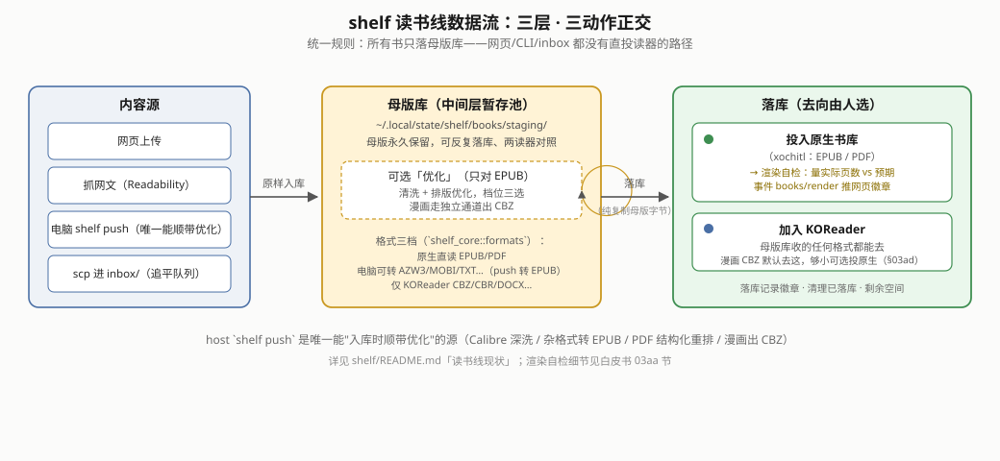
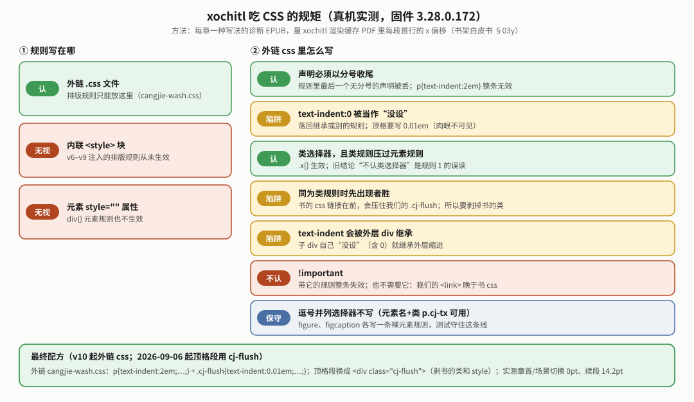
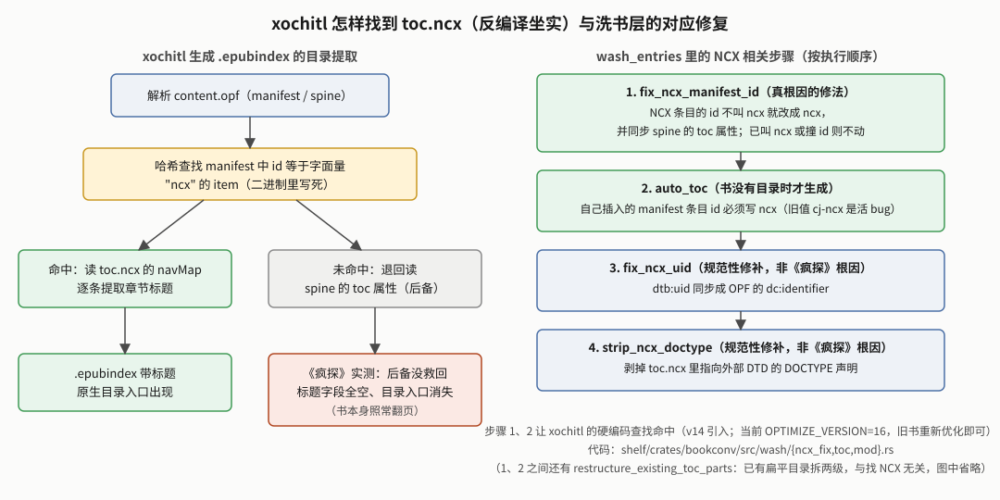

# reMarkable 书架（shelf）白皮书

> **读者与用途**：写给要维护、扩展或排查 shelf（书架：把书弄进设备、优化、再选去哪个读器）的人。
> 想 10 分钟看懂全项目，先读仓库根的 [`docs/OVERVIEW.md`](../../docs/OVERVIEW.md)；想 5 分钟看懂**书架这一块**，读下面的「5 分钟读懂」；想知道"现在长什么样"，读「现状总览」和各章开头的「现状结论」；
> 想知道"当初为什么这么定、真机怎么验、踩过什么坑"，读各章后面的决策小节（每节标题里的 §编号是稳定的引用锚点，别处文档写"见 §03bh"指的就是它，**编号不会变**）。
> 本文按**主题**（A 入库 / B 优化 / C 落库与大文件 / D 网关与网页 / E 稳定性内存耗电 / F 设备与固件）组织，章内保持原先的时间顺序；被后来决策取代的旧结论在原位标注"已被取代"，多数已压缩成"结论 + 关键教训"；每章开头有大白话导语和「本章坑位表」。
> **书籍优化引擎（`bookconv`）的深度细节**（清洗层 / 优化遍 / 脚注 / 图片 / 格式转换 / ★xochitl 渲染硬规则 / 版本演进）在 [`bookconv优化白皮书.md`](bookconv优化白皮书.md)；传书 EPUB 线"当前长什么样"的参考文档是 [`传书EPUB线架构.md`](传书EPUB线架构.md)。

## 5 分钟读懂

**一句话**：shelf 是跑在 reMarkable Paper Pro Move 上的一组网页服务。你用手机/电脑浏览器把书（EPUB/PDF）传进设备的**母版库**（书架里永久保存原书的暂存池），需要时点「优化」（让书在墨水屏上排版更好看），再选择「加入 xochitl」（官方阅读器）或「加入 KOReader」（第三方阅读器）。它**不修改 xochitl 本体**：只用 xochitl 自带的网页上传接口、直接写它的书库目录，以及注入少量 qmd 补丁。


**三个互相独立的动作**（这是全书最重要的心智模型）：

| 动作 | 做什么 | 关键约束 |
|---|---|---|
| ① 入库 | 网页上传 / 抓网文 / scp 进 `inbox/`，**原样**落进母版库 | 只收 EPUB/PDF；网页没有"直投读器"的路径 |
| ② 优化（可选） | 清洗 + 排版 + 目录 + 封面保证；漫画自动识别；PDF 有文字层转 EPUB | 不强制；产物仍在母版库，可重优化 |
| ③ 落库 | 复制母版字节进读器：xochitl（分小文件/大文件/兜底拆分三条路）或 KOReader | 母版永久保留，可反复落库、两读器对照 |

**模块地图**：

| 模块 | 端口 / 位置 | 职责 | 详见 |
|---|---|---|---|
| `gateway` | `0.0.0.0:443`（`../gateway`） | HTTPS + 登录密码 + 单页 UI + 反向代理 + 批量队列 + 并发/内存闸门；**唯一对外** | 第 D 章、`gateway/docs/` |
| `book-serve` | 127.0.0.1:8790（`shelf/services/book-serve`） | 母版库、优化调度、落库、回收站/建文件夹/漫画页边距的设备端代理队列 | 第 A/C/E 章 |
| `bookconv`（crate） | 被 book-serve 链接，非独立进程 | 清洗 / 优化 / 图片 / 漫画 / PDF 入库 / 占位文档 | `bookconv优化白皮书.md` |
| `koreader-serve` | 127.0.0.1:8791 | 落书进 KOReader、字体/词典/配置同步、高亮/生词只读端点 | §03d、§03ar |
| `font-serve` / `wallpaper-serve` | 8792 / 8793（源码在 `../enhance/`） | 字体上传即装 / 壁纸上传即用（写原生 `SleepScreenPath` 键） | 第 F 章 |
| 笔记线四服务 | 8795–8798（`../notes`） | 与书架同网关，书架文档不讲 | `notes/README.md` |
| `shelf/xovi/*.qmd` | 注入 xochitl 的补丁 | 字体菜单动态项、回收站代理、建文件夹代理、漫画页边距代理 | 第 C/F 章 |


**名词小词典**（首次出现处都会再解释一次）：

| 词 | 意思 |
|---|---|
| xochitl | reMarkable 官方的界面 + 阅读器进程；书架不改它，只和它"握手" |
| qmd / qmldiff | 对 xochitl 界面（QML）打补丁的文件 / 工具；xovi 是加载这类补丁与扩展的机制 |
| 母版库 | `~/.local/state/shelf/books/staging/`，原书永久保存处（"母版"=优化和落库都从它出发） |
| 边车（sidecar） | 每本书旁边的小 JSON，记"已落到哪个读器、渲染自检结果" |
| 占位 + 磁盘替换 | 绕开 xochitl 上传体积上限：先上传几 KB 的占位文档让它建条目，再把磁盘上文件替换成真书（§03bn） |
| SSE | 服务端事件推送；网页据此即时刷新，不用轮询（§03z） |
| OOM | 内存耗尽被系统杀进程；设备内存有限，是第 E 章的主线 |

**去哪儿找细节**：

| 我想知道… | 读这里 |
|---|---|
| 一本书从上传到能读，代码怎么走 | [`传书EPUB线架构.md`](传书EPUB线架构.md)（当前状态参考） |
| 优化到底改了书里什么、为什么 | `bookconv优化白皮书.md`；xochitl 渲染硬规则看它的 §09 |
| 某个 bug/决策当初的来龙去脉 | 本文对应 § 节（章首「现状结论」→ 节内「结论」→ 附录 §04 踩坑总表） |
| 网页 UI / 批量队列 / 并发闸门 | 第 D 章；网关自身见 `../../gateway/docs/reMarkable网关白皮书.md` |
| 设备升级固件后怎么恢复 | [`docs/INSTALL.md`](../../docs/INSTALL.md)「固件升级（OTA）之后」 |
| 已经砍掉的功能 | 附录 B（电脑端命令行）与「现状总览」的"已砍"一行 |
| 用户可见的更新历史 | [`docs/CHANGELOG.md`](../../docs/CHANGELOG.md) |

## 如何阅读本文

| 章 | 主题 | 包含的 § 节 |
|---|---|---|
| 0 | 定位、原则与基础 | §00 · §01 · §02 · §03 |
| A | 入库与母版库 | §03b · §03r · §03s · §03u · §03ao · §03ap · §03as · §03br |
| B | 优化管线 | §03e · §03i · §03q · §03y · §03aq · §03av · §03aw · §03ay · §03az · §03bb · §03bc · §03bg · §03bo |
| C | 落库、大文件与漫画 | §03d · §03l · §03t · §03aa · §03ad · §03ar · §03ax · §03be · §03bf · §03bk · §03bn |
| D | 网关与网页 UI | §03g · §03h · §03j · §03m · §03n · §03z · §03ac · §03ae · §03af · §03ah · §03aj · §03ak · §03al · §03am · §03an · §03au · §03bj · §03bl · §03bp |
| E | 稳定性、内存与耗电 | §03p · §03ab · §03ag · §03ai · §03ba · §03bh · §03bi · §03bm · §03bq |
| F | 设备、字体壁纸与固件 | §03c · §03f · §03k · §03o · §03v · §03w · §03x · §03at · §03bd |
| 附录 | 踩坑合集 · 旧版现状总览 · 真机待办 · 演进记录表 · 已移除的能力 | §04 · §00b · §05 · 附录 A · 附录 B · 附录 C · 附录 D |

## 现状总览（2026-09-20 刷新）

> 2026-09-22 复核：以下表格与当前源码逐项核对过（端口、`OPTIMIZE_VERSION`、体积门、闸门档位）；2026-09-21 新增的漫画页边距最小化（bookconv 白皮书 §20）已并入。

**shelf 是什么**：见上文「5 分钟读懂」。

**服务与端口**（均已与 `systemd` 单元核对）：对外只有网关 `gateway` `0.0.0.0:443`（HTTPS 私有 CA + 登录密码 + mDNS `shelf.local`）；领域服务只听本机：`book-serve` 8790（母版库）、`koreader-serve` 8791、`font-serve` 8792、`wallpaper-serve` 8793（后两者源码在 `enhance/`）；笔记线四服务 `ink` 8795 / `transcribe` 8796 / `mind` 8797 / `note` 8798 挂在同一网关上。

**读书线 = 三层 · 三个正交动作**：内容源 →（入库，原样）→ **母版库**（永久保留）→（可选「优化」）→（落库：加入 xochitl / 加入 KOReader）。入库不强制优化，优化后不强制落库，落库只是复制母版字节。全项目的传书全貌图见 [`docs/diagrams/transfer-flow.svg`](../../docs/diagrams/transfer-flow.svg)。

**当前有效的关键规则**

| 项 | 现状 | 详见 |
|---|---|---|
| 收什么格式 | 只收 EPUB / PDF（`rmsvc_core::formats`）；AZW3/MOBI/CBZ 等一律拒收，是策略收紧不是技术判断 | 第 A 章 |
| 书名 | 入库/优化时规范成 `书名 - 02卷`（数字在前），无卷标记的原样保留 | §03bn |
| 优化 | 只有「完整清洗 + 优化」一档（不再分档位）；`OPTIMIZE_VERSION`=15；漫画自动识别、保画质、优化不改格式（仍是 EPUB） | 第 B 章、§03bk（已被取代说明） |
| 漫画页边距 | 实验室开关 `comicMinMargin`（缺省关）：开启后漫画 EPUB 按 xochitl 图片框比例补白，并由阅读器内 qmd 代理把页边距设 1，左右留白约 20pt → 约 0；旧漫画需重新优化才生效 | bookconv 白皮书 §20 |
| PDF 优化 | 有文字层转 EPUB；无文字层/漫画只裁边保持 PDF | §03br |
| 加入 xochitl | ≤90MB 流式 `/upload`；>90MB 优先"占位+磁盘替换"（不分卷，上限 1GiB）；不可用才回退按卷拆分 | 第 C 章、§03bn |
| 批量与并发 | 批量队列在网关（顺序逐本、落盘续跑、可全部中止）；重活先过并发/内存闸门（>90MB 大档 1 个、小档 3 个） | §03bp、`gateway/docs/reMarkable网关白皮书.md` |
| 稳定性 | book-serve 用 `panic="unwind"`+`catch_unwind`，忙锁/取消合并为 `OpRegistry`，启动时修正被中断的 `pending` | §03bq |
| KOReader 入口 | appload ≥ 0.6.0（官方版已含 3.28 支持）；配置补丁经 koreader-serve `/config/*` 应用，没有一键命令行 | §03v、`../koreader/README.md` |

**已被砍/已被取代的（别再找）**：电脑端 `shelf` 命令行（2026-09-18，无网页等价物，见附录 B）；母版库"优化档位"与"投完自动删除"（2026-09-19）；漫画"优化转 PDF"（2026-09-19 做、2026-09-20 用户拍板换回 EPUB，§03bk）；三档格式（原生/电脑可转/仅 KOReader，2026-09-17/18 收成一档）；微信读书内容源（2026-09-05）；appload 补丁工具链（appload 0.6.0 官方已含 3.28，2026-09-21 删）；bind-mount 壁纸（改写原生 `SleepScreenPath` 键，§03x）。

**未闭环 / 未验证（如实）**：网页 UI i18n 与触屏交互只做过数据链路和无头浏览器验证，没有真实浏览器人眼确认；图片密集网文的大片留白是分页引擎行为，无 CSS 层杠杆（§03aq）；批量"加入 xochitl / 加入 KOReader"两条在设备上没有端到端实测（§03bp）；>153MB 文件走占位通道的首次渲染内存/耗时没验证；入库 PDF 转 EPUB 合并部署后功能本身未经真机验证（§03br）。

**OTA（固件升级）后怎么恢复**：权威说明（恢复流程、逐项对照表、流程图）在 [`docs/INSTALL.md`](../../docs/INSTALL.md)「固件升级（OTA）之后」；旧版 OTA 表见附录 D，§05 里的"OTA 后固定五步"是 2026-09-06 的旧说法。

## 第 0 章 定位、原则与基础

> **现状结论**
> - 四条硬原则至今有效：XDG 基目录规范；设计模式去重解耦；专项专用可插拔（按领域拆服务）；不引用旧项目 crate、不对接旧路径（能力只许剥离移植）。
> - 架构是"网关 + loopback 领域服务 + 运行时注册表"：装/卸一个服务 = 一个二进制 + 一个 systemd 单元；网关按注册表出 tab、按 URL 段转发。
> - 本章 §00/§01 里提到的"host CLI / 微读线 / 三种投递目标"是 2026-09-03 的设想，后续被取代，取代关系已在各自段落里标注。

### 00｜定位与原则

2026-09-03 用户提出"全面重构，补齐短板增强优势"：① 阅读系统增加 KOReader 与微信读书；② 全面支持 AZW3/PDF/EPUB；
③ 字体与屏保图片上传即可用。澄清：先「有书读」（原生 / KOReader / 微读三条投递线）再「高质量读」；上传时手选目标；
设备网页 + host CLI 共用同一 API；微读 = 设备上直接开网页版在线读（门控）。〔后续变化：微读线 2026-09-05 砍掉（§03u）；"上传时手选目标"被母版库三层架构取代（§03r），去向在母版库里选；host CLI 2026-09-18 砍掉（附录 B）；AZW3 等格式 2026-09-17/18 起不再收（第 A 章）；现状看「现状总览」。〕

四条硬原则（用户两轮驳回后定）：
1. **XDG 基目录规范**：路径表单一事实源是 Rust `rmsvc_core::paths`（原 `shelf_core::paths`，2026-09-11 起基座搬到顶层 `rmsvc-core`）；shell / qmd 处用同一张表的缺省展开值，env 可注入测试。
2. **设计模式去重解耦**（现役的，都在 `rmsvc-core` 与各服务里）：
   - Repository + Template Method：资产上传 `AssetStore`/`AssetUploadFlow`，font/wallpaper/koreader/母版库四家共用，拒收/成功文案由仓库定；
   - 领域模块 + 纯适配层：book-serve `staging/` 是领域，`api.rs` 只取参、回执；
   - 服务启动模板 `service::ServiceSpec` + `run`；配置读写模板 `config::load_or_default/seed/save`；
   - 端口/适配器：HTTP 只在 `http.rs`（`bind` / `Router::any` / `JsonBody` 取参门面）；
   - Registry（服务发现）· Facade（网关代理，`manage::MODULES` 单一目录表）· 单一事实源（`formats` 格式白名单、`fs::plain_name`/`unique_path`）；
   - 共享原语：`fs::write_atomic`、`multipart::receive_part_to`、`asset::receipt/all_ok`。
   - 原则：移动优先于复制；**旧 crate 只许剥离 + re-export，不直接引用**。
   - 〔已退役：Strategy（投递目标）/ Pipeline（处理链）随直投路于 §03s 删除——规则统一后没有调用方，模式要适配需求而非反之；Command（CLI）与 host 侧 `receipts`/`transport` 随 host CLI 一起砍除。〕
3. **专项专用可插拔**：不做单体，按领域拆服务。
4. **不引用旧项目 crate、不对接旧路径**：能力只许剥离移植；不读写 `/home/root/weread/**`（旧微读线的运行期目录）。

### 01｜架构决策

**三种拆法**：A 每服务独立对外端口（暴露面多、UI/CLI 要记端口）；**B 网关 + loopback 服务 + 注册表（采纳）**；C 单二进制 feature 编译期插拔（不能运行时拔）。
- 注册表放 `$XDG_RUNTIME_DIR`（重启即清）+ 读时按 `/proc/<pid>` 清陈旧条目：SIGTERM 杀进程 Drop 不跑也不会误报。
- 代理**剥掉服务段**（`/api/fonts/x` → 后端 `/x`）：后端直连与经网关同一套路由，`/health` 也能穿过网关。
- 每请求一线程：大文件上传不阻塞其它请求；**请求体方向流式透传**（`ureq::send(reader)`，上传大文件不额外占内存），**响应方向整体缓冲**（§03ah 更正了早期"body 流式透传"的说法）。
- 内存：musl 静态服务各约 0.56MB 二进制（网关 1.6MB 含 ureq/TLS）；空闲 RSS 数 MB，五个可接受（2026-09-03 数据，之后服务数量与体积有增长，未重测）。

**内容层抽离 `bookconv`**（移动，不复制；2026-09-03）：把原先夹在 weread-device 里的转换器、优化器、图片处理、EPUB 组装 `git mv` 成独立 crate `shelf/crates/bookconv`；唯一反常的反向依赖 `optimize → readlater::fetch_image` 切开成 `bookconv::netimg`（`http_agent` 在 netimg 独立实现，bookconv 不依赖 device-core）。当时的验收：旧 crate 全绿、新旧 `epub-optimize` 对同一合成 EPUB 输出 md5 完全一致。现状：weread-device 已不在仓库里（搬到仓库外的 `oldbak/`），bookconv 是 shelf 内部 workspace 的成员，只被 book-serve 链接。

### 02｜XDG 路径表

见 `shelf/README.md`「路径」。qmd 的 XHR 只能写绝对路径，写的是缺省值展开 `/home/root/.local/share/shelf/fonts.json`。

### 03｜systemd

`shelf.target`（WantedBy=multi-user）；服务 `PartOf=shelf.target` + `WantedBy=shelf.target`；网关 `ExecStartPre=-…/lo-alias.sh`（同一份脚本，让 10.11.99.1 常驻可达以便 `/upload` 注入；脚本源在 `enhance/lo-alias/`，2026-09-11 起去掉 `cangjie-` 前缀，往后新命名不再用这个前缀）与 `ExecStartPre=-/usr/bin/fc-cache`（tmpfs 索引真重启后丢）。`install.sh` 写 /usr 前实检 dm-verity。**不给 xochitl 加任何依赖**（改核心服务启动依赖曾导致变砖）。

## 第 A 章 入库与母版库

> **大白话导语**：本章讲"一本书怎么进到设备书架"。书先**原样**放进**母版库**（设备上永久保存原书的暂存池），之后优化排版、放进哪个阅读器都是另外的独立动作。术语：**xochitl** = reMarkable 官方阅读器/UI 进程；**KOReader** = 设备上第二个阅读器；**book-serve** = 管母版库的设备后台服务（本机 8790，浏览器经网关访问）；**落库** = 把母版里的书复制进某读器的书库；**inbox** = "scp 丢文件就自动入库"的目录。读法：先看现状结论、图和坑位表；§03b/§03r/§03s 是被推翻/演进的设计过程，只读"结论/被取代/教训"；§03ao、§03as（已砍的电脑端命令行）、§03u（已砍的微读线）是历史；§03ap（抓网文同步优化）、§03br（PDF 优化）是现役。

> **现状结论**（2026-09-22 已与代码核对）
> - 所有书**只落母版库**（设备 `~/.local/state/shelf/books/staging/`，`rmsvc_core::paths::staging_dir`）：入库、优化、落库三个动作互相独立，网页没有"直投读器"路径；母版永久保留，可反复落库、两读器对照。
> - 入库来源三条：网页上传（多文件、有进度；上传前核对"同名同大小=已落地"则跳过）、抓网文（Readability 抽正文成 EPUB，「同步优化」复选框缺省勾选）、scp 进 `inbox/` 的追平队列（fswatch 监听，8 秒防抖）。
> - 格式只收 **EPUB / PDF**（`rmsvc_core::formats::BOOK_EXTS` = `NATIVE_EXTS`）；AZW3/MOBI/CBZ 等一律拒收——这是 2026-09-17/18 用户的**策略收紧，不是技术判断**（KOReader 本来能读）；已在母版库的旧条目不受影响，`koreader-serve` 的 `POST /books/adopt` 不设格式门。
> - EPUB 书名入库时整理成 `书名 - 02卷`（`bookconv::naming`，§03bn）；同名不覆盖、撞名各自入库（`unique_path` 加数字前缀），回执区分"按规范命名存为"与"已有同名，存为"。
> - 优化与落库都是**异步**：HTTP 立即回"已开始"，进度靠边车（书旁隐藏 JSON）+ SSE 事件呈现；优化只有一档（清洗+优化）；落库永远保留母版。
> - PDF 也能「优化」：有文字层转 EPUB（原 PDF 删除），无文字层/漫画只裁边（§03br）。
> - 电脑端 `shelf` 命令行（含 Calibre 深洗、`doctor --render`、`notes pull`）2026-09-18 整体砍除（附录 B），无网页等价物。



#### 本章坑位表

| 坑 | 症状 / 根因 | 规避 | 见§ |
|---|---|---|---|
| "已优化"徽章说谎 | 无 wash 的产物写了和完整优化同一标记，「优化」钮被藏 | 标记分层：full 写版本号、核心遍写 `<版本>-core`；`level`=full/core/old/none | §03r |
| inbox 绕过母版库 / 验证"没触发" | `process_inbox` 是直投路遗留，scp 的书自动直投；验证时 5 秒就查（watcher 8 秒防抖） | 规则要审到**所有入口**；验证前先读防抖参数 | §03r |
| `df -k` 解析出错 | busybox 设备名过长把数字换到下一行 | 拍平后所有行取第 4 个 token（`Staging::free_bytes`） | §03r |
| PDF 重排整页空白（旧管线） | 每页一章+段落碎成行+图近整屏高+双栏丢图；管线已砍 | 先解剖产物 | §03r |
| 网文正文大片留白 | 白名单不留 class/style，xochitl 只认外链 css；"同步优化"只治这层，图片夹正文的留白另有成因 | 复选框必要不充分 | §03ap、§03aq |
| 同名同大小去重快照过期 | 一次拖两份同名同大小，第二份仍成 `1_x`；上传前只查一次快照 | 每成功一项补进快照 | 附录 §04 |
| 撞名文案误报 | 规范命名后的文件被提示"已有同名"（落地名≠请求名有两种原因） | 用 `canonical_staged_name(requested)` 比对（`staging/mod.rs`） | 现状结论 |
| 上传超 100MB | `Connection reset`/`413`：xochitl `/upload` 硬上限 100,000,000 字节；体积门 `nativeUploadLimitMb`=90 | 占位+替换通道 | §03bn |

### 03b｜Phase 1 统一投递（2026-09-03，离线完成）

> **⚠ 已被取代**：本节"上传时手选目标 + 直投读器"在 2026-09-05 被母版库三层架构取代（§03r）；直投路（`POST /?target=`、`Native`/`Annot` Strategy、Pipeline）已于 §03s 删除，现行唯一入口是 `/staging*`。

**当时做了什么**：book-serve 多文件流式落 `.work`→按目标 Strategy 处理；koreader-serve 直传 `POST /books`；host `shelf push` + Calibre 桥。冒烟通过，真机当时设备离线，未验（见 §05）。

**仍然有效的部分**（已核对代码）：
- spool `$XDG_STATE_HOME/shelf/books/` 现只剩 `inbox/`、`.work/`（认领中/上传暂存，崩溃残留启动时移回）、`failed/`（封顶 50MB，带 `.reason`）；配置 `~/.config/shelf/book.json`（首启写缺省）现只有 `xochitlHost` / `uploadTimeoutSecs`（300）/ `nativeUploadLimitMb`（90）。
- koreader-serve（8791）现只从母版库 `POST /books/adopt` 落库；`GET /status`、`/books`、`/fonts`、`/dicts` 仍在；后又新增 `GET /annotations`、`/vocabulary`（§03ar）与 `/config/{settings|defaults|gestures}[?dry_run=1]`。

**教训**：为"上传→转换→优化→检查→注入"直投设计的 Strategy/Pipeline，规则统一成"只落母版库"后没了调用方——架构模式服务于当时的规则，规则变了就整块删，别留着当"以后可能用"。

### 03r｜读书线重构：中间层（母版库）三层架构（2026-09-05，用户"逻辑很乱"提出改造）

> **状态**：三层架构与"三动作正交"是现行主线；Phase C 里的"母版库收任意格式""优化档位""投完清除""电脑 `shelf push`""微读占位"均已被推翻（见"已被后续取代"）。

**问题**：读书线让用户一次背 3 维决策（读器×投递口×文件夹），"优化"与"落库"耦合，根因是把机器判不了的"用途分类"塞进流程。**方案**：入库 / 优化 / 落库三动作正交，中间夹**母版库**；统一规则：**所有源一律原样直传母版库，优化、落库各自独立**。母版可反复落库；指引只做决策辅助（现为网页「三步走」）。

#### Phase A 母版库基础设施（✅ 真机通 2026-09-05）
- `paths::staging_dir()`（`state_dir()/books/staging`，/home 分区不丢、**不套 LRU**）；koreader-serve `adopt` 从共享 staging 读→`KoStore::install` 纯复制。
- **关键设计：落库 = 纯复制原字节、不优化**，一本母版落两读器是同字节可对照。
- 真机端到端：上传→优化（1400→1778 字节）→投 xochitl→adopt KOReader（同字节）→母版保留。

#### Phase B/C 内容源汇入与 UI 三层重构（✅ 真机通 2026-09-05）
- **网文获取下沉**：抓取 + Readability + scraper 白名单从 `reading/device-rs` 下沉进 `bookconv::article`；`POST /api/books/staging/fetch-article {url}`。scraper/html5ever **aarch64-musl 交叉编译通过**；设备抓 runoob / 阮一峰两篇成功。边界：静态 HTML 好；SPA / 付费墙 / 反爬抽不出；图片 best-effort；恒产单章。
- **UI 定稿**：首版被指"书从哪进有三个答案"→「传书」固定 tab 放第一位 = 唯一总入口（二级「入库」｜「母版库」），读器页彻底不传书；**网页直传与电脑 `shelf push --direct` 取消**（用户："所有书只允许落母版库"）。

**已被后续取代**：
- "母版库收任意格式" → 09-17/18 收成**只收 EPUB/PDF**（`formats.rs`，测试钉死 `BOOK_EXTS == NATIVE_EXTS`）；「优化档位」「投完清除」→ 09-19 砍（`staging/optimizing.rs` 注释）；「微信读书占位」→ §03u；「电脑 shelf push」卡片 → 09-18 砍。
- 「清理已落库」按钮 → 由底部操作栏 + 服务端批量队列取代（§03bp）；⚠ `lowWarn` 文案仍残留该字样。

#### 规则漏洞两处（用户问"逻辑是否清晰"时自查出）
- **inbox 绕过**：`process_inbox` 自动优化直投 native → 改为原样落母版库（非书籍进 `failed/` 带原因），老 `POST /?target=` 标废。
- **"已优化"徽章说谎**：网文/格式转换产物走 `assemble_optimized`（无 wash）却写同一标记 → `marker_value(full)`：含 wash 写版本号，无 wash 写 `<版本>-core`；`StagingEntry.level`（`staging/library.rs::probe_level`）= `full/core/old/none`，徽章「已优化 / 已优化·未清洗 / 旧版优化 / 未优化」，非 full 仍给「优化」钮。
- 真机通：scp 进 inbox → 8 秒后"已入母版库"、xochitl 无该书；抓网文 `level:core`、点优化 → `full`。

#### 第二步"能用→好用"小迭代（✅ 真机通 2026-09-05）
- **落库记录** sidecar `.<书>.delivered`：deliver 自动记 native，KOReader adopt 由前端调 `POST /staging/mark`；徽章"已投原生/已加入KO"，落库时间早于母版 mtime 标"旧"；删书连带删 sidecar（后又扩了 `render`/`optimize`/`source` 等字段，`sidecar.rs`）。
- `GET /staging` 带 **freeBytes**，前端 <300MB 红字告警。

#### Phase E PDF 结构化重排（host 旧管线，已随 host 砍除；教训保留）
真机《财新周刊》"整页大片空白"，解剖产物定位三根因：**每页一章**（91 页→91 xhtml，每章末强制翻页）、**段落碎成行**、**图近整屏高**推到下页留白。修法：整本平铺→文档级段落合并→按标题分章→图封顶宽≤954/高≤60% 屏；章 91→10、段落 1209→770、句中断开 48%→12%、中位段长 47→109 字。
- **二次坑**：单栏宽块被按"中点在中线右"甩到右栏 → 仅存在贯穿竖向空白带时才分栏；行尾零宽空格挡住句末标点判断 → 全局剥零宽字符；旧分栏在双栏页**静默丢图块**（8 张→39 张才全量），954 宽照片 PNG 1.3MB→21MB，改 JPEG q80 → 3.6MB。
- 现役 PDF 优化是全新实现，见 §03br。

### 03s｜代码质量核查二轮：母版库领域化 · 直投路删除 · 上传模板统一（2026-09-05，用户"审视 shelf/ 合理用设计模式、去重、解耦"）

> 2026-09-05 的重构记录；其后改名：`shelf-core` 现为顶层 `rmsvc-core`，`shelf-gateway` 现为顶层 `gateway`，`font-serve`/`wallpaper-serve` 已搬到 `enhance/`，host CLI 已砍。下文保留当时模块名，所列项目均已对照当前代码确认仍在。

**动机**：§03r 后留着两套并行收书路（旧直投 vs 新 `/staging*`）、三份手搓 multipart 循环、格式白名单四处各写、"缺 name"样板 ×7、文件名校验 ×4。按"单一事实源 + 模板方法 + 门面"收：

| 层 | 收编内容 |
|---|---|
| `rmsvc-core` | `formats`（`BOOK/FONT/DICT/IMAGE_EXTS`，网页 accept、上传门、inbox 追平同源）；`fs::plain_name`（拒 `/`、`..`、`.` 开头）+ `unique_path`/`move_unique`；`http::bind`/`Request::json()`/`multipart_boundary()`；`asset::AssetUploadFlow::in_dir`（暂存 `.work/` 与母版库同分区，rename 零拷贝）、`receipt()` 统一回执 |
| book-serve | 删 `target.rs`/`pipeline.rs`；母版库拆成领域模块 `staging/{mod,intake,library,optimizing,deliver}.rs`；`api.rs` 回到适配层；`spool.rs` 只剩 inbox 队列；`BookConfig` 退役 `optimizeDirectEpub`/`comicMono`（旧 json 多余键被忽略）；`/targets` 删 |
| koreader-serve | 删直传 `POST /books` 与 `optimizeEpub`；书只从母版库 adopt；不再依赖 bookconv |
| font-serve / wallpaper-serve | `State{store, paths}` + `bind`；font-serve 注册 tab 改名「xochitl」，book-serve 不再挂 tab——xochitl 字体页由 font-serve 存活驱动（原键在 book-serve 上，font-serve 关了页面还在但全 404） |
| 网关 | `ui::page()` 用 `OnceLock` 把 `formats` 白名单注入模板 `__EXTS__`；前端 `uploader()`/`fillList`/`assetTab` 收编上传与列表渲染；`proxy::forward` 自查目录表 |

**副作用**：设备端 AZW3/MOBI/FB2/CBZ 转换不再从 book-serve 可达（转换器本体保留给 reading 线）。**没动**：`htmlproc`/`wash` 规则本体、systemd 单元。

**验证**：离线测试全绿、workspace 零警告。**真机通（2026-09-05）**：font-serve 挂 tab「xochitl」、book-serve 无 tab；jpg+epub 同传 → jpg 拒收；`/books/adopt` 同字节；旧 `POST /?target=` 404、`POST /koreader/books` 405。

**格式提示分档（中间态，已被 09-17/18 收紧取代）**：当时核实 18 个扩展名全是设备 KOReader v2026.07.1 `documentregistry` 真注册的（crengine/mupdf/djvu 三引擎；`libarchive.so.13` 带 rar 故 CBR 真能开），问题在**展示**——18 个一口气列出看不出谁能去哪，故分 `NATIVE_EXTS`/`HOST_CONVERTIBLE_EXTS`/`KOREADER_ONLY_EXTS` 三档，后两档现已删（`formats.rs` 注释与测试 `retired_*_no_longer_accepted`）。**教训**：格式收紧是用户策略，"KOReader 技术上能读"不构成收的理由。

### 03u｜砍微读线（2026-09-05，用户"不做了，直接砍微读线"；范围只限书架）

> **⚠ 历史记录 / 已砍**：书架内没有微读线；`weread-serve` 槽位、入库页占位、目录表 weread 行都已删。

**评估后砍**（Phase D 探索 + 真机核）：
1. 微信读书官方 Skills/Agent 网关（Bearer api_key，`/_list` 自描述 17 接口）**只读没正文**：书架/目录/搜书能拿，章节正文只能走 web 端点 + cookie `wr_skey`（约 90 分钟过期，靠 renewal 续）+ 分片 `codec`（照 MiuRead 移植的 AGPL 派生，个人自用不分发）。
2. 下书栈在 `reading/device-rs`（≈1000 行）；接入要新立 `weread-core`（AGPL-3.0）、`weread-serve` 8794 + 网页扫码状态机。
3. 设备与 host 都没有微读凭证；协议脆弱是常量（上游一改即断，"200 空 {}"曾卡数日）。投入约两天、收益是一条依赖第三方私有协议的内容源，用户决定不做。

**砍掉的**：管理页目录表 weread 行（`installable` 机制保留）、入库页占位与"待接"文案、`weread-serve` 槽位、`weread-web/` spike。**不动**：`reading/` 的 wr-* 下书栈（块③旧线）；`bookconv` 里的脚注/远程图规则（第三方书同样受益）。书架内容源现为三条：网页上传 / 抓网文 / scp inbox。

**追记（2026-09-09，若将来想把"墨香管理"接进书架网页，先看这条）**：`reading/device-rs` 的 `wr-serve`（墨香面板 API，`127.0.0.1:8777`）内嵌一条上传页线程，**硬编码监听 `0.0.0.0:8778`**（`upload_server.rs`），注释称可设 `CANGJIE_UPLOAD_PAGE=0` 让出端口，但无任何脚本真设过。网关 2026-09-10 改绑 443（§03am）后端口冲突消失，**只是巧合躲开**：两者从未一起跑过（wr-serve 未接入服务注册表，不受 `shelf.target` 管），"传文件到 inbox"与 book-serve 入库重复也依旧。真要接入，第一步仍是砍掉那条内嵌上传页。⚠ `reading/` 已整体搬出仓库（2026-09-11），无法复核 `upload_server.rs` 现状，**未复核**。

### 03ao｜`shelf push --no-calibre`：纯 EPUB 优化、跳过 Calibre（2026-09-10）

> **⚠ 已被取代**：`shelf push`（含 `--no-calibre`）随电脑端命令行在 2026-09-18 整体砍除（附录 B），无网页等价物。保留作历史与决策依据。

用户问是否缺"纯 EPUB 优化、不转格式"的逻辑。**先核实再动手**：核心能力本来就有——`bookconv::optimize::optimize_epub_with` 是唯一纯 EPUB→EPUB 优化实现，已被网页「优化」按钮（`Staging::optimize`）和 CLI `epub-optimize`（`bookconv/src/bin/epub_optimize.rs`，仍在）调用；缺的只是 host `shelf push` 没暴露"跳过 Calibre"的入口。当时加了含清洗层的 `optimize-only` 第三条路，纯 host 改动未上真机，已随 host 砍除。

**教训**：用户说"缺一个功能"时，先查是"能力有、入口缺"还是真缺；新开关先确认用户要的是哪一档语义，别拿相近的现成档凑。

### 03ap｜「抓网文」补「同步优化」复选框（2026-09-10，真机通）

**需求**：用户反馈抓网文默认在设备上大量留空，要加「同步优化」复选框并给选择权。

**症状→根因**：网文在 xochitl 上按默认段距渲染，页面大片留空 ← `bookconv::article` 属性白名单不留 `class`/`style`，产出 XHTML 无排版样式；抓取落库只走核心遍（`level:"core"`），不注入外链 css ← xochitl 只认外链 `.css` 里的裸元素规则、无视内联 style（§03y 七条实测规则之一）。「优化」按钮本就能手动补这一步，本次改成抓取时可选自动做。

**实现（现行代码，已核对）**：
- `Staging::fetch_article(url, optimize)`（`staging/intake.rs`）落库后若为 true，紧接调**同一个** `self.optimize(&name, …)`（旧 `OptimizeMode::Auto` 已随档位删除，现传空进度闭包）；返回 `FetchArticleOutcome{…, optimized, optimize_error}`。
- 同步优化失败**不阻断**抓取（`Result` 仍 `Ok`，`optimize_error` 带原因），`api.rs` 按状态组回执文案；API 缺省 `optimize=false`，兼容旧客户端。
- 网页 `#artopt` 复选框**前端缺省勾选**（localStorage 记忆）；"选择权"体现在"能关"。

**验证**：host 非 mock 对 `runoob.com` 一篇教程真调用：`wash:None` 产物不含外链 `cangjie-wash.css`、`wash:Some` 含；`fetch_article(url,true)` 落库 `level=="full"`、`false` 为 `"core"`。**真机（2026-09-10）**：同一篇分别带/不带 `optimize:true`——前者 `level:"full"`、3761 字节、回执"…并同步优化"，后者 `level:"core"`、3488 字节。

**追记（§03aq）**：本节"默认解决『大量留空』"**过于乐观**——同日另一篇图片密集的网文，真机 A/B 逐页渲染证实 `optimize:true` 生效，但对"图片夹正文中间"造成的大片留白**没有实质改善**，真成因是分页引擎对图片块的处理（详见 §03aq）。本节修的是真实缺口（网文正文样式缺失），不是留白的完整解法。

### 03as｜`shelf notes pull` 补 `config.toml` 的 `notes_vault` 配置项（2026-09-16）

> **⚠ 已被取代**：`shelf notes pull` 随电脑端命令行在 2026-09-18 整体砍除（附录 B）。历史记录。

真机验证 `shelf notes pull`（笔记线 §03ak/§03al）时用户指出：Obsidian vault 落哪不该每次手敲 `--out`，CLI 不该替用户猜。当时加 `config.toml` 的 `notes_vault`（缺省空串），优先级 `--out` > `notes_vault` > `$XDG_DATA_HOME/shelf/notes-vault`；纯 host 改动未上真机。**保留的原则**：路径类配置优先级 = 命令行 > 用户配置 > 兜底缺省，兜底不该被当成"多数人真实位置"。笔记线导出 md 现入口见 `notes/README.md`。

### 03br｜入库 PDF 的「优化」：有文字层转 EPUB / 无文字层只裁边（2026-09-19）

> 主线摘要；用户的两处取舍与实现细节见 `bookconv优化白皮书.md` §18。

- 母版库「优化」扩到 PDF（`bookconv::pdf_ingest/{classify,headings,text,to_epub,trim,source}.rs`）：`classify_pdf` 分三类：
  - **有文字层**（`TextLayer`，每页平均可提取字符 ≥ `MIN_CHARS_PER_PAGE`=40）→ 转 EPUB：保留图片、公式（按行/区域裁成图，纯 Rust `hayro` 光栅化），必须有 TOC（书签优先，其次按字号识别标题，都不行才按固定页数分块）。成功后**原 PDF 删除**，以 `<书名>.epub` 落地。
  - **漫画 / 无文字层扫描件**（`Comic`：≥ 90% 页被一张覆盖 ≥ 85% 页面积的图占满；`NoTextLayer`）→ **只裁边**、格式不变（`optimize_pdf_trim_only`，安全闸：只处理"零文字、每页恰好一张整页图"的 PDF，其它形状拒绝并保持原文件；保留书签，无书签按页分段兜底出目录）。分类判不准（打不开/解析失败）一律退 `NoTextLayer`——转 EPUB 是破坏性格式变更，判不准选保守那条。
- PDF 转出的 EPUB 在列表有来源徽章（`StagingEntry.pdf_source`，OPF 里 `dc:identifier` 带 `pdf:` 前缀）；视为一次性完成，不再进 full/core/old/none 阶梯、不再显示「优化」钮。
- 验证状态：写代码时"不上真机"，合并后部署设备，但功能**未经真机端到端验证**（部署健康不等于功能验证）。

## 第 B 章 优化管线

> **大白话导语**：一本 EPUB 放进母版库（书架里永久保存原书的暂存池）后点「优化」，设备端 `book-serve` 调 `bookconv` 库（Rust 电子书内容处理库）完成清洗。值得读是因为 **xochitl（reMarkable 官方阅读器/UI 进程）的 EPUB 渲染器闭源、行为反常识**，本章多是"真机量出来的规矩"和踩坑。
> 阅读顺序：现状结论 + 坑位表 → 动排版规则读 §03y → 决策来由读 §03q / §03av → §03e、§03i 主要是历史。引擎逐模块细节见 [`bookconv优化白皮书.md`](bookconv优化白皮书.md)。

> **现状结论**
> - 「优化」只有一档：完整清洗（wash）+ 优化器两遍 + 图片处理；`OPTIMIZE_VERSION`=15（v15=EPUB 漫画补白比例 303:462.1，配合阅读器页边距 0）。母版库按产物内版本标记显示 full / core（只跑核心遍）/ old / none，非当前版本可再点「优化」升级；旧漫画需**从原始文件**重优化（再优化产物多一代 JPEG 有损）。
> - **内存**：流式两阶段（先规划、再逐图处理），图片并行（2 worker，同时处理像素 ≤600 万），单图解码超 900 万像素跳过（§03bi）。
> - **排版**：xochitl CSS 只认外链 `.css`，不认内联 `<style>`/`style=`/`!important`（类选择器认，但"先出现者胜"）；规则见 §03y。脚注缺省 `Anchor`（注释移章末、原生返回浮标兜底）；缺目录自动建（纯图片书每 20 页分段）。
> - **封面**：OPF 必须同时有 `<meta name="cover">` 和 `properties="cover-image"`（§03bo）。清洗层删指向不存在文件的 `` 与死 `@font-face` 来源（§03bm）。
> - **漫画**：自动识别，保画质、裁边（单边最多 35%）、单趟缩放；仍产 EPUB（2026-09-20 起取代 §03bk 的"改产 PDF"）。
> - **已砍**：电脑端 host CLI（`shelf push`、Calibre 洗书链、`check_output.py` 质量门）2026-09-18 整体砍除，设备端 `book-serve` 是唯一线上路径；开发机只剩 `epub-optimize` 小工具（同一份代码）。

#### 本章坑位表（一）

| 坑 | 症状/根因 | 规避 | 见§ |
|---|---|---|---|
| 内联排版规则不生效 | 首行缩进/边距"注入了没变化"；xochitl 只认外链 `.css` | 规则一律写外链 `cangjie-wash.css`；一个真机活样本（《飘》）胜过七版凭空诊断 | 03q · 03y |
| CSS 声明缺尾分号被吞 | 最后一个无分号声明被丢，`p{text-indent:2em}` 不缩进 | 清洗层输出声明一律尾分号 | 03y |
| `text-indent:0` 无效/继承 | `0` 被当"没设"，顶格段落回外层 div 缩进 | 写 `0.01em` + `<div class="cj-flush">` 并剥书的类 | 03y |
| 旧版本书升不了级 | 幂等门只看标记存在、不看版本 | 标记版本与当前比对；旧书需重优化 | 03q |
| 图标脚注 marker 巨大 / 背景图平铺盖正文 | xochitl 行内图按固有像素渲染；无视 `no-repeat`/`background-size` | Inline 丢弃原 marker；清洗层剥 `background*`（章头 `` 保留） | 03q |
| 误诊：banner 当"重复图"删 | 真凶是 CSS 背景图不是 ``；已 revert | 看不到屏幕别猜渲染，让用户拍照 | 03q |
| 中文书零缩进 | 全书无 `<p>`：div + `<br/>` 分行 + 段首 U+3000（被 xochitl 折叠） | `cjk_paragraphize`：br 切 `<p>`、剥全角空格，缩进走 css | 03y |
| 脚注想固定在"当前页最下" | 流式重排，"第几页"是运行时结果 | 页底定位属固定版式（PDF 线）；回 `Anchor` | 03av |
| 修了 figure 边距留白没变 | 图片块页尾放不下整体推下页、页尾不回填（渲染引擎分页决策） | 改前后逐页像素一致才是证据；CSS 层无杠杆 | 03aq |
| 裁边设备上极慢/裁不净 | 25 页 2200×3400 漫画 2 分 19 秒；留白 22–29% 裁不净（旧上限 15%） | 并行 + 单趟；上限 35%（bookconv §19） | 03av |
| 放开 `background-color` 风险 | （未验证）深底浅字块在彩墨屏或更难读 | 挑带彩色底纹的技术书真机验证 | 03av |
| 弹窗脚注做不成 | 闭源渲染器无弹窗、正文点击不通知可注入 QML 层 | 只能内联常显或"跳转+浮标"；KOReader 才有弹窗 | 03q |

（后半部分的坑见「本章坑位表（二）」；附录 §04 已收录的不重复。）

### 03e｜Phase 4 原生高质量门 · Phase 5 微读 spike 脚本（2026-09-03）

> **历史记录**：本节的 host 质量门与 spike 脚本都已不在仓库。现存只有 `bookconv::check`（§03i），设备端「优化」不跑门，仅 `epub-optimize --check` 可用。

- **P4**：host 产物必过 `check_output.py`（PDF：宽高比/outline/内链/字体子集；EPUB：DRM 硬拦/nav+ncx 命中率/双 id/锚点），随 host CLI 2026-09-18 砍除。
- **P5**：`shelf/weread-web/spike.sh`（recon → fetch+ldd → run 看门狗停 xochitl 前台跑 → restore 核 `NRestarts`）需用户在设备旁执行；目录已不在仓库。

### 03i｜host 优化 vs 设备端优化：对标现状与移植计划（2026-09-03 傍晚，用户问"对标一致吗"）

> **⚠ 大部分已过时**：文中"host 优化"指电脑端 Calibre 洗书链（2026-09-18 砍除，附录 B）；设备端 `bookconv` 是现存唯一路径。本节保留"当时为什么把 Calibre 那层规则移植进 Rust"。

**当时结论：优化器同源一致，清洗层与质量门不对标。**host 路（Calibre `ebook-convert` + `wash_epub.sh` + `check_output.py`）比设备路多三层：Calibre 级 CSS 拍平（09-02 按屏校准：每页 +16% 行、全书 −15% 页）、质量门、格式转换（HUFF/CDIC AZW3 只有 Calibre 能解）；`optimize_epub` 两边同一函数。用户拍板"先移植清洗层+质量门"，新规则进 `bookconv`。**现行规则以当前代码为准**（`shelf/crates/bookconv/src/wash/`，细节见 bookconv 白皮书 §02）：

| 规则 | 当前行为 | 与 09-03 原版差异 |
|---|---|---|
| 伪 DRM（`wash/drm.rs`） | `encryption.xml` 只列 .css/.ttf/.otf/.woff/.woff2/.js → 丢文件 + encryption.xml + manifest 项；列了正文/图/导航=真 DRM，**报错停、原样不动** | 无 |
| CSS 锁（`wash/css.rs`） | .css / `<style>` / `style=""` 三处剥 `DEFAULT_FILTER_PROPS`=`font-family`/`font-size`/`font`/`background-image`/`background`（`@font-face`/`@import` 不动） | 原版还剥 `color`/`background-color`/`text-align`（照抄 Calibre，09-17 收窄，§03av） |
| 边距/段距 | body/html/@page 的 margin/padding 整个删；含 p/div 的选择器与内联：**上下** margin/padding 归零、左右保留；`keep_para_spacing` 只保留段距 | 原版还注入 `html,body{…!important}` 内联块——xochitl 上从未生效，v10 起改外链 `cangjie-wash.css`（§03q、§03y） |
| 空页（`wash/empty_pages.rs`） | spine 里无文字无图的页（`mbppagebreak` 独占页）→ 删 zip/manifest/itemref，目录改指下一篇；全空不动 | 无 |
| 自动目录（`wash/toc.rs`） | `IfMissing`（缺省）零条目时从 **h1–h6** 生成多级 `toc.ncx` + `nav.xhtml`；`Always` 强制重建 | 原版只 h1/h2（v7 扩） |
| 双 id | 每章先 `collapse_dup_id_attrs`（先修再拦） | 无 |
| 质量门（`check.rs`） | 真 DRM / 目录 href 命中率 <80% / 单标签双 id → **硬失败**；无目录（`require_toc` 升失败）、锚点丢失 → 告警 | **设备端不跑门**，只被 `epub-optimize --check`（不过退出码 3）调用；PDF 门（pymupdf）从未移植 |

**当时真机数据（09-03 深夜，WiFi）**：双 id + 无目录的坏书被门拦下，清洗后过门、自动目录 2 条；《飘·上册》（多看伪 DRM `dkagent.css`，10.6MB）设备端 `optimize=auto` **90s**：35 章，10631321→3183269 字节，剥伪 DRM 1 项，目录 34 条（host debug 同书 33s）。⚠ 当时的 Pipeline / `optimize=off|plain|auto` / `check=` 直投接线已随 §03s 删除；现行入口是母版库 `POST /staging/optimize {name}`（异步，进度见 §03bg）。"xochitl 认不认 `!important`"的假设已有答案：不认（§03y）。

**《镖人》三路对照（中断，无结论）**：AZW3 297MB；设备端上传到 54MB 时 book-serve RSS 2.5MB（流式落盘坐实）；host `wash_epub.sh` 2m41s 产 282MB EPUB（156 章/2473 图）；`comic2cbz.py` 8s 出 2473 页 CBZ。用户叫停：**漫画几乎全是图，清洗层无意义，对照应换文字书。**

### 03q｜书籍优化深层优化：做精做细做强（2026-09-04，用户"只做精做细做强"）

> 引擎机制细节（清洗层/优化遍/脚注四形态/图片降采样/xochitl 渲染硬规则/版本演进）见 **`bookconv优化白皮书.md`**；本节只记诉求、决策与真机反馈。
> **状态**：host 侧（Calibre、`shelf push`、`pdf_reflow_move.py`、KOReader 单独优化）已被 §03s / §03av / 2026-09-18 砍除取代，相应条目按"当时做法"读；xochitl CSS 结论以 §03y 为准。

四诉求：① 格式仅留 EPUB+PDF；② 按 Move 屏参数/xochitl 裁切规则优化；③ 图片美观、中英文各按习惯、不锁字体、不缺目录、脚注自动呈现、PDF 学术重排；④ host/端、EPUB/PDF 统一，xochitl≈KOReader。分 6 阶段，各自构建 + 真机验证。

**两条判死**：
- **xochitl 弹窗脚注**——闭源渲染器不实现弹窗、正文点击不通知可注入的 QML 层；竞品「镇纸」的弹窗是另开 WebView 载微读网页版。∴ 脚注只能内联常显或"跳转+浮标"。
- **端上 PDF 重排**——PDF 栅格化没有 musl-friendly 的纯 Rust 方案；k2pdfopt 位图引擎（28+43 个 C 文件）高投入低回报不移植。

| 阶段 | 当时做法 | 现状 |
|---|---|---|
| A 格式收敛 | 只收 EPUB/PDF，其它拒收 | `target.rs` 已删，母版库 `BOOK_EXTS`=EPUB/PDF（§03s、§03av） |
| B EPUB（v7） | `wash::LangMode` 按 CJK/拉丁占比：中文 `text-indent:2em`、拉丁 `1.2em` + 标题后首段不缩进；auto-TOC 扩到 h1–h6 并 dense-rank 多级；不锁字体 | 沿用 |
| C 脚注 | `FootnoteMode{Inline,Anchor}`：native 默认 Inline（就地 `<span class="cj-fnote">〔…〕</span>`，**去标签成纯文本**，防块级标签塞进 `<p>` 致 xochitl 严格 XML 整章白屏） | 09-17 缺省改 `Anchor`（§03av）；`Inline` 仅测试/历史 |
| D KOReader 一致性 | koreader-serve 收 EPUB 走同一优化 | 已撤：§03s 后落库=纯复制母版字节 |
| E PDF 重排（host） | `pdf_reflow_move.py`：PyMuPDF 分流 + 抽 blocks 重排成 EPUB | host 已砍；设备端 PDF 见 bookconv §18（有文字层转 EPUB / 无文字层仅裁边） |
| F 真机验证 | `!important`/line-height、内联脚注长注观感 | 见下与 §03y |

**Phase F 真机（2026-09-04，用户拍照《飘·上册》逐页核，`OPTIMIZE_VERSION`→8）——三条 xochitl 渲染硬规则 + 一条误诊教训**：
1. **图标 `` 的脚注 marker 必须丢弃**：《飘》marker=`<a noteref>…</a>`，行内图按**固有尺寸**渲染 → 一页 7 个大图标。修：`Inline` 丢弃原 marker，只留 `〔注释纯文本〕`。
2. **EPUB 内嵌图卡竖向框（宽 ≤954）**：`class="logo"` 1696×630 内联横幅按固有宽渲染 → 溢出竖屏。修：`imgopt::downscale_for_epub`（竖向框 954×1696）。
3. **xochitl 无视 `no-repeat`/`background-size`，背景图平铺**：分卷页 `body.fen{background:url() no-repeat bottom center;background-size:100% auto}` 平铺盖正文。修：`filter_props` 加 `background`/`background-image`（`@font-face` 的 `src:url` 豁免）。
- **⚠ 误诊教训**：先把"分卷页多幅图"当成"章头 banner 跨章重复"，加了"同图被 ≥5 章引用即删 ``"——**错**：章头 banner（每章一张村舍插画）是用户要保留的装饰，真凶是 CSS 背景图。已 `git revert`。真机核：分卷页背景 url 30→0、章头 banner 保留 30、内联脚注 32 全好；投递走 book-serve loopback 避云同步卡顿。

**第 2 轮用户反馈（09-04，测「基本书」6 条 bug + 2 问）**：
- **★幂等门只看标记存在、不看版本（根因，波及全部 v7+ 改进）**：旧 `is_optimized`=有标记就跳过，v6/v7 优化过的书 bump 到 v8 后重传被整步跳过——解释"反复测基本书都看不到优化"。修：按标记版本与当前比对，旧版本重优化升级；重优化安全由 `double_optimize_inline_footnote_no_dup` + `reoptimize_relinked_footnote_no_dup` 坐实（注释不翻倍）。现状：母版库按 full/core/old/none 显示、full 才隐藏「优化」按钮（`staging/library.rs` `probe_level`）。⚠ 设备上存量老书需重优化才升级。
- 另：传书目标合并为"传书到 xochitl"+文件夹预设；客户端 `uploader()` 加 `okExt` 预拦；PDF 端上不重排是设计如此。端/host 一致（两路末步同调 `bookconv::optimize`，host 只多 Calibre 拍平与转码）。

**★首行缩进根因终结（09-04 真机 7 版诊断书 + 《飘》活样本，`OPTIMIZE_VERSION`→10）**：bug「中英文没缩进」死磕出 xochitl 的 CSS 行为（细则见 §03y）：
- **xochitl 只认外链 `.css`，无视内联 `<style>` 与 `style=`**。⟹ v6–v9 注入的内联 `<style class="cj-wash">` 从未生效，此前"有效"的只是"删改源文件"类改动（剥字体锁/去背景图）。活样本：《飘》自带外链 `p{text-indent:2em}` 缩进正常。
- 当日结论"不认类选择器"后被 §03y 证伪（尾分号规则的误读），`!important` 不认成立。
- **死路**（全撤回）：段首 `&nbsp;`（v9）宽度随字体变、连续 nbsp 被折叠；U+3000/U+2003 被吞；`inline-block` 占位被无视。
- **根治（v10）**：排版规则写外链 `cangjie-wash.css` + 每章 `<head>` 注 `<link>`（相对路径 `relative_to`）+ OPF manifest 补 `<item>`；中文 2em / 拉丁 1.2em，**em=字体无关、精确 2 字**；`add_wash_css_entry` 幂等。真机《缩进v10无important验证》3 段精确 2 字缩进坐实。

### 03y｜xochitl CSS 引擎实测规则（2026-09-06，八轮"诊断 EPUB"量渲染缓存，3.28.0.172）

> **本节是这套规则的权威版**（比 bookconv 白皮书 §09④ 更新；§09④"只认裸 `p{}`、类选择器让整表失效"是 09-04 早期结论，已被本节第 3、7 条证伪，以本节为准）。



**方法**：造只有一个变量的诊断 EPUB（每章一种写法 + 同章一个对照 `<p>`），scp 进 inbox → 设备上 `wget --post-data` 打 `127.0.0.1:8790/staging/deliver` 投原生 → xochitl 导入即渲染 `<uuid>.pdf`（或 `GET /staging/render/{uuid}`）→ pymupdf 量每段首行相对下一行的 x 偏移（只量会换行的段）。**不需肉眼/用户点**；一轮 2 分钟，诊断 7–14 共 60 个变体。

| # | 规则 | 后果 / 清洗层怎么做 |
|---|---|---|
| 1 | **规则里最后一个没有分号收尾的声明被丢掉** | `p{text-indent:2em}` 整条无效，`p{text-indent:2em;}` 生效；书 css `.calibre_ {…;margin:0}` 的 `margin:0` 一直被吞。清洗层输出一律尾分号（`filter_decls`、`wash_css`）；keep-spacing 档位此前因此零缩进 |
| 2 | **`text-indent:0` 被当"没设"**，落回继承/其它规则；`0.01em`、`-0.01em` 生效 | 顶格规则写 `text-indent:0.01em` |
| 3 | **类选择器认**（`.x{text-indent:2em;}` 对 `div.x` 得 2em），且**类规则压过元素规则** | 此前"不认类选择器"是规则 1 的误读 |
| 4 | **同为类规则时先出现者胜**（书的表链接在前 → `.calibre_` 压住我们的 `.cj-flush`，无论我们的表链在前后、无论 class 属性顺序）；同选择器后写的 `p{}` 也压不过先写的 | 顶格段要**剥掉书的类** |
| 5 | **不认内联 `style=""`**；`div{}` 元素规则不生效（div 只吃类规则/继承） | — |
| 6 | **text-indent 继承**：`<div class="calibre1">`（书的 1.2em）里的子 div 若自己"没设"（含 0）就继承缩进 | Sheldon v5 顶格失败的根因 |
| 7 | 外链 css 混类选择器不会"废整表"（诊断 11 V4/V5 对照 p 正常）；`!important` 仍不认 | 旧结论来自当年带 `!important` 的实验 |

**最终配方（真机量：章首/场景切换 0pt，续段 14.2pt）**：顶格段 → `<div class="cj-flush">`（**剥掉书的类与 style**，只留 cj-flush；id 等保留）+ `cangjie-wash.css` 加 `.cj-flush{text-indent:0.01em;margin-top:0;margin-bottom:0;}`。判定顶格的信号见 `wash/typeset.rs::flush_first_para_after_heading`：h 标签后 / 加粗或 `Chapter…` 开头的标题样段后 / 双 `<br>`·空段·`* * *` 后 / 章首。

**中文书（同日闭环）**：《人骨拼圖》（2017 年旧 EPUB）经母版库「优化」投原生仍零缩进——**全书没有 `<p>`**：每章一个 `<div>`、450 个 `<br/>` 分行、每段开头两个 U+3000。`p{text-indent:2em}` 没对象；xochitl 折叠 U+3000 → 0；KOReader 按字体宽度画 → 用户看到"换字体缩进跟着变"。清洗层中文模式新增 `wash/typeset.rs::cjk_paragraphize`：文件里 `<br` ≥4 且无 `<p>` 时按 br 切成 `<p>`（块级标签原样），所有 `<p>` 段首全角空格/nbsp 剥掉，缩进统一走 css。真机：设备端重新「优化」→投原生，渲染缓存量到 278 个段首 24.1pt（=2em）、续行 0。

### 03aq｜真机排查"抓完优化还是大量留白"：wash 补 figure/figcaption 边距 + 证伪 + 找到真正成因（2026-09-10，真机 A/B 验证）

用户拿真实网文（aeon.co）反馈"抓完优化后还是大量留白"、图"夹在中间"。先核实：`bookconv::article::build_article_epub` → `optimize_epub_with` → 查产出 XHTML。

1. **源码里的真实缺口**：`wash_css()` 只对 `<p>` 清零过 margin/padding/text-indent，没管网文管线包图用的 `<figure><figcaption>`。补 `figure{margin:0;padding:0;}` 与 `figcaption{margin:0;padding:0;}`，**两条必须分开写、不写成 `figure,figcaption{}`**（xochitl 解析器脆，逗号/复合选择器整条失效；`wash::tests::lang_aware_indent` 断言 `!cjk.contains(',')`，新测试 `figure_and_figcaption_margin_zeroed_as_separate_bare_rules` 同守）。`keep_para_spacing` 档位不管图片边距，始终清零。
2. **真机 A/B 证伪**：同一文章用修复前/后生成 EPUB → 传母版库 → 投原生 → 拉回 xochitl 渲染缓存 PDF（`GET /staging/render/{uuid}`），25 页逐页对比：**修复前后像素级一致**。这条缺口真实但不是留白成因。
3. **真因**：留白集中在两处——第 1 页正文后半页空白、翻页整页是第一张图；两张图画廊占大半页后剩余空白。模式：**图片块（单张/连续画廊）在当前页剩余空间放不下时整体推到下一页，余下空间不回填**——渲染引擎的分页决策，与样式表无关（改 CSS 前后一致即证据），EPUB/CSS 层无杠杆。与印刷"孤图不裂开、宁可留白"同类，没有"零改动/零留白/一张不少"的三全解。

**顺手发现、未修**：① aeon.co 原站 JS 轮播只显 1 张，`readability_rust` + `article.rs` 白名单把全部 3–4 张**不同**图连同 figcaption 展开——内容更全但页数/留白也涨，是取舍不是 bug。② 渲染结果混入"1 of 4"轮播页码文本，原始抓取 HTML 里搜不到，猜测来自 `readability_rust` 转写无障碍/隐藏计数元素（未验证），不影响阅读，已知问题。

**验证边界**：结论是"改了一处真实缺口，但不是所报留白的成因"，**不是**"已解决用户的问题"。测试产物已清理（仅删本次新建、`lastOpened:"0"` 的两份，用户自己的同标题文档保留）。

### 03av｜书籍优化架构调整：拆 EPUB 线/PDF 线，EPUB 线四原则落地（2026-09-17，⚠️ 只 host 单测验证，未上真机）

> **状态**：标题为当日初稿；同日补了**功能层真机验证**（产物字节层面，见文末），**视觉层仍未经用户屏幕确认**。原则③当天被用户真机反馈推翻，以"原则③完整记录"为准。

用户拍板把「书籍优化」拆成 **EPUB 线**与 **PDF 线**（PDF 线原则未给，本节只记 EPUB 线），三个约束：① 设备端只收 EPUB/PDF，其余格式请用户自行转换；② EPUB 优化全部在设备侧；③ EPUB 线四原则（保留目录 + 拆分章节序号、解锁字号但保留原书颜色/加粗、注释移到引用段落之后、漫画自动识别不压画质）。

**架构收敛**：此前 host CLI `epub-optimize`（`shelf push` 前置）与设备 `book-serve`（母版库「优化」）两路调同一个 `bookconv::optimize::optimize_epub_with`。这次**退役**"host 用 Calibre 把 AZW3/MOBI/AZW/PRC/FB2/TXT 转 EPUB 再推设备"；一天后 host CLI 整体砍除。

**四原则落地（全在 `shelf/crates/bookconv`）**：

| 原则 | 落地 | 关键细节 / 风险 |
|---|---|---|
| ① 目录 | `wash/toc.rs::split_numbered_title`：标题"标题+编号"结尾（如「第一章 1」）拆成父级 + 缩进子级两条 TOC，同指一个锚点（EPUB3 nav 嵌套 `<ol>`）；编号 >99（或 0）视为印刷页码残留不拆；支持阿拉伯与汉字数字。无 h1–h6 时兜底 `fallback_spine_toc`：按 spine 文件取正文首段文本当标题；多数页无可提取文本（疑漫画/画册）则不生成 | — |
| ② 字号解锁 | `DEFAULT_FILTER_PROPS` 从 8 项收窄成 `font-family`/`font-size`/`font`/`background-image`/`background`：`color`/`background-color`/`text-align` 不再剥 | 原名单照抄 Calibre `--filter-css`，非针对 xochitl 验证；`background*` 仍剥因平铺盖正文（§03q）。**⚠ 风险未验证**：放开 `background-color` 后深底浅字块在彩墨屏或更难读；`boost_text_contrast()` 只处理文字颜色/字重，需带彩色底纹的技术书真机测 |
| ③ 注释位置 | **最终 = `Anchor`**（章末 + 锚点跳转，原生返回浮标兜底） | `book-serve::Staging::optimize()` 与 `epub-optimize` 缺省均 `Anchor`，与 weread/pkm 线一致；详见下 |
| ④ 漫画 | `comic_detect`（移植自 host `comic.py::epub_image_stats`）：沿 spine 统计 ``/`<image>` 与可见文字，**图 ≥20 张且平均每图文字 <40 字判漫画**（`MIN_IMAGES`/`TEXT_PER_IMAGE`）。命中后 `imgopt::trim_margins` 裁四边纯色留白（整行/列高度一致才裁，`TRIM_TOLERANCE`=8），JPEG quality 95（普通插图 85） | 单边裁边上限当日 15%，09-19《镖人》版权页留白 22–29% 裁不净，现 35%（`TRIM_MAX_FRACTION`）；EPUB 漫画后改走单趟 `prepare_comic_page_for_epub`（bookconv §19）；与 CBZ 专用 `dither_bilevel` 方向相反不共用 |

**原则③完整记录（同日两次决策）**：`FootnoteMode` 原有 `Anchor`（跳章末，但 reMarkable 会吞互相引用的锚点对，**点了跳不回来**，真机坐实）与 `Inline`（就地内联，**打断段内阅读**）。当天先加第三种 `ParagraphEnd`（在含引用的整段结束后插分割线 + 注释块，marker 改纯 `<sup>N</sup>`），构造测试书真机验证产物按设计跑通。**用户拿真实转换的《赎罪》测试，反馈"注释并未在当前页最下面，而是在段末"**——用户要的是"翻到哪页，注释固定在那页最下面"。核实：EPUB 是流式重排，"这段落在第几页"是翻页时才算出的运行时结果，做书时无从得知；页底定位需固定版式（PDF 线）。用户确认后改回 `Anchor`，`ParagraphEnd` 连同实现和测试**整个删除**。"按设计跑通"与"设计不是用户想要的"是两件事。

**格式收窄的连带影响（用户明确拍板）**：AZW3/MOBI/PRC 还有独立用途（`shelf push` 解析 PalmDB 判漫画、转 CBZ 进 KOReader），用户选**连带禁止、一律拒收**，`comic.py` 的 `palmdb_image_ratio`/AZW3 分支一并删。⚠️ **这是主动放弃一条已验证可用的能力**：09-05 调查坐实这些格式 KOReader 的 crengine 都能读，是为规则一致性主动收窄。现状：`rmsvc_core::formats::HOST_CONVERTIBLE_EXTS` 整档删除；09-18 再收紧后 `BOOK_EXTS`=`NATIVE_EXTS`=`["epub","pdf"]`，母版库上传门（各服务共用）拒收，回执"不是书籍格式，母版库只收 .epub .pdf"（`staging/mod.rs`）。

**待确认、未落地的建议**：网页直传的 EPUB 在手动点「优化」前仍是原始状态（非回归）。建议 `book-serve` 收到上传时自动优化（版本标记幂等）——**未拍板、未实现**；目前只有网文抓取 `POST /staging/fetch-article {url, optimize?}` 带同步优化选项。

**验证状态（2026-09-17）**：`book-serve`/`gateway` 部署真机，**功能层验证已过**：经 SSH 隧道 multipart 上传四本构造 EPUB（四原则各一本）+ 一份 `.azw3` 假文件，`POST /staging/optimize` 后取回产物解包核对：
- ① 「第一章 1」在 `nav.xhtml`/`toc.ncx` 拆成父级 + 缩进子级，「后记」未误拆。
- ② `style="color:#0000ff;font-weight:bold;font-size:9px;"` → 去字号，颜色/加粗保留。
- ③ 段末块注释按 `ParagraphEnd` 设计产出（**历史**，随后撤回）。
- ④ 25 页 2200×3400（四边留 250px 纯白）测试漫画优化后单页 954×1623，与"先裁四边再按屏幕框缩放"吻合（不裁应为 954×1474），确认 `trim_margins` 真在裁、并按漫画 quality 重编码。
- ⑤ 上传 `.azw3` 假文件得干净回执。

**⚠️ 意外发现（真机性能）**：上述 25 页测试漫画真机 `POST /staging/optimize` 跑了 **2 分 19 秒**（host 秒级）——`trim_margins` 逐行/逐列扫描 O(留白像素数)，在弱 ARM 上放大两个数量级；当时按钮同步阻塞、无进度。**后续已处理**：优化异步 + 真实进度（§03bg）、图片并行（乱马 01 设备 285s→148s）、EPUB 漫画单趟管线（bookconv §19）；真实大漫画仍是分钟级。

**仍未验证（需用户在真机屏幕肉眼确认）**：以上只证"产物 HTML/图片字节正确"，不等于"xochitl 渲染视觉正常"——① 彩色高亮块在 Paper Pro Move 上的可读性（原则②风险）；② TOC 两级嵌套在原生目录 UI 是否有缩进层级观感；③ 注释在真实翻页阅读中的观感（现为 `Anchor`）；④ 一本长期在跑的普通文字书完整走一遍新流程做回归。

#### 本章坑位表（二）

> 第 B 章后半（§03aw–§03bo）：异步优化/落库的忙锁、《疯探》"没有 TOC"的多轮排查、优化进度、封面声明。前半见"（一）"。术语：xochitl = reMarkable 官方阅读器/UI 进程；NCX = EPUB2 目录文件 `toc.ncx`；manifest = `content.opf` 里的文件清单；`.epubindex` = xochitl 为每本 EPUB 生成的内部索引（章节路径 + 标题），原生目录入口显示与否取决于其中有没有标题；sidecar = 母版库里挂在书旁的小 JSON，记处理结果。

| 坑 | 症状 / 判据 | 根因 | 教训 / 规避 | 见 § |
|---|---|---|---|---|
| 优化/落库是同步 HTTP | 大漫画优化 2 分 19 秒请求卡死；处理中点删除会真删文件 | 同步阻塞 + 母版库没有"正被处理"状态；`deliver` 起初只查忙不持锁 | 进程内忙锁 + `spawn_*` 异步；服务端权威 `busy` 字段，前端据此禁用；忙锁不落盘，重启清零 | 03aw · 03ay |
| 前端 `onclick=async` 无防双击 | 连点触发重复请求 | 十几处 handler 无禁用态 | 统一 `guardClick(el,fn)` | 03aw |
| 书内 HTML 目录页从 spine 消失（《疯探》） | manifest 与文件都在，翻页翻不到；回执"删空页 2" | 最早期启发式：页面链到 ≥10 个 html 就当冗余目录页摘出 spine，从无单测 | 目录页是作者放的正文；整段已删，不留目录页特判 | 03ay |
| 原生目录入口整个不出现，书能正常翻页 | `.epubindex` 每条只有路径、没有标题 | xochitl 二进制**硬编码死查** manifest `id="ncx"` 的 item，不认 `<spine toc="IDREF">` | NCX 条目 id 必须叫 `ncx`；自己插条目也别起别的名（曾写 `cj-ncx` 是活 bug） | 03bc |
| 对照两本书就下"根因"（`dtb:uid`） | 修完字节全对，入口仍不出现 | 两书差异不止一项，只挑了最显眼的 | 对照必须逐项单变量隔离；"字节正确"≠"视觉出现"，要设备上确认 | 03az · 03bb |
| 优化进度条不动 | 所有优化阶段都无进度 | `OptimizeCheck` 压根没有 `progress` 字段（并非"文字书不走流式"，所有 EPUB 都走流式） | 流式阶段二加逐条目回调 + 每 5 条节流；进度回调不省内存 | 03bg |
| 封面缩略图取不到 | 日志 `failed extracting cover: got null cover image` | 封面 id 带点（如 `x00000001.jpg`）且只有 `<meta name="cover">`；或 meta 指向的不是图片（239 字节文本残片） | meta 与 `properties="cover-image"` 必须同时有；在清洗之前补声明 | 03bo |
| Anchor 模式脚注可能产出嵌套 `<p>` | 注释源自带内层 `<p>` 得 `<p id><p>…</p></p>` | `preserve_relink_footnotes` 的 Anchor 分支固定包一层 `<p id>` | ⚠ 未处理、xochitl 渲染未验证（`htmlproc/footnote.rs` 仍固定包裹，仅 duokan 形态有拍平） | 03aw |

#### 《疯探》"没有 TOC"排查链总览（§03ay → §03az → §03bb → §03bc）

同一本书（"番茄小说 EPUB Generator" 产物，94 章）连续多轮反馈，前几轮归因都不对。这是整条线最值得复用的部分。

| 轮次 | 假设 | 证据 / 动作 | 结果 |
|---|---|---|---|
| ① §03ay | 优化器把目录页摘出了 spine | 本地 `epub-optimize`：`toc.ncx` 不变，但 spine 里 `idref="toc-html"` 被删 → `remove_toc_from_spine` | **成立但只是另一个 bug**：修掉后书内目录页保住，原生目录入口（"三个横杆"）仍没有 |
| ② §03az | `dtb:uid` 与 OPF `dc:identifier` 不一致（《疯探》两个不同 uuid，《雪人》一致且目录正常） | 对照两本真书字节；加 `fix_ncx_uid` 后真机重投 | **被证伪**：uid 已同步，入口仍不出现（修复保留，规范要求） |
| ③ §03ba（不在本块） | `toc.ncx` 外部 DTD `<!DOCTYPE>` 让解析器联网卡住 | 加 `strip_ncx_doctype` 后真机复测 | **被证伪**（修复保留，无害） |
| ④ §03bb | 不再猜字段：逆向 `.epubindex` 拿判据，"真书重打包 + 单点替换"二分 20+ 轮 | 《疯探》94 条标题位全空；仅把 `content.opf` 换成真书字节即复现 | 定位到 `content.opf`，**没锁定字段**，暂停请示是否反编译 |
| ⑤ §03bc | 反编译 xochitl 看它怎么找 NCX | 二进制里写死 3 字符 `"ncx"` 查 manifest id 表；真书 `id="toc"` + `<spine toc="toc">` 合规却查不到 | **根因坐实**：只改一行（`id="toc"`→`id="ncx"`，`spine toc` 同步）`.epubindex` 7188→15558 字节、94 条标题全出 |

**二分为何测了 20+ 轮仍漏**：所有测试只变 `content.opf` 的*内容*字段（描述、`linear`、声明顺序），没测*id 命名*；而《雪人》夹具恰好叫 `id="ncx"`（Calibre 等主流工具默认），"能用的书"长期掩盖了这条隐含约定。**方法论**：① 先造可量化判据（`.epubindex` 标题字段）；② 二分覆盖"名字/格式/顺序/内容"所有维度；③ 二分穷尽而黑盒不透明时，反编译比继续猜更划算。

### 03aw｜真机反馈第二轮：脚注撤回复核+异步优化真机全链路验证+防双击（2026-09-18，真机通）

用户拿真实转换书（《赎罪》）测 §03av 后反馈 5 条（字体删除后设备仍显示属 font-serve、另行处理），本节处理脚注位置与并发/异步两条。

**② 脚注复核**：决策（撤回 `ParagraphEnd`、改回 `Anchor`）见 §03av。重部署 `Anchor` 版真机重跑：marker 恢复为可点链接，注释回章末 `<div class="footnotes">`。**顺手挖到的既有缺口**：注释源 `<aside epub:type="footnote" id="fn1"><p>…</p></aside>` 自带内层 `<p>`，`Anchor` 分支又固定包 `<p id="{frag}">`，得嵌套 `<p id="fn1"><p>…</p></p>`。XML 仍良构，渲染未验证；⚠ 当前代码仍未处理，待办。

**④⑤ 异步化**（症状→根因→修法→教训）：

| 项 | 内容 |
|---|---|
| 症状 | 25 页测试漫画优化真机 2 分 19 秒（§03av），`POST /staging/optimize` 同步阻塞、前端卡死；未跑完点删除会真删文件，优化线程再回写就写进不存在的文件（同名顶替的错乱风险未实测） |
| 根因 | 同步调用 + 母版库没有"正被处理"状态 |
| 修法 | ① 忙锁进程内、不落盘，重启天然清零（现为 `OpRegistry`，`book-serve/src/ops.rs`，同时承载 2026-09-20 的 `POST /staging/cancel`）。② `spawn_optimize()` 先同步做格式/存在性校验（错误立即回），通过才加锁起后台线程，`catch_unwind` 兜底保证锁一定清；`remove()`/`deliver()` 忙时直接拒绝。③ 异步结果写 sidecar `delivered.optimize`（`OptimizeCheck{status,message,at,progress}`），完成后推 `books/staging` 事件——复用现有 SSE，零新增轮询。④ `GET /staging` 每条带 `busy`，网关母版库据此禁用删除/落库/加入 KOReader/再优化 |
| 教训 | 忙判断必须在服务端；前端本地禁用只挡同一标签页的同一按钮 |

**防双击**：审计出十几处 `.onclick=async`（字体/壁纸删除、笔记回收站批量、模型管理、模块启停等）无禁用态，新增通用 `guardClick(el,fn)`（`gateway/ui/app.js`：点击即禁用、`finally` 解禁）。

**真机验证**（SSH 隧道直连 `book-serve`）：上传测试漫画调 `/staging/optimize` → 立即回 `"async":true`；期间该条 `busy:true`，`/staging/delete` 被拒；约 2 分钟后 `busy:false`，`delivered.optimize` 落 `status:ok`（25 章，4585885→3592642 字节）。四环节均验证。

### 03ay｜第四轮真机反馈：落库改异步（补齐"投书按钮"防双击）、真书《疯探》坐实并修复"目录页被优化器吃掉"的老 bug（2026-09-18，真机通）

用户报两条：①「投书」（落库到原生）按钮也要有与「优化」一样的异步/防双击；②《疯探》"原书有目录，优化后反而没了"。

**① 落库改异步**：`Staging::deliver()` 原是同步方法，只在开头查一次 `is_busy`、自己不持锁——超限漫画按卷拆分、逐份建包上传可拖到分钟级，期间点「删除」或再点「投入原生书库」都会在服务端真并发。改法照抄 `spawn_optimize`：新增 `Staging::spawn_deliver()`（`staging/deliver.rs`），零耗时校验通过后加忙锁、起后台线程跑 `deliver()`，HTTP 立即回"已开始"；`deliver()` 本身不查/不占忙锁；渲染自检挪进该后台线程。新增独立类型 `sidecar::DeliverCheck`（形状同 `OptimizeCheck`）。前端徽章"优化中"→"处理中"。

> 当时还写了"`keep=false` 时清母版库改走 `remove_unlocked()`"：2026-09-19 起母版库永远保留、已无"投完自动删除"，`remove_unlocked` 现只被 `remove()` 调用（`staging/library.rs`），忙锁本体见 §03aw。

真机验证：`POST /staging/deliver` 立即回 `async:true`；忙时再发 deliver/delete 都回"正在处理中，请稍候"；跑完后 `delivered.deliver`/`native`/`render` 三样落盘。

**② 《疯探》目录页消失**（症状→根因→修法→教训）：

- **症状**：staged 原书健全（`OEBPS/toc.html` 94 章链接目录页 + `toc.ncx` 94 条 navPoint）；本地 `epub-optimize`（与 book-serve 共用 `optimize_epub_with`）复现：`toc.ncx` 字节不变（`auto_toc` 的 `IfMissing` 门正确识别已有目录），但 `content.opf` spine 里 `idref="toc-html"` 被删——manifest 与文件还在，翻页翻不到。
- **根因**：`count_distinct_html_links` / `TOC_LINK_THRESHOLD` / `remove_toc_from_spine`——启发式"页面链到 ≥10 个不同 html 判为冗余书内目录页并从 spine 删，理由是 reMarkable 有原生 TOC"。来自最早期 Phase 0 骨架，从无单测，这次第一次被真书触发。**假设站不住**：原生 TOC 对任意 EPUB2 `toc.ncx` 是否好用从未确认；即便好用，目录页也是作者放的**正文**，这条老代码从第一天起就违背 EPUB 线原则①（保留目录页）。
- **修法**：整段删除（三个符号 + 两处调用点），与模块头"不重组目录/spine，最大限度兼容各家 EPUB"重新一致。`OPTIMIZE_VERSION` 10→11（旧书需 `force:true` 重优化；当前 15）。回归测试 `html_toc_page_kept_in_spine_not_stripped_as_redundant`（`optimize/tests.rs`）。
- **真机验证**：走 API 全链路后回执"100 章，786388→787085 字节，删空页 1"（不再是"删空页 2"，第二个"空页"就是被误判的目录页），产物 `content.opf` 里 `idref="toc-html"` 在。
- **⚠ 这一轮并没解决用户的真实问题**：用户要的是原生目录面板入口，见 §03az → §03bc。

**验证副作用**：设备上留下两份「疯探」（原始版缺目录页 + 修复版）；原生书库删除不自动执行，留给用户（同 §03ax）。

### 03az｜第五轮真机反馈：《疯探》"没有 TOC"根因是 dtb:uid 不匹配（真机对照《雪人》坐实），《雪人》暴露"已有目录不拆两级"的范围问题（2026-09-19，真机通/待决策）

> ⚠ **标题里的"根因是 dtb:uid"已被 §03bb/§03bc 证伪**：`dtb:uid` 修一致后入口仍不出现，真根因是 manifest 里 NCX 条目 id 不叫 `ncx`（§03bc）。`dtb:uid` 同步仍保留（EPUB2 规范要求一致）；本节《雪人》两级目录问题独立成立（后续由 §03ba 的 `restructure_existing_toc_parts` 处理，`wash/toc.rs`、`wash/mod.rs`）。排查链总览见本章坑位表（二）之后。

用户追问两条真书：《雪人》"01 雪人 不在第二层级"、《疯探》"没有 TOC"（指原生目录面板，而非书内目录页；《疯探》是"根本没有入口"，不是面板空）。

**当时的（错误）归因**：对照两书字节，`navMap` 都完整，差异在 `dtb:uid`——《疯探》的 `dtb:uid` 与 `dc:identifier` 是两个不同 uuid（生成器自身 bug），据此判定"不一致则面板不显示入口"。**漏看的差异**：《雪人》manifest id 恰好是 `id="ncx"`、`toc.ncx` 也无 DOCTYPE——共三处差异，只挑了最显眼的一项。

**留下来的有效修复**：`wash::opf_unique_identifier` + `wash::fix_ncx_uid`（幂等，真不一致才改，`wash/ncx_fix.rs`），`wash_entries` 无条件跑；同时发现自家 `build_ncx()` 的 `dtb:uid` 硬编码 `"cj-wash"`，改接真实标识符（`wash/toc.rs::auto_toc` 传入 uid）。`OPTIMIZE_VERSION` 11→12；回归测试 `existing_ncx_dtb_uid_synced_to_opf_identifier`（含"已一致不误报"）。真机产物 `dtb:uid` 同步后**字节正确但入口未出现**，旧结论不成立。

**《雪人》"01 雪人 不在第二层级"是另一件事**：书（好读书櫃/haodoo.net 生成）自带**扁平**`toc.ncx`（`dtb:depth=1`），`toc_entry_count()>0` 触发 `AutoToc::IfMissing` 的"已有目录不动"分支——保留原样是对的。条目形如"第一部　01　雪人"（首条：部+编号+书名）、"　02　卵石眼"（后续只有编号+章名）；章节 HTML 也不规整：

| 章 | 章节 HTML 形态 | 对现有 `split_numbered_title` 的影响 |
|---|---|---|
| 第 1 章 | 唯一 `<h3>` 是书名；"第一部""01　雪人"只是普通 `<p>` | 无标题可拆 |
| 第 2–9 章 | 干净 `<h3>02　卵石眼</h3>`，但编号在标题**前面** | 函数只认"标题 + 编号在后"（如"第一章 1"），不命中 |
| 第 10 章（第二部第一章） | `<h3>` 只有"第二部"，"10　粉筆"降级成 `<p>` | 部标题与章名分离 |

**结论**：即使做"已有目录也拆两级"，也要新写识别"部/编号/章名"三段式 + "部只在每部第一章出现"惯例的启发式，不能复用 `split_numbered_title`；排版惯例因书源而异，通用化有拆错别的书的风险。当时留给用户决定（见 §05 待办）。

### 03bb｜《疯探》目录入口深度排查：dtb:uid/DOCTYPE 都不是根本原因，反编译式二分定位到 content.opf，未能锁定最终触发点（2026-09-19，真机通，⚠未解决）

> ⚠ **已被 §03bc 取代**：本节停在"问题在 `content.opf` 但没锁定字段"，§03bc 反编译后坐实。保留价值是**方法**：`.epubindex` 判据 + 单点替换二分，以及"二分为何漏掉真因"。

用户第三次反馈"三个横杆"仍没有，且已排除副本混淆。dtb:uid（§03az）+ DOCTYPE（§03ba）都修完仍不出现——两处修复本身合理（真实的规范/健壮性问题），**但都不是失败原因**，这是本轮最重要的认知修正。

**方法论转向**：不再猜字段，改对 xochitl 自己生成的 `<uuid>.epubindex` 做二进制逆向。它是带 `rM epub index` 魔数头的私有格式：`[UTF-16BE 长度前缀][UTF-16BE 字符串]` 变长记录流，每个 spine 页一条路径记录，其后紧跟"标题记录"说明提取到了标题。对照《疯探》（`07b33e06`）与《雪人》（目录正常）：**《疯探》94 章标题位全空——不是内容错，是压根没写**；《雪人》每条都跟着从 `toc.ncx` 提取的标题。**这就是可测判据**：索引生成器在《疯探》上标题提取整体失败，与我们产物的 `toc.ncx`/`dtb:uid`/DOCTYPE 是否合规无关。

**真机二分**（每步造一本书走真实 optimize + deliver 投设备，拉 `.epubindex` 看标题是否写入，20+ 轮）：

| 步 | 变量 | 结果 |
|---|---|---|
| 1–3 | 平铺 vs 子目录路径；章节规模（3 章 / 100 章）；spine 含不在 `navMap` 里的前置页 | 都能提取，全部排除 |
| 4 | 真书 94 章原文 + 前置页/封面/CSS，Python zipfile 自己重打包（786KB） | **成功提取**——体积、章数、图片、CSS 都排除 |
| 5 | 把步骤 4 成功版的 `content.opf` 换成真书字节，其余不变 | **复现失败**（索引 7240 字节，同真机失败份）→ **问题在 `content.opf` 本身** |
| 6 | 成功版里逐个单独加入：真实长 `dc:description`、`linear="no"` 非线性 spine 项（`end-copyright`）、`toc.ncx` 声明顺序与 zip 物理位置不一致 | 三次都仍成功，都不是单独触发点 |

**停在这里**：锁不定字段；继续要反编译 xochitl（无源码），当时判断投入产出比不合理，请用户决定。**为什么漏了**：步骤 6 只改 `content.opf` 的*内容*字段，没测*id 命名*——见 §03bc。排查产生的 20 份自建测试文档已用 `POST /trash/add` 清理。

### 03bc｜《疯探》目录入口真正根因：反编译 xochitl 二进制坐实——硬编码死查 manifest `id="ncx"`，不走 `<spine toc="IDREF">`（2026-09-19，真机通，✅已解决）

用户拍板"继续反编译"，对真机拉回的 `/usr/bin/xochitl`（ARM64、Qt6/C++、stripped）反编译。



**工具链**（可复用于设备上其它闭源可执行文件）：Ghidra 12.1 已砍 Jython，headless `-postScript` 要求需 `jep` 原生库的 PyGhidra（环境没有，装 Jython 扩展也救不回）。改用 PyGhidra Python API（`pyghidra.start()` 经 `JPype` 拉 JVM，不依赖 `jep`）离线跑完整自动分析（237 秒，AARCH64 ELF、23.6MB），再在同一 Python 会话里按地址反编译、查调用者/被调者。

**定位**：用 `strings`（**含 UTF-16LE**——Qt `QStringLiteral` 按 UTF-16 编译，默认 8-bit 扫描会漏）找到 EPUB 解析调试字符串（`Cannot find <navMap> element`、`Found metadata for Epub:` 等），顺藤摸到 xochitl 内部 EPUB→PDF 转换/索引管线（`epubcontext.cpp`，函数名已 strip）：`container.xml` 找 `content.opf` → 宽松解析 OPF → 生成 PDF 的同时**遍历 `toc.ncx` 的 navMap 构建标题索引**。给 navMap 找 `toc.ncx` 的代码里直接挖出**硬编码 3 字符字面量 `"ncx"`**，用它去哈希查 **manifest 的 `id` 表**；只有查不到才退回读 `<spine toc="IDREF">`（后备分支实测没救回《疯探》，原因未深挖）。

**根因**：《疯探》NCX 条目是完全合规的 `<item id="toc" href="toc.ncx" …/>` + `<spine toc="toc">`（EPUB2 只要求 `spine toc` 指对，没规定 manifest id 叫什么），但 id 不是字面量 `"ncx"`，xochitl 硬编码查找落空，标题提取整体失败，原生目录入口消失；书照常翻页（渲染走另一条不依赖此 id 的独立路径）。§03az 的《雪人》id 恰好是 `ncx`（主流工具默认命名），纯属撞对约定。

**验证**（从窄到宽）：
1. **最小精确验证**：真书 `content.opf` 原封不动，只改一行——`id="toc"`→`id="ncx"`、`<spine toc="toc">`→`<spine toc="ncx">`，真机投递：`.epubindex` 7188→15558 字节，94 条标题全对。
2. **端到端**：`fix_ncx_manifest_id` 写进 `bookconv::wash`（`wash/ncx_fix.rs`）：找 manifest 里 `media-type="application/x-dtbncx+xml"` 的 `<item>`，id 不是 `ncx` 就改成 `ncx` 并同步 `<spine toc="…">`；已叫 `ncx` 或会与别条目 id 冲突时原样不动。部署真机 `book-serve`，走真实 optimize + deliver 重处理同一本——回执带"修复目录条目标识符"，拉回 `.epubindex` 同为 15558 字节、标题全对，与第 1 步逐字节一致。回归测试 `ncx_manifest_id_renamed_to_ncx_and_spine_toc_synced`。

**同源的第二处活 bug**：`wash::auto_toc`（书完全无目录、从标题自动生成 `toc.ncx`）自己插入的 manifest 条目曾写 `id="cj-ncx"`（图个"标出是我们插的"，恰是 xochitl 查找的 key）——任何触发自动目录的书原生入口都会因此不出现。已改 `id="ncx"`，不依赖 `fix_ncx_manifest_id` 二次修正（`wash/toc.rs`，注释说明原因）。

**结论**：dtb:uid（§03az）与 DOCTYPE（§03ba）修复保留，但不是根因；manifest id 硬编码查找才是。`OPTIMIZE_VERSION` 13→14（当时值；当前 15，v15 是 EPUB 漫画补白比例，与本链无关，`optimize/mod.rs:55`）。`wash_entries` 现行顺序：`fix_ncx_manifest_id` → `restructure_existing_toc_parts` → `auto_toc` → `fix_ncx_uid` → `strip_ncx_doctype`。旧书需 `force:true` 重优化才拿到修复。

### 03bg｜优化也补真实分步进度（不是漫画专属），顺带确认这不能"实质省内存"（2026-09-19，真机通，✅已解决）

用户问"是不是只有漫画才流式处理、文字书不流式，所以进度条不动"——**前提不对，结论对**。

- **前提为何不对**：`Staging::optimize()` 对所有 EPUB 无条件走 `optimize_epub_file_streaming`（`staging/optimizing.rs`），漫画判定 `comic_detect::is_comic` 只决定流式内部"图片按哪档画质处理"；流式是 §03ba 修 552MB《镖人》OOM 时改的，与进度条无关。
- **真正原因**：`OptimizeCheck` 没有 `progress` 字段，优化是一次不透明调用。唯一有真实分步进度的是"超限漫画按卷拆分落库"（`DeliverCheck.progress`，§03be），属**投递阶段**，与优化阶段无关。

**不能实质省内存**（置信度：高，读代码）：§03ba 的内存瓶颈是图片，峰值已压到"一张图 + 全书文字部分"；进度回调只是已有逐条目循环里多一次通知，不改数据存活时长/份数。真要再压，瓶颈会是阶段一整份读入的全书非图片条目（文字/CSS/字体），体积通常很小、也不是 552MB OOM 实测坐实的瓶颈；未验证的理论瓶颈不值得搭真流水线。

**实现**：
- `OptimizeCheck` 新增 `progress: Option<StepProgress>`（`DeliverProgress` 改名 `StepProgress`，共用 `{done,total}`，`sidecar.rs`）。
- `optimize_epub_file_streaming` 新增 `on_progress(done, total)`：阶段二（耗时的逐条目写出）每写完一条目回调，`total` = 要写出的条目总数（`optimize/streaming.rs`）；`Staging::optimize()` 原样转发（同步调用方传空闭包）。
- `spawn_optimize` 后台线程节流：`OPTIMIZE_PROGRESS_STRIDE = 5`，每 5 条才落盘/推 SSE，首尾必落（大漫画阶段二几百条，每条一次原子写 + SSE 广播在这台设备存储上是真实开销）。
- 网页进度条同时认 `dc.progress`/`oc.progress`。

**真机端到端**：用户原始《飘·上册》EPUB（10.6MB，35 章）走 `/staging/optimize`，轮询 `GET /staging` 观察进度 `36/56` → `41/56` → `46/56`，最终 `status:"ok"`，证明节流 + SSE + sidecar 落盘全链路通。

### 03bo｜封面声明规则与无损补封面工具（2026-09-20，真机对照实验）

> 完整实验记录见 `bookconv优化白皮书.md` 末尾「封面：真机对照实验」小节。

**现象**：部分书没有封面缩略图，xochitl 日志 `failed extracting cover: got null cover image`。**根因实验**（同一张真封面图造 3 个最小 EPUB 上传设备，只改声明写法）：

| 封面声明写法 | 结果 |
|---|---|
| 封面条目 id 带点（如 `x00000001.jpg`）+ 仅 `<meta name="cover">` | 取不到封面 |
| 同 id + 再加 `properties="cover-image"` | 正常 |
| id 简单（`cover`）+ 仅 meta | 正常 |

**规则**（`wash::ensure_cover_declared`，`wash/cover.rs`）：
- OPF 里 **meta 和 `properties="cover-image"` 必须同时有**（只有 meta 也要补属性）。
- 必须在清洗**之前**调用（清洗会删只含 SVG 封面的 titlepage；调用点 `optimize/mod.rs::prepare_entries`）。
- 封面文件本身若不是图片（如 239 字节文本残片），兜底取前 12 个 spine 页里第一张真实图；占位 EPUB（§03bn）找封面同样校验是图片（`placeholder.rs::find_cover`）。

**工具**：`cover-fix in.epub out.epub [cover.png]`（`bookconv` bin，`bin/cover_fix.rs`）——只改 OPF，其余条目 raw copy（图片零重编码），并按 xochitl 规格（552×981 RGB PNG 白底居中）生成封面缩略图；已对设备上 3 本已投的书原地修补。已投旧书不自动补封面（重新优化会多一代 JPEG 有损）。

## 第 C 章 落库、大文件与漫画

> **大白话导语**
> - **落库**＝把母版库（书架里永久保存原书的暂存池，落库不动它）里的书放进某个阅读器：「加入 xochitl」（reMarkable 官方阅读器/UI 进程）走它的网页 `/upload` 接口，「加入 KOReader」直接把文件复制进 KOReader 书目录。
> - 本章回答：书怎么进 xochitl（含超 100MB 的大文件）、文件夹怎么建、落完怎么知道"渲染没坏"、漫画有哪些特殊处理。
> - 建议先看现状结论和决策树；§03t、§03bk 是被推翻的历史，§03d 的命令行部分已砍，只读结论。
> - 名词：**qmd**＝对 xochitl QML 界面的补丁（注入运行中的 xochitl，能调它内部函数）；**SSE**＝服务端事件推送；**边车**＝书旁边记附加状态的隐藏小文件。

> **现状结论**
> - **加入 xochitl**（`book-serve` 的 `Staging::deliver`）：≤ `nativeUploadLimitMb`（缺省 90，即 94,371,840 字节）走流式 `/upload` + 渲染自检；超限**优先走"占位 + 磁盘替换"**（先传几 KB 占位、再在设备上原子替换成真文件，不分卷，上限 1GiB，§03bn）；只有本机无书库目录、超 1GiB 或造不出占位时才回退"按卷拆分"（仅漫画 EPUB / 带书签漫画 PDF）或拒绝。
> - **为什么是 90**：2026-09-19 真机二分法测出 xochitl `/upload` 硬上限是 **100,000,000 字节**（≥ 99,999,900 起 `HTTP 413`）；此前的 150MB 是没验证过的猜测。`0` = 不设体积门。
> - 文件夹留空＝书库根；填了不存在的名字，经 `MkdirQueue` 排队、由 qmd 代理调 `Library.createCollection` 真建（最多等 20 秒）；名字带 `/` 合法（§03bf）。
> - **加入 KOReader**：`koreader-serve` 的 `POST /books/adopt` 把母版复制进 KOReader 书目录（先写 `.part` 再 rename），不经优化器、不限体积。
> - 落库记录写在边车 `.<书名>.delivered`；渲染自检徽章两条路径都记（PDF 直接 ok；大文件 EPUB 首次打开后页数一变自动显示真页数）。
> - 漫画：2026-09-19 一度改产 PDF（§03bk），2026-09-20 换回 EPUB；PDF 代码仅服务"超限 PDF 分卷"。
> - 电脑端 `shelf` 命令行（`push`/`koreader pull|diff|sync`/`doctor --render`/`--wait`）2026-09-18 整体砍除，下文提到它们的都是历史；KOReader 配置同步现走 `koreader-serve` 的 `/config/*`。


#### 本章坑位表

| 坑 | 症状/根因 | 规避 | 见§ |
|---|---|---|---|
| 传书 WiFi"卡死"，传字体不卡 | xochitl 每导入一本就把它和渲染缓存（约 2–3MB/本）同步到 reMarkable 云，出站突发占满弱热点上行 | 大书走 USB（`https://10.11.99.1`）；设备 ping host 不丢包＝设备无辜 | §03l |
| 整章渲染失败无人察觉 | 书只出 7 页；同标签双 id → 严格 XML 吞整章 | 落库后对比"实际/期望页数"，< 50% 报 warn | §03aa |
| 外部进程改 `.metadata` / 建文件夹 | 被运行中 xochitl 内存态覆写；无对外建夹/删除通道 | 只走 xochitl 自己的代码路（qmd 注入调 `Library.createCollection` / `selectionMoveToTrash`） | §03aa · §03be |
| "静态调用链一致"≠真机通 | 反编译推出的调用链没人真点过 | 如实标注，等真实场景验证 | §03aa |
| 注入代理后端消失 | 旧 qmd 轮询已下线接口 | qmd 设计成"非 200 静默返回" | §03be |
| 进度条不动要手动刷新 | 写了边车没 `bus.publish`，SSE 不知有变化 | 状态落盘后紧跟一次事件推送 | §03be |
| 带斜杠文件夹名建不出 | 《乱马1/2》落回书库根；`MkdirQueue::add` 拦 `/`，`ensure_folder` 对 Err 静默放弃 | 校验要有技术依据；用户的具体失败样本先复现 | §03bf |
| 96MB 单卷反复断连 | 上限是 100,000,000 字节非猜的 150MB | 上限真机二分实测；缺省 90MB 留余量 | §03bn |
| 连传多份分卷冲垮 xochitl | 每卷渲染+缩略图+建索引 15–30 秒，下一份上传被打断 | 等真渲染出页数再传下一份（每份限时 90 秒，超时不算失败） | §03ax |
| 拆出的漫画卷四周留白 | 拆分包无 CSS，底部空 90pt；`height` 类 CSS xochitl 一律不认 | 外链 `comic.css` + 补白图片像素 | §03ax |
| 大文件占位替换后名字/封面不对 | xochitl 用占位 `dc:title` 当显示名、按占位封面出缩略图，替换后不补生成 | 占位必须带真书名和真封面 | §03bn |
| 漫画灰阶抖动后体积不降反涨 | 镖人 283→687MB、阿拉蕾① 171→229MB；抖动位图高熵 Flate 压不动，拆分/放大再增像素 | 降灰阶≠省体积（省的是刷新闪烁） | §03t · §03ad |
| 用渲染缓存验目录 | 缓存 `<uuid>.pdf` 书签 0 条（从不带书签） | 目录从 EPUB 的 ncx/nav 验 | §03aa |
| `xovi/start` 跑完没挂上 | `Job for xochitl.service canceled`，`xochitl.service.d/` 空（vellum tmpfs 偶发不稳） | 核对新 PID 的 `LD_PRELOAD`/`XOVI_ROOT`；⚠ xovi 已生效时不要再跑它 | §03aa |

### 03d｜Phase 3 KOReader 配置即代码（2026-09-03，离线完成）

> **现状（2026-09-22 核对）**：设计与端点仍是现役；文中 `shelf koreader pull/diff/sync` 命令行已随 host CLI 砍除（附录 B），现手工调 `koreader-serve` 的接口。`profile/` 值已按 2026-09-03 真机快照校正（`shelf/koreader/README.md`），"待 pull 核对"过时。

**设计**：`shelf/koreader/merge.lua`（Lua 5.1，`include_str!` 进 `koreader-serve`）由 KOReader 自带 `luajit` 跑：标量覆盖、表递归、`"__DELETE__"` 删键；`--dry-run` 只出差异；写＝先 `.tmp` 再 rename；输出 JSON `{changes:[{path,old,new}],written}`。

**执行流程**（`ConfigSync::apply`，`koreader-serve/src/config.rs`）：

| 步骤 | 做什么 |
|---|---|
| ensure_stopped | 扫 `/proc` 找 KOReader，运行中直接 409（它退出时回写配置会覆盖改动）；`dry_run` 不受限 |
| backup | `~/.local/state/shelf/koreader-backups/<文件>.bak.pre-shelf-<时间戳>` |
| stage | 补丁与 `merge.lua` 落 `$XDG_RUNTIME_DIR/shelf/koreader/` |
| merge | `luajit merge.lua <目标> <补丁> [--dry-run]` |
| verify | `dofile` 回读；失败自动从备份还原 |

**端点**：`GET|POST /config/{settings|defaults|gestures}[?dry_run=1]`（POST body＝补丁 Lua 文本；对应 `settings.reader.lua`、`defaults.custom.lua`、`settings/gestures.lua`）、`GET|POST /dicts`（StarDict 落 `data/dict/<name>/`，POST 要 `?name=`）、`GET|POST /fonts`。

**profile**（`shelf/koreader/profile/`）：`settings.reader.patch.lua`（脚注弹窗/滑动返回/放大链接命中区、`wf_level=1`、`full_refresh_count=16`、`avoid_flashing_ui`、`color_rendering=false`、悬挂标点、`footer` 收紧）、`defaults.custom.lua`（DTAP_ZONE 死区）、`gestures.patch.lua`（长按左上角退出）。

**验证**：merge.lua 本机 luajit 的 dry-run/回读/二次幂等/删键/嵌套均通过；`ConfigSync` 单测通过。**真机待验**（原文无后续记录）：运行中 sync 被拒；退出后 diff→sync→回读→启 KOReader 逐项勾；二次 sync 零 diff；字体/词典同步。

### 03l｜"传书就卡、传字体不卡"根因＝reMarkable 云同步（2026-09-04，用户报 + 真机复现坐实）

**症状**：用户浏览器传 5 个 25MB+ 字体不卡，传 5 本 <1MB 书必卡（"WiFi 断一会儿/卡死"）。字体更大反而不卡，否定"吞吐/网卡"。

**排除**：① CPU 打满两核（load 1.89）设备 ping host **0 丢包**；② 走 spool 直喂 book-serve（不过 WiFi）不卡；③ 1.2KB 探针书复现不出（太小、不触发同步）。

**坐实**（设备侧每秒读 `/sys/class/net/wlan0/statistics/{rx,tx}_bytes` 差值 + `/proc/net/tcp` 数远端 `:01BB`(443) ESTABLISHED）：每本书＝**入站 rx ~100–460KB → 紧接出站 tx ~800–1900 KB/s 持续 2–3s + cloud443 由 1 变 2**。即 **xochitl 每导入一本书就把它（连同渲染缓存，约 2–3MB/本）同步到 reMarkable 云**（`xochitl.conf` 有 `UserToken`/`devicetoken`，scope 含 `sync:fox`）。这股出站突发占满 host 弱热点（Intel AX 网卡跑 AP、2.4G ch6、干净传 40MB 需 67s≈5Mbit/s）的上行几秒，书多时排队更久＝"卡死"。ping 基本不断、load<1——**设备 WiFi 与 shelf 都无辜**。字体不是文档、xochitl 不同步，只有入站，25MB 也顺。

**修法（不改 shelf 代码）**：① **传书走 USB**（`https://10.11.99.1`，2026-09-10 起网关绑标准 443，§03am）——**推荐**，用户改走 USB 顺畅坐实；② 换真路由器；③ 关云同步（影响所有云功能，不建议）。**诊断法可复用**：设备 ping host 不丢＝设备无辜，再看 host AP 网卡 + 设备出站 tx 突发是否＝云同步。。

### 03t｜漫画通道：AZW3 漫画 → CBZ + 固定版式 PDF（2026-09-05，用户"AZW3 漫画该怎么转 / 镖人为何投不了原生"）

> **⚠ 已被取代**：本节"CBZ + 固定版式 PDF""漫画不投原生"是 2026-09-05 的结论；CBZ 通道随 host 整体砍除（2026-09-18，附录 B，BOOK_EXTS 现只剩 epub/pdf），漫画现在是 **EPUB**，超限优先走占位通道（§03bn）。下面只留脉络与仍有效的教训。

- **起因**：《镖人》AZW3 被当文字书走 Calibre 洗书 → 282MB EPUB（2637 文件 / 2473 图）→ 投原生两次，xochitl 日志 `HttpRequest: expected multipart body is too large`——撞 `/upload` 体积上限（精确值后测出＝100,000,000 字节，§03bn），不是我们的格式门。
- **当时三步**：① 探针判漫画（PalmDB 数 JPEG/PNG 魔数记录，图片字节 ≥60% 且 ≥20 张；EPUB 按 spine 数 `` 与可见文字，图 ≥20 且每图配字 <40——后移植成现役 `bookconv::comic_detect`，`MIN_IMAGES=20`、`TEXT_PER_IMAGE=40.0`）；② 产 CBZ + 固定版式 PDF（每页 954×1696）；③ 当天收口：投原生整条全删，漫画只做 CBZ → 「加入 KOReader」（理由：xochitl 无固定页漫画体验、整本几百 MB 撞上限、分卷读割裂）。
- **仍有效的教训**：
  - 首版"单图页占比"判据在 Calibre 洗过的 EPUB 上失败（十几张图塞一个 xhtml，146 页 spine 仅 24 页单图）→ 改"图/字比"，AZW3 与洗后 EPUB 都命中（镖人 AZW3 2498 图占 99.96%；EPUB 2473 图 / 5527 字）。
  - **1-bit 抖动不省体积**：镖人 `--mono` 只从 297MB 缩到 223MB（3/4 非预想 1/8）——Floyd–Steinberg 位图高熵噪点、Flate 压不动（927×1327 1-bit 裸 154KB，压后仍 ~90KB，仅比 120KB JPEG 小 1/4）。省体积要 CCITT G4/JBIG2，没做。
  - `imgopt` 改"只读头取尺寸、达标页零解码"，镖人 2473 页 host 2m36s → 1m49s（产物字节相同），保留至今。
- **文档事故**：文档脚本用出现两次的字符串当切片锚点，切掉了 §00b 尾～§05 整段并入库（`898f2fd` 恢复）。**教训：切片锚点必须先 `count()==1`。**
- 同批核查定下的体积门（缺省 150MB）已被 §03bn 推翻（现缺省 90MB + 占位通道）；`status` 仍带 `nativeUploadLimitBytes`，网页不再据此灰按钮。

### 03aa｜投原生后的渲染自检（2026-09-06，3.28.0.172 真机）

> **现状（2026-09-22 核对）**：渲染自检、`shelf-trash-agent.qmd`、`mkdir.rs` + `shelf-mkdir-agent.qmd` 都是现役。`shelf doctor --render` / `shelf push --wait` / TXT 切章 / `--eink-gray` 属已砍的 host CLI，只留结论；"建文件夹代理 2026-09-15 被物理删除"已被 §03be 推翻（原样捞回）。`shelf-core` 现名 `rmsvc-core`。

#### 渲染自检

**问题**：整章渲染失败（同标签双 id → 严格 XML 吞整章，《消失的爱人》只出 7 页；背景图盖正文）以前要翻到才发现。

**依据**：xochitl 导入 EPUB 时**同步渲染**，`/upload` 返回时 `<uuid>.content` 已有 `pageCount`（人骨拼圖 523、Tell Me Your Dreams 352），旁边有渲染缓存 `<uuid>.pdf`。自检只读一个 JSON 字段（设备也没有 pdfinfo/mutool/python3）。

**做法**（`book-serve/src/render_check.rs` + `rmsvc_core::xochitl::{find_documents_since,page_count}` + `bookconv::stats::text_profile_file`）：

1. 投书前流式算正文非空白字符数与 `dc:title`；期望页数＝字符数 ÷ 每页字符数（真机标定：中文 460、英文 960，两本真书 0.99 吻合；`CJK_CHARS_PER_PAGE`/`LATIN_CHARS_PER_PAGE`）。
2. `/upload` 不回 uuid、visibleName 取自 EPUB 元数据 → 按 `createdTime ≥ 投书时刻` 圈候选，书名（`dc:title`/文件名 stem，忽略大小写）相符者优先，否则最新一本。
3. 立即探一次；没渲染完就 `fswatch::watch_until` **限时**监听书库目录（`DEBOUNCE` 3 s、`TIMEOUT` 10 min，结束即撤，不留常驻 inotify，守 §03z）。超时记 `timeout`（非错误：设备上打开一次就渲染）。
4. `pages < expected × 50%`（`WARN_RATIO`）→ `warn`。标定：坏章在 xochitl 里各占 **1 页空白**，4 章坏 3 章的探针 10/29＝0.34，30% 抓不住，定 50%。
5. 结果写边车 `.<name>.delivered` 的 `render`（事件有损、状态必须落盘）+ 推 `books/render {name,status,pages,expected}`；网页徽章「渲染 N 页」/「⚠ 只渲染 N 页」（红）/「渲染中…」/「未见渲染」，状态机 `pending → ok | warn | timeout`（大文件 EPUB 另有 `onopen`，§03bn）。

**真机**：Probe Good ok 25/29；Probe Bad（h1 双 id ×3 章）warn 10/29。（曾有接口 `GET /staging/render/{uuid}` 返回渲染缓存 `<uuid>.pdf` 用于"量排版"诊断；唯一使用者 host 端 doctor 已砍，2026-09-22 已删该接口。）

#### 已砍的 host 侧附带能力（只留结论）

| 能力（均已随 host CLI 砍除） | 留下的结论/数据 |
|---|---|
| `shelf doctor --render` 排版回归探针（探针 EPUB → 落库 → 取回渲染缓存 → pymupdf 量缩进） | 3.28.0.172 缺省字号 12.05 pt：首段顶格 0.0 pt，续段缩进 **14.27 pt＝1.184 em**（与 §03y 一致），7/7 PASS。坑：pymupdf 把同一视觉行按字体拆成多段（拉丁与 CJK 回退各成一 line），不合并会量出 −62 pt |
| `shelf push --wait` | 设备离 USB 几秒就休眠关 WiFi（§03w）；探活用网关 `GET /health` |
| 中文 TXT 切章 | 《人骨拼圖》TXT（38 章 24.8 万字）→ 531 页（期望 526，ok）。坑：TXT 自带目录会切成一串空章 → 丢"无正文且标题在后面再次出现"的章。TXT 现已不收 |
| 漫画省刷新档 `--eink-gray`（16 级灰 + Floyd–Steinberg，彩页平均色度 ≥ 0.06 保色） | 依据"墨水屏波形按内容分档"（彩重 / 256 灰中 / ≤16 灰轻 / 1-bit 最轻）。《阿拉蕾①》171.2 → 108.2 MB（48 s），用户目视 16 灰翻页明显少闪。Python 已删；EPUB 侧门槛在 `bookconv::imgopt` |

#### 原生回收站代理（`xovi/shelf-trash-agent.qmd` + `book-serve/src/trash.rs`）

**为什么要**：外部进程直改 `.metadata` 的 `parent="trash"` 判死（运行中 xochitl 内存模型覆写回来）；唯一可靠软删是 xochitl 自己的 `EntitySelection.selectionMoveToTrash()`。

**做法**（从 reading 线 `trash-agent.qmd` 剥离移植）：注入 Sidebar 一个隐形 Item，挂文档模型 `entityListModel` 的 `rowsInserted`/`modelReset`（事件驱动不轮询），4 s 防抖后 `GET 127.0.0.1:8790/trash/pending`，逐个 `selection.add` + `selectionMoveToTrash`；不在文件视图或用户正选中则跳过。`TrashQueue`（`$XDG_STATE_HOME/shelf/books/trash-pending.json`）：`POST /trash/add {uuid,name}` **入队时按 visibleName 核对 uuid**（错 uuid＝错删别的书，拒绝），`GET /trash/pending` 顺手剔除已入回收站/已不存在的，`GET /trash` 列队列。

- **3.28 锚点核实**：Sidebar.qml 仍是 `#root > ColumnLayout#filterColumn`，`NavigationManager.activeContext.{explorer.entityListModel,selection}` 与 `selectionMoveToTrash` 都在；离线 `apply-diffs` 一次通过。
- **真机**：投一本书 → `rowsInserted` → 5 s 内 `SHELF-TRASH: moved 2 to trash`，`parent:"trash"` 由 xochitl 自己写；同 uuid 配错名 400。
- ⚠ **当前无调用方**（唯一入队方 `doctor --render` 已砍）；队列与 qmd 保留待用。

#### 原生建文件夹代理（`xovi/shelf-mkdir-agent.qmd` + `book-serve/src/mkdir.rs`）

**缘起**：2026-09-07 为 note-serve 一章一本写的（`Xochitl::upload` 找不到文件夹只会落书库根，外部进程无合法建夹通道）。2026-09-09 没了消费方、2026-09-15 被当死代码删，**2026-09-19 因网页「加入 xochitl → 文件夹」复活**（§03be）。

**反编译得出的机制**（QML 全量解出，固件 md5 `952f1e28f…` 对拍）：

- 「新建文件夹」对话框确认按钮调 `root.library.createCollection(parentFolderId, name)`；`root.library` 绑到**裸全局单例 `Library`**（`import xofm.libs.library`；**不是 `LibraryController`，只有 `Library` 有 `createCollection`**）。书库根 `parentFolderId`＝空字符串。
- **锚点选 `MainView.qml`（同 `cardhw-notify.qmd`）而非 Sidebar**：Sidebar 没 import 该模块，要加 `IMPORT` 而 qmldiff 的 `IMPORT` 强制显式版本号、源文件是 Qt6 无版本 import，硬造版本号风险不可控。
- **触发只能轮询**：建夹必先于 `/upload`，无 `rowsInserted` 那样的事件 → 起初 8 s Timer 轮询 `GET 127.0.0.1:8790/mkdir/pending`（`{names:[…]}`）；**2026-09-22 改长轮询** `?wait=25`：book-serve 阻塞到入队或 25 s 到期才回，QML 单发 Timer 只在上一次回复后 `restart()`（空名单 0.5 s、有名字 3 s、出错退避 15 s、立即返回空名单则退回 8 s 兼容旧服务端）；同名 15 s 内不重复交出（createCollection 异步，避免重复建夹）。空闲往返 7.5 次/分钟 → 约 2.4 次/分钟，入队即刻响应。离线用 qmldiff `apply-diffs` 验证解析合法；**QML XHR 对 25 s 长请求的实际行为未在真机验证**（Qt6 缺省 30 s 传输超时，25 s 留了余量）。
- **后端**：`MkdirQueue`（同 `trash.rs`，共用 `pending_queue::PendingQueue<T>`）：`POST /mkdir/add {name}`（已存在不入队）、`GET /mkdir/pending`（顺手剔除已建）、`GET /mkdir`；前端「＋新建文件夹」也调 `/api/books/mkdir/add`。

**真机（2026-09-07）**：qmd 被 `qmldiff` 加载无解析错误；note-serve 生成新章节 → 队列出现《人骨拼圖》→ ~80 s 内 `SHELF-MKDIR: created 《人骨拼圖》`，书库真多一个 `CollectionType` 文件夹；再生成同书，新文档 `parent` 指向它；重复触发不产生重名；`NRestarts=0`。**当时没点开对话框交叉验证**，结论止于"反编译 + 静态调用链一致 + 业务场景间接验证"，直到 §03be 才首次直接真机验证。

### 03ad｜漫画跨页拆分 + 白边裁切放大 + 小体积漫画可选投原生（2026-09-08）

> **⚠ 已被取代**：本节是 **host 侧 Python 管线**（`comic_gray.py`、`cbz2pdf`、`push.py::comic_prepare`）产物；host 已砍（2026-09-18），CBZ/`--comic-native` 不存在。现役等价物只有 `bookconv::imgopt::trim_margins`（白边裁切）与 `bookconv::comic_split`（超限拆卷，§03ax）；跨页拆分与灰阶 CBZ 在 Rust 里**没有**对应实现。保留数据与判据。

**当时的问题**：① "第 2 页内容裁到第 1 页"；② 想让小体积漫画也能投原生。真机查明分开修：东立扫描版《火影忍者》卷 1 图片是**两页拼一张的跨页图**（1674×1250，宽高比 1.34，中间有装订缝），整张缩放导致错位；《阿拉蕾①》一页一图，只是约 8% 白边没利用。

| 环节 | 规则（判据留档） |
|---|---|
| 跨页识别 | `w/h` > `SPREAD_RATIO_MIN=1.05` 才可能是跨页；在 35%–65% 宽度找内容密度最低的竖直窄带当装订缝；找不到干净缝时比例 ≥ `SPREAD_RATIO_CONFIDENT=1.3` 仍按猜的位置拆并标 `flagged`，否则不拆；拆完仍偏宽（三联/扉页）放弃拆分；默认从右往左（`rtl=True`） |
| 白边裁切 | 四边向内扫内容包围盒（灰度 <245 算内容，行/列占比 >0.5%）；单轴裁 >`MAX_TRIM_FRAC=20%` 放弃该轴（防留白分镜误裁）；裁后可放大，封顶 `MAX_UPSCALE=1.5` |
| 小体积投原生 | 灰阶 CBZ 体积 ×1.5 估 PDF 体积（实测 PNG 页解码后纯 zlib 约 1.45×），体积门内才生成 PDF；超限只出 CBZ、不分卷 |

**真机样本**：《火影忍者》卷 1（96 页）全识别成跨页、拆成 192 页；2 页无干净缝标 `flagged`；三联扫描（2819×1250）拆后仍偏横（未处理）。55.98MB 灰阶 CBZ → 80.97MB PDF，体积门内直投成功，xochitl 解析出 192 页。

**"超限只出 CBZ"分支复验（2026-09-09 真机）**：

| 书 | 处理 | 体积 | 备注 |
|---|---|---|---|
| 阿拉蕾①（171.2MB AZW3，1092 页） | 拆 0 / 16 灰 1085 / 保色 7 | 171.2 → **229.0MB** | 超 150MB 门只出 CBZ；1m57s |
| 镖人（283.2MB AZW3，2473 页） | 拆 **17** / 16 灰 2489 / 保色 1 | 283.2 → **686.9MB** | 17 处装订缝无干净切割点、按"最空一列"猜拆并标 `flagged`；6m1s |

体积涨的根因同 §03t（抖动位图高熵 + 拆分放大增像素）。母版库只多两个 `.gray.cbz`，无 PDF/分卷——"漫画路由跳过分卷循环"真机成立。

### 03ar｜koreader-serve 新增高亮/生词只读端点，绕开一个 SQLite 交叉编译坑（2026-09-16，host 侧真机通）

给笔记线（`notes/`）KOReader 高亮/生词回流（笔记线白皮书 §03al）打地基：本仓库只加两个**只读**端点，条目库逻辑不在这边。

| 端点 | 数据源 | 实现要点 |
|---|---|---|
| `GET /annotations` | `books/` 下每本书的 `<basename>.sdr/metadata.<ext>.lua`（KOReader 标注 sidecar，路径规则读其 `docsettings.lua` 核实） | 不在 Rust 写 Lua 解析器，沿用 `config.rs` 策略：交给自带 `luajit` 跑 `shelf/koreader/annot.lua`（`dofile` 出真表、手写 JSON 序列化，抄自 `merge.lua` 的 `jval`） |
| `GET /vocabulary` | `settings/vocabulary_builder.sqlite3`（生词本插件库；不存在＝没用过，返回空列表） | `sqlite_min.rs`：**手写零 C 依赖纯 Rust 只读 SQLite 解析器**，只实现读表最小子集（文件头 + table b-tree interior/leaf + 溢出页 + record 变长编码） |

**被判死的方案与死因**：第一版 `rusqlite`（bundled sqlite3）host 编译测试都过，但交叉编译到 `aarch64-unknown-linux-musl` 链接失败——`sqlite3.c` 调 `open64`/`stat64` 等 glibc LFS64 符号，而本仓库工具链是"glibc 头的 `aarch64-linux-gnu-gcc` 编 C + `rust-lld` 链 musl"，对不碰 libc 文件 I/O 的 `ring` 成立、对 SQLite 不成立；本机无 musl 交叉 gcc。三选项（退 gnu 动态链 / 手写只读解析器 / 装 musl 交叉工具链）用户选手写。`rusqlite` 降级成**仅 host 测试**的 dev-dependency，造真 `.sqlite3` 差分测试（含 interior page / 溢出页链 / 真实 schema）；产物仍全静态。

**验证**：新增 10 个测试全绿，`shelf/build.sh` 全过。**当天真机补验**：6 本书 `.sdr`（3 漫画 + 3 小说）`annot.lua` 全部解析正确（"纯书签无文字"标注被过滤）；**发现真 bug**：生词本路径想当然写 `data/`，真机实测在 `settings/`，已修；部署后真划高亮 + 加生词，两次 `POST /koreader/import`（`ink-serve`）都正确回流（见笔记线白皮书 §03al）。

### 03ax｜第三轮真机反馈：脚注返回浮标已有解、裁边真机核实无误、超限漫画按卷拆分投原生（2026-09-18，真机通）

> **⚠ 部分已被后续修改取代**：① 拆分规则"按 NCX 递归拆分"2026-09-19 改为"**只切第一层**，单卷仍超预算再按页贪心切"（`bookconv优化白皮书.md` §15）；② 网页「投入原生书库」的体积门（"PDF 灰掉"）已不存在，`nativeUploadLimitBytes` 只留在 `status`；③ 超限现在**优先走占位通道（§03bn）**，按卷拆分是兜底。本节保留问题发现、CSS 根因和"先量再改"的方法。

用户看完 §03aw 回执后给了三条：

1. **脚注返回**：原生"返回"浮标（`displayLinkNotification`）在跟内部链接交互后都会出现，延时已从 8s 延到 20s。**§03aw 把它写成"未解决的已知限制"不准确，更正**：`Anchor` 模式脚注跳转体验完整。
2. **《火影忍者》"未裁边"**：抓真实页面核对——本来就紧贴边缘，`trim_margins` 正确识别无可裁（`TRIM_TOLERANCE`/`TRIM_MAX_FRACTION` 两道防误判门槛的设计意图），不是漏裁。（`TRIM_MAX_FRACTION` 2026-09-19 从 0.15 调到 0.35：镖人每卷版权页留白单边能到 22%–29%。）
3. **超限漫画按卷拆分投原生**：用户拍板——只做 EPUB、超限就全拆、复用原按钮。当天设计+实现+真机验证。

**新增 `bookconv::comic_split` + `Staging::try_deliver_split`**：超限 EPUB 漫画按 `toc.ncx` 拆卷，各自独立组包上传，聚合回执；拆出的份只在内存、上传即弃，母版不动。真机《火影忍者(第2部_卷8~卷14)》（281MB，7 卷合集）：一次 `POST /staging/deliver` 拆出 8 份（总封面 + 7 卷，每卷约 38–40MB，当时预算 150MB 内）全部上传成功（约 1m22s），xochitl 已渲染打开其中一卷。顺手补上网页成功回执被前端静默丢弃（`postJ` 只在失败 `alert`）的问题。

**拆分卷四周留白**（用户拍照对比）：拉设备渲染缓存 `<uuid>.pdf`，pymupdf 量《卷八》：页面 303×538pt，图片只占 (17.8,35.5)–(284.8,447.9)，底部空 90pt。

- **根因**：`comic_split::build_piece()` 经 `epub::assemble()` 吐出的页面**无任何 CSS**——边距没清零、`` 没撑满；KOReader 有自己的贴边逻辑，原生阅读器走标准文档流就露馅。
- **修法**：`repack_with_comic_css()` 补外链 `comic.css`（`body{margin:0;padding:0}` + `img{width:100%;height:auto}`，只用裸元素选择器，符合 §03y 七条规则），**每个含 `` 的章节 `<link>` + `content.opf` manifest 两处都补**；纯文字页不挂。不改共享 `epub.rs`（fb2/mobi/kf8/article 在用）。
- **后续结论**（2026-09-19）：镖人真机逐像素对比五种写法（`max-width/height:100%`、`vw`/`vh`、`display:table` 居中等），**与纯 `width:100%;height:auto` 完全一样——xochitl 对 `height`/`max-height` 类 CSS 一律不认**，修法挪到图片像素：`imgopt::pad_to_device_aspect` 把图片补白成设备页面长宽比。

**待用户处理**：设备上躺着 **14 份**《火影忍者》卷八～卷十四（各 2 份，修 CSS 之前的旧版）；清理被权限分类器拦下没清，待用户处理或授权。

### 03be｜落库进度条不刷新 + 「加入 xochitl → 文件夹」填名不建文件夹：两条独立反馈，一条补事件推送、一条复活死代码（2026-09-19，真机通，✅已解决）

用户对「进度条取代静态文案」追加两条：① 进度条不会动、要自己刷新；② 「加入原生书库 → 文件夹」写了名字依然不创建。

**① 进度条冻结**：`try_deliver_split`（现 `deliver_pieces`）每完成一份把 `progress:{done,total}` 写进边车，但没拿到 `EventBus`、不 `bus.publish`，SSE 零轮询机制不知记录变了。修法：`deliver`/`try_deliver_split` 签名加 `bus: &EventBus`，每完成一份紧跟 `bus.publish("books","staging")`。真机订阅 `GET /events` 确认 SSE 正常；**漫画拆分卷的逐份推送没用真实超限漫画重新端到端验证**（结构性小改动，如实说明）。

**② 文件夹不自动创建**：

- **坐实事实**：`strings` 真机 xochitl，`httpinterface` 只有 `/documents/`、`/upload`、`/download`、`/thumbnail` 四个路由，**没有建文件夹接口**；QML 比对确认对话框走 `root.library.createCollection(parentFolderId, collectionName)`（裸全局 `Library`，非 `LibraryController`）。
- **巧合发现**：这套能力 2026-09-07 就为 note-serve 写过（§03aa）、09-15 被当死代码删，但已部署真机的旧版 qmd **一直安静轮询一个早已 404 的接口**跑了一周多；`journalctl` 核实 09-11 起被 `qmldiff` 反复成功加载、零解析错误。
- **修法**：`git show <删除提交>^:路径` **原样捞回**两文件（qmd 一字未改）；`Staging::deliver` 新增 `ensure_folder`：目标文件夹不存在就入 mkdir 队列，`fswatch::watch_until`（3 秒防抖、**20 秒超时** `FOLDER_WAIT_TIMEOUT`）同步等代理真建出来；等不到就走"落书库根"best-effort 兜底（非新错误）。
- **离线验证**：`qmldiff apply-diffs` 对真实 `MainView.qml` 通过，Timer 正确插入 `FocusScope#rootItem` 之后，无需 `IMPORT`。
- **真机端到端**：`POST /staging/deliver` 指定设备上不存在的文件夹名，8 秒内 `pending` → `ok`；`.metadata` 核对——新文件夹真建出（`type:"CollectionType"`，`parent:""`），测试文档 `parent` 指向其 uuid。这是 `Library.createCollection` 调用链**第一次真机交叉验证**。测试文档/文件夹已排进 `POST /trash/add` 队列（**还没确认清掉**）。

**教训**：砍功能时，真机已部署旧版的"优雅降级"（404 静默）不代表设计有问题，只是没等到消费方；从删除提交找回已完成反编译分析的死代码，比重来快且可信。（`oldbak/` 已在本机回收站，去留是用户决定。）

### 03bf｜§03be 跟进：《乱马1/2》文件夹名带斜杠被误拒，`ensure_folder` 静默放弃（2026-09-19，真机通，✅已解决）

§03be 修完后（其间用户顺带问"bookconv 要不要拆"，结论＝不拆），用户报"还是没有建立文件夹，文件夹名为乱马1/2"——同一功能的**第二个独立 bug**。

- **排查**：手测 `/mkdir/add` + 全新名字 `/staging/deliver` 都无可复现缺陷，一度推测时序问题；**用户第二次反馈指出线索：名字本身就是问题**。
- **根因**：`MkdirQueue::add()` 有"名字不能带路径分隔符"校验，含 `/` 直接拒；`ensure_folder` 对这个 `Err` 静默放弃（"交给 upload 兜底"），于是带斜杠**每次**触发。**这条校验没有技术依据**：`name` 全程只当 JSON `visibleName` 字符串走（`createCollection` 收普通 JS 字符串；`find_folder_by_name`/`Xochitl::upload` 按 `visibleName` 整体比较；真实落点走 `.metadata` 的 uuid），只是"路径分隔符＝可疑"的直觉防御。
- **修法**：删掉 `/`、`\` 校验，只留"trim 后非空"；新增回归测试 `mkdir::tests::add_accepts_names_with_slash`。
- **真机**：用 `乱马1/2` 调 `/staging/deliver`，~8 秒建出（`SHELF-MKDIR: created 乱马1/2`），测试文档 `parent` 指向它。**用户在自己设备上同名重试，回复"已正常"**。
- **教训**："机制没问题"（压力测试通过）≠"用户这次操作一定成功"；用户带具体失败样本回来时，先假设这个输入有特殊性，别再重跑上一轮"验证机制"。

### 03bk｜漫画 EPUB 优化改产出带书签 PDF，根治左右留白硬限制（2026-09-19，真机通，✅已解决）

> **⚠ 已被取代（2026-09-20）**：用户拍板漫画「优化」**不再转 PDF**，统一"优化不改格式"——转 PDF 虽能拿到 0% 左右留白，但一图一页会丢漫画夹带的文字页；EPUB 固定内边距是 xochitl 渲染引擎硬限制，接受它换"不变动书籍内容"。`Staging::optimize()` 里漫画→PDF 分发已删；`comic_pdf` 模块保留，仅服务超限 PDF 分卷（`deliver_split_pdf_streaming`）。决策见 `bookconv优化白皮书.md` §19 末「漫画换回 EPUB」。此后另找到让 EPUB 漫画左右留白≈0 的路：阅读器内 qmd 代理调 `setMargins(1)`（`xovi/shelf-comic-margins.qmd` + `GET /margins/{uuid}`，实验室开关默认关，`bookconv优化白皮书.md` §20）。

当时依据：xochitl 的 EPUB 走文字排版盒模型，有消不掉的固定内边距（`.content` 的 `margins`，UI 只给 28/56/112 三档，改文件也没用），CSS 绕开全部失败；**PDF 直传左右留白能到 0.00%**（独立于文字排版盒的直接光栅化，`.content` 无 `margins` 字段），用户当时拍板改产带书签 PDF。实现与四轮真机内存排查（optimize 595MB → 206MB、split 卡死 11 分钟 → 525MB → 199.6MB → 67.8MB 的 VmHWM）见 `bookconv优化白皮书.md` §16；相关合并见 §03bl。

### 03bn｜大文件"占位 + 替换"通道与统一命名规则（2026-09-20，真机验证过 PDF 154MB / EPUB 153MB）

> 本节是主线摘要；完整实验与踩坑见 `bookconv优化白皮书.md` §19 末尾。当前代码：`rmsvc_core::xochitl::Xochitl::upload_large_file`、`bookconv::placeholder`、`book-serve` 的 `Staging::try_deliver_direct`（`staging/deliver.rs`）。

**问题**：xochitl 网页上传有约 100MB 硬限（**100,000,000 字节**；超了断连或 413，2026-09-19 二分实测）。此前只能把大漫画按卷拆分（§03ax），PDF 和非漫画只能拒绝。

**做法**：`book-serve` 跑在设备上、能直接写 xochitl 书库目录，所以只让网页接口传一个**占位文档**（PDF：一页空白；EPUB：带真封面，几十到几百 KB）让 xochitl 建好条目，再把磁盘上那个文件原子替换成真文件。图见 [`upload-limit-bypass.svg`](../../docs/diagrams/upload-limit-bypass.svg)。

| 步骤 | 做什么 |
|---|---|
| ① 造占位 | EPUB：`epub_placeholder(真书, 规范名)`——**必须带真书名（`dc:title`）和真封面**（封面按 OPF `<meta name="cover">` → `properties="cover-image"` → 第一个 spine 页首图找，找不到只有标题）；PDF：`pdf_placeholder()` |
| ② 上传占位 | 走普通 `/upload`（很小，不撞上限） |
| ③ 认新文档 | 每 200ms 轮询，最多 20 秒，按"创建时间 ≥ 上传前 2 秒 且 占位文件字节数吻合"认出（`/upload` 不回 uuid） |
| ④ 复制真文件 | 复制成 `<uuid>.<ext>.new`，校验大小一致，权限 0600 |
| ⑤ 改元数据 | EPUB：删占位的渲染缓存 `<uuid>.pdf`/`.epubindex`；PDF：改写 `.content` 的 `pageCount`/`originalPageCount`/`pages`（逐页 UUID 表）/`redirectionPageMap`/`sizeInBytes` |
| ⑥ 原子 rename | `.new` 覆盖占位文件；无需重启 xochitl |

**决策顺序**（`Staging::deliver`）：格式门 → `ensure_folder` → 体积 ≤ `nativeUploadLimitMb`（90MB）→ 流式上传；超限 → **优先大文件通道**（EPUB/PDF、≤ **1GiB**（`MAX_DIRECT_BYTES`）、不分卷、不限漫画）；无书库目录、超 1GiB 或造占位失败（`try_deliver_direct` 返回 `Ok(None)`）→ 才退回按卷拆分（漫画 EPUB / 带书签漫画 PDF）或拒绝。**占位已上传之后才出的错直接报错、不再退回分卷**（否则书库留重复内容）。

**渲染徽章**：PDF 直接 `ok`（页数即写进 `.content` 的真页数）；EPUB 记 `onopen`（xochitl 要用户**首次打开**才渲染，此刻 `.content` 是占位页数），此后每次列表读该文档 `.content` 的 `pageCount`，一变就升级 `ok` 显示真页数。`backfill_render_records` 给大文件通道上线前直接投入、没徽章的老书补记（按书名 + 文件大小认领）。

**已验证 / 已知限制**：

- 真机验证 PDF 154MB / 349 页、EPUB 153MB 都能打开；EPUB 146MB 首次打开约 25 秒重新渲染，之后走缓存。PDF 列表页数/大小要用户点开后才刷新。
- **未验证**：>153MB 的首次渲染内存与耗时（1GiB 只是保守上界，非实测）。
- 占位上传后进程崩溃会在书库残留占位文档（回执提示手动删除，不做危险回滚删除）。

**统一命名规则**（`bookconv::naming`）：EPUB 一律 `书名 - 卷/部/上/下`，**数字在前**：

| 输入 | 规范化结果 |
|---|---|
| `卷02` / `第二卷` / `Vol.3` | `02卷` / `二卷` / `3卷` |
| `镖人(卷二)` | `镖人 - 二卷` |
| `上` / `中` / `下`（及 `上册` 等） | 原样保留 |
| 下载站 ` -- 作者 -- … -- hash` 尾巴、`[完]` | 去掉 |
| 无卷标记（如 `疯探-空城` 的副标题） | 原样保留 |

规则幂等。入库（`stage_new`/`stage_from_path`，仅 EPUB）直接用规范名；已有长名在「优化」完成时改名（边车一并移动，目标已存在则保持原名）。对**带卷标记**的书优化时把 OPF `dc:title` 也改成规范名，设备显示名才与文件名一致；无卷标记的不改（免得把 `abc123.epub` 这类无意义文件名覆盖书里本来正确的书名）。

## 第 D 章 网关与网页 UI

> **大白话导语**
> 设备上跑着好几个各管一摊的小服务（书库、字体、KOReader、壁纸、笔记……），都只听设备本机端口。**网关（gateway）** 是它们对外唯一的门：在手机或电脑浏览器打开 `https://shelf.local/`，看到的"秘密花园"网页、登录密码、证书全由网关提供，网页上每次点按钮再由网关转给对应小服务。
> 本章记这扇门和网页**怎么长成现在的样子**（HTTPS/私有 CA、密码登录、`shelf.local`、事件推送、中英文切换、首层四个 tab）。名词：**CA**=自己签发证书的"根证书"，装进手机一次后浏览器不再报"不安全"；**mDNS**=局域网里设备自己回答"shelf.local 是谁"的协议；**SSE**=服务端事件推送；**qmd**=对 xochitl（reMarkable 官方阅读器/UI 进程）QML 界面的补丁。
> 阅读顺序：先看"现状结论"和结构图；证书/登录看 §03j，事件推送看 §03z；其余是 UI 迭代，只留最终结构、被推翻的决策、可迁移教训。网关**自身**权威设计（请求转发、批量队列、并发闸门）在 `gateway/docs/reMarkable网关白皮书.md`，本章不重复。

> **现状结论**
> - 网关对外 `0.0.0.0:443`（`gateway/systemd/gateway.service` 的 `--bind`；2026-09-10 前是 `:8778`，见 §03am）：HTTPS（私有 CA，`/ca.crt` 可下载）+ 登录页密码（无用户名，首次默认 `shelf`、登录后强制改；会话 30 天、CLI 走 Basic）+ mDNS `shelf.local`；网页标题"秘密花园"。
> - 首层四个固定 tab：**传书 / 笔记 / 其他 / 管理**（见下图）；正文全量中英文（`gateway/ui/locales/{zh-CN,en-US}.json` 各 460 key，缺 key 显示 key 本身）。
> - **网页零轮询**：服务变更处发事件 → 网关 `GET /api/events` 汇聚 → 网页只刷对应 tab；批量队列/并发闸门进度同走此流（`events::notify_books`）。旧版"批量期间每 3 秒刷"已取代，`app.js` 现无 `setInterval`。
> - 母版库页 2026-09-20 重做（底部批量栏、常驻"加入位置"下拉、真分页）与批量队列/并发闸门（`batch.rs`/`budget.rs`）见 §03bp 与网关白皮书。
> - **历史节旧名对照**：

| 历史节里的说法 | 现在 |
|---|---|
| `shelf-gateway`（`shelf/services/shelf-gateway/`） | 顶层 `gateway/`（2026-09-11 正名搬出，见网关白皮书 §01） |
| `shelf-core::{tls,auth,mdns,events,http,ttf}` | 顶层共享基座 `rmsvc-core` 同名模块 |
| `ui.rs` 里的 `PAGE` 大字符串 | `gateway/ui/{index.html,style.css,app.js,auth.css}`，编译期 `include_str!`；`ui.rs` 拼装与登录/改密页 |
| `shelf-gateway passwd/reset-password/regen-tls` | `gateway passwd <新密码>` / `reset-password` / `regen-tls`（`gateway/src/main.rs`） |
| `shelf/deploy.sh` | `packaging/deploy.sh`（`shelf/build.sh` 编译，`shelf/install.sh` 设备端安装） |
| `shelf/services/{font,wallpaper}-serve` | `enhance/{font,wallpaper}-serve` |
| 电脑端 `shelf …` 命令行 | 2026-09-18 整体砍除、无网页等价物；下文只作历史 |


#### 本章坑位表（一）

> 收录 §03g–§03al 的坑；后半章（§03am 起）见"本章坑位表（二）"，跨章通用的坑见附录 §04。

| 坑 | 症状 / 根因 → 规避 | 见§ |
|---|---|---|
| busybox `ls` 中文名显示 `?` | 显示假象，字节完好 → 验名用 `find \| hexdump -C` | §03g |
| 清理时 `rm -rf` 了用户原有的 KOReader `漫画/`（含 `.sdr` 进度） | 未编码中文 URL 的 curl 失败后误判目录是自己建的 → 清理前 `find` 核对；绝不 `rm -rf` 用户数据目录；手工 curl 中文 URL 必须百分号编码 | §03h |
| `running()` 误判 KOReader 在跑 | 只匹配 "koreader"，cargo 测试二进制也含 → 判据改 `reader.lua`/`koreader.sh`/`luajit`+`/koreader/`；运行态由调用方注入 | §03h |
| 设备 busybox `wget` 不认 Basic/自签 | 部署健康检查失败 → 设备上只查 systemd+注册表，HTTPS 探测由 host `curl -k` | §03h |
| 浏览器 HTTPS"不安全" | 来自**信任链**，与地址形式无关 → 装私有 CA 一次；叶证书 ≤ 825 天 | §03j |
| 安卓打不开 `shelf.local` | 安卓解析器不查 mDNS → host 热点 dnsmasq 加别名 `shelf.rm`（已在 SAN） | §03j |
| `std::sync::Mutex` 重入 | 测试静默卡死 4 分钟（`change_password` 持锁又调 `must_change()`）→ 锁内先取值 | §03j |
| `pkill -f "<含自己命令行的模式>"` | 杀掉当前 shell（exit 144）→ 别匹配自己 | §03j |
| 盲改 qmd 上机 | 字体菜单只剩 4 项：打不中的 TRAVERSE 让**整个 qmd 不生效** → 解出真 QML，qmldiff `apply-diffs` 离线验选择器 | §03m |
| SSE 小帧发不出去 | tiny_http chunked 编码器攒满 8 KB 才发 → `Request::upgrade` 接管裸 socket，一帧一 flush | §03z |
| 上传器失败后不能重传 | 循环 `if(f.st)continue` 跳过失败项 → 只跳过 `st==='ok'` | §03n |
| 关键解释只在 `title` 属性 | 触屏无 hover → 写成可见小字；徽章点一下弹 toast | §03af |
| 三级嵌套子标签错位 | `querySelectorAll('.subpanel')` 不限层级 → 改 `:scope > …` | §03al |
| `hidden` 与 `.subpanel.on` 并存 | class 选择器压过 UA 的 `[hidden]` → 隐藏前先切走子标签；用 `hidden` 不移除 DOM（`subtabs()` 靠位置下标） | §03ak |
| 路由带后缀通配不匹配 | `/ui/locales/zh-CN.json` 404，路由只支持整段 `{param}` → 整段捕获再剥 `.json` | §03ae |
| 反复点启停 battop | 内核 RCU 问题没修，只是频率从 144 次/天降到"手点几次" → 不能说"不会重现"；无防连点，文案写明边界 | §03ak |
| 搬功能时原样搬旧文案 / 注释与实现不符（代理响应其实整体缓冲） | 搬文案顺手核对；改注释不改行为 | §03ak、§03ah |

### 03g｜用户反馈补齐（2026-09-03 傍晚）

> 历史记录：CLI `shelf koreader font …` 已随命令行砍除；KOReader 页现在只有「字体 / 词典」两个子标签，书籍走母版库"加入 KOReader"。

- **KOReader 页加"直接传字体"**：上传区（只装进 `koreader/fonts/`）+ 列表 + 删除（koreader-serve `DELETE /fonts/{file}`，真机通）。font-serve 删字体曾同步撤 KOReader 镜像，§03h 整个撤销。
- **去掉"内建字体"概念（用户纠正）**：原 font-serve 把旧字体菜单 qmd 硬编码的三项抄成"内建、不可删"，是对旧中文化套件 scp 字体的路径耦合。改为 `$XDG_DATA_HOME/fonts/` 管理器：字体一视同仁、按 `fc-scan` 首家族名归组（KF Readerly 四字重=一项）、`DELETE /{family}` 删整家族；被 `fonts.conf` 引用的家族只标 `fontconfigRef` ⚠（界面中文回退）不拦。真机：6 家族、上传并入同家族、重启后索引自动剔除已删文件。

### 03h｜HTTPS + 密码 · 字体分开装 · KOReader 子目录（2026-09-03 晚，用户三条要求）

> 被 §03j 取代：Basic 弹窗密码/随机初始密码文件/`show-password` 已换成登录页；自签证书已升级为私有 CA；哈希已升级为 PBKDF2。留下的是落地事实和事故教训。

- **网关 HTTPS + Basic（第一版）**：首启 rcgen 自签，失败 401 + `WWW-Authenticate`，loopback 领域服务不认证（真机通）。tiny_http `ssl-rustls`（rustls 0.20 + ring）musl 交叉编译无碍，当时网关 2.2MB。
- **字体分开装**：字体页只装原生（fontconfig 目录），KOReader 页只装 KOReader，不再镜像（font-serve 去掉 mirror 配置与 ureq 依赖）。
- **KOReader `books/` 多级目录**：`subdir()` 允许多段（拒 `..`/隐藏/空段/反斜杠）；`GET /books?folder=` 返 `{kind: dir|file, count}`（跳过 `.sdr`）。真机通。当时 UI 的面包屑已不在，"加入 KOReader"目录改由母版库下拉/`＋新建`承担，后端 `subdir()`/`/books/mkdir` 仍在。
- **⚠ 事故（我的错）**：验证子目录时未编码中文 URL 的 curl 失败，却把根列表里**用户原有的** `漫画/`（镖人+阿拉蕾×3 AZW3，含 `.sdr` 进度与手调的 RTL/对比度）当成自己建的 `rm -rf` 了。源文件在 host `~/Documents/ereader/books/漫画/`；用户决定不恢复，改作 Calibre vs 设备端优化的验证素材。教训见坑位表。

### 03j｜登录页密码 · 私有 CA · mDNS 伪域名（2026-09-03 深夜，用户："能用伪域名吗？尽量不要有安全提示，不需要用户名，新增页面输入密码正确即登入，首次默认，登录后必须改"）

**前提**：浏览器"不安全"提示来自证书**信任链**，与 IP/域名无关。零提示两条路：① 把自己的 CA 装进客户端信任库一次；② 真域名 + 公共 CA（Let's Encrypt DNS-01，需自有域名与续签外网）。本项目走 ①，CA 一键下载。

**登录与改密（`gateway/src/auth.rs` 策略 + `ui.rs` 页面；HTTP 层只见 `rmsvc_core::http::Guard`）**
- 登录页只要密码。会话 Cookie `shelf_session`（HttpOnly · SameSite=Strict · HTTPS 时 Secure · 缺省 30 天，令牌只在内存，网关重启需重登）。未登录：浏览器（`Accept` 含 `text/html`）303→`/login?next=…`，API 401；密码错延时 500ms。公开路径只有 `/login` `/logout` `/ca.crt` `/health` `/favicon.ico`。CLI 用 Basic（用户名任意）。
- **首次默认 `shelf`、登录后必改**：`gateway.json`（`$XDG_CONFIG_HOME/shelf/gateway.json`）无哈希时写默认哈希 + `mustChangePassword=true`；必改态下会话/Basic 都只能到 `/password`（网页 303、API 403）；新密码 ≥ 6 位（`MIN_PASSWORD_LEN`）且 ≠ 默认；改完踢掉其它设备会话。忘记：`gateway reset-password`。
- **2026-09-09 审计加固（现行）**：哈希 `pbkdf2$600000$…`（PBKDF2-HMAC-SHA256、16 字节随机盐；旧 `sha256$` 单轮仍可验证）；60 秒内连错 5 次锁 60 秒（429 + `Retry-After`，锁定期不做 PBKDF2，防并发猜密码烧 CPU）。

**私有 CA 与叶证书（`rmsvc_core::tls::ensure_ca_signed`，存 `~/.config/shelf/tls/`）**
- `ca.pem/ca.key`（10 年）+ 叶 `cert.pem`（叶+CA 链）/`key.pem`（**800 天**——Apple 拒绝 >825 天；含 ServerAuth EKU、SAN，满足 iOS 13+），`cert.meta` 记签发时间与 SAN；SAN 变化或满 700 天自动**只换叶、CA 不变**，已装 CA 的设备无感。`/ca.crt` 公开下载（登录页有链接）。旧自签目录自动升级（浏览器再提示一次）。
- 叶 SAN = 设备各 IPv4 + `<mdnsName>.local` + `gateway.json` 的 `extraSans`（缺省含 `shelf.rm`）。

**mDNS 伪域名 `shelf.local`（`rmsvc_core::mdns`）**：只答本名 A 查询，应答地址取**与提问者同子网**的本机 IPv4（USB 10.11.99.1、热点 10.42.0.x）。接口重扫 60 秒（初版 30 秒，为省电合并读超时；代价是 WiFi 后连的新地址最迟 60 秒才被应答）。安卓走 host 热点时在 host 加 dnsmasq 别名（需 sudo，用户自己跑）：

```sh
# host 热点（NetworkManager 内置 dnsmasq）
sudo tee /etc/NetworkManager/dnsmasq-shared.d/shelf.conf <<'EOF'
address=/shelf.rm/10.42.0.224
EOF
sudo nmcli connection down Hotspot && sudo nmcli connection up Hotspot
```

设备 DHCP 地址若变别名要跟着改（或同文件 `dhcp-host=<设备MAC>,10.42.0.224` 固定）。

**配置与子命令**：`gateway.json` 的 `https`/`auth`/`mdnsName`（空=不起 mDNS）/`extraSans`/`sessionDays`；`gateway passwd <pw>` · `reset-password` · `regen-tls`（删叶重签、CA 不变）。

**真机（2026-09-03 深夜，WiFi 10.42.0.224，当时端口 :8778）**：未登录 303/401、错密码 401、默认密码登录 303→`/password`、必改态 API 403、改密后会话与 Basic 均 200；装 `/ca.crt` 后 `curl --cacert` 访问 `shelf.local` 与 IP 都 200 **零告警**；热点网段 mDNS 得 `10.42.0.224`；旧自签目录自动升级。

### 03m｜网页改版 + 传书页重构 + 字体菜单长名截断（2026-09-04，用户三条要求）

> 历史记录：①②的"传书页/`book-serve` tab 改名 xochitl/投递目标与处理档位对比表"已被取代——「传书」现为"入库｜母版库"（§03bp），「xochitl」是「其他」下的字体子标签，档位表随"优化档位"砍除。留下的是视觉体系与字体菜单修法。

- **① 网页美化**（`gateway/ui/style.css`）：深/浅色跟随系统（`prefers-color-scheme` + token）、卡片、胶囊 tab、吸顶头部；纯内嵌 CSS/JS、无 CDN（设备离线也渲染）。②（传书页并入 xochitl 标签）已被后续重排取代。
- **③ 字体菜单长家族名溢出**（用户："字体名称太长超出可视范围"）：
  - **症状→根因**：3.27 `FormatFont.qml` 的 delegate `Text#fontSample` 只锚左边、无右界无 elide，长名（如 `LXGW Neo ZhiSong Screen Full`）画出格子。
  - **修法**：加 `anchors.right: parent.right` + `anchors.rightMargin: 8`（初值 `Values.documentViewFormatTitleMargin`=30 太狠，目测 8 合适）+ `elide: Text.ElideRight`；`text`/`font.family` 仍是完整 `modelData`，`setFontName` 不受影响。现存于 `shelf/xovi/font-menu-dynamic-3.27.qmd`。⚠ 3.28 线的 `font-menu-dynamic.qmd` **没有**这段 elide（是否需移植未核实）。
  - **方法（务必复用）**：`extract_qml.py` 从 xochitl 二进制解出真实 `FormatFont.qml`（blob `qml_00d42f92`），建 [`asivery/qmldiff`](https://github.com/asivery/qmldiff) CLI，`apply-diffs <root> <dest> qmd -f -c` **离线实跑**，确认选择器 `Item[#fontContainer] > Grid[#fontGrid] > Repeater > Item > Text[#fontSample]` 命中、产物合法。**别盲改 qmd 上机**。
  - qmd 改动需重启 xochitl：xovi 已在运行时用 `systemctl restart xochitl`，绝不手动跑 `xovi/start`（会让运行中的 xochitl SEGV、整机重启，2026-09-20 踩过）；只有 xovi 没生效才用它。

### 03n｜细节调整（2026-09-04，重构主体后的打磨，用户四项全做，分批部署验证）

Explore 走查出的粗糙点 + 一个真 bug，分 5 批，批 1–4 真机部署验证。仍有效的结论：

- ★真 bug：上传器 `for(f of files){if(f.st)continue}` 让失败项永远跳过——改 `if(f.st==='ok')continue`。
- 上传队列逐项「×」/「清空」/总进度；localStorage（键前缀 `shelf.`，`try/catch` 包）记住选择；非 USB 网段提示"大书走 USB"。
- **中文回退链展示**：字体区顶部列"中文缺字回退：A → B …"（`cjkPct` ≥ 8% 降序，与服务端 `cjk_fallback_keys` 同判据）。
- **failed 留原因**：book-serve `spool.rs` `archive_failed(p, reason)` 写 `<名>.reason` sidecar，`retry`/`delete` 连带清；inbox 行显示原因（真机通）。
- **字体渲染**：`ttf`（家族名/魔数/CJK 覆盖率 cmap）下沉为共享 `rmsvc_core::ttf`；KOReader `GET /fonts` 也算 `cjkPct`（真机：FZFW 35% / 京華 100%）；**embolden**：font-serve `emboldenCjkFallback`（原默认关，§03o 目测更清楚后改默认开），为真时对每个回退字体加 `<match target="font"><edit name="embolden">true`；`PUT /api/fonts/config` 实时切（fontconfig 无需重启 xochitl，翻书即见；真机 PUT true→fonts.conf 6 条 embolden、false→0）。
- **云同步探针遗留**：8 个测试文档 `parent=trash` 但 UI 回收站不显示；**正确清法是 UI 里清空回收站**（云端一并删），不直接 rm 本地文件（见附录 §04）。
- 已取代：批 3 host CLI（`shelf status`/`shelf inbox`）随命令行砍除；批 4 `install.sh --with-xovi-reenable` 已撤回（§03o：把 shelf 耦合回外层 reenable，违背原则）。

### 03z｜事件推送：网页零轮询即时刷新（2026-09-06，用户"不喜欢轮询，要事件通知，包括 host"）

**设计**（三条硬约束：不轮询、不监听全盘、日志写入不触发）：
1. **服务在变更发生处发事件**（上传/优化/落库/删除、KOReader adopt/字体/词典/配置、字体装删、壁纸变更……），每个领域服务各挂 `GET /events`。唯二 inotify：inbox（本就有）与网关注册表目录（tmpfs，服务启停）。
2. **网关汇聚**（`gateway/src/events.rs::Hub`）：每个有事件流的模块一条 loopback 订阅线程（`rmsvc_core::events::follow`），事件补 `svc` 后转发到网关总线；`GET /api/events` 受登录守卫，在 `/api/{svc}` 代理通配之前注册。`MODULES` 里 `events:false` 的 `mind-serve`（纯被动问答）不订阅。
3. **网页**：`EventSource('/api/events')`，事件只刷对应 tab（前台立刻刷，非前台记脏、切过去时刷；页面被隐藏时只记脏，`visibilitychange` 变可见补刷）；`manage` 事件若 tab 集合变了整页重载；页眉小圆点显示连接状态；断线（WiFi 掉/休眠醒来）自动重连。

**流式回执为什么不能走 tiny_http 的 `respond`（症状→根因→修法）**
- **症状**：真机隧道 curl 30 s 零字节，垫到 1.2 KB 也没用。
- **根因**：tiny_http 的 chunked 编码器（`chunked_transfer::Encoder`）攒满 8 KB 才发、外面再套 1 KB `BufWriter`，小帧永远滞留。
- **修法**：`Request::upgrade` 接管裸 socket（先发只有头的 200 + `Connection: upgrade`，浏览器/curl 对 200 忽略它），一帧一 flush（现为 `rmsvc_core::http::respond_stream`，`SseStream` 在 `rmsvc_core::events`，20 s 无事件吐注释心跳）。每请求一线程。真机：inbox 落库与母版库删除的帧当秒到达。

**耗电**：空闲时 inotify/通道 recv 内核阻塞、零唤醒；浏览器 SSE 20 s 一次十几字节心跳（网关↔服务 loopback 带 `?ka=120`，2 分钟一次）；休眠时连接断、醒来重连；订阅线程断线指数退避（3 s→60 s），服务没起等注册表 inotify 唤醒。比"每 5 s 一个 HTTPS 请求"轮询少两个数量级。

### 03ac｜可插拔机制验证：接住一条独立仓库线（2026-09-06 晚）

笔记线（`notes/`）复用书架的网关/注册表/事件汇聚/部署链，是**笔记线自己的架构决策**（见 `notes/docs/reMarkable笔记白皮书.md` §01）。书架这边为接住它只改了：

- `manage::MODULES`（现 `gateway/src/manage.rs`）加几行映射；
- 构建/部署脚本在对方 `Cargo.toml` 存在时顺带编译打包（`shelf/build.sh`、`packaging/deploy.sh`）；
- `install.sh`/`uninstall.sh` 令牌同规则加（`shelf/manifest.sh` 的 `SHELF_ALL` 含 `ink transcribe mind note`）；
- 网页按同一事件总线接一个新 tab。

没有为笔记线开专门口子；book-serve 原生回收站队列（`POST /trash/add`）也被笔记线软删复用。真机（当时）：一键部署后八项服务 `active`，书架行为零变化（现状笔记线 4 服务 ink/transcribe/mind/note）。**gotcha**：`MODULES` 是跨仓库的单一事实源，独立线接进来必须先登记一行。

### 03ae｜网页 UI i18n 架子：主界面外壳 + 顶层导航（2026-09-09，部分真机验证）

> 被 §03an 扩展：本节只搭架子（约 12 key），§03an 已把正文全量迁移（现 460 key）。登录/改密页仍是 Rust 端 `format!` 拼的中文，不走 key 查表（`ui.rs::login_page/password_page`）。

用户要求"UI 页面 i18n，可配置各国语言文件"。当时 `app.js` 约 52% 的行是中文硬编码、不少是"条件分支 + 变量插值"的复合文案，机械抽取风险高，先搭架子。**保留下来的设计**：

| 要点 | 做法 |
|---|---|
| 语言包 | `gateway/ui/locales/{zh-CN,en-US}.json`（扁平 key→字符串），`include_str!` 编译进二进制（单文件零外链） |
| 服务端 | `ui::locale_json(lang)` 不认识的语言落中文（不是空白页）；`GET /ui/locales/{lang}` 整段捕获再剥 `.json`，在登录守卫内 |
| 前端 | `T(key)`（缺 key 显示 key 本身，不掩盖翻译缺口）+ `currentLang()`（`localStorage`，缺省 `navigator.language`，猜不出落中文）；启动先 `fetch` 语言包再渲染；`#langsel` 选后整页刷新 |
| 不翻译 / 测试 | 产品专名 `xochitl`/`KOReader`；`locale_files_have_identical_key_sets` + 未知语言回落中文测试 |

**当时没做**：登录/改密页、模块正文、后端 `ServiceSpec.label`（影响 `/api/services`）。**部分真机验证**：`curl` 确认 zh-CN/en-US 返回对应语言、`fr-FR` 落回中文；**没做到**浏览器点切换器、肉眼看文案变英文——只到"数据链路通"。

### 03af｜网页 UI 人性化/触屏可用性一批小修（2026-09-09，离线）

三维审计核查 `gateway/ui/` 人性化与手机/PC 便利性；最突出的问题是"关键解释只在 `title` 属性，触屏看不到"。修了一批：

| 问题 | 修法 |
|---|---|
| 禁用按钮原因/徽章解释只在 `title` | `btn()` 补一行可见小字（`flex-basis:100%`）；任何带 `title` 的 `.badge` 点一下弹全文（现为 `toast(b.title,'info',6500)`，2026-09-19 全站 alert 统一改 toast） |
| "重扫"无拦截 / 非 JSON 响应报裸状态码 / 空状态"（空）"无引导 | 二次确认 / 改一句人话+状态码 / `fillList` 新增 `emptyMsg` 指路 |
| 窄屏/触控热区 | `table.cmp` 窄屏去 `min-width:34em`；"×"/`.subnav`/头部链接补 padding（`.subnav` 没顶到 44px：两层叠着占屏太多，密度与热区折中） |
| 可访问性/主次视觉 | select/input 补 `aria-label`、壁纸 `alt` 描述性；`.btn-bad` 用于销毁性的"删除"，与编辑性的"优化"区分 |

**⚠️ 仅离线检查（`node --check`、`cargo test`），未做真机/浏览器渲染核对**，这批改动未单独复验。

### 03ah｜`shelf-gateway::proxy` 模块文档修正："body 流式透传"跟实现不符（2026-09-09，离线）

审计发现模块注释写"body 流式透传"，实际只有**请求方向**真流式（`send(&mut *req.body)`），**响应方向**整体缓冲进内存（`read_to_end`，`gateway/src/proxy.rs` 现仍如此）。评估过改真流式（`Reply::stream`），结论**不改行为，只改注释**：流式通道底层是为 SSE 设计的 `upgrade("sse", …)` 接管裸 socket，用于任意大小下载前要先确认 Content-Length/chunked 语义，收益不值得承担不确定性（详见笔记线白皮书 §03aj）。

### 03aj｜「管理」拆二级 tab + 系统增强开关上网页（2026-09-09，真机通）

> 状态：本节是"管理"页**第一版**；后续 §03ak（加实验室）→ §03al/§03am（电池刺客挪位）→ 2026-09-21（battop 开关移回「系统增强」）多次调整，现状见结构图。

用户对「管理」提四点：① `shelf push` 卡片挪去「传书」（该卡片 2026-09-18 已删）；② 「模型管理」拆二级 tab（`renderManage()` 顶部加 `.subnav`，复用 `subtabs()`）；③ 加"系统增强开关"二级 tab；④ 统一视觉。**③ 是唯一有真实后端工作量的点**：

| 开关 | 当时地基 | 处理 |
|---|---|---|
| cjk 画线吸附 | `reading-qol.json` 的 `hlSnapCjk`（默认开，langhook C hook 消费，见系统增强白皮书 §04） | 真开关 |
| cjk 手写笔迹优化 | 用户澄清是"手写笔锋按 CJK 书写习惯渲染"，与 AI 识别（`cardhw`）**无关**（第一轮理解错）；当时全仓库不存在；沾边先例（笔记页背景滤镜）判死（C++ `SceneView` tile 增量渲染够不到） | 「未上线」占位；§03ak 接上 |
| 电池刺客 battop | 2026-08-29 出过 cgroup/RCU 死锁（`enhance/battop/FINDINGS.md`），已修为常驻 `Type=simple` | 真开关（边界见 §03ak 追问 1） |

**后端结构**：`reading-qol.json` 有全量写回铁律（系统增强白皮书 §08）——`gateway/src/enhance/qol.rs::patch()` 把整份文件当不透明 `serde_json::Map`、只覆盖要改的键、其余原样写回；`enhance/battop.rs` 探测（unit 文件 + `systemctl is-active`）+ 开关（复用 `manage::run`）。`enhance/{mod,qol,battop}.rs` 目录化；用户问"能力多了要不要独立服务"，权衡后**不升独立 service/crate**（同机文件 I/O/`systemctl` 直调，无进程边界，硬拆只多一层 IPC/注册/代理），加能力 = 加一个文件 + `mod.rs` 挂路由。

**④ 命令说明块视觉**：根因不是背景对比度（第一轮猜错）——`.opt-note` 与笔记页 `.entry-quote` 几乎同款（小字号、`--mute` 色、左色条），命令是要读要抄的内容，借"安静引用"语言显得不起眼。新增 `.cmdblock`：正文级字号、等宽、实线边框（用户确认清楚）。

**真机（curl）**：`PUT /api/enhance/qol {hlSnapCjk:false}` 后 `reading-qol.json` 其余 6 个键原样保留，PUT true 复原；battop 未装时 `start` 干净 400；未登录 `/api/enhance/status` 401。⚠ 用户顺手测划线吸附没观察到效果（`hlSnapCjk` 全程未变、文件 mtime 事发前后都是 2026-09-02，与本次改动无关），见系统增强白皮书 §04 独立追记，需单独复验那个 C hook。

### 03ak｜「管理」加「实验室」二级 tab + 独立「电池刺客」标签页 + 「导入 md 文档」改文件上传（2026-09-10，真机通）

> 被取代的部分：独立顶层「电池刺客」标签页当天撤销（追问 2、§03al）；battop 后拆成"开关 + 「管理→电池刺客」二级 tab"（§03am），2026-09-21 开关卡片从实验室移回「系统增强」。留下的是两个设计取舍与教训。

用户五条：「管理」新开「实验室」二级 tab；新增「导入 md 文档」开关；完成手写笔迹开关（同日另一会话在 `enhance/handwriting-stroke/` 验证出两个 hook 目标 `FUN_00f47530`+`FUN_00f4c8d0`，见系统增强白皮书 §03e–§03f）；完成电池刺客开关；「导入」改成上传文件。

**两个设计取舍**：
- **手写笔迹开关纯网页层，不碰设备端 C**：`hw_stroke.c` 无独立开关字段，`hwStrokeNibMinRatio`/`hwStrokeSpeedMinRatio` 本身就是"1.0=关、<1.0=开"。`qol::hw_stroke_enabled()` 只读 `hwStrokeNibMinRatio` 派生；`mod.rs::set_qol()` 收到 `hwStrokeEnabled` 时同步写两个 ratio（开＝`0.6`，真机验证过的强度；关＝`1.0`），角度/宽度/速度精调字段不碰。**代价**：关了再开会把手动精调值冲成 `0.6`——接受，换零设备端改动、当天上线。
- **「导入 md」不做真 multipart**：前端 `FileReader.readAsText()` 读成字符串，**继续走原 JSON POST**（`{title,markdown}`），`note-serve` 一行没改。

**「实验室」**：`subnav`/`subpanel` 扩到四个（同一套 `subtabs()`）。「系统增强」留系统级、默认开的 `hlSnapCjk`；「实验室」放"还在打磨"的：手写笔迹、导入 md（`notesImportMdEnabled`，默认关，避免撞见半成品），后又加 `comicMinMargin`，共五个网页开关，全走 `GET /api/enhance/status` / `PUT /api/enhance/qol`（`gateway/src/enhance/mod.rs`）。「导入」子标签显隐用 `hidden` 属性（不移除 DOM，`subtabs()` 位置下标配对），挂笔记 tab 的 `refresh()`；关开关时若正停在「导入」，先 `.click()` 切回「浏览」再 `hidden`。

**真机（curl，用户授权）**：`PUT {hwStrokeEnabled:false}` → 两个 ratio 变 `1.0`、其余键原样保留，`true` 复原 `0.6`；`import-md` 在 xochitl 目录生成完整 `.metadata`/`.content`/`.rm`/`.thumbnails`，笔记本可用。用户写字确认 `journalctl -u xochitl` 有 `[hw-stroke:f4c8d0]` 日志（那次笔画 `w≈3` 低于 `hwStrokeNibWidthLow=5.0`、比例仍 `1.0`，是既有"细笔画自动排除"设计，不是开关失效）。

**遗留 bug**：battop"未装"提示仍写旧路径 `misc/battery-audit/battop/install.sh`（早已 `git mv` 到 `enhance/battop/`，§03b），搬文案时没核对；已改（现见 `zh-CN.json` `battop.toggle.notInstalled`），全仓确认唯一一处。

**用户当天追问两点（都对）**
1. **"反复启停 battop 会不会触发 cgroup 死锁死机"**：原文案"只是一次性启停，不会重现事故触发条件"**没讲清边界**。触发崩溃的是 `cgroup_procs_write`（进程启动时 systemd 塞进 cgroup）撞上内核罕见 RCU stall——**内核问题没修，是概率事件**；旧 `battop.timer` 每 10 分钟重启，放大到 144 次/天；新架构只在启动那刻迁一次 cgroup，**降低频率不是归零**。偶尔点几下可忽略，短时间连点（**无防连点/限流**）理论上就是复现旧高频条件；边界已写进 `battop.rs` 头注和卡片文案。
2. **"battop 启动才应显示电池刺客标签"**：当时按 `battop.running` 才 `addTab`，`battop_toggle()` 后手动 `hub.bus.publish("manage","battop")`（battop 不在注册表，inotify 碰不到）。⚠️ **同日被推翻**：用户拍板"降级移入管理"（§03al）。

### 03al｜首层标签重排（传书/笔记/其他/管理）+「入库」拆三卡 + battop 真机装机验证 + 电池审计数据表接入（2026-09-10，真机通）

同日用户又提四条：

- **① 首层重排为「传书/笔记/其他/管理」**：原"传书 + 注册表动态生成的 xochitl/KOReader/笔记/壁纸 + 管理"改固定四段，「笔记」第二位，xochitl(font-serve)/KOReader(koreader-serve)/壁纸(wallpaper-serve) 降一级包进「其他」当二级子标签（`renderOther(sec,svcs)`，只列已装且在跑的）。
  **嵌套坑（症状→根因→修法）**：点哪个子标签都错位。KOReader 的 `render()` 本有一层字体/词典 `subnav`，变三级嵌套；`subtabs(sec)` 的 `querySelectorAll('.subpanel')` 不限层级，把内层 subpanel 也扫进来（外层按钮 3、面板 5）。改 `:scope > .subnav`/`:scope > .subpanel`，对非嵌套调用点无副作用。
- **② 「入库」拆独立卡片**：原"上传/抓网文/电脑端 shelf push"挤一张 `.card`，用户要各自成卡（三条互不依赖的入库路径），纯 HTML 调整。`shelf push` 卡片 2026-09-18 随命令行砍除，现剩「上传」「抓网文」两张。
- **③ battop 真机实装**：交叉编译（musl 全静态）→ scp + 真机 `install.sh`（`mount rw` → 写 `battop.service` → `enable --now` → `mount ro`）→ `is-active`=`active`；`/api/enhance/status` 的 `installed/running` 变 true，`start`/`stop` 两轮翻转正确。
- **④ 电池审计数据接上**：用户反馈"应呈现跟以前设备端电池审计对标的网页版，不是文字描述开关功能"。`enhance/battop/src/main.rs::write_summary` 的 `summary.json` 本就是"4 个时间窗（今日/7天/30天/全部）× 应用/进程/唤醒源 top15"预聚合；新增 `battop::summary()` + `GET /api/enhance/battop/summary`（无数据时 `available:false`，网页显示"还没有数据"）；卡片加时间窗 `subnav`，展示放电%/mAh/均值 mA/采样数 + 应用累计时长 top + 唤醒源计数。真机返回真实数据。
- **⑤ 独立顶层「电池刺客」撤销**：用户拍板"降级移入管理"，§03ak 追问 2 的"运行才 addTab + `hub.bus.publish`"整个撤掉，`battop_toggle()` 恢复成不需 `events::Hub` 的单一函数，`renderBattop`/`tab.battop` 删除、新增 `tab.other`。此后 battop 落点又变两次（§03am；2026-09-21 开关回「系统增强」+ 电池刺客二级 tab 仅运行时出现）；当前 `renderManage` 五个二级 tab：基石与模块 / 模型管理 / 系统增强 / 电池刺客 / 实验室。

⚠ 「其他」三级嵌套**逻辑推演+`:scope >` 收紧过、装置健康**，但"浏览器点开其他/KOReader 子标签、字体/词典切换正常"没拿到用户肉眼确认，按项目纪律不能替代真人点一遍。

#### 本章坑位表（二）

> 网关网页 UI 与批量队列/闸门这一半的踩坑；前半章见「本章坑位表（一）」，网关权威踩坑清单见 `gateway/docs/reMarkable网关白皮书.md` §04。术语：**SSE**＝服务端事件推送（服务变更时主动通知网页刷新）；**闸门**＝网关里限制同时处理几本书的并发/内存预算；**母版库**＝书架里永久保存原书的暂存池。

| 坑 | 症状 + 根因 | 规避 | 见§ |
|---|---|---|---|
| 状态提示"一闪而过"，延时 1.5s→3s 无效 | 冲掉文案的是后端 `entries` 事件经 SSE 触发的 `sec.refresh()` 整段重画，不是 `wait()` 到期 | 先查"重画从哪条路径触发"；`holdRefreshUntil` 让 SSE 路径让位 | 03au |
| 模块顶层 `const` 里写 `T('key')` 永远显示 key | `I18N` 启动时异步 fetch 填充，顶层常量解析时求值一次被"烤死"，不报错 | `T()` 只在渲染/交互函数体内调；顶层字典只存 key 名 | 03an |
| 多层嵌套 tab 串台 | `querySelectorAll('.subpanel')` 递归抓到所有后代 | `subtabs()` 用 `:scope >` 只认直接子元素（管理页现有四层） | 03am |
| 下拉放进会重画的容器，切时间窗后选择重置 | 下拉随内容重画，重画不记得激活项 | 跨时间窗控件放重画区外；重画函数带 `activeIdx` | 03am |
| 长串报错撑宽 flex 卡片 | URL/JSON 无空格，flex 子项 min-content 被撑开 | `overflow-wrap:anywhere` | 03an |
| 只改用户点到的那一处 | 用户说"还是 alert"，实为原生 `confirm()`，全站 9 处 | 先 `grep` 全文件、一次修完 | 03bj |
| 批量状态放浏览器 JS 内存 | 关页/换设备看不到也停不掉队列；兄弟分支合并前"加入 xochitl"对超限 PDF 一律灰 | 状态放网关进程（`batch.json` 落盘 + `budget` 快照）；分叉分支先合并再修前端判断 | 03bl、03bp |
| 网关崩溃后"崩溃循环" | 某本书稳定触发崩溃，重启每次先重放它，后面的永远轮不到 | `Job.attempts` 落盘，同一项最多重放一次（`MAX_ATTEMPTS = 2`），超过记失败跳过 | 03bp |
| 开机时 `book-serve` 起得慢，未完成队列被丢 | 旧实现等不到就返回，随后任何入队落盘覆盖磁盘旧队列 | 先把读回队列装进内存再等；等不到也保留，待下次入队或手动"全部中止" | 03bp |
| 落盘顺序错乱，重启读到旧快照 | 序列化在状态锁内、写文件在锁外，两线程快照可能倒序写盘 | 序列化+写盘放同一把 `persist_lock` | 03bp |
| "全部中止"并非所有步骤能立刻停 | 单文件上传、PDF 优化无安全中断点，未 `mark_cancellable` | 如实回 `cancelled:false`；EPUB 优化（每条目后）、按卷拆分投递（份与份之间）可中断 | 03bp |

### 03am｜电池刺客再拆分（二级 tab + 按进程）+ 总标题改「秘密花园」+ 端口改 443（2026-09-10，真机通）

**① 电池刺客第三次调整落点。** §03al 把时间窗+应用+唤醒源直接放进实验室卡片；这次改为实验室只留开关和说明，打开后「管理」多一个二级 tab「电池刺客」，下设三级 tab（耗电情况、唤醒源）。

- `mountBattopCard` 拆成 `mountBattopToggleCard`（纯 `<label class="toggle">` 开关，`checked` 对应 systemd running，`onchange` 打 `/api/enhance/battop/{start|stop}`）和 `renderBattopDetail`（管理页二级 subpanel，只在 `battop.running` 时显示；显隐照抄「笔记」tab「导入 md 文档」子标签：`hidden` 属性 + 停在被隐藏标签上时先点回默认标签再设 hidden）。
- 现状（2026-09-21 又改）：开关卡片挪到「管理→系统增强」（`#enhBattopCard`）；「管理」subnav 现为五项——基石与模块 / 模型管理 / 系统增强 / 电池刺客（默认 `hidden`，`manageNav.children[3]`）/ 实验室。
- 嵌套到四层：管理 subnav → 电池刺客 subpanel → 耗电情况/唤醒源 subnav → `renderBattopWindowed` 自带时间窗 subnav → 时间窗 subpanel。`subtabs()` 已改 `:scope >`（§03al 为「其他」tab 三级嵌套做的），直接复用，无新踩坑。

**② 耗电情况补"按进程"。** `summary.json` 本有 `proc`（按 comm）和 `app`（按 systemd unit/友好名）两数组，§03al 只展示 `app`；这次用同一个 `battopTopList` 渲染 `d.proc`，零新增数据处理。

**③ 总标题「书架」改「秘密花园」。** 只改**用户可见字符串**，不动目录/crate/二进制名：

| 位置 | 说明 |
|---|---|
| `gateway/ui/locales/{zh-CN,en-US}.json` `app.title` | "秘密花园" / "Secret Garden" |
| `ui/index.html` 静态 `<title>`/`#applogo` | JS 加载后被 `T('app.title')` 覆盖；改这里让 JS 前一瞬间也对 |
| `src/main.rs` `ServiceSpec.label` | 经 `/api/services` 出现在「管理→基石与模块」 |
| `src/ui.rs` `login_page`/`password_page` | Rust `format!` 拼串、不走 `T()`，手改避免"主界面叫秘密花园、登录页还叫书架" |
| `style.css` `.logo::before` | `"📚"` 换 `"🌿"` |
| `index.html` 新增 `<link rel="icon">` | 补齐空的标签页图标；emoji 内联 SVG data URI |

**④ 网关端口 8778 改绑标准 443。**

- 真机 `ss -tln` 确认 443 无占用（`10.11.99.1:80` 是 xochitl 的 `/upload`，不冲突）；网关 systemd 单元无 `User=`（默认 root），绑特权端口无需提权。
- 只改**部署单元**的 `ExecStart --bind 0.0.0.0:443`；`main.rs` 的 CLI `default_bind` **刻意留 `0.0.0.0:8778`**（`gateway/src/main.rs:29`）——本地 `cargo run` 不用 root，部署靠单元显式 `--bind` 覆盖。安装脚本探测/提示地址、`mdns.rs`/`ui.rs` 注释、README 三处地址连带改了。
- 路径现状：单元现为 `gateway/systemd/gateway.service`（原 `shelf/systemd/shelf-gateway.service`，09-11 改名）；`deploy.sh` 已无，安装提示地址在 `shelf/install.sh`。
- 真机验证：`curl https://10.11.99.1/api/enhance/status`（不带端口）通；`:8778` 连接被拒。

验证：构建/测试全绿，部署后 9 服务 active、网关 `NRestarts=0`，curl 确认新标题/图标/443 生效。⚠️ **没有拿到用户肉眼确认**："管理→电池刺客→耗电情况/唤醒源"多级 tab 切换是否顺畅（与 §03al「其他」tab 同一缺口），只做了理论分析 + curl 数据层验证。

**追加三条小调整：**

1. 「耗电情况」"按应用/按进程"改下拉 `<select>`，放时间窗 subnav 外面（跨时间窗持续存在）；新增 `battopActiveWindowIdx()` 读当前激活时间窗下标，`renderBattopWindowed()` 加 `activeIdx` 参数，切下拉不会把时间窗弹回"今日"。
2. 「电池刺客」二级 tab 挪到「实验室」前面（`children[3]` 同步改）。
3. 详情页风格与别处不统一（内容"裸"躺在 subpanel）：每个时间窗内容包 `.card`；耗电情况/唤醒源开头各加说明卡；下拉放进耗电情况说明卡（不能塞进每次切时间窗都可能重画的区域）；空状态也包 `.card`。

### 03an｜网页正文全量 i18n（传书/笔记/其他/管理四个 tab）+ 两处小样式修复（2026-09-10）

> i18n＝界面多语言。现状：`ui/locales/{zh-CN,en-US}.json` 各 **460** 个 key（落地时 437，此后随功能增长；`locale_files_have_identical_key_sets` 测试钉住两份 key 集一致）。登录页/改密码页至今**仍未** i18n（Rust `format!` 拼串，`lang="zh"` 写死）。

**两处小样式修复：**

- **「模型管理」子标签拆卡**：原说明卡把 `#modelcards` 整个包在里面，是「管理」页唯一的卡中卡。改成说明卡补 `<h2>`、与 `#modelcards` 平级；纯 DOM 调整，`mountModelPanel` 逻辑不动。
- **模型卡「最近错误」溢出**：上游报错原文无空格长串撑宽 flex 卡片；补 `overflow-wrap:anywhere`。

**主体：正文全量 i18n。** 用户要求完成 shelf/notes/enhance 各前端页面的 i18n，补完 §03ae"先只覆盖外壳+顶层导航"的边界。规模：`app.js` 1023 行中 526 行含中文，散布在 10 个渲染函数/区块，大量文案深嵌在三元表达式/模板插值里（自检徽章 title、按钮禁用原因、confirm/alert 弹窗）。

**跟用户确认的范围**：全量精细翻译到 title/弹窗/三元分支，允许顺手优化措辞；登录页/改密码页不做——未登录态不跑 JS、读不到 `LS`（localStorage）里的语言选择，要做需另一套"未登录态也能传语言"的机制（如写 cookie 给 Rust 读），工程量与风险面不同。§03ae"正文文案暂不迁移"作废，"登录页/改密码页暂不迁移"继续成立。

**设计要点：**

- `T(key, vars)` 加可选 `vars` 做 `{name}` 插值（`split/join`），零参调用不变。
- **最大的隐藏坑**：症状=文案塞进模块顶层 `const` 模板字符串（`FMT_TIERS`/`GUIDE`/`OPTTABLE`）后永远显示 key 兜底文本，不报错；根因=`I18N` 是启动 IIFE 里异步 `fetch` 填的，顶层常量解析时求值一次被"烤死"（此前仅有的 10 处 `T()` 都在函数体内，所以没踩过）；修法=三个模板改零参函数（`FMT_TIERS()` 等），`STYLE_NAMES`/`STATUS_NAMES`/`PROVIDER_NAMES`/`BATTOP_WINDOWS` 只存 key 名、`T()` 查找挪到调用点，`DEST_ICON` 改惰性函数；教训=规则已写进 `app.js` `T()` 定义处头注，作为以后扩充 i18n 的硬性前提。
- key 命名延续扁平点号（不引入嵌套 JSON），按区块分命名空间：`transfer.*`、`notes.*`、`assets.*`+`koreader.*`+`wallpaper.*`、`other.*`、`manage.*`、`models.*`、`battop.*`、`common.*`（跨函数复用的原子文案）。
- **明确不翻**：代码注释（保持中文）；登录页/改密码页；专有名词/技术字面量（扩展名、shell 命令、URL、`xochitl`/`KOReader`/`Obsidian`/厂商名——厂商名后括注的中文说明要翻）；`fmtB()` 的单位；`shelf push` 示例文件名（`shelf push` 命令行 2026-09-18 已砍，这类示例文案是历史残留，见 §04 的 CLI 退役说明）。

**执行**：按区块拆 6 个提交，每个各自过 `node --check` + `cargo test -p shelf-gateway`。离线核对：526 行含中文收敛到只剩注释、两处永不渲染的死代码（`TABS['note-serve'/'wallpaper-serve']` 的 `.title`）、shelf push 示例文件名。

**真机验证（有边界）**：`curl` 设备实际 served 的两份语言包（各 437 key，集合一致）；首页 416 处字面量 `T('key')` 引用与设备语言包交叉核对，**零缺失**（排除部署/`include_str!` 环节岔子）。**没做**：浏览器里真正切语言、人眼确认切成英文后的排版/换行/对齐（数据链路+内容对照 100%，视觉渲染仍待人眼，沿用 §03ae 挂到 §05）。

### 03au｜「整理」区状态提示停留时间 1.5s→3s，⚠️ 只是标，真根因是 SSE 抢跑重画（2026-09-16/17，真机通）

> 本节含一次"误诊→复验→真根因"，现行修法是 `holdRefreshUntil`，不是延长计时器。

**现象**：「推送本章」/「重新转写」/「提问」点完的状态文字（如"✓ md 已导出"）"闪一下就没了"。

**误诊（未解决）**：三处点击函数共用"显示结果 → `wait(1500)` → 整页重画"，以为 1.5s 太短改 3 秒；用户隔天复验仍一闪而过。

**真根因**：冲掉文案的不是 `wait()` 到期的主动重画，而是独立的另一条路径——三个操作在后端各让对应服务发一次 `entries` 事件（`ink-serve`/`transcribe-serve`/`mind-serve` 各自 `bus.publish`）；笔记 tab 开着时网页 SSE 订阅（`es.onmessage`，`app.js` 末尾 IIFE）一收到就调 `sec.refresh()` 整段重画，一个网络来回（通常远小于 1 秒）就到，远快于点击函数自己的 `await wait(3000)`。

**修法**：`renderNotes(sec)` 新增 `holdRefreshUntil` 时间戳。三处点击处理函数在**动作开始时**（发请求前）写一次（防御性 15s 上限），**结果文案刚显示时**再写一次（`Date.now()+3000`，"至少停留 3 秒"的真窗口），失败分支（如提问失败）置 0。`refresh()`（SSE 触发的重画入口）起手先看它，没过就跳过——不会漏更新，因为点击函数自己的 `await wait(3000); await reloadBook(...)`/`renderBook(...)` 会在窗口结束后主动刷一次。纯前端改动，后端事件发布逻辑不变。

**教训**：与 §03am 同类——只对着"延时够不够长"一个可能性动手，没验证"到底是不是这个计时器冲掉的"；查一下重画从哪条路径触发就会看到 SSE 那条快得多。

### 03bj｜母版库删除确认改自定义弹窗，全站 9 处原生 `confirm()` 一并换（2026-09-19，真机通，✅已解决）

用户反馈"母版库中删除确认还是 alert"。实为原生 `confirm()`（`alert()` 当天早些时候已全站改 `toast()`），对用户是同一类"风格脱节、阻塞交互的原生对话框"。按同一纪律：`grep` 全文件、一次修完，不只改用户点到的那处。

**实现**：`gateway/ui/app.js` 新增 `confirmDialog(msg)`，返回 `Promise<boolean>`。样式复用 `toast()` 的 `--surface`/`--fg`/`--line`/`--shadow` 变量：遮罩 + 居中卡片 + "是/否"（`common.yes`/`common.no` 现成 key）；交互对齐原生：点遮罩空白 / `Esc` = 取消，`Enter` = 确认。全站 9 处调用点改 `await confirmDialog(...)`：母版库删单条（`delBtn`）、批量删除、笔记回收站恢复全部/清空/重新摄取/条目"不要了"、模型 key 删除、管理台模块卸载/全部关闭领域服务。

**验证**：`node --check` + gateway 测试全绿；部署后 `curl` 首页确认新代码在、无裸 `confirm(` 残留（纯前端改动）。**已知缺口**：弹窗"点是/否/遮罩/Esc"的真实交互未过浏览器人眼确认（本机没有浏览器自动化工具）。

### 03bl｜网关并发闸门分支合并 comic-pdf-optimize + 母版库批量 UI 三轮真机反馈修复 + 漫画 PDF 徽章补齐（2026-09-19）

> **⚠ 大部分已被取代**：① “漫画优化产出 PDF”已在 2026-09-20 换回 EPUB（见 §03bk 开头说明）；② 批量 UI（前端逐项顺序提交、`batchAbort`、`tooBig`）已被 §03bp 的服务端批量队列 + 母版库页重做整体替换。**保留的要点**：分叉分支的合并教训、批量运行期间锁按钮/可见当前项/可停止三条需求，以及仍在的"漫画 PDF 徽章"前端分支。闸门与队列现状见 §03bp；网关侧完整经过见 `gateway/docs/reMarkable网关白皮书.md` §04。

用户真机点开 `feat/gateway-concurrency-budget` 分支的批量优化 UI，三条反馈：

| # | 反馈 | 当时的修法 |
|---|---|---|
| ① | 点批量后单条/其余批量按钮仍可点 | 批量期间锁住单条与其余批量按钮；"取消选择"常驻可点，运行期间变"停止"，真能中断排队项 |
| ② | 看不出在处理哪本 | 批量改逐项顺序处理，行内进度条即"当前项"指示 |
| ③ | 「加入 xochitl」对超限 PDF 一律灰 | 见下 |

**③ 根因是"分叉的兄弟分支"**：该分支与 `feat/comic-pdf-optimize`（§03bk，PDF 分卷投递已真机验证）从同一个 master 提交分出，互无对方改动；设备上实际跑的 `book-serve` 早已支持 PDF 分卷，这条分支前端还按旧假设灰按钮。修法：合并 `feat/comic-pdf-optimize`（无冲突，workspace 测试全绿），再修前端 `tooBig`（PDF 与 EPUB 一样不提前灰）。顺带修一个真 bug：漫画转 PDF 后旧文件名残留在前端选中集合里成"幽灵计数"。

**漫画 PDF 徽章。** 用户追问"优化后直接变 PDF，已优化/未优化状态还有什么意义"。纠正前提（只有漫画 EPUB 才转 PDF，文字 EPUB 优化徽章链不变）后确认一个真 gap：漫画转出的 PDF 与用户自传原生 PDF 在列表里分不出来。后端 `list()` 早已用 PDF 头/尾标记区分（`it.level`/`it.optimized`），只是前端没用——补"已优化(漫画)"徽章分支，仅 PDF 格式且 `it.optimized` 为真时展示（用户确认"别的 PDF 不动"）。现状：分支仍在 `stgBadges`（`app.js:217`），文案 `transfer.staging.badge.comicPdf`；后端判据泛化改名 `pdfwrite::looks_like_own_bookconv_pdf`（原 `looks_like_own_comic_pdf`；PDF 裁边产线接入后，裁边输出也被判为"自产 PDF"，徽章现在可能标在非漫画的裁边 PDF 上，存疑）。

**真机验证现状**：book-serve+网关已部署（md5 校验、`active`/`NRestarts=0`）。但停止按钮是否真能中断、当前项指示是否清楚、PDF 分卷按钮是否真能投递成功、徽章渲染是否正常，**都还没有用户独立复核**；闸门"两本大书是否真被串行化 + `VmHWM` 不叠加"这条最核心验证仍是老缺口。

### 03bp｜批量队列、并发/内存闸门与母版库页重做（2026-09-20）

> 主线摘要；完整实现与三轮真机反馈见 `gateway/docs/reMarkable网关白皮书.md` §03b / §04。图：[`batch-queue.svg`](../../docs/diagrams/batch-queue.svg)（批量队列状态机）、[`budget-gate.svg`](../../docs/diagrams/budget-gate.svg)（闸门档位与三种结局）。

**为什么放网关**：`book-serve`（优化/加入 xochitl）、`koreader-serve`（加入 KOReader）、`gateway` 是三个独立进程，`book-serve` 的忙锁只按书名加、不同书互不阻塞；网关是所有跨服务请求唯一的转发关口，进程内锁即可，不需要跨进程锁/共享内存。

**关键常量（已对照当前源码核实）：**

| 项 | 值 | 位置 |
|---|---|---|
| 大/小档分界 | 体积 > 90MB 为大档（`LARGE_THRESHOLD_BYTES`；与 book-serve `nativeUploadLimitMb` 缺省 90 只是数字巧合、语义不同——那边是"传不传得上 xochitl"，这边是"值不值得占大档名额"，不做跨进程配置同步） | `gateway/src/budget.rs` |
| 并发名额 | 大档同时 1 个；小档 3 个（`MAX_SMALL_CONCURRENT`），两档各自计数 | `budget.rs` |
| 排队上限 | 30 分钟（`ADMIT_WAIT_TIMEOUT`），超时 503；重复书名 409；可取消 | `budget.rs` |
| 队列落盘 | `state/batch.json`（设备上 `~/.local/state/shelf/batch.json`），每次变化写一次 | `gateway/src/batch.rs` |
| 单书重放上限 | `MAX_ATTEMPTS = 2`：第一次中断放回队首重放，第二次仍没走完记失败跳过 | `batch.rs` |
| 恢复时等 book-serve | 上限 30 分钟（`RESUME_WAIT_MAX`）：前 30 秒每 2 秒试，之后每 30 秒；等不到则队列保留在内存和磁盘、不再有人主动跑 | `batch.rs` |
| 轮询"一本处理完"上限 | 1 小时（`SETTLE_POLL_TIMEOUT`） | `gateway/src/proxy.rs` |
| 网关接口 | `POST /api/batch {action, names\|all, folder}`、`GET /api/batch/status`、`POST /api/batch/stop`、`GET /api/budget/status`（`{pending, active}`）、`POST /api/budget/cancel {name}` | `gateway/src/main.rs` |

**服务端批量队列**（`batch.rs`）：

- `POST /api/batch` 入队，`action` 取 `optimize`/`deliver`/`koreader`，同一队列可混合。后台线程**顺序**逐本执行（设备双核，优化内部已并行处理图片）。
- 入队校验：已优化的不再优化、非 EPUB/PDF 不加入 xochitl、没装 KOReader 不加入 KOReader；不适用的计入 `skipped`，同书同动作重复入队跳过。
- 每本先过闸门再调服务；异步的优化/加入 xochitl 轮询到不忙才算完成，并读母版库 `delivered.<kind>` 判成败；加入 KOReader 同步，成功后代记 `staging/mark`（落库记录归 book-serve）。
- 网关重启后 `resume` 续跑：进行中的那本放回队首（受 `MAX_ATTEMPTS` 约束），并按最新母版库状态重新校验（已优化的不重做、不存在的剔除）。

**中途停止**（`POST /api/batch/stop`，界面"全部中止"）：清空队列；等闸门的取消排队；已在 `book-serve` 里的发 `POST /staging/cancel`——EPUB 优化每条目后检查、按卷拆分投递每份之间检查，终态 `cancelled`（非 failed）；单文件上传与 PDF 优化无安全中断点，回 `cancelled:false`（"无法中途停止"）。

**并发/内存预算闸门**（`budget.rs`）：每本先 `admit(档位, 书名)`，拿不到名额就在条件变量上等，唤醒后重判；拿到得 RAII `Slot`，`Drop` 时释放。起因：真机测出优化/超限分卷投递的内存峰值约等于文件体积本身（245MB 源书峰值 206MB），设备仅约 2GB 内存、systemd `MemoryMax` 没真正生效，多本大书同时处理线性叠加，有真实 OOM（内存耗尽被杀）风险。刻意不做"连续字节预算求和"——没有足够数据给出各操作/书籍类型的内存倍率，强行量化是假精确，做成两档。

**母版库页重做**：见第 D 章「现状结论」。用户汇总要求的取舍：行内不放按钮（单条"加入"与"勾选后加入"重复）；PC 与手机同一套单列；"已完成"筛选替代原"清理已落库"。

**没验证**：批量"加入 xochitl / 加入 KOReader"两条在设备上无端到端实测（代码路径与优化相同，只是端点不同）；新界面真实触屏交互；暗色模式截图对照。网关白皮书 §03b 另记：闸门"两本大书是否真被串行化且 `VmHWM` 不叠加"这条最核心验证从未独立做过。

## 第 E 章 稳定性、内存与耗电

> **大白话导语**
> 本章讲"书架服务怎么在约 2GB 内存、电池有限的设备上稳定跑"。设备上真出过整机内存耗尽（OOM：内存用光后内核随机杀进程，可能殃及 xochitl 阅读器本体）和耗电异常，所以大部分内容是"事故 → 根因 → 修法 → 教训"。
> 术语：**book-serve** = 管母版库（书架里永久保存原书的暂存池）的后台服务；**边车** = 每本书旁的隐藏 JSON `.<书名>.delivered`，记录最近一次优化/落库/渲染自检结果；**VmHWM** = 进程启动以来的内存峰值（`/proc/<pid>/status`），比瞬时采样可信。
> 建议读法：先看"现状结论"和示意图，再读 §03ba、§03bh、§03bi（三次内存事故，一环扣一环），然后 §03bm（耗电）、§03bq（可靠性）；§03p、§03ab、§03ag、§03ai 是代码去重重构记录，只关心现状读各节"现有结构"即可。

> **现状结论**
> - `systemd` 的 `MemoryMax` 在设备上实测不生效（memory 控制器没进 `system.slice`，`MemoryMax=192M` 形同虚设），内存全靠代码约束：**流式优化**、**流式落库**、**单图像素上限**、**图片并行像素预算**、**网关并发闸门**（阈值与各段位置见下图；闸门见 §03bp）。
> - 可靠性与耗电见 §03bq、§03bm：`panic="unwind"` + `catch_unwind` 兜底、`OpRegistry`、启动恢复；列表按（大小,mtime）缓存、wifi-watch 链路正常时零 fork。
> - 定阈值铁律：**先真机/本地实测 VmHWM，不靠"字节数乘法"估算**（§03bi 第一版就是这么翻车的）。


#### 本章坑位表

| 坑 | 症状/根因 | 教训/规避 | 见§ |
|---|---|---|---|
| 内存版优化整本读入 | 552MB《镖人》VmRSS 冲到 1.4GB+；全部条目（含图片）进内存 | 两阶段流式 | §03ba |
| `MemoryMax=192M` 不生效 | `cgroup.subtree_control` 为空，1.4GB 无人拦 | 内存约束写进代码 | §03ba |
| 落库不拆分路径叠 3 份 | `fs::read` 整本 + 自检解压全部条目 + `upload` 再克隆 | `upload_file` + `text_profile_file` 流式 | §03bh |
| 单图解码无像素上限 | 《乱马》VmHWM 271MB；第一版阈值按"3 字节/像素"估，真实 3–5 倍，《火影》仍 262MB | 阈值按实测：900 万像素 | §03bi |
| 临时产物没点前缀 | `....epub.optimizing.tmp` 被列成 `format:"other"` | 半成品一律点前缀 | §03ba |
| 列表每次开 zip | 3 秒轮询 + 裸 `File` 小读风暴，10 本×60MB 单次 0.2s CPU | `BufReader` + 缓存；新增轮询字段必缓存 | §03bm |
| wifi-watch 高频 fork | 每 15s fork 一串命令，一小时 16s CPU（book-serve 空闲 3 倍） | 链路正常只读 sysfs `carrier` | §03bm |
| powersave 判据永不成立 | `nmcli -g` 回 `disable`，脚本比 `"2"`，每次开机白改并断线重连 | 接受 `2\|disable\|"2 (disable)"` | §03bm |
| 同名新书继承旧边车 | 外部清书后边车成孤儿，新书显示"已加入" | 落地前清旧边车 + 启动 GC | §03bm/§03bq |
| `panic="abort"` 下 `catch_unwind` 无效 | 一次 panic 摔掉整个进程 | 改 `panic="unwind"` | §03bq |
| 重启后永远"处理中" | 边车停在 `pending` 但无线程在跑 | 启动 `recover_interrupted` | §03bq |
| `cargo fmt --all` | 64 个文件被重排进提交 | 不跑 fmt，手写对齐 | §03ab |
| 分卷静默失效 | 母版库是 297MB/188MB 整本 PDF，投原生被断连；旧 host 缺依赖时静默 `return [path]` | 失败必须显式报错 | §03p |
| "字节对了"≠xochitl 认 | 《疯探》修了 dtb:uid、DOCTYPE 仍无目录入口 | 闭源组件每版修复都要真机点开看 | §03ba |

### 03p｜代码质量核查一轮：去重 / 复用 / 解耦（2026-09-04，用户"合理用设计式避免重复、复用、解耦"）

> 重构记录。基座 crate 后正名为 `rmsvc-core`（2026-09-11 搬到仓库顶层，原 `shelf-core`）；电脑端 CLI（`host/` Python）已在 2026-09-18 整体砍掉，相关内容仅作历史。

三个只读审查 agent 分片扫。**结论**：基座是干净的 port/adapter（把"做什么"和"怎么做"分开），债务集中在几处明确复制 + 一处被绕过的抽象。行为不变，真机 5 服务重启 0 NRestarts。

#### 现有结构（当前代码仍在）

| 模块（`rmsvc-core/src/`） | 收编了什么 |
|---|---|
| `config.rs` | `load_or_default` / `load_or_seed`（首启写缺省、损坏文件不覆盖）/ `save`（原子 + 可选 0600）；替代四处各写一份 |
| `fs.rs` | `write_atomic`（`<path>.tmp`→rename）+ `set_mode` |
| `multipart::receive_part_to` | 单点化"建文件 + io::copy"，`AssetUploadFlow` 用它落盘 |
| `asset::all_ok` | 统一 `!empty && all(ok)` 回执判据；扩展名门由 `AssetStore::allowed_ext()` 给出，**空列表 = 接受任意扩展名**（koreader-serve 的 `KO_ANY`） |

**koreader-serve 收编被绕过的抽象**：`KoStore`（`services/koreader-serve/src/koreader.rs`）实现 `AssetStore`，books/fonts/dicts 三条上传路统一走 `AssetUploadFlow`，删掉两个近乎相同的手搓 multipart 循环；`install` 走 `.<name>.part`→rename，KOReader 扫目录不见半成品。取舍：跨文件系统时大书两次拷贝，接受。

**死代码已清**（`auth::random_password` 等 4 项）。**评估后跳过**：各服务 `status()` 字段不强统一；三种语言路径表有意各写一份；systemd loopback 单元模板化收益低；`pub`→`pub(crate)` churn 大收益小。

#### 分卷静默失效（2026-09-05，历史，教训仍有效）

**症状**：上传失败"Connection reset by peer"；母版库 PDF 是 297MB / 188MB **整本**，投原生时 xochitl 日志 `multipart body is too large`。**根因**：旧 host 的 `pdfsplit.split` 缺 pymupdf 时 `except ImportError: return [path]` 静默不分卷。**被取代**：host CLI 已砍，现按卷拆分由 `bookconv::comic_split` + `book-serve` 的 `try_deliver_split` / `try_deliver_split_pdf` 完成；当时"上限 <188MB（60MB 稳）"的粗略结论已被精确实测取代：**100,000,000 字节（十进制 100MB）起 HTTP 413**，`nativeUploadLimitMb` 缺省 90（见 §03bn、`services/book-serve/src/config.rs`）。**教训**：兜底 fallback 不能静默地把"失败"变成"原样继续"。

### 03ab｜代码体检与重构（2026-09-06，六项闭环后）

> 重构记录。原文里 host CLI、`install.sh` 迁移块两类改动的代码已在 2026-09-18 后整体砍掉（见 §03p 开头），下面只留仍成立的结构结论。

用户："如果没有值得新增的，就优化代码"。全量扫后结论是**结构本身已对**——端口/适配器、`AssetStore` 模板、`ServiceSpec` 模板（`rmsvc-core/src/service.rs`）、事件总线汇聚都在；当时改了两类零碎：

1. **基座 / 服务**：新 `clock` 模块（`now_secs`/`now_ms`/`now_nanos`/`secs_of`）收编 8 处手写 `SystemTime::now()...`；删死项；`xochitl.rs` 两处各扫一遍 `.metadata` 合成 `metadata_entries` + `is_live`；边车（`Delivered`/`RenderCheck`/读改删）从 500 行的 `staging.rs` 拆成 `sidecar.rs`（Repository：读写落盘只经它）。现在 `staging/` 已是目录（`mod.rs`/`intake.rs`/`optimizing.rs`/`deliver.rs`/`library.rs`）。
2. **网关 UI**：484 行 Rust 字符串内嵌 CSS+JS → 真文件 `gateway/ui/{index.html,style.css,app.js,auth.css}`（另有 `locales/`），编译期 `include_str!` 拼成单页（仍零外链），CI 加 `node --check gateway/ui/app.js`。

**没动的**：`bookconv::convert` 整族；四服务各自一行 `GET /events` 路由（塞进 `service::run` 反搞乱总线所有权）。**踩坑**：中途 `cargo fmt --all` 把 64 个文件重排进提交，回滚重放——本仓库 Rust 从不走 rustfmt，别跑 fmt。

### 03ag｜消掉 book-serve 两个队列的重复：新增 `PendingQueue<T>`（2026-09-09，离线）

`trash.rs`（原生回收站队列）与 `mkdir.rs`（原生建文件夹队列）逐行重复：字节级相同的 `load()/save()`、"校验→查重→push→save"的 `add()`、"按 `.metadata` 状态过滤→剔除已完成→save"的 `pending()`。

**现有结构**：`services/book-serve/src/pending_queue.rs` 的 `PendingQueue<T>` 只抽持久化 + 入队去重 + 剔除这层外壳（`new(file)` / `list()` / `add(exists, make)` / `prune(keep)`）。**三个使用者**：`TrashQueue`（`trash-pending.json`）、`MkdirQueue`（`mkdir-pending.json`）、`ComicMargins`（`comic-margins.json`，漫画页边距待办，见 bookconv 优化白皮书 §20）。

**保留原则**：只抽"形状相同"的外壳，领域校验（uuid 形状/文件夹名合法性/是否已存在）不合并；`add()` 的 `exists`/`make` 两闭包共用的参数须保持 `&str`（`Copy`），先转 `String` 再共享会撞借用检查器；查重与写入在同一把锁内（`make` 拿到锁后才调用），避免两个并发请求都通过查重各插一条。纯内部重构，无真机行为变化。

### 03ai｜`shelf-core::registry` 新增 `SvcClient`/`enc`（2026-09-09，离线，代码改在这边、消费方全在 notes 那条线）

> 命名更新：本节写作时基座叫 `shelf-core`，现为 `rmsvc-core`（`rmsvc-core/src/registry.rs`）。

notes 三服务各自的 `ink.rs`、`note-serve::trash.rs` 四处 HTTP 客户端样板（`struct{paths,agent}`、`new()`、`base()`、`get_json()`、`enc()`）几乎逐字节相同。`registry` 本就管服务发现，"按发现结果建客户端"是自然延伸。

**现有结构**：`SvcClient::new(paths, service, timeout_secs)` + `base()`（未运行时统一报"`<服务名>` 未运行"）/ `get_json()` / `post_json()` + 逃生舱 `agent()`（要下载原始字节时用，如 `transcribe-serve::crop()`）；后加 `post_json_value()` / `try_post_json()`（返回结构化 `SvcError{status,message}`）。`registry::enc()` 是 `multipart::percent_encode` 的薄封装。

**使用者**（原文"shelf 自身零处调用"已过时）：notes 线四服务，及网关 `gateway/src/proxy.rs`、`gateway/src/batch.rs`（批量队列轮询 book-serve）；book-serve/koreader-serve 仍不调用。

**保留原则**：只抽传输样板，各服务业务 trait（`EntryStore`/`TrashSink` 等）、方法签名、错误文案不变——合并会把不同服务的语义耦合。笔记线的架构决策记在 `notes/docs/reMarkable笔记白皮书.md` §03ai（消费方视角），两边字母相同但不是同一节。

### 03ba｜真机内存危机+《疯探》目录入口最终根因：流式优化 + 剥 toc.ncx 外部 DTD 引用（2026-09-19，真机通）

> **状态说明**：**流式优化**结论至今有效（2026-09-20 加了图片并行，见下"现状"）。但《疯探》目录入口的两处修复（dtb:uid、外部 DTD）**不是最终根因**——§03bb 证明都不是根本原因，§03bc 反编译 xochitl 才坐实真根因（xochitl 硬编码查 manifest `id="ncx"`，不走 `<spine toc>`）。`wash::strip_ncx_doctype` 保留为无害的去外部依赖清洗（`wash/ncx_fix.rs`）。

用户看完 §03az 后提：① 疯探目录还没有；② 超限书能否"拆一章优化一章"，怕整本优化 OOM。

#### 内存事故：症状 → 根因 → 修法

**症状**：真机母版库里 552MB 的 EPUB《镖人（套装共11卷）》触发一次优化，`VmRSS` 几十秒内冲到 **1.4GB+**，可用内存从 ~950MB 探底 **~25MB**；抢在真 OOM 前手动重启 book-serve 叫停（原文件没坏）。

**根因**：
1. 内存版 `optimize_epub_with` 把整本 zip 的全部条目（含占绝大部分体积的图片）读进内存。
2. `book-serve.service` 里 `MemoryMax=192M` **从未生效**：设备 systemd 没把 memory 控制器代理进 `system.slice`，`cgroup.subtree_control` 为空。继续涨大概率触发**全系统级** OOM（内核挑内存最大的进程杀，可能殃及 xochitl），而非 book-serve 自己被杀的可控失败。

**"拆一章优化一章"字面做不到**：跨文件脚注回链、自动目录、`dtb:uid` 同步、空页清理都要先看完整本书结构；但内存大头是图片字节，文字结构本来就小。

**修法**：新增 `optimize_epub_file_streaming`（路径进路径出，`optimize/streaming.rs`，现为构建器 `StreamingOptimize` + 旧签名薄封装）：

| 阶段 | 做什么 | 内存里有什么 |
|---|---|---|
| 阶段一 | 只把非图片条目（html/css/opf/ncx/字体）整份读入并清洗；图片只记名字、字节留空占位（清洗层与漫画识别只看 html 文字和 `` 引用） | 全书文字 |
| 阶段二 | 按处理好的顺序重新遍历写出；图片才从源文件按需读回、处理、立刻写进落盘的目标文件 | 当前在处理的图片 |

共享函数 `first_pass_html` / `transform_html_chapter` / `transform_image_bytes`（`optimize/html_pass.rs`）让内存版与流式版共用业务逻辑，对拍测试逐字节一致；`Staging::optimize()` 与 CLI `epub-optimize` 都走流式，内存版留给测试/小书。

**真机复测**：同一本 552MB《镖人》，`VmRSS` 全程 **8–53MB**，173 章处理完，579MB → 785MB（漫画高质量重编码，体积涨属预期）。

**现状（2026-09-20 起）**：阶段二加了图片并行——至多 2 个 worker（双核 A55）、提前读 `workers+2` 张原图、在处理图片像素总和受 `imgpool::PIXEL_BUDGET`（600 万像素）限制，输出按原条目顺序写、与逐张顺序处理逐字节相同（`imgpool.rs` 文档：单线程处理一本 350 页漫画约 285 秒）。"峰值 = 一张图"现应读作"至多几张图、总像素有上限"。

**附带 bug**：临时产物一开始没带点前缀（`....epub.optimizing.tmp`），真机复现被 `GET /staging` 当成 `format:"other"` 条目——流式优化跑分钟级才暴露过滤缺口。补点前缀（复用边车隐藏命名约定），真机验证过。

#### 《疯探》目录入口（历史，已被 §03bb/§03bc 取代）

新投的《疯探》仍无目录入口。清掉设备上 2 份同名旧文档后仍无入口；对照正常的《雪人》发现 `toc.ncx` 带外部 DTD 的 DOCTYPE（"番茄小说 EPUB Generator"特有），假设 xochitl 联网取 DTD 卡住，新增 `wash::strip_ncx_doctype`。**事后证明 dtb:uid 与 DOCTYPE 都不是根因。**

**教训**：**"字节层面看着对"不等于"xochitl 真的认"**。闭源组件每一版修复都得真机点开看一眼才能收尾，不能靠猜第二个假设就宣称"应该好了"。

### 03bh｜OOM 排查：`Staging::deliver()` 落库不拆分路径是唯一未修的真实风险；顺带 Rust/前端代码质量去重（2026-09-19，真机通，✅已解决）

用户要求"核查目前最有可能发生 OOM 的服务，确认是否立即优化或拆分"。三路并行审计（OOM 风险面 / Rust 后端重复 / 前端 `app.js` 重复）覆盖 `book-serve`、`koreader-serve`、`bookconv` 全部上传/优化/落库路径。

**结论**：
- **`book-serve` 是唯一有实质 OOM 历史和现存风险的服务**；`koreader-serve` 投递全程 `fs::copy`，不占用户态内存。
- 按卷拆分投递（`try_deliver_split` / `comic_split::deliver_split_streaming`，§03ba 已改流式）与 `/staging/upload` multipart 落盘（`rmsvc_core::multipart` 本就流式）都不是风险。
- **不拆服务**：`bookconv` 拆服务上一轮已定案不拆；这次是函数级内存管理问题（同一份数据叠好几份），拆服务解决不了，还多一层 IPC 序列化。

#### 唯一未修风险：症状 → 根因 → 修法

**根因**：`Staging::deliver()`（`services/book-serve/src/staging/deliver.rs`）落库"不拆分"这条路（≤90MB 的 EPUB/PDF）同一时刻三份数据在内存：
1. `std::fs::read(&p)` 整本读进 `Vec<u8>`；
2. `bookconv::stats::text_profile(&data)` 内部 `read_entries` 把 zip **全部条目（含图片）**解压进 `Vec<Entry>`（自检只用 OPF/HTML 文本，图片解压即弃，纯浪费）；
3. `Xochitl::upload` 内部再克隆一份拼 multipart body。

估算峰值 ~180–270MB，与 §03ba 的 552MB 事故同类；`MemoryMax=192M` 不生效，不能指望兜底。

**修法**（三处，行为不变）：

| 文件 | 改动 |
|---|---|
| `rmsvc-core/src/xochitl.rs` | 私有 `send_multipart` 接 `impl Read + body_len`，`Cursor(头).chain(body).chain(Cursor(尾))` 流式发送，显式设 `Content-Length`（`ureq` 设了就不退化成 chunked，线上字节与改动前逐字节相同）；公开 `upload(&[u8],…)` 签名不变；新增 `upload_file(path,…)` 流式直传。三个既有调用点（book-serve 拆分份 / note-serve 推笔记本 zip）零改动，各省一次克隆 |
| `bookconv/src/stats.rs` | 新增 `text_profile_file(path)`：按条目遍历，`wants_entry` 先看条目名，图片等非 OPF/HTML 条目连解压都不做；逐字符统计抽成私有 `accumulate()`，内存版与流式版共用，差分测试断言两入口结果相等 |
| `staging/deliver.rs` | 非拆分路径删掉 `std::fs::read`，自检走 `text_profile_file(&p)`，上传走 `upload_file(&p,…)` |

**真机验证（VmHWM，非估算）**：host 合成 80MB 测试 EPUB（20 张 4MB 随机字节图片，接近 90MB 上限但走不拆分路径），真机 `POST /staging/deliver` 成功，`render` 自检 `expected:46/pages:48` 吻合；`book-serve` 的 `VmHWM` **全程约 3.4MB**（3484 kB 起未变；早期记录误写成"KB 量级"，单位是 kB）——不是"峰值更低"，是这条路径对 80MB 文件几乎零内存开销。
**已知验证缺口**：`note-serve` 共用了改动的 `xochitl.rs`，重启后基础接口正常，但设备上无真实笔记本数据，未复测完整推送链路。

**顺带发现、当时判"暂不处理"**：`imgopt.rs` 单张图片解码没有像素上限（中置信度边缘风险，无真实样本）。**几小时后就撞上了，见 §03bi。**

#### 代码质量去重（同一轮顺手做，行为不变，`cargo test --workspace` 全绿）

后端：
- `staging/mod.rs` 的 `spawn_bg()`：`spawn_optimize`/`spawn_deliver` 原各自手写"起后台线程 + `catch_unwind` + `end_busy` + `bus.publish`"（约 20–25 行同构），现只保留这层外壳；业务体与业务级 `catch_unwind`（panic 文案不同）留在各自 `body` 闭包。不引入通用泛型任务框架（koreader-serve 无同类异步操作，过度抽象）。
- `busy_err(name, extra)` 合并三处逐字重复的"《{name}》正在处理中，请稍候"忙锁提示。
- **不做**：`OptimizeCheck`/`DeliverCheck` 合并泛型（故意分开）；`try_deliver_split` 逐份进度写入（与终态语义不同）。

前端 `gateway/ui/app.js`：新增 `el(tag,attrs,children)` DOM 构建 helper 与 `renderStepProgress(container,{label,prog,msg})`（`{done,total}` 真百分比 / 无数据不确定态滚动条），后者也用于笔记「整理」页"推送本章"按钮；`stagingList` 局部 `btn()` 的禁用/复位委托给全局 `guardClick`。**范围限定**：不对其余手写 DOM 机械替换；`uploader()` 的字节级真实进度（连续字节 vs 服务端步数是两种语义）不强行统一；瞬时操作按钮不套进度组件。

**前端验证**：静态审读 + 经网关代理原样走一遍网页按钮背后的请求序列（入库 → 优化 → 落库 → 自检 → 加入 KOReader → 删除），响应形状与 `app.js` 读取字段对上。**仍没做**：本机没有浏览器自动化工具，**没验证 DOM 渲染的像素/交互观感**（按钮是否真变灰、进度条动画是否真跑），只是静态审读结论。

### 03bi｜§03bh 顺带发现"没有真实触发样本"的 `imgopt` 无像素上限，几小时内真机撞上（2026-09-19，真机通，✅已解决）

> 一句话：单图解码要设像素硬上限；**上限必须按实测定**。第一版 2500 万像素靠"3 字节/像素"估算，形同虚设；改按实测 **900 万像素**（`imgopt::MAX_DECODE_PIXELS`）。各像素规模的实测峰值见上方 SVG 右半。

#### 第一轮：撞上真实样本（2500 万像素版）

**症状**：用户随手投递一套《乱马1/2》漫画（第 9～16 卷，按卷拆分流式路径）。翻真机 journal + `.metadata` 时间戳（不听转述），投递期间 `book-serve` 的 `VmHWM` 冲到 **271MB**，远高于 §03bh 那条路径（几 KB），也高于拆分投递设计目标"峰值 ≈ 单份体积（≤ 90MB）"。

**根因**：先排除嫌疑——`deliver_split_streaming` 只搬原始压缩字节，不调 `imgopt` 解码。元凶在用户前一步"优化"：`transform_image_bytes` 对漫画页调 `trim_margins` + `downscale_for_epub_comic`（内部 `downscale_into_q`），解码前只用 `header_dims` 读宽高判断"要不要处理"，**没有"这张图大到不该整个解出来"的硬上限**。

**修法（第一版）**：新增 `MAX_DECODE_PIXELS = 25_000_000`（约 5000×5000）+ `within_decode_budget(w,h)`，解码前 guard，超限返回 `None`（调用方语义本就是"`None` = 原样保留"，不是新错误路径）。

#### 第二轮（同一天几十分钟后）：第一版阈值本身估错了

**症状**：用户又优化上传真实漫画（《火影忍者》第 17～21 卷），`VmHWM` 冲到 **262MB**，与修复前 271MB 同量级，第一版没压住峰值。

**根因**：阈值按理论 "2500 万像素 × 3 字节 ≈ 75MB" 定，没抓住真实开销。本地 release 编译、复刻 `optimize` 真实调用链（`trim_margins` → `downscale_for_epub_comic`）实测：约 **9–16MB/百万像素**（400 万 62MB、870 万〔A4 300dpi〕97–109MB、1600 万 164MB、2500 万 230–236MB），是估算的 3–5 倍（`image` 库解码 + `to_rgb8()` + resize 中间缓冲多份同时存活）。2500 万像素的真实峰值和"不设上限"的事故峰值（271MB）几乎一样高——**新阈值等于没起作用**。

**修法（定稿）**：`MAX_DECODE_PIXELS` 改 **900 万像素**（约 3000×3000，覆盖 A4 300dpi 及绝大多数真实漫画/书籍扫描页），真机峰值约 100–110MB。`within_decode_budget` 现在在 6 个解码入口统一 guard（`imgopt.rs`：`downscale_into_q` / `pad_to_device_aspect` / `trim_margins` / `prepare_comic_page_for_pdf` / `decode_trim_comic` / `dither_bilevel`；第一版只有前三处）。真机复现：25 页合成漫画，一页 4000×4000（1600 万像素，旧阈值下会撞 ~164MB），走真实 `/staging/optimize`：`VmHWM` 2908 kB → 12260 kB，无尖峰，超限页原封不动。回归测试 `imgopt::tests::oversized_image_skipped_by_all_decode_entries` + `within_decode_budget_boundary`。

**后续演进**：2026-09-20 图片并行后，`imgpool::PIXEL_BUDGET = 600 万像素` 限制"同时在处理的图片总像素"（按头部声明像素申请额度，单张超预算独占全部；`imgpool.rs` 按 ~12 字节/像素估，600 万像素 ≈ 70MB），最坏峰值不高于原先单线程处理一张 900 万像素图。

#### 教训

1. **"没有真实触发样本"的保质期很短**：§03bh 的"理论边缘风险"几小时内就被撞上。核查日志时主动对照"暂不处理"记录，别等用户第二次反馈。
2. **定内存阈值前必须先实测**（哪怕只在不同规模下跑一遍看 `VmHWM`）。`image` 这类做大量内部缓冲/中间态转换的库，真实开销可能是理论值的好几倍；"加了上限"表面完成、实际没压住峰值，差点让用户撞回原问题。
3. 同类的"阈值按实测定"还有裁边比例：`imgopt::TRIM_MAX_FRACTION` 由 0.15 改 **0.35**（真机《镖人》版权页单边留白 22%–29%，抽样 43 张真实页最大约 28.6%，旧阈值强行停手裁不干净；两边独立累加最多 0.7×边长，仍留 30% 给内容）。

### 03bm｜耗电与日志全面核查：列表轮询、wifi-watch、孤儿记录（2026-09-20，真机通，✅已解决）

**起因**：用户反馈"book-serve 耗电远超其他"，并要求核查全部日志。**方法**：battop 数据按小时拆（`enhance/battop` 的 `samples-*.tsv`，各服务累计 CPU 毫秒）；`/proc/<pid>/stat` 前后差量测稳态；`journalctl` 去数字聚合。

**结论与修复**（症状 → 根因 → 修法）

1. **book-serve 空闲不耗电**：夜间小时 0.2–0.5 s/h；9/19 全天 15211 s 是反复跑优化测试，图片解码/缩放/编码的 CPU 是正当负载。
2. **真问题一：列表判定每次开 zip**。`Staging::list()` 对每本 EPUB 开两次 zip 读中央目录，`optimized_version_file` 用裸 `File`（每条目十几次几字节 read），批量优化时前端每 3 秒轮询；实测 10 本×60MB 单次列表 0.2 s CPU。**修**：套 `BufReader`（`optimize/marker.rs`）+ 按（大小,mtime）缓存 `probe_level`（`staging/library.rs` 的 `ProbeCache`，列表时清掉已不存在条目的缓存）→ 冷 <0.01 s、热 ~0.003 s（约 70 倍）。
3. **真问题二：wifi-watch 每 15 秒 fork 一串命令**（rfkill/nmcli/grep/head/cut），开机一小时累计 16 s CPU（≈0.46%），是 book-serve 空闲的 3 倍。**修**：链路正常时只读 `/sys/class/net/wlan0/carrier`（shell 内建 `read`，零 fork），仅 carrier≠1 才走原慢路径；固化频段/省电只在 carrier 0→1 跳变与每 `RECHECK`（40×15s = 10 分钟）兜底时做。稳态 120 s 由约 37 ticks 降到 4（≈9 倍）。脚本与单元在 `packaging/wifi-watch/`。
4. **顺带 bug：powersave 判据永不成立**。`nmcli -g 802-11-wireless.powersave` 回 `disable`，脚本却比 `"2"` → 每次开机/服务启动都白改并 `con up` 断线重连（日志 9/17–9/20 每次都有）。**修**：接受 `2|disable|"2 (disable)"`。
5. **孤儿边车**：`.<书名>.delivered` 在书被外部清掉后残留（设备上 28 个），同名新书会**继承旧的"已加入/渲染"记录**。**修**：`stage_new`/`stage_from_path` 落地前 `sidecar::remove` 旧边车；启动时 `gc_orphan_sidecars()`（`staging/intake.rs`、`staging/library.rs`）。
6. **渲染自检噪声**：投完就删书时自检线程写结果失败，刷"母版库里没有这本书"。**修**：书已不在则静默跳过（`render_check.rs`）。

**核查后确认无需处理**
- 内核 warn（iw61x CMD_CANCEL 等）是 SoC 常见硬件噪声；OOM 只出现在 9/17（架构修复之前）。
- xochitl 日志 `Opening and ending tag mismatch`、`Images/cover.jpg` 找不到：《绝叫》每章 `<head>` 里有 `</div>*/` 残留，是**原书自带的损坏模板**（`cover.jpg` 本就不存在，真封面是 `cover00224.jpeg`），非优化器引入；xochitl 容错，页数/翻页正常。DuoKan 字体 `@font-face` 指向不存在的 ttf 同理。
- `rm-sync: Local immutable file changed`：直投/封面无损修补替换了磁盘 EPUB，云同步察觉；设备未走云同步，不影响。
- `cangjie-backups` 2.0 GB（170 份备份），/home 剩 40 GB，不处理。

**后续（同日）：清洗层去掉无效 `` 和 `@font-face`**（`wash::drop_dead_refs`，`wash/dead_refs.rs`，`WashReport.dead_refs_removed`）
- 规则：`` 指向书内不存在的文件 → 删标签；有实际替代文字（非空且不是封面转换写的 `cover`）的留着；远程/`data:`/大小写差异一律保留。`@font-face` 死 `url()`（书内缺失或 `res:///sdcard|opt/...` 设备路径）：全死且无 `local()` → 整条删；有 `local()`/活 url → 只剔除死 `url()`（连 `format()` 和逗号），`local()` 保留。
- 清洗在远程图内联之前，新内联的本地图不会被误判；流式路径图片虽是空占位，判定只看条目名，安全。
- 真书验证：《绝叫》33 处无效封面 `` 清零；《罗杰疑案》DuoKan 死 `url()` 清零、88 个 `local()` 保留；两本正文**逐字一致**。
- 未提升 `OPTIMIZE_VERSION`（当前 `"15"`，见 `optimize/mod.rs`）：这两类只是日志噪声，已优化的书不必因此标"旧版"，下次重新优化自然生效。

### 03bq｜book-serve 可靠性：panic=unwind、OpRegistry、启动恢复（2026-09-20）

| 机制 | 位置 | 作用 |
|---|---|---|
| `panic = "unwind"` | `shelf/Cargo.toml` 的 `[profile.release]` | 后台线程 `catch_unwind` 兜住 panic（损坏书触发的越界等），失败只影响这一本；原先 `abort` 下 `catch_unwind` 完全无效，一次 panic 摔掉整个进程（2026-09-19《镖人》真机踩过）。代价只是二进制略大 |
| `OpRegistry` | `book-serve/src/ops.rs` | 把三把独立的 `Mutex<HashSet>`（忙锁/可取消/已请求取消）合成 `HashMap<条目, OpState{cancellable,cancel}>`：每个操作一次持锁；"结束 = 整条移除"不漏清标记；`try_start` 已忙则拒绝（不排队不覆盖）；`request_cancel` 三态（`Ok(true)` 已登记 / `Ok(false)` 这一步无法中途停止 / `Err` 没在处理）；取锁容忍 poison（`ops::lock`）。同一条目的「优化」与「落库」互斥 |
| 取消协作 | `OpRegistry` + 检查点 | 只有 EPUB 优化（每处理完一个条目）和按卷拆分投递（每份之间）登记 `mark_cancellable`；单文件上传、PDF 优化无安全中断点 |
| 边车全局锁 | `sidecar::update` 里的 `static WRITE` | 优化进度回调、渲染自检线程、HTTP 线程并发改同一份边车，`write_atomic` 只保证不写一半、不保证不丢更新（A 读→B 读→A 写→B 写）；边车很小，一把全局锁足够 |
| 启动恢复 | `Staging::recover_interrupted`（`staging/library.rs`，由 `State::ensure_dirs` 调用） | 进程被打断（崩溃/OOM/systemd 杀/断电）后：`pending` 的优化/落库记录改 `failed`（否则界面永远"处理中"）；渲染自检 `pending` 改 `timeout`；删 `.<书名>.optimizing.tmp` 半成品（可达数百 MB，点前缀列表看不见） |
| 孤儿边车 / 列表缓存 | `stage_new`/`stage_from_path` + `gc_orphan_sidecars()`；`Staging::list()` 的 `probe_level` | 见 §03bm |
| 渲染记录补记 | `backfill_render_records()`（启动时） | 给"已加入 xochitl 但没有渲染记录"的书按书名 + 大小认领文档补记 |

忙锁是**进程内存态、不落盘**：重启 = 没有操作还在跑，"忙"天然清零；边车 `status` 只管"上次结果展示"，不参与忙判断。

## 第 F 章 设备、字体壁纸与固件

> **大白话导语**：本章讲书架软件怎么和 reMarkable 设备本身打交道：上传字体、换休眠壁纸、固件升级后怎么恢复、WiFi 为什么老掉线，以及几个和设备系统有关的大坑。名词：**xochitl** = 官方阅读器/界面主进程；**xovi** = 第三方扩展加载器；**qmd** = 对 xochitl 界面文件（QML）的补丁，由 `qt-resource-rebuilder`（qrr）在启动时注入；**OTA** = 在线升级固件；**font-serve / wallpaper-serve** = 管字体、管壁纸的两个后台服务（源码在 `enhance/`）。读法：先看"现状结论"和"重启速查"，按症状查"坑位表"，要来龙去脉再读各 §。

> **现状结论**
> - 只支持 Paper Pro Move、固件 **3.28.0.172**；换固件后需重装（`/home` 保留，`/usr` 与 `/etc` 被冲）。OTA 恢复步骤**权威在 `docs/INSTALL.md`**，§03v 只留时间线与发现。
> - 字体（`font-serve`，8792）与壁纸（`wallpaper-serve`，8793）"上传即可用"；壁纸写 xochitl 的 `SleepScreenPath` 隐藏键（bind-mount 已退役）；字体菜单靠 qmd（`shelf/xovi/font-menu-dynamic.qmd`）。
> - WiFi 连上恰好 60 秒必掉的真凶是 cfg80211 regdomain 宽限 → 连接锁 2.4G；`wifi-watch` 看护在 `packaging/wifi-watch/`（`install-all.sh` 的一步）。
> - `shelf` 安装器已内建"清旧命名遗留单元"（§03at）；appload 现要求 ≥ 0.6.0（见 `shelf/koreader/README.md`）。

#### xochitl 怎么重启（速查）

改了 qmd/扩展/壁纸键后常要重启 xochitl。**先判断 xovi 是否已在运行进程里生效**（`LD_PRELOAD` 含 `xovi.so`；脚本里是 `devlib.sh` 的 `cj_xochitl_has_xovi`）：

| 情况 | 做法 | 为什么 |
|---|---|---|
| xovi 已生效 | `systemctl restart xochitl` | drop-in 保持 |
| xovi 没生效（刚开机、OTA 后、`/etc` tmpfs 被清） | `/home/root/xovi/start` | 现场写 `/etc` drop-in 再重启 |
| 已生效却跑了 `xovi/start` | **禁止** | 它 umount 重挂 drop-in 目录，运行中的 xochitl SEGV，`OnFailure` 触发整机重启（2026-09-20 真机事故） |

重启前先告知用户，短时间别连续重启（`StartLimitBurst=4`/10 分钟，见 `docs/INSTALL.md` 风险③）。`shelf/install.sh` 只落盘 qmd、不自动重启，末尾按此表提示。§03f/§03bd 里"restart 会丢 xovi"的旧表述只在"xovi 当时本就没生效"时成立，以本表为准。

#### 本章坑位表

| 坑 | 症状/判据 | 根因 | 规避 | 见§ |
|---|---|---|---|---|
| 字体删了菜单还在/"换字体不生效" | 删后菜单仍列出；日志 `removed=0` | 3.28 qmd 用真 `ListModel`，只 `append` 从不 `remove` | `cjSync()` 先删后加；新增删除路径要单独测 | 03bd |
| 中文方框 + 所选字体不生效 | `fc-match sans-serif:lang=zh` 落到 Noto Sans | 旧中文化套件写死 fontconfig：回退指向已删字体 + `strong` prepend 抢在所选字体前 | font-serve 接管，全 `weak`、按覆盖率排回退链 | 03k |
| 重启后 xovi 没了 / 反过来 SEGV | maps 里 `xovi.so` 为 0；或 `xovi/start` 后整机重启 | `/etc` tmpfs 重启即清；已生效时再跑 `xovi/start` 摧毁进程 | 按速查表先判状态 | 03f·03bd·03o |
| 安装器选错固件 qmd | 3.27 机装了 3.28 锚点 | `/etc/version` 是 build 号非语义版本 | 读 `/usr/lib/os-release` 的 `IMG_VERSION` | 03f |
| qmd 整份不应用 | `expected item assignment value token, got Some(Symbol('('))` | qmldiff 不认 `({})` 对象字面量与无花括号 `if (` handler | 用 `[]` 与 `{ … }`；改前用 asivery/qmldiff CLI 离线 `apply-diffs` | 03v·§04 |
| 休眠壁纸"不轮换" | 按多次电源键，journal 无 `PM: suspend entry` | 充电/USB 连着时只画休眠屏、内核不 suspend，sleep 钩子不跑 | 轮换改由 wallpaper-serve 读 `journalctl -f -u xochitl` 的 `DeepSleep to Normal` 触发 | 03f |
| 写了 `SleepScreenPath` 仍显示原图 | — | `isettings.sleepScreenPath` 只在启动时读 | 首次写键重启一次；之后换图只覆盖文件 | 03x |
| WiFi 连上恰 60 秒掉线 | `iw event` 见 `disconnected (local request)`；wpa/NM 无断开事件 | cfg80211 `REG_ENFORCE_GRACE_MS`=60 s：精简 regdb 的 CN 无 5150–5350，路由 5G 信道 36 被判非法 | 锁 2.4G（`band=bg`）或路由 5G 改 149–165；regdb 有签名换不了 | 03w |
| "时不时连不上" | 不插 USB 空闲几秒就断 | 内核 autosleep 深度休眠，WiFi 随之断 | 要长时间可达就插 USB；先 `journalctl -b \| grep "suspend entry"` | 03w |
| 时钟不同步 | `timedatectl` 一直 `synchronized: no` | chrony 默认 4 个 `time*.google.com` 国内不通 | 改底层 `/etc/chrony.conf`（`packaging/chrony-cn.sh`）；OTA 后被冲回 | 03w |
| 两个网关单元并存跑旧二进制 | `shelf-gateway.service` NRestarts=4517、`Address in use` | 改名后旧单元 `.wants` 链接没清，两个单元抢 443 | `install.sh` 内建 `SHELF_LEGACY_UNITS` 清理；改名重构必须同时写迁移清理 | 03at |
| busybox 中文文件名显示 `?` | `ls`/`grep` 全是问号 | busybox locale | 用 `find \| hexdump` + md5 验证 | 03f |
| 改 `xochitl.conf` 泄露凭证 | 文件含 DeveloperPassword/UserToken | — | 只动目标行、tmp+rename、首次留 `.shelf-bak`；不打印行内容 | 03x |
| 备份留在 `extensions.d/` | 崩溃循环 | xovi 把目录下任意文件当扩展加载 | 备份放 `~/cangjie-backups/` | `docs/INSTALL.md` |

### 03c｜Phase 2 字体/壁纸上传即可用（2026-09-03，离线完成）

> 首版设计；**下表以当前代码为准**——首版的 KOReader 镜像、"内建三项"、`source` 字段、bind-mount 子命令都已删（§03x、§03k）。

| | font-serve（8792，tab「xochitl」） | wallpaper-serve（8793，tab「壁纸」） |
|---|---|---|
| 存储 | `FontStore: AssetStore`，落 `$XDG_DATA_HOME/fonts/` | `WallpaperStore`；池 `~/.local/share/shelf/wallpapers/pool/`，`current.png` 同级；状态 `~/.local/state/shelf/wallpaper-state.json` |
| 上传校验 | ttf/otf/ttc + 魔数 | jpg/jpeg/png，≤15MB，魔数 |
| 入库 | 落盘 → `fc-cache -f` → `fc-scan` 取家族名（无 fc-scan 自解析 `name` 表）→ 重写 `~/.local/share/shelf/fonts.json` 与 fontconfig | `fit_to_screen`（cover/contain）缩成 **954×1696** RGBA PNG；首张自动激活 |
| 数据 | `fonts.json` = `{version:1, fonts:[{key, files[], names{cn,tw,en}, cjkPct, fontconfigRef}]}`，一个家族一项 | `{mode: sequential\|random\|fixed, current}` |
| 删除 | `DELETE /{family}` 删整个家族，**所有字体都可删** | 删当前拒绝；`PUT /current`、`PUT /mode` |
| 其它 | `PUT /config {emboldenCjkFallback}`、`GET /events`(SSE)；**不碰 KOReader**（其字体由 koreader-serve `POST /fonts` 管，用户 2026-09-03 定两边各自装） | `roll` 按 mode 轮换；`activate` 用 `truncate(true)` 原地写 `current.png` **保 inode**（单测断言） |
| 单元 | `MemoryMax=192M`、`CPUWeight=20`、`Nice=5`；网关 `ExecStartPre` 补跑 `fc-cache`（索引在 tmpfs） | 同左 |

屏幕常量 954×1696 是 wallpaper-serve 自己的 `W/H`（2026-09-11 起从 `bookconv::imgopt` 复制，不再路径依赖；规格若变要两处分改）。

**字体菜单 qmd**：`font-menu-dynamic.qmd`（3.28 锚点 `Control#root > ColumnLayout > ListModel#fontModel`，逐项 `append`）与 `font-menu-dynamic-3.27.qmd`（`Repeater` 内联数组，整体重赋值，按内容签名 `cjLastSig` 判刷新）。都读 `fonts.json`，且受 `reading-qol.json` 的 `fontEnhance`（设置页「阅读字体增强」）门控；`fonts.json` 不存在则不追加；每次菜单可见（`onVisibleChanged`）差量同步。`install.sh` 按 `IMG_VERSION` 主次号选版本、落到 qrr 目录、旧文件备份到 `~/cangjie-backups/shelf-<时间>/`，**不自动重启**。

当时待真机验证的三个假设 S-A（传字体后免重启渲染）、S-B（`onVisibleChanged` 每次触发）、S-C（`FontLoader` 备选，未用），结论见 §03f。

### 03f｜真机首轮（2026-09-03，固件 3.27.3.0 build 20260612，全程 WiFi 10.42.0.224）

`rm-ssh-over-wlan on` 后 WiFi SSH 通；`shelf/deploy.sh` 一次装齐当时五服务（dm-verity 未激活，单元写 /usr）。

- **P1 通**：KOReader 投递中文名+子目录，`find|hexdump` 字节与 md5 一致；native 投递 4s，"已优化（3 章，27734→5077 字节）；已导入"，书库根出现《书架真机测试》（xochitl 用 EPUB `dc:title` 作 visibleName，非上传文件名；`library` 文件夹不存在按设计回落根）。
- **P2 字体通**：11MB 真 TTF 上传 20s，`fc-list` 认出 `LXGW Neo XiHei Screen Full`。**S-A 通**：菜单选新字体 → `.content` fontName 变 → `pdffonts` 嵌入 `LXGWNeoXiHeiScreenFull CID TrueType`——**上传→菜单→渲染全程免重启 xochitl**（只 fc-cache），`restartNeeded=false` 定案。**S-B 通**：再传第二个字体后重开菜单，`visible model=9 rows=5`，差量追加成立。3.28 机验证见 §03v/§03bd。
- **P2 壁纸（bind 时代）通**：两图缩成 954×1696，`roll` 保 inode 且 `suspended.png` md5 随之变；已被 §03x 取代。
- **P3（KOReader 配置同步）通**；⚠ 该 host CLI 2026-09-18 已砍（现走 koreader-serve `/config/*`，见 `shelf/koreader/README.md`）。

**真机纠出 4 个 bug（已修）**：① `/health` 被 `GET /{name}` 通配抢先（改前置注册 + `Router::merge`）；② 安装器按 `/etc/version` 判版本选成 3.28 锚点（改读 `IMG_VERSION`）；③ 旧 `add-reading-fonts-3.27.qmd` 与新 qmd 并存重复追加（旧文件移备份）；④ KOReader profile 三处臆测值按快照修正。

**⚠ 事故**：为验字体菜单跑 `systemctl restart xochitl`，新进程 maps 里 xovi.so/qrr/appload 全 0——这台重置机之前重启过、`/etc` tmpfs 的 xovi drop-in 已清，也没装 `xovi-reenable.service`。恢复 = `/home/root/xovi/start`，15s 后 xovi 4 段/qrr 5 段/appload 4 段、NRestarts 不增。教训：重启前先核 `grep -c xovi.so /proc/<pid>/maps`，按速查表选命令。用户当时暂不装 reenable，后被取代：现 `install-all.sh` 有 `xovi-persist` 步（§03o）。

**壁纸唤醒轮换根因**：14:50–14:53 按 7 次电源键，journal 只有 xochitl `Normal to DeepSleep / DeepSleep to Normal`，**零条 `PM: suspend entry`**——充电/USB 连着时只画休眠屏、内核不挂起，systemd-sleep 钩子永不跑（此前"真 suspend"是拔线状态）。**定案**：wallpaper-serve 内 `journalctl -f -u xochitl -n 0 -o cat` 阻塞读（`wake.rs`），匹配 `DeepSleep to Normal` 触发，充电与否都通；放唤醒而非入睡时轮换以避开和 xochitl 画休眠屏抢时序；空闲零唤醒。真机通（14:55）。附带修：`register()` 改为同名活 pid 拒绝覆盖（调试时误起的第二实例曾顶掉活服务注册）。

**qmldiff 观察**：主进程只在启动时注入；之后 `rm.worker.unix` 渲染 worker 每渲染文档会再 "Loading file"（前缀 `<uuid>.pdf`），不代表主 UI 重新注入。

### 03k｜字体两 bug 根因与修复（2026-09-04 凌晨，用户报"第二次上传字体不生效 + 中文字体在书里是方框"）

**根因（两 bug 同一个）**：服务端没问题（都落盘、`fonts.json` 与 fontconfig 都认）。设备 `~/.config/fontconfig/fonts.conf` 是**中文化套件**（2026-08-23）留下的，把中文回退**写死**成 `LXGW Neo ZhiSong Screen Full` + `HanaMinB`，且对所有 zh 文本 `mode="prepend" binding="strong"`。
- **方框**：用户删了那两个字体，回退指向不存在的家族 → `fc-match sans-serif:lang=zh` 落到 **Noto Sans**（无 CJK 字形）；临时装回 LXGW 方框立刻消失（反证）。
- **不生效**：`strong` 的 zh-prepend 把写死字体名抢在所选字体前，选新字体后中文仍走回退。
- 附带：用户留的「方正FW筑紫明朝」只覆盖中文基本区 **35%**（7374/20902），美术字体当正文必缺字。

**修法（方案 A，用户拍板"shelf 接管回退"）**：font-serve 每次上传/删除（`write_index`）**动态重写** `~/.config/fontconfig/fonts.conf`（首行带"shelf font-serve 自动生成"标记，据此判断能否安全重写）：
- 中文回退指向**当前已装**中文字体（覆盖率降序），全 **`binding="weak"`**：阅读器 `setFontName(所选)` 是 strong 家族、永远最前 → 选谁是谁；所选字体缺的字才逐字回退（装了任意中文字体就不豆腐）。`sans-serif/serif/monospace` 三 generic 也 prefer-weak 指向它们。
- 首次接管前备份原配置到 `~/.config/shelf/fontconfig-fonts.conf.pre-shelf.bak`（只备一次）。
- 覆盖率：`ttf::han_coverage_pct` 解析 cmap（format 4/12）数 U+4E00..=U+9FFF；**< 8% 不入回退链**（`CJK_MIN_PCT`，滤纯拉丁），**< 80% 上传回执警告**（`CJK_LOW_PCT`）；fonts.json/list/status 带 `cjkPct`，回执带 `fallback` 回退链。
- 3.27 版 qmd 刷新判据从"model 长度"改"内容签名"（`cjLastSig`），删+加净零也刷新。
- embolden 见 §03o（现已内建默认开）。

**真机（2026-09-04，WiFi）**：只剩 FZFW 时 `fc-match sans-serif:charset=4e2d` → FZFW（逐字回退），`FZFW:lang=zh` → FZFW（所选不被盖）；装回 LXGW/京華（各 100%）后回退链 `[100% 字体…, FZFW]`，FZFW 上传报"覆盖率仅 35%"。**注意**：不带字符集的 `fc-match sans-serif:lang=zh` 仍显示 Noto Sans——那是 pattern 顶配非渲染真相，带字符集才是逐字落点。qmd 判据修复需重启 xochitl，fontconfig 修复实时生效。

### 03o｜xovi 持久化架构修正 + embolden 默认开 + 管理台愿景（2026-09-04，用户驳回 batch4 耦合）

**用户批评**：batch4 让 `shelf/install.sh --with-xovi-reenable` 装、`deploy.sh`/`package.sh` stage 外层的 `cangjie-xovi-reenable.service`——shelf 直接耦合回外层代码/旧路径，违背"网关+领域服务、独立可插拔、借鉴外层但不引用"；且 reenable 重注入**整个 xovi 栈**，是 xovi 层通用持久化，不是 shelf 专属。

**技术前提**：xovi 是**进程级全量加载**（preload 扫 `extensions.d` dlopen 全部 .so，qrr 读全部 qmd，一次性），**没有"只重载单个扩展/qmd"的机制**；"每服务各自 reenable"不成立——N 个 = 开机重启 N 次，撞 watchdog+StartLimit，变砖面变大。

**改动与现状**
1. **撤回耦合**：`install.sh` 删 `--with-xovi-reenable`，只留诊断提示指路 `packaging/deploy-xovi-persist.sh`。
2. **reenable 归位基石层**：→ `packaging/xovi-reenable.service`（开机 `After=home.mount xochitl.service` 跑一次 `/home/root/xovi/start`，`ConditionPathExists` 保证没装 xovi 时"跳过"非"失败"；**绝不给 xochitl.service 本体加依赖**——2026-08-15 变砖红线）。现为 `install-all.sh` 的 `xovi-persist` 步，OTA 后要重装（`/usr` 单元被冲）。⚠ 写 `/usr` 的只是这个独立 oneshot 单元，**不是** `xochitl.service.d` drop-in（那条路 2026-08-16 放弃，写 `/usr` 触发过两次 dm-verity A/B 回滚变砖，见工程纪律）。
3. **可插拔两层**：`install.sh --only` 决定磁盘上放不放 qmd/.so 与起不起 daemon；注册表驱动网页 tab 自动显隐。⚠ "shelf 唯一 xovi 足迹是 font-serve 一个 qmd"已过时：`book` 服务另装 3 个 qmd（`shelf-trash-agent`/`shelf-mkdir-agent`/`shelf-comic-margins`），清单见 `shelf/manifest.sh`。
4. **embolden 默认开**：`FontConfig::default().embolden_cjk_fallback = true`（用户目测更清楚）；每个中文回退字体加 `<match target="font"> embolden=true`（对标旧中文化的墨水屏细笔画补偿）；`PUT /config {emboldenCjkFallback}` 运行时切换、实时生效。
5. **实测常开不卡不费电**（开机 23.4h，当时 5 服务）：共 ~9MB RSS、累计 ~1.8 CPU 秒（~0.002%）、负载 0.31 → "关服务"定位为"隐藏功能/减暴露面"，**不卖省电**。（后 book-serve 因列表轮询每次开 zip 被查出耗电，已治理，见第 E 章。）

**管理台（以 `gateway/src/manage.rs` 为准）**：单一模块目录表 `MODULES`（seg↔service↔`--only` 令牌↔label；现 8 个模块：books/fonts/koreader/wallpapers + 笔记线 ink/transcribe/mind/notes，网关自身不在表内、不可关）。`GET /api/manage` 三态（未装给引导命令/已装未开/已开）；`GET /api/foundation` 只读探测 xovi/appload/qrr/KOReader/WeRead；`POST /api/manage/{seg}/{start|stop|uninstall}`——开关 = `systemctl`，卸载 = 调设备上 `shelf-uninstall --only <令牌>`（与 `uninstall.sh` 共用 `manifest.sh`）；**安装不走网页**（不让网页 remount /usr）。全部受登录守卫。

**网页打磨（2026-09-04）**：二级 tab（xochitl 拆「传书/原生字体」，KOReader 拆「书库/字体/词典」），选 tab 而非折叠是因为折叠仍要展开再滑；管理台说明为默认收起的 `<details>`。

### 03v｜固件升级 3.27.3.0 → 3.28.0.172 实录（2026-09-05，真机）

> **OTA 恢复流程以 `docs/INSTALL.md`「固件升级（OTA）之后」为准**；本节只留时间线、发现与教训。

**升级机制**：OTA 走 Memfault（`memfaultd`，`.swu`），写进**备用槽** root_a（`mmcblk0p2`），30 秒 SUCCESS 等重启切槽；旧槽 root_b 的 3.27 完整保留（`/proc/cmdline root=` 看槽位）。内部版本串 `3.28.1.1666`（`strings /usr/bin/xochitl`），os-release `VERSION=5.8.203`。

**冲掉 / 活着**：新槽 `/usr` 是全新 rootfs——书架 systemd 单元、壁纸 bind 单元 + sleep 钩子全没；`/home` 原样（母版库、KOReader、xovi、`~/.local/bin`、配置、证书）；`/etc` overlay 照旧 tmpfs。dm-verity 未激活，`mount -o remount,rw /` 可写。

**appload 要不要停**：appload.so **没有 `_xovi_shouldLoad` 自检**；但 xovi 的 LD_PRELOAD 只在 `/etc` tmpfs，重启即清，所以**首次进 3.28 是纯原厂 xochitl、不载入任何扩展**；循环死机只可能发生在之后手动 `xovi/start` 时，即便循环，StartLimitAction 整机重启后 `/etc` 清空自愈，**最坏是一次被迫重启，不会砖**。实际做法：重启前把 `appload.so` + 两份 qmd 挪到 `/home/root/xovi-disabled/pre-3.28-<时间>/`（带 md5 清单），`exthome/appload/koreader/` 数据不动。

**进 3.28 后顺序（实测约 8 分钟）**：① `xovi/rebuild_hashtable`（设备旁输密码；hashtab 20231 条）→ ② `xovi/start` 只带 qrr（`Set system version to 3.28.0.172`，NRestarts=0）→ ③ 重装书架（install.sh 按 `IMG_VERSION` 选 3.28 锚点 qmd，下次重启生效）→ ④ `chrony-cn.sh`（OTA 后 chrony 回 Google 服务器，§03w）→ ⑤ 装回 wifi-watch。**现行**：③④⑤ 已并入 `packaging/install-all.sh`（`shelf`/`chrony-cn`/`wifi-watch` 步）；① 仍要人在设备旁。

**appload 时效**：当时 0.5.3 的 qmd 钩 3.28 已删的 `SidebarFilterItem`，KOReader 无侧栏入口，一度靠 PR #59 补丁复活；**2026-09-21 起要求 appload ≥ 0.6.0（官方含 3.28，补丁工具链已删）**。现状与升级注意（换文件后别 `systemctl restart xochitl`，直接整机重启）见 `shelf/koreader/README.md` 与 `docs/INSTALL.md` 风险①。（"含 3.28"取自仓库文档，未独立核实。）

**可升级性的准确说法**：*升级零风险、数据零丢失、随时可升；升完要手工重装，不是"升了就能用"*。风险按层：书架服务/壁纸/WiFi/chrony/休眠屏键只用 `/upload` 与系统标准件，重装即回；qmldiff 注入（字体菜单）依赖 xochitl QML，大版本常要重适配（3.27→3.28 已两版 qmd）；KOReader 本体独立，侧栏入口靠第三方 appload。

**顺带核实**：`.bashrc` 没有登录触发的 xovi 恢复钩子（A2 未装）；root shell 是 `/usr/sbin/rmdevlogin`；vellum `post-os-upgrade` 钩子只打印"先跑 rebuild_hashtable"；koreader-serve 与 appload 是否加载无关。

### 03w｜原生自定义休眠屏 `SleepScreenPath` + WiFi 60 秒掉链根因（2026-09-05，3.28 真机）

**原生休眠屏（隐藏键，真机通）**：`xochitl.conf [General]` 加 `SleepScreenPath=<png 绝对路径>`（无需 `file://`）。3.28 `SleepScreenView.qml`：`logo.source = isettings.sleepScreenPath`（默认 `/usr/share/remarkable/suspended.png`）；`isCustomSleepScreenPath` 为真时 **logo 铺满整屏 PreserveAspectFit、插画卡自动隐藏**；加载失败显示 "reMarkable is sleeping"。`ShowSleepScreenCarousel` 就是 3.28 设置里的「休眠屏幕插图」开关，不是隐藏功能。真机：停 xochitl → 写键 → 重启，键不被抹；显示池图（954×1696 满屏）；指向 `~/.local/share/shelf/wallpapers/current.png`，**用户两次休眠对照确认轮换生效**（2026-09-05 17:10）——每次休眠按路径重读，不吃 Qt Image 缓存。结论：bind-mount 整套可退役（§03x）。

**WiFi "升级后连不上"**（首判省电被推翻，真凶见下）

- **现象**：连上 AP 后约 60 秒 `systemd-networkd: wlan0: Lost carrier` + `wpa_supplicant: REGDOM-CHANGE init=CORE type=WORLD`；无 wpa DISCONNECTED、dmesg 无字；NM 仍标 connected、路由 dead、永不自愈；`nmcli con up` 立刻回来再掉。3.27 那次 2 天 uptime 里 `Lost carrier` **95 次**，一直如此。
- **首判（省电，次要）**：`iw dev wlan0 set power_save off` 后 7 分钟零掉（开着时 60/61/61/101/139 秒必掉），并持久设了 `powersave 2`（按连接，重建 WiFi 会丢）；事后证明省电只是叠加因素。
- **真凶（八步排查后）**：`iw event` 抓到掉链是 `disconnected (local request)`；wpa 无断开事件、NM 无 deactivating、停 nm-metrics/有 ping 流量都照掉。时序：连上 → `REGDOM-CHANGE init=COUNTRY_IE alpha2=CN` → **恰好 60 s** 后 `Lost carrier` + `init=CORE type=WORLD`。60 s = 内核 cfg80211 `REG_ENFORCE_GRACE_MS`：regdomain 变化后宽限 60 s，然后主动断开落在"新规则不允许的信道"上的连接。设备自带 `/lib/firmware/regulatory.db` 是 reMarkable 精简版（2 KB），`iw reg get` 里 **CN 只有 2402–2472 和 5735–5835，没有 5150–5350**；路由 5G 用信道 36（5180 MHz）→ 断开 → 回滚 world（5180 又合法）→ 重连 → 再设 CN → 60 s 再断，无限循环。
- **验证**：`nmcli con modify <SSID> 802-11-wireless.band bg` 锁 2.4 GHz → 3 分 20 秒 40/40 ping、零掉链、零 regdom 事件。
- **两条出路**：① 连接锁 2.4G（已设，较慢）；② 路由 5G 信道改 149–165，再把 band 改回 `a`。`regulatory.db` 带签名（`.p7s`），换不了。

**常驻看护（2026-09-06，用户拍板"所有 WiFi 走 2.4G"）**：`packaging/wifi-watch/`（`wifi-watch.service` `/usr` 单元 + `~/.local/bin/wifi-watch.sh`，`install-all.sh` 的 `wifi-watch` 步安装）：① 每 15s 看一次，NM 说连着而 wlan0 连续两次 NO-CARRIER 才 `nmcli con up`；② 当前活动连接缺 `802-11-wireless.band=bg` 或 `powersave=2` 就补上并重新激活（每连接只查一次；`BAND=` 置空关闭频段固化）——因关省电后 **slumber 醒来仍会** `Lost carrier`+`REGDOM init=CORE` 假死（09:51 实例：醒来 37s 后掉、插 USB 也不自愈）。**2026-09-20 省电改造**：carrier=1 走快路径（只读一个 sysfs 文件，零 fork），仅疑似假死才走 rfkill/nmcli 慢路径——原版每 15s fork 外部命令，开机一小时累计 16 s CPU（≈0.46%）。⚠ `nmcli con up` 对已激活连接会先断再连，判据必须是真 NO-CARRIER；`nmcli -g …powersave` 回的是文字 `disable` 不是数字 2（旧版拿它跟 "2" 比，每次启动白改一遍）。日志 `journalctl -u wifi-watch`。历史：曾有 `xovi/scripts/post-start/wifi-reconnect.sh` 兜底，源文件已不在仓库，由 wifi-watch 取代；设备上是否残留未核实。

**时钟从未同步**：`chronyd` 4.5 配的 4 个 `time{1-4}.google.com` 国内不通，启动以来无一条 `Selected source`，`timedatectl` 一直 `synchronized: no`（RTC 本身准，差 1 秒）；设备无 `chronyc`、busybox 无 `ntpd`。修法：改 **rootfs 底层** `/etc/chrony.conf`（`ntp.aliyun.com / ntp.tencent.com / cn.pool.ntp.org / time.cloudflare.com`；现由 `packaging/chrony-cn.sh` 幂等完成），重启不丢、OTA 会冲；改后 8 秒 `Selected source ntp.tencent.com`，`synchronized: yes`。
- **改底层 /etc 的姿势**：`/etc` 是 overlay（lower=/etc 本体，upper=/var/volatile tmpfs）。必须 `mount -o remount,rw /` **先于** `mount --bind / /tmp/rootbind`（bind 继承 ro 标志、后 remount 不传播），改 `/tmp/rootbind/etc/…`，umount，再 remount ro；**overlay 缓存 lower**——当场看到的仍是旧内容，要立即生效再 `cp` 一份进 overlay（落 upper tmpfs，重启消失、底层接管）。`remount,ro` 偶发 `busy`，隔几秒再试。
- **"时不时连不上"的另一半真相**：不插 USB 时设备空闲几秒就进内核深度休眠（journal `PM: suspend entry (deep)` / `rm_sleep_monitor: Enter autosleep`，`Woke up with reason=Ignored`），WiFi 随之断，摸屏才回来并重新 DHCP（还可能漫游到另一 BSSID）。不是 WiFi 故障：**长时间可达就插 USB 供电**。

### 03x｜退役 bind-mount 壁纸整套，改写 `SleepScreenPath`（2026-09-06，3.28.0.172 真机）

**动机**：§03w 证明原生隐藏键满屏、隐藏插画卡、每次休眠重读——bind-mount 覆盖 `suspended.png` + 三张透明插画卡 + 开机单元 + sleep 钩子整套从此多余，且是书架唯一还写 `/usr` 且要 root 挂载的地方。**本节是壁纸现状。**

- `rmsvc_core::xochitl_conf`（`rmsvc-core/src/xochitl_conf.rs`）：`xochitl.conf [General]` 单键 get/set/remove，只动目标行、tmp+rename 原子写、首次改前留 `xochitl.conf.shelf-bak`；**文件含 DeveloperPassword/UserToken/devicetoken，任何路径都不返回/打印行内容**（错误只带键名）；无 `[General]` 段时在头部补；单测锁"其它行逐字节不变、删键后与原件相同"。
- `wallpaper-serve/native.rs`：`enable`（写键指向 `current.png`，幂等）/`disable`（删键）/`restart_pending`（记住写键时 xochitl MainPID，没变即"还没生效"）；激活首张自动 `enable`；`GET /status` 出 `native:{enabled,path,restartPending}`；上传回执首次提示需重启 xochitl（按速查表选命令）。子命令 `serve|enable|disable|roll|activate`。
- 删除：`blank776.png`、`CAROUSEL/SUSPENDED_PNG` 常量、入睡补 bind 分支、`shelf-wallpaper-bind.service`、sleep 钩子；脚本留档 `enhance/wallpaper-serve/legacy-bind-mount/`。`install.sh` 3b 现只做：建池目录 → 有 `current.png` 就 `wallpaper-serve enable`；`uninstall.sh` 调 `disable` 还原原生休眠屏。网页壁纸页显示「原生休眠屏 已启用/未启用 · 需重启 xochitl 生效」。

**真机**：WiFi `192.168.1.22` 部署。装后 bind 0、旧单元/钩子全没（`reset-failed` 清残留）、`native.enabled=true`、rootfs 回 ro、xochitl 未动（NRestarts=0）。**用户确认（2026-09-06）**：bind 全卸后休眠 3 次换 3 张池图，闭环。

**QSettings 边界**：xochitl 在 sync 时按 mtime 重读再合并，外部加的键不被抹；但 `isettings.sleepScreenPath` 只在启动读，所以首次写键必须重启一次，之后换图不再碰 conf。

### 03at｜真机重大发现+已修复：`gateway`/`shelf-gateway` 两个 systemd 单元并存，真机一直在跑 2026-09-10 的旧二进制（2026-09-16，真机通）

**症状**：部署笔记「整理」区小改动时例行查 `shelf-gateway.service`，发现 `NRestarts=4517`、`activating` 卡死重启循环，日志 `绑定 0.0.0.0:443（TLS）失败: Address in use`。

**根因**：网关 2026-09-11 正名（`shelf-gateway`→`gateway`）后，`/usr/lib/systemd/system/` 同时存在旧 `shelf-gateway.service` 与新 `gateway.service`，**都被 `shelf.target` 静态 `Wants`**，没人清旧单元。两单元抢 443，抢不到的每 5 秒（`RestartSec=5`）重启一次；`NRestarts` 不自动清零，持续时长不可知。

**一次操作失误**：新名 `gateway`（PID 886，自 2026-09-14 11:58:12 起）其实一直正常在跑；我误当成"占端口的孤儿进程"kill 了，443 被旧单元抢到，真机从新二进制**倒退**成 9-10 17:18 的旧二进制；很快纠正（`systemctl stop shelf-gateway.service` + `start gateway.service`，只动运行态）。**教训：端口冲突先 `systemctl` 看哪个单元占着，别凭进程名 kill。**

**修复**（第二步在用户看完风险说明后明确要求才做）：先核查 `shelf.target.wants/` 全部 10 个单元的链接时间戳与 `ExecStart` 二进制是否存在——只有 `shelf-gateway.service` 是 9-10 正名前的旧链接，其余 9 个都是 9-11 14:28 重装的、二进制都在（gateway 是唯一"连目录带二进制名一起搬"的服务）。只删最小必要文件：`remount,rw /` → `rm …/shelf.target.wants/shelf-gateway.service`（只删 `.wants` 链接，留单元本体和旧二进制）→ `daemon-reload` → remount ro。验证：`list-dependencies shelf.target` 里只剩 `gateway.service`，全程 active/NRestarts=0/PID 没变，零停机。这次 `/usr` 写入（删符号链接）与两次变砖事故（新建 `xochitl.service.d/` drop-in）不同类；只有 OTA 会冲回。

**已根治（代码层）**：`shelf/manifest.sh` 加 `SHELF_LEGACY_UNITS="shelf-gateway.service"`、`SHELF_LEGACY_BINS="shelf-gateway cangjie-lo-alias.sh"`，`install.sh` 每次 `disable --now` 并删旧单元与 `.wants`、备份并删旧二进制，`uninstall.sh` 也清（2026-09-20，cb9e60b）。**教训：任何"改名"类重构必须同时写迁移清理，并核对设备真实单元列表。**

**次生怀疑（未证实）**：9-13 几次部署若碰上旧单元占端口，验证的可能不是当前对外进程；886 自 9-14 稳定在跑，风险低。

### 03bd｜font-serve 字体菜单"换字体不生效/删除后仍显示存在"：同一根因，QML 列表只增不删（2026-09-19，真机通，✅已解决）

**症状**：用户自己先诊断出两症状是同一类 bug。

**根因**：`font-menu-dynamic.qmd`（3.28，`FormatFont.qml` 的 `fontModel` 是真 `ListModel`）的 `cjSync()` 只 `append()`、用 `cjAdded[key]` 去重，**从无 `fontModel.remove()`**——font-serve 已删字体、`fonts.json` 已重写，菜单条目却只增不减，直到 xochitl 重启。3.27 版（普通数组、每次 `onVisibleChanged` 整体重赋值）天然没有此问题；bug 随 3.28 改用 `ListModel.append` 引入，此前没人测过"删除"路径。

**"换字体不生效"的真相**：最初怀疑 `QFontDatabase` 进程启动时建好、不重扫 fontconfig（qmd 注释标为"从没验证过的假设"，upload 接口硬编码 `restartNeeded=false`）。真机上传全新家族（仓耳今楷03）→ 菜单选中 → **正文立即变新字体、不需重启**——假设被推翻，`restartNeeded:false` 是对的。真实触发场景是用户选中了早已删除却因列表不摘除而挂着的旧条目。

**修法**：`cjSync()` 先删后加——用当前 `fonts.json` 的 key 集合比对 `fontModel`，把 `cjAdded` 记过（我们自己 append 的，不含原生 4 项）但已不在 `fonts.json` 的条目**从后往前**`fontModel.remove()`，再走原追加。日志 `SHELF-FONT: <reason> lang=… appended=N removed=M count=K`。

**验证**：离线：asivery/qmldiff CLI + 手搭最小 QML 夹具，只证明语法合法、锚点对得上。真机：备份旧 qmd（`.bak.pre-list-remove-fix`）、scp 新版、`systemctl restart xochitl` 后 xovi 链没挂上（`_xovi_shouldLoad: 找不到 xochitl 映射 → 拒绝加载`，原因记录未说清）→ 改跑 `xovi/start`，qrr 正确加载无解析错误（此后规则以速查表为准）。上传新家族 → 日志 `appended=1 removed=0 count=8` → 选中后**肉眼确认立即变毛笔楷体**；删除该家族 → 重开菜单 `appended=0 removed=1 count=7` → **肉眼确认条目消失，全程未重启 xochitl**。

**结论**：3.28 线已修并真机验证；3.27 线无此问题，不用改。

## 附录

> 这些是跨主题的合集或历史资料：踩坑合集（§04）、旧版现状总览（§00b）、真机待办（§05）、演进记录表、已移除的能力。

### 04｜踩坑

> **分工**：各章（A–F）末尾的「本章坑位表」是章内坑的权威；本节只留**不属于任何一章**的坑（设备环境、测试/部署/工程流程、被别处指向 §04 的通用坑），并在末尾给一张**按症状查章**的索引。已砍功能的坑只留教训与关键数据。
> 名词：xochitl＝reMarkable 官方阅读器/UI 进程；qmd＝对 xochitl QML 的补丁文件；SSE＝服务端事件推送；母版库＝书架里永久保存原书的暂存池。状态：**有效**／**部分过时**（根因仍成立、做法已变）／**已过时**（功能已砍，只留教训）。

#### 一、设备 / 固件 / xochitl 行为

> 其余坑（CSS 怪癖、`id="ncx"`、字体菜单、中文方框、双单元、`MemoryMax` 等）见文末索引。

| 坑 | 症状 / 判据 | 根因 | 教训 / 规避 | 状态 |
|---|---|---|---|---|
| 磁盘 `.metadata` 不等于 UI 实际状态（2026-09-04 用户纠正）；§03n、§03aa | 直接 `sed` 把 `parent=trash` 写进 8 个探针的 metadata，UI 回收站只见真实书 | xochitl 运行时在内存缓存，写回时覆盖磁盘；云同步也可能还原 | 书库状态以设备 UI/xochitl 为准；清测试文档走正常删除流程（UI 清空回收站，云端一并删），或先停 xochitl 再操作 | 有效 |
| qmd 语法比 QML 窄，解析错误＝整份不应用且不报错（2026-09-05；§03v、§03bd、§03bf） | 菜单静默缺项（"选不到已安装的字体"）；journal 只有一行 `[qmldiff]: Error while processing file tree` | `({})`、裸 `if (` handler 等让 qmldiff 报 `expected item assignment value token`；xochitl 不崩不告警 | 改 qmd 先克隆 `asivery/qmldiff` 编译，`qmldiff apply-diffs <root> <dest> x.qmd -f -c` 对**从固件解出的真 QML**（root 按资源路径摆）离线实跑，过了再上机；上机后必 `journalctl -u xochitl \| grep qmldiff`。`extract_qml.py` 属历史工具，不在仓库（见 §03bf） | 有效 |
| busybox 命令残缺 | `head 5` 报错、无 `timeout`/`base64`/`od -A`/`pkill`、`ls` 中文名显示 `?` | 设备是精简 busybox | `head -n`；验中文名用 `find \| hexdump -C`；超时/编码放 host 侧 | 有效 |

#### 二、网络 / WiFi / USB

> WiFi 60 秒必掉、深度休眠、传书卡死见文末索引。

| 坑 | 症状 / 判据 | 根因 | 教训 / 规避 | 状态 |
|---|---|---|---|---|
| 网页 SSE 长连接在设备上无法用 busybox 验证（§03z） | `wget` 缓冲到结束、`nc` 拿不到响应 | busybox 工具不支持流式读取 | host 侧 `ssh -L` 隧道 + `curl -sN`；后台进程用 `setsid … < /dev/null` 否则 ssh 会话挂住；`pkill -f` 的匹配串别写进自己的命令行（会杀自己，exit 144） | 有效 |
| 改一个常量只改了服务端，客户端默认值仍指向旧端口（§03am） | 电脑 CLI 报"设备不可达"，设备实际正常（`curl :8778/health` 失败、`curl https://10.11.99.1/health` 200） | 网关端口 8778→443 时，host CLI 另一份硬编码默认端口被漏改，三天无人发现 | **`grep` 全仓库搜数字本身**，别只沿"哪些文件输出这个 URL"排查（CLI 已砍，教训通用） | 已过时（教训保留） |

#### 三、格式与渲染

> CSS、目录、封面、留白见文末索引。

| 坑 | 症状 / 判据 | 根因 | 教训 / 规避 | 状态 |
|---|---|---|---|---|
| 扫描漫画 PDF 处理失败（§03br；bookconv §18） | 旧 CLI 报"扫描件重排失败（无 k2pdfopt 且裁边未产出）" | 分类器 `is_comic()` 不认 `.pdf` + 两层"遇扫描件就拒绝"叠加（详见文末「已过时」第 2 条） | 分类器按**每种输入格式**逐一覆盖，别让某格式落进兜底 `False`（现行：无文字层扫描件与 PDF 漫画在母版库只裁边） | 已过时 |
| 网页 `hidden` 与 class 同时控制显隐（§03ak、§03al、§03am） | 关掉曾被点开的子标签，`hidden=true` 却没隐藏 | 页面自己的 `.subpanel.on{display:block}`（author 样式表）无条件压过 UA 的 `[hidden]{display:none}`，与优先级、书写顺序无关；未真机复现 | `hidden` 之前先把 `.on` 挪走（先 `.click()` 切到默认子标签）；`subtabs()` 嵌套坑同理 | 有效 |

#### 四、内存、稳定性与耗电

> 内存、panic、轮询耗电、100MB 上限等见文末索引；下两条被别处指向 §04。

| 坑 | 症状 / 判据 | 根因 | 教训 / 规避 | 状态 |
|---|---|---|---|---|
| multipart 流式解析变慢 | 测试 50 s | `fill()` 每次 `Vec::resize(+64KB)` 清零，在逐字节到达的流上成 memset 风暴 | 改读进栈上临时块再 `extend_from_slice` → 0.8 s；现行 `rmsvc-core/src/multipart.rs` 的 `fill()` 已是此写法 | 有效 |
| 上传去重：重传/重复拖同一文件产生 `1_x`/`2_x` 副本（见文末「已过时」第 1 条） | 母版库出现同名带编号的重复条目 | 母版库落地用 `rmsvc-core::fs::unique_path`：**只按文件名判重、不比内容、绝不覆盖**（有意设计，防不同书撞名互吞）；上传端又无跨次记忆 | 网页 `uploader()` 加可选第 6 参 `dedupeApi`：上传前 `GET /api/books/staging` 取 `name\|bytes` 快照，命中就跳过，**且每次上传成功后必须把该文件加回快照**（否则同批次两份同名同大小仍传两遍）；只有母版库上传口传此参数（`gateway/ui/app.js`，i18n key `common.alreadyStaged`） | 有效 |

#### 五、工程流程 / 部署 / 测试

| 坑 | 症状 / 判据 | 根因 | 教训 / 规避 | 见§ | 状态 |
|---|---|---|---|---|---|
| 挪代码时顺手带走的文案不代表内容还准（2026-09-10 用户真机逮到） | 「实验室」battop"未装"提示的路径 `misc/battery-audit/battop/install.sh` 早已 `git mv` 到 `enhance/battop/`（现 `enhance/battop/install.sh`） | §03aj 写文案没核路径；§03ak 又原样搬进新卡片，两轮都没查 | 移动/复用含路径/命令/版本号的文案时**当场核对** | §03aj、§03ak | 有效 |
| 跨语言移植逻辑漏了一行 | 网页上传去重上线后，同一批里两份同名文件仍各传一次 | CLI 版每次上传成功后 `staged.update(...)`，移植到 JS 时漏掉 | 移植时追问"为什么有这一行"；各触发分支（跨会话/同批次）**各写一条测试** | — | 有效 |
| 本机冒烟污染真实用户目录 | 测试数据写进宿主机真实 `~/.local/state/shelf` | 桌面环境自带 `XDG_STATE_HOME`/`XDG_CONFIG_HOME`，盖过 `HOME` 覆盖 | 本机起服务/测试一律 `env -i`（09-13 又踩一次，已清理） | — | 有效 |
| shell 工作目录漂移 | `curl -F` 落地文件混进仓库（2026-09-05 误提交两个临时文件，已删） | 会话 cwd 在 `cang-jie/` 与 `shelf/` 间漂移 | 落地文件一律写绝对路径到 scratchpad | — | 有效 |
| `shelf/build.sh` 与 pytest 的运行目录 | 找不到脚本 / 测试挂 | 原写法"build.sh 必须在 `shelf/` 跑""pytest 要从仓库根跑" | 现 `build.sh` 自带 `cd "$(dirname "$0")"`，任意目录可跑（仓库根仍没有 `build.sh`）；`shelf/host/tests` 已随 host 砍，CI 现只跑 `uv run pytest packaging/tests`，仍从仓库根跑 | — | 部分过时 |
| 多个测试文件对同一个 `http.server` Handler 类 monkeypatch | pytest 挂死（patch 链互相覆盖递归） | module fixture 共用服务器线程 | 每个文件用自己的 Handler **子类** + fixture（host 测试已砍） | — | 已过时（教训保留） |
| 部署对象是否真是"当前对外服务的进程" | 部署验证的可能不是真正响应请求的二进制（两个网关单元并存：`NRestarts=4517`、`Address in use`） | 网关正名后旧单元的 `shelf.target.wants/` 链接没清 | 部署后核对 `systemctl is-active`/`NRestarts`/进程起始时间，`list-dependencies shelf.target` 只剩新单元；判断谁占端口先看 `ps` 起始时间，别直接 kill（一次误杀让真机倒退到旧二进制）；网关 UI 是 `include_str!` 编译进二进制的，光改 JS/JSON 不重编译不生效 | §03at | 有效 |

#### 已过时条目的细节（电脑端 `shelf` CLI 已在 2026-09-18 砍除，见附录 B）

以下几条当年是电脑端 `shelf push` 的坑，功能已消失、无网页等价物；只留数据与教训。

**1. 批量部分失败后重跑不幂等（2026-09-13，读代码坐实）**

- `shelf push a.epub b.epub` 中 a 成功 b 失败，重跑让 a 落成 `1_a.epub`（成功的静默重复）。根因：CLI 逐文件 POST、失败只置 `rc=1`，无跨次记忆；`unique_path` 只按文件名判重。当年修法：首次探活后查 `GET /api/books/staging`，按（文件名, 字节数）跳过；不比 hash（同名同大小内容不同会误跳过）。
- **网页端同款缺口（现役）**：同页面会话内"重传"安全，但**刷新后重拖同一批**或**手滑拖两次**会撞同一根因；修法即上文「上传去重」一行。验证：本机隔离 `book-serve`+`gateway`（`env -i`）+ puppeteer 走通；真机用户用真漫画 PDF 实测暴露"同批次快照没更新"漏网分支，补 `existing.add(...)` 后用 `<input multiple>` 塞两份同一文件复现并验证只入库一条。**未清理**：当次真机母版库遗留的 `1_x`/`2_x` 需用户自己删，是否仍在未核实。

**2. 扫描版漫画 PDF 走 `shelf push` 必然失败（2026-09-13，用户真机踩到）**

- 样本《照明商店》第 11–20 话，81MB 纯扫描 PDF。根因：重排依赖可选外部工具 `k2pdfopt`（有意不内嵌），无则退回裁边脚本、它对扫描型按设计 `return 3` 拒绝；缺口是 `comic.is_comic()` 不判 `.pdf`。
- 当年修法（09-14）：新增 `.pdf` 分支，抽样"有图且几乎无文字"页占比，图片页 ≥20 且占比 ≥60% 判漫画。实测判出 2375 页、ratio=1.0；全流程（16 灰+跨页拆分）155 秒出 247MB 灰阶 CBZ。**未验证**：最后一步真网络上传落地。CLI/Calibre/CBZ 路径全砍，现行见 §03br、bookconv §18。

**3. "跳过已存在文件"只省流量、没省 host 处理时间（2026-09-13 发现，09-14 修）**

- 判重在"处理完之后"，重跑大部头仍完整洗书（staging 存的是**处理后**字节数，不能前移）。当年方案：边车 `Delivered.source: Option<SourceRef>`（），`POST /staging?srcName=&srcBytes=` 经 `Staging::set_source()` 写入，CLI 处理前先查原始（文件名, 字节数）。**未验证**：真实三跳（`gateway`+HTTPS+密码）、真机重跑。
- 现状：服务端参数与边车字段仍在（`book-serve/src/api.rs`、`sidecar.rs`、`staging/deliver.rs`），唯一调用方 CLI 已砍、网页不传——休眠能力。

**4. 修 `shelf_cli/config.py` 默认端口**：即上文「网络」表最后一行（8778→443）。

#### 其它章节的关键坑索引（详情以各章为准）

按症状查章；「表」＝该章「本章坑位表」。

| 症状 / 主题 | 一句话（根因 → 规避） | 去哪看 |
|---|---|---|
| 缩进/边距不生效、全书零缩进 | xochitl CSS 七条规则（尾分号、`0` 当没设、类规则压元素、同类先出现者胜、不认内联 `style`、`text-indent` 继承、`!important` 不认）→ 诊断 EPUB 量渲染缓存 `<uuid>.pdf` | B 章表（一）；§03y |
| 目录入口消失（《疯探》） | xochitl 硬编码按 manifest `id="ncx"` 查目录（不走 `<spine toc>`）；`dtb:uid`/DOCTYPE 是次因 | B 章表（二）；§03bc、§03az、§03ba |
| 无封面 / 占位替换后封面书名不更新 | 封面项 id 带点且仅 `<meta name="cover">` 取不到 → 同时写 `properties="cover-image"`（`wash::ensure_cover_declared`）；占位须带真 `dc:title` 与真封面 | B 章表（二）、C 章表；§03bo、§03bn |
| 图多网文留白 | 块级图在页尾放不下整体挪下页（分页引擎固有，CSS 无杠杆）；`figure,figcaption{}` 逗号选择器使规则失效 | B 章表（一）；§03aq；bookconv §12 |
| 漫画 EPUB 左右留白 | 须在 xochitl 进程内调其 API：页边距设 1 + 补白比例（实验室开关）；09-19 曾改 PDF、09-20 换回 EPUB | C 章；§03bk（已被取代）；bookconv §16、§19、§20 |
| 字体菜单删后仍显示 / 换字体没生效 | 3.28 `ListModel` 只 `append` 不 `remove` → `cjSync()` 先删后加 | F 章表；§03bd |
| 中文方框 | 早期中文化写死 fontconfig 回退，删字体后缺失 → `font-serve` 动态重写 | F 章表；§03k |
| 传书就卡、传字体不卡 | xochitl 每导入一本书把书+渲染缓存（约 2–3MB/本）同步云，弱热点上行占满 → 大书走 USB（`https://10.11.99.1`） | C 章表；§03l |
| WiFi 恰 60 秒掉线 / 不插 USB 几秒连不上 | 前者=cfg80211 regdomain 宽限（精简 `regulatory.db` 的 CN 无 5150–5350，5G 信道 36 被判非法）→ 锁 2.4GHz 或路由改 149–165；后者=内核深度休眠，插 USB 供电 | F 章表；§03w |
| 两个 systemd 单元抢 443 | 网关改名后旧 `.wants` 链接未清 → 见上「部署对象」行 | F 章表；§03at |
| `MemoryMax` 软限没生效 | 设备 systemd 未代理 memory 控制器（`cgroup.subtree_control` 为空）；552MB 优化 `VmRSS` 冲到 1.4GB+、可用内存探底约 25MB → 内存约束写在代码里 | E 章表；§03ba、§03bh |
| 整本 EPUB 优化冲爆内存 | 整本读入 + 落库叠 3 份 → 流式；阈值必须真机实测（`imgopt` 单图像素上限按理论估 2500 万仍撞 262MB，实测 `VmHWM` 后改 900 万才压下去） | E 章表；§03ba、§03bh、§03bi |
| panic 摔掉整个 book-serve | release 原 `panic="abort"`，`catch_unwind` 无效 → 改 `unwind`；启动把 `pending` 边车改 `failed`、删 `.optimizing.tmp` | E 章表；§03bq |
| 列表轮询耗电 | 每次每本 EPUB 开两次 zip + 前端 3 秒轮询 → `BufReader` + （大小,mtime）缓存约 70 倍，新增轮询字段必缓存 | E 章表；§03bm |
| 状态提示"一闪而过" | 不是 `wait(1500)` 到期，是 SSE `entries` 触发的 `refresh()` 抢跑重画 → `holdRefreshUntil` 让路，别改延时 | D 章表（二）；§03au |
| `/upload` 大文件被拒（413 / reset） | 上限精确 **100,000,000 字节**（09-19 二分实测；此前猜 150MB，96MB 卷反复炸）；`nativeUploadLimitMb` 缺省 **90**；超限走「占位 + 磁盘替换」（真机验证 PDF 154MB / EPUB 153MB） | A、C 章表；§03bn、§03ax、§03t |
| 落库进度条不刷新 | `try_deliver_split` 写完边车没 `bus.publish` | C 章表；§03be |
| 文件夹名带斜杠被误拒（《乱马1/2》） | `MkdirQueue::add` 校验无技术依据；"机制没问题"≠"用户这次操作没问题" | C 章表；§03bf |
| 脚注返回浮标 | 原生已有解；§03aw 的不准确记录已在 §03ax 更正 | §03ax |
| 大漫画拆分 | 多层嵌套 NCX 边界 panic；分卷文件名超 255 字节被误诊为"文件系统错误" | bookconv §15、§17 |
| 重优化硬约束 | 跨版本脚注不得翻倍、读条目失败必须整体报错、非 ASCII 字符边界 panic | bookconv §12 |
| SQLite 交叉编译 / 休眠屏 | koreader-serve 高亮/生词端点为绕开 SQLite 另做只读实现；休眠屏现行原生 `SleepScreenPath`、bind-mount 退役 | §03ar；§03w、§03x |

### 00b｜现状总览（2026-09-10 刷新，读本文其余历史节前先看这里）

> **⚠ 已被取代**：这是 2026-09-10 的旧版现状总览，**现状以文首「现状总览（2026-09-20 刷新）」为准**。下面"旧说法"一列不是现役。
>
> **2026-09-18 更正**：用户不再使用 PC 端，`shelf/host/`（Python 命令行 `shelf` + Calibre 管线）整个砍掉，源码留档 `oldbak/cang-jie/shelf-host/`。同日格式收紧为"入库只入 PDF 和 EPUB"（三档收成一档，`KOREADER_ONLY_EXTS` 已删，`BOOK_EXTS`＝`NATIVE_EXTS`，`rmsvc-core/src/formats.rs:7,15`）——**策略收紧，不是技术判断**。**无网页等价物的被砍能力**（真功能减法）：Calibre 深洗、PDF 结构化重排、TXT 切章、漫画→CBZ（跨页拆分/白边裁切/16 灰）、`doctor --render`、`shelf notes pull` 及 `shelf font/wallpaper/koreader/events/inbox/passwd` 全部子命令。决策见附录 B、第 A 章、附录 A。

#### 旧版要点（架构与读书线）

- **架构**：一个网关 + 四个只听本机的领域服务（book 8790 / koreader 8791 / font 8792 / wallpaper 8793）+ 运行时注册表驱动的 tab + 事件总线（各服务 `GET /events` → 网关 `Hub` → `GET /api/events` SSE，§03z）。网关 `gateway` 绑 `0.0.0.0:443`（09-10 起，原 `:8778`，§03am），HTTPS 私有 CA + 密码登录 + mDNS `shelf.local`，标题「秘密花园」。


- **读书线＝三层·三动作正交**（§03r/§03s）：内容源（网页上传/抓网文〔可选「同步优化」§03ap〕/scp inbox；微读线已砍 §03u）→ **母版库**（`~/.local/state/shelf/books/staging/`，原样入库、永久保留）→ 落库（投 xochitl 或加入 KOReader，＝复制母版字节）；「优化」是母版库对 EPUB 的独立动作，无直投读器路径。投原生后自动渲染自检（§03aa：`pageCount` 与字符数期望比，<50% 判 warn，结果进边车+网页徽章）。


#### 旧说法 vs 现状

| 项 | 2026-09-10 旧说法 | 现状 | 见 |
|---|---|---|---|
| 电脑端 CLI | `push`（Calibre/重排/切章/CBZ）、`doctor --render`、`events`、`passwd` 等 | 09-18 整体砍除，无网页等价物 | 附录 B |
| 格式 | 三档（原生/电脑可转/仅 KOReader） | 一档，只收 EPUB/PDF | 第 A 章 |
| 投原生体积门 | `nativeUploadLimitMb` 缺省 150 | 缺省 **90**（`services/book-serve/src/config.rs:24`）；>90MB 优先"占位+磁盘替换"（不分卷，上限 1GiB），不可用才按卷拆分 | §03bn、第 C 章 |
| 优化 | 档位 auto/keep-spacing/plain | 仅「完整清洗+优化」一档；`OPTIMIZE_VERSION`=**15**（`shelf/crates/bookconv/src/optimize/mod.rs:55`） | 第 B 章 |
| 漫画 | host 转 CBZ（16 灰），超限只出 CBZ | CBZ/host 转换不存在；走 EPUB 入库，自动识别、保画质；超限占位替换或按卷拆分 | §03bk、§03bn |
| 基座/网关/font·wallpaper | `shelf_core`、`services/shelf-gateway/`、font/wallpaper 属 shelf | 顶层 `rmsvc-core`、`gateway/`（`src/enhance/` 仍在）；font/wallpaper 源码在 `enhance/` | §03ai、第 D/F 章 |
| book-serve 领域代码 | `staging.rs` 单文件 | `staging/` 目录（`deliver.rs` 等）+ `ops.rs`（`OpRegistry`）、`service_state.rs`、`comic_margins.rs` | §03bq |
| appload | 0.5.3 经 qmd 回填补丁在 3.28 复活 | 要求 ≥ 0.6.0（官方已含 3.28），补丁工具链已删 | §03v、第 F 章 |
| 建文件夹队列 `mkdir.rs` | "消费方存疑" | **09-19 复活**：母版库「加入 xochitl → 文件夹」，`Staging::deliver` 前 `ensure_folder`（`staging/deliver.rs:174`）入队并同步等 `shelf-mkdir-agent.qmd` | §03be、§03bf |

**仍有效的旧要点**：

- **网页 tab**（§03al 定四段：传书·笔记·其他·管理）最新排布见第 D 章；笔记线（`notes/`）是独立线只挂同一网关，见 `notes/docs/reMarkable笔记白皮书.md`。
- **设备杂项（§03v/w/x，真机通）**：原生休眠屏 `SleepScreenPath=current.png`，bind-mount 壁纸退役；**WiFi 连上恰 60 秒必掉**＝cfg80211 regdomain 宽限（精简 regdb 的 CN 无 5150–5350，路由 5G 信道 36 被判非法）→ 锁 2.4G + `powersave 2`，`packaging/wifi-watch` 固化。
- **已删（别再找）**：CBZ→PDF 分卷投原生（被否决）；book-serve `POST /?target=` 直投路与 `target.rs`/`pipeline.rs`/`/targets`/`done/` LRU；koreader-serve `POST /books`、`optimizeEpub`；bind-mount 壁纸；`paths::data_root`、`htmlproc::has_internal_anchor`、`optimize::is_current_version`。
- **09-10 追加**：§03an 全量 i18n（437 key）；§03aq `wash_css` 补 `figure`/`figcaption` 边距归零——**改了一处真实缺口，但没解决投诉**：留白真成因是分页引擎把放不下的图片块整体挪页，无 CSS/EPUB 层杠杆（见 §05 一 #1）。

### 05｜真机待办（滚动更新）

> **⚠ 本节停在 2026-09-06～09-19，"OTA 后固定五步"已过时**：`packaging/wifi-watch/install.sh` 不存在（部署走 `packaging/deploy-wifi-watch.sh`/`install-all.sh`），`shelf doctor --render` 已砍。OTA 恢复以 `docs/INSTALL.md`「固件升级（OTA）之后」为准。

#### 一、仍开放 / 未验证的待办

| # | 事项 | 现状与缺口 | 谁做 | 见 |
|---|---|---|---|---|
| 1 | **图片密集网文大片留白** | 真机 A/B 证伪 `figure`/`figcaption` 边距是成因；真成因是分页引擎对放不下的图片块整体挪页、剩余空间不回填，**无已知修法** | 需新思路 | §03aq |
| 2 | 网页 UI i18n 人眼确认 | 数据链路已验（`app.js` 416 处 `T()` 零缺失，437 key）；没在真浏览器看英文排版/换行/对齐 | 用户切语言 | §03ae、§03an |
| 3 | UI 触屏（§03af）实际渲染 | 只确认新标记已 served；禁用按钮说明、徽章 `alert`、`.btn-bad` 配色没人眼确认 | 同上 | §03af |
| 4 | **Anchor 脚注嵌套 `<p>`** | Anchor 分支固定 `<p id="{frag}">{text}</p>`（`htmlproc/footnote.rs:391`），注释块来自 `aside`/`div`/`li` 时可能产出 `<p><p>…</p></p>`（XML 良构、内容模型非法）；**xochitl 表现未验证**（无样本），无防护 | 找带块级注释的书测 | §03aw |
| 5 | 「书籍依然被锁字体」 | 《赎罪》CSS 无 `font-family`/`font-size`，排除 `DEFAULT_FILTER_PROPS` 改动；机制未查清；需同书原样 vs 优化后对照判回归还是 xochitl 固有 | 用户对照实验 | §03aw |
| 6 | 火影拆分卷 `comic.css` 复验 | 修复已部署，**只验了组包**，没重投量渲染（17.8/35.5/18.2/90.1 留白数字是否消失）；之后漫画管线又大改，是否仍有意义以 §20 为准 | 需要时重投量 | §03ax、§20 |
| 7 | 设备重复/旧版副本 | 14 份《火影忍者》卷八～十四（7 卷各 2 份，修复前旧版）批量清理曾被权限分类器拦，**无后续记录，设备现状未核实**；重复《疯探》已清到一份 | 用户清或授权 | §03ax–§03az |
| 8 | 网关并发闸门核心验证 | "两本大书是否被串行化、`VmHWM` 不叠加"从未独立验；批量加入 xochitl/KOReader 无端到端实测；新界面触屏没人眼确认；§03bl 三条反馈修复已部署、用户未复核 | 用户/设备联调 | §03bl、§03bp、`gateway/docs/reMarkable网关白皮书.md` |
| 9 | >153MB 占位通道首次渲染内存/耗时 | 154MB PDF/153MB EPUB 已验能开，更大的未验 | 需要时投更大 | §03bn |
| 10 | 入库 PDF 转 EPUB（有文字层） | 已并入并部署，功能本身**未经真机验证** | 投一本真实有文字层 PDF | §03br |

#### 二、已闭环的旧待办（划掉）

- ~~《疯探》无目录入口~~：dtb:uid（§03az）、toc.ncx 外部 DTD（§03ba）都不是根因，**真根因＝xochitl 硬编码死查 manifest `id="ncx"`、不走 `<spine toc>`**，反编译坐实、真机通（§03bc，当时 `OPTIMIZE_VERSION` 14）。
- ~~《雪人》已有目录不拆两级~~：`wash::restructure_existing_toc_parts`（`wash/toc.rs:246`），真机确认（§03az、§03ba）。
- ~~552MB《镖人》优化产物~~：785MB 产物按卷拆分投原生 12 份，`book-serve` 没崩，`VmHWM` 峰值 482MB，目录与章回都在（根因见 `bookconv优化白皮书.md` §05 追记）。
- ~~`trim_margins` 慢（25 页 2200×3400 耗 2 分 19 秒）~~：**缩放占 74–79%**；换 `fast_image_resize` SIMD Lanczos3（缩放段约快 20 倍）+ 2 worker（`imgpool` 像素预算 600 万）；乱马 01（350 页）**285s → 148s**。
- ~~删字体后设备仍显示~~：`font-menu-dynamic.qmd` 的 `fontModel` 只增不删，已修+真机（§03bd）。
- ~~「加入 xochitl → 文件夹」不建文件夹~~：从 09-15 死代码删除提交捞回 `mkdir.rs` + `shelf-mkdir-agent.qmd`，真机核对 `.metadata` 坐实；带斜杠名（《乱马1/2》）曾被 `MkdirQueue::add` 误拒，拒绝已删（§03be、§03bf）。

#### 三、更新日志（原写在本节标题里）

| 日期 | § | 一句话结论 |
|---|---|---|
| 09-06～09 | §03ac/ad/ae/af/aj | 可插拔机制接住独立线；漫画超限只出 CBZ 复验通过（已成历史）；i18n 架子、UI 人性化（离线）；「管理」二级 tab + 系统增强开关真机通 |
| 09-10 | §03an/aq | 全量 i18n；网文留白改了 `figure` 边距但**问题未解决** |
| 09-16 | §03ar/as/at/au | koreader-serve 加只读 `GET /annotations`/`/vocabulary`；`gateway`/`shelf-gateway` 双单元并存致真机跑旧二进制，已修 |
| 09-17/18 | §03av/aw/ax/ay | EPUB 四原则真机通；脚注 `Anchor` 定案；异步优化/落库全链路通+防双击；超限漫画按卷拆分真机通；拆分卷留白修（外链 `comic.css`，待复验 #6）；《疯探》目录页被 `remove_toc_from_spine` 误删已修；发现 #4、#5 |
| 09-19 | §03az | 《疯探》"无 TOC"实为设备上攒 3 份同名；用户授权后精确清理两个 uuid；dtb:uid 修复、《雪人》分部目录通 |
| 09-19 | §03ba/bb/bc | 552MB《镖人》内存版优化逼近系统 OOM（`MemoryMax` 从未生效）→ 两阶段流式，**内存 8–53MB**；《疯探》20+ 轮二分未果 → 反编译坐实死查 `id="ncx"` |
| 09-19 | `bookconv优化白皮书.md` §15 | 《镖人》投原生无反应四层全修：① `comic_split.rs` 多层嵌套 NCX panic ② 落库拆分路径 OOM ③ xochitl `/upload` 真硬上限约 100MB（150MB 是未验证猜测，现缺省 90）④ 单卷仍超限按页再拆；11 卷投递成功 |
| 09-19 | §03bd/be/bf/bg | 字体菜单换字体/删字体同根因修；落库进度不推 SSE、KOReader 进度不刷新、文件夹建不出均修；优化补真实分步进度（`OptimizeCheck.progress`，`sidecar.rs:32-41`），加回调**不能省内存** |
| 09-19 | §03bh | `Staging::deliver()` 三份数据叠加峰值 ~180–270MB → 流式上传+自检；真机 80MB 书 `VmHWM` 3484 kB（**约 3.4MB 量级，原文误写 KB**） |
| 09-19 | §03bi | 《乱马1/2》`VmHWM` 271MB＝`imgopt` 无像素上限；补 `MAX_DECODE_PIXELS`，**首版 2500 万像素按理论估算错几倍**，《火影》17~21 卷再撞 262MB，实测重定 **900 万像素**（`imgopt.rs:35`），峰值个位数 MB。教训：内存阈值必须真机实测 |
| 09-19 | §03bj/bl | `confirmDialog()`（`gateway/ui/app.js:74`）替换全站 9 处 `confirm()`；并发闸门分支合并（两兄弟分支互不知致超限 PDF 误灰按钮）+ 批量优化三条反馈修复，已部署、用户未复核 |

#### 四、已闭环（真机）清单

均已真机验证，详情见各 §（〔已砍〕＝历史）：基座与网页 §03ac/f/g/h/j/k/l/m/n/o/z · 优化质量 §03p/q/r/s/y/ab（缩进 v10、CSS 七条规则、首段顶格 v6）· 阅读线 §03aa（渲染自检 · `doctor --render`/`push --wait`/TXT 切章/漫画 16 灰〔已砍〕· Gulliver 两器脚注观感）+ PDF 重排 v4〔已砍〕· 漫画 §03t/§03ad（host/CBZ 部分已成历史，现行见 §03bk、§03bn、§20）· 设备 §03v（固件 3.28；字体菜单 qmd 首版不应用：qmldiff 解析不了 `({})` 与裸 `if (` handler，改 `[]`+`{ }` 后 `appended=4 count=8`；appload 补丁已被官方 0.6.0 取代）/§03w/§03x · 管理页 §03aj（`hlSnapCjk`/battop 真开关）/§03ak（`import-md` 真生成 `.rmdoc`）/§03al/§03am（网关 8778→443 真机确认）· 入库 §03ao〔已砍〕/§03ap。**§03aq 不在此列**（没解决问题，见一 #1）。

#### 五、Phase E 实录（②③④，2026-09-06 全部闭环；用《Tell Me Your Dreams》AZW3 与《Gulliver's Travels》推进）

- **洗书缺口**（`wash.rs`）：书自带类规则 `.calibre_{text-indent:2em}` 未统一（xochitl 不认类规则走 `p{1.2em}`、KOReader 走 2em）；现把非零 `text-indent` 统一改写成本书缩进（0 与负值保留）；"标题后首段不缩进"原从未实现。
- **缩进对照**：两器一致；pymupdf 量渲染缓存 `<uuid>.pdf`：英文书 KingHwa 缩进 14.2pt＝**1.17em**（＝`p{1.2em}`）；《人骨拼圖》未洗旧 EPUB 在 xochitl 零缩进 → 催生 `cjk_paragraphize`（§03y）。
- **首段顶格**：标题/场景分隔/章首后的首段顶格；xochitl 不认内联 `style=""`（§03y）→ `<div class="cj-flush">` + 外链 `.cj-flush{text-indent:0.01em}`（`0` 被当没设），v6 两器同；"中文换字体缩进变"是烘进正文的全角空格，已剥。
- **脚注观感**：Standard Ebooks《Gulliver's Travels》（7 处 `epub:type="noteref"`），洗完（Inline：7 处内联成 `cj-note`、NCX 52 条）投原生 404 页（自检 ok）+ KOReader，**用户目视两器正常**。⚠ **"Inline 一条产物两器通用"已被取代**：09-17/18 用户反馈后定案 `Anchor`（`FootnoteMode` 缺省，`optimize/mod.rs:65-68`），见 §03av/§03aw。

#### 六、已放弃

- **微读线**（§03u，09-05）：内嵌浏览器 spike 未推进，评估后用户砍。**设备端 AZW3/MOBI/FB2→EPUB**（§03s）：原走电脑 Calibre，host/Calibre 路线整体已砍。**"稍后读" URL 队列**：网文少，不做。
- **KOReader 高亮/生词回流 PKM**：09-06 定留给笔记线、09-16 已落地；本线只保留 koreader-serve 两个只读端点（笔记线白皮书 §03al）。

### 附录 A｜演进记录表（原 `shelf/README.md`「演进记录」，2026-09-20 迁入）

> **历史账本，不是现状**：按主题分组，每行「日期｜§｜一句话」；被取代的标"已取代"，现状以第 A–C 章「现状结论」为准；用户可见变化见 `docs/CHANGELOG.md`。验证限定语原样保留；未标"真机通"者不代表已真机验证。
> 命名对照：当时 `shelf-core`/`shelf-gateway` 现为顶层 `rmsvc-core`/`gateway`；`font-serve`/`wallpaper-serve` 现在 `enhance/`；`shelf/host/` Python CLI 2026-09-18 整体砍除（附录 B）。

#### A.1 骨架与基础能力（P0–P5，2026-09-03 起）

| 日期 | § | 内容与状态 |
|---|---|---|
| 09-03 起 | P0 | 骨架、bookconv 抽离（md5 对拍一致）、CI、打包/编排 |
| 09-03 | P1 | 统一投递（手选 native/annot/koreader）真机通；**09-05 被母版库三层架构取代**（§03r/s），直投路已删 |
| 09-03 起 | P2 | 字体/壁纸上传即用（fonts.json、954×1696 池化/轮换、动态字体菜单 qmd）。真机通 |
| 09-03 起 | P3 | KOReader 配置即代码（profile 三份补丁+设备端 merge.lua）真机通；host 端 pull/diff/sync 已砍，现走 koreader-serve `/config/*` |
| 09-03 起 | P4/P4b §03i | 质量门+清洗层进 bookconv（host/端同一优化器）。真机通 |
| 09-05 | P5 §03u | 微信读书 ⛔ **已砍**，不再是内容源 |
| 09-03 起 | §03h–o | HTTPS+密码、私有 CA/mDNS、字体两 bug 根治、二级 tab。真机通 |
| 09-05 起 | §03p/s | 共享原语抽取、死代码清除；母版库领域化、直投路删除、格式白名单单一事实源（"三档"已被 09-18 取代）。真机通 |
| 09 上旬 | §03ab | 代码体检：网关 UI 拆 `ui/` 真文件（CI `node --check`）等。离线全绿 |
| 09 上旬 | — | 可插拔验证：笔记线 `notes/` 挂同一网关/build/deploy 机制，不改书架代码。真机通 |
| 09 上旬 | §03z | 事件推送：`rmsvc_core::events`(EventBus+SSE)、网关 `Hub` 汇聚 `/api/events`。**坑**：tiny_http 流式回执必须 `Request::upgrade`、一帧一 flush。真机通 |

#### A.2 书籍优化与母版库（2026-09-03 – 09-18）

| 日期 | § | 内容与状态 |
|---|---|---|
| 09-03 起 | §03q | 目录 h1–h6、脚注 Inline/Anchor、**首行缩进根因＝xochitl 只认外链 css（v10）**。真机通 |
| 09-05 | §03r | **母版库三层架构**：入库/优化/落库正交、读器页不传书、落库记录、网文抓取。真机通 |
| 09 上旬 | §03aa | 投原生后渲染自检（`pageCount` vs 正文字符数，<50% warn）、漫画 16 灰省刷新档（171→108MB）。真机通 |
| 09-10 | §03ap | 抓网文「同步优化」复选框（缺省勾选）；**不是留白根因修复**。真机通 |
| 09-10 | §03aq | wash 补 `figure`/`figcaption` 边距（xochitl 不认逗号选择器，两条规则分写）。**真机 A/B 证明对留白零改善**：真因是图片块页尾放不下整体推下页、分页引擎行为，CSS 不可调。未修：aeon.co 轮播被整组抽出、"N of M"页码混入正文 |
| 09-17/18 | §03av/aw/ax | EPUB 线四原则：拆 EPUB/PDF 线；TOC 两级；只解锁字号；脚注**终定 `Anchor`**（当天 Inline→ParagraphEnd→Anchor）；`comic_detect` 移植 Rust。真机通；"脚注回不去"经用户指出已有原生返回浮标，非真限制（§03ax 更正） |
| 09-19 | §03bg | 优化补真实分步进度。用户以为"只有漫画走流式"——**前提错**：所有 EPUB 都走流式，缺的是 `OptimizeCheck.progress`；`StepProgress` 共用，每 5 条目节流推 SSE。**不能靠它省内存**。真机通：《飘·上册》10.6MB `36/56→41/56→46/56→ok` |

#### A.3 漫画（2026-09-03 – 09-18；当前状态见第 C 章）

| 日期 | § | 内容与状态 |
|---|---|---|
| 09-03 | §03t | EPUB 漫画识别→CBZ 给 KOReader；CBZ→PDF 分卷曾做、否决后删。真机通。**已取代**：CBZ/AZW3/MOBI 漫画 09-17 退役；"不投原生"被 §03ad/§03ax 修订 |
| 09-09 | §03ad | 跨页拆分（找装订缝）+白边裁切放大；`cbz2pdf` 体积门控。真机通：火影卷 1 投原生，阿拉蕾①/镖人超限只出 CBZ。**已取代**：Python 管线随 host 砍，`cbz2pdf` 仅剩开发期工具 |
| 09-18 | §03ax | EPUB 漫画超上限→按 `toc.ncx` 递归拆份（`bookconv::comic_split`）。真机通：《火影忍者》281MB 7 卷拆 8 份全上传，xochitl 已渲染 |

#### A.4 设备、固件与外围（2026-09-03 – 09-11）

| 日期 | § | 内容与状态 |
|---|---|---|
| 09-05 | §03v | OTA 3.27.3.0→3.28.0.172 实录；字体菜单 qmd 修 qmldiff 语法（`({})`/裸 `if(` 致整份不应用）。真机通（§05 第 5 条）；appload 现要求 ≥ 0.6.0（附录 D） |
| 09-05/06 | §03w | **WiFi 连上恰 60 秒必掉**＝cfg80211 regdomain 宽限（精简 regdb 的 CN 无 5150–5350，路由 5G 信道 36 被判非法）→锁 2.4G+`powersave 2`。真机通 |
| 09-06 | §03x | 壁纸退役 bind-mount，改写 `SleepScreenPath`（`rmsvc_core::xochitl_conf`）。真机零残留 |

#### A.5 网关与网页 UI（2026-09-09 – 09-10）

| 日期 | § | 内容与状态 |
|---|---|---|
| 09-09 | §03ae | UI i18n 架子。⚠ 语言包端点/资源已验证，**浏览器人眼确认切换效果未做** |
| 09-09 | §03af–ai | UI 触屏小修（**渲染未经人眼确认**）；新增 `PendingQueue<T>`、`SvcClient`/`enc`。离线全绿 |
| 09-09 | §03aj | 「管理」拆二级 tab（基石与模块/模型管理/系统增强），加 `hlSnapCjk`/battop 真开关。真机通。顺带查清 `hlSnapCjk` 不吸附是 `cangjie-langhook.so` 从设备消失，与本轮无关 |
| 09-10 | §03ak/al | 「实验室」tab（CJK 手写笔迹开关、导入 md 可见性开关）。真机通 |
| 09-10 | §03am | 电池刺客落点「管理→电池刺客」；总标题「秘密花园」；**网关端口 8778→443**。真机通；交互细节未人眼确认 |
| 09-10 | §03an | 四 tab 正文全量 i18n（现各 460 条）。真机 416 处 `T()` 引用零缺失；**人眼渲染确认未做** |

#### A.6 host CLI 砍除与格式收窄（2026-09-18）

| 日期 | § | 内容与状态 |
|---|---|---|
| 09-10 | §03ao | `shelf push --no-calibre`。**已取代**：host CLI 09-18 整体砍 |
| 09-18 | — | **host 整体砍除**：用户不再用 PC 端，`shelf/host/`（含 Calibre 管线）移出仓库（留档 `oldbak/`），并清理 CI/依赖/网页卡片/i18n key。**功能减法非搬家**，替代见 B.3。离线全绿 |
| 09-18 | §03av | **格式收成一档**：用户要求"只入 PDF 和 EPUB"，「仅 KOReader」档整档砍；旧条目不受影响。离线全绿 |

#### A.7 2026-09-19 一日多轮：交互与内存修复

| § | 内容与状态 |
|---|---|
| 母版库页三项 | ①「加入原生书库」文件夹下拉原是写死预设，改 `xochitl::list_folders` 扫真实 `CollectionType`（`/status` 加 `xochitlFolders`）；②动词统一「加入」；③去优化分档位（`OptimizeMode`）与投完自动删除（`keep`），母版永远保留。真机通（对照 `.metadata` 坐实旧"批注"选项是假的）；**未做真实投递端到端**，`deliver`/`keep` 移除仅单测覆盖 |
| §03be | ① 拆分卷进度冻结：`try_deliver_split` 漏 `bus.publish`；② 填不存在的文件夹名不建夹：**反编译坐实 xochitl 网页接口无建夹**，唯一路径是 QML `Library.createCollection`，捞回 `mkdir.rs`+`shelf-mkdir-agent.qmd`，`Staging::deliver` 加 `ensure_folder`（最长等 20 秒，否则落书库根）。真机通：② 8 秒内 pending→ok；① **未用真实超限漫画重验逐份推送** |
| §03bf | ① koreader-serve 独立进程未接入忙态，网页加纯前端 `localBusy`；② 《乱马1/2》带斜杠建不出：`MkdirQueue::add()` 的"不能带路径分隔符"校验无依据，整条删除。真机通：②；① **未做人眼确认**。教训：别把具体失败样本当"一次性时序问题" |
| §03bh | OOM 审计：`book-serve` 是唯一有实质风险的服务，**不拆服务**（函数级问题）；唯一未修风险 `Staging::deliver()` 不拆分路径，≤90MB 书峰值约 180–270MB。修：流式上传、`text_profile_file` 跳过图片解压。真机通（后端）：合成 80MB EPUB `VmHWM` 全程约 3.4MB（3484 kB）；前端**缺人眼确认** |
| §03bi | 《乱马1/2》8 卷 `VmHWM` 冲到 271MB（解码超高分辨率页）。第一版 `MAX_DECODE_PIXELS`=2500 万像素（理论估算）→《火影忍者》17–21 卷再撞 262MB→**真机实测约 9–16MB/百万像素，是理论 3–5 倍**，改 **900 万**（`imgopt.rs:35`），超限图原样保留。真机通。**教训：内存阈值要真机实测 `VmHWM`** |
| §03bj | 删除确认原是原生 `confirm()`；新增 `confirmDialog`，全站 9 处替换。真机通；**弹窗点击交互未过人眼** |
| — | 「加入 xochitl」文件夹留空原落 `libraryFolder`（缺省 "library"），改落根；`BookConfig::library_folder` 删除。真机通（`.metadata` `parent` 为空串） |

#### A.8 2026-09-19 之后（本表原未收录，仅列指针）

只给索引，细节见对应 §，不新增验证声明：

| 主题 | § |
|---|---|
| 落库改异步防双击；《疯探》目录页被优化器吃掉；`dtb:uid` 假设被证伪、根因＝xochitl 硬编码死查 manifest `id="ncx"`；剥 toc.ncx 外部 DTD+流式优化解内存危机 | §03ay · §03az · §03bb · §03bc · §03ba |
| 漫画 EPUB 09-19 一度改产 PDF，**09-20 用户拍板换回 EPUB**，PDF 转换代码保留（超限分卷/仅裁边） | §03bk（历史）· 第 C 章 |
| 并发闸门、批量队列、母版库页重做与 UI 反馈修复 | §03bl · §03bp |
| 耗电与日志核查；book-serve 可靠性（panic=unwind、OpRegistry、启动恢复） | §03bm · §03bq |
| 大文件"占位+替换"与命名规则；封面声明规则与补封面工具；PDF 有文字层转 EPUB/无文字层只裁边 | §03bn · §03bo · §03br |
| font-serve 字体菜单"换字体不生效"（QML 列表只增不删） | §03bd |

### 附录 B｜已移除的能力：电脑端 `shelf` 命令行（原 `shelf/README.md`，2026-09-18 砍除）

> **本附录是"已砍清单"的权威记录**（2026-09-22 按当前代码核对）。2026-09-18：`shelf/host/`（Python CLI + Calibre 管线）整个砍掉——用户表态不再用 PC 端，只走网页/设备端。源码留档 `/home/afu/Projects/oldbak/cang-jie/shelf-host/`（不随仓库走、不维护）；命令参考见 2026-09-18 前的 `shelf/README.md` 历史版本。同日再收紧：入库只收 PDF 和 EPUB（B.2）。

#### B.1 当前入库模型（砍除后仍成立的部分）

（见 `传书EPUB线架构.md`）

- **统一规则**：所有书**只落母版库**，没有直投读器的路径；入库、优化、落库三件事正交。
- **入库来源只剩三条**：网页上传、抓网文（可选同步优化）、scp 进设备 `inbox/`。入库时不再有"顺带优化/转格式"（那是已砍的 `shelf push` 独有）；深洗/转格式请自行处理成 EPUB/PDF 再上传。
- **同名处理**：母版库同名不覆盖、按数字前缀（`1_x`/`2_x`）各自入库；网页上传前核对现有条目，同名同大小＝已落地，自动跳过（§04）。
- **落库**：加入原生书库（EPUB/PDF，纯复制母版字节，不再优化）/ 加入 KOReader（EPUB/PDF；旧格式遗留条目也能加）。

#### B.2 格式：只收 EPUB / PDF

`rmsvc_core::formats` 是单一事实源（`BOOK_EXTS == NATIVE_EXTS == ["epub","pdf"]`，`rmsvc-core/src/formats.rs:7,15`；网页 accept、服务端上传门、inbox 同源）。收紧两步：**2026-09-17** 取消"电脑可转"档，AZW3/MOBI/AZW/PRC/FB2/TXT 不再自动转 EPUB、直接拒收（§03av）；**2026-09-18** 「仅 KOReader」档（CBZ/CBR/DjVu/HTML/HTM/RTF/DOC/DOCX/CHM/XPS）整档砍，`KOREADER_ONLY_EXTS` 删除。

**这是策略收紧，不是技术能力判断**：KOReader 本来能读这些格式，只是不想维护两档。改规则前已在库里的旧格式条目不受影响，仍可加入 KOReader。

**网页 tab**（2026-09-10 固定四段，09-18 入库卡收窄为两张，§03al）：「传书」（上传/抓网文｜母版库）· 「笔记」（note-serve 注册，「导入 md 文档」子标签默认隐藏）· 「其他」（xochitl 字体/KOReader/壁纸，只列真装了的）· 「管理」（基石与模块/模型管理/系统增强/电池刺客〔`battop.running` 时出现〕/实验室）。读器页不传书。

#### B.3 被砍能力 → 现替代方案

`shelf/host/` 连同全部子命令一起砍掉。**多数没有网页等价物，是真实的功能减法**：

| 被砍能力（原 host CLI） | 现替代 / 无替代 |
|---|---|
| `shelf push` 的 Calibre 深洗；AZW3/MOBI/FB2/TXT 转 EPUB | **无替代**（网页从没有；直接拒收） |
| `shelf push` 的 PDF k2pdfopt 结构化重排 | **无替代**：网页「优化」对 PDF 只做"有文字层转 EPUB/无文字层只裁边"（§03br），非版面重排 |
| 漫画→CBZ 转换、跨页拆分、16 灰省刷新档、够小顺带出 PDF | **无替代**（CBZ 入库退役）；EPUB 漫画设备端「优化」有识别/保画质/裁边/超限拆卷（第 C 章） |
| `shelf push --wait` / `--no-calibre` | 无需；纯优化即网页「优化」按钮（设备端 `epub-optimize` 开发期二进制仍在） |
| `shelf doctor --render`（OTA 后探针书测顶格/首行缩进） | **无替代**：排版回归靠人眼；设备端"投原生后渲染自检"是另一件事，仍在 |
| `shelf notes pull`（md 拉到本机 Obsidian vault） | **部分替代**：`note-serve` 有 md 导出（落设备 vault+网页触发下载）；"自动拉到本机 vault"消失（`notes/README.md`） |
| `shelf font` / `shelf wallpaper` | 网页「其他」tab 同功能（服务现在 `enhance/`，8792/8793） |
| `shelf koreader pull/diff/sync` | koreader-serve `GET\|POST /config/{settings\|defaults\|gestures}[?dry_run=1]`、`/fonts`、`/dicts`（`dry_run`＝旧 diff）；"拉回补丁"无等价 |
| `shelf inbox` | book-serve `GET /inbox`、`POST /inbox/{retry,delete}`；scp 进 `inbox/` 仍可用 |
| `shelf events` | 网页本身就是 `GET /api/events`（SSE）的消费者 |
| `shelf passwd` | 设备上 `gateway passwd <新密码>` / `gateway reset-password`，或网页右上「改密码」 |
| 母版库"优化档位"/"投完自动删除"（非 host 项，09-19 砍） | 无：优化永远跑完整「清洗+优化」，母版永远保留（A.7） |

### 附录 C｜原 `shelf/README.md`「目录」节的逐项注解（2026-09-20 前的版本，含大量日期与历史括注）

> 结构与一句话职责以 `shelf/README.md`「目录」为准；本附录只留"来历/易踩细节"，2026-09-22 已对照当前目录树核对（✅在仓库｜➡已搬走｜⚠旧注解过时｜🆕旧注解没有）。

#### C.1 shelf/ 本身（仍在仓库内）

| 路径 | 核对 | 作用与来历 |
|---|---|---|
| `Cargo.toml`·`build.sh` | ✅ | 内部 workspace（成员仅 bookconv/book-serve/koreader-serve）；musl 全静态交叉编译；`profile.release` 设 **`panic=unwind`**（`catch_unwind` 兜损坏书 panic，09-19《镖人》真机踩过，§03bq） |
| `crates/bookconv/` | ✅ | 通用内容层：`optimize/`+`wash/`+`check.rs`、`imgopt`/`imgpool`、`pdf_ingest/`、`article.rs`、`comic_*`、`naming.rs`、`placeholder.rs`。`convert/` 仍在但 AZW3/MOBI 转换 09-17 退役（§03av） |
| `bookconv/src/bin/` | ⚠ | 4 个开发期二进制：`epub_optimize`（host 已砍）、`cbz2pdf`、`comic_piece_extract`、`cover_fix`（§03bo） |
| `services/book-serve/` | ✅ | 母版库，端口 8790；`staging.rs` 已拆 `staging/`（intake/optimizing/deliver/library）。另有 `sidecar.rs`（落库边车 `.<name>.delivered`）·`render_check.rs`·`pending_queue.rs`·`trash.rs`（回收站队列）·`mkdir.rs`（建夹队列，09-15 删、09-19 复活，§03be）·`spool.rs`（inbox 追平）·`config.rs`（`nativeUploadLimitMb` 缺省 90）；🆕 `ops.rs`（异步操作登记簿：忙锁+取消，内存态，§03bq）、`comic_margins.rs`（漫画页边距待办，`/margins/{uuid}`、`/margins/applied`） |
| `services/koreader-serve/` | ✅ | 端口 8791：`koreader.rs`·`config.rs`（+`merge.lua`）·`annot.rs`（`.sdr` 高亮）·`vocab.rs`（生词本 sqlite）·`sqlite_min.rs`（纯 Rust 只读 SQLite，§03ar）·`api.rs` |
| `systemd/` | ✅ | `shelf.target`+book-serve/koreader-serve 单元；font/wallpaper 单元跟着搬 `enhance/` |
| `install.sh`·`uninstall.sh`·`manifest.sh` | ✅ | 设备端安装/卸载（`--only`；写 `/usr` 前实检 dm-verity；`--purge` 不碰其余线用户数据）；依赖同目录 `manifest.sh`/`devlib.sh` |
| `xovi/` | ✅ | qmd 注入：`font-menu-dynamic(-3.27).qmd`·`shelf-trash-agent.qmd`（拉 `/trash/pending`）·`shelf-mkdir-agent.qmd`（拉 `/mkdir/pending`，调 `Library.createCollection`）·🆕`shelf-comic-margins.qmd`（DocumentView）。改 qmd 先用 qmldiff CLI 离线实跑（§04） |
| `koreader/` | ⚠ | `profile/` 三份补丁+`fonts.txt`/`dicts.txt`+`merge.lua`；🆕 `annot.lua`、`README.md` |

#### C.2 旧注解里出现、但已不在 `shelf/` 的项

| 旧路径 | 核对 | 现状 |
|---|---|---|
| `services/font-serve`·`wallpaper-serve` | ➡ | 2026-09-11 搬 `enhance/`；wallpaper-serve 不再依赖 bookconv |
| `crates/shelf-core` | ➡ | 09-11 正名搬顶层 `rmsvc-core/`（shelf/notes/gateway 共用）：模块含 `paths`(XDG)·`formats`·`registry`(`SvcClient`/`enc`)·`asset`·`xochitl_conf`·`events`·`xochitl`(`list_folders`/流式 `upload_file`)·`fswatch`·`tls`/`auth`/`mdns` 等，🆕 `cache.rs`/`service.rs` |
| `services/shelf-gateway` | ➡ | 09-11 正名搬顶层 `gateway/`（三线共用唯一前端）：`auth`·`proxy`·`manage`·`events`(Hub)·`enhance/{mod,qol,battop}.rs`（开关 `hlSnapCjk`/`hwStrokeEnabled`/`notesImportMdEnabled`/`comicMinMargin`+battop）·🆕`batch.rs`·`budget.rs`；`ui/` 真文件编译期 `include_str!` 拼单页，`ui/locales/*.json` 各 460 条（登录/改密码页不迁，§03ae/§03an） |
| `shelf/deploy.sh` | ➡ | 搬 `packaging/deploy.sh`（build→tar-over-ssh→设备 `install.sh`，备份到 `/home/root/cangjie-backups`），也是 `install-all.sh` 的一步 |
| `wash_epub.sh`（host） | ⛔ | 随 host CLI 09-18 砍除 |

#### C.3 依赖方向（单向无环，与当前一致）

`services/* → ../rmsvc-core`；`book-serve → bookconv`。shelf 不依赖 `device-core`/`weread-device`；koreader-serve、`enhance/wallpaper-serve` 不依赖 bookconv。旧注解"`reading/device-rs → bookconv`"已不适用（`reading/` 已搬出仓库）。

### 附录 D｜原 `shelf/README.md`「固件升级（OTA）与恢复」（2026-09-20 前的旧版，已被 `docs/INSTALL.md` 的合并版取代）

> **权威版本在 [`docs/INSTALL.md`](../../docs/INSTALL.md)「固件升级（OTA）之后」**。以下只留与新版不同的差异。

- **结论不变**：升级零风险、数据零丢失；升完要重装一遍功能才回来（启动路径不留东西，`/home` 原样）。实录见 §03v。
- **旧步骤 ①–⑦ 作废**：现为"设备旁手动 `rebuild_hashtable`（要 root 密码，不能代做）→ 电脑上 `packaging/install-all.sh <设备IP>` 一条命令补齐"，`xovi/start` 由 `xovi-apply` 步自动判定。**xovi 已在运行的 xochitl 里生效时用 `systemctl restart xochitl`，不要跑 `xovi/start`**（会让 xochitl SEGV，2026-09-20 事故）；§03v 里"② `xovi/start`"只是当时 xovi 未生效的情形。
- **旧缺口已补**："`wifi-watch` 只在 `oldbak/`"——现为 `packaging/wifi-watch/`+`install-all.sh` 的 `wifi-watch` 步。
- **appload**：旧文"靠 PR #59 qmd 回填顶过"的工具链已删；现要求 ≥ 0.6.0（官方已含 3.28，2026-09-21 真机验证），旧版先 `vellum upgrade appload` 并整机重启，不在编排里。升级前把不兼容的 xovi 扩展挪到 `/home/root/xovi-disabled/`，**绝不留在 `extensions.d/`**（xovi 把目录下任意文件当扩展加载）。
- **风险分层（不合成百分比）**：书架层只用 `/upload` 与标准组件，重装即回；qmldiff 注入依赖 xochitl 内部 QML，大版本常要重适配（3.27→3.28 已是两版 qmd）；KOReader 本体独立，但侧栏入口靠 appload，每个大版本要确认已支持。旧版"本次 100%"指当次 3.28 实录，不是概率承诺。
