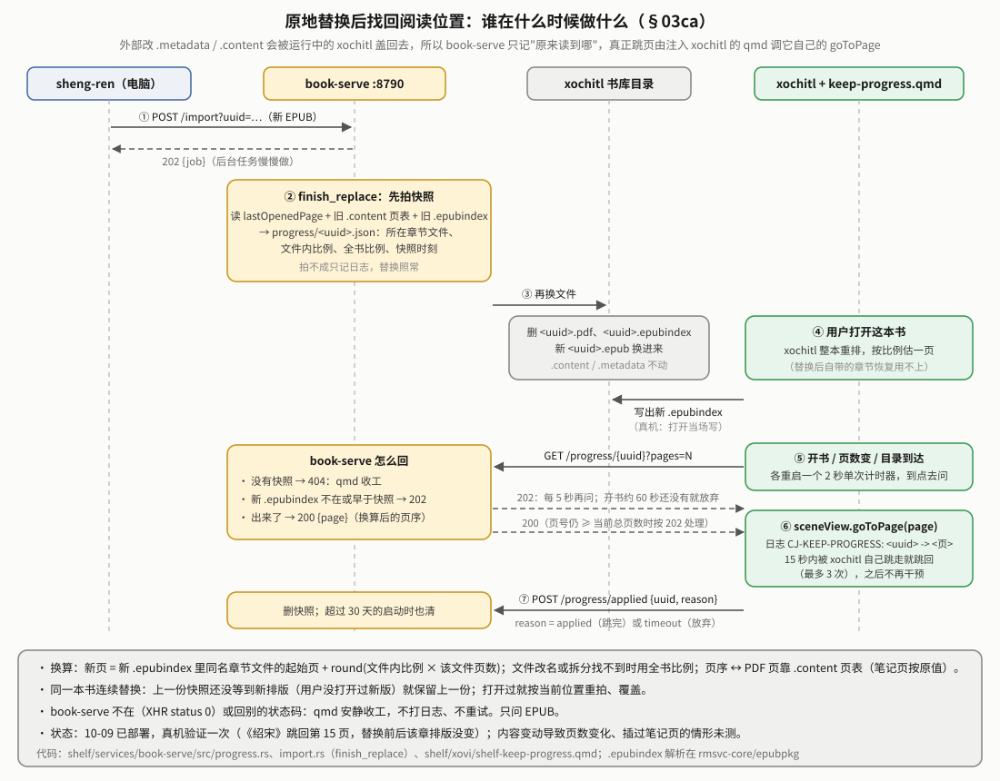

# 传书链路技术细节

> **这份文档管什么**：书在设备上**怎么流动**的实现细节——母版库的目录与状态字段、落库与认领、大文件通道、qmd 代理的队列规则、内存、异步与锁、全部 API 与配置。给要改 book-serve 或排查具体字段的人看。
>
> - **先读[书架白皮书](reMarkable书架白皮书.md)**：它讲书架是什么、怎么用、各部分怎么配合、验证到哪一步（第 1–4、8 节）。本文不重复那些概述，只补实现层面的细节；两边说法以代码为准。
> - **文件名**里的"EPUB 线"是历史叫法（当年 EPUB 走设备端优化、PDF 另走转换线），文件名被多处引用，没改。**节号 §0–§11 保持不变**，别处写"传书线架构 §9"指的就是本文 §9。
> - **按 2026-10-10 的代码写**（master，含 10-10 重构）。标"10-10"的改动**还没部署到设备**；部署与真机验证状态只记在书架白皮书第 8 节。
> - 书该被优化成什么样（排版、注释、漫画）、xochitl 阅读器的实测怪癖：**sheng-ren 仓库** `docs/typesetting.md`、`docs/xochitl.md`。已删功能（设备端优化、PDF 转换、KOReader、日漫翻页等）的当年做法：[书架白皮书历史附录](reMarkable书架白皮书-历史附录.md)。

## 0｜范围

"传书"＝书架里"把书弄到 xochitl 里"的统称：入库（网页上传 / scp 进 `inbox/`）→ 母版库 → 加入 xochitl；外加给 sheng-ren 用的直接导入。用户视角与图见书架白皮书第 2–3 节。两条硬规则：**只收 EPUB / PDF**（`rmsvc_core::formats`）；**不改书的内容**——入库、加入都是复制字节，唯一会动的是文件名（§2.1）。

## 1｜组件与连接


| 组件 | 角色 | 端口 / 连接 |
|---|---|---|
| `gateway` | 网页 UI + 反向代理 + 批量队列（`batch.rs`）+ 事件汇聚 | `0.0.0.0:443`（HTTPS，登录墙） |
| `book-serve` | 母版库领域服务：入库 / 改名 / 删除 / 下载原件 / 加入 xochitl；投递层 `XochitlDelivery`（`delivery.rs`）；作业队列（`jobs.rs`）；四个 qmd 代理的待办（§4）；直接导入与阅读位置快照（§9） | `127.0.0.1:8790` |
| `shelf-conv` | **库，不是服务**，只读不改书：`epub`（`Book`：container.xml / OPF、书名作者语言、封面图、sheng-ren 的页边距标记；写占位 EPUB 的小 zip 写入器）、`pdfmeta`（第三方 PDF 页数）、`placeholder`（大文件通道的占位文档）、`naming`（文件名规范化）。container.xml / OPF 解析与 href 解码用与笔记线共用的 `rmsvc-core/epubpkg` | 无网络面 |

**网关代理**（`gateway/src/proxy.rs`）：`/api/{段}/*` 按 `gateway/src/manage.rs` 的 `MODULES` 转发到 loopback，剥掉段名（`/api/books/x` → book-serve 的 `/x`）。请求体真流式；后端给了 `Content-Length` 的 200 应答，若是下载（带 `Content-Disposition`）或超过 256KB（`STREAM_MIN_BYTES`）就定长边读边发，其余小应答读完再回。超时只有空闲超时（连接 3 秒、读 900 秒、写 120 秒），不设总时长。

**book-serve → xochitl 直连，不经网关**：`rmsvc_core::xochitl::Xochitl` 连 `10.11.99.1:80`（配置键 `xochitlHost`）的 `/upload`，大文件通道与认领还直接读写书库目录 `~/.local/share/remarkable/xochitl/`。这与"浏览器 → 网关 → book-serve"是两条独立的边。

## 2｜数据流

### 2.1 入库（内容源 → 母版库）

- **网页上传**：`uploader()`（`gateway/ui/dom.js`）逐文件 XHR 真实进度，传 `dedupeApi` 按 `name|bytes` 去重。服务端 `rmsvc_core::multipart` 流式解析，暂存到 `books/.work/` 下随机名 `.<uuid>.book.part`，收完再挑名、rename 入库（只在"挑名 + 改名"那一瞬进落名临界区，§7.3）。
- **scp 进 `inbox/`**：`fswatch` 监听（8 秒防抖）自动追平。修改时间离现在不足 5 秒（`INBOX_SETTLE`）的文件先跳过，写完那次 `CLOSE_WRITE` 触发的下一轮再收；启动时先起监听、再扫一遍启动前就在的文件，遇到"暂缓"的隔 5 秒重扫、最多 12 轮。判据只看"还在不在写"，scp 中途断开的半截文件静止后同样会被收。

  

非 EPUB/PDF 回执"不是书籍格式，母版库只收 .epub .pdf"。

**同内容去重**：落名前若母版库里已有同（规范）名、内容逐字节相同的书，直接认那一本；同名不同内容加数字前缀（`unique_path`），不覆盖。

**书名规范化**（`shelf_conv::naming::canonical_file_name`，内部用 `canonical_book_name`）：入库直接用规范名 `书名 - 02卷`（去掉下载站 `-- 作者 -- … -- hash` 尾巴与 `[完]`；`卷02`/`第二卷`/`Vol.3` 规整成 `02卷`/`二卷`/`3卷`；无卷标记原样；幂等）。**只改文件名、不改书里的 `dc:title`**。`canonical_book_name` 从 sheng-ren 复制，sheng-ren 改了规则这里要跟着改（书架白皮书 6.7）。

**长书名**：`rmsvc_core::fs::write_atomic` 的临时名只保留目标名前 200 字节（`TMP_BASE_MAX`）；母版库自己的临时文件与书名无关（`ScratchFile`，§2.2）；边车名超长时用短名（§2.2）。

### 2.2 母版库

目录 `$XDG_STATE_HOME/shelf/books/`（设备上 `~/.local/state/shelf/books/`，/home 分区，重启 / OTA 不丢）：

| 路径 | 作用 |
|---|---|
| `staging/` | 母版库本体，条目永久保留，落库不自动删 |
| `inbox/` → `.work/` → `staging/` 或 `failed/` | `spool.rs` 追平队列（同一时刻只跑一轮，spool 锁）；`.work/` 兼网页上传暂存；`failed/` 封顶 50MB，带 `<name>.reason`（原子写）；重试＝人工拷回 `inbox/`（无 HTTP 接口） |
| `mkdir-pending.json` / `trash-pending.json` / `comic-margins.json` / `agent-failures.json` | qmd 代理队列与放弃记录（§4） |
| `progress/<uuid>.json` | 原地替换前的阅读位置快照（§9） |
| `import-tmp/` | 直接导入的请求体暂存（启动时清残留） |
| `staging/.pdf-originals/`、`done/` | 旧版遗留目录，代码不再读写、不自动清 |

`Staging`（`book-serve/src/staging/mod.rs`；动作分在 `intake.rs` / `deliver.rs` / `library.rs`）核心字段：`dir`；`delivery: Arc<XochitlDelivery>`；`ops: OpRegistry`（进程内存态忙锁，按书名，不落盘）；`caches: ListCaches`；`land`（落名临界区的锁）。

**忙锁 vs 边车**：`ops` 答"现在有没有线程在跑"，重启即清零；边车答"上次加入跑到哪 / 结果如何"。同一条目「加入」「改名」「删除」互斥（删除在删的那一刻也占着），冲突回 **409**"《…》正在处理中，请稍候"（10-10；此前 400）。加锁统一用 `OpRegistry::try_guard`，返回的守卫离开作用域（含 panic 展开）自动解锁，可以移进后台作业。

**跨分区入库**（`stage_from_path` 的 rename 失败时）：先在落名临界区**外**把字节拷进母版库目录下的点前缀临时文件，再回临界区挑名、同目录 rename。临时文件一律 `ScratchFile`（`book-serve/src/scratch.rs`，与直接导入共用），名字 `.<pid>.<序号>.landing.tmp`，Drop 时自动删。

**重启修正**：启动时 `recover_interrupted` 把停在 `pending` 的落库记录改为 `failed`（"服务重启，上次加入被中断，可重新加入"）、渲染改为 `timeout`，并删掉母版库目录下所有"点前缀 + `.tmp` 结尾"的普通文件；`gc_orphan_sidecars` 清孤儿边车，新书落地前也清目标名旧边车。

**边车文件名**（`sidecar::file_name_for`，唯一入口）：`.<书名>.delivered` 不超过 255 字节时就是这个名字；超过时改成 `.<书名按字符边界截到 200 字节>.<书名 sha256 前 16 位 hex>.delivered`。孤儿清理与启动修复先用 `sidecar::owners` 建"书 → 边车名"反查表再认主。

**列表缓存**（`staging/library.rs::ListCaches`）：两份 `rmsvc_core::cache::StampCache`（上限 4096 条），按文件戳（长度, mtime, inode）缓存边车内容与 `onopen` 书的 `.content` 页数。文件没变时一次列表每本书只剩几次 `stat`。

**边车内容**（`sidecar.rs`，字段全可缺省，旧记录照读）＝`Delivered { native: Option<u64>（最近加入 xochitl 的时间戳）, render: Option<RenderCheck{uuid, pages, status, at}>, deliver: Option<DeliverCheck{status, message, at}> }`。旧边车里已退役的字段（`koreader`、`optimize`、`render.expected`、`source`、`direction` 等）serde 当未知字段忽略，下次改写时消失。

| 字段 | `status` 取值（`rmsvc_core::wire`，10-10） |
|---|---|
| `deliver` | `pending` → `ok` / `failed`（落库没有安全中断点，不可取消） |
| `render` | `pending` → `ok` / `timeout`（没等到或没认出，不算错）；大文件通道的 EPUB 另有 `onopen`（首次打开才渲染；列表发现 `.content` 页数变了就升成 `ok` 并写回） |

历史值（如 `cancelled`、`warn`）读成 `unknown`，写回时变成 `"unknown"`；网页按"不是 ok 也不是 pending"显示。

**列表条目**（`GET /staging` 的 `items[]`，`StagingEntry`）：`name`、`bytes`、`format`（`epub` / `pdf`，其余 `other`）、`mtime`、`delivered`（边车）、`busy`，以及 10-10 起后端算好的 `title`（显示名：去 `.epub`/`.pdf`、取第一个 ` -- ` 之前）、`series`（`title` 第一个 `-` 之前，搜索建议分组）、`done`（不忙、上次加入没失败、加入过）。三者逐字移植网页原来的 `stgClean` / `stgTitle` / `isBookDone`（规则是用户定的，不要改成 `canonical_book_name`）。外层 `freeBytes`（`rmsvc_core::fs::fs_space`，statvfs）与 `lowSpace`（剩余严格小于 300MiB，`LOW_SPACE_BYTES`；查不到空间为 false）。


### 2.3 落库（母版库 → xochitl）


- **入口**：`Staging::spawn_deliver`（HTTP `POST /staging/deliver`）先做零耗时校验（格式 400 / 书不在 404 / 忙 409），通过才加忙锁、边车记 `pending`、排进作业队列（`jobs.rs`，与直接导入共用一个工作线程），立即回"已开始"。作业里 `catch_unwind` 兜住 panic、写结果、解忙锁、`bus.publish(books, staging)`。排队期间这本书显示"处理中"。
- **文件夹**：`XochitlDelivery::ensure_folder`——空＝书库根；非空＝**书库根正下方**按名字找（基座 `Xochitl::child_folder`），没有就 `MkdirQueue::add_in(&Folder::Root, 名字)` 请代理建，`fswatch::wait_for` 先挂监听再查一次，最多等 20 秒（`FOLDER_WAIT_TIMEOUT`，防抖 3 秒），等不到落书库根。目标用 `Folder`（`Root` / `Id(FolderId)`）表示、按 uuid 上传。上传前"设当前文件夹"失败时基座退回书库根。10-10 前按名字在全库任意层找（审计 X-1）。
- **≤ 体积门**（`nativeUploadLimitMb`，缺省 90MB）走普通上传，流式发送：
  - PDF：`XochitlDelivery::upload_only` → 基座 `Xochitl::upload_to`，不认领。
  - EPUB：`XochitlDelivery::upload_and_claim` → 基座 `Xochitl::upload_and_claim(…, ClaimBy::SameBytes, ClaimWait{…})`：上传前快照书库里最近建的文档，上传后等书库目录变化（防抖 500ms），在快照之外的新文档里找 `<uuid>.epub` 与母版逐字节相同的那份。xochitl 回了 2xx 最多等 20 秒（`CLAIM_WAIT`）；`/upload` 读超时 / 408（`Delivery::LikelyDelivered`）最多等 30 分钟（`CLAIM_WAIT_SLOW`）。认领期间忙锁占着，母版删不掉也改不了名。
  - **认不出就不认**（`ClaimError::NotFound`）：落库照算成功，渲染记 `timeout`、uuid 留空、不登记页边距。上传本身失败（`ClaimError::Upload`）记 `failed`。
- **渲染自检**（`render_check::run`，另起线程、不占作业队列）：先登记漫画页边距（§3），再限时 10 分钟（`TIMEOUT`，防抖 3 秒）监听书库目录，等这个 uuid 的 `.content` 写出 `pageCount`（`ok`），等不到记 `timeout`；结果写边车 `render` 并推 `books/render` 事件。只读 `.content`，不写 xochitl 目录。
- **> 体积门**：大文件通道（§6.1）；走不了整本拒绝。
- 书名、封面、页边距标记都从同一个 `shelf_conv::epub::Book` 取，一本书只开一次 zip。

### 2.4 改名与下载原件

- **下载原件** `GET /staging/file?name=`：`Reply::sized_stream` 边读边发（带 `Content-Length` 与 `Content-Disposition`），网关也流式转发，整条链不把书读进内存。
- **改名** `POST /staging/rename {name, newName}`：只改文件名，扩展名不变（不带扩展名沿用原扩展名；带了别的扩展名只当名字的一部分）；新名已存在 409、书不在 404、名字不合法 400；新旧两个名字都占忙锁；边车跟着改名。边车里渲染自检还是 `pending` 时直接收成 `timeout`（自检线程按旧名找书，改名后永远找不到）。

### 2.5 阅读方向（已删除）

书架不管翻页方向（2026-10-07 稍后删除）。xochitl 不看 OPF 的 `page-progression-direction`，日漫在 xochitl 里一律从左往右翻。当年的接口与 qmd 分支见历史附录 §03bx。单击翻页 `reader-page-turn.qmd` 不经 book-serve，归系统增强线。

## 3｜漫画页边距（带 sheng-ren 标记的漫画一律登记）

问题：xochitl 的图片框由"栏宽（303pt − 2×页边距，缺省 56）"与"高度上限 462.1pt"先到者决定，漫画页左右留白约 20/23pt；改 `.content` 会被运行中的 xochitl 盖回（5 次仅成功 1 次），须让 xochitl 自己调 `EpubProperties.setMargins`。漫画按页边距 1 排版是 sheng-ren 的事；书架只负责**认标记、登记、让 xochitl 设页边距**。没有开关。

| 环节 | 代码 | 行为 |
|---|---|---|
| 认标记 | `shelf_conv::epub::Book::reader_margins` → `Option<u32>`：书里有 `META-INF/eink-reader-margins`（值是页边距，现为 `1`）；标记名常量 `READER_MARGINS_MARKER` 必须与 sheng-ren 一致；只读前 16 字节 | 不带标记的书（文字书、PDF、书架 2026-10-07 前自己优化的漫画）完全不碰 |
| 登记 | `XochitlDelivery::register_comic_margins(uuid, 名字, 页边距)` 写 `comic-margins.json` | 落库普通上传：渲染自检线程开头（认出 uuid 之后；认不出不登记）；直接导入新导入：认领后立即；大文件通道：替换后立即。**原地替换不重新登记**（每本只设一次，用户调过的不被覆盖） |
| 执行 | `shelf/xovi/shelf-comic-margins.qmd`（注入 DocumentView）：开书 1.5 秒后 `GET /margins/{uuid}`（404 不动；200 调 `setMargins(m)`），成功后 `POST /margins/applied` 销账；出错写 `CJ-COMIC-MARGIN: failed` | 每本只设一次；qmd 只在 xochitl 启动时加载，装 / 改后要整机重启 |

## 4｜设备端代理队列：为什么不能直接建文件夹 / 删文档

外部进程不能直接写 xochitl 的 `.metadata`（运行中的 xochitl 会覆写回来），唯一可靠的路是让 xochitl 自己的 QML 去做。`book-serve` 维护三个排队代理（`mkdir.rs` / `trash.rs` / `comic_margins.rs`，共用 `pending_queue::PendingQueue<T>`；前两个长轮询的再共用 `AgentQueue<T>`——剔除已完成、交出、交满放弃一整套），由注入的 qmd 拉取执行；第四个 `shelf-keep-progress.qmd` 不走队列（§9）。概览图见书架白皮书 4.4。

| 队列 | qmd（`shelf/xovi/`） | 触发 | 用途 |
|---|---|---|---|
| `mkdir-pending.json`：（上级, 名字） | `shelf-mkdir-agent.qmd`（MainView） | 长轮询 `GET /mkdir/pending?wait=290`（服务端阻塞到入队或到期，上限 300 秒；遇 30 秒客户端超时自动退回 25 秒）；按 `items` 调 `Library.createCollection(parent, name)` | 网页「加入 → 文件夹」与「＋新建」（建在根）；直接导入逐级建多级文件夹（建在上一级里）；`POST /mkdir/add`（建在根） |
| `trash-pending.json`：uuid + name | `shelf-trash-agent.qmd`（MainView） | 长轮询 `GET /trash/pending?wait=290`（同样带 `cjWait` 自适应，10-10）；先 `Library.entryForId(uuid)` 取条目再取 `.id`，调 `LibraryController.moveEntriesToTrash(ids)`，与当前在看哪个文件夹无关 | 入队按 visibleName 核对 uuid，已进回收站或已删的拒绝；拉取时只把"`.metadata` 真没了、或已进回收站"的项移出，读不了 `.metadata` 先留着；调用方是网关「设备健康 → 清理」和笔记线 note-serve 旧版本软删 |
| `comic-margins.json`：uuid → 页边距 | `shelf-comic-margins.qmd`（DocumentView） | 开书 1.5 秒后 `GET /margins/{uuid}` | §3 |

**建文件夹按（上级, 名字）记**：队列项 `{name, parent, at}`，`parent` 是上级文件夹 uuid、空串＝书库根。入队去重和"已经建出来就剔除"都按（parent, name）判——只有那个上级正下方有同名活文件夹（`CollectionType`、没删、不在回收站）才算存在。`GET /mkdir/pending` 回 `{"items": [{"name", "parent"}, ...]}`。`POST /mkdir/add {name}` 建在根，名字里的 `/` 当普通字符。**`createCollection` 传非空 parent 还没真机验证**（依据是反编译里对话框传 `currentFolderId`，以及界面手工建的多级文件夹的 `.metadata`）。

`XochitlDelivery::ensure_folder_path` 每一级最多等 20 秒；入队时文件夹刚好已经出现（`add_in` 回 0）就不等；某一级等不到就停在已经有的那一级（单段就是书库根）。

**两条长轮询共用的交付规则**（`pending_queue::Handout<K>`，键是回收站的 uuid / 建文件夹的（上级, 名字））：

| 规则 | 现状 | 为什么 |
|---|---|---|
| 什么时候回应 | 有该交的项立即回；否则睡到有人入队、`wait` 到期，**或最早一个"交出后静默期"到期** | 落库只等建文件夹 20 秒，不能等满 290 秒才重交 |
| 静默期 | 同一项交出后，建文件夹 15 秒、回收站 30 秒内不重复交 | 代理执行需要时间，防止重复执行 |
| 重试上限 | 同一项最多交 5 次（`HANDOUT_MAX_ATTEMPTS`）；交满、静默期过了还没真实发生就放弃：移出队列、记日志、记进 `agent-failures.json`（最近 20 条）并发 `agent-failed` 事件（网页页头横幅，`POST /agent-failures/clear` 清空）；重新入队从零计 | 拿不到条目的一项不能永远重交 |
| 代理出错退避 | qmd 请求出错（book-serve 停了、重启中）时 15 → 30 → 60 → 120 秒封顶，成功一次复位 | 书架服务长时间不在时不白醒 |

放弃与退避路径平时难触发，没在真机专门走过。

## 5｜内存安全设计

设备只有约 2GB 内存，systemd 的 `MemoryMax` 在设备上不生效。原则：任何一步都不把整本书读进内存。

| 风险点 | 做法 | 依据 |
|---|---|---|
| 普通上传 | 基座 `Xochitl::upload_to` / `upload_and_claim` 流式发送 | 真机 80MB 书 VmHWM 约 3.4MB（09-19） |
| 大文件通道 | 真文件本机 `fs::copy`，不经 HTTP | — |
| 第三方大 PDF 读页数 | `shelf_conv::pdfmeta` 有界解析（§6.1），最坏峰值约 48MB | host 测试 |
| 下载原件 | 两端都流式（§2.4） | 未量 VmHWM |
| 读 EPUB | 只读 container.xml、OPF、少数几个条目；单条目解压上限：container.xml / OPF / 正文 16MB（`epubpkg::MAX_TEXT_BYTES`）、封面图 64MB（`MAX_IMAGE_BYTES`），超了当成读不到 | host 单测 |
| 多本同时加入 | 网关批量队列一本一本交；book-serve 作业队列一次一件 | — |

**`nativeUploadLimitMb` 缺省 90MB**（94,371,840 字节）：xochitl `/upload` 硬上限经真机 `curl` 二分测得＝100,000,000 字节（≤ 99,999,000 字节照常，≥ 99,999,900 字节起 `413`）。**内存阈值别拍脑袋算，要真机实测 `VmHWM`**。

## 6｜超限书籍的落库：大文件通道

超过体积门时 `Staging::deliver`：① 大文件通道（§6.1，整本，EPUB / PDF 都行）→ 走不了（超过 1GiB、本机无书库目录、造不出占位）→ ② **整本拒绝**，回执"《书名》N MB 超过 xochitl 上传上限（90 MB），也走不了大文件通道（超过 1GB，或造不出占位文档），没有加入"。

### 6.1 "占位 + 磁盘替换"


`Staging::try_deliver_direct` → `XochitlDelivery::upload_large` → 基座 `Xochitl::upload_large(…, folder: &Folder, placeholder, pdf_pages)`：

1. 造带真书名和真封面的占位（`shelf_conv::placeholder`）：EPUB 显示名用书自己的 `dc:title`，几十到几百 KB；PDF 是手写的一页最小 PDF（954×1696，单测断言 <4000 字节）。
2. 上传占位，按**占位字节数**认领新文档（基座 `upload_and_claim(…, ClaimBy::SameSize, …)`，等书库目录 inotify）。
3. 母版拷成 `<uuid>.<ext>.new`（0600，校验大小）→ EPUB 删渲染缓存（`.pdf`、`.epubindex`）/ PDF 改写 `.content`（`pageCount`、`originalPageCount`、`pages`、`redirectionPageMap`、`sizeInBytes`）→ 原子 rename 覆盖占位（不用重启 xochitl）。
4. `mark_delivered`；渲染记录 PDF 直接 `ok`（页数是写进去的真页数），EPUB 等占位 `.content` 写出页数（最多 10 秒）后记 `onopen`；漫画登记页边距（§3）。

**整段串行**：PDF 占位是同一份固定字节，两本大 PDF 同时投会认到同一个 uuid；基座在进程内用一把锁从"传占位"串到"替换完成"（回归测试用"回应后才落盘"的假 xochitl 复现，去掉锁必挂）。真机没有并发投过两本大 PDF。

**适用条件**：EPUB/PDF、≤ 1GiB（`MAX_DIRECT_BYTES`）、本机有书库目录、造占位成功；否则返回 `None`，调用方整本拒绝。PDF 先读真页数：`shelf_conv::pdfmeta::page_count` 按 PDF 规范从文件尾 `startxref` 沿 `/Prev` 链登记每一节交叉引用（传统表、交叉引用流、混合式 `/XRefStm` 都认），取最新 trailer 的 `/Root` → Catalog 的 `/Pages` → `/Count`；对象在对象流里就只解压那一个流（FlateDecode + PNG 预测器）。内存硬上限：字典对象窗口 ≤4MB、单个流压缩 ≤16MB / 解压后 ≤32MB、`/Prev` ≤64 节、传统表子段 ≤10 万、页数 ≤20 万；格式不认识一律 `Err` → 整本拒绝，不 panic。

**占位已上传后才出的错直接报错**（书库里可能留下半成品占位，回执提示手动删，不做危险的回滚删除）。**占位必须带真书名和真封面**：xochitl 用占位 `dc:title` 当显示名、导入时生成封面，替换后不补生成（真机踩过）。

## 7｜异步任务与进度上报

点按钮立即返回"已开始"，活在后台跑，结果写进边车并经事件推到网页；网页从不定时轮询。落库没有分步进度，网页对处理中的书画不确定态滚动条。

**事件**：`rmsvc_core::events::EventBus`，book-serve 在状态变更点 `bus.publish(area, kind)`（area 都是 `books`；`kind`：`staging`/`inbox`/`render`/`trash`/`mkdir`/`agent-failed`/`import`，常量在 `events.rs`，测试核对网页 `core.js` 的 `EV` 表认得每一个）。网关 `GET /api/events`（SSE；缺省 20 秒心跳，网页带 `?ka=60`）汇聚各服务事件并补 `svc` 字段，网关自己的批量队列变化也发 `books`/`batch`。浏览器按事件来源找页签：前台母版库收到 `batch` 只取批量状态 1 个接口；`staging` / `render` 再加母版库列表共 2 个；其余事件、切页签、重连时全量取 3 个（再加 `GET /api/books/status`）。事件流断了（网关重启后 401、并发满 503）先查一次 `/api/session`，否则 5 秒起翻倍、封顶 5 分钟退避重连；页面隐藏时不重试。全站取数时机见网关白皮书。

### 7.1 不能中途停

剩下的操作（整本上传、大文件通道、认领）都没有安全的中断点，**没有取消**。批量「全部中止」清掉还没开始的，已经交给 book-serve 的那本会跑完。

### 7.2 批量队列（在网关）

网关是后端服务与浏览器间唯一的转发关口，所以批量队列放这里（`gateway/src/batch.rs`），完整机制见 [`gateway/docs/reMarkable网关白皮书.md`](../../gateway/docs/reMarkable网关白皮书.md)：

- `POST /api/batch {action: "deliver", names | all:true, folder}`，后台 worker **顺序逐本**：交给 book-serve 后等它在 `/staging` 不再 `busy`（`poll_until_settled`：事件驱动、至多 30 秒兜底查一次；两次 `GET /staging` 至少隔 5 秒；连续失败 6 次才放弃等待；上限 1 小时）才取下一本。
- **成败**从最后取到的列表里读这本的 `delivered.deliver.status`：只有 `ok` 算成功；`failed` 带原因记失败；等满 1 小时、连续查不到、条目途中消失、仍是 `pending` 一律记失败，提示"请到 xochitl 书库里核对"。
- 入队按"与界面按钮同一套资格条件"（EPUB/PDF）过滤，不适用的计入 `skipped`；`action` 只认 `deliver`。
- 状态落盘 `~/.local/state/shelf/batch.json`，网关重启 `resume` 续跑（最多等 book-serve 就绪 30 分钟，期间 `GET /api/batch/status` 的 `waitingService=true`）；进行中那本一律放回队首重放；`POST /api/batch/stop`＝全部中止（当前这本已出队、还没提交时也会放弃）。


### 7.3 进程内的锁：谁和谁不能同时做


原则：**锁只包住真正会撞的那一小段**。

| 锁 | 代码 | 谁进 | 锁多久 | 防什么 |
|---|---|---|---|---|
| 忙锁 | `ops.rs::OpRegistry`（按书名） | 加入 xochitl、改名（新旧两名）、删除 | 整个操作（含排队） | 同一本同时被加入 / 删除 / 改名 |
| 落名临界区 | `Staging::land`（`land_guard()`） | 网页上传、inbox 追平（`stage_from_path`）、改名 | 只包"`unique_path` 挑名 + rename / 写入"，毫秒级；跨分区拷贝在锁外 | 两本同名书挑到同一个名、后到的覆盖先到的 |
| spool 锁 | `Spool::guard` | `process_inbox` 一轮追平 | 一轮 | 两轮追平抢同一文件 |
| 边车写锁 | `sidecar::update`（全局 static） | 所有边车读-改-写 | 一次读改写 | 交错写丢字段 |
| 投递作业队列 | `jobs.rs::Jobs`（一个工作线程，10-10） | 网页落库（`spawn_deliver`）、直接导入（`POST /import`） | 一件作业（建文件夹、上传、认领；渲染自检另起线程不占） | 落库与直接导入同时往 xochitl 传 |
| 跨进程上传锁 | `rmsvc_core::xochitl` 的 `UploadLock`（进程内 static + `$XDG_RUNTIME_DIR/shelf/xochitl-upload.lock` 的 `flock`，10-10） | 每次"设当前文件夹（`GET /documents/<文件夹>`）+ `POST /upload`"，含 note-serve 投笔记本 | 一次上传 | 并发投递（含另一个进程）落进别人的文件夹 |
| 认领串行 | 基座 `Xochitl::upload_and_claim`（进程内 static） | 落库 EPUB、直接导入、大文件通道的占位认领 | 快照 → 上传 → 认出 uuid | 两次投同一份字节时后一次认走前一次的文档 |
| 大文件通道锁 | 基座 `Xochitl::upload_large`（进程内 static） | 超体积门的投递 | 传占位 → 认领 → 换成真文件 | 两本大 PDF 认领到同一个条目 |

这些场景都有 host 回归测试（如 `slow_upload_does_not_block_inbox_processing`、`concurrent_landing_of_same_name_never_clobbers`、`concurrent_uploads_land_in_their_own_folders`、`remove_holds_busy_lock_and_releases_it`、`concurrent_large_pdf_uploads_claim_distinct_entries`、`stage_from_path_across_filesystems_lands_atomically`），并发场景没在真机专门触发过。认领等待不跨进程互斥：笔记本按 visibleName 认、书按字节认，不会撞；跨进程互斥反而会让笔记本同步陪着等大书排版。锁的来由见历史附录 §03cb、§03cc 与第 E 章。

## 8｜前端 UI 层（`gateway/ui/transfer.js`）

网页脚本按页拆成多个文件、编译时拼回同一页：传书页在 `transfer.js`；上传控件 `uploader()`、不确定态进度条 `renderBusy` 在 `dom.js`；事件常量表 `EV` 与取数封装在 `core.js`；`app.js` 只剩装配。`renderTransfer` 渲染「传书」页的两个子面板：**入库**（上传卡，提示"书请先在电脑上用 sheng-ren 的 xochitl 模式优化好再传"）与**母版库**。

母版库页的行为（行内只显示状态、操作在底部栏、加入位置下拉、筛选与分页）见书架白皮书 3.3；页面实现与取舍见网关白皮书「母版库页」。用到的后端字段：列表的 `title` / `series` / `done` / `busy` / `delivered`（§2.2）、`freeBytes` / `lowSpace`、`GET /status` 的 `xochitlFolders`、`GET /api/batch/status`。

## 9｜配置与 API 一览

**`BookConfig`**（`$XDG_CONFIG_HOME/shelf/book.json`，camelCase；缺省可用，首启写出缺省文件；退役的键如 `libraryFolder`/`annotFolder`/`comicMono` 静默忽略；文件坏了按缺省运行并另存 `.corrupt`）：

| JSON 键 | 缺省 | 说明 |
|---|---|---|
| `xochitlHost` | `10.11.99.1` | xochitl web 主机（`/upload`） |
| `uploadTimeoutSecs` | 300 | `/upload` 超时（超时但已送达判 `LikelyDelivered`，绝不重试） |
| `nativeUploadLimitMb` | 90 | 体积门：≤ 普通上传，> 大文件通道（§5、§6.1）；0＝不拦 |

**`/api/books/*`**（网关代理到 `book-serve:8790`，剥掉 `books` 段；直连后端去掉 `/api/books` 前缀）：

```
GET  /status                         {ok, xochitlFolders}（书库根下的文件夹；3 秒缓存，加入 / 直接导入后失效）
GET  /staging                        母版库列表 {items, freeBytes, lowSpace}
POST /staging                        multipart 入库（逐文件）
GET  /staging/file?name=             下载原件（流式，带 Content-Disposition）
POST /staging/rename {name, newName} 改名（新名已占用或忙 409、书不在 404、名字不合法 400）
POST /staging/deliver {name, folder?} 异步加入 xochitl（格式不收 400、书不在 404、忙 409）
POST /staging/delete {name}          删除条目（忙 409、书不在 404）
GET  /margins/{uuid} · POST /margins/applied {uuid}   漫画页边距待办（qmd 用；没登记的 uuid 回 404）
GET  /progress/{uuid}[?pages=N]      原地替换后的阅读位置（qmd 用）：没有快照 404；新 .epubindex 还没出来 202 {pending:true}；出来了 200 {page}（文档页序，0 起）
POST /progress/applied {uuid, reason?}  删阅读位置快照（reason=applied / timeout）→ {ok, removed}
GET  /events                         SSE 事件流
POST /trash/add {uuid, name} · GET /trash/pending[?wait=秒] · GET /trash   回收站代理队列（GET /trash 只供调试）
POST /mkdir/add {name}（建在根）· GET /mkdir/pending[?wait=秒] → {items:[{name, parent}]} · GET /mkdir   建文件夹代理队列（GET /mkdir 只供调试）
GET  /agent-failures · POST /agent-failures/clear      两个代理交满次数放弃的记录
POST /import?name=&folder=           直接导入、不进母版库（体＝EPUB 原始字节；folder 是 / 分隔的多级路径）→ 202 {job}
POST /import?uuid=&name=             原地替换已有文档内容、uuid 不变 → 202 {job}；不在 / 已删 / 回收站 / 非 EPUB → 404；同一 uuid 正在替换 → 409
GET  /import/jobs/{id}               → {job, state: running|done|failed, stage, uuid?, name?, folder?, message?}；不存在 404
GET  /import/{uuid}                  → {uuid, name, folder, deleted, replacing}（folder＝从根起的完整路径）；不存在 404
POST /import/states {uuids: [...]}   → {docs: {<uuid>: {name, folder, deleted, replacing}}}（一次查一批，不存在的不出现；最多 10000 个）
```

**错误状态码**（10-10，`error.rs`）：母版库、回收站、建文件夹的领域错误分种类——请求不对（文件名非法、格式不收、名字为空、uuid 形状不对、回收站入队名字对不上）400；不在（母版库里没有这本书、书库里没有这份文档）404；冲突（正在处理中、新名字已被占用、已经在回收站）409；设备出错（读写盘、后台作业队列停了）500。`POST /margins/applied` 只会因写队列失败而出错（500）。多文件上传 `POST /staging`：multipart 不合法 400、暂存目录建不了 500，逐个文件的校验失败记在回执里。网页与 sheng-ren 只看是否 2xx 和 `message`。

上传回执统一 `{ok, items:[{name, ok, message, item?}], …}`（`rmsvc_core::asset::receipt`），成功项的 `name` 是落地名。上传暂存：书进 `books/.work/`（与母版库同分区）；xochitl 字体、壁纸进 `$XDG_STATE_HOME/shelf/upload/`。都在服务启动时清掉上次中途被杀留下的 `.part`。

**请求约定**（rmsvc-core）：JSON 请求体上限 1MB；路径参数与上传的 `filename*=` 解码时 `+` 就是 `+`，只有查询串按表单语义把 `+` 当空格；投 xochitl 时文件名里的 `"` 换成 `'`、换行换成空格；multipart 头参数按引号切分（`filename="甲; 乙.epub"` 不会被切成 `甲`）。

### 直接导入（`import.rs`）

给电脑上的 sheng-ren（`booklib sync`）用：经 SSH 端口转发（`ssh -L` 到设备 `127.0.0.1:8790`）直连 book-serve，**不经网关**、不带 `/api/books` 前缀，书**不进母版库**。

- **异步**：`POST /import` 只收体和快速校验，过了就把剩下的活交给作业队列（`jobs.rs`，与网页落库共用），立即回 `202 {"job": "<任务 id>"}`。客户端轮询 `GET /import/jobs/{id}`：`running`（`stage` 是给人看的阶段：「排队」「开始」「建文件夹」「上传给 xochitl、等它排版」「上传给 xochitl（大文件通道）」「登记页边距」「替换文件」）、`done`（带 `uuid`、`name`〔visibleName〕、`folder`〔实际落进的完整路径〕）或 `failed`（带 `message`）。任务记录**只在内存里**：做完的至少留 1 小时（`JOB_KEEP`）；book-serve 重启就没了，查询回 404（任务 id 带进程启动时刻，不会撞上旧 id）；任务 panic 转成失败，工作线程照常做下一个。成功推 `books/import` 事件、让 `/status` 缓存失效。
- **新导入**：请求体（`Content-Type: application/epub+zip`，带 `Content-Length`）按块写到 `import-tmp/` 的临时文件；回 202 之前校验扩展名 `.epub`、非空、≤ 1GiB、收到的字节数等于 `Content-Length`、开头是 zip 头 `PK\3\4`（不对 400）。后台：逐级确保文件夹（`ensure_folder_path`：每一级在上一级正下方按名字找〔基座 `child_folder`〕，没有就 `MkdirQueue::add_in(&上一级, 名字)`，等它建出来〔每级 ≤20 秒〕；某一级等不到就停在已有的那一级）；**幂等**：目标文件夹里已有一份逐字节相同的活文档（先比大小再比字节）就直接认它，不再上传；≤ 体积门走 `upload_and_claim`（同 §2.3 的判据与等待），> 体积门走大文件通道（§6.1）；带标记的漫画登记页边距（§3）。
- **多级文件夹**：`folder` 按 `/` 拆、去掉各段首尾空白和空段（单段＝根下，空＝书库根）；最后按 uuid 上传进最里层，不按名字在全库找。回执和 `GET /import/{uuid}` 的 `folder` 是从文档的 parent 往上拼出的完整路径（`rmsvc_core::xochitl::folder_path_of`；名字本身带 `/` 的文件夹拼出来有歧义，只供显示和比对）。依赖 `createCollection` 传非空 parent，**未真机验证**（§4）。
- **原地替换**：`<uuid>.metadata` 不在、`deleted`、在回收站、没有 `<uuid>.epub` → 404（回 202 之前判，任务开头再判一次）；同一 uuid 同时只允许一个替换（第二个 409，忙锁从收体持到任务做完）。请求体先写 `import-tmp/`（0600，与书库同在 /home）→ **给阅读位置拍快照**（下面）→ 删 `<uuid>.pdf`、`<uuid>.epubindex` → rename 成 `<uuid>.epub`；`.content`/`.metadata` 不动（保留 `lastOpenedPage`、页边距、所在文件夹）；**漫画页边距不重新登记**；缩略图不动。
- **删除**不另设接口：`POST /trash/add {uuid, name}`（`name` 用任务结果里的 visibleName）。
- **超时**：rmsvc-core 只有"读请求体时 60 秒收不到一个字节就断"的空闲超时（`READ_IDLE_TIMEOUT`），没有请求体大小上限和总时长上限。

### 找回阅读位置（`progress.rs` + `shelf-keep-progress.qmd`）



| 环节 | 做什么 |
|---|---|
| 快照（`finish_replace` 删旧 `.epubindex` **之前**） | 读 `lastOpenedPage`（基座 `Metadata::last_opened_page`；≤0 不存）→ 按旧 `.content` 页表（基座 `PageTable`）换成 PDF 页 → 用旧 `.epubindex` 找所在 spine 文件、文件内比例 `(页 − 起始页) / 该文件页数`，另存全书比例；原子写 `progress/<uuid>.json`（带毫秒时间戳）。没有旧 `.epubindex` 不存；任何一步失败只记日志，不影响替换 |
| 查询 `GET /progress/{uuid}[?pages=N]` | 没快照 404；新 `.epubindex` 不在或修改时间早于快照 202；出现了 200 `{page}` |
| 销账 `POST /progress/applied` | 删快照；超过 30 天（`MAX_AGE`）、读不了、书已不在库里的快照启动时清掉 |
| 跳页（qmd，注入 DocumentView） | 开书、页数变化、目录到达三个时机各重启一个 2 秒单次 Timer，只问 EPUB。404 收工；202 每 5 秒再问，约 60 秒放弃（`reason:"timeout"`）；200 时页号若还 ≥ 当前总页数按 202 处理，否则 `sceneView.goToPage(page)`，打 `CJ-KEEP-PROGRESS: <uuid> -> <page>` 并销账；15 秒内被 xochitl 自己跳走就跳回（最多 3 次）。book-serve 不在或回别的状态码：安静收工 |

**换算**：文档页序 ↔ PDF 页靠 `.content` 页表——formatVersion 1 用 `redirectionPageMap`（笔记页是 -1）；formatVersion 2 用 `cPages.pages`，按 `idx.value` 排序、去掉 `deleted.value` ≠ 0 的页，页对象带 `redir.value` 就当 PDF 页；笔记页、越界、认不出按原值。新页号＝新 `.epubindex` 里同名文件的起始页 + round(文件内比例 × 该文件页数)，夹在该文件范围内；文件找不到（改名、拆分）→ round(全书比例 × (新总页数 − 1))。最后一个文件的页数靠总页数：新 `.content`（修改时间不早于快照才算）→ 阅读器带来的 `?pages=` → 都没有按 1 页。`.epubindex` 解析在 `rmsvc-core/epubpkg::epubindex`，与笔记线共用。

**同一本书再次替换**：上一份快照还没等到新排版（用户没打开过新版）→ 保留上一份、不重拍；新排版出现过（打开过）→ 按当前状态重拍、覆盖；这时 `lastOpenedPage` ≤ 0 就删掉过时的上一份。

## 10｜已知限制

见书架白皮书 7.1（不在这里重复）。只和实现细节相关的补充：

- 网关对 ≤256KB 且不是下载的应答、以及没有 `Content-Length` 的应答仍整体缓冲（都是小 JSON）。
- `shelf-mkdir-agent.qmd` 长轮询 290 秒的依据是设备 Qt 6.10 的 QML XHR 不设传输超时（源码核实）；journal 出现 `SHELF-MKDIR: transfer timeout` 说明退回了 25 秒。
- 认领等待不跨进程互斥（§7.3）。

## 11｜历史

2026-09-03 到 2026-10-06 书架在设备上自己优化书（EPUB 清洗排版、PDF 转 EPUB / 裁边、抓网文、联网补封面、漫画处理），2026-10-07 全部删除，交给 sheng-ren。本文 2026-10-07 前的版本（含当时的 PDF 入库、EPUB 优化管线、兼容预处理、优化内存表）用 `git log -- shelf/docs/传书EPUB线架构.md` 按日期找；决策经过与真机记录见[书架白皮书历史附录](reMarkable书架白皮书-历史附录.md) §03bw 与第四部分。
