# 传书模块 EPUB 线架构文档

> **这份文档管什么**：书在设备上**怎么流动、每个服务管什么**——数据流、母版库状态、落库通道、内存设计、异步与进度、并发与锁、全部 API 与配置。它是"现在怎么运转"的参考，不是会话日志。
>
> **三份书籍文档的分工**（涉及别处的内容，本文只写一句并指过去）：
>
> | 想知道 | 看哪份 |
> |---|---|
> | 书该被改成什么样、为什么（xochitl 十条实测规则、两条优化线的规则、质量门） | [`EPUB优化规范白皮书.md`](EPUB优化规范白皮书.md)（**规则以它为准**） |
> | 优化引擎的函数、常量、版本号、实现层的坑 | [`bookconv优化白皮书.md`](bookconv优化白皮书.md) |
> | 书在服务间怎么流动、API 与配置 | 本文 |
> | 真机排查经过与历史决策 | [`reMarkable书架白皮书.md`](reMarkable书架白皮书.md) |
>
> **怎么读**：先看 §1 架构图、§2 数据流，再按需读 §3–§7；§8 前端、§9 API 与配置、§10 已知限制是查阅用的。第一次接触项目先读 [`../../docs/OVERVIEW.md`](../../docs/OVERVIEW.md)。
>
> **核对时点**：2026-09-19 首写，之后每轮按源码逐字段复核，最近一次 **2026-09-25**（基线 `OPTIMIZE_VERSION`＝`"15"`）。文中"真机验证"沿用当时的记录；只对照了源码、没连设备的地方会写明。09-25 新增：按书阅读方向（§2.6）、抓网文「同步优化」进忙锁与闸门（§7.3）、回收站代理改按 id 删（§4）；同日真机补验了 >153MB 占位通道首次渲染和批量加入（§6.1、§10）。09-25 下午第四轮审计（**只在 host 测过，未部署真机**）改了：inbox 不收还在写的文件（§2.1）、跨分区入库先拷临时文件（§2.2）、删除占忙锁（§7.3）、代理队列重试有上限与出错退避（§4）、大文件通道串行（§6.1）、拆分不丢目录前的页（§6.2）、网页按事件来源决定重取多少（§7）。**2026-09-30**（用户定，**只在 host 测过，未部署、未真机验证**）：撤掉按书阅读方向（§2.6 留作历史，翻页方向只看书里自带的标记）；移除超限书的按卷拆分（§6.2 留作历史，超限只走大文件通道，走不了整本拒绝）；漫画页预放大后也用 JPEG q95。

## 0｜这是什么

"传书"是书架（shelf）里"把书弄到设备上并保证质量过得去"的统称。EPUB 线是其中处理 EPUB 的完整链路——EPUB 是唯一被**深度处理**（清洗排版、目录重建、图片降采样、漫画识别与裁边补白）的格式；PDF 走同一套入库/落库，「优化」由 `bookconv::pdf_ingest` 单独处理（§2.4）。书架只收 EPUB/PDF，其它格式一律拒收（`rmsvc_core::formats`）。

**核心设计**：三层（内容源 → 母版库 → 读器）、三个正交动作（入库 / 优化 / 落库）。"正交"＝互不耦合：入库不需优化，优化后可不落库，落库前不强制优化。母版库是唯一容器，网页没有"跳过母版库直接投读器"的路径。

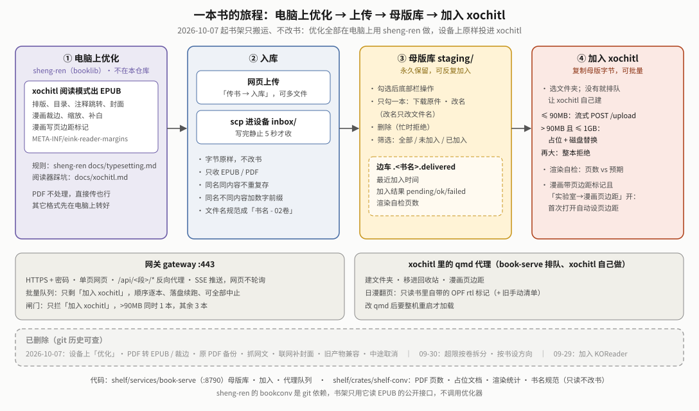

### 0.1 术语小抄

| 词 | 一句话 |
|---|---|
| xochitl | reMarkable 官方阅读器/UI 进程；本项目不改它本体 |
| 母版库 | 设备上永久保存原书的暂存池（`staging/`）；落库＝把书**复制**给读器（xochitl 或 KOReader），母版字节不动 |
| sidecar | 母版库每本书旁的隐藏 JSON `.<书名>.delivered`，记优化/落库/渲染自检结果 |
| qmd | 对 xochitl QML 的补丁（qmldiff 格式），让"xochitl 自己"做外部进程做不了的事 |
| SSE / `VmHWM` | 服务端事件推送（网页不轮询）/ 进程内存峰值（`/proc/<pid>/status`，判断内存问题的权威数字） |

## 1｜整体架构

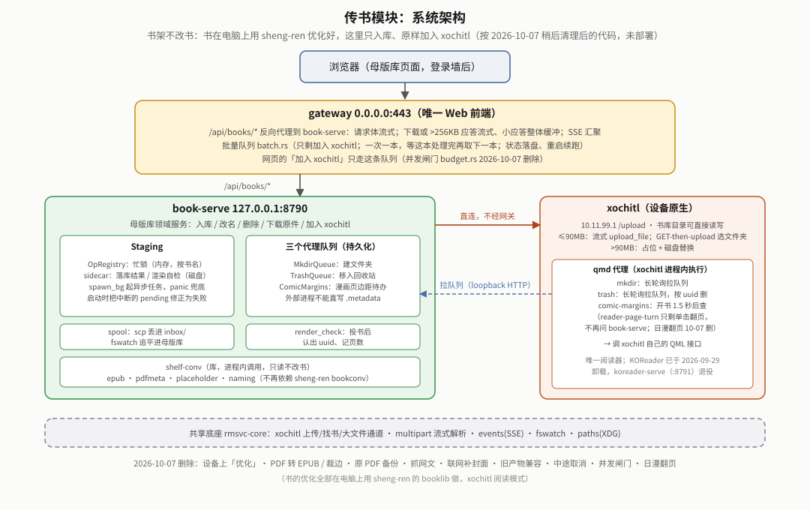

网关和两个领域服务**都跑在设备上**（systemd 单元见 `shelf/systemd/`、`gateway/systemd/`，二进制在 `/home/root/.local/bin`），所以 `book-serve` 能直接读写 xochitl 书库目录：

| 组件 | 角色 | 端口/连接 |
|---|---|---|
| `gateway` | 唯一 Web 前端：网页 UI + 反向代理 + **批量队列（`batch.rs`）+ 并发/内存闸门（`budget.rs`）** + SSE 汇聚 | `0.0.0.0:443`（HTTPS，登录墙） |
| `book-serve` | 母版库领域服务：入库/优化/落库 | `127.0.0.1:8790`（只经网关访问） |
| `bookconv` | **库，不是服务**，被 `book-serve` 进程内调用 | 无网络面 |
| `koreader-serve` | 落 KOReader 的领域服务（另含字体/词典/配置同步） | `127.0.0.1:8791` |

**`bookconv` 不拆独立服务**（评估后否决）：库边界本已干净，拆服务唯一好处是进程隔离，代价是几百 MB 大文件跨进程序列化（峰值内存可能不降反升）；且设备 cgroup `MemoryMax` 从未真正生效（单元写了 `MemoryMax=192M`，但 systemd 没把 memory 控制器代理进 `system.slice` 子树），隔离想要的内存兜底本来就是假的。

**网关代理**（`gateway/src/proxy.rs`）：`/api/{svc}/*` 按 URL 段（`books`→`book-serve`、`koreader`→`koreader-serve`，表在 `gateway/src/manage.rs`）转发到 loopback。**请求体真流式**（大文件上传不占网关内存）；**响应**：后端给了 `Content-Length` 的 200 应答，若是下载（带 `Content-Disposition`）或体积超过 256KB（`STREAM_MIN_BYTES`，壁纸原图等），网关按定长边读边发；其余小 JSON 与没有长度的应答读完再回（2026-09-24；没有长度的流只能走 SSE 那种“读到连接关闭”的通道，拿来做下载会让浏览器等不到结束）。"优化 / 加入 xochitl / 加入 KOReader"三个 POST 与勾了「同步优化」的抓网文（09-25 起）会额外读一次小 JSON 并过并发闸门（§7.2、§7.3）。

**`book-serve` → `xochitl` 直连，不经网关**：`Staging::deliver()` 用 `rmsvc_core::xochitl::Xochitl` 连 `10.11.99.1:80`（USB 网口地址，配置键 `xochitlHost`）的 `/upload`，大文件通道还直接读写书库目录。与"浏览器 → 网关 → book-serve"是两条独立的边，别混成一条。

## 2｜三层数据流

> **大白话**：书先"原样"进母版库（永久保存的原书仓库），之后「优化」「加入某个阅读器」都是在母版上另外点的动作，互不强制。

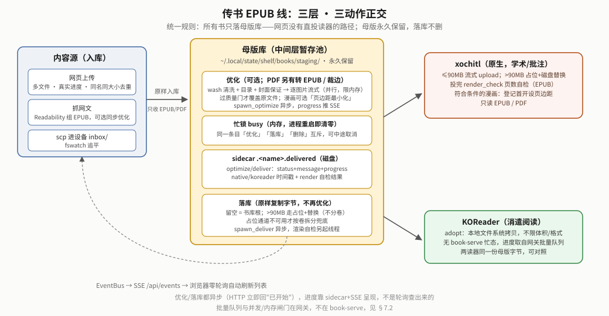

### 2.1 入库（内容源 → 母版库）

三条入口，都是**原样入库，不做格式转换**：
- **网页上传**：`uploader()`（`gateway/ui/app.js`）逐文件 XHR 真实进度；传 `dedupeApi` 按 `name|bytes` 去重（免落成 `xxx_1.epub`）。服务端 `rmsvc_core::multipart` 流式解析边读边落盘（暂存 `.work/` 下随机名 `.<uuid>.book.part`，rename 入库；只在“挑名 + 改名”那一瞬进落名临界区，§7.3）。
- **抓网文**：`Staging::fetch_article`，Readability 提取正文后用 `bookconv::epub` 组装最小合规 EPUB3；可选"同步优化"（缺省勾选；网文无 CSS，不优化会按默认段距留大片空白）。
- **scp 进设备 `inbox/`**：`fswatch` 监听（8 秒防抖）自动追平（§2.2）。**只收写完的文件**（2026-09-25）：scp 直接往最终文件名里写，追平时修改时间离现在不足 5 秒（`INBOX_SETTLE`）的文件先跳过，写完那次 `CLOSE_WRITE` 事件触发的下一轮再收；此前 WiFi 传大书超过 8 秒，还在写的文件会被改名进母版库，写入方的文件句柄跟着 inode 继续写，母版库里出现一本半截书。启动时先起监听、再扫一遍启动前就在的文件，扫描遇到"暂缓"的隔 5 秒重扫，最多 12 轮（约 1 分钟），之后交给事件。判据只看"还在不在写"，scp 中途断开留下的半截文件静止 5 秒后同样可能被收进。

  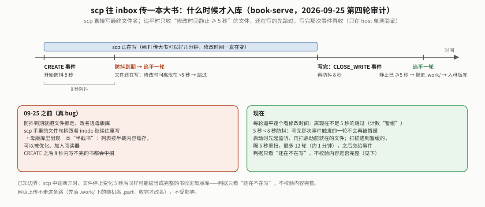

非 EPUB/PDF 回执"不是书籍格式，母版库只收 .epub .pdf"（电脑端命令行 2026-09-18 已整体砍除）。

**书名规范化**（`bookconv::naming`）：入库直接用规范名 `书名 - 02卷`（去掉下载站 `-- 作者 -- … -- hash` 尾巴与 `[完]`；无卷标记原样；幂等）；撞名加数字前缀不覆盖（`unique_path`）；已有长名在「优化」完成时改名（边车一并移动，目标已存在则保持原名）；EPUB 优化还把 OPF `dc:title` 改成规范名（仅带卷标记的书），使设备显示名与文件名一致。

### 2.2 母版库（中间层暂存池）

目录 `$XDG_STATE_HOME/shelf/books/`（设备上 `~/.local/state/shelf/books/`，/home 分区，重启/OTA 不丢）：

| 路径 | 作用 |
|---|---|
| `staging/` | 母版库本体，条目**永久保留**，落库不自动删、不套 LRU（可反复投两读器对照） |
| `inbox/` → `.work/` → `staging/` 或 `failed/` | `spool.rs` 追平队列（同一时刻只跑一轮，spool 锁，§7.3）：`inbox/` 待处理 → `.work/` 处理中（兼上传暂存）；`failed/` 封顶 50MB，带 `<name>.reason`；重试＝人工拷回 `inbox/`（无 HTTP 接口） |
| `staging/.pdf-originals/` | PDF 转 EPUB 后原 PDF 的隐藏备份，保留 7 天（§2.5） |
| `mkdir-pending.json` / `trash-pending.json` / `comic-margins.json` | 设备端代理队列（§4） |
| `done/` | 2026-09-03 早期直投流程的遗留目录，代码已不再读写；设备上仍有几份旧文件，未清理 |

`Staging`（`book-serve/src/staging/mod.rs`；动作分在 `intake.rs`/`optimizing.rs`/`deliver.rs`/`library.rs` 各自的 `impl Staging`）核心字段：`dir`；`xochitl: Arc<Xochitl>`；`native_limit: u64`（体积门，字节，§5）；`ops: OpRegistry`（`ops.rs`，**进程内存态**登记簿，忙锁+取消标记合在一把锁的 `HashMap<条目, OpState{cancellable, cancel}>`，不落盘，容忍 poison）；`probes`（"优化等级/是否 PDF 转来"判定缓存，按（大小, mtime）失效，因判定要开 zip）；`comic_margins`（页边距待办队列，§3.3）。

**忙锁 vs sidecar 是两套独立职责**：`ops` 答"现在有没有线程在跑"，重启即清零（有意，落盘会"永久卡忙"）；sidecar `status` 答"上次异步操作跑到哪/结果如何"。同一条目「优化」「落库」「删除」互斥（同一张 `OpRegistry`；删除 09-25 起在删的那一刻也占着忙锁），冲突回 400 “《…》正在处理中，请稍候”。全部锁一览见 §7.3。**跨分区入库**（`stage_from_path` 的 rename 失败时，2026-09-25）：先在落名临界区**外**把字节拷进母版库目录下的点前缀临时文件 `.<pid>.<序号>.landing.tmp`，再回临界区挑名、同目录 rename；此前直接往最终名上拷，拷贝期间列表里就有一本半截书，拷贝失败还会留下它，而且整段拷贝都攥着落名锁。**重启修正**：崩溃/OOM/断电可能留 `pending`，启动时 `recover_interrupted` 改为 `failed`（优化/落库）/`timeout`（渲染自检）并清 `.optimizing.tmp` 与 `.landing.tmp`；`gc_orphan_sidecars` 清孤儿边车，新书落地前也清目标名旧边车。

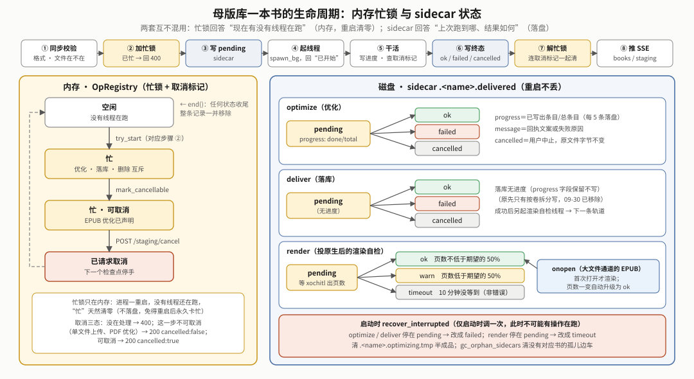

**sidecar**（`sidecar.rs`，字段全可缺省，旧记录照读）＝`Delivered { optimize: Option<OptimizeCheck>, deliver: Option<DeliverCheck>, native: Option<u64>（最近投原生时间戳）, koreader: Option<u64>, render: Option<RenderCheck{uuid,pages,expected,status,at}>（§2.3）, source（历史遗留，网页不再写） }`（2026-09-25～09-29 的边车还带 `direction` 字段，现照读、忽略，§2.6）；`OptimizeCheck`/`DeliverCheck` 均为 `{status, message, at, progress: Option<StepProgress{done,total}>}`。

| 字段 | `status` 取值 |
|---|---|
| `optimize` / `deliver` | `pending`（可带 `progress`）→ `ok` / `failed` / `cancelled`（用户取消，不算失败） |
| `render` | `pending` → `ok` / `warn`（页数远低于期望）/ `timeout`（没等到，不算错）；大文件通道的 EPUB 另有 `onopen`（首次打开才渲染；列表发现 `.content` 页数变了就升成 `ok` 并**写回边车**，09-24 起，此前只改返回给网页的那份，之后每次列表都要再读一遍 `.content`） |

两者形状一致但**故意不合并成泛型**。`StepProgress`：优化＝已写条目/总条目；落库目前不写进度（原先只有按卷拆分写"已成功份数/总份数"，2026-09-30 随分卷一起移除，字段保留）。

### 2.3 落库（母版库 → 读器）

两个读器互不依赖，同一份母版可分别投给两边。决策树（体积门、占位通道、拒绝的先后顺序）：

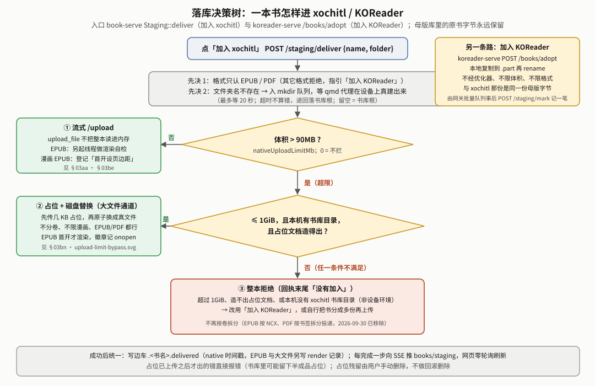

- **加入 xochitl**：`Staging::deliver()`，纯复制字节（不再优化）。`folder` 留空＝书库根（与 KOReader 语义对齐）；文件夹不存在经 `MkdirQueue` 让设备端 QML 代理建（§4）。超体积门（`nativeUploadLimitMb`，默认 90MB）→ 走“占位 + 磁盘替换”大文件通道（§6.1）；超过 1GiB、本机无书库目录或造占位失败就整本拒绝（回执末尾“没有加入”；2026-09-30 前这里还会退回按卷拆分，§6.2）。≤ 体积门走普通上传，`Xochitl::upload_file` 流式发送（§5）。
  走普通上传的 EPUB 另起**渲染自检**线程（`render_check::run`，不阻塞；大文件通道直接写渲染记录）：限时 10 分钟（`TIMEOUT`）轮询书库目录等 xochitl 渲染出页数，低于优化时统计的"期望页数"一半判 `warn`（`WARN_RATIO`＝0.5；真机标定：好书 0.86-0.99，整章渲染失败的坏书低至 0.34），写 sidecar `render` + 推 SSE。`/upload` 不回 uuid，认书靠"投书时刻后新出现的文档 + visibleName 相符者优先，否则取最新"（`render_check::pick`）。
- **加入 KOReader**：`koreader-serve` 的 `POST /books/adopt`，从母版库（共享目录）本地拷到 KOReader `books/`（可选子目录），不经 `bookconv`、不限体积/格式。无 book-serve 侧忙态（两独立进程），落库记录靠网关批量 worker 事后调 `POST /staging/mark {target:"koreader"}` 补记（§7.2）。

两个操作在 HTTP 层都是**异步**（`spawn_optimize`/`spawn_deliver`，共用外壳 `spawn_bg`：起线程 + `catch_unwind` + 解忙锁 + `bus.publish`）：立即回"已开始"，结果经 sidecar + SSE 呈现。

### 2.4 PDF 的「优化」（`bookconv::pdf_ingest`）

> **大白话**：带文字的 PDF 被"重排"成 EPUB（字号可调、目录可点）；扫描件和漫画 PDF 不转格式，只把四周白边裁掉。

母版库「优化」对 PDF 也生效：`classify_pdf` 先分三类，**判不准一律按"无文字层"处理**（宁可不转）。

| 类别 | 判据 | 处理 |
|---|---|---|
| 漫画 | ≥90% 的页被一张近乎整页的图占满 | 只裁边，格式不变 |
| 无文字层 | 每页可提取字符 < 40 | 只裁边，格式不变（只处理"零文字、每页恰一张整页图"的 PDF，否则拒绝、原文件不动） |
| 有文字层 | 能提取出文字 | **转 EPUB**：产出 `<书名>.epub`，原 `.pdf` 挪进 `.pdf-originals/` 留 7 天；母版库已有同名 `.epub` 则**转换前就停下报错** |

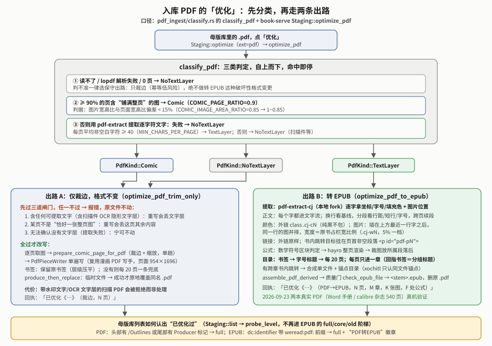

转换本身（逐字提取 → 逐页排版 → 切章 → 组装 → 质量门）的规则见规范白皮书 §5，实现与踩坑见 bookconv 白皮书 §18。数据流上要记住三点：
- 产物同样先写点前缀临时文件、过质量门才落地（§3.2），不过门原 PDF 不动；
- PDF 转出的 EPUB 带「来源」徽章（认 `dc:identifier` 的 `weread:pdf:` 前缀），直接报「已优化」、不进 full/core/old 阶梯；
- PDF 优化**不可中途取消**（§7.1），并发闸门照常把关。

### 2.5 改名、下载原件与原 PDF 备份（2026-09-24）

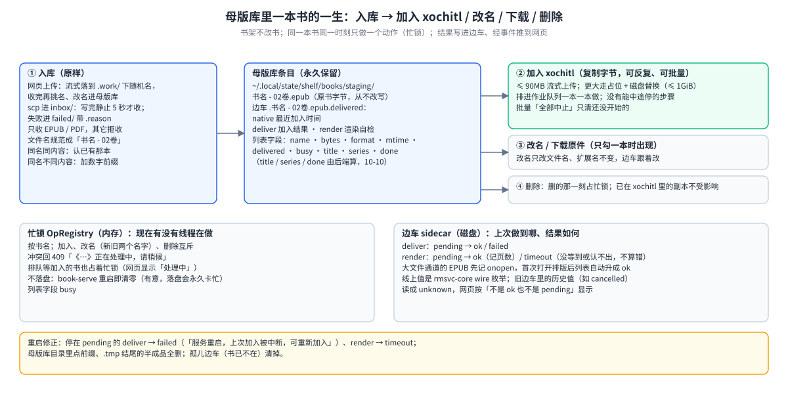

- **下载原件** `GET /staging/file?name=`：book-serve 边读边发（`Reply::sized_stream`，带 `Content-Length`），网关见到 `Content-Disposition` 也流式转发，整条链不把书读进内存。早先一版走 SSE 的裸 socket 通道、读完不关连接，浏览器一直转圈（`b1856b3` 修）。
- **改名** `POST /staging/rename {name,newName}`：只改文件名，扩展名不变（不带扩展名沿用原扩展名；带了别的扩展名只当名字的一部分）；新名已存在、或新旧任一名字正在处理中则拒绝；边车跟着改名。**不改书内书名/作者**，xochitl 显示的书名仍取书内元数据。
- **原 PDF 备份**：PDF 转 EPUB 成功后原 PDF 同分区 rename 进 `staging/.pdf-originals/`（此前直接删除、删了找不回）。按挪入时的 ctime 算 7 天（`PDF_ORIGINALS_KEEP_SECS`），启动时与每次新备份时清过期。`GET /staging` 的 `originals` 字段列出它们（名字、大小、备份时间、到期时间）；`POST /staging/originals/restore` 挪回母版库（同名已在则拒绝），`POST /staging/originals/delete` 提前删除。网页在母版库页底部显示「原 PDF 备份」。

### 2.6 按书阅读方向（2026-09-25 加，2026-09-30 已移除）

**现状（2026-09-30 起）**：翻页方向只看书里自带的 OPF `<spine page-progression-direction>`。「优化」不改这个属性，原书写了什么产物就是什么（`bookconv::direction` 只剩读：`spine_direction` / `spine_direction_file`）。`GET /reading-direction/{uuid}`（`reading_direction.rs`，reader-page-turn.qmd 用）判从右往左＝书库里那份 EPUB 的 spine 写着 `rtl`，**或** uuid 在旧手动清单 `books/rtl-overrides.json` 里；这份清单现在**只读**，book-serve 不再写，已有条目照旧生效，要撤就手动删文件或删条目。旧边车里的 `direction` 字段照读、忽略。已删：`POST /staging/direction`、`Staging::set_direction`、列表的 `direction`/`directionStale`、`OptimizeOpts.page_direction`、只改 OPF 的轻量改写（`rewrite_direction_only` / `rewrite_direction_file` / `set_spine_direction`）、`ReadingDirection::set_override`、`staging/direction.rs`、网页按钮与徽章。用户用旧按钮设过方向的书：如果当时点过「优化」，方向已经写进 OPF，照样生效；已进清单的 uuid 继续生效；其余不做迁移。

**当时的设计（2026-09-25～09-29，留作历史）**：
- **设置**：`POST /staging/direction` → `Staging::set_direction` 只写边车 `direction`，不动书。PDF 拒绝。
- **判"待优化"**：`list()` 的探测缓存多读一次 OPF 的 spine 方向，与设置不一致 → `directionStale=true` 且 `optimized=false`。
- **优化**：`Staging::optimize` 读设置传 `OptimizeOpts.page_direction`；若书已是当前版本完整优化且只差方向，走 `rewrite_direction_only`：只改 OPF、其余条目原样拷贝 → 质量门 → `produce_then_replace`。
- **免重投同步**：边车有 `render.uuid` 时，`set_direction` 顺手 `ReadingDirection::set_override` 写进/移出 `rtl-overrides.json`；之后 `set_render` 认到新 uuid 也按设置同步。
- **真机状态**（2026-09-25）：完整优化写进 OPF `rtl`（《乱马》11/12 卷）、加入 xochitl 后自动把新 uuid 写进 `rtl-overrides.json`——走通过；轻量改 OPF 路径和 PDF 转来的 EPUB 没在真机上走过。

## 3｜EPUB 优化管线

> **大白话**：「优化」把一本书拆开、按 xochitl 的脾气改一遍（能调字号、有目录、图片不超屏、注释能跳），再打包回去；原文内容一个字不改。

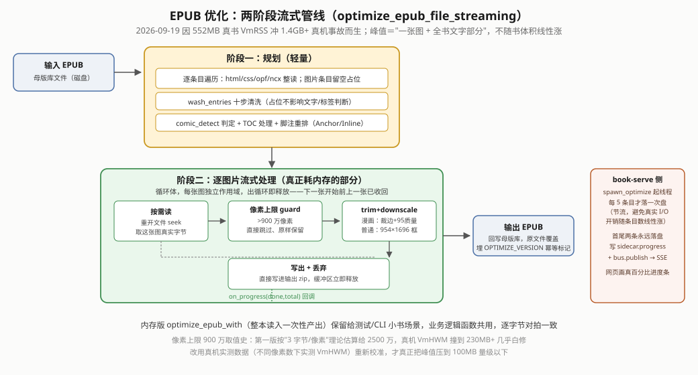

`bookconv::optimize` 两个入口，业务逻辑共用（`prepare_entries`、`transform_html_chapter`/`transform_image_bytes` 等），产出逐字节对拍一致：

- **`optimize_epub_with`**（内存版）：整本读入，给测试/CLI 小书用。
- **`StreamingOptimize`**（流式版，`book-serve` 生产入口；`new(in, out, opts).title(..).cancel(..).run(on_progress)`，旧 `optimize_epub_file_streaming*` 是薄封装）：因 2026-09-19 真实 552MB 书 `VmRSS` 冲 1.4GB+ 的 OOM 事故而生。
  - **阶段一（规划，轻量）**：只把非图片条目（html/css/opf/ncx）整读进内存，图片留空占位。顺序：`ensure_cover_declared` → `wash_entries`（§3.1）→ 漫画判定 → 第一遍 html（脚注注释块搬出）→（漫画且开页边距最小化时）文字页留边（§3.3）。
  - **阶段二（耗内存）**：逐图片流式处理，每张独立作用域——seek 取真实字节 → 像素 guard（§3.1）→ 裁边/降采样 → 直接写输出 zip → 释放；html 章节此时做第二遍变换（脚注重挂、远程图内联，`EntryXform`）。峰值＝"一张图 + 全书文字"，不随书体积涨。每条目检查取消标记（§7.1）。

`book-serve` 调用（`staging/optimizing.rs`）：产物先写隐藏的 `.<name>.optimizing.tmp`，成功才改名覆盖原文件（失败/取消清半成品）；选项固定 `wash=Some(默认)`、`FootnoteMode::Anchor`、页框按开关取 `Screen`/`MinMargin`（§3.3）；优化档位已砍。

**幂等标记**：产物埋 `META-INF/com.cangjie.optimized`＝`OPTIMIZE_VERSION`（当前 **`"15"`**）：`"15"`＝完整优化含清洗（显示「已优化」）/`"15-core"`＝只跑核心遍无清洗（网文/格式转换产物）/其它旧版本＝「旧版优化」/无标记＝未优化。改优化行为就要涨版本号；旧书重新优化须**从原始文件重跑**，别二次优化已优化产物（多一代 JPEG 有损）。v15 改的是漫画补白比例（§3.3），各版本见 `optimize/mod.rs` 注释。

### 3.1 引擎内部做了什么（摘要）

阶段一里的清洗（`wash_entries`：伪 DRM、空页、死引用、剥字体锁与背景图、外链 `cangjie-wash.css`、目录与 NCX 修复、双 id 折叠）、脚注（缺省 `Anchor`：注释移章末 + 同章锚点）、图片（文字书缩进 954×1696 竖框；漫画"解码一次→裁边→缩放→补白→编码一次"；>900 万像素原样跳过；2 个 worker 并行、同时处理像素 ≤600 万）——**做成什么样**见规范白皮书 §4，**函数与常量**见 bookconv 白皮书 §01–§06、§14。

### 3.2 质量门在流程里的位置

`book-serve` 在 `produce_then_replace` 里、临时文件写完之后、改名覆盖之前调 `check::check_epub_file`（只读骨架、不读图片字节，不把整本读进内存）；EPUB 优化、PDF 转 EPUB 两条路都过（2026-09-25～09-29 还有"只改阅读方向"一条，§2.6，已移除）。**不过门就返回错误、临时文件清掉、原文件不动**，回执写明原因。五条拦截规则与为什么见规范白皮书 §6，实现见 bookconv 白皮书 §08。落库后另有渲染自检（§2.3）兜"渲染出来页数不对"。

### 3.3 漫画页边距最小化（实验室开关 `comicMinMargin`，2026-09-21）

问题与真机诊断见 bookconv 白皮书 §20（此处只列代码现状）。要点：xochitl 的图片框由"栏宽（303pt − 2×页边距，缺省 56）"与"高度上限 462.1pt"先到者决定，比栏窄就贴左，留白约 20/23pt；改 `.content` 会被运行中的 xochitl 盖回（5 次仅成功 1 次），须让 xochitl 自己调 `EpubProperties.setMargins`。默认关。

| 环节 | 代码 | 行为 |
|---|---|---|
| 开关 | 网页「管理→实验室」写 `~/.local/share/cangjie-ime/reading-qol.json` 的 `comicMinMargin`（`comic_margins.rs::enabled()` 每次现读；缺文件/缺键/非布尔＝关） | 关：`EpubComicFrame::Screen`、不登记、`GET /margins/<uuid>` 恒 404 |
| 优化 | `MinMargin`：补白到 954×**1458**（比例 302.365:462.1，`EPUB_FRAME_ASPECT`，容差 0.3%），页边距 1（`EPUB_COMIC_MARGINS`；不选 0：贴边）；`comic_pad`：纯文字页 `<body>` 加类 `cj-tp`（左右 margin 17.8pt）、含图页去掉 `<body>` class（Calibre body 类会吃约 20pt）、图文混排页 `<p>/<h1-6>/div.cj-flush` 加 `cj-tx`（须写成 `p.cj-tx{…}` 带元素名才压得过书自带类规则） | 仅"整本判漫画且 MinMargin"；幂等 |
| 登记 | `Staging::comic_margin_eligible`：开关开 ∧ 标记版本＝当前 `OPTIMIZE_VERSION` ∧ `is_min_margin_comic_file` ∧ `is_min_margin_framed_file`（前 24 张整页图过半是 952×1457，或 2026-09-30 之前的 954×1458）→ `register_comic_margins(uuid)` 写 `comic-margins.json` | 小书在渲染自检认到 uuid 时登记；大文件通道替换后立即登记；按卷拆分（2026-09-30 已移除）当时不登记。**旧漫画必须重新优化**（旧页框在边距 1 下贴左） |
| 执行 | `shelf/xovi/shelf-comic-margins.qmd`（注入 DocumentView）：开书 1.5 秒后 `GET /margins/<uuid>`（404 不动；200 调 `setMargins(1)`），成功后 `POST /margins/applied` 销账 | **每本只设一次**，用户改回去不再干预；qmd 只在 xochitl 启动时加载，装/改后要**整机重启**（2026-09-25 起不再 `systemctl restart xochitl`，停 xochitl 本身会概率性崩） |

## 4｜设备端代理队列：为什么不能直接建文件夹/删文档

外部进程不能直接写 xochitl 的 `.metadata`（运行中的 xochitl 会覆写回来），唯一合法路径是让 xochitl 自己的 QML 去做（`Library.createCollection` 建文件夹、`LibraryController.moveEntriesToTrash` 删文档、`EpubProperties.setMargins` 设页边距）。`book-serve` 因此维护三个代理队列（`mkdir.rs`/`trash.rs`/`comic_margins.rs`，三者共用 `pending_queue::PendingQueue<T>`），由设备端注入的 qmd 拉取执行：

| 队列 | qmd（`shelf/xovi/`） | 触发 | 用途 |
|---|---|---|---|
| `mkdir-pending.json`：要建的文件夹名 | `shelf-mkdir-agent.qmd`（注入 MainView） | 长轮询 `GET /mkdir/pending?wait=290`（服务端阻塞到入队或到期，上限 300 秒；09-22 起长轮询、09-24 从 25 秒放宽，此前 8 秒 Timer 轮询；遇 30 秒客户端超时自动退回 25 秒）；每次唤醒书库文件夹名只扫一遍、队列空就不扫（09-24，此前每条待办各扫一遍全库） | 「加入 xochitl → 文件夹」填了不存在的名字；也可 `POST /mkdir/add` |
| `trash-pending.json`：要删的文档 uuid+name | `shelf-trash-agent.qmd`（注入 MainView，09-25 起） | 长轮询 `GET /trash/pending?wait=290`（同建文件夹代理；同一 uuid 交出后 30 秒内不重复交），先 `Library.entryForId(uuid)` 取条目、再取 `.id`（拿不到的 uuid 跳过），按 id 调 `LibraryController.moveEntriesToTrash(ids)`，与当前在看哪个文件夹无关（09-25 前注入 Sidebar、等书库视图变化、用当前文件夹选择集，网页入队后常常不执行） | 入队时按 visibleName 核对 uuid；现调用方是笔记线 `note-serve` 旧版本软删 |
| `comic-margins.json`：待设页边距的 uuid | `shelf-comic-margins.qmd`（注入 DocumentView） | 开书 1.5 秒后 `GET /margins/<uuid>` | §3.3 |
| （无队列，只读查询） | `reader-page-turn.qmd`（注入 DocumentView / DeviceSceneView / SceneViewGestures） | 开书 300 ms 后，开了「日漫翻页规则」才 `GET /reading-direction/<uuid>`（book-serve 按（大小, mtime）缓存结果，解 zip 时不持缓存锁） | xochitl 阅读器单击翻页与日漫翻页方向，见系统增强线白皮书 §03i |

`ensure_folder`（`staging/deliver.rs`）落库前最多等 20 秒（`FOLDER_WAIT_TIMEOUT`）让文件夹建出来，等不到不算错，退回 `upload_file` 的"找不到就落根"兜底。

**两条长轮询共用的交付规则**（`pending_queue::Handout`，2026-09-25 第四轮审计后，只在 host 测过）：

| 规则 | 现状 | 为什么改 |
|---|---|---|
| 什么时候回应 | 有该交的项立即回；否则睡到有人入队、`wait` 到期，**或最早一个"交出后静默期"到期** | 此前只等入队或 `wait` 到期：交出后没做成的那一项要等满 290 秒才重交，而落库只等建文件夹 20 秒，"静默期过了自带重试"名存实亡 |
| 静默期 | 同一项交出后，建文件夹 15 秒、回收站 30 秒内不重复交 | 代理执行需要时间，防止重复执行 |
| 重试上限 | 同一项最多交 5 次（`HANDOUT_MAX_ATTEMPTS`，约 1–2.5 分钟）；交满、静默期过了还没真实发生就放弃：移出持久队列、book-serve 记一行日志、记进 `agent-failures.json` 并发 `agent-failed` 事件（网页页头横幅），算进"清掉几条"让网页刷新；重新入队从零计 | 此前没有终止条件：xochitl 的 `entryForId` 拿不到条目但 `.metadata` 还在时，这一项每个静默期被交一次、代理每次失败写一行日志，永不停止 |
| 代理出错退避 | 两个 qmd 请求出错（book-serve 停了、重启中）时 15 → 30 → 60 → 120 秒封顶，成功一次复位（`property int cjErrs`） | 此前固定 15 秒，book-serve 长时间不在时每个代理每小时白醒 240 次 |

放弃时另记一条到 `$XDG_STATE_HOME/shelf/books/agent-failures.json`（只留最近 20 条，`GET /agent-failures`），发 `books` 事件 `agent-failed`；网页页头出一条横幅，列出哪本书没能进回收站、哪个文件夹没建出来，点「知道了」（`POST /agent-failures/clear`）清空（09-25 用户要求，host 与浏览器冒烟测过，未上真机）。`shelf-comic-margins.qmd` 同日也改了一处：`createObject` 出 `EpubProperties` 后立刻排好 5 秒后销毁，后面任何一步抛异常都不会让它一直挂着，出错时写一行 `CJ-COMIC-MARGIN: failed` 日志。三个 qmd 的改动只做了离线 `qmldiff apply-diffs` + `qmllint`（桩 QML，非真实 3.28 QML），未上真机。

## 5｜内存安全设计

> **大白话**：设备只有约 2GB 内存，几百 MB 的漫画书一不小心就把整机拖死。原则是"同一时刻内存里只放一张图 + 全书文字"，所有阈值都在真机上量过。

图示：[`diagrams/e-oom-guards.svg`](diagrams/e-oom-guards.svg)、[`diagrams/streaming-vs-inmemory.svg`](diagrams/streaming-vs-inmemory.svg)；排查过程见书架白皮书 §03ba（流式优化）、§03bh（落库路径）、§03bi（像素上限）。

| 风险点 | 修复前 | 修复方式 | 真机结果 |
|---|---|---|---|
| 整本优化（旧版） | 552MB 书 `VmRSS` 冲 1.4GB+ | 两阶段流式（§3） | 同书 `VmRSS` 全程 8-53MB |
| 超限漫画拆分（旧版；分卷 2026-09-30 已移除） | 785MB 书逼近系统内存上限 | `deliver_split_streaming`（§6.2），峰值≈单份 | 11 卷《镖人》全部投成 |
| 落库普通上传路径 | ≤90MB 书叠 3 份数据（整本读+自检整本解压+上传克隆），峰值 ~180-270MB | `rmsvc_core::xochitl::upload_file` 流式上传 + `stats::text_profile_file` 流式自检（跳过图片） | 80MB 测试书投递，`VmHWM` 全程 3484 kB（约 3.4MB） |
| 多本大书同时处理 | 忙锁只按书名，内存线性叠加（设备约 2GB，`MemoryMax` 不生效） | 网关并发/内存闸门（§7.2）：>90MB 大档同时 1 个、小档 3 个 | 见网关白皮书（闸门核心串行化未独立验证） |
| 图片并行 | worker 叠加大图内存 | `PixelBudget` ≤600 万像素 | `VmHWM` 47MB（串行 28MB） |
| 单图解码无像素上限 | 漫画页解码成位图，`VmHWM` 冲 262-271MB | `imgopt::MAX_DECODE_PIXELS`（§3.1），实测校准 | 25 页漫画含一页 1600 万像素，`VmHWM` 全程个位数 MB |
| 大文件通道 | xochitl 上传 100MB 硬限 | 占位 + 磁盘替换（§6.1），真文件本机 `fs::copy` | 不占 HTTP 内存；156.5MB 漫画首次打开约 74 秒渲染完，xochitl 主进程 `VmHWM` 410MB（2026-09-25） |
| 下载原件 | 上百 MB 的书整本读进 book-serve / 网关 | 两端都流式（§2.5） | 未专门量 `VmHWM` |
| PDF 解析 | 自引用的嵌套表单无限递归，栈溢出整进程崩 | `pdf-extract-cj` 限深 16 + 防环（2026-09-24） | 回归测试 `form_recursion`；真机无触发样本 |
| PDF 转 EPUB / 裁边 | 原始字节活到函数结束；pdf-extract-cj 另解析一遍；解压不设限 | lopdf 统一 0.45 只解析一遍、`load_pdf` 解析完即释放、各类流解压 ≤64MB（2026-09-24 第三轮审计，图见 bookconv 白皮书 §18） | host：139MB 扫描 PDF 转 EPUB 557→431MB、裁边判定 416→279MB；未上真机 |
| zip 条目声明大小 | 谎报 4GB 的条目被照单预分配，设备上 abort | `epubzip::read_all` 预分配封顶 32MB（2026-09-24） | host 单测 |

**`nativeUploadLimitMb` 缺省 90MB**（94,371,840 字节，§9）：xochitl `/upload` 硬上限经真机 `curl` 二分测得＝100,000,000 字节（此前配置的 150 是未验证的猜测；《镖人》一卷 ~96MB 反复 `Connection reset by peer`）。超过走占位通道（§6.1），走不了就整本拒绝（2026-09-30 前还会退回按卷拆分）。

**验证方法论**：读 `VmHWM`（比瞬时采样权威），真机合成接近临界值的文件、走完整 API 序列。第一版像素上限功能测试全过但没量 `VmHWM`，峰值几乎没降；裁边比例（15%→35%）、漫画 PDF 多层攒副本上又复现——**内存阈值别拍脑袋算，要真机实测**。

## 6｜超限书籍的落库：大文件通道（按卷拆分已移除）

> **大白话**：xochitl 网页上传最多约 100MB。更大的书先传一个几 KB 的"占位"书建好条目，再把真文件直接换进去；换不了就不加入（2026-09-30 起不再按卷拆）。

xochitl `/upload` 约 100MB 硬限（超了断连）。超过体积门时 `Staging::deliver` （决策树见 §2.3）：① **大文件占位通道**（§6.1，整本、EPUB/PDF 都行）→ 走不了（超过 1GiB、本机无书库目录、造不出占位）→ ② **整本拒绝**，回执“《书名》N MB 超过 xochitl 上传上限（90 MB），也走不了大文件通道（超过 1GB，或造不出占位文档），没有加入”。2026-09-30 前 ① 与 ② 之间还有一步**按卷拆分**（§6.2，已移除）。

### 6.1 大文件“占位 + 磁盘替换”通道（2026-09-20）

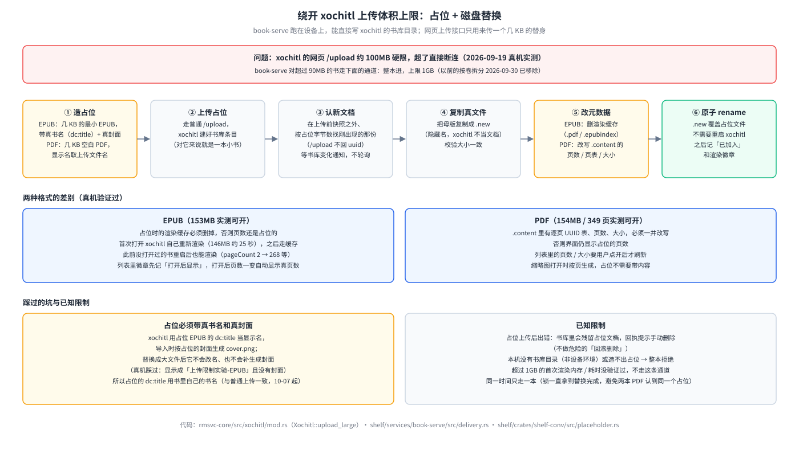

`try_deliver_direct`（`Xochitl::upload_large_file`）：造带真书名（`dc:title`，带卷标记用规范名）和真封面的占位（EPUB 几十到几百 KB；PDF 一页极小，单测断言 <4000 字节，`bookconv::placeholder`）→ 上传 → 等最多 20 秒、按**占位字节数**在书库认出新文档 → 母版真文件复制为 `<uuid>.<ext>.new`（0600，校验大小）→ EPUB 删渲染缓存（`.pdf`/`.epubindex`，首次打开约 25 秒重渲，146MB 实测）/PDF 改写 `.content`（`pageCount`/`originalPageCount`/`pages`/`redirectionPageMap`/`sizeInBytes`）→ 原子 rename 覆盖占位（无需重启 xochitl）→ `mark_delivered`；渲染记录 PDF 直接 `ok`、EPUB 记 `onopen`（之后读 `.content` 的 `pageCount` 显示真页数）；漫画符合 §3.3 时登记页边距。机制与真机数据见书架白皮书 §03bn。**>153MB 首次渲染**（2026-09-25 真机）：《乱马》11 卷 156.5MB 走这条通道投入，第一次打开约 74 秒渲染完、`pageCount` 2→349、写出 `.epubindex`，日漫翻页与页边距 1 同时生效；xochitl 主进程 `VmHWM` 410MB、没有重启（渲染在 xochitl 另起的工作进程里做，那个进程的峰值没量到）。

**整段串行**（2026-09-25，只在 host 测过）：认领只凭"刚进库 + 大小等于占位"，而 PDF 占位是同一份固定字节——两本大 PDF 同时投会认领到同一个 uuid，一本被写进别人的条目、另一份占位永远留在书库。现在 `upload_large_file` 在进程内用一把锁从"传占位"一直串到"替换完成"（替换前那份文件仍是占位大小，锁放早了后来者照样认错）；回归测试用"回应后才落盘"的假 xochitl 复现，去掉锁必挂。经网关走时闸门本来就只放 1 本 >90MB 的书（§7.2），这把锁是 book-serve 进程内的第二道保证（直连后端、闸门提前放行时仍然成立）。

**适用条件**：EPUB/PDF、≤ 1GiB（`MAX_DIRECT_BYTES`）、本机有书库目录、造占位成功；否则返回 `None`，调用方整本拒绝。**占位已上传后才出的错直接报错**（书库里可能留下半成品占位；分卷还在时这条规则是为了不再退回分卷、免得书库留重复内容）。**占位必须带真书名和真封面**：xochitl 用占位 `dc:title` 当显示名、导入时生成 `cover.png`，替换后不改名不补封面（真机踩过）。
⚠ 已知限制见 §10（占位上传后崩溃会残留占位文档，回执提示手动删，不做危险的回滚删除）。

### 6.2 超限漫画按卷拆分（回退路径，2026-09-30 已移除）

> **已移除**（2026-09-30 用户定）：`bookconv::comic_split`、`comic_pdf::deliver_split_pdf_streaming`、`util::safe_piece_filename`、`PdfFileReader::page_byte_span_len`、`comic-piece-extract`、book-serve 的 `try_deliver_split` / `try_deliver_split_pdf` / `deliver_pieces` / `PIECE_RENDER_TIMEOUT`、`AssembleOpts.rtl` 都已删掉（`imgs_referenced` / `ncx_titles_in_range` 两个解析函数挪进 `comic_pdf.rs`）。超限书现在只走 §6.1，走不了整本拒绝。以下是当时的设计，留作历史。

当时仅 6.1 不可用时走。EPUB 走 `bookconv::comic_split::deliver_split_streaming`，**带书签目录的自产漫画 PDF** 走 `comic_pdf::deliver_split_pdf_streaming`（用户自传无书签 PDF 不拆），共用 `Staging::deliver_pieces` 逐份上传外壳；设计与真机记录见书架白皮书 §03ax。要点：

1. **判定**：`is_comic` 才拆，否则整本拒绝；解不出 OPF/spine 是硬错误；无可用 `toc.ncx` 改按页数贪心切（`fixed_page_chunks_range_sized`）。
2. **规划**（`plan_pieces_sized`）：只按第一层 NCX 切（旧递归边界计算有过真机 panic）；**第一份从 spine 第 0 页算起**——NCX 第一条常常不指向封面、扉页、版权页，此前这些页不属于任何一份、拆分后从书里消失（2026-09-25）；某卷仍超预算按页贪心再切（标题 `卷名（j/n）`）；单页超预算切不动则放弃并计入“N 未投”。页里的 `` 先按百分号编码解码再对 zip 条目名（中文/空格文件名常写成 `%E5%9B%BE.jpg`，此前对不上，整页被当成"没有可用图片"丢掉）；NCX 标题里的 `&amp;`、`&#12288;` 这类字符引用先还原，分卷书名、文件名和目录里不再出现字面的 `&amp;`。带书签的漫画 PDF 走拆分时，指向不存在页的书签丢掉，书签对象号/`/Dest` 不像自产 PDF 的就整份判不可用、不拆（此前前者会让切片越界 panic、后者减法溢出）。
3. **逐份循环**：查取消标记（份间是安全中断点，§7.1）→ `build_piece`（按需重收图片、一张图一页、补目录、补外链 `comic.css`）→ `Xochitl::upload` → `render_check::probe` 等 xochitl 渲染出页数才传下一份（上限 90 秒 `PIECE_RENDER_TIMEOUT`，超时继续；真机《镖人》11 卷坐实紧挨着连传会冲垮 xochitl）→ 写 sidecar `{done,total}` + `bus.publish`（漏推事件曾致进度条冻结）。
4. 母版字节不动，拆分份只在内存、上传即弃，峰值≈一份；全未投上→报错，部分成功→回执“N 未投”。
5. 渲染自检与页边距登记对拆分份**都不做**（`RenderPlan` 按母版库条目名找书，拆分份无对应条目，硬接会认错书）。
6. 分卷文件名注意 255 字节上限（见 bookconv 白皮书 §17；`safe_piece_filename` 已随分卷删除）。

## 7｜异步任务与进度上报

> **大白话**：点按钮立即返回"已开始"，真正的活在后台跑，进度通过服务端推送实时刷到网页上，网页从不定时轮询。

`spawn_optimize`/`spawn_deliver` 模板：先做零耗时同步校验（格式/文件存在/忙锁），失败立即回 400 + 原因；通过才起后台线程、写初始 `pending`、返回"已开始"。

**进度节流**：`OPTIMIZE_PROGRESS_STRIDE = 5` + `OPTIMIZE_PROGRESS_MIN_GAP = 1s`——优化阶段二至少隔 5 条目且至少隔 1 秒才落盘/推事件（大漫画几百条目，逐条写有真实 I/O 开销；文字书条目处理极快，只按条目数时一秒能推十几条事件、网页每条都整页重拉），首尾必落。

**改名时的终态写入**：优化成功后条目可能改名（长名规范化；PDF 转同名 `.epub` 并删 `.pdf`），sidecar 按条目名找文件，故终态写入前先 `resolved_optimize_target` 探测改名、写到新名下；中途进度仍写旧名。

**刷新机制**：`rmsvc_core::events::EventBus`，`book-serve` 在状态变更点 `bus.publish("books", <kind>)`（`kind`：`staging`/`inbox`/`render`/`trash`/`mkdir`）；网关 `GET /api/events`（SSE；缺省 20s 心跳 `KEEPALIVE`，网页带 `?ka=60` 改为 60s，少唤醒设备）汇聚各服务事件并补 `svc` 字段，网关自己的批量/闸门变化也发 `books`（`batch`/`budget`）事件；浏览器按 `area` 找 tab，非前台记脏、切过去再刷，页面隐藏不刷、可见/重连后补刷。前台的母版库按事件来源决定重取多少（2026-09-25，只在 host 验证）：网关自己的 `batch`/`budget` 事件只取两个状态接口；book-serve 的 `staging` 事件（入库、忙态、优化/落库进度，大书处理时约每秒一条）再加母版库列表共 3 个，不重取 xochitl/KOReader 文件夹列表和 KOReader 安装状态；其余事件、切 tab、重连、操作后才全量取 6 个（此前每条 `staging` 事件都全量取 6 个）。三档走同一个 `coalesce`，取档位最大值，不会出现旧的全量结果盖掉新的排队状态。全站取数时机见网关白皮书 §5.1 的图。**前端没有任何定时轮询**（`app.js` 已无 `setInterval`）。

### 7.1 中途取消

`OpRegistry` 里每个操作可声明 `mark_cancellable`；`POST /staging/cancel {name}` 登记取消标记，回执三种：没在处理→400；在处理但这步不可取消→200 `cancelled:false`（“这一步无法中途停止”）；可取消→200 `cancelled:true`。EPUB 优化每条目检查（按卷拆分原先每份之间也检查，2026-09-30 已移除）；终态 `cancelled`（非 `failed`），原文件不变、无 `.optimizing.tmp` 残留；单文件上传与 PDF 优化无安全中断点。

### 7.2 批量队列与并发/内存闸门（都在网关，2026-09-20）

网关是后端服务与浏览器间的唯一转发关口，故这两件事放这里（`batch.rs`、`budget.rs`），机制见 [`gateway/docs/reMarkable网关白皮书.md`](../../gateway/docs/reMarkable网关白皮书.md) 与书架白皮书 §03bp：

- **批量队列**：`POST /api/batch {action, names | all:true, folder}`（`action`＝`optimize`/`deliver`/`koreader`，可混合），后台 worker **顺序逐本**；入队按"与界面按钮同一套资格条件"过滤，不适用计入 `skipped`。状态落盘 `state/batch.json`，网关重启 `resume` 续跑（最多等 `book-serve` 就绪 30 分钟；进行中那本放回队首重放，**同一本连续两次开始都没走完→记失败不再重放**，防崩溃循环）；`POST /api/batch/stop`＝全部中止；`GET /api/batch/status` 任何会话可看。
- **并发/内存闸门**：每一本（单点与批量共用）先 `admit`——>90MB 大档同时 1 个、≤90MB 小档同时 3 个（`LARGE_THRESHOLD_BYTES`/`MAX_SMALL_CONCURRENT`），排队最长 30 分钟（`ADMIT_WAIT_TIMEOUT`）、可取消（`POST /api/budget/cancel`）；同名书已在排队/处理中回 409。名额待该书在 `/staging` 不再 `busy` 才释放（上限 1 小时 `SETTLE_POLL_TIMEOUT`）。两档数字是保守经验值，非按内存精算。

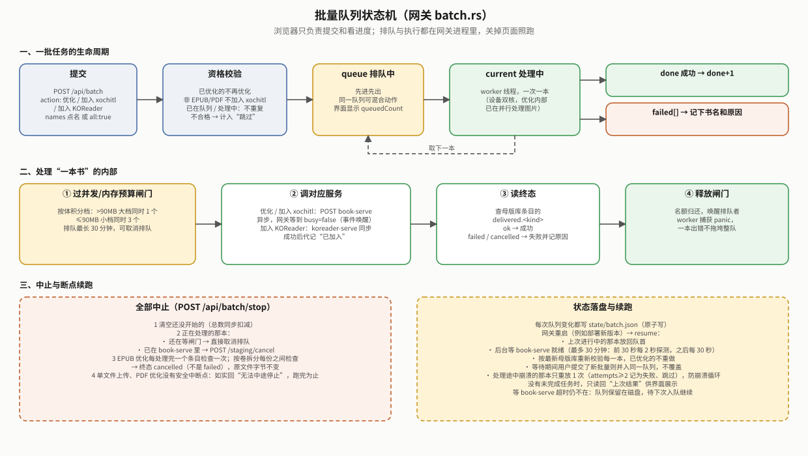

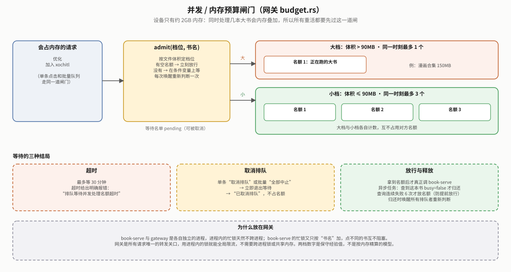

### 7.3 进程内的锁：谁和谁不能同时做（2026-09-25 第四轮审计后）

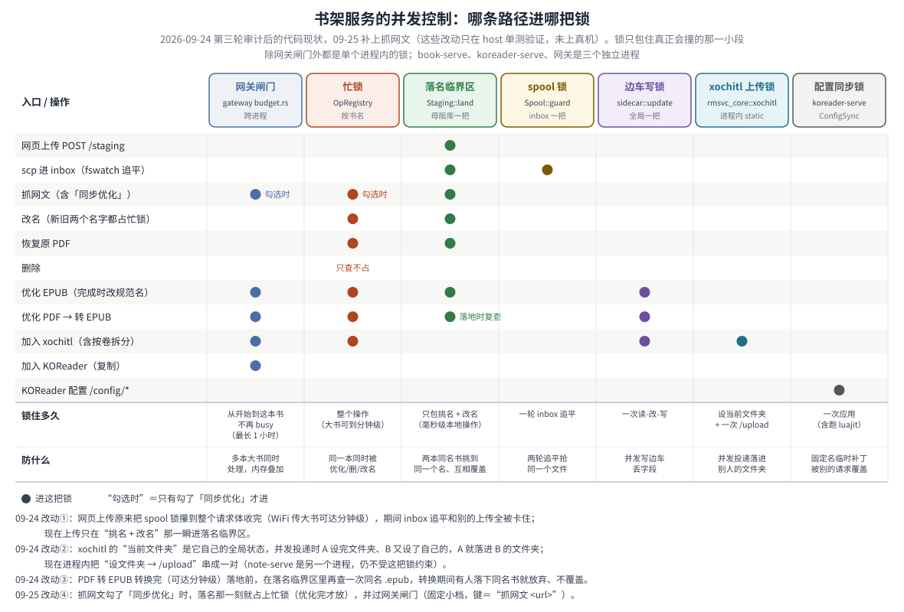

原则：**锁只包住真正会撞的那一小段**。跨服务的并发靠网关闸门（§7.2），其余都是单个进程内的锁：

| 锁 | 代码 | 谁进 | 锁多久 | 防什么 |
|---|---|---|---|---|
| 忙锁 | `ops.rs::OpRegistry`（按书名） | 优化、落库、改名（新旧两名）、恢复原 PDF、抓网文的「同步优化」（落名临界区里一挑中名字就占上，09-25）、删除（09-25 起占，此前只查不占） | 整个操作 | 同一本同时被优化/删除/改名 |
| 落名临界区 | `Staging::land`（`land_guard()`） | `stage_new`/`stage_from_path`（网页上传、inbox 追平、抓网文）、改名、恢复原 PDF、优化完成后改规范名 | 只包“`unique_path` 挑名 + rename/写入”，毫秒级；跨分区入库的拷贝在锁外做（09-25） | 两本同名书挑到同一个名、后到的覆盖先到的 |
| spool 锁 | `Spool::guard` | 只有 `process_inbox` 一轮追平 | 一轮 | 两轮追平抢同一文件 |
| 边车写锁 | `sidecar::update`（全局 static） | 所有边车读-改-写（进度、终态、渲染记录、落库标记） | 一次读改写 | 交错写丢字段 |
| xochitl 上传锁 | `rmsvc_core::xochitl`（进程内 static） | 每次 `GET /documents/<文件夹>` + `POST /upload` | 一次上传（当年按卷拆分等渲染的间隙不占；分卷已移除） | 并发投递落进别人的文件夹 |
| 大文件通道锁 | `Xochitl::upload_large_file`（进程内 static，09-25） | 超体积门走"占位 + 磁盘替换"的投递 | 传占位 → 认领 → 换成真文件 | 两本大 PDF 认领到同一个条目（§6.1） |
| 配置同步锁 | koreader-serve `ConfigSync::apply_with` | `/config/*` 读写 | 一次应用（含 luajit） | 固定名的临时补丁/合并脚本被别的请求覆盖 |

koreader-serve 落盘（加入 KOReader、字体/词典上传）不加锁，靠**半成品名唯一**：拷贝写到 `.<名字>.<进程号>.<序号>.part` 再改名（09-25；此前两次同名落盘共用 `.<名字>.part`，两个拷贝互相截断，改名出去的是一本坏书），拷贝失败也清掉半成品。

**09-24 前的两个真 bug**：网页上传把 spool 锁攥到整个请求体收完（WiFi 传大书可达分钟级），期间 inbox 追平与其他上传全卡住，而抓网文压根不拿锁——同名书仍可能互相覆盖；xochitl 的“当前文件夹”是它的全局状态，3 本小书并发投递会落错文件夹。两者都有 host 回归测试（`slow_upload_does_not_block_inbox_processing`、`concurrent_landing_of_same_name_never_clobbers`、`concurrent_uploads_land_in_their_own_folders`），已部署，并发场景没在真机专门触发过。

PDF 转 EPUB 转换前查一次“同名 `.epub` 已存在”，转换完（可达分钟级）落地前在落名临界区里**再查一次**，转换期间有人落下同名书就放弃这次转换、原 PDF 不动（第三轮审计当天补上，host 单测覆盖）。**抓网文的「同步优化」（2026-09-25 补，此前是已知缺口）**：book-serve 侧在落名临界区里挑中名字的同时占上忙锁（`Staging::stage_bytes(.., hold_busy=true)`），优化完（含失败、panic）才释放——书一出现在母版库就处于忙态，优化期间删除/改名/再优化/落库一律回“正在处理中”；网关侧 `proxy.rs` 把 `POST staging/fetch-article` 列为第四个限流操作，**只在 `optimize:true` 时**过闸门，固定小档，键是 `抓网文 <url>`（书名要抓完才知道），同步请求返回即归还名额（同“加入 KOReader”）。名额在抓取（联网下载）期间也占着，比“只锁优化那一段”略宽，换来不必把同步接口拆成“落地 + 再发一次异步优化”。两侧都有 host 回归测试（`fetch_article_sync_optimize_holds_busy_lock`、`fetch_article_with_optimize_holds_and_returns_a_slot`），**未上真机**。note-serve 是另一个进程，和 book-serve 同时投 xochitl 时上传锁管不到。

**09-25 第四轮审计补的三处**（host 回归测试覆盖，**未部署真机**）：删除占忙锁（`remove_holds_busy_lock_and_releases_it`）、大文件通道整段串行（`concurrent_large_pdf_uploads_claim_distinct_entries`）、跨分区入库锁外拷贝（`stage_from_path_across_filesystems_lands_atomically`，要 `/dev/shm` 与临时目录不在同一分区才真跑，否则跳过）。

## 8｜前端 UI 层（`gateway/ui/app.js`）

`renderTransfer` 渲染"传书"页：两个 subpanel——**入库**（上传卡+抓网文卡）、**母版库**。

**母版库页**（2026-09-20 重做，取舍见书架白皮书 §03bp）：
- **行内只显示**书名、类型、大小、状态徽章、进度；**仅处理中/排队时有“停止/取消排队”按钮**。徽章：格式 / 优化等级 / 落库记录（晚于母版 mtime 标"旧"）/ 渲染自检 / PDF 来源 / 处理中、失败或"被重启打断"（卡 `pending` 但 `busy=false`）。
- **操作统一在勾选后的底部操作栏**（2026-09-24 起按钮排成三行、每行一排绝不折行，按钮等高、带可处理数量角标，窄屏去掉"加入"前缀；无头 Chrome 量过 320–1024px）：优化 / 加入 xochitl / 加入 KOReader / 清除；第三行是**只勾一本时才有的「下载原件」「改名」**和删除（`confirmDialog()`）；按钮标"可处理数"，0 置灰；运行中变进度条 + 当前书 + 失败数 + **全部中止**；跑完显示小结。
- **阅读方向**（2026-09-25 加，**2026-09-30 已移除**，§2.6）：当时第三行在「删除」左边有「阅读方向」按钮，弹出三选一（自动 / 从右往左 / 从左往右，`choiceDialog()`），行内徽章「从右往左」/「从左往右」/「方向待优化」。按钮、徽章、`choiceDialog()` 与相关语言包条目现已删除，第三行回到「下载原件」「改名」和删除。
- **原 PDF 备份**：母版库页底部折叠面板列出 `.pdf-originals/` 里的文件与剩余天数，可「恢复」或删除（§2.5）。
- **加入位置**：xochitl 文件夹、KOReader 目录两个**常驻下拉**（可“＋新建”：xochitl 走 §4 mkdir 队列，KOReader 走 `POST /books/mkdir`）；搜书名带下拉建议（多卷合一条）；筛选带数量 + 格式过滤/"隐藏已完成"；真分页（25/50/100）；PC 与手机同一套单列，不横向溢出（量 `scrollWidth` 验证过 390/1280px）。
- **状态在服务器**：批量取自 `GET /api/batch/status`、闸门取自 `GET /api/budget/status`，前端不自己记"谁在忙"。进度由 `renderStepProgress()` 统一渲染：`{done,total}` 有数据画真百分比，没有画不确定态滚动条。
- **上传卡**（09-25 修，没有自动化断言，未上真机）：上传进行中禁用删行按钮、新拖入的文件只追加一行、不整表重画——此前重画会把正在传的那一项换成新节点，进度条和状态文字挂在旧节点上不再更新；非 JSON 应答显示"HTTP 状态码 + 说明"（走语言包）；登录过期回登录页后回到原页面，首登未改密跳改密页。底部栏批量按钮与「全部中止」加了防连点。

## 9｜配置与 API 一览

**`BookConfig`**（`$XDG_CONFIG_HOME/shelf/book.json`，camelCase；缺省可用，首启写出缺省文件；已退役的键如 `libraryFolder`/`annotFolder` 静默忽略）：

| JSON 键 | 缺省 | 说明 |
|---|---|---|
| `xochitlHost` | `10.11.99.1` | xochitl web 主机（`/upload`） |
| `uploadTimeoutSecs` | 300 | `/upload` 超时（超时但已送达判 `LikelyDelivered`，绝不重试） |
| `nativeUploadLimitMb` | 90 | 投原生体积门：≤ 普通上传，> 大文件占位通道（§5、§6.1）；0＝不拦 |

另有跨进程开关 `~/.local/share/cangjie-ime/reading-qol.json` 的 `comicMinMargin`（网关经 `PUT /api/enhance/qol` 写、book-serve 读）。

**`/api/books/*`**（网关代理到 `book-serve:8790`，代理层剥掉 `books` 段；直连后端去掉 `/api/books` 前缀）：

```
GET  /status                         状态（xochitl 可达性、体积门、inbox 计数、文件夹列表；3 秒缓存）
GET  /staging                        母版库列表 {items, freeBytes, originals}
POST /staging                        multipart 入库（逐文件；?srcName=&srcBytes= 历史遗留）
GET  /staging/file?name=             下载原件（流式，带 Content-Disposition）
POST /staging/rename {name, newName} 改名（扩展名不变、边车跟随；冲突或忙时 400）
POST /staging/originals/restore {name} · POST /staging/originals/delete {name}   原 PDF 备份恢复 / 删除
POST /staging/optimize {name}        异步优化（EPUB；PDF 转 EPUB / 仅裁边）
POST /staging/deliver {name, folder?} 异步落库（原生）
POST /staging/cancel {name}          中途停止（EPUB 优化支持）
POST /staging/mark {name, target}    标记已加入读器（native|koreader；批量 worker 补记）
POST /staging/fetch-article {url, optimize?}  抓网文
POST /staging/delete {name}          删除条目（忙时 400）
GET  /margins/{uuid} · POST /margins/applied {uuid}   漫画页边距待办（qmd 用；开关关时 GET 恒 404）
GET  /reading-direction/{uuid}                       → {rtl}：书库 <uuid>.epub 的 OPF spine 是否从右往左，或在旧手动清单 books/rtl-overrides.json 里（reader-page-turn.qmd 用；清单只读，2026-09-30 起 book-serve 不再写，§2.6）
（2026-09-30 已删：`POST /staging/direction` 按书阅读方向，§2.6）
GET  /events                         SSE 事件流
POST /trash/add · GET /trash/pending · GET /trash      原生回收站代理队列
POST /mkdir/add · GET /mkdir/pending[?wait=秒] · GET /mkdir   原生建文件夹代理队列（pending 支持长轮询）
GET  /agent-failures · POST /agent-failures/clear      两个代理交满次数放弃的记录（网页页头横幅，§4）
（2026-09-22 已删：`GET /inbox`、`POST /inbox/retry|delete`、`GET /staging/render/{uuid}`——无调用方；inbox 失败项重试=人工把 `failed/` 里的文件拷回 `inbox/`）
```

**`/api/koreader/*`**（koreader-serve:8791）：`GET /status` · `GET /events` · `GET /books[?folder=]` · `POST /books/adopt {name, folder?}`（从母版库**拷贝**，母版原地不动）· `POST /books/mkdir {folder}`（幂等）· `GET|POST /fonts` · `DELETE /fonts/{file}` · `GET|POST /dicts[?name=]`（上传暂存在 `$XDG_STATE_HOME/shelf/koreader-upload/`，与 KOReader 目录同在 /home 分区，装的时候直接改名进去；启动时清掉上次残留的 `.part`；09-25 前暂存在 tmpfs 的运行时目录，几十上百 MB 的词典先占一份内存、再拷一遍）· `GET|POST /config/{settings|defaults|gestures|directory|profiles}[?dry_run=1]`（后两个 2026-09-24 加，用法见 `../koreader/README.md`）· 只读导出 `GET /annotations`（每本书的高亮）· `GET /vocabulary`（生词本），供笔记线拉取。

**`/api/fonts/*`**（font-serve:8792）：`GET /` · `POST /` · `DELETE /{family}` · `PUT /config {emboldenCjkFallback}` · `GET /status`。
**`/api/wallpapers/*`**（wallpaper-serve:8793）：`GET /` · `POST /[?activate=1]` · `PUT /current {name}` · `PUT /mode {mode}` · `DELETE /{name}` · `GET /{name}` · `GET /status`。

**网关自有端点**：`GET /api/services` · `GET /api/manage` · `GET /api/foundation` · `POST /api/manage/{seg}/{start|stop|uninstall}` · `GET /api/session` · `GET /api/events`（SSE 汇聚）· 批量 `POST /api/batch` · `GET /api/batch/status` · `POST /api/batch/stop` · 闸门 `GET /api/budget/status` · `POST /api/budget/cancel` · 系统增强 `GET /api/enhance/status`（2026-09-24 起每项带 `loaded`：扩展是否真的载入了 xochitl）· `PUT /api/enhance/qol` · `POST /api/enhance/battop/{start|stop}` · `GET /api/enhance/battop/summary` · `GET /ui/locales/{lang}` · `/login` `/logout` `/password` `/ca.crt`。笔记线 API 见 `../../notes/README.md`。

上传回执统一 `{ok, items:[{name, ok, message, item?}], …}`（`rmsvc_core::asset::receipt`），成功项的 `name` 是落地名。上传暂存位置：书进 `books/.work/`（与母版库同分区）；xochitl 字体、壁纸进 `$XDG_STATE_HOME/shelf/upload/`（09-25 从 tmpfs 的 `$XDG_RUNTIME_DIR/shelf/upload` 挪来，同在 /home，字体安装直接改名；壁纸要转成 PNG，照旧写新文件）；KOReader 字体/词典见上。三处都在服务启动时清掉上次中途被杀留下的 `.part`。

**请求约定**（`rmsvc-core`，2026-09-24 起）：JSON 请求体与 KOReader 配置补丁上限 1MB，超了回 400“请求体超过 1024 KB 上限”（此前静默截断成半截再解析，报一句莫名的 JSON 错）；路径参数（如 `/margins/{uuid}`、`DELETE /fonts/{file}`）与上传的 `filename*=` 解码时 `+` 就是 `+`，只有查询串按表单语义把 `+` 当空格；投 xochitl 时文件名里的 `"` 换成 `'`、换行换成空格。multipart 头参数按引号切分（09-25）：`filename="甲; 乙.epub"` 此前被 `split(';')` 切成 `甲`、丢了扩展名、被当成不支持的格式拒收。

## 10｜已知限制（如实记录，不是遗漏）

- 网关代理对 ≤256KB 且不是下载的应答、以及没有 `Content-Length` 的应答仍整体缓冲（§1）；它们都是小 JSON，不改。
- 并发控制（§7.3）：抓网文的「同步优化」不占忙锁、不过闸门的缺口已于 09-25 补上（忙锁 + 网关小档名额，仅 host 单测）；剩下的已知边界是 note-serve 与 book-serve 同时投 xochitl 时上传锁管不到。（PDF 转 EPUB 落地前复查同名书已于 09-24 补上。）
- `shelf-mkdir-agent.qmd` 长轮询 09-24 放宽到 290 秒（依据：设备 Qt 6.10 的 QML XHR 不设传输超时，源码核实）；部署后确认 journal 里没有 `SHELF-MKDIR: transfer timeout`（有就说明退回了 25 秒）。
- inbox 只判"还在不在写"（修改时间静止 5 秒），不校验内容完整：scp 中途断开留下的半截文件静止后仍可能被收进母版库（§2.1）。
- 大文件占位通道：占位上传后进程崩溃会残留占位文档（回执提示手动删）。（>153MB 首次渲染与批量“加入 xochitl / KOReader”已于 2026-09-25 真机走通：两本 156.5/157.1MB 的《乱马》经网关队列 `done 2 / failed 0` 落进同一文件夹。）
- 入库 PDF 转 EPUB：公式裁图没有真机样本；公式区域按整行字符包围盒算，公式文字碎片会同时留在正文里（不丢字，但观感不如只留图）；竖排/多栏 PDF 未验证。
- `imgopt` 对 >900 万像素原图直接跳过（完全不处理，非压画质），这类图原样出现在优化后的书里，拿不到体积收益。
- **漫画页边距最小化**：旧漫画（或开关关着时优化的）必须重新优化才生效；qmd 只在 xochitl 启动时加载（§3.3）。
- **翻页方向**（§2.6）：只认书里自带的 OPF 标记和旧 `rtl-overrides.json`；书里没写 `rtl` 的日漫（calibre 转出的多半如此）现在没有网页入口补，只能手改清单或自己改书。
- **超限书**：超过 1GiB、或造不出占位文档时整本拒绝，只能自行把书分成多份再上传（按卷拆分 2026-09-30 已移除，§6.2）。
- **2026-09-30 三项改动**（撤按书方向、移除分卷、漫画预放大页 q95）只在 host 测过，未部署、未真机验证。
