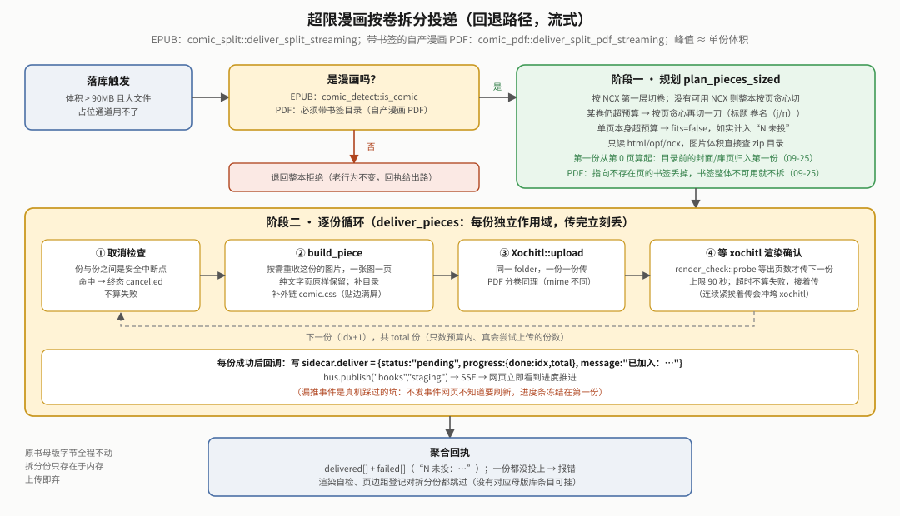

# 传书模块 EPUB 线架构文档

> **当前状态参考文档**，不是会话日志；历史叙事与真机排查在 [`reMarkable书架白皮书.md`](reMarkable书架白皮书.md) 和 [`bookconv优化白皮书.md`](bookconv优化白皮书.md)。本文只回答：**传书模块的 EPUB 线现在长什么样**。
>
> **写作时点**：2026-09-19 首写；09-20 刷新；2026-09-22 按当前代码逐字段复核（基线 `OPTIMIZE_VERSION`＝`"15"`，`shelf/crates/bookconv/src/optimize/mod.rs`），补入漫画页边距最小化（§3.5）。
>
> **读法**：先看 §1 架构图、§2 数据流，再按需读 §3、§5、§6、§7；首次接触项目先读 [`../../docs/OVERVIEW.md`](../../docs/OVERVIEW.md)。"真机验证"字样沿用原文记录，本次复核只对照源码、没连设备。

## 0｜这是什么

"传书"是书架（shelf）里"把书弄到设备上并保证质量过得去"的统称。EPUB 线是其中处理 EPUB 的完整链路——EPUB 是唯一被**深度处理**（清洗排版、目录重建、图片降采样、漫画识别与拆分）的格式；PDF 走同一套入库/落库，「优化」由 `bookconv::pdf_ingest` 单独处理（§2.4）。书架只收 EPUB/PDF，其它格式一律拒收（`rmsvc_core::formats`）。

**核心设计**：三层（内容源 → 母版库 → 读器）、三个正交动作（入库 / 优化 / 落库）。"正交"＝互不耦合：入库不需优化，优化后可不落库，落库前不强制优化。母版库是唯一容器，网页没有"跳过母版库直接投读器"的路径。


### 0.1 术语小抄

| 词 | 一句话 |
|---|---|
| xochitl | reMarkable 官方阅读器/UI 进程；本项目不改它本体 |
| 母版库 | 设备上永久保存原书的暂存池（`staging/`）；落库＝把书**复制**给读器（xochitl 或 KOReader），母版字节不动 |
| sidecar | 母版库每本书旁的隐藏 JSON `.<书名>.delivered`，记优化/落库/渲染自检结果 |
| qmd | 对 xochitl QML 的补丁（qmldiff 格式），让"xochitl 自己"做外部进程做不了的事 |
| SSE / `VmHWM` | 服务端事件推送（网页不轮询）/ 进程内存峰值（`/proc/<pid>/status`，判断内存问题的权威数字） |

## 1｜整体架构


网关和两个领域服务**都跑在设备上**（systemd 单元见 `shelf/systemd/`、`gateway/systemd/`，二进制在 `/home/root/.local/bin`），所以 `book-serve` 能直接读写 xochitl 书库目录：

| 组件 | 角色 | 端口/连接 |
|---|---|---|
| `gateway` | 唯一 Web 前端：网页 UI + 反向代理 + **批量队列（`batch.rs`）+ 并发/内存闸门（`budget.rs`）** + SSE 汇聚 | `0.0.0.0:443`（HTTPS，登录墙） |
| `book-serve` | 母版库领域服务：入库/优化/落库 | `127.0.0.1:8790`（只经网关访问） |
| `bookconv` | **库，不是服务**，被 `book-serve` 进程内调用 | 无网络面 |
| `koreader-serve` | 落 KOReader 的领域服务（另含字体/词典/配置同步） | `127.0.0.1:8791` |

**`bookconv` 不拆独立服务**（评估后否决）：库边界本已干净，拆服务唯一好处是进程隔离，代价是几百 MB 大文件跨进程序列化（峰值内存可能不降反升）；且设备 cgroup `MemoryMax` 从未真正生效（单元写了 `MemoryMax=192M`，但 systemd 没把 memory 控制器代理进 `system.slice` 子树），隔离想要的内存兜底本来就是假的。

**网关代理**（`gateway/src/proxy.rs`）：`/api/{svc}/*` 按 URL 段（`books`→`book-serve`、`koreader`→`koreader-serve`，表在 `gateway/src/manage.rs`）转发到 loopback。**请求体真流式**（大文件上传不占网关内存）；**响应体整体缓冲再回发**（`read_to_end`，未改，见 §10）。"优化 / 加入 xochitl / 加入 KOReader"三个 POST 会额外读一次小 JSON 并过并发闸门（§7.2）。

**`book-serve` → `xochitl` 直连，不经网关**：`Staging::deliver()` 用 `rmsvc_core::xochitl::Xochitl` 连 `10.11.99.1:80`（USB 网口地址，配置键 `xochitlHost`）的 `/upload`，大文件通道还直接读写书库目录。与"浏览器 → 网关 → book-serve"是两条独立的边，别混成一条。

## 2｜三层数据流


### 2.1 入库（内容源 → 母版库）

三条入口，都是**原样入库，不做格式转换**：
- **网页上传**：`uploader()`（`gateway/ui/app.js`）逐文件 XHR 真实进度；传 `dedupeApi` 按 `name|bytes` 去重（免落成 `xxx_1.epub`）。服务端 `rmsvc_core::multipart` 流式解析边读边落盘（暂存 `.work/`，rename 入库）。
- **抓网文**：`Staging::fetch_article`，Readability 提取正文后用 `bookconv::epub` 组装最小合规 EPUB3；可选"同步优化"（缺省勾选；网文无 CSS，不优化会按默认段距留大片空白）。
- **scp 进设备 `inbox/`**：`book-serve` 启动时扫一遍、之后 `fswatch` 监听（8 秒防抖）自动追平（§2.2）。

非 EPUB/PDF 回执"不是书籍格式，母版库只收 .epub .pdf"（电脑端命令行 2026-09-18 已整体砍除）。

**书名规范化**（`bookconv::naming`）：入库直接用规范名 `书名 - 02卷`（去掉下载站 `-- 作者 -- … -- hash` 尾巴与 `[完]`；无卷标记原样；幂等）；撞名加数字前缀不覆盖（`unique_path`）；已有长名在「优化」完成时改名（边车一并移动，目标已存在则保持原名）；EPUB 优化还把 OPF `dc:title` 改成规范名（仅带卷标记的书），使设备显示名与文件名一致。

### 2.2 母版库（中间层暂存池）

目录 `$XDG_STATE_HOME/shelf/books/`（设备上 `~/.local/state/shelf/books/`，/home 分区，重启/OTA 不丢）：

| 路径 | 作用 |
|---|---|
| `staging/` | 母版库本体，条目**永久保留**，落库不自动删、不套 LRU（可反复投两读器对照） |
| `inbox/` → `.work/` → `staging/` 或 `failed/` | `spool.rs` 追平队列：`inbox/` 待处理 → `.work/` 处理中（兼上传暂存）；`failed/` 封顶 50MB，带 `<name>.reason`，可重试/删 |
| `mkdir-pending.json` / `trash-pending.json` / `comic-margins.json` | 设备端代理队列（§4） |

`Staging`（`book-serve/src/staging/mod.rs`；动作分在 `intake.rs`/`optimizing.rs`/`deliver.rs`/`library.rs` 各自的 `impl Staging`）核心字段：`dir`；`xochitl: Arc<Xochitl>`；`native_limit: u64`（体积门，字节，§5）；`ops: OpRegistry`（`ops.rs`，**进程内存态**登记簿，忙锁+取消标记合在一把锁的 `HashMap<条目, OpState{cancellable, cancel}>`，不落盘，容忍 poison）；`probes`（"优化等级/是否 PDF 转来"判定缓存，按（大小, mtime）失效，因判定要开 zip）；`comic_margins`（页边距待办队列，§3.5）。

**忙锁 vs sidecar 是两套独立职责**：`ops` 答"现在有没有线程在跑"，重启即清零（有意，落盘会"永久卡忙"）；sidecar `status` 答"上次异步操作跑到哪/结果如何"。同一条目「优化」「落库」「删除」互斥（同一张 `OpRegistry`），冲突回 400 “《…》正在处理中，请稍候”。**重启修正**：崩溃/OOM/断电可能留 `pending`，启动时 `recover_interrupted` 改为 `failed`（优化/落库）/`timeout`（渲染自检）并清 `.optimizing.tmp`；`gc_orphan_sidecars` 清孤儿边车，新书落地前也清目标名旧边车。


**sidecar**（`sidecar.rs`，字段全可缺省，旧记录照读）＝`Delivered { optimize: Option<OptimizeCheck>, deliver: Option<DeliverCheck>, native: Option<u64>（最近投原生时间戳）, koreader: Option<u64>, render: Option<RenderCheck{uuid,pages,expected,status,at}>（§2.3）, source（历史遗留，网页不再写） }`；`OptimizeCheck`/`DeliverCheck` 均为 `{status, message, at, progress: Option<StepProgress{done,total}>}`。

| 字段 | `status` 取值 |
|---|---|
| `optimize` / `deliver` | `pending`（可带 `progress`）→ `ok` / `failed` / `cancelled`（用户取消，不算失败） |
| `render` | `pending` → `ok` / `warn`（页数远低于期望）/ `timeout`（没等到，不算错）；大文件通道的 EPUB 另有 `onopen`（首次打开才渲染） |

两者形状一致但**故意不合并成泛型**。`StepProgress`：优化＝已写条目/总条目；按卷拆分落库＝已成功份数/总份数。

### 2.3 落库（母版库 → 读器）

两个读器互不依赖，同一份母版可分别投给两边。决策树（体积门、占位通道、按卷拆分、拒绝的先后顺序）：


- **加入 xochitl**：`Staging::deliver()`，纯复制字节（不再优化）。`folder` 留空＝书库根（与 KOReader 语义对齐）；文件夹不存在经 `MkdirQueue` 让设备端 QML 代理建（§4）。超体积门（`nativeUploadLimitMb`，默认 90MB）→ **优先走“占位 + 磁盘替换”大文件通道**（§6.1）；本机无书库目录或造占位失败才退回按卷拆分（§6.2）或拒绝。≤ 体积门走普通上传，`Xochitl::upload_file` 流式发送（§5）。
  走普通上传的 EPUB 另起**渲染自检**线程（`render_check::run`，不阻塞；大文件通道直接写渲染记录）：限时 10 分钟（`TIMEOUT`）轮询书库目录等 xochitl 渲染出页数，低于优化时统计的"期望页数"一半判 `warn`（`WARN_RATIO`＝0.5；真机标定：好书 0.86-0.99，整章渲染失败的坏书低至 0.34），写 sidecar `render` + 推 SSE。`/upload` 不回 uuid，认书靠"投书时刻后新出现的文档 + visibleName 相符者优先，否则取最新"（`render_check::pick`）。
- **加入 KOReader**：`koreader-serve` 的 `POST /books/adopt`，从母版库（共享目录）本地拷到 KOReader `books/`（可选子目录），不经 `bookconv`、不限体积/格式。无 book-serve 侧忙态（两独立进程），落库记录靠网关批量 worker 事后调 `POST /staging/mark {target:"koreader"}` 补记（§7.2）。

两个操作在 HTTP 层都是**异步**（`spawn_optimize`/`spawn_deliver`，共用外壳 `spawn_bg`：起线程 + `catch_unwind` + 解忙锁 + `bus.publish`）：立即回"已开始"，结果经 sidecar + SSE 呈现。

### 2.4 PDF 的「优化」（`bookconv::pdf_ingest`，2026-09-19）

母版库「优化」对 PDF 也生效，先由 `classify_pdf` 三分类：

| 类别 | 判据 | 处理 |
|---|---|---|
| 漫画 | ≥90% 的页被一张覆盖页面面积 ≥85% 的图占满（`COMIC_PAGE_RATIO`/`COMIC_IMAGE_AREA_RATIO`） | 只裁边，格式不变 |
| 无文字层 | 每页可提取字符 < 40（`MIN_CHARS_PER_PAGE`） | 只裁边，格式不变（有安全闸） |
| 有文字层 | 能提取出文字 | **转 EPUB**：图片/公式（按行/区域裁成图，纯 Rust `hayro` 光栅化）保留；TOC 优先书签，没有则按字号识别标题（`HEADING_SIZE_RATIO`＝1.2），再不行每 20 页分块（`FALLBACK_CHUNK_PAGES`）；成功后删原 `.pdf`，产出同名 `.epub` |

PDF 转出的 EPUB 有“来源”徽章（`looks_like_pdf_derived_epub`），直接报「已优化」；PDF 优化不可取消（§7.1）。流程图 [`diagrams/pdf-ingest-flow.svg`](diagrams/pdf-ingest-flow.svg)，细节见 bookconv 白皮书 §18。⚠ 合并部署后功能本身**没有经过真机端到端验证**（原文记录，未变）。

## 3｜EPUB 优化管线


`bookconv::optimize` 两个入口，业务逻辑共用（`prepare_entries`、`transform_html_chapter`/`transform_image_bytes` 等），产出逐字节对拍一致：

- **`optimize_epub_with`**（内存版）：整本读入，给测试/CLI 小书用。
- **`StreamingOptimize`**（流式版，`book-serve` 生产入口；`new(in, out, opts).title(..).cancel(..).run(on_progress)`，旧 `optimize_epub_file_streaming*` 是薄封装）：因 2026-09-19 真实 552MB 书 `VmRSS` 冲 1.4GB+ 的 OOM 事故而生。
  - **阶段一（规划，轻量）**：只把非图片条目（html/css/opf/ncx）整读进内存，图片留空占位。顺序：`ensure_cover_declared` → `wash_entries`（§3.1）→ 漫画判定 → 第一遍 html（脚注注释块搬出）→（漫画且开页边距最小化时）文字页留边（§3.5）。
  - **阶段二（耗内存）**：逐图片流式处理，每张独立作用域——seek 取真实字节 → 像素 guard（§3.3）→ 裁边/降采样 → 直接写输出 zip → 释放；html 章节此时做第二遍变换（脚注重挂、远程图内联，`EntryXform`）。峰值＝"一张图 + 全书文字"，不随书体积涨。每条目检查取消标记（§7.1）。

`book-serve` 调用（`staging/optimizing.rs`）：产物先写隐藏的 `.<name>.optimizing.tmp`，成功才改名覆盖原文件（失败/取消清半成品）；选项固定 `wash=Some(默认)`、`FootnoteMode::Anchor`、页框按开关取 `Screen`/`MinMargin`（§3.5）；优化档位已砍。

**幂等标记**：产物埋 `META-INF/com.cangjie.optimized`＝`OPTIMIZE_VERSION`（当前 **`"15"`**）：`"15"`＝完整优化含清洗（显示「已优化」）/`"15-core"`＝只跑核心遍无清洗（网文/格式转换产物）/其它旧版本＝「旧版优化」/无标记＝未优化。改优化行为就要涨版本号；旧书重新优化须**从原始文件重跑**，别二次优化已优化产物（多一代 JPEG 有损）。v15 改的是漫画补白比例（§3.5），各版本见 `optimize/mod.rs` 注释。

### 3.1 `wash_entries`：十步清洗（`bookconv::wash`，按代码顺序）

**清洗之前**先做 `ensure_cover_declared`：保证 OPF 同时有 `<meta name="cover">` 和 `properties="cover-image"` 且指向真实图片条目（真机对照：id 带点且只有 meta 取不到封面；须在清洗前，否则清洗会把只含 SVG 封面的 titlepage 当空页删掉）。表按 `wash/mod.rs::wash_entries` 当前顺序（「十步」为旧称）：

| # | 函数 | 作用 |
|---|---|---|
| 1-2 | `strip_pseudo_drm` / `remove_empty_pages` | 剥伪 DRM（真 DRM 报错拦截）/ 清空页 |
| 3 | `drop_dead_refs` | 删指向书内不存在文件的 ``（有实际替代文字的留）与死 `@font-face` `url()`（`local()` 保留）；在远程图内联之前 |
| 4 | 语言探测 + `wash_html` / `filter_css` | `LangMode::Auto` 按字符占比判 CJK/Latin；CJK 首行缩进 2em / Latin 1.2em，标题后首段不缩进；`inject_css_link` 每章加外链；`filter_css` 剥 `DEFAULT_FILTER_PROPS`＝`font-family/font-size/font/background-image/background`，**不剥 color/background-color/text-align**（2026-09-17 起保留原书颜色/加粗） |
| 5 | 写外链 `cangjie-wash.css` | **xochitl 只认外链 css，无视内联 `<style>`**——排版规则必须写外链；OPF manifest 补 item |
| 6 | `fix_ncx_manifest_id` | NCX 在 manifest 的 `id` 必须叫 `"ncx"`（xochitl 硬编码死查该字面量，反编译坐实） |
| 7 | `restructure_existing_toc_parts` | “第 X 部 编号 章名”扁平目录重建成两级 |
| 8 | `auto_toc` | 缺目录才建（`AutoToc::Off/IfMissing/Always`）：按 h1-h6，为空按 spine 兜底；数字≤99 的“标题+编号”拆两级；**纯图片书（漫画）按每 20 页生成“第 N–M 页”**（`page_chunk_toc`，2026-09-20 补） |
| 9-10 | `fix_ncx_uid` / `strip_ncx_doctype` | NCX `dtb:uid` 同步 OPF `dc:identifier`（不一致则目录面板无入口）/ 剥外部 DTD 引用（免联网卡住） |

### 3.2 脚注

`FootnoteMode` 只剩：`Anchor`（默认，注释移章末 + 锚点跳转 + 原生返回浮标延时 20s）、`Inline`（就地内联）。`book-serve` 固定 `Anchor`。历史 `ParagraphEnd` 已删（流式重排 EPUB 做不到"页底部定位"）。

### 3.3 图片处理（`bookconv::imgopt`）

三个解码入口（`downscale_into_q`/`trim_margins`/漫画单趟的 `decode_trim_comic`，另有 CBZ 专用 `dither_bilevel`）统一有像素上限 guard：**`MAX_DECODE_PIXELS = 9,000,000`**（约 3000×3000），超限图原样保留不处理。真机实测校准：第一版按“3 字节/像素”理论估算给 2500 万，真机撞 230-270MB 尖峰（解码 + `to_rgb8()` + resize 多份缓冲同时存活，开销是估算的 3-5 倍）；实测 `VmHWM`：400 万像素 62MB、870 万 97-109MB、1600 万 164MB、2500 万 230-236MB。

| 函数 | 用途 |
|---|---|
| `downscale_for_epub` | 普通 EPUB 内嵌图：竖向框 954×1696（宽绝不超 954，防行内横幅溢出，真机《飘》1696×630 坐实），只缩不放、达标不重编码 |
| `prepare_comic_page_for_epub` | **漫画 EPUB 单趟管线**（2026-09-20）：解码一次 → 裁边 → 等比放进 954×页高框**一次**缩放（缩小，或 JPEG 小图预放大，SIMD `fast_image_resize`）→ 白底补到目标页框比例 → 编码一次，灰度保持；取代旧三道串联（三代有损）。页框见 §3.5 |
| `trim_margins` | 四边纯色/近纯色留白裁边，容差 8（`TRIM_TOLERANCE`），单边最多裁 **35%**（`TRIM_MAX_FRACTION`；2026-09-19 由 15% 改，《镖人》抽样 43 页量出最大约 28.6%） |
| `downscale_for_device` / `dither_bilevel` | **不在 EPUB 管线里**：只被 `convert/cbz.rs` 与 CLI `cbz2pdf` 调用（CBZ 入库已砍） |

**图片并行**（`bookconv::imgpool`，2026-09-20）：按序读原图、交给 2 个 worker（`worker_count()` 取核数封顶 2）、按序写回 zip；`PixelBudget` 限同时处理总像素 ≤600 万（`PIXEL_BUDGET`，超大图独占）；图片 deflate 级别 1。设备上 350 页漫画 285s → 148s，产物与串行逐字节一致。

**漫画判定** `comic_detect::is_comic`：图 ≥20 张（`MIN_IMAGES`）且平均每图可见文字 <40 字（`TEXT_PER_IMAGE`）。

### 3.4 质量门（`bookconv::check`）

`check_epub`：硬失败——真 DRM、目录 href 命中率 <80%、单标签双 `id`（非法 XHTML，xochitl 整章白屏）；告警不拦——无 TOC、锚点丢失。⚠ **接线现状**：只有命令行二进制 `bookconv/src/bin/epub_optimize.rs` 调用；**`book-serve` 优化与落库流程没有调用质量门**。落库后把关是渲染自检（§2.3）；双 id 在清洗阶段直接修（`wash_html` 折叠重复 `id`）。

### 3.5 漫画页边距最小化（实验室开关 `comicMinMargin`，2026-09-21）

问题与真机诊断见 bookconv 白皮书 §20（此处只列代码现状）。要点：xochitl 的图片框由"栏宽（303pt − 2×页边距，缺省 56）"与"高度上限 462.1pt"先到者决定，比栏窄就贴左，留白约 20/23pt；改 `.content` 会被运行中的 xochitl 盖回（5 次仅成功 1 次），须让 xochitl 自己调 `EpubProperties.setMargins`。默认关。

| 环节 | 代码 | 行为 |
|---|---|---|
| 开关 | 网页「管理→实验室」写 `~/.local/share/cangjie-ime/reading-qol.json` 的 `comicMinMargin`（`comic_margins.rs::enabled()` 每次现读；缺文件/缺键/非布尔＝关） | 关：`EpubComicFrame::Screen`、不登记、`GET /margins/<uuid>` 恒 404 |
| 优化 | `MinMargin`：补白到 954×**1458**（比例 302.365:462.1，`EPUB_FRAME_ASPECT`，容差 0.3%），页边距 1（`EPUB_COMIC_MARGINS`；不选 0：贴边）；`comic_pad`：纯文字页 `<body>` 加类 `cj-tp`（左右 margin 17.8pt）、含图页去掉 `<body>` class（Calibre body 类会吃约 20pt）、图文混排页 `<p>/<h1-6>/div.cj-flush` 加 `cj-tx`（须写成 `p.cj-tx{…}` 带元素名才压得过书自带类规则） | 仅"整本判漫画且 MinMargin"；幂等 |
| 登记 | `Staging::comic_margin_eligible`：开关开 ∧ 标记版本＝当前 `OPTIMIZE_VERSION` ∧ `is_min_margin_comic_file` ∧ `is_min_margin_framed_file`（前 24 张整页图过半是 954×1458）→ `register_comic_margins(uuid)` 写 `comic-margins.json` | 小书在渲染自检认到 uuid 时登记；大文件通道替换后立即登记；按卷拆分不登记。**旧漫画必须重新优化**（旧页框在边距 1 下贴左） |
| 执行 | `shelf/xovi/shelf-comic-margins.qmd`（注入 DocumentView）：开书 1.5 秒后 `GET /margins/<uuid>`（404 不动；200 调 `setMargins(1)`），成功后 `POST /margins/applied` 销账 | **每本只设一次**，用户改回去不再干预；qmd 只在 xochitl 启动时加载，装/改后需重启 xochitl |

## 4｜设备端代理队列：为什么不能直接建文件夹/删文档

外部进程不能直接写 xochitl 的 `.metadata`（运行中的 xochitl 会覆写回来），唯一合法路径是 xochitl 自己的 QML（`Library.createCollection`/`selectionMoveToTrash`/`EpubProperties.setMargins`）。`book-serve` 因此维护三个代理队列（`mkdir.rs`/`trash.rs`/`comic_margins.rs`，前两者共用 `pending_queue::PendingQueue<T>`），由设备端注入的 qmd 拉取执行：

| 队列 | qmd（`shelf/xovi/`） | 触发 | 用途 |
|---|---|---|---|
| `mkdir-pending.json`：要建的文件夹名 | `shelf-mkdir-agent.qmd`（注入 MainView） | 8 秒 Timer 轮询 `GET /mkdir/pending` | 「加入 xochitl → 文件夹」填了不存在的名字；也可 `POST /mkdir/add` |
| `trash-pending.json`：要删的文档 uuid+name | `shelf-trash-agent.qmd`（注入 Sidebar） | **事件驱动**（当前文件夹模型 `rowsInserted`/`modelReset`，4 秒防抖）后 `GET /trash/pending`；有勾选时跳过防误删 | 入队时按 visibleName 核对 uuid；现调用方是笔记线 `note-serve` 旧版本软删 |
| `comic-margins.json`：待设页边距的 uuid | `shelf-comic-margins.qmd`（注入 DocumentView） | 开书 1.5 秒后 `GET /margins/<uuid>` | §3.5 |

`ensure_folder`（`staging/deliver.rs`）落库前最多等 20 秒（`FOLDER_WAIT_TIMEOUT`）让文件夹建出来，等不到不算错，退回 `upload_file` 的"找不到就落根"兜底。

## 5｜内存安全设计

图示：[`diagrams/e-oom-guards.svg`](diagrams/e-oom-guards.svg)、[`diagrams/streaming-vs-inmemory.svg`](diagrams/streaming-vs-inmemory.svg)；排查过程见书架白皮书 §03ba（流式优化）、§03bh（落库路径）、§03bi（像素上限）。

| 风险点 | 修复前 | 修复方式 | 真机结果 |
|---|---|---|---|
| 整本优化（旧版） | 552MB 书 `VmRSS` 冲 1.4GB+ | 两阶段流式（§3） | 同书 `VmRSS` 全程 8-53MB |
| 超限漫画拆分（旧版） | 785MB 书逼近系统内存上限 | `deliver_split_streaming`（§6.2），峰值≈单份 | 11 卷《镖人》全部投成 |
| 落库不拆分路径 | ≤90MB 书叠 3 份数据（整本读+自检整本解压+上传克隆），峰值 ~180-270MB | `rmsvc_core::xochitl::upload_file` 流式上传 + `stats::text_profile_file` 流式自检（跳过图片） | 80MB 测试书投递，`VmHWM` 全程 3484 kB（约 3.4MB 量级；书架白皮书 §03bh 原文误写"KB 数量级"） |
| 多本大书同时处理 | 忙锁只按书名，内存线性叠加（设备约 2GB，`MemoryMax` 不生效） | 网关并发/内存闸门（§7.2）：>90MB 大档同时 1 个、小档 3 个 | 见网关白皮书（闸门核心串行化未独立验证） |
| 图片并行 | worker 叠加大图内存 | `PixelBudget` ≤600 万像素 | `VmHWM` 47MB（串行 28MB） |
| 单图解码无像素上限 | 漫画页解码成位图，`VmHWM` 冲 262-271MB | `imgopt::MAX_DECODE_PIXELS`（§3.3），实测校准 | 25 页漫画含一页 1600 万像素，`VmHWM` 全程个位数 MB |
| 大文件通道 | xochitl 上传 100MB 硬限 | 占位 + 磁盘替换（§6.1），真文件本机 `fs::copy` | 不占 HTTP 内存；>153MB 首次渲染内存/耗时没验证（§10） |

**`nativeUploadLimitMb` 缺省 90MB**（94,371,840 字节，§9）：xochitl `/upload` 硬上限经真机 `curl` 二分测得＝100,000,000 字节（此前配置的 150 是未验证的猜测；《镖人》一卷 ~96MB 反复 `Connection reset by peer`）。超过走占位通道（§6.1），不可用才退回按卷拆分或拒绝。

**验证方法论**：读 `VmHWM`（比瞬时采样权威），真机合成接近临界值的文件、走完整 API 序列。第一版像素上限功能测试全过但没量 `VmHWM`，峰值几乎没降；裁边比例（15%→35%）、漫画 PDF 多层攒副本上又复现——**内存阈值别拍脑袋算，要真机实测**。

## 6｜超限书籍的落库：大文件通道与按卷拆分

xochitl `/upload` 约 100MB 硬限（超了断连）。超过体积门时 `Staging::deliver` 按序尝试（决策树见 §2.3）：① **大文件占位通道**（§6.1，优先，不分卷、EPUB/PDF 都行）→ ② **按卷拆分**（§6.2，回退，仅 ① 条件不满足/造占位失败）→ ③ **拒绝**（回执给出路：PDF 自行分割、非漫画 EPUB 改用 KOReader）。

### 6.1 大文件“占位 + 磁盘替换”通道（优先，2026-09-20）


`try_deliver_direct`（`Xochitl::upload_large_file`）：造带真书名（`dc:title`，带卷标记用规范名）和真封面的占位（EPUB 几十到几百 KB；PDF 一页极小，单测断言 <4000 字节，`bookconv::placeholder`）→ 上传 → 等最多 20 秒、按**占位字节数**在书库认出新文档 → 母版真文件复制为 `<uuid>.<ext>.new`（0600，校验大小）→ EPUB 删渲染缓存（`.pdf`/`.epubindex`，首次打开约 25 秒重渲，146MB 实测）/PDF 改写 `.content`（`pageCount`/`originalPageCount`/`pages`/`redirectionPageMap`/`sizeInBytes`）→ 原子 rename 覆盖占位（无需重启 xochitl）→ `mark_delivered`；渲染记录 PDF 直接 `ok`、EPUB 记 `onopen`（之后读 `.content` 的 `pageCount` 显示真页数）；漫画符合 §3.5 时登记页边距。机制与真机数据见书架白皮书 §03bn。

**适用条件**：EPUB/PDF、≤ 1GiB（`MAX_DIRECT_BYTES`）、本机有书库目录、造占位成功；否则返回 `None` 回退分卷。**占位已上传后才出的错直接报错、不再退回分卷**（否则书库留重复内容）。**占位必须带真书名和真封面**：xochitl 用占位 `dc:title` 当显示名、导入时生成 `cover.png`，替换后不改名不补封面（真机踩过）。
⚠ 已知限制见 §10（占位上传后崩溃会残留占位文档，回执提示手动删，不做危险的回滚删除）。

### 6.2 超限漫画按卷拆分（回退路径）



仅 6.1 不可用时走。EPUB 走 `bookconv::comic_split::deliver_split_streaming`，**带书签目录的自产漫画 PDF** 走 `comic_pdf::deliver_split_pdf_streaming`（用户自传无书签 PDF 不拆），共用 `Staging::deliver_pieces` 逐份上传外壳；设计与真机记录见书架白皮书 §03ax。要点：

1. **判定**：`is_comic` 才拆，否则整本拒绝；解不出 OPF/spine 是硬错误；无可用 `toc.ncx` 改按页数贪心切（`fixed_page_chunks_range_sized`）。
2. **规划**（`plan_pieces_sized`）：只按第一层 NCX 切（旧递归边界计算有过真机 panic）；某卷仍超预算按页贪心再切（标题 `卷名（j/n）`）；单页超预算切不动则放弃并计入“N 未投”。
3. **逐份循环**：查取消标记（份间是安全中断点，§7.1）→ `build_piece`（按需重收图片、一张图一页、补目录、补外链 `comic.css`）→ `Xochitl::upload` → `render_check::probe` 等 xochitl 渲染出页数才传下一份（上限 90 秒 `PIECE_RENDER_TIMEOUT`，超时继续；真机《镖人》11 卷坐实紧挨着连传会冲垮 xochitl）→ 写 sidecar `{done,total}` + `bus.publish`（漏推事件曾致进度条冻结）。
4. 母版字节不动，拆分份只在内存、上传即弃，峰值≈一份；全未投上→报错，部分成功→回执“N 未投”。
5. 渲染自检与页边距登记对拆分份**都不做**（`RenderPlan` 按母版库条目名找书，拆分份无对应条目，硬接会认错书）。
6. 分卷文件名注意 255 字节上限（见 bookconv 白皮书 §17）。

## 7｜异步任务与进度上报

`spawn_optimize`/`spawn_deliver` 模板：先做零耗时同步校验（格式/文件存在/忙锁），失败立即回 400 + 原因；通过才起后台线程、写初始 `pending`、返回"已开始"。

**进度节流**：`OPTIMIZE_PROGRESS_STRIDE = 5`——优化阶段二每 5 条目才落盘/推事件（大漫画几百条目，逐条写有真实 I/O 开销），首尾必落。

**改名时的终态写入**：优化成功后条目可能改名（长名规范化；PDF 转同名 `.epub` 并删 `.pdf`），sidecar 按条目名找文件，故终态写入前先 `resolved_optimize_target` 探测改名、写到新名下；中途进度仍写旧名。

**刷新机制**：`rmsvc_core::events::EventBus`，`book-serve` 在状态变更点 `bus.publish("books", <kind>)`（`kind`：`staging`/`inbox`/`render`/`trash`/`mkdir`）；网关 `GET /api/events`（SSE，20s 心跳 `KEEPALIVE`）汇聚各服务事件并补 `svc` 字段，网关自己的批量/闸门变化也发 `books`（`batch`/`budget`）事件；浏览器按 `area` 找 tab，前台立即 `refresh()`（`coalesce` 合并突发），非前台记脏、切过去再刷，页面隐藏不刷、可见/重连后补刷。**前端没有任何定时轮询**（`app.js` 已无 `setInterval`）。

### 7.1 中途取消

`OpRegistry` 里每个操作可声明 `mark_cancellable`；`POST /staging/cancel {name}` 登记取消标记，回执三种：没在处理→400；在处理但这步不可取消→200 `cancelled:false`（“这一步无法中途停止”）；可取消→200 `cancelled:true`。EPUB 优化每条目、按卷拆分每份之间检查；终态 `cancelled`（非 `failed`），原文件不变、无 `.optimizing.tmp` 残留；单文件上传与 PDF 优化无安全中断点。

### 7.2 批量队列与并发/内存闸门（都在网关，2026-09-20）

网关是后端服务与浏览器间的唯一转发关口，故这两件事放这里（`batch.rs`、`budget.rs`），机制见 [`gateway/docs/reMarkable网关白皮书.md`](../../gateway/docs/reMarkable网关白皮书.md) 与书架白皮书 §03bp：

- **批量队列**：`POST /api/batch {action, names | all:true, folder}`（`action`＝`optimize`/`deliver`/`koreader`，可混合），后台 worker **顺序逐本**；入队按"与界面按钮同一套资格条件"过滤，不适用计入 `skipped`。状态落盘 `state/batch.json`，网关重启 `resume` 续跑（最多等 `book-serve` 就绪 30 分钟；进行中那本放回队首重放，**同一本连续两次开始都没走完→记失败不再重放**，防崩溃循环）；`POST /api/batch/stop`＝全部中止；`GET /api/batch/status` 任何会话可看。
- **并发/内存闸门**：每一本（单点与批量共用）先 `admit`——>90MB 大档同时 1 个、≤90MB 小档同时 3 个（`LARGE_THRESHOLD_BYTES`/`MAX_SMALL_CONCURRENT`），排队最长 30 分钟（`ADMIT_WAIT_TIMEOUT`）、可取消（`POST /api/budget/cancel`）；同名书已在排队/处理中回 409。名额待该书在 `/staging` 不再 `busy` 才释放（上限 1 小时 `SETTLE_POLL_TIMEOUT`）。两档数字是保守经验值，非按内存精算。


## 8｜前端 UI 层（`gateway/ui/app.js`）

`renderTransfer` 渲染"传书"页：两个 subpanel——**入库**（上传卡+抓网文卡）、**母版库**。

**母版库页**（2026-09-20 重做，取舍见书架白皮书 §03bp）：
- **行内只显示**书名、类型、大小、状态徽章、进度；**仅处理中/排队时有“停止/取消排队”按钮**。徽章：格式 / 优化等级 / 落库记录（晚于母版 mtime 标"旧"）/ 渲染自检 / PDF 来源 / 处理中、失败或"被重启打断"（卡 `pending` 但 `busy=false`）。
- **操作统一在勾选后的底部批量栏**：优化 / 加入 xochitl / 加入 KOReader / 删除（`confirmDialog()`）/ 清除；按钮标"可处理数"，0 置灰；运行中变进度条 + 当前书 + 失败数 + **全部中止**；跑完显示小结。
- **加入位置**：xochitl 文件夹、KOReader 目录两个**常驻下拉**（可“＋新建”：xochitl 走 §4 mkdir 队列，KOReader 走 `POST /books/mkdir`）；搜书名带下拉建议（多卷合一条）；筛选带数量 + 格式过滤/"隐藏已完成"；真分页（25/50/100）；PC 与手机同一套单列，不横向溢出（量 `scrollWidth` 验证过 390/1280px）。
- **状态在服务器**：批量取自 `GET /api/batch/status`、闸门取自 `GET /api/budget/status`；`localBusy` 是无调用方的遗留死代码。进度由 `renderStepProgress()` 统一渲染：`{done,total}` 有数据画真百分比，没有画不确定态滚动条。

## 9｜配置与 API 一览

**`BookConfig`**（`$XDG_CONFIG_HOME/shelf/book.json`，camelCase；缺省可用，首启写出缺省文件；已退役的键如 `libraryFolder`/`annotFolder` 静默忽略）：

| JSON 键 | 缺省 | 说明 |
|---|---|---|
| `xochitlHost` | `10.11.99.1` | xochitl web 主机（`/upload`） |
| `uploadTimeoutSecs` | 300 | `/upload` 超时（超时但已送达判 `LikelyDelivered`，绝不重试） |
| `nativeUploadLimitMb` | 90 | 投原生体积门：≤ 普通上传，> 大文件占位通道（§5、§6.1）；0＝不拦 |

另有跨进程开关 `~/.local/share/cangjie-ime/reading-qol.json` 的 `comicMinMargin`（网关经 `PUT /api/enhance/qol` 写、book-serve 读）。

**`/api/books/*`**（网关代理到 `book-serve:8790`，代理层剥掉 `books` 段；直连后端去掉 `/api/books` 前缀）：

```
GET  /status                         状态（xochitl 可达性、体积门、inbox 计数、文件夹列表；3 秒缓存）
GET  /staging                        母版库列表 {items, freeBytes}
POST /staging                        multipart 入库（逐文件；?srcName=&srcBytes= 历史遗留）
POST /staging/optimize {name}        异步优化（EPUB；PDF 转 EPUB / 仅裁边）
POST /staging/deliver {name, folder?} 异步落库（原生）
POST /staging/cancel {name}          中途停止（EPUB 优化 / 按卷拆分支持）
POST /staging/mark {name, target}    标记已加入读器（native|koreader；批量 worker 补记）
POST /staging/fetch-article {url, optimize?}  抓网文
GET  /staging/render/{uuid}          xochitl 渲染缓存 PDF（现无调用方）
POST /staging/delete {name}          删除条目（忙时 400）
GET  /margins/{uuid} · POST /margins/applied {uuid}   漫画页边距待办（qmd 用；开关关时 GET 恒 404）
GET  /events                         SSE 事件流
POST /trash/add · GET /trash/pending · GET /trash      原生回收站代理队列
POST /mkdir/add · GET /mkdir/pending · GET /mkdir      原生建文件夹代理队列
GET  /inbox · POST /inbox/retry · POST /inbox/delete   追平队列（scp 入口的失败重试/删除）
```

**`/api/koreader/*`**（koreader-serve:8791）：`GET /books`、`POST /books/adopt {name, folder?}`、`POST /books/mkdir {folder}`（幂等）；另有 `/fonts`、`/dicts`、`/config/{settings|defaults|gestures}[?dry_run=1]`、`/annotations`、`/vocabulary`，见 `shelf/README.md`。
**网关自有端点**：`POST /api/batch` · `GET /api/batch/status` · `POST /api/batch/stop` · `GET /api/budget/status` · `POST /api/budget/cancel`；开关 `GET /api/enhance/status` · `PUT /api/enhance/qol`。

## 10｜已知限制（如实记录，不是遗漏）

- 网关代理响应体非流式（整体缓冲，`proxy.rs::forward` 的 `read_to_end`），低优先级未修（头注释已如实订正）。
- 渲染自检对漫画拆分份不生效（§6.2 第 5 点）。
- 大文件占位通道：>153MB 首次渲染内存/耗时没验证；占位上传后崩溃会残留占位文档；批量“加入 xochitl / KOReader”无设备端到端实测。
- 入库 PDF 转 EPUB 未经真机端到端验证（§2.4）；公式区域按整行字符包围盒算，行内公式紧贴正文时两侧一两个单词可能被吞（`pdf_ingest` 头注已知局限）。
- `imgopt` 对 >900 万像素原图直接跳过（完全不处理，非压画质），这类图原样出现在优化后的书里，拿不到体积收益。
- 质量门 `bookconv::check` 没接进 `book-serve`（§3.4）。
- **漫画页边距最小化**：旧漫画（或开关关着时优化的）必须重新优化才生效；qmd 只在 xochitl 启动时加载；按卷拆分投递的漫画不登记（§3.5）。
- **超限 PDF 只有带书签的自产漫画 PDF 能按卷拆分**；用户自传的原生大 PDF 在占位通道（≤1GiB）之外只能自行分割（§6.2）。
