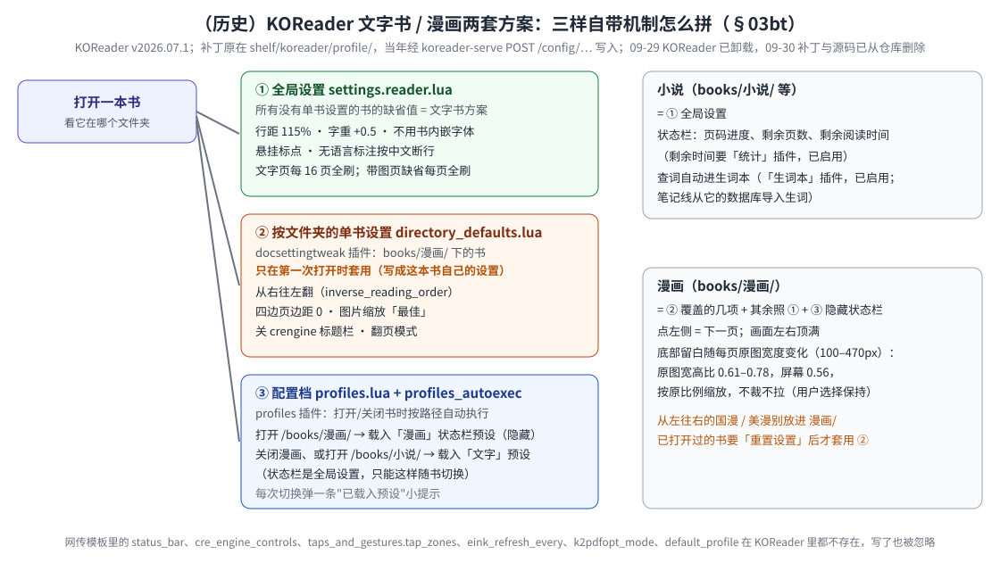

# KOReader 配置即代码

把设备上手改的 KOReader 调优固化成仓库文件，可 diff、可幂等恢复。（书从哪来：网页「传书 → 母版库」点「加入 KOReader」，
`koreader-serve` 从母版库纯复制到 `books/[目录]/`；本目录只管**配置补丁**。）

## 目录里有什么

| 文件 | 作用 |
|---|---|
| `profile/settings.reader.patch.lua` | 补丁：深合并进设备 `settings.reader.lua`（脚注、刷新波形、悬挂标点、状态栏等） |
| `profile/defaults.custom.lua` | 补丁：深合并进设备 `defaults.custom.lua` |
| `profile/gestures.patch.lua` | 补丁：深合并进设备 `settings/gestures.lua`（防误触、退出手势等） |
| `profile/directory_defaults.patch.lua` | 补丁：深合并进 `settings/directory_defaults.lua`——漫画方案的单书设置（`books/漫画/` 下新书首次打开时套用） |
| `profile/profiles.patch.lua` | 补丁：深合并进 `settings/profiles.lua`——「漫画」「文字」两个配置档（切状态栏预设） |
| `profile/fonts.txt` · `profile/dicts.txt` | 字体 / StarDict 词典**清单**（每行一个本机路径；数据本身不入库）。⚠ 2026-09-18 host `shelf` 命令行砍除后，**没有工具再自动读这两份清单**，它们只作"该装哪些字体/词典"的备忘；实际安装走网页「其他 → KOReader」上传（`POST /fonts`、`POST /dicts?name=`；上传先暂存在 `~/.local/state/shelf/koreader-upload/`，与 KOReader 目录同在 /home 分区，收完直接改名装入，2026-09-25 起不再占内存） |
| `merge.lua` | 合并器：被 `koreader-serve` 通过 `include_str!` 内嵌，设备端用 KOReader 自带 `luajit` 执行 |

补丁语义：标量覆盖、表递归、值为字符串 `"__DELETE__"` 删键。（2026-09-24 修：目标里原先没有的表整张落进去时，也会剔除其中的 `"__DELETE__"`，此前会被当普通值写进去。）

## 文字书 / 漫画两套方案（2026-09-24）

KOReader 没有"按书类型整套切换配置"的单一开关，靠三样自带机制拼出来，**键名全部按设备上 v2026.07.1 源码核过**
（网上流传的 `status_bar`、`cre_engine_controls`、`taps_and_gestures.tap_zones`、`eink_refresh_every`、`k2pdfopt_mode`、
`default_profile` 这类键在 KOReader 里并不存在，写进去会被忽略）：

| 层 | 机制 | 文字书 | 漫画 |
|---|---|---|---|
| 全局设置 `settings.reader.lua` | 所有没有单书设置的书的缺省值 | 本身就是文字书方案：行距 115%、字重 +0.5、不用书内嵌字体、悬挂标点、无语言标注时按中文断行、每 16 页全刷 | — |
| 按文件夹的单书设置 `directory_defaults.lua`（docsettingtweak 插件） | `books/漫画/` 下的书**第一次打开**时套用 | — | 从右往左翻页、四边页边距 0、图片缩放用「最佳」算法、关 crengine 标题栏 |
| 配置档 `profiles.lua` + `profiles_autoexec`（profiles 插件） | 打开/关闭书时按路径自动执行 | 打开 `books/小说/` 或关闭漫画时载入「文字」状态栏预设 | 打开 `books/漫画/` 时载入「漫画」预设：隐藏状态栏和进度条，画面用满整屏高度 |

**刷新**：带图片的页 KOReader 缺省就每页全刷（`refresh_on_pages_with_images` 缺省开），漫画不用另设；文字页每 16 页全刷。
**已知限制**：单书设置只对第一次打开的书生效，已经打开过的书要在书的菜单里「重置设置」后重开；漫画目录一律按从右往左，
从左往右的国漫/美漫放到 `漫画/` 之外，或打开后在菜单里关掉「反转翻页方向」；每次切换状态栏预设会弹一条"已载入预设"小提示。

**插件取舍**：启用「统计」（状态栏的剩余阅读时间靠它，原先禁用时一直显示 N/A）和「生词本」（查词自动入库，
`koreader-serve` 从它的数据库把生词导入笔记线）；新增禁用 hello、coverimage、keepalive、bookshortcuts、cloudstorage、
opds、kosync、timesync、autostandby、batterystat、hotkeys、externalkeyboard、archiveviewer（与本机用法无关）。保留的关键插件：
docsettingtweak、profiles、gestures、coverbrowser、autosuspend。

这套方案落在三份补丁里：`settings.reader.patch.lua`、`directory_defaults.patch.lua`、`profiles.patch.lua`，按下一节的接口依次写入
`settings`、`directory`、`profiles` 三个目标（后两个是 koreader-serve 2026-09-24 新增的）。2026-09-24 真机写入、用户确认两套方案都生效；
决策过程与真机反馈见 [`../docs/reMarkable书架白皮书.md`](../docs/reMarkable书架白皮书.md) §03bt。

## 怎么应用

**所有 Lua 处理都在设备端**，由 `koreader-serve`（`127.0.0.1:8791`，经网关为 `/api/koreader/…`）执行：
写前备份到 `~/.local/state/shelf/koreader-backups/<文件>.bak.pre-shelf-<时间戳>[-序号]`（补丁没带来改动时不留备份，每个文件只留最近 10 份），写后回读校验（读不回来自动还原；原来没有这个文件则删掉写坏的新文件）；
仓库里 5 份补丁逐个应用到空 KOReader 目录、二次应用零改动，有回归测试守着；
**KOReader 运行中拒写**（返回 409；它退出时会回写配置覆盖你的改动，必须先退出 KOReader；这条拒写真机尚未专门验证）。

| 接口 | 作用 |
|---|---|
| `GET /config/{settings\|defaults\|gestures\|directory\|profiles}` | 读设备上的当前原文 |
| `POST /config/{settings\|defaults\|gestures\|directory\|profiles}[?dry_run=1]` | body = 补丁 Lua 文本；`dry_run=1` 只返回将改的键（path/old/new），不写 |

例（在 host 上，经网关；网关需登录，这里的 cookie 是登录后浏览器/`curl -c` 拿到的）：
`curl -k -b cookie.txt --data-binary @shelf/koreader/profile/settings.reader.patch.lua 'https://shelf.local/api/koreader/config/settings?dry_run=1'`，看差异没问题再去掉 `dry_run=1` 重发。
**没有一键脚本、没有网页按钮**——2026-09-18 之前的 `shelf koreader pull/diff/sync` 命令行已随 host CLI 整体砍除（清单见 `../docs/reMarkable书架白皮书.md` 附录 B），需要时手工调上述接口，或在设备上直接改。

profile 各文件的键来自旧《阅读白皮书》§11.1b 与 2026-09-24 按设备源码的核对（该文档在 2026-09-11 整理时已挪出仓库）；补丁文件里标注"待核对"的值，应先 `GET /config/...` 看设备实况再定。

## KOReader 入口现状（2026-09-21，固件 3.28.0.172，appload 0.6.0）

KOReader 本体（v2026.07.1，官方支持 Move）与本目录 / koreader-serve 都正常。

- 启动入口是 appload（xochitl 侧栏里的外部应用启动器）。**appload ≥ 0.6.0 起原生支持 3.28**（上游 v0.6.0，2026-09-19 发布，另加 3.29 支持），2026-09-21 官方升级并真机验证（侧栏 KOReader/WeRead 入口点开正常）。
- 历史：0.5.3 在 3.28 上不兼容（其 qmd 钩了 3.28 已删的 `SidebarFilterItem`），2026-09-06 曾用 PR #59 的 qmd 等长回填进 `.so` 顶过；该回填补丁工具已删除，不再需要。
- 升级注意：`vellum upgrade appload` 后**直接整机重启**，别 `systemctl restart xochitl`——xochitl 退出时自身有概率崩溃（2026-09-25 查明与换不换文件无关），崩了会走应急路径整机重启。
- 已知变化：0.6.0 的实体键（左 / 主页 / 右）发 Qt 原始键码，KOReader 的 qtfb 输入层仍按 0/1/2 映射 → 实体键失效（Move 没有实体翻页键，只影响外接键盘）；未在真机上专门验证键码。
- KOReader 根目录仍是 `~/xovi/exthome/appload/koreader/`（可用环境变量 `SHELF_KOREADER_ROOT` 覆盖），书/字体/词典照常同步进去。详见书架白皮书 §03v。
